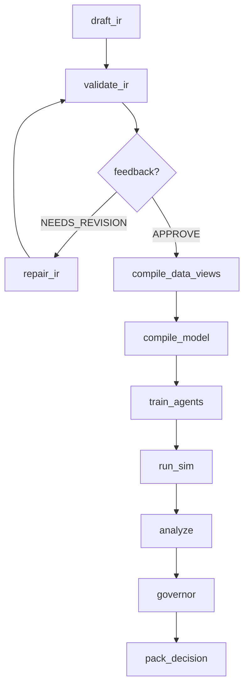

# PolisyOS — AI-Driven Policy Operating System

**PolisyOS** (Policy Engine) — операционная система для проектирования, валидации, калибровки и исполнения публично-политических интервенций как воспроизводимых вычислительных экспериментов. Система принимает запрос на естественном языке, формулирует политику через иерархию AI-агентов, компилирует её в дифференцируемую JAX-симуляцию, проводит governance-проверки и выдаёт пакет решений с полным provenance-следом.

**Architecture:** v2.5.0 · **Python:** >=3.11 · **License:** proprietary

---

## Содержание

- [Обзор архитектуры](#обзор-архитектуры)
- [Граф зависимостей](#граф-зависимостей)
- [Модули](#модули)
  - [Common — инфраструктурный фундамент](#common--инфраструктурный-фундамент)
  - [Core — фундаментальная инфраструктура](#core--фундаментальная-инфраструктура)
  - [IR — промежуточное представление](#ir--промежуточное-представление)
  - [Fabric — Unified Data Fabric](#fabric--unified-data-fabric)
  - [Foundry — JAX Execution Engine](#foundry--jax-execution-engine)
  - [Runtime — жизненный цикл прогонов](#runtime--жизненный-цикл-прогонов)
  - [Lex — юридический анализ](#lex--юридический-анализ)
  - [Scholar — обогащение знаний](#scholar--обогащение-знаний)
  - [Scientist — AI-оркестрация](#scientist--ai-оркестрация)
  - [Packs — компонентные пакеты](#packs--компонентные-пакеты)
- [Сквозные подсистемы](#сквозные-подсистемы)
- [Ключевые концепции](#ключевые-концепции)
- [Архитектурные инварианты (Laws)](#архитектурные-инварианты-laws)
- [Технологический стек](#технологический-стек)
- [Quickstart](#quickstart)
- [Тестирование](#тестирование)
- [Инструменты разработчика](#инструменты-разработчика)
- [Observability и Ops](#observability-и-ops)
- [Данные](#данные)
- [Документация](#документация)

---

## Обзор архитектуры

Система реализует компиляторную трубу от запроса на естественном языке до воспроизводимого пакета решений:

```
NL intent (пользовательский запрос)
  → Scientist (AI-агенты: PI → Drafter → Formalizer → Critic + governance)
    → IR (Trinity контракты: ProblemFrame / PolicySpec / ModelSpec + kernel registries)
      → Fabric (UDF data views, evidence, provenance, quality, trust)
        → Foundry (compile → calibrate → simulate; чистый JAX, patch-based)
          → Runtime (runs/<run_id>/ — manifests, audit trail, artifact refs)
            → Decision Artifacts (DecisionPacket / DecisionCard / RunTimeline)
```

Сквозные подсистемы:
- **Lex**: юридические документы → NormPack → legality evaluation (governance passes)
- **Scholar**: внешние источники → docs → claims → trust → KnowledgeBundle (обогащение Fabric/IR)
- **Packs**: встроенные доменные компоненты (IR-фрагменты, Foundry-методы, Lex-оценщики, Scholar-экстракторы)

---

## Граф зависимостей

Зависимости строго однонаправлены (Law A). `A → B` означает «A зависит от B»:

```
                                ┌──────────┐
                                │ common   │  ← нет зависимостей вверх
                                └────┬─────┘
                                     │
                          ┌──────────┴──────────┐
                          │                     │
                     ┌────▼────┐          ┌─────▼────┐
                     │  core   │          │    ir    │  (чистые контракты)
                     └────┬────┘          └─────┬────┘
                          │                     │
               ┌──────────┼─────────────────────┤
               │          │                     │
          ┌────▼────┐ ┌───▼─────┐         ┌────▼────┐
          │ fabric  │ │ foundry │         │ runtime │
          └────┬────┘ └───┬─────┘         └────┬────┘
               │          │                    │
          ┌────▼────┐ ┌───▼─────┐              │
          │   lex   │ │ scholar │              │
          └────┬────┘ └───┬─────┘              │
               │          │                    │
               └──────────┼────────────────────┘
                          │
                   ┌──────▼──────┐
                   │  scientist  │  (оркестрация верхнего уровня)
                   └──────┬──────┘
                          │
                   ┌──────▼──────┐
                   │    packs    │  (листовой модуль, только реализации)
                   └─────────────┘
```

| Модуль | Зависит от | Документация |
|--------|-----------|--------------|
| `polisyos.common` | — | [README](policy-engine/src/polisyos/common/README.md) |
| `polisyos.core` | common | [README](policy-engine/src/polisyos/core/README.md) |
| `polisyos.ir` | — (core только TYPE_CHECKING) | [README](policy-engine/src/polisyos/ir/README.md) |
| `polisyos.fabric` | ir, core, common | [README](policy-engine/src/polisyos/fabric/README.md) |
| `polisyos.foundry` | ir, core, common | [README](policy-engine/src/polisyos/foundry/README.md) |
| `polisyos.runtime` | core, common | [README](policy-engine/src/polisyos/runtime/README.md) |
| `polisyos.lex` | fabric, ir, core, common | [README](policy-engine/src/polisyos/lex/README.md) |
| `polisyos.scholar` | fabric, ir, core, common | [README](policy-engine/src/polisyos/scholar/README.md) |
| `polisyos.scientist` | ir, fabric, foundry, runtime, lex, core, common | [README](policy-engine/src/polisyos/scientist/README.md) |
| `polisyos.packs` | core, ir, foundry, lex, fabric, common | [README](policy-engine/src/polisyos/packs/README.md) |

---

## Модули

### Common — инфраструктурный фундамент

> `src/polisyos/common/` · 6 файлов · Нулевые зависимости на polisyos

Самый нижний слой: конфигурация среды (JAX/CPU/DuckDB/Torch), структурированное логирование с OpenTelemetry trace correlation, async-мост, система миграций артефактов.

- **config.py** — side-effect при импорте: устанавливает переменные среды (JAX на CPU, 80% ядер, лимиты DuckDB/Torch/OMP). Критично: импортировать до `import jax`
- **logger.py** — `get_logger(name)` с привязкой trace_id/span_id из OTel. Fallback на stdlib logging
- **jax_env.py** — защита от Metal backend на macOS (переключение на CPU)
- **async_tools.py** — `run_coro_sync()` для безопасного вызова корутин из синхронного кода
- **migrations/** — детерминированная система версионирования артефактов с обнаружением циклов

---

### Core — фундаментальная инфраструктура

> `src/polisyos/core/` · 9 подсистем · Зависимости: common

Фундамент системы: CAS-хранилище, типизированные контракты, компонентная модель, observability, аудит. Все верхнеуровневые модули зависят от core.

#### Подсистемы Core

| Подсистема | Назначение |
|------------|-----------|
| **[artifacts/](policy-engine/src/polisyos/core/artifacts/README.md)** | Content-Addressable Storage (SHA-256), Ed25519 подписи, EnvironmentManifest, dependency graph traversal, export/import подграфов |
| **[audit/](policy-engine/src/polisyos/core/audit/README.md)** | Портативные `.polisyos-audit.tar.gz` пакеты с W3C PROV-JSON, 5-шаговая офлайн-верификация, standalone verifier |
| **[canon/](policy-engine/src/polisyos/core/README.md)** | Детерминированная JSON-сериализация: запрет float (только Decimal), sorted keys, специальные типы (datetime, bytes). Гарантирует стабильные хеши |
| **[components/](policy-engine/src/polisyos/core/components/README.md)** | Component Model v1: ComponentId (`namespace.name@semver`), discovery через entry points, registry с conflict resolution, compliance validation |
| **[contracts/](policy-engine/src/polisyos/core/contracts/README.md)** | 14 доменов типизированных контрактов (193 символа): Fabric, Foundry, Trinity, Lex, Scientist, Scholar, Causal, HTE, Backtest, Uncertainty, Distributional и др. |
| **[observability/](policy-engine/src/polisyos/core/observability/README.md)** | OTel трассировка (`@traced`), Prometheus метрики, DeterminismTier (5 уровней), LLM cost estimation, graceful degradation |
| **compiler/** | Структуры CompileReport и LinkReport для CAS-персистенции |
| **registry/** | Сборка и загрузка RegistryBundle из IR-фрагментов с merge и conflict resolution |
| **run/** | RunContext с lifecycle, trace/provenance tracking, RunManifest |
| **trace/** | TraceRecord / TraceSink для span-based JSONL логирования |

---

### IR — промежуточное представление

> `src/polisyos/ir/` · 62 файла, 4 подпакета · ~75 экспортируемых символов

Каноническое представление политик. IR определяет **только декларативные модели** (Pydantic, `frozen=True`, `extra="forbid"`) и функции загрузки/валидации — без логики исполнения. ~200 файлов проекта импортируют IR.

#### Trinity-контракты (центральная абстракция)

| Артефакт | Вопрос | Содержание |
|----------|--------|-----------|
| **ProblemFrame** | **Why** — зачем | Домен (11 типов: fiscal, social, environmental...), KPI, objectives, success criteria, constraints, stakeholders |
| **PolicySpec** | **What** — что делать | Интервенции, mechanism bindings, tunable parameters, selector expressions (AST) |
| **ModelSpec** | **How** — как моделировать | Data snapshot ref, agent config, assumptions, fidelity level (surrogate → full_discrete) |

`TrinityBundle` объединяет все три в единый артефакт. Загрузка из JSON/YAML через `load_trinity_bundle()` с поддержкой миграций.

#### Подсистемы IR

| Подсистема | Назначение |
|------------|-----------|
| **[kernel/](policy-engine/src/polisyos/ir/kernel/README.md)** (13 файлов) | Фундаментальные реестры: mechanisms, slots, units, constraints, metrics, merge rules, trust, selector fields. Типы: `KernelModel`, `DecimalValue`, `MoneyValue`, `RateValue`. Запрет float через `reject_float()` |
| **[world/](policy-engine/src/polisyos/ir/world/README.md)** (9 файлов) | Семантическая модель: Claim, WorldEvent (W3C PROV), ConflictSet, DocFragment, QualityReport, TrustAssessment. Deterministic content-addressed IDs |
| **linker/** (3 файла) | Валидация TrinityBundle vs kernel-реестров → LinkedTrinityBundle + LinkReport с типизированными кодами ошибок |
| **migrations/** (4 файла) | Миграция артефактов между версиями IR-схем (MAJOR.MINOR) |

#### Аналитические контракты IR

- **UncertaintyEnvelope** — point estimate + CI, distribution family, propagation method
- **CausalEffectReport** — DID, RDD, IV, matching, SCM; diagnostic tests, placebo
- **HTEResult** — гетерогенные эффекты, subgroup targeting, policy recommendations
- **DistributionalReport** — breakdowns по когортам, winners/losers, equity metrics
- **BacktestReport** — ретроспективная верификация, bias detection
- **CalibrationConfig** — trainable params, targets, gradient constraints

---

### Fabric — Unified Data Fabric

> `src/polisyos/fabric/` · ~136 файлов · Зависимости: ir, core, common

Полный жизненный цикл данных: от внешних источников через ingestion и обработку до queryable World Model (DuckDB + Kùzu).

```
External Sources → Connectors → Ingestion → Fact Log → World Model → Query API
                                     │                      │
                                Provenance              Materialization
                                + Evidence             (DuckDB + Kùzu)
```

#### Подсистемы Fabric

| Подсистема | Файлов | Назначение |
|------------|--------|-----------|
| **[connectors/](policy-engine/src/polisyos/fabric/connectors/README.md)** | 59 | Protocol-based коннекторы с capability-driven security. CAS-кэширование, resilience (circuit breaker, retry, rate limiter), federation, quality validation, DAG-based transform pipeline. Reference: REST JSON, SDMX, CSV |
| **[claims/](policy-engine/src/polisyos/fabric/claims/README.md)** | 22 | Pipeline: Document → Extraction (pluggable backends) → Normalization → Conflict Detection → Resolution → Fact Log. Scoring доверия для claims и документов |
| **[world/](policy-engine/src/polisyos/fabric/world/README.md)** | 17 | Инкрементальная материализация из Fact Log в DuckDB (реляционные таблицы) и Kùzu (граф). DDL-управление, merge-стратегии, multi-view projections |
| **[catalog/](policy-engine/src/polisyos/fabric/catalog/README.md)** | 6 | Metric-level контракты с hash-locked bindings, fuzzy search, disambiguation и PII-классификацией (5 уровней). Предотвращает hallucination метрик |
| **[docs/](policy-engine/src/polisyos/fabric/docs/README.md)** | 11 | Обработка документов: Ingestion → Normalization → Structure → Chunking. PDF (layout), HTML, plain text |

#### Корневые модули Fabric

- **ingestion.py** — `run_connectors_ingestion()`: normalize → cache → fetch → transform → CAS → provenance → evidence
- **world_query.py** — типобезопасные SQL-запросы к 13+ таблицам World Model (параметризованные, regex-валидация колонок)
- **evidence.py** — EvidenceBundle: build, persist, load, composite из federation
- **quality.py** — 3 профиля (FAST/MVP/STRICT) с порогами missingness, staleness, coverage
- **trust.py** — UncertaintyBounds, two-pass comparison → IR UncertaintyEnvelope
- **fact_writer.py** — immutable факты с deterministic SHA-256 ID, sanitize float→Decimal
- **provenance/** — W3C PROV-O lineage: ProvenanceCoreGraph с BFS-поиском предков, экспорт в JSON-LD и N-Quads

---

### Foundry — JAX Execution Engine

> `src/polisyos/foundry/` · 155 модулей · Зависимости: ir, core, common

Высокопроизводительный execution engine для дифференцируемого исполнения экономических политик. **Чистый JAX/Equinox** — никаких БД, LLM или сетевых вызовов (Law B).

#### Послойная архитектура Foundry

```
Domain Layer (GlobalState: agents, firms, market)
    ↓
Mechanism Layer (Mechanism → emit_patches → PatchMap)
    ↓
Merge & Patch Layer (CRDT merge: SUM/OVERRIDE/PRIORITY/ERROR)
    ↓
Compile Layer (Trinity IR → ProgramGraph DAG → ExecPlan)
    ↓
Execute Layer (topological traversal → selectors → mechanisms → merge → constraints)
    ↓
Runtime Layer (JIT: step/scan/vmap, NaN guard, EnvironmentFingerprint)
```

#### Экономические механизмы

Patch-first интерфейс: механизмы не мутируют состояние, а возвращают именованные патчи для слотов.

- **IncomeTax** / **TaxSubsidy** — фискальные инструменты с sector-targeting
- **LaborMarketMechanism** — вероятностное распределение занятости
- **QueueMechanism** — три fidelity (fluid/relaxed/hard-discrete)
- **AdaptiveAgentMechanism** — нейросетевые агенты (Equinox MLP)

#### Крупные подсистемы Foundry

| Подсистема | Файлов | Назначение |
|------------|--------|-----------|
| **[methods/](policy-engine/src/polisyos/foundry/methods/README.md)** | 52 | Декларативный фреймворк методов: protocol, registry, DAG-composition, JAX/NumPy/Solver backends. Каталог: каузальный inference (SCM, DiD, RDD, CATE, DML, Meta-Learners, PolicyTree), эконометрика (Panel FE/RE, IV, ARIMA/VAR). Golden-record regression testing |
| **[agent_sim/](policy-engine/src/polisyos/foundry/agent_sim/README.md)** | 38 | Гетерогенная агентная симуляция: RL (PPO/CMA-ES), actor-critic (Equinox), графовые механизмы (social influence, information diffusion, lending), демография (рождение/смерть/миграция/наследство), дифференцируемые метрики неравенства (Gini, Palma, soft_sort) |
| **[calibration/](policy-engine/src/polisyos/foundry/calibration/README.md)** | 8 | Градиентная калибровка на реальных данных: Adam/optax, bijector constraints, multi-target GradNorm, Laplace-approximation uncertainty (Hessian) |
| **[plugins/](policy-engine/src/polisyos/foundry/plugins/README.md)** | 12 | Plugin-архитектура для доменных симуляций. PolisySimulator high-level API, composite multi-domain execution. Reference: EconomicsPlugin (7-bracket tax, labor dynamics, CRRA/Rawlsian welfare) |
| **uncertainty/** | 9 | Propagation неопределённости: Delta Method (Якобиан), Monte Carlo, Analytical. Автовыбор метода |
| **analysis/** | 2 | Distributional impact: Gini, Palma, quintile breakdowns, winners/losers |

#### Fidelity Levels

| Уровень | Градиенты | Описание |
|---------|----------|----------|
| `SURROGATE_FLUID` | Полные | Непрерывные потоки (уравнения) |
| `RELAXED_DISCRETE` | Приближенные | Сглаженные события (Softmax/Sigmoid) |
| `HARD_DISCRETE` | Нет | Честная дискретная симуляция |

---

### Runtime — жизненный цикл прогонов

> `src/polisyos/runtime/` · 4 модуля, 849 строк · Зависимости: core, common

Управление жизненным циклом экспериментов: запуск, хранение артефактов, аудит, бюджеты, replay-верификация. Чистая инфраструктура без бизнес-логики.

- **Lifecycle API** — `start_run()`, `log_artifact()`, `append_audit()`, `finalize_run()`. Все операции идемпотентны
- **Replay API** — `build_replay_plan()`, `completeness_check()` (граф зависимостей), `verify_replay()` (bit_exact или ci_bounded)
- **RunManifest** — паспорт прогона: run_id, status, timestamps, budgets, artifacts, environment

Структура прогона:
```
runs/<run_id>/
├── manifest.json              # RunManifest
├── artifacts/                 # Типизированные артефакты (policy_ir, simulation_results, ...)
├── audit.jsonl                # Append-only audit trail
└── decision_packet.json       # Финальный артефакт
```

---

### Lex — юридический анализ

> `src/polisyos/lex/` · 4 подсистемы · Зависимости: fabric, ir, core, common

Полный цикл работы с нормативными документами: загрузка → структурирование → NormPack → оценка соответствия → симуляция изменений.

```
raw bytes → corpus.ingest → corpus.structure → corpus.versioning
                                                       │
                        normpack.assemble_norm_pack  ◄──┘
                                │
                   legal_evaluation.evaluate_legality
                         │               │
                  LegalReportRef    ChangeProposalRef

                    simulator (отдельный путь)
        old NormPack → mutator → diff → engine → NormImpactReport
```

| Подсистема | Назначение |
|------------|-----------|
| **[corpus/](policy-engine/src/polisyos/lex/corpus/README.md)** | Загрузка документов, парсинг структуры (UA/RU/EN юрисдикции: статьи → части → пункты), версионирование с temporal fallback |
| **[normpack/](policy-engine/src/polisyos/lex/normpack/README.md)** | Сборка NormPack: select sources → select provisions → extract claims → resolve conflicts → claims_to_norm_rules. Pluggable providers через entry points |
| **[legal_evaluation/](policy-engine/src/polisyos/lex/legal_evaluation/README.md)** | Оценка легальности: registry evaluators, LegalContextBuilder, backends (числовые/булевы/текстовые сравнения, конвертация единиц), ChangeProposals (JSON Patch к PolicySpec) |
| **simulator/** | What-if анализ: NormPackMutator (fluent API), diff_norm_packs(), NormImpactAnalyzer → compliance deltas, affected KPIs |

---

### Scholar — обогащение знаний

> `src/polisyos/scholar/` · 8 файлов · Зависимости: fabric, ir, core, common

Преобразование сырых источников (URL, файлы, байты) в структурированные KnowledgeBundle через 7-стадийный pipeline:

| # | Стадия | Что делает |
|---|--------|-----------|
| 1 | **validate** | Проверка ResearchIntent, разрешение бюджетов |
| 2 | **discover** | Каноникализация URL, дедупликация, обрезка по max_docs |
| 3 | **acquire** | HTTP-загрузка / чтение файлов / bytes, лимит max_bytes_total |
| 4 | **docs** | ingest → normalize → structure → chunk через Fabric |
| 5 | **claims** | Извлечение claims через pluggable extractors |
| 6 | **reconcile** | Разрешение конфликтов, фильтрация по trust tier |
| 7 | **bundle** | Детерминированный bundle_id (SHA), WorldEvent с provenance |

Конфигурируется через `ScholarPolicy` (бюджеты, пороги доверия, экстракторы). Инкрементальная обработка — CAS-кэш пропускает уже обработанные стадии.

---

### Scientist — AI-оркестрация

> `src/polisyos/scientist/` · 133 файла · Зависимости: ir, fabric, foundry, runtime, lex, core, common

Оркестрационный «мозг» системы. Потребитель всех нижних модулей, координирует полный цикл: NL запрос → AI-агенты → IR → компиляция → симуляция → governance → DecisionCard.

#### Workflow Pipeline



#### FSM-фазы (9 основных)

INTAKE → FRAME → PREFLIGHT_GOV → PLAN → EXECUTE → POSTFLIGHT_GOV → DECIDE → PUBLISH → ARCHIVE

Дополнительные: SEARCH_INIT/ITERATE/COMPLETE (оптимизация), REFLEXION (self-healing).

#### Крупные подсистемы Scientist

| Подсистема | Файлов | Назначение |
|------------|--------|-----------|
| **[agent/](policy-engine/src/polisyos/scientist/agent/README.md)** | 12 | Иерархия AI-агентов: PI → Drafter → Formalizer → Critic. Self-healing через Reflexion (FailureCard → ReflexionOrchestrator) |
| **[engine/](policy-engine/src/polisyos/scientist/engine/README.md)** | 11 | Workflow executor с pluggable nodes, ExperimentState (90+ полей), checkpoint/resume |
| **[governance/](policy-engine/src/polisyos/scientist/governance/README.md)** | 17 | 10 специализированных passes (budget, safety, privacy, schema, legal, quality, confidence, equity). 3 профиля (fast/mvp/strict). Human gate интеграция |
| **[kernel/](policy-engine/src/polisyos/scientist/kernel/README.md)** | 6 | FSM с transition guards, 4 типа бюджетов (compute/evidence/legitimacy/complexity), human gates |
| **[nodes/](policy-engine/src/polisyos/scientist/nodes/README.md)** | 11 | Built-in workflow nodes: compile, data, simulate, governance, decide |
| **[search/](policy-engine/src/polisyos/scientist/search/README.md)** | 27 | Оптимизация: 20+ стратегий (Random, Grid, Bayesian, Multi-Objective, Multi-Fidelity), two-stage evaluation, AdversarialSearch |
| **[doe/](policy-engine/src/polisyos/scientist/doe/README.md)** | 5 | Design of Experiments: ScenarioSweep, AblationPlan, SensitivityPlan, AdversarialPlan. SALib-based sampling |
| **[backtesting/](policy-engine/src/polisyos/scientist/backtesting/README.md)** | 7 | Историческая валидация: OutcomeMasker, PredictionEvaluator (RMSE/MAPE/coverage), TrustScorer (grade A-F) |

#### Вспомогательные слои

- **orchestrator/** — DecisionCard с verdict (APPROVE/REJECT/REVIEW), Markdown rendering
- **compute/** — JobSpec, content-addressed JobKey, LocalBackend / RayBackend (skeleton)
- **llm/** — TracedLLMClient с OTel spans (OpenAI, Anthropic, custom)
- **workflow/** — SimpleLoopEngine / LangGraphEngine, WorkflowEngineFactory
- **workflows/** — `run_default_workflow()`, `build_search_workflow()`

---

### Packs — компонентные пакеты

> `src/polisyos/packs/` · 2 пакета, 7 компонентов, 11 файлов

Встроенные доменные пакеты — reference implementation для быстрого старта и тестирования.

**[roads/](policy-engine/src/polisyos/packs/roads/README.md)** — полнофункциональный пакет (6 компонентов):

| Компонент | Тип | Назначение |
|-----------|-----|-----------|
| `roads.ir.registry_fragment@1.0.0` | IR_FRAGMENT | Единица `roads.kmh` (priority=100) |
| `roads.method.speed_cap@1.0.0` | FOUNDRY_METHOD | Ограничение скорости агентов (NumPy, O(N)) |
| `roads.scholar.speed_limit@1.0.0` | SCHOLAR_EXTRACTOR | Regex-извлечение speed limit (en/uk) |
| `lex.eval.simple_v1@1.0.0` | LEX_EVALUATOR | Обёртка evaluate_legality_impl |
| `lex.norm_extractor.regex_v1@1.0.0` | LEX_EXTRACTOR | Legacy regex-экстрактор |
| `roads.normpack.static_provider@1.0.0` | NORM_PACK_PROVIDER | Статический NormPack для UA |

**econ/** — минималистичный demo-пакет для тестирования conflict resolution (конфликтный `roads.kmh` с priority=90).

Discovery через Entry Points (production) или dev scan (`__polisyos_components__`).

---

## Сквозные подсистемы

### Observability

- **Трассировка:** OpenTelemetry spans через `PolicyOSTracer` + `@traced` декоратор
- **Метрики:** Prometheus-совместимый MetricsRegistry (CAS, Fabric, Foundry, Scientist, LLM)
- **Логи:** структурированные JSON-логи с trace/span correlation
- **Determinism:** 5 уровней гарантий (STRICT_CPU → NONDETERMINISTIC)
- **LLM Pricing:** оценка стоимости вызовов для бюджетирования

### Provenance & Audit

- **W3C PROV-O:** полный граф lineage от входных данных до финальных решений
- **Audit packages:** портативные `.polisyos-audit.tar.gz` с 5-шаговой офлайн-верификацией
- **Ed25519 подписи:** detached sidecar подписи для артефактов, bulk sign/verify
- **Fact Log:** append-only immutable журнал фактов с deterministic IDs

### Component Model

- **ComponentId:** `namespace.name@semver` — стандартный формат для всех расширений
- **Discovery:** автоматическое обнаружение через Python entry points (8 групп)
- **Registry:** thread-safe с conflict resolution policies
- **Compliance:** валидация метаданных и ABI-совместимости

---

## Ключевые концепции

### Trinity IR

Три независимых артефакта, разделяющих *why / what / how*:
- **ProblemFrame** — зачем: домен, KPI, constraints, stakeholders
- **PolicySpec** — что делать: интервенции, mechanisms, parameters
- **ModelSpec** — как моделировать: fidelity, agent config, assumptions

### Kernel Registries

Типобезопасные реестры для всех сущностей модели: mechanisms (типы интервенций), slots (переменные состояния с merge rules), units (единицы измерения), constraints, metrics, merge rules, selector fields, trust policies.

### Patch-Based Execution

Все изменения состояния через именованные патчи в слоты (`agents.income`, `government.balance`). CRDT-inspired merge engine с правилами SUM/OVERRIDE/PRIORITY/ERROR. Нет прямой мутации.

### Content-Addressable Storage (CAS)

ID = SHA256(содержимое). Неизменяемость, дедупликация, provenance tracking. Layout: `.polisyos/artifacts/sha256/{ab}/{cd}/{hash}.blob` + `.manifest.json`.

### UDF (Unified Data Fabric)

Безопасные «data views»: UDF-запросы компилируются через passes (typecheck → resolution → privacy → lowering → merge) и исполняются на DuckDB/Kùzu.

### Evidence / Provenance / Trust / Quality

Каждый data product несёт EvidenceBundle с provenance графом, quality indicators (missingness, staleness, coverage) и uncertainty bounds. Governance gates блокируют некачественные данные.

---

## Архитектурные инварианты (Laws)

| Закон | Принцип | Enforcement |
|-------|---------|-------------|
| **A — Import Gate** | Зависимости строго «вниз» по стеку; циклы запрещены | `tools/lint_imports.py` |
| **B — Foundry is Pure JAX** | Никаких БД/сетей/файлов в execution core | `tools/lint_foundry.py` |
| **C — Contracts as Source of Truth** | IR + typed контракты определяют canonical data; JSON Schemas генерируются из них | `tools/gen_schema.py --check` |
| **D — Reproducibility** | Каждый run аудируем; артефакты content-addressed; determinism tracked | Runtime manifests, CAS |
| **E — Evidence & Provenance** | Data products несут evidence/provenance; Fact Log immutable | W3C PROV-O |
| **K — Quality Gates** | Некачественные или policy-violating данные блокируются до execution | Governance passes |

---

## Технологический стек

### Core Runtime

| Технология | Назначение |
|------------|-----------|
| **Python >=3.11** | Основной язык |
| **JAX / JAXlib** | Дифференцируемые вычисления, JIT, vmap, grad, lax.scan |
| **Equinox** | OOP-обёртка для JAX-модулей (Module, eqx.tree_at) |
| **Jaxtyping / Chex** | Статическая проверка размерностей, frozen dataclasses |
| **Pydantic v2** | Валидация моделей (`frozen=True`, `extra="forbid"`) |
| **DuckDB** | Аналитические SQL-запросы, columnar storage |
| **Kùzu** | Графовые Cypher-запросы, entity-event network |

### ML & Optimization

| Технология | Назначение |
|------------|-----------|
| **Optax** | Оптимизаторы (Adam, SGD) для калибровки и RL |
| **LangGraph / LangChain** | Оркестрация AI-агентов |
| **econml** (optional) | Каузальный inference (CATE, DML, meta-learners) |
| **statsmodels / linearmodels** | Эконометрика (panel, IV, time series) |
| **SALib** (optional) | Sensitivity analysis |
| **pymoo** | Multi-objective optimization |

### Data & Storage

| Технология | Назначение |
|------------|-----------|
| **PyArrow / Parquet** | Fact Log сегменты |
| **pandas** | DataFrame операции, quality computation |
| **aiohttp** | Async HTTP для коннекторов |

### Observability

| Технология | Назначение |
|------------|-----------|
| **OpenTelemetry** | Distributed tracing, metrics export |
| **Prometheus** | Метрики и алертинг |
| **Grafana** | Дашборды (4 ролевых: Executive, Scientist, Foundry HPC, SLO) |
| **Loguru** | Структурированное логирование |

### Optional Dependencies

```
kuzu          — графовые запросы
analytics     — scipy, statsmodels, linearmodels
sensitivity   — SALib
causal        — dowhy, econml
solvers       — ortools, pulp
```

---

## Quickstart

Prereqs: Python `>=3.11`, `uv`.

```bash
cd policy-engine
uv sync --frozen --extra dev

# Проверка установки
uv run python tools/diagnostics/check_setup.py

# Запуск тестов
uv run pytest

# Запуск эксперимента
uv run python run_experiment.py "Design a tax policy that reduces inequality without increasing deficit" \
  --db-path integration.duckdb \
  --runtime-base-dir runs

# Dashboard
uv run streamlit run dashboard.py
```

macOS: импортировать `jax_bootstrap.py` **перед** `import jax` для защиты от Metal backend.

---

## Тестирование

~200 тестовых файлов, ~37 700 строк. Организованы по архитектурным слоям:

| Директория | Файлов | Что тестирует |
|------------|--------|--------------|
| [tests/contract/](policy-engine/tests/contract/README.md) | 20 | Структуры данных, API контракты, миграции, Trinity |
| [tests/core_phase0/](policy-engine/tests/core_phase0/README.md) | 21 | Artifact store, signing, canonical JSON, observability |
| [tests/fabric/](policy-engine/tests/fabric/README.md) | 36 | Connectors, catalog, evidence, trust, quality, provenance |
| [tests/foundry/](policy-engine/tests/foundry/README.md) | 61 | Methods framework, calibration, agent simulation, NaN guard |
| [tests/scientist/](policy-engine/tests/scientist/README.md) | 50 | Agent protocols, governance, search, decision cards, workflow |

```bash
uv run pytest                           # все
uv run pytest -m "not integration"       # unit-only
uv run pytest -m integration             # integration-only
uv run pytest tests/contract/ -v
uv run pytest tests/fabric/ -v
uv run pytest tests/foundry/ -v
uv run pytest tests/scientist/ -v

# Performance regression
uv run pytest tests/performance/ --benchmark-json=results.json
uv run python tools/diagnostics/check_perf_regression.py results.json
```

---

## Инструменты разработчика

Полный каталог: [tools/README.md](policy-engine/tools/README.md)

| Инструмент | Назначение |
|-----------|-----------|
| `tools/lint_imports.py` | Валидация Law A (однонаправленные зависимости) |
| `tools/lint_foundry.py` | Валидация Law B (Foundry без I/O) |
| `tools/lint_connectors.py` | Валидация коннекторов |
| `tools/gen_schema.py` | Генерация/проверка JSON Schema из IR-моделей |
| `tools/migrate_to_trinity.py` | Миграция артефактов |
| `tools/diagnostics/check_setup.py` | Проверка установки |
| `tools/diagnostics/check_perf_regression.py` | Performance regression |

---

## Observability и Ops

Инфраструктура: [ops/README.md](policy-engine/ops/README.md)

```bash
# Запуск стека наблюдаемости
cd policy-engine/ops
docker-compose -f docker-compose.observability.yml up -d
```

- **[Prometheus](policy-engine/ops/prometheus/README.md)** — scrape метрик, 16 alert rules (включая 5 SLO), 12 recording rules
- **[Grafana](policy-engine/ops/grafana/README.md)** — 4 ролевых дашборда с auto-provisioning: Executive Overview, Scientist Agents, Foundry HPC, SLO Overview

---

## Данные

Структура: [data/README.md](policy-engine/data/README.md)

```
data/
├── raw/         # Сырые данные (.gitkeep)
├── staging/     # ETL-промежуточные (agents/interactions/macro.parquet)
└── norms/       # Нормативные пакеты (sample_norms.yaml)
```

---

## Документация

### Структура документации

Двухуровневая README-иерархия (~25 файлов вместо 88):
- **Уровень 1:** модуль (fabric/README.md, scientist/README.md) — архитектура, зависимости, принципы
- **Уровень 2:** крупные подсистемы (fabric/connectors/README.md) — API, контракты, внутренняя структура

### Дополнительные документы

| Документ | Содержание |
|----------|-----------|
| [architecture.md](policy-engine/architecture.md) | Полная карта файловой структуры |
| [docs/contracts/TRINITY.md](policy-engine/docs/contracts/TRINITY.md) | Семантика Trinity-контрактов |
| [docs/contracts/MERGE_SEMANTICS.md](policy-engine/docs/contracts/MERGE_SEMANTICS.md) | Семантика merge операций |
| [docs/connectors/CONTRIBUTING.md](policy-engine/docs/connectors/CONTRIBUTING.md) | Руководство по разработке коннекторов |
| [schemas/README.md](policy-engine/schemas/README.md) | ABI Schema Gate (31 IR-модель, backward compatibility) |

### ADR (Architecture Decision Records)

- `0001-remove-legacy-foundry-engine.md`
- `0002-scientist-flow-nodes-only.md`
- `0003-ir-v1-deprecate-remove.md`
