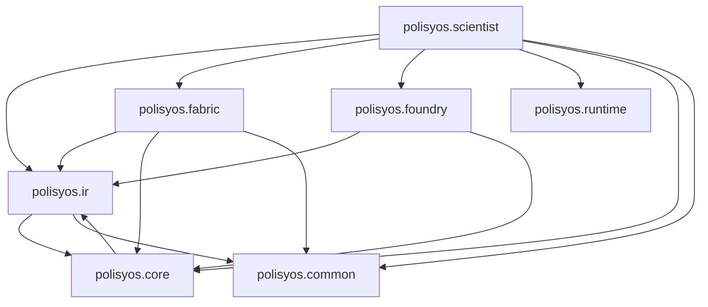

# Architecture for `polisyos/policy-engine` (2026‑01)

**Policy Engine** — AI‑driven система проектирования, валидации, калибровки и исполнения политик. Архитектурно это "компиляторная труба": от запроса пользователя/LLM до формально типизированных контрактов (IR), далее компиляция в исполняемые графы, выполнение в JAX‑ядре и фиксация результатов в воспроизводимых артефактах.

Этот документ описывает текущее состояние архитектуры (As-Is) по фактическому коду и тестам в репозитории на 2026-01.

Репозиторий: один Python‑проект `policy-engine/`, корень содержит `architecture.md` и директорию `policy-engine/`.

**Последнее обновление:** 2026‑01‑21.

---

## Технологический стек

### Язык и вычисления
- **Python 3.11+**: базовый рантайм проекта
- **JAX/JAXlib**: численные вычисления, JIT и autodiff
- **JAX Metal**: опциональный backend для macOS (через `jax-metal`)
- **Equinox**: модульная структура JAX-моделей
- **Optax**: оптимизаторы и градиентная оптимизация политик
- **Jaxtyping + Chex**: типы и проверки форм массивов

### Data Layer (Unified Data Fabric)
- **DuckDB**: аналитическое хранилище временных рядов и срезов
- **Kùzu**: графовая БД для взаимодействий агентов
- **pandas + PyArrow/Parquet**: ETL и columnar storage
- **Pydantic v2**: схемы данных и валидация

### IR & Contracts (Промежуточное представление)
- **Pydantic v2**: строгие контракты и валидация
- **JSON Schema**: экспорт схем для внешних интеграций
- **difflib**: генерация отчетов об изменениях
- **Canonical JSON**: детерминированная сериализация для reproducible хешей

### Scientist & AI (Интеллектуальное ядро)
- **LangGraph**: state-machine workflow для пайплайна эксперимента
- **MockLLM**: локальный LLM-адаптер для тестов
- **LangChain**: интеграция реальных LLM провайдеров (OpenAI/Anthropic)
- **PyMOO**: многокритериальная оптимизация (NSGA-II)

### Runtime & Infrastructure
- **Loguru**: структурированное логирование
- **python-dotenv**: загрузка `.env` и конфигурации окружения
- **FileSystemCAS**: content-addressable storage для артефактов
- **hashlib**: контроль целостности данных
- **Run Manifest**: паспорт эксперимента с метаданными и артефактами
- **Audit Trail**: JSON Lines логирование всех операций

### Quality & Development Tools
- **Ruff**: быстрый линтер и форматер (замена Black + Flake8 + Isort)
- **MyPy**: строгая статическая типизация
- **Pytest**: unit/integration/contract тесты
- **Pre-commit**: git hooks (dev зависимости)
- **JupyterLab + Matplotlib + Seaborn**: ноутбуки и исследовательская визуализация

### Новые компоненты (после крупных изменений)
- **Fact Log System**: immutable факты с provenance tracking и детерминированные ID
- **Evidence Bundles**: криптографически verifiable доказательства происхождения данных
- **UDF Compilation Pipeline**: многофазная компиляция SQL/Cypher запросов с security passes
- **Patch-based Execution**: декларативные изменения состояния через UpdateOp и Merge Rules
- **Treasury System**: детерминированное управление RNG для воспроизводимости
- **Materializer Engine**: полная материализация реляционных представлений из Fact Log с incremental updates
- **Trust System**: многоуровневые политики доверия с statistical verification
- **Calibration MVP**: полная система калибровки параметров с uncertainty quantification
- **Runtime API**: жизненный цикл прогонов с переносимыми артефактами и audit trail

---

## Архитектурные принципы (законы проекта)

Проект опирается на набор инвариантов. Часть из них формализована инструментами в `policy-engine/tools/`, часть — пока соглашения, поддерживаемые тестами и код‑ревью.

- **Закон A — Import Gate (границы модулей)**: `policy-engine/tools/lint_imports.py` запрещает критические обратные зависимости (`foundry → fabric`, `fabric → scientist`) и репортит циклы (по умолчанию не фейлит; `--fail-on-cycles` включает strict‑mode).
- **Закон B — Foundry как JAX‑ядро без прямого I/O**: `policy-engine/tools/lint_foundry.py` запрещает импорт I/O/DB/network библиотек и вызовы `print()`/`open()` в `polisyos.foundry`. As‑is: сейчас `policy-engine/src/polisyos/foundry/agents.py` является исключением (использует `os`/`pathlib` для загрузки артефактов), поэтому “чистое ядро” следует искать в `policy-engine/src/polisyos/foundry/runtime.py`, `policy-engine/src/polisyos/foundry/executor.py`, `policy-engine/src/polisyos/foundry/patch_vm.py`, `policy-engine/src/polisyos/foundry/calibration/pure_executor.py`.
- **Закон C — контракты как источник истины**: структуры данных определены в `polisyos.ir` и `polisyos.core.contracts`, экспортируются в JSON Schema (`policy-engine/tools/gen_schema.py`) и валидируются на границах.
- **Закон D — воспроизводимость и аудит прогонов**: каждый прогон имеет `run_id`, детерминированные seed’ы (Treasury), audit trail (`runs/<run_id>/audit.jsonl`) и воспроизводимые артефакты в CAS.
- **Закон E — evidence и provenance обязательны для данных**: `polisyos.fabric` фиксирует источники/трансформации (EvidenceBundle), а также immutable факты (Fact Log) с provenance/trust/legal метаданными.
- **Закон F — fidelity control**: симуляции/калибровки поддерживают управление точностью (speed/accuracy trade‑off) через `foundry.types.FidelityLevel` и multi‑fidelity механизмы.
- **Закон G — uncertainty quantification**: калибровка и trust‑подсистема возвращают bounds/оценки неопределённости (артефакты + отчёты).
- **Закон H — governance и бюджеты**: `polisyos.scientist` ограничивает вычисления и внешние вызовы (budgets), выполняет preflight/postflight и поддерживает human gates при необходимости.
- **Закон I — trust + privacy**: уровни доступа к данным (AccessTier), privacy passes в UDF компиляции, trust policies (two‑pass compare, uncertainty bounds).

---

## Компиляторная труба (архитектурный поток)

```
NL/Request → Scientist (LLM + Workflow) → IR (contracts) → Compilation → Runtime (Fabric UDF + Foundry) → Artifacts
```

Грубо: `scientist` производит/чинит IR, `ir` задаёт контракты, `fabric` обеспечивает данные/доказательства, `foundry` компилирует и исполняет политику, `runtime` фиксирует прогон, `core` даёт инфраструктуру артефактов/контрактов/трассировки.

---

## Слои и зависимости (As‑Is)

### Import Gate (проверяемые границы)

`policy-engine/tools/lint_imports.py` сегодня гарантирует (runtime imports):

- `polisyos.foundry` не импортирует `polisyos.fabric`
- `polisyos.fabric` не импортирует `polisyos.scientist`

Инструмент также репортит циклы на package‑уровне. На текущем коде (2026‑01) есть циклы:

- `polisyos.core` ↔ `polisyos.ir`
- `polisyos.fabric` ↔ `polisyos.fabric.udf`
- `polisyos.scientist` ↔ `polisyos.scientist.{agent,orchestrator}`

### Карта модулей (упрощённо)

> Примечание: `polisyos.common` и `polisyos.core` — разные “фундаменты”. `common` — минимальные утилиты (config/logger/migrations) без бизнес‑логики. `core` — инфраструктура артефактов/контрактов/trace/run‑контекстов.



---

## Структура проекта

```
policy-engine/
├── pyproject.toml / uv.lock
├── env_example.txt / install.sh
├── policy_ir_schema.json        # JSON Schema snapshot (PolicySurfaceIR)
├── .env                         # API ключи и конфигурация (не в Git!)
├── .polisyos/                   # CAS root (artifacts/sha256/…)
├── data/                        # raw/staging/curated (+ manifests, udf_schema.json, fact_log/)
├── runs/                        # runtime результаты прогонов (создаётся автоматически)
├── *.duckdb / *.kuzu            # локальные demo/integration БД
├── src/polisyos/                # код модулей
│   ├── common/                  # config/logger/migrations
│   ├── ir/                      # contracts (PolicySurfaceIR, DataViewRequest, Fact Log…)
│   ├── core/                    # CAS + canon + contracts + trace + registry bundles + run contexts
│   ├── fabric/                  # ingestion + UDF + evidence/trust/materializer
│   ├── foundry/                 # compiler + patch runtime + calibration (JAX)
│   ├── scientist/               # orchestration workflow (LangGraph + budgets + governor)
│   └── runtime/                 # runs/<run_id>/manifest + audit + artifacts
├── tests/                       # pytest suite (contract/fabric/foundry/integration/…)
└── tools/                       # demos/benchmarks/diagnostics + linters + migrations
    └── run_mechanism_design.py  # end‑to‑end demo (IR→compiler→foundry + JAX grad)
```

---

## Модули системы (назначение и контракты)

### `polisyos.core` — инфраструктурный фундамент

**Архитектурная роль**: Инфраструктурный слой артефактов/контрактов/трассировки. В текущем коде `core` и `ir` взаимосвязаны (package‑cycle): IR использует `core.canon` для детерминированного хеширования, а core использует IR‑типы для сборки registry bundle и отчётов линковки.

Что даёт:
- **Artifacts (Артефакты)**: `core.artifacts` (FileSystemCAS, ArtifactID/Ref/Manifest, provenance, content-addressable storage)
- **Canonical JSON**: `core.canon` (детерминированная сериализация, запрет float, сортировка ключей, reproducible хеши)
- **Contracts (Контракты)**: `core.contracts` (foundry/fabric/compiler - типизированные ссылки на артефакты)
- **Trace (Трассировка)**: `core.trace` (JsonlTraceSink, TraceRecord, distributed tracing с span_id)
- **Run (Выполнение)**: `core.run` (RunContext/RunManifest, контексты выполнения с трассировкой)
- **Registry (Реестры)**: `core.registry` (сборка/загрузка registry bundles поверх `ir.kernel` реестров)

### `polisyos.ir` — канонические контракты политики (IR)

**Архитектурная роль**: Слой контрактов данных, определяющий единообразие коммуникации между всеми компонентами (LLM → data → execution). As‑is IR в основном “чистый контракт”, но использует `core.canon` (детерминированные ID) и `common.migrations` (обёртки миграций артефактов).

Что определяет:
- **Surface IR v2.0**: `ir.surface.PolicySurfaceIR` (semantic/advisory раздельно, исполняемая логика vs человекочитаемые описания)
- **Kernel-реестры**: `ir.kernel` (mechanisms/slots/merge rules/units/time semantics/trust policies/values - фундаментальные типы)
- **Data views**: `ir.data_views` (PANEL/SNAPSHOT/NETWORK, access tiers, фильтры для запросов данных)
- **Linker**: `ir.linker` (валидация/связывание политики с реестрами, проверка корректности интервенций)
- **Fact Log контракты**: `ir.fact_log` (immutable facts, provenance/trust/legal, детерминированные ID)
- **Loaders & Migrations**: `ir.loaders` + `ir.migrations` (автораспознавание версии, коэрция v1→v2, детерминированные миграции)
- **Calibration**: `ir.calibration` (контракты калибровки политик относительно исторических данных)
- **Validation**: `ir.validation` (структурированные отчеты о проблемах, diff между версиями)

### `polisyos.fabric` — Unified Data Fabric (данные + evidence)

**Архитектурная роль**: Обработка данных и агрегация в Runtime Backend. Зависит от `ir` (контракты) и `core` (артефакты), предоставляет данные для `scientist` и `foundry`.

Что делает:
- **Data Ingestion Pipeline**: Полный ETL (raw CSV → staging Parquet → curated DuckDB/Kùzu) с evidence tracking
- **UDF Engine**: Безопасный компилируемый слой запросов с whitelist (passes: resolution/typecheck/merge/privacy/lowering)
- **Fact Log System**: Immutable факты с provenance tracking, детерминированные ID, сегментация
- **Evidence Bundles**: Криптографически verifiable доказательства происхождения, хранение в CAS
- **Entity Resolution**: Нормализация идентификаторов агентов с confidence scoring
- **Financial Reconciliation**: Балансовая проверка транзакций с tolerance
- **Materializer Engine**: Полная материализация реляционных представлений из Fact Log с incremental updates
- **Trust System**: Многоуровневые политики доверия с statistical verification и uncertainty bounds

**Технологии**: DuckDB (реляционное), Kùzu (графовое), PyArrow (columnar), Pydantic (валидация), Pandas (ETL)

### `polisyos.foundry` — JAX‑ядро исполнения (compiler + runtime + calibration)

**Архитектурная роль**: Policy execution backend с JAX‑симуляциями: компиляция IR в ProgramGraph/ExecPlan, patch‑based runtime, калибровка/оптимизация параметров. Import‑gate гарантирует, что Foundry не зависит от Fabric (`foundry → fabric` запрещён).

Что делает:
- **Compiler Layer**: Компиляция IR → ProgramGraph + ExecPlan (топологический порядок, registry-driven compilation)
- **Runtime Layer**: Patch-based execution с UpdateOp, Merge Rules (SUM/OVERRIDE/PRIORITY/ERROR), constraints validation
- **Domain Layer**: Экономическая модель (GlobalState, AgentState, FirmState, MarketState) с Jaxtyping
- **Mechanism Layer**: Механизмы политик (IncomeTax, TaxSubsidy, LaborMarket, Queue) с multi-fidelity (fluid/relaxed/hard)
- **Calibration Layer**: Полная система калибровки параметров с Optax, bijectors, loss functions, uncertainty quantification через Hessian
- **Treasury System**: Детерминированное управление RNG для reproducible симуляций

**Технологии**: JAX/Equinox (вычисления), Jaxtyping/Chex (типизация), Optax (оптимизация), Pydantic (конфигурация)

### `polisyos.scientist` — AI Policy Scientist (оркестрация эксперимента)

Что делает:
- **Workflow**: LangGraph + FSM (фазы), узлы (as‑is): `draft_ir` → `validate_ir` → `repair_ir` (loop) → `compile_data_views` → `compile_model` → `train_agents` → `run_sim` → `analyze` → `governor` → `pack_decision`.
- **Governance**: preflight/postflight, human gates.
- **Budgets**: compute/evidence/legitimacy/complexity бюджеты и их enforcement.
- **Optimization**: градиентная оптимизация (Optax) и multi‑objective (PyMOO).
- **DecisionPacket**: финальный "пакет решения" с IR, артефактами, аудитом, результатами.

### `polisyos.runtime` — жизненный цикл прогонов (runs/<run_id>)

**Архитектурная роль**: Инфраструктура управления жизненным циклом экспериментов. Единственная точка входа для создания и управления запусками (Закон D).

Что делает:
- **API**: `start_run()`, `finalize_run()`, `log_artifact()`, `append_audit()`, `update_budget_usage()`
- **Run Manifest**: Паспорт эксперимента с метаданными, бюджетами, артефактами
- **Artifact Management**: Структурированное хранение в `runs/<run_id>/` с переносимыми ссылками
- **Audit Trail**: Полный JSON Lines лог всех операций с временными метками
- **Budget Tracking**: Отслеживание использования ресурсов (compute, memory, time)

Ключевая особенность: **переносимость** — `ArtifactRef.relative_path` для перемещения директорий без потери ссылок.

### `polisyos.common` — минимальная инфраструктура (без бизнес‑логики)

**Архитектурная роль**: Фундаментальные утилиты и конфигурации, используемые во всех слоях. Не имеет зависимостей от других модулей, предоставляет сервисы всем компонентам системы.

Что делает:
- **Config**: Централизованная конфигурация приложения, JAX environment setup, hardware safeguards (CPU cores, memory limits)
- **JAX Environment**: Безопасная настройка JAX backend для macOS (отключение Metal по умолчанию)
- **Logger**: Единый интерфейс структурированного логирования с контекстом модуля через Loguru
- **Migrations**: Детерминированные миграции схем артефактов (Dataset Manifest, Policy IR) с обнаружением циклов

**Принцип**: Только инфраструктура и утилиты, без бизнес-логики.

---

## Рабочая директория и артефакты

- **CAS (Content‑Addressable Storage)**: по умолчанию в `policy-engine/.polisyos/` (layout: `artifacts/sha256/ab/cd/<hex>.{blob,manifest.json}`); может быть перенесён через `POLISYOS_CAS_ROOT` или параметр `cas_root`.
- **Runtime runs/**: `polisyos.runtime` пишет “человекочитаемые” артефакты и аудит в `policy-engine/runs/<run_id>/` (`manifest.json`, `audit.jsonl`, `artifacts/*`). В эти файлы часто логируются *ссылки* на CAS‑артефакты (refs), а не сами бинарные payload’ы.
- **Данные**: ingestion/UDF работают вокруг `policy-engine/data/` (`raw/`, `staging/`, `curated/`). Fact Log сегменты создаются в `data/curated/fact_log/` (по умолчанию); UDF также умеет резолвить альтернативные пути (`curated/facts`, `data/facts`, `data/fact_log`).
- **Два вида ссылок**: CAS‑ссылки (`polisyos.core.artifacts.manifest.ArtifactRef`) и runtime‑ссылки (`polisyos.runtime.manifest.ArtifactRef`, с `relative_path`).

---

## Legacy и переходные зоны

Система активно эволюционировала; часть кода/контрактов сохраняется для совместимости и миграций. Важно явно понимать, что "новое", а что "поддерживается, но не развиваем".

### Legacy в `ir`
- **`ir/contract.py` (IR v1.0)**: Устаревшие модели и селекторы. Сохраняются для обратной совместимости.
- **Актуальная линия**: `ir/surface.py` (`PolicySurfaceIR`, v2.x). `ir/loaders.py` распознаёт версии и при необходимости конвертирует v1 → v2.

### Legacy/переходное в `scientist`
- **Deprecated stubs**: `scientist/orchestrator/nodes.py` и `scientist/orchestrator/compiler.py` оставлены как предупреждающие заглушки; используйте `scientist/orchestrator/workflow.py` + `flow_nodes.py` и `polisyos.foundry.compiler.compile_surface_policy`.

### Переходные зоны в `foundry`
- **Ban‑list vs практика**: `policy-engine/tools/lint_foundry.py` сейчас флагирует `policy-engine/src/polisyos/foundry/agents.py` (I/O для загрузки артефактов). Для чистых JAX‑функций ориентируйтесь на `policy-engine/src/polisyos/foundry/runtime.py` и `policy-engine/src/polisyos/foundry/calibration/pure_executor.py`.

### Переходные зоны в `fabric`
- **Materializer**: Полноценная система материализации реляционных представлений из Fact Log с incremental updates (раньше был placeholder)

### Переходные зоны в `runtime`
- **`ArtifactRef.path`**: Поддерживается для старых артефактов, но для новых рекомендуется `relative_path` для переносимости директорий `runs/`

---

## Ключевые особенности архитектуры

### IR двуголовый (v2.0 + legacy v1.x)
- **PolicySurfaceIR (v2.0)** — основной контракт: `ir/surface.py` (schema_version = "2.0")
- **Legacy IR (v1.0)** — сохраняется: `ir/contract.py`, загрузчики поддерживают авто‑распознавание и v1→v2 конверсию.
- **JSON Schema snapshot**: `policy-engine/tools/gen_schema.py` генерирует `policy-engine/policy_ir_schema.json` из `PolicySurfaceIR`.

### Foundry: две эпохи + calibration
1) **ProgramGraph + PatchVM путь**: `policy-engine/src/polisyos/foundry/compiler.py` → ProgramGraph/ExecPlan, `policy-engine/src/polisyos/foundry/patch_vm.py` + `policy-engine/src/polisyos/foundry/executor.py`
2) **Pure Executor**: `policy-engine/src/polisyos/foundry/calibration/pure_executor.py` (JAX‑совместимый путь для калибровки)
3) **Deterministic RNG**: `policy-engine/src/polisyos/foundry/treasury.py` (TreasuryPlan + salts)

### Fabric: FactLog + UDF
- **Ingestion**: делает ETL + пишет FactSegments + загружает DuckDB/Kùzu
- **FactLog → Materializer → DuckDB**: UDF‑запросы исполняются в DuckDB/Kùzu, при этом реляционные представления при необходимости материализуются из Fact Log сегментов.
- **UDF Engine**: whitelist/PII gate, компиляция через passes, выполнение через DuckDB/Kùzu, сохранение request/plan/data/evidence в CAS (см. `fabric/udf/engine.py`).

### Scientist: workflow + legacy
- **Актуальная линия**: `scientist/orchestrator/workflow.py` (LangGraph), `scientist/orchestrator/flow_nodes.py` (узлы)
- **Workflow поток (as‑is)**: draft_ir → validate_ir → repair_ir → compile_data_views → compile_model → train_agents → run_sim → analyze → governor → pack_decision
- **Deprecated stubs**: `scientist/orchestrator/nodes.py`, `scientist/orchestrator/compiler.py`

### Runtime: runs/ + audit
- `polisyos.runtime` — отдельный слой поверх filesystem (не CAS)
- `ArtifactRef.relative_path` — основной переносимый указатель
- Два типа артефактных ссылок: CAS `core.artifacts.ArtifactRef` и runtime `runtime.manifest.ArtifactRef`
