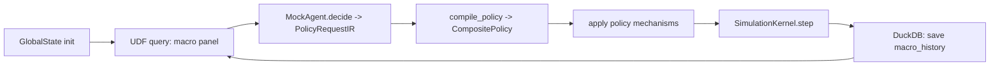
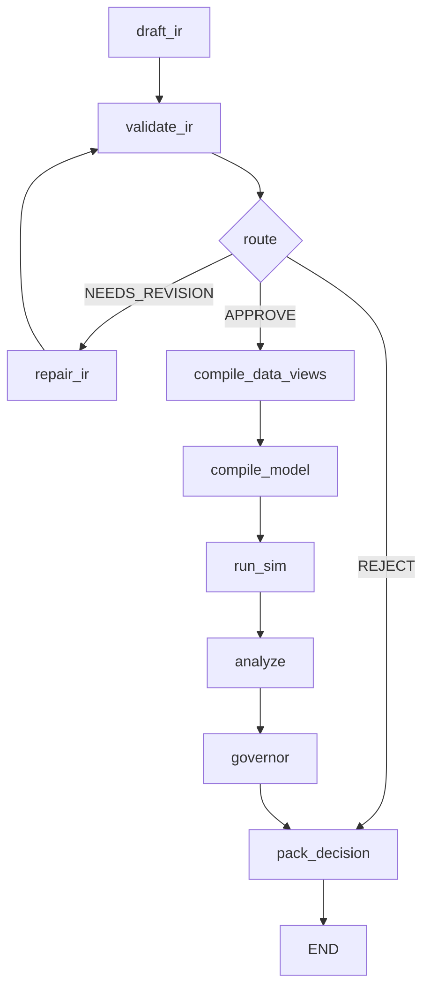
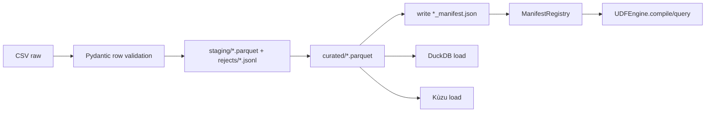

# Architecture (as-is) for `polisyos/policy-engine`

Этот документ — **снимок текущей архитектуры репозитория** `/Users/deniskopylov/polisyos` (по коду и тестам), с акцентом на:

- слои/пакеты и их зависимости,
- основные рантайм‑потоки (experiment loop, LangGraph workflow, ingestion/UDF),
- форматы данных (IR, manifests, run artifacts) и места хранения,
- то, что “задумано в README”, но фактически реализовано иначе.

> Репозиторий состоит из одного Python‑проекта `policy-engine/`. В корне репозитория лежит только этот документ `architecture.md` и папка `policy-engine/`.

---

## 0) Словарь терминов

- **IR**: канонические Pydantic‑контракты (PolicyRequestIR, DataViewRequest и пр.), “общий язык” между модулями.
- **Foundry**: JAX‑ядро симуляции + набор механизмов политики (налоги/субсидии/очереди).
- **Fabric**: Unified Data Fabric — ingestion, манифесты качества, адаптеры DuckDB/Kùzu, безопасные запросы через UDF.
- **UDF**: слой безопасной компиляции DataViewRequest → SQL/Cypher → выполнение.
- **Scientist**: оркестрация “NL → IR → sim → verdict” (LangGraph), агенты/промпты/самоисправление.
- **Runtime**: инфраструктура жизненного цикла прогона (run_id, артефакты, audit trail, бюджеты).

---

## 0.1) Архитектурные “законы” (как это задумано и частично соблюдается)

Эти принципы активно используются в документации модулей (`polisyos/*/README.md`) и отражены в tooling (например, в `policy-engine/tools/lint_imports.py`).

### Закон A. Граф зависимостей только внутрь

Целевая зависимость по слоям (пакетам):

- `scientist` → {`ir`, `fabric`, `foundry`, `runtime`, `common`}
- `fabric` → {`ir`, `common`}
- `foundry` → {`ir`, `common`}
- `runtime` → никого из `scientist/fabric/foundry` (инфраструктура)
- `ir` → никого

Определение “зависимости”: **runtime‑import**. Импорты в блоках `if TYPE_CHECKING:` считаются “подозрительными”, потому что закрепляют неправильные границы и часто превращаются в runtime‑зависимости по мере роста кода.

### Закон B. Система — это компилятор

Целевая труба:

`NL` → `LLM` → `IR (AST)` → `Compilation` → `Runtime (UDF + Foundry)` → `Artifacts / DecisionPacket`

Текущее состояние:

- Реального LLM‑провайдера в рантайме нет — используется `MockLLM` и/или `MockAgent`.
- “Compilation” присутствует как `compile_policy()` (IR → последовательность механизмов).
- “Runtime” реализован как файловые артефакты + audit + бюджеты в `polisyos.runtime`.

### Закон C. Контракты — единственный источник истины

Если поле/сущность не описаны в **канонической Pydantic‑схеме** артефакта — считается, что их “не существует”.

Следствия в текущем коде:

- `PolicyRequestIR`, `DatasetManifest`, `RunManifest`, `DecisionPacket` имеют `schema_version`.
- Есть миграции `0.9 → 1.0` (сейчас — в двух местах; см. раздел 7).
- Есть экспорт JSON Schema для IR (`policy-engine/tools/diagnostics/generate_ir_schema.py`).

### Закон D. Любой прогон — воспроизводим и аудируем

В текущей реализации это выражается через:

- `run_id` и `manifest.json` (runtime),
- `audit.jsonl` (runtime) + `audit_trail` в state,
- `RunRecord` (seed, backend, версии библиотек и переменные окружения).

---

## 1) Структура репозитория (физическая)

Ключевые элементы:

- `policy-engine/src/polisyos/…` — основной Python‑код (namespace package `polisyos`).
- `policy-engine/tests/…` — pytest тесты (contract/foundry/scientist/integration).
- `policy-engine/tools/…` — диагностические и демо‑скрипты (ingestion/UDF/schema/import-gates/benchmarks).
- `policy-engine/run_experiment.py` — “ручной” цикл эксперимента (UDF → MockAgent → compile_policy → Foundry kernel → DuckDB).
- `policy-engine/dashboard.py` — Streamlit дашборд по `simulation.duckdb`.
- `policy-engine/jax_bootstrap.py` — безопасный bootstrap JAX (особенно для macOS/Metal).
- `policy-engine/migrate.py` и `policy-engine/tools/migrate.py` — миграция JSON/YAML артефактов по `schema_version`.
- `policy-engine/data/` — локальные данные (raw/staging/curated) и схемы UDF.
- `policy-engine/logs/` — лог‑файлы и legacy‑артефакты (`system.log`, `logs/run_records`, `logs/decision_packets`).
- `policy-engine/runs/` — артефакты `polisyos.runtime` (создаются при запуске workflow; путь настраивается).

### 1.1. Важная особенность запуска: `sys.path`-bootstrap

Многие скрипты (включая `run_experiment.py`, `dashboard.py`, `tools/*`) добавляют `policy-engine/src` в `sys.path` вручную, чтобы импорты `from polisyos...` работали без установки пакета.

---

## 2) Слои (пакеты) и границы ответственности (логическая архитектура)

Система организована в набор пакетов внутри `polisyos`:

```
polisyos/
  ir/        # Контракты и валидация (Pydantic)
  foundry/   # JAX симуляция и механизмы
  fabric/    # Ingestion + DB adapters + UDF query layer
  scientist/ # LangGraph workflow + агенты (MockLLM/MockAgent)
  runtime/   # Run lifecycle: artifacts/audit/budgets
  common/    # env/config/logging/migrations utilities
```

### 2.1. `polisyos.ir` (контракты)

**Роль:** “единственный источник истины” по структурам данных.

Ключевые модели:

- `polisyos.ir.contract.PolicyRequestIR` — корневой документ политики:
  - anti‑runaway лимиты (число сущностей/интервенций/целей/шоков, глубина графа),
  - валидация топологии сущностей (parent_id, циклы, глубина, fan-out),
  - `TargetSelector` как безопасный AST вместо “строковых фильтров”.
- `polisyos.ir.data_views.DataViewRequest` — унифицированный запрос данных (panel/snapshot/network) + PII tier.
- `polisyos.ir.validation` — `ValidationIssue/ValidationReport`, генерация diff’ов для self‑healing.
- `polisyos.ir.migrations` — миграции Policy IR (0.9→1.0).

**Зависимости:** только стандартная библиотека + pydantic (и typing). Внутренних зависимостей на остальные слои нет.

### 2.2. `polisyos.foundry` (симуляция)

**Роль:** JAX‑ядро и экономические механизмы, не знает про БД/LLM.

Основные части:

- `polisyos.foundry.domain.state` — JAX PyTree состояние мира:
  - `AgentState`, `FirmState`, `MarketState`, `GlobalState`.
- `polisyos.foundry.engine.kernel.SimulationKernel` — один “экономический тик” (production → labor → goods → consumption → macro aggregation), JIT‑компилируется при создании.
- `polisyos.foundry.base.Mechanism` — протокол механизмов политики (`step(state, key)`), поддерживает `debug_mode` (`jax.disable_jit`).
- `polisyos.foundry.fiscal` — механизмы `IncomeTax`, `TaxSubsidy` (параметры как `jnp.array` → дифференцируемость).
- `polisyos.foundry.queue` — QueueMechanism (используется в registry).
- `polisyos.foundry.specs` — `MECHANISM_SPECS` + `validate_mechanism_params` + `mechanism_catalog()` для промптов и safety‑валидации.
- `polisyos.foundry.registry` — `MECHANISM_REGISTRY` и фабрика `create_mechanism(Intervention, n_agents, n_firms)`.
- `polisyos.foundry.loss` и `polisyos.foundry.utils` — loss/градиент‑health (используется оптимизатором).

**Зависимости:** JAX/equinox/chex/jaxtyping + `polisyos.ir` (типы Intervention, units) и немного `polisyos.common` (logger).

### 2.3. `polisyos.fabric` (данные + UDF)

**Роль:** ingestion и безопасный слой чтения данных (UDF) поверх DuckDB (табличные данные) и Kùzu (граф).

Состав:

- `polisyos.fabric.ingestion` — ETL:
  - raw CSV → Pydantic‑валидация строк → staging/curated Parquet,
  - формирование `DatasetManifest` (качество, PII flags, reconciliation),
  - загрузка в DuckDB (`macro_history`, `agents_snapshot`, `entity_resolution`) и Kùzu (Agent/Interaction).
- `polisyos.fabric.manifest` — контракт `DatasetManifest` и метрик качества.
- `polisyos.fabric.registry.ManifestRegistry` — обязательность наличия манифестов для UDF (и проверки reconciliation).
- `polisyos.fabric.io.db.SimulationDB` — адаптер DuckDB + создание таблиц.
- `polisyos.fabric.io.graph_store.GraphStore` — адаптер Kùzu + инициализация схемы графа.
- `polisyos.fabric.udf.*` — UDF:
  - `UDFEngine` компилирует и исполняет `DataViewRequest`,
  - `ViewCompiler` — whitelist/PII gate + компиляция в SQL/Cypher,
  - `UdfSchema` загружается из `data/curated/udf_schema.json` (или дефолтные списки).

**Важно про “gates”:**

- UDF требует наличия `*_manifest.json` в `data/curated/` (или заданной curated_dir).
- Доступ к колонкам зависит от `AccessTier` (PUBLIC/INTERNAL/SENSITIVE) через `field_classification`.
- Текущий `UDFEngine` при отсутствии явного `graph` **всегда** создаёт `GraphStore()` (т.е. открывает/инициализирует Kùzu), даже если выполняются только табличные запросы.

### 2.4. `polisyos.runtime` (артефакты/аудит)

**Роль:** единый формат хранения артефактов прогона и audit trail.

- `start_run()` создаёт `runs/<run_id>/manifest.json`.
- `log_artifact()` пишет payload в `runs/<run_id>/artifacts/<artifact_type>/...` и добавляет `ArtifactRef` в manifest.
- `append_audit()` пишет JSONL в `runs/<run_id>/audit.jsonl`.
- `update_budget_usage()` и `finalize_run()` обновляют manifest.

Важный нюанс текущей реализации: `ArtifactRef.path` хранит строковый путь файла (сейчас это **полный** путь, а не “относительно runs/”).

### 2.5. `polisyos.scientist` (оркестрация и агенты)

**Роль:** управляет пайплайном от `user_request` до `DecisionPacket`, включая бюджеты и self‑healing.

Текущая реализация содержит **две линии**:

1) “Новая” линия (используется workflow):

- `polisyos.scientist.orchestrator.workflow.build_workflow()` — LangGraph StateGraph.
- `polisyos.scientist.orchestrator.flow_nodes` — реализация узлов (budgeting, runtime artifacts, MockLLM, UDF plans, run_sim, governor).

2) “Legacy” линия (лежит рядом, но workflow её не использует):

- `polisyos.scientist.agent.drafter.drafter_node`
- `polisyos.scientist.orchestrator.nodes` (simulator_node/governor_node) + оптимизация `optimizer.py`

Обе линии концептуально похожи, но отличаются контрактами артефактов и точками сохранения (runtime vs `logs/`).

---

## 3) Граф зависимостей (как в коде)

### 3.1. Декларируемая цель слоёв

Практически применяемое правило:

- `polisyos.scientist` → может импортировать `ir/fabric/foundry/runtime/common`
- `polisyos.fabric` → импортирует `ir/common` (и свои под‑пакеты), не должен импортировать `scientist`
- `polisyos.foundry` → импортирует `ir/common`, не должен импортировать `fabric/scientist`
- `polisyos.ir` → не импортирует ничего из `polisyos.*` кроме себя
- `polisyos.runtime` → инфраструктура, не импортирует `scientist/fabric/foundry`

### 3.2. Реальная проверка границ (импорт‑гейты)

В репозитории есть статический линтер импортов: `policy-engine/tools/lint_imports.py`.

Его текущий вывод для `policy-engine/src/polisyos`:

- Forbidden edges (runtime): **нет**
- Forbidden edges (TYPE_CHECKING): **есть**
  - `polisyos/fabric/io/db.py` импортирует `polisyos.scientist.orchestrator.run_record.RunRecord` под `TYPE_CHECKING`
- Cycles (runtime imports, package-level): **есть**
  - `polisyos.scientist.agent` ↔ `polisyos.scientist.orchestrator`

Это означает: “слоёвый граф” в рантайме пока удержан, но внутри `scientist` есть пакетный цикл, а в `fabric` — type‑leak в сторону `scientist`.

---

## 4) Основные рантайм‑потоки (как это сейчас работает)

### 4.1. Поток A: `run_experiment.py` (ручной цикл “агент в петле”)

Файл: `policy-engine/run_experiment.py`

Схема потока:



Ключевые детали:

- **Источник данных для агента** — `UDFEngine.query(DataViewRequest)` читает `macro_history` по `run_id`.
- **Принятие решения** — `polisyos.scientist.agent.base.MockAgent` строит `PolicyRequestIR` по эвристике (без LLM).
- **Компиляция** — `polisyos.scientist.orchestrator.compiler.compile_policy()` создаёт `CompositePolicy`, который последовательно вызывает JAX‑механизмы из Foundry.
- **Экономический тик** — `polisyos.foundry.engine.kernel.SimulationKernel` выполняет внутреннюю “экономику” независимо от политики.
- **Persist** — `SimulationDB.save_macro()` пишет KPI в DuckDB. (agent snapshots в этом скрипте не пишутся.)
- **Визуализация** — `policy-engine/dashboard.py` читает `simulation.duckdb` и показывает trajectory (GDP, unemployment, avg_income, budget).

### 4.2. Поток B: LangGraph workflow (Scientist “NL → verdict”)

Файл графа: `policy-engine/src/polisyos/scientist/orchestrator/workflow.py`
Узлы: `policy-engine/src/polisyos/scientist/orchestrator/flow_nodes.py`



Что делает каждый шаг (по фактическому коду):

- `draft_ir` / `repair_ir`:
  - гарантирует наличие `run_id` через `polisyos.runtime.start_run`,
  - считает бюджет (`max_llm_calls`, `max_sim_runs`, `max_wall_time_s`),
  - логирует `prompt` и `llm_response` как runtime artifacts,
  - **использует `MockLLM`** (без провайдеров) и парсит JSON в `PolicyRequestIR`.
- `validate_ir`:
  - повторно валидирует `PolicyRequestIR` через Pydantic,
  - выполняет safety‑проверки: наличие interventions и известность `mechanism_type` (по `MECHANISM_REGISTRY`).
- `compile_data_views`:
  - если в state есть `data_view_requests`, компилирует их в планы через `UDFEngine.compile()` и пишет `data_view_plans` artifact,
  - если запросов нет — шаг пропускается.
- `compile_model`:
  - вызывает `compile_policy(ir, n_agents=0, n_firms=0)` и записывает “compiled_spec”,
  - **важно:** этот результат сейчас не участвует в `run_sim` (узел фактически “компиляция ради артефакта”).
- `run_sim`:
  - открывает DuckDB по `db_path` (по умолчанию `integration.duckdb`),
  - загружает baseline‑состояние через `load_initial_state()` (который делает UDF SNAPSHOT запрос),
  - создаёт механизмы через `create_mechanism(intervention, n_agents=...)` и применяет их к `GlobalState`,
  - пишет `run_record` artifact (Pydantic `RunRecord`).
- `analyze`:
  - формирует простой payload `{"status": "ok", "metrics": ...}` и пишет artifact.
- `governor`:
  - проверяет `global_constraints.min_balance` на `simulation_results.gov_balance`,
  - возвращает verdict `APPROVE` или `NEEDS_REVISION`.
- `pack_decision`:
  - собирает `DecisionPacket` (IR + результаты + feedback + audit_trail + RunRecord),
  - пишет `decision_packet` artifact,
  - финализирует run (`finalize_run`) со статусом `approve/reject/needs_revision/pruned`.

### 4.3. Поток C: Ingestion → UDF (данные)

Файл: `policy-engine/src/polisyos/fabric/ingestion.py` (оркестратор ingestion: `run_ingestion()`).



Минимальный рабочий demo‑скрипт: `policy-engine/tools/demos/run_ingest_demo.py`.

---

## 5) Хранилища и форматы данных

### 5.1. DuckDB (`SimulationDB`)

Файл: `policy-engine/src/polisyos/fabric/io/db.py`

Таблицы (создаются автоматически):

- `macro_history(run_id, step, gdp, unemployment_rate, inflation_rate, avg_price, avg_income, government_balance, timestamp)`
- `agents_snapshot(run_id, step, agent_id, age, income, savings, is_employed)`
- `entity_resolution(raw_id, canonical_id, match_confidence, match_method, created_at)`
- `run_records(run_id, parent_run_id, seed, repro_mode, backend, python_version, platform, generated_at, schema_version, generator_name, generator_version, library_versions, flags)`

Примечания:

- UDF фильтрует по `run_id` всегда (это часть безопасной модели доступа).
- Snapshot‑запросы требуют `step_end` и читают `agents_snapshot`.

### 5.2. Kùzu (`GraphStore`)

Файл: `policy-engine/src/polisyos/fabric/io/graph_store.py`

Схема:

- Node table: `Agent(id STRING, type STRING, PRIMARY KEY(id))`
- Rel table: `Interaction(FROM Agent TO Agent, step INT64, amount DOUBLE, type STRING)`

### 5.3. Curated manifests и UDF schema

UDF требует:

- `data/curated/*_manifest.json` (например, `macro_manifest.json`, `agents_manifest.json`, `entity_resolution_manifest.json`)
- `data/curated/udf_schema.json` (или переменная окружения `UDF_SCHEMA_PATH`)

В `udf_schema.json` задаются:

- `allowed_columns` (whitelist по таблицам),
- `field_classification` (public/internal/sensitive),
- `allowed_relation_types` для network запросов.

### 5.4. Runtime artifacts (`polisyos.runtime`)

По умолчанию:

```
runs/<run_id>/
  manifest.json
  audit.jsonl
  artifacts/<artifact_type>/*.json|*.txt
```

`RunManifest` содержит список `ArtifactRef` и текущее состояние бюджетов/статуса.

### 5.5. Legacy logs

Параллельно runtime существуют функции, которые пишут артефакты в `logs/`:

- `polisyos.scientist.orchestrator.run_record.save_run_record_json`
- `polisyos.scientist.orchestrator.decision_packet.save_decision_packet`

Workflow на `flow_nodes.py` в основном пишет в runtime (`runs/`), но эти функции всё ещё присутствуют.

---

## 6) Конфигурация и bootstrap окружения

### 6.1. JAX bootstrap

Есть два механизма, которые сейчас используются в разных местах:

- `policy-engine/jax_bootstrap.py` → `polisyos.common.jax_env.apply_jax_env_defaults()`:
  - на macOS форсирует CPU, если пользователь явно не включил Metal (`POLICY_ENGINE_ALLOW_JAX_METAL=1`).
- `polisyos.common.config`:
  - **всегда** выставляет `JAX_PLATFORM_NAME=cpu` и ряд флагов JAX/XLA,
  - ограничивает CPU cores через `XLA_FLAGS`,
  - настраивает loguru и грузит `.env`.

Скрипт `policy-engine/tools/diagnostics/check_setup.py` специально импортирует `polisyos.common.config` **до** `jax`/`duckdb`, чтобы флаги применились.

### 6.2. Логирование

- `polisyos.common.config` настраивает loguru (console + `logs/system.log` в JSON).
- `polisyos.common.logger` и `get_logger()` дают bind‑логгер для модулей.

---

## 7) Версионирование и миграции

В текущем состоянии есть **две параллельные системы миграций**:

1) `polisyos.common.migrations` (универсальная, по `artifact`):

- поддерживает `policy_ir` и `dataset_manifest`,
- используется CLI: `policy-engine/migrate.py` и `policy-engine/tools/migrate.py`.

2) `polisyos.ir.migrations` (специализированная, только Policy IR):

- используется CLI: `policy-engine/tools/migrate_ir.py`,
- покрыта тестом: `policy-engine/tests/contract/test_ir_migrations.py`.

Обе поддерживают миграцию `0.9 → 1.0` (нормализация `projectName` → `project_name`, `globalConstraints` → `global_constraints`).

---

## 8) Тесты и “гейты” качества

Папка: `policy-engine/tests/`

- `tests/contract/*`:
  - контракт IR (`test_ir_contract.py`),
  - миграции IR (`test_ir_migrations.py`),
  - гейты Fabric/UDF (манифесты + PII) (`test_fabric_gates.py`).
- `tests/foundry/*`: состояние мира, JIT‑стабильность, градиенты, фискальные механизмы, kernel.
- `tests/scientist/test_compiler.py`: компиляция IR → механизмы.
- `tests/integration/*`: workflow smoke и workflow “LLM” (на деле MockLLM).

Инструмент архитектурных границ: `policy-engine/tools/lint_imports.py`.

---

## 9) Текущее состояние (важные несоответствия и технический долг)

Это не “план изменений”, а перечисление того, что уже есть в коде и влияет на архитектурную картину:

- В `polisyos.scientist` сосуществуют два набора узлов/агентов (`flow_nodes.py` vs `nodes.py` + `drafter.py`), что создаёт дублирование логики и разные точки записи артефактов.
- `compile_model_node` сейчас компилирует с `n_agents=0` и результат не используется в `run_sim` (узел полезен в основном как “артефакт компиляции”).
- Есть пакетный цикл импортов `polisyos.scientist.agent` ↔ `polisyos.scientist.orchestrator`.
- Есть type‑leak из `fabric` в `scientist` через `TYPE_CHECKING` в `polisyos.fabric.io.db`.
- Часть модулей/скриптов использует `print` (в т.ч. в `src/`), хотя ruff‑правило `T20` задумывает запрет `print` в production‑коде (исключения настроены только для некоторых путей).

Ниже — целевая архитектурная спецификация (to-be) для polisyos/policy-engine
1) Назначение целевой архитектуры
polisyos становится компилятором политики, где:
IR — язык/AST намерений и ограничений,
Fabric — эпистемический слой: факты + происхождение + доверие,
Foundry — VM/ядро вычислений: детерминированная симуляция + patch-first изменения,
Scientist — управляющий автомат: планирует эксперименты, запускает вычисления, проверяет безопасность, собирает DecisionPacket.
Критическое усиление: все модули обязаны жить через один “хребет” воспроизводимости (Фаза 0), иначе система распадается на скрипты.
2) Неподвижные принципы (инварианты)
2.1. “Everything is an Artifact”
Любой значимый объект (IR, QueryPlan, Snapshot, ProgramGraph, результаты симуляции, отчёты, DecisionPacket) существует только как:
ArtifactRef (ссылка),
в CAS (content-addressed store),
с Manifest (происхождение/версия/inputs),
и с Trace событиями.
Запрещено: “просто сохранить JSON рядом в runs/… и потом как-то прочитать”.
2.2. “Canonical bytes → hash”
Идентичность артефакта определяется каноническими байтами, а не Python-объектом и не путём файла.
2.3. “RunContext is mandatory”
Все верхнеуровневые операции (компиляция, запросы данных, симуляции, анализ, губернаторы) принимают RunContext и возвращают ArtifactRef.
Это делает невозможным “выполнить и забыть” provenance.
2.4. “Dependency graph only inward”
Слои обязаны соблюдаться не только в runtime-import, но и в TYPE_CHECKING (чтобы не протекало обратно).
3) Логическая архитектура и пакеты (to-be)
Целевая структура polisyos:
polisyos/
  core/        # Фаза 0: canon + CAS + manifests + trace + run + migrations + registry spine
  ir/          # Контракты AST/IR (строгие Pydantic схемы)
  fabric/      # Data Fabric: ingestion + QueryPlan + trust/evidence + adapters
  foundry/     # VM: ProgramGraph/ExecPlan + механизмы + patch/merge/constraints + kernel
  scientist/   # Orchestrator: FSM, DOE, governors, decision packets, compute-plane client
  common/      # минимально: utils/конфиги, но не “всё подряд”
  cli/         # команды диагностики/миграций/проверок, без sys.path bootstrap
3.1. Главный перенос ответственности
Текущий polisyos.runtime сворачивается в polisyos.core.
runtime может остаться временным “compat layer”, но истина — только core.
4) Фаза 0 “хребет” (core)
4.1. Canonicalization
CanonSpec
Версия канонизации — часть протокола (canon.name, canon.version).
JSON сериализация:
сортировка ключей,
стабильные separators,
UTF-8.
Запрет float в JSON-артефактах (всё численно-тяжёлое хранится бинарно: Arrow/NPY/Parquet как отдельные артефакты).
Запрет NaN/Inf.
Правило: если объект содержит массивы/матрицы/float — он обязан вынести их в отдельные бинарные артефакты и ссылаться на них через ArtifactRef.
4.2. CAS (content-addressed store)
ArtifactID
Формат адресации: sha256:<hex> (алгоритм фиксирован для аудита).
Layout на диске: шардирование по префиксу хеша.
Put/Get/Verify
put_* обязательно атомарный (temp → fsync → rename).
verify обязателен как инструмент CI/аудита.
4.3. Artifact Manifest (обязателен)
Каждый артефакт имеет Manifest со строгими полями:
artifact_id, kind, media_type, byte_size, created_at
schema (name + version) — если артефакт схематизирован
canon (name + version) — для JSON
inputs[] — список зависимостей с ролями
producer (component + version + git commit/dirty)
env (python/platform/deps_lock_hash)
integrity (sha256 + опциональные доп. хеши)
warnings[]
Запрет: хранить “полный путь файла” внутри ArtifactRef (это ломает переносимость). Путь — дело CAS, а не контракта.
4.4. TraceRecord (единый формат наблюдаемости)
Формат хранения: JSONL (стриминг).
Каждое событие: ts, run_id, phase, event, refs(inputs/outputs), metrics, warnings/errors.
В core должен быть TraceSink интерфейс + минимум одна реализация (JSONL).
Правило: каждый put артефакта и каждый переход стадии пайплайна обязан emit TraceRecord.
4.5. RunManifest (корневой чек)
Для каждого запуска:
run_id
registry_bundle_ref
inputs[], outputs[]
status, errors[]
trace_ref
producer/env
started_at/finished_at
Правило: любой “внешний результат” (DecisionPacket/Report) обязан ссылаться на RunManifestRef.
4.6. Registry spine (конституция мира)
Система реестров хранится как набор артефактов, собранных в RegistryBundle:
Минимальный bundle:
SlotRegistry
MergeRuleRegistry
ConstraintRegistry
MechanismTypeRegistry
TrustPolicyRegistry (для Fabric)
UnitsRegistry (опционально сначала)
Правило:
Ни один запуск Foundry/Fabric/Scientist не считается валидным без registry_bundle_ref.
5) Контракты между слоями (то, что “сшивает” систему)
Это ключ: слои должны “переписываться” не имплицитно, а через фиксированные артефакты.
5.1. IR → Fabric
Input: DataViewRequestRef (IR)
Output: QueryPlanRef (Fabric)
Output: FabricResultRef (таблица/граф/снэпшот) + EvidenceBundleRef + WarningsRef
Важное изменение относительно as-is: Fabric должен возвращать не “просто DataFrame”, а унифицированный контейнер результата:
где лежит data (обычно Arrow/Parquet),
откуда оно взялось (sources),
каковы ограничения доверия (trust policy),
какие предупреждения/фильтры применены.
Минимальные артефакты и payload (шаг 1):
- kind: ir.data_view_request (schema: polisyos.ir.DataViewRequest) — входной запрос.
- kind: fabric.query_plan (schema: polisyos.core.contracts.QueryPlan)
  поля: request_ref, engine, steps[], trust_policy_id, notes.
- kind: fabric.result_bundle (schema: polisyos.core.contracts.FabricResult)
  поля: request_ref, plan_ref, data_ref, data_schema_ref, sources[], trust_policy_id,
  evidence_ref, warnings_ref, stats.
- kind: fabric.evidence_bundle (schema: polisyos.core.contracts.EvidenceBundle)
  поля: sources[], transforms[], trust_policy_id, notes.
- kind: fabric.warnings (schema: polisyos.core.contracts.WarningsBundle)
  поля: warnings[] (code/msg/data).
Инварианты:
- FabricResult.data_ref должен указывать на бинарный артефакт (Arrow/Parquet).
- Evidence/Warn артефакты обязаны быть отдельными и ссылочными.
5.1.1. Правило float
JSON‑контейнеры не содержат float; числовые массивы/матрицы — только как бинарные артефакты.
5.2. IR → Foundry
Input: PolicyRequestIRRef
Output: ProgramGraphRef (или LoweredIRRef как ISA)
Output: ExecPlanRef (опционально)
На старте допускается промежуточный этап: “компиляция в последовательность механизмов”, но контракт должен сразу быть оформлен как артефакт компиляции (чтобы потом заменить на ProgramGraph без ломки API).
Минимальные артефакты и payload (шаг 1):
- kind: ir.policy_request (schema: polisyos.ir.PolicyRequestIR) — входной IR.
- kind: foundry.program_graph (schema: polisyos.core.contracts.ProgramGraph)
  поля: ir_ref, nodes[], edges[], entrypoints[], notes.
- kind: foundry.lowered_ir (schema: polisyos.core.contracts.LoweredIR) — временный ISA.
  поля: ir_ref, mechanisms[], notes.
- kind: foundry.exec_plan (schema: polisyos.core.contracts.ExecPlan)
  поля: program_ref, order[], mode(dev/perf/audit), jit, max_steps, notes.
5.3. Foundry execution
Input: StateSnapshotRef + ProgramGraphRef + TreasurySeedRef + ExecConfigRef
Output: StateDeltaRef (patch-first) + MetricsRef + TraceSliceRef
Минимальные артефакты и payload (шаг 1):
- kind: foundry.state_snapshot (schema: polisyos.core.contracts.StateSnapshot)
  поля: state_ref, schema_ref, step, notes.
- kind: foundry.treasury_seed (schema: polisyos.core.contracts.TreasurySeed)
  поля: seed, streams{}, notes.
- kind: foundry.exec_config (schema: polisyos.core.contracts.ExecConfig)
  поля: mode(dev/perf/audit), max_steps, deterministic, notes.
- kind: foundry.state_delta (schema: polisyos.core.contracts.StateDelta)
  поля: base_ref, patch_ref, ops[], notes.
- kind: foundry.metrics (schema: polisyos.core.contracts.Metrics)
  поля: values{} (int/decimal-as-string), notes.
- kind: foundry.trace_slice (media_type: application/jsonl)
  JSONL записи TraceRecord, детерминированно записаны через TraceSink.
6) Fabric (to-be)
6.1. Разделение: ingestion vs query
Ingestion: создаёт curated слои + DatasetManifest.
Query: компилирует DataViewRequest → QueryPlan → executes → ResultBundle.
6.2. TrustPolicy как обязательный шаг
В QueryPlan появляется явный шаг:
apply_trust_policy(mode=...)
поддерживающий минимум:
optimistic
pessimistic
two_pass_compare (bounds/delta)
Правило: любой результат Fabric обязан содержать:
evidence,
trust annotations,
применённые фильтры/агрегации/оконные семантики.
6.3. Устранение текущих “as-is” проблем
GraphStore не должен инициализироваться автоматически если запрос не требует графа.
(Иначе Fabric всегда делает побочные эффекты и удорожает любой запрос.)
Убрать type-leak fabric → scientist даже под TYPE_CHECKING: контракты типа RunRecord должны жить в core или ir, а не в scientist.
6.4. Режимы исполнения (обязательное требование)
Fabric и Foundry поддерживают три режима:
dev — допускаются копии/упрощения, главное корректность.
perf — zero-copy/Arrow/DLPack, минимальный overhead.
audit — максимум provenance, дополнительные проверки, расширенные warnings.
7) Foundry (to-be)
7.1. VM модель
Foundry обязан стать “исполнителем программы”, где:
ProgramGraph = граф механизмов
State = память (слоты)
Patch = единственный способ изменить state
MergeRules = строгие правила разрешения конфликтов
Treasury = детерминированная раздача randomness (stable key by node_id × t × stream)
7.2. Patch-first state (ключевое отличие)
Вместо “механизм мутирует state”, механизм возвращает:
Patch
Outputs (наблюдаемые значения)
Aux (для трассы/диагностики)
Runtime Foundry применяет патчи согласно MergeRules и Constraint hooks.
7.3. Constraint hooks
Constraints декларативно привязаны к слотам и/или к фазам шага.
После merge применяется CHECK_CONSTRAINTS.
Есть стандартные repair стратегии (clamp, redistribute, penalty-only, reject patch).
7.4. Переходный мост от текущего состояния
Текущий SimulationKernel и механизмы могут быть адаптированы:
как “MechanismNode wrappers”, которые внутри используют текущие step-функции,
но наружу выдают Patch (даже если patch пока “полное состояние” — временно).
Главное: внешний контракт должен стать patch-first, иначе потом будет болезненный разрыв.
8) Scientist (to-be)
8.1. Один оркестратор, одна линия кода
Текущие две линии (flow_nodes.py vs legacy nodes/agent) должны быть сведены к одной:
scientist/orchestrator — единственная “истина”
любые “legacy” узлы либо удаляются, либо становятся thin wrappers и помечаются deprecated.
8.2. Scientist = FSM + budgets + governors
Workflow оформляется как конечный автомат с:
лимитами LLM calls / sim runs / wall time / compute cost
checkpointing через RunContext
детерминированной трассой переходов
Governors
Два класса:
Pre-flight Governor: режет недопустимое до симуляций (право/этика/PII/бюджеты/технические лимиты).
Post-flight Governor: проверяет метрики, fairness, риск “обмана метрик”, правовые ограничения, constraints violations.
Правило: губернатор не возвращает “текст”; он возвращает структурный Verdict как артефакт (с reason codes и ссылками на evidence).
8.3. DOE библиотека (Experiment Design Library)
Scientist не “придумывает эксперименты”, а выбирает из стандартных дизайнов:
ScenarioSweep
AblationPlan
SensitivityPlan
CounterfactualGrid
StressTestPack
Каждый DOE:
существует как артефакт
компилируется в список JobSpec (артефакты задач)
результаты сводятся в ResultBundle (артефакт)
8.4. Compute plane separation (важно для будущего)
Scientist в Control Plane не должен напрямую тянуть JAX и исполнять тяжёлое:
он формирует JobSpec → отправляет в compute runner → получает ArtifactRefs результатов.
На dev этапе runner может быть локальным, но контракт должен быть одинаковым.
9) Хранилища и пути (to-be)
9.1. Истина: .polisyos/artifacts (CAS)
Все артефакты в CAS.
9.2. runs/ становится “проекцией”
Текущая папка runs/<run_id>/... превращается в:
thin view (trace, run manifest как ссылки)
или вообще заменяется на core/runs/<run_id>/ где лежит только trace jsonl и “run pointer”.
Ключ: run хранит ссылки, а не данные.
9.3. Legacy logs/ — удаление
Все legacy writers (logs/run_records, logs/decision_packets) должны быть выключены.
Если нужно — делается экспорт из CAS в человекочитаемый формат, но не “пишем параллельно”.
10) Миграции и версии (to-be)
10.1. Единая система миграций
Сейчас у тебя две параллельные системы миграции. В целевом состоянии:
polisyos.core.migrations — единственная точка миграции артефактов (IR, dataset manifests, run manifests, decision packets).
polisyos.ir.migrations может остаться как “подпакет”, но вызываться через core-механизм (единый CLI, единые правила).
10.2. Версии обязательны
Каждый схематизированный артефакт имеет:
schema.name
schema.version
И для JSON — canon.version.
11) Последовательность изменений от as-is к to-be (пошагово)
Ниже — именно “как перепрошить существующую архитектуру”, не ломая всё сразу.
Шаг 1 — Ввод polisyos.core
Добавить core пакет: canon, artifacts(CAS+manifest), trace, run, registry bundle, migrations.
Ввести RunContext как обязательный объект, создаваемый в начале любого workflow.
Включить CAS в CI: базовая команда verify.
Критерий готовности: можно создать run, записать 3–5 артефактов, получить RunManifestRef, пройти verify, иметь trace.
Шаг 2 — Замена polisyos.runtime на thin-compat
polisyos.runtime.start_run/log_artifact/append_audit переводятся на вызовы core.
Удалить ArtifactRef.path из контрактов runtime; везде заменить на ArtifactRef(artifact_id, kind, media_type).
Обновить тесты integration/workflow под новый runtime.
Критерий готовности: workflow пишет только в CAS + RunManifest, runs/ не содержит “данных”, только trace/pointers.
Шаг 3 — Чистка границ импортов
Убрать цикл scientist.agent ↔ scientist.orchestrator через выделение общих контрактов в core/ir.
Убрать TYPE_CHECKING leak fabric → scientist (RunRecord/типы переносятся в core).
Усилить lint_imports.py: TYPE_CHECKING тоже должен быть чистым.
Критерий готовности: import graph чистый, без исключений.
Шаг 4 — Fabric: ResultBundle + TrustPolicy step
DataViewRequest компилируется в QueryPlan как артефакт.
Выполнение QueryPlan выдаёт ResultBundle (data_uri/inline_preview + evidence + warnings).
Разделить табличный и графовый адаптеры: GraphStore создаётся только если нужен.
Критерий готовности: любой UDF query возвращает ArtifactRefs, а не “сырые данные”.
Шаг 5 — Foundry: внешний контракт patch-first
Добавить Patch/Merge/Constraint интерфейсы (даже если внутри пока адаптеры к текущему kernel).
Компиляция IR → “compiled program” как артефакт (ProgramGraphRef).
Исполнение возвращает StateDeltaRef + MetricsRef.
Критерий готовности: Scientist больше не “мутирует GlobalState напрямую”, а применяет патчи через Foundry runtime.
Шаг 6 — Scientist: одна линия оркестрации + DOE
Удалить/заморозить legacy узлы (или пометить deprecated и убрать из путей запуска).
Ввести DOE каталог как обязательный источник JobSpec.
Ввести governors как структурные Verdict артефакты.
Критерий готовности: end-to-end DecisionPacket полностью воспроизводим по ссылкам CAS.
Шаг 7 — Compute plane отделение
Ввести интерфейс runner (локальный сначала).
Узлы симуляции становятся клиентами runner.
Trace и артефакты синхронизируются через CAS.
Критерий готовности: можно запускать симуляции “в стороне”, сохраняя ту же provenance-цепь.
12) Обязательные “гейты качества” (архитектурный DoD)
Система считается соответствующей целевой архитектуре только если выполняются правила:
Любой результат имеет RunManifestRef.
Любой артефакт можно verify.
IR/Fabric/Foundry/Scientist возвращают только ArtifactRefs наружу.
Нет runtime/TYPE_CHECKING импорт-нарушений.
Fabric всегда выдаёт evidence/trust annotations.
Foundry внешний контракт patch-first.
Trace покрывает все ключевые события (artifact put, compile, execute, governor verdict).
