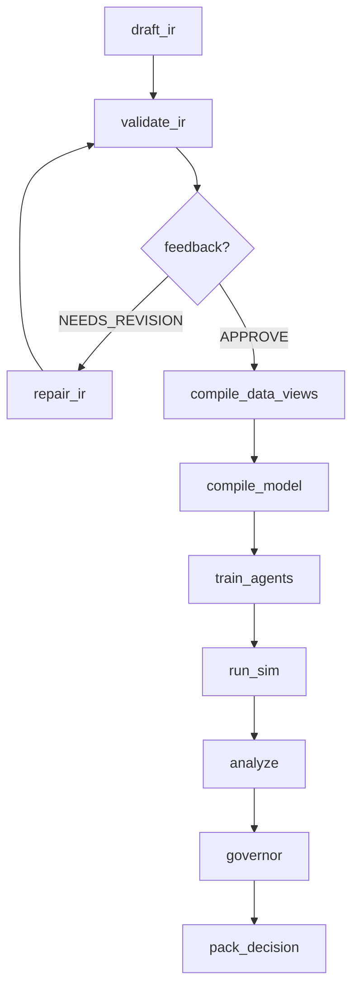

# PolisyOS — AI-Driven Policy Operating System

**PolisyOS** (Policy Engine) — операционная система для проектирования, валидации, калибровки и исполнения публично-политических интервенций как воспроизводимых вычислительных экспериментов. Система принимает запрос на естественном языке, формулирует политику через иерархию AI-агентов, компилирует её в дифференцируемую JAX-симуляцию, проводит governance-проверки и выдаёт пакет решений с полным provenance-следом.

**Architecture:** v2.5.0 · **Python:** >=3.11 · **License:** proprietary

---

## Содержание

- [Обзор архитектуры](#обзор-архитектуры)
- [Граф зависимостей](#граф-зависимостей)
- [Модули](#модули)
  - [Common — инфраструктурный фундамент](#common--инфраструктурный-фундамент)
  - [Core — фундаментальная инфраструктура](#core--фундаментальная-инфраструктура)
  - [IR — промежуточное представление](#ir--промежуточное-представление)
  - [Fabric — Unified Data Fabric](#fabric--unified-data-fabric)
  - [Foundry — JAX Execution Engine](#foundry--jax-execution-engine)
  - [Runtime — жизненный цикл прогонов](#runtime--жизненный-цикл-прогонов)
  - [Lex — юридический анализ](#lex--юридический-анализ)
  - [Scholar — обогащение знаний](#scholar--обогащение-знаний)
  - [Scientist — AI-оркестрация](#scientist--ai-оркестрация)
  - [Packs — компонентные пакеты](#packs--компонентные-пакеты)
- [Сквозные подсистемы](#сквозные-подсистемы)
- [Ключевые концепции](#ключевые-концепции)
- [Архитектурные инварианты (Laws)](#архитектурные-инварианты-laws)
- [Технологический стек](#технологический-стек)
- [Quickstart](#quickstart)
- [Тестирование](#тестирование)
- [Инструменты разработчика](#инструменты-разработчика)
- [Observability и Ops](#observability-и-ops)
- [Данные](#данные)
- [Документация](#документация)
- [Архитектура](#архитектура)

---

## Обзор архитектуры

Система реализует компиляторную трубу от запроса на естественном языке до воспроизводимого пакета решений:

```
NL intent (пользовательский запрос)
  → Scientist (AI-агенты: PI → Drafter → Formalizer → Critic + governance)
    → IR (Trinity контракты: ProblemFrame / PolicySpec / ModelSpec + kernel registries)
      → Fabric (UDF data views, evidence, provenance, quality, trust)
        → Foundry (compile → calibrate → simulate; чистый JAX, patch-based)
          → Runtime (runs/<run_id>/ — manifests, audit trail, artifact refs)
            → Decision Artifacts (DecisionPacket / DecisionCard / RunTimeline)
```

Сквозные подсистемы:
- **Lex**: юридические документы → NormPack → legality evaluation (governance passes)
- **Scholar**: внешние источники → docs → claims → trust → KnowledgeBundle (обогащение Fabric/IR)
- **Packs**: встроенные доменные компоненты (IR-фрагменты, Foundry-методы, Lex-оценщики, Scholar-экстракторы)

---

## Граф зависимостей

Зависимости строго однонаправлены (Law A). `A → B` означает «A зависит от B»:

```
                                ┌──────────┐
                                │ common   │  ← нет зависимостей вверх
                                └────┬─────┘
                                     │
                          ┌──────────┴──────────┐
                          │                     │
                     ┌────▼────┐          ┌─────▼────┐
                     │  core   │          │    ir    │  (чистые контракты)
                     └────┬────┘          └─────┬────┘
                          │                     │
               ┌──────────┼─────────────────────┤
               │          │                     │
          ┌────▼────┐ ┌───▼─────┐         ┌────▼────┐
          │ fabric  │ │ foundry │         │ runtime │
          └────┬────┘ └───┬─────┘         └────┬────┘
               │          │                    │
          ┌────▼────┐ ┌───▼─────┐              │
          │   lex   │ │ scholar │              │
          └────┬────┘ └───┬─────┘              │
               │          │                    │
               └──────────┼────────────────────┘
                          │
                   ┌──────▼──────┐
                   │  scientist  │  (оркестрация верхнего уровня)
                   └──────┬──────┘
                          │
                   ┌──────▼──────┐
                   │    packs    │  (листовой модуль, только реализации)
                   └─────────────┘
```

| Модуль | Зависит от | Документация |
|--------|-----------|--------------|
| `polisyos.common` | — | [README](policy-engine/src/polisyos/common/README.md) |
| `polisyos.core` | common | [README](policy-engine/src/polisyos/core/README.md) |
| `polisyos.ir` | — (core только TYPE_CHECKING) | [README](policy-engine/src/polisyos/ir/README.md) |
| `polisyos.fabric` | ir, core, common | [README](policy-engine/src/polisyos/fabric/README.md) |
| `polisyos.foundry` | ir, core, common | [README](policy-engine/src/polisyos/foundry/README.md) |
| `polisyos.runtime` | core, common | [README](policy-engine/src/polisyos/runtime/README.md) |
| `polisyos.lex` | fabric, ir, core, common | [README](policy-engine/src/polisyos/lex/README.md) |
| `polisyos.scholar` | fabric, ir, core, common | [README](policy-engine/src/polisyos/scholar/README.md) |
| `polisyos.scientist` | ir, fabric, foundry, runtime, lex, core, common | [README](policy-engine/src/polisyos/scientist/README.md) |
| `polisyos.packs` | core, ir, foundry, lex, fabric, common | [README](policy-engine/src/polisyos/packs/README.md) |

---

## Модули

### Common — инфраструктурный фундамент

> `src/polisyos/common/` · 6 файлов · Нулевые зависимости на polisyos

Самый нижний слой: конфигурация среды (JAX/CPU/DuckDB/Torch), структурированное логирование с OpenTelemetry trace correlation, async-мост, система миграций артефактов.

- **config.py** — side-effect при импорте: устанавливает переменные среды (JAX на CPU, 80% ядер, лимиты DuckDB/Torch/OMP). Критично: импортировать до `import jax`
- **logger.py** — `get_logger(name)` с привязкой trace_id/span_id из OTel. Fallback на stdlib logging
- **jax_env.py** — защита от Metal backend на macOS (переключение на CPU)
- **async_tools.py** — `run_coro_sync()` для безопасного вызова корутин из синхронного кода
- **migrations/** — детерминированная система версионирования артефактов с обнаружением циклов

---

### Core — фундаментальная инфраструктура

> `src/polisyos/core/` · 9 подсистем · Зависимости: common

Фундамент системы: CAS-хранилище, типизированные контракты, компонентная модель, observability, аудит. Все верхнеуровневые модули зависят от core.

#### Подсистемы Core

| Подсистема | Назначение |
|------------|-----------|
| **[artifacts/](policy-engine/src/polisyos/core/artifacts/README.md)** | Content-Addressable Storage (SHA-256), Ed25519 подписи, EnvironmentManifest, dependency graph traversal, export/import подграфов |
| **[audit/](policy-engine/src/polisyos/core/audit/README.md)** | Портативные `.polisyos-audit.tar.gz` пакеты с W3C PROV-JSON, 5-шаговая офлайн-верификация, standalone verifier |
| **[canon/](policy-engine/src/polisyos/core/README.md)** | Детерминированная JSON-сериализация: запрет float (только Decimal), sorted keys, специальные типы (datetime, bytes). Гарантирует стабильные хеши |
| **[components/](policy-engine/src/polisyos/core/components/README.md)** | Component Model v1: ComponentId (`namespace.name@semver`), discovery через entry points, registry с conflict resolution, compliance validation |
| **[contracts/](policy-engine/src/polisyos/core/contracts/README.md)** | 14 доменов типизированных контрактов (193 символа): Fabric, Foundry, Trinity, Lex, Scientist, Scholar, Causal, HTE, Backtest, Uncertainty, Distributional и др. |
| **[observability/](policy-engine/src/polisyos/core/observability/README.md)** | OTel трассировка (`@traced`), Prometheus метрики, DeterminismTier (5 уровней), LLM cost estimation, graceful degradation |
| **compiler/** | Структуры CompileReport и LinkReport для CAS-персистенции |
| **registry/** | Сборка и загрузка RegistryBundle из IR-фрагментов с merge и conflict resolution |
| **run/** | RunContext с lifecycle, trace/provenance tracking, RunManifest |
| **trace/** | TraceRecord / TraceSink для span-based JSONL логирования |

---

### IR — промежуточное представление

> `src/polisyos/ir/` · 62 файла, 4 подпакета · ~75 экспортируемых символов

Каноническое представление политик. IR определяет **только декларативные модели** (Pydantic, `frozen=True`, `extra="forbid"`) и функции загрузки/валидации — без логики исполнения. ~200 файлов проекта импортируют IR.

#### Trinity-контракты (центральная абстракция)

| Артефакт | Вопрос | Содержание |
|----------|--------|-----------|
| **ProblemFrame** | **Why** — зачем | Домен (11 типов: fiscal, social, environmental...), KPI, objectives, success criteria, constraints, stakeholders |
| **PolicySpec** | **What** — что делать | Интервенции, mechanism bindings, tunable parameters, selector expressions (AST) |
| **ModelSpec** | **How** — как моделировать | Data snapshot ref, agent config, assumptions, fidelity level (surrogate → full_discrete) |

`TrinityBundle` объединяет все три в единый артефакт. Загрузка из JSON/YAML через `load_trinity_bundle()` с поддержкой миграций.

#### Подсистемы IR

| Подсистема | Назначение |
|------------|-----------|
| **[kernel/](policy-engine/src/polisyos/ir/kernel/README.md)** (13 файлов) | Фундаментальные реестры: mechanisms, slots, units, constraints, metrics, merge rules, trust, selector fields. Типы: `KernelModel`, `DecimalValue`, `MoneyValue`, `RateValue`. Запрет float через `reject_float()` |
| **[world/](policy-engine/src/polisyos/ir/world/README.md)** (9 файлов) | Семантическая модель: Claim, WorldEvent (W3C PROV), ConflictSet, DocFragment, QualityReport, TrustAssessment. Deterministic content-addressed IDs |
| **linker/** (3 файла) | Валидация TrinityBundle vs kernel-реестров → LinkedTrinityBundle + LinkReport с типизированными кодами ошибок |
| **migrations/** (4 файла) | Миграция артефактов между версиями IR-схем (MAJOR.MINOR) |

#### Аналитические контракты IR

- **UncertaintyEnvelope** — point estimate + CI, distribution family, propagation method
- **CausalEffectReport** — DID, RDD, IV, matching, SCM; diagnostic tests, placebo
- **HTEResult** — гетерогенные эффекты, subgroup targeting, policy recommendations
- **DistributionalReport** — breakdowns по когортам, winners/losers, equity metrics
- **BacktestReport** — ретроспективная верификация, bias detection
- **CalibrationConfig** — trainable params, targets, gradient constraints

---

### Fabric — Unified Data Fabric

> `src/polisyos/fabric/` · ~136 файлов · Зависимости: ir, core, common

Полный жизненный цикл данных: от внешних источников через ingestion и обработку до queryable World Model (DuckDB + Kùzu).

```
External Sources → Connectors → Ingestion → Fact Log → World Model → Query API
                                     │                      │
                                Provenance              Materialization
                                + Evidence             (DuckDB + Kùzu)
```

#### Подсистемы Fabric

| Подсистема | Файлов | Назначение |
|------------|--------|-----------|
| **[connectors/](policy-engine/src/polisyos/fabric/connectors/README.md)** | 59 | Protocol-based коннекторы с capability-driven security. CAS-кэширование, resilience (circuit breaker, retry, rate limiter), federation, quality validation, DAG-based transform pipeline. Reference: REST JSON, SDMX, CSV |
| **[claims/](policy-engine/src/polisyos/fabric/claims/README.md)** | 22 | Pipeline: Document → Extraction (pluggable backends) → Normalization → Conflict Detection → Resolution → Fact Log. Scoring доверия для claims и документов |
| **[world/](policy-engine/src/polisyos/fabric/world/README.md)** | 17 | Инкрементальная материализация из Fact Log в DuckDB (реляционные таблицы) и Kùzu (граф). DDL-управление, merge-стратегии, multi-view projections |
| **[catalog/](policy-engine/src/polisyos/fabric/catalog/README.md)** | 6 | Metric-level контракты с hash-locked bindings, fuzzy search, disambiguation и PII-классификацией (5 уровней). Предотвращает hallucination метрик |
| **[docs/](policy-engine/src/polisyos/fabric/docs/README.md)** | 11 | Обработка документов: Ingestion → Normalization → Structure → Chunking. PDF (layout), HTML, plain text |

#### Корневые модули Fabric

- **ingestion.py** — `run_connectors_ingestion()`: normalize → cache → fetch → transform → CAS → provenance → evidence
- **world_query.py** — типобезопасные SQL-запросы к 13+ таблицам World Model (параметризованные, regex-валидация колонок)
- **evidence.py** — EvidenceBundle: build, persist, load, composite из federation
- **quality.py** — 3 профиля (FAST/MVP/STRICT) с порогами missingness, staleness, coverage
- **trust.py** — UncertaintyBounds, two-pass comparison → IR UncertaintyEnvelope
- **fact_writer.py** — immutable факты с deterministic SHA-256 ID, sanitize float→Decimal
- **provenance/** — W3C PROV-O lineage: ProvenanceCoreGraph с BFS-поиском предков, экспорт в JSON-LD и N-Quads

---

### Foundry — JAX Execution Engine

> `src/polisyos/foundry/` · 155 модулей · Зависимости: ir, core, common

Высокопроизводительный execution engine для дифференцируемого исполнения экономических политик. **Чистый JAX/Equinox** — никаких БД, LLM или сетевых вызовов (Law B).

#### Послойная архитектура Foundry

```
Domain Layer (GlobalState: agents, firms, market)
    ↓
Mechanism Layer (Mechanism → emit_patches → PatchMap)
    ↓
Merge & Patch Layer (CRDT merge: SUM/OVERRIDE/PRIORITY/ERROR)
    ↓
Compile Layer (Trinity IR → ProgramGraph DAG → ExecPlan)
    ↓
Execute Layer (topological traversal → selectors → mechanisms → merge → constraints)
    ↓
Runtime Layer (JIT: step/scan/vmap, NaN guard, EnvironmentFingerprint)
```

#### Экономические механизмы

Patch-first интерфейс: механизмы не мутируют состояние, а возвращают именованные патчи для слотов.

- **IncomeTax** / **TaxSubsidy** — фискальные инструменты с sector-targeting
- **LaborMarketMechanism** — вероятностное распределение занятости
- **QueueMechanism** — три fidelity (fluid/relaxed/hard-discrete)
- **AdaptiveAgentMechanism** — нейросетевые агенты (Equinox MLP)

#### Крупные подсистемы Foundry

| Подсистема | Файлов | Назначение |
|------------|--------|-----------|
| **[methods/](policy-engine/src/polisyos/foundry/methods/README.md)** | 52 | Декларативный фреймворк методов: protocol, registry, DAG-composition, JAX/NumPy/Solver backends. Каталог: каузальный inference (SCM, DiD, RDD, CATE, DML, Meta-Learners, PolicyTree), эконометрика (Panel FE/RE, IV, ARIMA/VAR). Golden-record regression testing |
| **[agent_sim/](policy-engine/src/polisyos/foundry/agent_sim/README.md)** | 38 | Гетерогенная агентная симуляция: RL (PPO/CMA-ES), actor-critic (Equinox), графовые механизмы (social influence, information diffusion, lending), демография (рождение/смерть/миграция/наследство), дифференцируемые метрики неравенства (Gini, Palma, soft_sort) |
| **[calibration/](policy-engine/src/polisyos/foundry/calibration/README.md)** | 8 | Градиентная калибровка на реальных данных: Adam/optax, bijector constraints, multi-target GradNorm, Laplace-approximation uncertainty (Hessian) |
| **[plugins/](policy-engine/src/polisyos/foundry/plugins/README.md)** | 12 | Plugin-архитектура для доменных симуляций. PolisySimulator high-level API, composite multi-domain execution. Reference: EconomicsPlugin (7-bracket tax, labor dynamics, CRRA/Rawlsian welfare) |
| **uncertainty/** | 9 | Propagation неопределённости: Delta Method (Якобиан), Monte Carlo, Analytical. Автовыбор метода |
| **analysis/** | 2 | Distributional impact: Gini, Palma, quintile breakdowns, winners/losers |

#### Fidelity Levels

| Уровень | Градиенты | Описание |
|---------|----------|----------|
| `SURROGATE_FLUID` | Полные | Непрерывные потоки (уравнения) |
| `RELAXED_DISCRETE` | Приближенные | Сглаженные события (Softmax/Sigmoid) |
| `HARD_DISCRETE` | Нет | Честная дискретная симуляция |

---

### Runtime — жизненный цикл прогонов

> `src/polisyos/runtime/` · 4 модуля, 849 строк · Зависимости: core, common

Управление жизненным циклом экспериментов: запуск, хранение артефактов, аудит, бюджеты, replay-верификация. Чистая инфраструктура без бизнес-логики.

- **Lifecycle API** — `start_run()`, `log_artifact()`, `append_audit()`, `finalize_run()`. Все операции идемпотентны
- **Replay API** — `build_replay_plan()`, `completeness_check()` (граф зависимостей), `verify_replay()` (bit_exact или ci_bounded)
- **RunManifest** — паспорт прогона: run_id, status, timestamps, budgets, artifacts, environment

Структура прогона:
```
runs/<run_id>/
├── manifest.json              # RunManifest
├── artifacts/                 # Типизированные артефакты (policy_ir, simulation_results, ...)
├── audit.jsonl                # Append-only audit trail
└── decision_packet.json       # Финальный артефакт
```

---

### Lex — юридический анализ

> `src/polisyos/lex/` · 4 подсистемы · Зависимости: fabric, ir, core, common

Полный цикл работы с нормативными документами: загрузка → структурирование → NormPack → оценка соответствия → симуляция изменений.

```
raw bytes → corpus.ingest → corpus.structure → corpus.versioning
                                                       │
                        normpack.assemble_norm_pack  ◄──┘
                                │
                   legal_evaluation.evaluate_legality
                         │               │
                  LegalReportRef    ChangeProposalRef

                    simulator (отдельный путь)
        old NormPack → mutator → diff → engine → NormImpactReport
```

| Подсистема | Назначение |
|------------|-----------|
| **[corpus/](policy-engine/src/polisyos/lex/corpus/README.md)** | Загрузка документов, парсинг структуры (UA/RU/EN юрисдикции: статьи → части → пункты), версионирование с temporal fallback |
| **[normpack/](policy-engine/src/polisyos/lex/normpack/README.md)** | Сборка NormPack: select sources → select provisions → extract claims → resolve conflicts → claims_to_norm_rules. Pluggable providers через entry points |
| **[legal_evaluation/](policy-engine/src/polisyos/lex/legal_evaluation/README.md)** | Оценка легальности: registry evaluators, LegalContextBuilder, backends (числовые/булевы/текстовые сравнения, конвертация единиц), ChangeProposals (JSON Patch к PolicySpec) |
| **simulator/** | What-if анализ: NormPackMutator (fluent API), diff_norm_packs(), NormImpactAnalyzer → compliance deltas, affected KPIs |

---

### Scholar — обогащение знаний

> `src/polisyos/scholar/` · 8 файлов · Зависимости: fabric, ir, core, common

Преобразование сырых источников (URL, файлы, байты) в структурированные KnowledgeBundle через 7-стадийный pipeline:

| # | Стадия | Что делает |
|---|--------|-----------|
| 1 | **validate** | Проверка ResearchIntent, разрешение бюджетов |
| 2 | **discover** | Каноникализация URL, дедупликация, обрезка по max_docs |
| 3 | **acquire** | HTTP-загрузка / чтение файлов / bytes, лимит max_bytes_total |
| 4 | **docs** | ingest → normalize → structure → chunk через Fabric |
| 5 | **claims** | Извлечение claims через pluggable extractors |
| 6 | **reconcile** | Разрешение конфликтов, фильтрация по trust tier |
| 7 | **bundle** | Детерминированный bundle_id (SHA), WorldEvent с provenance |

Конфигурируется через `ScholarPolicy` (бюджеты, пороги доверия, экстракторы). Инкрементальная обработка — CAS-кэш пропускает уже обработанные стадии.

---

### Scientist — AI-оркестрация

> `src/polisyos/scientist/` · 133 файла · Зависимости: ir, fabric, foundry, runtime, lex, core, common

Оркестрационный «мозг» системы. Потребитель всех нижних модулей, координирует полный цикл: NL запрос → AI-агенты → IR → компиляция → симуляция → governance → DecisionCard.

#### Workflow Pipeline



#### FSM-фазы (9 основных)

INTAKE → FRAME → PREFLIGHT_GOV → PLAN → EXECUTE → POSTFLIGHT_GOV → DECIDE → PUBLISH → ARCHIVE

Дополнительные: SEARCH_INIT/ITERATE/COMPLETE (оптимизация), REFLEXION (self-healing).

#### Крупные подсистемы Scientist

| Подсистема | Файлов | Назначение |
|------------|--------|-----------|
| **[agent/](policy-engine/src/polisyos/scientist/agent/README.md)** | 12 | Иерархия AI-агентов: PI → Drafter → Formalizer → Critic. Self-healing через Reflexion (FailureCard → ReflexionOrchestrator) |
| **[engine/](policy-engine/src/polisyos/scientist/engine/README.md)** | 11 | Workflow executor с pluggable nodes, ExperimentState (90+ полей), checkpoint/resume |
| **[governance/](policy-engine/src/polisyos/scientist/governance/README.md)** | 17 | 10 специализированных passes (budget, safety, privacy, schema, legal, quality, confidence, equity). 3 профиля (fast/mvp/strict). Human gate интеграция |
| **[kernel/](policy-engine/src/polisyos/scientist/kernel/README.md)** | 6 | FSM с transition guards, 4 типа бюджетов (compute/evidence/legitimacy/complexity), human gates |
| **[nodes/](policy-engine/src/polisyos/scientist/nodes/README.md)** | 11 | Built-in workflow nodes: compile, data, simulate, governance, decide |
| **[search/](policy-engine/src/polisyos/scientist/search/README.md)** | 27 | Оптимизация: 20+ стратегий (Random, Grid, Bayesian, Multi-Objective, Multi-Fidelity), two-stage evaluation, AdversarialSearch |
| **[doe/](policy-engine/src/polisyos/scientist/doe/README.md)** | 5 | Design of Experiments: ScenarioSweep, AblationPlan, SensitivityPlan, AdversarialPlan. SALib-based sampling |
| **[backtesting/](policy-engine/src/polisyos/scientist/backtesting/README.md)** | 7 | Историческая валидация: OutcomeMasker, PredictionEvaluator (RMSE/MAPE/coverage), TrustScorer (grade A-F) |

#### Вспомогательные слои

- **orchestrator/** — DecisionCard с verdict (APPROVE/REJECT/REVIEW), Markdown rendering
- **compute/** — JobSpec, content-addressed JobKey, LocalBackend / RayBackend (skeleton)
- **llm/** — TracedLLMClient с OTel spans (OpenAI, Anthropic, custom)
- **workflow/** — SimpleLoopEngine / LangGraphEngine, WorkflowEngineFactory
- **workflows/** — `run_default_workflow()`, `build_search_workflow()`

---

### Packs — компонентные пакеты

> `src/polisyos/packs/` · 2 пакета, 7 компонентов, 11 файлов

Встроенные доменные пакеты — reference implementation для быстрого старта и тестирования.

**[roads/](policy-engine/src/polisyos/packs/roads/README.md)** — полнофункциональный пакет (6 компонентов):

| Компонент | Тип | Назначение |
|-----------|-----|-----------|
| `roads.ir.registry_fragment@1.0.0` | IR_FRAGMENT | Единица `roads.kmh` (priority=100) |
| `roads.method.speed_cap@1.0.0` | FOUNDRY_METHOD | Ограничение скорости агентов (NumPy, O(N)) |
| `roads.scholar.speed_limit@1.0.0` | SCHOLAR_EXTRACTOR | Regex-извлечение speed limit (en/uk) |
| `lex.eval.simple_v1@1.0.0` | LEX_EVALUATOR | Обёртка evaluate_legality_impl |
| `lex.norm_extractor.regex_v1@1.0.0` | LEX_EXTRACTOR | Legacy regex-экстрактор |
| `roads.normpack.static_provider@1.0.0` | NORM_PACK_PROVIDER | Статический NormPack для UA |

**econ/** — минималистичный demo-пакет для тестирования conflict resolution (конфликтный `roads.kmh` с priority=90).

Discovery через Entry Points (production) или dev scan (`__polisyos_components__`).

---

## Сквозные подсистемы

### Observability

- **Трассировка:** OpenTelemetry spans через `PolicyOSTracer` + `@traced` декоратор
- **Метрики:** Prometheus-совместимый MetricsRegistry (CAS, Fabric, Foundry, Scientist, LLM)
- **Логи:** структурированные JSON-логи с trace/span correlation
- **Determinism:** 5 уровней гарантий (STRICT_CPU → NONDETERMINISTIC)
- **LLM Pricing:** оценка стоимости вызовов для бюджетирования

### Provenance & Audit

- **W3C PROV-O:** полный граф lineage от входных данных до финальных решений
- **Audit packages:** портативные `.polisyos-audit.tar.gz` с 5-шаговой офлайн-верификацией
- **Ed25519 подписи:** detached sidecar подписи для артефактов, bulk sign/verify
- **Fact Log:** append-only immutable журнал фактов с deterministic IDs

### Component Model

- **ComponentId:** `namespace.name@semver` — стандартный формат для всех расширений
- **Discovery:** автоматическое обнаружение через Python entry points (8 групп)
- **Registry:** thread-safe с conflict resolution policies
- **Compliance:** валидация метаданных и ABI-совместимости

---

## Ключевые концепции

### Trinity IR

Три независимых артефакта, разделяющих *why / what / how*:
- **ProblemFrame** — зачем: домен, KPI, constraints, stakeholders
- **PolicySpec** — что делать: интервенции, mechanisms, parameters
- **ModelSpec** — как моделировать: fidelity, agent config, assumptions

### Kernel Registries

Типобезопасные реестры для всех сущностей модели: mechanisms (типы интервенций), slots (переменные состояния с merge rules), units (единицы измерения), constraints, metrics, merge rules, selector fields, trust policies.

### Patch-Based Execution

Все изменения состояния через именованные патчи в слоты (`agents.income`, `government.balance`). CRDT-inspired merge engine с правилами SUM/OVERRIDE/PRIORITY/ERROR. Нет прямой мутации.

### Content-Addressable Storage (CAS)

ID = SHA256(содержимое). Неизменяемость, дедупликация, provenance tracking. Layout: `.polisyos/artifacts/sha256/{ab}/{cd}/{hash}.blob` + `.manifest.json`.

### UDF (Unified Data Fabric)

Безопасные «data views»: UDF-запросы компилируются через passes (typecheck → resolution → privacy → lowering → merge) и исполняются на DuckDB/Kùzu.

### Evidence / Provenance / Trust / Quality

Каждый data product несёт EvidenceBundle с provenance графом, quality indicators (missingness, staleness, coverage) и uncertainty bounds. Governance gates блокируют некачественные данные.

---

## Архитектурные инварианты (Laws)

| Закон | Принцип | Enforcement |
|-------|---------|-------------|
| **A — Import Gate** | Зависимости строго «вниз» по стеку; циклы запрещены | `tools/lint_imports.py` |
| **B — Foundry is Pure JAX** | Никаких БД/сетей/файлов в execution core | `tools/lint_foundry.py` |
| **C — Contracts as Source of Truth** | IR + typed контракты определяют canonical data; JSON Schemas генерируются из них | `tools/gen_schema.py --check` |
| **D — Reproducibility** | Каждый run аудируем; артефакты content-addressed; determinism tracked | Runtime manifests, CAS |
| **E — Evidence & Provenance** | Data products несут evidence/provenance; Fact Log immutable | W3C PROV-O |
| **K — Quality Gates** | Некачественные или policy-violating данные блокируются до execution | Governance passes |

---

## Технологический стек

### Core Runtime

| Технология | Назначение |
|------------|-----------|
| **Python >=3.11** | Основной язык |
| **JAX / JAXlib** | Дифференцируемые вычисления, JIT, vmap, grad, lax.scan |
| **Equinox** | OOP-обёртка для JAX-модулей (Module, eqx.tree_at) |
| **Jaxtyping / Chex** | Статическая проверка размерностей, frozen dataclasses |
| **Pydantic v2** | Валидация моделей (`frozen=True`, `extra="forbid"`) |
| **DuckDB** | Аналитические SQL-запросы, columnar storage |
| **Kùzu** | Графовые Cypher-запросы, entity-event network |

### ML & Optimization

| Технология | Назначение |
|------------|-----------|
| **Optax** | Оптимизаторы (Adam, SGD) для калибровки и RL |
| **LangGraph / LangChain** | Оркестрация AI-агентов |
| **econml** (optional) | Каузальный inference (CATE, DML, meta-learners) |
| **statsmodels / linearmodels** | Эконометрика (panel, IV, time series) |
| **SALib** (optional) | Sensitivity analysis |
| **pymoo** | Multi-objective optimization |

### Data & Storage

| Технология | Назначение |
|------------|-----------|
| **PyArrow / Parquet** | Fact Log сегменты |
| **pandas** | DataFrame операции, quality computation |
| **aiohttp** | Async HTTP для коннекторов |

### Observability

| Технология | Назначение |
|------------|-----------|
| **OpenTelemetry** | Distributed tracing, metrics export |
| **Prometheus** | Метрики и алертинг |
| **Grafana** | Дашборды (4 ролевых: Executive, Scientist, Foundry HPC, SLO) |
| **Loguru** | Структурированное логирование |

### Optional Dependencies

```
kuzu          — графовые запросы
analytics     — scipy, statsmodels, linearmodels
sensitivity   — SALib
causal        — dowhy, econml
solvers       — ortools, pulp
```

---

## Quickstart

Prereqs: Python `>=3.11`, `uv`.

```bash
cd policy-engine
uv sync --frozen --extra dev

# Проверка установки
uv run python tools/diagnostics/check_setup.py

# Запуск тестов
uv run pytest

# Запуск эксперимента
uv run python run_experiment.py "Design a tax policy that reduces inequality without increasing deficit" \
  --db-path integration.duckdb \
  --runtime-base-dir runs

# Dashboard
uv run streamlit run dashboard.py
```

macOS: импортировать `jax_bootstrap.py` **перед** `import jax` для защиты от Metal backend.

---

## Тестирование

~200 тестовых файлов, ~37 700 строк. Организованы по архитектурным слоям:

| Директория | Файлов | Что тестирует |
|------------|--------|--------------|
| [tests/contract/](policy-engine/tests/contract/README.md) | 20 | Структуры данных, API контракты, миграции, Trinity |
| [tests/core_phase0/](policy-engine/tests/core_phase0/README.md) | 21 | Artifact store, signing, canonical JSON, observability |
| [tests/fabric/](policy-engine/tests/fabric/README.md) | 36 | Connectors, catalog, evidence, trust, quality, provenance |
| [tests/foundry/](policy-engine/tests/foundry/README.md) | 61 | Methods framework, calibration, agent simulation, NaN guard |
| [tests/scientist/](policy-engine/tests/scientist/README.md) | 50 | Agent protocols, governance, search, decision cards, workflow |

```bash
uv run pytest                           # все
uv run pytest -m "not integration"       # unit-only
uv run pytest -m integration             # integration-only
uv run pytest tests/contract/ -v
uv run pytest tests/fabric/ -v
uv run pytest tests/foundry/ -v
uv run pytest tests/scientist/ -v

# Performance regression
uv run pytest tests/performance/ --benchmark-json=results.json
uv run python tools/diagnostics/check_perf_regression.py results.json
```

---

## Инструменты разработчика

Полный каталог: [tools/README.md](policy-engine/tools/README.md)

| Инструмент | Назначение |
|-----------|-----------|
| `tools/lint_imports.py` | Валидация Law A (однонаправленные зависимости) |
| `tools/lint_foundry.py` | Валидация Law B (Foundry без I/O) |
| `tools/lint_connectors.py` | Валидация коннекторов |
| `tools/gen_schema.py` | Генерация/проверка JSON Schema из IR-моделей |
| `tools/migrate_to_trinity.py` | Миграция артефактов |
| `tools/diagnostics/check_setup.py` | Проверка установки |
| `tools/diagnostics/check_perf_regression.py` | Performance regression |

---

## Observability и Ops

Инфраструктура: [ops/README.md](policy-engine/ops/README.md)

```bash
# Запуск стека наблюдаемости
cd policy-engine/ops
docker-compose -f docker-compose.observability.yml up -d
```

- **[Prometheus](policy-engine/ops/prometheus/README.md)** — scrape метрик, 16 alert rules (включая 5 SLO), 12 recording rules
- **[Grafana](policy-engine/ops/grafana/README.md)** — 4 ролевых дашборда с auto-provisioning: Executive Overview, Scientist Agents, Foundry HPC, SLO Overview

---

## Данные

Структура: [data/README.md](policy-engine/data/README.md)

```
data/
├── raw/         # Сырые данные (.gitkeep)
├── staging/     # ETL-промежуточные (agents/interactions/macro.parquet)
└── norms/       # Нормативные пакеты (sample_norms.yaml)
```

---

## Документация

### Структура документации

Двухуровневая README-иерархия (~25 файлов вместо 88):
- **Уровень 1:** модуль (fabric/README.md, scientist/README.md) — архитектура, зависимости, принципы
- **Уровень 2:** крупные подсистемы (fabric/connectors/README.md) — API, контракты, внутренняя структура

### Дополнительные документы

| Документ | Содержание |
|----------|-----------|
| [architecture.md](policy-engine/architecture.md) | Полная карта файловой структуры |
| [docs/contracts/TRINITY.md](policy-engine/docs/contracts/TRINITY.md) | Семантика Trinity-контрактов |
| [docs/contracts/MERGE_SEMANTICS.md](policy-engine/docs/contracts/MERGE_SEMANTICS.md) | Семантика merge операций |
| [docs/connectors/CONTRIBUTING.md](policy-engine/docs/connectors/CONTRIBUTING.md) | Руководство по разработке коннекторов |
| [schemas/README.md](policy-engine/schemas/README.md) | ABI Schema Gate (31 IR-модель, backward compatibility) |

### ADR (Architecture Decision Records)

- `0001-remove-legacy-foundry-engine.md`
- `0002-scientist-flow-nodes-only.md`
- `0003-ir-v1-deprecate-remove.md`

---

## Архитектура PolisyOS

```
policy-engine/  # Project root (Policy Engine / PolisyOS).
├── src/  # Python sources and build metadata.
│   └── polisyos/  # Main Python package.
│       ├── __init__.py
│       ├── common/  # Shared utilities: config, logging, JAX env, migrations.
│       │   ├── __init__.py
│       │   ├── async_tools.py  # Sync/async bridging utilities.
│       │   ├── config.py  # Central pydantic-settings configuration.
│       │   ├── jax_env.py  # JAX environment defaults, macOS backend safety.
│       │   ├── logger.py  # Structured logging (Loguru) + OpenTelemetry correlation.
│       │   └── migrations/  # Deterministic schema migrations.
│       │       ├── __init__.py
│       │       ├── base.py  # Migration framework primitives.
│       │       └── manifest.py  # Dataset manifest migrations.
│       ├── core/  # Infrastructure: CAS, contracts, tracing, registry, observability.
│       │   ├── __init__.py
│       │   ├── artifacts/  # Artifact system: CAS store, IDs, manifests.
│       │   │   ├── __init__.py
│       │   │   ├── environment.py  # Environment manifests for reproducibility.
│       │   │   ├── graph.py  # Artifact dependency graph tracking.
│       │   │   ├── ids.py  # SHA-256 content-addressed identifiers.
│       │   │   ├── manifest.py  # Artifact manifest models.
│       │   │   ├── registry.py  # Registry bundle artifacts.
│       │   │   ├── signing.py  # Cryptographic artifact signing.
│       │   │   └── store.py  # Filesystem-backed CAS store.
│       │   ├── audit/  # Audit trail assembly, export, verification.
│       │   │   ├── __init__.py
│       │   │   ├── assembler.py  # Audit bundle assembly.
│       │   │   ├── instructions_template.md  # Template for audit instructions.
│       │   │   ├── models.py  # Audit data models.
│       │   │   ├── prov_json.py  # PROV-JSON export for audit.
│       │   │   ├── report.py  # Human-readable audit reports.
│       │   │   ├── safe_tar.py  # Safe tar archive creation.
│       │   │   ├── standalone_verifier_template.py  # Standalone verifier script.
│       │   │   └── verifier.py  # Audit bundle verification.
│       │   ├── canon/  # Canonical JSON serialization.
│       │   │   ├── __init__.py
│       │   │   └── canon_json.py  # Deterministic JSON for hashing.
│       │   ├── compiler/  # Compilation reporting.
│       │   │   ├── __init__.py
│       │   │   └── report.py  # Compile report models.
│       │   ├── components/  # Component system for extensible modules.
│       │   │   ├── __init__.py
│       │   │   ├── capabilities.py  # Component capability declarations.
│       │   │   ├── cli.py  # Component CLI (polisyos command).
│       │   │   ├── compliance.py  # Component compliance checks.
│       │   │   ├── discovery.py  # Entry-point component discovery.
│       │   │   ├── ids.py  # Component identity and semver.
│       │   │   ├── metadata.py  # Component metadata models.
│       │   │   ├── protocols.py  # Component protocol definitions.
│       │   │   └── registry.py  # Component registry.
│       │   ├── contracts/  # Typed inter-module contracts.
│       │   │   ├── __init__.py
│       │   │   ├── backtest.py  # Backtesting contracts.
│       │   │   ├── causal.py  # Causal inference contracts.
│       │   │   ├── compiler.py  # Compiler typed references.
│       │   │   ├── distributional.py  # Distributional analysis contracts.
│       │   │   ├── fabric.py  # Fabric evidence/bounds contracts.
│       │   │   ├── foundry.py  # Foundry ProgramGraph/ExecPlan contracts.
│       │   │   ├── hte.py  # Heterogeneous treatment effects contracts.
│       │   │   ├── legal.py  # NormPack/NormRule/RuleBackend contracts.
│       │   │   ├── lex.py  # Lex layer contracts.
│       │   │   ├── scholar.py  # Scholar layer contracts.
│       │   │   ├── scientist.py  # Scientist critique/failure/timeline contracts.
│       │   │   ├── trinity.py  # Trinity ProblemFrame/PolicySpec/ModelSpec.
│       │   │   └── uncertainty.py  # Uncertainty envelope contracts.
│       │   ├── observability/  # OpenTelemetry tracing, metrics, logs.
│       │   │   ├── __init__.py
│       │   │   ├── config.py  # OTel configuration and resource attributes.
│       │   │   ├── decorators.py  # @traced / @traced_method decorators.
│       │   │   ├── determinism.py  # Determinism tracking.
│       │   │   ├── logs.py  # Structured logging with trace correlation.
│       │   │   ├── metrics.py  # Prometheus-compatible metrics registry.
│       │   │   ├── pricing.py  # Cost/pricing observability.
│       │   │   ├── propagation.py  # Trace context propagation.
│       │   │   └── tracer.py  # PolicyOSTracer singleton.
│       │   ├── registry/  # Registry bundle builder/loader.
│       │   │   ├── __init__.py
│       │   │   ├── builder.py  # Build registry bundles.
│       │   │   ├── builder_from_fragments.py  # Build from IR fragments.
│       │   │   └── loader.py  # Load registry bundles.
│       │   ├── run/  # Run context and manifest.
│       │   │   ├── __init__.py
│       │   │   ├── context.py  # RunContext for single execution.
│       │   │   └── manifest.py  # Run manifest serialization.
│       │   └── trace/  # Structured tracing records.
│       │       ├── __init__.py
│       │       ├── record.py  # TraceRecord model.
│       │       └── sink.py  # Trace sinks (JSONL).
│       ├── fabric/  # Unified Data Fabric: ingestion, catalog, evidence, quality, trust, UDF, connectors.
│       │   ├── __init__.py
│       │   ├── _connector_bridge.py  # Scientist→Fabric isolation (Law A).
│       │   ├── config.py  # Fabric configuration.
│       │   ├── connectors_ingestion.py  # Connector-based ingestion pipeline.
│       │   ├── demo_csv_ingestion.py  # CSV ingestion demo.
│       │   ├── evidence.py  # Evidence bundle models.
│       │   ├── fact_writer.py  # Immutable fact writer.
│       │   ├── fitness_report.py  # Data fitness reports.
│       │   ├── ingestion.py  # ETL pipeline (raw→staging→stores).
│       │   ├── manifest.py  # Dataset manifest models.
│       │   ├── quality.py  # Quality indicators and thresholds.
│       │   ├── registry.py  # UDF/function registry.
│       │   ├── segment_manifest.py  # Segment manifest models.
│       │   ├── trust.py  # Trust policies and uncertainty.
│       │   ├── trust_adapter.py  # Trust→uncertainty bridge adapter.
│       │   ├── world_query.py  # World model query interface.
│       │   ├── catalog/  # Metric-level data contracts.
│       │   │   ├── __init__.py
│       │   │   ├── binding.py  # Hash-locked metric bindings.
│       │   │   ├── contract.py  # DataContract models.
│       │   │   ├── registry.py  # DataContractRegistry.
│       │   │   ├── search.py  # Metric search/disambiguation.
│       │   │   └── validate.py  # Contract collection validation.
│       │   ├── claims/  # Claims management and verification.
│       │   │   ├── __init__.py
│       │   │   ├── canonicalize.py  # Claim canonicalization.
│       │   │   ├── citations.py  # Citation tracking.
│       │   │   ├── errors.py  # Claims error types.
│       │   │   ├── extraction.py  # Claim extraction.
│       │   │   ├── extractor_registry.py  # Extractor plugin registry.
│       │   │   ├── normalize.py  # Claim normalization.
│       │   │   ├── persist.py  # Claim persistence.
│       │   │   ├── types.py  # Claim type definitions.
│       │   │   ├── backends/  # Claim extraction backends.
│       │   │   │   ├── __init__.py
│       │   │   │   ├── explicit_lines_v1.py  # Explicit lines extractor.
│       │   │   │   ├── lex_norm_regex_v1.py  # Lex norm regex extractor.
│       │   │   │   └── regex_numeric_v1.py  # Regex numeric extractor.
│       │   │   └── conflicts/  # Conflict detection and resolution.
│       │   │       ├── __init__.py
│       │   │       ├── detect.py  # Conflict detection.
│       │   │       ├── key.py  # Conflict key generation.
│       │   │       ├── policies.py  # Resolution policies.
│       │   │       ├── resolve.py  # Conflict resolution.
│       │   │       ├── score_claims.py  # Claim scoring.
│       │   │       ├── score_docs.py  # Document scoring.
│       │   │       ├── types.py  # Conflict type definitions.
│       │   │       └── uncertainty_adapter.py  # Uncertainty integration.
│       │   ├── connectors/  # External data source connectors.
│       │   │   ├── __init__.py
│       │   │   ├── base.py  # BaseConnector protocol.
│       │   │   ├── capabilities.py  # Protocol compliance checking.
│       │   │   ├── discovery.py  # Connector discovery.
│       │   │   ├── pool.py  # Connection pooling.
│       │   │   ├── registry.py  # Connector registry.
│       │   │   ├── validation.py  # Input validation.
│       │   │   ├── cache/  # CAS-based caching.
│       │   │   │   ├── __init__.py
│       │   │   │   ├── invalidation.py  # Cache invalidation.
│       │   │   │   ├── policy.py  # TTL policies.
│       │   │   │   ├── prefetch.py  # Prefetching.
│       │   │   │   ├── proxy.py  # Caching proxy layer.
│       │   │   │   └── store.py  # CAS cache store.
│       │   │   ├── contracts/  # Schema evolution.
│       │   │   │   ├── __init__.py
│       │   │   │   ├── evolution.py  # Contract evolution.
│       │   │   │   ├── inference.py  # Schema inference.
│       │   │   │   ├── registry.py  # Contract registry.
│       │   │   │   └── schema.py  # Schema management.
│       │   │   ├── federation/  # Cross-connector federation.
│       │   │   │   ├── __init__.py
│       │   │   │   ├── composer.py  # Federation composition.
│       │   │   │   ├── evidence_aggregation.py  # Evidence aggregation.
│       │   │   │   ├── planner.py  # Federation query planning.
│       │   │   │   ├── ranker.py  # Source ranking.
│       │   │   │   ├── resolver.py  # Conflict resolution.
│       │   │   │   └── types.py  # Federation types.
│       │   │   ├── quality/  # Data quality assessment.
│       │   │   │   ├── __init__.py
│       │   │   │   ├── completeness.py  # Completeness validation.
│       │   │   │   ├── consistency.py  # Consistency checks.
│       │   │   │   ├── freshness.py  # Freshness assessment.
│       │   │   │   ├── report.py  # Quality reports.
│       │   │   │   └── validator.py  # Quality validation.
│       │   │   ├── reference/  # Reference connector implementations.
│       │   │   │   ├── __init__.py
│       │   │   │   ├── rest_json.py  # REST/JSON connector.
│       │   │   │   ├── sdmx.py  # SDMX connector.
│       │   │   │   └── static_csv.py  # Static CSV connector.
│       │   │   ├── resilience/  # Resilience patterns.
│       │   │   │   ├── __init__.py
│       │   │   │   ├── circuit_breaker.py  # Circuit breaker.
│       │   │   │   ├── fallback.py  # Fallback handling.
│       │   │   │   ├── rate_limiter.py  # Rate limiting.
│       │   │   │   └── retry.py  # Retry logic.
│       │   │   ├── testing/  # Connector test infrastructure.
│       │   │   │   ├── __init__.py
│       │   │   │   ├── contracts.py  # Test contracts.
│       │   │   │   ├── fixtures.py  # Test fixtures.
│       │   │   │   ├── harness.py  # ConnectorTestHarness.
│       │   │   │   └── simulator.py  # APISimulator.
│       │   │   ├── transform/  # Data transformation pipeline.
│       │   │   │   ├── __init__.py
│       │   │   │   ├── aggregator.py  # Data aggregation.
│       │   │   │   ├── filter.py  # Data filtering.
│       │   │   │   ├── harmonizer.py  # Data harmonization.
│       │   │   │   ├── imputer.py  # Missing data imputation.
│       │   │   │   ├── normalizer.py  # Data normalization.
│       │   │   │   ├── pipeline.py  # Pipeline orchestration.
│       │   │   │   └── validator.py  # Transformation validation.
│       │   │   └── types/  # Type system.
│       │   │       ├── __init__.py
│       │   │       ├── coercion.py  # Type coercion.
│       │   │       ├── connector_types.py  # Connector types.
│       │   │       ├── dimensions.py  # Dimensional data types.
│       │   │       ├── temporal.py  # Temporal types.
│       │   │       └── units.py  # Unit conversion.
│       │   ├── docs/  # Document processing pipeline.
│       │   │   ├── __init__.py
│       │   │   ├── chunking.py  # Document chunking.
│       │   │   ├── errors.py  # Document errors.
│       │   │   ├── ingestion.py  # Document ingestion.
│       │   │   ├── normalize.py  # Text normalization.
│       │   │   ├── structure.py  # Structure extraction.
│       │   │   ├── types.py  # Document types.
│       │   │   └── backends/  # Format backends.
│       │   │       ├── __init__.py
│       │   │       ├── pdf.py  # PDF processing.
│       │   │       ├── text_html.py  # HTML processing.
│       │   │       └── text_plain.py  # Plain text processing.
│       │   ├── io/  # Storage backends.
│       │   │   ├── __init__.py
│       │   │   └── db.py  # DuckDB backend.
│       │   ├── provenance/  # W3C PROV-O provenance.
│       │   │   ├── __init__.py
│       │   │   ├── core.py  # PROV-O graph models.
│       │   │   └── export_provo.py  # PROV-O export.
│       │   └── world/  # World model and state management.
│       │       ├── __init__.py
│       │       ├── materialize/  # World materialization.
│       │       │   ├── __init__.py
│       │       │   ├── duckdb.py  # DuckDB materializer.
│       │       │   ├── errors.py  # Materialization errors.
│       │       │   ├── kuzu.py  # Kùzu materializer.
│       │       │   ├── projections.py  # Projection definitions.
│       │       │   ├── rules.py  # Materialization rules.
│       │       │   ├── sql.py  # SQL generation.
│       │       │   └── staging.py  # Staging pipeline.
│       │       └── store/  # World persistence.
│       │           ├── __init__.py
│       │           ├── emit.py  # Event emission.
│       │           ├── errors.py  # Store errors.
│       │           ├── ids.py  # World entity IDs.
│       │           ├── persist.py  # Persistence layer.
│       │           ├── provenance.py  # Store provenance.
│       │           ├── segments.py  # Segment management.
│       │           └── validate.py  # Store validation.
│       ├── foundry/  # JAX execution core: compilation, simulation, calibration, uncertainty.
│       │   ├── __init__.py
│       │   ├── agent_metrics.py  # Agent-level metrics collection.
│       │   ├── agents.py  # Agent type definitions.
│       │   ├── base.py  # Foundry base abstractions.
│       │   ├── conflict_checker.py  # Static slot-write conflict detection.
│       │   ├── constraints_engine.py  # Constraint evaluation engine.
│       │   ├── cost_model.py  # Heuristic cost model.
│       │   ├── executor.py  # JAX step/scan/batch executor.
│       │   ├── fiscal.py  # Fiscal policy mechanisms.
│       │   ├── labor.py  # Labor market mechanisms.
│       │   ├── layout.py  # State layout management.
│       │   ├── loss.py  # Loss function utilities.
│       │   ├── merge_engine.py  # CRDT-inspired merge semantics.
│       │   ├── patch_vm.py  # Patch-based virtual machine.
│       │   ├── profiles.py  # Execution profiles.
│       │   ├── queue.py  # Execution queue.
│       │   ├── registry.py  # Foundry component registry.
│       │   ├── specs.py  # Specification models.
│       │   ├── trace.py  # Foundry tracing.
│       │   ├── treasury.py  # RNG/seed treasury.
│       │   ├── types.py  # Core Foundry types.
│       │   ├── agent_sim/  # Agent-based simulation subsystem.
│       │   │   ├── __init__.py
│       │   │   ├── actor_critic.py  # Actor-critic RL.
│       │   │   ├── analysis.py  # Simulation analysis.
│       │   │   ├── artifact.py  # Simulation artifacts.
│       │   │   ├── credit_assignment.py  # Credit assignment.
│       │   │   ├── dashboard.py  # Simulation dashboard.
│       │   │   ├── demographics.py  # Demographic modeling.
│       │   │   ├── distribution_executor.py  # Distribution execution.
│       │   │   ├── distribution_mechanisms.py  # Distribution mechanisms.
│       │   │   ├── distributions.py  # Distribution definitions.
│       │   │   ├── evolution.py  # Evolutionary dynamics.
│       │   │   ├── executor.py  # Simulation executor.
│       │   │   ├── experiment.py  # Experiment management.
│       │   │   ├── government_policy.py  # Government policy rules.
│       │   │   ├── graph_executor.py  # Graph-based execution.
│       │   │   ├── graph_mechanisms.py  # Graph mechanisms.
│       │   │   ├── graph_observations.py  # Graph observations.
│       │   │   ├── graphs.py  # Graph structures.
│       │   │   ├── jit_training.py  # JIT-compiled training.
│       │   │   ├── mechanism.py  # Single mechanism abstraction.
│       │   │   ├── mechanisms.py  # Mechanism collection.
│       │   │   ├── metrics.py  # Simulation metrics.
│       │   │   ├── modes.py  # Simulation modes.
│       │   │   ├── mpc.py  # Model predictive control.
│       │   │   ├── policy.py  # Policy definitions.
│       │   │   ├── population.py  # Population modeling.
│       │   │   ├── population_executor.py  # Population executor.
│       │   │   ├── population_mechanisms.py  # Population mechanisms.
│       │   │   ├── prng.py  # PRNG management.
│       │   │   ├── rewards.py  # Reward functions.
│       │   │   ├── rl.py  # Reinforcement learning.
│       │   │   ├── state.py  # Simulation state.
│       │   │   ├── temporal.py  # Temporal dynamics.
│       │   │   ├── temporal_executor.py  # Temporal executor.
│       │   │   ├── temporal_mechanisms.py  # Temporal mechanisms.
│       │   │   ├── training.py  # Training loops.
│       │   │   ├── vfi.py  # Value function iteration.
│       │   │   └── visualization.py  # Simulation visualization.
│       │   ├── analysis/  # Post-simulation analysis.
│       │   │   ├── __init__.py
│       │   │   └── distributional.py  # Distributional impact analysis.
│       │   ├── calibration/  # Gradient-based parameter calibration.
│       │   │   ├── __init__.py
│       │   │   ├── bijectors.py  # Parameter constraint bijectors.
│       │   │   ├── calibrator.py  # Calibrator class.
│       │   │   ├── loss.py  # Calibration loss functions.
│       │   │   ├── preflight.py  # Pre-calibration validation.
│       │   │   ├── pure_executor.py  # JAX pure executor.
│       │   │   ├── report.py  # Calibration reports.
│       │   │   └── uncertainty_adapter.py  # Uncertainty propagation adapter.
│       │   ├── compile/  # Foundry compilation.
│       │   │   ├── __init__.py
│       │   │   ├── _graph.py  # Internal graph representation.
│       │   │   ├── api.py  # Compilation public API.
│       │   │   └── trinity_compiler.py  # Trinity→Foundry compiler.
│       │   ├── domain/  # Economic domain schemas.
│       │   │   ├── __init__.py
│       │   │   ├── schema.py  # Domain schema definitions.
│       │   │   └── state.py  # Domain state types.
│       │   ├── execute/  # Execution orchestration.
│       │   │   ├── __init__.py
│       │   │   └── api.py  # Execution public API.
│       │   ├── methods/  # Method implementations and catalog.
│       │   │   ├── __init__.py
│       │   │   ├── artifacts.py  # Method artifact management.
│       │   │   ├── base.py  # Base method protocol.
│       │   │   ├── compiler.py  # Method compiler.
│       │   │   ├── components_bridge.py  # Component system bridge.
│       │   │   ├── composer.py  # Method composition.
│       │   │   ├── discovery.py  # Method discovery.
│       │   │   ├── exceptions.py  # Method exceptions.
│       │   │   ├── linker.py  # Method linker.
│       │   │   ├── registry.py  # Method registry.
│       │   │   ├── resolution.py  # Method resolution.
│       │   │   ├── specialization.py  # Method specialization.
│       │   │   ├── backends/  # Execution backends.
│       │   │   │   ├── __init__.py
│       │   │   │   ├── adapters.py  # Backend adapters.
│       │   │   │   ├── chain_executor.py  # Chain execution.
│       │   │   │   ├── dispatch.py  # Backend dispatch.
│       │   │   │   ├── jax_runner.py  # JAX runner.
│       │   │   │   ├── numpy_runner.py  # NumPy runner.
│       │   │   │   ├── protocol.py  # Backend protocol.
│       │   │   │   └── solver_runner.py  # Solver runner (OR-Tools/PuLP).
│       │   │   ├── catalog/  # Built-in method catalog.
│       │   │   │   ├── __init__.py
│       │   │   │   ├── causal/  # Causal inference methods.
│       │   │   │   │   ├── __init__.py
│       │   │   │   │   ├── _common.py  # Shared causal utilities.
│       │   │   │   │   ├── _econml_adapter.py  # EconML integration.
│       │   │   │   │   ├── _registry_boot.py  # Auto-registration.
│       │   │   │   │   ├── cate.py  # CATE estimation.
│       │   │   │   │   ├── did.py  # Difference-in-differences.
│       │   │   │   │   ├── dml.py  # Double machine learning.
│       │   │   │   │   ├── meta_learners.py  # Meta-learner methods.
│       │   │   │   │   ├── policy_learning.py  # Policy learning.
│       │   │   │   │   ├── protocols.py  # Causal method protocols.
│       │   │   │   │   ├── rdd.py  # Regression discontinuity.
│       │   │   │   │   ├── scm.py  # Structural causal models.
│       │   │   │   │   └── structural_time_series.py  # Structural time series.
│       │   │   │   ├── econometrics/  # Econometric methods.
│       │   │   │   │   ├── __init__.py
│       │   │   │   │   ├── _registry_boot.py  # Auto-registration.
│       │   │   │   │   ├── iv.py  # Instrumental variables.
│       │   │   │   │   ├── panel.py  # Panel data models.
│       │   │   │   │   ├── protocols.py  # Econometric protocols.
│       │   │   │   │   └── timeseries.py  # Time series models.
│       │   │   │   ├── microsim/  # Microsimulation methods.
│       │   │   │   │   └── __init__.py
│       │   │   │   └── optimization/  # Optimization methods.
│       │   │   │       └── __init__.py
│       │   │   ├── testing/  # Method testing infrastructure.
│       │   │   │   ├── __init__.py
│       │   │   │   ├── fixtures.py  # Test fixtures.
│       │   │   │   ├── golden.py  # Golden-file testing.
│       │   │   │   ├── jax_suite.py  # JAX backend test suite.
│       │   │   │   ├── numpy_suite.py  # NumPy backend test suite.
│       │   │   │   ├── solver_suite.py  # Solver backend test suite.
│       │   │   │   └── suite.py  # General test suite.
│       │   │   └── types/  # Method type system.
│       │   │       ├── __init__.py
│       │   │       ├── checker.py  # Type checker.
│       │   │       └── units.py  # Unit types.
│       │   ├── plugins/  # Plugin system.
│       │   │   ├── __init__.py
│       │   │   ├── api.py  # Plugin public API.
│       │   │   ├── cli.py  # Plugin CLI (polisy command).
│       │   │   ├── composite.py  # Composite plugins.
│       │   │   ├── core.py  # Plugin core.
│       │   │   ├── discovery.py  # Plugin discovery.
│       │   │   └── economics/  # Economics plugin.
│       │   │       ├── __init__.py
│       │   │       ├── mechanisms.py  # Economic mechanisms.
│       │   │       ├── objectives.py  # Economic objectives.
│       │   │       ├── plugin.py  # Plugin definition.
│       │   │       ├── rewards.py  # Economic rewards.
│       │   │       └── state.py  # Economic state.
│       │   ├── runtime/  # Runtime utilities.
│       │   │   ├── __init__.py
│       │   │   ├── fingerprint.py  # Environment fingerprinting.
│       │   │   └── nan_guard.py  # NaN/Inf detection.
│       │   └── uncertainty/  # Uncertainty propagation framework.
│       │       ├── __init__.py
│       │       ├── aggregator.py  # Uncertainty aggregation.
│       │       ├── analytical.py  # Analytical propagation.
│       │       ├── config.py  # Uncertainty configuration.
│       │       ├── covariance.py  # Covariance tracking.
│       │       ├── delta.py  # Delta method propagation.
│       │       ├── dispatcher.py  # Method dispatch.
│       │       ├── monte_carlo.py  # Monte Carlo propagation.
│       │       └── protocol.py  # Uncertainty protocol.
│       ├── ir/  # Canonical IR: TrinityBundle, kernel registries, loaders, validation.
│       │   ├── __init__.py
│       │   ├── applicability.py  # Policy applicability checks.
│       │   ├── backtest.py  # Backtesting IR models.
│       │   ├── calibration.py  # Calibration IR models.
│       │   ├── canon.py  # Canonical representations.
│       │   ├── causal.py  # Causal effect IR models.
│       │   ├── citations.py  # Citation tracking models.
│       │   ├── connectors.py  # Connector IR integration.
│       │   ├── data_views.py  # Data view definitions.
│       │   ├── distributional.py  # Distributional analysis IR.
│       │   ├── fact_log.py  # Fact log IR models.
│       │   ├── gate.py  # Gate context/decision IR models.
│       │   ├── hte.py  # HTE result IR models.
│       │   ├── loaders.py  # Universal policy loader.
│       │   ├── migration_report.py  # Migration report models.
│       │   ├── model_spec.py  # ModelSpec (data snapshots, assumptions).
│       │   ├── norm_pack.py  # NormPack/NormRule contracts.
│       │   ├── policy_spec.py  # PolicySpec (interventions).
│       │   ├── predicate.py  # Predicate expressions.
│       │   ├── problem_frame.py  # ProblemFrame (goals/KPIs).
│       │   ├── queries.py  # IR query models.
│       │   ├── refs.py  # IR reference types.
│       │   ├── registry_fragments.py  # IR registry fragments.
│       │   ├── schedule.py  # Schedule models.
│       │   ├── selector_expr.py  # Selector expressions.
│       │   ├── trinity.py  # Trinity artifacts and bundle.
│       │   ├── types.py  # IR type definitions.
│       │   ├── uncertainty.py  # Uncertainty envelope IR.
│       │   ├── units.py  # Unit system models.
│       │   ├── validation.py  # IR validation.
│       │   ├── kernel/  # Kernel registries: mechanisms, slots, units, rules.
│       │   │   ├── __init__.py
│       │   │   ├── base.py  # Kernel base types.
│       │   │   ├── constraints.py  # Kernel constraints.
│       │   │   ├── mechanisms.py  # Mechanism registry.
│       │   │   ├── merge_rules.py  # Merge rule registry.
│       │   │   ├── metrics.py  # Kernel metrics.
│       │   │   ├── numbers.py  # Numeric type registry.
│       │   │   ├── selector_fields.py  # Selector field registry.
│       │   │   ├── slots.py  # Slot registry.
│       │   │   ├── time_semantics.py  # Time semantics registry.
│       │   │   ├── trust.py  # Trust level registry.
│       │   │   ├── units.py  # Unit registry.
│       │   │   └── values.py  # Value type registry.
│       │   ├── linker/  # IR linking and dependency resolution.
│       │   │   ├── __init__.py
│       │   │   ├── link_trinity.py  # Trinity linking.
│       │   │   ├── reports.py  # Linker reports.
│       │   │   └── types.py  # Linker types.
│       │   ├── migrations/  # IR format migrations.
│       │   │   ├── __init__.py
│       │   │   ├── base.py  # Migration base.
│       │   │   ├── policy_ir.py  # Policy IR migrations.
│       │   │   └── trinity_migration.py  # Trinity migration.
│       │   ├── trinity/  # Trinity artifact processing.
│       │   │   ├── __init__.py
│       │   │   └── loaders.py  # Trinity loaders.
│       │   └── world/  # World model IR.
│       │       ├── __init__.py
│       │       ├── abi.py  # World ABI definitions.
│       │       ├── claim.py  # Claim models.
│       │       ├── conflict.py  # Conflict models.
│       │       ├── doc.py  # Document models.
│       │       ├── event.py  # Event models.
│       │       ├── ids.py  # World entity IDs.
│       │       ├── predicates.py  # World predicates.
│       │       ├── quality.py  # Quality models.
│       │       └── trust.py  # Trust models.
│       ├── lex/  # Legal corpus and norm evaluation.
│       │   ├── __init__.py
│       │   ├── api.py  # Lex public API.
│       │   ├── errors.py  # Lex error types.
│       │   ├── types.py  # Lex type definitions.
│       │   ├── corpus/  # Legal document corpus.
│       │   │   ├── __init__.py
│       │   │   ├── index.py  # Corpus indexing.
│       │   │   ├── ingest.py  # Corpus ingestion.
│       │   │   ├── structure.py  # Document structure.
│       │   │   └── versioning.py  # Corpus versioning.
│       │   ├── legal_evaluation/  # Legal rule evaluation.
│       │   │   ├── __init__.py
│       │   │   ├── change_proposals.py  # Legal change proposals.
│       │   │   ├── context_builder.py  # Evaluation context.
│       │   │   ├── evaluate.py  # Rule evaluation.
│       │   │   ├── evaluator_registry.py  # Evaluator plugin registry.
│       │   │   └── backends/  # Evaluation backends.
│       │   │       ├── __init__.py
│       │   │       └── simple_v1.py  # Simple evaluator.
│       │   ├── normpack/  # Norm pack assembly.
│       │   │   ├── __init__.py
│       │   │   ├── applicability.py  # Norm applicability.
│       │   │   ├── assemble_pack.py  # Pack assembly.
│       │   │   ├── extract_norm_claims.py  # Norm claim extraction.
│       │   │   ├── policies.py  # Norm policies.
│       │   │   ├── provider_registry.py  # Provider registry.
│       │   │   └── select_sources.py  # Source selection.
│       │   └── simulator/  # Lex regulatory change simulator.
│       │       ├── __init__.py
│       │       ├── cli.py  # Simulator CLI.
│       │       ├── diff.py  # Norm diff computation.
│       │       ├── engine.py  # Simulation engine.
│       │       ├── mutator.py  # Norm mutation.
│       │       └── report.py  # Simulation reports.
│       ├── packs/  # Domain-specific policy packs.
│       │   ├── __init__.py
│       │   ├── econ/  # Economic policy pack.
│       │   │   ├── __init__.py
│       │   │   ├── components.py  # Economic components.
│       │   │   └── ir_fragments.py  # Economic IR fragments.
│       │   └── roads/  # Road infrastructure pack.
│       │       ├── __init__.py
│       │       ├── components.py  # Road components.
│       │       ├── foundry_methods.py  # Road simulation methods.
│       │       ├── ir_fragments.py  # Road IR fragments.
│       │       ├── lex_evaluators.py  # Road legal evaluators.
│       │       ├── norms_provider.py  # Road norm provider.
│       │       └── scholar_extractors.py  # Road claim extractors.
│       ├── runtime/  # Run lifecycle and manifests.
│       │   ├── __init__.py
│       │   ├── api.py  # Runtime lifecycle API.
│       │   ├── manifest.py  # Portable run manifests.
│       │   └── replay.py  # Run replay infrastructure.
│       ├── scholar/  # Knowledge discovery layer.
│       │   ├── __init__.py
│       │   ├── api.py  # Scholar public API.
│       │   ├── errors.py  # Scholar errors.
│       │   ├── policies.py  # Discovery policies.
│       │   ├── types.py  # Scholar type definitions.
│       │   ├── discover/  # Knowledge discovery.
│       │   │   ├── __init__.py
│       │   │   ├── http_fetch.py  # HTTP-based discovery.
│       │   │   ├── local_files.py  # Local file discovery.
│       │   │   └── manual.py  # Manual entry.
│       │   └── orchestrator/  # Discovery orchestration.
│       │       ├── __init__.py
│       │       ├── bundle.py  # Knowledge bundle assembly.
│       │       └── enrich.py  # Knowledge enrichment.
│       └── scientist/  # Orchestration: agents, workflows, governance, search.
│           ├── __init__.py
│           ├── foundry.py  # Foundry integration bridge.
│           ├── publisher.py  # Result publishing.
│           ├── replay_backend.py  # Replay backend for re-execution.
│           ├── agent/  # Hierarchical agent system.
│           │   ├── __init__.py
│           │   ├── base.py  # Base agent class.
│           │   ├── critic.py  # Critic agent.
│           │   ├── drafter.py  # Drafter agent.
│           │   ├── failure_card.py  # Failure card generation.
│           │   ├── formalizer.py  # Formalizer agent.
│           │   ├── memory.py  # Agent memory.
│           │   ├── pi.py  # PI agent.
│           │   ├── prompt.py  # Prompt construction.
│           │   ├── prompts.py  # Prompt templates.
│           │   ├── protocols.py  # Agent protocols.
│           │   └── reflexion.py  # Self-healing reflexion loop.
│           ├── backtesting/  # Policy backtesting framework.
│           │   ├── __init__.py
│           │   ├── cli.py  # Backtesting CLI.
│           │   ├── evaluator.py  # Backtest evaluator.
│           │   ├── masking.py  # Temporal data masking.
│           │   ├── orchestrator.py  # Backtest orchestrator.
│           │   ├── plan.py  # Backtest plan generation.
│           │   └── trust_scorer.py  # Trust-weighted scoring.
│           ├── compute/  # Compute backend abstraction.
│           │   ├── __init__.py
│           │   ├── job_spec.py  # Job specifications.
│           │   └── runner.py  # Job runner.
│           ├── doe/  # Design of Experiments.
│           │   ├── __init__.py
│           │   ├── analysis.py  # DOE analysis.
│           │   ├── designs.py  # Experimental designs.
│           │   ├── sampling.py  # Sampling strategies.
│           │   └── stress_report.py  # Stress test reports.
│           ├── engine/  # Workflow engine.
│           │   ├── __init__.py
│           │   ├── checkpoint.py  # Workflow checkpointing.
│           │   ├── context.py  # Execution context.
│           │   ├── errors.py  # Engine errors.
│           │   ├── executor.py  # Workflow executor.
│           │   ├── idempotency.py  # Idempotent execution.
│           │   ├── protocol.py  # Engine protocol.
│           │   ├── registry.py  # Node registry.
│           │   ├── state.py  # Workflow state.
│           │   ├── telemetry.py  # Engine telemetry.
│           │   ├── workflow_spec.py  # Workflow specification.
│           │   └── builtins/  # Built-in operations.
│           │       ├── __init__.py
│           │       ├── emit_artifact.py  # Artifact emission.
│           │       ├── noop.py  # No-op node.
│           │       └── set_state.py  # State setter.
│           ├── governance/  # Governance pipeline.
│           │   ├── __init__.py
│           │   ├── pipeline.py  # Pipeline orchestrator.
│           │   ├── postflight.py  # Post-execution validation.
│           │   ├── preflight.py  # Pre-execution validation.
│           │   ├── profiles.py  # Validation profiles (fast/mvp/strict).
│           │   ├── report.py  # Governance reports.
│           │   ├── telemetry.py  # Governance telemetry.
│           │   ├── legal/  # Legal compliance.
│           │   │   ├── __init__.py
│           │   │   ├── ast_policy.py  # AST allowlist policy.
│           │   │   └── backends/  # Legal rule backends.
│           │   │       ├── __init__.py
│           │   │       ├── base.py  # Backend base.
│           │   │       ├── expr_ast.py  # Safe AST interpreter.
│           │   │       └── stub.py  # Stub backend.
│           │   └── passes/  # Validation passes.
│           │       ├── __init__.py
│           │       ├── base.py  # Pass base class.
│           │       ├── budget_pass.py  # Budget checks.
│           │       ├── confidence_pass.py  # Confidence threshold checks.
│           │       ├── equity_pass.py  # Equity/fairness checks.
│           │       ├── legal_pass.py  # Legal compliance.
│           │       ├── privacy_pass.py  # Privacy checks.
│           │       ├── quality_gate_pass.py  # Quality gates.
│           │       ├── safety_pass.py  # Safety checks.
│           │       └── schema_pass.py  # Schema validation.
│           ├── kernel/  # Scientist kernel.
│           │   ├── __init__.py
│           │   ├── budgets.py  # Budget management.
│           │   ├── fsm.py  # Finite state machine.
│           │   ├── gate_protocol.py  # Human gate protocol.
│           │   ├── guards.py  # State transition guards.
│           │   └── human_gate.py  # Human-in-the-loop gate.
│           ├── llm/  # LLM integration.
│           │   ├── __init__.py
│           │   └── traced_client.py  # TracedLLMClient with OTel.
│           ├── nodes/  # Workflow node implementations.
│           │   ├── __init__.py
│           │   └── builtins/  # Built-in nodes.
│           │       ├── __init__.py
│           │       ├── errors.py  # Node errors.
│           │       ├── state_keys.py  # State key constants.
│           │       ├── compile/  # Compilation nodes.
│           │       │   ├── __init__.py
│           │       │   ├── compile_foundry.py  # Foundry compilation.
│           │       │   └── link_trinity.py  # Trinity linking.
│           │       ├── data/  # Data processing nodes.
│           │       │   ├── __init__.py
│           │       │   ├── build_data_snapshot.py  # Data snapshot.
│           │       │   └── enrich_knowledge.py  # Knowledge enrichment.
│           │       ├── decide/  # Decision nodes.
│           │       │   ├── __init__.py
│           │       │   └── build_decision_packet.py  # Decision packet.
│           │       ├── governance/  # Governance nodes.
│           │       │   ├── __init__.py
│           │       │   ├── legal_check.py  # Legal check node.
│           │       │   └── run_governance.py  # Governance node.
│           │       └── simulate/  # Simulation nodes.
│           │           ├── __init__.py
│           │           ├── propagate_uncertainty.py  # Uncertainty propagation.
│           │           ├── run_causal_evaluation.py  # Causal evaluation.
│           │           ├── run_distributional_analysis.py  # Distributional analysis.
│           │           └── run_simulation.py  # Simulation execution.
│           ├── orchestrator/  # High-level orchestration.
│           │   ├── __init__.py
│           │   └── decision_card.py  # Decision card generation.
│           ├── search/  # Search/optimization framework.
│           │   ├── __init__.py
│           │   ├── adversarial.py  # Adversarial search.
│           │   ├── controller.py  # SearchController.
│           │   ├── objective.py  # Objective functions.
│           │   ├── sensitivity_adapter.py  # Sensitivity analysis adapter.
│           │   ├── stages.py  # Two-stage evaluation.
│           │   ├── stopping.py  # Stopping criteria.
│           │   └── strategies/  # Search strategies.
│           │       ├── __init__.py
│           │       ├── _deps.py  # Optional dependency checks.
│           │       ├── acquisition.py  # Acquisition functions.
│           │       ├── adapter.py  # Strategy adapter.
│           │       ├── base.py  # Base strategy.
│           │       ├── bayesian.py  # Bayesian optimization.
│           │       ├── codec.py  # Space encoding/decoding.
│           │       ├── errors.py  # Strategy errors.
│           │       ├── grid.py  # Grid search.
│           │       ├── multi_fidelity.py  # Multi-fidelity optimization.
│           │       ├── multi_objective.py  # Multi-objective optimization.
│           │       ├── normalization.py  # Objective normalization.
│           │       ├── objective_adapter.py  # Objective adapter.
│           │       ├── random.py  # Random search.
│           │       ├── resource_arbiter.py  # Resource allocation.
│           │       ├── rl_wrapper.py  # RL strategy wrapper.
│           │       ├── runtime.py  # Runtime strategy utilities.
│           │       ├── space.py  # Search space definitions.
│           │       ├── surrogate.py  # Surrogate modeling.
│           │       └── types.py  # Strategy types.
│           ├── workflow/  # Workflow engines.
│           │   ├── __init__.py
│           │   ├── engine_base.py  # Engine base class.
│           │   ├── engine_langgraph.py  # LangGraph engine.
│           │   └── engine_simple.py  # Simple sequential engine.
│           └── workflows/  # Predefined workflows.
│               ├── __init__.py
│               ├── builder.py  # Workflow builder.
│               └── default.py  # Default workflow.
├── schemas/  # ABI schema registry and snapshots.
│   ├── __init__.py
│   ├── abi_models.py  # ABI model definitions for schema generation.
│   ├── README.md
│   └── snapshots/
│       ├── fabric/  # Fabric ABI snapshots.
│       │   ├── _manifest.json  # Fabric schema manifest.
│       │   ├── edge_kind.schema.json  # Edge kind enum.
│       │   └── node_kind.schema.json  # Node kind enum.
│       └── ir/  # IR model JSON Schema snapshots.
│           ├── _manifest.json  # IR schema manifest.
│           ├── backtest_report.schema.json  # Backtest report schema.
│           ├── calibration_config.schema.json  # Calibration config.
│           ├── causal_effect_report.schema.json  # Causal effect report.
│           ├── claim.schema.json  # Claim schema.
│           ├── conflict_resolution.schema.json  # Conflict resolution.
│           ├── conflict_set.schema.json  # Conflict set.
│           ├── conflict_set_resolution.schema.json  # Conflict set resolution.
│           ├── data_view_request.schema.json  # Data view request.
│           ├── distributional_report.schema.json  # Distributional report.
│           ├── doc_fragment.schema.json  # Document fragment.
│           ├── doc_meta.schema.json  # Document metadata.
│           ├── fact.schema.json  # Fact schema.
│           ├── fact_segment_manifest.schema.json  # Fact segment manifest.
│           ├── gate_context.schema.json  # Gate context.
│           ├── gate_decision.schema.json  # Gate decision.
│           ├── gate_event.schema.json  # Gate event.
│           ├── gate_request.schema.json  # Gate request.
│           ├── hte_result.schema.json  # HTE result.
│           ├── model_spec.schema.json  # ModelSpec.
│           ├── norm_pack.schema.json  # NormPack.
│           ├── norm_ref.schema.json  # Norm reference.
│           ├── norm_rule.schema.json  # NormRule.
│           ├── policy_recommendation.schema.json  # Policy recommendation.
│           ├── policy_spec.schema.json  # PolicySpec.
│           ├── problem_frame.schema.json  # ProblemFrame.
│           ├── prov_activity.schema.json  # Provenance activity.
│           ├── quality_report.schema.json  # Quality report.
│           ├── trinity_bundle.schema.json  # TrinityBundle.
│           ├── trust_assessment.schema.json  # Trust assessment.
│           ├── uncertainty_envelope.schema.json  # Uncertainty envelope.
│           └── world_event.schema.json  # World event.
├── ops/  # Operations: monitoring, observability, alerting.
│   ├── README.md
│   ├── docker-compose.observability.yml  # Observability stack.
│   ├── grafana/  # Grafana dashboards.
│   │   ├── README.md
│   │   ├── dashboards/
│   │   │   ├── executive-overview.json  # Executive cost/performance.
│   │   │   ├── foundry-hpc.json  # HPC simulation dashboard.
│   │   │   ├── scientist-agents.json  # Agent workflow dashboard.
│   │   │   └── slo-overview.json  # SLO tracking dashboard.
│   │   └── provisioning/
│   │       └── dashboards.yml  # Dashboard auto-provisioning.
│   └── prometheus/  # Prometheus configuration.
│       ├── README.md
│       ├── alerts.yml  # Alerting rules.
│       ├── prometheus.yml  # Scrape configuration.
│       ├── recording_rules.yml  # Metric pre-computation.
│       ├── slo_alerts.yml  # SLO alerting rules.
│       └── slo_recording_rules.yml  # SLO recording rules.
├── tests/  # Test suite.
│   ├── conftest.py  # Root fixtures.
│   ├── test_arch_import_gate.py  # Import boundary enforcement.
│   ├── test_components_bridge_phase19.py  # Component bridge tests.
│   ├── test_components_discovery_phase19.py  # Component discovery tests.
│   ├── test_components_id_semver_phase19.py  # Component ID/semver tests.
│   ├── test_packs_discovery_phase19.py  # Pack discovery tests.
│   ├── test_public_api_facades.py  # Public API facade tests.
│   ├── contract/  # Contract and schema tests.
│   │   ├── conftest.py
│   │   ├── test_abi_diff_tool.py  # ABI diff tool tests.
│   │   ├── test_applicability_contract.py  # Applicability contract tests.
│   │   ├── test_citations_contract.py  # Citations contract tests.
│   │   ├── test_fabric_gates.py  # Fabric gate contract tests.
│   │   ├── test_foundry_facade_contracts.py  # Foundry facade tests.
│   │   ├── test_gate_models.py  # Gate model tests.
│   │   ├── test_gate_protocol.py  # Gate protocol tests.
│   │   ├── test_golden_record_ids.py  # Golden record ID tests.
│   │   ├── test_ir_migrations.py  # IR migration tests.
│   │   ├── test_kernel_models.py  # Kernel model tests.
│   │   ├── test_run_experiment_slo.py  # Run experiment SLO tests.
│   │   ├── test_scientist_workflow_spec_contract.py  # Workflow spec tests.
│   │   ├── test_slo_metrics.py  # SLO metrics tests.
│   │   ├── test_trinity_contracts.py  # Trinity contract tests.
│   │   ├── test_trinity_linker_contract.py  # Trinity linker tests.
│   │   ├── test_trinity_migration.py  # Trinity migration tests.
│   │   └── test_world_abi_contract.py  # World ABI tests.
│   ├── core_phase0/  # Core infrastructure tests.
│   │   ├── conftest.py
│   │   ├── test_artifact_export_import.py  # Artifact export/import.
│   │   ├── test_artifact_graph.py  # Artifact graph tracking.
│   │   ├── test_artifact_store.py  # CAS store tests.
│   │   ├── test_audit_export_verify.py  # Audit export/verify.
│   │   ├── test_canon_json.py  # Canonical JSON tests.
│   │   ├── test_cli_phase13.py  # CLI tests.
│   │   ├── test_cli_resume.py  # CLI resume tests.
│   │   ├── test_cli_signing.py  # CLI signing tests.
│   │   ├── test_decorators.py  # @traced decorator tests.
│   │   ├── test_environment_manifest.py  # Environment manifest tests.
│   │   ├── test_logs.py  # Log-trace correlation tests.
│   │   ├── test_metrics.py  # Metrics registry tests.
│   │   ├── test_observability.py  # Observability workflow tests.
│   │   ├── test_propagation.py  # Trace propagation tests.
│   │   ├── test_registry_bundle.py  # Registry bundle tests.
│   │   ├── test_run_context.py  # Run context tests.
│   │   ├── test_signing.py  # Signing tests.
│   │   ├── test_store_signing.py  # Store signing tests.
│   │   └── test_tracer.py  # Tracer singleton tests.
│   ├── demos/  # Demo smoke tests.
│   │   └── run_laffer_demo.py  # Laffer demo.
│   ├── fabric/  # Fabric tests.
│   │   ├── test_claims_pipeline_phase13.py  # Claims pipeline tests.
│   │   ├── test_conflict_uncertainty_adapter.py  # Conflict uncertainty adapter.
│   │   ├── test_conflicts_phase14.py  # Conflict resolution tests.
│   │   ├── test_data_catalog.py  # Data catalog tests.
│   │   ├── test_docs_pipeline_phase12.py  # Docs pipeline tests.
│   │   ├── test_evidence_bundle.py  # Evidence bundle tests.
│   │   ├── test_legal_evaluation_phase18.py  # Legal evaluation tests.
│   │   ├── test_lex_corpus_phase16.py  # Lex corpus tests.
│   │   ├── test_normpack_phase17.py  # Normpack tests.
│   │   ├── test_provenance.py  # Provenance tests.
│   │   ├── test_quality_indicators.py  # Quality indicator tests.
│   │   ├── test_scholar_extractor_components_phase19.py  # Scholar extractor tests.
│   │   ├── test_scholar_mvp_phase15.py  # Scholar MVP tests.
│   │   ├── test_trust_adapter.py  # Trust adapter tests.
│   │   ├── test_trust_phase14.py  # Trust system tests.
│   │   ├── test_trust_two_pass.py  # Two-pass trust tests.
│   │   ├── test_world_kuzu_phase11.py  # Kùzu world tests.
│   │   ├── test_world_materialization_phase10.py  # Materialization tests.
│   │   ├── test_world_store_phase9.py  # World store tests.
│   │   └── connectors/  # Connector tests.
│   │       ├── __init__.py
│   │       ├── conftest.py
│   │       ├── test_cache_system.py  # Cache system tests.
│   │       ├── test_federation.py  # Federation tests.
│   │       ├── test_harness.py  # Test harness tests.
│   │       ├── test_integration.py  # Integration tests.
│   │       ├── test_protocol_compliance.py  # Protocol compliance.
│   │       ├── test_quality_system.py  # Quality system tests.
│   │       ├── test_registry.py  # Registry tests.
│   │       ├── test_resilience.py  # Resilience tests.
│   │       ├── test_schema_system.py  # Schema system tests.
│   │       ├── test_transform_pipeline.py  # Transform pipeline tests.
│   │       ├── test_type_system.py  # Type system tests.
│   │       └── reference/  # Reference connector tests.
│   │           ├── test_rest_json.py  # REST/JSON tests.
│   │           ├── test_sdmx.py  # SDMX tests.
│   │           └── test_static_csv.py  # Static CSV tests.
│   ├── foundry/  # Foundry tests.
│   │   ├── test_adaptive_agents.py  # Adaptive agent tests.
│   │   ├── test_agent_artifact.py  # Agent artifact tests.
│   │   ├── test_agent_simulation_step1.py  # Agent sim step 1.
│   │   ├── test_agent_simulation_step2.py  # Agent sim step 2.
│   │   ├── test_agent_simulation_step3.py  # Agent sim step 3.
│   │   ├── test_agent_simulation_step4.py  # Agent sim step 4.
│   │   ├── test_agent_simulation_step5.py  # Agent sim step 5.
│   │   ├── test_agent_simulation_step6.py  # Agent sim step 6.
│   │   ├── test_calibration_uncertainty_adapter.py  # Calibration uncertainty.
│   │   ├── test_calibrator_fidelity.py  # Calibrator fidelity tests.
│   │   ├── test_calibrator_mvp.py  # Calibrator MVP tests.
│   │   ├── test_compile_determinism.py  # Compile determinism.
│   │   ├── test_compile_facade.py  # Compile facade tests.
│   │   ├── test_conflict_detection.py  # Conflict detection tests.
│   │   ├── test_constraints_executor.py  # Constraints executor tests.
│   │   ├── test_cost_model.py  # Cost model tests.
│   │   ├── test_execute_facade_smoke.py  # Execute facade smoke.
│   │   ├── test_fiscal.py  # Fiscal tests.
│   │   ├── test_global_state.py  # Global state tests.
│   │   ├── test_gradients.py  # Gradient tests.
│   │   ├── test_health.py  # Health check tests.
│   │   ├── test_jit_compilation_tracker.py  # JIT tracker tests.
│   │   ├── test_jit_stability.py  # JIT stability tests.
│   │   ├── test_merge_determinism.py  # Merge determinism tests.
│   │   ├── test_nan_guard.py  # NaN guard tests.
│   │   ├── test_no_io_kernel.py  # No-IO kernel purity.
│   │   ├── test_patch_executor.py  # Patch executor tests.
│   │   ├── test_program_graph_ops.py  # Program graph ops tests.
│   │   ├── test_runtime_batch.py  # Runtime batch tests.
│   │   ├── test_uncertainty_propagation.py  # Uncertainty propagation.
│   │   ├── agent_sim/  # Agent sim tests.
│   │   │   └── test_monitoring.py  # Monitoring tests.
│   │   ├── analysis/  # Analysis tests.
│   │   │   └── test_distributional.py  # Distributional analysis tests.
│   │   ├── methods/  # Method tests.
│   │   │   ├── conftest.py
│   │   │   ├── test_artifacts.py  # Method artifact tests.
│   │   │   ├── test_base.py  # Base method tests.
│   │   │   ├── test_compiler.py  # Method compiler tests.
│   │   │   ├── test_composer.py  # Method composer tests.
│   │   │   ├── test_discovery.py  # Method discovery tests.
│   │   │   ├── test_linker.py  # Method linker tests.
│   │   │   ├── test_metadata_assumptions.py  # Metadata/assumptions tests.
│   │   │   ├── test_protocol.py  # Method protocol tests.
│   │   │   ├── test_registry.py  # Method registry tests.
│   │   │   ├── test_testing_infra.py  # Testing infra tests.
│   │   │   ├── test_types.py  # Method type tests.
│   │   │   ├── backends/
│   │   │   │   └── test_backends.py  # Backend tests.
│   │   │   └── catalog/
│   │   │       ├── causal/  # Causal method tests.
│   │   │       │   ├── test_did.py  # DID tests.
│   │   │       │   ├── test_hte_methods.py  # HTE method tests.
│   │   │       │   ├── test_protocols.py  # Causal protocol tests.
│   │   │       │   ├── test_rdd.py  # RDD tests.
│   │   │       │   ├── test_registration.py  # Registration tests.
│   │   │       │   ├── test_scm.py  # SCM tests.
│   │   │       │   └── test_structural_time_series.py  # STS tests.
│   │   │       └── econometrics/  # Econometric method tests.
│   │   │           ├── test_iv.py  # IV tests.
│   │   │           ├── test_panel.py  # Panel data tests.
│   │   │           ├── test_protocols.py  # Econometric protocol tests.
│   │   │           ├── test_registration.py  # Registration tests.
│   │   │           └── test_timeseries.py  # Time series tests.
│   │   └── plugins/  # Plugin tests.
│   │       └── test_plugin_system.py  # Plugin system tests.
│   ├── integration/  # Cross-module integration tests.
│   │   ├── test_calibration_udf.py  # Calibration+UDF integration.
│   │   ├── test_human_gate_audit.py  # Human gate+audit integration.
│   │   ├── test_workflow_llm.py  # Workflow+LLM integration.
│   │   └── test_workflow_smoke.py  # Workflow smoke tests.
│   ├── ir/  # IR tests.
│   │   ├── test_hte_backtest.py  # HTE+backtest IR tests.
│   │   ├── test_loaders.py  # Loader tests.
│   │   ├── test_queries_contracts.py  # Query contract tests.
│   │   ├── test_registry_fragments.py  # Registry fragment tests.
│   │   ├── test_registry_fragments_components_phase19.py  # Fragment component tests.
│   │   ├── test_trinity_loaders.py  # Trinity loader tests.
│   │   └── test_uncertainty.py  # Uncertainty IR tests.
│   ├── lex/  # Lex tests.
│   │   └── simulator/  # Lex simulator tests.
│   │       ├── test_diff.py  # Norm diff tests.
│   │       ├── test_engine.py  # Simulator engine tests.
│   │       └── test_mutator.py  # Norm mutator tests.
│   ├── performance/  # Performance tests.
│   │   └── test_overhead.py  # Observability overhead SLA.
│   ├── runtime/  # Runtime tests.
│   │   ├── test_replay_runtime.py  # Replay runtime tests.
│   │   └── test_runtime_manifest_paths.py  # Manifest path tests.
│   └── scientist/  # Scientist tests.
│       ├── conftest.py
│       ├── test_agent_protocols.py  # Agent protocol tests.
│       ├── test_backtesting.py  # Backtesting tests.
│       ├── test_causal_evaluation_node.py  # Causal evaluation node.
│       ├── test_checkpoint.py  # Checkpoint tests.
│       ├── test_compiler.py  # Compiler tests.
│       ├── test_decision_card.py  # Decision card tests.
│       ├── test_decision_card_uncertainty_render.py  # Uncertainty rendering.
│       ├── test_decision_packet_distributional_econometrics.py  # Distributional+econometrics.
│       ├── test_decision_packet_node_v3.py  # Decision packet v3.
│       ├── test_decision_packet_v2.py  # Decision packet v2.
│       ├── test_distributional_analysis_node.py  # Distributional analysis.
│       ├── test_engine_default_workflow_e1_7.py  # Default workflow tests.
│       ├── test_engine_executor_idempotency.py  # Idempotency tests.
│       ├── test_engine_executor_v0.py  # Executor v0 tests.
│       ├── test_engine_registry_v0.py  # Registry v0 tests.
│       ├── test_flow_nodes_legacy_shim_e1_7.py  # Legacy shim tests.
│       ├── test_idempotency.py  # Idempotency tests.
│       ├── test_instrumentation.py  # Instrumentation tests.
│       ├── test_multi_agent_workflow.py  # Multi-agent workflow.
│       ├── test_propagate_uncertainty_node.py  # Uncertainty propagation node.
│       ├── test_reflexion_loop.py  # Reflexion loop tests.
│       ├── test_replay_backend.py  # Replay backend tests.
│       ├── test_run_timeline.py  # Run timeline tests.
│       ├── compute/
│       │   └── test_runner_polyglot.py  # Polyglot runner tests.
│       ├── doe/
│       │   ├── test_sampling.py  # DOE sampling tests.
│       │   └── test_sensitivity_plan.py  # Sensitivity plan tests.
│       ├── governance/  # Governance tests.
│       │   ├── test_confidence_pass.py  # Confidence pass tests.
│       │   ├── test_equity_pass.py  # Equity pass tests.
│       │   ├── test_legal_pass.py  # Legal pass tests.
│       │   ├── test_norm_execution.py  # Norm execution tests.
│       │   └── test_validation_pipeline.py  # Validation pipeline tests.
│       ├── integration/  # Scientist integration tests.
│       │   ├── test_checkpoint_resume.py  # Checkpoint+resume tests.
│       │   └── test_workflow_tracing.py  # Workflow tracing tests.
│       └── search/  # Search tests.
│           ├── __init__.py
│           ├── conftest.py
│           ├── test_adversarial.py  # Adversarial search tests.
│           ├── test_search_loop.py  # Search loop tests.
│           └── strategies/  # Strategy tests.
│               ├── __init__.py
│               ├── conftest.py
│               ├── test_adapter.py  # Adapter tests.
│               ├── test_bayesian.py  # Bayesian tests.
│               ├── test_controller_batch.py  # Controller batch tests.
│               ├── test_multi_objective.py  # Multi-objective tests.
│               ├── test_random_grid.py  # Random/grid tests.
│               ├── test_resource_arbiter.py  # Resource arbiter tests.
│               └── test_space_codec.py  # Space codec tests.
├── tools/  # Developer tooling.
│   ├── README.md
│   ├── abi_diff.py  # ABI schema diff tool.
│   ├── capture_env.py  # Environment reproducibility manifest.
│   ├── check_perf_regression.py  # Performance regression checker.
│   ├── check_scientist_node_version_bump.py  # Node version bump check.
│   ├── check_state_reads.py  # State read pattern checker.
│   ├── gen_schema.py  # JSON Schema snapshot generator.
│   ├── lint_connectors.py  # Connector Law A/B linter.
│   ├── lint_foundry.py  # Foundry purity linter (Law B).
│   ├── lint_imports.py  # Architecture import-boundary linter (Law A).
│   ├── migrate.py  # Migration runner.
│   ├── run_mechanism_design.py  # Differentiable mechanism design demo.
│   ├── scan_fabric.py  # Fabric data contract scanner.
│   ├── visualize_provenance.py  # Provenance graph visualizer.
│   ├── benchmarks/  # Performance benchmarks.
│   │   ├── bench_domain.py  # Domain benchmark.
│   │   └── bench_simulation.py  # Simulation benchmark.
│   ├── connectors/  # Connector tools.
│   │   └── scaffold.py  # Connector scaffold generator.
│   ├── demos/  # Demo scripts.
│   │   ├── run_export_demo.py  # Export demo.
│   │   ├── run_ingest_demo.py  # Ingestion demo.
│   │   ├── run_laffer_demo.py  # Laffer curve demo.
│   │   ├── run_optimizer_demo.py  # Optimizer demo.
│   │   ├── run_udf_hybrid_demo.py  # UDF hybrid demo.
│   │   └── run_udf_query_demo.py  # UDF query demo.
│   └── diagnostics/  # Diagnostic scripts.
│       ├── check_perf_regression.py  # Perf regression check.
│       ├── check_setup.py  # Setup diagnostics.
│       ├── check_udf_perf.py  # UDF perf diagnostics.
│       └── generate_ir_schema.py  # IR schema generator.
├── data/  # Data workspace and reference datasets.
│   ├── README.md
│   ├── norms/  # Norm packs (YAML).
│   │   └── sample_norms.yaml  # Sample norm pack.
│   ├── raw/  # Raw input datasets.
│   │   ├── .gitkeep
│   │   ├── agents.csv  # Agent data.
│   │   ├── interactions.csv  # Interaction data.
│   │   └── macro.csv  # Macroeconomic data.
│   ├── staging/  # ETL intermediate outputs.
│   │   ├── .gitkeep
│   │   ├── agents.parquet  # Staged agent data.
│   │   ├── interactions.parquet  # Staged interactions.
│   │   └── macro.parquet  # Staged macro data.
│   └── curated/  # Curated datasets with manifests.
│       ├── .gitkeep
│       ├── agents.parquet  # Curated agent data.
│       ├── agents_manifest.json  # Agent data manifest.
│       ├── data_contracts.json  # Data contract definitions.
│       ├── entity_resolution_manifest.json  # Entity resolution manifest.
│       ├── interactions.parquet  # Curated interactions.
│       ├── interactions_manifest.json  # Interactions manifest.
│       ├── macro.parquet  # Curated macro data.
│       ├── macro_manifest.json  # Macro data manifest.
│       └── udf_schema.json  # UDF schema definitions.
├── pyproject.toml  # Project metadata, deps, tool config.
├── import_policy.toml  # Architecture import-boundary rules (Law A).
├── import_exceptions.toml  # Temporary import gate exceptions.
└── (root files)
    ├── architecture.md  # This document.
    ├── dashboard.py  # Streamlit dashboard entrypoint.
    ├── env_example.txt  # Environment variables template.
    ├── install.sh  # Bootstrap installer.
    ├── jax_bootstrap.py  # JAX environment defaults.
    ├── migrate.py  # Schema migration CLI.
    ├── run_experiment.py  # Scientist workflow CLI.
    ├── uv.lock  # Locked dependency graph.
    ├── Dockerfile.reproducible  # Reproducible container build.
    ├── .pre-commit-config.yaml  # Pre-commit hooks.
    └── .gitignore  # Git ignore rules.
```
