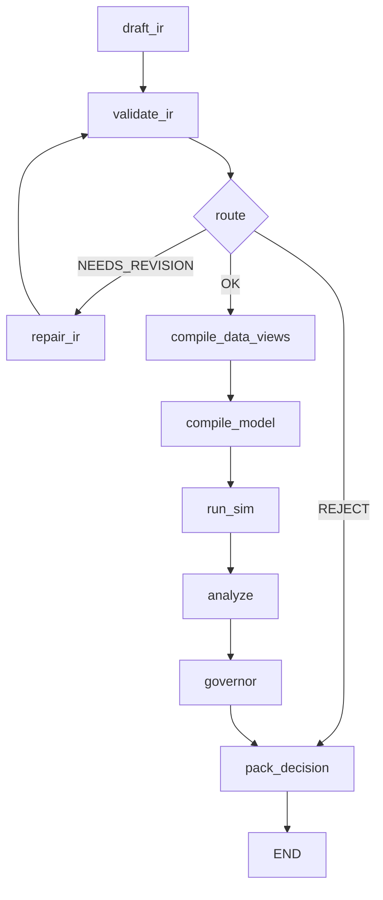

# Architecture for `polisyos/policy-engine` — As‑Is (2026‑01) and To‑Be v2.0

Этот документ фиксирует два состояния:

1) **As‑Is** — “как реально устроено сейчас” (по коду и тестам в репозитории).
2) **To‑Be v2.0** — целевая архитектура, которую мы хотим получить (в терминах слоёв, контрактов и потоков).

Документ написан так, чтобы по нему можно было:

- быстро понять “что здесь правда, а что только в README”,
- увидеть текущие разрывы (legacy, дублирования, несовпадение семантик),
- двигаться по слоям в правильном порядке и иметь критерии Done‑of‑Layer.

Репозиторий: один Python‑проект `policy-engine/`, корень содержит `architecture.md` и директорию `policy-engine/`.

---

## 0) Общая карта слоёв (порядок работы)

**Почему именно так:** верхние слои компилируются/исполняются только при стабильных контрактах (Core/IR) и стабильной эпистемологии (Fabric). Foundry — “физика” на базе этих контрактов и данных. Scientist — управляющая автоматика поверх устойчивой физики и данных.

**Порядок работ (нормативный):**

1) **Core & IR (Конституция)**: типы и протоколы. Если меняются — ломается всё.
2) **Fabric (Эпистемология/Факты)**: факты, provenance, доступ к данным только через UDF.
3) **Foundry (Физика мира)**: PatchVM/ProgramGraph, вычислительная модель изменений состояния.
4) **Scientist (Мозг/Воля)**: workflow и self‑healing, которые “включаются”, когда слои ниже стабильны.

Инфраструктура прогона сейчас разделена между:

- `polisyos.core` (CAS, contracts, registry bundle, RunContext),
- `polisyos.runtime` (runs/<run_id>/ manifest + audit + filesystem artifacts).

В To‑Be v2.0 это будет сведено к единому протоколу исполнения.

---

## 1) Словарь терминов (кратко)

- **IR v2.0 / PolicySurfaceIR**: основной контракт политики (semantic + advisory) — `policy-engine/src/polisyos/ir/surface.py`.
- **IR v1.x / PolicyRequestIR**: legacy‑контракт — `policy-engine/src/polisyos/ir/contract.py`.
- **ProgramGraph / ExecPlan**: компилированная программа Foundry — `policy-engine/src/polisyos/core/contracts/foundry.py`.
- **PatchVM**: “патч‑ориентированная” модель изменений (delta/set + merge rules) — `policy-engine/src/polisyos/foundry/patch_vm.py`.
- **CAS (FileSystemCAS)**: content‑addressed store (sha256) — `policy-engine/src/polisyos/core/artifacts/store.py`.
- **Runtime runs/**: файловый лог прогона (manifest + artifacts + audit) — `policy-engine/src/polisyos/runtime/*`.
- **UDF**: безопасная компиляция `DataViewRequest → SQL/Cypher` — `policy-engine/src/polisyos/fabric/udf/*`.

---

## 2) As‑Is: логическая архитектура по слоям (по фактическому коду)

### 2.1) Core (инфраструктура и “протоколы”)

**Что есть:**

- `polisyos.core.artifacts`:
  - `ArtifactID` (sha256),
  - `ArtifactManifest`/`ArtifactRef`,
  - `FileSystemCAS` и `PutOptions` (atomic writes, verify) — `policy-engine/src/polisyos/core/artifacts/store.py`.
- `polisyos.core.contracts.*`:
  - **Foundry contracts**: `ProgramGraph`, `ExecPlan`, `PatchOp`, `StateDelta`, `Metrics` — `policy-engine/src/polisyos/core/contracts/foundry.py`.
  - **Fabric contracts**: `FabricResult`, refs и т.п.
- `polisyos.core.registry`: сборка и загрузка bundle реестров (mechanisms/slots/merge/constraints/metrics/selector_fields/units).
- `polisyos.core.run`: `RunContext` и `RunManifest` (не путать с `polisyos.runtime`).

**Что важно:**

- `FileSystemCAS` активно используется Foundry/Scientist (compile/execute).
- Внешняя “операционная” папка `runs/` с audit/manifest живёт в отдельном модуле `polisyos.runtime`.

### 2.2) IR (контракты и линковка)

**As‑Is факт: IR двуголовый (v2.0 + legacy v1.x).**

1) **PolicySurfaceIR (v2.0)** — основной контракт:
   - `policy-engine/src/polisyos/ir/surface.py` (`schema_version = "2.0"`).
   - Используется в новом workflow (`flow_nodes.py`) и в новом Foundry compiler (`compile_surface_policy`).

2) **PolicyRequestIR (legacy)** — сохраняется:
   - `policy-engine/src/polisyos/ir/contract.py` (используется `tools/gen_schema.py`, legacy compiler, ручные/старые сценарии).

**Поддерживающая инфраструктура v2.0:**

- kernel‑реестры:
  - механизмы: `policy-engine/src/polisyos/ir/kernel/mechanisms.py`,
  - слоты: `policy-engine/src/polisyos/ir/kernel/slots.py`,
  - merge rules: `policy-engine/src/polisyos/ir/kernel/merge_rules.py`,
  - selector fields: `policy-engine/src/polisyos/ir/kernel/selector_fields.py`,
  - constraints/metrics/units: `policy-engine/src/polisyos/ir/kernel/*`.
- линковка/валидация v2.0:
  - `link_policy(...)` + проверки конфликтов расписаний/merge rule — `policy-engine/src/polisyos/ir/linker.py`.
- факт‑контракты:
  - `Fact`, `FactSegmentManifest` и др. — `policy-engine/src/polisyos/ir/fact_log.py`.

**Техническая деталь, которая влияет на To‑Be:**

- `policy-engine/tools/gen_schema.py` генерирует JSON Schema **для legacy** `PolicyRequestIR`, а не для `PolicySurfaceIR`.

### 2.3) Fabric (данные, UDF, evidence)

**Ingestion (`policy-engine/src/polisyos/fabric/ingestion.py`) делает сразу три вещи:**

1) валидирует raw CSV → пишет staging/curated Parquet;
2) грузит curated данные в DuckDB (`macro_history`, `agents_snapshot`, `entity_resolution`) и Kùzu (agents/interactions);
3) параллельно пишет immutable факт‑сегменты (Parquet) в `curated_dir/fact_log/` и индекс `_segments.jsonl`.

**FactLog (как “append‑only источник истины”) существует, но не является источником для UDF:**

- сегменты фактов пишутся (через `polisyos.fabric.fact_writer.write_fact_segment`);
- `polisyos.fabric.materializer.materialize_duckdb_from_fact_log(...)` — заглушка, не делает pivot/insert.

**UDF (`policy-engine/src/polisyos/fabric/udf/*`):**

- Whitelist/PII gate включены:
  - проверка разрешённых колонок + access tier — `policy-engine/src/polisyos/fabric/udf/compiler.py`;
  - покрыто контрактными тестами `policy-engine/tests/contract/test_fabric_gates.py`.
- Выполнение запросов:
  - читает **DuckDB напрямую** (`SimulationDB.conn.execute(...)`), без materialization из FactLog — `policy-engine/src/polisyos/fabric/udf/engine.py`;
  - сохраняет request/plan/result в CAS (result как parquet‑байты в CAS) и возвращает `FabricResult` с evidence.

**Критическая As‑Is особенность:**

- UDFEngine, если `graph=None`, всё равно создаёт `GraphStore()` по умолчанию (даже для чисто табличных запросов).

### 2.4) Foundry (PatchVM, ProgramGraph, legacy kernel)

**Foundry сейчас — это “две эпохи” + отдельный JAX‑executor для calibration:**

1) **Legacy экономика**:
   - `_legacy/engine/kernel.py` + `_legacy/engine/logic.py`.
   - `polisyos.foundry.engine.*` — deprecated реэкспорт из `_legacy`.
   - Используется “ручными” скриптами/демо, но не ядром нового workflow.

2) **ProgramGraph + PatchVM путь**:
   - compiler → `ProgramGraph`/`ExecPlan`:
     - `policy-engine/src/polisyos/foundry/compiler.py` (surface IR → ProgramGraph).
   - executor (CAS‑ориентированный):
     - `execute_program_graph(...)`, `apply_state_delta(...)` — `policy-engine/src/polisyos/foundry/executor.py`.
   - PatchVM:
     - merge patch records по правилам merge rules — `policy-engine/src/polisyos/foundry/patch_vm.py`.

**PatchVM/patch ops As‑Is ограничения (важно для v2.0):**

- на уровне применения state delta поддерживаются только `op in {"add", "set"}` и только один “тип множественности”:
  - несколько ops на слот допускаются только если все `add`; иначе исключение (`Multiple patch ops for a slot are not supported`) — `policy-engine/src/polisyos/foundry/executor.py`.
- `PatchOp` определён в `core.contracts.foundry`, но `UpdateOp` (с priority/clamp/masked) сейчас не интегрирован в executor.

**Merge rules As‑Is:**

- IR/kernel: `sum / override / priority / error` — `policy-engine/src/polisyos/ir/kernel/merge_rules.py`.
- В PatchVM:
  - `sum` → `add`,
  - `override/priority/error` → `set` (c выбором “победителя”).
- В pure_executor (см. ниже) семантика `override/error` отличается от PatchVM (использует rank и не бросает ошибку для `ERROR`).

3) **Pure Executor (только для calibration/runtime‑JAX)**
   - `policy-engine/src/polisyos/foundry/calibration/pure_executor.py`.
   - работает в `jax.lax.scan`, не ходит в CAS в цикле;
   - но unroll’ит узлы python‑циклом (компиляция растёт с числом узлов);
   - и реализует merge rules иначе, чем PatchVM executor (это архитектурный риск).

### 2.5) Scientist (workflow, self‑healing, legacy)

**Новая линия (используется integration‑тестами):**

- entrypoint:
  - `polisyos.scientist.run_experiment()` → `build_workflow().invoke(...)` — `policy-engine/src/polisyos/scientist/__init__.py`.
- workflow:
  - `policy-engine/src/polisyos/scientist/orchestrator/workflow.py`.
- узлы:
  - `policy-engine/src/polisyos/scientist/orchestrator/flow_nodes.py`.

**As‑Is поток workflow (фактически):**

**Что реально делает simulation path:**

- `compile_model_node` компилирует `PolicySurfaceIR → ProgramGraph/ExecPlan` и логирует refs в runtime.
- `run_sim_node` формирует `JobSpec` и вызывает compute‑runner:
  - `run_job(...)` → `execute_program_graph(...)` → `apply_state_delta_and_snapshot(...)` — `policy-engine/src/polisyos/scientist/compute/runner.py`.

**As‑Is self‑healing ограничен маршрутизацией:**

- `repair_ir` вызывается только после `validate_ir` при `NEEDS_REVISION`.
- ошибки/NEEDS_REVISION, возникшие в `compile_model` или `run_sim`, **не возвращают** граф в `repair_ir` (узлы дальше “skipped” из‑за `_blocked_by_feedback`).

**Legacy Scientist (соседствует, но не используется workflow):**

- `_legacy/nodes.py`, `_legacy/compiler.py` (PolicyRequestIR → CompositePolicy),
- `agent/drafter.py` (старый подход к repair‑логам в state),
- deprecated stubs в `orchestrator/nodes.py`, `orchestrator/compiler.py`.

**Отдельно: “ручный запуск” остаётся legacy и внутренне несовместим:**

- `policy-engine/run_experiment.py` делает ручной цикл с `MockAgent` и `compile_policy` (legacy) + `SimulationKernel.step`.
- при этом `MockAgent.decide` возвращает `PolicySurfaceIR`, а legacy `compile_policy` ожидает `PolicyRequestIR` — это “стык эпох”, который надо закрыть в To‑Be.

### 2.6) Runtime (runs/<run_id>, audit, filesystem artifacts)

`polisyos.runtime` — отдельный инфраструктурный слой поверх файловой системы (не CAS):

- `start_run`, `log_artifact`, `append_audit`, budgets — `policy-engine/src/polisyos/runtime/api.py`.
- `ArtifactRef.relative_path` используется как основной переносимый указатель (в `api.py` path и relative_path совпадают и оба относительны к `base_dir`).

**As‑Is нюанс:** в системе одновременно живут два типа “артефактных ссылок”:

- CAS `core.artifacts.manifest.ArtifactRef` (kind/media_type + artifact_id),
- runtime `runtime.manifest.ArtifactRef` (artifact_type + relative_path).

### 2.7) Тесты и реальная зависимость от legacy

- `policy-engine/tests/integration/*` (7 тестов) используют `build_workflow()` и новый ProgramGraph‑путь; прямых импортов `*_legacy` в integration нет.
- Контрактные тесты по gates/контрактам (`tests/contract/*`) проверяют Fabric UDF whitelist и evidence.

---

## 3) As‑Is: ключевые разрывы, которые влияют на дизайн v2.0

1) **IR двуголовый**: `PolicySurfaceIR` и `PolicyRequestIR` сосуществуют, schema snapshot (`tools/gen_schema.py`) привязан к legacy.
2) **Foundry “patch‑first” не доведён до конца**:
   - механизмам разрешён `step()`, `emit_patches` опционален;
   - PatchOp поддерживает только `add/set` и нет атомарных scatter/graph ops.
3) **Два executors с разной семантикой merge rules** (CAS executor vs pure_executor) → риск “калибровка ≠ исполнение”.
4) **Fabric не “FactLog‑first”**: ingestion пишет и в DuckDB, и в FactLog; materializer не восстановит DuckDB.
5) **Scientist self‑healing не замкнут**: compile/run ошибки не возвращаются в repair loop.
6) **Скрипты‑петли (run_experiment.py) не являются публичной точкой входа и ломают слои**.

---

## 4) To‑Be v2.0: обновлённая целевая архитектура

Ниже — целевое состояние (v2.0) в формате “слой → обязанности → To‑Be логика → критерии завершения”.

### 4.0) Главная цель v2.0

Система становится строго компиляторной трубой:

`NL → Scientist workflow → PolicySurfaceIR → link/compile → ProgramGraph → (PatchVM / PureExecutor) → Artifacts`

и при этом:

- **данные доступны только через UDF**, который стоит на FactLog;
- **изменения состояния только через патчи**, а не через “мутирование state”;
- **workflow самовосстанавливается**, замыкая ошибки компиляции и исполнения обратно в repair loop.

---

## 5) Слой 1: Core & IR (Конституция)

### 5.1) `ir.contracts` (чистка legacy)

**To‑Be:**

- `policy-engine/src/polisyos/ir/contract.py` (v1.x) — **удалён**.
- `policy-engine/src/polisyos/ir/surface.py` (v2.0) — **единственный источник истины** структуры политики.
- `policy-engine/src/polisyos/ir/kernel/mechanisms.py` — содержит типизированные параметры для всех механизмов (включая будущие complex mechanisms).

**Инструменты/гейты:**

- `policy-engine/tools/gen_schema.py` переводится на `PolicySurfaceIR` и перестаёт импортировать legacy типы.
- Контрактные тесты (`policy-engine/tests/contract/*`) не должны импортировать/валидировать legacy модели.

### 5.2) `ir.fact_log` (контракты фактов)

**To‑Be:**

- `Fact` заморожен по полям и смыслу:
  - `subject_id`, `predicate_id`, `object_value/target_id`, `valid_time`, `provenance`, + системные мета‑поля (`tx_time`, trust/legal).
- `FactSegmentManifest` строго определён и стабилен (чтобы Materializer мог читать без “угадываний”).

### 5.3) `core.contracts.foundry` (протокол симуляции и патчи)

**To‑Be:**

- Единый стандарт на операцию обновления:
  - либо фиксируем `PatchOp` (`ADD`/`SET`) как внешний контракт,
  - либо делаем `UpdateOp` внешним, но executor обязан его понимать.
- Для сложных механизмов допускается `ScatterOp`/`IndexedSet` (обновление по списку индексов), но:
  - это инкапсулировано внутри Foundry,
  - наружу всё равно уходит “стандартный” `StateDelta` как артефакт (с воспроизводимым применением).

**Критерий завершения слоя 1:**

- JSON Schema (через `tools/gen_schema.py`) **не содержит ссылок** на legacy‑типы.
- `pytest policy-engine/tests/contract -q` проходит.

---

## 6) Слой 2: Fabric (Эпистемология)

### 6.1) Fact Writer / Ingestion (запись)

**Контекст:** `policy-engine/src/polisyos/fabric/ingestion.py`

**To‑Be логика:**

- ingestion pipeline **никогда** не пишет напрямую в DuckDB как “источник истины”.
- вместо этого:
  - пишет FactSegments (parquet фактов) в `data/facts/` (или эквивалентную директорию FactLog),
  - для каждого прогона пишет `FactSegmentManifest` в CAS,
  - DuckDB является кэшем/материализованным представлением, а не первичным хранилищем.

### 6.2) Materializer (восстановление)

**Контекст:** `policy-engine/src/polisyos/fabric/materializer.py` (сейчас заглушка).

**To‑Be логика:**

- `ensure_materialized(db, fact_manifests)`:
  1) читает `_meta_segments` в DuckDB (какие сегменты уже применены);
  2) для новых сегментов:
     - читает parquet сегмента,
     - делает pivot/transform в реляционные таблицы,
     - вставляет данные в `macro_history`, `agents_snapshot`, `entity_resolution` и т.п.,
     - фиксирует applied‑segment в `_meta_segments`.
- Это **единственный мост** между “фактами” и “SQL”.

### 6.3) UDF Engine (чтение)

**Контекст:** `policy-engine/src/polisyos/fabric/udf/engine.py`

**To‑Be логика:**

- `UDFEngine.query()` перед выполнением SQL вызывает `Materializer.ensure_materialized(...)`.
- Строгий запрет:
  - UDF **не читает** локальные CSV/Parquet “сбоку”,
  - только то, что прошло через FactLog → Materializer → DuckDB.

**Критерий завершения слоя 2:**

- удаляем `*.duckdb`, запускаем materializer на FactLog → восстанавливаем DB детерминированно;
- UDF‑запросы работают на восстановленной базе.

---

## 7) Слой 3: Foundry (Физика / Ядро)

### 7.1) Интерфейс `Mechanism` (patch‑first)

**Контекст:** `policy-engine/src/polisyos/foundry/base.py`

**To‑Be логика:**

- `step()` **удалён** (или бросает исключение).
- `emit_patches(state, key, ...)` — единственный абстрактный метод, обязателен для всех механизмов.
- Вводится `ComplexMechanism(Mechanism)`:
  - внутри разрешены сложные вычисления (matching, graph algorithms),
  - на выходе — строго “патчи”, которые можно слить/apply детерминированно (например, `SET` для полного вектора `agents.employer_id`).

### 7.2) Pure Executor (JAX runtime)

**Контекст:** `policy-engine/src/polisyos/foundry/calibration/pure_executor.py`

**To‑Be логика:**

- PureExecutor становится **единственным** способом запускать Foundry симуляцию в workflow (через runner).
- Merge rules и поведение patch‑apply полностью совпадают с “Python/CAS executor”:
  - одинаковые tie‑break,
  - одинаковая семантика `ERROR`.
- Legacy kernel (`foundry/_legacy/engine/*`) удалён.

### 7.3) Механизмы (Fiscal + Complex)

**Контекст:** `policy-engine/src/polisyos/foundry/fiscal.py` и новые файлы.

**To‑Be логика:**

- налоговые/фискальные механизмы полностью переписаны на `emit_patches`.
- логика рынка труда из legacy (`_legacy/engine/logic.py`) переносится в `LaborMarketMechanism` (ComplexMechanism) и возвращает патчи.

**Критерий завершения слоя 3:**

- `pytest policy-engine/tests/foundry -q` проходит на PureExecutor.
- в коде нет прямых мутаций state (“state.x += ...”), только патчи.

---

## 8) Слой 4: Scientist (Мозг / Оркестратор)

### 8.1) Flow Nodes (единая реализация)

**Контекст:** `policy-engine/src/polisyos/scientist/orchestrator/flow_nodes.py`

**To‑Be логика:**

- `run_sim`:
  - формирует `JobSpec`,
  - вызывает runner (compute plane),
  - получает `ArtifactRef` (CAS) и не знает деталей JAX.
- `repair_ir`:
  - получает не только JSON/Pydantic validation ошибки,
  - но и ошибки linker/compiler/runtime (в виде структурированных issue payloads).
- `_legacy/nodes.py` и прочие дубликаты удалены.

### 8.2) Workflow graph (замкнутые feedback loops)

**Контекст:** `policy-engine/src/polisyos/scientist/orchestrator/workflow.py`

**To‑Be логика:**

- добавлены обратные ребра:
  - `compile_model` error → `repair_ir`,
  - `run_sim` error → `repair_ir`.
- workflow становится самовосстанавливающимся циклом с bounded attempts (max_repair_attempts).

### 8.3) Entrypoint (никакой бизнес‑логики в корне)

**Контекст:** `policy-engine/run_experiment.py`

**To‑Be логика:**

- файл переписан в “конфигуратор workflow”:
  - CLI args → state/config → `workflow.invoke()`.
- никаких ручных циклов `UDF → Agent → compile → kernel.step`.

**Критерий завершения слоя 4:**

- `python policy-engine/run_experiment.py "Lower taxes"` запускает полный цикл Draft→Sim→Repair→Result без падений,
- используя только FactLog + UDF + PatchVM/PureExecutor.

---

## 9) Как работать по плану (операционный порядок)

1) **Слой 1 (Core/IR):**
   - игнорируем Scientist/Foundry;
   - правим только IR/Core;
   - тестируем `tests/contract`.
2) **Слой 2 (Fabric):**
   - игнорируем Foundry;
   - заставляем данные течь FactLog → Materializer → UDF;
   - тестируем `tests/fabric` и контрактные gates.
3) **Слой 3 (Foundry):**
   - переписываем механизмы на патчи,
   - вычищаем legacy kernel,
   - выравниваем семантику merge между executors;
   - тестируем `tests/foundry`.
4) **Слой 4 (Scientist):**
   - собираем всё в LangGraph,
   - добавляем feedback loops,
   - переписываем entrypoint;
   - тестируем `tests/integration`.
