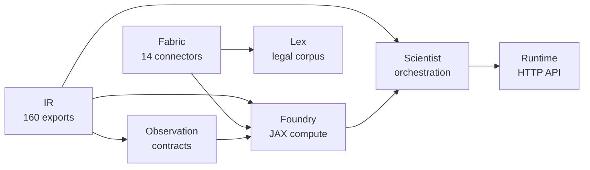

# PolicyOS Policy Engine

[](https://github.com/DenisKopylov/polisyos/actions/workflows/arch.yml)


_AI-driven Policy Simulation System using JAX and Unified Data Fabric_

## Motivation

Policy evaluation rarely fits into a single simulator: it needs causal inference, heterogeneous data
integration, and governance checks before a recommendation is safe to ship. PolicyOS Policy Engine
addresses that by treating policy design, modeling, data acquisition, and runtime control as one
reproducible system. Its IR layer is the stabilizing boundary between those concerns, so the same
problem definition can move from ingestion to compilation, execution, and review without ad hoc
translation steps.

## Key Capabilities

- **IR**: 160 public exports in the lazy facade, ABI-oriented contracts, and 82 snapshot JSON
  Schemas in `schemas/snapshots/ir/`.
- **Foundry**: JAX-based `compile() -> execute()` pipeline, measurement-aware calibration, and
  agent simulation wiring for policy experiments.
- **Scientist**: workflow orchestration, 19 built-in governance pass factories, policy search, and
  causal ensemble / transportability surfaces.
- **Lex**: legal corpus -> NormPack pipeline, SPO extraction, hallucination detection, amendment
  handling, and temporal resolution for legal evaluation.
- **Fabric**: 14 production connector families, 32 built-in source profiles, `SourceExecutionPolicy`
  normalization, and async-fetch-aware ingestion paths.
- **Observation**: 133+ observation and contract models, causal-readiness bundles, and measurement
  trust tiers used by calibration and governance flows.
- **Runtime**: FastAPI runtime surface with 52 HTTP route handlers, control-plane services, and a
  React dashboard for operators.

## Architecture Diagram



## Quickstart

```bash
git clone https://github.com/DenisKopylov/polisyos.git && cd polisyos/policy-engine
pip install -e ".[all]"
polisyos --version
```

The snippet below builds a trivial fiscal `ProblemFrame(problem_id="demo", domain=FISCAL)` plus one
tax intervention, then calls Foundry `compile()` and `execute()` end to end:

```python
from pathlib import Path
from polisyos.core.artifacts.store import FileSystemCAS
from polisyos.core.contracts.foundry import CompileRequest, ExecuteRequest
from polisyos.core.registry import build_default_registry_bundle
from polisyos.foundry.quickstart import build_trivial_trinity_bundle, prepare_trivial_input_bindings, put_trivial_trinity_bundle
from polisyos.foundry.compile.api import compile as compile_foundry
from polisyos.foundry.execute.api import execute as execute_foundry

store = FileSystemCAS(Path(".polisyos/cas"))
registry = build_default_registry_bundle(store)
bundle = build_trivial_trinity_bundle(str(registry.bundle_ref.artifact_id))
policy_ref = put_trivial_trinity_bundle(store, bundle)
compiled = compile_foundry(store, CompileRequest(input_kind="trinity", policy_ref=policy_ref, registry_bundle_ref=registry.bundle_ref))
bindings_ref = prepare_trivial_input_bindings(store, registry.bundle_ref)
executed = execute_foundry(store, ExecuteRequest(exec_plan_ref=compiled.exec_plan_ref, input_bindings_ref=bindings_ref, registry_bundle_ref=registry.bundle_ref))
print({"compiled": compiled.ok, "executed": executed.ok})
```

## Project Structure

| Directory | Purpose |
|---|---|
| `src/polisyos/ir/` | Intermediate Representation: types, schemas, contracts |
| `src/polisyos/foundry/` | JAX compute engine, calibration, agent simulation |
| `src/polisyos/scientist/` | Orchestration: workflows, governance, nodes |
| `src/polisyos/lex/` | Legal corpus processing, NormPack, interventions |
| `src/polisyos/fabric/` | Data connectors, profiles, world store |
| `src/polisyos/runtime/` | HTTP API, dashboard, control plane |
| `schemas/` | JSON Schema snapshots used as ABI checkpoints |
| `benchmarks/` | Performance and correctness benchmarks |
| `docs/` | Documentation in Diataxis structure |

## Development Setup

```bash
pip install -e ".[dev,test]"
pytest tests/ -x --tb=short
mkdocs serve
```

## Documentation

| Section | Path |
|---|---|
| Docs Site | [PolicyOS Documentation](https://deniskopylov.github.io/polisyos/) |
| Tutorials | [Tutorials](https://deniskopylov.github.io/polisyos/tutorials/) |
| How-to | [How-to Guides](https://deniskopylov.github.io/polisyos/how-to/) |
| Reference | [Reference](https://deniskopylov.github.io/polisyos/reference/) |
| ADRs | [ADRs](https://deniskopylov.github.io/polisyos/adr/) |

## License

This repository does not yet ship a standalone `LICENSE` file. Until a license text is published,
treat the project as proprietary / internal-use only.
