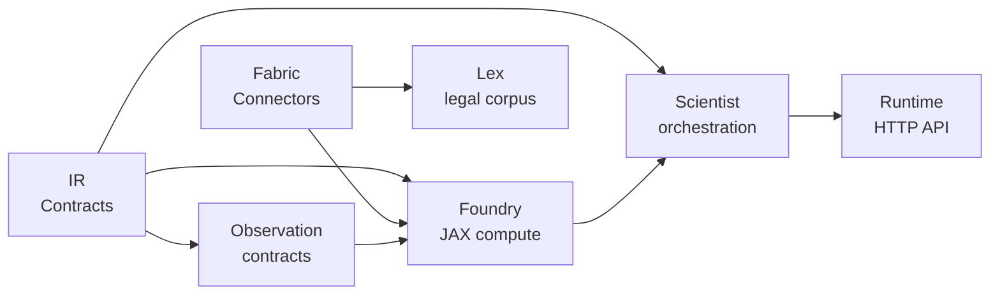

# PolicyOS Policy Engine

[](https://github.com/DenisKopylov/polisyos/actions/workflows/ci.yml)


_AI-driven Policy Simulation System using JAX and Unified Data Fabric_

> Canonical product root: эта директория. Workspace root выше по дереву является
> только gateway и repo control plane.

## Motivation

Policy evaluation rarely fits into a single simulator: it needs causal inference, heterogeneous data
integration, and governance checks before a recommendation is safe to ship. PolicyOS Policy Engine
addresses that by treating policy design, modeling, data acquisition, and runtime control as one
reproducible system. Its IR layer is the stabilizing boundary between those concerns, so the same
problem definition can move from ingestion to compilation, execution, and review without ad hoc
translation steps.

## Key Capabilities

- **IR**: lazy public facade, ABI-oriented contracts, and committed schema snapshots used as
  compatibility checkpoints.
- **Foundry**: JAX-oriented `compile() -> execute()` pipeline, measurement-aware calibration, and
  agent-simulation support for policy experiments.
- **Scientist**: workflow orchestration, governance pass registry, policy search, and
  causal/transportability surfaces.
- **Lex**: legal corpus -> NormPack pipeline, SPO extraction, amendment handling, temporal
  resolution, and policy-facing intervention compilation.
- **Fabric**: production connector families, built-in source profiles, `SourceExecutionPolicy`
  normalization, and async-ingestion-aware data-plane paths.
- **Observation**: observation contracts, causal-readiness bundles, and measurement-trust tiers
  used by calibration and governance flows.
- **Runtime**: FastAPI runtime surface, control-plane services, and a React dashboard for
  operators.

## Architecture Diagram



## Quickstart

```bash
git clone https://github.com/DenisKopylov/polisyos.git && cd polisyos/policy-engine
python3 -m tools.cli workspace bootstrap
python3 -m tools.cli workspace doctor
uv run polisyos --version
```

Contributor baseline зафиксирован как Python `3.14.x`, Node `22.x`, `uv 0.9.21` как
канонический Python environment manager. Для fast local gate используйте
`python3 -m tools.cli workspace verify`. Для более тяжёлой локальной проверки,
близкой к CI, используйте
`python3 -m tools.cli workspace ci-parity --skip-browser`.

The snippet below builds a trivial fiscal `ProblemFrame(problem_id="demo", domain=FISCAL)` plus one
tax intervention, then calls Foundry `compile()` and `execute()` end to end:

```python
from pathlib import Path
from polisyos.core.artifacts.store import FileSystemCAS
from polisyos.core.contracts.foundry import CompileRequest, ExecuteRequest
from polisyos.core.registry import build_default_registry_bundle
from polisyos.foundry.quickstart import build_trivial_trinity_bundle, prepare_trivial_input_bindings, put_trivial_trinity_bundle
from polisyos.foundry.compile.api import compile as compile_foundry
from polisyos.foundry.execute.api import execute as execute_foundry

store = FileSystemCAS(Path(".polisyos/cas"))
registry = build_default_registry_bundle(store)
bundle = build_trivial_trinity_bundle(str(registry.bundle_ref.artifact_id))
policy_ref = put_trivial_trinity_bundle(store, bundle)
compiled = compile_foundry(store, CompileRequest(input_kind="trinity", policy_ref=policy_ref, registry_bundle_ref=registry.bundle_ref))
bindings_ref = prepare_trivial_input_bindings(store, registry.bundle_ref)
executed = execute_foundry(store, ExecuteRequest(exec_plan_ref=compiled.exec_plan_ref, input_bindings_ref=bindings_ref, registry_bundle_ref=registry.bundle_ref))
print({"compiled": compiled.ok, "executed": executed.ok})
```

## Project Structure

| Directory | Purpose |
|---|---|
| `src/polisyos/ir/` | Intermediate Representation: types, schemas, contracts |
| `src/polisyos/foundry/` | JAX compute engine, calibration, agent simulation |
| `src/polisyos/scientist/` | Orchestration: workflows, governance, nodes |
| `src/polisyos/lex/` | Legal corpus processing, NormPack, interventions |
| `src/polisyos/fabric/` | Data connectors, profiles, world store |
| `src/polisyos/runtime/` | HTTP API, dashboard, control plane |
| `schemas/` | JSON Schema snapshots used as ABI checkpoints |
| `benchmarks/` | Performance and correctness benchmarks |
| `docs/` | Documentation in Diataxis structure |

## Development Setup

```bash
python3 -m tools.cli workspace bootstrap
python3 -m tools.cli workspace doctor
python3 -m tools.cli workspace verify --backend-only
uv run --extra docs python -m mkdocs serve
```

## Contributor Command Map

```bash
python3 -m tools.cli workspace bootstrap
python3 -m tools.cli workspace doctor
python3 -m tools.cli workspace verify
python3 -m tools.cli workspace acceptance-audit
uv run polisyos-tools architecture guardrails check
uv run polisyos-tools architecture scaffold --help
uv run --extra runtime --extra ml polisyos-tools runtime check-runtime-api-contract
uv run --extra ml polisyos-tools diagnostics gen-schema --check
```

## If You Need to Change X, Start Here

| Change | Start here |
|---|---|
| Public package facade / supported imports | `architecture/public_surface.toml`, `src/polisyos/*/__init__.py`, `docs/reference/public-surface.md` |
| Generated contract artifact | `architecture/generated_artifacts.toml`, `docs/reference/generated-artifacts.md`, then the source generator |
| New connector | `uv run polisyos-tools architecture scaffold connector --name MySource --type REST --dry-run`, `docs/connectors/CONTRIBUTING.md` |
| New governance pass | `uv run polisyos-tools architecture scaffold governance-pass --name my_pass --output ... --test-output ... --dry-run`, `docs/how-to/write-governance-pass.md` |
| New runtime route | `uv run polisyos-tools architecture scaffold runtime-route --name my_route --output ... --dry-run`, `src/polisyos/runtime/http/routes/README.md` |
| New benchmark | `uv run polisyos-tools architecture scaffold benchmark --suite causal --name my_case --output ... --dry-run`, `docs/how-to/run-benchmarks.md` |
| New subsystem / major surface | `docs/reference/ratchet-policy.md`, `uv run polisyos-tools architecture scaffold package-readme --module ... --output ... --dry-run` |
| Repo-wide acceptance closeout | `docs/reference/operations/platform-acceptance-audit.md`, `python3 -m tools.cli workspace acceptance-audit` |
| New ADR / runbook | `uv run polisyos-tools architecture scaffold adr ...` or `uv run polisyos-tools architecture scaffold runbook ...` |

## Documentation

| Section | Path |
|---|---|
| Docs Site | [PolicyOS Documentation](https://deniskopylov.github.io/polisyos/) |
| Tutorials | [Tutorials](https://deniskopylov.github.io/polisyos/tutorials/) |
| How-to | [How-to Guides](https://deniskopylov.github.io/polisyos/how-to/) |
| Reference | [Reference](https://deniskopylov.github.io/polisyos/reference/) |
| Explanation | [Explanation](https://deniskopylov.github.io/polisyos/explanation/) |
| ADRs | [ADRs](https://deniskopylov.github.io/polisyos/adr/) |
| Public Surface | [Public Surface](https://deniskopylov.github.io/polisyos/reference/public-surface/) |
| Generated Artifacts | [Generated Artifacts](https://deniskopylov.github.io/polisyos/reference/generated-artifacts/) |
| Ratchet Policy | [Ratchet Policy](https://deniskopylov.github.io/polisyos/reference/ratchet-policy/) |
| Platform Acceptance Audit | [Platform Acceptance Audit](https://deniskopylov.github.io/polisyos/reference/operations/platform-acceptance-audit/) |

## License

This repository does not yet ship a standalone `LICENSE` file. Until a license text is published,
treat the project as proprietary / internal-use only.
