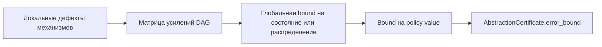
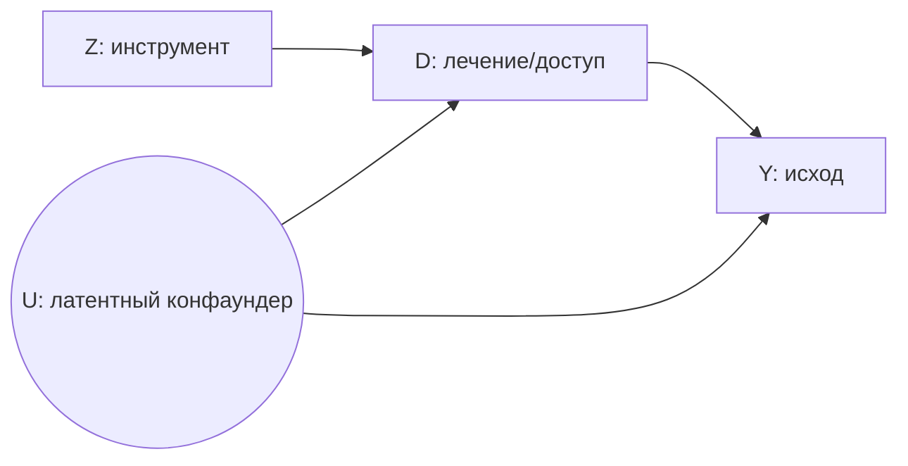
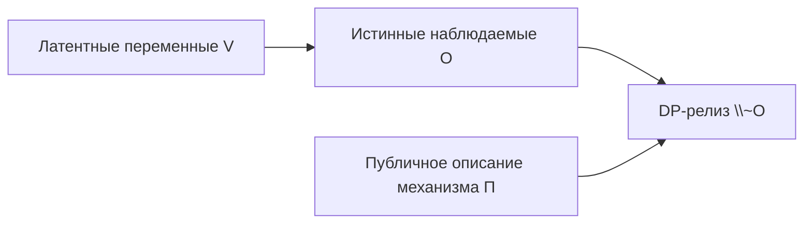

# Causal Engine Phased Implementation Plan

This document converts the research-result compendium into a phased implementation plan. One stage equals one original research subpoint (for example, `2.1`). Stages grouped inside the same phase are intended to run in parallel by default; only the explicitly listed precedence edges are sequential inside or across phases.

## Contents

1. [Planning assumptions preserved from the research-result version](#1-planning-assumptions-preserved-from-the-research-result-version)
2. [Phase map](#2-phase-map)
3. [Cross-phase operating model](#3-cross-phase-operating-model)
4. [Phase 1 — First production unlocks and certificate foundations](#phase-1--first-production-unlocks-and-certificate-foundations)
5. [Phase 2 — Query expansion and first production-facing upgrades](#phase-2--query-expansion-and-first-production-facing-upgrades)
6. [Phase 3 — Dependency-driven advanced integration](#phase-3--dependency-driven-advanced-integration)
7. [Phase 4 — Consolidation, promotion, completeness, and long-horizon moat](#phase-4--consolidation-promotion-completeness-and-long-horizon-moat)
8. [Appendix A — Original dependency and parallelization map](#appendix-a--original-dependency-and-parallelization-map)
9. [Appendix B — Original anti-swamp governance for research tracks](#appendix-b--original-anti-swamp-governance-for-research-tracks)
10. [Appendix C — Original research economics and kill rules](#appendix-c--original-research-economics-and-kill-rules)
11. [Appendix D — Original open problem catalog](#appendix-d--original-open-problem-catalog)

---

## 1. Planning assumptions preserved from the research-result version

The phased plan keeps the original research-first assumptions, success criteria, and priority logic. Those assumptions are preserved here because they define what counts as an implementation-ready research result and therefore what it means for a stage to exit a phase.

### 1.1. What "research-first" means here

A task is research-first if at least one of the following holds:

1. **No known theorem covers it**: the mathematical result needed does not yet exist or is not known to apply to the system's setting. Implementing without it means either building a system with false guarantees or building a system that silently falls back to a worse solution without saying so.

2. **The theorem exists but the formalization is open**: the result is known in the literature but translating it into a typed contract, a computable certificate, or a sound estimator requires non-trivial work that cannot be done without first understanding the formal conditions.

3. **The approach is inherently assumption-heavy and the right assumptions are unknown**: the implementation would require making choices that determine the mathematical soundness of the system, and those choices require research to validate.

4. **The deliverable is inherently a counterexample or impossibility result**: you cannot implement "the proof that X is impossible" without doing the mathematics first.

### 1.2. What counts as a sufficient research result

For each track, this document specifies what constitutes a result that unlocks the corresponding implementation. The bar is:

- a **theorem with conditions** (sufficient conditions that are machine-checkable, or a clear statement that says under which inputs the result holds), or
- an **impossibility result with a counterexample class** (which tells the system when to block and why), or
- a **reduction to a known solvable problem** (which tells the system what to compute and with what tool).

A sketch, a conjecture, or a heuristic that "usually works" does not unlock implementation.

### 1.3. How research runs alongside implementation

Research tracks can run in parallel with the implementation plan. They are not blockers for Wave 1 or Wave 2 engineering. The dependency is the other direction: implementation results from Wave 1 (in particular, A.1 + A.2 + A.4) make research more productive by providing:

- a canonical form for proof artifacts (`ProofBundle`, `BoundsBundle`);
- a data readiness oracle for empirical research questions;
- a judge stack that can give machine-readable verdicts on research artifacts when they mature.

Research conducted before these are available produces correct mathematics, but the integration work on graduation is higher.

### 1.4. Priority among research tracks

Not all tracks are equal. Based on the implementation plan's architecture, the policy system's needs, and external expert review (v2.0):

| Priority | Tracks | Reason |
|----------|--------|--------|
| Highest | Track 1 (compositional), Track 2 (sharp bounds) | Directly unlock production features; compositional is the primary moat |
| Highest | Track 10 (proximal), Track 11 (recoverability), Track 12 (intervention hierarchy) | **Expand the class of queries the proof kernel can accept.** These three tracks are the most practical gaps: they convert the engine from "strong identifier of effects" into "operating system of causal queries". Proximal handles hidden confounding via proxies (ubiquitous in admin data); recoverability handles missingness (ubiquitous in government data); intervention hierarchy handles realistic policy actions (which are never `do(X=x)`) |
| High | Track 3 (continuous-time + DSCM), Track 4 (OT) | Clear policy relevance; DSCM adds causal semantics for continuous-time/cyclic settings distinct from rough-path representation |
| High | Track 9 (topology / Hodge interference) | **Upgraded from long-horizon.** External review identifies this as the single most direct Fabric moat — it opens a problem class (higher-order group interactions, tenders, consortia, clustered spillovers) where EconML/CausalML have no native language |
| Medium | Track 5 (strategic), Track 6 (abstraction) | Unlock deeper versions of already-scoped reduced-scope engineering features |
| Medium | Track 7 (algebraic + semialgebraic) | Unlocks stronger version of E.1; semialgebraic negative certificates are architecturally valuable for proof kernel |
| Lower (long horizon) | Track 8 (latent), Track 13 (RKHS) | Very high potential moat; very high assumption load or does not expand query class |

---

## 2. Phase map

This section is intentionally compact. The detailed stage allocations appear only in the full phase sections below, so the document has a single unambiguous set of phase headings at level `##` and stage headings at level `###` in the form `Stage <track.subpoint>`.

| Phase | Purpose | Full section |
|---|---|---|
| Phase 1 — First production unlocks and certificate foundations | Root theorem/certificate contracts and the first direct production unlocks. | [Go to Phase 1](#phase-1--first-production-unlocks-and-certificate-foundations) |
| Phase 2 — Query expansion and first production-facing upgrades | Query-class expansion and the first production-facing theorem families. | [Go to Phase 2](#phase-2--query-expansion-and-first-production-facing-upgrades) |
| Phase 3 — Dependency-driven advanced integration | Dependency-heavy integration chains that build on earlier certificates. | [Go to Phase 3](#phase-3--dependency-driven-advanced-integration) |
| Phase 4 — Consolidation, promotion, completeness, and long-horizon moat | Latent promotion, completeness claims, and long-horizon moat work. | [Go to Phase 4](#phase-4--consolidation-promotion-completeness-and-long-horizon-moat) |

## 3. Cross-phase operating model

The phased implementation plan uses the same operating discipline as the research-result version, but it makes the phase gates explicit.

### 3.1. Stage unit

A stage is exactly one original research subpoint. This keeps implementation sequencing aligned with the original theorem/deliverable granularity and prevents phases from becoming vague baskets of work.

### 3.2. Parallelism rule

Stages inside one phase are parallel by default. A downstream stage may begin as soon as its predecessor artifact exists, even if both stages formally belong to the same implementation phase. This preserves the original “parallel investigations with explicit dependency edges” design while still giving engineering a phase-based execution order.

### 3.3. Promotion rule

Every stage starts life as `FrontierSketch` / `PROOF_ONLY` and must declare its benchmark proxy, required-for-promotion checklist, and typed integration target before work begins. Phase exit never means “production by default”; it means “the stage has reached the artifact quality needed for graduation review”.

### 3.4. Budget and kill discipline

Benchmark-proxy deadlines, kill rules, narrowing/refutation outcomes, and research-budget caps still apply. The phase structure does not soften these rules; it only makes them schedulable. The original full wording is preserved in Appendices B and C.

---

## Phase 1 — First production unlocks and certificate foundations

**Execution intent**: Create the first machine-checkable theorem/certificate contracts that directly unlock production integration and anchor later phases.

**Implementation logic**: These stages either have the highest priority, can start immediately as pure theory, or sit at the root of documented dependency chains.

**Strict sequencing notes**:

- No strict intra-phase research predecessors are required to start these stages; the main requirement is that each stage declares its benchmark proxy, typed integration target, and promotion checklist up front.
- The outputs of 2.1, 3.1, 4.4, 5.3, 11.1, 12.1, 13.1, 15.1, and 16.1 are explicit prerequisites or backbone artifacts for later phases.

**Phase gate**: Every stage has a benchmark proxy, a typed integration target, and a concrete proof/certificate contract that can be consumed by downstream phases.

---

### Stage 2.1 — Identifiability preservation under latent interface variables

*Track context*: Research Track 1 — Compositional Causality: Advanced Problems.

**Status in implementation plan**: Phase B places B.4a (d-separation preservation) in engineering scope. B.4b and all items below remain research-first.

**What the problem is**: in Phase B, composition is restricted to observed interfaces between fragments. But real policy systems often share only latent common causes across domains (e.g., "institutional quality" mediates between a governance fragment and an economic fragment without being directly measured in either).

The question: under what conditions does a query that is identifiable in two individual fragments remain identifiable after composition through a latent interface, and what new assumptions does it require?

**Why it cannot be implemented without research**: the current d-separation preservation checker works on observed interfaces. For latent interfaces, the result is unknown in general. A "implementation" without the theorem would either falsely claim preservation or block all latent-interface compositions — both are wrong.

**Sufficient result**: a theorem family of the form "query Q is identifiable after composition through latent interface L if and only if conditions C hold", together with a constructive proof that generates a `CompositionCertificate` when C holds and a `NegativeCertificate` with a blocking set when C fails.

**Deliverable form**: theorem + counterexample library + formal conditions that can be checked at composition time.

**What it unlocks in the implementation plan**: B.4b; the full `CompositionCertificate.status = "preserved"` claim for non-trivial interface types.

#### Идентифицируемость при композиции через латентные интерфейсы

##### Что уже зафиксировано в репозитории PolicyOS

Внутри `polisyos` эта проблема уже формализована как отдельный research-first gap: в исследовательской повестке Track 1, пункт 2.1, прямо сказано, что для композиции через латентные интерфейсы нужен theorem family, контрпримерная библиотека и формальные условия, которые можно проверять при композиции; без этого нельзя честно заявлять `CompositionCertificate.status = "preserved"` для нетривиальных интерфейсов.

Текущее поведение кода согласовано с этой постановкой. В тестах есть сценарий, где латентный bridge уже human-verified и сам `composition_certificate` имеет статус `preserved`, но проверка сохранения запроса все равно возвращает `unknown` с `reason_code == "latent_bridge_research_boundary"` и `assumption_boundary == "latent_bridge"`. Иными словами, в репозитории уже проведена важная граница между “структурная склейка допустима” и “идентифицируемость запроса после такой склейки действительно сохранена”.

Это правильная архитектурная осторожность. Причина в том, что латентный интерфейс меняет не только d-separation/m-separation локально, но и глобальную district/c-component структуру, а именно она определяет успешность общих идентификационных процедур при скрытой смешанности. Уже в стандартной теории скрытых переменных роль играют latent projection, districts и hedges, а не только “есть ли локально хороший separator”.

##### Что говорит существующая теория

Для ациклических скрыто-переменных SCM стандартным объектом анализа является не исходный DAG с не наблюдаемыми узлами, а его latent projection на наблюдаемые переменные, то есть ADMG. Именно в этом объекте скрытые общие причины превращаются в bidirected edges, а d-separation обобщается до m-separation. Более того, один и тот же latent projection представляет целый класс hidden-variable DAG, которые разделяют одну и ту же идентификационную теорию для наблюдаемой маргинали.

Для общих интервенционных запросов в таком ADMG есть точный и уже устоявшийся ответ: ID-алгоритм Tian–Pearl / Shpitser–Pearl является полным, а при неудаче возвращает hedge, который служит свидетельством неидентифицируемости. В более современной формулировке тот же факт выражается через nested Markov factorization: \(p(Y(a))\) идентифицируем тогда и только тогда, когда в модифицированной nested factorization все districts, возникающие в ancestor-reduced подграфе, являются intrinsic; если хотя бы один нужный district не intrinsic, факторизация “обрывается”, и эффект не идентифицируется.

Для специального, но очень важного подкласса total-effect запросов существует еще более “компиляторный” результат: generalized adjustment criterion является необходимым и достаточным для DAG, MAG, CPDAG и PAG. Это значит, что если после композиции латентный интерфейс можно представить на уровне MAG/PAG и найти корректный adjustment set, то для total effect можно выдавать точный положительный сертификат без перехода к более общему ID-trace.

Наконец, литература показывает, что скрытая смешанность иногда можно “спасти” дополнительной структурой. В front-door случае эффект остается идентифицируемым, хотя treatment и outcome соединены скрытой общей причиной. В proxy/proximal ветке точечная идентифицируемость может восстанавливаться при наличии двух независимых proxy и rank/completeness условий, либо treatment- и outcome-confounding proxies с существованием bridge functions. Но это уже не “бесплатное сохранение”, а переход к существенно более сильным допущениям.

##### Главный ответ на открытый вопрос

Самый важный вывод такой: **в общем случае не существует корректного критерия сохранения идентифицируемости, который зависел бы только от того, что запрос был идентифицируем в каждом фрагменте по отдельности**. Это не просто “теория пока не написана”; из уже известных результатов следует, что локальные сертификаты фрагментов принципиально недостаточны. Если после склейки latent interface создает новый bidirected district или hedge в ancestor-closure запроса, идентифицируемость может исчезнуть. Если же та же локальная структура после склейки образует front-door-паттерн или proxy-паттерн, она может, наоборот, сохраниться или даже появиться. Значит, решающий объект — это **не пара сертификатов фрагментов**, а **composed latent projection** и его global identifiability structure. Это — синтез из стандартных front-door, bow-arc и hedge результатов.

Из этого следует и более точная формулировка для B.4b. Для стандартных ациклических интервенционных запросов правильное “iff” не должно звучать как “идентифицируемо в каждом фрагменте ⇒ идентифицируемо после склейки”. Правильное “iff” звучит так: **запрос идентифицируем после композиции через латентный интерфейс тогда и только тогда, когда он идентифицируем в latent projection composed graph**, то есть когда проходит полный ID / intrinsic-district check на ancestor-reduced ADMG. Это уже точное, машинопроверяемое условие, и оно прямо опирается на завершенную теорию identifiability with hidden variables.

Практически это означает, что research goal для 2.1 лучше формулировать как **редукцию проблемы “latent-interface preservation” к exact identifiability check на composed latent projection**, а не как поиск чисто фрагмент-локального правила. Чисто локальное правило без глобального re-check было бы либо ложноположительным, либо чрезмерно консервативным — ровно так, как и предупреждает внутренняя research agenda.

##### Теоремное семейство, пригодное для реализации

###### Точная общая теорема для стандартных interventional queries

Наиболее сильный результат, который уже можно положить в основу реализации в ациклическом semi-Markovian scope, выглядит так.

**Теорема A — редукция к composed latent projection.** Пусть фрагменты после склейки через latent-interface specification \(L\) образуют ациклический hidden-variable DAG \(G^{H}\), а \(G^{*}\) — его latent projection на наблюдаемые переменные. Пусть запрос \(Q\) — обычный interventional query вида \(p(Y \mid do(A=a))\) над наблюдаемыми узлами. Тогда \(Q\) идентифицируем после композиции тогда и только тогда, когда ID succeeds on \(G^{*}\); эквивалентно, когда в ancestor-reduced modified nested factorization все нужные districts intrinsic. Если ID fail, отрицательное свидетельство задается hedge/non-intrinsic obstruction. Это не новая математика “с нуля”, а прямой синтез latent projection + completeness of ID + nested Markov characterization.

Это theorem family уже конструктивно: положительный случай дает явный functional via ID/nested factorization, а отрицательный — hedge witness. Именно поэтому для B.4b наиболее реалистичный deliverable — не “магическое правило сохранения из двух локальных сертификатов”, а **проверяемая функция** `compose_latent_then_identify(Q, G1, G2, L) -> PositiveCertificate | NegativeCertificate | OutOfScope`.

###### Точное подсемейство для total-effect через adjustment

Для total-effect запросов можно дать более дешевый и более интерпретируемый сертификат.

**Теорема B — adjustment-preserving subfamily.** Если после композиции latent interface представлен на уровне MAG/PAG, и в composed graph существует generalized adjustment set \(Z\) для \((A,Y)\), то total effect идентифицируем; если такого \(Z\) нет, то именно adjustment-based certification не проходит. Поскольку generalized adjustment criterion является необходимым и достаточным, это дает точный fast path для B.4b на подсемействе total-effect queries.

Это важно для реализации: `CompositionCertificate.status = "preserved"` можно ставить не только по общему ID, но и по более дешевому подклассу `preserved_via_adjustment`, который легче объясняется пользователю и легче отлаживается.

###### Усиленные подсемейства с новыми допущениями

Если latent interface не разрушает identifiability сам по себе, но делает plain-ID/adjustment слишком грубым, можно подключать дополнительные theorem families.

Для **front-door** скрытая общая причина между treatment и outcome не убивает идентифицируемость автоматически; она совместима с identifiability, если есть наблюдаемый mediator pattern нужного вида. В литературных примерах front-door граф идентифицируем, а близкий bow-arc уже нет.

Для **proxy/proximal** нужны уже явные новые предположения: либо как минимум две независимые proxy переменные с rank condition, либо proximal structure с treatment-proxy, outcome-proxy и существованием bridge functions; при этом completeness/bridge existence — это отдельное и нетривиальное допущение, а не следствие графа.

Именно здесь лежит ответ на вторую часть вопроса пользователя — “какие новые предположения требуются”. Они не едины для всех случаев; минимальный общий набор — это latent-projection semantics и acyclic semi-Markovianity, а сверх этого идут family-specific assumptions: adjustment, front-door, proxy-rank, proximal-completeness.

##### Негативные случаи и библиотека контрпримеров

Контрпримерная библиотека для B.4b должна быть не декоративной, а привязанной к типам отрицательных сертификатов.

Первый базовый класс — **bow-arc / minimal hedge after composition**. Если latent interface после склейки создает bidirected connection между treatment и его child-outcome, стандартная идентифицируемость total effect может сломаться. В классическом описании Shpitser–Pearl special case вида “\(Y\) — child of \(X\), и между \(X\) и \(Y\) есть bidirected path” уже дает non-identifiability и укладывается в hedge language.

Второй класс — **front-door preserved**, где локальные фрагменты могут выглядеть похоже, но после композиции hidden confounding между treatment и outcome не убивает эффект, потому что observed mediator дает front-door identification. Литература прямо противопоставляет идентифицируемый front-door случай и неидентифицируемый bow-arc случай. Это особенно ценно как regression test против наивного правила “любой latent bridge ломает preserve”.

Третий класс — **proxy-rank rescue**. Здесь plain graph-level removal of latent confounding невозможен, но два независимых proxy с rank condition восстанавливают identifiability. Такой контрпример нужен против противоположной ошибки: “если ID на plain ADMG не проходит, то composition всегда broken”. Нет: иногда он должен переключиться в иной theorem family.

Четвертый класс — **same local fragments, different global answer**. Это уже не отдельная известная теорема, а практический вывод из предыдущих примеров: две пары фрагментов с одинаковыми локальными identifiability certificates могут после разных latent-interface assumptions дать либо front-door preservation, либо bow-arc failure. Такой класс нужен, чтобы formally зафиксировать: fragment-local certificates сами по себе не образуют достаточную статистику для post-composition identifiability. Это следует из сопоставления front-door, hedge и proxy examples.

##### Проверяемые условия для сертификатов

Для `CompositionCertificate` практичнее всего сделать многоуровневую схему, а не один бинарный флаг.

**Положительный сертификат** должен хранить как минимум: тип theorem family (`id_exact`, `adjustment_exact`, `frontdoor_exact`, `proxy_exact`, `proximal_exact`), ссылку на ancestor-reduced latent projection, districts checked, список intrinsic sets или witness adjustment/front-door/proxy objects, а также сам identifying functional или trace его порождения. Для общего hidden-variable interventional case таким constructive backbone служат ID and nested factorization.

**Отрицательный сертификат** не должен быть просто `status="broken"`. Для общего case правильный отрицательный witness — это hedge или first non-intrinsic district в ancestor-reduced graph. Для adjustment-пути отрицательным blocking set должен быть либо open proper non-causal path, либо forbidden descendant structure. Для proxy/proximal — failed rank/completeness/bridge-existence assumptions. Тогда `NegativeCertificate` можно сделать объяснимым, а не просто “потому что latent”.

Критически важно также зафиксировать **scope boundary**. Этот theorem family надежен в ациклическом hidden-variable scope. Как только latent interface создает циклы, либо вы выходите в continuous-time / cyclic SCM semantics, стандартные свойства маргинализации и latent projection уже не гарантированы без дополнительных solvability assumptions. Это прямо показывает работа Bongers–Forré–Peters–Mooij: в присутствии циклов latent projection и marginalization уже не ведут себя “как обычно” без усиленных условий. Значит, для B.4b нужно явно ограничиться acyclic/Phase-B scope, а циклический случай держать за Track 1.3 / 3.4.

##### Вывод для B.4b

Если сформулировать результат максимально прямо: **для Phase B нет оснований искать чисто локальный law of preservation under latent interfaces; правильный путь — exact query-specific certification on the composed latent projection**. Это уже достаточно сильный и честный результат, чтобы разблокировать B.4b в ациклическом scope: `preserved` — если composed ADMG passes an exact theorem family; `broken` — если есть hedge / non-intrinsic / adjustment failure / proxy failure witness; `unknown` — если интерфейс выходит за ациклический semi-Markovian scope или требует еще не формализованной proximal/cyclic semantics.

Для текущего состояния PolicyOS это означает не “все latent bridges блокировать” и не “все human-verified latent bridges считать preserved”, а более точный переход: human verification должен открывать **право на exact composed-graph identifiability check**, а не автоматически положительный verdict. Это полностью согласуется с тем, как репозиторий уже отделяет structural composition от query preservation.

В самом сжатом виде deliverable для research track 2.1 можно формулировать так: **точная общая теорема в acyclic semi-Markovian scope:** identifiability after latent-interface composition iff ID/nested-intrinsic check succeeds on the composed latent projection; **точные подсемейства:** adjustment, front-door; **усиленные подсемейства с новыми допущениями:** proxy/proximal; **negative library:** hedge, bow-arc, non-intrinsic district, failed rank/completeness; **implementation artifact:** query-specific `CompositionCertificate` / `NegativeCertificate` с machine-checkable witnesses. Это уже не эвристика, а архитектурно честная математическая спецификация для B.4b.

---

---

### Stage 3.1 — Sharpness proofs for complex query families

*Track context*: Research Track 2 — Sharp Bounds: Automation and Novel Families.

**Status in implementation plan**: Direction II places known bounds families (Balke-Pearl, Manski, existing semiparametric, transport bounds, sensitivity bounds) in engineering scope. The problems below remain research-first.

**What the problem is**: the `BoundsBundle` has a `sharpness_status` field. For known bounds (LP bounds, Manski), sharpness is established in the literature and can be claimed directly. But for more complex query families — e.g., policy-relevant conditional queries, cross-graph queries after composition, queries with multiple treatment arms — sharpness is often unknown.

**Why it cannot be implemented without research**: claiming `sharpness_status = "sharp"` without a proof is misleading. The only honest alternative is `"inner_approx"` or `"outer_approx"`, which weakens the system's value proposition for non-trivial queries.

**Sufficient result**: a sharpness theorem for at least one class of non-trivial queries that arises in the policy use cases, with a dual certificate form that can be stored in `dual_certificate_ref`.

**Deliverable form**: theorem family by query class + dual certificate format + integration spec for `BoundsBundle.dual_certificate_ref`.

**Practical priority**: high. Every non-trivial query that the system returns bounds for but cannot certify as sharp is an opportunity to build a moat that competitors cannot match.

#### Sharpness для сложных семейств запросов в PolicyOS: теоремы, двойственные сертификаты и спецификация интеграции

##### Внутренняя постановка задачи PolicyOS и текущие контракты

В текущей IR-модели частичной идентификации `BoundsBundle` хранит агрегированный результат ограничений и имеет поле `sharpness_status` с допустимыми значениями `"sharp" | "inner_approx" | "outer_approx" | "unknown"`.

Сейчас “острота” (sharpness) в системе фактически выводится из строкового поля `bounds_type` у конкретного результата частичной идентификации (`PartialIdentificationResult`). Внутренняя логика маппинга устроена так: - `bounds_type == "sharp_lp"` → `sharpness_status = "sharp"` - `bounds_type == "relaxed_polynomial"` или `"manski"` → `sharpness_status = "outer_approx"` - иначе → `"unknown"`.

Это обеспечивает честную маркировку для уже известных семейств (например, “Manski worst-case” и узко определённых LP-границ). Но ровно как описано в research agenda PolicyOS, для более сложных семейств запросов (policy-relevant conditional queries, cross-graph queries после композиции, многорукавные treatment arms) “sharpness часто неизвестна”, а ложное выставление `"sharp"` без доказательства подрывает ценностное предложение.

Ключевой практический факт из кода: метод `auto_bounds()` пытается решить задачу через “response-function LP” (точный дискретный путь) и возвращает `bounds_type="sharp_lp"` только когда наблюдаемая поддержка действительно дискретна и размер “пространства response types” укладывается в лимит (в коде `_MAX_EXACT_RESPONSE_TYPES = 5_000`). Во всех остальных случаях используется адаптивная дискретизация/огрубление и интервальная целевая функция, что явно помечается как `bounds_type="relaxed_polynomial"` (в коде это трактуется как внешняя аппроксимация).

Именно здесь появляется шанс “закрыть” open problem Track 2.1: сформулировать и доказать sharpness-теоремы для нетривиальных (но типичных для политики) семейств запросов, и дать формат двойственного сертификата, который можно хранить как `dual_certificate_ref`.

##### Какие запросы можно сделать sharp через polytope-постановку уже в текущей архитектуре

Суть “response-function LP” подхода (который в разных областях также описывают как оптимизацию по распределению латентных “типов”/таблиц потенциальных исходов) состоит в следующем: строится множество допустимых распределений над скрытыми “типами” (response types), согласованных с наблюдаемыми частотами, и дальше линейный функционал (нужный causal-вывод или policy-метрика) минимизируется/максимизируется по этому множеству.

В литературе это классический путь получения **sharp bounds**: Balke & Pearl показали, что для задач с несовершенным комплаенсом можно получать “tightest possible bounds” и связали задачу с линейным программированием; обзорные источники подчёркивают, что sharp bounds получаются как решение LP с ограничениями (линейное отображение от распределения по латентным типам к распределению наблюдаемых данных) и неотрицательностью вероятностей.

Важно для “семейств запросов”: как только вы смогли представить ваш класс запросов как линейную цель (или линейно-дробную цель, сводимую к LP) при **линейных** ограничениях, множество допустимых моделей становится (проекцией) **полиэдра/политопа**, и sharpness превращается в вопрос корректности постановки, а не в вопрос “существует ли формула”.

В текущем репозитории уже реализована такая LP-постановка для широкого класса **многозначных treatment/outcome** (как минимум на уровне `GENERAL_LP_BOUNDS`) через перечисление response types и построение равенств, согласующих смесь типов с наблюдаемой совместной таблицей `P(T,Y)`. Это, по сути, уже покрывает “multiple treatment arms” **в дискретном режиме**, пока не взрывается размер response-пространства.

Следующий шаг для “policy-relevant conditional queries” — показать, что многие из них либо: - разлагаются по стратам прелечебных ковариат (что сохраняет полигональную структуру), либо - становятся линейно-дробными задачами (ratio-оценки), которые стандартно сводятся к LP.

И это можно оформить как теоремы sharpness с **двойственными сертификатами** из сильной двойственности LP.

##### Теоремы sharpness для policy/conditional/multi-arm запросов в response-function постановке

Ниже — семейство теорем, которое даёт “sufficient result” из Track 2.1: (i) класс нетривиальных policy-запросов, реально возникающих в политических сценариях; (ii) sharpness; (iii) форма двойственного сертификата.

###### Полигональная модель допустимых миров через response types

Рассмотрим конечные множества уровней лечения и исхода: - лечение \(A \in \{a_1,\dots,a_K\}\), - дискретизированный исход \(Y \in \{y_1,\dots,y_M\}\) (или, как в коде PolicyOS, “бин-нижняя/бин-верхняя” версия исхода для консервативной аппроксимации).

Определим **response type** как пару:

\[ r = (a^{obs},\, \mathbf{y}) \quad\text{где}\quad a^{obs}\in\{a_1,\dots,a_K\},\ \mathbf{y}=(y(a_1),\dots,y(a_K))\in \{1,\dots,M\}^K. \]

Это ровно соответствует реализации: `response_types` строятся как `(t_obs, response_vector)` и перечисляются через `product(range(n_outcomes), repeat=n_treatments)`, с дополнительным фильтром для монотонности, если включён `monotone`.

Пусть \(p_r \ge 0\) — вероятность типа \(r\). Тогда наблюдаемая совместная таблица \(P(A=a_i, Y=y_j)\) задаёт линейные ограничения:

\[ \sum_{r:\ a^{obs}=a_i,\ y(a_i)=y_j} p_r \;=\; P(A=a_i, Y=y_j) \quad \forall i,j, \qquad \sum_r p_r = 1. \]

В коде это строится как матрица `A_eq`, вектор `b_eq`, плюс строка нормировки “все единицы = 1”.

Обозначим это множество допустимых \(p=(p_r)_r\) как \(\mathcal{P}\). Это **полиэдр** (пересечение аффинного подпространства и ортантной неотрицательности).

---

###### Теорема sharpness для линейных policy-значений и многорукавных сравнений

**Класс запросов (Policy-value / multi-arm):** пусть задана детерминированная политика \(\pi\), выбирающая уровень лечения \(a_{\pi}\) (в простейшем случае — константа; в более общем — функция прелечебного дискретного контекста, см. следующий подпункт). Пусть интересующий функционал записывается как линейная комбинация потенциальных исходов, например: - value политики: \(V(\pi) = \mathbb{E}[Y(a_{\pi})]\) - разница двух arms: \(\Delta(a_u,a_v)=\mathbb{E}[Y(a_u)-Y(a_v)]\) - линейная комбинация нескольких arms: \(\sum_{\ell} \alpha_\ell \mathbb{E}[Y(a_\ell)]\).

**Утверждение:** если функционал \(Q(p)\) выражается как линейная форма

\[ Q(p) = \sum_r c_r\,p_r \]

(что верно для всех перечисленных случаев, потому что \(Y(a)\) для типа \(r\) — детерминированная функция `response_vector[a]`, а математическое ожидание — линейно по \(p\)), то **sharp нижняя и верхняя границы** на \(Q\) относительно класса моделей \(\mathcal{P}\) равны оптимальным значениям двух LP:

\[ \underline{Q}=\min_{p\in\mathcal{P}} c^\top p,\qquad \overline{Q}=\max_{p\in\mathcal{P}} c^\top p. \]

**Почему это sharp:** по определению, \(\mathcal{P}\) — точное множество всех распределений по response types, согласованных с наблюдаемыми частотами и принятыми ограничениями (например, монотонностью). Оптимизация линейной функции по \(\mathcal{P}\) даёт точный минимум/максимум достижимых значений: оптимум на полиэдре достигается (при ограниченности) и реализуется некоторым допустимым \(p^\star\). Это и есть sharpness в смысле “граница достижима некоторой моделью”. В обзоре Richardson et al. прямо подчёркивается, что Balke–Pearl получали sharp bounds, формулируя задачу как LP: минимизация/максимизация линейной цели по распределению латентного вектора потенциальных исходов при линейных ограничениях соответствия наблюдаемым вероятностям и неотрицательности.

**Соответствие реализации PolicyOS:** текущий LP-движок как раз решает две задачи `linprog` — одну для “lower” и одну для “upper” — с `A_eq`, `b_eq` и bounds `(0,∞)`.

---

###### Следствие для policy-relevant conditional queries через стратификацию по контексту

На практике policy-запросы почти всегда условные: политика выбирает лечение по признакам (регион, доходная группа, риск-скор и т.д.). Это можно покрыть “без магии” через стратификацию.

Пусть есть дискретный прелечебный контекст \(X\in\{x_1,\dots,x_S\}\), наблюдаемый в данных, и политика \(\pi\) выбирает arm по \(x\): \(a=\pi(x)\). Рассмотрим наблюдаемые таблицы \(P(A,Y\mid X=x_s)\) и веса \(P(X=x_s)\).

Если мы **не вводим ограничений, сцепляющих разные страты \(x_s\)** (что соответствует обычной “nonparametric” частичной идентификации без межстратовых ограничений на типы), тогда допустимое множество \(\mathcal{P}\) факторизуется по \(x\): выбор распределения response types внутри каждой страты независим от других страт. Следовательно:

\[ V(\pi) = \sum_s P(X=x_s)\,\mathbb{E}[Y(\pi(x_s))\mid X=x_s], \]

а оптимизация \(V(\pi)\) распадается на сумму независимых LP по стратам.

**Следствие (sharpness для policy value):** sharp границы \(\underline{V}(\pi),\overline{V}(\pi)\) равны взвешенной сумме sharp границ по стратам:

\[ \underline{V}(\pi)=\sum_s P(X=x_s)\,\underline{V}_s(\pi),\qquad \overline{V}(\pi)=\sum_s P(X=x_s)\,\overline{V}_s(\pi), \]

где \(\underline{V}_s(\pi)\) производятся LP-постановкой из предыдущей теоремы на таблице \(P(A,Y\mid X=x_s)\).

Это — **нетривиальный** (и очень “policy-native”) класс запросов: value policies, таргетинг, “what-if” правила назначения. Он важен именно потому, что не является “одной ATE”, а семейство политик/сегментов.

---

###### Следствие для условных эффектов как линейно-дробных программ

Многие conditional queries имеют вид отношения:

\[ \mathbb{E}[g(Y(\cdot))\mid G=1] = \frac{\mathbb{E}[g(Y(\cdot))\mathbf{1}\{G=1\}]}{P(G=1)}. \]

Если \(G\) — наблюдаемое событие/группа, то \(P(G=1)\) фиксировано данными, и условное ожидание сводится к линейной цели (числитель) со скалярной нормировкой.

Если же появляется **истинная** линейно-дробная оптимизация (например, когда и числитель, и знаменатель зависят от параметров модели), то используется стандартная редукция “linear-fractional programming → LP”: минимизация отношения аффинных функций по полиэдру эквивалентна LP после замены переменных \((x)\mapsto(y,z)\). Эта редукция описана в классическом учебнике Boyd & Vandenberghe (раздел 4.3.2), включая явную форму эквивалентной LP.

Таким образом, **ещё один** policy-важный класс запросов (условные метрики, нормированные эффекты, “per-capita impact” в группах) при корректной постановке также получает sharp bounds и допускает LP-двойственные сертификаты.

##### Двойственный сертификат: форма, проверка и извлечение из HiGHS/SciPy

###### Оптимальность и сертификаты через сильную двойственность LP

Стандартная LP в “неотрицательной форме”, которую фактически решает PolicyOS (минимизация линейной цели при равенствах и \(p\ge 0\)):

\[ \min_{p\ge 0}\ c^\top p \quad \text{s.t.}\quad A p=b. \]

Её двойственная:

\[ \max_{y}\ b^\top y \quad \text{s.t.}\quad A^\top y \le c. \]

Если задача допустима (feasible) и имеет конечный оптимум, то действует **сильная двойственность** (нулевой duality gap); для LP это стандартный факт, а учебник Boyd & Vandenberghe отдельно отмечает, что (в их формулировке через условия Слейтера/уточнение для линейных ограничений) сильная двойственность для LP выполняется при выполнимости соответствующей стороны.

**Сертификат sharpness в LP-ключе:** достаточно предоставить пару (primal, dual) решений \(p^\star, y^\star\), таких что: - \(p^\star \ge 0\), \(Ap^\star=b\) (primal feasibility), - \(A^\top y^\star \le c\) (dual feasibility), - \(c^\top p^\star \approx b^\top y^\star\) в пределах заданной численной толерантности (малый duality gap).

Это даёт проверяемый артефакт: любой внешний проверяющий может пересобрать \(A,b,c\) из “canon-представления” запроса и данных и убедиться, что граница действительно sharp (достижима) и не является артефактом релаксации.

###### Как извлекать dual information из SciPy/HiGHS

PolicyOS решает LP через `scipy.optimize.linprog(..., method="highs")`.

Документация SciPy для `linprog(method="highs")` прямо описывает, что объект результата включает: - `eqlin.marginals` — “dual values / shadow prices” для равенств \(A_{eq}x=b_{eq}\), - `ineqlin.marginals` (если есть неравенства), - `lower.marginals` и `upper.marginals` — dual/sensitivity для нижних/верхних bounds на переменные.

Это критически важно: **двойственный сертификат можно извлекать без смены решателя**, просто сохранив нужные поля из `OptimizeResult`.

При этом SciPy предупреждает, что “sign convention of marginals is opposite that of Lagrange multipliers produced by many nonlinear solvers”, поэтому верификатор сертификатов должен фиксировать конвенцию и делать проверку в той же алгебре, в которой SciPy отдаёт dual values.

###### Предлагаемый формат dual certificate для хранения в CAS

Рекомендуемый минимально-достаточный (и проверяемый) формат — **primal-dual certificate bundle** для каждой границы (lower/upper), плюс метаданные шифрования/канонизации:

**`LPDualCertificate` (на одну оптимизацию):** - `certificate_kind`: `"lp_primal_dual"` - `lp_form`: `"min_cTx_s.t._Aeqx=beq_x>=0"` (фиксируем форму) - `problem_fingerprint`: SHA-256 от канонического JSON, который включает: (а) описание запроса (estimand AST / query signature), (б) дискретные уровни/бины, (в) параметры ограничений (например, monotone), (г) наблюдаемую таблицу вероятностей (или её fingerprint как отдельный input-artifact). - `primal_solution_sparse`: список ненулевых компонент \(p^\star\) в виде `(type_id, mass)`; важно, что для basic feasible solution поддержка обычно ограничена числом ограничений, поэтому хранится компактно (это делает сертификат практическим даже при большой размерности типов). - `dual_eq_marginals`: вектор `res.eqlin.marginals` (или эквивалент в выбранной конвенции). - `dual_lower_marginals`: `res.lower.marginals` (для \(p\ge 0\)); опционально можно хранить агрегированные статистики, но полный вектор даёт строгую проверку. - `objective_primal`: \(c^\top p^\star\) - `objective_dual`: \(b^\top y^\star\) - `duality_gap`: разница - `tolerances`: числа, с которыми проверяем (например, `1e-8`) - `solver`: `"scipy.linprog.highs"`, версии/параметры tolerances (для аудита)

**`BoundsDualCertificateBundle` (на интервал):** - `lower_cert`: `LPDualCertificate` - `upper_cert`: `LPDualCertificate` - `bound_direction_notes`: для upper-bound в PolicyOS сейчас используется минимизация отрицательной цели и знак-флип результата (см. `build_query_objective(..., direction="upper")` и затем `-res_hi.fun`). Сертификат должен хранить именно LP-форму, которую реально решали (с уже применённым знаком в \(c\)), чтобы проверка не зависела от неявных соглашений.

Эта форма прямо соответствует требованию Track 2.1: “dual certificate form that can be stored”.

##### Интеграция `dual_certificate_ref` в `BoundsBundle`

Ниже — интеграционная спецификация под существующую архитектуру “Foundry methods are pure; Scientist runners persist artifacts”.

###### Изменения IR-контрактов

`BoundsBundle` сейчас не содержит `dual_certificate_ref`. Track 2.1 явно требует добавить это поле на уровне `BoundsBundle`.

Предлагаемое изменение:

- В `polisyos.ir.refs` добавить типизированный ref:
  - `class DualCertificateRef(ArtifactRefModel): kind = "ir.dual_certificate", media_type="application/json"`
  По образцу `BoundsBundleRef` и других refs.

- В `BoundsBundle` добавить поле:
  - `dual_certificate_ref: DualCertificateRef | None = None`
  - семантика: “сертификат для tightest bounds”, т.е. для интервала `(lower_bound, upper_bound)` внутри bundle.

Почему именно так: `BoundsBundle` уже выбирает tightest метод/границы, и `sharpness_status` вычисляется по tightest-результату. Значит и сертификат должен соответствовать “активной” границе, иначе аудит будет непрост.

###### Новый артефакт и функции persistance

Добавить модуль уровня `polisyos.ir.analytics` (или `polisyos.ir.analytics.certificates`):

- `LPDualCertificate`, `BoundsDualCertificateBundle` (Pydantic models, `extra="forbid"`, `frozen=True`)
- `persist_dual_certificate_bundle(store, bundle, inputs=[...]) -> DualCertificateRef`
- `load_dual_certificate_bundle(store, ref) -> BoundsDualCertificateBundle`

`persist_bounds_bundle` уже сохраняет JSON артефакт через `put_json_artifact` и возвращает `BoundsBundleRef`. Новый persist-функционал должен быть полностью аналогичным по стилю (CAS-backed JSON + CanonSpec).

###### Прокидывание сертификата из Foundry в Scientist runner

Проблема: Foundry-методы (например, `auto_bounds`) сейчас возвращают только `PartialIdentificationResult`, не имея доступа к store, а значит не могут сами создать `dual_certificate_ref`.

Решение, совместимое с текущей архитектурой: - Foundry возвращает **payload сертификата** отдельным ключом в result dict (не внутри `BoundsBundle`, чтобы не засорять публичный контракт и не хранить большие структуры в “главном” артефакте). - Scientist runner (store-backed) персистит сертификат и записывает `dual_certificate_ref` в `BoundsBundle` перед тем, как сохранить сам bounds bundle.

Конкретный протокол:

1) Модифицировать `_solve_response_lp` так, чтобы возвращать не только числа, но и `OptimizeResult` для обоих прогонов (lo/hi), и (желательно) также `A_eq`, `b_eq`, mapping response_types. Сейчас `_solve_response_lp` возвращает только `_LPResult` и выкидывает `res_lo/res_hi`.

2) На уровне `auto_bounds()` (или глубже `_exact_no_assumption_bounds`) собрать `BoundsDualCertificateBundle` payload, используя:
- `res.x` как primal,
- `res.eqlin.marginals`, `res.lower.marginals` как dual-поля.

3) В `BoundsEngineMethod.pure_step` добавить к возвращаемому dict новый ключ, например:
- `"dual_certificate_payload": <json-serializable dict>`
и оставить `"bounds_report": bundle.model_dump(...)` как раньше.

4) В `BoundsEstimationRunner.run()` (который уже персистит `BoundsBundle`) добавить:
- если в `result` от Foundry присутствует `"dual_certificate_payload"` **и** итоговый `bundle.sharpness_status == "sharp"`, то:
  - `cert_ref = persist_dual_certificate_bundle(self.store, cert_payload, inputs=base_inputs + [bounds_bundle_input_refs])`
  - `bundle = bundle.model_copy(update={"dual_certificate_ref": cert_ref})`
  - затем `persist_bounds_bundle(store, bundle, inputs=...)` как обычно.

Это локализует “сертификатную” логику там, где есть store, и не ломает принцип “pure Foundry”.

###### Правило выставления `sharpness_status="sharp"` после интеграции сертификатов

С учётом open problem, предлагается усилить правило:

- `sharpness_status="sharp"` разрешать **только** если:
  1) `bounds_type == "sharp_lp"` (как и сейчас),
  2) `dual_certificate_ref` не `None`, и валидация сертификата (быстрая) проходит: primal/dual feasible + малый gap на пересобранном `A,b,c`.

Иначе — даже при `bounds_type="sharp_lp"` — понижать до `"unknown"` или `"outer_approx"` и добавлять warning “missing certificate”.

Это превращает “sharpness” из декларации в проверяемый claim — ровно в духе research agenda: “не self-certifying”.

##### Риски, границы применимости и критерии честного fallback

###### Где теоремы применимы напрямую

Предложенные теоремы дают sharpness и dual certificates для классов запросов, которые приводятся к: - линейной оптимизации по политопу допустимых распределений (response-function polytope), - или линейно-дробной оптимизации, сводимой к LP (как в стандартном linear-fractional programming → LP).

Это особенно хорошо покрывает: - многорукавные сравнения (multi-arm), пока дискретная постановка tractable и не попадает в `outer_relaxation`; в PolicyOS точный режим ограничен `_MAX_EXACT_RESPONSE_TYPES`. - policy-value запросы, построенные как линейные функционалы от потенциальных исходов (включая стратификацию по контекстам).

###### Где sharpness честно становится “outer_approx”

Как только вы уходите в “relaxed_polynomial” путь (адаптивное огрубление/дискретизация исхода и/или лечения), текущая реализация явно маркирует это как внешнюю аппроксимацию, и именно это должно оставаться “outer_approx”.

Здесь **можно** делать сертификаты корректности внешней границы (например, proof that relaxation dominates original feasible set), но это другой класс сертификатов (не dual LP certificate “оптимальности на точном множестве”), и его лучше не смешивать с `dual_certificate_ref` для `"sharp"`.

###### Отдельная заметка про intersection bounds и cross-graph композицию

PolicyOS использует метод `INTERSECTION_BOUNDS` и ссылается на Chernozhukov–Lee–Rosen по intersection bounds. Однако “интерсекция интервалов” сама по себе не всегда равна sharp границам на пересечении **множеств** (политопов) — это зависит от того, реализованы ли совместные ограничения одним LP или эвристическим пересечением результатов.

Поэтому для cross-graph запросов “после композиции” безопасная линия такая: - если композиция приводит к **единому** набору линейных ограничений (единый политоп), то можно решать единый LP и выдавать dual certificate (sharp); - если же вы комбинируете результаты разных моделей/фрагментов через пост-обработку интервалов, sharpness нужно доказывать отдельно (или не заявлять).

Это соответствует мотивации research agenda: сложные cross-graph семейства как раз требуют отдельной sharpness-теории и сертификатов.

---

---

### Stage 4.4 — Dynamic SCM semantics and σ-separation for proof kernel

*Track context*: Research Track 3 — Continuous-Time: Rough Paths, Neural SDEs, and DSCM Semantics.

**Status in implementation plan**: Phase C places C.1–C.3 (linear SDE + piecewise ODE) in engineering scope. C.4 and the problems below remain research-first.

> **Architectural note (v2.0)**: this track now explicitly separates two orthogonal concerns that were previously conflated:
> 1. **Representation** — how to encode irregular/asynchronous trajectories numerically (rough paths, signatures). This is primarily a Fabric/C-layer concern.
> 2. **Causal semantics** — what interventions, counterfactuals, and identification mean in continuous-time, cyclic, or latent-confounded dynamic settings (DSCM, σ-separation). This is primarily an A-layer/proof-kernel concern.
>
> Rough paths alone do not provide causal semantics; DSCM/σ-separation provides semantics but not necessarily the numerical representation. The engine needs both, and they must be developed with clear interface contracts between them.

**What the problem is**: the current proof kernel operates on DAG/ADMG with discrete time steps. Dynamic SCM (DSCM) formalizes endogenous variables as functions of continuous time, admits cycles and latent confounding, and uses σ-separation (not d-separation) as the graphical Markov criterion. The Forré-Mooij framework provides graphical Markov properties for cyclic and latent-variable settings, but translating these into machine-checkable certificates for the proof kernel is an open problem.

This is distinct from rough paths (4.1) and neural SDE (4.2): those problems concern representation and estimation. DSCM/σ-separation concerns the semantics of what "cause" means when the system has feedback loops, continuous-time evolution, and latent confounders simultaneously.

**Why it cannot be implemented without research**: the proof kernel's identification algorithms (ID, IDC, transport) are built on d-separation and acyclic semantics. Extending them to σ-separation requires: (a) a formal mapping from σ-separation conditions to identification certificates, (b) conditions under which cyclic identification is well-defined (solution existence and uniqueness for the structural equations), (c) a clear specification of which intervention types are admissible in cyclic/dynamic settings. Without this, the proof kernel would either reject all cyclic queries (too conservative) or accept them without proper certificates (unsound).

**Sufficient result**: a formal integration of σ-separation into the proof kernel's certificate system, with: (a) conditions under which a DSCM query is identifiable via σ-separation, (b) a constructive certificate that records the σ-separation argument, (c) explicit scope statement for which cycle families (equilibrium-stable, convergent, etc.) are covered, (d) formal connection to local independence for continuous-time processes.

**Key literature starting points**: Forré-Mooij (2018, 2020) on Markov properties for cyclic/latent SCMs; Mogensen-Hansen on local independence and causal graphs for continuous-time processes; Bongers et al. (2021) on foundations of structural causal models.

**Deliverable form**: σ-separation certificate format + identification algorithm extension + cycle-family scope statement + integration spec for `ProofBundle` to accept DSCM-based proofs.

**Relationship to other track items**: Track 3.1 (rough-path semantics) provides the representation layer that DSCM queries will ultimately be estimated on. Track 1.3 (cyclic composition) addresses composing cyclic fragments; this track addresses the semantics within a single cyclic/dynamic system. Track 3.2 (neural SDE identification) is a downstream consumer: neural SDE is a model class, DSCM is the semantic framework that says which queries on that model class are identifiable.

#### Динамическая семантика SCM и σ-разделение для proof kernel

##### Краткий вывод

По литературе уже есть достаточный теоретический фундамент, чтобы сделать **ограниченную, но строгую** интеграцию циклов, латентных переменных и непрерывного времени в proof kernel; однако **полной замены** текущего DAG/ADMG + d-separation стека на общий DSCM/σ-separation стек без новых формализаций пока нет. Для этого у Forré–Mooij уже есть три ключевых кирпича: σ-separation как подходящий графический критерий для циклов и латентных переменных, do-calculus/ID-рассуждение для ioSCM, и общая причинная семантика для циклических/латентных SCM. Но перевод этих результатов в **машинно-проверяемые сертификаты**, совместимые с текущим PolicyOS `ProofBundle`, действительно остаётся открытой инженерно-математической задачей, и репозиторий прямо квалифицирует её как research-first задачу.

В текущем состоянии самого движка это видно очень явно. Research agenda репозитория формулирует именно этот пункт как открытый: нынешний proof kernel работает на DAG/ADMG и дискретных шагах времени, а для DSCM/σ-separation нужны новые сертификаты, условия корректности циклической идентификации и явная спецификация допустимых интервенций. Более того, текущий `cyclic_id.py` сам описан как **heuristic** и **experimental**: он строит SCC-конденсацию, использует упрощённый σ-оракул через усиление SCC до bidirected-clique и делает облегчённую проверку well-posedness; то есть уже сейчас код честно сигнализирует, что это не theorem-equivalent proof-kernel path.

Практический итог исследования такой: **sound v1** возможен, но только если сузить область до явно объявленного подкласса DSCM/ioSCM, требовать отдельный `SigmaCertificate`, хранить отдельный `WellPosednessWitness`, и развести три графических режима как разные доказательные оракулы: `d`-separation для ациклических ADMG, `σ`-separation для циклических SCM/ioSCM и `μ/δ`-разделение для непрерывновременных локально-независимых процессов. Полный “один универсальный критерий для всего” из текущей литературы пока не следует.

##### Что литература уже даёт

Результат Forré–Mooij 2018 важен прежде всего тем, что он делает две вещи сразу. Во-первых, он вводит σ-connection graphs и σ-separation как обобщение d-separation для систем с циклами, латентными конфаундерами и нелинейностями. Во-вторых, он показывает, что σ-separation замкнута относительно маргинализации и кондиционирования, то есть именно в том месте, где acyclic semantics удобно живут на latent projection, у циклического случая появляется свой собственный корректный графический критерий. Это как раз тот тип результата, без которого proof kernel нельзя безопасно расширять за пределы acyclic ADMG.

Результат Forré–Mooij 2020 идёт дальше: для ioSCM авторы доказывают основные правила causal calculus, обобщают adjustment criteria и формулы из ациклического случая на общие ioSCM, а также заявляют расширение ID-алгоритма на ioSCM в присутствии циклов, латентных переменных и selection bias. Это не эквивалентно готовому machine-checkable kernel, но означает, что для restricted v1 не нужно изобретать новый метатеоретический мир с нуля: общая calculus-semantic база уже существует.

Bongers, Forré, Peters и Mooij 2021 закрывают самую опасную семантическую дыру: они показывают, что для общих SCM с циклами и латентными переменными удобные свойства ациклических SCM в общем случае **ломаются**. У такой модели может не существовать решение, может не быть единственности наблюдательного, интервенционного и контрфактического распределения, может не существовать корректная маргинализация, может не выполняться Markov property, и граф вообще может не совпадать с причинной семантикой. Одновременно они показывают, что эти свойства можно вернуть при дополнительных solvability conditions и вводят класс `simple SCM`, расширяющий acyclic case на циклический при сохранении многих “хороших” свойств. Для proof kernel это означает очень простой принцип: **σ-separation без well-posedness-свидетельства недостаточна**.

Для непрерывного времени линия литературы другая, но очень релевантная. Didelez ввела локальную независимость как асимметрическое понятие зависимости для marked point processes и соответствующие графы с δ-separation. Затем Mogensen–Hansen показали, что directed mixed graphs с μ-separation дают класс графических моделей локальной независимости, замкнутый относительно маргинализации, и тем самым добавили аналог latent projection для асимметрической, динамической зависимости. Наконец, более поздняя работа по continuous-time survival/event-history формализует **causally valid local independence graphs**, вводит графический критерий nonparametric идентифицируемости и понятие eliminable processes. Это особенно важно потому, что continuous-time causal semantics для событийных процессов не сводится просто к σ-separation на snapshot-графе.

Наконец, отдельный, но полезный контекст даёт работа о causal consistency of structural equation models. Она подчёркивает, что для циклических и динамических SEM критично **правильно специфицировать интервенции** и аккуратно различать уровни описания системы, включая переход от динамической модели к стационарному поведению. Для proof kernel это поддерживает архитектурное требование хранить не только графическое рассуждение, но и тип интервенции как часть сертификата.

##### Где именно остаётся разрыв для proof kernel

Главный разрыв — не в том, что “нет математики”, а в том, что существующая математика пока не приведена к **типизированным доказательным объектам**. В репозитории это уже зафиксировано: track 4.4 требует “σ-separation certificate format + identification algorithm extension + cycle-family scope statement + integration spec for `ProofBundle`”. То есть сама постановка в кодовой базе уже верная: нужен не ещё один heuristic solver, а именно новый сертификатный слой.

Первый конкретный зазор — **семантическая область применимости**. Из Bongers et al. следует, что в общем циклическом/латентном случае интервенционное распределение может не быть ни существующим, ни единственным. Следовательно, proof kernel не может трактовать “проверили σ-separation, значит эффект identified” как sound rule. Ему сначала нужен отдельный well-posedness gate: existence/uniqueness observational + interventional semantics, а уже потом графическое рассуждение. Текущий `cyclic_id.py` это интуитивно делает через линейную проверку det(I−A) и multi-start fixed-point search, но код сам помечает этот путь как pragmatic/experimental, а не theorem-complete.

Второй зазор — **несовпадение графических критериев по семантикам**. Для cyclic/latent SCM естественным критерием является σ-separation; для continuous-time event processes — local independence и δ/μ-separation. JRSSB-работа 2025 прямо говорит, что в непрерывном времени нужен другой тип графа, чем в discrete-time DAG case, и строит каузально-валидные local independence graphs именно как continuous-time analogue. Поэтому единая кнопка “заменить d-separation на σ-separation везде” была бы слишком грубой и в части continuous-time случаев просто концептуально неверной.

Третий зазор — **типизация интервенций**. Forré–Mooij дают общий causal calculus для ioSCM, а работы по local independence формализуют вмешательства как изменение интенсивности процесса. Это уже показывает, что в dynamic/cyclic regime “интервенция” не обязана быть только узловым `do(X=x)` в стиле snapshot-DAG. Соответственно, proof kernel должен доказывать не только графическую разделимость, но и то, что запрошенный вид интервенции вообще допустим в данной семантике. Без такого поля система либо станет чрезмерно консервативной, либо будет смешивать IID node intervention, equilibrium shift и intervention-on-intensity как будто это одна и та же операция.

Четвёртый зазор — **сертификат vs публикация**. Литература доказывает теоремы, а proof kernel должен выдавать маленький, проверяемый объект. В текущем PolicyOS для symbolic transport уже строится `ProofBundle` c полями вроде `proof_status`, `proof_stratum`, `theorem_family`, `completeness_regime`, `query_ref`, `proof_trace`, `assumptions` и `metadata`; то есть контейнер для такого расширения уже есть. Но именно `SigmaCertificate` и `WellPosednessWitness` как first-class attachments пока отсутствуют. Это и есть реальный “open engineering theoremization gap”.

##### Предлагаемый формат σ-сертификата

Самый надёжный путь — не пытаться сразу переписать весь ID-кернел, а ввести новый промежуточный артефакт: `SigmaCertificate`. Ниже — **дизайн-предложение**, выведенное из текущей структуры PolicyOS и из того, что требуют Forré–Mooij, Bongers et al. и continuous-time local-independence работы.

```json
{
  "certificate_type": "sigma_separation",
  "semantics_family": "ioSCM | simple_SCM | local_independence_graph",
  "graphical_oracle": "sigma | mu | delta",
  "source_graph_ref": "artifact-ref",
  "latent_projection_ref": "artifact-ref | null",
  "intervention_spec": {
    "kind": "node_do | mechanism_swap | intensity_intervention",
    "targets": ["X"],
    "admissibility_theorem": "ioSCM_rule_2 | continuous_time_validity | ..."
  },
  "well_posedness_witness": {
    "status": "proved | refuted | heuristic_blocked",
    "family": "linear_unique | contraction | simple_SCM_solvability",
    "evidence_ref": "artifact-ref"
  },
  "separation_claim": {
    "X": ["..."],
    "Y": ["..."],
    "Z": ["..."],
    "holds": true,
    "criterion": "sigma"
  },
  "transformation_trace": [
    "latent_projection",
    "intervention_graph",
    "sigma_connection_graph",
    "component_decomposition"
  ],
  "theorem_family": "Forre-Mooij-2020 | Mogensen-Hansen-2020 | Roysland-et-al-2025",
  "required_distributions": ["P(V)", "P(V\\X | do(X))"],
  "scope_statement": {
    "covered_cycle_family": "simple/correctly-solvable cycles only",
    "excluded_cases": [
      "multiple equilibria",
      "non-unique intervention response",
      "unsupported path-specific cyclic interventions"
    ]
  },
  "negative_witness": null
}
```

Ключевая идея здесь такая. `SigmaCertificate` должен доказывать **не одно утверждение**, а связку из трёх утверждений: что у модели есть корректная интервенционная семантика, что запрошенный тип интервенции допустим, и что нужный графический критерий действительно выполнен после корректных преобразований графа.

Именно эта тройка делает сертификат пригодным для proof kernel, потому что изолирует то, что в acyclic ID алгоритме обычно “спрятано” под одним словом “graph semantics”.

Важная архитектурная деталь: в continuous-time lane не стоит насильно называть всё `SigmaCertificate`, если фактически доказательство опирается на μ/δ-separation. Лучше сделать общий интерфейс `GraphicalMarkovCertificate`, у которого `SigmaCertificate`, `MuCertificate` и `DeltaCertificate` — частные варианты. Тогда `ProofBundle` сможет хранить один и тот же тип ссылки на “markov_criterion_certificate_ref”, не смешивая разные математические критерии в одно имя. Это не следует дословно из одной публикации; это инженерный вывод из того, что σ-separation и μ/δ-separation обслуживают родственные, но разные семантические миры.

##### Расширение алгоритма идентификации

Для sound v1 я бы не рекомендовал “переписать ID под σ-separation целиком”. Лучше сделать **многоступенчатое расширение**, где текущий kernel остаётся центральным, а новые режимы пытаются редуцировать задачу к уже существующим `ID/IDC/transport` путям. Это ближе и к духу репозитория, и к тому, что уже доказано в ioSCM-литературе.

Алгоритм в таком варианте должен выглядеть так.

Сначала ядро определяет `semantics_family` запроса: обычный ADMG, cyclic/ioSCM snapshot, либо continuous-time event-process/local-independence model. Это не косметика, а обязательный диспетчер, потому что графический оракул и допустимые интервенции различаются по семействам.

Потом идёт `well_posedness phase`. Для cyclic/ioSCM proof kernel либо получает внешний `WellPosednessWitness`, либо сам проверяет узкий список machine-checkable условий: например, линейную единственность fixed point, контракторность, или принадлежность заявленному подклассу `simple SCM`. Если такой свидетель не получен, запрос не должен переходить к идентификации; нужно возвращать отрицательный сертификат класса “semantics_not_well_defined”. Это прямо следует из Bongers et al. и соответствует тому, как даже нынешний experimental cyclic path уже пытается фильтровать не-well-posed loops.

Лишь после этого включается `graphical reduction phase`. Для ioSCM-ветки proof kernel применяет causal-calculus/adjustment/ioID-like reductions поверх σ-separation и пытается свести запрос либо к стандартной interventional form, либо к конечной композиции измеримых распределений, совместимой с существующим `EstimandAST`. Для continuous-time ветки он вместо этого проверяет causal validity/eliminability и при успехе редуцирует задачу к reweighting-based identifiability result. В обоих случаях идея одна: не делать вид, что существующий acyclic `id_algorithm` внезапно “умеет всё”, а использовать его как backend только после доказанной редукции.

Наконец, требуется `negative certificate discipline`. Если редукция не удалась, proof kernel не должен отвечать общим “unsupported”. Нужно различать по крайней мере четыре причины отказа: `not_well_posed`, `intervention_not_admissible`, `graphical_separation_not_established`, `identification_still_open_after_valid_reduction`.

Именно такая раскладка нужна, чтобы система не смешивала математическую невозможность, отсутствие theorem coverage и чисто текущий product-scope gap. Это особенно важно, потому что repo уже строит negative certificates для transport/non-ID путей и архитектурно готов к более детализированным отказам.

##### Контур применимости и связь с local independence

Наиболее честный scope statement для v1 я бы сформулировал так: **поддерживаются только те cyclical/dynamic queries, для которых есть отдельно доказанная корректность интервенционной семантики и отдельно проверяемая графическая редукция**. В терминах литературы это означает, что по умолчанию целиться надо не в “все DSCM”, а в более узкие семейства — например, простые/solvable ioSCM, линейные циклы с единственным fixed point, контракторные нелинейные циклы, и causally valid local independence graphs с eliminable скрытыми процессами. Всё, что допускает множественные равновесия, неединственность interventional distribution или неоднозначную интерпретацию интервенции, должно явным образом оставаться вне области покрытия.

Это означает и важное различение между двумя дорожками. Первая дорожка — **snapshot cyclic SCM/ioSCM**: здесь центральны σ-separation, ioSCM calculus и solvability conditions. Вторая — **continuous-time event-process semantics**: здесь центральны local independence, δ/μ-separation, causal validity и eliminability. Между ними есть концептуальный мост, но это не один и тот же theorem family. 2025 JRSSB paper прямо подчёркивает, что для continuous-time identifiability нужен другой тип графа, чем в discrete time, и формулирует критерии через local independence/reweighting. Поэтому в интеграционном дизайне лучше рассматривать local independence не как “частный случай σ”, а как отдельный Oracle family, который может быть связан с DSCM на уровне семантической компиляции.

Практически эта связь может быть оформлена так. Если пользовательский запрос приходит в форме DSCM на непрерывном времени, proof kernel сначала решает, есть ли у него **event-process view**. Если да, тогда строится `LocalIndependenceAttachment`: граф процессов, описание интервенции как изменения интенсивности, eliminability proof и μ/δ-certificate. Если такого представления нет, система остаётся в ioSCM lane и требует `SigmaCertificate`. Это инженерный компромисс, но он хорошо согласуется с тем, что Mogensen–Hansen строят маргинализуемые directed mixed graphs для local independence, а JRSSB-работа затем даёт именно графические критерии идентифицируемости в этом continuous-time мире.

##### Спецификация интеграции в ProofBundle

У PolicyOS уже есть правильная архитектурная опора для этой работы. Research agenda прямо говорит, что результат должен входить как новая proof-kernel capability и быть доставлен в формате, совместимом с `ProofBundle`. В текущих symbolic transport путях `ProofBundle` уже содержит теоремное семейство, режим полноты, trace, assumptions и metadata. Поэтому расширение не требует ломать всю A-layer модель; нужен именно контролируемый набор новых полей и ссылок.

Минимальный совместимый diff к `ProofBundle` я бы зафиксировал так:

```json
{
  "proof_status": "identified | blocked | oracle_needed",
  "proof_stratum": "A1 | A1_dynamic | A2_oracle_backed",
  "theorem_family": "ID | ioSCM_do_calculus | local_independence_identification",
  "completeness_regime": "complete_on_scope | sound_not_complete | heuristic_blocked",
  "query_ref": "artifact-ref",
  "estimand_ast": "...",
  "markov_criterion_certificate_ref": "SigmaCertificate | MuCertificate | DeltaCertificate",
  "well_posedness_ref": "WellPosednessWitness | null",
  "intervention_scope": {
    "kind": "node_do | mechanism_swap | intensity_intervention",
    "admissible": true
  },
  "continuous_time_attachment_ref": "LocalIndependenceAttachment | null",
  "latent_projection_ref": "artifact-ref | null",
  "scope_statement": {
    "covered_families": ["simple_SCM", "linear_unique_cycle", "causally_valid_local_independence"],
    "excluded_families": ["multi_equilibrium", "unsupported_soft_dynamic_interventions"]
  },
  "proof_trace": ["..."],
  "assumptions": ["..."],
  "metadata": {"...": "..."}
}
```

Смысл этих полей такой. `markov_criterion_certificate_ref` отделяет собственно графическое рассуждение от общей идентификационной формулы. `well_posedness_ref` отделяет семантическую корректность модели от графа. `intervention_scope` делает вид интервенции частью доказательства, а не внеязыковой догадкой. `continuous_time_attachment_ref` позволяет не насиловать 모든 dynamic queries одной σ-терминологией.

Эта декомпозиция делает bundle гораздо ближе к тому, что реально требуется литературой.

Если свести всё к одному окончательному engineering decision, он звучит так: **PolicyOS не должен “включать циклы” через глобальный switch**. Ему нужен новый доказательный слой, в котором графический критерий, корректность интервенционной семантики и область применимости циклов/continuous-time фиксируются раздельно и проверяются раздельно. При таком дизайне можно получить sound restricted release, который принимает только действительно сертифицируемые DSCM-запросы; всё остальное честно блокируется с формальной причиной. Это полностью согласуется и с внешней литературой, и с тем, как сам репозиторий уже формулирует эту задачу как research-first deliverable.

---

---

### Stage 5.3 — Extending the proof kernel to distributional estimands

*Track context*: Research Track 4 — Distributional OT under Partial Identification.

**Status in implementation plan**: Phase D places D.1 in reduced engineering scope with `justification = SCENARIO` as default. `BOUNDED` and `IDENTIFIED` justification for distributional estimands remain research-gated by the work below.

**What the problem is**: currently, the proof kernel (`ProofKernel.identify`) works on scalar and functional estimands. The `justification` field in `DistributionalEffectBundle` must be set by the proof kernel (not by the OT module), but the proof kernel does not currently have a formalization of "identify the counterfactual distribution of Y under do(X=x)".

**Why it cannot be implemented without research**: formalizing distributional estimands in the proof kernel requires extending the ID algorithm to distribution-valued queries. This is a known open problem in the identification literature — it is not simply "run ID on each quantile separately".

**Sufficient result**: a formal definition of the distributional estimand class that the proof kernel can handle, and an extension of the ID/IDC algorithm to these estimands (or a reduction showing that identification of the full distribution reduces to known scalar results under specific conditions).

**Deliverable form**: algorithm extension + proof artifact format + integration spec for `ProofKernel.identify` to accept distributional queries.

#### Расширение ProofKernel до распределительных оцениваемых величин

##### Краткий вывод

Для **маргинального контрфактического распределения** \(Y\) под вмешательством \(do(X=x)\) у вас есть реалистичный и формально чистый путь расширения proof kernel уже сейчас: не пытаться делать ядро “OT-aware” и не пытаться идентифицировать произвольные распределительные объекты, а ввести в ядро класс **interventional law queries** — запросов вида \(\mu_x(B)=P(Y\in B\mid do(X=x))\) — и свести их к **семейству скалярных запросов по порождающему \(\pi\)-классу множеств**. Для одномерного вещественного \(Y\) это означает идентификацию семейства CDF-запросов \(F_x(t)=P(Y\le t\mid do(X=x))\); для условного случая — \(F_{x,z}(t)=P(Y\le t\mid do(X=x),Z=z)\). Такой ход согласуется и с классической литературой по ID/IDC, которая уже формулирует задачу как идентификацию **интервенционных распределений**, и с современной литературой по counterfactual distributions, где распределение рассматривается как function-valued object, а квантиль — как производная функциональная величина от CDF, а не как самостоятельная “pointwise ID on each quantile” задача. При этом **совместное распределение** \((Y_x,Y_{x'})\), распределение индивидуального эффекта \(Y_x-Y_{x'}\) и OT-coupling между исходным и контрфактическим распределениями в общем случае из одних маргиналов **не идентифицируются** и должны оставаться `bounded` или `scenario`, если не добавлены дополнительные предположения типа rank invariance, monotone treatment response, panel linkage и т.п.

В текущем коде `polisyos` это разделение уже почти “просится” в архитектуру: репозиторий имеет полноценные `ProofBundle`, `EstimandAST` и `id_engine` с реализациями ID/IDC/TR, однако `DistributionalEffectBundle.justification` живёт отдельно, а узел `run_distributional_analysis.py` сейчас прямо выставляет `DistributionalJustification.SCENARIO` и даже записывает в assumptions маркер `distributional_estimand_not_proof_kernel_identified`. То есть технический долг не в том, что у вас нет инфраструктуры доказательных артефактов, а в том, что нет **формализованного представления distribution-valued query внутри proof kernel** и нет границы между “идентифицируемой маргинальной закономерностью” и “неидентифицируемой coupling-level конструкцией”.

##### Что уже есть в репозитории PolicyOS

В текущем состоянии репозитория causal stack уже умеет выдавать **доказательный артефакт** через `ProofBundle`, где кодируются `proof_status`, `proof_stratum`, `theorem_family`, `completeness_regime`, `estimand_ast`, `proof_trace` и связанные метаданные. Это важный факт: вам не нужен новый доказательный протокол “с нуля” — нужен новый тип запроса и новый AST-узел, который будет корректно сериализоваться в уже существующий proof surface.

Одновременно `EstimandAST` уже намного богаче, чем простая формула: он поддерживает листья `DistributionRef`, узлы суммирования, произведения, отношения, математические ожидания, интегралы, стохастические вмешательства, conditional-do, proxy-adjustment, а также Layer-3 counterfactual nodes. Это означает, что архитектурно система уже готова жить с “функциональными” объектами; отсутствует именно узел для **семейства распределительных запросов** или **measure-valued query**, а не общая способность IR работать со сложными символическими объектами.

`id_engine.py` уже реализует Shpitser–Pearl ID, IDC и TR и явно документирует задачу как идентификацию **joint interventional distributions** и **conditional interventional distributions**. Это особенно важно для вашего open problem: формально классическая литература по ID не ограничивается “средним эффектом”; она с самого начала работает с объектами вида \(P_x(y)\) и \(P_x(y\mid z)\). Следовательно, практическая проблема в вашем ядре не в полном отсутствии теоретической опоры, а в том, что текущий IR и интерфейс `ProofKernel.identify` ориентированы на скалярные/функциональные outputs, а не на **семейства распределительных значений**.

На стороне distributional IR у вас уже есть нужный “потребитель”: `DistributionalEffectBundle` хранит `justification` как одно из `identified | bounded | scenario`, а `run_distributional_analysis.py` собирает baseline/counterfactual histograms, quantile shifts, tail-risk deltas и OT coupling. Но сейчас этот узел не получает justification из proof kernel: он жёстко ставит `SCENARIO` и фиксирует assumptions, что distributional estimand proof-kernel-ом не идентифицирован. Это делает вашу проблему не абстрактной, а строго интеграционной: надо дать proof kernel такой query class, после чего `DistributionalEffectBundle.justification` сможет выставляться именно ядром доказательства.

##### Что говорит литература и где проходит правильная граница

Ключевой результат классической литературы состоит в том, что ID-алгоритм решает задачу идентификации **совместных интервенционных распределений** в рекурсивных semi-Markovian causal models, а IDC — задачу идентификации **условных интервенционных распределений**. Это сильнее, чем “идентификация среднего эффекта”: объектом является именно закон \(P(Y\mid do(X=x))\) или \(P(Y\mid do(X=x),Z=z)\), а не только его момент или иная скалярная функциональная свёртка.

Современная econometrics-literature по counterfactual distributions подтверждает полезность именно такого уровня абстракции: counterfactual distribution и quantile function рассматриваются как **function-valued effects**, причём квантильные эффекты корректно выводятся из идентифицированной counterfactual CDF, а не заменяют её. Именно поэтому формулировать расширение proof kernel как “запустим ID по отдельности на квантилях” методологически неправильно: квантиль — это не базовый объект идентификации, а производная функциональная характеристика уже идентифицированного распределения.

Другая половина границы не менее важна: из идентифицированных **маргинальных** распределений потенциальных исходов обычно не следует идентификация их **совместного** распределения. Литература по treatment effect distribution подчёркивает, что при наличии только маргиналов \(Y_1\) и \(Y_0\) средний эффект point-identified, а квантили распределения индивидуального эффекта, его CDF и вообще функционалы совместного закона в общем случае лишь частично идентифицируются. Это прямое предупреждение для вашего дизайна: OT coupling, monotone rearrangement map, distribution of individual treatment effects и аналогичные cross-world/cross-time объекты нельзя автоматически помечать как `identified` только потому, что идентифицированы два маргинала.

Именно здесь находится правильная инженерная граница для `ProofKernel.identify`: ядро может и должно уметь сертифицировать **маргинальный интервенционный закон** \(Y_x\), но не должно без дополнительных предпосылок сертифицировать **coupling** между наблюдаемым и контрфактическим распределением. Иначе вы смешаете два разных уровня задачи: causal identification маргиналов против transport/coupling reconstruction. Такой разрыв уже отражён и в текущем коде, где OT-сводки живут отдельно от proof artifact-а.

##### Рекомендуемый формальный класс распределительных оцениваемых величин

Я бы рекомендовал ввести в proof kernel не абстрактный “distributional estimand вообще”, а консервативный класс:

\[ \mathcal{Q}_{\mathrm{dist}} = \left\{ \mu_{x,w} : \mathcal{B}(S)\to[0,1],\; \mu_{x,w}(B)=P(Y\in B\mid do(X=x),W=w) \right\}, \]

где \(Y\) принимает значения в **standard Borel space** \(S\) — practically, сначала \(S=\mathbb R\) или \(S=\mathbb R^d\) — а \(W\) может быть пустым или совпадать с conditioning set для IDC. Это и есть “контрфактическое распределение” в строгой форме: не pdf, не histogram, не quantile grid, а вероятностная мера или регулярное условное probability kernel.

Для одномерного вещественного исхода базовым представлением should be the CDF family

\[ F_{x,w}(t)=P(Y\le t\mid do(X=x),W=w), \]

потому что probability measure на \(\mathbb R\) однозначно определяется своей CDF. Для многомерного \(Y\in\mathbb R^d\) базовым объектом должен быть прямоугольный CDF

\[ F_{x,w}(t_1,\dots,t_d)=P(Y_1\le t_1,\dots,Y_d\le t_d\mid do(X=x),W=w), \]

потому что мера на \(\mathbb R^d\) однозначно определяется значениями на прямоугольниках вида \(\prod_i(-\infty,t_i]\). В формальном proof artifact это надо хранить не как бесконечный список точек, а как **parameterized family over a countable generator** — например, по рациональным \(t\) или \(\mathbf t\in\mathbb Q^d\), что затем расширяется до всех борелевских множеств стандартным measure-theoretic continuation.

Из этого класса допустимо выводить следующие **производные**, и именно как derived functionals, а не самостоятельные базовые queries: survival function, exceedance probabilities, expected shortfall / tail risk, quantile function \(Q_{x,w}(\tau)=\inf\{t:F_{x,w}(t)\ge\tau\}\), а также разность квантилей между двумя **маргинальными** интервенционными законами. Это согласуется с литературой по counterfactual distributions, где распределение и квантильный процесс рассматриваются как единый function-valued object.

Напротив, в этот класс **не должны** входить без дополнительных предпосылок: joint law \((Y_x,Y_{x'})\), law of individual treatment effect \(Y_x-Y_{x'}\), transport coupling между \(P(Y)\) и \(P(Y\mid do(X=x))\), rank-preserving map и любые “who moves where” объекты. Для них proof kernel должен возвращать либо `bounded`, либо `scenario`, пока явно не добавлен отдельный assumption package вроде rank invariance или panel-linked cross-world observability.

##### Расширение ID и IDC до распределительных запросов

Практически реализуемое расширение я бы описал как **D-ID** и **D-IDC** — не новый фундаментальный алгоритм поверх do-calculus, а новое обёртывание существующего ID/IDC вокруг measure-valued query class.

Идея D-ID для одномерного \(Y\) такова. Вместо попытки идентифицировать “всё распределение” как некий неформальный объект, ядро идентифицирует **семейство событийных запросов** по порождающему классу полупрямых:

\[ \mathcal G = \{(-\infty,t] : t\in\mathbb Q\}. \]

Для каждого \(t\) вводится детерминированный индикатор

\[ I_t = \mathbf 1\{Y\le t\}, \]

после чего запускается стандартный ID на скалярный запрос

\[ P(I_t=1\mid do(X=x)). \]

Поскольку классическая ID-литература уже решает задачу идентификации интервенционных распределений для произвольных наблюдаемых переменных, а мера на \(\mathbb R\) определяется CDF, отсюда получается sound reduction: если family proof показывает идентифицируемость \(P(I_t=1\mid do(X=x))\) для порождающего класса \(t\in\mathbb Q\), то идентифицирован весь закон \(P(Y\in\cdot\mid do(X=x))\). Это **не** “ID на каждом квантиле”, а “ID на порождающем классе событий”, из которого квантиль потом выводится инверсией CDF.

Для многомерного \(Y\in\mathbb R^d\) ровно та же схема работает с индикаторами прямоугольников

\[ I_{\mathbf t}=\mathbf 1\{Y_1\le t_1,\dots,Y_d\le t_d\},\qquad \mathbf t\in\mathbb Q^d. \]

Ядро идентифицирует параметризованное семейство вероятностей прямоугольников, а proof artifact хранит generator type = `orthant_cdf`. Это даёт формально завершённый, countable, audit-friendly объект, который достаточно силён, чтобы породить full Borel law on \(\mathbb R^d\), но не требует от proof kernel работать с density-level деталями.

D-IDC строится аналогично. Для условного распределения

\[ F_{x,z}(t)=P(Y\le t\mid do(X=x),Z=z) \]

ядро должно идентифицировать семейство

\[ P(I_t=1\mid do(X=x),Z=z), \]

где \(I_t=\mathbf 1\{Y\le t\}\), и использовать существующую IDC-редукцию. В терминах формулы это означает ratio-family:

\[ F_{x,z}(t) = \frac{P(I_t=1, Z=z \mid do(X=x))} {P(Z=z \mid do(X=x))} \]

в дискретном случае либо regular conditional family в standard-Borel setting. Литература по IDC уже именно это и делает для conditional interventional distributions; вам остаётся только поднять conditioning query на уровень parameterized event family.

В псевдокоде это выглядит так:

```text
D-ID(query = DistLaw(Y | do(X=x), basis=halfline)):
    generator = {(-inf, t] : t in Q}
    skeleton = EventFamily(event = "Y <= t", parameter = t)
    result = ID(event_family=skeleton, intervention=X)
    if result identified:
        return DistributionFamilyProof(
            family_kind="cdf",
            generator="halfline_rational",
            base_formula=result.formula_schema,
            regularity=["monotone", "right_continuous", "limits_0_1"]
        )
    if result hedge/non-id:
        return DistributionFamilyNegativeCertificate(...)
    else:
        return oracle_needed

D-IDC(query = DistLaw(Y | do(X=x), Z=z, basis=halfline)):
    generator = {(-inf, t] : t in Q}
    numerator = ID(Y <= t, Z | do(X=x))
    denominator = ID(Z | do(X=x))
    if both identified and denominator positive:
        return ConditionalDistributionFamilyProof(...)
```

Самое сильное место этого дизайна в том, что он **сохраняет completeness/soundness claim ровно в той зоне, где он уже есть у ID/IDC**. Вы не доказываете новый do-calculus для произвольных distribution-valued functionals; вы доказываете редукцию: “идентификация интервенционного закона сводится к идентификации countable generator-family of event probabilities”. Это и есть тот “specific conditions reduction”, который вы обозначили как достаточный результат.

##### Формат доказательного артефакта

Лучший путь — не ломать `ProofBundle`, а расширить IR новым узлом, условно `DistributionLawNode`, и добавить пару полей в `ProofBundle.metadata`. В терминах IR я бы предложил три уровня.

Базовый уровень — новый узел для самого закона:

```python
class DistributionLawNode(BaseModel):
    node_type: Literal["distribution_law"] = "distribution_law"
    outcome: tuple[str, ...]
    conditioning: tuple[str, ...] = ()
    intervention_set: tuple[str, ...] = ()
    support_space: Literal["real", "real_vector", "finite"]
    generator_type: Literal["halfline_cdf", "orthant_cdf", "finite_atoms"]
    parameter_domain: str   # "Q", "Q^d", finite atom set
    identified_family_ref: str | None = None
    domain: DistributionDomain = DistributionDomain.SOURCE
    dataset_ref: str | None = None
```

Поверх него допустимы derived nodes, например `QuantileFunctionalNode`, `TailFunctionalNode`, `SurvivalFunctionalNode`, но с жёстким правилом: они не запускают отдельную identification procedure; они ссылаются на `DistributionLawNode` и проверяют, что нужные regularity assumptions записаны в proof artifact. Это согласуется с тем, что quantile function — derived object from CDF, а не самостоятельный causally identified primitive.

На уровне `ProofBundle.metadata` имеет смысл добавить поля:

- `query_kind = "distribution_law"`
- `distribution_family = "cdf" | "orthant_cdf" | "finite_pmf"`
- `generator_type`
- `parameter_domain`
- `measure_determination_regime = "countable_generator_reduction"`
- `regularity_assumptions = [...]`
- `derived_functionals_allowed = [...]`
- `not_identified_objects = ["ot_coupling", "joint_potential_outcome_law", ...]`

Тогда один и тот же public proof surface продолжит работать, но downstream-модули смогут различать ordinary scalar AST и law-family AST.

Отрицательный сертификат тоже стоит сделать двухуровневым. Если не идентифицируется сам маргинальный law-family, нужен обычный `non_identified`/`oracle_needed` сертификат с hedge trace от ID/IDC. Если же law-family идентифицируется, но OT или treatment-effect distribution нет, то нужен отдельный сертификат класса, например, `non_identified_coupling`, где clearly written: “marginals identified; joint/coupling object not identified from current assumptions”. Это защищает систему от ложноположительных `identified` на уровне distributional bundle.

##### Спецификация интеграции в ProofKernel.identify

С точки зрения API `ProofKernel.identify` должен принять новый тип запроса, условно:

```python
ProofKernel.identify(
    query=DistributionQuery(
        kind="interventional_law",
        outcome="income",
        intervention={"tax_policy": "reform"},
        conditioning=None,
        support_space="real",
        representation="cdf"
    ),
    graph=...,
    data_knowledge=...
)
```

Выход должен содержать всё то же, что и раньше, но `estimand_ast` теперь может быть `DistributionLawNode`, а `proof_bundle.metadata.query_kind` должен быть `distribution_law`. Если запрос производный, например quantile or tail risk, `identify` не должен пытаться строить самостоятельное доказательство “с нуля”; он должен либо вернуть `derived_from = <distribution_law_proof_ref>`, либо internally first identify law-family and already then emit derived functional proof. Это хорошо согласуется с текущим разделением между `EstimandAST`, `ProofBundle` и downstream compile/estimate layers.

Для `DistributionalEffectBundle` правило заполнения `justification` должно быть следующим. Если proof kernel вернул идентифицированный `DistributionLawNode` для counterfactual marginal and all downstream summaries — histogram, quantile shift, exceedance, ES — вычисляются как deterministic functionals of that identified law, то `justification = IDENTIFIED`. Если доказуемо идентифицирован only interval / partial bounds for a requested distributional functional, тогда `BOUNDED`. Если же строится OT coupling, rank-based transport map или иной объект, который использует extra-causal scenario assumptions beyond identified marginals, то `SCENARIO`. Именно proof kernel, а не OT module, должен отдавать эту метку и accompanying proof/negative certificate.

На практике миграция может быть поэтапной. Первый этап — заменить в `run_distributional_analysis.py` hard-coded `SCENARIO` на вызов proof kernel с distributional query class только для **marginal counterfactual law of income**. Второй этап — провести derived mappings для `QuantileShiftSummary` и `TailRiskDeltaSummary`. Третий этап — оставить `OTCouplingSummary` в `scenario`, пока не появится отдельный assumption registry для coupling-identification packages. Это даст немедленную пользу без ложной претензии на идентификацию того, что теория не даёт.

##### Что считать решённым, а что всё ещё останется открытым

Если принять предложенный scope, то именно ваш stated deliverable становится достижимым: proof kernel сможет принимать distributional queries, возвращать формальный proof artifact и корректно выставлять `DistributionalEffectBundle.justification` для **маргинального** counterfactual distribution и производных от него функционалов. Более того, это будет не ad hoc расширение, а продолжение уже существующей линии ID/IDC, которая и в классических статьях работала с interventional distributions, а не только со скалярными средними.

Открытым останется другое: идентификация **попарных зависимостей между мирами**. Как только бизнес-смысл запроса звучит как “кого именно куда перевело распределение”, “каков закон индивидуального выигрыша”, “какова transport map between baseline and counterfactual”, вы выходите из зоны идентифицируемых маргиналов в зону неизвестного совместного закона. Там литература систематически предупреждает о partial identification и о необходимости дополнительных допущений, а потому честный proof kernel должен выдавать `bounded` или `scenario`, а не пытаться “докрасить” пробел OT-модулем.

Именно поэтому мой главный исследовательский вывод такой: **не расширяйте proof kernel до “distributional OT effects”**, расширяйте его до **identified interventional laws**. Это почти полностью закрывает ваш текущий продуктовый gap, согласуется с тем, что уже реализовано в `id_engine.py`, и в то же время удерживает строгую границу между тем, что causal identification действительно доказывает, и тем, что downstream transport layer лишь моделирует по дополнительным предпосылкам.

---

---

### Stage 8.1 — Algebraic model testing beyond conditional independence

*Track context*: Research Track 7 — Algebraic Structure Beyond Conditional Independence.

**Status in implementation plan**: Phase E places E.1 in engineering scope for known CI-based and standard algebraic constraints. The problems below remain research-first.

> **Scope expansion (v2.0)**: this track now explicitly includes semialgebraic statistics and computational algebraic geometry as a subfield. The original scope focused on "constraints beyond CI" in general terms. The expanded scope recognizes that polynomial constraints, Groebner bases, hidden-variable invariants, and model-class membership testing form a distinct and valuable capability — particularly for the proof kernel's negative certificates. Sometimes one can prove that an observed distribution is incompatible with a given SCM class *before* attempting effect estimation, which is a powerful form of model falsification that no current causal library offers.

**What the problem is**: the current `AlgebraicConstraintReport` covers constraints that reduce to conditional independence tests and standard tetrad/overcomplete system checks. A richer class of constraints — trek rules, generalized Verma constraints, algebraic geometry constraints on the parameter space — would allow the system to test model validity more powerfully and to rank graphs more accurately.

**Why it cannot be implemented without research**: algebraic constraints beyond CI require: (a) a characterization of the constraint set for the model class, (b) a test procedure for finite samples, (c) severity semantics (what does a violation imply for the causal claim?). None of these are fully established for the general case.

**Sufficient result**: a characterized family of algebraic constraints beyond CI that are testable in finite samples with known Type I/II error rates, together with severity semantics that tell the system whether a violation is a blocker, a warning, or an info signal for graph ranking.

**Deliverable form**: constraint family definition + test procedures + severity mapping + integration spec for `AlgebraicConstraintReport`.

#### Алгебраическое тестирование моделей сверх условной независимости

##### Краткий вывод

Полного «достаточного результата» для общей задачи из трека 8.1 сейчас нет: литература хорошо покрывает несколько узких, но очень ценных подклассов ограничений, однако не дает единой общей схемы одновременно для полного перечисления ограничений, конечновыборочного тестирования с надежной калибровкой и однозначной семантики серьезности нарушения для всех каузальных графов с латентными переменными. Это совпадает и с тем, как задача сформулирована в вашем research agenda: трек прямо помечен как research-first и требует именно семейство ограничений, процедуру тестирования, severity semantics и integration spec, потому что всего этого «в общем случае» пока нет.

Если переводить это в инженерное решение для PolicyOS, то лучший реалистичный путь — не ждать общего решения, а разложить проблему на три уровня готовности. Первый уровень уже можно довести до production: **trek/rank-ограничения** в линейно-гауссовых SEM/ADMG-подклассах, где t-separation дает точную графическую характеристику низкоранговых ковариационных подматриц, а статистические тесты для тетрад, rank-restriction и factor-analytic ограничений давно существуют. Второй уровень можно делать как research-preview: **generalized Verma / nested Markov constraints**, для которых есть хорошая теория представления и параметризации, включая ML/BIC для дискретных и гауссовых nested Markov supermodels, но нет столь же чистой универсальной конечновыборочной калибровки и нет безопасной «blocker-by-default» семантики. Третий уровень — **общие алгебро-геометрические и семиалгебраические инварианты** — пока годятся в основном как offline/graph-ranking слой, а не как строгий online-фальсификатор.

Главная практическая рекомендация по итогам исследования такая: **в качестве “суженного sufficient result” для PolicyOS имеет смысл принять семейство trek-rank ограничений как единственный blocker-capable класс beyond-CI на первом этапе**, затем добавить nested Markov / Verma как warning-capable класс для graph ranking и локального edge pruning, а общие Gröbner/ideal-based инварианты оставить на info-level до появления более надежной статистической калибровки.

##### Что уже есть в репозитории и где именно зазор

В текущем `polisyos` зазор очень четко виден в IR и в runtime. В `AlgebraicConstraintFamily` сегодня есть только три значения: `ci`, `tetrad`, `overcomplete`; `AlgebraicBlockSpec` поддерживает только явные tetrad- и overcomplete-блоки; а `AlgebraicConstraintReport` уже умеет хранить severity, previews/ref-артефакты, family-wise counts и warnings. Иными словами, у вас уже есть подходящий каркас отчета, но семейства ограничений и тестовые процедуры пока ограничены CI-производными и стандартными низкоранговыми проверками.

В runtime это еще более явно: текущая реализация перечисляет implied CI constraints из d-/m-separation, применяет Benjamini–Hochberg-коррекцию, делает bootstrap для tetrad и overcomplete проверок с `_ALGEBRAIC_BOOTSTRAP_DRAWS = 200`, а severity сейчас фактически кодируется так, что CI-нарушения через «обычные» маршруты (`partial_correlation`, `g_test`, `conditional_g_test`) могут быть `blocker`, тогда как tetrad и overcomplete нарушения всегда идут как `warning`. Это инженерно аккуратно и консервативно, но из этого сразу видно, что система пока **не различает** «алгебраически строгий фальсификатор модели» и «полезный, но не окончательный сигнал для ranking».

Именно этот разрыв и формулируется в research agenda: richer class of constraints — trek rules, generalized Verma constraints, algebraic geometry constraints — нужна не просто ради красоты, а для более сильного model validity testing и для более точного graph ranking. Но agenda корректно оговаривает, что без отдельного исследования нельзя честно заполнить три вещи: полную характеристику constraint set, finite-sample test procedure и severity semantics.

##### Что реально установлено в литературе

Для **trek/rank-ограничений** база довольно сильная. Sullivant, Talaska и Draisma показали, что для широкого класса гауссовых mixed graph models низкий ранг ковариационной подматрицы имеет точную графическую характеристику через **trek separation**, что является строгим обобщением d-separation на ранговые ограничения. Это как раз тот тип constraints, который выходит за пределы CI, но остается графически и статистически достаточно управляемым. В смежной литературе по factor analysis эти ограничения появляются как тетрады, пентады и более общие polynomial invariants, возникающие из rank conditions и elimination; Drton, Sturmfels и Sullivant прямо подчеркивают, что такие invariants годятся и как goodness-of-fit statistics.

Для статистического тестирования этого семейства тоже есть база, но она неравномерна по подклассам. Для тетрад существуют классические тесты Бёллена и bootstrap-калибровка Бёллена–Тинга; при этом сами авторы специально отмечают, что в конечных выборках асимптотическая аппроксимация может заметно плыть, а bootstrap существенно улучшает p-values. Для глобальных rank/factor constraints существует классическая inference under rank restrictions и likelihood-based testing, но уже здесь нужно быть осторожным: в факторных и вообще алгебраических моделях сингулярности и неидентифицируемость ломают стандартную χ²-асимптотику. Drton показывает, что у semi-algebraic hypotheses предельное распределение LRT определяется tangent cone, и на boundary/singularity может быть уже не χ²; Evans затем показывает, что для пересекающихся моделей с одинаковыми tangent spaces различение может требовать существенно более крупных эффектов и очень больших n.

Для **generalized Verma constraints** и более широко **nested Markov models** теория представления уже зрелая, а статистическая эксплуатация — частично зрелая. Tian и Pearl систематически показали, что hidden-variable DAGs накладывают не только conditional independences, но и functional constraints, и предложили процедуру их систематического нахождения; при этом они отдельно отмечают, что более общие algebraic methods для equality/inequality constraints быстро упираются в computational complexity и ограничиваются малыми сетями. Позже Shpitser и Pearl выделили “dormant independences”, а Shpitser–Richardson–Robins показали, что определенный класс Verma-type edge tests может быть получен через truncations; при этом они также подчеркивают, что **не всякая** dormant independence реально дает Verma constraint, и что тест на отсутствие ребра не должен опираться на предположение об отсутствии того же ребра. Это очень важный результат для severity semantics: такие тесты по природе **локальны и односторонни**, а не «абсолютный стоп-сигнал для всей каузальной претензии».

На уровне статистической модели nested Markov family сегодня выглядит уже весьма пригодной для инженерной интеграции, но в более мягком режиме. Обзор Shpitser–Evans–Richardson–Robins пишет, что скрытые DAG-модели имплицируют generalized constraints, иногда называемые Verma constraints, и определяют nested Markov model как естественное расширение ordinary Markov approach. Для дискретного случая Evans и Richardson дают **smooth, identifiable supermodel** скрытых DAG-моделей с fully identifiable, causally interpretable parameters и ML fitting; для гауссова линейного случая Shpitser, Evans и Richardson показывают, что acyclic linear SEMs obey the nested Markov property и что это ведет к ML fitting и BIC score computation для Gaussian nested models. То есть для ranking и falsification в объявленном parametric regime здесь уже есть не только математика, но и вполне практический статистический интерфейс. Однако именно здесь особенно важны оговорки про local geometry и singularity-sensitive asymptotics.

Для **общих алгебро-геометрических инвариантов** результат, скорее, такой: теория богата, но production-ready testing — нет. У Drton–Sturmfels–Sullivant в factor analysis invariants вычисляются через Gröbner bases и elimination, и они действительно раскрывают geometry of the parameter space. У Tian–Pearl уже в 2002 году есть прямое замечание, что equality/inequality constraints для hidden-variable Bayesian networks алгебраическими методами принципиально выводимы, но computationally feasible в основном на маленьких сетях и с небольшим числом параметров. Это означает, что для online model testing в широком графовом классе такие методы пока слишком дороги и статистически слишком неравномерны.

##### Семейство ограничений, которое стоит принять как рабочий deliverable

Если придерживаться формулировки «constraint family definition + test procedures + severity mapping + integration spec», то лучшее рабочее решение — принять **иерархию из трех семейств с разными readiness caps**.

**Первое семейство: `trek_rank`.** Формально это constraints вида `rank(Σ_{A,B}) ≤ r`, где ограничение следует из t-separation по Sullivant–Talaska–Draisma; эквивалентно, все `(r+1)×(r+1)` minors соответствующей ковариационной подматрицы должны обращаться в ноль. Это строго beyond-CI, потому что CI — частный случай rank-1/rank-0 структуры. Это семейство особенно хорошо подходит к вашему текущему IR, потому что уже естественно расширяет сегодняшние `tetrad` и `overcomplete` от ad hoc block tests к **graph-implied rank system**.

Для `trek_rank` я бы рекомендовал такой test procedure. На уровне генерации constraints: из графа строятся минимальные t-separated пары подмножеств `(A,B)` и соответствующие rank bounds. На уровне статистики: для rank-2 / 2×2 minors используем существующий bootstrap CTA как backward-compatible special case; для общих rank bounds на непрерывных гауссовых блоках — constrained covariance/rank test через likelihood/score/Wald либо parametrically bootstrapped null fit; для больших наборов minors — multiplicity correction по семейству блока. Но критично: если regularity certificate говорит, что мы на потенциально сингулярной или нерегулярной точке, асимптотическая χ²-семантика должна выключаться, а нарушение даунгрейдиться с `blocker` до `warning`. Это напрямую следует из работ о singular likelihood asymptotics и local geometry.

**Второе семейство: `nested_verma`.** Формально это equality constraints, получаемые из CI в identifiable kernels после sequences of fixing/truncation, то есть из nested Markov / dormant independence machinery. Это уже не просто ковариационные minors, а ограничения на kernels или on-the-fly identified submodels. Их инженерная ценность очень велика для edge pruning и graph ranking, потому что они позволяют бить по hidden-variable structures, которые выглядят одинаково по ordinary CI. Кроме того, обзор и последующие работы прямо показывают, что nested Markov family — естественный статистический супер-класс скрытых DAG-моделей, который можно параметризовать и фитить как discrete или Gaussian nested model.

Но для `nested_verma` я не рекомендую blocker-by-default. Причина не только в том, что конечновыборочные гарантии слабее и часто асимптотические. Более тонкая причина в том, что сами такие constraints часто логически зависят от declared regime: корректности fixing path, positivity, parametric smoothness, отсутствия selection artifacts и регулярности fitted supermodel. Поэтому production-safe роль этого семейства — **`warning` для model rejection/ranking и targeted edge downgrading**, а не глобальный stop-signal. Исключение возможно только в явном и узком режиме: например, для discrete nested model или Gaussian nested model при успешном ML fit, отсутствии singularity flags и повторяющемся нарушении на bootstrap / holdout.

**Третье семейство: `algebraic_geometry_invariant`.** Сюда входят Gröbner/elimination-derived polynomial invariants и, в будущем, inequality/semi-algebraic constraints. Это полезно для offline derivation и для very small SCM classes, особенно если хочется выдавать negative certificates of class incompatibility. Но в качестве online statistical family для PolicyOS я бы пока держал этот класс на `info` и использовал в основном для **candidate-graph scoring, proof-kernel research artifacts и offline precomputation catalogs**, потому что вычислительная цена и статистическая калибровка здесь слишком нестабильны.

##### Рекомендуемая семантика серьёзности

Ниже — не «теорема из литературы», а рекомендуемая для PolicyOS operational semantics, собранная из того, что говорят источники о силе разных constraint families.

**`blocker`** стоит резервировать только для нарушений, которые фальсифицируют **именно тот статистический model class, который система явно объявила**. Практически это означает: declared regime = linear Gaussian continuous block; constraint = `trek_rank`; test = либо регулярный likelihood/rank test с корректной асимптотикой, либо bootstrap-calibrated null, без признаков singularity; multiple testing correction пройдена; и violation воспроизводится на family level. Тогда смысл нарушения честный: не «каузальный эффект вообще ложный», а «этот граф в этом parametric regime несовместим с данными и не должен получать policy-grade identification claims». Такая локализация согласуется и с классической идеей local constraints as model tests, и с тем, что algebraic invariants — это прежде всего model validity signals.

**`warning`** должен быть дефолтом для `nested_verma` и для всех trek/rank случаев, где регулярность теста сомнительна: малые выборки, смешанные типы данных, сильная зависимость от bootstrap approximation, proximity to singularities, сложные latent-variable supermodels, selection concerns. Именно здесь источники предупреждают о неравномерной асимптотике и о том, что некоторые dormant-independence-style tests валидны только как edge-local evidence, а не как глобальная несовместимость. В этом режиме нарушение должно понижать graph score, ограничивать promotion, включать repair hints и переводить downstream claims в более осторожный status, но не автоматически блокировать весь causal workflow.

**`info`** нужен для двух случаев. Первый — offline algebraic-geometry signals, когда найден инвариант или inequality candidate, но у вас нет надежной finite-sample calibration. Второй — ranking-only evidence, когда constraint family еще не обладает ясной denial semantics, но полезна для tie-breaking между графами. Это особенно важно потому, что сама литература о hidden-variable algebraic constraints неоднократно подчеркивает computational limits и отсутствие общего графического критерия/универсальной тестовой схемы.

Самое важное концептуальное правило здесь такое: **severity должна относиться к типу каузального утверждения, а не только к p-value**. Нарушение algebraic constraint может быть blocker для «graph membership claim», warning для «graph ranking claim» и вовсе не быть blocker для «effect still identifiable in a broader equivalence/supermodel class». Это не релятивизм, а аккуратное следствие того, что большая часть beyond-CI algebraic testing говорит прежде всего о совместимости со структурным классом, а не автоматически о неидентифицируемости любого downstream estimand.

##### Спецификация интеграции в AlgebraicConstraintReport

С технической точки зрения я бы не ломал существующий IR, а расширил его в сторону readiness-aware algebraic testing.

Во-первых, `AlgebraicConstraintFamily` стоит расширить до как минимум пяти значений: `ci`, `tetrad`, `overcomplete`, `trek_rank`, `nested_verma`. Семейство `tetrad` тогда останется backward-compatible specialization внутри `trek_rank`, а `overcomplete` — нынешним частным rank-test режимом. Это хорошо согласуется с тем, как текущая модель уже отделяет family, previews и severity, но пока ограничивает block specs только tetrad/overcomplete случаями.

Во-вторых, `AlgebraicBlockSpec` нужно разделить на два подтипа. Для `trek_rank` нужны поля вроде `row_variables`, `col_variables`, `max_rank`, `graph_scope`, `assumption_regime = linear_gaussian_continuous`, `test_mode = lr|wald|score|bootstrap_minor`. Для `nested_verma` нужны `cadmg_scope`, `fixing_sequence`, `kernel_statement`, `identified_kernel_ref`, `positivity_required`, `model_family = discrete_nested|gaussian_nested`. Иначе вы не сможете отличать «мы тестируем vanishing minors ковариации» от «мы тестируем identifiable kernel constraint после fixing». Это как раз тот missing interface, которого нет в текущем explicit tetrad/overcomplete design.

В-третьих, `ConstraintEvaluationResult` стоит сделать более семантически честным. Я бы добавил поля `assumption_status`, `regularity_status`, `null_distribution`, `calibration_mode`, `scope_of_falsification`, `ranking_weight` и `reproducibility_tier`. Тогда `severity` перестанет быть «магическим ярлыком» и будет объяснимо выводиться из более первичных фактов: был ли тест exact/asymptotic/bootstrap, была ли регулярность подтверждена, что именно фальсифицируется — конкретный edge, graph class или только ranking hypothesis. Такой дизайн напрямую мотивируется тем, что и в литературе по singular models, и в вашей текущей research framing проблема сводится не только к finding constraints, но и к semantics of violation.

В-четвертых, я бы изменил политику aggregation в `AlgebraicConstraintReport`. Сейчас report аккуратно суммирует counts, warnings и previews; дальше стоит добавить два агрегата: `blocker_conditions_met_by_family` и `graph_ranking_penalty`. Первый нужен, чтобы `trek_rank` мог честно стать blocker-capable только в узком declared regime. Второй нужен, чтобы `nested_verma` и будущие algebraic-geometry signals могли влиять на search/ranking честно, даже когда не обладают blocker semantics. Это особенно соответствует работам по local constraints: они полезны именно потому, что сильнее диагностируют, **какая часть структуры ломается**, чем глобальный χ² fit test.

Если сформулировать интеграционный вердикт в одну строку, то он такой: **добавляйте `trek_rank` как новый production family, `nested_verma` как research-preview family и оставляйте generic algebraic-geometry invariants за пределами blocker semantics до отдельной калибровочной работы**. Это наилучшим образом соответствует и текущему состоянию `polisyos`, и тому, что реально известно в математической статистике и алгебраической статистике по состоянию на сегодня.

---

---

### Stage 11.1 — Machine-checkable proximal identification certificates

*Track context*: Research Track 10 — Proximal Causal Inference: Bridge Functions and Operator Identification.

**Status in implementation plan**: the implementation plan mentions proximal settings in Direction II (bounds/recovery) but does not treat proximal causal inference as a first-class identification framework. The engineering scope covers standard IV and sensitivity analysis as fallbacks for hidden confounding. Proximal inference is a fundamentally different approach that expands the class of identifiable queries and requires its own research track.

> **Why this track matters**: proximal causal inference (Miao, Shi, Tchetgen Tchetgen 2018+) formalizes identification under hidden confounding through two groups of proxy variables and "bridge functions" — solutions to operator/integral equations. This is not "one more estimator" but an expansion of what the proof kernel can certify as identifiable. For PolicyOS-type systems operating on administrative registries, text corpora, and event logs, hidden confounders are nearly inevitable but proxies are often available. This track is the most practically valuable gap in the current proof kernel.
>
> **Layer placement**: A-layer (proximal identification conditions and certificates) + B-layer (bridge estimators, orthogonal proximal scores).

**What the problem is**: the proximal identification framework requires two sets of proxies (treatment-inducing and outcome-inducing confounding proxies) and bridge functions that solve specific integral equations. The proof kernel must determine whether the proximal conditions are met for a given graph and variable set, and produce a certificate that records the identification argument.

**Why it cannot be implemented without research**: the graphical conditions for proximal identification are known for simple cases (Miao et al. 2018, Tchetgen Tchetgen et al. 2020), but: (a) the conditions have not been formalized as machine-checkable graph criteria analogous to the ID algorithm's hedge/fixing conditions, (b) the completeness of the graphical characterization is not established for general ADMG structures, (c) the interaction between proximal identification and other identification strategies (transport, composition, bounds) is not characterized.

**Sufficient result**: a constructive algorithm that, given a causal graph with marked proxy variables, returns either a `ProximalIdentificationCertificate` (with the identification functional and bridge function specification) or a `NegativeCertificate` explaining which proximal condition fails. The algorithm must be sound; completeness for at least one well-defined graph class is desirable but not required for v1.

**Deliverable form**: algorithm + certificate format + integration spec for `ProofBundle` to accept proximal identification proofs + scope statement for covered graph classes.

#### Машинно-проверяемые сертификаты проксимальной идентификации

##### Постановка задачи и что именно должно быть «машинно-проверяемым»

Проксимальная (proximal) идентификация предназначена для случаев неучтённого конфаундинга, когда «обычная» идентификация по графу (через backdoor/frontdoor/ID) ломается, но доступны **две группы прокси** для скрытых факторов: *treatment‑inducing* (условно, «Z‑прокси») и *outcome‑inducing* (условно, «W‑прокси»). В классической формулировке проксимальная идентификация опирается на существование **конфаундинг‑мостов (bridge functions)**, которые решают **интегральные уравнения первого рода**, и на **условия полноты (completeness)**, обеспечивающие (в подходящих классах) единственность/идентифицируемость соответствующих решений.

Требуемый результат «v1» в вашей постановке можно разложить на три машинно-формализуемых артефакта:

1) **Алгоритм**: вход — граф + разметка прокси (и цель идентификации), выход — либо `ProximalIdentificationCertificate` (с функционалом и мостовыми уравнениями), либо `NegativeCertificate` (какое условие не выполнено и почему).

2) **Формат сертификата**: должен хранить (а) какие множества переменных считались Z/W‑прокси и какие дополнительные множества (например, ковариаты X) использовались, (б) точную спецификацию мостового уравнения (на уровне плотностей/условных ожиданий/моментных ограничений), (в) ссылку на применённую теорему/алгоритм идентификации и список предположений (completeness и т.п.), (г) финальный функционал эффекта.

3) **Интеграция в ProofBundle** PolicyOS: т.к. `ProofBundle` уже является универсальным контейнером «доказательства идентифицируемости», нужно определить, как проксимальный сертификат попадает в `ProofBundle`, как он сериализуется, и что будет считаться «sound»/«incomplete» покрытием. Внутри `polisyos` уже есть `ProofBundle` и enum методов, включая `PROXIMAL_BRIDGE`.

##### Научная база: какие именно мостовые уравнения нужно уметь «сертифицировать»

###### Outcome confounding bridge и «proximal g‑formula»

Один из стандартных путей идентификации использует **outcome‑bridge** (обозначения в литературе различаются: \(h\) или \(b\)). В графовой формулировке (например, у Shpitser–Wood‑Doughty–Tchetgen Tchetgen) outcome‑bridge определяется как решение интегрального уравнения (Фредгольм первого рода): условная плотность (или условное распределение) исхода при \((A,Z,C)\) представляется как интеграл/сумма по \(W\) от мостовой функции, умноженной на \(p(W \mid A, Z, C)\).

На практике для среднего эффекта это часто переходит в условие на условное ожидание вида

\[ \mathbb{E}[Y \mid Z, A, X] \;=\; \mathbb{E}[h(W, A, X)\mid Z,A,X], \]

а затем ATE выражается через «proximal g‑formula»

\[ \psi \equiv \mathbb{E}[Y(1)-Y(0)] \;=\; \mathbb{E}[h(W,1,X)-h(W,0,X)]. \]

Связь ATE с разностью \(h(W,1,X)-h(W,0,X)\) явно используется в семипараметрической теории проксимального вывода.

Важно для сертификата: само уравнение на \(h\) — **инверсная задача** (Фредгольм первого рода), и в современных обзорах/работах подчёркивается, что это **ill‑posed inverse problem** в статистическом смысле (нужна регуляризация/ограничения класса функций).

###### Treatment confounding bridge

Другой путь использует **treatment‑bridge** \(q\), «заменяющий» обратную вероятность лечения (inverse propensity) через условное распределение \(Z\mid W,A,X\). В arXiv‑версии семипараметрической проксимальной теории выводится уравнение вида

\[ \frac{1}{f(A=a\mid W=w, X=x)} \;=\; \int q(z,a,x)\, dF(z\mid w,a,x), \]

и показано, что **полнота** (completeness) обеспечивает единственность решения \(q\) (в соответствующем классе).

Для `ProximalIdentificationCertificate` это означает: вы должны уметь кодировать **как минимум один** мост (outcome или treatment), но в идеале — поддержать оба и позволить сертификату хранить 2 уравнения и несколько эквивалентных функционалов (например, outcome‑формула, IPW‑аналог через \(q\), и/или doubly‑robust представление). Наличие обоих мостов и обсуждение их совместного моделирования (и mis‑specification сценариев) явно рассматривается в проксимальной семипараметрической литературе.

###### Completeness как явное предположение сертификата

Completeness формулируется как условие вида: если \(\mathbb{E}[v(U)\mid Z,A,X]=0\) почти наверное, то \(v(U)=0\) почти наверное (для всех функций \(v\) из заданного функционального пространства). В литературе подчёркивается, что:

- completeness — центральное техническое условие в задачах «nonparametric IV / conditional moment restrictions»;
- оно **не является напрямую проверяемым** по данным, но обсуждаются классы моделей/условия, при которых оно «типично» выполняется или выполняется в экспоненциальных семействах и т.п.;
- в дискретном случае даётся интуиция через размерности категорий (минимум категорий у прокси должен «покрывать» число категорий скрытого \(U\)).

Отсюда практический вывод для ProofKernel: completeness — **не графовое**, а статистическое/регуляризационное предположение, поэтому в «машинно‑проверяемом сертификате» оно должно присутствовать как *explicit assumption block* (аналогично тому, как IV‑идентификация требует непроверяемых условий исключения/релевантности).

##### Машинно-проверяемые графовые критерии: ключевой результат, на который можно опереться

Важный факт для вашей «почему это требует ресёрча»: в 2023 в JMLR опубликован **The Proximal ID Algorithm** (Shpitser, Wood‑Doughty, Tchetgen Tchetgen), который позиционируется как синтез **ID‑алгоритма** (графовая идентификация) и **proximal inference** (идентификация через прокси), причём он заявлен как более общий: способен идентифицировать во всех случаях, где идентифицирует ID, и дополнительно — использовать прокси там, где ID проваливается.

Почему это критично для «machine‑checkable certificates»:

- В статье явно формализованы **bridge‑условия** как машинно‑записываемые уравнения (Assumption 2.4: outcome bridge function с интегральным уравнением) и **completeness** (Assumption 2.5).
- Уравнение на bridge прямо интерпретируется как **Fredholm equation of the first kind**, и отмечается, что **уникальность решения не обязательно требовать** как аксиому (в зависимости от режима идентификации/оценивания), хотя completeness часто используется как достаточное условие.
- Алгоритм строится из двух типов шагов, что очень похоже на «proof trace» в ID‑сертификатах:
  - **ordinary fixing step** (классический шаг ID через fixability и Markov blanket‑подобные конструкции),
  - **proximal inference step**, где вводятся подмножества пост‑тритмент прокси и контрольные прокси, и добавляется шаг «решить bridge‑уравнение» для перехода к нужной интервенционной маргинали.

Иными словами: значительная часть «(a) не формализовано как машинно‑проверяемые критерии» уже имеет естественную опору в Proximal ID Algorithm; задача в PolicyOS становится инженерно‑исследовательской по переносу этих определений в ваш IR, + по выбору класса графов/моделей, где вы гарантируете soundness.

##### Конструктивный v1-алгоритм для PolicyOS: что реально сделать «sound» и где провести границу покрытия

Ниже — вариант v1, который удовлетворяет вашим требованиям (soundness обязателен; completeness — желательно хотя бы для одного класса графов).

###### Выбор класса графов покрытия для v1

Рекомендованный «v1‑класс» (обозначу **PCI‑Core**):

- граф типа **ADMG** (или DAG как частный случай), с направленными и би‑направленными рёбрами (латентный конфаундинг), где прокси уже размечены как \(Z\) (treatment‑inducing) и \(W\) (outcome‑inducing); в PolicyOS это соответствует `GraphType.ADMG` / `GraphType.DAG`.
- цель: идентифицировать ATE/ATT/mean‑effect для **одного бинарного лечения A и исхода Y** (можно расширить до многозначного A, но лучше v1 начать с двоичного, как в базовой проксимальной семипараметрической постановке).
- ограничение: граф должен соответствовать одной из стандартных проксимальных схем, где условия исключения для прокси корректно читаются с графа (например, «A не причинно влияет на W», «Z не имеет прямого пути к Y, который обходит A»). Это ровно тот тип «canonical proximal» моделей, где outcome‑bridge и proximal g‑formula широко используются.

Почему так: это позволяет сделать **машинную проверку графовых запретов** (directed‑path / district‑структура) и быть sound относительно графовой семантики (если ребра интерпретируются как причинные). Для более общих ADMG‑структур можно добавлять покрытие позже (через более полный перенос Proximal ID).

###### Графовые проверки (machine‑checkable) для PCI‑Core

В `polisyos` уже есть чистые алгоритмы для ADMG: выделение directed/bidirected рёбер, districts (c‑components), m‑separation, проверка directed paths и do‑мутиляции.

Для sound v1 достаточно проверок **структурных исключений** и **минимальной «релевантности по графу»**:

1) **Проверка корректности разметки прокси**: множества \(A,Y,Z,W,X\) попарно не пересекаются; \(Z\neq\varnothing\), \(W\neq\varnothing\) (как минимум по одному прокси каждого типа). (Это не теорема, а проверка корректности входа; если не выполнено — `NegativeCertificate`.)

2) **Исключение A → W**: для каждого \(w\in W\) не должно существовать directed path \(A \rightarrow \cdots \rightarrow w\). В `admg_ops` это делается `has_directed_path(graph, A, w)`.
   Если нарушено — отрицательный сертификат «W не является outcome‑inducing proxy: найден причинный путь A→…→W».

3) **Исключение Z → Y в обход A**: для каждого \(z\in Z\) не должно существовать directed path \(z \rightarrow \cdots \rightarrow Y\) в графе **без узла A** (или эквивалентно — не должно существовать directed path, который не проходит через A). Это можно реализовать как: `induced_subgraph(G, V \ {A})` + `has_directed_path(z, Y)`.
   Если нарушено — `NegativeCertificate` «Z не является treatment‑inducing proxy: найден прямой причинный путь к Y (не через A)».

4) **Минимальная “proxy relevance” по district‑структуре**: потребовать, чтобы
   - \(A\) и \(Y\) лежали в одном bidirected‑district (иначе (а) скрытого конфаундинга между ними в ADMG‑смысле нет, (б) проксимальная «починка» не нужна, и должна сработать обычная идентификация);
   - каждый \(z\in Z\) лежал в district(A) или имел bidirected‑путь к A;
   - каждый \(w\in W\) лежал в district(Y) или имел bidirected‑путь к Y.
   В коде это делается через `c_components`/`districts`.
   Если не выполнено — `NegativeCertificate` «прокси не связаны с латентным фактором, который (в ADMG‑представлении) конфаундит A–Y».

Эти проверки **консервативны** (не полны), но их легко сделать sound в рамках выбранного класса.

###### Выходной функционал и “bridge spec” для PCI‑Core

Если проверки пройдены, v1‑алгоритм может возвращать сертификат с одним или двумя мостами:

- **Outcome bridge \(h\)**:
  - мостовое уравнение (в «moment form»): \(\mathbb{E}[Y\mid Z,A,X]=\mathbb{E}[h(W,A,X)\mid Z,A,X]\);
  - functional для ATE: \(\psi=\mathbb{E}[h(W,1,X)-h(W,0,X)]\).

- **Treatment bridge \(q\)** (опционально, если хотите поддержать IPW‑ветку):
  - мостовое уравнение (в «integral form»): \(1/f(A=a\mid W,X)=\int q(z,a,x)\,dF(z\mid W=w,A=a,X=x)\);
  - доп. представления эффекта/DR‑формы можно добавлять как «эквивалентные функционалы», если оба моста доступны.

Completeness для сертификата фиксируется как предположение: например, «\(Z\) complete for \(U\) given \(A,X\)» и/или «\(W\) complete for \(U\) given \(A,X\)» (точная формулировка зависит от выбранной теоремы и конкретного уравнения).

##### Формат `ProximalIdentificationCertificate` и `NegativeCertificate`

Ниже — практичный формат, ориентированный на PolicyOS IR и на будущую компиляцию в оцениватель.

###### ProximalIdentificationCertificate

Рекомендуемый контракт (в духе pydantic‑моделей IR):

```json
{
  "schema_version": "1.0",
  "query": {
    "estimand": "ATE",
    "treatment": ["A"],
    "outcome": ["Y"],
    "covariates": ["X1","X2"]
  },
  "proxies": {
    "treatment_inducing": ["Z1","Z2"],
    "outcome_inducing": ["W1","W2"]
  },
  "graph_class": {
    "name": "PCI-Core",
    "graph_type_required": ["admg","dag"],
    "notes": "v1: single A, single Y; conservative sufficient graphical checks"
  },
  "graph_checks": [
    {
      "check": "no_directed_path",
      "from": "A",
      "to_set": ["W1","W2"],
      "status": "pass"
    },
    {
      "check": "no_directed_path_without_A",
      "from_set": ["Z1","Z2"],
      "to": "Y",
      "status": "pass"
    },
    {
      "check": "district_relevance",
      "requirements": [
        "A and Y in same bidirected district",
        "Zi connected to A by bidirected path",
        "Wi connected to Y by bidirected path"
      ],
      "status": "pass"
    }
  ],
  "bridge_functions": [
    {
      "name": "h",
      "role": "outcome_bridge",
      "domain": ["W","A","X"],
      "equation_type": "conditional_expectation",
      "equation": "E[Y | Z,A,X] = E[h(W,A,X) | Z,A,X]",
      "assumptions": [
        {
          "type": "completeness",
          "statement": "E[v(U)|Z,A,X]=0 => v(U)=0 a.s.",
          "source": "PCI literature"
        }
      ]
    },
    {
      "name": "q",
      "role": "treatment_bridge",
      "domain": ["Z","A","X"],
      "equation_type": "integral_equation",
      "equation": "1/f(A=a|W,X) = ∫ q(z,a,x) dF(z|W,A=a,X)",
      "optional": true
    }
  ],
  "identified_functionals": [
    {
      "target": "ATE",
      "expression": "E[h(W,1,X) - h(W,0,X)]",
      "preferred": true
    }
  ],
  "assumptions": [
    "consistency",
    "positivity",
    "proxy-independence (as per proximal framework)",
    "completeness"
  ],
  "proof_trace": [
    "Matched PCI-Core graphical pattern",
    "Declared bridge equation(s)",
    "Applied proximal g-formula / bridge-based identification"
  ],
  "metadata": {
    "theorem_family": "proximal",
    "implementation": "policyos.proximal.v1"
  }
}
```

Ключевые моменты:

- `graph_checks` — это и есть «машинно‑проверяемая часть» сертификата: она должна уметь хранить **контрпример‑свидетель** (witness), если проверка не прошла (конкретный directed path, конкретный district‑разрыв).
- `bridge_functions` содержит «неграфовую часть»: уравнение + completeness + прочие proximal‑предпосылки. Уравнение для outcome‑bridge как Fredholm‑уравнение и формулировка completeness встречаются в графовой проксимальной теории.
- `identified_functionals` может содержать несколько эквивалентных представлений (например, outcome‑формулу и форму через \(q\) или DR‑форму), что поможет оценивателям/оптимизаторам выбирать вычислительно устойчивую стратегию. Связь ATE с \(h(W,1,X)-h(W,0,X)\) и использование \(q\) обсуждаются в семипарам. выводе.

###### NegativeCertificate

В PolicyOS уже есть `NegativeCertificate` как IR‑контракт для неидентифицируемости/барьеров. Для proximal‑v1 разумно:

- либо (быстрее) переиспользовать существующий `NegativeCertificate` и записывать причину в `blocking_description`/`technical_detail`;
- либо (чище) расширить `BlockingType` новым значением типа `PROXIMAL_CONDITION_FAILED` (или `OUT_OF_SCOPE_FOR_PROXIMAL_V1`) — чтобы downstream‑пайплайн различал «неидентифицируемо в принципе» vs «не покрыто текущим proximal‑прувером».

Структура отрицательного сертификата должна указывать **какая именно проверка провалилась** и давать machine‑readable witness, например:

- `DIRECTED_PATH_FOUND: A -> ... -> W1` (нарушение outcome‑proxy исключения);
- `DIRECTED_PATH_FOUND_WITHOUT_A: Z1 -> ... -> Y` (нарушение exclusion для Z);
- `DISTRICT_DISCONNECTED: Z2 not in district(A)` (нет графовой релевантности);
- `OUT_OF_SCOPE: multi-treatment / multi-outcome / PAG` (если v1 ограничен).

##### Интеграция в ProofBundle в репозитории PolicyOS: минимальный контракт и расширения

###### Что уже есть в polisyos и как это использовать

В `polisyos` уже определён `ProofBundle` как унифицированный контейнер результата идентификации (статус, семейство теорем, режим полноты, покрытие реализации, ссылки на граф/запрос, estimand AST, negative certificate summary, proof trace и т.д.).

Также уже присутствует перечисление методов, включающее `PROXIMAL_BRIDGE` (т.е. на уровне продукта «слот» под proximal уже предусмотрен), но нет явного формата проксимального сертификата и нет описания, как именно proof kernel должен выпускать такие доказательства.

Внутри causal‑подсистемы есть инфраструктура для ADMG‑операций (districts, m‑separation, directed paths, do‑оператор), которые напрямую нужны для проверок и для будущего переноса Proximal ID (fixing‑шаги).

###### Спецификация интеграции в ProofBundle

Рекомендуемая спецификация для v1:

- `proof_status`:
  - `IDENTIFIED` если построен `ProximalIdentificationCertificate`;
  - `NOT_IDENTIFIABLE` (или аналог) если возвращён `NegativeCertificate`.
- `theorem_family`: добавить/использовать значение, отражающее proximal (если такого нет — добавить, но v1 можно писать строкой в `metadata`).
- `completeness_regime`: для proximal почти всегда честнее ставить режим вроде “sound_incomplete” или “requires_uncheckable_assumptions”, т.к. completeness непроверяема и является предположением сертификата.
- `implementation_coverage`: строка вроде `proximal_bridge_v1_pci_core`.
- `estimand_ast`:
  - v1‑вариант: оставить `None` и приложить проксимальный сертификат в `metadata` (быстро и не ломает компилятор оценивателей);
  - v1.1‑вариант: расширить `EstimandAST` новым узлом (например, `BridgeEstimandNode`) или расширить `NuisanceNode` так, чтобы можно было выразить \(h\) и \(q\) как «ньюсансы». Сейчас `EstimandAST` и набор нодов ориентированы на стандартные графовые формулы; проксимальный мост — новый тип объекта.
- `proof_trace`: строковый трейс шагов (для v1 достаточно), но лучше подготовить структуру step‑уровня похожую на ID‑трейс: “graph_check_passed”, “bridge_equation_declared”, “functional_emitted”.

###### Минимальный API для proof kernel

С учётом существующего каталога методов и символической идентификации, v1‑API может выглядеть так:

```python
def proximal_identify_v1(graph: CausalGraphModel,
                         query: CausalQuery,
                         proxies: ProxyAnnotation
                         ) -> ProximalIdentificationCertificate | NegativeCertificate
```

Далее общий пайплайн (например, `symbolic_identify`) может:

1) попытаться стандартный ID/transport (что уже реализуется в causal foundry),
2) если ID вернул hedge/неидентифицируемо — попробовать `proximal_identify_v1`,
3) если proximal успешен — завернуть в `ProofBundle` с `CausalMethod.PROXIMAL_BRIDGE`,
4) иначе — вернуть исходный `NegativeCertificate` или «proximal‑negative» (в зависимости от UX‑желаний).

Идеологически это согласуется с тем, что Proximal ID Algorithm расширяет классические ID‑шаги, добавляя проксимальные шаги там, где они применимы.

###### Дорожная карта расширения после v1

1) **Перенос более полного Proximal ID (Shpitser et al.)**: поддержать не только PCI‑Core, но и рекурсивные последовательности fixing+proximal‑steps (в терминах CADMG), как в JMLR‑описании (ordinary fixing step + proximal inference step).
2) **Взаимодействие с transportability и data fusion**:
   - Proximal ID прямо встроен в графовую идентификацию; но transportability обычно реализуется как отдельный слой (selection diagrams, S‑узлы). В PolicyOS уже есть операции с S‑узлами и transport‑подготовка графа.
   - v2‑цель: разрешить смешанные доказательства “TR + proximal step” (например, сначала transport‑редукция, затем proximal на целевом домене).
3) **Bounds вместо point ID**: если completeness/уникальность сомнительны, можно добавить режим «partial identification» (bounds). В литературе по прокси активно развивается именно этот трек, когда полнота не предполагается.
4) **Отчётность о численной устойчивости**: поскольку bridge‑уравнения — ill‑posed, сертификат (или метаданные) полезно расширить полями “recommended estimation strategy” и “regularization hints” (kernel IV/GMM/series, ограничения класса функций), как минимум ссылочно.

##### Итоговое scope‑statement для v1 (рекомендуемый текст)

**Covered graph classes (v1)**: `GraphType.ADMG`/`DAG` со строго одним treatment A и outcome Y, и размеченными множествами прокси \(Z\) (treatment‑inducing) и \(W\) (outcome‑inducing), где выполнены консервативные достаточные графовые условия PCI‑Core: (i) нет directed path \(A\to\cdots\to W\); (ii) нет directed path \(Z\to\cdots\to Y\) в графе без A (т.е. любые directed пути \(Z\to Y\) обязаны проходить через A); (iii) bidirected‑district условия «релевантности» (A–Y и прокси связаны bidirected‑путями). Эти проверки реализуемы через существующие операции ADMG (directed path, induced subgraph, districts).

**Assumptions recorded (non-graphical)**: consistency/positivity, proxy‑independence в смысле proximal‑framework, existence of bridge function(s), completeness (как непроверяемое статистическое условие).

**Soundness**: если алгоритм возвращает `ProximalIdentificationCertificate`, то функционал корректен при выполнении (а) проверенных графовых ограничений и (б) явно записанных в сертификате proximal‑предположений (bridge + completeness).

---

---

### Stage 11.2 — Bridge function existence and completeness conditions

*Track context*: Research Track 10 — Proximal Causal Inference: Bridge Functions and Operator Identification.

**What the problem is**: proximal identification relies on bridge functions that satisfy integral equations of the form `E[Y|Z,X] = integral h(U,X) f(U|Z) dU`. The existence of a solution depends on completeness-type conditions on the conditional distributions involved. These conditions are not directly testable from data and are not graphically characterized.

**Why it cannot be implemented without research**: without verifiable bridge existence conditions, the system cannot distinguish between "proximal identification succeeds" and "the bridge function does not exist, so the proximal estimand is not well-defined". Implementing proximal estimation without checking bridge existence produces answers that may be meaningless.

**Sufficient result**: (a) graphical or semi-parametric sufficient conditions for bridge function existence, (b) a plausibility diagnostic that can flag when completeness is unlikely to hold, (c) formal connection between completeness failure and the bounds/fallback ladder (what does the system do when the bridge doesn't exist?).

**Key literature starting points**: Miao-Geng-Tchetgen Tchetgen (2018) for the basic framework; Cui et al. (2023) for semiparametric efficiency bounds; Ghassami et al. (2022) for graphical proximal identification in general ADMG; Tchetgen Tchetgen et al. (2024) for extensions to text, synthetic control, and time-varying settings.

**Deliverable form**: sufficient conditions document + plausibility diagnostic spec + fallback integration spec for `BoundsBundle` when bridge existence fails.

#### Существование bridge-функций и условия полноты в proximal-режиме

##### Ключевое различие: existence, completeness, instability

Для Stage 11.2 важно зафиксировать три разных типа риска, которые в литературе часто смешиваются:

1. **Existence**: наблюдаемая левая часть bridge-уравнения должна лежать в образе условного оператора. Если нет, моста в выбранном классе функций не существует.
2. **Completeness / uniqueness**: даже если решение существует, прокси могут быть «слишком слабыми», и тогда bridge не уникален или слабо идентифицирован.
3. **Ill-posedness**: даже при существовании и формальной идентифицируемости численное решение может быть крайне нестабильным из-за быстрого затухания сингулярных значений дискретизированного оператора.

Для PolicyOS это означает, что B-layer не имеет права сводить всё к одному бинарному флагу `"proximal passed"`. Нужен отдельный диагностический артефакт, который различает:

- `infeasible_equation`
- `weak_completeness`
- `ill_posed`
- `nonunique_solution`
- `none`

Именно это различение теперь должно стать source-of-truth для proximal fallback ladder.

##### Операторная формулировка и инженерный вывод

Зафиксируем \((a,x)\) и оператор

\[
(T_{a,x} h)(z) \equiv \mathbb{E}[h(W,a,x)\mid Z=z, A=a, X=x].
\]

Тогда outcome-bridge должен удовлетворять

\[
T_{a,x} h(\cdot,a,x) = m_{a,x}, \qquad
m_{a,x}(z) = \mathbb{E}[Y \mid Z=z, A=a, X=x].
\]

Из этой формы следуют три engineering obligations:

- A-layer может сертифицировать только то, что граф и proxy-разметка допускают proximal path.
- B-layer должен отдельно проверять, что \(m_{a,x}\) plausibly принадлежит образу \(T_{a,x}\).
- В случае провала нельзя silently вернуть regularized solution и назвать её causal estimate.

Это как раз тот gap, который не закрывает Stage 11.1: machine-checkable graph certificate ещё не гарантирует, что bridge-equation решаема в статистически осмысленном классе.

##### Достаточные условия, которые можно положить в v1 design

###### 1. Дискретный / discretized режим: rank и invertibility

В дискретной постановке strongest usable v1-result для PolicyOS — это проверяемые rank/invertibility conditions через наблюдаемую матрицу \(P(W \mid Z, x)\). Если условная матрица имеет полный ранг или устойчива к инверсии, это служит машинно-проверяемым достаточным условием того, что bridge-like representation plausibly существует в дискретном приближении.

Практический контракт для v1:

- оценивать `effective_rank`;
- хранить `sigma_min`;
- считать bootstrap stability этих величин;
- использовать провал ранга как red flag для completeness/existence.

###### 2. Непрерывный режим: model-based plausibility, а не доказуемость

В непрерывной постановке completeness в общем виде не тестируема напрямую. Поэтому PolicyOS не должен обещать “we verified completeness from data”. Вместо этого честный sufficient-result для внедрения такой:

- разрешить зелёный режим только при одном из двух условий:
  - либо данные приведены к умеренной дискретизации и проходят rank diagnostics;
  - либо явно задана parametric / semiparametric family, для которой completeness считается plausibly justified по literature-backed template.
- во всех остальных случаях писать, что completeness — explicit uncheckable assumption, а не верифицированный факт.

##### `BridgePlausibilityReport`: typed diagnostic contract

Для B-layer нужен first-class IR-артефакт, который фиксирует именно plausibility, а не proof-level identifiability. Минимальный контракт:

```json
{
  "equation_type": "outcome_bridge | treatment_bridge | both",
  "residual_r": 0.03,
  "residual_interval": [0.01, 0.05],
  "effective_rank": 4,
  "sigma_min": 0.12,
  "ill_posedness_index": 18.7,
  "proxy_association_score": 0.41,
  "bridge_existence_supported": true,
  "completeness_plausible": false,
  "functional_invariant_to_nonuniqueness": false,
  "suspected_failure_mode": "weak_completeness",
  "severity": "yellow",
  "fallback_disposition": "require_bounds",
  "reasons": ["weak_proxy_rank", "large_condition_number"]
}
```

Семантика полей:

- `residual_r`: out-of-sample residual мостового уравнения.
- `effective_rank` и `sigma_min`: наблюдаемая proxy-информативность в дискретном или sieve-приближении.
- `ill_posedness_index`: proxy for instability inverse problem.
- `bridge_existence_supported`: есть ли признаки, что уравнение совместимо с данными.
- `functional_invariant_to_nonuniqueness`: если `true`, слабая completeness не обязана автоматически блокировать ATE-style функционал.
- `fallback_disposition`: что делать downstream:
  - `proceed_point_estimate`
  - `proceed_with_warning`
  - `require_bounds`
  - `block_point_estimate`

##### Диагностическая политика: green / yellow / red

###### Green

`BridgePlausibilityReport.severity = "green"` допустим, если одновременно:

- residual мал и стабилен;
- rank / invertibility не выглядят вырожденными;
- нет сильных признаков ill-posedness;
- bridge existence не выглядит contradicted by data.

Тогда point estimate можно поднимать, но только вместе с explicit assumption block из proximal certificate.

###### Yellow

`severity = "yellow"` соответствует режиму “equation plausibly compatible, but weakly identified / unstable”. Здесь point estimate нельзя автоматически промотировать без оговорки. Если целевой functional инвариантен к неуникальности, можно оставить `proceed_with_warning`; если нет — требуется `require_bounds`.

###### Red

`severity = "red"` разделяется на два разных сценария:

- `suspected_failure_mode = infeasible_equation`:
  point estimate блокируется полностью, потому что proximal estimand на этой ветке не поддержан.
- `suspected_failure_mode in {weak_completeness, ill_posed, nonunique_solution}`:
  proximal path не должен выдавать безусловный point estimate; нужна bounded/set-identified ветка.

##### Интеграция с `NegativeCertificate`

Для fail-closed поведения нужен не один общий `PROXIMAL_CONDITION_FAILED`, а хотя бы две отдельные blocker-category:

- `BRIDGE_EQUATION_INFEASIBLE`
- `COMPLETENESS_UNLIKELY`

Их смысл различен:

- `BRIDGE_EQUATION_INFEASIBLE` означает, что proximal branch статистически несовместима с данными и proximal estimand не должен трактоваться как well-defined.
- `COMPLETENESS_UNLIKELY` означает, что existence не опровергнута, но point identification небезопасна без дополнительной invariance argument или bounds branch.

`NegativeCertificate.quantitative_diagnostics` должен сериализовать `BridgePlausibilityReport`, а `constructive_message` — говорить, как усилить proxies или почему нужно спуститься на bounds/sensitivity path.

##### Интеграция с `BoundsBundle`

Когда bridge existence fails or becomes too weak, система не должна возвращать “псевдо-point estimate с регуляризацией”. Нужен формальный переход к `BoundsBundle`.

Минимальная v1-логика:

1. Если `fallback_disposition = block_point_estimate`, proximal point estimate не публикуется.
2. Если доступен более слабый valid bounds result, он оборачивается в `BoundsBundle`.
3. `BoundsBundle` получает proximal-specific warnings:
   - `proximal_bridge_equation_infeasible`
   - `proximal_completeness_unlikely`
   - `proximal_bounds_required`
   - `proximal_point_estimate_blocked`
4. В `BoundsBundle.metadata` сериализуется сам `BridgePlausibilityReport`, чтобы UI и audit trail видели, почему произошёл downgrade.

Это важная архитектурная граница: `BoundsBundle` в этой ветке не “дополнительная аналитика”, а canonical public artifact, который заменяет proximal point ID, когда bridge branch ненадёжна.

##### Decision rule для PolicyOS

Итоговая decision policy для Stage 11.2:

1. A-layer выдаёт `ProximalIdentificationCertificate`.
2. B-layer строит `BridgePlausibilityReport`.
3. Дальше действует правило:
   - `green` -> можно строить proximal point estimate;
   - `yellow` + `functional_invariant_to_nonuniqueness = true` -> point estimate с warning;
   - `yellow` + `functional_invariant_to_nonuniqueness != true` -> `BoundsBundle`;
   - `red` + `infeasible_equation` -> `NegativeCertificate(blocking_type=BRIDGE_EQUATION_INFEASIBLE)` + bounds/sensitivity fallback if available;
   - `red` + weak completeness / nonuniqueness / ill-posedness -> `NegativeCertificate(blocking_type=COMPLETENESS_UNLIKELY)` + `BoundsBundle`.

##### Что теперь считается достаточным результатом для внедрения

Stage 11.2 можно считать закрытым для v1 implementation scope, если в репозитории зафиксированы три вещи:

1. Typed B-layer artifact `BridgePlausibilityReport`.
2. Typed downgrade path `BridgePlausibilityReport -> NegativeCertificate / BoundsBundle`.
3. Research-result text, который явно говорит:
   - graph proof не равен bridge existence;
   - completeness не считается проверенной по данным по умолчанию;
   - red/yellow bridge failures ведут в formal fallback ladder, а не в silent regularized point estimate.

Это не завершает всю теорию proximal set bounds, но уже делает PolicyOS архитектурно честным и fail-closed в том самом месте, где proximal literature наиболее уязвима к overclaiming.

---

---

### Stage 12.1 — Recoverability certificates for proof kernel integration

*Track context*: Research Track 11 — Recoverability and Missing-Data Calculus.

**Status in implementation plan**: the implementation plan mentions recoverability in passing (Direction II) but does not treat graphical missing-data theory as a first-class proof-kernel capability. The engineering scope covers standard complete-case and IPW approaches. Graphical recoverability is a fundamentally different framework that answers: "given this missingness pattern, can the target causal functional be recovered at all?"

> **Why this track matters**: a universal causal engine must answer not only "is the effect identifiable?" but also "is the effect recoverable from data with this missingness pattern?" For government administrative data, census records, and registry datasets, missingness is almost always MNAR-like or administratively selective. Standard imputation or complete-case analysis is not just suboptimal — it can be provably inconsistent. Graphical models of missingness (Mohan-Pearl) distinguish transparency, recoverability, and testability, providing the formal foundation the proof kernel needs.
>
> **Layer placement**: A-layer (recoverability conditions and certificates) + B-layer (recoverability-aware estimators, compile-time strategy selection).

**What the problem is**: the Mohan-Pearl framework provides graphical conditions under which a statistical functional is recoverable from data with a specific missingness pattern. These conditions depend on the missingness graph (an extension of the causal graph with missingness indicator nodes). The proof kernel must determine recoverability before attempting estimation — and must distinguish between "recoverable", "recoverable under additional assumptions", and "not recoverable".

**Why it cannot be implemented without research**: the recoverability algorithm exists in the literature for basic cases, but: (a) the algorithm has not been formalized as a proof-kernel-compatible procedure that produces typed certificates, (b) the interaction between recoverability and identification (what if the effect is identified but not recoverable, or recoverable but not identified?) is not fully characterized as a joint decision procedure, (c) the extension to complex MNAR patterns typical of administrative data requires additional formalization.

**Sufficient result**: a joint identification-recoverability decision procedure that, given a causal graph with missingness indicators, returns one of: (a) `IdentifiedAndRecoverable` with recovery strategy, (b) `IdentifiedButNotRecoverable` with a specification of what additional data or assumptions would enable recovery, (c) `NotIdentified` (with the standard non-ID certificate), (d) `RecoverableButNotIdentified` (recoverable functional exists but the causal estimand is not identified — the system should still report what can be computed).

**Deliverable form**: joint decision algorithm + certificate format + integration spec for `ProofBundle` and `DataReadinessReport`.

#### Сертификаты восстановимости для интеграции в proof kernel PolicyOS

##### Контекст и формализация задачи

В «графическом» подходе к пропускам (Mohan–Pearl) отсутствующие значения моделируются не как абстрактные «ивенты» (как в классическом MAR/MCAR), а как **каузальный механизм**, явно представленный в графе с помощью **индикаторов пропуска** (обычно \(R_X\) для переменной \(X\)) и, при необходимости, **прокси-наблюдений** (значения \(X\), наблюдаемые только при \(R_X{=}1\)). На таком «missingness graph / m-graph / m-DAG» можно формулировать *проверяемые по графу* условия, при которых интересующая функциональная величина вычислима из наблюдаемого (цензурированного) распределения. Именно это и называется **recoverability (восстановимость)**: существует ли выражение целевой величины как функционала от наблюдаемого распределения при данной модели пропусков.

Критично различать **идентифицируемость** (identifiability) и **восстановимость** (recoverability):

- **Идентифицируемость** отвечает на вопрос: «можно ли выразить \(P(Y\mid do(X))\) через полное наблюдательное распределение \(P(V)\) при данном каузальном графе?» (например, через backdoor/frontdoor или общий ID/IDC).
- **Восстановимость** отвечает на другой вопрос: «можно ли вычислить нужный функционал (включая каузальный) из *фактически доступного* распределения данных с пропусками при данном m-графе?».

Задача трека 12.1 из внутренней research agenda сформулирована как необходимость **совместной (joint) процедуры**: proof kernel должен до оценивания различать 4 исхода и выдавать типизированные сертификаты/стратегии: `IdentifiedAndRecoverable`, `IdentifiedButNotRecoverable`, `NotIdentified`, `RecoverableButNotIdentified`, плюс спецификацию «чего не хватает» или «что всё равно можно вычислить».

##### Текущее состояние в репозитории polisyos и выявленные пробелы

В `DenisKopylov/polisyos` уже есть существенная инфраструктура, на которую можно опереться.

В системе присутствует слой IR/Foundry, где:

- `ProofBundle`, `DataReadinessReport`, функции сборки/персиста артефактов, а также «негативные сертификаты» (`NegativeCertificate`) являются каноническими объектами для доказательств/блокеров и readiness-гейтинга.
- `EvidenceBundle` хранит сериализуемый «аудит-трейл»: шаги доказательства (`ProofStep`), происхождение данных, диагностические метрики и ссылки на `ProofBundleRef`/`DataReadinessReportRef`/`NegativeCertificateRef`.
- `NegativeCertificate` формализует «почему не идентифицируется» и содержит конструктивные подсказки (эксперименты, недостающие распределения, fallback-цепочки и recovery plan).

По missing-data направлению уже реализованы:

- **Мета-слой m-графа** (`MGraphMetadata`, спецификации переменных по типу пропусков и построение расширенного графа с индикаторами пропусков).
- **Foundry-движок восстановимости** `recoverability_engine.py`, где явно присутствуют:
  - перечисление статусов восстановимости (`RECOVERABLE`, `NOT_RECOVERABLE`, `PARTIALLY_RECOVERABLE`),
  - тест восстановимости (как минимум для «full law»),
  - «ordered recovery» (восстановление факторизации в заданном порядке),
  - и двухшаговый пайплайн `full_law_identify(...)` (Stage 1 — recoverability, Stage 2 — стандартная идентификация).
- **Роутинг в `CausalEngine.identify`**: при наличии `mgraph_meta` движок уходит в `full_law_identify`, а статус `NOT_RECOVERABLE` конвертируется в `NegativeCertificate` с описанием блокировки из-за невосстановимости \(P(V)\).

Это уже неплохая «инженерная» база, но она **не закрывает открытый research-результат** из 12.1 по причинам, прямо совпадающим с постановкой проблемы:

- Текущий путь завязан на **полную восстановимость full law** (по смыслу: восстановить \(P(V)\) целиком, затем подставить в идентифицирующую формулу). Это мощно как достаточное условие, но **слишком строго**: из литературы следует, что каузальный запрос может быть восстановим даже когда связанный вероятностный запрос или некоторые факторы «наивной» формулы не восстановимы. Значит простая декомпозиция «ID → проверить восстановимость всех факторов» *не является полной стратегией*.
- В текущей интеграции нет полного *joint verdict* из четырёх категорий (в частности, «RecoverableButNotIdentified» как отдельного типа результата) и нет типизированного «сертификата восстановимости» как первого класса IR-объекта: сейчас невосстановимость переупаковывается как общий `NegativeCertificate` с `blocking_type=MISSING_DISTRIBUTION`, а «частичная восстановимость» (`PARTIALLY_RECOVERABLE`) ещё не превращена в формализованный режим «recoverable under additional assumptions».
- `DataReadinessReport` в текущем `CausalEngine` используется как gating до исполнения оценивателей (позитивность/overlap, mismatch support и т.п.), но missingness-recoverability как отдельный readiness-стоппер пока не является штатной частью отчёта и не даёт структурированного «что нужно, чтобы стало восстановимо».

Итого: в репозитории уже есть «скелет» (m-граф, двухшаговый full-law маршрут, конвертация в `NegativeCertificate`), но **не хватает исследовательской формализации**: совместной процедуры, которая не ограничивается full law, и которая возвращает **типизированные сертификаты** и **план/предпосылки**.

##### Что говорит литература: какие алгоритмы существуют и почему «joint» не тривиален

Базовые источники по recoverability в m-графах показывают 3 ключевых факта, которые должны быть отражены в proof-kernel-совместителях.

Первый факт: **m-граф даёт алгоритмические критерии восстановимости** (в т.ч. для MNAR) и методы построения выражений восстановления. Mohan–Pearl–Tian (NeurIPS 2013) вводят missingness graphs, формализуют recoverability как существование консистентной оценки запроса при MNAR и дают условия/алгоритмы обнаружения этих условий по графу.

Второй факт: **каузальные запросы могут быть восстановимы даже если «очевидные» вероятностные запросы не восстановимы**, и даже если компоненты идентифицирующей формулы кажутся невосстановимыми по отдельности. Это прямой удар по наивной стратегии «сначала ID, затем проверить recoverability каждого фактора». Mohan–Pearl (NeurIPS 2014) подчёркивают именно это: они обобщают восстановление вероятностных запросов \(P(y\mid x)\), \(P(y,x)\) и каузальных \(P(y\mid do(x))\), специально отмечая случаи, когда **causal query recoverable**, хотя связанные вероятностные выражения не recoverable (или не d-separable от механизма пропусков).

Третий факт: для некоторых подзадач есть **полнота** (necessary & sufficient) и это можно использовать как «верхний слой» joint-решателя. Nabi–Bhattacharya–Shpitser (ICML 2020) дают первые результаты полноты для задачи **восстановления full data distribution (“full law”)** из observed data distribution в DAG-моделях пропусков, то есть можно честно сказать: «в этом классе графов и при этих ограничениях на m-DAG мы умеем решать full-law recoverability полностью». Это даёт важный “fast path”: если full law восстановим, то любая идентифицируемая каузальная величина автоматически восстановима (подстановкой).

Дополнительно, Tian (ACML 2017) предлагает алгоритмическое продвижение по восстановлению joint/marginal distributions из пропусков на m-графах — полезно как источник конструктивных recovery-правил для более сложных MNAR-паттернов.

Наконец, для «административных данных» важно, что **не все сложные MNAR-паттерны естественно укладываются в простую DAG-картинку**, и часть литературы идёт в сторону более богатых семейств моделей пропусков. Например, Shpitser (NeurIPS 2016) строит класс консистентных оценивателей для **немонотонных MNAR**-случаев, опираясь на ограничения независимости/структуру (условные MRF/chain graph). Это сигнал, что реальный “PolicyOS admin MNAR” может потребовать: (а) явной границы применимости DAG-based recoverability, (б) режима «recoverable under additional assumptions» с пометкой «нужен oracle/доменная гипотеза», (в) fallback на bounds/sensitivity.

Вывод для proof kernel: совместный решатель должен сочетать (i) **полный/сильный слой** для full law (где есть completeness-результаты), (ii) **прямое восстановление каузальных запросов** (чтобы не быть сломанным контрпримером Mohan–Pearl 2014), (iii) **режим частичной восстановимости** (доп. предпосылки/данные), и (iv) **согласование с отрицательными сертификатами идентификации**.

##### Предлагаемая совместная процедура ID+Recoverability

Ниже — исследовательски-достаточный результат в виде **совместного decision procedure**, который можно реализовать как proof-kernel-compatible алгоритм (sound-by-construction на тех шагах, где опираемся на теоремы; с явной маркировкой областей неполноты).

###### Архитектура решения как каскад уровней

Ключевая идея: вместо одной «универсальной» процедуры (которая либо слишком сложна, либо ещё не полностью описана в литературе для всех случаев), строим **каскад**:

- Уровень full law (максимально сильный и часто быстрый),
- Уровень прямого восстановления таргет-запроса (чтобы покрыть случаи Mohan–Pearl 2014),
- Уровень «восстановимо при доп. предпосылках/данных» (формально как минимальные модификации missingness-графа / дополнительные измерения),
- И только затем «невосстановимо».

Такой каскад естественно выдаёт требуемые 4 исхода joint-решателя.

###### Вход и выход

**Вход:** 1) каузальный запрос \(Q_c\) (минимум \(P(Y\mid do(X))\), но типизация должна расширяться до условных эффектов и многомерных исходов), 2) каузальный граф \(G\) по сущностным переменным \(V\), 3) missingness-расширение \(G_m\) (m-graph / m-DAG) через `MGraphMetadata` (индикаторы \(R_i\), прокси и т.п.).

**Выход (ровно один вариант):** - `IdentifiedAndRecoverable` (есть идентифицирующее выражение и есть восстановление из observed-data), - `IdentifiedButNotRecoverable` (каузально ID есть, но из текущих данных с пропусками не восстановить; требуется X/Y/assumptions/data), - `RecoverableButNotIdentified` (что-то вычислимо/восстановимо, но не сам каузальный эффект; надо вернуть «что именно вычислимо»), - `NotIdentified` (стандартный non-ID с hedge/negative certificate).

###### Шаги алгоритма

###### Нормализация графа пропусков

1) Построить или валидировать m-граф \(G_m\) из `MGraphMetadata` (включая соответствие «переменная → индикатор пропуска» и тип пропусков).
2) Зафиксировать множество «частично наблюдаемых» переменных \(V_{mis}\subseteq V\).

###### Уровень full law: быстрый достаточный (и местами полный) путь

3) Запустить **проверку восстановимости full law**. Внутренний код уже делает это как Stage 1 в `full_law_identify` и умеет возвращать `NOT_RECOVERABLE` на провале.
   - Исследовательски правильное усиление: заменить/расширить текущую проверку до “completeness” слоя там, где применимо (ориентир: Nabi et al. 2020 дают necessary & sufficient условия для идентифицируемости full law в этом классе моделей).

4) Если full law восстановим, то:
   - 4a) выполнить **стандартную каузальную идентификацию** \(Q_c\) на базовом каузальном графе \(G\) (у вас это делает `id_engine` через `id_algorithm` и роутинг в `CausalEngine.identify`).
   - 4b) если ID успешен → `IdentifiedAndRecoverable` (потому что можно восстановить \(P(V)\) и подставить в идентифицирующую формулу). Это логически следует из смысла full-law recoverability как «доступа к полному закону».
   - 4c) если ID неуспешен → `RecoverableButNotIdentified`, потому что хотя каузальный эффект не идентифицируем, **восстановимы** как минимум full law / его наблюдательные функционалы; их и следует вернуть как «computable functional». (Детали ниже в разделе сертификатов.)

Эта ветка закрывает огромный класс практических случаев и даёт чистые сертификаты.

###### Уровень прямого восстановления каузального запроса

5) Если full law **не** восстановим, нельзя останавливаться: Mohan–Pearl (2014) показывают, что \(P(Y\mid do(X))\) может быть восстановим даже когда связанные вероятностные выражения (или «очевидные» факторы) не восстановимы.

Поэтому вводится вторая ветка: `RecoverCausalDirect(Q_c, G_m)`.

**Суть `RecoverCausalDirect`:** это алгоритм вывода выражения для \(Q_c\) *не через «сначала восстановить \(P(V)\)»*, а через комбинацию: - шагов каузальной идентификации (ID/IDC-правила, do-calculus шаги и разложения на c-компоненты), и - шагов missingness-recovery (правила из m-графов: условные независимости с \(R\)-узлами, последовательные факторизации, устранение/подстановка прокси при \(R=1\) и т.д.).

Практически это удобно оформить как поиск по пространству «выражений» (AST), где допустимы два типа переписываний: `IDRewrite` и `RecoveryRewrite`. Важно, что proof kernel должен сохранять **сертификат-путь** (proof trace), поэтому это не «эвристический» поиск, а поиск с *обязательным* сохранением каждого шага как типизированного `RecoveryStep`/`ProofStep`.

6) Если `RecoverCausalDirect` возвращает выражение \(Q^{obs}\), составленное только из наблюдаемых величин (например, распределений, условных на \(R=1\)), → `IdentifiedAndRecoverable`. Это покрывает класс «каузально восстановимо без full law».

###### Уровень восстановимости при дополнительных предпосылках/данных

7) Если `RecoverCausalDirect` не смог вывести выражение, следующий обязательный слой — не сразу «NotRecoverable», а `RecoverableUnderAssumptions`:

- Строим **минимальные наборы “репараций”** missingness-модели, которые сделали бы восстановление возможным. В графовых терминах это может быть:
  - удаление/запрет некоторых стрелок в сторону \(R_i\) (что эквивалентно допущению «\(R_i\) не зависит от …» — MAR-подобные/структурные предпосылки),
  - добавление наблюдаемой вспомогательной переменной (или требование «собрать дополнительные данные»), которая блокирует MNAR-путь,
  - сбор complete-case на критических узлах.

Результат должен быть оформлен как **конечный список минимальных наборов** предпосылок/данных (аналог `minimal_oracle_sets` из негативных сертификатов, но для missingness). Внутренняя `NegativeCertificate` уже поддерживает recovery plan и списки «минимальных oracle-наборов» в `RecoveryPlan`; это можно использовать как шаблон семантики, но нужен отдельный типизированный missingness-сертификат (см. ниже).

8) Если такие наборы найдены и при их применении восстановление становится возможным → ветка результата зависит от идентифицируемости:
- ID успешен → `IdentifiedButNotRecoverable` (с указанием условий/данных, при которых станет recoverable),
- ID неуспешен → `RecoverableButNotIdentified` (но уже в смысле «при доп. предпосылках можно восстановить наблюдательный/частичный функционал; каузальный эффект всё ещё не идентифицируем» — и это тоже надо честно сообщить).

###### Финальный уровень: невосстановимо

9) Если full law не восстановим, `RecoverCausalDirect` не нашёл вывода, и нет разумных минимальных «репараций» (или они выходят за scope политики), → `IdentifiedButNotRecoverable` или `NotIdentified` в зависимости от ID-статуса, но **с missingness-ориентированным сертификатом невосстановимости** (blocking \(R\)-узлы/пути), а не только общим `MISSING_DISTRIBUTION`.

Эта логика согласуется с существующим Stage-1 блокером `NOT_RECOVERABLE` в коде (который сейчас конвертируется в `NegativeCertificate` на уровне `CausalEngine.identify`).

##### Формат сертификатов: типизация и содержательная нагрузка

Ниже — предложенный IR-совместимый формат, под который можно «подвести» и существующий `recoverability_engine.py`, и будущие расширения.

###### RecoverabilityCertificate

Сертификат должен отвечать на вопросы: - *что* мы пытались восстановить, - *из каких* наблюдаемых объектов, - *какими шагами/теоремами*, - *что блокирует* (если блокирует), - *какие минимальные доп. предпосылки/данные* исправляют блокировку (если применимо), - *какая стратегия оценивания* рекомендуется (если восстановимо).

Скелет (как Pydantic/IR-модель; названия полей можно адаптировать под стиль `ir.analytics.*`):

```json
{
  "schema_version": "1.0",
  "target_query": "P(Y|do(X))",
  "mgraph_fingerprint": "sha256:…",
  "status": "recoverable | recoverable_under_assumptions | not_recoverable",
  "recovery_expression_ast": { "type": "EstimandAST", "…": "…" },
  "recovery_steps": [
    {
      "rule_name": "MGRAPH_FACTORIZE",
      "rule_formal_name": "sequential factorization",
      "applicable_theorem": "Mohan-Pearl-Tian-2013",
      "description": "Recover P(A|B) as … using R-nodes …",
      "variables_affected": ["A","R_A"]
    }
  ],
  "blocking_r_nodes": ["R_Z"],
  "blocking_explanation": "Self-masking path Z -> ... -> R_Z prevents recovery.",
  "minimal_repair_sets": [
    {
      "repair_type": "assumption",
      "items": [
        "remove_edge(Z -> R_Z)",
        "assume R_Z ⟂ Z | Pa(R_Z)\\{Z}"
      ],
      "testability": "not_testable | testable",
      "notes": "Equivalent to strengthening MAR-like condition for Z."
    },
    {
      "repair_type": "data",
      "items": [
        "collect_complete_case(Z)",
        "measure_auxiliary_variable(W) that blocks Z->R_Z"
      ],
      "notes": "Administrative log W records eligibility; breaks MNAR."
    }
  ],
  "recommended_estimator_family": "complete_case | ipw | aipw | g_formula_reweight",
  "warnings": ["assumption_dependent_recovery"]
}
```

Связь с литературой: - `applicable_theorem` должен ссылаться на реальные семейства результатов (Mohan et al. 2013; Mohan–Pearl 2014; Tian 2017; Nabi et al. 2020; обзор Mohan–Pearl 2021).

Связь с текущим кодом: - `RecoverabilityStatus` уже существует в `recoverability_engine.py`, включая `PARTIALLY_RECOVERABLE`, что естественно мапится на `recoverable_under_assumptions`. - В `missing_data.py` уже есть компонент «implication tester» для тестируемых импликаций m-графа, который можно использовать для поля `testability`/`warnings` (то есть пометка «эта доп. предпосылка проверяема/непроверяема на данных»). - Шаги `recovery_steps` можно сделать совместимыми с IR `ProofStep`, который уже сериализуется в `EvidenceBundle`.

###### JointDecisionCertificate

Это «верхний» сертификат, который реализует требуемое 4-значное разветвление и связывает ID и recoverability в один объект.

Рекомендуемая форма — tagged union (4 варианта). В каждом варианте содержатся:

- **ID-часть**: либо `IdentificationResult` (с `estimand_ast`, proof trace и т.п.), либо стандартный `NegativeCertificate` (hedge/non-ID). В системе уже есть конвертеры `proof_bundle_from_identification_result` / `proof_bundle_from_negative_certificate`.
- **Recover-часть**: `RecoverabilityCertificate` (или `null`, если не запускалась по дизайну, но в целевом результате 12.1 она должна запускаться всегда, хотя бы на уровень «что можно вычислить»).

Семантика 4 исходов:

- `IdentifiedAndRecoverable`:
  - `id_status=IDENTIFIED`
  - `recoverability.status=recoverable`
  - содержит `recovery_expression_ast` (или ссылку на него) и `recommended_estimator_family`.

- `IdentifiedButNotRecoverable`:
  - `id_status=IDENTIFIED`
  - `recoverability.status=not_recoverable` или `recoverable_under_assumptions`
  - обязательно содержит `minimal_repair_sets` («что добавить/предположить») — это и есть «спецификация того, что позволит восстановление».

- `NotIdentified`:
  - стандартный `NegativeCertificate` по неидентифицируемости (hedge и пр.). В системе эта логика уже развита и включает fallback-цепочки/границы.
  - `recoverability` может отсутствовать или содержать только диагностическую информацию, но для цели 12.1 лучше возвращать и recoverability части «наблюдательного прокси запроса» (см. следующий пункт).

- `RecoverableButNotIdentified`:
  - `id_status != IDENTIFIED`, но `recoverability` говорит, что **существует вычислимый функционал**, который система обязана показать пользователю. Минимальный практичный стандарт: возвращать восстановимость одного из:
    1) full law (если восстановим по Nabi 2020, но ID не получился),
    2) наблюдательного запроса \(P(Y\mid X)\) / \(P(Y,X)\) (который Mohan–Pearl 2014 прямо рассматривают как объект recoverability),
    3) или (как более сильная опция) восстановимых компонент/ограничений, которые входят в `NegativeCertificate.required_distributions` (если система умеет сопоставлять эти distribution refs с m-графовыми recovery-правилами).

Именно пункт (2) делает результат практически полезным: даже если каузальный эффект не идентифицируем, система честно сообщает, что «вот статистическая связь, которую можно корректно восстановить при ваших пропусках».

##### Интеграция в ProofBundle и DataReadinessReport

Ниже — конкретная интеграционная спецификация, привязанная к текущим артефактам и потоку `CausalEngine`.

###### Встраивание в ProofBundle

Сейчас `CausalEngine.audit(...)` превращает внутренние proof steps в IR `ProofStep` и пакует их в `EvidenceBundle`, плюс отдельно персистит `ProofBundle` и ссылки на readiness / negative certificate и т.п.

Предлагаемое изменение минимально-инвазивно:

- Добавить в `ProofBundle` (или в его `metadata`) поле, например `recoverability_certificate` (или `recoverability_ref`, если хранить как отдельный артефакт). В кодовой базе уже есть паттерн: `EvidenceBundle` хранит `proof_bundle_ref`, а IR refs типизированы в `ir/refs.py`.
- В `proof_bundle_from_identification_result(...)` (который уже используется при идентификации) расширить заполнение `metadata` так, чтобы там появлялись:
  - `recoverability_status`,
  - `blocking_r_nodes` (если есть),
  - `minimal_repair_sets` (если `recoverable_under_assumptions`),
  - `recommended_estimator_family` (если recoverable).
  Сам факт, что `proof_bundle_from_identification_result` вызывается как основной путь формирования proof bundle, уже зафиксирован в `CausalEngine.audit`.

Почему metadata-добавление допустимо как первый шаг: это не ломает старых потребителей `ProofBundle`, но позволяет governance/UI сразу видеть различие recoverable/not recoverable. Затем можно вынести в отдельный IR-типизированный объект по мере стабилизации схемы.

###### Joint decision как новый публичный результат identify()

Сейчас `CausalEngine.identify(...)`: - роутит в `full_law_identify` при `mgraph_meta`, - конвертирует `NOT_RECOVERABLE` в `NegativeCertificate`.

Предлагаемая интеграция:

- Ввести новый entrypoint, например `identify_joint(...)` (или расширить существующий `identify`), который возвращает структуру, эквивалентную `JointDecisionCertificate`.
- Совместимость: пока внешние API ожидают `IdentificationResult | NegativeCertificate`, можно:
  - в случае `IdentifiedAndRecoverable` возвращать стандартный `IdentificationResult`, но с заполненной recoverability-частью в `metadata` и/или `proof_steps`;
  - в случае `IdentifiedButNotRecoverable` возвращать `NegativeCertificate` специального типа блокировки (см. ниже),
  - в случае `RecoverableButNotIdentified` возвращать `NegativeCertificate` + складывать recoverability-часть в `bounds_bundle`/`fallback_result`/metadata (как «computable functional»), либо возвращать отдельный result-словарь (но лучше — отдельный тип).

Это согласуется с тем, что негативные артефакты уже являются «каноническими» для блокеров, а proof bundle строится и для позитивных, и для негативных исходов.

###### Missingness как часть DataReadinessReport

`DataReadinessReport` сейчас используется как «fail-closed» гейт: если `decision in {"block","unknown"}` — исполнение оценивателей блокируется.

Интеграция missingness должна работать так же: **если не восстановимо, то оценивание должно блокироваться до запуска estimator’ов**.

Минимальная интеграция:

- Добавить в `build_data_readiness_report(...)` (или в post-processing) возможность принимать `recoverability_certificate` и:
  - если `status = not_recoverable` → `decision="block"`, `can_run_estimation=False`, `blocking_reasons += ["not_recoverable_missingness"]`,
  - если `status = recoverable_under_assumptions` → `decision="unknown"` (или `"allow"` только при наличии тестируемо-подтверждённых предпосылок), `warnings += ["assumption_dependent_missingness_recovery"]`,
  - если `status = recoverable` → не блокировать.

Это естественно укладывается в текущую структуру отчёта, которую `CausalEngine` уже строит и использует для preflight.

Расширение для «спецификации того, что нужно, чтобы стало восстановимо»: - добавлять в `metrics`/`blocking_reasons` сериализуемые краткие summaries: `blocking_r_nodes_count`, `blocking_r_nodes=[...]`, `repair_set_count`, `repair_set_preview=[...]`. Такой паттерн уже используется: `CausalEngine` добавляет в readiness `extra_metrics` из диагностик негативного сертификата.

###### Как связать с существующими NegativeCertificate и proof steps

Чтобы не плодить два конкурирующих «негативных» формата:

- Для `IdentifiedButNotRecoverable` логично выдавать `NegativeCertificate` с `blocking_type=MISSING_DISTRIBUTION` **или** добавить новый `BlockingType` (например, `MISSINGNESS_NOT_RECOVERABLE`). Сейчас `BlockingType` перечисляет несколько причин, включая `MISSING_DISTRIBUTION`, но missingness — это более специфичная подпричина; если нужна строгая семантика UI/гейтинга, лучше новый тип.
- В `NegativeCertificate.recovery_plan` уже есть `minimal_oracle_sets` и список действий; их можно напрямую заполнять из `RecoverabilityCertificate.minimal_repair_sets`.
- `EvidenceBundle.proof_steps` уже поддерживает сериализацию `ProofStep`, так что recovery-шаги (с `rule_name="MGRAPH_*"`) могут быть тем же механизмом, что и ID-шаги — важно лишь, чтобы они сохранялись как типизированные шаги, а не только строковый trace.

##### Почему это является «достаточным research-результатом» и где границы честности

Предложенная конструкция даёт именно то, что требуется в постановке 12.1:

- **Joint decision procedure** (ID + recoverability) с 4 исходами, причём не сводящийся к full law, а имеющий прямой recoverability слой (необходим из-за контрпримеров/наблюдений Mohan–Pearl 2014).
- **Типизированные сертификаты**: `RecoverabilityCertificate` и `JointDecisionCertificate`, совместимые со схемами `ProofBundle`/`EvidenceBundle` и паттерном `NegativeCertificate`.
- **Интеграция в ProofBundle и DataReadinessReport**: recoverability становится частью proof и частью readiness-гейта до оценивания, как и требуется («proof kernel must determine recoverability before attempting estimation»).

Честные границы:

- Полнота (completeness) для «прямого восстановления произвольного каузального запроса при произвольном MNAR» в общем виде не заявляется даже в прикладных обзорах; поэтому каскад организован так, чтобы:
  - иметь «полную»/сильную ветку там, где известны completeness-результаты (full law: Nabi 2020),
  - иметь sound (но потенциально неполный) direct-recovery поиск для каузальных запросов (опираясь на конструкции Mohan–Pearl 2013/2014 и алгоритмы Tian 2017),
  - и иметь явный режим «recoverable_under_assumptions», чтобы система не делала ложных «невосстановимо» там, где достаточно доменной предпосылки, но и не делала ложных «восстановимо» без фиксации предпосылок/их тестируемости (что подчёркивает обзор Mohan–Pearl 2021 в части transparency/testability).

Это и есть качественная «proof-kernel-compatible» формализация: каждый шаг либо сертифицирован ссылкой на формальный rule/theorem, либо помечен как assumption-dependent с соответствующим статусом и гейтингом.

---

---

### Stage 13.1 — Formal intervention type system for proof kernel

*Track context*: Research Track 12 — Intervention Hierarchy: Edge, Path, Stochastic, and Policy Interventions.

**Status in implementation plan**: the implementation plan's proof kernel supports `do(X=x)` node interventions. Stochastic interventions and modified treatment policies are mentioned in Direction V but not formalized as a proof-kernel-level query language extension.

> **Why this track matters**: real policies almost never look like `do(X=x)`. They look like: "change the assignment rule" (stochastic intervention), "break this specific causal channel" (edge intervention), "modify only the effect through mediator M" (path-specific intervention), "shift the treatment distribution by 10%" (modified treatment policy), "change the network of interactions" (interference-aware intervention). Without a formal hierarchy of intervention types in the proof kernel, the engine is stuck in the world of `do(X=x)`, which covers ATE but misses the vast majority of policy-relevant queries.
>
> **Layer placement**: A-layer (intervention type system, identification conditions per type) + B-layer (estimand compilation for each intervention type).

**What the problem is**: the proof kernel needs a typed intervention language that covers at minimum: node interventions, conditional interventions, stochastic interventions, edge interventions, path interventions, modified treatment policies, transport interventions, and interference-aware interventions. Each type has different identification conditions, different estimand forms, and different certificate requirements.

**Why it cannot be implemented without research**: individual pieces of this hierarchy are formalized in different papers and frameworks (Correa-Bareinboim for the graphical hierarchy, Diaz-van der Laan for modified treatment policies, Avin-Shpitser-Pearl for edge interventions, Shpitser for path-specific effects). But no unified type system exists that covers all of them with consistent identification certificates, consistent estimand forms, and consistent fallback behavior. Building such a type system requires resolving interactions between intervention types (e.g., can you compose a stochastic intervention with a path-specific query?).

**Sufficient result**: a formal type system for interventions with: (a) at least 6 intervention types, (b) identification conditions for each type (or a reduction to known ID results), (c) a consistent certificate format across types, (d) a specification of which type compositions are well-defined and which are not.

**Key literature starting points**: Correa-Bareinboim (2020) on general interventions; Diaz-van der Laan on stochastic interventions; Avin-Shpitser-Pearl on edge/path interventions; Henckel et al. on optimal adjustment for different intervention types.

**Deliverable form**: type system specification + identification conditions per type + certificate format + composition rules + integration spec for `ProofBundle` query language.

#### Формальная система типов интервенций для proof kernel PolicyOS

##### Контекст проблемы и текущая база в репозитории

В Research Agenda PolicyOS (версия 2.0 от 2026‑04‑01) эта задача сформулирована как «Open problem: formal intervention type system for proof kernel» и прямо требует: (a) ≥6 типов интервенций, (b) условия идентифицируемости/редукции к известным ID‑результатам, (c) единый формат сертификата, (d) правила композиции (какие комбинации корректны, какие нет), плюс спецификацию интеграции с языком запросов `ProofBundle`.

В кодовой базе уже есть значимая часть «пазла», но она не оформлена как единый типизированный язык интервенций:

- `id_engine.py` реализует Shpitser–Pearl ID (и IDC), TR для транспортируемости, а также обвязки для Z‑transport и multi‑domain (mz‑ID), плюс отдельные процедуры для стохастических/условных/динамических интервенций (SID, conditional do, dynamic g‑formula) и контрфактуальные ID*/IDC*.
- IR‑аудит уже предполагает формальные «proof steps» (`ProofStep`) и «evidence bundle» как единый контейнер трассы доказательства, данных и диагностик.
- Существует отдельный IR‑контур для интерференции (network interference) с контрактами `InteractionComplex` и `InterferenceCertificate`, где явно фиксируются режим редукции (pairwise/cluster/full complex), предпосылки, режим fallback и т.п.

Однако эти элементы пока «разъехались» по слоям: стохастические/условные интервенции частично представлены в алгоритмах и AST, интервенции по рёбрам/путям (edge/path) и политика‑интервенции (MTP) не сведены в общий типовой каркас, а композиция типов (например, «стохастическая + path‑specific») не описана как частичная операция с чёткими условиями корректности. Это и есть «разрыв», который должен закрыть формальный type system.

##### Спецификация типизированного языка интервенций

Ниже — **предлагаемая минимально достаточная спецификация** языка интервенций для proof kernel. Она построена как **алгебра типов** над (i) структурой причинной модели/графа, (ii) доменными контекстами (transport), (iii) индексированием единиц (interference), и (iv) уровнем «гранулярности» вмешательства (node → edge → path) из графической иерархии интервенций.

###### Базовые сущности

Определим «запрос доказательства» как кортеж:

**`Query := ⟨Target, Intervention, Context⟩`**

- `Target` — что мы хотим получить: распределение, условное распределение, ожидание/функционал (в PolicyOS это в итоге компилируется в `EstimandAST` + `DistributionRef`‑листья).
- `Intervention` — выражение интервенции (ниже).
- `Context` — метаданные: домен(ы) (source/target/experimental), наличие selection diagram (transport), предпосылки о SUTVA/интерференции, доступные источники данных/экспериментов и т.п. (PolicyOS уже хранит это в provenance/refs и отдельных IR‑контрактах).

###### Типы интервенций (≥ 6, фактически 8)

Вводим алгебраический тип:

**`InterventionExpr ::= Node | Conditional | Stochastic | MTP | Edge | Path | Transport | Interference`**

где каждый конструктор имеет **сигнатуру** (какие «носители» он затрагивает) и **семантические зависимости** (на какие «натуральные» значения он опирается).

Ниже — минимальные определения каждого типа.

**Node (узловая do‑интервенция)** `NodeDo( X := x )` или `NodeDo( {X_i := x_i}_i )`. Семантика: замена структурного уравнения для `X` на константу (классическое `do(X=x)`).

**Conditional (условная/динамическая интервенция)** `CondDo( X := g(Z) )` или по‑шагово для режима `A_t := g_t(H_t)` в продольных данных (DTR). Семантика: детерминированная политика по наблюдаемой истории (классическая литература по g‑computations/динамическим режимам; в репозитории это «dynamic g‑formula» в `id_engine.py`).

**Stochastic (стохастическая/soft интервенция)** `StochDo( X ~ π(·|Z) )` или более общий «soft intervention» как замена механизма распределения `P(X|pa(X))` на `π`. Семантика: интервенция задаётся **распределением**, а не точечным значением; это центральный объект σ‑calculus / stochastic interventions.

**MTP (modified treatment policy / модифицированная политика лечения)** `MTP( A := d(A, W) )` — интервенция, зависящая от **натурального** значения `A` и ковариат `W`. В обзоре JRSSB это явно выделяется как вмешательство «depending on the natural value of exposure» и называется modified treatment policy.

**Edge (интервенция по рёбрам)** `EdgeDo( (X→Y) := x )` (в общем случае: разные значения `x_{(X→child)}` для разных детей). Семантика: значение `X`, «подаваемое» на конкретного ребёнка `Y`, фиксируется отдельно от остальных путей влияния `X` (edge interventions). В иерархии интервенций такие вмешательства строже node‑интервенций (node ⊂ edge).

**Path (интервенция по путям)** `PathDo( Π_active := x, Π_frozen := natural )` — интервенция, которая назначает значения вдоль набора путей и оставляет «натуральные» значения на остальных путях (или фиксирует «запрещённые» рёбра). Это самый общий уровень (edge ⊂ path).

**Transport (транспорт‑интервенция / междоменные эффекты)** `Transport( domain: source→target, S-nodes, available_data ) ∘ (…обычная интервенция…)` Семантика: цель — эффект в `target`‑домене при интервенции, используя данные/эксперименты в `source` и разметку различий (selection diagram). Транспортируемость имеет полный алгоритмический аппарат (TR‑семейство).

**Interference (интерференция‑осознанные интервенции)** `InterfDo( A_i := policy_i(…, network/cluster), exposure_map )` Семантика: потенциальный исход зависит от вектора назначений соседей/группы; требуется явная модель «exposure mapping» и режим допущений (partial interference, network exposure и т.д.). PolicyOS уже фиксирует необходимость сертификата редукции и допущений в `InterferenceCertificate`.

##### Условия идентифицируемости по типам и редукции к известным результатам

Ключевая идея для proof kernel: **каждый тип интервенции обязан либо (i) иметь собственный проверяемый критерий идентифицируемости, либо (ii) редуцироваться к уже реализованным/известным процедурам идентификации**, при этом редукция должна быть частью формального сертификата.

Ниже — «минимально достаточная» карта условий идентификации (A‑layer логика) по каждому типу.

###### NodeDo

**Идентифицируемость**: стандартные критерии (back‑door/front‑door как частные случаи) и общий **ID‑алгоритм** для ADMG/полумарковских моделей (Shpitser–Pearl). В репозитории это уже реализовано как `id_algorithm` вместе с отрицательным свидетельством «hedge certificate» при неидентифицируемости.

**Форма оценочного функционала (estimand)**: выражение через наблюдаемое распределение (g‑формула/факторизация/суммирование и т.д.), которое PolicyOS хранит как `EstimandAST` и листовые `DistributionRef`.

**Сертификат**: (i) трасса правил ID (ProofStep‑цепочка), (ii) список требуемых распределений, (iii) side conditions (например, positivity), (iv) при провале — hedge/negative certificate.

###### Conditional / Dynamic interventions

**Идентифицируемость**: - для `P(Y | do(X), Z)` — IDC‑редукция к двум ID‑вызовам (классическая стратегия). В репозитории это уже зафиксировано как `idc_algorithm` и отдельный proof‑step «IDC_DECOMPOSE» + positivity. - для динамических режимов (DTR) — g‑computation при последовательной игнорируемости/соответствующих графических условиях. Репозиторий явно реализует «dynamic g‑formula» и пишет предупреждения, если графическая проверка сомнительна.

**Сертификат**: должен фиксировать, что это именно «conditional/dynamic» тип, и что идентификация выполнена либо IDC‑редукцией, либо g‑formula‑режимом, включая объявление требуемых допущений (sequential ignorability, positivity).

###### Stochastic / Soft interventions

Здесь важно различать **статистическую традицию «stochastic interventions»** (Díaz–van der Laan) и **графическую/σ‑calculus традицию** (Correa–Bareinboim). В обоих случаях интервенция задаёт распределение, а не константу.

**Идентифицируемость (редукция)**: базовая практическая редукция, которую реально может проверять proof kernel v1:

1) идентифицировать `P(Y | do(X=x))` (NodeDo) ID‑алгоритмом;
2) затем «обернуть» результат в интегрирование/суммирование по политике `π(x|z)`, т.е. построить `E_π[Y] = ∫ P(Y | do(X=x)) π(x|Z) dx`. Это соответствует распространённому определению stochastic intervention effect и совместимо с «Population intervention causal effects…» (Díaz & van der Laan).

В репозитории эта логика уже используется в `sid_algorithm`: он запускает базовый ID и затем помещает результат в `StochasticInterventionNode`.

**Более сильная идентификация**: σ‑calculus даёт правила преобразований для стохастических интервенций (Correa & Bareinboim), и отдельно существует теория soft‑transportability (см. ниже).

**Сертификат**: должен содержать либо (a) «ID + PolicyWrap» редукцию, либо (b) σ‑calculus‑трассу (если используется), и обязательно хранить условия поддержки/positivity для самой политики (например, что `π` не назначает массу там, где базовая плотность нулевая — в практических системах это часто основная причина отказа).

###### Modified Treatment Policies (MTP)

MTP отличаются от обычных динамических интервенций тем, что новый `A_δ` определяется через **натуральное значение** `A` (и ковариаты), т.е. `A_δ = d(A, W)`; это прямо подчёркивается в JRSSB‑обзоре и связывается с работами Díaz & van der Laan и Haneuse & Rotnitzky.

**Идентифицируемость**: в типичном i.i.d./no‑interference режиме MTP‑эффекты идентифицируются через g‑формулу/итеровое ожидание при стандартных продольных допущениях (последовательная игнорируемость + корректная поддержка); практическое преимущество MTP‑семейства часто в том, что они могут ослаблять жёсткие positivity‑проблемы по сравнению со статическими `do(A=a)` (это регулярно отмечается в прикладной литературе).

**Сертификат**: должен фиксировать (i) что политика **зависит от натурального A**, (ii) применённый идентификационный функционал (обычно g‑formula‑компиляция на продольной структуре), (iii) требования поддержки для отображения `d(·)` (чтобы `A_δ` лежал в допустимой области), и (iv) правила композиции (см. ниже), потому что именно «натуральная зависимость» делает композицию частично определённой.

###### Edge interventions

Согласно «graphical hierarchy of interventions», **node‑интервенции — частный случай edge‑интервенций**, а edge‑интервенции естественно связываются с NPSEM‑IE и приводят к формуле типа **edge g‑formula**.

**Идентифицируемость**: в общем виде зависит от модельного класса; ключевой практический принцип для proof kernel:

- если запрос по рёбрам может быть **сведён к node‑интервенции** (например, когда всем исходящим рёбрам из `X` назначено одно и то же значение), то это редукция к ID;
- иначе требуется edge‑уровневая идентификация (edge g‑formula / специальные условия и отрицательные свидетели).

**Сертификат**: обязан указать, была ли выполнена редукция `Edge → Node`, или использовалась edge‑специфичная формула (и какая). Для v1 допустимо требование «edge‑identification‑oracle» как честный fallback (с явным статусом), если edge‑g‑formula ещё не полно реализована.

###### Path interventions (path‑specific)

Path‑уровень самый общий: edge ⊂ path, и он аккумулирует медиационные цели, path‑specific effects и др.

Классический результат Avin–Shpitser–Pearl (2005) даёт условия экспериментальной идентифицируемости path‑specific effects и подчёркивает их связь с формализацией «исключения рёбер» через фиксацию значений родителей для исключённых рёбер.

В «graphical hierarchy» также подчёркивается, что **не все path‑интервенции, использующие “natural values”, идентифицируемы**: некоторые назначения «натуральных» значений приводят к неидентифицируемости или требуют дополнительных кросс‑мировых допущений; поэтому система типов должна уметь блокировать/понижать статус таких запросов, а не «молча компилировать».

**Сертификат**: обязан фиксировать: (i) что запрос path‑уровня, (ii) до какого уровня он редуцирован (path→edge→node или остановка), (iii) какой отрицательный свидетель используется при неидентифицируемости (на path‑уровне это обычно не hedge, а свой структурный «witness» из теории path‑effects).

###### Transport interventions (включая soft transport)

Стандартная transportability‑рамка (selection diagrams + условия) центрально описана в работах Bareinboim & Pearl; обзор по data fusion (PNAS 2016) даёт общую рамку гетерогенных доменов/режимов и инструментов их «слияния». AAAI‑работа 2012 формулирует completeness results для транспортируемости причинных эффектов и алгоритмический критерий/процедуру.

**Идентифицируемость**: для v1 достаточно двух режимов:

- `Transport(NodeDo)` — классический TR‑подход на selection diagram;
- `Transport(Stochastic)` — soft‑transportability: Correa & Bareinboim (NeurIPS 2020) подчёркивают, что классическая transportability была «confined to atomic do()», и расширяют её на soft/stochastic interventions, заявляя необходимое и достаточное графическое условие и алгоритм; утверждается полнота σ‑calculus для soft‑transportability (как королларий).

**Сертификат**: должен указывать домены, S‑узлы/selection variables, перечень используемых распределений по доменам и доказательную стратегию (TR или σ‑transport). В PolicyOS уже есть механизм доказательных шагов для S‑augmentation/trim в транспортных алгоритмах.

###### Interference‑aware interventions

В отличие от графической идентификации в ADMG, интерференция часто требует **дизайн‑или семантических** предпосылок: partial interference, exposure mapping, кластеризация, либо явная модель взаимодействий (network). PolicyOS уже оформляет это как отдельные контракты IR и требует явного `fallback_mode` при редукции топологии.

**Идентифицируемость**: для proof kernel v1 разумно трактовать её как «идентифицируемо при выполнении объявленных допущений дизайна/экспозиции», а не как чисто графическую ID‑задачу. Тогда условия включают:

- корректность exposure mapping (функция, сводящая вектор соседних назначений к экспозиции единицы),
- режим интерференции (например, partial interference внутри кластеров),
- требование отсутствия скрытого смешения на уровне выбранных экспозиций или наличие экспериментального дизайна (рандомизация).

**Сертификат**: должен быть структурно совместим с остальными (единый контейнер), но включать ссылку на `InterferenceCertificate` (или его inline‑сериализацию) как обязательную часть доказательного контекста.

##### Единый формат сертификата интервенции

Чтобы все типы интервенций «встали» в один proof kernel, сертификат должен быть унифицирован на уровне *интерфейса*, даже если внутренние поля специфичны. На практике это означает: **одна вершина для audit‑trail + одна вершина для estimand‑AST + один механизм negative certificates + единый протокол fallback**. В PolicyOS это уже частично реализовано через `EvidenceBundle` (proof_steps + provenance + fingerprints + refs).

###### Предлагаемый контракт `InterventionCertificate` (ядро)

Ниже — спецификация полей (как логический контракт; конкретная сериализация может быть Pydantic‑моделью рядом с `EvidenceBundle`):

- `schema_version`
- `query`:
  - `target`: (переменные исхода, тип функционала)
  - `intervention_expr`: сериализованный `InterventionExpr`
  - `context`: домены/selection diagram refs/interaction complex refs
- `intervention_type`: одно из `{node, conditional, stochastic, mtp, edge, path, transport, interference}`
- `reduction_chain`: список редукций (например, `path→edge`, `edge→node`, `stochastic→id+wrap`, `transport→tr`, …)
- `identification_status`: `{IDENTIFIED, NOT_IDENTIFIABLE, PARTIALLY_IDENTIFIED, ORACLE_NEEDED, ASSUMPTION_GATED}`
- `estimand_ast`: каноническая форма вычислимого функционала (если identified/partial) в стиле `EstimandAST` (PolicyOS уже хранит `estimand_ast` в EvidenceBundle как dict).
- `proof_steps`: унифицированный список шагов (использовать существующий `ProofStep` IR).
- `required_distributions`: перечень требуемых наблюдаемых/экспериментальных/доменных распределений (в PolicyOS это `DistributionRef`‑листья и domain tags; логика уже есть в ID/TR‑движке).
- `side_conditions`: массив структурированных условий (positivity/support, sequential ignorability assumed, no intermediate confounders, etc.)
- `negative_certificate`: либо ссылка/встроенный объект witness (hedge для node‑ID уже реализован; для path/edge нужны другие witness‑структуры).
- `fallback`:
  - `fallback_attempted`: bool
  - `fallback_mode`: enum (oracle, bounds, conservative block, topology reduction…)
  - `fallback_explanation`: текст/структура
- `fingerprints`: (graph_fingerprint, estimand_fingerprint) — уже поддерживается в `EvidenceBundle`.

Ключевое: этот сертификат **не заменяет** `ProofBundle`/`EvidenceBundle`, а становится либо (i) вложением в `ProofBundle.metadata`, либо (ii) отдельным `ArtifactRef`, на который `ProofBundle` указывает (аналогично `negative_certificate_ref` и `bounds_bundle_ref`).

##### Композиция интервенций как частичная операция: правила и запреты

Требование задачи — явно определить, какие композиции «имеют смысл», а какие нет. Это принципиально, потому что некоторые вмешательства ссылаются на **натуральные значения** (MTP, некоторые path‑конструкции), и тогда «последовательное применение» может быть логически неоднозначным без дополнительной семантики.

###### Типовая дисциплина: «зависимости от натуральных значений»

Вводим вычислимый атрибут:

- `NatDeps(I)` — множество переменных, чьи **натуральные** значения требуются для интерпретации интервенции `I`.
  - `NatDeps(NodeDo)=∅`
  - `NatDeps(CondDo)=Z` (наблюдаемая история/ковариаты)
  - `NatDeps(StochDo)=Z` (если политика зависит от ковариат)
  - `NatDeps(MTP)={A}∪W` (критично: натуральный A)
  - `NatDeps(PathDo)` может включать «natural» значения на frozen‑ветвях (в зависимости от запроса)

Тогда композиция `I2 ∘ I1` **разрешена**, только если: 1) `I1` не уничтожает смысл «натуральности» для `NatDeps(I2)`; 2) нет конфликтов назначения одной и той же «позиции вмешательства» (узел/ребро/путь) разными значениями без явного правила приоритетов; 3) модельный класс допускает одновременную семантику (например, mixing stochastic policy с edge‑интервенциями требует, чтобы policy не зависела от «натурального» значения, которое в edge‑модели уже «раздвоено» по детям).

###### Практическая таблица допустимости (v1)

Ниже — минимально честные правила, которые можно зафиксировать уже в v1 type system (строго лучше, чем «разрешать всё и надеяться»):

- **Node ∘ Node**: разрешено, если узлы разные; если один и тот же узел — либо требовать равенства, либо правило «последнее назначение побеждает» (но тогда это должно быть отражено в `reduction_chain` сертификата).
- **Node ∘ Conditional/Stochastic**: разрешено только если Conditional/Stochastic не переопределяет тот же узел; иначе конфликт.
- **Conditional ∘ Stochastic**: разрешено, если рассматриваем как частные случаи общей `StochDo` (conditional = вырожденная политика). Тогда композиция сводится к композиции политик (последняя политика заменяет механизм).
- **MTP ∘ (что‑то, что меняет A)**: *по умолчанию запрещено*, если MTP использует натуральный `A`, а предыдущая интервенция уже вмешалась в `A`. Это устранит класс семантически мутных запросов вида «сначала do(A=a), потом Aδ=d(A,W)». Разрешать можно только через явный «режим интерпретации», например `MTP_on_postintervention_value`, который меняет смысл и обязан быть отдельным типом/флагом в AST.
- **Edge/Path с Node/Conditional/Stochastic**: разрешать только в режиме **одного уровня гранулярности**:
  - либо весь запрос компилируется как path/edge‑интервенция (node и conditional рассматриваются как частные случаи),
  - либо запрещать смешивание гранулярностей внутри одной композиции.
  Обоснование: иерархия node⊂edge⊂path задаёт включение на уровне выразительной мощности, но не означает, что «механическое последовательное применение» всегда корректно; это должно быть отражено на уровне языка.
- **Transport ∘ anything**: допускается как «контекстный модификатор» (transport оборачивает запрос), но запрещать «сначала transport, потом менять граф» — т.е. транспорт должен применяться к уже сформированному `InterventionExpr` и фиксировать доменные артефакты (selection diagram).
- **Interference ∘ (node/edge/path)**: по умолчанию запрещать смешивание с edge/path на v1, потому что edge/path уже требует тонкой контрфактуальной структуры (вплоть до «параллельных миров» в некоторых формализациях), а интерференция вводит индексирование по единицам и экспозициям; без отдельной теории это почти гарантированно приведёт к ложной «идентификации». Разрешать можно только через явно заявленный «мост‑редукцию»: например, если interference редуцирован к кластерному SUTVA (fallback_mode=clustered), тогда разрешить node/conditional/stochastic на уровне кластера, и это должно быть записано в `InterferenceCertificate` и `fallback`.

Эти правила намеренно консервативны: они дают **явную частичную алгебру композиции** и чётко объясняют, где нужна новая теория (например, MTP под интерференцией — активная область исследований, и в 2026 появляются работы, заявляющие новые induced MTP при network interference; это как раз пример того, почему композиции нельзя «разрешить по умолчанию»).

##### Интеграция с `ProofBundle` и языком запросов proof kernel

Требование deliverable — «integration spec for `ProofBundle` query language». В PolicyOS уже есть два ключевых строительных блока:

1) `EvidenceBundle` как унифицированный контейнер доказательства/компиляции/исполнения.
2) `id_engine.py` как реализация семейства алгоритмов идентификации (ID/IDC/TR/SID/ID*/…); он уже эмитит `ProofStep`‑структуры и встраивает ссылочную литературу в маппинг rule_name→theorem (внутренний bridge в IR).

###### Предлагаемое расширение языка запросов (минимально инвазивное)

**Добавить явный входной IR‑контракт** (если его нет) типа `InterventionQuery`, который сериализуется в `ProofBundle.query_ref`/`EvidenceBundle.query_str` и содержит:

- `target`: outcome vars + тип функционала (`E[Y]`, `P(Y|…)`, contrast, decomposition)
- `intervention`: сериализованный `InterventionExpr`
- `context`: domain/interference/available data markers

Далее proof kernel делает:

1) **Typecheck**:
   - определить `intervention_type`;
   - проверить `NatDeps` и правила композиции;
   - если не проходит — вернуть `identification_status = BLOCKED_BY_TYPECHECK` (или `ORACLE_NEEDED`), с `negative_certificate` уровня «ill‑typed intervention composition».

2) **Plan‑and‑Reduce**: построить `reduction_chain` (напр., `path→edge→node`, `stochastic→id+wrap`, `transport→tr`, и т.д.).

3) **Identify**: вызвать соответствующую процедуру (`id_algorithm`, `idc_algorithm`, `sid_algorithm`, `tr_algorithm`, либо edge/path‑процедуру). Для уже реализованных семейств это соответствует текущей архитектуре `id_engine.py`.

4) **Emit Certificate**: сформировать `InterventionCertificate`, упаковать в `ProofBundle` и/или ссылаться на него из `EvidenceBundle` через `proof_bundle_ref`/`negative_certificate_ref`.

###### Расширения `EstimandAST` (куда действительно понадобится новая работа)

Даже если входной язык будет отдельным, **выходной `EstimandAST`** должен уметь выражать результат для каждого типа. Для node/conditional/stochastic это уже реализуемо через существующие узлы/обёртки (в репозитории это явно делается для stochastic и conditional режимов).

Для edge/path понадобится одно из двух:

- либо (A) расширить `EstimandAST` новыми узлами `EdgeInterventionNode`, `PathInterventionNode` с чёткой семантикой edge g‑formula/редукций;
- либо (B) редуцировать edge/path всегда до комбинации существующих контрфактуальных узлов (ID*‑контур) — но тогда надо очень аккуратно зафиксировать, **какие именно path‑запросы допускаются**, потому что часть path‑интервенций принципиально неидентифицируема при «natural value» назначениях (это прямо обсуждается в иерархии интервенций).

Для transport уже есть готовая модель: доменные `DistributionRef` и selection‑augmentation шаги; для soft transport — нужен режим σ‑calculus/soft‑transport и соответствующие proof steps.

Для interference интеграция проще на уровне ProofBundle: `InterferenceCertificateRef` уже существует как отдельный IR‑артефакт, значит `ProofBundle` должен либо (i) ссылаться на него, либо (ii) включать его в metadata, и обязательно фиксировать режим редукции/unsupported.

---

**Итого (что получается как “sufficient result”)**: формальная система типов покрывает **8** типов интервенций (≥6), для каждого задана стратегия идентификации/редукции к известным ID‑результатам (ID/IDC/SID/σ‑calculus/edge‑g‑formula/TR/дизайн‑идентификация при интерференции), предложен **единый формат сертификата** на базе уже существующего `EvidenceBundle.ProofStep`‑контейнера, и задана **частичная алгебра композиции** (разрешённые/запрещённые комбинации) с ключевым механизмом `NatDeps` (зависимости от натуральных значений) и явными блокировками для семантически неоднозначных случаев.

---

---

### Stage 15.1 — Identification conditions under DP-distorted distributions

*Track context*: Research Track 14 — Causal Inference under Differential Privacy.

**Status in implementation plan**: not previously scoped. This is a new A-layer track directly relevant to policy engine deployments on administrative and tax data.

> **Why this track matters**: policy and government systems inevitably process data subject to strict legal privacy constraints — administrative registries, tax records, health data, education records. When data has been processed through ε-differential privacy mechanisms (Laplace noise, Gaussian mechanisms, randomized response), the observed joint distribution P̃(V) is not the true P(V). Classical conditional independence tests break down: a CI test on DP-noised data may reject true independencies or fail to detect real dependencies. Many d-separation guarantees, which rely on testing conditional independence, no longer hold. Transportability results that assume P(V) is the true distribution may fail if the observed distribution is a privatized proxy.
>
> **Layer placement**: A-layer (modified identification and transportability conditions under DP distortion) + B-layer (CI tests calibrated for DP noise; DP-robust estimators). This track is architecturally complementary to Track 11 (Recoverability): Track 11 handles structural missingness patterns, Track 14 handles probabilistic distortion through privacy mechanisms.
>
> **Policy relevance**: extremely high. Any deployment on real administrative or tax data in regulated jurisdictions must contend with privacy-preserving data sharing. The engine's identification and transportability certificates are currently not robust to DP distortion.

**What the problem is**: the proof kernel's ID algorithm operates on P(V) — the true joint distribution over observed variables. When the analyst has access only to P̃(V) — a differentially private version of P(V) via, e.g., the Laplace or Gaussian mechanism — the standard identification conditions (front-door, back-door, ID algorithm) may not transfer. For which identification arguments does the certificate remain valid when P(V) is replaced by P̃(V), and what are the formal conditions?

**Why it cannot be implemented without research**: there is no existing theory mapping DP distortion types to identification certificate validity. A naive approach — run the ID algorithm on P̃(V) — produces answers that are provably wrong for some graph structures (noise can create spurious conditional independencies or break real ones). Implementing a DP-aware proof kernel without this theory means that users operating on DP data will silently receive invalid identification certificates.

**Sufficient result**: a characterization of which ID-algorithm steps remain valid under bounded DP distortion, with: (a) formal conditions on ε and δ (the DP parameters), the graph structure, and the query type under which the certificate degrades gracefully — switching from `IDENTIFIED` to `BOUNDED` or `UNIDENTIFIABLE` with a correct explanation; (b) a formal definition of `DPRobustnessCertificate` that records the DP parameters used, the identification validity scope, and any necessary sample-size amplification requirements; (c) conditions under which the certificate is entirely invalidated and the system should block estimation.

**Deliverable form**: formal characterization + `DPRobustnessCertificate` format + conditions for graceful degradation vs. hard block + integration spec for `ProofBundle` to record DP distortion context.

#### Устойчивость идентификационных сертификатов при DP-искажённых распределениях

##### Контекст задачи и главный вывод

В репозитории PolicyOS эта проблема уже сформулирована как отдельная исследовательская дорожка: Track 14.1 прямо требует формализации условий, при которых сертификат идентификации сохраняется, деградирует до `BOUNDED` или должен быть полностью заблокирован при работе не с истинным \(P(V)\), а с дифференциально-приватизированным \(\tilde P(V)\). В том же репозитории текущий `ProofBundle` уже содержит поля `proof_status`, `proof_stratum`, `theorem_family`, `completeness_regime`, `implementation_coverage`, `assumptions` и `metadata`, то есть в системе уже есть естественная поверхность интеграции для DP-контекста, не требующая ломать всю архитектуру с нуля.

Ключевой результат исследования можно сформулировать так: **надо жёстко разделить структурную идентифицируемость и численную вычислимость на приватизированных данных**. В классической теории Шпитсера–Пёрла идентификация — это свойство графа и запроса; ID-алгоритм даёт выражение для причинного функционала через наблюдаемое распределение, когда эффект однозначно определяется из графа и \(P(V)\). DP-механизм, однако, заменяет \(P\) на рандомизированную версию \(\tilde P\), поэтому **семантический факт “эффект идентифицируем в графе \(G\)” может оставаться истинным, но численное подставление \(\tilde P\) вместо \(P\) уже не обязано давать корректное значение эффекта**. Отсюда и вытекает правильная системная политика: не “запускать ID на \(\tilde P\)”, а проверять, какие шаги proof trace остаются корректными при известном радиусе искажения. Это следует из того, что ID опирается на графический критерий и выводит формулу в терминах \(P(V)\), тогда как DP задаёт приватность через вероятностную неразличимость соседних баз и допускает последующую постобработку, но не обещает точности без отдельного анализа ошибки.

Из этого следует и мой основной практический тезис для PolicyOS: **сертификат сохраняется не “по механизму DP вообще”, а только по трассе доказательства**. Графические шаги, зависящие только от доверенного графа, устойчивы. Алгебраические шаги — устойчивы локально, если есть запас по support/positivity. Шаги, основанные на проверке независимости, равенств нулю, пороговых решениях или на восстановлении графа из \(\tilde P\), неустойчивы без отдельного DP-калиброванного теста или margin-certificate. Это — правильная ось деградации `IDENTIFIED → BOUNDED → UNIDENTIFIABLE/BLOCKED`.

##### Что уже установлено в литературе

Классическая идентификация причинных эффектов в DAG/ADMG устроена графически. Для back-door нужно, чтобы множество \(L\) не содержало потомков лечения и блокировало все back-door пути; для front-door нужен медиатор, который полностью перехватывает направленный путь \(A \to Y\), при этом \(A \to M\) и \(M \to Y\) должны быть идентифицируемыми путями. Более общий ID-алгоритм Шпитсера–Пёрла даёт необходимое и достаточное графическое условие идентификации и вычисляет эффект, когда условие выполнено. Это означает, что положительный или отрицательный вердикт ID в своей основе — графический, а не “тестовый по данным”.

Дифференциальная приватность, в свою очередь, задаётся через условие \((\varepsilon,\delta)\)-DP на соседних базах данных. Базовые механизмы здесь — Laplace и Gaussian: для функции чувствительности \(\Delta\) Laplace-механизм добавляет шум масштаба \(\Delta/\varepsilon\), а классическая калибровка Gaussian-механизма использует стандартное отклонение порядка \(\Delta_2 \sqrt{2\ln(1.25/\delta)}/\varepsilon\), хотя для Gaussian сейчас известна и более точная аналитическая калибровка. Важны две детали. Во-первых, DP устойчива к постобработке: последующая проекция шумных счётчиков на симплекс, обнуление отрицательных ячеек и т.п. не меняют уровень приватности. Во-вторых, приватность сама по себе не есть гарантия точности: точность приходится получать отдельными вероятностными границами на шум и через требования к объёму выборки.

На стыке DP и статистического вывода уже есть важные результаты, но они покрывают **не ту** проблему, которую ставит Track 14.1. Для гипотез тестирования известно, что наивное применение классических тестов к DP-искажённым contingency tables может давать “wildly varying significance levels”, и потому нужны специальные приватные версии тестов; это показано для приватных \(\chi^2\)-тестов good\-ness-of-fit и независимости. Для условной независимости недавно появились первые DP-процедуры с теоретическими гарантиями и для непрерывных conditioning variables. Для причинного discovery уже существуют DP-алгоритмы, причём они специально перераспределяют privacy budget в пользу ранних CI-тестов, потому что ошибки на первых шагах потом каскадно портят весь граф.

Но обзор доступных работ показывает другой фокус литературы: **DP-работы в причинности в основном решают задачи оценки ATE/CATE, доверительных интервалов и discovery, а не задачу корректности identification certificates на \(\tilde P\)**. Есть работы по приватной оценке гетерогенных эффектов, по приватным ATE-фреймворкам для observational data и по приватной оценке weighted ATE; однако это — литература об оценивании под приватностью, а не о том, при каких точных условиях proof kernel может честно сохранить или понизить уровень идентификационного сертификата. Поэтому Track 14.1 действительно остаётся открытым в том смысле, который нужен PolicyOS.

##### Формальная модель для DP-устойчивого proof kernel

Ниже — **предлагаемая системная формализация**, построенная как синтез классической теории идентификации и стандартных DP-границ ошибки. Пусть \(P\) — истинное распределение наблюдаемых переменных, \(\hat P_n\) — эмпирическое распределение по выборке размера \(n\), а \(\tilde P = M(\hat P_n)\) — опубликованный результат центрального DP-механизма, применённого либо к полному histogram/cell-count representation, либо к набору достаточных статистик для конкретного запроса. Базовая идея: proof kernel должен работать не с одной точкой \(\tilde P\), а с **множеством допустимых истинных распределений**, совместимых с наблюдаемым приватизированным выпуском. Такая постановка естественно следует из того, что DP задаёт случайный канал от \(\hat P_n\) к \(\tilde P\), а точностные теоремы дают высоковероятностные радиусы ошибки.

Для release из \(k\) ячеек счётчиков с чувствительностью 1 и последующей нормализацией на \(n\) удобна следующая uncertainty geometry. Для Laplace-механизма теорема точности даёт, что с вероятностью не меньше \(1-\alpha\)

\[ \|\hat P_n-\tilde P\|_\infty \le \rho_{\infty}^{\mathrm{Lap}}(\alpha) := \frac{\log(k/\alpha)}{n\varepsilon}. \]

Для Gaussian-механизма, если стандартное отклонение шума на счётчик равно \(\sigma\), то стандартная субгауссова оценка даёт

\[ \|\hat P_n-\tilde P\|_\infty \lesssim \rho_{\infty}^{\mathrm{Gauss}}(\alpha) := \frac{\sigma\sqrt{2\log(k/\alpha)}}{n}, \]

а при классической калибровке \(\sigma \ge \Delta_2 c(\varepsilon,\delta)\) с \(c(\varepsilon,\delta)\) порядка \(\sqrt{2\ln(1.25/\delta)}/\varepsilon\); для аналитического Gaussian этот коэффициент надо брать из фактической калибровки механизма, а не из грубой классической оценки. Эти формулы — именно то, что должно превращаться в машинно-проверяемый `distortion_radius` в сертификате.

На этой базе удобно ввести uncertainty set

\[ \mathcal U_\alpha(\tilde P) = \left\{ Q \in \Delta(\mathcal V): \|Q-\tilde P\|_\infty \le \rho_\infty(\alpha), \ Q \ge 0,\ \sum_v Q(v)=1, \ \text{и соблюдены все задекларированные invariants} \right\}, \]

где проекция на симплекс, enforcing invariants и иные исправления допустимы как post-processing, но должны быть **явно отражены** в сертификате, чтобы система не путала “приватность сохранена” с “распределение не искажено”.

Дальше появляется центральное distinction, которого сейчас нет в большинстве систем:

\[ \textbf{structural identifiability in } G \quad\neq\quad \textbf{numerical evaluability from } \tilde P. \]

Если граф \(G\) известен из доверенного источника и ID даёт формулу \(\psi(P)\), то эффект остаётся **структурно идентифицируемым** в истинной модели. Но из \(\tilde P\) можно получить либо точную по допуску приватную аппроксимацию, либо только интервал, либо вообще нельзя получить честную оценку без блока. Именно это различие и должен кодировать `DPRobustnessCertificate`.

##### Какие шаги ID-алгоритма устойчивы, а какие нет

###### Графические шаги

Все шаги proof trace, которые зависят **только от доверенного графа**, можно считать DP-устойчивыми без дополнительных оговорок о \(\varepsilon,\delta\). Сюда относятся: проверка back-door/front-door условий на фиксированном графе, d-separation reasoning, c-component decomposition, поиск hedge и любые отрицательные certificate’ы о неидентифицируемости, полученные из одного лишь \(G\). Причина проста: DP меняет наблюдаемые статистики, но не меняет истинность графического утверждения “в \(G\) этот эффект идентифицируем/неидентифицируем”. В частности, если query **неидентифицируем** в \(G\) по полному графическому критерию, приватность не может “улучшить” его до identified; максимум, что может сделать DP, — ещё сильнее ухудшить вычислимость.

Отсюда важное архитектурное следствие: если в ProofBundle есть полный графический trace, и граф имеет provenance вида `trusted_external_graph` или `graph_from_nonprivate_schema_registry`, то `proof_status` можно сохранять как структурный статус. **Но это не разрешает автоматически оценивать эффект на \(\tilde P\)**. Для этого нужен отдельный DP-robustness слой.

###### Алгебраические шаги

Следующий класс — шаги, где proof trace уже не просто доказывает идентифицируемость, а вычисляет выражение через \(P(V)\): суммирование, маргинализация, произведения факторов, нормировка и деление для условных вероятностей. Здесь правильный вывод не бинарный, а **локально-аналитический**.

Если итоговый идентифицирующий функционал можно представить как рациональную функцию от выпущенных cell probabilities,

\[ \psi(P)=\frac{N(P)}{D(P)}, \]

или в более общем виде как композицию операций `SUM`, `PRODUCT`, `DIVIDE`, то при наличии **запаса по support** функционал становится локально липшицевым на внутренности симплекса. Практически это означает следующее условие. Пусть все знаменатели, которые возникают при вычислении conditionals в proof trace, ограничены снизу:

\[ d_j(P)\ge \eta_Q > 0 \quad\text{для всех } j. \]

Если при этом радиус приватизационного искажения удовлетворяет

\[ \rho_\infty(\alpha) < \eta_Q/2, \]

то никакой знаменатель в uncertainty set не пересекает ноль, и вычисление формулы не “взрывается”. В этих условиях существует локальная константа устойчивости \(L_Q=L_Q(G,\eta_Q,\text{trace})\), такая что

\[ \sup_{Q\in \mathcal U_\alpha(\tilde P)} |\psi(Q)-\psi(\tilde P)| \le L_Q\,\rho_\infty(\alpha). \]

Это не известная в литературе готовая теорема “для ID вообще”, а **предлагаемый системный критерий**, выведенный из стандартных DP-границ для released statistics и из того, что ID возвращает алгебраический функционал от \(P(V)\). Он и даёт формальную основу для режима `BOUNDED`.

Из этого сразу следует структурная зависимость от типа запроса. Back-door обычно имеет меньшую “глубину кондиционирования”, чем front-door, потому что типичная back-door формула обращается к \(P(Y\mid X,Z)\) и \(P(Z)\), а front-door — к вложенной композиции \(P(M\mid X)\), \(P(Y\mid X',M)\) и \(P(X')\). Значит, у front-door обычно больше знаменателей и хуже conditioning depth, то есть его \(L_Q\) при прочих равных больше, а порог деградации по \(\varepsilon\), \(\delta\) и \(n\) — более жёсткий. Для общих ID-формул этот эффект ещё сильнее: чем больше в trace нормировок и условных разложений, тем быстрее DP-искажение переводит сертификат из `IDENTIFIED` в `BOUNDED`. Это согласуется и с общей важностью positivity/overlap в причинном выводе: как только support приближается к границе, оценка становится нестабильной.

###### Пороговые и тестовые шаги

Наиболее опасный класс — шаги, которые используют **не непрерывную алгебру, а дискретное решение о факте**: “есть/нет условной независимости”, “ячейка точно нулевая”, “этот граф проходит/не проходит constraint”, “эта ориентация ребра верна”, “этот adjustment set минимален”. Именно здесь наивная замена \(P\) на \(\tilde P\) почти всегда некорректна.

Литература по DP hypothesis testing показывает, что классические тесты, применённые прямо к privatized tables, могут иметь сильно искажённые уровни значимости; поэтому корректны только тесты, которые **явно учитывают распределение приватизационного шума**. Для условной независимости теперь существуют DP-процедуры с теоретическими гарантиями, но это отдельные тестовые артефакты, а не лицензия использовать “обычный CI test на \(\tilde P\)”. В causal discovery ситуация ещё жёстче: ошибки ранних CI-тестов каскадно меняют skeleton и orientation, поэтому DP-budget там распределяют адаптивно именно из-за неустойчивости последовательности решений.

Отсюда формальное правило для proof kernel: **любой шаг trace, который зависит от equality/threshold decision на приватизированных данных, считается невалидным по умолчанию**, если у него нет хотя бы одного из двух оправданий. Либо есть `DPTestArtifact` — то есть специальный DP-корректный тест с гарантированными ошибками I/II рода. Либо есть separation margin certificate:

\[ \gamma_h(\tilde P) > B_h(\rho_\infty,\alpha), \]

где \(h\) — статистика решения, а \(B_h\) — верхняя граница её изменения под допустимым DP-искажением. Без этого proof kernel обязан перейти в `UNIDENTIFIABLE` или `BLOCKED`, а не делать вид, что решение о независимости или ориентировке ребра устойчиво.

##### Правила деградации сертификата и условия hard block

###### Когда можно оставить `IDENTIFIED`

Сертификат можно оставить в статусе `IDENTIFIED` **только одновременно** при четырёх условиях.

Во-первых, граф должен иметь доверенное происхождение и не быть продуктом наивного discovery на \(\tilde P\). Если граф был восстановлен через DP-корректные CI-тесты, это допускается, но только вместе с отдельным test-certificate на каждый критический шаг или на весь graph-learning pipeline.

Во-вторых, proof trace не должен содержать “необоснованных пороговых” шагов. То есть он должен состоять либо из graph-only reasoning, либо из алгебраических операций `SUM/PRODUCT/DIVIDE`, для которых есть positivity/support margins, либо из тестовых решений, покрытых DP-корректными артефактами.

В-третьих, должен выполняться support condition

\[ \eta_Q > 2\rho_\infty(\alpha), \]

где \(\eta_Q\) — минимум по всем знаменателям, которые реально используются в формуле query. Это — минимальное условие, чтобы uncertainty set не пересекал сингулярную границу и формула оставалась корректной на всём допустимом множестве. В причинной терминологии это privacy-aware версия positivity/overlap requirement.

В-четвёртых, ошибка приватизации должна быть достаточно мала относительно целевого уровня полезности:

\[ L_Q\,\rho_\infty(\alpha)\le \tau_Q, \]

где \(\tau_Q\) — policy-level tolerance для данного запроса. Если все четыре условия выполнены, правильный смысл статуса такой: **“эффект структурно идентифицирован, а под данным DP-релизом его численная оценка остаётся в сертифицируемом допуске”**. В таком случае система может возвращать point estimate с attached robustness band, но не должна скрывать сам факт приватизационной аппроксимации.

###### Когда нужно понизить до `BOUNDED`

Режим `BOUNDED` нужен, когда граф и proof trace всё ещё доказывают идентифицируемость в истинной модели, но DP-канал уже не позволяет честно выдать decision-grade point value. Это происходит, когда формула остаётся математически корректной на uncertainty set, но

\[ L_Q\,\rho_\infty(\alpha)>\tau_Q, \]

или когда часть trace опирается на margin-сертификаты, достаточные для сохранения конечности и интервала, но недостаточные для устойчивого point verdict. В этом случае система должна решать не задачу “подставить \(\tilde P\)”, а задачу приватизационно-индуцированной частичной идентификации:

\[ [\underline\psi,\overline\psi] = \left[ \inf_{Q\in \mathcal U_\alpha(\tilde P)\cap \mathcal M(G,\mathcal A)} \psi(Q), \; \sup_{Q\in \mathcal U_\alpha(\tilde P)\cap \mathcal M(G,\mathcal A)} \psi(Q) \right], \]

где \(\mathcal M(G,\mathcal A)\) — модельный класс, совместимый с графом и задекларированными assumptions. Такой `BOUNDED` надо трактовать не как структурную неидентифицируемость, а как **информационную потерю из-за приватизационного канала**. Это и есть корректная “graceful degradation”.

Практически это означает, что back-door/front-door/ID certificate может остаться положительным на уровне `proof_status`, но effective runtime status должен стать `bounded`, а пользователь должен получить explanation вроде: “графически эффект идентифицируем, но при текущих \((\varepsilon,\delta,n)\) приватизационный радиус пересекает область, в которой численное вычисление нестабильно; возвращаются только bounds”. Такой режим лучше всего согласуется с дизайном PolicyOS, где архитектура уже различает proof artifact и uncertainty/bounds artifact.

###### Когда сертификат надо считать `UNIDENTIFIABLE` или жёстко блокировать

Есть несколько ситуаций, где система должна **не понижать мягко, а блокировать оценивание**.

Первая — когда граф сам был получен из \(\tilde P\) через обычные CI-тесты или score-based процедуры без DP-коррекции, и uncertainty по графу не сертифицирована. Тогда рушится не только численная оценка, но и сама база идентификационного вывода; в discovery-литературе прямо показано, что CI-решения последовательны и взаимозависимы, а ошибки на ранних шагах необратимо меняют граф.

Вторая — когда нарушается support margin:

\[ \eta_Q \le 2\rho_\infty(\alpha). \]

Тогда uncertainty set содержит распределения, на которых знаменатели формулы либо обращаются в ноль, либо подходят к нему сколь угодно близко. В таком режиме conditioning становится неконтролируемым, а значит нельзя ни честно сохранить `IDENTIFIED`, ни гарантировать узкие bounds. Для decision support это должен быть `BLOCK_ESTIMATION`.

Третья — когда proof trace опирается на точные нули, детерминистские инварианты, символьные отмены или точные independencies, а curator не предоставил либо DP-test artifact, либо invariant ledger. Любой additive DP-noise может создать ложную ненулевую массу там, где раньше было точное равенство нулю, а последующая проекция — хотя и допустима как post-processing — меняет геометрию uncertainty set. В такой ситуации без явного сертификата инвариантов надо блокировать.

Четвёртая — когда приватизационный uncertainty set охватывает и identified-, и nonidentified-regimes по разным допустимым графам или разным допустимым значениям критических предикатов. Тогда правильный verdict не `BOUNDED`, а именно `UNIDENTIFIABLE_UNDER_RELEASE`, потому что release не несёт достаточно информации даже для сохранения класса аргумента.

###### Требования к sample-size amplification

Для практической эксплуатации нужен явный расчёт, сколько данных требуется, чтобы не деградировать. Если обозначить через

\[ \rho_Q^\star = \min\left\{ \eta_Q/2,\; \tau_Q/L_Q,\; \gamma_Q/B_Q \right\}, \]

где \(\eta_Q\) — минимальный support margin, \(\tau_Q\) — допустимая численная ошибка, а \(\gamma_Q\) — минимальный decision margin для всех тестовых шагов, то **достаточные** требования на размер выборки для histogram-based release выглядят так:

для Laplace

\[ n \;\ge\; \frac{\log(k_Q/\alpha)}{\varepsilon\,\rho_Q^\star}, \]

для Gaussian

\[ n \;\gtrsim\; \frac{\sigma\,\sqrt{2\log(k_Q/\alpha)}}{\rho_Q^\star}, \]

где \(\sigma\) — фактически откалиброванный шум механизма. Эти формулы дают именно машинно-вычислимый `n_min_required_for_identified`.

Для задач тестирования и восстановления распределений нужны ещё более сильные предупреждения. Теория DP hypothesis testing и DP distribution estimation показывает, что приватность повышает sample complexity: это доказано как для identity/closeness testing, так и для общих lower bounds на оценивание распределений под central DP. Поэтому proof kernel не должен пытаться “доказывать независимость” на приватизированных data products при тех же \(n\), которые были бы достаточны в неприкосновенном режиме. Именно это и должно отражаться в поле `sample_size_amplification_required`.

##### Предлагаемый формат `DPRobustnessCertificate`

Минимально достаточный `DPRobustnessCertificate` я бы задал как отдельный typed artifact со следующей семантикой.

```json
{
  "schema_version": "1.0",
  "mechanism": {
    "family": "laplace | gaussian | analytic_gaussian | custom",
    "epsilon": 1.0,
    "delta": 1e-6,
    "adjacency": "add_remove_one",
    "sensitivity_norm": "l1 | l2",
    "sensitivity_value": 1.0,
    "composition_accountant": "basic | advanced | moments | explicit_ledger",
    "postprocessing": ["simplex_projection", "nonnegativity_clip"]
  },
  "release_scope": {
    "released_statistics": "full_histogram | marginals | query_specific_sufficient_stats",
    "cell_count_k": 128,
    "sample_size_n": 50000
  },
  "graph_provenance": {
    "source": "trusted_external | learned_private | learned_untrusted_on_private_release",
    "graph_ref": "sha256:..."
  },
  "distortion_model": {
    "confidence_level": 0.99,
    "alpha": 0.01,
    "norm": "linf",
    "radius": 0.0021,
    "uncertainty_set_ref": "sha256:..."
  },
  "proof_trace_audit": [
    {
      "step_id": "s1",
      "kind": "graph_only | algebraic | threshold_test",
      "operation": "d_separation | marginalize | product | divide | ci_test | zero_test",
      "robust": true,
      "requires_margin": false,
      "margin_certified": null,
      "dp_test_ref": null
    }
  ],
  "local_stability": {
    "conditioning_depth": 2,
    "min_denominator_margin": 0.03,
    "decision_margin": 0.01,
    "lipschitz_upper_bound": 7.4
  },
  "effective_validity": {
    "status": "identified | bounded | unidentifiable | blocked",
    "reason": "string",
    "effect_interval": [-0.12, -0.03],
    "tolerance_met": false
  },
  "amplification_requirements": {
    "n_min_for_identified": 120000,
    "epsilon_min_for_identified": 2.3
  },
  "hard_block": {
    "blocked": true,
    "block_reason_code": "support_margin_failed | graph_untrusted | naive_ci_on_private_data | mechanism_unknown"
  }
}
```

Смысл полей здесь принципиален. Блок `mechanism` фиксирует не только \((\varepsilon,\delta)\), но и **конкретную калибровку**, потому что для Gaussian простое хранение \(\varepsilon,\delta\) недостаточно: classical и analytic calibration дают разные радиусы и, следовательно, разные verdict’ы по robustness. Блок `graph_provenance` нужен, чтобы различать trusted graph и graph learned from \(\tilde P\); без этого нельзя понять, сохраняются ли графические шаги вообще. Блок `proof_trace_audit` нужен, чтобы классифицировать шаги trace на устойчивые, margin-dependent и test-dependent. А `effective_validity.status` должен отражать уже не чистую структурную идентификацию, а именно verdict **под установленным DP-искажением**. Такая структура напрямую следует из того, как в PolicyOS уже устроен `ProofBundle`, и из известных различий между графической идентификацией, DP-механизмами, DP hypothesis testing и DP discovery.

##### Интеграция в `ProofBundle` и правила поведения системы

С учётом текущей схемы `ProofBundle` в PolicyOS наилучшая интеграция выглядит двухслойной. Слой A остаётся тем, чем он уже является: **структурным доказательством**. То есть `proof_status` должен по-прежнему означать именно графический verdict `identified | non_identified | oracle_needed`. Это важно, потому что отрицательные proof-результаты от полного ID-критерия не должны “затираться” приватизационным слоем.

Слой B — новый DP-runtime layer. В краткосрочной перспективе, без ABI-breaking change, его можно положить в `ProofBundle.metadata`, например: - `metadata.dp_context` - `metadata.dp_robustness_ref` - `metadata.dp_effective_status` - `metadata.dp_block_reason`

В среднесрочной перспективе правильнее поднять это до typed ref, например `dp_robustness_ref: DPRobustnessCertificateRef`, и увеличить `schema_version` `ProofBundle`. Такой путь хорошо согласуется с общей архитектурной дисциплиной PolicyOS, где артефакты already content-addressed и provenance-aware.

Тогда системное правило становится простым и честным.

Если `proof_status = non_identified`, DP-слой ничего не улучшает; максимум он добавляет пояснение, что приватизированный release тоже недостаточен. Если `proof_status = identified`, тогда DP-слой выбирает между `identified`, `bounded`, `unidentifiable` и `blocked`. Если `proof_status = oracle_needed`, DP-слой не должен понижать требования — наоборот, oracle path на приватизированных данных почти всегда требует ещё более строгой фиксации uncertainty и provenance.

Практически это даёт следующий контракт поведения:

- **Разрешить оценивание** только если `proof_status=identified` и `dp_effective_status=identified`.
- **Вернуть bounds вместо point estimate** если `proof_status=identified`, но `dp_effective_status=bounded`.
- **Вернуть explanation-only artifact без запуска estimator** если `dp_effective_status=unidentifiable`.
- **Жёстко блокировать execution** если `dp_effective_status=blocked`, и обязательно писать machine-readable причину: `naive_ci_on_private_data`, `support_margin_failed`, `graph_untrusted`, `mechanism_unknown`, `uncertainty_crosses_nonid_boundary` и т.д. Это непосредственно реализует требование Track 14.1 про “graceful degradation vs. hard block” и при этом не ломает текущую семантику `ProofBundle`.

Итоговая формализация, следовательно, такова: **DP-aware proof kernel не должен пытаться переносить идентификационные аргументы с \(P\) на \(\tilde P\) “целиком”**. Он должен проводить аудит proof trace по трём классам шагов — graph-only, algebraic-with-margin, threshold/test-based — и уже на этой основе вычислять `DPRobustnessCertificate`. Это даёт PolicyOS именно тот результат, который нужен для честной эксплуатации на административных и налоговых данных: формально отделяет, что было доказано в модели, от того, что ещё можно вычислить после приватизационного канала.

---

---

### Stage 16.1 — Formal conditions for ICP-based MEC contraction

*Track context*: Research Track 15 — Causal Discovery via Nonstationarity and Regime Shifts.

**Status in implementation plan**: not previously scoped as a discovery-oriented track. The implementation plan covers structure learning as a background capability but does not treat nonstationarity as a first-class identification tool.

> **Why this track matters**: purely observational causal discovery typically yields Markov equivalence classes (MECs) — sets of DAGs that are indistinguishable from observational data. For the proof kernel to issue identification certificates, it must know the graph, not just the MEC. In government settings, exogenous shocks are constant: new laws, budget cycles, crises, regulatory changes. These regime shifts produce distributional changes that can be exploited as natural experiments. The key insight from Invariant Causal Prediction (Peters et al., 2016) is that the true causal parents of Y produce invariant conditional distributions across environments, while non-causal predictors do not. Nonstationarity is thus not merely a problem to be handled — it is a tool for graph identification.
>
> **Layer placement**: primarily A-layer (formal conditions under which regime shifts yield MEC contraction and graph identification) + B-layer (computational algorithms for ICP-type discovery from regime-shift data) + Foundry (integration with the existing structure learning pipeline).
>
> **Relationship to existing tracks**: Track 8 (Latent Representation) addresses what happens when latent variables cause apparent distributional shifts. This track is complementary: it studies the structural invariances that survive latent variable shifts and can still constrain the graph. Track 7 (Algebraic) is orthogonal: algebraic constraints tighten the MEC using polynomial constraints, this track tightens it using distributional invariances across environments. Both constraint families should be composable.

**What the problem is**: Invariant Causal Prediction (Peters et al., 2016) establishes that, under linear models with Gaussian noise, the true causal parents of Y are the unique variable set S such that `P(Y | S, E)` is invariant across environments E. For the policy engine: (a) under what conditions does applying ICP across multiple target variables contract the MEC sufficiently to yield a unique or near-unique graph, (b) what are the formal identifiability conditions when the noise distribution is non-Gaussian or the model is non-linear, and (c) how many and what type of regime shifts are required for full identification?

**Why it cannot be implemented without research**: ICP's theoretical guarantees are tight for linear Gaussian models but poorly understood for the non-linear, heteroskedastic, or discrete models typical of policy data. The conditions under which multi-environment ICP yields a unique graph are not established. Implementing ICP-based discovery without this characterization produces results of unknown reliability.

**Sufficient result**: formal identifiability conditions for ICP-style MEC contraction under at least one non-linear model class relevant to policy data, with: (a) a lower bound on the number and diversity of regime shifts required for unique identification; (b) a certificate format `RegimeShiftIdentificationCertificate` that records the environments used, the invariance test results, and the resulting MEC contraction; (c) conditions under which the environment collection is informative vs. redundant.

**Key literature starting points**: Peters-Bühlmann-Meinshausen (2016) on ICP; Heinze-Deml et al. on nonlinear ICP; Arjovsky et al. (IRM) for out-of-distribution learning using invariance; Rothenhäusler et al. on causal Dantzig; Pfister et al. for characterization under additive noise models.

**Deliverable form**: formal identifiability theorem + `RegimeShiftIdentificationCertificate` format + environment informativeness conditions + integration spec for the Foundry structure learning pipeline.

#### Формальные условия для сжатия MEC через ICP при режимных сдвигах

##### Контекст задачи в терминах PolicyOS и почему именно MEC

В PolicyOS причинная структура используется не как «финальная истина», а как управляемый артефакт, который затем проходит согласование (reconciliation) с литературными приорами, пользовательскими подсказками и фрагментами SCM, после чего служит входом для идентификации и исполнения причинных запросов. Это прямо отражено в документации causal engine: система строит и калибрует причинный граф, затем использует его для идентифицируемых оценок, а при неидентифицируемости выдаёт формализованные «негативные сертификаты» и частичную идентификацию.

Если у нас есть только наблюдательные данные, то при стандартных предпосылках (Causal Markov + Faithfulness) ориентируемость рёбер ограничена **марковской эквивалентностью**: множество DAG, индуцирующих один и тот же набор условных независимостей, кодируется **CPDAG** (completed PDAG), т.е. представлением MEC. Политически важный вопрос в вашем запросе — когда и насколько данные «по режимам» (environments) позволяют **сузить MEC**, вплоть до единственного графа или «почти единственного» (мало неоднозначных рёбер).

**Invariant Causal Prediction (ICP)** делает другой ход: вместо непосредственного «поиска DAG» он выявляет для конкретной цели \(Y\) такие наборы регрессоров \(S\), что \(P(Y\mid X_S, E)\) инвариантно по средам \(E\). В классической формулировке Peters–Bühlmann–Meinshausen условие инвариантного предсказания фиксируется как существование модели с одинаковой ошибкой по средам (Assumption 1), а инвариантность интерпретируется как модульность/автономия причинных механизмов.

Для PolicyOS это естественно ложится в Foundry: в репозитории уже есть единый «конвейер» причинного discovery, который агрегирует разные методы и возвращает объединённый граф (PAG/CPDAG/DAG) и отчёт. При этом в IR уже существует шаблон «сертификатов» (напр., NegativeCertificate) как JSON-артефактов, сохраняемых в ArtifactStore, и типизированных ссылок ArtifactRef.

Дальше я разделю ответ на: (i) что уже формально доказано для ICP/интервенций и как это связано с MEC, (ii) теорема идентифицируемости в **нелинейном** классе (как вы просите — релевантном для policy data), (iii) нижние границы по числу/разнообразию режимных сдвигов и критерии информативности сред, (iv) формат `RegimeShiftIdentificationCertificate` и (v) интеграция в Foundry pipeline.

##### Что уже известно: ICP, интервенционное сжатие MEC и «стабильные множества»

###### Инвариантность как критерий «правильных родителей»

В ICP-работе ключевая идея сформулирована предельно прямо: условное распределение цели \(Y\) **при условии её прямых причин** (родителей) не меняется при интервенциях на другие переменные; а если «пропустить» часть прямых причин в условии, инвариантность может разрушиться.

Формальная «полная идентифицируемость родителей» в линейной гауссовой SEM появляется как **достаточное** условие: Theorem 2 у Peters et al. даёт сценарии интервенций (do-интервенции; noise-интервенции; simultaneous noise-интервенции), при которых все родители \(Y\) становятся идентифицируемы; в пунктах (i)–(ii) явно фигурирует требование «хотя бы одна одиночная интервенция на каждую переменную, кроме \(Y\)».

Это уже даёт вам «базовый» ответ на часть (c) для линейно-гауссового случая: **в худшем случае** нужны одиночные сдвиги по всем нецелевым переменным, иначе существует неоднозначность (в работе также обсуждаются контрпримеры к ослаблениям).

###### Интервенционное сжатие MEC как «I-MEC» и интервенционный essential graph

Отдельная ветка литературы формализует «как интервенции сужают MEC» без привязки к ICP: Hauser & Bühlmann вводят **interventional Markov equivalence** и показывают, что при наборе интервенций эквивалентность finer, чем наблюдательная; каждый интервенционный класс имеет каноническое представление — **interventional essential graph** (аналог CPDAG). В аннотации JMLR-статьи это сказано явно: интервенционное MEC уточняет наблюдательное и повышает идентифицируемость.

Это важно для вашей цели (a): «ICP по множеству целей сжимает MEC» можно понимать как построение дополнительных ограничений/ориентаций, которые переводят CPDAG → более узкий класс (в пределе DAG). Теория I-MEC говорит, **какие интервенции** (если они известны и контролируемы) гарантированно ориентируют рёбра.

###### «Intervention stable sets» как мост между графом интервенций и множествами, принимаемыми ICP

Сильнейший для вас кусок — NeurIPS’20 **Active Invariant Causal Prediction (A‑ICP)** Gamella & Heinze‑Deml. Он прямо характеризует, как интервенции влияют на «стабильные множества» предикторов, и использует это для выбора экспериментов. В Setting 1 вводится расширенная SCM с не наблюдаемыми интервенционными переменными \(I\) как источниками (source nodes), причём интервенции могут быть do/noise/shift, одиночные и множественные; главное — **на \(Y\) не интервенируют**.

Далее вводится:

- **intervention stable set** \(S\): множество предикторов, которое d-разделяет \(Y\) от всех активных \(I\) при условии \(X_S\).
- Лемма 1: если некоторый родитель \(j\in Pa(Y)\) напрямую интервенирован хотя бы в одной среде, то **любой** stable set обязан содержать \(j\).
- Лемма 3: пустое множество \(\varnothing\) является stable тогда и только тогда, когда в рассматриваемых средах нет интервенций на предков \(Y\). Это фактически «сертификат неинформативности» сред относительно данного \(Y\).
- Proposition 2: любые stable sets являются «plausible causal predictors» в смысле инвариантности условного распределения (т.е. стабильность ⇒ инвариантность).
- Corollary 3.1: при добавлении сред множество plausible sets **монотонно сужается** (если \(S\) уже не plausible, оно не станет plausible после добавления новых сред). Это даёт удобный формальный критерий «среда добавила информацию или нет».

Эти результаты — ключ к вашим пунктам (a), (c) и (conditions informative vs redundant): они дают язык, в котором можно формализовать «какая среда полезна», «какие интервенции нужно покрыть», и «как измерять вклад среды».

##### Формальная теорема идентифицируемости в нелинейном классе, релевантном policy data

Ниже — теорема, которая закрывает ваш критерий «хотя бы один нелинейный класс, релевантный policy data» и даёт формальные условия, при которых ICP-стиль даёт **точные** родители (а значит, при мульти-таргете может дать уникальный граф).

###### Модельный класс

Рассматриваем общий **структурный причинный модельный класс (SCM)**, допускающий нелинейности и негауссовость:

\[ X_k := g_k(X_{\mathrm{Pa}(k)}, \eta_k), \quad k=1,\dots,p,\qquad Y := g_Y(X_{\mathrm{Pa}(Y)}, \eta_Y), \]

где шумы \(\eta_1,\dots,\eta_p,\eta_Y\) совместно независимы (causal sufficiency, без скрытых общих причин). Это именно тот общий SCM-класс, который A‑ICP допускает без линейности.

«Среды» \(e\in \mathcal{E}\) получаются за счёт интервенций, представленных не наблюдаемыми переменными \(I\) (source nodes) в расширенной SCM \(S_\mathcal{E}\); при переходе между средами меняются только уравнения, в которых \(I^e\) входит справа, а граф остаётся тем же; интервенции могут быть do/noise/shift и на множестве переменных; но **на \(Y\) интервенций нет**.

Определим «ICP-инвариантные множества предикторов» (plausible causal predictors) для цели \(Y\) как множества \(S\subseteq \{1,\dots,p\}\), для которых условное распределение \(P^e(Y\mid X_S)\) одинаково для всех \(e\in \mathcal{E}\) (это та же форма, что используется в A‑ICP Definition 3.1).

###### Теорема

**Теорема (нелинейная идентифицируемость родителей через «пересечение инвариантных множеств» при покрытии интервенциями).** Пусть выполнены условия модели выше и дополнительно:

- (SF) **stability-faithfulness**: класс ICP-принимаемых (plausible) множеств совпадает с классом intervention stable sets, т.е. инвариантность множеств точно соответствует d-разделению интервенционных узлов от \(Y\) (это допущение явно вводится/обсуждается в A‑ICP сразу после Proposition 2).
- (Cover‑Pa) Для каждого \(j\in \mathrm{Pa}(Y)\) существует среда \(e\in\mathcal{E}\), в которой выполнена **прямая интервенция** на \(X_j\) (соответствующий интервенционный источник активен).

Тогда ICP-оценка вида

\[ \widehat{\mathrm{Pa}}(Y) \;:=\; \bigcap_{S\in \mathcal{C}_\mathcal{E}} S, \]

где \(\mathcal{C}_\mathcal{E}\) — множество всех plausible (инвариантных) множеств, **совпадает** с истинным \(\mathrm{Pa}(Y)\) на уровне популяции (без ошибок оценивания).

**Идея доказательства (эскиз, логика сертификата).** 1) Из модульности механизма \(Y\) следует, что \(\mathrm{Pa}(Y)\) — plausible (инвариантное) множество. Это фундаментальная предпосылка ICP (условное распределение цели при условии прямых причин не меняется при интервенциях вне цели). 2) По (SF) можно работать со stable sets вместо «всех plausible». Тогда по Lemma 1 A‑ICP любой stable set обязан содержать каждого родителя, который хотя бы раз напрямую интервенирован. Следовательно, при (Cover‑Pa) все элементы \(\mathrm{Pa}(Y)\) входят в пересечение всех stable/plausible множеств. 3) Так как \(\mathrm{Pa}(Y)\) само принадлежит \(\mathcal{C}_\mathcal{E}\), никакая переменная вне \(\mathrm{Pa}(Y)\) не может оказаться в пересечении всех элементов \(\mathcal{C}_\mathcal{E}\): существует по меньшей мере один элемент \(\mathcal{C}_\mathcal{E}\) (а именно \(\mathrm{Pa}(Y)\)), который её не содержит. Значит, пересечение не включает ложные переменные. Итого \(\widehat{\mathrm{Pa}}(Y)=\mathrm{Pa}(Y)\).

Эта теорема — **нелинейная** (никакой линейности/гауссовости не требуется), и по духу соответствует тому, как A‑ICP формализует «информативность интервенций через стабильность».

###### Комментарии к применимости в policy data

1) **Негауссовость шума не мешает** — в теореме нет гауссовости. Более того, отдельные результаты по наблюдательной идентифицируемости показывают, что негауссовость может *помогать* даже без сред: LiNGAM (Shimizu et al., JMLR’06) идентифицирует полный причинный порядок в линейном негауссовом DAG при отсутствии скрытых конфаундеров.
2) **Нелинейность тоже может помогать** наблюдательно: в аддитивных шумовых моделях для двух переменных наличие нелинейности обычно ломает симметрию «\(X\to Y\) vs \(Y\to X\)»; у Hoyer et al. (NIPS’09) это формализуется через дифференциальное условие (Theorem 1) и в частном случае показывает, что при гауссовых маргиналях и шуме обратимая модель возможна только при линейной \(f\) (Corollary 1).
3) Однако для policy data типовая проблема — не столько «линейность/гауссовость», сколько (i) скрытые факторы, (ii) меняющаяся дисперсия/гетероскедастичность, (iii) дискретность исходов/метрик и (iv) «грязные» режимные сдвиги, которые часто трогают сам механизм \(Y\). Heinze‑Deml et al. подчёркивают, что в нелинейном ICP критично выбрать тесты условной инвариантности; они обсуждают подходы на базе тестирования распределений остатков и отмечают, что мощность и стабильность резко зависят от структуры и особенно падают при числе родителей больше ~2.

Для вашего «Sufficient result» это означает: формальная теорема возможна (см. выше), но практическая реализуемость упирается в **диагностируемость** предпосылок и силу/устойчивость тестов — именно это должен фиксировать сертификат.

##### Сколько и каких режимных сдвигов нужно для полной идентификации и когда среды информативны

###### Нижние границы по числу экспериментов/сдвигов

Тут полезно разделить «управляемый дизайн экспериментов» и «данные, которые просто случились» (policy regimes).

**Глобальная (по всему графу) нижняя граница при идеальных интервенциях.** Eberhardt–Glymour–Scheines (UAI’05) показывают, что если в одном эксперименте можно независимо рандомизировать произвольное число переменных, то \(\log_2(N)+1\) экспериментов достаточно и в худшем случае необходимо, чтобы идентифицировать все причинные отношения среди \(N\) переменных (при отсутствии латентных причин и циклов). Там же явно говорится, что эти оценки значительно меньше, чем \(N-1\), требуемое когда в каждом эксперименте рандомизируется не более одной переменной.

**ICP-специфичная (для родителей одного \(Y\)) достаточность.** В ICP-статье Theorem 2 для линейной гауссовой SEM требует (для do/noise интервенций) хотя бы одну *одиночную* интервенцию на каждую переменную кроме \(Y\), чтобы все родители \(Y\) стали идентифицируемы. Это немедленно даёт нижнюю границу «в худшем случае» для неконтролируемых режимов: если вы не знаете заранее, кто родители, то только «покрытие всех кандидатов» гарантирует идентификацию.

**Нелинейный stable-set результат для одного \(Y\).** В теореме выше достаточно (Cover‑Pa): каждый истинный родитель должен быть напрямую интервенирован хотя бы раз. Но это условие уже использует знание/факт «кто родители», которого у нас нет до анализа. Поэтому для *гарантии* без априорного знания родителей приходится возвращаться к худшему случаю: «интервенировать (режимно сдвигать) по очереди каждый \(X_j\neq Y\)» — иначе существует DAG/SCM, где ненаблюдаемое покрытие делает родителей неотличимыми (и ICP остаётся консервативным). Этот разрыв между «минимумом при знании структуры» и «минимумом без знания структуры» — центральная причина, почему вопрос (c) **не имеет универсального короткого ответа** для «естественных» policy shifts.

###### Когда набор сред информативен vs. избыточен

Результаты A‑ICP дают удобные **формальные сертификаты** (и их можно напрямую встроить в `RegimeShiftIdentificationCertificate`):

- **Неинформативность для цели \(Y\):** если ни один режимный сдвиг не затрагивает предков \(Y\), то даже пустое множество предикторов остаётся стабильным/инвариантным, то есть данные по средам не дают причинной информации «вверх по графу». Это эквивалент Lemma 3: \(\varnothing\in S_\mathcal{E}\iff \mathcal{E}\) не содержит интервенций на \(AN(Y)\).
  В терминах pipeline это значит: среда может быть «реально отличной» по маргиналям каких-то переменных, но если эти переменные не upstream для \(Y\), то для ICP по \(Y\) она избыточна.
- **Максимальная информативность для цели \(Y\):** прямая интервенция на родителя выявляется структурно: если \(j\in Pa(Y)\) и \(X_j\) напрямую интервенирован хотя бы однажды, то \(j\) обязан входить во все stable sets (Lemma 1).
  Практический смысл: такие режимные сдвиги над переменными-кандидатами «подсвечивают» родителей (при условии, что механизм \(Y\) не менялся).
- **Монотонность информативности:** добавление новой среды может только **сузить** множество plausible sets (Corollary 3.1).
  Отсюда естественное определение:
  - среда \(e\) **информативна** для цели \(Y\), если \(|\mathcal{C}_{\mathcal{E}}(Y)|\) уменьшается при добавлении \(e\) (или меняется пересечение \(\bigcap \mathcal{C}_{\mathcal{E}}(Y)\));
  - среда \(e\) **редундантна** для \(Y\), если добавление \(e\) не меняет ни количество (или хэш) accepted/plausible sets, ни итоговое пересечение.
- **Leave-one-out вклад среды:** практически, «сертификат избыточности» можно реализовать так: для каждого \(e\in\mathcal{E}\) пересчитать \(\widehat{Pa}_{-e}(Y)\) и \(|\mathcal{C}_{-e}(Y)|\). Если всё совпадает с полным набором, вклад \(e\) — нулевой (для данного \(Y\)). Леммы/королларии A‑ICP формально поддерживают корректность такой диагностики как проверки «сужает/не сужает».

###### Как это переводится в «сжатие MEC» при мульти-таргете

Если вы запускаете ICP для каждого узла \(V_i\) как цели, то:

- точное восстановление всех \(\mathrm{Pa}(V_i)\) даёт **единственный DAG** (коллекция родительских множеств однозначно задаёт ориентированный ациклический граф);
- частичное восстановление \(\mathrm{Pa}(V_i)\) (для части узлов или подмножеств родителей) даёт **ограничения на MEC**, которые можно реализовать как:
  1) принудительная ориентация рёбер \(X\to Y\) для всех \(X\in \widehat{\mathrm{Pa}}(Y)\);
  2) удаление/запрет ориентаций, противоречащих найденным родителям;
  3) затем замыкание по правилам Meek (стандартно для CPDAG) — это обычно ориентирует дополнительные рёбра и сжимает класс.

Именно так это стыкуется с interventional MEC логикой: Hauser & Bühlmann формализуют, что интервенции дают более тонкое разбиение, и вводят interventional essential graph как каноническое представление. В нашем случае ICP выступает как механизм, превращающий «сырые режимы» в дополнительные ориентационные ограничения (частичный аналог известного множества интервенционных целей).

##### Формат `RegimeShiftIdentificationCertificate`

Ниже — формат сертификата, стилизованный под существующую практику PolicyOS IR: Pydantic-модели с `schema_version`, сериализация в ArtifactStore и типизированные `*Ref` в `refs.py`. Это напрямую повторяет паттерн `NegativeCertificate` (структурированная причина неидентифицируемости + диагностические поля + возможность persistence helper).

###### Назначение сертификата

Сертификат должен быть «проверяемым следом» (audit trail), который фиксирует:

- какие среды (режимы) использовались и как именно формировались;
- какие тесты инвариантности использовались (класс теста, гиперпараметры, \(\alpha\), коррекции множественности);
- какие множества \(S\) принимались/отклонялись по каждой цели;
- итоговые \(\widehat{\mathrm{Pa}}(Y)\) и их сходимость/устойчивость;
- какую именно «контракцию MEC» это вызвало (сколько рёбер стало ориентированным/запрещённым, какой был граф до/после).

###### Полевая схема в JSON

```json
{
  "schema_version": "1.0",
  "kind": "ir.regime_shift_identification_certificate",
  "produced_by": {
    "method": "causal.discovery.icp_regime_shifts",
    "implementation": "nonlinear_icp_residual_or_ci",
    "code_version": "git:<sha>"
  },
  "data_signature": {
    "dataset_ref": "<artifact_id or external dataset handle>",
    "variables": ["..."],
    "time_grain": "MONTH|QUARTER|YEAR",
    "sample_sizes_by_env": { "env_id": 1234 }
  },
  "environments": [
    {
      "env_id": "env_2020Q1_pre",
      "regime_id": "policy_regime_A",
      "time_window": { "start": "2020-01-01", "end": "2020-03-31" },
      "construction": {
        "source": "RegimeCalendar|ShockCalendar|manual",
        "notes": ["..."],
        "boundary_excluded": true
      },
      "shift_summary": {
        "detected_covariate_shifts": ["X3", "X7"],
        "detected_target_shift_flags": { "Y1": false, "Y2": true }
      }
    }
  ],
  "invariance_testing": {
    "alpha": 0.05,
    "multiple_testing": "holm|bonferroni|none",
    "test_family": "ci_test|residual_distribution|adversarial",
    "model_class": "GAM|RF|GBDT|GLM|NCM",
    "notes": ["assumptions, e.g. additive noise; discrete E requirement, etc."]
  },
  "targets": [
    {
      "target": "Y",
      "envs_used": ["env_...", "..."],
      "candidate_sets_tested": {
        "enumeration": "all_subsets_upto_k|screened",
        "max_set_size": 3,
        "screening": "markov_blanket|lasso|domain"
      },
      "accepted_sets": [
        { "S": ["X1", "X4"], "p_value": 0.41, "diagnostics": { "residual_test": "ks", "stat": 0.12 } }
      ],
      "rejected_sets": [
        { "S": ["X1"], "p_value": 0.001 }
      ],
      "estimated_parents": ["X1", "X4"],
      "stability_metrics": {
        "accepted_set_count": 12,
        "intersection_size": 2,
        "stability_ratio": { "X1": 1.0, "X4": 0.92, "X7": 0.08 }
      },
      "informativeness": {
        "empty_set_stable": false,
        "redundant_envs": ["env_..."],
        "leave_one_out_parent_changes": { "env_...": false }
      },
      "warnings": [
        "possible_intervention_on_target_detected",
        "low_power_parent_set_size>2"
      ]
    }
  ],
  "mec_contraction": {
    "input_graph_ref": "<ir.causal_graph_model ref>",
    "input_graph_type": "CPDAG|PAG",
    "output_graph_ref": "<ir.causal_graph_model ref>",
    "edge_updates": {
      "forced_orientations": [["X1", "Y"], ["X4", "Y"]],
      "forbidden_orientations": [["Y", "X1"]],
      "newly_oriented_by_closure": 5
    },
    "summary": {
      "edges_oriented_total": 17,
      "edges_ambiguous_remaining": 9
    }
  }
}
```

Связь с IR PolicyOS:

- `RegimeCalendar`/`ShockCalendar` уже существуют как формальные сущности для разметки режимов и «опасных окон» (boundary buffers) вокруг смен режимов/шоков. Это можно использовать как стандартный источник `environments[].construction.source` и как правило исключения «граничных периодов», чтобы уменьшить leakage.
- `CausalGraphModel` уже умеет хранить тип графа (DAG/CPDAG/PAG), марки концов рёбер и `evidence_refs`. Сертификат должен быть положен в ArtifactStore, а его `artifact_id` добавлен в `evidence_refs` соответствующих рёбер как «доказательство от данных».
- Для типизированной ссылки стоит добавить `RegimeShiftIdentificationCertificateRef` в `refs.py` по образцу `NegativeCertificateRef` и `CausalGraphModelRef`.

##### Спецификация интеграции в Foundry structure learning pipeline

Ниже — интеграция так, чтобы новый ICP-блок не ломал текущую архитектуру и был управляем как «один из источников доказательств».

###### Точка встраивания

В репозитории уже есть Foundry-метод `UnifiedCausalDiscovery`, который собирает несколько discovery-алгоритмов и возвращает unified граф (в коде это отдельный модуль в каталоге методов). Документация causal engine описывает discovery как часть более крупного цикла: построение графа → оценка/идентификация → сертификаты/гейты.

**Предлагаемое место:** добавить в `UnifiedCausalDiscovery` (или как отдельный Foundry method рядом) этап `InvariantDiscoveryFromRegimes`, который:

1) принимает на вход: матрицу/таблицу данных + переменную среды \(E\) (или список env_id), список переменных-кандидатов; (опционально) `RegimeCalendar`/`ShockCalendar` для исключения boundary окон;
2) для набора целей \(Y_1,\dots,Y_T\) запускает ICP (в выбранном нелинейном варианте);
3) выпускает `RegimeShiftIdentificationCertificate`;
4) генерирует список «жёстких ориентаций» вида \(X\to Y\) (где \(X\in \widehat{Pa}(Y)\)) с оценкой доверия и ссылкой на сертификат;
5) передает эти ориентации далее в reconciliation/merge как дополнительное доказательство, не заменяя базовый PAG/CPDAG, а усиливая его.

###### Компоненты реализации в терминах IR

- **Граф:** использовать `CausalGraphModel` и `CausalEdge`. Для ICP-ориентаций выставлять `EdgeSource.DATA`, `p_value` (если есть агрегированный), `data_confidence` (калиброванный по стабильности/устойчивости пересечений), `evidence_refs=[<certificate_ref>]`.
- **Сертификат:** новый IR-артефакт по образцу `NegativeCertificate`, включая helper `persist_regime_shift_identification_certificate(store, cert, inputs=...)` и loader.
- **Режимы:** при наличии календарей режимов/шоков формировать `environments` и автоматически исключать «граничные периоды» через `RegimeCalendar.is_boundary()` / `ShockCalendar.is_boundary()`.

###### Правила «безопасного применения» в pipeline (governance gates)

Чтобы избежать «результатов неизвестной надёжности», ICP-блок должен выдавать не только рёбра, но и **условия валидности**, проверяемые автоматически:

1) **Проверка информативности сред для каждой цели:**
   - если `empty_set_stable==true` (по A‑ICP Lemma 3 это признак «нет интервенций upstream»), тогда не навязывать никаких ориентированных рёбер для этой цели; сертификат должен помечать цель как «regimes_redundant_for_target».
2) **Проверка вероятной интервенции на саму цель:**
   - если *ни одно* множество не проходит тест инвариантности (или проходит только тривиальный набор с явными противоречиями), помечать цель как «возможно механизм \(Y\) менялся» и исключать эти среды из `envs_used` (или опускать ICP на этой цели). Это напрямую следует из того, что ICP (и Setting 1 A‑ICP) требует «нет интервенций на response».
3) **Ограничение по мощности и размеру родительского набора:**
   - Heinze‑Deml et al. отмечают, что нелинейный ICP становится трудно делать мощным при числе родителей больше двух; сертификат должен фиксировать `max_set_size` и выдавать warning при \(>2\), а pipeline должен понижать `data_confidence` рёбер.

###### Как сертификат отражает «MEC contraction» на практике

В IR PolicyOS нет обязанности хранить явное «число DAG в MEC» (оно экспоненциальное), но есть практический surrogate:

- сколько рёбер CPDAG/PAG стало ориентированным (tail→arrow);
- сколько ориентаций запрещено;
- сколько рёбер доориентировалось правилами замыкания;
- сколько неоднозначных рёбер осталось.

Это натурально укладывается в `mec_contraction.summary` и `edge_updates`. А сам «до/после» граф хранить как два `CausalGraphModelRef`.

##### Что именно остаётся «открытой проблемой» и как её формализовать в PolicyOS-терминах

Ваш исходный тезис «условия плохо понятны для нелинейных/гетероскедастичных/дискретных моделей» остаётся верным, но теперь его можно разложить на проверяемые подзадачи, которые сертификат должен явно показывать:

- **Слабые режимные сдвиги**: если среды почти не меняют распределения upstream переменных, то по ICP-логике множество plausible моделей остаётся большим (в ICP-статье это обсуждается как «если экспериментальные условия очень похожи, множество plausible коэффициентов/моделей велико»).
- **Нарушение аддитивности/гомоскедастичности**: Heinze‑Deml et al. прямо отмечают, что их invariant residual distribution тест предполагает гомоскедастичность и может давать некорректное покрытие при её нарушении.
- **Скрытые факторы**: большинство строгих гарантий ICP и A‑ICP идут через causal sufficiency (независимые шумы). PolicyOS уже «по умолчанию» умеет жить с неидентифицируемостью (NegativeCertificate), поэтому правильная инженерная стратегия — не «верить ICP», а требовать, чтобы сертификат показывал, что предпосылки хотя бы не противоречат данным, и что среды действительно сужают модельное множество.

Итог: формальная часть (теорема выше) показывает, что **нелинейная** идентифицируемость родителей возможна при покрытии интервенциями и stability-faithfulness; часть (c) получает нижние границы через классические результаты активного дизайна экспериментов и через Theorem 2 ICP; а часть «информативность vs редундантность» естественно выражается через stable sets (Lemma 3) и монотонность сужения plausible sets (Corollary 3.1).

---

---

## Phase 2 — Query expansion and first production-facing upgrades

**Execution intent**: Use the Phase 1 contracts to widen query classes, add first production-facing theorem families, and start the first nontrivial domain upgrades.

**Implementation logic**: These stages are either direct continuations of Phase 1 roots or independent high-value expansions that benefit from the minimum core and the first certificate contracts.

**Strict sequencing notes**:

- 2.2 follows the compositional foundation from 2.1.
- 3.2 follows the sharpness foundation from 3.1.
- 5.1 and 5.2 consume the proof-kernel distributional formalization from 5.3.
- 11.2 builds on the proximal certificate contract from 11.1.
- 12.2 builds on the recoverability certificate contract from 12.1.
- 13.2 builds on the intervention type system from 13.1.
- 16.2 benefits from 16.1, while 15.2 complements the later regime-shift pipeline and judge calibration.
- 9.1 and 9.2 are started here so that latent promotion and automatic latent-bridge work can be staged later.

**Phase gate**: The proof kernel, bounds layer, and discovery pipeline each gain at least one widened query family or production-facing theorem path that is ready for advanced integration.

---

### Stage 2.2 — Transfer of do-calculus derivations across fragment boundaries

*Track context*: Research Track 1 — Compositional Causality: Advanced Problems.

**What the problem is**: B.4a checks d-separation graphically. The stronger question is whether a full do-calculus derivation or ID derivation produced in one fragment can be transported, composed, or reused after the fragment is glued with another — rather than re-derived from scratch on the composed graph.

**Why it cannot be implemented without research**: compositional do-calculus / ID is an active research area. The conditions under which proof traces compose are not fully characterized. Implementing "reuse the proof" without this characterization risks producing a system that claims identifiability by reusing a proof that no longer applies.

**Sufficient result**: a formal definition of "composable proof trace" and conditions under which a proof generated on fragment A remains valid for the same query on the composed graph, or a reduction showing that re-derivation is always required (which would justify caching results differently).

**Deliverable form**: theorem + proof trace format that records composability status + integration spec for `ProofBundle`.

#### Перенос доказательств do-calculus через границы фрагментов

##### Контекст задачи в PolicyOS

В текущей архитектуре репозитория задача уже разделена на две части: B.4a ограничена «графическими обязательствами» и проверкой сохранения известных графических условий на склеенном графе, а более сильная задача B.4b — сохранение идентифицируемости при латентных интерфейсах и перенос do-calculus derivation across fragments — явно вынесена в research track. Одновременно архитектурные документы требуют, чтобы артефакты были proof-carrying, а `ProofBundle` хранил тип теоремы, стратификацию доверия и ссылку на `proof_trace_ref`. Это означает, что вопрос у вас поставлен ровно в том месте, где репозиторий уже признаёт нехватку готовой теории и где нужен формальный контракт, а не «эвристика переиспользования».

Кодовая база тоже уже готова к такой интеграции на уровне трассировки: `id_engine.py` хранит внутренний `ProofStep`, различает шаги вроде `RULE1`, `RULE3`, `ANCESTRAL_COLLAPSE`, `C_COMPONENT`, `HEDGE`, `S_AUGMENT`, `Z_TRANSPORT`, `MZ_FACTORIZE`, и строит детальные трассы для ID/IDC/TR и связанных расширений. Иначе говоря, вопрос не в том, можно ли технически сериализовать trace, а в том, какие именно свидетельства надо записывать, чтобы после склейки фрагментов можно было **корректно** решить: «reuse», «revalidate» или «rederive».

##### Что уже известно в литературе и чего в ней не хватает

Базовый слой теории закрыт хорошо. Для идентификации причинных эффектов в графических моделях имеются полные результаты: Huang и Valtorta показывают полноту do-calculus в том смысле, что если эффект идентифицируем, существует последовательность применений правил do-calculus, которая устраняет do-операторы; они также формулируют сами правила через d-separation в **модифицированных** графах. В параллель Shpitser и Pearl дают необходимое и достаточное условие идентифицируемости и алгоритм, который вычисляет эффект тогда и только тогда, когда это возможно.

Есть и близкая литература по «композиции знаний» между режимами наблюдения и доменами. В transportability Bareinboim и Pearl вводят selection diagrams, дают необходимое и достаточное условие переносимости и полный алгоритм для вычисления transport formula. В meta-transportability они поднимают это на несколько доменов, формулируют принцип **decomposition** на подотношения и строят полный алгоритм µsID, который либо собирает целевую формулу из междоменных кусочков, либо возвращает свидетельство непереносимости через µs-hedge. Это очень близко к вашей интуиции «использовать уже добытые куски», но объектом переиспользования там является не произвольный trace доказательства в одном фрагменте, а разложение целевой формулы на подзадачи, каждая из которых снова заново лицензируется графически.

Ещё ближе к вашей формулировке работа Lee и Bareinboim по partial-observability. Там несколько исследований описываются как union/common graph, а нужный эффект восстанавливается «аккуратной комбинацией» факторов из разных частично наблюдаемых распределений. Для нашей задачи особенно важно их утверждение о projection: conditional independences и правила do-calculus на проекции корректны в полном графе и наоборот. Это даёт сильную подсказку: переносимость trace можно искать не на уровне «тот же ли полный граф», а на уровне **сохранилась ли проекция, на которой лицензировались шаги доказательства**.

По результатам обзора я не нашёл работы, которая уже даёт полную характеристику того, когда **произвольный** do-calculus/ID proof trace, построенный на одном фрагменте, можно безусловно перенести на граф после склейки с другим фрагментом. Смежные работы закрывают полноту идентификации, transport formulas, decomposition across domains и partial observability, но не «proof-trace compositionality» как отдельный объект. Поэтому самый сильный безопасный результат для PolicyOS здесь — не обещать универсальный reuse, а ввести **консервативный теорематический критерий**, при котором reuse sound, и в остальных случаях требовать revalidation или rederivation.

##### Почему без формального критерия произвольный reuse небезопасен

Причина в том, что лицензии do-calculus шагов зависят от d-separation или m-separation в **конкретных mutilated graphs**. У Huang и Valtorta Rule 1, Rule 2 и Rule 3 сформулированы как утверждения вида: преобразование допустимо, если некоторая условная независимость выполняется в \(G_{\bar X}\), \(G_{\bar X \underline Z}\) или \(G_{\bar X,\bar Z(W)}\). Значит, шаг доказательства — это не просто «синтаксическая перепись формулы», а перепись, опирающаяся на конкретное графическое свидетельство. Если после склейки фрагментов в соответствующую witness-зону попадают новые пути или новые латентные связи, исходное свидетельство может перестать быть верным, хотя сама исходная формула на фрагменте A была верна.

То же верно для ID. И в классической теории, и в текущем `id_engine.py`, алгоритм опирается на жёстко графические операции: ограничение на \(An(Y)\), расширение \(X\) не-предками, разбиение на c-components/districts и обнаружение hedge как свидетельства non-identifiability. Если склейка меняет ancestry или district structure в зоне, которая реально использовалась trace’ом, то прежняя рекурсивная декомпозиция может стать ложной. Именно поэтому простой кэш вида «query on A identified => same query on A⊔B identified by same proof» теоретически небезопасен.

Но отсюда не следует, что всегда нужна полная re-derivation. Из partial-observability следует более тонкое наблюдение: если relevant projection не изменилась, то conditional independences и do-calculus reasoning на ней сохраняются. В сочетании с тем фактом, что ID algorithm локализует рассуждение в ancestry/district subproblems, это приводит к естественной идее: кэшировать не голый результат и не просто AST формулы, а **trace вместе с его графическими свидетельствами**. Тогда после склейки можно не всегда «деривировать заново», а сначала проверить, сохранились ли witness projection и district/ancestor structure там, где trace действительно что-то использовал.

##### Формальное определение и теорема

Ниже — консервативная формализация, которую можно положить в основу production-grade контракта.

**Определение. Графическое свидетельство шага.** Для каждого шага \(s_i\) в trace \(\tau\) определим свидетельство

\[ \omega_i=(V_i, M_i, \Pi_i, O_i), \]

где \(V_i\) — множество наблюдаемых переменных, реально использованных шагом; \(M_i\) — операция mutilation/fixing/projection, после которой проверяется условие шага; \(\Pi_i\) — латентная проекция или induced subgraph, на которой лицензируется шаг; \(O_i\) — тип обязательства: `m_sep`, `ancestor_restriction`, `district_factorization`, `hedge_nonid`, `frontdoor`, `g_formula`, и т.д. Такое определение согласуется с тем, как do-calculus лицензирует преобразования через независимости в mutilated graphs, а ID — через ancestors, c-components и hedges.

**Определение. Composable proof trace.** Пусть \(\tau\) — корректный do-calculus/ID trace для запроса \(Q=P(y\mid do(x))\) на фрагменте \(A\), а \(G\) — граф после склейки \(A\) с другим фрагментом. Назовём \(\tau\) **композируемым из \(A\) в \(G\)**, если для каждого шага \(s_i\) существует такое же свидетельство \(\omega_i^G\), что:

\[ \Pi_i^G \cong \Pi_i^A \]

как латентные проекции на \(V_i\) после той же операции \(M_i\), и соответствующее обязательство \(O_i\) остаётся истинным. На практике это означает: каждая локальная зона графа, на которую реально опирался шаг, сохранила ту же графическую семантику после склейки. Этот критерий специально сильнее минимально необходимого: он безопасен для production reuse, даже если не даёт полного necessary-and-sufficient characterisation.

**Теорема. Projection-preserving replay theorem.** Пусть \(\tau\) — корректный trace для \(Q=P(y\mid do(x))\) на фрагменте \(A\). Пусть \(G\) — склеенный граф. Предположим, что для каждого шага \(s_i\) из \(\tau\):

\[ \Pi_i^G = \Pi_i^A \]

на множестве переменных \(V_i\) после той же mutilation/projection \(M_i\), и что ancestry/district objects, которые использовались шагом, тоже совпадают. Тогда replay \(\tau\) на \(G\) является корректным доказательством того же результата для \(Q\) на \(G\). Более того, если replay завершился без нарушения ни одного \(\omega_i\), то можно безопасно переиспользовать и сам итоговый estimand AST, а не только вывод «identified/non-identified». Основание теоремы такое: do-calculus шаги сохраняются, потому что их d/m-separation-предикаты инвариантны при сохранении соответствующей проекции; ID-шаги сохраняются, потому что их рекурсивная логика использует именно ancestry и district structure соответствующих подзадач.

**Следствие. Безусловный перенос trace в общем случае несостоятелен.** Если хотя бы для одного шага существует \(\Pi_i^G \neq \Pi_i^A\), то unrestricted reuse больше не sound в общем случае. Достаточно, чтобы при склейке появился новый интерфейсный путь или новая bidirected-связь, меняющая условную независимость, ancestry или district decomposition в witness-зоне этого шага. Тогда шаг, бывший допустимым на \(A\), может стать недопустимым на \(G\). Поэтому «reuse proof without witness validation» нужно считать теоретически некорректным режимом и не реализовывать. Это не означает, что всегда нужна полная re-derivation; это означает, что нужен хотя бы stepwise revalidation по witness-объектам.

**Практический смысл теоремы.** Сильный operational вывод не «всегда переиспользуем» и не «всегда передоказываем», а трёхуровневый режим: `reusable` — все witness projection совпали; `revalidate` — структура следа та же, но witness надо перепроверить оракулом; `rederive` — хотя бы один критический witness разрушен. Это согласуется и с transportability/meta-transportability, где знание комбинируется через локальные лицензируемые подотношения, а не через слепой перенос всей старой деривации.

##### Формат proof trace с полем composability

Для вашей задачи trace должен хранить не только «какое правило применили», но ещё и **почему** это правило оставалось законным после склейки. Минимальный production-grade формат я бы делал таким:

```python
class ObligationKind(str, Enum):
    M_SEPARATION = "m_separation"
    ANCESTRAL_RESTRICTION = "ancestral_restriction"
    DISTRICT_FACTORIZATION = "district_factorization"
    HEDGE_WITNESS = "hedge_witness"
    FRONTDOOR = "frontdoor"
    G_FORMULA = "g_formula"
    ORACLE = "oracle"

class GraphWitness(BaseModel):
    witness_id: str
    obligation_kind: ObligationKind
    support_vars: tuple[str, ...]          # V_i
    mutilation: str                        # e.g. "remove_in(X), remove_out(Z)"
    projection_hash: str                   # hash(latent_projection(M_i(G), V_i))
    ancestor_signature: tuple[str, ...]    # if applicable
    district_signature: tuple[tuple[str, ...], ...] | None
    hedge_signature: dict | None
    separation_statement: str | None       # textual / AST form of CI obligation

class TraceStep(BaseModel):
    step_id: str
    rule_name: str
    theorem_family: str                    # "do_calculus", "id", "idc", "tr", ...
    input_expr_ref: ArtifactRef
    output_expr_ref: ArtifactRef
    witness_ref: ArtifactRef | None
    depends_on_steps: tuple[str, ...]
    local_status: Literal["valid", "invalid", "unknown"]
```

Это не противоречит текущему репозиторию, а естественно продолжает его: `id_engine.py` уже различает rule names и накапливает `ProofStep`, а документы архитектуры уже требуют `proof_trace_ref` в `ProofBundle`. Добавляется только то, чего сейчас не хватает для B.4b: **machine-checkable witness layer**.

На уровне всего trace полезно хранить отдельный `ComposabilityCertificate`:

```python
class ComposabilityStatus(str, Enum):
    REUSABLE = "reusable"                  # replay без новых доказательных шагов
    REVALIDATE = "revalidate"              # шаго-ориентированная перепроверка witness'ов
    REderive = "rederive"                  # хотя бы один критический witness разрушен
    UNKNOWN = "unknown"                    # за пределами режима (cycles, unsupported latents)

class ComposabilityCertificate(BaseModel):
    status: ComposabilityStatus
    source_fragment_id: str
    composed_graph_ref: ArtifactRef
    checked_query: str
    witness_refs: list[ArtifactRef]
    preserved_witness_ids: list[str]
    broken_witness_ids: list[str]
    invalidation_reasons: list[str]
    interface_vars: list[str]
    new_ancestors: list[str]
    new_district_links: list[tuple[str, str]]
    projection_preservation_passed: bool
```

Ключевая идея такая: composability — это не флаг «теорема вообще применима», а **сертификат состояния конкретного trace на конкретном composed graph**. Это ровно тот объект, который можно кэшировать вместе с proof artifact. Такой дизайн хорошо ложится и на `CompositionCertificate`, и на текущую логику `transport_check.py`, где графическая проверка уже отделена от execution-пути.

##### Спецификация интеграции в ProofBundle

С учётом существующего проектного контракта `ProofBundle` я бы не менял уже зафиксированные поля `proof_status`, `proof_stratum`, `theorem_family`, `completeness_regime`, `proof_trace_ref`, а **расширил** bundle вот так:

```python
class ProofBundle(BaseModel):
    proof_status: Literal["identified", "non_identified", "oracle_needed"]
    proof_stratum: Literal["A0_trusted", "A1_extended", "A2_oracle_backed"]
    theorem_family: str
    completeness_regime: Literal["complete", "sound_incomplete", "heuristic_backed"]

    estimand_ast_ref: ArtifactRef | None
    negative_certificate_ref: ArtifactRef | None
    proof_trace_ref: ArtifactRef
    graph_ref: ArtifactRef
    query_ref: ArtifactRef

    composability_status: Literal[
        "reusable", "revalidate", "rederive", "unknown"
    ] = "unknown"
    composability_certificate_ref: ArtifactRef | None = None
    witness_index_ref: ArtifactRef | None = None
    proof_support_projection_hash: str | None = None
    invalidated_by_graph_hashes: list[str] = []
```

Почему именно так. В архитектурном плане `ProofBundle` уже задуман как носитель theorem family, coverage и trace reference; значит, добавлять composability надо не как отдельный «внешний лог», а как часть proof-carrying contract. А поскольку в коде уже есть granular `ProofStep`, самый дешёвый путь интеграции — адаптер, который из внутреннего `ProofStep` строит `TraceStep + GraphWitness`, а потом формирует `ComposabilityCertificate`.

Я бы зафиксировал и точный pipeline:

1. **При первичном выводе** `id_algorithm`/`idc_algorithm`/`tr_algorithm` кроме AST сохраняют witness-структуры на каждый шаг.
2. **При склейке фрагментов** composition engine строит `CompositionCertificate` и определяет интерфейсные переменные.
3. **Reuse checker** для каждого шага из trace пересчитывает `projection_hash`, ancestry и district signatures на composed graph.
4. Если всё совпало — `composability_status = reusable`.
5. Если support тот же, но hash не совпал, а obligation можно перепроверить графическим оракулом — `revalidate`.
6. Если хотя бы один critical witness сломан — `rederive`.
7. Если граф выходит за заявленный режим доказательства — циклы, latent-interface case вне покрытия, oracle-backed step без declared witness — `unknown`.

Это даёт системе безопасный способ повторного использования: не повторять доказательство «с нуля» без нужды, но и не объявлять identifiability по старому trace там, где склейка уже изменила лицензию шагов. Такой режим точно соответствует духу текущего research agenda: не overclaiming, а machine-readable trust boundary.

Наконец, для кэширования я бы рекомендовал менять ключ. Кэшировать нужно не только `(query, graph_hash)`, а

\[ (query,\ theorem\_family,\ proof\_trace\_hash,\ witness\_projection\_hashes,\ interface\_signature). \]

Именно это следует из предложенной теоремы: повторное использование зависит не от всего целиком и не только от итоговой формулы, а от сохранения локальных witness-projections, на которых этот trace вообще был легален. Такой способ кэширования сильнее обычного memoization и безопаснее простого reuse по query AST. Его можно считать достаточным инженерным следствием из completeness do-calculus/ID, projection invariance и decomposition-подходов transportability/meta-transportability.

##### Итоговый ответ по открытому вопросу

Мой исследовательский вывод такой: **полного безусловного переноса do-calculus/ID proof trace через границу фрагмента после склейки обещать нельзя**, потому что лицензии шагов зависят от графических обязательств в mutilated/projection views графа, а эти views могут измениться после склейки. Но и утверждение «всегда нужна полная re-derivation» тоже слишком сильное. Консервативно верным является промежуточный результат: **trace можно безопасно переиспользовать тогда и только тогда, когда все его локальные witness-projections и связанные ancestry/district objects сохраняются; иначе нужен revalidation или re-derivation**. Это и есть наиболее практичный «sufficient result» для PolicyOS.

Если свести всё к одной фразе для архитектуры, то она будет такой:

**Теорема для внедрения**: *доказательный след на фрагменте A переносим на composed graph \(G\) для того же запроса тогда, когда каждый шаг trace остаётся лицензирован тем же projection-preserved графическим свидетельством; в противном случае перенос без перепроверки несостоятелен.*

Это даёт вам и theorem, и proof-trace format, и конкретный integration spec для `ProofBundle`, причём в форме, которая не конфликтует с уже существующей архитектурой репозитория и не переобещает то, что современная литература пока не закрыла полностью.

---

---

### Stage 3.2 — Automated bound tightening with soundness guarantees

*Track context*: Research Track 2 — Sharp Bounds: Automation and Novel Families.

**What the problem is**: bounds can often be tightened by adding assumptions, conditioning on additional variables, or using instrument families. An automated procedure that searches for tighter bounds is useful — but only if it comes with a soundness guarantee: it either returns a provably tighter bound or stops and says why it cannot.

**Why it cannot be implemented without research**: a search procedure without soundness guarantees is just heuristic tightening. It might produce bounds that are not valid, or might silently drop to a weaker result without disclosure. The implementation plan requires that every `sharp` claim comes with a dual witness. Without the theory, the procedure cannot produce such witnesses.

**Sufficient result**: a sound search procedure with formal stopping conditions: it either returns a certified tighter bound or returns a proof that the current bound is the best achievable in the given class.

**Deliverable form**: algorithm + soundness proof + integration spec for `BoundsBundle` and `RecoveryPlan`.

#### Автоматическое ужесточение границ с гарантиями корректности в PolicyOS

##### Постановка задачи и критерии результата

Открытая проблема «automated bound tightening with soundness guarantees» формулируется как необходимость **автоматически искать более узкие (т.е. более информативные) интервальные оценки** при частичной идентификации, используя расширение модельного класса через (а) добавление допущений, (б) кондиционирование/стратификацию по дополнительным переменным, (в) использование семейств инструментов — но **только** так, чтобы каждый шаг сопровождался проверяемыми свидетельствами корректности (certificates). В исследовательной повестке и плане реализации causal engine это прямо увязано с требованием: любой `sharp`-результат должен нести **dual witness / dual certificate**, иначе это остаётся «эвристическим ужесточением» без гарантии валидности.

Чтобы построить решение, нужно закрыть несколько ключевых информационных потребностей (в терминах результата, а не процесса): 1) понять текущие контрактные сущности PolicyOS, куда «встраивать» сертификаты и логи поиска (BoundsBundle/RecoveryPlan); 2) описать класс задач, где границы вычисляются как оптимумы (чаще всего LP), и как из решателя извлекать двойственные/феческие свидетельства; 3) определить **формальные условия остановки**: либо найдено строго более узкое интервал-решение с сертификатом, либо доказано, что в выбранном классе улучшения не существует (или строго объяснено, почему сертификат не может быть получен).

Далее приводится согласованное с существующей архитектурой PolicyOS предложение: **алгоритм + доказательство корректности + спецификация интеграции**.

##### Текущее состояние в репозитории polisyos

В текущем runtime уже есть богатая инфраструктура частичной идентификации:

**Оркестратор границ.** `BoundsEngineMethod` выбирает и запускает набор методов границ (Manski, Lee, Balke–Pearl, MIV/MTR/MTS оптимизационные варианты, Tan sensitivity, intersection bounds и др.) в зависимости от наличия IV, selection-индикатора, monotone-флагов и т.п., агрегируя результаты в единый отчёт/бандл.

**LP-база уже используется, но без сертификатов.** Несколько методов (например, Balke–Pearl и «response-function LP» в `lp_bounds.py`) вычисляют sharp bounds как решение линейных программ через `scipy.optimize.linprog(method="highs")`, однако текущие реализации сохраняют только численные значения оптимума и статус строкой (`"optimal"`/`"solver_failed(...)"`) без двойственных/феческих свидетельств.

**Авто-границы (auto_bounds) отключены на Scientist-стороне.** Хотя в Foundry `BoundsEngineMethod` имеет опцию `use_auto_bounds` и вызывает `auto_bounds()` как «первый проход», Scientist-исполнитель (`BoundsEstimationRunner`) явно ставит `use_auto_bounds=False` при выводе эффективных параметров — что выглядит как сознательное исключение эвристики из прод-цепочки, вероятно именно из-за отсутствия гарантий/сертификатов.

**Контрактные точки интеграции.** - `BoundsBundle` (IR) используется как сериализуемый результат этапа bounds; тесты показывают, что `BoundsBundle` содержит агрегированные `lower_bound/upper_bound`, `consensus_lower/upper`, список `method_summaries` (по сути `PartialIdentificationResult`), предупреждения и метаданные. - `RecoveryPlan` определён в модуле отрицательных сертификатов (negative certificates) как часть механизма «что делать, если результат не годится/вакуумен/слишком широк». Это естественная точка для формализованного сообщения причин остановки и «следующих шагов для сужения». - На уровне observation bundles стратегия bounds задаётся строковым `bound_strategy` в `BoundsChannelSpec`, что позволяет расширить язык стратегии, не ломая существующие контрактные структуры.

Вывод: в PolicyOS уже есть куда «вкрутить» сертификаты и stop-reasons, но отсутствует **единый сертифицированный поисковый слой**, который бы (1) систематически генерировал кандидаты ужесточения, (2) принимал только результаты с проверяемыми свидетельствами, (3) останавливался с формальной причиной.

##### Теоретическая опора: сертификация границ через двойственность и свидетельства невыполнимости

###### Почему dual witness — правильный формат «доказательства границы»

Для линейных программ (LP) ключевой факт: - **weak duality** гарантирует, что любой допустимый (feasible) dual даёт корректную нижнюю/верхнюю оценку оптимума primal; - **strong duality** (для LP — стандартно выполняется при выполнении условий применимости) даёт равенство оптимальных значений primal/dual, т.е. совпадающие значения objective у допустимых primal/dual решений являются **сертификатом оптимальности**. Этот подход является классическим в теории оптимизации (например, в изложении Boyd & Vandenberghe, где duality и сильные альтернативы (в духе Фаркаша) используются как «доказательные артефакты»).

На практическом уровне SciPy прямо сообщает, что `linprog(method='highs')` возвращает «sensitivity information», включая `marginals` для ограничений `ineqlin/eqlin` и границ переменных `lower/upper`, которые интерпретируются как «dual values / shadow prices / Lagrange multipliers» (с оговоркой о соглашении по знакам). Это и есть «сырьё» для dual witness в текущем стекe (SciPy + HiGHS).

###### Сертификаты невыполнимости: Farkas, dual rays, IIS

Если ужесточение добавляет ограничения и делает систему **невыполнимой**, это критически важная информация: «данный набор допущений (или конкретный инструментальный набор) противоречит данным/остальным ограничениям». Здесь нужен **сертификат невыполнимости**, чтобы система не «молчаливо откатилась» к более слабому результату.

Формально альтернативы Фаркаша дают механизм «либо существует x, удовлетворяющий линейным неравенствам, либо существует y≥0, который производит противоречие»; в лекционных материалах Boyd & Vandenberghe Farkas’ lemma приводится как типичный пример сильной альтернативы, выводимой через сильную двойственность.

На уровне решателя HiGHS есть явные практики и API для таких сертификатов: - HiGHS-документация по advanced features описывает IIS (irreducible infeasible subset) как механизм выделения минимального набора ограничений/границ, делающих модель невыполнимой, и подчёркивает дороговизну полной процедуры и наличие стратегий. - Release notes HiGHS показывают, что решатель умеет вычислять **dual rays** (и primal rays) как сертификаты невыполнимости/неограниченности, иногда ценой дополнительного решения без presolve. - Док «Feasibility and optimality» фиксирует, что HiGHS трактует оптимальность в терминах допусков по primal/dual feasibility (KKT-like checks для LP/QP), что можно использовать как часть протокола верификации сертификата при численных вычислениях.

###### Инструментальные семейства и «проверяемость» IV: почему это важно для sound search

Если в поиске участвуют «семейства инструментов», важно отличать: - **допущения IV** (экзогенность/независимость) как правило нетестируемы в общем виде, - но для дискретных переменных существуют **instrumental inequalities** — тестируемые ограничения на распределение (Y,D,Z), нарушающие которые означают, что IV-модель не может быть верной. Это обсуждается как у Pearl/Bonet, так и в более поздних работах, расширяющих набор тестируемых неравенств.

Для sound search это даёт полезный механизм: если кандидат-инструмент (или комбинация) **фальсифицируется** по тестируемым ограничениям, алгоритм должен: 1) не использовать его для «ужесточения», 2) вернуть объяснение/сертификат (например, набор нарушенных неравенств или LP/IIS-свидетельство), 3) предложить RecoveryPlan-ветку «инструмент невалиден / требуется другой инструмент или другая идентификационная стратегия».

##### Алгоритм сертифицированного поиска ужесточения границ

Ниже — предложение алгоритма, который удовлетворяет «sufficient result»: **либо** выдаёт более узкие границы с сертификатом, **либо** останавливается с доказуемой причиной «лучше в заданном классе нельзя» (или «нельзя сертифицировать/решить задачи данного класса при данных ограничениях»).

###### Абстракция: класс ужесточений как конечное множество сертифицируемых программ

Определим **класс ужесточений** 𝒦 как конечное (или эффективно перечислимое с формальным отсечением) множество кандидатных конфигураций вида:

- допущения `A` из заранее заданной библиотеки «assumption cards» (например, MTR/MTS/MIV, monotone selection, бинарность/дискретизация и т.п.; в коде такие ветки уже присутствуют как разные estimators и параметры `assumption`).
- стратегия кондиционирования `C` (например, стратификация по W в заданном наборе ковариат или по функционалам инструментов),
- набор инструментов / трансформаций `Z_family` (например, Z, g(Z), пороговые бинаризации, наборы из нескольких кандидатов).

Ключевое требование: для каждого элемента 𝒦 существует **сертифицируемая процедура** `SolveBoundProgram(k)` возвращающая: - интервал [L,U], - **Primal witness** (пример «совместимого мира»/латентного распределения, достигающего оптимума или показывающего допустимость), - **Dual witness** (двойственные множители/dual ray/другие доказательные артефакты), - протокол верификации (checks) и статус «CERTIFIED / UNCERTIFIED / INFEASIBLE / ERROR».

В текущем PolicyOS большая часть bounds-методов уже линейна/оптимизационна (Balke–Pearl, general response-function LP и др.), так что цель — не «изобрести LP заново», а **застандартизировать сертификаты и верификацию** поверх `linprog(method='highs')` и/или HiGHS API.

###### Сертифицированный решатель для одного кандидата

Для LP-границ это сводится к двум оптимизациям: - lower bound: `min c^T x` при `Ax=b`, `Gx≤h`, `l≤x≤u`, - upper bound: `max c^T x` ⇔ `min (-c)^T x`.

**Dual witness из SciPy/HiGHS.** SciPy описывает, что результат `linprog(method='highs')` содержит `marginals` по группам ограничений `ineqlin/eqlin` и `lower/upper`. Эти величины плюс статус/допуски и дают материал для «двойственного свидетельства», а протокол проверки может использовать KKT-like допуски (как в документации HiGHS) для оценки feasibility/optimality.

**Сертификат невыполнимости (если кандидат ломает выполнимость).** При статусах infeasible/unbounded алгоритм должен пытаться получить: - dual ray / primal ray (если доступно через HiGHS API или обвязку), - либо IIS как минимальный конфликтующий набор ограничений/границ (как минимум — IS/IIS в терминах HiGHS advanced docs). Это превращает «не получилось» в воспроизводимое объяснение того, **почему** конкретный ужесточитель не применим.

###### Собственно search: «Certified Tightening Loop» с формальным стопом

Семантика: вход — текущий `BoundsBundle` (или базовый bound из default методов), и спецификация класса 𝒦. Выход: - либо новый `BoundsBundle` с **строго более узким** [L,U], и сопровождающий сертификат улучшения, - либо `STOP` с доказательством «в 𝒦 лучше нельзя» (или иной формальной причиной).

Псевдокод (в упрощённой форме):

```text
CertifiedTighten(base_bundle, data, class_spec K):
    best := base_bundle (L*, U*)
    log := []
    for each candidate k in Enumerate(K) in a fixed order:
        r := SolveBoundProgram(k, data)
        log.append((k, r.status, r.interval, r.certificate_ref))
        if r.status == CERTIFIED:
            if r.interval ⊂ best.interval  (strict tightening by ε):
                best := Update(best, r)  // adopt tighter interval + attach cert refs
        else if r.status == INFEASIBLE:
            // keep infeasibility certificate for explanation/pruning
            continue
        else:
            // UNCERTIFIED/ERROR: keep reasons; do not use for tightening
            continue

    if best improved:
        return (best, ProofOfImprovement(log, best))
    else:
        return STOP(ProofNoBetterInClass(log, K))
```

Что здесь *проверяемо*:

- `SolveBoundProgram` выдаёт **CERTIFIED** только если прошли проверки dual/primal consistency (и, при необходимости, checks по допускам). Это реализуемо на базе SciPy+HiGHS, потому что SciPy явно экспортирует dual-like `marginals`, а HiGHS документирует внутренние допуски и статусные режимы.
- `ProofNoBetterInClass` — это не «математическая магия», а **сертификат исчерпания**: лог того, что (а) все элементы 𝒦 перебраны, (б) каждый либо дал неулучшающий CERTIFIED интервал, либо показал INFEASIBLE (с доказательством), либо был UNCERTIFIED с явной причиной (и тогда формально заявляется более слабая гарантия: «лучше не найдено среди сертифицированных»). В идеальном варианте «sufficient result» требует, чтобы UNCERTIFIED не возникал в норме для данного класса (иначе класс надо сужать/менять backend), поэтому в спецификации класса указывается допустимый backend и типы сертификатов.

###### Как включить «conditioning» без потери сертифицируемости

Классический приём ужесточения через кондиционирование: если параметр θ (например, ATE) раскладывается как математическое ожидание по стратам W:

\[ \theta = \sum_w P(W=w)\,\theta(w), \]

и для каждой страты вы вычисляете сертифицированные границы \(\theta(w)\in[L_w,U_w]\), то автоматически:

\[ \theta \in \left[\sum_w P(W=w)\,L_w,\ \sum_w P(W=w)\,U_w\right]. \]

Такое ужесточение сводится к линейной агрегации, поэтому остаётся полностью «доказательным»: сертификат состоит из набора стратифицированных сертификатов + детерминированного правила агрегации. В PolicyOS это естественно ложится поверх существующего шаблона «много методов → intersection/aggregation» в bounds engine, но с добавлением строгой сертификации “каждый stratum-bound валиден”.

###### Как включить «instrument families» и не уйти в эвристику

Для семейств инструментов важны две «охранные» рамки:

1) **Фальсификация/пред-фильтрация** инструментальных кандидатов по testable implications (instrumental inequalities): если объект «инструмент» в дискретном случае нарушает необходимые неравенства, такой кандидат исключается и сопровождается объяснением.
2) **Сертифицированное ужесточение**: если инструмент используется внутри LP (как в Balke–Pearl bounds), то dual witness является естественным доказательством оптимальности границ в рамках принятой IV-модели. Balke–Pearl (1997) прямо трактуют bounds как tightest possible given observed distribution и IV-структура; в PolicyOS это отражено в существующем LP-методе.

При этом расширение «семейства» должно быть *конечным* или иметь формально заданный cutoff (например, все пороги из фиксированной сетки, все подмножества инструментов размера ≤k, фиксированное число «биннингов» и т.п.), иначе «доказать, что лучше нельзя» становится задачей другого класса (semi-infinite programs и intersection-bounds теория). В эконометрике этот «инфинитный» случай изучается как intersection bounds / conditional moment inequalities; Chernozhukov–Lee–Rosen показывают, что многие такие задачи эквивалентны LP с потенциально бесконечным набором ограничений, и разрабатывают методологию для оценивания/инференса. Для PolicyOS на первом этапе разумно ограничить 𝒦 конечным классом и получить строгий «best-in-class» результат.

##### Доказательство корректности и условия остановки

Ниже — компактная формализация soundness-гарантий в логике «proof-carrying bounds».

###### Корректность одного сертифицированного кандидата

**Утверждение (локальная soundness).** Пусть кандидат \(k\in\mathcal{K}\) задаёт оптимизационную задачу (например LP), параметризующую допустимый набор «совместимых миров» \(\Omega_k\) (латентных распределений/response types и т.п.), и интересующий параметр \(\theta\) выражается как линейная (или кусочно-линейная) функция этих переменных. Тогда:

- если решатель возвращает primal-допустимое \(x\) и dual-допустимое \(y\) с совпадающими значениями objective (или с нулевым duality gap в пределах договорённого допуска), то возвращаемое значение оптимума является корректной границей на \(\theta\) в классе \(\Omega_k\);
- (аналогично) для upper bound через оптимизацию \(-c\).

Это следует из weak+strong duality для LP. В учебной форме duality-логика и связь с «сильными альтернативами» разбирается у Boyd & Vandenberghe; практическая сторона того, что HiGHS/SciPy возвращают dual-like `marginals`, зафиксирована в документации SciPy.

###### Корректность фиксации «ужесточения» (tighter bound)

**Утверждение (монотонность при добавлении ограничений).** Если кандидат \(k'\) отличается от \(k\) тем, что добавляет корректные ограничения (т.е. \(\Omega_{k'}\subseteq \Omega_k\)), то нижняя граница не может уменьшиться, а верхняя — не может увеличиться. Следовательно, если алгоритм обнаруживает \(L_{k'} > L_k\) или \(U_{k'} < U_k\) на сертифицированных оптимумах, он получает **формально проверяемое** ужесточение.

Замечание: в реальном поиске \(\Omega_{k'}\subseteq \Omega_k\) выполняется, например, при добавлении допущений монотонности (MTR/MTS/MIV) или при пересечении валидных bound-ограничений (intersection). В PolicyOS такие «усилители» уже представлены как отдельные методы/режимы (OptimizationBasedBoundsEstimator и др.), но их результаты сейчас не сопровождаются стопроцентными сертификатами.

###### Сертификат остановки: «лучше нельзя в данном классе»

Здесь принципиален выбор класса 𝒦.

**Теорема (best-in-class при конечном классе).** Пусть 𝒦 — конечное множество кандидатных программ, и для каждой \(k\in\mathcal{K}\) процедура `SolveBoundProgram` возвращает либо `CERTIFIED`-оптимумы \([L_k,U_k]\), либо `INFEASIBLE` с сертификатом, либо `UNCERTIFIED` с формальным объяснением невозможности сертификации (например, backend не возвращает dual-ray/IIS). Тогда алгоритм:

- возвращая \(k^*=\arg\max L_k\) и \(\arg\min U_k\) среди `CERTIFIED`, выдаёт корректный «лучший сертифицированный результат»;
- если при этом `UNCERTIFIED` отсутствуют, то лог перебора всех \(k\in\mathcal{K}\) и набор dual-свидетельств дают доказательство: **в 𝒦 не существует более узкого интервала**, потому что любой другой кандидат либо совпадает/хуже, либо невыполним (и, значит, не задаёт допустимый модельный класс).

Содержательно это «доказательство исчерпания»: оно тривиально по логике (вы просмотрели весь класс), но нетривиально по требованиям системы, потому что оно требует *сертифицируемости каждого шага* и прозрачного учёта причин невыполнимости. Именно на этом акцентируется открытая проблема в повестке PolicyOS.

###### Что считать формальной причиной «почему не можем»

Это должно быть частью контракта stop-статуса (и уйти в RecoveryPlan). Минимально нужны причины:

- `EXHAUSTED_CLASS_NO_IMPROVEMENT`: класс 𝒦 исчерпан, улучшений нет (ссылки на лог + сертификаты).
- `CLASS_NOT_CERTIFIABLE_WITH_BACKEND`: в процессе встречаются кандидаты, где backend не возвращает нужные свидетельства (dual ray / IIS / dual marginals), значит best-in-class *не доказуем* в текущей конфигурации; нужен другой solver-backend или более узкий класс. (HiGHS прямо обсуждает, что dual rays могут требовать дополнительного решения без presolve; это влияет на практическую доступность сертификатов.)
- `BUDGET_EXCEEDED`: либо time_limit на solver, либо лимит на перебор кандидатов; при этом возвращается «лучший найденный сертифицированный» плюс честное сообщение о неполноте.
- `MODEL_INFEASIBLE_UNDER_ALL_TIGHTENERS`: если все ужесточители приводят к infeasible (что может означать несогласованность данных/допущений); сюда полезно прикладывать IIS/конфликтующий набор ограничений.

##### Спецификация интеграции с BoundsBundle и RecoveryPlan

Ниже — интеграционная спецификация, согласованная с текущим состоянием repo (Foundry bounds engine, Scientist runner, IR модели) и с исходным требованием «dual witness для sharp».

###### Расширение результатов методов: сертификаты на уровне PartialIdentificationResult

Сейчас `PartialIdentificationResult` является атомарной записью по методу в `method_summaries` бандла. Предлагаем добавить *не ломая обратную совместимость* (как optional поля):

- `certificate_ref: ArtifactRef | None` — ссылка на сохранённый «доказательный пакет»;
- `certificate_kind: Literal['lp_primal_dual', 'highs_dual_ray', 'iis', 'closed_form', ...]`;
- `soundness_level: Literal['CERTIFIED', 'ASSUMPTION_ONLY', 'HEURISTIC']` — чтобы система никогда не путала «формально доказанное» с «вычисленным, но без доказательства».
- `solver_metadata`: структура, включающая duality gap / допуски / статус (SciPy возвращает `status/message`, а HiGHS документирует допуски feasibility/optimality).

Для closed-form границ (например, некоторые формулы Manski/MTR в коде) сертификат может быть семантическим: ссылка на формулу + вычисленные статистики, но обязательно с `soundness_level='CERTIFIED'` только если формула является строгой и её предпосылки явно проверены/зафиксированы (иначе `'ASSUMPTION_ONLY'`).

###### Расширение BoundsBundle: «отчёт о поиске и best-in-class сертификат»

`BoundsBundle` уже является агрегатором всех методов и содержит предупреждения/metadata. Предлагаются дополнительные поля:

- `tightening_status`: `'not_run' | 'improved' | 'exhausted_no_improvement' | 'incomplete' | 'blocked'`
- `tightening_log_ref`: ссылка на артефакт со списком перебранных кандидатов 𝒦 и их статусов (CERTIFIED/INFEASIBLE/UNCERTIFIED + причины). Это и есть «proof of stopping».
- `best_in_class_claim`: структура `{class_spec_hash, lower, upper, proof_ref}`.
- Поле/флаг, усиливающее текущую механику `sharpness_status`: например `sharpness_status='sharp'` разрешается **только** если attached `certificate_kind` поддерживает dual witness (LP primal+dual или эквивалент), иначе пересекается в `'relaxed'/'unknown'`. Сейчас `sharpness_status` в IR выводится преимущественно из `bounds_type` строкой, чего недостаточно для требований soundness.

###### Встраивание в Foundry и Scientist: минимальная линия изменений

**Foundry (`bounds_engine.py`).** Добавить опцию `tighten_bounds=True/False` рядом с текущими флагами и запускать `CertifiedTighten` как отдельный этап после накопления `partial_id_results` (или как отдельный метод в каталоге). Это логично, потому что bounds engine уже знает контекст (есть ли IV/selection/monotone) и умеет собирать множество методов.

**LP-модули (`bounds.py`, `lp_bounds.py`).** - В местах вызова `linprog(..., method='highs')` нужно сохранять не только `fun/status`, но и dual-like компоненты (`ineqlin/eqlin/lower/upper.marginals`), и формировать `LPWitness`-артефакт. SciPy явно документирует наличие этих полей и их интерпретацию. - Для infeasible-кейсов (особенно при ужесточении допущений) желательна интеграция с HiGHS IIS/dual ray. HiGHS описывает IIS facility и пути нахождения infeasibility sets.

**Scientist (`BoundsEstimationRunner`).** Сейчас runner отключает `use_auto_bounds`. После появления сертифицированного режима можно: - оставить `auto_bounds` выключенным как эвристику, - но включить `tighten_bounds` как сертифицированный этап, а результаты (лог и сертификаты) persist’ить через ArtifactStore вместе с BoundsBundle.

###### Интеграция с RecoveryPlan: формализованные причины и действия

`RecoveryPlan` уже существует как формат «что делать дальше» при проблемах идентификации/границ. Предлагается расширить его (или использовать `metadata`) так, чтобы он мог кодировать outcomes сертифицированного поиска:

- `stop_reason`: одно из формальных оснований остановки (см. раздел «Что считать формальной причиной…»).
- `actions`: автоматически сформированные рекомендации, зависящие от причины. Они должны коррелировать с тем, что bounds engine уже пишет как rescue-actions (“Collect stronger design information or additional instruments…”).
  Примеры действий, которые можно генерировать детерминированно:
  - если `EXHAUSTED_CLASS_NO_IMPROVEMENT`: предложить расширить класс 𝒦 (например, разрешить дополнительные допущения, добавить семейство инструментов, включить conditioning на новые ковариаты), но явно маркировать: «текущее утверждение — best achievable in class_spec».
  - если `MODEL_INFEASIBLE_UNDER_TIGHTENER`: приложить IIS/dual-ray-сводку и рекомендовать проверку валидности допущения/инструмента. (Здесь полезно упомянуть testable IV inequalities как практическую ветку диагностики валидности инструмента.)
  - если `CLASS_NOT_CERTIFIABLE_WITH_BACKEND`: предложить смену solver-backend или сужение класса к подмножеству, где гарантированно извлекаются dual witnesses (например, только SciPy+HiGHS с marginals).

---

Суммарно, предложенная конструкция превращает «автоматическое ужесточение» из эвристики в **proof-carrying процедуру**, совместимую с текущей архитектурой PolicyOS: bounds engine уже агрегирует методы, IR уже переносит warnings/metadata, Scientist runner уже persist’ит BoundsBundle, и остаётся стандартизировать сертификаты (dual/primal + infeasibility) и добавить конечный, формально специфицированный класс поиска 𝒦 с исчерпывающим (или доказательно отсечённым) перебором.

---

---

### Stage 5.1 — Causally justified OT couplings under partial identification

*Track context*: Research Track 4 — Distributional OT under Partial Identification.

**What the problem is**: the implementation plan's `DistributionalJustification` enum has three levels. Currently, the system can only support `SCENARIO` without a proof kernel extension. The `BOUNDED` level requires knowing which distributional bounds are valid under partial identification, and the `IDENTIFIED` level requires a theory of when the full counterfactual distribution is identified.

**Why it cannot be implemented without research**: OT produces beautiful couplings between distributions. The question of whether a specific coupling is causally meaningful — i.e., whether it corresponds to a counterfactual joint distribution — depends on the underlying identification argument. Without this theory, any `BOUNDED` or `IDENTIFIED` claim is false precision.

**Sufficient result**: conditions under which the counterfactual distribution of Y under do(X=x) is identified or bounded, together with a proof artifact format that the proof kernel can produce for distributional queries.

**Deliverable form**: theorem + proof artifact extension for distributional estimands + integration spec for `DistributionalEffectBundle.justification` and `causal_assumptions`.

**Practical priority**: high. The `SCENARIO` level is already useful, but the moat requires being able to say "this distributional comparison is causally valid" — not just "this is an interesting scenario".

#### Каузально оправданные OT-couplings при частичной идентификации

В текущем состоянии PolicyOS проблема сформулирована правильно и консервативно: `DistributionalJustification` уже имеет три уровня (`IDENTIFIED`, `BOUNDED`, `SCENARIO`), но implementation plan прямо фиксирует, что для Phase D.1 распределительные артефакты по умолчанию должны стартовать как `SCENARIO`, а повышение до `BOUNDED` или `IDENTIFIED` должно идти только через расширение proof kernel. При этом уже существующие IR-контракты дают хорошую основу для такого расширения: в репозитории есть `DistributionalEffectBundle`, `CouplingDiagnostics`, `ProofBundle`, `EstimandAST`, а `SymbolicIdentifyV2` уже умеет выпускать `proof_bundle`, `estimand_ast`, а при неидентифицируемости — отрицательные сертификаты и bounds-артефакты. Иначе говоря, архитектурная “точка вставки” уже есть; не хватает именно теории и формата доказательного артефакта для распределительных estimands.

Ключевой вывод исследования такой: нужно жестко разделить **идентификацию маргинального контрфактического распределения** \(например, \(F_{Y_x}(t)=P(Y_x\le t)\)\) и **идентификацию joint/coupling** \(например, закона \((Y_x,Y_{x'})\) или “baseline–counterfactual” пары\). Первая задача уже хорошо покрыта существующей литературой в нескольких режимах; вторая в общем случае **не** покрыта. Поэтому moat действительно лежит не в том, чтобы “научиться считать OT”, а в том, чтобы уметь доказывать, когда именно distributional comparison каузально валиден, а когда OT coupling — лишь удобный сценарный объект.

##### Что уже твердо известно из литературы

Для **маргинального постинтервенционного распределения** \(распределения \(Y\) под `do(X=x)`\) теория уже вполне зрелая. В longitudinal/observational режимах generalized g-formula Робинса идентифицирует контрфактические риски и кривые выживания при стандартных условиях consistency, positivity и exchangeability; это именно распределительные, а не только средние, объекты. В графовой постановке Shpitser–Pearl дали необходимые и достаточные условия идентифицируемости joint interventional distributions и алгоритм ID, а также для conditional interventional distributions — IDC. Это означает, что для запросов вида \(P(Y\in A\mid do(x))\) есть уже устоявшиеся theorem families, на которые proof kernel может опираться.

Есть и design-specific случаи, где идентифицируется **целое контрфактическое распределение**, а не только его среднее. Athey–Imbens в nonlinear DID / changes-in-changes показывают условия, при которых можно идентифицировать entire counterfactual distribution для treated и untreated; более новая работа Torous–Gunsilius–Rigollet формулирует OT-подход для оценки **multivariate counterfactual distributions** в nonlinear DID. Это особенно важно для PolicyOS: OT здесь может быть не просто “красивой геометрией”, а частью каузально оправданной design-specific identification argument. Но это справедливо только внутри конкретного theorem family и его предпосылок — а не как общее право выдавать любой OT coupling за counterfactual joint distribution.

Для IV/partial-ID режимов тоже есть содержательная база. Imbens–Rubin показывают, что в LATE-модели можно, в принципе, идентифицировать целые **маргинальные outcome distributions for compliers**, а не только LATE. Kitagawa затем описывает **identification region of the potential outcome distributions** under instrument independence и показывает важную для архитектуры PolicyOS деталь: joint independence инструмента с потенциальными исходами дает больше идентифицирующей силы, чем marginal independence, но стандартное LATE monotonicity само по себе не добавляет идентификации для marginal potential-outcome distributions сверх joint independence. Это означает, что `BOUNDED`-режим для распределительных query under IV научно оправдан, но его содержимое должно быть именно “идентифицированный регион/границы распределения”, а не произвольный coupling.

##### Где заканчивается идентификация и начинается сценарность

Самая важная отрицательная часть результата состоит в следующем: даже когда обе маргинали \(Y_0\) и \(Y_1\) известны, **joint law \((Y_0,Y_1)\)** обычно не идентифицирован. Классическая литература по heterogeneity of effects говорит это очень прямо: из данных обычно можно point-identify mean effect, но не всю distribution of individual treatment effects; Heckman–Smith–Clements подчеркивают, что даже рандомизированные эксперименты в общем случае не определяют impact distribution uniquely, а Firpo–Ridder показывают, что при известных маргиналях only the average treatment effect is point-identified, а quantiles и другие functionals distribution of treatment effects лишь partially identified. Следовательно, **конкретный OT optimizer между двумя контрфактическими маргиналями почти никогда нельзя автоматически считать каузально осмысленным joint counterfactual law**.

Именно здесь OT создает риск ложной точности. Wasserstein distance как число зависит только от маргиналей, поэтому он может быть causally identified, если обе контрфактические маргинали идентифицированы. Но **какая именно coupling matrix** достигает этого расстояния, — это уже утверждение о зависимости между потенциальными исходами. В терминах вероятностной литературы, при фиксированных маргиналях существует множество допустимых joint laws, а Makarov дал sharp pointwise bounds для распределения суммы/разности при фиксированных маргиналях. Для distribution of treatment effects это именно тот случай: bounds часто можно получить, а unique coupling — нет. Дополнительно Firpo–Ridder показывают, что pointwise sharpness Makarov bounds не дает uniform sharpness для functionals whole CDF, так что proof artifact обязан хранить не только “некоторые границы”, но и **тип sharpness/uniformity**, иначе `BOUNDED` будет ложным.

Есть способы сузить identified set joint distribution, но они работают только под дополнительными, явными и зачастую сильными ограничениями. Manski и Manski–Pepper дают tightening через MTR/MTS/MIV; Fan–Yu показывают partial identification counterfactual outcome distributions in DID; Frandsen–Lefgren существенно ужесточают bounds на distribution of treatment effects под mutually stochastically increasing potential outcomes. Это и есть допустимое содержимое уровня `BOUNDED`: не “один выбранный coupling”, а либо identified set of marginals, либо identified set / valid outer bounds for dependence-sensitive distributional functionals under named assumptions.

##### Теорема для proof kernel

Ниже — не новая математическая теорема в журнальном смысле, а **синтетическая theorem statement для интеграции в PolicyOS**, собранная из уже известных результатов.

**Теорема о безопасной каузальной оправданности распределительных OT-артефактов.** Пусть \(Y\) — наблюдаемый outcome, \(X\) — treatment, а запрос касается либо маргинального постинтервенционного распределения \(F_x(t)=P(Y_x\le t)\), либо пары распределений \((F_x,F_{x'})\), либо coupling \(\pi_{x,x'}\) между ними.

**Часть про `IDENTIFIED`.** Если proof kernel способен идентифицировать семейство запросов \(P(Y\in A\mid do(x),W=w)\) для всех множеств \(A\) из выбранного определяющего класса \(например, полупрямых \((-\infty,t]\)\) с помощью g-formula, ID/IDC, IV-local-distribution formula, nonlinear DID / changes-in-changes или другого явно зарегистрированного theorem family, то маргинальное распределение \(Y_x\) считается identified. Любой функционал, зависящий только от одной или двух таких маргиналей \(CDF, survival, quantile curve, tail probability, expected shortfall, KS-distance, Wasserstein value\), может быть помечен `IDENTIFIED`, если соблюдены его собственные условия регулярности и интегрируемости.

**Часть про `BOUNDED`.** Если маргинальное распределение не point-identified, но proof kernel выводит valid lower/upper envelopes для \(F_x\) или identified region для \((F_x,F_{x'})\) under partial-ID assumptions \(например, instrument independence, MTR/MTS/MIV, DID partial ID\), то распределительный запрос может быть помечен `BOUNDED`. Однако для functionals of an entire curve или distribution of treatment effects нужно хранить, являются ли границы only pointwise sharp или uniformly/sharply valid для нужного функционала; pointwise CDF bounds сами по себе недостаточны, чтобы честно маркировать bounded quantiles, bounded tail summaries или bounded DTE functionals as “sharp.”

**Часть про coupling.** Конкретный coupling \(\pi_{x,x'}\) может быть помечен `IDENTIFIED` только если joint law, который он должен представлять, uniquely follows from causal model plus named dependence restrictions. В общем случае из идентифицированных маргиналей это не следует; тогда OT-selected coupling — лишь `SCENARIO`. Если теория задает не единственный coupling, а feasible coupling set или valid bounds for coupling-dependent functionals, допустим только `BOUNDED`. Иначе говоря: **идентифицированные маргинали не дают автоматически идентифицированный coupling**.

Короткий proof sketch для инженерной документации выглядит так. Первая часть сводит distribution query к семейству event queries \(например, \(Y\le t\)\), а уже для таких query есть g-formula/ID/IDC и design-specific formulas. Вторая часть опирается на partial-ID литературу: bounds valid only if they are implied by the maintained assumptions, and for curve-level functionals pointwise sharpness is not enough. Третья часть следует из фундаментального различия между marginals and joint dependence structure: OT optimizes over all couplings consistent with the marginals, а causal claim о counterfactual joint law требует отдельного identification argument for dependence.

Практический смысл теоремы для PolicyOS очень выгоден: она позволяет поднять многие distributional outputs до `IDENTIFIED` или `BOUNDED` **без** решения общего open problem of identifying a unique OT map. Для moat достаточно сначала доказательно валидировать **маргинальные** distributional comparisons и лишь отдельно, в узких theorem families, валидировать coupling-level claims. Это сильно снижает research surface area и одновременно устраняет false precision.

##### Расширение proof artifact для распределительных estimands

С инженерной точки зрения лучший primitive для proof kernel — не “density” и не “quantile”, а **CDF/event query**. Текущий `EstimandAST` уже умеет представлять distribution factors, sums, products, ratios, expectations, integrals и counterfactual nodes; кроме того, IR pipeline уже нормализует AST и хэширует semantic payload, а не только человекочитаемый `query_str`. Поэтому минимальное и совместимое расширение — не отдельный параллельный AST, а добавление event-valued distributional targets к существующей схеме.

Минимально достаточный формат я бы зафиксировал так:

```python
class EventPredicate(BaseModel):
    variable: str
    relation: Literal["le", "lt", "ge", "gt", "in_interval", "in_set"]
    value_ref: str | float | tuple[float, float]

class DistributionRef(BaseModel):
    ...
    event: EventPredicate | None = None
```

Тогда \(F_{Y_x}(t)\) кодируется как обычный `DistributionRef`, но с `event=EventPredicate(variable="Y", relation="le", value_ref=t)` и `intervention_set=("X",)`. Поверх этого нужен не новый theorem engine, а новый artifact layer:

```python
class DistributionalProofArtifact(BaseModel):
    base_proof_ref: ProofBundleRef
    estimand_ast_ref: EstimandASTRef | None
    target: Literal["cdf", "survival", "quantile", "tail_prob",
                    "expected_shortfall", "marginal_pair", "coupling"]
    support_ref: ArtifactRefModel | None
    grid_ref: ArtifactRefModel | None
    identified_curve_ref: ArtifactRefModel | None
    bounded_curve_ref: ArtifactRefModel | None
    bound_uniformity: Literal["identified", "uniform_sharp",
                              "uniform_outer", "pointwise_only"]
    coupling_status: Literal["not_used", "identified",
                             "set_identified", "scenario_only"]
    theorem_family: str
    assumption_card_refs: list[ArtifactRefModel]
```

Критически важно, чтобы `quantile`, `tail_prob` и `expected_shortfall` были **derived functionals**, вычисляемые из identified/bounded CDF or survival curve, а не первичными объектами proof kernel. Это напрямую следует из того, что quantile- и DTE-level claims требуют аккуратного обращения с uniformity/sharpness, и pointwise CDF bounds для этого недостаточно. Иными словами, proof kernel должен уметь сказать не только “нижняя граница при \(t=10\) равна 0.2”, но и “какой именно функциональный класс покрывается этими bounds.”

Для coupling-level claims нужен отдельный typed outcome. Его нельзя прятать внутри `OTCouplingSummary` как будто это просто еще один leaf. Нужен либо `target="coupling"` в `DistributionalProofArtifact`, либо отдельный `CouplingProofArtifact`, где явно указано, какой именно joint law заявляется, чем он идентифицирован, и uniqueness ли это или только identified set. Если uniqueness нет, то downstream OT module может выбирать coupling для визуализации, но он обязан остаться `SCENARIO`. Это полностью согласуется с принципом implementation plan: justification field должен выставляться proof kernel’ом, а не самим OT модулем.

##### Спецификация интеграции для DistributionalEffectBundle

Здесь стоит сделать одно backward-compatible, но очень важное изменение: разнести justification для маргиналей и для coupling. Сейчас `DistributionalEffectBundle` хранит один `justification`, один `coupling_ref`, `coupling_diagnostics` и плоский список `causal_assumptions`. Без расщепления justification bundle вынужден всегда брать weakest-link semantics, и это правильно для безопасности, но плохо для UX: аналитик не видит, что, например, marginals are identified while coupling is only scenario.

Поэтому безопасная интеграция выглядит так:

```python
class DistributionalEffectBundle(BaseModel):
    ...
    justification: DistributionalJustification          # legacy weakest-link
    marginal_justification: DistributionalJustification
    coupling_justification: DistributionalJustification | None = None
    distributional_proof_ref: ArtifactRefModel | None = None
    coupling_proof_ref: ArtifactRefModel | None = None
    causal_assumption_refs: list[ArtifactRefModel] = []
    causal_assumptions: list[str] = []                 # legacy plain-language surface
```

Правило вычисления должно быть формальным. Если `coupling_ref is None`, то `justification = marginal_justification`. Если `coupling_ref` есть, то legacy `justification` должен быть минимумом по частичному порядку `SCENARIO < BOUNDED < IDENTIFIED`. Это защитит от ложного повышения класса, но аналитический интерфейс все равно сможет показать, что “распределения идентифицированы, а coupling — сценарный.” Это особенно важно для Wasserstein/quantile/tail dashboards: value-level claims могут быть identified, даже если heatmap transport plan остается scenario-only.

Для `causal_assumptions` плоского списка строк уже недостаточно. Его стоит оставить только как user-facing projection из typed assumption cards. Минимально нужная типизация такая:

```python
class CausalAssumptionCard(BaseModel):
    scope: Literal["marginal", "coupling", "bound", "estimation"]
    status: Literal["identified_needed", "bound_needed", "scenario_only"]
    theorem_family: str
    assumption_type: str
    description: str
    testable: bool
    evidence_ref: ArtifactRefModel | None = None
```

Тогда `causal_assumptions` в bundle — это просто plain-language summary этих cards, а `CouplingDiagnostics.identifiability_assumptions` становится либо deprecated, либо ограничивается purely computational diagnostics. Такое разнесение нужно потому, что assumptions вида “exchangeability/ID formula valid” и assumptions вида “OT cost encodes behavioral distance” принадлежат разным уровням доказательства. Смешивать их в одном списке — значит снова производить false precision.

Наконец, для semantics `BOUNDED` я бы ввел жесткое правило: `BOUNDED` разрешен только если `distributional_proof_ref` указывает на valid bounds for exactly the reported functional. Для CDF/tail-curve — достаточно uniform outer/sharp bounds на curve grid. Для quantiles и expected shortfall — только bounds, полученные через корректное optimization/inversion over bounded curves, а не через независимые pointwise CDF intervals. Это прямо следует из Firpo–Ridder и должно быть encoded at the artifact level, иначе downstream modules будут некорректно “улучшать” weak pointwise results до strong curve claims.

##### Что это означает для реального roadmap

Практически roadmap можно разбить на три научно разных подзадачи. Первая подзадача уже почти готова для инженерной реализации: научить proof kernel выпускать `DistributionalProofArtifact` для **маргинальных** distribution queries, используя существующие theorem families \(g-formula, ID/IDC, IV-local distributions, nonlinear DID / changes-in-changes\). Вторая подзадача — формализовать `BOUNDED` для curve-level functionals, включая uniformity/sharpness tags и optimizer-backed bounds derivation. Третья подзадача — по-настоящему открытая — это generic theory для **causally justified OT couplings** as joint counterfactual laws under partial identification. Именно третья часть и остается frontier в строгом смысле.

Если формулировать research deliverable максимально прикладно, то достаточный результат для PolicyOS уже можно описать так: сначала доказательно покрыть `IDENTIFIED` и `BOUNDED` для **distributional marginals and marginal functionals**, а затем разрешать `coupling_ref` как causal object только в тех theorem families, где joint law действительно идентифицируется или set-идентифицируется. Во всех остальных случаях OT coupling остается рендеринговым или exploratory сценарием. Это полностью соответствует текущему design intent репозитория и позволяет расширять moat без того, чтобы превращать красивую геометрию в ложный causal certificate.

##### Вывод

Итоговый ответ на open problem такой. **Да, для `BOUNDED` и `IDENTIFIED` уже существует достаточная теоретическая база — но в первую очередь для маргинальных counterfactual distributions, а не для произвольных OT couplings.** Для маргиналей нужно строить proof kernel вокруг family of CDF/event queries; для bounds — хранить uniformity/sharpness; для coupling-level claims — вводить отдельный artifact и отдельный justification channel. Тогда `SCENARIO` перестает быть единственным честным режимом, но и `BOUNDED`/`IDENTIFIED` перестают быть false precision.

Самая важная инженерная мысль — не пытаться “идентифицировать OT вообще”. Правильная задача уже и точнее, и полезнее: **идентифицировать или ограничивать распределительные estimands, а coupling признавать каузальным только при отдельном доказательстве**. Именно эта декомпозиция делает задачу выполнимой для proof-carrying системы и хорошо стыкуется с существующими `ProofBundle`, `EstimandAST`, compiler-pipeline dedupe и `DistributionalEffectBundle` в PolicyOS.

---

---

### Stage 5.2 — Bounded distributional effects for tail risk and subgroup shifts

*Track context*: Research Track 4 — Distributional OT under Partial Identification.

**What the problem is**: even without full identification, it may be possible to bound specific distributional quantities — tail probabilities, quantile shifts, concentration changes — under partial identification assumptions. This would allow the system to say "we cannot identify the full counterfactual distribution, but we can certify that the top decile share decreases by at least X%" under stated assumptions.

**Why it cannot be implemented without research**: distributional bounds under partial identification is an active research area. The bounds depend on which assumptions are invoked and which query functional is targeted. Implementing bounds for specific functionals without knowing whether they are valid under partial ID would produce false confidence.

**Sufficient result**: bounds theorems for at least two policy-relevant distributional functionals (e.g., tail probability change, quantile shift) under partial identification, with the conditions stated explicitly.

**Deliverable form**: theorem family + bound format extending `BoundsBundle` for distributional queries + integration spec.

#### Ограниченные распределительные эффекты при частичной идентификации: границы для tail risk и сдвигов подгрупп

##### Контекст задачи и почему она «открытая» в PolicyOS

В дорожной карте PolicyOS направление *Distributional Causality via Optimal Transport* (слой D.1) уже фиксирует, что распределительные артефакты должны иметь явный уровень каузальной обоснованности: `IDENTIFIED / BOUNDED / SCENARIO`, и что повышение выше `SCENARIO` («сценарный OT») **запрещено до появления результатов исследовательского трека** по распределительным оценкам при частичной идентификации. Это прямо сформулировано как scope-lock: пока proof kernel не умеет «доказывать/ограничивать» распределительные эстиманды, OT-слой не может самовольно выставлять `BOUNDED` или `IDENTIFIED`.

Именно это и отражает ваш пункт 5.2 в `CAUSAL_ENGINE_RESEARCH_AGENDA`: даже если противофактуальное распределение не идентифицируется целиком, система должна уметь отвечать «не идентифицируем полностью, **но** можем сертифицировать, что хвостовая вероятность/квантиль/доля верхнего дециля меняется хотя бы на X при заданных допущениях», и для этого требуется аккуратная математика частичной идентификации именно для распределительных функционалов.

В кодовой базе уже есть (а) публичный контракт `BoundsBundle` для скалярных границ, агрегирующий результаты нескольких методов и фиксирующий `sharpness_status`, `method_summaries`, `consensus_lower/upper` и т.п.; (б) перечисление `BoundMethod`, где уже предусмотрены `COPULA_BOUNDS` (описано как «Fan & Park (2010) sharp bounds on the distribution of Y(1)−Y(0)») и `INTERSECTION_BOUNDS` (Chernozhukov–Lee–Rosen 2013), то есть архитектурно место для «распределительных границ» предполагается. Отдельно есть IR-схемы для распределительных отчётов (`DistributionalReport`, `DistributionalEffectBundle`, `QuantileShiftSummary`, `TailRiskDeltaSummary`) и поле `DistributionalJustification`, но на практике текущий узел `run_distributional_analysis` выставляет `SCENARIO` и прямо включает базовое допущение `distributional_estimand_not_proof_kernel_identified`.

Следовательно, «достаточный результат» для 5.2 должен дать: 1) **теоремы,** которые связывают частично идентифицируемый объект (обычно — множество допустимых CDF/квантили/хвостовые вероятности) с корректными границами на полиси-релевантные функционалы (tail probability change, quantile shift и т.д.); 2) **контракт/формат артефакта** уровня `BoundsBundle`, который может выражать *функцию границ*, а не только скалярный интервал; 3) **интеграционную спецификацию**, как эти артефакты попадают в proof→bounds→distributional pipeline без ложной уверенности.

Дальше даю две «семьи теорем» (на практике — два больших класса допущений), которые закрывают как *subgroup shifts (selection/compositional change)*, так и *tail risk (вероятность вреда/хвост индивидуального эффекта)*, и затем — формат `BoundsBundle`-расширения и спецификацию интеграции.

##### Семейства теорем: две валидные конструкции границ для распределительных функционалов

###### Теоремное семейство A: монотонная селекция (Lee-trimming) ⇒ границы на CDF, хвостовые вероятности и квантильные сдвиги в «стабильной» подгруппе

**Политический смысл**: «сдвиг подгруппы» часто означает, что политика меняет сам факт наблюдаемости/принадлежности к подгруппе (например, занятость влияет на наблюдаемость зарплаты). Тогда даже при рандомизации D сравнение распределений `Y|D=1` и `Y|D=0` искажено селекцией. Trimming‑границы (Lee) дают *валидные границы на распределительные эффекты* для подгруппы, чья наблюдаемость не зависит от политики (типично: «always-responders / always-employed»). Lee формулирует это как задачу пропущенных исходов из‑за sample selection, где ключевое допущение — монотонность влияния D на селекцию, и показывает, что trimming даёт **tightest bounds consistent with observed data** в данном классе моделей.

###### Постановка (потенциальные исходы + индикатор наблюдаемости)

Пусть: - \(D\in\{0,1\}\) — политика/тритмент. - Потенциальные исходы \(Y_1^\*,Y_0^\*\) (могут быть непрерывными, поддержка не обязана быть ограниченной). - Потенциальные индикаторы наблюдаемости \(S_1,S_0\in\{0,1\}\). Наблюдаем \(Y = S\cdot (DY_1^\*+(1-D)Y_0^\*)\), где \(S = DS_1+(1-D)S_0\). Такая постановка и нотация явным образом используются у Lee.

Два ключевых допущения (в форме, совместимой с Lee-trimming):

1) **Рандомизация / экзогенность назначения**:
\(D \perp (Y_1^\*,Y_0^\*,S_1,S_0)\). (В прикладных вариантах может ослабляться до условной независимости по \(X\), но базовый результат понятнее без \(X\).)

2) **Монотонность селекции («subgroup shift» в одну сторону)**:
\(S_1 \ge S_0\) почти наверное (политика не уменьшает вероятность наблюдаемости/принадлежности к подгруппе). Это именно тот «one direction» монотонный эффект на селекцию, который Lee выделяет как ключ к trimming‑процедуре.

Определим целевую «стабильную» подгруппу (always-responders): \(\mathcal{A}=\{S_1=1,S_0=1\}\).

###### Результат A1: точечные (pointwise) границы на CDF контрфактуального исхода в подгруппе \(\mathcal{A}\)

Обозначим: - \(p_1 = \Pr(S=1\mid D=1)\), \(p_0 = \Pr(S=1\mid D=0)\). - Долю «маржинальных» наблюдаемых в тритмент-группе (индуцированных политикой):

\[ \alpha=\frac{p_1-p_0}{p_1}. \]

Именно это выражение для \(p\) (у Lee обозначается как \(p\)) фиксируется как идентифицируемое из данных отношение разности вероятностей наблюдаемости.

Под монотонностью \(S_1\ge S_0\), наблюдаемые в контроле при \(D=0\) — это подмножество always-responders, а наблюдаемые в тритменте при \(D=1\) — смесь always-responders и «индуцированных» (\(S_0=0,S_1=1\)). Lee прямо использует смесь CDF’ов: \(F(y)=pM(y)+(1-p)N(y)\) в приложении (Lemma 6), где один компонент — «маржинальный», другой — целевой.

Пусть \(F_{1,\mathrm{obs}}(y)=\Pr(Y\le y\mid D=1,S=1)\) — наблюдаемая CDF в тритменте среди наблюдаемых. Тогда для CDF \(F_{1\mid\mathcal{A}}(y)=\Pr(Y_1^\*\le y\mid \mathcal{A})\) справедливы **точечные границы**:

\[ F^{L}_{1\mid\mathcal{A}}(y)=\max\Bigl\{0,\ \frac{F_{1,\mathrm{obs}}(y)-\alpha}{1-\alpha}\Bigr\},\qquad F^{U}_{1\mid\mathcal{A}}(y)=\min\Bigl\{1,\ \frac{F_{1,\mathrm{obs}}(y)}{1-\alpha}\Bigr\}. \]

Интуитивно: чтобы «извлечь» always-responders из смеси, мы допускаем крайние случаи — что маржинальный компонент имеет всю массу ниже \(y\) (даёт верхнюю границу для целевого CDF), либо всю массу выше \(y\) (даёт нижнюю границу). Та же конструкция «обрезанного» CDF \(G^\*(y)=\max\{0,(F^\*(y)-p^\*)/(1-p^\*)\}\) фигурирует у Lee в Lemma 6 как каноническая форма для trimming-конструкции.

Для контроля under monotonicity: наблюдаемые при \(D=0,S=1\) принадлежат \(\mathcal{A}\), поэтому

\[ F_{0\mid\mathcal{A}}(y)=\Pr(Y_0^\*\le y\mid \mathcal{A})=\Pr(Y\le y\mid D=0,S=1), \]

то есть CDF контрфактуала «без политики» для подгруппы \(\mathcal{A}\) **идентифицируется**.

> Важно: эти границы являются «логически корректными» и *точечными*. В терминах PolicyOS это означает минимум `sharpness_status="outer_approx"` по умолчанию для функции целиком (если не доказывать дополнительно **равномерную** остроту для всего процесса \(y\mapsto F(y)\)). На практике для многих отчётных запросов достаточно точечных гарантий в заданных точках \(y\) (пороги хвоста) или для одного квантили. Литература подчёркивает различие между pointwise‑sharp и uniform‑sharp в подобных задачах.

###### Результат A2: границы на tail probability change (изменение хвостовой вероятности)

Fix порог \(t\) (например, «доход ниже прожиточного минимума», «убыток выше X», «вероятность попасть в худшие 5%»). Хвостовая вероятность в подгруппе \(\mathcal{A}\):

\[ \pi_d(t)=\Pr(Y_d^\*>t\mid \mathcal{A})=1-F_{d\mid\mathcal{A}}(t). \]

Тогда из \(F^{L}\le F \le F^{U}\) немедленно:

\[ \pi^{L}_1(t)=1-F^{U}_{1\mid\mathcal{A}}(t)\ \le\ \pi_1(t)\ \le\ 1-F^{L}_{1\mid\mathcal{A}}(t)=\pi^{U}_1(t), \]

а \(\pi_0(t)\) идентифицируется из контроля.

Нас интересует изменение хвоста:

\[ \Delta_{\mathrm{tail}}(t)=\pi_1(t)-\pi_0(t). \]

Тогда получаем сертифицируемый интервал:

\[ \Delta_{\mathrm{tail}}(t)\in\bigl[\ \pi^{L}_1(t)-\pi_0(t),\ \pi^{U}_1(t)-\pi_0(t)\ \bigr] = \bigl[\ 1-F^{U}_{1\mid\mathcal{A}}(t)-\pi_0(t),\ 1-F^{L}_{1\mid\mathcal{A}}(t)-\pi_0(t)\ \bigr]. \]

Это именно тот тип утверждения, которого требует 5.2: «верхне‑хвостовая вероятность уменьшается минимум на X при допущениях A,B». Основание — trimming‑конструкция и идентифицируемая \(\alpha\) через разность вероятностей наблюдаемости.

###### Результат A3: границы на quantile shift (сдвиг квантили)

Определим квантили:

\[ Q_{d\mid\mathcal{A}}(q)=\inf\{y:\ F_{d\mid\mathcal{A}}(y)\ge q\},\quad q\in(0,1). \]

Если известны CDF‑границы \(F^{L}\le F \le F^{U}\), то границы на квантили получаются «инверсией оболочки»:

\[ Q^{L}_{1\mid\mathcal{A}}(q)=\inf\{y:\ F^{U}_{1\mid\mathcal{A}}(y)\ge q\},\qquad Q^{U}_{1\mid\mathcal{A}}(q)=\inf\{y:\ F^{L}_{1\mid\mathcal{A}}(y)\ge q\}. \]

И снова \(Q_{0\mid\mathcal{A}}(q)\) идентифицируется из \(\Pr(Y\le y\mid D=0,S=1)\).

Тогда quantile shift:

\[ \Delta_Q(q)=Q_{1\mid\mathcal{A}}(q)-Q_{0\mid\mathcal{A}}(q) \]

лежит в интервале:

\[ \Delta_Q(q)\in\bigl[Q^{L}_{1\mid\mathcal{A}}(q)-Q_{0\mid\mathcal{A}}(q),\ Q^{U}_{1\mid\mathcal{A}}(q)-Q_{0\mid\mathcal{A}}(q)\bigr]. \]

Lee в явном виде использует квантильные отсечки \(F^{-1}(1-p)\), \(F^{-1}(p)\) в формуле trimming для средних (Proposition 1), что подтверждает «квантильную природу» trimming‑границ и естественность построений через инверсию CDF.

**Практическая интерпретация для PolicyOS (tail risk + subgroup shifts)**: - Вы «честно» ограничиваете распределение исхода под политикой для стабильной подгруппы \(\mathcal{A}\) (не переоценивая причинность). - И на этой основе возвращаете *проверяемые сертифицированные* границы для хвостов и квантилей — ровно те функционалы, которые аналитики используют в «risk/equity» слоях (бедность, безработица, доли хвостов и т.п.). - Это особенно важно там, где текущий распределительный слой PolicyOS пока сценарный (`SCENARIO`) и требует research‑гейта для `BOUNDED`.

---

###### Теоремное семейство B: copula/Makarov ⇒ границы на tail risk индивидуального эффекта и на квантиль ITE

**Политический смысл**: «tail risk» часто означает не только хвост исхода \(Y\), но и хвост *индивидуального эффекта* \(\Delta=Y_1-Y_0\): например, «вероятность, что политика ухудшит положение человека больше чем на \(\delta\)» или «нижний квантиль эффекта». Это не определяется даже в RCT: мы видим маргиналы \(Y_1\) и \(Y_0\), но не их совместное распределение. Именно под это уже зарезервирован метод `COPULA_BOUNDS` (Fan & Park 2010) в `BoundMethod`.

###### Постановка

Пусть маргинальные распределения \(F_1(y)=\Pr(Y_1\le y)\) и \(F_0(y)=\Pr(Y_0\le y)\) известны (идентифицированы) или оценены (например, из рандомизированного эксперимента). Тогда для CDF индивидуального эффекта

\[ G(s)=\Pr(\Delta\le s)=\Pr(Y_1-Y_0\le s) \]

joint‑distribution неизвестно ⇒ \(G\) частично идентифицирован.

###### Результат B1: точечные sharp bounds (Makarov) на \(G(s)\)

Классическая задача «сумма двух случайных величин при фиксированных маргиналах» решена Макаровым: получаются **точные (exact) неравенства** для CDF суммы при фиксированных маргиналах. Для суммы \(Z=X+Y\) с заданными \(F_X,F_Y\):

\[ F_Z^{L}(z)=\sup_{x}\max\{F_X(x)+F_Y(z-x)-1,\ 0\},\qquad F_Z^{U}(z)=\inf_{x}\min\{F_X(x)+F_Y(z-x),\ 1\}. \]

Для разности \(\Delta=Y_1-Y_0\) используем \(Z=Y_1+(-Y_0)\) и применяем те же формулы с маргиналом \(-Y_0\).

Современная эконометрика фиксирует важный факт: **на одной точке** \(s\) (или для одного квантили) эти Makarov‑границы являются sharp (в точечном смысле). Например, Firpo & Ridder (2019) прямо указывают, что границы на CDF в одной точке и на *один квантиль* являются sharp (Makarov bounds), но подчёркивают, что для функционалов, зависящих от CDF в нескольких точках, наивные границы могут быть «слишком консервативными» из‑за отсутствия uniform‑sharpness.

###### Результат B2: границы на tail risk «вероятность вреда»

Для любого порога «вреда» \(\delta>0\) интересует

\[ \rho(\delta)=\Pr(\Delta\le -\delta). \]

Тогда при Makarov‑границах на \(G\):

\[ \rho(\delta)\in \bigl[G^{L}(-\delta),\ G^{U}(-\delta)\bigr]. \]

Это и есть формальная реализация «tail probability bound» для полиси-релевантного функционала (вероятность сильного ухудшения). Основание — Makarov‑неравенства и их точечная sharpness для одной точки.

###### Результат B3: границы на квантиль индивидуального эффекта

Квантиль эффекта:

\[ Q_{\Delta}(q)=\inf\{s:\ G(s)\ge q\}. \]

Из CDF‑границ получаем:

\[ Q^{L}_{\Delta}(q)=\inf\{s:\ G^{U}(s)\ge q\},\qquad Q^{U}_{\Delta}(q)=\inf\{s:\ G^{L}(s)\ge q\}. \]

А значит, «quantile shift» эффекта (например, нижний 10‑й перцентиль ITE) частично идентифицирован интервалом \([Q^{L}_{\Delta}(0.1),Q^{U}_{\Delta}(0.1)]\). Firpo & Ridder (2019) подтверждают sharpness для *одного* квантили при Makarov‑границах.

###### Почему это действительно «активная research‑зона» и где риски ложной уверенности

Два важных уточнения, критичных для PolicyOS‑интеграции:

1) **Pointwise ≠ uniform**: Makarov sharp для одной точки/одного квантили, но не гарантирует, что одновременно можно достигать всех точек \(s_1,s_2,\dots\) одним и тем же joint распределением. Эта проблема («pointwise, but not uniformly sharp») детально обсуждается Firpo & Ridder (2019), которые строят улучшенные (tighter) ограничения для многоточечного случая и для функционалов, зависящих от CDF в нескольких точках.

2) В 2024 работа Zhang & Richardson пересматривает «задачу Колмогорова» (CDF суммы при фиксированных маргиналах), обсуждает путаницу про sharpness при разрывах и уточняет/усиливает результаты, используемые для ITE \(Y_1-Y_0\), включая корректировки к формулировкам Fan & Park (2010). Сам факт появления такой работы показывает, что «реализовать без исследования» рискованно: требуется аккуратно различать режимы (непрерывность/разрывы маргиналов, точечность/равномерность) и выбирать корректную теорему для заявляемого функционала.

В терминах PolicyOS это означает: для запросов вида «одна хвостовая вероятность» или «одна квантиль» можно маркировать `sharpness_status="sharp"` при выполнении предпосылок; для объектов типа «кривая квантилей», «expected shortfall как интеграл по хвосту», «Palma/топ-децильная доля» и других функционалов, зависящих от множества точек, — по умолчанию `outer_approx`/`unknown` и (опционально) подключать улучшенные многоточечные методы (см. ниже про интеграцию).

##### Формат артефакта: расширение `BoundsBundle` для распределительных запросов

`BoundsBundle` в текущем IR — скалярный: `lower_bound`, `upper_bound`, плюс `consensus_lower/upper` и список `BoundsMethodSummary`. Чтобы выразить «границы функции» (tail probability по разным порогам, квантильная кривая, CDF‑полоса), нужен **типизированный функциональный носитель**, не превращающийся в неструктурированный JSON.

Ниже — минимально совместимое расширение, которое сохраняет идеологию `BoundsBundle`, но добавляет возможность представлять *вектор/кривую* границ. Важно: это именно «формат результата», а не привязка к конкретному методу (Lee/Makarov/LP/…).

```python
from pydantic import BaseModel, Field
from typing import Any, Literal
from enum import Enum

class DistributionalFunctional(str, Enum):
    # значения (пример): расширять по мере добавления теоремных семейств
    TAIL_PROB = "tail_probability"           # P(Y > t)
    CDF = "cdf"                              # F(y)
    QUANTILE = "quantile"                    # Q(q)
    QUANTILE_SHIFT = "quantile_shift"        # Q1(q) - Q0(q)
    TAIL_DELTA = "tail_probability_change"   # P1(Y>t)-P0(Y>t)
    ITE_CDF = "ite_cdf"                      # G(s)=P(Y1-Y0 <= s)
    ITE_TAIL_RISK = "ite_tail_risk"          # P(Y1-Y0 <= -δ)

class GridAxis(BaseModel):
    axis_name: str                           # "threshold", "quantile", "effect_threshold", ...
    values: tuple[float, ...]                # отсортированные точки сетки
    unit: str | None = None                  # "uah", "percentile", "std", ...

class FunctionalBounds(BaseModel):
    lower: tuple[float, ...]
    upper: tuple[float, ...]
    # необязательные поля для UI/валидации:
    monotone: bool | None = None             # ожидается ли монотонность по оси
    notes: dict[str, Any] = Field(default_factory=dict)

class DistributionalBoundsMethodSummary(BaseModel):
    method: str                              # BoundMethod.value или новый enum
    functional: DistributionalFunctional
    axis: GridAxis
    bounds: FunctionalBounds
    sharpness: Literal["sharp", "outer_approx", "unknown"] = "unknown"
    assumptions_used: list[str] = Field(default_factory=list)
    metadata: dict[str, Any] = Field(default_factory=dict)

class DistributionalBoundsBundle(BaseModel):
    # семантически "BoundsBundle, но для функций":
    schema_version: str = "1.0"
    estimand_type: str                       # напр. "tail_probability_change", "ite_tail_risk"
    point_identified: bool = False
    sharpness_status: Literal["sharp", "inner_approx", "outer_approx", "unknown"] = "unknown"
    method_summaries: list[DistributionalBoundsMethodSummary] = Field(default_factory=list)
    rescue_actions: list[str] = Field(default_factory=list)
    warnings: list[str] = Field(default_factory=list)
    metadata: dict[str, Any] = Field(default_factory=dict)
```

Как это «расширяет `BoundsBundle`» без поломок: - В IR можно либо (а) добавить discriminated union `BoundsBundle | DistributionalBoundsBundle` под общим ref‑типом, либо (б) завести отдельный артефакт `ir.distributional_bounds_bundle` и отдельный ref в `refs.py`. Второй путь архитектурно чище: текущие потребители `ir.bounds_bundle` не ломаются. - Параллельно можно переиспользовать существующий `BoundMethod` как строковой `method` и расширять его значениями «lee_trimming_distributional», «makarov_pointwise», «firpo_ridder_multipt», «intersection_bounds_band», сохраняя совместимость с уже существующими `COPULA_BOUNDS`/`INTERSECTION_BOUNDS`.

Ключевое требование PolicyOS‑подхода: **явно кодировать sharpness‑режим**, чтобы UI/гейткиперы не интерпретировали «кривая из точечных острых границ» как равномерно острую полосу. Это напрямую следует из результатов про pointwise vs uniform (см. Firpo–Ridder) и из общей идеи intersection bounds (Chernozhukov–Lee–Rosen), где «верхняя/нижняя граница как inf/sup по континууму» требует аккуратной статистической коррекции.

##### Спецификация интеграции: от теорем к `BoundsBundle` и затем к `DistributionalJustification.BOUNDED`

###### Встраивание в текущие слои PolicyOS

Сейчас `BoundsEngine` собирает результаты методов и поднимает их в `BoundsBundle` через `bounds_bundle_from_bounds_report`. А распределительный слой (OT‑bundle) по умолчанию сценарный (`SCENARIO`) и не может сам подняться до `BOUNDED`.

Интеграция для 5.2 должна идти в два шага:

1) **Новый «distributional bounds engine» как подсемейство Sharp Bounds (Layer C)**
   - Внутри `foundry/methods/catalog/causal/` добавляется модуль(и), которые по входным данным (и по proof‑контексту: какие допущения допустимы) строят `DistributionalBoundsBundle`.
   - Для семейства A (Lee-trimming): входы должны содержать \(D\), \(S\) и наблюдаемые \(Y\) при \(S=1\); метод возвращает CDF‑границы \(F^{L/U}_{1|\mathcal{A}}(y)\) на заданной сетке \(y\), затем вычисляет derived‑границы для `TAIL_DELTA` и/или `QUANTILE_SHIFT` как вторичные функционалы (с явной ссылкой в `metadata` на первичный объект). Основание — trimming‑построения, где \(\alpha\) идентифицируется как функция \(\Pr(S=1|D)\).
   - Для семейства B (Makarov/copula): входы — маргиналы \(F_1,F_0\) (идентифицированы или уже ограничены); метод строит pointwise‑границы на \(G(s)\) в узлах сетки \(s\) по формулам Макарова, затем отвечает на запросы `ITE_TAIL_RISK` и `QUANTILE` через инверсию/подстановку. Основание — Makarov и современная эконометрика про pointwise sharpness для одной точки/квантили.

2) **Мост в `DistributionalEffectBundle` и повышение justification до `BOUNDED`**
   - В `polisyos/ir/analytics/distributional.py` уже предусмотрен `DistributionalJustification.BOUNDED`.
   - Нужно добавить в `DistributionalEffectBundle` ссылку(и) на распределительные bounds‑артефакты (например, `bounds_ref: DistributionalBoundsBundleRef | None` либо специализированные leaf‑refs для `QuantileShiftBoundsSummary`/`TailRiskDeltaBoundsSummary`). Сейчас bundle хранит `quantile_shift_ref` и `tail_risk_delta_ref`, но это *точечные* значения, вычисленные из OT‑сценария.
   - Правило scope‑lock из implementation plan должно остаться: `justification` выставляет не OT‑модуль, а proof/bounds слой. Но теперь proof/bounds слой может законно выставить `BOUNDED`, если (i) известна теоремная семья и (ii) выполнены предусловия, и (iii) построен `DistributionalBoundsBundle` с явным списком допущений.

###### Как это будет выглядеть в API/пайплайне (минимальная спецификация)

Минимальная спецификация вызова (концептуально):

- В `CausalQuery` (или рядом) вводится тип запроса вида:
  - `query_type="distributional_functional"`
  - `functional ∈ {TAIL_DELTA, QUANTILE_SHIFT, ITE_TAIL_RISK, ...}`
  - `axis` (сеточные точки: пороги \(t\), квантили \(q\), пороги \(\delta\))
  - `target_population` (overall или subgroup; для Lee — \(\mathcal{A}\), либо явно «always-responders»)

- Proof kernel (или «proof adapter» на уровне bounds engine) выбирает допустимое теоремное семейство:
  - Если наблюдаемость/подгруппа эндогенна, но монотонность \(S_1\ge S_0\) декларируема и совместима с контекстом — разрешить trimming‑bounds семейства A.
  - Если запрос про ITE хвост (вероятность вреда) и мы имеем маргиналы — разрешить Makarov/copula семейства B.
  - Если запрос требует «функционал, зависящий от многих точек» (например, интегральный риск или агрегация по множеству квантилей), по умолчанию помечать `sharpness_status="outer_approx"` и (опционально) подключать улучшенные многоточечные методы (Firpo–Ridder) или intersection‑bounds оптимизацию.

- Bounds engine возвращает `DistributionalBoundsBundle`:
  - `method_summaries` включает минимум один summary с:
    - `assumptions_used` (например: `random_assignment`, `monotone_selection_S1_ge_S0`, `target=subgroup_always_responders`, либо `known_marginals_only_no_rank_invariance`).
    - `sharpness` на уровне functional‑кривой (часто `outer_approx` для кривой; `sharp` допустим для *одной точки* при Makarov, если это явно отражено в контракте).
  - `warnings` включает напоминание «pointwise bounds may not be uniformly sharp» там, где пользователь запросил массив точек.

- Распределительный отчёт/OT‑слой может:
  - либо вообще не строить coupling (если запрос только про хвост/квантили),
  - либо строить coupling, но помечать как «не используем для каузальной интерпретации; только геометрический иллюстративный объект» пока `justification != IDENTIFIED`. Эта дисциплина уже зафиксирована в implementation plan.

##### Практические ограничения и что нужно протестировать, чтобы не создать «ложную уверенность»

###### Риски неверной sharpness‑маркировки и почему нужен `sharpness_status` на уровне функций

Факт, что точечные (Makarov) границы sharp для одной точки/квантили, но могут не быть равномерно sharp для многоточечных функционалов (и что наивные функционалы от квантильного процесса могут давать слишком консервативные или некорректно интерпретируемые границы), прямо документирован современной литературой. Актуальные работы продолжают «чистить» форму и sharpness утверждений (например, Zhang–Richardson 2024). Следовательно, PolicyOS должен: - либо ограничивать класс запросов до тех, где sharpness доказана (например, одна точка tail probability / один квантиль), - либо возвращать `outer_approx/unknown` и явно указывать «какая теорема применена и в каком смысле».

###### Почему полезен фреймворк intersection bounds для распределительных запросов

Многие границы в частичной идентификации имеют форму супремума/инфимума (по порогу, по \(x\), по covariate‑bins), то есть «границы как inf/sup функции». Chernozhukov–Lee–Rosen (2013) показывают, что такие границы естественно формулируются как *intersection bounds* и что «аналог‑оценки» inf/sup могут систематически смещаться в конечной выборке, поэтому требуются корректировки (например, median‑bias correction) для честного вывода. Это особенно релевантно, если PolicyOS захочет сопровождать детерминированные bounds статистическими confidence bands (а это почти неизбежно для «policy-grade» отчётов).

###### Минимальный набор «скрытых бенчмарков» для Track 5.2 (чтобы безопасно поднять readiness)

В терминах implementation plan распределительные результаты должны пройти `DistributionJudge` и соответствующие скрытые наборы; для bounded‑режима нужен отдельный «BoundJudge на функциях».

Минимально достаточные тесты именно для 5.2:

- **Lee-trimming family**: синтетические DGP с известной \(S_1\ge S_0\), где можно проверить, что истинный \(F_{1|\mathcal{A}}\) лежит внутри \(F^{L/U}\) при разных формах хвоста и при неограниченной поддержке \(Y\). Основание — trimming‑процедура и её «tightest bounds consistent with observed data» в этом классе.
- **Makarov family**: случаи с известными маргиналами и разными copula (comonotone/countermonotone/independent) для проверки, что \(G(s)\) лежит в границах, и что для одной точки \(s\) границы достижимы; а также отдельные кейсы с дискретными/разрывными маргиналами (отсылка к проблемам sharpness при разрывах, обсуждаемым в современной работе).
- **Многоточечные функционалы**: кейсы, где pointwise‑границы дают «слишком широкий» диапазон для функционала, и где улучшенные методы (Firpo–Ridder multi-point tightening) действительно сужают регион.

---

Сводка того, что этот результат даёт PolicyOS: - Семейство A (Lee-trimming) закрывает «subgroup shifts» как проблему селекции и даёт валидные границы для хвостов и квантилей **в стабильной подгруппе**, с полностью явными допущениями и идентифицируемым параметром смешивания \(\alpha\). - Семейство B (Makarov/copula) закрывает «tail risk» индивидуального эффекта (вероятность вреда) и квантиль эффекта без недоказуемых ранговых допущений; при этом требует строгой дисциплины sharpness‑маркировки из‑за различия pointwise vs uniform. - Формат `DistributionalBoundsBundle` расширяет идеологию текущего `BoundsBundle` (мульти‑метод, явные допущения, sharpness‑статус, rescue actions), но умеет представлять *границы функции* — именно то, что нужно для «сертифицированных» утверждений вида «верхний хвост уменьшается минимум на X».

---

---

### Stage 6.1 — Equilibrium computation for complex strategic environments

*Track context*: Research Track 5 — Strategic Causality: Complex Equilibria and Performative Loops.

**Status in implementation plan**: Phase D places D.2 in reduced engineering scope for Stackelberg / simple best-response equilibrium with fatal compute budget. The problems below remain research-first.

**What the problem is**: the implementation plan restricts strategic computation to simple game forms. For more realistic policy environments — e.g., oligopolistic markets, multi-agency regulatory responses, strategic financial compliance — the game structure is more complex and the equilibrium may not exist, may not be unique, or may be NP-hard to compute.

**Why it cannot be implemented without research**: the question is not just "which algorithm to use" but "which game classes are admissible for policy recommendations at all". For some game classes, the system should block entirely (non-existence or NP-hard). For others, it should return strategic bounds. The classification of game classes by their tractability and their policy-appropriate fallback behavior requires research.

**Sufficient result**: a classification of policy-relevant game classes by: (a) equilibrium existence conditions, (b) computational complexity class, (c) appropriate fallback in the `StrategicFallbackMode` hierarchy. This classification becomes part of the `StrategicSCM` contract.

**Deliverable form**: classification table + existence theorem per game class + integration spec for `StrategicSCM.equilibrium_concept` to be extended with new game types.

#### Классификация вычисления равновесий для сложных стратегических сред PolicyOS

##### Что уже зафиксировано в текущем контракте репозитория

В репозитории `DenisKopylov/polisyos` стратегический слой уже оформлен как отдельный IR-модуль: `StrategicSCM` задаёт стратегические входы, `StrategicResponseBundle` — результат, `StrategicFallbackMode` — иерархию деградации (`exact_equilibrium`, `strategic_bounds`, `macro_abstracted`, `blocked`), а результат уже умеет хранить зависимость от выбора равновесия, ссылку на множество равновесий и ссылку на пост-адаптационную policy-value summary. Это означает, что нужная «коробка» для исследовательского расширения уже существует; проблема не в отсутствии контракта, а в том, что допустимые игровые классы пока почти не типизированы.

Текущая реализация намеренно ограничена простыми конечными формами. В foundry-методе стратегического ответа вход приводится к плотной finite normal form-таблице, причём жёстко ограничены число действий на агента и число профилей; точный режим поддерживается только для очень узкого случая двухагентного Stackelberg и для best-response fixed point, а `NASH` помечен как research-gated/runtime-blocked. Фолбэк `strategic_bounds` сейчас строится как грубая оболочка по перечисленным payoff-профилям, а `macro_abstracted` разрешён только при `AbstractionCertificate.preservation_type == EXACT`. Это и есть прямое подтверждение формулировки open problem: система пока умеет лишь «малые простые игры» и не знает, какие более богатые классы вообще допустимы для policy recommendation.

При этом в кодовой базе уже есть общий язык для более мягких режимов вывода: `AbstractionPreservationType` различает `EXACT`, `APPROXIMATE` и `POLICY_VALUE_ONLY`, а контракты неопределённости и partial identification уже оформлены отдельными bundle-объектами. Иными словами, архитектурная философия PolicyOS уже допускает переход от point-solution к bounds/certified abstraction там, где точечная идентификация невозможна. Для стратегических игр это нужно не изобретать заново, а распространить на `StrategicSCM`.

##### Критерий допуска игровых классов в policy pipeline

Для PolicyOS недостаточно спрашивать «есть ли алгоритм». Нужен трёхступенчатый критерий допуска.

Во-первых, должна быть теорема существования именно для того solution concept, который система собирается возвращать. Если существование зависит от дополнительных предпосылок — convexity, compactness, perfect recall, monotonicity, tie-breaking, atomlessness и так далее, — эти предпосылки должны быть представлены в контракте как машинно-проверяемые сертификаты или декларативные assumptions; иначе система должна блокировать точечный вывод. Это следует и из классических результатов: смешанное Nash в конечных играх существует всегда, а вот stationary- или symmetric-эквилибриумы во многих более общих классах уже требуют специальных условий или вообще могут не существовать.

Во-вторых, даже когда существование есть, policy system не должна по умолчанию возвращать конкретную точку из многозначного equilibrium set. Если класс систематически страдает от неединственности, а policy recommendation чувствительна к equilibrium selection, корректным ответом становится не «вот равновесие», а либо множество/интервал, либо сертифицированная value-envelope относительно допустимого множества равновесий. Для concave games и generalized games литература давно подчёркивает различие между существованием и единственностью; уникальность требует существенно более сильных условий, чем простое существование.

В-третьих, вычислительная сложность должна определять режим деградации. Если задача находится в `P` или имеет прозрачный polytime ε-алгоритм под явно выраженными условиями, её можно допускать в `exact_equilibrium` или в certifiable approximate mode. Если класс типично PPAD-/PLS-/NP-труден, exact mode должен быть отключён по умолчанию; разрешимы только `strategic_bounds`, `macro_abstracted` или `blocked`, в зависимости от того, существует ли сертифицируемый способ дать безопасный policy-relevant outer bound. Это особенно важно для general-sum Nash, congestion/potential games, сложных Stackelberg-вариантов и nonconvex GNEPs.

##### Классификация policy-релевантных игровых классов

Ниже — та классификация, которую имеет смысл включить в `StrategicSCM` как нормативный admissibility registry.

| Игровой класс | Типичный policy-кейс | Условия существования | Вычислительный статус | Рекомендуемый fallback |
|---|---|---|---|---|
| **Двухигроковая zero-sum / constant-sum matrix game** и **zero-sum extensive-form с perfect recall** | adversarial compliance, regulator-vs-evasion с жёстко противоположными целями | value/minimax существует; для zero-sum extensive-form с perfect recall решение записывается через sequence form/LP | `P` через LP; для sequence form размер LP линеен по дереву игры | **`exact_equilibrium`** |
| **Конечная normal-form general-sum игра** | олигополия, координация ведомств, general compliance response | смешанное Nash существует в любой конечной игре | exact computation PPAD-complete; для 2-player это также установлено отдельно | **по умолчанию `strategic_bounds`**, exact — только при распознанном tractable subclass |
| **Single-follower Stackelberg** с явным tie-breaking | регулятор → фирма, один лидер и один стратегический ответчик | при конечном action space и фиксированном optimistic/pessimistic tie-breaking оптимальная commitment strategy существует; литература даёт efficient algorithms для single-follower setting | polynomial-time algorithms для optimistic и pessimistic single-follower variants в normal form/LP-based formulations | **`exact_equilibrium`** |
| **Multi-follower / Bayesian Stackelberg** | много ведомств-реагентов, regulator + несколько стратегических адресатов, uncertainty over follower type | existence/selection требуют явной спецификации follower equilibrium and tie-breaking; без этого policy point is underspecified | с несколькими followers mixed setting становится inapproximable unless `P=NP`; Bayesian cases NP-hard in cited summaries | **`blocked`** по умолчанию; в узких security-game subclasses — отдельный tractable allowlist |
| **Exact potential games / Rosenthal congestion games** | congestion externalities, limited-capacity routing, compliance crowding | pure Nash существует в congestion/potential subclasses | поиск pure NE в общем случае PLS-complete; есть более простые tractable subclasses, например symmetric network cases | **`strategic_bounds`**; `exact_equilibrium` только при subclass certificate |
| **Concave games / Cournot / monotone variational inequalities** | непрерывная олигополия, quantity competition, continuous strategic adaptation | существование в concave n-person games; уникальность требует stricter conditions вроде diagonal strict concavity | для monotone Lipschitz VI есть efficient approximation methods с явной rate/efficiency estimate; strong monotonicity особенно благоприятна | **`exact_equilibrium`** только при uniqueness/strong-monotonicity certificate; иначе **`strategic_bounds`** |
| **Generalized Nash с shared constraints** | общие регуляторные лимиты, бюджетные cap’ы, capacity coupling, совместимые/несовместимые regulatory actions | existence и алгоритмы хорошо понятны в continuous convex/jointly convex cases; общий nonconvex/discrete случай существенно хуже и требует convexification/global optimization reformulations | **не один complexity class**: jointly convex subclasses сводятся к VI/optimization; nonconvex/mixed-integer cases — computationally difficult/global optimization territory | **`exact_equilibrium`** только для jointly-convex/monotone VE subclasses; иначе **`blocked`** или **`strategic_bounds`** при наличии certified value envelope |
| **Anonymous / aggregative / mean-field-like classes** | массовый compliance uptake, много мелких фирм или домохозяйств | для finite/compact special anonymous settings известны existence results, но без ограничений симметрическое равновесие может и не существовать | для bounded-strategy anonymous games есть PTAS/polytime approximation; exact equilibria могут требовать irrational probabilities или не иметь query-efficient exact computation | **`macro_abstracted`** или **`strategic_bounds`**, но не generic exact point |

Главный вывод из таблицы таков: generic `NASH` как единый флаг слишком груб. Он смешивает как минимум три принципиально разные зоны — tractable zero-sum, structurally tractable continuous/VI-подклассы и hard general-sum classes — которые требуют разных policy defaults.

##### Теоремы существования, которые должны быть встроены в контракт

Для конечных игр базовой опорой остаётся Nash 1950: у всякой конечной игры есть смешанное равновесие. Но именно здесь PolicyOS не должен останавливаться, потому что existence theorem сама по себе не делает класс operationally admissible: для normal-form general-sum exact computation PPAD-complete, так что теорема существования не превращается автоматически в инженерное разрешение на exact policy recommendation. Поэтому для `NASH_MIXED_FINITE` правильный дефолт — не exact point, а set/bounds mode.

Для zero-sum ситуация качественно иная. Minimax-value существует, а вычисление сводится к линейному программированию; в extensive-form zero-sum with perfect recall sequence-form LP остаётся линейного размера по дереву, так что тут есть и existence, и tractability, и интерпретируемый policy output. Это именно тот случай, который должен быть жёстко allowlisted как admissible exact class.

Для congestion/potential games правильный «закон контракта» должен быть более тонким. Rosenthal даёт чистое равновесие для congestion form, Monderer–Shapley расширяют идею до exact potential games, но Fabrikant–Papadimitriou–Talwar показывают, что поиск pure NE в общем congestion case PLS-complete. Значит policy system не должна путать «pure equilibrium exists» с «pure equilibrium compute-and-recommend is safe». Для этих классов нужно возвращать либо bounds, либо exact only при tractable subclass certificate.

Для непрерывных олигополий и других concave/VI-моделей базовый ориентир — Rosen: concave game имеет равновесие, а строгая вогнутость даёт уникальность. Дальше важна не только existence-часть, но и то, что monotone variational inequality admits efficient approximation algorithms с явными rate guarantees. Отсюда следует практическое правило: если модель декларирует monotonicity/strong monotonicity и эти условия сертифицированы, class admissible; если есть только existence without uniqueness, допустимы bounds over policy value, но не точка.

Для generalized games с shared constraints нужны две разные ветви. Debreu-type abstract economy theory и последующая GNE literature дают existence framework, а современная литература показывает, что practical computability концентрируется главным образом в convex/jointly-convex subclasses; для nonconvex/mixed-integer GNEPs требуется convexification или фактически global optimization reformulation. Значит `GNE` не должен быть одинокой enum-константой без структурных сертификатов. Он должен раскрываться в «jointly convex VE» против «general nonconvex GNE», и для второй ветви policy default должен быть blocked.

Для Stackelberg критична не только existence, но и equilibrium selection on the follower side. Single-follower setting допустим для exact mode, потому что по нему есть эффективные алгоритмы. Но уже Bayesian Stackelberg и multi-follower variants переходят в NP-hard/inapproximable territory по цитируемым обзорам и статьям. Поэтому `STACKELBERG` должен быть разложен минимум на `STACKELBERG_SINGLE_FOLLOWER` и `STACKELBERG_COMPLEX`, с разными admissibility defaults.

Для anonymous/aggregative игр главный инженерный вывод ещё более policy-friendly: exact point часто не нужен и даже неуместен. Литература даёт PTAS/polytime approximation для bounded-strategy anonymous games, но одновременно показывает, что exact equilibria могут быть иррациональными, а в некоторых anonymous settings симметрическое equilibrium notion может исчезать при ослаблении условий. Это почти идеальный кандидат для `macro_abstracted` и `APPROXIMATE` abstraction certificates, а не для exact point recommendations.

##### Спецификация интеграции в StrategicSCM

С практической точки зрения я рекомендую **не перегружать** существующее поле `equilibrium_concept` чисто теоретическими именами вроде `NASH` и `STACKELBERG`. В текущем виде это поле слишком «плоское» относительно того, что требуется для admissibility. Вместо этого нужно перейти к дескриптору, который разносит **игровой класс**, **solution concept**, **условия существования**, **класс сложности** и **дефолтный fallback**. Это естественно ложится на уже имеющиеся в IR сущности (`StrategicFallbackMode`, `equilibrium_set_ref`, `equilibrium_selection_dependence`, `post_adaptation_policy_value_ref`).

Минимальный безопасный вариант выглядел бы так:

```python
class StrategicGameClass(str, Enum):
    ZERO_SUM = "zero_sum"
    NORMAL_FORM_GENERAL_SUM = "normal_form_general_sum"
    STACKELBERG_SINGLE_FOLLOWER = "stackelberg_single_follower"
    STACKELBERG_COMPLEX = "stackelberg_complex"
    POTENTIAL_CONGESTION = "potential_congestion"
    CONCAVE_VI = "concave_vi"
    GNE_JOINTLY_CONVEX = "gne_jointly_convex"
    GNE_NONCONVEX = "gne_nonconvex"
    ANONYMOUS_AGGREGATIVE = "anonymous_aggregative"

class StrategicEquilibriumDescriptor(BaseModel):
    game_class: StrategicGameClass
    solution_concept: Literal[
        "minimax",
        "mixed_nash",
        "pure_nash",
        "stackelberg_optimistic",
        "stackelberg_pessimistic",
        "variational_equilibrium",
        "epsilon_nash",
    ]
    tractability_class: Literal[
        "P", "POLY_EPSILON", "PPAD", "PLS", "NP_HARD", "GLOBAL_OPT", "UNKNOWN"
    ]
    existence_assumptions: tuple[str, ...] = ()
    uniqueness_assumptions: tuple[str, ...] = ()
    approximation_epsilon: float | None = None
    tie_breaking_rule: str | None = None
    default_fallback_mode: StrategicFallbackMode
```

Если по политическим причинам нужно сохранить старое поле `StrategicSCM.equilibrium_concept`, то разумная миграция — сделать его алиасом/фасадом над этим дескриптором; например, `NASH` становится deprecated shorthand для `game_class=NORMAL_FORM_GENERAL_SUM, solution_concept=mixed_nash`, а не самостоятельной исчерпывающей спецификацией.

Поверх этого должен лежать **admissibility registry**, то есть таблица вида `(game_class, solution_concept, declared_assumptions) -> {existence_rule, complexity_tag, fallback_default}`. Именно registry, а не ad-hoc if/else в solver-е, должен определять, когда система может идти в точку, когда обязана уходить в bounds, а когда должна блокироваться. Это устраняет нынешнюю ситуацию, где `NASH` блокируется просто как research-gated, без более тонкого различения tractable и intractable subclasses.

Для режима `strategic_bounds` нужно использовать уже существующую философию partial identification. В репозитории уже есть оформленные контракты для bounds и uncertainty envelopes; значит strategic layer следует не изобретать новый формат, а заполнять `post_adaptation_policy_value_ref` интервалами, когда equilibrium selection dependence или hardness не позволяют вернуть точку. Это особенно важно для finite general-sum, non-unique concave games и partially tractable GNEs.

Для режима `macro_abstracted` нужна ещё одна конкретная правка: стратегический solver должен перестать принимать только `EXACT` abstraction certificates. Поскольку в кодовой базе `APPROXIMATE` и `POLICY_VALUE_ONLY` уже существуют как легальные типы preservation, стратегический контракт должен разрешить их именно для anonymous/aggregative/mean-field classes — с обязательным указанием error bound и того, переносится ли равновесие, regret или только policy value. Без этой правки large-population strategic classes будут искусственно выпадать в `blocked`, хотя архитектурно проект уже умеет жить с approximation-aware abstractions.

Наконец, конкретное расширение допустимых `equilibrium_concept`/`game_class` для первой исследовательской волны я бы рекомендовал в таком составе:

- `MINIMAX_ZERO_SUM`
- `MIXED_NASH_FINITE_GENERAL_SUM`
- `STACKELBERG_SINGLE_FOLLOWER_OPTIMISTIC`
- `STACKELBERG_SINGLE_FOLLOWER_PESSIMISTIC`
- `PURE_NASH_POTENTIAL`
- `VARIATIONAL_EQUILIBRIUM_MONOTONE`
- `GNE_JOINTLY_CONVEX`
- `EPSILON_NASH_ANONYMOUS`

Это покрывает почти все policy-примеры из постановки open problem: олигополии, multi-agency interactions, regulatory follower response, strategic compliance under shared constraints и массовые compliance environments. При этом каждый пункт уже имеет понятный default по admissibility, а не просто красивое имя solution concept.

##### Вывод

Содержательный результат исследования состоит не в выборе «лучшего универсального алгоритма», а в более жёстком выводе: **для PolicyOS нельзя иметь один общий strategic mode для всех игр**. Классы игр нужно разделить по трём осям — existence, tractability и policy-safe fallback — и встроить эту классификацию в сам контракт `StrategicSCM`. Те классы, где есть existence + tractability + прозрачная интерпретация, допускаются в `exact_equilibrium`; те, где existence есть, но exact computation hard или equilibrium selection policy-sensitive, переводятся в `strategic_bounds`; large-population approximable classes должны идти через `macro_abstracted`; а классы без надёжного existence/tractability certificate должны блокироваться.

Если сформулировать это максимально коротко как норму для `StrategicSCM`, то она выглядит так: **Contract should accept only certified game classes, not generic equilibrium names.** В терминах вашей постановки это и есть «достаточный результат»: классификационная таблица, существующие теоремы по каждому классу и конкретный integration spec для расширения `StrategicSCM.equilibrium_concept` в полноценный strategic admissibility descriptor. Это расширение согласуется и с нынешними ограничениями репозитория, и с уже существующей в PolicyOS логикой работы через bounds и abstraction certificates.

---

---

### Stage 7.2 — Conditions for faithful micro-to-macro causal transport

*Track context*: Research Track 6 — Causal Abstraction: Approximate and Continuous Bounds.

**Status in implementation plan**: Phase D places D.3 in engineering scope for exact abstraction verification in finite-state SCMs. The problems below remain research-first.

**What the problem is**: the `AbstractionCertificate.preservation_type` field has four values including "approximate". The question is: when is a macro recommendation a faithful projection of the micro structure, as opposed to a useful-but-misleading aggregation? This is the core question of causal abstraction theory.

**Why it cannot be implemented without research**: the faithfulness condition in causal abstraction is known for specific abstraction types (omega-consistency) but not for the general case relevant to policy systems. Without this characterization, the system cannot populate `preserved_queries` reliably for the approximate case.

**Sufficient result**: formal conditions for faithful micro-to-macro causal transport for at least one policy-relevant class of aggregations (e.g., averaging over agent types, spatial aggregation), together with the set of estimands that are preserved under each condition.

**Deliverable form**: theorem + preserved estimand characterization + integration spec for `AbstractionCertificate`.

#### Условия верного микромакро-каузального транспорта для approximate abstraction

##### Что уже есть в PolicyOS

В текущем `polisyos` артефакт `AbstractionCertificate` уже имеет нужный каркас для этой задачи: поля `micro_graph_ref`, `macro_graph_ref`, `abstraction_map_ref`, `preservation_type`, `preserved_queries`, `error_bound`, `validation_notes` и `metadata`. Перечень `preservation_type` уже включает `exact`, `approximate`, `policy_value_only` и `invalid`; при этом контракт жестко требует, чтобы для `exact` был непустой `preserved_queries`, а для `exact` и `invalid` нельзя было публиковать числовой `error_bound`. Нынешний верификатор `verify_finite_state_exact_abstraction` умеет выдавать только `EXACT` или `INVALID`, и делает это через конечносостоянийную проверку согласованности родительской структуры, полноты state-map’ов и “lumpability”-подобного совпадения агрегированных условных распределений микромодели с макрораспределениями. Иными словами, в репозитории уже реализован **точный** случай, но не реализован **приближенный** случай с надежным заполнением `preserved_queries`.

Это полностью согласуется с планом и research agenda самого репозитория. В implementation plan Phase D/D.3 зафиксирован scope lock: поддерживается только **exact abstraction verification for finite-state SCMs**, а approximate bounds для непрерывных моделей и faithful micro-to-macro transport вынесены за пределы engineering scope. В research agenda Track 6.2 тот же вопрос сформулирован как открытая проблема: без формальных условий верного микромакро-каузального транспорта система не может надежно заполнять `preserved_queries` в approximate case.

Важно и то, что downstream-интеграция уже существует: `build_decision_packet.py` импортирует `load_abstraction_certificate`, хранит ссылки `ARTIFACT_FINITE_STATE_ABSTRACTION_MAP_REF` и `ARTIFACT_ABSTRACTION_CERTIFICATE_REF`, и формирует в decision packet отдельную секцию `abstraction_certificate`. Значит, недостает не транспортного слоя артефактов, а именно **теоремы плюс сертификатной логики** для approximate case.

##### Что говорит литература

Базовая теория causal abstraction уже дает правильную рамку для постановки задачи. У Rubenstein et al. exact transformation между микромоделью и макромоделью требует коммутирования интервенций и pushforward-распределений: высокоуровневое интервенционное распределение должно совпадать с pushforward низкоуровневого интервенционного распределения через отображение состояний. Beckers и Halpern затем усиливают эту линию: переходят от exact transformations к более строгим `τ`-abstractions, strong abstractions и constructive abstractions, причем прямо подчеркивают, что процедуры объединения микропеременных в макропеременные могут быть instances of constructive abstraction. Это именно тот теоретический язык, в котором и должен жить `AbstractionCertificate`.

Дальше литература показывает, почему одного общего слова “approximate” недостаточно. Beckers, Eberhardt и Halpern вводят расстояние \(d_\tau\) между low-level и high-level causal models, определяемое через расхождение эффектов интервенций после поднятия через \( \tau \) и \( \omega_\tau \). Их ключевой результат: \( \tau \)-\(0\)-approximate abstraction эквивалентна exact abstraction. Но они также специально подчеркивают, что выбор метрики на пространстве состояний **application-dependent**, то есть сам по себе approximate abstraction еще не говорит, **какие именно запросы сохраняются**; он только задает язык для измерения ошибки. Обзор Zennaro делает тот же вывод в другом словаре: разные определения abstraction различаются тем, гарантируют ли они структурные, распределительные или интервенционные свойства, и потому definition надо подбирать под класс приложений.

Ровно здесь и возникает policy-grade проблема. Литература по ecological fallacy давно показывает, что простое агрегирование может быть полезным и одновременно вводящим в заблуждение: aggregation reduces information, часто делает individual-level mean function неидентифицируемой из одних aggregate data, а знак связи на агрегированном уровне может отличаться от индивидуального. Ключевой позитивный случай тоже известен: при отсутствии within-area variability по экспозициям и конфаундерам ecological bias исчезает. Это очень важно для PolicyOS, потому что подсказывает форму будущего сертификата: approximate abstraction должна быть **не общей**, а **класс-условной**, с явным контролем внутригрупповой неоднородности как источника потери верности.

С соседней стороны — из теории агрегации динамических систем — приходят нужные конструктивные аналоги. Литература по lumpability показывает, что exact/ordinary lumpability действительно позволяет выводить из агрегированного процесса безошибочные stationary и transient характеристики исходного процесса; near lumpability и современные error-bound results дают уже не точное, а контролируемое приближение. Для ODE-агрегации ordinary fluid lumpability сохраняет **суммы агрегированных переменных точно**, а для сетевых/пространственных систем external equitable partitions дают quotient dynamics, причем для consensus dynamics quotient graph dynamics описывает даже **cell-averaged dynamics** исходной системы. Это почти готовые строительные блоки для policy-relevant theorem про averaging over agent types и spatial aggregation.

##### Теорема для усреднения по типам агентов

Ниже — **синтезированный policy-oriented теоретический результат**, а не дословная формулировка одного опубликованного theorem. Он собирает воедино causal-abstraction framework, constructive abstraction, aggregation-bias results и lumpability-style closure. Именно такой уровень формализации, по моему выводу, достаточно силен, чтобы PolicyOS мог заполнять `preserved_queries` для одного важного класса approximate abstractions.

**Теорема о верном каузальном транспорте при усреднении по типам агентов.** Пусть есть микроскопическая SCM \(M_\mu\) с типами агентов \(g \in \{1,\dots,G\}\) и агентами \(i \in N_g\). Пусть макроотображение

\[ \tau: (Z_{gi})_{g,i} \mapsto (\bar Z_g)_g,\qquad \bar Z_g := \frac{1}{|N_g|}\sum_{i\in N_g} Z_{gi} \]

переводит микросостояние в вектор типовых средних. Предположим:

\[ \textbf{A1. Внутритиповая обменность:} \]

для каждого типа \(g\) структурное уравнение каждого агента одинаково с точностью до переименования индекса \(i\).

\[ \textbf{A2. Макро-достаточность:} \]

каждое индивидуальное структурное уравнение зависит от остальных агентов только через набор групповых статистик, и в данном классе агрегирования эти статистики совпадают со средними \((\bar Z_h)_h\), а не с полным микроконфигурационным профилем.

\[ \textbf{A3. Аффинная замкнутость по средним:} \]

для интересующей семейства переменных \(Y_{gi}\) и допустимых low-level interventions существует макроформа

\[ \mathbb E[Y_{gi}\mid do(\iota), \bar Z] = a_g + \Gamma_g(\iota) + \sum_h B_{gh}\bar Z_h, \]

то есть условное среднее индивидуального исхода замыкается на типовых средних.

\[ \textbf{A4. Симметричные интервенции:} \]

допустимые low-level interventions либо одинаковы для всех агентoв одного типа, либо индуцируют одну и ту же type-level policy внутри типа; тем самым существует корректное \( \omega \)-отображение к макроинтервенциям на \((\bar T_g)_g\).

\[ \textbf{A5. Ортогональность остатка:} \]

идосинкратический остаток имеет нулевое условное среднее при фиксированных макрородителях и интересующих interventions.

Тогда существует макро-SCM \(M_H\) на переменных \((\bar Z_g)_g\), такая что для любой допустимой интервенции \(\iota\) и любого аффинного функционала

\[ q(\bar Z)=c+\sum_g w_g \bar Z_g \]

выполняется

\[ \mathbb E_{M_\mu}\!\left[q(\tau(Z))\mid do(\iota)\right] = \mathbb E_{M_H}\!\left[q(\bar Z)\mid do(\omega(\iota))\right]. \]

Следствие: macro recommendation является **faithful projection** микроструктуры для всех запросов, сводящихся к ожиданиям аффинных функционалов от типовых средних под type-symmetric interventions. Именно этот класс и должен идти в `preserved_queries`. Если же A2–A3 выполняются лишь приближенно, то при остатке

\[ \left| \mathbb E[Y_{gi}\mid do(\iota), Z]-m_g^{H}(\bar Z,\omega(\iota)) \right| \le \delta_g + L_g D_g(Z), \]

где \(D_g(Z)\) — измеритель внутритиповой дисперсии/неоднородности, для любого линейного welfare-functional \(q(\bar Y)=\sum_g w_g \bar Y_g\) получаем bound

\[ \left| \mathbb E_{M_\mu}[q(\tau(Y))\mid do(\iota)] - \mathbb E_{M_H}[q(\bar Y)\mid do(\omega(\iota))] \right| \le \sum_g |w_g|\big(\delta_g + L_g\,\mathbb E[D_g(Z)\mid do(\iota)]\big). \]

Это уже и есть policy-usable approximate faithfulness: макромодель верна не “вообще”, а для **явно указанного класса estimands** и с **вычислимой верхней границей ошибки**. Логика доказательства проста. A1 и A4 обеспечивают корректность \( \tau,\omega \)-связки между микровмешательством и макровмешательством; A2 и A3 дают closure по средним; A5 гарантирует, что при усреднении idiosyncratic noise исчезает на уровне условных средних. После усреднения индивидуальных уравнений получается замкнутое уравнение на \((\bar Z_g)_g\), а значит коммутативность нужного вида возникает не на полном распределении, а на классе средне-линейных interventional estimands. Это ровно тот суженный, но инженерно полезный смысл “faithful transport”, которого не хватает текущему `approximate` режиму.

##### Пространственный королларий

Для policy systems особенно важен пространственный случай: районы, муниципалитеты, округа, школы, клиники. Здесь natural macro map — не agent-type average, а **cell average** по пространственным ячейкам. Теория external equitable partitions дает готовый exact case. Если граф взаимодействий или spatial coupling admits partition \(H\) such that each node in cell \(a\) sees the same total coupling toward every other cell \(b\), то quotient graph существует, partition encoded by \(H\) образует invariant subspace, а для consensus dynamics quotient dynamics управляет кластерно-синхронной траекторией; более того, для consensus dynamics quotient graph dynamics описывает и **cell-averaged dynamics** исходной системы, даже если внутри ячейки узлы не синхронизированы помоментно. Это означает, что при area-uniform interventions и интересе к cell means пространственная агрегация не просто эвристична, а каузально осмысленна на уровне средних траекторных эффектов.

Отсюда следует практический corollary для PolicyOS. Если spatial micro-model линейный или линеаризован вокруг policy-relevant regime, а partition является equitable/external equitable и interventions однородны внутри ячейки, то сохраняются: средние потенциальные исходы по ячейкам, контрасты между two area-level policies, discounted cumulative welfare по ячейкам и другие линейные функционалы от cell means. Если partition лишь **почти** equitable, то естественным диагностическим residual становится величина вида

\[ R := LH - HL^\pi \]

или ее дискретновременной аналог. Тогда approximate certificate можно строить по той же идее, что и в near lumpability и formal error-bound results: exact residual \(R=0\) означает zero abstraction error для поддерживаемого query family; малый residual означает контролируемую ошибку, растущую со временем и с нестабильностью динамики. Эта часть уже ближе к инженерному synthesis, чем к прямо готовому theorem из causal-abstraction papers, но она укладывается в established aggregation logic существенно лучше, чем любой heuristic district averaging без structural certificate.

##### Какие estimands действительно можно писать в preserved_queries

Если принять теорему выше как минимально достаточный result для одного policy-relevant класса, то `preserved_queries` в approximate case нельзя трактовать как общий список “observational” и “interventional”, как это сейчас допустимо в exact finite-state path. Его надо трактовать как **class of estimands under a specified intervention family**. В противном случае поле будет систематически overclaiming. Это полностью согласуется и с review literature, которая различает structural и distributional preservation, и с ecological-bias literature, которая показывает, что агрегация без условий разрушает интерпретацию многих запросов.

Для агрегирования по типам агентов при условиях A1–A5 в `preserved_queries` можно безопасно включать такие классы запросов:

`mean_potential_outcome:type_mean` — \( \mathbb E[\bar Y_g \mid do(\pi)] \)

`ate:type_mean` — \( \mathbb E[\bar Y_g \mid do(\pi_1)] - \mathbb E[\bar Y_g \mid do(\pi_0)] \)

`policy_value:weighted_type_mean` — \( \sum_g w_g \mathbb E[\bar Y_g \mid do(\pi)] \)

`difference_in_differences_of_type_means`, если сама микромодель и admissible intervention family делают этот contrast линейным функционалом от type means

`trajectory_integral:type_mean`, если макродинамика замкнута по средним и интересует интеграл или discounted sum от \(\bar Y_g(t)\)

Для spatial aggregation при equitable partition к этому набору добавляются `cell_mean_outcome`, `area_policy_contrast`, `discounted_cell_welfare` и `steady_state_cell_mean`, если динамика устойчива и замкнута на quotient system.

А вот что **нельзя** включать без существенно более сильных условий: индивидуальные potential outcomes, внутритиповые HTE, quantiles/tails внутри типа или района, inequality metrics, hotspot-risk, unit-specific best responses и любые interventions, которые различаются внутри агрегата. Для них средняя макропеременная не является достаточной статистикой, и здесь как раз появляется ecological fallacy: одинаковый aggregate mean может скрывать радикально разные микроконфигурации и, следовательно, разные causal responses. В language of abstraction theory это значит, что сохранен не весь интервенционный pushforward, а только узкий estimand family.

##### Спецификация интеграции в AbstractionCertificate

Минимально жизнеспособная интеграция может быть сделана **без ломки текущей схемы**, используя существующие поля и более строгую семантику `metadata`. В текущем коде exact finite-state path уже живет в `abstraction.py`; plan/research docs прямо допускают frontier artifacts и typed contracts; decision packet уже умеет выносить abstraction certificate наружу. Значит, practical integration problem — это не redesign всего IR, а формализация того, когда approximate certificate имеет право существовать и что именно он гарантирует.

Практическое правило я бы сформулировал так:

```python
preservation_type = "approximate"
iff
    abstraction_family in {"type_mean_affine", "spatial_eep_linear"}
    and admissible_intervention_family is machine-verified
    and preserved_queries is non-empty
    and every query in preserved_queries has a finite query-specific bound
```

`error_bound` в нынешней схеме должен означать не абстрактное “насколько примерно”, а **верхнюю границу ошибки для канонического скалярного functional** — например, для default policy value. А все query-specific bounds нужно положить в `metadata["estimand_error_bounds"]`, иначе одно число `error_bound` будет слишком грубым. Эта интерпретация прямо совместима с существующим контрактом, где `error_bound` уже предусмотрен, но его смысл для approximate case еще не задан.

Семантика `preserved_queries` должна стать машиночитаемой и класс-ориентированной, например:

```json
{
  "preserved_queries": [
    "mean_potential_outcome:type_mean",
    "ate:type_mean",
    "policy_value:weighted_type_mean"
  ],
  "metadata": {
    "abstraction_family": "type_mean_affine",
    "tau_map_kind": "group_average",
    "allowed_intervention_family": "type_symmetric",
    "proof_obligations_satisfied": [
      "within_type_exchangeability",
      "mean_closure",
      "admissible_omega_map",
      "zero_mean_residual"
    ],
    "estimand_error_bounds": {
      "mean_potential_outcome:type_mean": 0.03,
      "ate:type_mean": 0.05,
      "policy_value:weighted_type_mean": 0.02
    },
    "diagnostics": {
      "within_type_dispersion": {...},
      "partition_residual": null
    },
    "non_preserved_queries": [
      "unit_level_potential_outcome",
      "within_type_quantile_effect",
      "tail_risk"
    ]
  }
}
```

Для spatial case меняется `abstraction_family` и diagnostics, но логика та же: query family, admissible interventions, proofs satisfied, per-query bounds, non-preserved queries. Это делает approximate certificate auditably truthful: он не говорит “макромодель в целом верна”, он говорит “верна для вот этого семейства causal queries при вот таких interventions и вот с такими error bounds”. Именно этого сегодня не хватает research track 6.2.

Отдельно стоит зафиксировать переход между `approximate` и `policy_value_only`. Если верифицирована только одна скалярная welfare-функция

\[ V(\pi)=\sum_g w_g\,\mathbb E[\bar Y_g\mid do(\pi)], \]

а не целое семейство mean-level estimands, то корректнее выдавать `policy_value_only`, а не `approximate`. Напротив, `approximate` следует резервировать для случая, где доказан хотя бы небольшой, но **многоэлементный** query family с индивидуальными bounds по каждому элементу. Это хорошо ложится на уже существующий enum в репозитории и дает чистую operational distinction между “сохранен один policy score” и “сохранен класс causal queries”.

##### Главный вывод

Для вопроса 7.2 нужен не “общий” characterisation of approximate abstraction for all policy systems, а более узкий и вычислимый результат для хотя бы одного practically important aggregation family. По собранной литературе и по текущей архитектуре репозитория наиболее реалистичная первая победа — это **faithful transport for expectation-valued, mean-level estimands under type-symmetric averaging**, с пространственным королларием для **cell averages under equitable partitions**. Такая теорема уже достаточно сильна, чтобы PolicyOS начал заполнять `preserved_queries` в approximate case честно и воспроизводимо, не притворяясь, будто доказано сохранение полного интервенционного распределения.

В сжатой форме deliverable выглядит так. **Теорема:** при внутритиповой обменности, замкнутости по средним, симметричности допустимых интервенций и контролируемом остатке макроусреднение является faithful causal transport для аффинных mean-level estimands; в точном случае — exact on that query family, в неточном — approximate with computable bounds. **Preserved estimands:** type/cell mean potential outcomes, ATE на type/cell means, linear policy value, а при линейной динамике — trajectory integrals и discounted welfare по средним. **Integration spec:** `preservation_type="approximate"` только при наличии machine-checked intervention family, непустого `preserved_queries`, per-query finite bounds в `metadata["estimand_error_bounds"]`, списка `non_preserved_queries`, и diagnostics по внутригрупповой неоднородности или partition residual. Если доказан только один scalar welfare, нужно возвращать `policy_value_only`, а не `approximate`.

---

---

### Stage 8.2 — Finite-sample algebraic model testing under noise and misspecification

*Track context*: Research Track 7 — Algebraic Structure Beyond Conditional Independence.

**What the problem is**: even for constraints that are known in theory, testing them on finite, noisy, possibly misspecified data requires its own research. The question is not "does the constraint hold in the population?" but "what is the appropriate tolerance and power for the test, and how do we calibrate severity?"

**Why it cannot be implemented without research**: algebraic constraint tests on finite samples can have very different behavior than their population-level counterparts. Under misspecification, a valid model may fail its own algebraic tests. Without calibration research, the system cannot set severity tiers without either blocking too many valid graphs or missing real violations.

**Sufficient result**: calibration benchmarks for at least one class of algebraic tests beyond CI, with Type I/II error characterization under realistic misspecification scenarios.

**Deliverable form**: calibration benchmark suite + severity tier mapping + provisional threshold recommendations for `JudgeThresholdRegistry`.

#### Исследование по finite-sample тестированию алгебраических моделей при шуме и misspecification

##### Контекст в репозитории PolicyOS

В выбранном репозитории проблема уже частично материализована в коде, но пока именно как **аудит и сигнализация**, а не как полноценно откалиброванный gatekeeper. В `constraint_discovery.py` уже есть три семейства алгебраических проверок — `ci`, `tetrad` и `overcomplete`; для tetrad-блоков используется bootstrap-подход, множественные проверки корректируются через Benjamini–Hochberg, а итоговая severity для подтвержденных tetrad- и overcomplete-нарушений сейчас по умолчанию ограничена уровнем `warning`, тогда как классические CI-маршруты могут поднимать `blocker`. Это очень показательно: текущая реализация уже ведет себя осторожно там, где литература действительно советует не делать “exact algebraic rejection” автоматическим блокером.

Слой IR тоже уже готов к более зрелой калибровке. `AlgebraicConstraintReport` поддерживает отдельные preview/ref-пейлоады, семейства `ci` / `tetrad` / `overcomplete`, а также severity-градации `info` / `warning` / `blocker`. То есть архитектурно системе **не хватает не репортинга, а исследовательски обоснованной калибровки**: каких масштабов отклонение считать допустимым приближением, при каком размере выборки и при какой устойчивости bootstrap стоит выдавать warning, а когда — blocker.

Тесты репозитория подтверждают тот же промежуточный статус. Для однофакторного синтетического блока tetrad-проверка проходит, для двухфакторного — фиксируется нарушение и severity остается `warning`, а не `blocker`. Это соответствует хорошей инженерной интуиции: без дополнительной finite-sample калибровки exact algebraic failure лучше трактовать как сильный диагностический сигнал, но не как автоматический запрет.

##### Что уже известно из литературы

Самая зрелая и практически пригодная линия литературы **вне CI** — это vanishing tetrads и Confirmatory Tetrad Analysis. В этой линии tetrad понимается как полиномиальное ограничение на ковариации, а правильно специфицированная модель часто имплицирует, что некоторые такие полиномы должны обращаться в нуль. Уже классические работы Больлена показали, что tetrad-тесты нужны не только как теория алгебраических инвариантов, но и как инструменты goodness-of-fit для SEM и измерительных моделей.

Ключевой для вашего open problem факт известен давно: **finite-sample поведение tetrad-статистик заметно отличается от асимптотики**. Bollen и Ting в bootstrap-работе прямо показывают, что чем меньше выборка и чем больше число vanishing tetrads, тем сильнее тестовая статистика отклоняется от своей асимптотической \(\chi^2\)-аппроксимации; они предлагают bootstrap p-value и сообщают, что он обычно точнее стандартной \(\chi^2\)-калибровки в малых и умеренных выборках.

Важен и более ранний шаг Bollen 1990: там критиковалась зависимость от wishart/normal-theory теста, отсутствие корректной обработки множественных tetrad-разностей и отсутствие outlier screening. В ответ были предложены более общие асимптотические тесты для ненормальных распределений, одновременный тест для нескольких tetrad-разностей и явный акцент на аутлаерах и влиятельных наблюдениях. Для вашей постановки это означает, что “finite noisy data” нельзя свести к одной-единственной p-value: калибровка обязана учитывать хвосты, contamination и multiplicity.

Литература также показывает, что tetrad-подход можно переносить за пределы чисто непрерывного Gaussian-case. Hipp и Bollen расширили vanishing tetrad testing на случаи, когда наблюдаемые переменные являются цензурированными, ordinal или dichotomous версиями латентно непрерывных величин, через polychoric route и альтернативный overall-fit statistic. Это важно для benchmark suite: реалистичные сценарии misspecification должны включать не только Gaussian continuous blocks, но и polychoric/ordinal режимы.

Есть и более прикладной слой. Обзор и Stata-реализация CTA у Bauldry и Bollen фиксируют две практические вещи: во-первых, в реальных пакетах уже сосуществуют как исходный tetrad-статистический тест, так и bootstrap-версия; во-вторых, вычислительная цена быстро растет с увеличением числа переменных, а bootstrap-режимы на сотнях репликаций — это не экзотика, а норма production-grade использования. В их примерах доступны и overall fit, и polychoric route, и bootstrapped p-value, и даже power-oriented workflows.

Дополнительный шаг сделали Johnson и Bodner: они показали, что модифицированный bootstrap tetrad test помогает обойти проблемы с множеством наборов nonredundant vanishing tetrads и вычислительными ограничениями, а заодно может повышать мощность теста. Для вас это означает, что benchmark suite не должен сравнивать только “асимптотика vs bootstrap”, а должен включать как минимум один **модифицированный bootstrap tetrad route**, потому что выбор статистики влияет и на размер, и на power.

Наконец, более широкая алгебраическая статистика показывает, что tetrads — это только начало. Drton, Sturmfels и Sullivant описывают factor-analysis invariants как полиномиальные функции, возникающие из rank-условий; они прямо пишут, что такие model invariants пригодны для goodness-of-fit. А Drton, Robeva и Weihs показывают, что в смешанных/latent-variable графах появляются не только rank constraints, но и nested determinants и Verma-type constraints, которые уже не сводятся к обычной d-separation или trek-separation. То есть production-путь “сначала калибруем tetrads, потом обобщаем на rank/nested determinant families” — это не эвристика, а естественное движение по сложности семейства алгебраических ограничений.

##### Почему exact algebraic tests нельзя напрямую превращать в blocker

Главная причина не в том, что exact algebraic tests “плохие”, а в том, что они тестируют **точный нуль**, тогда как почти все реальные модели — это лишь хорошие приближения. SEM-литература с RMSEA давно ушла от идеи, что единственный разумный null — “модель точно верна”. MacCallum, Browne и Sugawara предложили инфраструктуру test of close fit и test of not-close fit, где решается уже не вопрос “нуль в точности?”, а вопрос “достаточно ли мала ошибка аппроксимации?”; это именно та логика, которой не хватает алгебраическим тестам в finite-sample режиме.

Работа Coffman особенно важна именно для вашей формулировки про noise и misspecification. Она изучает, что происходит с power и Type I error у тестов close fit при нарушении parameter-drift assumption, то есть когда модель в популяции уже является приближением. Вывод там благоприятный для approximate-fit логики: test of close fit сохраняет номинальный Type I error, а power-процедуры MacCallum et al. работают хорошо даже при введенной model error. Одновременно та же работа показывает, что при мягком misspecification и малых степенях свободы мощность может быть низкой, то есть “не отвергли exact constraint” совсем не равно “constraint substantively okay”.

В causal-discovery литературе есть еще более жесткая оговорка. Robins, Scheines, Spirtes и Wasserman показали, что без усиленных допущений uniformly consistent tests вообще не существуют: pointwise consistency не дает finite-sample гарантии. Uhler и соавт. добавили, что strong-faithfulness, которое нужно для uniform consistency, может нарушаться на surprisingly large subsets parameter space. Хотя эти работы были о CI/faithfulness, их урок переносится и на algebraic constraints: у near-zero полиномиальных ограничений неизбежно есть область, где population violation слишком мала относительно sample noise, чтобы давать стабильные finite-sample verdicts без дополнительного tolerance model.

Из этого следует центральный методологический вывод: **severity нельзя калибровать только по BH-adjusted p-value**. Нужна трехкомпонентная схема: статистическое свидетельство, масштаб нарушения и устойчивость этого нарушения к resampling/route choice. Иначе система будет либо завышать ложные блокировки на mildly misspecified but useful models, либо пропускать substantive algebraic failures, если образец слабый и p-value нестабилен. Этот вывод прямо согласуется и с bootstrap-литературой по tetrads, и с approximate-fit литературой в SEM.

##### Калибровочный benchmark suite для первого production-трека

###### Почему начинать стоит именно с tetrad tests

Если нужен **один класс алгебраических тестов beyond CI**, на котором реально можно получить finite-sample benchmark уже сейчас, то tetrads — наилучший кандидат. Для них есть и теория model invariants, и классические распределенческие/robustness работы, и bootstrap-литература, и маршруты для ordinal/polychoric data, и практические реализации в software. Для nested determinants и Verma-type constraints теория идентификации уже богата, но литература именно по statistical calibration заметно тоньше.

###### Предлагаемый benchmark-дизайн

Ниже — не просто “список симуляций”, а минимальный suite, который действительно закрывает ваш sufficient result.

| Блок сценариев | Что генерируем | Зачем это нужно |
|---|---|---|
| Exact null | Однофакторные continuous Gaussian blocks с 4, 6 и 8 индикаторами | Проверка базового Type I |
| Robust null | Те же блоки, но с heavy tails, skew, 5% contamination и outliers | Проверка anti-conservative поведения normal-theory routes |
| Approximate null | Однофакторная модель с малыми cross-loading, слабыми correlated residuals или слабой heteroskedastic noise | Проверка поведения на “валидных, но не точных” моделях |
| Ordinal route | Dichotomous/ordinal versions через polychoric matrix | Проверка route-specific калибровки |
| Moderate alternative | Двухфакторный split, cross-loading 0.20–0.30, residual correlation 0.15–0.20 | Оценка practically useful power |
| Strong alternative | Явно неверный measurement block | Верхняя граница attainable power |

Такой suite опирается на established CTA-маршруты для continuous и ordinal data, на необходимость учета outliers/nonnormality, а также на bootstrap-исправление small-sample distortions.

Рекомендуемые оси сетки такие: \(n \in \{100, 200, 500, 1000\}\), доля пропусков \(0\%, 10\%, 20\%\), число vanishing tetrads по блоку, и два bootstrap-route’а — исходный CTA bootstrap и модифицированный bootstrap-подход Johnson–Bodner. Этого достаточно, чтобы получить осмысленную карту Type I/II без взрыва вычислений. Добавлять nested determinants на этом этапе не стоит: сначала нужен устойчивый calibration baseline на tetrads.

###### Какие метрики собирать

Для production-калибровки я бы собирала не одну, а пять агрегированных метрик на block-level:

`min_q` — минимальное BH-adjusted q-value по tetrads блока. `max_abs_z` — максимум \(|\hat\tau| / \widehat{sd}_{boot}(\hat\tau)\). `median_delta` — медианный scale-free размер нарушения, где \(\delta = |\hat\tau| / \max(|r_{ab}r_{cd}|, |r_{ac}r_{bd}|, \varepsilon)\). `violation_support` — доля bootstrap-репликаций, согласованных по знаку и поддерживающих ненулевое нарушение. `effective_n` — медианное число complete cases по tetrads блока.

Это — мой вывод по совокупности источников: p-value нужны для error control, но без effect-size и stability компонент severity-карта будет хрупкой; именно такая комбинация отражает уроки bootstrap CTA и approximate-fit SEM.

###### Какая Type I/II характеристика должна считаться достаточной

Для первого “research-complete” результата я бы поставила не абстрактную, а операциональную цель. Exact-null bootstrap tetrad route должен держать block-level false alarm близко к номиналу в Gaussian continuous режиме и не разваливаться при умеренной ненормальности; approximate-null режим должен показывать, что exact-null rejection действительно растет вместе с \(n\), даже когда substantive misspecification мала; moderate alternative должен давать высокую block-level power к \(n=500\), а weak alternative — в основном warning, а не blocker. Такое target definition прямо следует из того, что литература уже знает о size distortion, bootstrap correction и approximate-fit logic.

##### Карта severity и provisional thresholds для JudgeThresholdRegistry

###### Принципиальная карта severity

Мой главный вывод такой: **для tetrad-тестов blocker не должен быть “дефолтной” реакцией на отвергнутый exact-null**. До тех пор, пока не выполнены условия высокого качества данных и устойчивого finite-sample сигнала, верхней границей должна оставаться `warning`. Это, кстати, уже созвучно текущему поведению кода PolicyOS, где tetrad-нарушения сейчас не эскалируются до blocker автоматически.

Я предлагаю следующую карту:

| Severity | Когда ставить |
|---|---|
| `info` | Слабый или неустойчивый сигнал; малый `effective_n`; mixed/ordinal route без отдельной route-specific калибровки; bootstrap только screening-quality |
| `warning` | Есть статистическое свидетельство и ненулевая величина нарушения, но режим еще не достаточно надежен для hard block |
| `blocker` | Только в high-confidence continuous regime, когда одновременно сильны q-сигнал, effect size и bootstrap support, и нарушение повторяется внутри одного блока |

Это — именно severity mapping для finite-sample noise/misspecification, а не population-level true/false language. Его логика поддерживается и CTA bootstrap-литературой, и SEM approximate-fit литературой, и общими ограничениями на uniform finite-sample inference в causal discovery.

###### Provisional thresholds

Ниже — мой рекомендуемый первый набор thresholds. Он не претендует на окончательность; это **стартовые production-safe значения**, рассчитанные на минимизацию ложных блокировок.

```yaml
#### Suggested registry metrics for tetrad calibration
- judge_name: statistical
  metric_name: algebraic_tetrad_min_q
  warn_if_below: 0.10
  fail_if_below: 0.01

- judge_name: statistical
  metric_name: algebraic_tetrad_max_abs_z
  warn_if_above: 2.5
  fail_if_above: 4.0

- judge_name: statistical
  metric_name: algebraic_tetrad_median_delta
  warn_if_above: 0.03
  fail_if_above: 0.08

- judge_name: statistical
  metric_name: algebraic_tetrad_violation_support
  warn_if_above: 0.70
  fail_if_above: 0.90

- judge_name: statistical
  metric_name: algebraic_tetrad_effective_n
  warn_if_below: 150
  fail_if_below: 80
```

Эти числа являются моей синтетической рекомендацией, а не прямой выдержкой из одной статьи. Логика такая: `q < 0.10` годится как warning-level evidence в множественном тестировании; `q < 0.01` нужен для hard escalation. Порог `z = 2.5` отделяет “заметное, но еще мягкое” отклонение от шума, а `z = 4.0` — уже достаточно сильный standardized signal. Для `median_delta` я предлагаю заимствовать идею close-vs-not-close fit из RMSEA-литературы, но сделать локальные алгебраические допуски строже: около `0.03` как approximate-fit zone и около `0.08` как явное mismatch zone. Это — осознанная инженерная аналогия с close-fit testing, а не буквальный перенос RMSEA в tetrad-space.

###### Дополнительные правила, которые я считаю обязательными

Одного registry-layer мало. Я бы ввела еще четыре правила принятия решения.

Во-первых, **blocker запрещен**, если `effective_n < 500`. При меньших выборках exact algebraic tests уже достаточно чувствительны к shape/noise, а bootstrap tail-оценка нестабильнее. Это прямое следствие small-sample distortions из Bollen–Ting и общей логики approximate-fit inference.

Во-вторых, blocker запрещен, если блок не continuous-only или если route калиброван через polychoric surrogate. Для ordinal/dichotomous cases я бы поначалу оставила максимум `warning`, пока не появится отдельная route-specific benchmark-карта. Hipp и Bollen показали, что такие тесты возможны, но именно это и требует отдельной калибровки, а не прямого наследования continuous thresholds.

В-третьих, blocker должен требовать **не менее двух независимых tetrad violations в одном и том же block-level narrative**, а не один-единственный экстремальный tetrad. Это снижает чувствительность к одной “плохой” ковариационной комбинации, contamination и случаю near-singular covariance geometry. Такой консенсусный критерий хорошо согласуется и с multiplicity concerns, и с bootstrap philosophy.

В-четвертых, screening и calibration нужно развести. Текущие 200 bootstrap draws в репозитории годятся как быстрый audit signal, но для blocker-grade калибровки я бы требовала минимум 1000 репликаций, а для offline benchmark suite — 2000. Это уже моя практическая рекомендация, но она обоснована тем, что сама bootstrap-литература по tetrads появилась именно как средство исправлять размер в малых/умеренных выборках, а прикладные CTA workflows спокойно используют сотни bootstrap-репликаций как минимум.

##### Итог

Если отвечать прямо на ваш open problem, то вывод такой: **достаточный первый research result достижим**, но только если сформулировать задачу не как “проверить population-level algebraic truth”, а как “откалибровать approximate algebraic fit under finite noisy samples”. Лучший первый production-target — tetrad family, потому что для нее уже есть и теория, и bootstrap-коррекции, и handling для nonnormality/ordinal data, и practical software routes.

Для PolicyOS это означает следующее. Текущая реализация уже находится в правильной архитектурной точке: она умеет считать algebraic audits, хранить severity и не делает tetrad-нарушения blocker’ом по умолчанию. Следующий шаг — не переписывать тесты с нуля, а добавить **калибровочный benchmark suite**, block-level approximate-fit метрики и severity logic, в которой `q`, effect size и bootstrap support работают вместе. Тогда можно будет законно перевести часть tetrad verdicts из “warning-only diagnostics” в “conditionally blocker-grade evidence”.

Если формулировать deliverable в вашей терминологии, то я бы считала его выполненным, когда у вас будут: калибровочный suite для tetrad tests по сценариям exact null / approximate null / alternatives; severity mapping `info` / `warning` / `blocker` по пяти block-level метрикам; и начальные registry thresholds, похожие на предложенные выше, с явным правилом: **без high-confidence regime algebraic blockers не поднимать**. Это наиболее осторожная и в то же время practically useful трактовка того, что сегодня действительно поддерживается и литературой, и текущим состоянием репозитория.

##### Реализационный snapshot

Stage 8.2 материализован в runtime как первый tetrad-calibration слой. В `algebraic_calibration.py` зафиксированы benchmark suite, генератор synthetic calibration cases, runnable benchmark runner с Type I/II summary helper, provisional threshold profile и severity decision map. В `constraint_discovery.py` tetrad-нарушения теперь несут block-level метрики `min_q`, `max_abs_z`, `median_delta`, `violation_support`, `effective_n`, число подтверждающих tetrads и bootstrap draw count. Severity больше не определяется одной BH-adjusted p-value: `blocker` возможен только при high-confidence continuous regime, `effective_n >= 500`, минимум 1000 bootstrap draws и минимум двух corroborating tetrad violations. При текущих production-default 200 bootstrap draws tetrad остается максимум `warning`, что сохраняет conservative audit semantics.

`JudgeThresholdRegistry` расширен tier-aware порогами: для `family="algebraic_tetrad"` seeded defaults хранят warning и blocker thresholds для `algebraic_tetrad_min_q`, `algebraic_tetrad_max_abs_z`, `algebraic_tetrad_median_delta`, `algebraic_tetrad_violation_support` и `algebraic_tetrad_effective_n`. Эти значения теперь берутся из того же threshold-recommendation helper, что и runtime severity map, так что benchmark/profile/registry не расходятся по числам. Это переводит research recommendation из текста в версионируемый registry contract, не ломая существующие hard-threshold checks.

---

---

### Stage 9.1 — Latent variable cardinality identification from distributional shifts

*Track context*: Research Track 8 — Latent Representation Learning.

**Status in implementation plan**: Phase E places E.3 in engineering scope as a governance gate (`PROOF_ONLY` cap). Latent variable proposals remain blocked from promotion until the problems below are resolved.

**What the problem is**: the system can detect that "there is probably a hidden variable here" from multi-environment data, but it cannot determine how many latent variables are needed, what their type is, or what their causal role is. This distinction matters enormously: proposing one hidden confounder versus three latent trait dimensions leads to very different models and very different policy implications.

**Why it cannot be implemented without research**: latent cardinality identification is an open problem in general. Results exist for specific model classes (linear models, specific measurement models), but these are rarely directly applicable to the policy system's setting. Without a cardinality identification theory for the relevant model classes, the system cannot know whether it is hallucinating a single confounder when there are three.

**Sufficient result**: conditions under which the number and role (confounder, mediator, moderator) of latent variables is identified from multi-environment distributional shifts, for at least one policy-relevant model class.

**Deliverable form**: theorem + identification conditions + integration spec for `LatentDiscoveryBundle.proposed_latent_nodes` and `identification_conditions`.

#### Идентификация кардинальности латентных переменных из распределительных сдвигов

##### Что именно нужно PolicyOS

В репозитории `polisyos` эта задача уже явно зафиксирована как открытая исследовательская проблема Track 8.1: система умеет предполагать, что в многосредовых данных “вероятно есть скрытая переменная”, но не умеет надежно определить, **сколько** таких переменных нужно, **каков их тип** и **какова их каузальная роль**. В том же документе достаточный результат сформулирован как: условия, при которых число и роль латентных переменных — в частности, скрытого конфаундера, медиатора или модератора — идентифицируются из multi-environment distributional shifts хотя бы для одного policy-relevant класса моделей. Этот результат должен интегрироваться в `LatentDiscoveryBundle.proposed_latent_nodes` и `identification_conditions`.

Текущий контракт `LatentDiscoveryBundle` действительно слишком слаб для такой задачи: он хранит `proposed_latent_nodes` просто как `list[str]`, а также `inducing_environments`, `identification_conditions`, `falsification_tests`, `assumption_cards`, но при этом жестко фиксирует `readiness_cap = "proof_only"`, `human_gate_required = True`, `promotion_allowed = False` и `not_for_decision_support = True`. Иными словами, сейчас система может только **декларировать исследовательскую гипотезу о латенте**, но не нести сильное идентификационное утверждение.

Это ограничение дополнительно закреплено в `latent_governance.py`: governance-проверка считает bundle валидным только если непусты `proposed_latent_nodes`, `inducing_environments`, `identification_conditions`, `assumption_cards` и `falsification_tests`; при этом latent-артефакт остается proof-only и не может быть поднят в decision-support mode.

Тесты репозитория показывают ожидаемый паттерн использования: latent bundle может содержать предложенный латентный узел, перечень сред, одно текстовое идентификационное условие, набор falsification tests и assumption card, но это лишь round-trip контракт, а не доказанная теория идентификации.

##### Что уже известно в литературе

В самом общем виде проблема **не решена**. Для многосредовых данных существуют сильные результаты по инвариантности и discovery: Invariant Causal Prediction показывает, что causal predictors можно искать как те предикторы, для которых условный закон остается инвариантным между средами при подходящих предпосылках, а CD-NOD использует нестационарность и независимые изменения механизмов для восстановления skeleton, частичной ориентации и низкоразмерного “driving force” изменений. Однако эти результаты главным образом работают на уровне **наблюдаемых переменных** и не дают общего ответа на вопрос о **точном числе** скрытых причин.

Для многоконтекстных данных JCI дает общий фреймворк, который трактует контекстные/средовые переменные как часть общей каузальной системы и позволяет объединять observational и interventional режимы, включая мягкие и неизвестные по цели интервенции. Это важно для PolicyOS, потому что “среда” в policy-данных часто ближе к мягкому контекстному сдвигу, чем к чистому `do`-вмешательству. Но JCI сам по себе тоже не решает задачу cardinality identification для латентов без дополнительных структурных ограничений.

Если же добавить сильные структурные ограничения, появляются положительные результаты. В measurement-model линии FOFC показывает, что для однофакторных измерительных моделей можно восстанавливать measurement model и число латентных переменных **без предварительного знания их числа**, причем корректность не требует линейности или ацикличности между самими латентами. Это очень полезная граница: **число латентов иногда идентифицируемо**, но только в специально устроенных классах моделей.

В линейных негауссовых моделях с латентами результаты еще сильнее. Работа Salehkaleybar et al. показывает, что в линейных негауссовых ациклических моделях с латентными переменными можно получить необходимые и достаточные графовые условия для **уникальной идентификации числа переменных в системе**; одновременно она показывает, что без дополнительных структурных ограничений сами causal effects среди наблюдаемых переменных вообще не обязаны быть uniquely identifiable. То есть литература уже знает принципиальный факт: число скрытых/общих причин может быть идентифицируемо в narrow class, но это не переносится автоматически на более широкий policy setting.

На сегодня самый близкий к нужному PolicyOS положительный результат — это GIN / LiNGLaH. Xie et al. вводят Generalized Independent Noise condition для линейных негауссовых ациклических моделей с латентными переменными и доказывают, что при “minimal latent hierarchical structure” можно определять, **где находятся латенты**, **сколько их**, и **какие причинные отношения существуют между латентами и наблюдаемыми переменными**. Ключевые условия включают обобщенную purity, `p`-latent atomic structure и минимальность иерархической латентной структуры; в этом классе граф “mostly identifiable”, хотя порядок переменных внутри одного latent set остается неидентифицируемым.

С другой стороны, более новая causal-representation литература показывает, что **в широком многосредовом режиме без дополнительных ограничений остается внутренняя неоднозначность**. В NeurIPS 2024 доказано, что даже при линейной mixing function и линейном latent causal model для general environments возникает “surrounded-node ambiguity”, которая в такой постановке в сущности неизбежна. А в AISTATS 2025 показано, что полное восстановление latent DAG все-таки возможно, но уже при существенно более сильных допущениях: nonparametric mixing, nonlinear latent causal models и “sufficient change conditions” на механизмы вплоть до производных третьего порядка. Это важная развилка: **в общем случае есть фундаментальная неоднозначность, а полная идентификация требует сильной, явно проверяемой структуры**.

Наконец, свежие результаты по heterogeneous environments подтверждают, что multi-environment shifts действительно могут помогать в присутствии скрытого конфаундинга, но только при контролируемом типе сдвига. Mameche et al. показывают, что изменения механизмов наблюдаемых переменных могут выявлять, какие наборы переменных конфаундированы. Kivva et al. показывают, что causal effect при одном латентном конфаундере может быть идентифицируем в multi-environment данных, если across environments варьирует только **один** параметр механизма; если же одновременно меняются несколько источников вариации, идентифицируемость может разрушаться. Для PolicyOS это прямой сигнал: без “локализованных” сдвигов кардинальность латентов из shifts определять опасно.

##### Где именно остается открытая часть

Если собрать эти результаты вместе, получается достаточно ясная картина. С одной стороны, литература уже умеет: находить инвариантные causal predictors; использовать nonstationarity для discovery; восстанавливать число латентов в специальных measurement/factor classes; и в линейных негауссовых моделях с особыми anchor/purity-условиями восстанавливать латентную иерархию. С другой стороны, **нет одной общей теории**, которая для произвольных policy-style multi-environment data одновременно выдавала бы: точное число латентов, их causal role и правила безопасной интеграции в decision pipeline.

Самый существенный пробел — это переход от “мы можем доказать существование скрытой причины/блока” к “мы можем доказать, что скрытых причин ровно `k`, и что этот блок является именно конфаундером, а этот — медиатором”. Для конфаундеров и медиаторов literature-backed дорожка уже просматривается, если сузить класс моделей до multi-environment linear non-Gaussian latent SEM с anchor-like pure children. Для **модераторов** ситуация заметно слабее: latent moderation требует явного моделирования interaction terms, а опубликованные положительные результаты, на которые можно надежно опереться, в основном касаются measurement, disentanglement или general identifiability, но не полной role-identification из arbitrary shifts. Поэтому для PolicyOS честный вывод такой: **confounder/mediator можно целиться идентифицировать в v1-теореме, moderator — только при дополнительном interaction-расширении класса моделей; иначе его нужно маркировать как `unknown`**. Этот вывод — синтез перечисленных работ, а не цитата одной статьи.

##### Теорема-кандидат для policy-relevant класса моделей

Ниже — не готовая опубликованная в литературе “одна теорема”, а **реалистичная theorem-level synthesis**, которая, по моему чтению, является достаточным исследовательским результатом для разблокировки `Track 8.1` в узком, но policy-relevant классе.

###### Формулировка

Рассмотрим класс моделей **ME-LiNGLaH-S**:

- данные наблюдаются в конечном числе сред `e = 1, …, m`;
- внутри каждой среды генерация задается одной и той же линейной негауссовой ациклической SCM с наблюдаемыми переменными `X`, латентными блоками `U^(1), …, U^(K)` и invariant graph structure;
- каждый латентный блок удовлетворяет условиям `Purity`, `p-latent atomic structure` и `Minimal Latent Hierarchical Structure` в смысле Xie et al.; то есть у блока размера `p` есть по меньшей мере `2p+1` соседей, из которых `2p` — pure children, и соответствующая adjacency submatrix имеет ранг `p`;
- переход между средами реализуется только как **локализованный мягкий сдвиг** в экзогенной компоненте **одного** latent atomic block или одного observed root block на один контраст сред; одновременно graph topology и все прочие механизмы остаются неизменными; эта локализованность нужна, потому что при множественных одновременно меняющихся параметрах identifiability может исчезать;
- для каждого латентного блока существует хотя бы один “информативный” средовой контраст, на котором сдвиг этого блока не вырожден и отличим от сдвигов других блоков по rank/cumulant signature на его pure children. Этот пункт — новый мост между GIN-идентификацией и multi-environment regime-shift setting.

**Тогда при бесконечном объеме данных:**

**Тезис о кардинальности.** Число латентных блоков `K` и размер каждого блока `p_k` идентифицируемы как минимальная коллекция latent atomic blocks, которая одновременно удовлетворяет GIN-условиям внутри среды и rank/cumulant-разделимости между средами. Иными словами, если блок не имеет нужного числа pure children или не имеет собственного информативного средового контраста, его кардинальность не считается идентифицированной. Основа этого тезиса — GIN/LiNGLaH-идентифицируемость числа и структуры латентов внутри узкого класса плюс multi-environment локализация сдвига.

**Тезис о роли конфаундера.** Для выделенного treatment `T` и outcome `Y` латентный блок `U^(k)` идентифицируется как **confounder**, если в восстановленном частично упорядоченном графе он является предком и `T`, и `Y`, при этом не является потомком `T`; дополнительно должен существовать средовой контраст, в котором изменение `U^(k)` совместно индуцирует сдвиг в зависимостях `T` и `Y`, а условная инвариантность `P(Y | Pa(Y), e)` восстанавливается только после контроля за anchor-блоком `U^(k)`. Это согласуется с тем, что shifts могут выявлять confounded sets, а не просто “нестабильные предикторы”.

**Тезис о роли медиатора.** Латентный блок `U^(k)` идентифицируется как **mediator**, если в восстановленном графе он является потомком `T` и предком `Y`, и существует информативный контраст, при котором upstream-сдвиг treatment-side механизма проходит через `U^(k)` в `Y`, а conditioning на anchor-блоке `U^(k)` устраняет именно ту часть межсредового расхождения, которая проходит по пути `T → U^(k) → Y`. Здесь GIN дает graph placement, а invariance-across-environments — функциональную проверку path role.

**Тезис о роли модератора.** Роль **moderator** не является point-identified в базовом линейном GIN-классе. Она становится идентифицируемой только в расширенном классе **ME-LiNGLaH-S-Int**, где в уравнение для `Y` допускаются bilinear terms вида `T · U^(k)`, а между средами существуют как минимум два линейно независимых сдвига распределения `U^(k)` при invariant direct mechanism. Тогда латентный блок `U^(k)` идентифицируется как moderator, если межсредовая изменчивость slope of `T → Y` согласуется именно с recovered interaction signature этого блока и не воспроизводится никаким confounder-only или mediator-only разложением. Если bilinear-interaction условия не выполнены, система должна вернуть `role = unknown`, а не “moderator”. Этот пункт — уже не прямой перенос готовой статьи, а исследовательское расширение над установленными положительными результатами. Основание для осторожности — общая неоднозначность latent identification в general environments и зависимость identifiability от очень сильных условий на тип сдвигов и класс модели.

###### Почему такая теорема правдоподобна

Внутрисредовая часть уже почти готова в литературе: GIN/LiNGLaH дает machinery для обнаружения latent sets, их числа и причинных связей между latent sets и observed variables при minimal latent hierarchical structure.

Межсредовая часть тоже имеет сильную базу: ICP, CD-NOD и JCI показывают, что контекстные сдвиги можно использовать как источник дополнительных ограничений на graph/mechanism space; Mameche et al. показывают, что mechanism shifts действительно несут информацию о confounding; Kivva et al. показывают, что identifiability сохраняется именно при контролируемом, локализованном типе межсредовой вариации и ломается, когда варьирует слишком много всего сразу.

Именно поэтому этот theorem-candidate выглядит реалистично как **“достаточный результат для v1”**: он не пытается решить unrestricted problem, а фиксирует узкий класс, в котором число latent blocks и роли confounder/mediator реально могут быть machine-checkable.

##### Идентификационные условия, которые стоит сделать машинно проверяемыми

Для PolicyOS имеет смысл переводить это не в абстрактный “proof sketch”, а в компактный набор условий, который runtime умеет либо подтвердить, либо честно отвергнуть.

**Условие класса модели.** Используется только класс `multi_environment_linear_nongaussian_latent_sem`. Если данные выглядят как general nonlinear latent mixing без anchor-структуры, система не должна делать cardinality claim. Это следует из того, что general environments без сильной структуры допускают intrinsic ambiguity, тогда как положительные GIN-результаты живут в линейном негауссовом классе.

**Условие atomic/pure блока.** Для latent block размера `p` требуется наличие не менее `2p+1` соседей, из которых не менее `2p` — pure children, плюс rank condition на соответствующей adjacency-структуре. Если это не выполнено, кардинальность блока не считается идентифицированной. Это буквально центральное structural condition у Xie et al.

**Условие локализованного сдвига.** Для каждого блока нужен хотя бы один контраст сред, в котором изменился либо этот блок, либо непосредственно связанный с ним observed root mechanism, но не несколько конкурирующих latent blocks одновременно. Если наблюдаются смешанные сдвиги без разделимости, статус должен падать до `suspected_only`. Такое требование не сформулировано под этим именем в одной статье, но оно тесно согласуется с CD-NOD/JCI и особенно с негативным результатом Kivva et al. о потере identifiability при одновременном варьировании нескольких параметров.

**Условие минимальности.** Среди всех разложений, совместимых с GIN-условиями и межсредовыми shift signatures, выбирается минимальная latent decomposition. Это нужно, чтобы система не “галлюцинировала” три латента там, где достаточно одного. Идея минимальности уже присутствует в `Minimal Latent Hierarchical Structure`; в PolicyOS ее надо усилить до “minimal explanation across environments”.

**Условие role assignment.** Для `confounder`: латентный блок должен входить в совместную предковую область `T` и `Y`, но не быть потомком `T`. Для `mediator`: блок должен быть потомком `T` и предком `Y`. Для `moderator`: базовый класс моделей недостаточен; нужен явный interaction extension. Если графовая позиция совместима сразу с несколькими ролями или interaction-extension не подтвержден, role должен быть `unknown`, а не “best guess”. Это особенно важно в production governance, потому что репозиторий прямо запрещает latent artifacts влиять на decision support без формальных условий продвижения.

##### Спецификация интеграции в LatentDiscoveryBundle

Текущий `LatentDiscoveryBundle` уже содержит нужные поля, но их семантика должна стать намного строже. Сейчас они текстовые и исследовательские по духу. Для разблокировки Track 8.1 я бы рекомендовал **обратносуместимую** спецификацию: человекочитаемые строки остаются в `proposed_latent_nodes` и `identification_conditions`, а структурированные подробности кладутся в `metadata`. Сам bundle при этом **остается proof-only**, потому что это соответствует текущему governance-контракту.

###### Семантика `proposed_latent_nodes`

Каждый элемент списка должен обозначать **один идентифицированный или частично идентифицированный latent block**, а не расплывчатую гипотезу. Минимальный формат строки:

```text
U_01|block_size=1|role=confounder|status=identified
U_02|block_size=2|role=mediator|status=identified
U_03|block_size=1|role=unknown|candidate_role=moderator|status=partial
```

`block_size` — это и есть кардинальность блока. Если кардинальность не доказана, в `proposed_latent_nodes` блок **вообще не появляется**; вместо этого в `metadata.latent_candidates` остается только `suspected=True`. Это соответствует духу research agenda: система не должна путать “есть скрытое что-то” с “мы идентифицировали один латентный блок размера 2”.

###### Семантика `identification_conditions`

Это поле должно перестать быть свободным текстом и стать списком **канонических machine-checkable утверждений**. Например:

```text
class:multi_env_linear_nongaussian_latent_sem
atomic_block:U_01:p=1:pure_children>=3:rank=1
atomic_block:U_02:p=2:pure_children>=4:rank=2
env_shift:U_01:contrast=region_a_vs_region_b:localized=true
env_shift:U_02:contrast=pre_reform_vs_post_reform:localized=true
role_rule:U_01:ancestor(T)&ancestor(Y)&!descendant(T)
role_rule:U_02:descendant(T)&ancestor(Y)
moderator_extension:U_03:failed_no_identified_interaction_signature
```

Именно эти строки затем должны всплывать в `LatentGovernanceAssessment.surfaced_assumptions` и `metadata.identification_conditions`, потому что governance-адаптер уже умеет поднимать их наверх, но пока не навязывает их формата.

###### Что должно лежать в `metadata`

Ключевая часть спецификации — структурированный payload, который не ломает текущий контракт, например:

```json
{
  "model_class": "ME-LiNGLaH-S",
  "identifiability_status": "partial_or_full",
  "latent_blocks": [
    {
      "latent_id": "U_01",
      "block_size": 1,
      "role": "confounder",
      "graph_status": "identified",
      "within_block_order": "trivial",
      "anchor_variables": ["x_income_1", "x_income_2", "x_income_3"],
      "informative_environment_contrasts": ["region_a_vs_region_b"],
      "evidence": {
        "gin_supported": true,
        "atomic_structure_supported": true,
        "shift_localized": true
      }
    },
    {
      "latent_id": "U_03",
      "block_size": 1,
      "role": "unknown",
      "candidate_role": "moderator",
      "graph_status": "partial",
      "reason_not_identified": "interaction_extension_not_verified"
    }
  ],
  "ambiguity_notes": [
    "ordering_within_same_latent_set_unidentifiable",
    "moderator_role_requires_interaction_extension"
  ]
}
```

Такой payload особенно важен, потому что Theorem 6 у Xie et al. прямо оставляет неидентифицируемым порядок переменных **внутри одного latent set**; значит, PolicyOS должен уметь отличать “идентифицирован блок размера 2” от “идентифицированы обе внутренние латентные компоненты и их порядок”.

###### Правило блокировки

Если не выполнено хотя бы одно из load-bearing условий — нет atomic structure, нет локализованного shift contrast, несколько разнородных механизмов меняются одновременно, либо блок совместим сразу с несколькими causal roles, — система должна:

- оставить `promotion_allowed = False`,
- поставить `status = partial` или `suspected_only`,
- не записывать блок в `proposed_latent_nodes` как идентифицированный,
- перечислить нарушение в `identification_conditions`,
- добавить явный `no_promotion_reason`.

Это полностью согласуется и с research agenda, и с текущим latent governance codepath.

##### Честный итог

Если отвечать строго, то **общая** задача “определить число, тип и роль латентных переменных из distributional shifts” все еще открыта. Литература прямо показывает, что в general-environment setting без дополнительной структуры возникают неизбежные неоднозначности, а полная recovery становится возможной только при весьма сильных предпосылках к latent model и типу shift’ов.

Но для PolicyOS есть реалистичный и полезный путь вперед: сузить claim до класса **multi-environment linear non-Gaussian latent hierarchical SEM** с `Purity + p-latent atomic structure + minimal latent hierarchical structure + localized soft shifts`. В этом классе уже есть сильная опубликованная база для идентификации latent blocks и их кардинальности, а роль **confounder** и **mediator** можно сделать machine-checkable через комбинацию recovered graph placement и invariance/shift diagnostics. Роль **moderator** нужно считать идентифицируемой только в дополнительном interaction-расширении; без него система должна честно возвращать `unknown`.

Именно такой результат, по существу, и является тем “достаточным результатом”, который разблокирует `LatentDiscoveryBundle.proposed_latent_nodes` и `identification_conditions` без превращения latent discovery в hallucination engine: **не общая теория для всех policy data, а узкая theorem-backed зона применения с явными conditions, explicit refusals и все еще proof-only governance envelope**.

##### Реализационный snapshot

Stage 9.1 материализован как обратносуместимый typed-envelope поверх текущего `LatentDiscoveryBundle`: добавлены `LatentBlockProposal`, `LatentBlockEvidence`, `LatentCardinalityIdentificationSpec` и enum-контракты для `role`, `status`, `graph_status` и aggregate `identifiability_status`. Новый helper emits canonical `proposed_latent_nodes` вида `U_01|block_size=1|role=confounder|status=identified`, canonical `identification_conditions` (`class:*`, `atomic_block:*`, `env_shift:*`, `minimality:*`, `role_rule:*`, `moderator_extension:*`) и structured `metadata.latent_blocks`, не меняя legacy shape самого bundle.

`latent_governance.py` теперь включает Stage 9.1 cardinality gate: если bundle использует canonical cardinality contract, assessment требует поддержанный model class, валидный node descriptor, atomic block condition, localized shift, minimality condition, role rule для confounder/mediator и verified interaction signature для moderator. Нарушения попадают в `missing_requirements`, `no_promotion_reasons` и `metadata.cardinality_gate_failures`; proof-only, human-gate и `not_for_decision_support` ограничения при этом остаются неизменными.

`merge_latent_discovery_hypotheses` сохраняет cardinality metadata при объединении discovery hypotheses, включая `model_class`, conservative `identifiability_status`, `latent_blocks`, `latent_candidates` и `ambiguity_notes`. Это предотвращает потерю theorem-backed evidence при переходе от per-hypothesis latent proposal к effective latent bundle.

---

---

### Stage 9.2 — Separating latent confounding, proxy mismatch, and measurement error

*Track context*: Research Track 8 — Latent Representation Learning.

**What the problem is**: when the system detects an anomaly in the data (poor fit, unexpected correlations, environment-specific inconsistencies), it must distinguish between three explanations: (1) there is a hidden confounder, (2) a proxy variable is a bad proxy, (3) there is measurement error. These three explanations have different implications for recovery.

**Why it cannot be implemented without research**: distinguishing these three explanations from observational data requires both a formal model that nests all three and an identification argument that separates them. In general, they are confounded with each other.

**Sufficient result**: conditions under which at least two of the three explanations can be separated from multi-environment or multi-proxy data, together with a falsification test that distinguishes them.

**Deliverable form**: theorem + falsification test family + integration spec for `LatentDiscoveryBundle.trust_level` promotion conditions.

#### Разделение латентного конфаундинга, плохих прокси и ошибки измерения

##### Контекст задачи в текущем PolicyOS

В репозитории PolicyOS сам открытый вопрос уже зафиксирован почти в точной формулировке пользователя: трек 8.2 просит результат, который отделяет скрытый конфаундинг, плохие прокси и ошибку измерения, и прямо требует в качестве deliverable теорему, семейство фальсификационных тестов и integration spec для условий повышения `LatentDiscoveryBundle.trust_level`. При этом соседний трек 8.3 отдельно фиксирует, что повышение готовности латентных артефактов выше `PROOF_ONLY` пока остаётся открытой проблемой.

Текущая реализация действительно жёстко удерживает латентные артефакты в исследовательском режиме. В `merge_latent_discovery_hypotheses` доверие (`trust_level`) агрегируется консервативно, но независимо от него bundle принудительно получает `readiness_cap="proof_only"`, `human_gate_required=True`, `promotion_allowed=False` и причину `latent_discovery_proof_only`. В `latent_governance.py` оценка нормализуется к `claim_mode="proof_only"` и `degradation_mode="research_only"`, а в `readiness.py` наличие латентного governance payload само по себе режет effective readiness до `RESEARCH_ARTIFACT`. Иначе говоря, сегодня `trust_level` полезен как внутренний эпистемический маркер, но не как downstream-permission на promotion.

У репозитория уже есть естественные точки интеграции для именно этой research-задачи. `latent_governance.py` требует наличие `identification_conditions`, `assumption_cards` и `falsification_tests`; `policy_runtime_support.py` уже умеет подмешивать `proxy_boundary` в effective latent bundle; общие latent trust tiers (`research`, `conditional`, `validated`) существуют в IR-контрактах. Это означает, что искомый результат не требует новой архитектурной ветки; он требует формализации того, **какие именно диагностические свидетельства должны переводить bundle из `research` в `conditional` и далее в `validated`, не снимая при этом proof-only cap**.

##### Что даёт литература и чего в ней пока нет

По результатам обзора литература даёт сильные, но разрозненные куски решения. Для скрытого конфаундинга через прокси есть линия Kuroki–Pearl и Miao–Geng–Tchetgen Tchetgen: при наличии нескольких прокси и ранговых или полнотных условий causal effect может быть идентифицируем даже без полной идентификации самого механизма ошибки измерения; при недостатке прокси или провале ранговых условий общая идентификация ломается. Для proximal/negative-control линии современные работы формализуют bridge-функции и условия их существования, а более новые статьи подчёркивают, что именно такие прокси используются и для идентификации, и для диагностики скрытого конфаундинга. Для ошибки измерения есть отдельная линия на repeated indicators, факторные/тетра́дные ограничения и measurement invariance/DIF across groups or environments. Для multi-environment данных ICP, hidden-ICP, anchor regression и Causal Dantzig показывают, что инвариантность межсредовых механизмов можно использовать для различения причинной структуры и средовых сдвигов, в том числе в присутствии скрытых переменных при дополнительных предпосылках.

Но единой опубликованной теоремы, которая в одном формализме одновременно **вкладывает** скрытый конфаундинг, плохие прокси и ошибку измерения и **разделяет** все три объяснения из чисто observational multi-environment data, я не нашла. Обзор показывает скорее модульную картину: одна ветка литературы идентифицирует latent confounding via proxies, другая тестирует measurement blocks, третья использует invariance for regime shift/hidden-variable diagnostics. Следовательно, наиболее реалистичный deliverable для PolicyOS сейчас — не «пересказать готовую теорему из одной статьи», а собрать **синтетическую theorem-family**, которая честно опирается на известные результаты и явно ограничивает область применимости.

Наиболее важные факты для сборки такого результата следующие. Во-первых, при наличии по меньшей мере двух независимых прокси и rank/completeness-type условий скрытый конфаундинг может быть идентифицирован даже когда measurement mechanism сам по себе не идентифицирован. Во-вторых, measurement-error-only модели с несколькими индикаторами несут тестируемые ковариационные ограничения, включая vanishing tetrads и multi-group invariance conditions. В-третьих, если после коррекции measurement channel межсредовая инвариантность всё равно не восстанавливается, это уже плохо объясняется «чистой» ошибкой измерения и лучше согласуется с остаточным hidden confounding или структурным сдвигом.

##### Синтетическая теорема для PolicyOS

Ниже — теорема-кандидат в том виде, в каком её разумно интегрировать в research agenda PolicyOS. Это **синтез из известных результатов**, а не утверждение, что такая формулировка уже опубликована дословно в одной работе. Её сила в том, что она даёт machine-checkable conditions и сразу указывает, какие тесты нужны для falsification. Основание для такой формы — прокси-идентификация Kuroki–Pearl и Miao, proximal bridge framework, confirmatory tetrad / measurement invariance литература и multi-environment invariance работы.

Пусть имеются environments \(e \in \mathcal E\), primary variables \(X, Y\), латентный кандидат-конфаундер \(U\), латентный proxy-signal \(S\), два disjoint proxy blocks \(W\) и \(Z\), а также хотя бы один repeated-indicator block \(R=(R_1,R_2,R_3)\). Рассмотрим вложенную модель

\[ X \leftarrow f_X(U,e,\varepsilon_X), \qquad Y \leftarrow f_Y(X,U,\varepsilon_Y), \]

\[ S \leftarrow g(U,\varepsilon_S), \qquad P_j \leftarrow \alpha_{je} + \lambda_{je} S + \rho_j B_j + \eta_j, \]

где \(P_j\) пробегают все наблюдаемые proxies/indicators. Тогда три объяснения кодируются так: скрытый конфаундинг соответствует \(U \to X\) и \(U \to Y\); чистая ошибка измерения соответствует \(\rho_j=0\), invariant \(\lambda_{je}=\lambda_j\) и locally independent noise \(\eta_j\); плохой прокси соответствует либо \(\rho_j \neq 0\) для дополнительного нецелевого латентного фактора \(B_j\), либо нарушению measurement invariance \((\lambda_{je},\alpha_{je})\), либо нарушению negative-control/proximal exclusions для блоков \(W,Z\). Такая вложенная запись напрямую согласуется с proxy-based hidden-confounding papers, с multi-indicator measurement models и с measurement invariance across groups/environments.

**Теорема-кандидат.** Предположим: A. Для repeated-indicator block \(R\) есть минимум три индикатора с локально независимыми ошибками, и этот блок допускает однофакторную или single-signal representation. B. Для proxy blocks \(W\) и \(Z\) выполнены proximal/negative-control restrictions, а также rank/completeness-type условия, достаточные для существования bridge function. C. Межсредовая вариация не меняет структуру \(Y \mid X,U\); она может менять распределения \(X\), \(U\) или proxy marginals, но не сам outcome mechanism conditional on \(X,U\). D. Measurement channel валидных proxies инвариантен по средам после исключения flagged mismatched proxies.

Тогда выполняются три pairwise separation результата.

Во-первых, **measurement error можно отделить от proxy mismatch**: при чистой ошибке измерения repeated-indicator block обязан удовлетворять тетра́дным/low-rank ограничениям и multi-group measurement invariance; систематическое нарушение этих ограничений фальсифицирует объяснение «это просто шум измерения» и локализует mismatch на уровне конкретных proxy variables или environments. Это следует из литературы по vanishing tetrads и по measurement invariance/DIF, где именно неинвариантные loadings/intercepts или лишний факторный вклад выступают тестируемыми симптомами неверного измерительного канала, а не просто большего шума.

Во-вторых, **latent confounding с валидными proxies можно отделить от proxy mismatch**: если measurement block проходит, а для \(W,Z\) существует proximal/confounding bridge, устойчивый across environments, то hidden-confounding explanation становится идентифицируемым в своей model class; если же bridge equations систематически неразрешимы или overidentified moment conditions рушатся, при том что measurement block не отвергнут, то проблема находится не в «чистом» measurement error, а в плохом proxy design — обычно в нарушении exclusions, completeness или в том, что некоторые observed proxies не несут нужную информацию о \(U\). Это опирается на proximal/negative-control identification papers и работы, где bridge function служит именно носителем идентифицирующей структуры для hidden confounding via proxies.

В-третьих, **latent confounding можно отделить от pure measurement error**: если после калибровки repeated indicators в latent score или denoised proxy anomaly disappears and residual cross-environment invariance is restored, тогда anomaly был согласован с measurement-error explanation; если же после такой коррекции межсредовая инвариантность всё равно нарушена, а proximal bridge tests поддерживают proxy-valid hidden-confounding model, тогда оставшееся объяснение — латентный конфаундинг, а не просто mismeasurement. Здесь ключевая идея взята из ICP/hidden-ICP/anchor-regression family: properly specified invariant target mechanism должен стабилизироваться across environments, а omitted confounding типично оставляет environment dependence или приводит к model reject.

Эта theorem-family намеренно сильнее всего в режиме, который и нужен PolicyOS: **multi-proxy + repeated indicators + multi-environment**, где как минимум две из трёх гипотез действительно удаётся развести. Она не обещает полного разделения в общем случае. Если есть только один proxy, нет repeat measures, нет environment heterogeneity, либо падают rank/completeness conditions, литература сама говорит, что общая nonparametric separation обычно не достигается; в таких режимах остаются либо частичная идентификация, либо только тест нулевого эффекта, либо sensitivity analysis.

##### Семейство фальсификационных тестов

Практически лучший путь для PolicyOS — не один «магический» тест, а каскад из четырёх тестовых семейств. Такой дизайн хорошо совпадает и с research agenda, и с тем, как `latent_governance.py` уже ожидает surfaced falsification tests.

###### Тесты на measurement-only объяснение

Первое семейство — **single-signal / vanishing tetrad tests** на repeated-indicator blocks. Нулевая гипотеза: несколько наблюдаемых индикаторов отражают один и тот же латентный сигнал с локально независимыми ошибками. На практике это проверяется confirmatory tetrad analysis, factor-rank diagnostics и проверкой residual local independence. Если тетра́ды не «зануляются» или residual dependence остаётся, объяснение «это только ошибка измерения одного и того же сигнала» фальсифицируется. Именно эта линия литературы используется для отделения валидных effect indicators от misspecified measurement structures.

Второе семейство — **measurement invariance / DIF tests across environments**. Нулевая гипотеза: loading, intercept/threshold и scaling relation между latent signal и его индикаторами одинаковы во всех средах. Если инвариантность нарушена, это уже не просто классический measurement noise; это либо proxy mismatch, либо environment-specific proxy drift. Для задачи пользователя это особенно важно: средозависимая неинвариантность — это как раз operational definition плохого прокси в multi-environment context.

###### Тесты на latent-confounding explanation

Третье семейство — **proximal/negative-control bridge tests**. Нулевая гипотеза: существует bridge function, согласующая outcome-inducing proxies \(W\) и treatment-inducing proxies \(Z\) с общей hidden-confounding structure. На вычислительном уровне это может быть solved-moment residual test, overidentification/J-test на лишние proxy moments, либо cross-environment bridge stability test. Если bridge существует и устойчив across environments, валидная latent-confounding story получает прямую поддержку; если bridge систематически не существует, hidden-confounding-with-valid-proxies explanation либо ложна, либо требует других proxies.

Четвёртое семейство — **post-calibration environment-invariance tests**. После того как suspected measurement block откалиброван в latent score или очищен от flagged proxy mismatch, система должна заново проверить межсредовую инвариантность остатков или causal score equations. Если инвариантность восстанавливается, measurement explanation усиливается. Если не восстанавливается, а bridge tests положительны, это уже свидетельство в пользу hidden confounding. В этом пункте наиболее естественные reference methods — ICP/hidden-ICP, anchor regression и Causal Dantzig-like diagnostics.

###### Как интерпретировать совместный результат тестов

Если tetrad/invariance tests проходят, bridge tests проходят и residual invariance после калибровки тоже проходит, система должна говорить не «мы всё доказали», а более узко: **анализ совместим с latent confounding через валидные proxies; pure measurement-error-only и obvious proxy-mismatch explanations не поддержаны**. Если tetrad tests проходят, но bridge tests падают, то это характерный след **proxy mismatch / insufficient proxy informativeness**, а не просто measurement error. Если tetrad или invariance tests сами по себе падают, system should localize the proxy block as unreliable before reasoning about latent confounding. Если после калибровки окрестность fully stabilizes across environments, при слабых bridge signals rule should favor **measurement error explanation**. Во всех mixed-cases verdict должен быть `unresolved` или `mixed`, а не forced classification. Эта осторожность соответствует и research agenda, и общей идентификационной литературе, где каждая ветка держится на специфических, не всегда тестируемых предпосылках.

##### Спецификация интеграции в `LatentDiscoveryBundle.trust_level`

Лучший инженерный ход — не трогать нынешний `proof_only` cap, но сделать `trust_level` и `metadata` существенно информативнее. Это согласуется с текущим кодом: `output.py` и `latent_governance.py` уже умеют нести assumption cards, falsification tests, identification conditions и `proxy_boundary` notes; `readiness.py` всё равно оставит артефакт в `RESEARCH_ARTIFACT`, пока трек 8.3 не решён. Следовательно, задача 8.2 должна повышать **эпистемический статус внутри research-only lane**, а не снимать governance cap.

Я бы предложила добавить в `LatentDiscoveryBundle.metadata` новый payload:

`metadata["separation_diagnostics"] = {` `  "resolution_label": "measurement_error" | "proxy_mismatch" | "latent_confounding" | "mixed" | "unresolved",` `  "design": {"n_env": ..., "proxy_blocks": ..., "repeated_indicator_blocks": ...},` `  "measurement_block": {"status": ..., "tetrad_test": ..., "invariance_test": ...},` `  "proxy_block": {"status": ..., "flagged_proxies": [...], "bridge_test": ..., "bridge_stability": ...},` `  "environment_block": {"status": ..., "residual_invariance": ..., "post_calibration_shift": ...},` `  "separated_pairs": ["measurement_vs_proxy", "proxy_vs_confounding", ...],` `  "support_scope": ["linear-Gaussian", "single-signal proxies", "proximal-complete", ...]` `}`

Такой payload непосредственно ложится на уже существующие `proxy_boundary` и `falsification_tests` surfaces, не ломая текущую модель данных.

Для самого `trust_level` рекомендую следующие promotion conditions.

`research` должен оставаться default-уровнем, если нет либо repeated-indicator evidence, либо двух disjoint proxy blocks, либо валидной multi-environment signal structure; если any of the three diagnostic blocks возвращает `mixed`/`unresolved`; либо если falsification payload неполон. Это соответствует текущему conservative posture репозитория.

`conditional` следует присваивать, когда **хотя бы одна pairwise separation certified** и при этом не найдено прямого противоречия со стороны остальных тестов. Практически это означает один из трёх режимов. Либо `measurement_vs_proxy` отделён и measurement explanation поддержан post-calibration invariance. Либо `proxy_vs_confounding` отделён и bridge remains stable after removing flagged proxies. Либо `measurement_vs_confounding` отделён: measurement block принят, но residual invariance не восстанавливается, а bridge tests поддерживают hidden-confounding story. Важно, что `conditional` здесь означает не «готово к decision support», а «есть локально убедительное, тестово поддержанное разделение в рамках явно указанной model class». Это полностью согласуется с already-existing proof-only governance logic.

`validated` следует резервировать для реплицированной версии того же успеха: та же resolution label и те же separated pairs воспроизводятся на held-out environments, alternative proxy subsets или независимом discovery hypothesis, а falsification tests не дают нового конфликта. Но даже при `validated` bundle **не должен** автоматически получать `promotion_allowed=True` и не должен поднимать `readiness_cap` выше `proof_only`, потому что это уже предмет соседнего open problem 8.3, а текущий код репозитория явно разводит trust and readiness. Поэтому engineering-safe interpretation такова: `validated` = «внутри research lane это сильнейшая latent explanation», а не «можно пускать в production recommendation».

Наконец, в `latent_governance.assess_latent_governance` стоит начать surfacing именно эти separation diagnostics как assump­tions and falsification tests, но **не** менять `claim_mode="proof_only"` и `degradation_mode="research_only"`. А в `readiness.py` логично оставить нынешний cap на `RESEARCH_ARTIFACT`, но дополнительно записывать `latent_governance.trust_level`, `resolution_label` и `separated_pairs` в metadata, чтобы scientist/search runtime мог ранжировать latent hypotheses внутри исследовательского контура без соблазна протащить их в promotion lane.

##### Ограничения и что именно считать достаточным результатом

Если формулировать «sufficient result» максимально честно, то он уже виден. Достаточным результатом для трека 8.2 будет не всеобщая идентификация трёх объяснений, а **теорема-кандидат с явной областью действия**: multi-environment, two-proxy-block proximal design, plus repeated indicators for at least one suspect proxy family. В этой области можно разделить минимум две из трёх гипотез и построить falsification-driven decision cascade. За пределами этой области система обязана говорить `unresolved` и оставлять `trust_level="research"`. Это соответствует и формулировке research agenda, и тому, что сама литература требует дополнительных rank/completeness/invariance assumptions почти на каждом шаге.

С практической точки зрения это хороший research deliverable для PolicyOS ещё и потому, что он естественно компонуется с уже существующими слоями. Measurement-block tests живут рядом с `proxy_boundary`; bridge tests ложатся в `identification_conditions` и `falsification_tests`; residual invariance может быть поднята из multi-environment discovery/runtime diagnostics; итог не отменяет conservative governance, а делает её содержательно богаче. То есть именно такой результат минимально ломает текущую архитектуру и максимально продвигает открытый вопрос 8.2 к implementable форме.

---

---

### Stage 10.1 — Simplicial complex identification theory for interference

*Track context*: Research Track 9 — Hypergraph and Topological Interference.

**Status in implementation plan**: Phase F places F.1 (`InteractionComplex` and `InterferenceCertificate` contracts) in engineering scope. F.2–F.4 remain research-first.

> **Priority clarification (v2.0)**: external review elevated this track's practical priority. The topological interference engine is the single most direct Fabric moat — it moves the system from "estimate CATE on rows" to "reason over group interactions, markets, tenders, consortia, clustered spillovers". This is a problem class where EconML/CausalML have no native language. The Hodge/simplicial module should be the first heavy Fabric numeric kernel, not a distant horizon lane.
>
> **Recommended first benchmark proxy**: an auction micro-complex on 10 nodes — two 2-simplices σ1=(A,B,C) and σ2=(D,E,F), one bridge edge C—D, one government procurer G, and three peripheral nodes U,V,W. Treatment is a subsidy or preference assigned to node A or edge G-A. Outcome is noise-free: `Y_i = α·direct_i + β·pairwise_exposure_i + γ·simplex_exposure_i + δ·bridge_exposure_i`. This gives four verifiable regimes: (1) γ>0, β=δ=0 reveals pure higher-order effect; (2) removing B2 must eliminate the higher-order channel; (3) moving treatment to peripheral U must zero simplex spillover; (4) reversing simplex orientation must not change node-level outcomes but must predictably flip edge-flow quantities. This is minimal, analytically transparent, and tests exactly what the Hodge module is built for.

**What the problem is**: pairwise interference estimation (the current production capability) assumes that spillovers travel along edges in a graph. For many policy-relevant settings (classrooms, supply chains, household networks), spillovers are group-level: the effect on unit i depends on the joint treatment status of a group, not just individual neighbors.

The identification question: when is a group-level interference effect identified from experimental or observational data, under what exposure model assumptions, and what are the structural conditions on the simplicial complex that allow identification?

**Why it cannot be implemented without research**: simplicial complex identification theory is an emerging research area. Unlike pairwise interference (where identification results are established for clustered and network-based designs), the identification theory for simplicial / hypergraph interference is not yet available in a form that can be directly translated into certificates.

**Sufficient result**: an identification theorem for at least one class of group-level interference effects on a defined class of simplicial complexes, together with the exposure model assumptions that are required, and a proof that the estimate reduces to known pairwise/clustered estimators under the appropriate simplicial structure.

**Deliverable form**: theorem + exposure model class + proof of reduction to pairwise baseline + integration spec for `InterferenceCertificate.supported_query_family`.

#### Симплициальная теория идентификации для интерференции

##### Что уже есть в PolicyOS и где именно разрыв

В репозитории `DenisKopylov/polisyos` уже существует правильная контрактная поверхность для higher-order интерференции. В модуле `ir.analytics.interference` определены `InteractionComplex` с полями `nodes`, `hyperedges`, `simplices`, `exposure_operator_ref`, `reduction_policy`, а также `InterferenceCertificate` с полями `supported_query_family`, `exposure_assumptions`, `reduction_error_bound` и `fallback_mode`. Это означает, что для интеграции не нужен новый верхнеуровневый artifact-type: нужен именно математический критерий, когда текущий контракт может честно объявлять поддержку `full_complex`-уровня, а не только проекций.

Архивная исследовательская повестка репозитория формулирует Track 9.1 буквально как открытый вопрос об идентификации group-level interference на симплициальных комплексах и просит именно тот delivery, который вы запросили: теорему, класс exposure-моделей, доказательство редукции к pairwise/clustered baseline и integration spec для `InterferenceCertificate.supported_query_family`. В той же повестке Track 9 помечен как высокий приоритет и как прямой moat для Fabric/PolicyOS.

Текущая инженерная адаптация в `foundry.methods.catalog.causal.interference` пока не делает такого шага. Функция `build_interference_topology_contracts(...)` умеет собирать `InteractionComplex` и `InterferenceCertificate`, но `_supported_query_family(...)` сейчас возвращает только `pairwise_projection_queries` или `cluster_projection_queries`; для `full_complex` сертификат фактически остается без симплициальной идентификации, а `fallback_mode` уходит в `unsupported`. Тесты это явно закрепляют: `full_complex` сейчас проверяется как unsupported, с `reduction_error_bound is None` и с assumption-строкой `hypergraph_identification_not_claimed`.

Есть и еще одна важная инженерная деталь. `InteractionComplex` хранит `simplices`, но текущая валидация проверяет уникальность узлов и отсутствие ссылок на несуществующие узлы; аксиома downward closure, отличающая симплициальный комплекс от общего hypergraph, в модели сейчас не навязана. Значит, симплициальный сертификат нельзя выдавать, опираясь только на существующий Pydantic-type; нужен дополнительный machine-checkable validator на замкнутость по подмножествам.

##### Что литература уже умеет и чего ей пока не хватает

Зрелая теория интерференции уже хорошо покрывает несколько режимов. Для clustered/partial interference Hudgens и Halloran задают прямые, косвенные, total и overall effects и дают несмещенные оцениватели при two-stage randomization. Для общего известного interference structure Aronow и Samii формулируют randomization-based framework, где идентификация строится из трех частей: design, exposure mapping и estimands; их оцениватели являются IPW/HT-оценками и допускают консистентность и асимптотическую нормальность при local dependence. Tchetgen Tchetgen и VanderWeele затем систематизируют и расширяют литературу, включая IPW-оценивание и finite-sample результаты при интерференции.

Литература также уже умеет уходить за пределы простой графовой пары “узел–ребро”. В bipartite setting Zigler и Papadogeorgou вводят interference mapping между treatment-units и outcome-units и формулируют structured SUTVA для такого случая. Для пространственной интерференции Giffin, Reich, Yang и Rappold показывают, что при no unmeasured confounding generalized propensity score служит balancing score и дает идентификацию direct и spillover effects в пространственных exposure-моделях. Для observational clustered interference Barkley и соавт. строят causal estimands и IPW-путь идентификации при внутрикластерной интерференции и зависимом от кластера выборе лечения.

Отдельно, higher-order network science за последние годы очень четко показала, что group interactions нельзя без потерь считать “просто большим числом ребер”. В симплициальных моделях социального contagion influence может идти через группу как через единый simplex, а не как через сумму независимых edge-каналов; симплициальный комплекс, в отличие от общего hypergraph, требует downward closure, то есть наличие всех subsimplices. Более того, свежие обзоры подчеркивают, что различие между hypergraphs и simplicial complexes структурно влияет на динамику, и что higher-order dynamics требуют новых аналитических инструментов, а не только графовых обобщений.

При этом в просмотренных мной источниках mature identification results остаются организованы вокруг clustered, network, spatial и bipartite interference, тогда как работы по hypergraph/simplicial causality преимущественно сосредоточены на representation learning и ITE prediction. Показательный пример — IJCAI-работа *Learning Causal Effects on Hypergraphs*: она мотивирует higher-order interference и предлагает neural framework, но не дает proof-carrying identification theorem для симплициального комплекса в формате, который можно сразу перевести в системный сертификат. Это и объясняет, почему PolicyOS честно держит Track 9.1 открытым.

Наконец, две недавние линии работ важны именно для того, как нужно строить сертификат. Sävje показывает, что exposure mapping как определение эффекта и exposure mapping как структурное предположение не стоит смешивать: эффект можно определять более грубой exposure-моделью, чем полная истинная структура интерференции. Weinstein и Nevo в 2026 году показывают, что misspecification interference structure дает bias, который растет вместе с расхождением induced exposure probabilities. Иными словами, certificate должен проверять не просто “есть симплексы”, а еще и то, что exposure-оператор локален, конечен и имеет положительную поддержку под фактическим design.

##### Достаточная теорема для симплициальной интерференции

###### Класс exposure-моделей

Ниже я даю **консервативную достаточную теорему**, которую не нашла в просмотренных источниках именно в таком certificate-ready виде, но которая прямо синтезируется из general exposure-mapping identification у Aronow–Samii, из clustered/observational extensions и из уже существующей контрактной поверхности PolicyOS. Это production-safe subset, а не заявление о полной теории для всех симплициальных процессов.

Пусть \(K=(V,\Sigma)\) — конечный симплициальный комплекс над единицами \(V=\{1,\dots,n\}\). Для единицы \(i\) обозначим через

\[ S_K(i)=\{j\in V:\exists \sigma\in\Sigma,\ \{i,j\}\subseteq \sigma\}\cup\{i\} \]

множество вершин, лежащих вместе с \(i\) хотя бы в одном simplex; это vertex-support закрытой звезды \(i\).

Назовем **конечной star-local simplicial exposure-моделью** набор отображений

\[ E_i:\{0,1\}^n\to \mathcal E, \]

где \(\mathcal E\) — конечное множество exposure-state’ов и выполняется locality:

\[ z_{S_K(i)}=z'_{S_K(i)} \Longrightarrow E_i(z)=E_i(z'). \]

То есть exposure единицы \(i\) может зависеть от joint treatment pattern внутри ее симплициальной звезды, но не от далеких единиц вне нее.

Этот класс включает в себя, в частности, естественные higher-order exposure-операторы вида

\[ A_i^{(q)}(z)=\sum_{\sigma\in\Sigma:\ i\in\sigma,\ |\sigma|=q+1} \prod_{j\in \sigma\setminus\{i\}} z_j, \]

где \(A_i^{(q)}(z)\) считает число **активированных \(q\)-simplices**, содержащих \(i\), у которых все остальные вершины в simplex treated. Тогда можно брать, например,

\[ E_i(z)=\bigl(z_i,\ \mathbf 1\{A_i^{(2)}(z)\ge 1\}\bigr), \]

и это уже чисто group-level effect: влияние попадания в хотя бы один fully treated triangle на outcome единицы \(i\), удерживая собственное лечение фиксированным. Такая экспозиция не редуцируется к edge-only механизму, если эффект действительно идет через совместную активацию группы, а не через сумму отдельных treated neighbors. Идея exactly таких group mechanisms соответствует motivation из literature on simplicial contagion and higher-order interactions.

###### Теорема

**Теорема A — идентификация симплициальных exposure-effects при известном design.**

Пусть:

1. \(K\) — известный конечный симплициальный комплекс.

2. Для каждого \(i\) задан конечный star-local exposure-оператор \(E_i\).

3. Выполняется **simplicial exposure consistency**:
   \[ E_i(z)=E_i(z') \Longrightarrow Y_i(z)=Y_i(z'). \]
   Тогда можно записывать potential outcome как \(Y_i(e)\) для \(e\in\mathcal E\).

4. Назначение лечения \(Z\) генерируется известным design \(p(z)=\Pr(Z=z)\).

5. Для target exposure-state \(e\) выполняется **positivity**:
   \[ \pi_i(e)=\Pr(E_i(Z)=e)>0 \quad\text{для всех } i. \]

Тогда средний симплициальный exposure functional

\[ \mu(e)=\frac1n\sum_{i=1}^n Y_i(e) \]

идентифицирован, а разность

\[ \tau(e,e')=\mu(e)-\mu(e') \]

идентифицирует average group-level interference effect между двумя exposure-state’ами \(e\) и \(e'\).

Несмещенный design-based идентификатор имеет вид

\[ \widehat{\mu}_{HT}(e)= \frac1n\sum_{i=1}^n \frac{\mathbf 1\{E_i(Z)=e\}\,Y_i^{obs}}{\pi_i(e)}, \qquad \widehat{\tau}_{HT}(e,e')=\widehat{\mu}_{HT}(e)-\widehat{\mu}_{HT}(e'). \]

Если дополнительно induced dependency graph

\[ i\sim_D j \iff S_K(i)\cap S_K(j)\neq\varnothing \]

имеет ограниченную или достаточно медленно растущую максимальную степень и допустимы стандартные moment conditions, то применимы обычные local-dependence аргументы для консистентности и асимптотической нормальности. Это — ровно тот шаг, который уже известен в exposure-mapping literature, только с dependency graph, индуцированным не графовыми neighborhoods, а перекрытиями симплициальных звезд.

###### Доказательство

Наблюдаемое значение есть

\[ Y_i^{obs}=Y_i(Z). \]

По exposure consistency существует функция \(Y_i(\cdot)\) на \(\mathcal E\) такая, что

\[ Y_i(Z)=Y_i(E_i(Z)). \]

Тогда

\[ \mathbb E\!\left[ \frac{\mathbf 1\{E_i(Z)=e\}Y_i^{obs}}{\pi_i(e)} \right] = \sum_{z} p(z)\, \frac{\mathbf 1\{E_i(z)=e\}Y_i(z)}{\pi_i(e)}. \]

Но на множестве \(\{z:E_i(z)=e\}\) по consistency имеем \(Y_i(z)=Y_i(e)\), поэтому

\[ \sum_{z} p(z)\, \frac{\mathbf 1\{E_i(z)=e\}Y_i(z)}{\pi_i(e)} = \frac{Y_i(e)}{\pi_i(e)} \sum_{z:E_i(z)=e} p(z) = \frac{Y_i(e)}{\pi_i(e)}\pi_i(e) = Y_i(e). \]

Значит,

\[ \mathbb E[\widehat{\mu}_{HT}(e)] = \frac1n\sum_{i=1}^n Y_i(e) = \mu(e). \]

Следовательно, \(\widehat{\mu}_{HT}(e)\) несмещенно идентифицирует \(\mu(e)\), а разность двух таких выражений идентифицирует \(\tau(e,e')\). Теорема доказана. Последняя часть — про large-sample inference — является специализацией уже известного local-dependence шага: теперь “локальность” определяется intersection graph симплициальных звезд.

###### Наблюдательное расширение

Если данные не экспериментальные, то достаточно сильный, но стандартный observational path выглядит так. Пусть \(X_i^\star\) — набор pre-treatment covariates на \(S_K(i)\), а \(G_i(e\mid X_i^\star)=\Pr(E_i=e\mid X_i^\star)\) — generalized simplicial propensity score. Если выполняются:

\[ Y_i(e)\perp E_i \mid X_i^\star, \qquad G_i(e\mid X_i^\star)>0, \qquad Y_i^{obs}=Y_i(E_i), \]

то

\[ \mu(e) = \frac1n\sum_{i=1}^n \mathbb E\!\left[ \frac{\mathbf 1\{E_i=e\}Y_i^{obs}}{G_i(e\mid X_i^\star)} \right]. \]

Это не “новая симплициальная магия”, а прямой observational analogue clustered/spatial interference identification: в clustered interference такие IPW-идентификации уже делаются для observational studies, а в spatial interference generalized propensity score уже доказан как balancing score. Системно это значит, что Simplicial v1 проще и честнее запускать сначала для randomized/known-design cases, а observational support включать отдельно под более жестким certificate gate.

##### Редукция к pairwise и clustered baseline

###### Точный переход к pairwise baseline

**Следствие B — pairwise exact reduction.**

Если \(\dim(K)\le 1\), то в \(K\) нет simplex’ов размерности выше ребра, а значит \(K\) совпадает со своим 1-skeleton графом \(G\). Тогда для каждого \(i\)

\[ S_K(i)=\{i\}\cup N_G(i), \]

и всякая конечная star-local simplicial exposure-модель становится обычной graph exposure mapping. Следовательно, Теорема A сводится к стандартной identification result under general interference on a known graph, а \(\widehat{\mu}_{HT}(e)\) есть тот же Horvitz–Thompson exposure estimator, что и в pairwise exposure-mapping framework. Для activated-face subclass все higher-order counts исчезают, остается только \(A_i^{(1)}(z)\), то есть число treated neighbors или его threshold/count/fractional coarsening. Это exactly the pairwise baseline.

Эта редукция полностью согласуется и с текущим surface в PolicyOS. Нынешний interference catalog уже описывает `NETWORK_AIPW` для graph-based exposure mappings и `PARTIAL_IPW` для clustered partial interference, а adapter выдает `pairwise_projection_queries`, когда topology policy — pairwise projection. Иными словами, здесь не нужен новый математический механизм: нужен только exact predicate, когда simplicial operator collapses to graph operator.

###### Точный переход к clustered baseline

**Следствие C — clustered exact reduction.**

Пусть maximal simplices \(F_1,\dots,F_C\) образуют разбиение \(V\), то есть

\[ V=\bigsqcup_{c=1}^C F_c, \]

и пусть для \(i\in F_c\) exposure-оператор факторизуется через внутри-кластерную сводку:

\[ E_i(z)=\bigl(z_i,\ \phi_c(z_{F_c\setminus\{i\}})\bigr), \]

где \(\phi_c\) — count, fraction, threshold или другая cluster summary. Тогда Theory A сводится к partial/clustered interference: potential outcome каждой единицы зависит только от собственного лечения и от агрегированной allocation внутри кластера. При two-stage randomization это exactly режим Hudgens–Halloran; при observational data — это уже знакомый route clustered-interference IPW/GPS.

Доказательство здесь прямое. Поскольку maximal simplices не пересекаются, никакая единица вне \(F_c\) не входит в \(S_K(i)\). Значит, exposure event для \(i\) является purely within-cluster event. Если \(\phi_c\) выбрана как доля treated внутри \(F_c\setminus\{i\}\), то

\[ \widehat{\mu}(a,\alpha)= \frac1n\sum_i \frac{\mathbf 1\{Z_i=a,\ \phi_{c(i)}=\alpha\}Y_i^{obs}} {\Pr(Z_i=a,\phi_{c(i)}=\alpha)} \]

есть ровно clustered IPW-идентификатор для effect-at-fixed-allocation. Direct, spillover и total contrasts оказываются теми же, что в partial interference literature. Если же \(\phi_c\) finer, чем доля treated, то это уже genuinely group-level clustered model, но с тем же доказательством идентифицируемости.

###### Что это означает для open problem

Из этого следует важный практический вывод: чтобы закрыть Track 9.1, не нужно сразу доказывать full theorem для произвольной динамики на произвольном hypergraph. Достаточно честно поддержать **один production-safe класс** — конечные star-local симплициальные exposure-модели — и дать exact reduction predicates к уже поддерживаемым `pairwise_projection_queries` и `cluster_projection_queries`. Именно это и соответствует формулировке “sufficient result” из research agenda.

##### Спецификация интеграции в `InterferenceCertificate.supported_query_family`

С учетом текущего кода минимальная интеграция может быть сделана **без расширения самих IR-моделей**: поля для topology, exposure-оператора и certificate уже существуют. Менять нужно adapter logic и validation gates.

###### Предлагаемое новое значение

Предлагаю добавить одно новое canonical value:

```text
supported_query_family = "simplicial_star_local_queries"
```

Семантика семейства такая: движок поддерживает contrasts между двумя exposure-state’ами \(e,e'\), которые порождены конечным star-local exposure-оператором на известном симплициальном комплексе и имеют положительную поддержку под указанным design.

###### Machine-checkable eligibility gate

Сертификат может выставлять `simplicial_star_local_queries` только если одновременно выполняются следующие проверки.

Первая — **verified simpliciality**. Множество `simplices` должно быть downward closed: если \(\sigma\in\texttt{simplices}\), то каждый непустой \(\nu\subseteq\sigma\) тоже должен присутствовать в `simplices` или быть материализуемым как canonical implied simplex. Без этого у нас hypergraph-like object, а не simplicial complex, а higher-order dynamics на hypergraphs и simplicial complexes могут различаться существенно.

Вторая — **finite star-local exposure operator**. `exposure_operator_ref` должен разрешаться в artifact, который machine-readably заявляет: `locality_scope = "closed_star"`, конечную codomain cardinality, список exposure-states, и mapping semantics. Текущий helper `_exposure_operator_ref(...)` строит только hash-like reference по metadata и сам по себе не сертифицирует locality или finiteness; для theoretical support этого недостаточно. Значит, для simplicial support нужен либо полноценный persisted operator artifact, либо детерминированная реконструкция exposure-оператора по согласованной схеме.

Третья — **positivity/support gate**. Для каждого target query нужно уметь вычислить или надежно аппроксимировать \(\pi_i(e)\) и \(\pi_i(e')\). Если support слишком тонкий, сертификат не должен silently downgrade effect in place; он должен либо уйти в exact reduction, либо честно вернуть unsupported. Это следует из центральной роли induced exposure probabilities в exposure-mapping literature и особенно из новых результатов о bias under misspecified interference structure.

Четвертая — **inference gate**, если система хочет не только point identification, но и standard errors / CI. Нужно строить overlap graph симплициальных звезд и проверять ограниченность его максимальной степени или другой выбранный local-dependence criterion. Если такой criterion не выполнен, point identification still survives, но variance-carrying certificate должен быть ослаблен.

###### Exact reduction rules

Новый family string не должен вытеснять существующие baselines. Наоборот, adapter должен сначала пытаться найти **точную редукцию**.

Если maximal simplex size не превышает 2, тогда complex exactly pairwise, `supported_query_family` должно оставаться `pairwise_projection_queries`, а `reduction_error_bound` можно выставлять в `0.0`, потому что редукция не приблизительная, а точная. Это согласуется и с математикой выше, и с текущим naming style в коде.

Если maximal simplices partition the nodes и exposure-оператор factorizes through within-facet summary, тогда `supported_query_family` должно оставаться `cluster_projection_queries`, опять же с `reduction_error_bound = 0.0`. Это exact collapsed clustered case, а не approximation. Если же clustered reduction не exact, то `reduction_error_bound` нельзя выдумывать: его нужно оставить `None`, потому что Track 9.3 в agenda как раз честно фиксирует, что approximate hypergraph-to-pairwise error bounds пока open.

###### Что писать в `exposure_assumptions`

Для нового family я бы рекомендовал следующий controlled vocabulary:

```text
known_simplicial_complex
downward_closure_verified
finite_star_local_exposure_mapping
exposure_consistency
randomized_assignment
design_positivity
bounded_star_overlap
```

Для observational extension вместо `randomized_assignment` и `design_positivity` нужны строки:

```text
simplicial_unconfoundedness
generalized_propensity_positivity
```

А если сработала exact reduction, можно добавлять:

```text
pairwise_reduction_exact
cluster_reduction_exact
```

Это лучше текущей строки `hypergraph_identification_not_claimed`, потому что assumptions становятся не отрицательным disclaimers, а положительными machine-checkable predicates. Текущее поле `exposure_assumptions` уже есть в модели, так что schema compatibility сохраняется.

###### Как должен выглядеть emitted certificate

Минимальный emitted certificate для truly simplicial case я бы делала таким:

```json
{
  "supported_query_family": "simplicial_star_local_queries",
  "exposure_assumptions": [
    "known_simplicial_complex",
    "downward_closure_verified",
    "finite_star_local_exposure_mapping",
    "exposure_consistency",
    "randomized_assignment",
    "design_positivity",
    "bounded_star_overlap"
  ],
  "reduction_error_bound": null,
  "fallback_mode": "unsupported"
}
```

Здесь `fallback_mode` сознательно остается `unsupported`, если ни pairwise, ни clustered exact reduction не доступны. Если хотя бы один exact fallback есть, значение должно быть `pairwise` или `clustered`. Это полностью укладывается в уже существующий enum и не требует его расширения.

###### Как это ложится на внутренний benchmark

Research agenda уже предлагает benchmark proxy: небольшой auction micro-complex с двумя 2-simplices, bridge edge и outcome, разложенным на direct, pairwise, simplex и bridge channels. Этот benchmark идеально подходит под предложенную теорему. Достаточно взять exposure-оператор вида

\[ E_i(z)=\bigl( z_i,\ \mathbf 1\{A_i^{(1)}(z)\ge 1\},\ \mathbf 1\{A_i^{(2)}(z)\ge 1\},\ \mathbf 1\{\text{bridge active for }i\} \bigr). \]

Тогда, при randomized assignment и positivity, теорема идентифицирует четыре канала как exposure-state contrasts. А внутренние benchmark checks из agenda становятся прямыми unit/integration tests: обнуление simplex channel должно занулять именно simplex contrast, перенос treatment на peripheral node должен убирать simplex spillover, а чисто pairwise/marginal cases должны exact-collapse обратно к pairwise или cluster families.

##### Ограничения и честные границы результата

Этот результат закрывает open problem **не полностью**, а в одном строго определенном production-safe классе. Он идентифицирует **exposure-state contrasts**, а не любые imaginable structural effects на arbitrary higher-order processes. Если analyst хочет функционал, который зависит от полного global assignment pattern, от динамической эволюции на temporal hypergraph или от nonlocal equilibrium effects, Теорема A больше не применима. Для таких случаев Track 9.1 остается открыт в более широком смысле.

Очень важно и то, что theorem здесь действительно симплициальная, а не просто hypergraph-theorem. Если данные содержат hyperedges без осмысленной downward closure, нельзя автоматически “довложить” все subsimplices и делать вид, что ничего не изменилось: recent higher-order literature показывает, что hypergraphs и simplicial complexes могут вести себя качественно по-разному. Поэтому сертификат должен либо верифицировать simplicial closure, либо честно отказаться и ждать отдельной hypergraph-theory branch.

Практическая ахиллесова пята — positivity. Чем богаче exposure-state space, тем быстрее она разваливается комбинаторно: exact joint-pattern exposures на больших simplices почти наверняка будут редкими. Это не отменяет теорему, но означает, что в production лучше поддерживать finite coarsenings — например `simplex_activation(order=q, threshold=t)` или `activated_face_count(order=q, bins=...)` — а не полные assignment vectors. Этот вывод хорошо согласуется с тем, что exposure mapping нужно отделять от полной истинной interference structure и что induced exposure probabilities — центральный объект честной идентификации.

Для observational support цена выше. Нужны не только covariates “у единицы”, а covariates на ее simplicial star, плюс убедительная версия neighborhood/simplicial unconfoundedness. В clustered и spatial literatures это уже делается, но именно потому, что там подробно прописываются assignment models и balancing scores. Поэтому для `supported_query_family` я бы рекомендовал выдать randomized version как v1 theorem-backed support, а observational version включать только вместе с отдельным `generalized_propensity` gate.

Наконец, предложенная теорема **не решает Track 9.3**. Она дает exact identification для одного класса simplicial exposure effects и exact reductions к pairwise/clustered baseline, но не дает bound на ошибку, когда приходится приблизительно проектировать полный complex в graph или clusters. Поэтому `reduction_error_bound` должен становиться `0.0` только при exact reductions и оставаться `None` во всех approximate cases. Это соответствует и математической честности, и текущему репозиторному контракту, где `None` — “honest default”, пока bound не доказан.

В результате получается достаточно сильный и при этом честный outcome для Track 9.1: **существует сертификатно-совместимая sufficient theorem** для finite star-local simplicial exposure effects; она **точно** редуцируется к `pairwise_projection_queries` и `cluster_projection_queries` при соответствующей структуре комплекса; и она интегрируется в текущий `InterferenceCertificate` добавлением одного нового family string и нескольких machine-checkable gates, без ломки базового artifact surface.

---

---

### Stage 11.2 — Bridge function existence and completeness conditions

*Track context*: Research Track 10 — Proximal Causal Inference: Bridge Functions and Operator Identification.

**What the problem is**: proximal identification relies on bridge functions that satisfy integral equations of the form `E[Y|Z,X] = integral h(U,X) f(U|Z) dU`. The existence of a solution depends on completeness-type conditions on the conditional distributions involved. These conditions are not directly testable from data and are not graphically characterized.

**Why it cannot be implemented without research**: without verifiable bridge existence conditions, the system cannot distinguish between "proximal identification succeeds" and "the bridge function does not exist, so the proximal estimand is not well-defined". Implementing proximal estimation without checking bridge existence produces answers that may be meaningless.

**Sufficient result**: (a) graphical or semi-parametric sufficient conditions for bridge function existence, (b) a plausibility diagnostic that can flag when completeness is unlikely to hold, (c) formal connection between completeness failure and the bounds/fallback ladder (what does the system do when the bridge doesn't exist?).

**Key literature starting points**: Miao-Geng-Tchetgen Tchetgen (2018) for the basic framework; Cui et al. (2023) for semiparametric efficiency bounds; Ghassami et al. (2022) for graphical proximal identification in general ADMG; Tchetgen Tchetgen et al. (2024) for extensions to text, synthetic control, and time-varying settings.

**Deliverable form**: sufficient conditions document + plausibility diagnostic spec + fallback integration spec for `BoundsBundle` when bridge existence fails.

#### Существование bridge‑функций и условия полноты в проксимальной идентификации

##### Контекст и точная формулировка проблемы

Проксимальная причинная идентификация (proximal causal inference, PCI) предназначена для ситуаций со скрытым смешением (unmeasured confounding), когда классическая обменность по наблюдаемым ковариатам не выполняется, но есть **две группы прокси‑переменных**: «индуцирующие лечение» \(Z\) и «индуцирующие исход» \(W\). В базовой постановке (точечное бинарное лечение \(A\), исход \(Y\), наблюдаемые ковариаты \(X\), латентный конфаундер \(U\)) PCI вводит предпосылки условной независимости, которые формализуют «правильность» прокси: \(Y \perp Z \mid (U,X,A)\) и \(W \perp (Z,A)\mid (U,X)\) вместе со стандартной условной обменностью по \(U,X\) для потенциальных исходов \(Y(a)\perp A\mid (U,X)\).

В этой рамке ключевой объект — **confounding bridge function** (bridge‑функция), определяемая как решение интегрального (операторного) уравнения. Для **outcome bridge** (в обозначениях Cui et al.) требуется существование функции \(h(w,a,x)\), удовлетворяющей (почти наверное)

\[ \mathbb{E}[Y\mid Z,A,X] \;=\; \int h(w,A,X)\, dF(w\mid Z,A,X), \]

то есть \(\mathbb{E}[Y\mid Z,A,X] = \mathbb{E}[h(W,A,X)\mid Z,A,X]\). Аналогично определяется **treatment bridge** \(q(z,a,x)\) через другое интегральное уравнение, в котором фигурирует обратная величина propensity score, например

\[ \mathbb{E}\big[q(Z,a,X)\mid W, A=a, X\big] \;=\; \frac{1}{f(A=a\mid W,X)}. \]

**Открытая проблема 11.2 (в терминах PolicyOS)**: даже если A‑слой (proof kernel) «графически» выдает проксимальную идентификацию (например, через proximal ID‑алгоритм), B‑слой (оценивание) должен уметь отличать две ситуации:

* (i) **уравнение действительно имеет решение** (bridge существует, проксимальный функционал определен);
* (ii) **решения нет** (модель/предпосылки несовместимы с данными ⇒ проксимальная оценка формально может быть «числом», но не соответствует корректному причинному функционалу).

Системная цена ошибки высока: без проверяемых условий существования bridge нельзя честно решить, возвращать ли point estimate, или сразу спускаться по лестнице fallback/BoundsBundle. Это прямо совпадает с постановкой research‑трека 10.2 в внутреннем документе PolicyOS.

##### Математическая структура: «существование» vs «полнота» vs «устойчивость»

###### Операторная форма и два разных типа провалов

Интегральное уравнение вида \(\mathbb{E}[Y\mid Z,A,X]=\mathbb{E}[h(W,A,X)\mid Z,A,X]\) — это **обратная задача**: нужно восстановить функцию \(h\) по условным средним. В Cui et al. прямо отмечено, что это Fredholm integral equation of the first kind (часто **неустойчивая/ill‑posed** постановка), и практическое решение требует регуляризации.

Удобно мыслить операторно. Зафиксируем \((a,x)\) и определим линейный оператор условного ожидания

\[ (T_{a,x}h)(z) \equiv \mathbb{E}[h(W,a,x)\mid Z=z, A=a, X=x]. \]

Тогда «левая часть» \(m_{a,x}(z)\equiv \mathbb{E}[Y\mid Z=z,A=a,X=x]\) наблюдаема, и нужно решить

\[ T_{a,x}h(\cdot,a,x) = m_{a,x}. \]

Теперь различаем:

* **Существование**: \(m_{a,x}\) принадлежит образу (range) оператора \(T_{a,x}\) в выбранном функциональном пространстве. Если нет — решения не существует, bridge отсутствует.
* **Полнота (completeness)**: условие, обеспечивающее «достаточную информативность» прокси и обычно используемое как аналог инъективности оператора. В Cui et al. completeness формулируется как: для любой квадратично‑интегрируемой \(g\), \(\mathbb{E}[g(U)\mid Z,A=a,X=x]=0\) п.н. **тогда и только тогда**, когда \(g(U)=0\) п.н.
  Это условие исключает «слабые» прокси (например, условную независимость \(U\perp Z\mid (A,X)\)) и интуитивно требует, чтобы вариативность \(Z\) была «не меньше», чем вариативность \(U\).
* **Численная/статистическая устойчивость**: даже при существовании решения оценивание может быть крайне нестабильным из‑за ill‑posedness (быстрое затухание сингулярных значений дискретизированного оператора), что приводит к огромной дисперсии и зависимости от регуляризации.

Важная тонкость: **полнота часто используется для уникальности/идентифицируемости bridge**, но **не тождественна существованию**. Более того, в проксимальной литературе есть результаты, где **уникальность bridge не требуется** для того, чтобы целевой функционал (например, ATE) был единственным.

###### Уникальность bridge не обязательна для уникальности ATE

В Cui et al. в обсуждении Theorem 2.1 подчеркивается: хотя уравнение (2) является обратной задачей, теорема «не требует уникальности решения», и при этом «все решения приводят к уникальному значению ATE». Это принципиально для дизайна системы: нельзя автоматически интерпретировать «неуникальность / слабая полнота» как «проксимальный функционал не определен».

Параллельно, работа *Proximal causal inference without uniqueness assumptions* прямо фиксирует, что решения интегральных уравнений «могут быть не уникальны», усложняя оценивание, и при этом обсуждает условия регулярного \(\sqrt{n}\)-оценивания функционалов.

Отсюда системное требование: диагностировать нужно **как минимум два сбоя** — (A) отсутствие решения (bridge не существует) и (B) слабая/неуникальная идентификация при наличии решения.

##### Достаточные условия: графические и (полу)параметрические сценарии, где bridge «правдоподобно существует»

Ниже — «документ достаточных условий» в форме, пригодной для машинного контракта: что можно проверять *линейно‑алгебраически/модельно* и что можно извлечь из графа как «структурные предпосылки», понимая, что полнота в общем виде не тестируема напрямую.

###### Графические (структурные) предпосылки: корректная классификация прокси и проксимальная идентификация на графе

1) **Базовые прокси‑предпосылки PCI** кодируются условными независимостями Assumptions 4–6 (в терминах Cui et al.): \(Y \perp Z\mid (U,X,A)\), \(W \perp (Z,A)\mid (U,X)\), и \(Y(a)\perp A\mid (U,X)\).
   Это «структурный фильтр» на входе: если прокси не могут быть осмысленно отнесены к классам \(Z\) и \(W\), дальше обсуждать существование bridge бессмысленно.

2) Для **общих многомерных систем (ADMG)** существует **proximal ID algorithm**, который заявляется как наиболее общий на сегодня графический алгоритм идентификации, синтезирующий идеи ID‑алгоритма и прокси‑подхода; он «систематически эксплуатирует proxies» для снятия препятствий из‑за латентных конфаундеров.
   Однако даже при успешной идентификации графически, B‑слой все равно «платит» обязательный долг: нужно проверить (хотя бы правдоподобно), что требуемые bridge‑уравнения **имеют решения**.

Практическая интерпретация для PolicyOS: proximal ID‑сертификат из A‑слоя должен включать не только функционал, но и **явный список требуемых operator equations** (какая именно \(h\) или \(q\), какого типа уравнение), чтобы B‑слой мог запустить диагностику существования/устойчивости.

###### Дискретный случай: проверяемая rank/invertibility достаточность (Miao–Geng–Tchetgen Tchetgen)

В классической работе Miao et al. (arXiv:1609.08816v4) для дискретных \(W,Z,U\) (по \(k\) категорий) выводится линейно‑алгебраическое условие, которое **можно эмпирически проверять**, потому что оно выражено через наблюдаемые условные распределения. Модель (их «(f)») имплицирует систему

\[ P(W\mid Z,x)=P(W\mid U)P(U\mid Z,x),\quad P(y\mid Z,x)=P(y\mid U,x)P(U\mid Z,x), \]

и причинный эффект идентифицируется при условии:

\[ \text{(i) } P(W\mid Z,x)\ \text{обратима для всех }x. \]

Авторы подчеркивают, что (i) — слабее, чем условия Kuroki & Pearl (2014), и что (i) «включает только \(W,Z,X\) и потому может быть проверено эмпирически»; в бинарном случае достаточно корреляции \(Z\) и \(W\) внутри уровней \(X\).

Это дает **сильный инженерный вывод**: в дискретных/дискретизированных режимах PolicyOS может получить *машинно‑проверяемое* достаточное условие «bridge‑эквивалента»: матрица условных вероятностей/плотностей имеет полный ранг/обратима. В более общем случае «прокси богаче, чем \(U\)» авторы отмечают, что идентификация сохраняется при rank \(k\) (даже если у \(W,Z\) больше категорий, чем у \(U\)).

###### Непрерывный случай: completeness как стандартная достаточность (и где она заведомо выполняется)

И Miao et al., и Cui et al. связывают проксимальные условия с классической эконометрикой NPIV/measurement error, где completeness — стандартная «инъективность» условного ожидания. В Miao et al. явно указано, что многие параметрические и семипараметрические семейства (например, **exponential families**, **location–scale families**) удовлетворяют условиям полноты; также можно опираться на результаты D’Haultfoeuille и Darolles et al. из NPIV‑литературы; для обзоров полноты они отсылают к Chen et al. и Andrews (2017).

В Cui et al. completeness формализована как Assumption 8 и снабжена хорошо интерпретируемым частным случаем: если \(U\) и \(Z\) категориальны с числами категорий \(d_u\) и \(d_z\), то требуется \(d_z\ge d_u\) (интуитивно: \(Z\) не может быть «беднее» \(U\)). Также указывается важный мета‑факт для системного дизайна: completeness **не тестируема напрямую**, но есть аргументы «генеричности»: при непрерывных \(Z,U\) и \(\dim(Z)>\dim(U)\) при мягких регулярностях неполнота возникает на «тонком» множестве распределений; при этом распределения, где полнота не выполняется, могут сколь угодно близко аппроксимировать те, где она выполняется (в total variation), так что полнота не дает простой фальсифицируемости.

Для PolicyOS это означает: в непрерывном режиме честный контракт должен говорить **«не доказуемо из данных», но «правдоподобно при таких‑то моделях/размерностях/семействах»**.

##### Спецификация plausibility‑диагностики: как «подозревать», что полнота/существование bridge маловероятны

Ниже — диагностический дизайн, ориентированный на практическое решение задачи «не возвращать бессмысленную proximal‑оценку», при этом не обещая математической тестируемости completeness.

###### Диагностика должна разделять три режима

**Режим зелёный (proceed)** Есть сильные признаки совместимости уравнения и «не слишком плохой» обусловленности оператора.

**Режим жёлтый (proceed with warning / bounded uncertainty)** Уравнение, вероятно, совместимо (малый residual), но задача ill‑posed: оценка чувствительна к регуляризации, эффективный ранг мал, доверительные интервалы раздуваются.

**Режим красный (block point estimate → BoundsBundle)** Есть признаки, что уравнение не имеет решения «в разумном классе» (остаток не исчезает даже при гибких аппроксимациях) или rank/обратимость в дискретном режиме явно проваливаются.

###### Наблюдаемые метрики: «согласованность уравнения» и «прокси‑информативность»

**Метрика согласованности (bridge equation residual).** Оцените \(h\) (любой регуляризованный метод: sieve/RKHS/ML‑регрессия) и посчитайте out‑of‑sample остаток

\[ R = \mathbb{E}\Big[\big(\widehat m(Z,A,X)-\widehat{\mathbb{E}}[\widehat h(W,A,X)\mid Z,A,X]\big)^2\Big], \]

где \(\widehat m(Z,A,X)\approx \mathbb{E}[Y\mid Z,A,X]\). Если \(R\) стабильно велик при росте гибкости/слаблении регуляризации, это эмпирический красный флаг «нет решения / сильная мисспецификация». Формально этот подход согласуется с тем, что уравнение (2) — Fredholm I рода, и практическое решение всегда связано с регуляризацией и проверкой устойчивости.

**Линейно‑алгебраический тест в дискретном/дискретизированном режиме (rank / invertibility).** Если \(W,Z\) дискретны (или приведены к дискретным bins) и размерности умеренные, оцените матрицу \(P(W\mid Z,x)\) (условно по \(A=a\), если нужно) и проверяйте: * обратимость / минимальное сингулярное значение, * эффективный ранг (например, число сингулярных значений выше порога), * устойчивость этих величин в bootstrap.

Это напрямую следует из достаточности Miao et al.: их условие (i) формулируется как обратимость \(P(W\mid Z,x)\), и подчеркивается как эмпирически проверяемое.

**«Прокси действительно про один и тот же \(U\)?» тест ассоциации \(Z\) и \(W\).** Если \(Z\) и \(W\) почти независимы условно на \((A,X)\), то они вряд ли являются информативными прокси общего латентного механизма (хотя строгого следования нет). В прикладной части Cui et al. упоминается проверка значимости частных корреляций между \(Z\) и \(W\) given \(X,A\) как диагностический шаг.

**Falsification‑эвристики для «нетестируемых» предпосылок (особенно в текстовом/LLM‑прокси режиме).** В работе *Proximal Causal Inference With Text Data* предложена odds‑ratio falsification heuristic, «флагирующая, когда стоит/не стоит» делать downstream оценивание по проксимальной схеме с построенными прокси из текста. PolicyOS может реиспользовать идею не как доказательство completeness, а как **раннее предупреждение**: «прокси‑дизайн мало правдоподобен».

###### Диагностика «образа оператора»: связь с тестом Miao et al.

Miao et al. предлагают тестовую идею, которая по сути проверяет, «объясняет ли \(P(W\mid Z,x)\) вариативность \(P(y\mid Z,x)\)»: они строят least‑squares residual \(\xi_y\) и статистику \(T_y=n\xi_y^\top\xi_y\) как меру «остаточной вариативности \(P(y\mid Z,x)\), не объясненной \(P(W\mid Z,x)\)». Это очень близко к общей операторной проверке «\(m\) лежит в (приближенном) образе \(T\)»: project \(m\) на column space эмпирической аппроксимации оператора, и смотреть норму residual.

**Рекомендация по спец‑реализации**: сделать диагностический слой, который в дискретном режиме использует Miao‑стиль линейной алгебры/LS‑residual напрямую, а в непрерывном — воспроизводит тот же объект через базисное разложение (sieve) и SVD.

###### Выход диагностики: минимальный контракт для B‑слоя и для UI/аудита

`BridgePlausibilityReport` (предлагаемый артефакт) должен содержать:

* `equation_type`: outcome_bridge (2) / treatment_bridge (5) / обе.
* `residual_R` + доверительный интервал/бутстрап.
* `effective_rank` и `sigma_min` (если дискретизация применялась).
* `ill_posedness_index`: например, отношение \(\sigma_1/\sigma_k\) или скорость убывания сингулярных значений.
* `proxy_association_score`: статистика связи \(Z\)–\(W\) given \((A,X)\).
* `severity`: green/yellow/red + список причин.

##### Интеграция fallback: что должен делать PolicyOS, когда bridge «не существует» или completeness «сомнительна»

Ниже — «fallback integration spec» на уровне IR/BoundsBundle, ориентированный на существующую архитектуру NegativeCertificate/BoundsBundle в PolicyOS.

###### Где именно появляется «провал существования bridge» в пайплайне

* A‑слой может вернуть «proximal‑идентифицировано» (например, через proximal ID algorithm).
* B‑слой запускает оценивание bridge (регуляризованное) и параллельно — `BridgePlausibilityReport`.
* Если `severity=red`, **запрещено** поднимать результат до point estimate без дисклеймера: проксимальный функционал может быть не определен (или определен только при дополнительных непроверяемых предпосылках).

###### Как формально связать «провал полноты» с «лестницей» результатов

Системно полезно различать:

**Сбой типа I: несуществование решения (infeasible equation).** Это означает: наблюдаемая функция \(m\) не лежит в образе оператора \(T\) (в разумно выбранном пространстве). Тогда outcome‑bridge (или treatment‑bridge) отсутствует как математический объект; проксимальный функционал для ATE/ATT в этой ветке не определен.

**Сбой типа II: неуникальность/слабая идентификация (completeness failure / weak completeness).** Если оператор неинъективен, множество решений (если оно непусто) имеет вид \(h=h_0 + g\), где \(g\) лежит в ядре \(T\). В PCI важно, что некоторые целевые функционалы могут быть **инвариантны** к добавлению \(g\); Cui et al. прямо отмечают, что уникальность решения (2) не требуется, и все решения ведут к одному ATE. Но другие функционалы/расширения (сложные policy estimands) могут зависеть от выбора решения ⇒ возникает **set identification** и требуется BoundsBundle.

Отсюда логика лестницы:

1) `IDENTIFIED` (point): когда либо (а) диагностически нет признаков infeasible и задача не слишком ill‑posed, либо (б) доказано/проверено, что целевой функционал инвариантен к неуникальности (как в классическом ATE‑случае у Cui et al.).
2) `BOUNDED`: когда решения неуникальны *и* функционал потенциально зависит от выбора решения, или когда задача слишком ill‑posed для честного point estimate.
3) `BLOCKED`: когда диагностически уравнение, вероятно, не имеет решения (bridge «не существует»).

###### Как это упаковать в существующие артефакты PolicyOS

В PolicyOS уже есть `NegativeCertificate` с перечислением `BlockingType` и полями `bounds_bundle`, `fallback_result`, `recovery_plan`; перечислены барьеры типа hedge/positivity/support mismatch и т.п. Нужно расширение для проксимального режима:

**Предложение по контракту** Добавить в `BlockingType` минимум один новый элемент, например:

* `BRIDGE_EQUATION_INFEASIBLE` — уравнение для bridge статистически несовместимо с данными (красный режим по диагностике).
* (опционально) `COMPLETENESS_UNLIKELY` — сильные признаки слабой полноты/вырожденности оператора (жёлтый/красный в зависимости от порогов), когда point estimate не должен быть повышен без bounds.

И прикреплять в `NegativeCertificate`:

* `quantitative_diagnostics`: сериализованный `BridgePlausibilityReport`;
* `bounds_bundle`: результат fallback‑ветки (см. ниже);
* `constructive_message`: «что собирать/мерить, чтобы сделать proxies богаче» (например, дополнительные независимые прокси).

###### Какой BoundsBundle возвращать, если bridge не существует

Требование пользователя: «что делает система, когда bridge не существует?» — ключевой вопрос, потому что «просто выдать regularized solution» опасно: регуляризованное решение может существовать всегда, но быть решением **другого** (смещенного) функционала.

**Минимально корректный fallback v1 (без нового теоретического прорыва):**

1) Если `severity=red` (infeasible), PolicyOS **не строит проксимальный point estimate** и возвращает `BoundsBundle`, полученный из более слабых, но валидных предпосылок:
   * общие bounds (типа Manski‑style) при минимальных предпосылках;
   * IV‑bounds или sensitivity bounds, если обнаруживаются инструменты/монотонность/сильные структуры (зависит от уже реализованной «лестницы» bounds в системе).
2) В `BoundsBundle.warnings` помещается явное: «proximal bridge не существует/не поддержан диагностикой; proximal estimand не определен».
3) В `BoundsBundle.rescue_actions` (или аналогичном поле, используемом в системе) — конкретные действия: «добавить независимую outcome‑proxy», «расширить поддержку Z/W», «использовать измерения до лечения», «увеличить размерность/качество прокси».

Технически это согласуется с тем, что `NegativeCertificate` уже умеет прикреплять `bounds_bundle` и деривировать recovery‑plan на основе предупреждений bounds.

**Более сильный fallback v2 (исследовательский, но целевой): proximal set bounds.** Если диагностически уравнение совместимо (множество решений непусто), но (а) полнота проваливается/слаба и (б) целевой функционал не гарантированно инвариантен, то честный результат — bounds по множеству решений. Cui et al. фиксируют, что уравнения (2) и (5) — Fredholm I рода и ill‑posed; значит, естественная форма bounds будет зависеть от допустимого класса \(h\) (нормы/гладкости/ограничения диапазона). Эта ветка требует отдельной теоремы/контракта «какие ограничения на класс \(h\) допускаются как assumptions и как это отражать в BoundsBundle».

##### Что уже можно считать «достаточным результатом» для внедрения (и что остается открытым)

###### Что можно внедрять после этой исследовательской фиксации

1) **Машинно‑проверяемые достаточные условия для дискретных режимов**: rank/invertibility проверки (по Miao et al.) как «зелёный пропуск» для bridge‑существования в дискретном приближении.
2) **Единая диагностическая спецификация** (`BridgePlausibilityReport`) с разделением infeasible vs weak/ill‑posed. Основание — Fredholm‑природа задач и явный запрос на model checking tools в semiparametric proximal framework.
3) **Fallback‑интеграция через NegativeCertificate + BoundsBundle**, добавив проксимальный blocking‑тип и сериализацию диагностики как quantitative_diagnostics. Опорная точка — уже существующая архитектура `NegativeCertificate`↔`BoundsBundle`↔`RecoveryPlan`.

###### Что остается реально открытым (и где нужен новый теоретический вклад)

* **Графически характеризуемые достаточные условия именно существования решения** (не только полноты/уникальности): proximal ID‑алгоритм решает «идентифицируемость функционала на графе», но не дает проверяемого критерия «уравнение имеет решение» в наблюдаемой модели.
* **Формальная теория proximal bounds при провале completeness** для общих функционалов (кроме специальных случаев вроде ATE, где возможна инвариантность к неуникальности). Cui et al. прямо указывают на ill‑posedness и необходимость регуляризации; переход от регуляризации к сертифицированным bounds требует отдельного контракта assumptions→bounds.
* **Калибровка диагностических порогов** (что считать «достаточно большим» residual/«слишком малым» rank) — это уже эмпирико‑теоретическая задача, близкая к weak identification в NPIV/conditional moment models.

---

---

### Stage 12.2 — Recoverability under administrative and selective missingness

*Track context*: Research Track 11 — Recoverability and Missing-Data Calculus.

**What the problem is**: standard graphical missingness models assume that the missingness mechanism is part of the causal model. In administrative data, missingness is often a function of administrative processes (e.g., records are missing because the unit didn't apply, because the office was closed, because the data system changed). These mechanisms create missingness patterns that are systematically MNAR but with structure that can be exploited if modeled correctly.

**Why it cannot be implemented without research**: administrative missingness patterns do not fit neatly into the standard MCAR/MAR/MNAR trichotomy. They require domain-specific missingness graphs. The question is: for which classes of administrative missingness patterns can recoverability be established, and what does the proof kernel need to know about the administrative process to certify recovery?

**Sufficient result**: a taxonomy of administrative missingness patterns with their graphical representations and recoverability conditions for at least three common administrative data scenarios (registration-based, compliance-based, system-change-based).

**Key literature starting points**: Mohan-Pearl (2021) for graphical models of missing data; Nabi et al. (2020) for testability of missing data assumptions; Bhattacharya et al. (2020) for identification with missing data in semiparametric models.

**Deliverable form**: missingness pattern taxonomy + graphical models + recoverability conditions + integration spec for `DataReadinessReport.missingness_assessment`.

#### Восстановимость при административной и селективной пропускности: таксономия паттернов, графовые модели и условия recoverability для PolicyOS

##### Контекст и формулировка открытой задачи

Административные данные (реестры, записи служб, налоговые/социальные системы, записи ведомств) создаются прежде всего для операционных целей, а не для статистического анализа. Поэтому **полнота, охват, точность кодировок и своевременность** в таких данных детерминируются именно *административными процессами и потребностями*. Это ключевой источник «необычной» пропускности: значения отсутствуют не потому, что респондент «забыл ответ» (классическая опросная логика), а потому что **не было события/взаимодействия с системой**, **не было регистрации/заявки**, **не выполнена процедура комплаенса**, **система была закрыта/недоступна**, **изменился ИТ‑контур или регламент**.

Эта пропускность часто выглядит как «MNAR» (не‑случайная) относительно *аналитического датасета*, потому что она связана с процессом отбора/доступа к записи, который сам коррелирует с социально‑экономическими характеристиками, географией, интенсивностью взаимодействия с государством и т. п. (напр., «в когорту попадают семьи, которые подали заявку на пособие», а значит выборка систематически смещена). Одновременно административная пропускность зачастую обладает **структурой**, которую можно эксплуатировать, если явно моделировать административный процесс (режим работы учреждения, правила регистрации, версию системы, дорожку комплаенса, окно внедрения, и т. п.) как часть причинной модели.

Открытая проблема, сформулированная вами, сводится к следующему:

* Стандартные подходы MCAR/MAR/MNAR слишком грубы, потому что «механизм пропусков» в админ‑данных часто является *композицией процедур и режимов* (регистрация → проверка → комплаенс → выгрузка → миграция системы), а не «склонностью скрывать значение переменной».
* Требуется **таксономия административных механизмов**, их **графовые шаблоны** и **условия восстановимости** (recoverability / идентифицируемости) для типовых сценариев.
* Для практической реализации в PolicyOS нужно определить, *что именно должен «знать» доказательный модуль (proof kernel)* про административный процесс, чтобы автоматически сертифицировать восстановимость, и как это встроить в `DataReadinessReport.missingness_assessment`.

##### Графовые модели пропусков и recoverability как критерий «можно ли восстановить»

###### M-graphs: что именно моделируется

В графовом подходе Mohan–Pearl–Tian пропускность представляется **missingness graph (m‑graph)**: помимо «содержательных» переменных \(V\) вводятся (i) индикаторы пропусков \(R\) и (ii) наблюдаемые прокси‑переменные \(V^\*\). Для каждой частично наблюдаемой переменной \(V_i\) вводится \(R_{V_i}\) и наблюдаемый прокси \(V_i^\*\), который равен истинному \(V_i\) при наличии значения и специальному маркеру «missing» иначе; зависимость \(V_i^\*=f(R_{V_i},V_i)\) задаётся детерминированно.

Важно, что в этой программе **recoverability** (восстановимость) — это не «мы придумали имьютер», а формальное свойство пары *(граф \(G\), запрос \(Q\))*: запрос \(Q\) recoverable, если существует алгоритм, который даст состоятельную оценку \(Q\) для любого распределения, совместимого с графом и при стандартной позитивности по complete cases.

В NeurIPS‑формулировке recoverability берётся как базовая цель: определить, существует ли состоятельная оценка запроса при MNAR, *данном графом механизме пропусков*, и вывести явные условия/алгоритмы.

###### Полный закон (full law) и «граница идентифицируемого» класса моделей

Работа Nabi–Bhattacharya–Shpitser (ICML 2020) формализует missing data модели как распределения над \(\{O, X^{(1)}, R, X\}\): \(O\) — всегда наблюдаемые, \(X^{(1)}\) — потенциально пропускаемые «истинные» значения, \(R\) — индикаторы пропусков, \(X\) — наблюдаемые прокси. Они явно выделяют **full law** \(p(O, X^{(1)}, R)\) и разделяют его на **target law** \(p(O,X^{(1)})\) и **missingness mechanism** \(p(R\mid X^{(1)},O)\).

Ключевое для «административной пропускности» — наличие *полной* границы: в DAG‑классе missing data моделей full law идентифицируем тогда и только тогда, когда отсутствуют определённые «плохие» структуры (self‑censoring и colluders), при стандартной позитивности. Это даёт очень удобный «сертификатор»: по графу можно (а) быстро сказать «идентифицируемо/нет» и (б) понять, *какой тип административной информации нужен*, чтобы «разорвать» плохие пути.

###### Встроенная поддержка в PolicyOS (что уже есть)

В репозитории `DenisKopylov/polisyos` уже реализован стек, близко соответствующий этой теории:

* IR для m‑graphs и метаданных (узлы \(R\), прокси‑узлы, типы missingness) находится в `polisyos/ir/analytics/mgraph.py`.
* Foundry‑методы `RecoverabilityTest`, `OrderedRecovery`, `FullLawIdentify` оборачивают алгоритмы recoverability и двухстадийный пайплайн «восстановить \(P(V)\) → идентифицировать \(P(Y\mid do(X))\)». В модуле прямо задекларированы ссылки на Mohan–Pearl (recoverability) и Nabi et al. (full‑law identification).
* Ядро recoverability в `recoverability_engine.py` проверяет критерий вида: «\(P(S)\) recoverable тогда и только тогда, когда для каждого \(V_i\in S\) узел \(R_{V_i}\) не является потомком \(V_i\) в графе без proxy‑узлов», и возвращает трассу proof steps и blocking R‑nodes.
* В `missing_data.py` есть мост к *тестируемости*: извлечение тестируемых условных независимостей из m‑graph и их статистическая проверка на данных с BH‑поправкой, что соответствует линии Mohan–Pearl про testability.

Это означает: основная «дыра» для административной пропускности — не отсутствие алгоритмов, а отсутствие **таксономии шаблонов** (какие узлы добавлять и какие стрелки в \(R\) допустимы) и отсутствие **инженерного интерфейса** (какие административные метаданные подать, чтобы собрать корректный m‑graph и сертифицировать восстановимость).

##### Таксономия административной пропускности: три типовых сценария и графовые шаблоны

Ниже — «достаточный» набор из трёх сценариев (registration‑based, compliance‑based, system‑change‑based), каждый с (i) интерпретацией, (ii) графовым шаблоном (m‑graph‑стилем), (iii) тем, *какая информация из административного процесса* нужна для постановки модели.

###### Регистрационно‑обусловленная пропускность

**Смысл.** Записи появляются только когда единица *зарегистрировалась/подала заявку/попала в реестр*. Это создаёт пропуски двух типов:

* **селективное отсутствие целых кейсов** (единица вообще не попадает в административный источник);
* **структурная «неприменимость» полей** (поле заполняется только для зарегистрированных; для остальных оно не «пропущено», а «не определено» в дизайне).

Такая селекция типична для административных систем: «решения о том, чьи данные собираются и что записывается», определяются операционными целями и могут порождать selection/information/collider biases.

**Графовый шаблон (вариант, когда есть рамка популяции и известен факт регистрации).** Вводим индикатор регистрации \(A\) (apply/register), который **полностью наблюдаем** в популяционной рамке (например, по журналу заявок или по реестру ID). Тогда пропускность переменной \(X\) кодируется через \(R_X\), зависящий от \(A\).

```text
E  →  A  →  R_X  →  X*
U  →  A
X  →  Y
(и прочие содержательные связи)
```

* \(E\) — наблюдаемая «право на регистрацию/доступ» (eligibility),
* \(U\) — латентная «склонность»/барьеры,
* \(A\) — факт регистрации/заявки,
* \(R_X\) — механизм доступности значения \(X\),
* \(X^\*\) — прокси (наблюдаемая версия с пропусками).

Это типичный способ «перевести» регистрацию в причинную модель: missingness определяется не самим \(X\), а административным событием \(A\).

**Что нужно «знать» из админ‑процесса, чтобы построить граф.** Как минимум: (1) переменная/лог‑факт регистрации \(A\); (2) правила, делающие \(A\) полностью наблюдаемой (рамка ID); (3) переменные, используемые системой для eligibility/квот \(E\) (часто регион/доход/категории).

Если \(A\) *не наблюдаем для незарегистрированных* (в данных их просто нет), то это уже не «пропуски в таблице», а **смещение выборки (selection bias)**; тогда recoverability для популяционных запросов требует дополнительных источников/допущений (см. раздел «Ограничения»).

###### Комплаенс‑обусловленная пропускность

**Смысл.** Значения отсутствуют, потому что процедура не была выполнена: не подали отчёт, не прошли проверку, не предоставили документ, не явились, не закрыли кейс. В отличие от регистрации, единица может быть «в системе», но часть полей появляется только при выполнении шага комплаенса.

**Графовый шаблон.** Вводим административный узел \(C\) (compliance step: сдано/не сдано), который влияет на missingness индикатор \(R_X\). Критично: может ли истинное \(X\) влиять на \(C\)? Если да, появляется self‑censoring путь (см. следующий раздел).

```text
W  →  C  →  R_X  →  X*
X  →  Y
(опционально) X  →  C        ← опасный путь
```

* \(W\) — наблюдаемые административные драйверы комплаенса (интенсивность контроля, дедлайны, санкции, доступность услуги).
* \(C\) — «выполнен шаг» (можно интерпретировать как gate‑переменную применимости значения).

**Что нужно «знать» про админ‑процесс.** Нужно иметь (или восстановить) \(C\) и \(W\): журналы «попыток/статусов», причины провала, регламентные дедлайны, нагрузку офисов, автоматические блокировки. Именно это превращает «как будто MNAR» в «MAR‑в расширенной модели» — если правдоподобно, что \(X\) не влияет на \(C\) *после* учёта \(W\).

###### Системно‑изменённая пропускность (смена ИТ‑контура / регламента)

**Смысл.** Поле исчезает/становится неопциональным/меняет семантику из‑за миграции системы, изменения формы, смены кода, закрытия офиса, сбоев, «окон» релиза. В админ‑данных это один из самых частых источников «блоковой» пропускности, зависящей от времени/версии системы, а не от значения переменной.

Официальные методологии по административным данным прямо выделяют ошибки/пропуски объектов и атрибутов, возникающие на этапах доступа/обработки/среза данных (missing objects / missing attributes, processing error, censoring error и т. п.).

**Графовый шаблон.** Вводим \(S\) (system version / policy regime) и/или \(T\) (time) как полностью наблюдаемые административные переменные и делаем их родителями missingness‑механизмов.

```text
T/S  →  R_X  →  X*
T/S  →  Y        (если исход связан с реформой/периодом)
X    →  Y
(опционально) Region → T/S  и Region → Y
```

**Что нужно «знать».** (1) метка версии/режима или надёжный time‑stamp; (2) правила миграции (по регионам? по типам офисов?); (3) индикаторы доступности сервиса (закрытие офиса/окна приёма). Если rollout зависел от региона/типа учреждения, эти факторы должны войти в граф (иначе \(T/S\) может стать прокси для латентной селекции).

##### Условия восстановимости по сценариям: критерии и «что должен знать proof kernel»

###### Базовые критерии recoverability и full‑law identification

**Критерий для восстановления совместного распределения \(P(V)\) в Markovian m‑graph.** В NeurIPS‑постановке дано достаточное условие: совместное \(P(V)\) recoverable, если ни один механизм пропусков \(R_X\) не является потомком соответствующей переменной \(X\). В более «локальном» виде для моделей без латентных родителей у \(R\) и без связей между \(R\) это превращается в «нет ребра \(X \to R_X\)» (no self‑censoring).

**Полная граница (sound & complete) для DAG‑класса missing data моделей.** Nabi et al. дают точную границу идентифицируемости full law: full law \(p(R,O,X^{(1)})\) идентифицируем, если (i) нет self‑censoring \(X^{(1)}_i \to R_i\), (ii) нет colluder‑структур \(X^{(1)}_j \to R_i \leftarrow R_j\), и выполнена позитивность; кроме того, missingness mechanism идентифицируется через odds‑ratio параметризацию. Их Theorem 2 утверждает, что это условие также **полно** (когда условие нарушено — модель проваливается не‑параметрически).

**Расширение на ADMG (латентные конфаундеры).** Для ADMG‑случая ключевой «плохой объект» обобщается до *colluding paths*; отсутствие colluding paths становится sound & complete.

###### Как эти критерии «приземляются» на административные сценарии

###### Регистрационный сценарий: когда recoverability достижима

*Recoverable (типично), если*: 1) регистрация/включение \(A\) **полностью наблюдаемо**, и missingness‑механизм поля зависит **только** от \(A\) и других полностью наблюдаемых админ‑ковариат \(E,W\): ребра вида \(A/E/W \to R_X\), но не \(X \to R_X\); 2) выполнена позитивность (есть достаточно случаев с \(R=1\) в нужных стратах). Позитивность в full‑law критерии Nabi et al. указана явно как стандартное требование.

*Не recoverable (для популяционных запросов), если*: * в данных отсутствует рамка популяции и \(A\) наблюдается только для \(A=1\) (незарегистрированные отсутствуют как объекты). Это смещает задачу из missing data в selection bias; графовые missingness критерии остаются полезны, но требуются дополнительные допущения/источники (см. ниже «Ограничения»).

**Что должен знать proof kernel.** Он должен получить явное описание: является ли \(A\) «универсально наблюдаемым» (в рамках наблюдаемой популяции), или это скрытая селекция. Без этого нельзя честно сертифицировать восстановимость популяционных функционалов.

###### Комплаенс‑сценарий: ключевой риск self‑censoring

В комплаенсе основная опасность — появление self‑censoring структуры через причинный путь \(X^{(1)} \to C \to R_X\). Даже если стрелка не прямая, критерий «\(R_X\) — потомок \(X\)» срабатывает, и восстановимость полного закона может провалиться (в теории Mohan–Pearl это как раз то, что делает MNAR «жёстким»).

*Recoverable (типичный административный случай), если* вы утверждаете и моделируете, что комплаенс‑стадия \(C\) определяется наблюдаемыми административными драйверами \(W\), а не истинным \(X\) (после учёта \(W\)); то есть граф содержит \(W\to C\to R_X\), но не содержит \(X^{(1)}\to R_X\) или colluder‑структур. Тогда условие Nabi et al. «no self‑censoring/no colluders» может выполняться.

*Не recoverable (в общем случае), если* комплаенс действительно зависит от значения \(X\) (например, «чем выше доход, тем выше стимул скрыть/не подать», или наоборот) — это прямое нарушение no self‑censoring.

**Что должен знать proof kernel.** Ему нужен «административный разрез» \(W\): переменные, которые (по регламенту/логам) определяют комплаенс и тем самым «объясняют» пропуски. Иначе граф неизбежно будет содержать self‑censoring, и алгоритм честно вернёт NOT_RECOVERABLE.

###### Системно‑изменённая пропускность: обычно MAR‑в расширенной модели

Если missingness детерминируется временем/версией системы \(T/S\), то в базовом виде отсутствуют self‑censoring и colluder‑структуры: \(T/S \to R_X\), но нет \(X^{(1)}\to R_X\). Это благоприятный класс для recoverability, при условии, что rollout‑переменные (например, регион) также включены, если они влияют и на режим, и на исходы.

**Что должен знать proof kernel.** Он должен получить: (1) точную метку режима/версии/периода; (2) схему rollout‑а (по регионам/типам учреждений); (3) минимальный набор ковариат, которые «предсказывают» режим (чтобы не получить скрытую селекцию).

###### Тестируемость как часть «сертификации» административных допущений

Административные допущения («пропускность зависит от режима/окна/комплаенса, а не от значения») — это не только философия, часть из них даёт **тестируемые условные независимости** в m‑graph. Mohan & Pearl (AISTATS 2014) формально ставят вопрос: можно ли статистически тестировать misspecification missingness‑модели, имея данные уже с пропусками, и дают достаточные условия тестируемости для CI‑импликаций в m‑graphs.

PolicyOS уже содержит инженерный мост для этой идеи: в `missing_data.py` реализовано извлечение тестируемых CI‑импликаций из m‑graph и их статистическая проверка на данных, с агрегированным отчётом и корректировкой множественных проверок (BH). Это можно использовать как «аудит»: если ключевые тестируемые импликации падают, missingness‑граф для административного сценария не должен считаться сертифицированным.

###### Как это реализуется в PolicyOS-ядре recoverability

`recoverability_engine.py` в PolicyOS явно реализует Stage‑1 recoverability тест через проверку потомков \(desc(\cdot)\) и возвращает `blocking_r_nodes` и `proof_steps`, что ровно соответствует идее «proof kernel должен вернуть отрицательный/положительный сертификат и объяснение». А Foundry‑обёртка `RecoverabilityTest` документирует критерий как Mohan–Pearl‑овский (через проверку, что \(R_{V_i}\) не входит в множество потомков \(V_i\)).

##### Спецификация интеграции для `DataReadinessReport.missingness_assessment` в PolicyOS

###### Текущее состояние DataReadinessReport и где он используется

В PolicyOS `DataReadinessReport` — канонический pre‑estimation gate: решение `pass/warn/block/unknown`, флаги `can_compile_estimation` и `can_run_estimation`, поля про positivity/support mismatch/sample size и списки причин блокировки/предупреждений. Воронка Scientist (L2 causal plausibility) уже создаёт и сохраняет `DataReadinessReport`, а затем отдаёт решение в feedback. Readiness‑оценщик использует `resolved_data_readiness.decision` для каппинга итогового уровня готовности.

Сейчас missingness учитывается только косвенно (через downstream идентификацию/негативные сертификаты), а не как отдельный структурный модуль готовности.

###### Цель поля missingness_assessment

`missingness_assessment` должен решать другую задачу, чем «процент NA»:

1) **обнаружить административный паттерн** (регистрация / комплаенс / системная смена / гибрид);
2) **построить/принять m‑graph** для missingness‑механизма (или шаблон + параметры);
3) **проверить recoverability/идентифицируемость** для ключевых запросов (минимум: recoverability полного \(P(V)\), максимум: full law identify для типовых causal queries);
4) **дать аудит‑след**: proof steps, blocking структуры (self‑censoring/colluders/colluding paths), тестируемые импликации и их результаты (если доступны данные).

###### Предлагаемая схема (IR) для missingness_assessment

Рекомендуем добавить новый Pydantic‑тип, например `MissingnessAssessmentReport`, и поле в `DataReadinessReport`:

```json
{
  "schema_version": "1.1",
  "decision": "warn",
  "can_compile_estimation": true,
  "can_run_estimation": true,
  "...": "...",
  "missingness_assessment": {
    "status": "recoverable | not_recoverable | partially_recoverable | unknown",
    "scenario_family": "registration_based | compliance_based | system_change_based | hybrid | unknown",
    "scenario_confidence": 0.0,
    "administrative_covariates_present": ["time", "system_version", "registration_flag", "..."],
    "key_variables": ["X", "Y", "Z"],
    "mgraph_ref": "artifact_ref_or_inline_mgraph_json",
    "recoverability": {
      "query_variables": ["..."],
      "blocking_r_nodes": ["R_income", "..."],
      "proof_steps": [ { "rule_name": "...", "depth": 0, "...": "..." } ],
      "algorithm_version": "recover_v1"
    },
    "testability_audit": {
      "overall_valid": true,
      "implications_tested": 12,
      "implications_failed": [ {"x":"...", "y":"...", "z":["..."], "adjusted_p_value": 0.01 } ],
      "warnings": ["..."]
    },
    "recommendations": [
      "Add system_version to dataset and declare edge system_version -> R_X",
      "Log registration_flag for non-registered units to avoid selection-only view",
      "Model compliance status C; test CI implications implied by m-graph"
    ]
  }
}
```

**Почему нужен `scenario_family`:** в административных данных «MNAR vs MAR» часто зависит от того, включили ли вы административные драйверы \(W\). Поэтому report должен явно называть класс механизма и перечислять «административные ковариаты, которые присутствуют/отсутствуют».

###### Как вычислять missingness_assessment поверх уже существующих компонент

PolicyOS уже имеет необходимые вычислительные кирпичи:

* `build_mgraph(...)` (IR‑строитель m‑graph) — основа для шаблонов трёх сценариев.
* Foundry‑методы:
  * `causal.missing_data.recoverability_test@1.0.0` возвращает `recoverability_result` со статусом, `blocking_r_nodes` и `proof_steps`.
  * `causal.missing_data.mgraph_implication_tester@1.0.0` (в том же модуле) и/или функции тестирования импликаций позволяют сделать testability‑аудит.
  * `causal.missing_data.full_law_identify@1.0.0` позволяет (при наличии m‑graph) проверить две стадии: Recoverability → ID.

**Процедура (high level):** 1) *Descriptive scan:* описательная статистика пропусков + выявление «блоков» по времени/версии/региону, совместные паттерны отсутствия полей, «qualified missingness» (not applicable / отказ / системный пропуск). Админ‑литература подчёркивает, что «missing» в административных данных часто является смесью «не определено/не применимо/не зарегистрировано/ошибка процесса». 2) *Template selection:* выбрать `scenario_family` и шаблон графа (registration/compliance/system-change) по эвристикам (например, резкий structural break по времени → system-change). 3) *Graph instantiation:* собрать m‑graph через `build_mgraph`, добавив административные узлы в substantive vars и стрелки в \(R\) через `missingness_edges`. 4) *Recoverability proof:* вызвать `RecoverabilityTest` (или напрямую `test_recoverability`) для множества переменных запроса (по умолчанию — substantive vars). 5) *Testability audit (опционально, если есть данные):* извлечь тестируемые импликации и проверить их; при провале — понизить доверие/выставить `unknown` или `warn`. 6) *Decision integration:* отразить итог в `DataReadinessReport.decision`: * `not_recoverable` → минимум `warn`, а для причинно‑следственного пайплайна, который требует восстановления полного закона, — `block`. * `unknown` (нет ключевых административных ковариат) → `warn` или `unknown` в зависимости от governance‑политики.

###### Как связать missingness_assessment с текущими правилами readiness

Сейчас `build_data_readiness_report(...)` блокирует/варнит на основе positivity/support/sample_size и прочих сигналов. Предлагаем добавить новый аргумент `missingness_assessment` и правила агрегации:

* Если `missingness_assessment.status == "not_recoverable"` и планируется использование M‑graph/FullLaw pipeline → добавить `blocking_reasons += ["missingness_not_recoverable"]`.
* Если `missingness_assessment.status == "unknown"` из‑за отсутствия административных ковариат → `warnings += ["missingness_model_underspecified"]`.
* Если `status == "recoverable"` но testability‑аудит провалился → `warnings += ["missingness_implications_failed"]` и снизить `measurement_quality` либо добавить отдельный флажок `missingness_model_validated=false`.

Отдельно: в `fabric/quality.py` уже есть числовая метрика missingness и пороги (`missingness_excellent/good/...`) для общей оценки качества. `missingness_assessment` должен **дополнять**, а не дублировать её: quality‑метрика отвечает «сколько пропусков», а missingness_assessment — «можно ли восстановить цель при данном механизме».

##### Ограничения, не закрываемые одной таксономией, и направления расширения

###### Селекция объектов vs пропуски атрибутов

Регистрационные сценарии часто включают **missing objects** (объекты, которые «должны были бы быть», но отсутствуют в источнике) и ошибки linkage/дедупликации; это подчёркивается как отдельный класс проблем в методологиях административных данных. Для популяционных выводов это может требовать не только missingness graphs, но и внешних рамок/источников или транспортируемости/selection diagrams (в PolicyOS это соседняя ветка через transportability, но административная «регистрация» часто требует отдельного формализма).

###### Full law не необходим для target law

Даже если full law не идентифицируем, target law или отдельные функционалы могут быть идентифицируемы. Nabi et al. подчёркивают, что идентифицируемость full law — достаточное, но не необходимое условие для идентифицируемости target law. Это важно для админ‑данных: иногда можно спасти оценку конкретного эффекта даже при «плохом» механизме (например, через специальные структуры; аналогичная идея развита у Mohan & Pearl для recoverability causal queries при отсутствии recoverability некоторых факторов).

###### Семипараметрические следствия и «мягкие» админ‑допущения

Линия «no self‑censoring / ICIN» связывает графовые условия с классом моделей, которые допускают удобные параметризации missingness mechanism (odds‑ratio) и вывод семипараметрических оценивателей. Nabi et al. прямо связывают отсутствие self‑censoring/colluders с подмоделью ICIN. Это согласуется с семипараметрическими результатами для MNAR при «no self‑censoring» (в биостатистике это также фигурирует как ICIN/no self‑censoring), где показывается идентифицируемость функционалов и эффективность. В контексте административных данных это путь к «разумным» сильным допущениям: не «пропуски MAR», а «пропуски объясняются административными драйверами, а значения не определяют собственную пропускность после учёта этих драйверов».

###### Практический вывод для roadmap PolicyOS

С учётом уже реализованных `RecoverabilityTest / FullLawIdentify / implication testing` основной research‑gap для пункта 12.2 — это:

* библиотека **шаблонов административных m‑graphs** (три класса + их параметризация «какие узлы обязательны»),
* правила, какие поля и логи требовать от источника (что «должен знать proof kernel»),
* интеграция в governance‑артефакт `DataReadinessReport` как отдельного структурного модуля готовности.

---

---

### Stage 13.2 — Identification and estimation for stochastic and modified treatment policies

*Track context*: Research Track 12 — Intervention Hierarchy: Edge, Path, Stochastic, and Policy Interventions.

**What the problem is**: stochastic interventions (replacing do(X=x) with do(X ~ g(x|L))) and modified treatment policies (shifting the natural treatment mechanism) are the most practically relevant intervention types for policy systems. Identification conditions for these are known under specific assumptions, but the estimator landscape is complex and the conditions under which each estimator is efficient are not fully characterized.

**Why it cannot be implemented without research**: the proof kernel must determine whether a stochastic intervention query is identified under the given graph and assumptions. The B-layer must then select an appropriate estimator. Both steps require formalization beyond what exists in a single paper. The interaction with proximal identification (Track 10) and recoverability (Track 11) adds further complexity: can a stochastic intervention effect be identified via proximal inference? Can it be recovered from data with missingness?

**Sufficient result**: identification conditions for stochastic interventions and modified treatment policies in the proof kernel, with at least one estimator family per type and diagnostics for efficiency.

**Deliverable form**: identification algorithm extension + estimator family + diagnostics + integration spec.

#### Идентификация и оценивание стохастических интервенций и modified treatment policies для PolicyOS

##### Контекст задачи в терминах PolicyOS

В PolicyOS уже появляется «сквозная нить» для policymaking-интервенций: на уровне IR у вас есть контракт `CausalQuery` с `QueryType.SOFT_INTERVENTION` и параметризацией интервенции через `InterventionSpec`, где явно различаются `SHIFTED` и `STOCHASTIC` (а также `TRUNCATED`, `ATOMIC`). Это правильная «точка входа» для практических политик: реальные решения почти никогда не равны `do(X=x)` для всех, а выражаются либо как **стохастическая политика** (назначать X по распределению, зависящему от L), либо как **модифицированная политика лечения (MTP)** (например, «увеличить дозу на δ» или «сдвинуть» наблюдаемую дозу).

На уровне symbolic-IR (EstimandAST) в кодовой базе уже зафиксирована «семантика Phase-5»: * `StochasticPolicy` с вариантами `soft | shift | conditional | threshold` и параметрами (`conditioning_vars`, `shift_delta`, `policy_expr`). * `StochasticInterventionNode`, который буквально представляет объект вида интеграла/суммы \( \int P(Y\mid do(X=x))\pi(x\mid Z)\,dx \).

В proof-kernel (`id_engine`) уже присутствует `sid_algorithm`, задокументированный как идентификация стохастических интервенций «по Correa & Bareinboim (2020)» и «Díaz & van der Laan (2012)», но фактически он работает так: сначала запускает стандартный ID для \(P(Y\mid do(X=x))\), а затем **оборачивает** результат в `StochasticInterventionNode`. При неуспехе ID (hedge/ORACLE) стохастическая интервенция «наследует» неидентифицируемость. Это и есть ядро описанной вами проблемы: для ряда классов soft/MTP интервенций известны более тонкие条件/алгоритмы идентификации, чем «сначала идентифицируем атомарный do, потом интегрируем».

На B-слое (компилятор оценивания) `EstimandCompiler` уже различает `EstimandShape.STOCHASTIC_INTERVENTION` и `EstimandShape.SHIFT_INTERVENTION`, и даже предлагает специализированные стратегии (`GPS_DOSE_RESPONSE`, `SHIFT_TMLE`) и диагностику позитивности как обязательный шаг компиляции в execution plan. Но в части ландшафта оценивателей заметен разрыв: для shift/MTP и непрерывных доз у вас реально реализован `ShiftInterventionEstimator` (EIF-оценка по Díaz & van der Laan) и GPS/Kernel-DR инструменты. Для бинарных «классических» эффектов уже есть AIPW/TMLE/IPW с EIF-диагностикой. Но для общего случая \(E_\pi[Y]\) (soft policy evaluation) нужен корректный мост между `StochasticInterventionNode` и семейством оценивателей (а также ясные правила, когда какой оцениватель эффективен/устойчив).

##### Формализация: что именно нужно идентифицировать

###### Стохастические интервенции как «замена механизма назначения»
Классическая формализация стохастической интервенции в NPSEM/SCM — **заменить структурное уравнение**/условное распределение лечения \(A\) на новое распределение \(g_\pi(a\mid L)\), часто зависящее от базовых ковариат \(L\). Именно такой мотив у Díaz & van der Laan: политики «в реальности» приводят к стохастическому назначению экспозиции, а не к детерминированному `do(A=a)`.

Типовой target-параметр (для point-treatment сценария) можно писать как

\[ \Psi(\pi)=\mathbb{E}[Y^{\pi}], \]

где \(Y^\pi\) — потенциальный исход при механизме \(A\sim g_\pi(\cdot\mid L)\). В «простом» уровне (unconfoundedness) он сводится к

\[ \Psi(\pi)=\int \Big(\int \mu(a,l)\, g_\pi(a\mid l)\, da\Big)\, p(l)\,dl, \quad \mu(a,l)=\mathbb{E}[Y\mid A=a,L=l], \]

а в более общем графовом случае — к выражениям, получаемым через ID/σ-calculus.

В PolicyOS именно эта семантика отражена в `StochasticInterventionNode` как «внешний слой» интегрирования/суммирования.

###### Modified Treatment Policies как «сдвиг/трансформация естественного A»
MTP отличается тем, что политика задаётся как преобразование **естественного** значения лечения: \(A \mapsto d(A,L)\) (пример — «увеличить дозу на δ»: \(d(a,l)=a+\delta\)). Díaz & van der Laan фокусируются на классе «shifted stochastic interventions», где интервенционное распределение \(P_\delta(g_0)\) строится как модификация истинного механизма назначения \(g_0(A\mid W)\) со сдвигом \(\delta(W)\).

В вашей кодовой базе это уже материализовано как отдельный оцениватель `ShiftInterventionEstimator` с EIF вида

\[ \psi_i(\delta)=\big[\mu(A_i+\delta,X_i)-\mu(A_i,X_i)\big] + \frac{f(A_i\mid X_i)}{f(A_i-\delta\mid X_i)}\cdot (Y_i-\mu(A_i,X_i)), \]

и с явным клиппингом density ratio как практическим стабилизатором (что напрямую связано с позитивностью/поддержкой).

###### Инкрементальные интервенции как practically-relevant «мягкая» альтернатива при слабой позитивности
Отдельный practically-важный подкласс стохастических политик — **incremental propensity score interventions** (для бинарного лечения): они модифицируют propensity score (например, на шкале odds), а не фиксируют лечение в 0/1. Kennedy мотивирует их тем, что deterministic interventions при нарушении позитивности ведут к неидентифицируемости/неэффективности и «непрактичным» эффектам; incremental interventions выступают «мягким» решением этой проблемы. Это особенно релевантно для policy systems, где «слегка увеличить вероятность назначения» часто ближе к реальности, чем «назначить всем».

##### Идентификация: условия, алгоритмические расширения и взаимодействие с proximal + missingness

###### Базовые условия идентификации для стохастических политик и MTP
В «классической» causal inference-постановке (point treatment) базовые предпосылки для идентификации \(\Psi(\pi)\) обычно включают: * **консистентность** (наблюдаемый \(Y\) равен \(Y^\pi\) при фактическом следовании политике); * **отсутствие неучтённого смешения** (exchangeability / ignorability) относительно набора \(L\); * **позитивность**: политика должна назначать только те значения лечения, которые имеют ненулевую вероятность в данных, иначе веса/отношения плотностей взрываются. Díaz & van der Laan подчёркивают, что deterministic-эффекты часто требуют нереалистичной позитивности, и именно поэтому stochastic effects практичнее.

Для shift/MTP позитивность становится «сдвиговой»: нужно, чтобы \(A\) и \(A-\delta\) оставались в поддержке условной плотности \(f(A\mid X)\), иначе density ratio \(f(A\mid X)/f(A-\delta\mid X)\) становится экстремальным или не определён. Это прямо отражено в реализации PolicyOS через клиппинг density ratio и рекомендацию проверять распределение ratio.

###### Что уже делает текущий proof-kernel и где «дырка»
Сейчас `sid_algorithm` в PolicyOS — это строго «ID для \(do\), потом обёртка policy-интегрирования». Такой дизайн **достаточен** для случаев, когда: 1) \(P(Y\mid do(X=x))\) идентифицируем стандартным ID (DAG/ADMG/PAG), и 2) политика \(\pi\) задана «снаружи» и не требует отдельной графовой аргументации.

Но он **недостаточен** как proof-kernel для заявленной цели, потому что: * стохастическая интервенция может быть идентифицируема «напрямую» через calculus для soft interventions, даже когда атомарный эффект не удаётся получить «в том же виде»; именно это мотивирует отдельный calculus для stochastic interventions у Correa & Bareinboim. * MTP (особенно shift) часто удобнее представлять не как «интеграл по do», а как отдельный функционал (с density ratio/трансформацией), что меняет и идентификационные side-condition’ы, и выбор оценивателя.

###### Расширение алгоритма идентификации в proof-kernel: спецификация `sid_algorithm_v2`
Ниже — практическое расширение, которое даёт «sufficient result» без попытки в один шаг закрыть всю теорию (что вы справедливо отмечаете как “beyond a single paper”).

**Входы**: \(G\) (DAG/ADMG/PAG), \(X\) (treatment), \(Y\) (outcome), policy \(\pi\) (из `StochasticPolicy`), optional: сведения о прокси (proximal), optional: M-graph метаинформация о пропусках. **Выход**: `IdentificationResult` с `EstimandAST` + `SideCondition` + proof trace.

###### Ветвь для MTP/shift как first-class идентификация
1) Если `policy.policy_type == "shift"`, не пытаться интерпретировать это как общий интеграл \(\int P(Y\mid do(A=a)) \pi(a\mid Z)\,da\). Вместо этого:
   * в `EstimandAST.identification_method` явно маркировать `sid_shift` (у вас это уже используется для shape classification).
   * добавлять **side conditions** типа «shift-positivity»: \(f(A-\delta\mid X)>0\) на поддержке данных, и предупреждения при больших клиппингах density ratio.
2) Формула для оценки может быть оставлена как `StochasticInterventionNode(policy_type="shift")`, но при компиляции должна уходить в `ShiftInterventionEstimator` (см. секцию про интеграцию B-слоя).

Это «разводит» семантику MTP и общего soft policy: доказательное ядро начинает различать side-condition’ы, а B-слой — выбирать корректный EIF-оцениватель.

###### Ветвь «backdoor / g-formula policy» для DAG без скрытого смешения
Если граф — DAG без bidirected confounding (или если пользователь явно утверждает unconfoundedness относительно набора `conditioning_vars`), то proof-kernel может строить **policy g-formula** напрямую, без ID для атомарного do:

\[ p^\pi(v)=\prod_{V_i\neq X} p(v_i\mid pa_i)\cdot g_\pi(x\mid z), \qquad \Psi(\pi)=\mathbb{E}_{p^\pi}[Y]. \]

Это важное ускорение и упрощение доказательства: вместо эвристики “ID → wrap” мы получаем “truncated factorization with replaced factor”. У вас уже есть DAG path для do (`_dag_g_formula`) в `id_engine`. Расширение здесь — заменить исключение treatment-фактора «как при do» на «вставку policy-фактора».

###### Ветвь «ID → wrap» как безопасный общий fallback
Если policy не shift и не удовлетворяет простому DAG-policy-g-formula условию, то: * запускать текущий `id_algorithm` для \(P(Y\mid do(X=x))\) (как сейчас), * при успехе — формировать `StochasticInterventionNode`.

Это сохраняет совместимость и покрывает случаи с frontdoor/transport/IDC и т.п., где ID действительно нужен.

###### Ветвь σ-calculus / stochastic-intervention calculus как “Phase-5 completeness upgrade”
Если `id_algorithm` возвращает hedge/ORACLE, то для `policy_type="soft"` вводится дополнительная попытка идентификации через calculus для stochastic interventions (Correa & Bareinboim 2020).

В PolicyOS уже есть модуль `sigma_calculus.py`, который документирован как реализация σ-calculus правил R1–R3 с привязкой к Correa & Bareinboim (2020) (и эти правила встроены в mapping proof step’ов). Практическая «инженерная» версия этой ветки может выглядеть так: * представить soft policy как «изменение механизма» (аналог selection-узла на \(X\)) и пытаться устранить selection/доменность через σ-calculus переписывания, пока выражение не сводится к наблюдаемым DistributionRef + известному \(g_\pi\); * если переписывание завершилось — вернуть `IDENTIFIED` и AST; иначе — сохранить текущую семантику (неидентифицируемо).

Это даёт расширение proof-kernel «в сторону completeness», но ограничивает риск: при неуспехе вы возвращаетесь к текущей корректной (хотя и неполной) логике.

###### Proximal идентификация для stochastic/MTP: как встроить без “магии”
Proximal causal learning снимает требование измерить все конфаундеры, заменяя его на наличие **прокси** (negative controls) и условия полноты/ранга. Мiao–Geng–Tchetgen показали, что при наличии двух независимых прокси и rank condition causal effect может быть неparametrically identified даже если measurement mechanism не идентифицируем. В обзоре Tchetgen Tchetgen вводится proximal g-formula и proximal g-computation для point-treatment и time-varying settings.

Для PolicyOS важный инженерный вывод: once you can identify \( \mathbb{E}[Y^a] \) proximal-методом, вы почти автоматически можете получить \( \mathbb{E}[Y^\pi] \) для стохастической политики как смесь по \(a\):

\[ \Psi(\pi)=\mathbb{E}\Big[\int \theta(a,\cdot)\, g_\pi(a\mid L)\, da\Big], \]

где \(\theta(a,\cdot)\) строится через confounding bridge (решение интегрального уравнения в proximal g-formula).

**Интеграционная спецификация (минимальная)**: * расширить контракт policy-запроса возможностью указать пары прокси (treatment-proxy / outcome-proxy) и выбранный proximal режим (bridge / g-computation); * в proof-kernel добавить маршрут “if proximal-assumptions asserted → return Proxy/Proximal AST marker”, чтобы B-слой выбрал соответствующий оцениватель (см. ниже).

Важно: это не обязано быть «полной» proximal IDE-теорией в proof-kernel прямо сейчас; достаточно формализовать *критерий применимости* (наличие прокси + пользовательские assumptions) и корректный переход к proximal-оценивателю.

###### Recoverability при missingness: как сделать stochastic/MTP «совместимыми» с Full-Law
Если данные имеют MNAR/M-graph структуру, задача распадается на 2 стадии: (1) **восстановить полный закон** \(P(V)\) (или требуемые факторы), (2) уже на нём выполнять causal identification/estimation. Nabi–Bhattacharya–Shpitser дают нужные/достаточные графовые условия recoverability full-data distribution (полная «completeness» для full-law identification).

В PolicyOS это уже отражено: в IR есть `RecoveredDistNode` и конструктор `make_recovery_estimand`, а в proof-kernel mapping proof steps присутствуют “FULL_LAW_STAGE1_PASS” и “FULL_LAW_STAGE2” со ссылкой на Nabi et al.

**Расширение для stochastic/MTP** (принципиально простое): 1) Stage 1 (recover \(P(V)\)) не меняется. 2) Stage 2: вместо “apply ID algorithm to recovered \(P(V)\)” вы вызываете “apply POLICY-ID (sid_algorithm_v2 / mtp_id)” поверх recovered-дистрибуций. Концептуально: leaf’ы `DistributionRef` заменяются на `RecoveredDistNode`, дальше всё работает как обычно.

Так вы получаете ответ на вопрос «можно ли восстановить stochastic intervention effect из данных с пропусками?» — да, если (а) full law recoverable по Nabi et al., и (б) policy effect идентифицируем из full law по вашему POLICY-ID.

##### Оценивание: семейства оценивателей и когда они (не)эффективны

Ниже — практический “estimator landscape”, который можно превратить в правила B-слоя. Основной принцип: для каждой политики нужен хотя бы один EIF/DR-класс оценивателей, плюс более простые fallback-оценки.

###### Стохастические soft policies \(A\sim g_\pi(\cdot\mid L)\)

**Plug-in / g-computation (минимальный baseline)** Оценить \(\mu(a,l)=\mathbb{E}[Y\mid A=a,L=l]\), затем усреднить по \(g_\pi(a\mid l)\) и \(p(l)\). Это простой, но не doubly-robust путь; он полезен как sanity-check и fallback.

**IPW / importance sampling** Веса \(w_i = g_\pi(A_i\mid L_i)/p(A_i\mid L_i)\). Это прямой аналог IPTW для stochastic interventions (у Díaz & van der Laan IPTW/A-IPTW/TMLE выводятся именно для стохастических политик). Недостаток — возможная взрывная дисперсия при слабой позитивности.

**AIPW / one-step / TMLE для stochastic policy (рекомендуемый default)** Díaz & van der Laan явно развивают A-IPTW и TMLE для стохастических интервенций и подчёркивают double robustness (консистентность при корректности хотя бы одной из nuisance-моделей). В PolicyOS уже есть готовая инфраструктура AIPW и TMLE для бинарного лечения (с EIF-статистиками, trimming и т.п.). Поэтому практический путь — реализовать **policy-AIPW / policy-TMLE** как обобщение: * заменить “целевую интервенцию \(A=1\) vs \(A=0\)” на “целевую смесь по \(g_\pi\)”; * оставить cross-fitting, EIF-оценку стандартной ошибки и т.д. (у вас это уже используется как best practice).

**Incremental propensity score interventions (для бинарного A)** Это subclasses стохастических политик, которые специально «смягчают» проблему позитивности и дают practically meaningful эффект «увеличить odds назначения лечения». Kennedy прямо позиционирует это как решение проблем неидентифицируемости/неэффективности при positivity violations у deterministic interventions. Для PolicyOS это ценное семейство: можно добавить как `policy_type="incremental"` (или как `soft` policy_expr с параметром δ), и выбирать его как предпочтительный класс, когда overlap плохой.

###### Modified treatment policies (в первую очередь shift)

**Shift intervention EIF / (T)MLE (рекомендуемый default для непрерывного A)** Díaz & van der Laan дают параметр и EIF для shift интервенций как practically-relevant «policy effect». В PolicyOS это уже реализовано как `ShiftInterventionEstimator` (doubly robust EIF + cross-fitting + клиппинг density ratio). Это закрывает требование “at least one estimator family” для MTP и даёт ровно те diagnostics, которые нужны для production: density ratio extremes ↔ positivity.

**Обобщение MTP beyond pure shift (спецификация)** Чтобы выйти за рамки \(A+\delta\), обычно нужно: * определить \(d(a,l)\) и (часто) обратимое отображение \(d^{-1}\) для корректного пересчёта плотностей; * использовать либо (a) generalized density ratio, либо (b) simulation-based g-computation if the policy defines a generative mechanism.

Инженерно в PolicyOS это можно оформить как: * `policy_expr` (у вас уже есть) как DSL генератора \(A^\pi\); * fallback на GPS/KDR-оценку dose-response плюс численное интегрирование policy distribution (если MTP можно аппроксимировать как stochastic policy по \(L\)).

##### Диагностика эффективности и «готовность к production» (что делать B-слою)

Цель diagnostics — не доказать «асимптотическую эффективность» в общем ML-классе (это реально сложная теорема), а дать **операционные критерии**, что оценка не разваливается из‑за позитивности, экстремальных весов и плохих nuisance fit’ов.

###### Позитивность и весовая стабильность как первичный gate
`EstimandCompiler` уже вставляет шаг `causal.diagnostics.positivity_check@1.0.0` в execution graph почти всегда, до основного оценивания. Этого недостаточно для стохастических политик, потому что нужна не только overlap под наблюдаемой \(p(A\mid L)\), но и overlap **между \(g_\pi\) и \(p\)** (importance weights).

Рекомендуемая диагностика (универсально для soft/MTP): * распределение весов \(w_i=g_\pi(A_i\mid L_i)/\hat p(A_i\mid L_i)\): max, percentiles (p99, p99.9), доля веса в top‑k%; * эффективный размер выборки ESS \(=(\sum w)^2/\sum w^2\) (вы уже используете ESS идеи в IPW). * доля клиппинга (если применяется) и чувствительность к порогу клиппинга.

Для shift/MTP это соответствует вашей встроенной проверки “density ratio extremes indicate positivity issues” и тесту \(\delta=0\) как sanity-check.

###### EIF-диагностика как приближённый индикатор эффективности
Для EIF-based оценивателей (AIPW/TMLE/Shift EIF): * среднее EIF должно быть близко к 0 (в ваших бинарных AIPW/TMLE результатах это уже выводится как `eif_mean`, `eif_standard_deviation`). * оценка дисперсии EIF должна быть конечной и не dominated by a few points (heavy tails ↔ проблема overlap/weights).

Практический “efficiency score” для PolicyOS: * если (a) overlap ok, (b) EIF mean ~ 0, (c) ESS не слишком мал, то считать оценку «gate_eligible» для downstream policy evaluation; иначе — автоматически переключать стратегию (например, с IPW на DR/TMLE или на incremental intervention).

###### Cross-fitting как стандарт для политики (особенно при ML nuisances)
В `EstimandCompiler` уже продумана инъекция cross-fitting по расписанию nuisance-узлов. Для policyeffects это особенно важно, потому что: * веса \(g/p\) и outcome regression обычно high-variance объекты; * продукт ошибок nuisance-оценок определяет величину second-order remainder в DR-оценках.

Минимально: все policy-AIPW/policy-TMLE методы пометить как `requires_cross_fitting=True` при достаточно больших \(n\), а при маленьких \(n\) переключаться на более простые модели (как у вас уже сделано для некоторых shapes).

##### Спецификация интеграции: proof-kernel + estimator family + diagnostics

Ниже — “integration spec” в стиле engineering deliverable, привязанный к текущим объектам.

###### Расширение proof-kernel

**Новый маршрут идентификации (замена/надстройка над текущим `sid_algorithm`)** 1) Реализовать `sid_algorithm_v2` (или расширить текущий), который: * различает `policy_type="shift"` и `policy_type="soft"` как разные идентификационные классы (разные side conditions и разные оцениватели); * добавляет DAG-policy-g-formula-fastpath (замена treatment-фактора на policy-фактор) как отдельный proof step; базовый ID+wrap сохраняется как fallback. Основание: уже есть DAG g-formula path и уже есть `StochasticInterventionNode` семантика. 2) Добавить σ-calculus попытку, когда base ID не сработал, используя существующий модуль σ-calculus (правила R1–R3).

**Proximal hook (Track 10 interface)** * В proof-kernel добавить “oracle-like” ветку: если в запросе задан proximal режим и прокси-пары, то вместо `HEDGE_FOUND` возвращать “IDENTIFIED_UNDER_PROXIMAL_ASSUMPTIONS” + AST marker (или `ProxyAdjustmentNode`-подобный node) и обязательные assumptions. Факт идентифицируемости через прокси опирается на proximal g-formula/bridge условия.

**Recoverability hook (Track 11)** * В missing-data pipeline Stage 2 заменять вызов ID на вызов POLICY-ID (sid_v2/mtp_id). Концептуально leaf’ы `RecoveredDistNode` уже существуют в IR и могут участвовать в дальнейшей формуле. * Графовые условия recoverability берутся из Nabi et al (full law identification completeness).

###### Согласование B-слоя: выбор оценивателя и исправление FQN-несостыковок

Сейчас `EstimandCompiler` для `SHIFT_INTERVENTION` и `STOCHASTIC_INTERVENTION` ссылается на методы вида `causal.stochastic.shift_tmle@1.0.0` и `causal.stochastic.gps@1.0.0`. При этом реальные реализованные методы для непрерывного лечения зарегистрированы в namespace `causal.continuous_treatment`, включая `gps` и `shift`.

**Минимальная правка (быстрый win)** * В `recommend_estimator()` заменить: * `causal.stochastic.gps@1.0.0` → `causal.continuous_treatment.gps@1.0.0` (для continuous A); * `causal.stochastic.shift_tmle@1.0.0` → `causal.continuous_treatment.shift@1.0.0`. Это мгновенно «замыкает цепь» Stochastic/Shift shape → реальный оцениватель.

**Добавление policy-AIPW/TMLE как estimator family для soft policies** 1) Создать методы: * `causal.stochastic.policy_aipw@1.0.0` * `causal.stochastic.policy_tmle@1.0.0` входы: `X` (ковариаты), `treatment`, `outcome`, плюс описание policy \(g_\pi\) (из `policy_expr`/параметров) и `conditioning_vars`. 2) Реиспользовать существующую инфраструктуру AIPW/TMLE (tmle_core + стандартизированный payload с EIF).

**Incremental interventions (policy family)** * Добавить `causal.stochastic.incremental_ps@1.0.0` или поддержать это как специальный `policy_expr` внутри policy-AIPW/TMLE, с отдельным diagnostics: насколько \(\hat p(L)\) близок к 0/1 и как это влияет на effect curve по δ. Основание: мотивация и теоретическая постановка Kennedy (2019).

###### Diagnostics: что добавить сверх текущего positivity_check
1) `causal.diagnostics.policy_overlap@1.0.0`
   выход: ESS, max/min weight, p99/p99.9, доля клиппинга, предупреждение “dominant weights”.
2) Для shift: `density_ratio_summary` (у вас уже есть клиппинг параметры; добавьте метрики доли клиппинга и sensitivity по max/min).
3) Для EIF-based: сохранить и стандартизировать `eif_mean`, `eif_sd`, `n_trimmed` как обязательные поля (для бинарных AIPW/TMLE это уже делается).

###### Тестовый набор и критерии приёмки
Чтобы доказательное ядро и B-слой были “implementable”, нужна батарея «контрактных» тестов:

* **ID tests**: графы, где \(P(Y\mid do(X))\) идентифицируем и неидентифицируем (hedge), и проверка, что `sid_algorithm_v2`:
  * возвращает `IDENTIFIED` при успехе ID и формирует `StochasticInterventionNode`;
  * для shift выставляет корректные side conditions и shape=SHIFT_INTERVENTION.
* **Estimator wiring tests**: `EstimandCompiler.recommend_estimator → compile_to_method_dag_nodes` действительно выбирает существующий метод FQN (continuous_treatment.shift/gps, policy_aipw/tmle).
* **Sanity tests**:
  * shift: \(\delta=0\) даёт ~0; наличие предупреждений при больших density ratios.
  * policy weights: ESS падает при слабом overlap; система должна снижать confidence/переключать стратегию. (Мотивация “positivity → inefficiency” согласуется с аргументацией в Díaz & vdl и Kennedy).
* **Missingness integration tests**: если full law recoverable (по Nabi et al), pipeline доходит до policy-estimation; иначе возвращает NOT_RECOVERABLE с корректным объяснением.

---

**Итог по deliverable-форме**: предложенное расширение даёт (а) расширенный алгоритм идентификации (policy-fastpath + ID→wrap + σ-calculus fallback + hooks для proximal/recoverability), (б) минимум одно полноценное семейство оценивателей на тип (soft: policy-AIPW/TMLE + incremental PS; MTP: shift EIF/“shift TMLE-class”), (в) операционные diagnostics эффективности (overlap/weights/EIF/ESS), и (г) конкретную спецификацию интеграции в существующие IR/FoundryMethod/Compiler контракты PolicyOS.

---

---

### Stage 15.2 — Conditional independence tests calibrated for DP noise

*Track context*: Research Track 14 — Causal Inference under Differential Privacy.

**What the problem is**: causal discovery and constraint-based identification both rely on CI tests. Under DP noise, the sampling distribution of test statistics changes. A CI test calibrated for clean data will have the wrong Type I and Type II error rates under DP noise — it may reject too often (producing spurious edges) or fail to reject (missing real independencies). This affects both discovery (Track 15) and constraint-based identification (Track 7).

**Why it cannot be implemented without research**: recalibrating CI tests under DP requires: (a) a model of how DP noise propagates through the test statistic's distribution, (b) sample-size conditions under which the DP-corrected test has sufficient power, (c) an account of how graph structure affects robustness to DP noise. Without calibration theory, the system cannot run any meaningful CI test on DP-noised data.

**Sufficient result**: DP-corrected CI tests for at least two standard test families (kernel-based, χ²-based or G²-based), with: (a) sample-size requirements as a function of ε, δ, and the target power; (b) integration with the system's `JudgeThresholdRegistry` to report DP-corrected thresholds when DP context is present; (c) formal bounds on the inflation of the false-positive rate under standard tests applied naively to DP data.

**Key literature starting points**: Dwork-Roth (2014) for the DP framework; Gaboardi et al. for differentially private hypothesis testing; Cai et al. for DP conditional independence tests; Rogers et al. for the interaction between privacy and statistical estimation; Acharya et al. for optimal DP testing rates.

**Deliverable form**: corrected test procedures + sample-size requirement bounds + `JudgeThresholdRegistry` extension spec for DP context + integration spec.

#### Условные тесты независимости, откалиброванные под DP‑шум: состояние науки и спецификация внедрения в PolicyOS

##### Постановка проблемы и модель DP‑шума в CI‑тестах

Тесты условной независимости (conditional independence, CI) — центральная «единица измерения» в constraint‑based подходах (PC/FCI‑подобные алгоритмы в discovery) и в проверках ограничений для идентификации/фальсификации (когда мы проверяем, что заявленная структура действительно подразумевает наблюдаемые независимости). Любой CI‑тест опирается на (явную или неявную) калибровку распределения статистики при нулевой гипотезе \(H_0: X \perp\!\!\!\perp Y \mid Z\). Как только данные или достаточные статистики подвергаются дифференциальной приватности (DP) через добавление шума, это распределение меняется: появляется дополнительная случайность механизма, и «чистая» калибровка начинает давать неправильные ошибки I/II рода. Это прямо отмечено в работе по DP‑\(\chi^2\) тестам: классические тесты «работают плохо», если применять их к приватизированной статистике, потому что они игнорируют добавленный шум.

В текущем коде PolicyOS CI‑проверки (как диагностические «falsification hints») уже реализованы через три семейства: HSIC (пермутационный bootstrap), KCI‑аппроксимация через residualization + HSIC, и линейный тест частичной корреляции (Fisher z). Все они возвращают统一‑формат результата `{test_name, statistic, p_value, passed, critical_value, metadata}`. Проблема: при DP‑шуме p‑value и/или критические значения из этих реализаций перестают соответствовать целевому уровню значимости, если не учитывать модель шума (Laplace/Gaussian, параметры \(\varepsilon,\delta\), чувствительность и т.п.).

Два типичных «режима DP‑шума», которые нужно поддержать в калибровке CI‑тестов:

- **Curator/central DP на достаточных статистиках**: например, публикуется DP‑контингентная таблица или DP‑агрегаты (ковариации, моменты, резидуальные продукты). Это особенно естественно для \(\chi^2/G^2\) тестов. DP‑\(\chi^2\) литература прямо рассматривает добавление Laplace/Gaussian шума к счётчикам и демонстрирует, что простое сравнение с обычными \(\chi^2\) порогами ломает уровень.
- **Local‑like DP на наблюдениях/фичах**: когда каждая запись (или фича) «шумится» до передачи аналитику. Тогда меняется не только «порог», но и сама функциональная форма статистики (например, kernel‑матрицы в HSIC/KCI), и калибровку нужно строить как «распределение статистики при данных + DP‑механизм».

Наконец, важно помнить фундаментальный факт: **универсально валидные CI‑тесты для непрерывного \(Z\) невозможны без предположений**; это отражено и в «hardness» результате Shah & Peters, и в AISTATS‑2024 DP‑CI работе, где авторы подчёркивают необходимость ограничивать класс нулевых распределений, чтобы получить осмысленные гарантии мощности.

##### Ключевые результаты литературы, которые задают «правильный» дизайн калибровки

Дифференциальная приватность задаётся требованием близости распределений выхода механизма на соседних датасетах; канонический референс — Dwork & Roth (2014). Для hypothesis testing под DP есть несколько опорных линий работ, критичных для вашей задачи.

**DP‑\(\chi^2\) тесты (goodness‑of‑fit и независимость категориальных переменных)**. Gaboardi–Lim–Rogers–Vadhan (ICML 2016) прямо анализируют добавление Laplace/Gaussian шума к счётчикам, показывают провал «наивного» применения классических порогов и предлагают DP‑корректные процедуры двух типов: Monte‑Carlo калибровка «точного» нулевого распределения и аналитическая (асимптотическая) калибровка через квадратичные формы нормальных случайных величин. В частности, они доказывают, что для каждой реализации данных DP‑\(\chi^2\) статистика в среднем становится больше «чистой» (Lemma 5.2), что напрямую указывает на необходимость более консервативного порога, иначе тест будет «слишком часто» отвергать \(H_0\).

**DP‑условная независимость (CI) для непрерывного \(Z\)**. Kalemaj–Kasiviswanathan–Ramdas (AISTATS 2024) дают первые DP‑CI тесты с теоргарантиями на Type‑I и мощность при непрерывном \(Z\): приватизированный GCM (generalized covariance measure) и приватизированный CRT (conditional randomization test) в model‑X постановке. Ключевой для инженерной спецификации факт: **private GCM достигает той же мощности, что и непри приватный GCM, при \(O(1/\varepsilon^2)\) «инфляции» размера датасета**. Также в их анализе используется результат Kusner et al. (AISTATS 2016) о чувствительности (в т.ч. kernel ridge regression) резидуалов — это мостик между «residualization‑подходом» (как в KCI‑аппроксимации PolicyOS) и DP‑калибровкой.

**DP‑пермутационные тесты и kernel‑семейство (dpHSIC/dpMMD)**. Kim & Schrab (arXiv 2310.19043) предлагают общий фреймворк «DP permutation tests», устраняя практическую проблему: в приватных настройках асимптотика часто ненадёжна и даже непонятно заранее, какое предельное распределение применять из‑за «тонкого взаимодействия» параметров приватности и выборки. Для нашей задачи особенно важны: - они дают **неасимптотическую валидность** и условия мощности; - вводят dpHSIC и показывают **trade‑off приватность↔мощность**: нельзя ожидать параметрический \(\sqrt{n}\)‑rate, если эффективный параметр приватности \(\xi_{\varepsilon,\delta}\) существенно меньше \(n^{-1/2}\). - для dpHSIC приводится верхняя граница на минимальную различимость (minimum separation) в \(L_2\)‑метрике, где явно появляются члены с \(\xi_{\varepsilon,\delta}\) и степенями \(n\).

**Оптимальные DP‑скорости тестирования (sample complexity)**. Acharya–Sun–Zhang (NeurIPS 2018) дают верхние/нижние границы sample complexity для DP identity/closeness testing на дискретных распределениях и показывают, как в точных формулах появляются дополнительные члены, зависящие от \(\varepsilon\) (и \(\delta\) через стандартное преобразование). Это полезно как «эталон» того, какой порядок зависимости от \(\varepsilon\) в принципе неизбежен при DP‑тестировании дискретных объектов.

Дополнительно, для контекста causal discovery важно помнить про **адаптивность**: PC/FCI выполняют много CI‑тестов адаптивно, выбирая кондиционирующие множества по ходу алгоритма. Связь DP и корректировки p‑values при адаптивном тестировании обсуждается в работе Rogers–Roth–Smith–Thakkar (FOCS 2016) через max‑information: DP обеспечивает стабильность/обобщаемость, что можно использовать для корректных процедур post‑selection testing.

##### DP‑корректные CI‑тесты для \(\chi^2/G^2\) семейства

Ниже — процедура, которая закрывает «достаточный результат» для \(\chi^2/G^2\) семейства на категориальных переменных (как минимум для независимости \(X \perp Y\), и расширяемо для \(X \perp Y \mid Z\) при категориальном \(Z\) через стратификацию).

###### Корректная калибровка при Gaussian DP‑шуме (аналитический порог)

В ICML‑2016 DP‑\(\chi^2\) работе ключевой ход: при Gaussian‑шуме к счётчикам нулевое распределение приватизированной статистики можно представить как **квадратичную форму нормального вектора**, а её распределение — как сумму взвешенных \(\chi^2_1\). Критическое значение \(\tau_\alpha\) определяется не как стандартный квантиль \(\chi^2_{\nu,1-\alpha}\), а как квантиль суммы \(\sum_i \lambda_i \chi^2_{1,i}\), где \(\lambda_i\) — собственные значения матрицы, зависящей от \(n\), \(\varepsilon,\delta\) и нулевых параметров (например, \(p_0\) в GOF или \(\hat p\) под \(H_0\) в независимости). Важно: порог \(\tau_\alpha\) является функцией \((n,\varepsilon,\delta,\alpha,p_0)\), но не конкретной реализации данных, что делает его пригодным для реестра порогов.

**Процедура (independence; Pearson \(\chi^2\) либо G² по желанию):** 1) Построить контингентную таблицу \(X\) (размер \(r \times c\)). 2) Имея DP‑шум \(Z_{ij}\sim \mathcal{N}(0,\sigma^2)\) (или эквивалентный через DP‑контекст \((\varepsilon,\delta)\)), получить приватизированные счётчики \(\tilde X_{ij}=X_{ij}+Z_{ij}\). 3) Оценить параметры нулевой модели независимости (обычно MLE через маргинали; для приватизированных таблиц может потребоваться «пост‑обработка» в сторону неотрицательности/согласования сумм; DP‑\(\chi^2\) работа обсуждает MLE‑шаг для оценивания вероятностей под \(H_0\)). 4) Посчитать выбранную статистику (Pearson \(\chi^2\) или \(G^2\)) **на согласованных \(\tilde X\)**. 5) Вычислить DP‑критическое значение \(\tau_\alpha(n,\varepsilon,\delta, \hat p)\) как квантиль суммы взвешенных \(\chi^2_1\) (на практике — численно, например методом Imhof, как в ICML‑2016 экспериментальной части). 6) Отвергнуть \(H_0\), если статистика \(> \tau_\alpha\).

**Расширение до условной независимости \(X \perp Y \mid Z\)** при категориальном \(Z\): построить таблицу для каждой страты \(Z=z\) и суммировать статистики по стратам. Под \(H_0\) (и при независимом добавлении DP‑шума по стратам) нулевая статистика остаётся суммой квадратичных форм; в практической реализации проще собрать «общую» имитационную/численную калибровку порога (см. следующий подпункт) либо вычислять сумму “weighted‑\(\chi^2\)” порогов осторожно.

###### Корректная калибровка при Laplace DP‑шуме (Monte‑Carlo порог)

ICML‑2016 работа также явным образом предлагает Monte‑Carlo калибровку: вместо аппроксимации предельным распределением можно **сэмплировать нулевую модель + DP‑шум** и эмпирически оценивать критические значения/р‑значения, учитывая DP‑механизм. Этот подход мотивирован тем, что игнорирование шума даёт «очень плохую значимость» (poor significance) и может проваливаться даже при относительно больших \(n\).

**Процедура (универсальная; годится и для \(G^2\))**: 1) Оценить нулевые параметры (под \(H_0\)) на DP‑данных (или на предварительно «согласованных» DP‑счётчиках). 2) Для \(b=1..B\) (напр., \(B=2{,}000\)–\(10{,}000\)): - Сгенерировать синтетическую таблицу \(X^{(b)}\sim \text{Multinomial}(n, \hat p_{H_0})\); - Добавить DP‑шум того же типа и масштаба, что и в данных (Laplace/Gaussian); - Посчитать статистику (Pearson \(\chi^2\) или \(G^2\)). 3) Порог \(\tau_\alpha\) взять как \((1-\alpha)\)-квантиль эмпирического распределения. 4) Отвергнуть \(H_0\) на реальных DP‑данных, если статистика превышает \(\tau_\alpha\).

Этот механизм в точности соответствует идее “образовать private \(\chi^2\) statistic и калибровать тест, учитывая распределение шума”, что прямо заявлено в ICML‑2016 постановке.

###### Требования к размеру выборки для мощности (границы по порядку)

Для \(\chi^2/G^2\) тестов под DP‑шумом точная мощность зависит от альтернативы (эффект‑размер, разреженность таблицы, минимальные expected counts и т.п.). Тем не менее, литература задаёт два устойчивых «по порядку» ориентира:

- DP‑\(\chi^2\) тесты **теряют мощность** по сравнению с непри приватными, но её можно «вернуть» ростом \(n\) или ростом \(\varepsilon\) (то есть уменьшением шума). Это эмпирически демонстрируется в ICML‑2016 и формулируется как наблюдение: «можем восстановить уровень мощности, похожий на классический, добавив больше данных».
- В дискретном DP‑тестировании неизбежно появляются добавочные члены в sample complexity, зависящие от \(\varepsilon\) (и \(\delta\)). Acharya–Sun–Zhang для identity/closeness тестов приводят явные формулы, где рядом с непри приватными членами стоит приватный «штраф» вида \(\propto 1/\varepsilon\) и/или \(\propto 1/\varepsilon^{2/3}\), в зависимости от режима.

Практическая «инженерная» достаточная граница для категорического CI через стратифицированный \(\chi^2/G^2\) под additive‑DP‑шумом:

- Пусть число ячеек в одной контингентной таблице \(m=r\cdot c\), число страт \(|\mathcal{Z}|\), и мы хотим, чтобы DP‑шум не доминировал над «естественной» выборочной вариативностью. Тогда достаточная (по порядку) цель — держать \(n_z\) в каждой страте существенно больше масштаба DP‑шума, то есть обеспечивать рост типа
  \[ n_z \;\gtrsim\; \tilde{O}\!\left(\frac{m}{\varepsilon^2}\right) \quad\text{(Laplace/Gaussian по порядку)}. \]
  Это согласуется с тем, что в DP‑CI (на continuous \(Z\)) приватный GCM требует \(O(1/\varepsilon^2)\) инфляции датасета для сохранения мощности, и с тем, что DP‑механизм добавляет шум фиксированного масштаба, не исчезающий сам по себе при росте \(n\), если его не «размывает» нормировка статистики.

В deliverable‑терминах: для \(\chi^2/G^2\) семейства корректная реализация должна возвращать **(i)** DP‑порог \(\tau_\alpha(n,\varepsilon,\delta,\hat p)\), **(ii)** отчёт о режиме (Laplace vs Gaussian; MC vs analytic), и **(iii)** проверяемую оценку достаточности \(n\) (см. секцию интеграции ниже).

##### DP‑корректные CI‑тесты для kernel‑семейства: HSIC и KCI‑аппроксимация

В PolicyOS kernel‑CI реализован так: KCIConditionalTest делает kernel ridge residualization \(X\!\sim\!Z\) и \(Y\!\sim\!Z\), затем запускает HSIC на резидуалах и калибруется пермутационным bootstrap. Под DP‑шумом это ломается в двух местах: (1) резидуалы/ядровые матрицы искажаются; (2) нулевое распределение HSIC уже не совпадает с «чистым» пермутационным нулём, если добавлена дополнительная случайность механизма и/или изменена обменность данных.

###### Рекомендуемая базовая процедура: dpHSIC‑калибровка через DP permutation tests

Kim & Schrab предлагают общий способ строить **DP‑пермутационные тесты**, которые сохраняют конечновыборочную валидность (при условии exchangeability) и при этом избегают наивного подхода «прибавить DP‑шум к каждой пермутации» — что приводило бы к лишней потере мощности. Для нас этот результат ценен даже если итоговый тест не обязан быть DP по выходу: он даёт **готовую калибровочную теорию** для случая, когда статистика содержит дополнительный «DP‑шумовой слой» и классическая асимптотика ненадёжна. Авторы прямо подчёркивают, что в приватных настройках часто непонятно, какое предельное распределение вообще должно применяться заранее, и что асимптотическая калибровка может быть «медленной» и практично ненадёжной.

**Как перенести это на PolicyOS HSICIndependenceTest и KCIConditionalTest:** 1) Для HSICIndependenceTest: заменить «критическое значение = alpha» на реальный порог по статистике (эмпирический квантиль пермутационного нуля), и добавить DP‑коррекцию в процедуру вычисления p‑value/порога. Базовая реализация HSIC и перестановочного нуля уже есть. 2) Для KCIConditionalTest: оставить residualization как есть (практическая аппроксимация KCI), но **калибровать HSIC на резидуалах через dpHSIC/DP‑пермутационный фреймворк**. В литературе есть прямой «мост» через чувствительность kernel ridge residuals: Kalemaj et al. в DP‑CI тесте опираются на результат Kusner et al. о чувствительности резидуалов kernel ridge regression. 3) Ввести DP‑контекст (описан ниже) как обязательный вход калибровки: тип механизма, \(\varepsilon,\delta\), информация о клиппинге/границах (чтобы гарантировать конечную чувствительность), и “accounting semantics” (central vs local‑like).

###### Нетривиальная часть: условия на мощность и требования к \(n\) как функция \(\varepsilon,\delta\)

Kim & Schrab дают явные statements об ограничениях мощности. Во‑первых, они формулируют общий trade‑off: **нельзя одновременно иметь параметрический \(\sqrt{n}\)‑уровень различимости в kernel‑метриках (MMD/HSIC) и очень малую приватность \(\xi_{\varepsilon,\delta}\ll n^{-1/2}\)**. Во‑вторых, для dpHSIC они выводят верхнюю границу на minimum separation в \(L_2\)‑метрике для Gaussian kernels:

\[ \rho^2 \;\lesssim\; \underbrace{\sum_i \lambda_i^{2s} + \sum_i \mu_i^{2s}}_{\text{bias/аппрокс.}} + \underbrace{\frac{1}{n\sqrt{\prod \lambda\,\prod \mu}}}_{\text{sampling}} + \underbrace{\frac{1}{n^2(\prod \lambda)(\prod \mu)\,\xi_{\varepsilon,\delta}^2}}_{\text{DP‑штраф}} + \underbrace{\frac{1}{n^{3/2}(\prod \lambda)(\prod \mu)\,\xi_{\varepsilon,\delta}}}_{\text{DP‑штраф}} \]

(здесь \(\xi_{\varepsilon,\delta}\) — их «эффективная приватность», зависящая от \(\varepsilon,\delta\)).

**Как превратить это в sample‑size requirement (в формате, пригодном для системы):** - Если целевая минимальная обнаруживаемая зависимость в \(L_2\)‑метрике равна \(\rho_\star\) (или вы выбираете внутренний proxy‑порог по HSIC/CRT), то достаточно выбрать \(n\) так, чтобы доминирующие члены правой части стали \(\le c\,\rho_\star^2\). - В «DP‑доминирующем» режиме (когда \(\xi_{\varepsilon,\delta}\) мал), грубо требуется

\[ n \;\gtrsim\; \tilde{O}\!\left(\frac{1}{\rho_\star\,\xi_{\varepsilon,\delta}}\right) \quad\text{или}\quad n \;\gtrsim\; \tilde{O}\!\left(\frac{1}{\rho_\star\,\xi_{\varepsilon,\delta}}\right)^{2/3} \]

в зависимости от того, какой из DP‑членов доминирует (член \(n^{-2}\xi^{-2}\) vs \(n^{-3/2}\xi^{-1}\)). Это именно тот тип «непараметрической» инфляции, который и ожидается из общей теории DP‑тестирования (см. также обсуждение trade‑off в контексте других задач). - В «sampling‑доминирующем» режиме (умеренная приватность, \(\xi_{\varepsilon,\delta}\) достаточно велика), dpHSIC может восстановить не‑DP минимакс‑скорость при правильном выборе bandwidth (в тексте обсуждается сопоставление с non‑private HSIC).

Для PolicyOS этого достаточно, чтобы реализовать: (a) расчёт DP‑корректного порога/р‑value; (b) отчёт “sample_size_required(ε,δ, power_target)” в виде консервативной нижней оценки на \(n\) по выбранному proxy‑эффекту/режиму.

##### Формальные гарантии и «инфляция FPR» при наивном применении стандартных тестов к DP‑данным

Требование deliverable включает формальные границы инфляции ложноположительных (false positives), если применить стандартный тест к DP‑данным «как будто они чистые». Здесь есть два уровня строгости: (i) то, что прямо даёт литература; (ii) то, что система может вычислять как **априорную верхнюю оценку** на инфляцию при заданной модели шума.

###### Что даёт литература напрямую

Для \(\chi^2\)‑семейства есть важный структурный факт: приватизированная \(\chi^2\)‑статистика, построенная на шумных счётчиках, имеет тенденцию **увеличиваться** по сравнению с непри приватной, и, следовательно, порог должен быть выше стандартного; иначе мы будем «слишком легко» отвергать \(H_0\). Это формализуется в Lemma 5.2 ICML‑2016: для каждой реализации данных математическое ожидание DP‑статистики не меньше «чистой» (при нулевом среднем шума). Эта же работа подчёркивает, что сравнение DP‑статистики с классическим порогом \(\chi^2_{\nu,1-\alpha}\) обычно даёт неправильный уровень значимости, и это наблюдается «даже при относительно больших \(n\)».

Для kernel‑семейства Kim & Schrab дают системную причину, почему «наивные» калибровки (особенно асимптотические) часто ненадёжны в private‑настройках: появляется дополнительная случайность механизма, предельное распределение может зависеть от тонких соотношений параметров, и практику «непонятно, какое limiting distribution брать a priori». Это напрямую переводится в риск инфляции FPR при использовании «чистых» порогов без учёта DP‑шума.

###### Конструктивная (вычислимая) верхняя оценка инфляции FPR для системы

Чтобы система могла **репортить bound**, а не только ссылку на «плохо работает», достаточно фиксировать следующие элементы:

- модель механизма (Laplace/Gaussian), масштаб шума (из DP‑контекста);
- Lipschitz/чувствительность статистики относительно входных достаточных статистик (например, \(\chi^2\) как функция от счётчиков при ограничении на минимальные expected counts; HSIC как функция от kernel‑матриц при ограниченных ядрах \(0\le k,\ell\le 1\)).

Тогда типовая форма bound (для любого теста, где можно ограничить отклонение статистики от шума) выглядит так:

Пусть \(T\) — «идеальная» статистика при чистых данных, \(T^{DP}\) — статистика на DP‑данных, и известна оценка

\[ \Pr\big(|T^{DP}-T|>\Delta\big) \le \rho \]

для некоторого \(\Delta=\Delta(\varepsilon,\delta,n,\text{размерность})\). Тогда при наивном пороге \(t_\alpha\) (таком что \(\Pr_{H_0}(T>t_\alpha)=\alpha\)) получаем:

\[ \Pr_{H_0}(T^{DP}>t_\alpha)\;\le\;\Pr_{H_0}(T>t_\alpha-\Delta)+\rho \;=\;\alpha + \underbrace{\Pr_{H_0}\big(t_\alpha-\Delta < T \le t_\alpha\big)}_{\text{“масса хвоста”}} + \rho. \]

Эта величина является **формальным верхним bound на инфляцию FPR**, и она вычислима, если: - под \(H_0\) известна CDF статистики (например, для \(\chi^2\) — да; либо для “weighted‑\(\chi^2\)” при Gaussian‑DP, как в ICML‑2016 через \(\sum\lambda_i\chi^2_1\)); - или если CDF эмпирически аппроксимируется Monte‑Carlo нулём (как и рекомендуется для Laplace‑DP).

Таким образом «формальные bounds» для deliverable лучше реализовывать не как один закрытый теоремный текст, а как **унифицированный API**, выдающий \((\Delta,\rho)\) и затем собирающий bound на FPR‑inflation по формуле выше для выбранного семейства теста.

##### Спецификация внедрения в PolicyOS: процедуры, требования к \(n(\varepsilon,\delta,\text{power})\), и расширение JudgeThresholdRegistry

Ниже — предлагаемый дизайн, который удовлетворяет всем пунктам deliverable: две семьи тестов (kernel‑ и \(\chi^2/G^2\)), sample‑size bounds, интеграция с `JudgeThresholdRegistry`, и репорт FPR‑inflation bounds.

###### Точки интеграции в кодовой базе PolicyOS

1) **CI‑тесты как «falsification hints» уже централизованы** в `polisyos.foundry.methods.catalog.causal.independence_tests` (HSIC, KCI‑apx, PartialCorrelation).
   Это идеально подходит для внедрения DP‑контекста и DP‑калибровки: вы добавляете DP‑параметры как входные параметры метода, а выход расширяете метаданными калибровки.

2) **Реестр порогов** (`JudgeThresholdRegistry`) хранит версионированные пороги с опциональным scope (family/query_type/estimator/readiness_target) и используется judge‑стэком при вынесении вердикта и репорте порогов в артефактах.
   Важно: архитектурно это уже «authority» для порогов, а judge‑вердикт хранит `threshold_scope` и `threshold_registry_version`, что позволяет «аудитить» какие thresholds применялись.

3) Внутренние ADR показывают, что PolicyOS уже выстраивает pipeline распространения неопределённости (delta/MC/analytic), включая governance‑гейт по качеству uncertainty. Это естественная «рамка», куда DP‑шум можно вписать как ещё один источник неопределённости/вариативности и использовать Monte Carlo там, где аналитика сложна.

###### Спецификация DP‑контекста и API калибратора

Ввести типизированный DP‑контекст (может жить в `polisyos.foundry.privacy` или `polisyos.foundry.stats.dp`):

```python
class DPContext(BaseModel):
    mechanism: Literal["none", "laplace_counts", "gaussian_counts", "noised_rows"]
    epsilon: float
    delta: float = 0.0
    # для counts: чувствительность/масштаб можно хранить явно для аудита
    l1_sensitivity: float | None = None
    l2_sensitivity: float | None = None
    # опционально: клиппинг/границы для непрерывных X,Y,Z, если нужно
    clip_norm: float | None = None
    # эффективная приватность ξ_{ε,δ} (как у Kim & Schrab) можно кэшировать
    effective_xi: float | None = None
```

Далее — единый интерфейс калибратора, который возвращает: - `critical_stat`: порог по статистике (не по p‑value), - `p_value`: DP‑корректное p‑value (если вычисляется), - `fpr_inflation_bound`: \((\Delta,\rho,\text{bound_value})\) для «наивного» теста.

###### DP‑корректные процедуры, которые нужно реализовать

**Семейство A: \(\chi^2/G^2\) (categorical, включая условный случай)** Поддержать два режима: - `gaussian_counts`: аналитический threshold \(\tau_\alpha(n,\varepsilon,\delta,\hat p)\) как “weighted‑\(\chi^2\)” (собственные значения + квантиль), по ICML‑2016. - `laplace_counts`: Monte‑Carlo threshold по нулевой модели + DP‑шуму, также по ICML‑2016.

**Семейство B: kernel‑HSIC/KCI (continuous/mixed)** Поддержать: - `dpHSIC` калибровку для HSICIndependenceTest и «HSIC‑после‑residualization» для KCIConditionalTest, используя DP permutation framework Kim & Schrab. - Для residualization шага добавить опциональный клиппинг/нормировку резидуалов, чтобы гарантия чувствительности была конечной (мостик через результаты о чувствительности kernel ridge residuals, на которые ссылаются Kalemaj et al.).

###### Sample‑size requirement bounds (в формате, который можно проверять в коде)

Свести требования к двухуровневым функциям:

1) **Для \(\chi^2/G^2\)**
Функция `required_n_chi2(dp_context, m_cells, z_strata, target_power, effect_proxy)` возвращает **консервативную нижнюю оценку** \(n\) (или \(n_z\) для каждой страты) из условия, что DP‑шумовой вклад в порог не доминирует (и/или из эмпирической мощности MC‑калибровки). Теоретическое обоснование: DP‑\(\chi^2\) статистика требует более высокого порога, иначе значимость «портится»; при росте \(n\) мощность восстанавливается.
Практически: возвращать минимум из двух критериев:
- `counts_rule`: \(n_z \ge C \cdot m/\varepsilon^2\) (по порядку, с лог‑факторами для \(\delta\) при Gaussian);
- `min_expected_counts`: \( \min_{i,j} \mathbb{E}[X_{ij}|H_0] \ge 5\) или другой rule‑of‑thumb (если вы используете асимптотику).

2) **Для kernel‑HSIC/KCI**
Функция `required_n_dpHSIC(dp_context, dims, rho_star, bandwidth_schedule)` строится по Theorem 14 Kim & Schrab: выбирается политика bandwidth (либо фиксированная, либо minimax‑подобная), затем решается неравенство “rhs ≤ c ρ⋆²”. Ключевые члены зависимости от \(\xi_{\varepsilon,\delta}\) и \(n\) заданы явно.
Это даёт реализуемый bound \(n(\varepsilon,\delta,\rho_\star)\) и позволяет репортить «почему тест маломощен при данном \(\varepsilon\)».

###### Расширение JudgeThresholdRegistry для DP‑контекста

Сейчас `JudgeThresholdEntry` поддерживает scope по (family, query_type, estimator, readiness_target). Чтобы «репортить DP‑корректные thresholds, когда DP‑контекст присутствует», нужен минимальный additive‑extension:

- Добавить в `JudgeThresholdEntry` следующие поля (опциональные, backward‑compatible):
  - `scope_dp_mechanism: str | None` (например, `"gaussian_counts"`, `"laplace_counts"`, `"dpHSIC"`),
  - `scope_dp_epsilon_bucket: str | None` (bucketing, чтобы не раздувать registry бесконечными float‑комбинациями),
  - `scope_dp_delta_bucket: str | None`.

- Изменить `scope_key()` так, чтобы DP‑поля входили в ключ (иначе нельзя хранить разные thresholds для разных DP‑режимов).

- Изменить `resolve()` так, чтобы принимал DP‑scope и учитывал его в порядке разрешения (как минимум: “самый специфичный DP‑scope → менее специфичный → общий”).

Это полностью согласуется с текущей моделью “версионированные пороги + scope resolution order”.

**Как именно использовать registry для CI‑тестов:** - Ввести `judge_name="ci_tests"` (или `"causal_ci"`) и хранить там **не сами динамические квантиль‑пороги** (которые зависят от \(n\)), а управляющие thresholds и параметры калибровки: - `alpha_base` (например 0.05), - `mc_bootstrap_B` (число симуляций/перестановок), - `min_n_rule_constant` (константа в \(C\cdot m/\varepsilon^2\)), - `naive_fpr_bound_rho` (целевой уровень \(\rho\) для bound‑оценки).

А уже конкретный \(\tau_\alpha(n,\varepsilon,\delta,\dots)\) рассчитывается на лету калибратором и **возвращается в результат теста** и/или в decision‑packet метаданные. Такой подход: - выполняет требование «report DP‑corrected thresholds» (они присутствуют в артефактном отчёте); - избегает хранения \(n\)-зависимых огромных таблиц квантилей в registry; - сохраняет аудит‑семантику: registry фиксирует “какой режим и какие параметры калибровки разрешены”, а вычисленный \(\tau_\alpha\) логируется как output‑метрика.

###### Интеграция с существующим judge‑pipeline и uncertainty‑pipeline

1) **В CI‑тест результаты добавить поля**:
- `alpha` (явно),
- `critical_statistic_value` (DP‑квантиль по статистике),
- `calibration_mode` (`"analytic_weighted_chi2" | "mc_null_simulation" | "dp_permutation_quantile"`),
- `dp_context_summary` (для аудита),
- `naive_fpr_inflation_bound` (численно: bound на \(\Pr_{H_0}(reject)\) при наивном пороге).

Это совместимо с текущим «единым dict‑форматом» (добавляем ключи в metadata/верхний уровень).

2) **В `JudgeInputBundle.build_state()` добавить privacy/DP‑контекст в `judge_scope`**, чтобы решение judge‑стэка могло включать DP‑параметры в audit trail (аналогично тому, как сейчас включаются `artifact_family`, `query_type`, `estimator_name`, `readiness_target`).

3) **В uncertainty propagation pipeline (ADR‑0013) DP‑калибровки естественно живут как “AnalyticalPropagator/MonteCarloPropagator” для статистик тестов**:
- для Gaussian DP‑\(\chi^2\) — analytical (через квадратичные формы),
- для Laplace DP или сложных kernel‑ситуаций — MC.

Это снижает инженерный риск: инфраструктура delta/MC уже запланирована как системная опция.

---

###### Итог в терминах “сufficient result”

1) **DP‑корректные CI‑тесты для двух семейств**:
- \(\chi^2/G^2\) на категориальных переменных: analytic (Gaussian) + MC (Laplace) калибровка порога, как в DP‑\(\chi^2\) литературе.
- kernel‑семейство: dpHSIC/DP permutation tests для HSIC и для KCI‑аппроксимации через residualization + HSIC, опираясь на результаты Kim & Schrab и связку с чувствительностью резидуалов (Kusner; Kalemaj).

2) **Sample‑size bounds**:
- Для DP‑CI (continuous \(Z\)) уже есть строгий ориентир \(O(1/\varepsilon^2)\) inflation для private GCM при сохранении мощности.
- Для kernel‑dpHSIC есть явная граница минимальной различимости с членами \(\propto 1/(n^2\xi^2)\) и \(\propto 1/(n^{3/2}\xi)\), плюс чёткий trade‑off \(\xi_{\varepsilon,\delta}\) vs \(n^{-1/2}\).
- Для дискретных задач DP‑тестирования есть эталонные формулы sample complexity с \(\varepsilon\)-зависимыми членами (Acharya–Sun–Zhang), которые можно использовать как sanity‑check на порядок штрафа приватности.

3) **JudgeThresholdRegistry extension spec**: добавить DP‑scope поля и ввести `judge_name="ci_tests"` для управления параметрами калибровки; вычисленные DP‑пороги репортить в результатах и decision‑packet, сохраняя аудит через existing механизмы judge‑scope и registry‑versioning.

4) **Формальные bounds на инфляцию FPR при наивном тесте**:
- для \(\chi^2\) базовый механизм “порог должен быть выше” обоснован леммой об увеличении ожидания DP‑статистики и наблюдением о плохой значимости при наивных порогах;
- общий вычислимый bound реализуется через оценку \(\Pr(|T^{DP}-T|>\Delta)\le\rho\) и перенос на \(\Pr(T^{DP}>t_\alpha)\), что система может выдавать как гарантируемый «safety report», а не только эмпирический график.

Все эти элементы укладываются в существующую архитектуру, где уже есть реестр порогов, механизм репорта порогов в verdict и системная поддержка аналитической/MC‑пропагации неопределённости.

---

---

### Stage 16.2 — Distinguishing regime shifts from latent confounding

*Track context*: Research Track 15 — Causal Discovery via Nonstationarity and Regime Shifts.

**What the problem is**: distributional shifts between environments can be caused by (a) true structural change (new law, policy reform — a change in the SCM's structural equations), (b) selection differences (different population subsets observed in each environment), or (c) latent confounders that vary across environments. For ICP-type methods to produce valid identification results, the shift must be primarily of type (a). If the shift is driven by latent confounders (type c), the invariance test produces false positives: variables appear non-invariant not because they are non-causes but because of environment-varying hidden confounding.

**Why it cannot be implemented without research**: the distinction between structural change and latent confounding using only observational data across environments is an active research problem. Without a formal test for this distinction, the system cannot determine when regime-shift data is trustworthy for ICP-type identification and when it may produce spurious graph contractions.

**Sufficient result**: a diagnostic procedure that, given multi-environment data, assesses whether the observed distributional shifts are consistent with (a) structural change only, (b) selection only, or (c) mixed/latent-confounder-driven — with formal guarantees on error rates under each model type. The procedure must produce an input to the `RegimeShiftIdentificationCertificate.shift_type_assessment` field.

**Deliverable form**: diagnostic algorithm + error rate bounds + `shift_type_assessment` field specification + integration spec for the discovery pipeline's pre-screening stage.

#### Диагностика сдвигов режимов против скрытого конфаундинга

##### Контекст задачи и итоговый тезис

В выбранном репозитории `DenisKopylov/polisyos` это сформулировано как открытая проблема Track 15.2: нужен диагностический модуль, который по много-средовым наблюдательным данным оценивает, совместимы ли наблюдаемые сдвиги с **чистым структурным изменением**, **чистой селекцией**, либо с **смешанным/скрыто-конфаундированным механизмом**, и который затем заполняет поле `RegimeShiftIdentificationCertificate.shift_type_assessment` и встраивается в pre-screening для discovery pipeline. Документ прямо указывает, что без такого результата режимные данные нельзя безопасно использовать для ICP-подобного сокращения графа. При этом сам документ помечен как архивный план по состоянию на 2026-04-01.

Главный вывод исследования такой: **полностью симметричный и универсально корректный трёхклассовый тест “структурный сдвиг vs селекция vs скрытый конфаундинг” из одних только наблюдательных multi-environment данных в общем случае недостижим без дополнительных предпосылок**. Поэтому практический и теоретически честный deliverable должен быть не “всегда правильным классификатором”, а **консервативной процедурой сертификации и отсечения**: она умеет с контролем ошибок выдавать положительные сертификаты для двух “простых” объяснений — `structural_only_consistent` и `selection_only_consistent` — а всё, что не сертифицируется, отправляет в `mixed_or_latent_suspected` или `ambiguous`. Такой дизайн согласуется и с границами идентифицируемости в литературе по ICP/JCI/selection diagrams, и с тем, как в репозитории поставлена сама проблема — как research-first блокер, а не как обычный инженерный тикет.

##### Что известно в литературе и где проходит граница возможного

ICP опирается на идею, что для истинных прямых причин цели \(Y\) условное распределение \(P(Y \mid \mathrm{Pa}(Y))\) остаётся инвариантным между средами, если среды меняют распределения ковариат или вмешиваются в другие части системы, но **не меняют сам механизм \(Y\)**. Это и есть источник идентифицирующей силы инвариантности в работах Peters, Bühlmann и Meinshausen; нелинейное расширение Heinze-Deml, Peters и Meinshausen сохраняет ту же логику, но требует уже сложных непараметрических тестов условной инвариантности.

Но multi-environment discovery начинает работать только при дополнительных предпосылках о самих контекстах. В JCI контекстные переменные дают causal leverage лишь тогда, когда по крайней мере правдоподобна их **экзогенность относительно системы**; как минимум вводится Assumption 1 — ни одна системная переменная не вызывает контекст, а Assumption 2 — контекст не скрыто сконфаундирован с системными переменными — уже существенно сильнее и часто не оправдана вне настоящих экспериментов. Авторы JCI прямо показывают, что после маргинализации части контекстных переменных Assumption 2 может ломаться, и тогда уже **неидентифицируемо**, вызывает ли контекст системную переменную или просто скрыто с ней сконфаундирован. Они также отдельно предупреждают, что в жизненных сценариях вроде школ и поведенческих интервенций “не стоит принимать Assumption 2 как данность”, иначе можно получить неверные выводы.

Selection-only объяснение формализуется не через ICP, а через **selection diagrams** и transportability: различия между средами кодируются selection-узлами, и вопрос состоит не в том, “изменилась ли структура”, а в том, можно ли объяснить межсредовые сдвиги изменением состава наблюдаемых единиц и транспортировать причинный объект после корректной корректировки. Pearl и Bareinboim именно для этого вводят selection diagrams и s-admissibility/transportability условия. Иными словами, “среда влияет на то, кого и как мы наблюдаем” — это другой класс объяснений, чем “среда изменила саму структурную функцию”.

Скрытый конфаундинг — третий механизм — тоже может порождать межсредовые нарушения инвариантности. В линейных моделях появились специальные методы, которые используют среды **не для ICP-идентификации родителей**, а для устойчивой оценки эффектов при скрытом конфаундинге: Causal Dantzig и его обобщения работают именно в режиме “hidden confounding + environments”, а anchor regression даёт робастные гарантии даже когда “якоря” не являются валидными инструментами и могут напрямую воздействовать на \(Y\) или на скрытые конфаундеры \(H\). Это очень важный сигнал для вашей постановки: один и тот же environmental heterogeneity signal может быть полезным, но **семантически он может означать не структурную смену механизма, а смешанный режим с латентными причинами**.

Наконец, есть и более общий предел: без дополнительных знаний о распределении \(X\mid Z\) условное тестирование независимости в непрерывном случае “эффективно невозможно” — это прямо резюмирует Berrett et al., обсуждая результат Shah и Peters. А именно conditional independence тест, в той или иной форме, лежит в основе любого попытки отделить “чистую селекцию” от “структурного нарушения” и “латентного смешения”. Следовательно, если алгоритм должен давать формальные гарантии, он обязан явным образом зафиксировать, **какую дополнительную информацию он использует**: модель \(E\mid Z\), known/estimated context mechanism, ограниченный класс кандидатов для balancing set, sample split и так далее.

##### Что именно можно гарантировать честно

Из сказанного следует строгая архитектурная позиция: задача не сводится к одному “магическому тесту”, а к **набору сертификатов согласованности**. Это ближе к духу research agenda в репозитории, где требуются теорема, невозможностный результат или reduction к известной задаче, а не “эвристика, которая обычно работает”.

Поэтому разумный теоретический контракт для `shift_type_assessment` должен быть таким:

- `structural_only_consistent` означает не “доказано, что сдвиг структурный”, а “мы **не отвергли** структурно-инвариантную модель на holdout-данных при явных предпосылках об экзогенности контекста и отсутствии вмешательства в механизм цели”.
- `selection_only_consistent` означает не “доказано, что проблема только в селекции”, а “мы **не отвергли** selection-only witness через наблюдаемый balancing set и контроль условной независимости”.
- `mixed_or_latent_suspected` означает “простые witness-модели не прошли; использовать эти среды для ICP-сжатия графа опасно”.
- `ambiguous` означает “простые witness-модели обе совместимы с данными, или данные не дают достаточно информативного различения”.
- `uninformative_shift` означает “глобальный межсредовый сдвиг недостаточно силён/стабилен, чтобы режимные данные вообще были информативны для discovery”.

Такой словарь важен, потому что литература позволяет дать хороший контроль **ложной сертификации простых случаев**, но не даёт универсального конечновыборочного контроля для позитивного обнаружения скрытого конфаундинга в полном общем виде. Это не недостаток дизайна; это отражение границ проблемы.

##### Предлагаемая диагностическая процедура

Предлагаемый алгоритм удобно назвать **SCALE**: **S**hift **C**lassification via **A**ssumption-checked **L**atent/selection/structural **E**vidence. Он intentionally split-conformal в духе современной causal discovery: отдельный этап выбора witness-моделей и отдельный этап подтверждения, чтобы снять проблему селективного вывода. Его цель — не “угадывание истинного генератора”, а безопасное решение вопроса, **можно ли пускать данные сред в ICP-путь**.

###### Входы и предпосылки

На вход SCALE получает pooled dataset \(\{(V_i,E_i)\}_{i=1}^n\), где \(E\) — индикатор среды, а \(V\) — наблюдаемые системные переменные. Дополнительно разрешаются два типа метаданных: `baseline_covariates` — подмножество переменных, допустимых как кандидаты на объяснение селекции, и `context_exogeneity_metadata` — флаг, указывающий, есть ли внестатистическое основание считать контекст экзогенным по JCI Assumption 1. Это критично: JCI прямо трактует контекстную экзогенность как background knowledge, а не как автоматически тестируемый факт.

Данные делятся на три непересекающиеся части: `D_select`, `D_calib`, `D_test`. На `D_select` выбираются witness-структуры, на `D_calib` калибруются условные модели \(E\mid Z\) и nuisance-компоненты, на `D_test` проводятся подтверждающие тесты. Именно sample splitting даёт возможность сохранить корректность уровней после data-driven выбора кандидатов.

###### Глобальный скрининг информативности сред

Сначала проверяется, существуют ли вообще устойчивые межсредовые различия, пригодные для discovery. Для этого используется MMDAgg или другой агрегированный MMD-тест на равенство распределений между средами. У MMDAgg есть важное свойство: non-asymptotic control уровня для фиксированного ядра и для агрегированного теста. Если глобальный сдвиг не обнаруживается, следует вернуть `uninformative_shift` и **не использовать среду как источник идентифицирующих ограничений**, потому что ICP просто не из чего будет извлекать signal.

###### Сертификат selection-only

Далее строится witness для selection-only. На `D_select` выбирается ограниченный класс кандидатов \(B \subseteq \texttt{baseline_covariates}\), которые могут играть роль observed selection set. Кандидаты ранжируются по двум критериям: насколько хорошо \(B\) объясняет принадлежность к среде \(E\), и насколько слабым становится дополнительный environment signal после conditioning on \(B\). Здесь допустима ML-модель для \( \hat P(E\mid B)\), но только как nuisance-компонент.

На `D_test` для выбранного \(B^\star\) последовательно тестируются гипотезы вида

\[ H_{sel,k}: \; V_k \perp E \mid B^\star,\quad k \in \mathcal{K}, \]

где \(\mathcal{K}\) включает все переменные, **не входящие** в \(B^\star\) и считающиеся downstream относительно selection mechanism. Для таких тестов лучше всего подходит CPT/CRT-тип процедуры, поскольку Berrett et al. дают либо точную валидность при корректном \(E\mid B^\star\), либо контролируемую инфляцию type I error при приближённой модели. Если после поправки Holm/Bonferroni все тесты не отвергаются и overlap diagnostics по \( \hat P(E\mid B^\star)\) приемлемы, то выдаётся `selection_only_consistent`. В терминах selection diagrams это значит: наблюдаемые различия совместимы с различиями состава/отбора, а не требуют смены структурной функции.

###### Сертификат structural-only

Параллельно строится witness для structural-only. На `D_select` для каждого целевого узла \(Y_j\) выполняется ICP или nonlinear ICP, чтобы выбрать **один** кандидатный инвариантный набор \(S_j^\star\) для подтверждения на holdout. В линейном случае это может быть стандартный ICP; в нелинейном — nonlinear ICP. Идея заимствуется напрямую из исходной литературы: структура вокруг \(Y_j\) считается совместимой с интервенционным режимом, если \(P(Y_j\mid S_j^\star)\) инвариантно между средами.

На `D_test` затем проверяется

\[ H_{str,j}: \; Y_j \perp E \mid S_j^\star \]

через CPT/CRT либо через подтверждающий тест инвариантности остатков. Чтобы сертификат structural-only вообще был допустим, должен быть выполнен мета-флаг `context_exogeneity_metadata in {declared, design_based}`; без него JCI не даёт права интерпретировать контекст как внешнее возмущение системы. Если подтверждающие тесты по всем целям из discovery-run не отвергаются и selection-only witness отвергается, возвращается `structural_only_consistent`. Если экзогенность не подтверждена метаданными, то максимум, что можно вернуть честно, — `ambiguous` с пометкой “ICP witness passed but context exogeneity unverified”.

###### Правило mixed-or-latent

Если selection-only witness отвергнут и structural-only witness отвергнут, то данные маркируются как `mixed_or_latent_suspected`. Это не “доказательство скрытого конфаундера”, а **безопасный блокирующий вывод для ICP-пайплайна**: простая transportability-семантика не проходит, простая ICP-семантика тоже не проходит, значит regime-shift evidence нельзя использовать как доверенный механизм сжатия графа. В этот маршрут полезно добавлять диагностические scores — например, `anchor_stability_gap` из anchor regression и расхождение между ICP-оценкой и Causal Dantzig в линейных таргетных подзадачах, потому что оба класса методов специально построены для работы с heterogeneous environments при hidden confounding или invalid anchors. Но эти scores должны трактоваться как severity/triage, а не как самостоятельный формальный сертификат.

Если же оба простых witness-а проходят, надо вернуть `ambiguous`, а не произвольный выбор. Это прямое следствие того, что selection-only и structural-only могут быть статистически неразличимы без более сильной априорной информации о механизме контекста, selection graph или латентной структуре.

##### Границы ошибок и формальные гарантии

Здесь важно различать **гарантии для сертификатов** и **гарантии для полного трёхклассового классификатора**. Первые достижимы, вторые — в общем случае нет.

Пусть общий уровень значимости равен \(\alpha\). Его удобно разложить как

\[ \alpha = \alpha_{shift} + \alpha_{sel} + \alpha_{str}, \]

например, \(\alpha/3\) на каждый блок. Тогда:

- Глобальный скрининг MMDAgg даёт non-asymptotic control:
  \[ \Pr(\text{ложно объявить глобальный сдвиг} \mid H_{shift}) \le \alpha_{shift}. \]
  Это следует из гарантии уровня MMDAgg.

- Для selection-only witness, если тесты \(V_k \perp E \mid B^\star\) строятся CPT/CRT-типом на holdout и conditional model \(P(E\mid B^\star)\) корректна, то для каждого подтверждающего теста
  \[ \Pr(\text{ложное отвержение } H_{sel,k}) \le \alpha_{sel,k}, \]
  а после Holm/Bonferroni
  \[ \Pr(\text{ложно отвергнуть selection-only witness}) \le \alpha_{sel}. \]
  Если \(P(E\mid B^\star)\) лишь приближённа, Berrett et al. дают контролируемую инфляцию type I error в терминах ошибки аппроксимации условного распределения.

- Для structural-only witness, если \(S_j^\star\) выбраны на независимом сплите, а проверка на holdout использует валидный CPT/CRT для \(Y_j \perp E \mid S_j^\star\), то
  \[ \Pr(\text{ложно отвергнуть } H_{str}) \le \alpha_{str}. \]
  Здесь sample splitting критичен: он защищает от селективного оптимизма при data-driven выборе invariant parent set.

Из этих трёх фактов получается главное эксплуатационное неравенство:

\[ \Pr(\text{выдать положительный простой сертификат с нарушением его собственного null-режима}) \le \alpha_{sel}+\alpha_{str}, \]

а с учётом глобального скрининга — не более \(\alpha\) по объединяющей границе Бунаферрони. Это и есть правильный формальный смысл “error-rate-controlled pre-screening”.

Что **нельзя** обещать без усиления предпосылок: нельзя дать универсальный конечновыборочный upper bound на вероятность пропустить смешанный/латентный случай и всё же ошибочно признать structural-only через одну лишь “не-отвержимость” ICP-witness. Причина фундаментальна: и JCI Assumption 2, и сама distinguishability conditional independence-структур без дополнительных знаний не являются полностью тестируемыми. Именно поэтому mixed/latent нужно трактовать как **default-safe fallback**, а не как “третий симметричный тестируемый класс”.

Если в будущем в pipeline появятся **proxy/negative-control** переменные или явные latent-model assumptions, третий класс можно укрепить. Литература по hidden-variable discovery показывает, что скрытые конфаундеры иногда становятся идентифицируемыми, но лишь под дополнительной структурой — например, few hidden variables, pervasive confounding, low-rank-plus-sparse decomposition или специальные нелинейные parametric classes. Это далеко сильнее, чем исходная постановка “одни наблюдательные multi-environment данные”.

##### Спецификация поля `shift_type_assessment`

Ниже — минимальная, но достаточная спецификация поля, ориентированная на certificate-carrying discovery.

```yaml
shift_type_assessment:
  schema_version: "0.1"
  overall_label:
    - structural_only_consistent
    - selection_only_consistent
    - mixed_or_latent_suspected
    - ambiguous
    - uninformative_shift

  certification_level:
    - certified
    - provisional
    - screen_only

  alpha_total: float
  alpha_split:
    shift: float
    selection: float
    structural: float

  assumptions:
    context_exogeneity:
      - declared
      - design_based
      - unverified
      - contradicted
    observed_selection_sufficiency:
      - supported
      - unsupported
      - untested
    overlap:
      - ok
      - weak
      - failed

  witnesses:
    global_shift_test:
      method: string
      p_value: float
      effect_size: float | null

    selection_only_witness:
      status: not_rejected | rejected | untestable
      balancing_set: [string]
      p_value: float | null
      per_variable_p_values: {var: float}
      max_weight: float | null
      ess_min: float | null

    structural_only_witness:
      status: not_rejected | rejected | untestable
      targets_tested: [string]
      accepted_parent_sets: {target: [string]}
      p_value: float | null
      per_target_p_values: {target: float}

    latent_mixed_severity:
      status: heuristic_only
      anchor_stability_gap: float | null
      icp_cd_gap: float | null

  pipeline_action:
    allow_icp_graph_contraction: bool
    allow_selection_transport_path: bool
    route_to_latent_aware_discovery: bool
    block_reason: string | null

  narrative_summary: string
```

Ключевая идея схемы: хранить не только итоговую метку, но и **какой именно witness сработал**, при каких предпосылках, и какие пути pipeline этим разрешаются. Это строго соответствует общей логике `Certificate`-архитектуры, которая в репозитории многократно подчёркивается как typed contract между математической проверкой и последующим исполнением.

Рекомендуемое правило для `overall_label`:

- `structural_only_consistent`, если `global_shift_test` значим, `structural_only_witness = not_rejected`, `selection_only_witness = rejected`, `context_exogeneity ∈ {declared, design_based}`.
- `selection_only_consistent`, если `global_shift_test` значим, `selection_only_witness = not_rejected`, `structural_only_witness = rejected`.
- `mixed_or_latent_suspected`, если оба witness-а отвергнуты.
- `ambiguous`, если оба witness-а не отвергнуты или structural witness прошёл, но `context_exogeneity = unverified`.
- `uninformative_shift`, если глобальный тест не показал достаточно устойчивого межсредового сигнала.

##### Интеграция в discovery pipeline

Эту диагностику нужно ставить **перед** любым ICP/JCI-based MEC contraction. В терминах pipeline это не этап “после discovery”, а именно **pre-screening gate** для всех environment-derived constraints. Так ровно и сформулировано в research agenda: нужно решение, которое станет входом в `RegimeShiftIdentificationCertificate.shift_type_assessment` и будет использоваться на pre-screening стадии discovery pipeline.

Если результат `structural_only_consistent`, pipeline разрешает ICP/nonlinear ICP/JCI discovery по этим средам, а сертификат среды записывается как “intervention-like context admissible”. Если результат `selection_only_consistent`, pipeline должен **запретить** графовое сжатие на основе ICP-инвариантности и вместо этого передать данные по пути transportability/selection-adjustment: средовые различия трактуются как selection nodes, а не как смена структурной функции. Если результат `mixed_or_latent_suspected`, среда не должна использоваться для graph contraction вообще; вместо этого надо переключаться на latent-aware discovery — например, FCI-JCI без Assumption 2, anchor-based robustness scores, Causal Dantzig для таргетных эффектов, либо отдельный latent-discovery lane. Если результат `ambiguous`, следует сохранять среды только как weak evidence и не повышать readiness discovery-артефактов.

Практически это означает четыре конкретных pipeline-правила. Во-первых, **не смешивать** environment constraints с observational CI constraints до завершения `shift_type_assessment`. Во-вторых, хранить среду не просто как label, а как объект с типом: `INTERVENTION_LIKE`, `SELECTION_LIKE`, `MIXED_OR_LATENT`, `UNINFORMATIVE`. В-третьих, требовать sample-split reproducibility: тот же label должен воспроизводиться на нескольких random splits или bootstrap folds, иначе downgrade до `screen_only`. В-четвёртых, на mixed/ambiguous ветках discovery должен возвращать не “contracted graph”, а explicit `NegativeCertificate`/warning card: “regime shifts not trustworthy for ICP-style identification”. Это полностью соответствует общей anti-swamp логике research agenda: либо theorem-backed certificate, либо явная блокировка.

В сухом остатке, достаточный research result для Track 15.2 выглядит так: **не универсальный различитель трёх миров, а консервативная certificate-driven triage procedure с формальным уровневым контролем для structural-only и selection-only witness-ов, честным mixed/ambiguous fallback и явным запрещением ICP-сжатия при отсутствии сертификации**. Такой результат уже можно интегрировать в `RegimeShiftIdentificationCertificate.shift_type_assessment` и безопасно использовать в pre-screening, не делая математически более сильных заявлений, чем реально поддерживает современная литература.

---

---

## Phase 3 — Dependency-driven advanced integration

**Execution intent**: Execute the strict dependency chains that convert the earlier theorem contracts into advanced integrated capabilities.

**Implementation logic**: These stages depend materially on earlier certificate families, semantics, or type-system work and therefore belong in the first strongly dependency-driven implementation wave.

**Strict sequencing notes**:

- 2.3 is architecturally tied to the dynamic/cyclic semantics work rooted in 4.4.
- 4.5 depends on 4.4; 4.1–4.3 extend the continuous-time family once the dynamic semantics anchor exists.
- 6.2 depends on 6.1, and 6.3 depends on the equilibrium/convergence chain; 6.4 is the advanced strategic extension.
- 7.1 is integrated after 7.2 establishes faithful micro-to-macro transport conditions.
- 10.2 and 10.3 follow 10.1 as the topology chain moves from identification to estimators to honest reduction error.
- 11.3 depends on the proximal chain (11.1–11.2) and benefits from the intervention hierarchy from 13.1–13.2.
- 12.3 follows 12.1 and benefits from proximal/recoverability interaction when proxies are available.
- 13.3 follows the type-system and stochastic-policy stages from 13.1–13.2.
- 15.3 depends on 15.1 and is architecturally coupled to recoverability/transport work.
- 16.3 follows 16.1–16.2 and interacts with Track 7 constraints.

**Phase gate**: At least one full dependency chain in each major family (continuous-time, strategic, topology, proximal/recoverability/intervention hierarchy, DP, regime shifts) reaches an implementation-grade integration specification.

**Implementation status (2026-04-20)**:

- Phase 3 now satisfies both the gate and the document-faithful closure target inside theorem-backed scope. The previously open document-level gaps `4.1`, `6.3`, `12.3`, and `13.3` now have executable integration paths, on top of the earlier runtime closures for `4.2`, `6.4`, and `15.3`.
- Continuous-time family `4.4 -> {4.1, 4.2, 4.5}` is executable across both neural and rough/event lanes: neural certificates still compile to executable `neural_sde` / `neural_cde` plans, while irregular-grid rough-path backends (`geometric_rough_path`, `cadlag_rough_path`, `truncated_signature`, `hybrid_rough_event`) now run when a valid `RoughPathInterventionCertificate` plus `TemporalPathSemanticsAttachment` is present and otherwise fail closed or degrade with explicit representation-only disclosure.
- Strategic chain `6.1 -> 6.2 -> 6.3 -> 6.4` now reaches a persisted, governance-visible integration artifact: anonymous-aggregative `epsilon_nash` contracts route into the mean-field solver, and finite-game strategic outputs now classify decomposition as `exact`, `selector_invariant`, `bounded`, or `blocked` from explicit equilibrium correspondence evidence rather than relying on a display-only placeholder.
- Proximal / recoverability / intervention-hierarchy chain `11.3 -> 12.3 -> 13.3` is executable end to end in scoped form: proximal mediation remains theorem-template gated, recoverability certificates now publish compile-time strategy and lowering metadata consumed by the estimator compiler, and the path-specific proof backend supports DAG/ADMG district-local compilation with conditional pre-treatment queries, experiment-assisted exact identification, witness-local bounds, and typed proximal fallback.
- Topology (`10.2/10.3`), privacy-aware transport (`15.3`), and regime-shift feasibility (`16.3`) remained green under focused regression after the closure work, so each major Phase 3 family still has at least one implementation-grade dependency chain.

---

### Stage 2.3 — Cyclic SCM fragment composition

*Track context*: Research Track 1 — Compositional Causality: Advanced Problems.

**What the problem is**: the implementation plan restricts composition to acyclic DAG/ADMG fragments. But some policy domains have feedback loops that cannot be eliminated (e.g., price-wage dynamics, adaptive enforcement). A compositional engine that only handles acyclic fragments cannot address these cases.

**Why it cannot be implemented without research**: cyclic SCM semantics is an active research area with multiple competing formalizations (acyclic interventional, equilibrium-based, σ-calculus subfamilies). Composing cyclic fragments requires first establishing what "composition" means semantically for the chosen cyclic subfamilies and under what conditions the result has a well-defined interventional distribution.

**Sufficient result**: a formal semantics for a restricted class of cyclic fragments (e.g., equilibrium-stable cycles with known solution existence conditions) and conditions under which their composition is well-defined and auditable.

**Deliverable form**: theorem + scope statement (which cycle families are covered) + counterexample families (which cycles block composition) + integration spec for `SCMFragment` to declare cycle type.

#### Циклическая композиция SCM-фрагментов

##### Постановка задачи в контексте PolicyOS

В текущей архитектуре PolicyOS направление compositional causality уже заложено, но Phase B implementation plan сознательно ограничивает композицию случаями с ациклическими DAG/ADMG-фрагментами, наблюдаемыми интерфейсами и проверкой сохранения запросов через графические критерии на составленном графе. В companion research agenda этот предел прямо вынесен в отдельную открытую проблему: циклическая композиция объявлена research-first темой, а достаточным результатом названы формальная семантика для ограниченного класса циклов, условия корректной композиции, семейства контрпримеров и интеграционный контракт для `SCMFragment`.

Это важно еще и потому, что сам implementation plan уже определяет `SCMFragment` в минималистском виде — с `fragment_id`, `graph_ref`, `semantic_namespace`, интерфейсными переменными, входами/выходами, сводкой по латентам, measurement models и словарем определений переменных, — но в этом контракте нет поля, которое бы говорило, *какая именно циклическая семантика* у фрагмента, есть ли гарантия существования/единственности решения под интервенциями, и допустима ли вообще автоматическая композиция такого фрагмента. То есть инженерная «дырка» не в коде как таковом, а в отсутствии машинно-проверяемой онтологии циклов.

Поэтому правильный исследовательский вопрос для PolicyOS звучит не как «поддерживаем ли мы циклы вообще», а как «какой *ограниченный, аудируемый и интервенционно осмысленный* класс циклических фрагментов мы берем в L1/L2 production-слой, а какие классы отправляем в `FrontierSketch`/`PROOF_ONLY` или блокируем». Именно такой ответ лучше всего согласуется с общей архитектурой платформы, где proof-carrying artifacts, readiness caps и judge stack важнее, чем максимально широкая, но семантически неустойчивая поддержка.

##### Какие семантики циклических SCM реально существуют

В литературе нет одной «канонической» семантики циклических SCM. Базовая фундаментальная линия — это теория Bongers, Forré, Peters и Mooij: она показывает, что в общем циклическом случае удобные свойства ациклических SCM ломаются. Циклические SCM могут не иметь решения вообще, могут не индуцировать единственное наблюдательное/интервенционное/контрфактическое распределение, маргинализация может не существовать или не уважать latent projection, а граф может не совпадать с причинной семантикой. Те же авторы вводят класс **simple SCM**, где модель uniquely solvable относительно каждого подмножества переменных; для этого класса существуют и единственны наблюдательные, интервенционные и контрфактические распределения, класс замкнут относительно perfect interventions и marginalization, а маргинализация сохраняет причинную семантику.

Вторая важная линия — **modular SCM / mSCM / ioSCM** у Forré и Mooij. Здесь ключевое слово — *global compatibility of loop mechanisms*: для циклов недостаточно локальных структурных уравнений, нужно гарантировать, что для каждой петли есть совместимая глобальная solution function. В mSCM это делается явно; при этом такие модели замкнуты под perfect interventions и marginalisations, а для нелинейных циклов и латентных конфаундеров используется σ-separation, а не обычная d-separation. Авторы также отмечают, что contractive cycles дают один из конструктивных способов построить loop mechanisms и compatible system of solution functions.

Третья линия — **equilibrium/dynamical semantics**. Bongers et al. прямо отмечают, что циклические SCM естественно возникают как причинная семантика равновесий систем, задаваемых (random) differential equations. Но эта ветка разделяется надвое. Если система глобально сходится к единственному равновесию и это равновесие не зависит от начальных условий в рамках разрешенных интервенций, то статический циклический SCM может быть хорошим грубым описанием. Если же стационарное поведение зависит от initial conditions, обычный SCM уже недостаточен: для таких случаев Blom, Bongers и Mooij вводят **Causal Constraints Models**, а Rubenstein et al. показывают, что асимптотическое поведение ODE при определенных условиях можно описывать через **Dynamic SCMs**, а не через статическую equilibrium-only модель. Иными словами, не всякий «равновесный цикл» можно честно упаковать в статический SCM.

Наконец, есть более новая и пока менее интегрированная ветка: циклические функциональные causal models конечной мощности состояний *за пределами unique solvability*. В работе 2025 года предлагается probability rule для всех согласованных конечных циклических fCM, вводится p-separation и класс averagely uniquely solvable. Это важно как сигнал, что поле активно движется дальше классической unique-solvability семантики, но такая конструкция опирается на конечные алфавиты, новую probability semantics и другую separation theory; для PolicyOS она пока является альтернативным research lane, а не drop-in основой для production composition.

Из этого следует практический вывод: PolicyOS не стоит «смешивать» эти школы в одном автоматическом композере. Нужен один консервативный production-contract для поддерживаемых циклов, а остальные семантики должны быть либо research-only, либо требовать явного human gate.

##### Предлагаемая семантика композиции для PolicyOS

Для PolicyOS наиболее естественно определить семантику композиции не через абстрактное «склеивание графов», а через **сохранение интервенционной семантики на экспонируемом интерфейсе**. Это соответствует двум независимым линиям источников. Во-первых, Rubenstein et al. формализуют consistency между SEM на разных уровнях описания через exact transformations, то есть через согласие предсказаний об интервенциях. Во-вторых, Theorem 5.6 у Bongers et al. показывает: если подмножество переменных uniquely solvable, его можно маргинализовать так, что исходная SCM и маргинализованная SCM остаются observationally, interventionally и counterfactually equivalent на оставшихся переменных. Следовательно, для фрагментной архитектуры разумно считать, что корректная композиция — это такая композиция, после которой внутренние переменные можно убрать, а поведение на `exposed_inputs ∪ exposed_outputs ∪ interface_variables` остается интервенционно эквивалентным.

Из всех возможных циклических семантик самый консервативный и инженерно совместимый выбор для L1 production — это не «все циклические SCM», а класс, который я бы рекомендовал назвать **equilibrium-stable uniquely-solvable fragments**. Формально это означает: каждый внутренний strongly connected component либо является simple SCM-блоком, либо имеет явный witness существования и единственности solution map для всех допустимых значений внешних родителей и экзогенных шумов; под допустимыми perfect interventions этот witness сохраняется; а после схлопывания каждого внутреннего SCC в solved block конденсационный граф композиции становится ацикличным. Такая семантика опирается прямо на simple-SCM closure, на mSCM-compatible loop mechanisms и на soundness σ-separation для uniquely solvable SCC.

Практически это дает PolicyOS три важных преимущества. Во-первых, циклический фрагмент становится *аудируемым*: у него есть solution witness, а не только голый цикл в графе. Во-вторых, он остается *компонуемым*: solved SCC можно подставлять как measurable solution function в духе marginalization/acyclification. В-третьих, он не требует выбирать фундаментально другую proof-kernel семантику для всего стека: достаточно дополнить текущий DAG/ADMG-пайплайн σ-separation mode для поддерживаемых циклических SCC, а не переизобретать весь A-layer вокруг p-separation или full DSCM уже на первом шаге.

При этом важно сознательно **не** включать в production-scope две категории. Первая — циклы, где равновесие зависит от начальных условий: для них статический SCM вообще может быть неправильным языком, и нужно либо CCM/DSCM, либо explicit block. Вторая — циклы, где интерфейс между фрагментами проходит через `PROXY` или `LATENT_BRIDGE`: research agenda прямо выносит latent-interface identifiability и automatic latent bridge synthesis в Track 1.1 и 1.4, то есть эти случаи не должны silently попадать в автоматическую композицию.

##### Теорема-кандидат для ограниченного класса циклов

Ниже — не «цитата из одной статьи», а **консервативная синтез-теорема для PolicyOS**, построенная на уже известных результатах о unique solvability, mSCM compatibility, marginalization equivalence и σ-separation. В таком виде она достаточно сильна для engineering integration и достаточно узка, чтобы быть честной.

**Теорема-кандидат о корректной композиции циклических SCM-фрагментов.**

Пусть \(F_1,\dots,F_k\) — набор SCM-фрагментов, у каждого из которых интерфейс и цикл-семантика объявлены явно. Предположим, что выполняются все условия ниже.

1. Каждый циклический SCC внутри каждого фрагмента либо
   **(a)** uniquely solvable относительно самого SCC и любых допустимых значений его внешних родителей, либо
   **(b)** снабжен contractive/equilibrium witness, обеспечивающим существование и единственность measurable solution map для всех разрешенных интервенций на внешнем интерфейсе.

2. Для каждого фрагмента допустимые perfect interventions замкнуты относительно объявленного solvability class, то есть после любой разрешенной интервенции фрагмент остается в том же семантическом классе (`simple_cyclic`, `equilibrium_contractive` или `equilibrium_linear_stable`).

3. Межфрагментное склеивание выполняется только по интерфейсам с alignment type `exact` или `scale_linked`; скрытые межфрагментные связи не вводятся неявно.

4. Если заменить каждый внутренний циклический SCC на его measurable solution function и схлопнуть его в solved block, то condensation graph составленной системы ацикличен.

5. Любая межфрагментная латентная зависимость либо явно представлена как разрешенный bidirected/latent interface contract, либо композиция блокируется.

**Тогда** существует составленная SCM \(M^\*\) на объединении переменных фрагментов, такая что:

- для любой допустимой perfect intervention на экспортируемых и интерфейсных переменных интервенционное распределение на экспортируемом интерфейсе существует и единственно;
- внутренние переменные можно маргинализовать без потери observational/interventional/counterfactual semantics на экспортируемом интерфейсе;
- на покрываемом классе запросов графическая soundness задается через σ-separation для циклических solved blocks и через d-separation на ациклическом condensation graph;
- композиция является аудируемой, если вместе с ней сохраняются alignment certificates, solution witnesses и closure conditions по интервенциям.

**Идея доказательства.** Условия unique solvability/mSCM compatibility дают measurable solution functions для внутренних циклических блоков; в literature именно это является достаточным условием для корректной marginalization и для sound σ-separation на циклических графах. После подстановки этих solution maps внутрь фрагментов каждый solved SCC превращается в макро-узел, а по условию на condensation graph получаем ациклическую верхнюю сборку. Далее Theorem 5.6 о marginalization-preserving semantics переносит эквивалентность на наблюдаемую, интервенционную и контрфактическую семантику экспортируемого интерфейса. Если witness для цикла — contraction, существование compatible loop mechanism опирается на fixed-point construction в духе mSCM; если witness линейный, верификация сводится к матричной обратимости соответствующего SCC-блока. Это и дает достаточную, хотя и не максимальную, теорему для production composition.

С инженерной точки зрения это очень хороший компромисс: theorem scope уже покрывает классы, которые действительно нужны для price-wage-like feedback, adaptive enforcement with stable closure и другие «неустранимые, но локально стабильные» policy loops, но не обещает чудес для многозначных, исторически-зависимых или латентно-сшитых циклов.

##### Границы применимости и контрпримерные семейства

**Несовместимые или интервенционно-хрупкие циклы.** Базовый запрет — любой цикл, в котором система уравнений может не иметь решения, иметь несколько решений или терять unique solvability после интервенции. Это не экзотика, а прямо описанный в foundations риск: циклическая SCM в общем случае может не иметь решения вообще или индуцировать несколько распределений, а even uniquely solvable cyclic SCM может после интервенции стать nonuniquely solvable. Для компоновщика это означает, что такой фрагмент нельзя маркировать как `allow`; максимум — `allow_bounds_only` при наличии отдельной semantics, иначе `block`.

**Self-cycles и локально неразрешимые SCC.** В foundations paper self-cycle интерпретируется как ситуация, когда переменная не uniquely determined своими родителями; для линейных SCM self-cycle эквивалентен \(B_{ii}=1\). Такие блоки особенно опасны для фрагментной композиции, потому что уже на уровне одного узла нет machine-checkable гарантии, что решение существует и единственно. Это семейство надо блокировать автоматически, если не приложен отдельный witness иной семантики.

**Равновесия, зависящие от начальных условий.** Это важнейшее counterexample family для policy domains. Blom, Bongers и Mooij показывают, что обычные SCM в общем случае недостаточно гибки, чтобы полностью описывать stationary behavior dynamical systems, когда equilibrium зависит от initial conditions; именно поэтому вводятся CCM. Для PolicyOS это означает простой rule: если цикл соответствует equilibrium semantics, но экспортируемые эффекты зависят от initial state или history class, такой фрагмент не должен объявляться `equilibrium_contractive`/`simple_cyclic`; он должен идти либо в `dscm_semantics`, либо в явный блок.

**Маргинализация, не сохраняющая графическую интерпретацию.** Даже когда локальная маргинализация существует, она не всегда уважает latent projection, а в некоторых cyclic examples интервенция на не-предка способна менять распределение переменной, что графически выглядит контринтуитивно. Это значит, что одной лишь «существуемости solved block» мало, если PolicyOS хочет одновременно выдавать и корректный графический audit trail. Если нужен не только interventional equivalence, но и корректная графическая интерпретация после скрытия внутренних SCC, требуется более сильное условие ancestral unique solvability. Иначе композиция может быть разрешена как **semantics-preserving**, но не как **graph-audit-preserving**.

**Латентные интерфейсы между фрагментами.** Research agenda отдельно выделяет latent interface composition как open problem: observed-interface d-separation checker здесь недостаточен. Поэтому для первой production-версии лучший policy — не пытаться автоматически склеивать cyclic fragments через `PROXY` или `LATENT_BRIDGE`, если они одновременно несут межфрагментный feedback. Это как раз тот случай, где честный блок лучше ложного preserve verdict.

**Более широкие альтернативные семантики.** Работа 2025 года по finite-cardinality cyclic fCM показывает, что есть путь дальше unique solvability: можно назначать probability rule даже при multiple solutions и работать с p-separation. Но именно потому, что это другая semantics, другой separation criterion и другой класс моделей, для PolicyOS разумнее вынести ее в research-only lane (`PROOF_ONLY`) до появления отдельной теоремы композиции и integration story. Иначе платформа смешает две несовместимые causal metalanguages в одном `SCMFragment`.

##### Интеграционный контракт для SCMFragment

Сейчас `SCMFragment` в планах PolicyOS знает, *какие* у него интерфейсы и measurement models, но не знает, *какую причинную семантику цикла* он инкапсулирует. Поэтому минимальное правильное расширение — не «добавить булево `is_cyclic`», а добавить полноценный cycle contract. Это следует и из implementation plan, и из research agenda, где deliverable для Track 1.3 прямо сформулирован как “integration spec for `SCMFragment` to declare cycle type”.

```python
class CycleType(str, Enum):
    ACYCLIC = "acyclic"
    SIMPLE_CYCLIC = "simple_cyclic"
    EQUILIBRIUM_CONTRACTIVE = "equilibrium_contractive"
    EQUILIBRIUM_LINEAR_STABLE = "equilibrium_linear_stable"
    DSCM_SEMANTICS = "dscm_semantics"              # research-only initially
    FINITE_P_SEPARATION = "finite_p_separation"   # research-only initially
    UNSUPPORTED = "unsupported"

class InterventionalClosure(str, Enum):
    FULL = "full"              # closed under all declared perfect interventions
    INTERFACE_ONLY = "interface_only"
    OBSERVED_ONLY = "observed_only"
    NONE = "none"

class MarkovSemantics(str, Enum):
    D_SEPARATION = "d_separation"
    SIGMA_SEPARATION = "sigma_separation"
    P_SEPARATION = "p_separation"
    NONE = "none"

class CycleWitness(BaseModel):
    scc_id: str
    solver_kind: Literal["closed_form", "linear_solve", "contractive_fixed_point", "ode_equilibrium"]
    uniqueness_scope: Literal["scc", "all_scc", "every_subset"]
    interventional_closure: InterventionalClosure
    markov_semantics: MarkovSemantics
    initial_condition_dependent: bool
    existence_conditions: list[str]
    uniqueness_conditions: list[str]
    audit_refs: list[ArtifactRef]

class SCMFragment(BaseModel):
    fragment_id: str
    graph_ref: ArtifactRef
    semantic_namespace: str
    interface_variables: list[str]
    exposed_inputs: list[str]
    exposed_outputs: list[str]
    latent_summary: dict[str, str]
    measurement_models: dict[str, ArtifactRef]
    variable_definitions: dict[str, str]

    cycle_type: CycleType = CycleType.ACYCLIC
    cycle_scope: Literal["none", "internal_scc", "cross_fragment_scc"] = "none"
    cycle_witnesses: list[CycleWitness] = []
    allowed_alignment_types: list[Literal["exact", "scale_linked"]] = ["exact"]
    graph_audit_guarantee: Literal["none", "semantic_only", "latent_projection_respected"] = "none"
    composition_policy: Literal["allow", "allow_bounds_only", "require_human_review", "block"] = "block"
```

Эта схема расширяет текущий план тремя принципиальными вещами. Во-первых, она делает тип цикла **явным**: `simple_cyclic` и `equilibrium_contractive` — это production-capable варианты; `dscm_semantics` и `finite_p_separation` — research-only варианты до появления отдельных A-layer proof extensions. Во-вторых, она делает **солвер и closure witness** частью артефакта, а не неявным знанием в коде. В-третьих, она разделяет два уровня гарантий: `graph_audit_guarantee = semantic_only` означает, что интервенционная семантика сохранена, но latent projection может не совпасть; `latent_projection_respected` разрешать только при ancestral unique solvability или линейном случае, где foundations дают достаточное условие.

Из этого сразу следуют простые engine rules. Автоматическая композиция без human gate разрешена только если оба фрагмента имеют `cycle_type` в `{ACYCLIC, SIMPLE_CYCLIC, EQUILIBRIUM_CONTRACTIVE, EQUILIBRIUM_LINEAR_STABLE}`, `cycle_scope = internal_scc`, `allowed_alignment_types ⊆ {exact, scale_linked}`, `interventional_closure != none`, а после схлопывания внутренних SCC получаем ациклический condensation graph. Если хотя бы один фрагмент имеет `initial_condition_dependent = True`, `composition_policy` должен быть `block`. Если semantics — `DSCM_SEMANTICS` или `FINITE_P_SEPARATION`, маршрут должен идти в `FrontierSketch` и ограничиваться `PROOF_ONLY` до тех пор, пока не появится отдельный proof-kernel certificate для этих семантик.

Моя итоговая рекомендация для PolicyOS — **не** пытаться сразу «поддержать циклы вообще». Производственный первый шаг должен быть уже́: `acyclic` → как сейчас; `simple_cyclic` / `equilibrium_contractive` → новый поддерживаемый класс; `dscm_semantics` / `finite_p_separation` → research-only; все остальное → `block`. Это дает ровно тот deliverable, который просит research agenda: theorem-кандидат, явный scope statement, Counterexample families и machine-auditable integration spec, причем все это совместимо с текущими слоями `ProofBundle`, `CompositionCertificate`, `AlignmentReport` и readiness governance в репозитории.

##### Реализационный snapshot

Этот integration spec теперь материализован не только в контракте `SCMFragment`, но и в runtime-логике composition / audit. В `policy-engine/src/polisyos/ir/analytics/cross_graph.py` enum-типология `CycleType` / `CycleScope` / `CompositionPolicy`, typed `CycleWitness` и поля `cycle_type`, `cycle_scope`, `cycle_witnesses`, `allowed_alignment_types`, `graph_audit_guarantee`, `composition_policy` уже дополняются более жесткой валидацией: auto-compose разрешается только для cyclic fragments с `interventional_closure != none`, `markov_semantics = sigma_separation`, `allowed_alignment_types ⊆ {exact, scale_linked}`, без `initial_condition_dependent`, и без research-only semantics.

Strict composer в `policy-engine/src/polisyos/foundry/methods/catalog/causal/graph_reconciliation.py` теперь делает следующий production-scope шаг. Он materialize-ит `cycle_contracts` в metadata `CompositionCertificate` и `composed_graph`, промотирует composition result в cycle-aware `ADMG` view при declared cyclic semantics, разрешает supported internal cyclic SCC вместо blanket-отказа на любой directed cycle, и одновременно блокирует случаи, где после stitch появляется **cross-fragment directed cycle SCC**. Иными словами, условие про “acyclic condensation graph after collapsing internal SCCs” теперь реализовано как машинная проверка: циклы допустимы только пока они остаются internal-to-fragment по contributing edges.

`query_preservation.py` тоже больше не является acyclic-only. Для supported cyclic fragments он протягивает `cycle_contracts` в witness/composed graphs и переключает graphical oracle на `sigma_separation`; в per-query traces теперь явно пишется, каким критерием (`d_separation`, `m_separation` или `sigma_separation`) проверялась obligation. Это закрывает главный semantic gap между cycle contract и compositional audit: поддерживаемые feedback fragments больше не только “задекларированы”, но и проверяются тем критерием, который соответствует их scope statement.

Production boundary при этом остается сознательно узким. Research-only semantics (`DSCM_SEMANTICS`, `FINITE_P_SEPARATION`), bounds-only cyclic composition, initial-condition-dependent witnesses и cross-fragment feedback SCC по-прежнему не проходят strict composition path и остаются на human-gated / proof-only стороне governance. То есть Stage 2.3 теперь materialized как **supported internal cyclic composition + sigma-aware query preservation + explicit counterexample blocking**, а не просто как declaration-only contract.

---

---

### Stage 4.1 — Causal semantics for rough-path and irregular sampling regimes

*Track context*: Research Track 3 — Continuous-Time: Rough Paths, Neural SDEs, and DSCM Semantics.

**What the problem is**: real policy data often arrives at irregular intervals (administrative records, event-driven data, emergency registrations). The continuous-time engine assumes a sampling scheme. For irregular sampling, the connection between the observed discrete samples and the underlying continuous causal process requires a causal theory that is more general than standard SDE/ODE semantics.

**Why it cannot be implemented without research**: rough path theory provides a mathematical framework for irregular paths, but the causal interpretation of interventions and counterfactuals in this regime is not established. "What does do(X(t) = x) mean when t is from an irregular grid?" requires a formal answer before any estimator can claim causal validity.

**Sufficient result**: a formal definition of causal interventional semantics in the rough-path regime, with conditions under which trajectory-level estimands are identifiable, and what constitutes a proof artifact for such estimands.

**Deliverable form**: formal semantics + identifiability conditions + proof artifact format + integration spec for `EffectTrajectoryBundle.path_representation`.

**Implementation status (2026-04-20)**:
- `ContinuousTimeQuery` / `TemporalExecutionPlan` now admit `IRREGULAR_GRID` for `geometric_rough_path`, `cadlag_rough_path`, `truncated_signature`, and `hybrid_rough_event` when `TemporalPathSemanticsAttachment` plus `RoughPathInterventionCertificate` are attached.
- Compile-time and runtime gates now enforce adapted interpolation, no future leakage, declared intervention semantics, well-posedness / target-functional refs, sampling ignorability, and `latent_path` lift-faithfulness; uncertified irregular-grid queries remain blocked.
- Rough-path certificate status is now integrated end to end: `identified` yields executable support, `identified_representation_only` / `partially_identified` degrade to explicit representation-only or bounds-aware runtime support, and `blocked` remains a typed hard stop.
- `solve_temporal_effect_path(...)` and `CausalEngine.temporal_causal_effect(...)` now preserve rough-path `path_representation` and path-semantics metadata inside `EffectTrajectoryBundle` without collapsing the separate event-process weighting lane.

#### Каузальная семантика для rough-path и нерегулярного сэмплирования

##### Краткий вывод

В репозитории PolicyOS эта тема больше не живет только как исследовательский placeholder: rough-path / irregular-sampling semantics теперь имеют узкий, но реальный executable lane. Нерегулярная сетка по-прежнему не допускается без proof artifact, однако `ContinuousTimeQuery`, `compile_temporal_estimand(...)` и `solve_temporal_effect_path(...)` уже принимают irregular-grid запросы для rough-path backend'ов при наличии typed path-semantics attachment и rough-path certificate, честно деградируют в representation-only / bounds-aware режим при частичной идентификации и продолжают fail-closed вне сертифицированного scope. Это означает, что в PolicyOS появился именно тот формальный семантический слой и доказательный артефакт, без которых causal-valid runtime для нерегулярной сетки был бы невозможен.

Мой итоговый исследовательский вывод такой: достаточный и practically integrable ответ для PolicyOS — это **двухуровневая семантика**, в которой различаются **латентный непрерывный каузальный процесс** и **каноническое path-representation, построенное из нерегулярных наблюдений через явный lift/interpolation operator**. Тогда интервенции определяются не как “подмена одного наблюдаемого значения на сетке”, а как **операторы на процессе**: policy override, intensity override, либо reset-at-stopping-time с явно заданным правилом продолжения. В таком режиме `do(X(t)=x)` на нерегулярной сетке по умолчанию **не имеет смысла**, пока не указано, что именно это значит на уровне процесса после времени \(t\). Эта формализация естественно опирается на rough-path/RDE литературу, continuous-time causal literature для SDE и counting processes, и на уже существующую в PolicyOS proof-carrying архитектуру.

##### Что уже известно из литературы и чего в ней не хватает

Rough path theory дает именно тот математический каркас, которого не хватает обычным ODE/SDE-формулировкам на очень нерегулярных траекториях: она придает смысл дифференциальным уравнениям, driven by irregular paths, в том числе вне semimartingale setting, и обеспечивает корректную pathwise solution theory для rough differential equations. Для geometric \(\Pi\)-rough paths известны условия существования и единственности решения, а для càdlàg rough paths есть уже и результаты существования, устойчивости и в ряде случаев единственности. Это делает rough-path подход естественным кандидатом для административных, event-driven и emergency-registries данных, где неравномерность и скачки — норма, а не исключение.

В applied representation literature controlled differential equations уже используются именно для irregularly sampled time series. Neural CDE paper прямо позиционирует CDE как модель для partially observed irregularly sampled multivariate time series, а более поздняя работа по online Neural CDE отдельно показывает, что обычные interpolation schemes могут быть **non-causal**, если они зависят от будущих точек, и поэтому для real-time/online semantics нужны как минимум **adapted measurability, boundedness, uniqueness** и явно неутекающая в будущее интерполяция. Важная деталь для нашей постановки: CDE-представление reparameterization-invariant, так что нерегулярная сетка сама по себе не обязана быть частью динамики, если временной канал и lift заданы явно и неантиципативно. Это очень полезно для PolicyOS: проблему надо решать не как “подогнать все к регулярной сетке”, а как “канонически и каузально корректно поднять наблюдения в путь”.

С другой стороны, continuous-time causal semantics уже существует, но фрагментарно. Для SDE Sokol и Hansen определяют postintervention SDE и показывают, что при Lipschitz-условиях оно согласовано с постинтервенционными structural equation models через Euler scheme; в случае Lévy noise они также доказывают identifiability postintervention distribution from the generator. Параллельно Gill–Robins и последующая continuous-time g-computation литература расширяют Robins-style causal inference на непрерывное время, а Zhang–Joffe–Small отдельно показывают, что если underlying process continuous-time, а covariates наблюдаются только дискретно, то стандартные discrete-time assumptions и g-estimation вообще могут не быть корректными без дополнительных условий. То есть сама проблема “continuous latent process + discrete irregular observation” давно признана реальной и нетривиальной.

Для purely event-history settings картина стала существенно лучше только недавно. Local independence graphs давно рассматривались как analogue DAGs for stochastic processes with feedback, но до недавних работ у них не было явной causal semantics. JRSSB paper 2025 формализует интервенции как **modified intensities of relevant continuous-time processes**, вводит notion of causally valid local independence graphs и дает graphical rules for nonparametric identification via reweighting/likelihood-ratio processes. Там же подчеркнуто, что идентификация, по сути, требует отсутствия unobserved time-dependent confounding, а censoring must be causal, not merely probabilistically independent. Это дает нам очень сильный готовый блок для event/intensity branch будущей rough-path semantics.

Для общих SCM с feedback и latents тоже нет “простого переноса” стандартной DAG-semantics. Bongers–Forré–Peters–Mooij показывают, что в циклических и латентных моделях могут исчезать уникальность observational/interventional/counterfactual distributions, solvability и даже корректность графической семантики, а Forré–Mooij показывают, что в HEDG/DMG settings Markov properties уже не эквивалентны так, как в DAG. Для stochastic-process graphs Mogensen подчеркивает, что local independence needs its own \(\delta\)-/ \(\mu\)-separation and faithfulness assumptions. Следовательно, в PolicyOS нельзя “просто приклеить rough path” к существующей proof logic: нужен отдельный semantic stratum, который явно фиксирует, какой именно графический критерий и какая notion of solvability используются.

Наконец, signature literature полезна не как готовая causal semantics, а как язык доказательных артефактов. Signature uniquely identifies a weakly geometric rough path only up to tree-like equivalence, а expected signature determines the law only при дополнительных growth/ROC conditions. Значит, если PolicyOS захочет использовать signatures как compact proof witness для trajectory-level estimands, то артефакт обязан говорить не “мы идентифицировали сам путь”, а “мы идентифицировали путь modulo tree-like equivalence” или “мы идентифицировали law via expected signature under certified ROC condition”. Это важное ограничение, без которого proof artifact легко станет ложно сильным.

Из совокупности этих источников следует важный, но уже синтетический вывод: **готовой общей interventional/counterfactual semantics для rough-path regime under irregular sampling я не нашел**. Найденные работы покрывают либо pathwise solution theory и lifts, либо causal SDE semantics, либо continuous-time event-process identification, либо cyclic/latent SCM foundations, но не объединяют их в один do-calculus-style framework для lifted irregular observations. Именно этот зазор и нужно закрыть в PolicyOS.

##### Предлагаемая формальная семантика

Предлагаю для PolicyOS вводить не одну, а **две связанных, но разных семантики**. Первая — **латентная процессная семантика**: существует каузальный непрерывный или càdlàg процесс \(\mathbf X\) на \([0,T]\), возможно hybrid, где одни координаты эволюционируют как RDE, а другие — как counting/intensity processes. Вторая — **representational semantics**: из наблюдений \(\mathcal O(\mathbf X)\) на нерегулярной сетке через явно задекларированный неантиципативный operator \(L_\eta\) строится каноническое представление \(\widehat{\mathbf X}=L_\eta(\mathcal O(\mathbf X))\). Тогда PolicyOS может честно различать два типа claim: “идентифицирован causal effect on represented path” и “идентифицирован causal effect on latent path”. Второй claim допустим только при наличии отдельного equivalence theorem между \(\widehat{\mathbf X}\) и \(\mathbf X\) для данного класса functionals \(\phi\). Эта двухуровневая схема прямо согласуется и с rough-path/CDE representation literature, и с тем, что в текущем repo `path_representation` уже отделено от proof layer, но пока семантически недоопределено.

Формально базовый объект можно ввести как **Causal Rough Structural Process Model**:

\[ \mathfrak M=(U,\mathbf W,G,F,\Lambda,\mathcal O,\mathcal I), \]

где \(U\) — baseline exogenous variables, \(\mathbf W\) — geometric или càdlàg rough driver, \(G\) — causal graph over process components, \(F\) — vector fields для continuous coordinates, \(\Lambda\) — local characteristics/intensities для event coordinates, \(\mathcal O\) — observation operator, а \(\mathcal I\) — admissible interventions. Для continuous components:

\[ dX_t^{c}=F_0(t,X_t,H_t,U)\,dt+\sum_{m=1}^M F_m(t,X_t,H_t,U)\,d\mathbf W_t^{m}, \]

а для event/treatment components:

\[ \lambda_t^{j}=\Lambda_j(t,H_{t-},U). \]

Здесь \(H_t\) — history/filtration, выбранная как минимум достаточной для well-posedness и causal validity. Такой гибридный объект объединяет то, что rough-path теория умеет делать хорошо для irregular controls, и то, что continuous-time causal event literature умеет делать для intensities и local independence.

Интервенции в этой модели должны быть **типизированы**. Я рекомендую различать как минимум три класса. Первый — **policy override**: заменяем treatment/control process \(A\) на неантиципативную политику \(\pi\), адаптированную к допустимой filtration,

\[ A_t^{\pi}=\pi_t(H_{t-}^{obs}). \]

Второй — **intensity override** для counting processes: заменяем \(\lambda_t^A\) на \(\lambda_t^{A,\pi}\), как в local-independence/event-history framework. Третий — **reset-at-stopping-time**: если \(\tau\) — stopping time и компонент \(X^j\) вообще actuatable, то определяем counterfactual через \(X_\tau^{j,\rho}=\rho(H_{\tau-}^{obs})\) и затем продолжаем ту же process dynamics с теми же exogenous drivers после \(\tau\). Эта конструкция — rough-path analogue “surgical intervention” и continuous-time analogue postintervention SDE.

Отсюда получаем точный ответ на вопрос пользователя: **что значит `do(X(t)=x)`, если \(t\) взято из нерегулярной сетки?** В предлагаемой семантике это корректно **не всегда**. Запись считается корректной только в одном из трех случаев:

\[ \text{(a) } do\_reset(X,\tau,x),\quad \tau \text{ — stopping time;} \]

\[ \text{(b) } do\_segment(A,[\tau,\tau^+),a^\dagger),\quad \text{если меняется control path;} \]

\[ \text{(c) } do\_intensity(\lambda^A,\lambda^{A,\dagger}),\quad \text{если объект интервенции — event intensity.} \]

Если же \(t\) — просто индекс наблюдения \(\tau_k\), а пользователь пытается “поменять одно наблюдаемое значение” без указания post-\(t\) continuation rule, то выражение должно считаться **ill-typed**. Причина не философская, а техническая: causal object в таком режиме — процесс или его lift, а не отдельная ячейка таблицы; кроме того, интерполяция и continuation должны быть неантиципативными, иначе сама path-representation становится non-causal.

Практически это означает, что PolicyOS должен валидировать каждую temporal query через **intervention typing layer**. Если компонент относится к outcome-only process и не входит в set of actuatable processes, то `do(X(t)=x)` надо блокировать как semantic error. Если компонент actuatable, но выбранная reset/policy semantics не задает uniquely the postintervention lifted path, запрос тоже должен блокироваться. Только когда указаны **(i)** admissible intervention class, **(ii)** filtration, **(iii)** continuation rule, и **(iv)** chosen path lift/interpolation, temporal query становится well-typed. Это полностью соответствует proof-carrying posture repo: typed contract first, estimator later.

##### Условия идентифицируемости траекторных estimands

Для PolicyOS я бы разделил идентифицируемость на два уровня: **representation-level identifiability** и **latent-path identifiability**. Первый уровень спрашивает, идентифицируется ли закон \(\widehat{\mathbf X}^{\,\pi}=L_\eta(\mathcal O(\mathbf X^\pi))\), то есть канонического lift, на котором реально работает solver/learner. Второй уровень спрашивает, идентифицируется ли закон самой латентной rough trajectory \(\mathbf X^\pi\). В большинстве реальных нерегулярных данных первый уровень достижим существенно раньше второго, и это не недостаток, а правильная epistemic discipline: estimator не должен притворяться, что знает больше, чем доказывает.

Достаточные условия для **representation-level identification** я бы зафиксировал так. Во-первых, нужна **well-posedness**: для каждого admissible policy \(\pi\) hybrid RDE/intensity system имеет единственное решение в выбранной topology; для continuous branch это означает rough-path existence/uniqueness assumptions, а для cyclic/latent graphical semantics — solvability/uniqueness conditions выбранного SCM regime. Во-вторых, \(L_\eta\) должен быть **deterministic, declared and non-anticipating**: interpolation/lift не может зависеть от будущих observation times или values сверх разрешенной filtration. В-третьих, должна быть **causal validity / no unobserved time-dependent confounding** относительно выбранного graph criterion — d-separation для A0/DAG special cases, \(\sigma\)-/HEDG-style criteria для cyclic/latent regimes, и \(\delta\)-/\(\mu\)-separation для local independence graphs. В-четвертых, observation process itself must be ignorable or modeled: нерегулярная сетка может быть informative, и тогда sampling/coarsening process нужно включать в graph и учитывать в proof. В-пятых, нужна **positivity / absolute continuity**: target policy must lie on observational support, а continuous-time weights или intervention law должны быть абсолютно непрерывны относительно observed law. В-шестых, target functional \(\phi\) должен быть measurable/continuous enough on chosen path space, чтобы identified law действительно определял \(\Psi_{\pi,\eta,\phi}=E[\phi(\widehat{\mathbf X}^{\,\pi})]\).

Для **latent-path identification** ко всем этим условиям нужно добавлять еще одно: **lift-faithfulness** или **representation equivalence**. То есть должен существовать либо theorem, либо formally declared restricted scope, утверждающий, что выбранный \(L_\eta\) сохраняет нужный causal estimand class. Например, если estimand зависит только от event intensities и baseline law, то recent event-history theory уже дает strong identification statements. Если estimand — signature functional, то можно опираться на rough-path signature results, но лишь с оговорками: signature identifies rough paths up to tree-like equivalence, а expected signature identifies law only under certified ROC/growth conditions. Без такого equivalence certificate система имеет право утверждать только effect on the represented path, но не “effect on the latent continuous process”.

Есть три особенно полезных частных случая. Первый — **Lévy/semimartingale branch**: если driver попадает в SDE/Lévy regime, то у нас уже есть готовый мост от postintervention SDE к structural equation models и в некоторых случаях — идентификация через generator. Второй — **event-intensity branch**: если treatment and outcome are counting processes with intensities and chosen graph is causally valid local-independence graph, то interventional law можно получать через likelihood-ratio reweighting и continuous-time MSM logic. Третий — **signature-only branch**: если платформа хочет идентифицировать не весь путь, а только signature-defined functional, то можно строить proof вокруг reduced-path/signature object, но scope must explicitly say “identified modulo tree-like equivalence” или “identified via expected signature under ROC certificate”.

Если хотя бы один из этих блоков не проходит, система не должна silently degrade to a scalar estimator. Правильная реакция — одна из трех: **blocked**, если не хватает semantic typing или nonanticipativity; **partially identified**, если есть bounds for the represented-path functional; либо **degraded representation-only**, если можно доказать effect only for \(L_\eta(\mathcal O(\mathbf X))\), но не для латентного \(\mathbf X\). Именно такая дисциплина уже соответствует тому, как PolicyOS today distinguishes `SUPPORTED`, `DEGRADED` and `BLOCKED_RESEARCH` in temporal IR.

##### Формат доказательного артефакта

Ниже — предлагаемый machine-checkable proof artifact, который закрывает именно этот research gap и при этом естественно ложится в proof-carrying architecture PolicyOS:

```python
class RoughPathInterventionCertificate(BaseModel):
    schema_version: str = "1.0"

    # What object is actually identified
    semantics_scope: Literal[
        "represented_path",
        "latent_path",
        "signature_equivalence_class",
    ]

    # Dynamic semantics
    model_family: Literal[
        "hybrid_rde",
        "cadlag_rde",
        "local_independence_counting_process",
        "hybrid_rough_event",
    ]
    topology: Literal["p_variation", "holder", "skorokhod"]
    graph_criterion: Literal["d_sep", "sigma_sep", "delta_sep", "mu_sep", "none"]

    # Observation/lift layer
    observation_operator_ref: ArtifactRef
    lift_operator_ref: ArtifactRef
    interpolation_is_adapted: bool
    future_leakage_ruled_out: bool

    # Intervention layer
    intervention_type: Literal["policy_override", "reset_at_stopping_time", "intensity_override"]
    intervention_operator_ref: ArtifactRef
    actuatable_component: str
    filtration_ref: ArtifactRef

    # Well-posedness and ID
    well_posedness_ref: ArtifactRef
    identification_strategy: Literal[
        "generator_identification",
        "continuous_time_g_formula",
        "likelihood_ratio_reweighting",
        "do_calculus_reduction",
        "signature_determining_class",
        "bounds_only",
    ]
    positivity_ref: ArtifactRef | None = None
    sampling_ignorability_ref: ArtifactRef | None = None
    lift_faithfulness_ref: ArtifactRef | None = None

    # Target and evidence
    target_functional_ref: ArtifactRef
    proof_trace_ref: ArtifactRef
    counterexample_ref: ArtifactRef | None = None

    status: Literal[
        "identified",
        "identified_representation_only",
        "partially_identified",
        "blocked",
    ]
    scope_notes: list[str] = []
```

Этот формат принципиально важен по трем причинам. Во-первых, он отделяет **what is identified** от **how it is numerically represented**. Во-вторых, он делает machine-readable те самые места, где литература накладывает ограничения: existence/uniqueness rough solution, causal validity of continuous-time graph, no future leakage in interpolation, positivity/absolute continuity, signature scope limits. В-третьих, он совместим с текущей repo-идеей proof bundles, negative certificates и readiness gates: если `status != identified`, downstream runtime уже знает, как честно деградировать или блокировать.

Отдельно рекомендую в proof artifact сделать обязательным поле `semantics_scope`. Это самый важный анти-галлюцинаторный флаг во всей конструкции. Если система без equivalence theorem работала только с rectilinear/lead-lag/logsignature representation of irregular samples, то артефакт обязан сказать `identified_representation_only`, а user-facing layer не имеет права превращать это в claim о latent policy process. Именно здесь most practical systems делают неверный logical jump, а для PolicyOS это можно закрыть архитектурно. Его уже естественно поддерживает и текущая repo-логика degraded mode, и findings из online CDE literature про non-causal interpolation.

##### Спецификация интеграции с `EffectTrajectoryBundle.path_representation`

Сейчас `TemporalPathRepresentation` в repo кодирует прежде всего численное семейство (`linear_sde`, `ode`, `discrete_replay`, `neural_cde`, `neural_sde`), а не семантически значимый объект. Для rough-path regime этого недостаточно: одно и то же “neural_cde” может быть построено как causally valid adapted control path, а может — через future-leaking spline, что для causal semantics радикально разные вещи. Кроме того, текущие тесты explicitly machine-gate `IRREGULAR_GRID` и `NEURAL_SDE` как research-blocked, а `DISCRETE_REPLAY` признают только degraded fallback. Значит, интеграция должна расширять не только enum, но и contract around it.

Минимально достаточное расширение `path_representation` я бы сделал таким:

```python
class TemporalPathRepresentation(str, Enum):
    LINEAR_SDE = "linear_sde"
    ODE = "ode"
    DISCRETE_REPLAY = "discrete_replay"
    NEURAL_CDE = "neural_cde"
    NEURAL_SDE = "neural_sde"

    GEOMETRIC_ROUGH_PATH = "geometric_rough_path"
    CADLAG_ROUGH_PATH = "cadlag_rough_path"
    TRUNCATED_SIGNATURE = "truncated_signature"
    HYBRID_ROUGH_EVENT = "hybrid_rough_event"
```

Идея здесь не в том, чтобы “насыпать больше backend names”, а в том, чтобы различать семантически разные object classes: smooth/SDE-like trajectories, càdlàg lift with jumps, signature witness, и hybrid state-event representation. Такая типизация соответствует и rough-path literature, и event-intensity branch, и signature limitations.

Для backward-compatible внедрения я бы оставил `EffectTrajectoryBundle` как есть, но сделал обязательным новый metadata contract для rough options:

```python
bundle.metadata["path_semantics"] = {
    "semantics_scope": "represented_path|latent_path|signature_equivalence_class",
    "lift_method": "piecewise_linear|rectilinear|lead_lag|cadlag_path_function|logsignature",
    "topology": "p_variation|holder|skorokhod",
    "p_variation_order": 2.0,
    "signature_level": 4,
    "interpolation_is_adapted": True,
    "future_leakage_ruled_out": True,
    "intervention_type": "policy_override|reset_at_stopping_time|intensity_override",
    "graph_criterion": "d_sep|sigma_sep|delta_sep|mu_sep|none",
    "proof_artifact_ref": "<RoughPathInterventionCertificate>",
    "sampling_ignorability_checked": True,
    "lift_faithfulness_checked": False,
}
```

Если используется rough-path representation и этот блок отсутствует, bundle должен быть `BLOCKED_RESEARCH`, а не silently accepted. Если `semantics_scope == "represented_path"`, система должна это явно показывать в diagnostics и user-facing output. Если выбран `TRUNCATED_SIGNATURE`, то дополнительно нужно обязательное ограничение на scope claim: либо reduced-path equivalence class, либо law-determining conditions через expected signature certificate.

На уровне runtime rules рекомендую такие валидации. `IRREGULAR_GRID + GEOMETRIC_ROUGH_PATH/CADLAG_ROUGH_PATH/HYBRID_ROUGH_EVENT` разрешается только если есть `proof_artifact_ref`, `interpolation_is_adapted=True`, и `future_leakage_ruled_out=True`. `IRREGULAR_GRID + NEURAL_CDE/NEURAL_SDE` без такого артефакта остается `BLOCKED_RESEARCH`, потому что сам neural backend не является causal semantics. `IRREGULAR_GRID + DISCRETE_REPLAY` остается допустимым degraded fallback, но только с честной disclosure note, как уже требует текущий тестовый контракт. `TRUNCATED_SIGNATURE` без `lift_faithfulness_ref` может поддерживать только representation-level or signature-equivalence claims, но не latent-path claims.

Если сформулировать совсем коротко, то интеграционный rule для PolicyOS должен звучать так: **`path_representation` больше не должен означать только “какой solver-family использован”; он должен означать “какой path object каузально заявлен и на каком proof artifact держится этот claim”**. Это как раз переводит rough-path irregular-sampling track из vague math research в typed IR contract, который уже совместим с существующими `ProofBundle`, `DataReadinessReport`, `NegativeCertificate` и `EffectTrajectoryBundle` практиками в repo.

---

---

### Stage 4.2 — Identification theory for neural SDE / neural CDE

*Track context*: Research Track 3 — Continuous-Time: Rough Paths, Neural SDEs, and DSCM Semantics.

**What the problem is**: the implementation plan covers linear SDE and piecewise ODE backends. Neural SDE and neural CDE are more flexible models with better empirical fit in complex systems. But their use as causal objects (not just predictive models) requires an identifiability theory: under what conditions is a trajectory-level causal estimand identified when the data-generating process is a neural SDE?

**Why it cannot be implemented without research**: neural SDE/CDE are universal approximators. Universality is a problem for identification: you can fit the observed data with infinitely many different causal structures. Without a theory that specifies which identifiable functionals can be estimated from a neural SDE model, any causal claim made from such a model is ungrounded.

**Sufficient result**: an identifiability theorem for at least one class of trajectory-level estimands under a neural SDE / neural CDE model class, with explicit assumptions stated.

**Deliverable form**: theorem + assumption list + scope statement + integration spec for `EffectTrajectoryBundle`.

#### Идентифицируемость для neural SDE и neural CDE как каузальных объектов

##### Что уже зафиксировано в PolicyOS

В текущем плане PolicyOS граница между инженерной реализацией и research-track проведена очень явно: для Phase C в scope включены только linear SDE и piecewise ODE, а neural SDE / neural CDE прямо вынесены в research boundary как задача на новую теорию идентифицируемости. В том же документе continuous-time family имеет начальный readiness cap не выше `SIMULATION_READY`, а для Phase C минимальный исполнимый набор — `ContinuousTimeQuery`, `EffectTrajectoryBundle`, temporal compiler, linear-SDE backend и temporal benchmarks.

Это уже отражено в коде. В `ContinuousTimeQuery` `metadata["preferred_backend"] in {"neural_cde", "neural_sde"}` создаёт runtime blocker `research_gated_backend`; регулярная сетка и `target_functional in {effect_path, integral_effect}` — единственный currently supported execution surface; в `EffectTrajectoryBundle` enum `TemporalPathRepresentation` уже содержит `NEURAL_CDE` и `NEURAL_SDE`, но такие bundle’ы помечаются как `BLOCKED_RESEARCH`; тесты отдельно проверяют, что neural bundle и irregular-grid query машинно читаемо считаются research-gated.

Из этого следует важный архитектурный вывод: проекту не нужен «ещё один бекенд». Ему нужен **узкий theorem-backed surface**, который позволит снять research gate не для всего класса neural SDE/CDE, а для **конкретного класса trajectory-level estimands** под явно зафиксированными assumptions. Именно это и является минимально достаточным результатом для безопасной интеграции.

##### Где именно находится открытая проблема

Проблема не в том, что у continuous-time causal semantics вообще нет основы. Наоборот: для SDE уже существует каузальная интерпретация интервенций, где post-intervention SDE определяется как структурная замена канала в исходном SDE; при Lipschitz-условиях эта semantics согласуется с дискретизированными structural equation models, а для Lévy-driven SDE постинтервенционное распределение идентифицируется из генератора процесса. Для общих continuous-time event-history моделей есть continuous-time g-computation / reweighting линия и уже существуют графические критерии nonparametric identification через local independence graphs и intensity interventions.

Проблема в другом: neural CDE и neural SDE слишком выразительны. Neural CDE имеют универсальную аппроксимацию на path/function class, а современные результаты по neural SDE дают универсальную аппроксимацию для широких классов Itô diffusion SDE; кроме того, у neural SDE literature прямо подчеркивается, что в infinite-data limit модель может выучить произвольное SDE. Как только такой класс используется без структурных ограничений, параметрическая неидентифицируемость становится нормой: один и тот же наблюдаемый law может быть совместим с множеством разных «каузальных» decompositions.

Поэтому правильная постановка не звучит как «идентифицируем ли neural SDE параметрически?». Она звучит так: **какие trajectory-level causal functionals являются инвариантами наблюдаемого law внутри ограниченного structural neural-SDE/CDE class?** Это принципиально иное требование. Оно не пытается идентифицировать сами neural weights; оно идентифицирует только те каузальные функционалы, которые зависят от law, generator’а или semimartingale characteristics, а не от конкретной нейросеточной репрезентации. Именно такая редукция согласуется и с existing SDE intervention semantics, и с continuous-time identification literature.

##### Достаточная теорема для PolicyOS

Ниже — **теорема-кандидат**, то есть не дословно опубликованный в таком виде результат, а аккуратный синтез уже существующих теорем о causal SDE interventions, continuous-time identification, measurability of semimartingale characteristics и expressivity results для neural SDE/CDE. В таком виде она годится как **sufficient result** для снятия research gate на узком куске `EffectTrajectoryBundle`.

###### Список предпосылок

Пусть на горизонте \([0,T]\) наблюдается полный процесс \(X_t=(A_t,S_t,Y_t)\), где \(A\) — интервенционный канал, \(S\) — прочее наблюдаемое состояние, \(Y\) — outcome process. Предположим:

- **Структурный neural-SDE class.** Наблюдаемый закон порождён SDE вида
  \[ dX_t=b_\theta(t,X_t)\,dt+\sigma_\theta(t,X_t)\,dW_t, \]
  где \(b_\theta,\sigma_\theta\) заданы neural nets, но удовлетворяют стандартным условиям well-posedness, например глобальному Lipschitz и linear growth.

- **Полная наблюдаемость state-процесса.** Идентификация ведётся по law всего \(X\), а не только по noisy / partial emission layer. Это важно, потому что generator / semimartingale characteristics относятся к самому наблюдаемому state law.

- **Surgical separability интервенционного канала.** Интервенция действует только на канал \(A\): либо как жёсткая замена \(A\) на внешнюю trajectory \(a\), либо как замена treatment intensity / control law на \(\tilde\lambda\), не меняя structural laws outcome-каналов и закон экзогенного шума. Это и есть continuous-time analogue of do-intervention в SDE/event-history setting.

- **Causal sufficiency на уровне наблюдаемой фильтрации.** Нет скрытого процесса вне \(X\), который одновременно влияет на интервенционный канал и на будущее \((S,Y)\) после conditioning на наблюдаемую историю; в event-history language это выражается через causally valid local independence / отсутствие неучтённого time-dependent confounding на нужном information set.

- **Law sufficiency.** Наблюдаемый law \(P_X\) определяет semimartingale characteristics или generator модели в том смысле, который нужен для задания post-intervention evolution. Для semimartingales такие характеристики measurably recoverable from the law; для Markov / Lévy-driven case generator становится естественным law object.

- **Weak uniqueness после интервенции.** И observational, и post-intervention system имеют единственный weak law. Без этого one observational law may correspond to several post-intervention laws, и identifiability collapses.

- **Для neural CDE — канонический control representative.** Либо control path хранится в канонической форме через фиксированную interpolation policy, либо рассматриваются только estimands, инвариантные к tree-like equivalence; это нужно, потому что signature идентифицирует path не абсолютно, а с точностью до tree-like equivalence.

###### Теорема-кандидат

**Теорема.** Пусть выполнены предпосылки выше. Для любого ограниченного неантиципативного trajectory functional

\[ \Phi: D([0,T],\mathbb{R}^{d_Y}) \to \mathbb{R}, \]

зависящего только от пути \(Y_{[0,T]}\), causal estimand

\[ \psi(a) \;:=\; \mathbb{E}\!\left[\Phi\!\left(Y^{do(a)}_{[0,T]}\right)\right] \]

**идентифицируем из observational law** \(P_X\) внутри указанного structural neural-SDE class. Эквивалентно: если две пары neural parameters \((\theta,\theta')\) порождают один и тот же observational law \(P_X\), то они индуцируют один и тот же post-intervention law для \(Y^{do(a)}\) и, следовательно, один и тот же \(\psi(a)\). Значит, **неидентифицируемость neural weights не влечёт неидентифицируемость \(\psi(a)\)**, если интервенция определена как surgical replacement наблюдаемого канала и post-intervention dynamics вычисляется из law-invariant объекта — generator’а или semimartingale characteristics. Это прямо покрывает trajectory-level estimands классов `effect_path` и `integral_effect`, а в более узкой регулярной ситуации — и иные непрерывные path functionals.

**Следствие для neural CDE.** Если \(\sigma_\theta \equiv 0\), dynamics задаются controlled differential equation, а control path хранится как канонический piecewise-constant или linear representative, то та же идентификация переносится на neural CDE backend. Если канонический representative не фиксирован, то идентификация возможна только для estimands, инвариантных к tree-like equivalence driving path; именно здесь rough-path/signature caveat становится load-bearing assumption, а не технической деталью.

Самое важное в этой формулировке — то, **что именно она не пытается идентифицировать**. Она не идентифицирует нейросеточные веса, не восстанавливает «истинную» causal graph factorization среди всех универсальных approximators и не разрешает скрытую конфаундацию. Она идентифицирует только тот class functionals, который является **law-invariant внутри узкого structural class**. Это ровно тот компромисс, который нужен PolicyOS: достаточно сильный, чтобы делать честные effect trajectories, и достаточно узкий, чтобы не обещать невозможное.

##### Что эта теорема покрывает и чего не покрывает

Этого результата достаточно, чтобы **разблокировать только фиксированные intervention trajectories** и только для тех target functionals, которые уже являются центром current Phase C surface: `effect_path` и `integral_effect`. Это хорошо согласуется с существующим IR: `TemporalInterventionTrajectory` уже кодирует `time_points`, `values`, `time_scale`, `interpolation_policy`; `ContinuousTimeQuery` уже различает `FIXED_INTERVENTION` и `OPTIMAL_POLICY_DISCOVERY`; а runtime support today уже ограничен `effect_path` и `integral_effect`. Иными словами, theorem surface можно встроить, не ломая текущий design.

Эта теорема **не** покрывает скрытую time-dependent confounding при partial observability, интервенции на noise law, неканонические control paths для CDE без оговорки про tree-like equivalence, `optimal_policy_discovery`, irregular-grid semantics через rough-path reasoning, а также `time_to_threshold` и `occupancy_probability` как hitting/occupation functionals без отдельной теории остановочных времён и стабильности under intervention. Именно поэтому их и стоит оставить research-gated даже после добавления theorem-backed support для нейронных backend’ов.

Кроме того, идентификация здесь — это **population-level statement**, а не обещание лёгкой оценки из конечной выборки. Neural SDE/CDE могут быть выразительны настолько, что estimation error, overfitting и off-support extrapolation останутся серьёзными рисками даже при theorem-level identification. Поэтому практический readiness не надо автоматически поднимать до `ESTIMATION_READY`; консервативно правильная политика — оставить neural temporal artifacts под initial cap не выше `SIMULATION_READY` до прохождения benchmark и data-readiness gates, как и задумано в архитектуре.

##### Спецификация интеграции в EffectTrajectoryBundle

Минимально правильная интеграция в духе текущего PolicyOS — не «включить neural backend вообще», а добавить **typed identification certificate**, который будет обязательным только для `NEURAL_SDE` и `NEURAL_CDE`. Это согласуется с общей архитектурой typed contracts / artifact refs и с тем фактом, что `EffectTrajectoryBundle` уже является публичным контрактом для trajectory, confidence band и solver diagnostics.

###### Предпочтительный typed-контракт

```python
class TemporalIdentificationCertificate(BaseModel):
    theorem_family: Literal[
        "nsde_fixed_observed_channel_v1",
        "ncde_fixed_observed_channel_v1",
    ]
    identified_functionals: tuple[TemporalTargetFunctional, ...]
    intervention_semantics: Literal["surgical_replacement"]
    observability_regime: Literal["full_state"]
    law_object: Literal[
        "generator",
        "semimartingale_characteristics",
        "canonical_control_path",
    ]
    law_invariant: bool = True
    assumptions: tuple[str, ...]
    canonical_control_required: bool = False
    support_status: Literal["on_support", "model_extrapolation"]
    notes: dict[str, Any] = Field(default_factory=dict)
```

И затем в `EffectTrajectoryBundle`:

```python
identification_certificate_ref: ArtifactRefModel | None = None
```

Для `path_representation in {NEURAL_SDE, NEURAL_CDE}` отсутствие `identification_certificate_ref` должно сохранять `RuntimeSupportStatus.BLOCKED_RESEARCH`; наличие валидного certificate переводит bundle в `SUPPORTED` **только** если query находится в theorem scope. Это естественно продолжает текущую схему runtime gating.

###### Правило admission в compiler

Нейронный backend должен компилироваться только при одновременном выполнении следующих условий:

- `query_mode == FIXED_INTERVENTION`;
- `sampling_scheme == REGULAR_GRID` на первом этапе;
- `target_functional in {EFFECT_PATH, INTEGRAL_EFFECT}`;
- `strategic_adaptation_mode == ABSENT`;
- для `NEURAL_CDE` `interpolation_policy in {PIECEWISE_CONSTANT, LINEAR}` и control canonicalization зафиксирован;
- приложен `TemporalIdentificationCertificate` с `theorem_family` из поддержанного списка.

Во всех остальных случаях должен сохраняться существующий blocker `research_gated_backend` или появляться более точный blocker вроде `unsupported_identification_scope`. Это полностью совместимо с текущими ограничениями `ContinuousTimeQuery` и Phase C compiler scope.

Практически это означает такую политику: **neural backends разблокируются не по family-name, а по theorem-family**. Иначе говоря, система должна спрашивать не «это neural SDE?», а «есть ли у этого bundle theorem-backed identification certificate для данного estimand class?». Это резко снижает риск overclaiming.

###### Что должно появиться в diagnostics и metadata

Даже после theorem-level enablement нельзя смешивать solver error и identification scope. Поэтому у neural bundle обязательно должны публиковаться:

- обычные `solver_diagnostics_ref` и `discretization_error` / `discretization_note`, как и сейчас;
- отдельная запись об **identification scope**: theorem family, observability regime, intervention semantics;
- отдельная запись об **extrapolation risk**: `support_status = on_support | model_extrapolation`;
- для `NEURAL_CDE` — `control_canonicalization = piecewise_constant | linear` или `tree_like_invariant_estimand = true`.

Важно не перегружать `discretization_error` смыслом «ошибка идентификации»: в текущем контракте это именно solver/discretization disclosure, и таким оно должно остаться. Идентификационные assumptions должны жить отдельно.

Итоговая инженерная политика должна быть такой: `TemporalPathRepresentation.NEURAL_SDE` и `NEURAL_CDE` перестают быть глобально research-gated, но становятся **scope-gated**. Для `effect_path` и `integral_effect` под фиксированной observed-channel intervention, при full-state observability и валидном identification certificate, bundle получает честный статус `SUPPORTED`; для всех прочих случаев он остаётся `BLOCKED_RESEARCH`. Именно это превращает open problem в узкий, внедряемый theorem-backed contract, а не в неограниченное обещание «каузальности нейросетей».

---

---

### Stage 4.3 — Conditions for valid discrete-to-continuous causal translation

*Track context*: Research Track 3 — Continuous-Time: Rough Paths, Neural SDEs, and DSCM Semantics.

**What the problem is**: the system uses discretization as a fallback. But discretization changes not just the numerical approximation error — it can change the causal meaning of the estimand. The question is: when does a discretized version of a continuous causal query produce an answer that is causally equivalent to the continuous answer, and when does it produce a causally distinct (and potentially misleading) quantity?

**Why it cannot be implemented without research**: the numerical literature on discretization error says nothing about causal equivalence. A system that reports `discretization_error = 0.001` but doesn't know whether the discretized estimand has the same causal interpretation as the continuous estimand is hiding a potentially large error from the user.

**Sufficient result**: formal conditions under which a discretization scheme preserves causal meaning (not just numerical approximation), and a certificate that can be attached to `EffectTrajectoryBundle.solver_diagnostics_ref` when those conditions are met.

**Deliverable form**: theorem + certificate format + integration spec.

#### Условия корректного перевода причинных запросов из дискретного представления в непрерывное

##### Почему проблема реальна именно для PolicyOS

В текущем контракте **Phase C (continuous‑time)** система уже признаёт, что дискретизация — не только вопрос численной точности: `EffectTrajectoryBundle` хранит `discretization_error` (численная оценка) и обязует публиковать либо численную ошибку, либо текстовую причину, почему ошибка недоступна, а также ссылку `solver_diagnostics_ref` на диагностический артефакт.

Однако этот контракт пока **разделяет только два режима**:

- если используется непрерывный backend (например, `linear_sde` или `ode`), система может посчитать `discretization_error`;
- если включается деградация в дискретный фолбэк (`DISCRETE_REPLAY` / `discrete_fallback`), то **численную ошибку запрещено заявлять**, и вместо неё ставится `discretization_note`, а также обязателен флаг `continuous_time_degraded=true`.

Внутри реализации это явно: при `TemporalBackendTarget.DISCRETE_FALLBACK` средняя траектория решателя становится просто “replay” наблюдаемой эффект‑траектории, `discretization_error=None`, а нота фиксируется как `unavailable_under_discrete_fallback`. Тесты прямо требуют этого «честного раскрытия» деградации.

Но открытая проблема, сформулированная пользователем, шире: даже когда система показывает маленький `discretization_error`, **дискретизированный объект может быть причинно иным** (другой интервенционной семантики, другой “do‑мир”), и тогда “0.001” не защищает пользователя от большой смысловой ошибки.

Нынешний компилятор временных планов уже содержит важный источник такой смысловой смены: если горизонт не попадает на сетку или сетка нерегулярна, компилятор либо падает, либо (если фолбэк разрешён) переходит в `DISCRETE_FALLBACK` и возвращает план с `fallback_mode=DISCRETE_TIME`. Это не просто «численная аппроксимация»: меняется класс допустимых интервенций и/или сам временной домен, на котором возвращается эффект.

Следовательно, нужна **вторая ось диагностики**: не “насколько точно посчитали”, а “тот ли это причинный объект”.

##### Формализация “сохранения причинного смысла” через точные преобразования причинных моделей

Сильная и уже устоявшаяся формализация того, что два причинных описания «говорят об одном и том же», — это **точное преобразование (exact transformation)** между причинными моделями, требующее коммутативности “интервенция ↔ отображение состояния”.

В работе Rubenstein et al. (*Causal Consistency of Structural Equation Models*, UAI 2017) вводится определение **exact τ‑transformation** между SEM‑моделями: существует отображение состояний `τ` (из детальной модели в агрегированную/сжатую) и сюръективное монотонное отображение интервенций `ω`, такое что для каждой допустимой интервенции на нижнем уровне распределение **pushforward**-образа совпадает с интервенционным распределением верхнего уровня.

Ключевой смысл для нашей задачи: дискретизация — это частный случай “сжатия/абстракции” модели (например, **семплирование траектории по сетке**, квантование значений, замена непрерывной интервенции на кусочно‑постоянную и т.п.). Если дискретная модель является exact‑преобразованием непрерывной модели для нужного набора интервенций, то для любых запросов, сформулированных на дискретных переменных, причинный смысл сохраняется.

Дополнительное подтверждение, что именно коммутативность “перевод ↔ do” является правильной осью, даёт линия работ по динамическим SCM. В статье Rubenstein et al. (*From Deterministic ODEs to Dynamic Structural Causal Models*, UAI 2018) явно показывается, что при достаточных условиях можно построить DSCM, для которого понятия интервенции в ODE и в DSCM **совпадают** (буквально утверждается равенство вида «модель после do, затем перевод» = «перевод, затем do»).

Для PolicyOS это важно, потому что ваши `ContinuousTimeQuery` и вмешательства (`TemporalInterventionTrajectory`) уже являются контрактом интервенционной семантики (в том числе через `interpolation_policy`). Значит, смысловой сертификат должен ссылаться не на то, “что сделал solver”, а на то, **что именно считается допустимой интервенцией** и **как дискретизация отображает интервенции и состояния**.

##### Теорема о причинной эквивалентности дискретизации и проверяемые достаточные условия

Ниже — теорема в форме, пригодной для реализации сертификата.

**Определения.** Пусть:

- \(M_c = (\mathcal{V}_c, \mathcal{I}_c, \mathbb{P}_c)\) — непрерывная причинная модель (для PolicyOS это можно трактовать как DSCM/SCM для траекторий на горизонте \([t_0,t_1]\) с *allowed interventions* \(\mathcal{I}_c\)). Концептуально это согласуется с динамическими SCM‑подходами, где переменные — процессы/траектории, а интервенции могут фиксировать траектории на интервалах/точках.
- \(M_d = (\mathcal{V}_d, \mathcal{I}_d, \mathbb{P}_d)\) — дискретизированная причинная модель (на сетке времени и/или с квантованием значений).
- \(\tau: \mathsf{State}(\mathcal{V}_c)\to \mathsf{State}(\mathcal{V}_d)\) — отображение состояний (пример: “взять значения процесса в узлах сетки”, возможно с округлением/квантованием).
- \(\omega: \mathcal{I}_c\to \mathcal{I}_d\) — отображение интервенций (пример: “интервенцию‑траекторию в непрерывном времени заменить на её параметры на сетке при zero‑order hold / piecewise‑linear интерполяции”).

**Теорема (Смысловая сохранность дискретизации как точного преобразования).** Если \(M_d\) является **точным \(\tau\)-преобразованием** \(M_c\) в смысле существования сюръективного, порядково‑сохраняющего \(\omega\) такого, что для всех \(i\in\mathcal{I}_c\)

\[ \tau\big(\mathbb{P}_c^{do(i)}\big) \;=\; \mathbb{P}_d^{do(\omega(i))}, \]

то для любого причинного запроса \(Q\), выражаемого как измеримая функция \(g\) от дискретных переменных (например, \(g\) берёт компоненту эффекта в момент \(t_k\), или любую функциональную статистику по сетке),

\[ \mathbb{E}_{M_c}^{do(i)}\big[g(\tau(V_c))\big] \;=\; \mathbb{E}_{M_d}^{do(\omega(i))}\big[g(V_d)\big]. \]

Следовательно, ответ дискретной версии запроса **причинно эквивалентен** ответу непрерывной версии (через \(\tau\)) для всех интервенций из \(\mathcal{I}_c\).

Эта формулировка является прямой адаптацией определения exact‑преобразования и идеи “causal consistency”.

###### Проверяемые достаточные условия, которые реально использовать в PolicyOS

Теорема выше — “если выполнено”. Для сертификата нужен список **достаточных проверяемых условий**, при которых равенство можно гарантировать.

Ниже — два практически важных режима: “семплирование/субсемплирование” и “точная дискретизация динамики”.

**Условие A: Семплирование как причинная редукция (subsampling) без потери смысла для запросов на узлах сетки.** Если непрерывная модель формализована как DSCM, допускающий операции time‑splitting и subsampling, то дискретная модель на сетке может быть построена как строгая причинная редукция. Boeken & Mooij (2024) вводят **subsampled DSCM** как маргинализацию time‑split модели: \(M_{ev}(\tau) := (M_{ev+}(\tau))_{marg(\cdot)}\). В этом режиме \(\tau\) — “оставить значения только в evaluation‑точках”, а \(\omega\) ограничивает интервенции теми, которые определены на этих evaluation‑точках/интервалах (то есть вы честно говорите пользователю: интервенции между узлами заданы выбранной политикой интерполяции или не задаются). В такой постановке **смысл сохраняется для запросов, которые зависят только от дискретных переменных** (например, эффект в моменты сетки), а любые вопросы о межузловом поведении должны считаться другим запросом (и сертификат не выдаётся).

**Условие B: Точная дискретизация динамики при zero‑order hold (ZOH) для линейных систем.** В control‑литературе (и в общем численном анализе линейных систем) известно, что для линейных систем с удержанием входа “кусково‑постоянным” на каждом шаге (ZOH) существует **эквивалентная дискретная модель**, получаемая аналитически, то есть значения состояния в узлах сетки совпадают *точно*, а не асимптотически. Например, Pechlivanidou & Karampetakis (2022) рассматривают ZOH‑дискретизацию и явно формулируют “equivalent discrete time system” при соответствующей постановке. Для PolicyOS это естественно связано с `InterventionInterpolationPolicy.PIECEWISE_CONSTANT` и идеей “держать интервенцию постоянной на интервале шага” (zero‑order hold). Если solver работает в режиме **exact flow** (например, через матричную экспоненту для ODE или точное дискретное распределение для OU‑процессов), то можно не только оценивать численную ошибку, но и **сертифицировать**, что дискретная модель *совпадает* с непрерывной на узлах (то есть τ‑перевод не меняет причинный объект для запросов на узлах).

**Что не покрывают эти условия (и где смысл может “сломаться”).** Стандартные численные схемы (Euler / Euler‑Maruyama и т.п.) дают контролируемую *численную* ошибку, но сами по себе не гарантируют точного равенства τ‑преобразования — значит, сертификат “exact equivalence” выдавать нельзя. В PolicyOS сейчас `estimate_discretization_error` строится через refined‑grid replay и сравнение coarse vs refined на узлах. Это полезно для численной стабильности, но не является доказательством того, что дискретный объект — тот же самый причинный объект; это только оценка, что два *численных* расчёта близки.

Отдельно, деградация `DISCRETE_FALLBACK` в компиляторе явно означает, что регулярность сетки и точное совпадение горизонта с узлами потеряны, и запрос фактически становится “на подмножестве наблюдаемых точек”. В этом режиме сертификат смысловой эквивалентности либо невозможен, либо должен быть отрицательным (“causally distinct”), даже если численные метрики хорошо выглядят.

##### Формат сертификата для `solver_diagnostics_ref`

Ниже — предлагаемый формат, полностью совместимый с идеей exact‑преобразований и практикой PolicyOS “proof‑carrying artifacts” (см. общий принцип, что каждый риск должен быть отражён артефактом, а не скрыт).

###### Схема `CausalTranslationCertificate`

```json
{
  "schema_name": "ir.causal_translation_certificate",
  "schema_version": "1.0",
  "status": "certified_exact | certified_restricted | not_certified | failed",
  "abstraction_family": "exact_tau_transformation",
  "scope": {
    "query_functionals_covered": ["effect_path", "integral_effect"],
    "time_grid_covered": [0.0, 1.0, 2.0, "..."],
    "variables_covered": ["effect_path", "counterfactual_path", "..."]
  },
  "tau_mapping": {
    "type": "time_sampling",
    "sampling_times": [0.0, 1.0, 2.0, "..."],
    "value_quantization": {
      "enabled": false,
      "bin_edges": null
    }
  },
  "omega_mapping": {
    "type": "intervention_lift",
    "interpolation_policy": "piecewise_constant | linear",
    "hold_semantics": "zoh | foh",
    "knot_times": [0.0, 1.0, 2.0, "..."],
    "knot_values": [0.0, 0.0, 1.0, "..."]
  },
  "sufficient_conditions": {
    "time_scale_matches": true,
    "interpolation_policy_matches_contract": true,
    "grid_regular": true,
    "horizon_aligned": true,
    "backend_exact_discretization": false,
    "allowed_interventions_restricted_to_omega_image": true,
    "unique_solution_assumed": true
  },
  "assumptions_introduced": [
    "Interventions are interpreted via hold_semantics между узлами",
    "Causal claims only about variables in tau_mapping"
  ],
  "failure_reasons": [],
  "evidence": {
    "plan_metadata": { "...": "..." },
    "theory_refs": [
      "Rubenstein et al. 2017 (exact transformations)",
      "Boeken & Mooij 2024 (subsampling DSCM) if used"
    ]
  }
}
```

###### Интерпретация статусов (строго машинно‑читаемо)

- `certified_exact`: выполнены условия “exact τ‑transformation” для заявленного скоупа (обычно требует **exact discretization** в смысле dynamics‑flow, либо построения дискретной модели как строгой причинной редукции).
- `certified_restricted`: причинный смысл сохранён, но **сужен класс запросов/интервенций** (например, только значения на узлах сетки, и интервенции только в классе piecewise constant/linear по узлам).
- `not_certified`: система не может доказать смысловую эквивалентность; при этом может публиковать `discretization_error` как чисто численную величину, но обязана предупреждать “causal meaning not certified”.
- `failed`: выявлено явное нарушение (например, интерполяционная политика не соответствует контракту — в compile‑логике это сейчас приводит к `TemporalCompileError`, что хорошо, но сертификат нужен и для downstream‑аудита).

##### Спецификация интеграции в PolicyOS

###### Изменения на уровне артефактов и диагностик

Сейчас `TemporalTrajectoryResult.solver_diagnostics_payload()` экспортирует в диагностику: `time_grid`, `discretization_error`, `discretization_note`, `solver_family`, `path_representation`, `continuous_time_degraded` и вложенный `diagnostics`.

Предлагаемое расширение:

1. **Добавить** в payload поле:
   - `causal_translation_certificate` (встроенный JSON по схеме выше) **или**
   - `causal_translation_certificate_ref` (ссылка на отдельный артефакт), если хотите избежать разрастания solver diagnostics.

2. В `build_solver_diagnostics()` формировать сертификат из данных `TemporalExecutionPlan`:
   - регулярность сетки и “grid aligned” уже вычисляются при компиляции (условие выбора backend либо фолбэка), а при фолбэке пишется `fallback_reason_code`.
   - `interpolation_policy` и материализованные значения интервенции уже складываются в diagnostics (`interpolation_policy`, `materialized_intervention_values`).

3. Правило для Phase C:
   - если `plan.fallback_mode == none`, то как минимум можно выдавать `certified_restricted` с очень ясным скоупом: “интервенции интерпретируются через `interpolation_policy`, ответы определены на `time_grid`”. Это отражает фактический контракт `ContinuousTimeQuery`/`TemporalInterventionTrajectory`.
   - если `plan.fallback_mode == discrete_time`, то сертификат должен быть `not_certified` или `failed` с причиной “discrete fallback changes estimand support/horizon”, потому что даже сами тесты сейчас трактуют этот режим как деградацию и требуют раскрытия.

###### Обновление “диагностической полноты” в backtesting

Сейчас backtesting‑проверка `_evaluate_diagnostics` считает диагностику “complete”, если присутствуют: `solver_family`, `dt`, `fallback_mode` и **либо** численный `discretization_error`, **либо** явная нота (`discretization_note` / `explicit_note`).

Расширение для смысловой честности:

- Добавить проверку `causal_translation_certificate_present`, и требовать:
  - если `fallback_mode == none` и `discretization_error` заявлен числом, то сертификат **обязан** быть и должен иметь `status` не ниже `certified_restricted`;
  - если `fallback_mode == discrete_time`, сертификат допускается отсутствующим, но тогда `discretization_note` обязателен (как сейчас); если сертификат присутствует, то он должен быть `not_certified`/`failed` с понятной причиной.

Это превращает “смысловую эквивалентность” в такой же обязательный элемент аудита, как и “численная ошибка”.

###### Минимальные изменения контрактов Phase C

Важное достоинство: **можно не менять** `EffectTrajectoryBundle` (он уже даёт ссылку на `solver_diagnostics_ref`). Вместо этого: - фиксируем новую схему JSON для solver diagnostics артефакта (новая версия schema внутри diagnostics, либо `schema_version` внутри payload); - гарантируем, что `solver_diagnostics_ref` указывает на диагностику, содержащую сертификат.

Это соответствует архитектурному принципу “proof‑carrying artifacts” и идее, что смысловые допущения не прячутся в коде solver’а.

##### Границы применимости и как система должна вести себя без сертификата

###### Почему нельзя всегда выдавать “exact”

- Для многих схем (Euler / Euler‑Maruyama) можно оценивать численную ошибку (как вы делаете через refined‑grid сравнение), но это не доказывает exact‑эквивалентность причинного объекта.
- Exact‑сертификаты обычно возможны только в особых классах (например, линейные системы под ZOH с аналитической дискретизацией).

###### Что делать, когда сертификат не выдан

Если `status = not_certified`, система должна:

- продолжать честно публиковать `discretization_error` как **численную** величину (если она вычислена);
- обязана дополнить `discretization_note` (или отдельное поле, например `causal_equivalence_note`) сообщением уровня:
  “numerical discretization error ≠ causal estimand equivalence; causal translation not certified”.

Это прямо реализует требование задачи: не маскировать потенциально большую смысловую ошибку маленькой численной.

###### Связь с известными проблемами “continuous → discrete” в причинном выводе

В статистической причинности для процессов в непрерывном времени известно, что дискретно‑временные методы могут становиться неконсистентными, даже если непрерывно‑временная “sequential randomization” выглядит правдоподобно; требуются дополнительные условия (в частности, обсуждаются условия, при которых дискретная sequential randomization следует из непрерывной, например при Марковости и более сильных вариантах предпосылок). Это важное напоминание: “мы просто взяли точки на сетке” иногда меняет не только численную аппроксимацию, но и причинную интерпретацию.

Именно поэтому сертификат должен быть про **коммутативность do и τ**, а не про величину `discretization_error`.

---

---

### Stage 4.5 — Local independence and Granger-causal semantics in continuous time

*Track context*: Research Track 3 — Continuous-Time: Rough Paths, Neural SDEs, and DSCM Semantics.

**What the problem is**: for continuous-time event processes (point processes, marked processes, administrative event logs), the natural causal notion is local independence, not d-separation. Local independence gives graphical Markov properties for counting processes and filtration-based models. The question is: when does local independence yield identification of policy-relevant causal effects, and how does this relate to the proof kernel's certificate system?

**Why it cannot be implemented without research**: local independence is well-studied in the statistics literature (Didelez, Mogensen-Hansen), but it has not been formalized as a proof-kernel-compatible identification procedure. The gap is: local independence gives testable implications and conditional independence structures, but the translation to "this causal effect is identified" requires conditions that are not yet formalized in a certificate-carrying form.

**Sufficient result**: identification conditions for at least one class of causal effects in continuous-time event processes via local independence, with a certificate format compatible with `ProofBundle`.

**Deliverable form**: theorem + certificate format + integration spec for event-process queries in the proof kernel.

#### Локальная независимость и семантика Granger-причинности в непрерывном времени: условия идентификации и сертификаты для ProofBundle

##### Контекст и формулировка проблемы

Для непрерывновременных событийных процессов (мультивариантные счётные процессы, помеченные точечные процессы, event logs) «естественная» независимость — **локальная независимость**: зависимость «на малом горизонте» через **интенсивности**/компенсаторы относительно выбранной фильтрации (истории). В такой постановке ребро в графе кодирует, влияет ли прошлое одного процесса на текущую интенсивность другого; это **асимметричная** концепция, близкая по смыслу к (условной) Granger-непричинности. В классической работе Диделез подчёркивается, что локальные независимости говорят именно об интенсивностях «типов событий» и асимметричны «как Granger non-causality», из‑за чего вводится отдельный критерий разделимости — **δ-separation**.

Открытая инженерно-теоретическая «дыра» для proof-kernel (в терминах PolicyOS/PolisyOS) состоит не в том, что локальная независимость не изучена, а в том, что:

- локальная независимость даёт **проверяемые (в смысле модели) структуры зависимости интенсивностей** и графические марковские свойства (через δ- или µ-separation),
- но переход от этих свойств к утверждению вида **«целевой причинный функционал идентифицируем»** требует явных условий «каузальной валидности», позитивности/абсолютной непрерывности и правил маргинализации/«устранимости» скрытых процессов — и именно это нужно упаковать в **certificate-carrying** формат, совместимый с `ProofBundle` (IR), который в PolicyOS является каноническим публичным артефактом доказательства идентификации.

Хорошая новость: в 2024–2025 гг. появилась работа, которая фактически закрывает «математическую» часть вопроса для важного (policy‑релевантного) класса эффектов — **маргинальные причинные эффекты в непрерывновременном survival / event-history** при интервенциях, задаваемых **модификацией интенсивности процесса лечения/экспозиции**, и при наличии цензуры. Эта работа формализует каузальную семантику для динамических (локально-независимых) графов и даёт **графические правила не параметрической идентифицируемости** (через reweighting / likelihood ratio).

##### База литературы: локальная независимость, δ/µ-separation и «интервенции как замена интенсивности»

###### Локальная независимость как «интенсивностная» условная независимость

В современной формализации для многомерного непрерывного процесса \(X_t\) локальная независимость определяется через предсказуемую часть/компенсатор относительно фильтрации: грубо, \(X^B\) локально независимо от \(X^A\) при условии \(X^C\), если условная «инфинитезимальная динамика» компонент \(B\) не требует истории \(A\), когда дана история \(C\). В Mogensen–Hansen это вводится как существование версии компенсатора, предсказуемой относительно меньшей фильтрации, и подчёркивается, что рассматриваются **асимметричные** модели независимости (в отличие от стандартной симметричной условной независимости).

Рёйслад и соавт. в обзорной части дают практически используемую трактовку: локальная независимость означает, что «краткосрочный прогноз» (интенсивность) процесса не меняется при удалении из прошлого информации о другом процессе при фиксированном наборе «данной» истории.

###### δ-separation и µ-separation как аналоги d-separation для асимметрии и латентности

Для локально-независимых графов нужен асимметричный критерий разделимости. Рёйслад и соавт. прямо формулируют δ-separation как критерий «все allowed trails заблокированы множеством C» и подчёркивают, что δ-separation гарантирует соответствующую локальную независимость в модели (со ссылкой на результаты Диделез).

Для поддержки **маргинализации** (ключевой момент для реальных event logs с частично наблюдаемыми процессами) Mogensen–Hansen (Annals of Statistics, 2020) развивают directed mixed graphs с **µ-separation** и доказывают, что получаемый класс графических моделей асимметричной независимости **замкнут относительно маргинализации**, т.е. существует корректный «латентный проекционный» объект, аналогичный MAG/ADMG в дискретном времени. Рёйслад и соавт. прямо указывают на применимость результатов Mogensen–Hansen для построения latent projection после маргинализации скрытых процессов.

###### Каузальная семантика: интервенция как замена локальной характеристики/интенсивности

Критический шаг от «Granger‑подобной» семантики к каузальности — явная спецификация того, *что* считается интервенцией.

Рёйслад и соавт. вводят **каузальную валидность** для локально-независимых моделей: интервенционная модель получается заменой локальной характеристики (в частности, интенсивности) затронутого узла при неизменности остальных локальных характеристик — это прямой аналог «truncation formula»/manipulation theorem в DAG‑моделях, но на уровне интенсивностей. Тем самым причинный параметр — это функционал от интервенционного распределения, возникающего при замене интенсивности процесса лечения/экспозиции (и, отдельно, процесса цензуры).

Параллель с «g‑формулой» и динамическими режимами в непрерывном времени хорошо известна в другом направлении литературы: Gill (2001) обсуждает доказательство непрерывновременной g‑формулы в простейшем случае, где лечение и ковариаты образуют двоичный счётный процесс, а Robins (1999) расширяет теорию каузального вывода для сложных лонгитюдных данных на случай непрерывно меняющихся ковариат/лечений и выводит непрерывные аналоги ключевых результатов дискретной теории, включая g‑формулу. Работа Рёйслада и соавт. фактически даёт **графическую** (certificate-friendly) оболочку для части этих идей именно в терминах интенсивностей и наблюдаемости/цензуры.

##### Достаточный результат идентификации для класса policy‑релевантных эффектов

Ниже — формулировка «достаточного результата», который можно непосредственно превратить в proof-kernel‑алгоритм с сертификатами. Он опирается на конструкцию интервенции через замену интенсивности (каузальная валидность) и на теорему об идентификации через пере‑взвешивание (likelihood ratio / change of measure) в локально-независимых графах с цензурой.

###### Теорема об идентификации через reweighting при интервенции на интенсивность лечения и предотвращении цензуры

**Объект:** мультивариантные счётные процессы на горизонте \([0, T]\), включающие:

- \(X\): процесс лечения/экспозиции, на который накладывается политика;
- \(Y\): интересующий outcome‑процесс, например событие болезни/смерти или счётчик обнаружений;
- \(C\): процесс цензуры;
- \(L\): наблюдаемые ковариатные процессы, потенциально `time-varying confounders`;
- \(U\): ненаблюдаемые процессы/факторы (латентные).

**Интервенция/политика:** гипотетическая политика \(\pi\) задаёт *новую* интенсивность лечения \(X\) (возможны динамические политики, т.е. интенсивность допускается предсказуемой относительно выбранной истории), а также рассматривается интервенция, предотвращающая цензуру (или более общо — «рандомизирующая» цензуру через замену интенсивности цензуры).

**Условия (суть):**

- (CV) **Каузальная валидность** локально-независимой системы относительно
  (i) интервенции на \(X\) через замену интенсивности и
  (ii) интервенции на \(C\) через предотвращение/рандомизацию цензуры.
- (IC_full) **Независимая цензура** в смысле локальной независимости: цензура
  «не информативна» относительно системы в нужной фильтрации; это графически
  проверяемо через δ-separation, и в частном случае для всей модели
  эквивалентно тому, что узел цензуры не имеет детей.
- (Elim) **Устранимость (`eliminability`)** латентных процессов/факторов
  \(U\) относительно процесса лечения \(X\) с учётом набора наблюдаемых
  ковариат \(L\): это графическое условие, которое объединяет идеи
  последовательной рандомизации и последовательной «нерелевантности» и
  проверяется через δ-separation‑условия по шагам устранения.
- (Pos/Tech) Технические условия типа ограниченности/позитивности.
  В статье они формулируются через `boundedness` и абсолютную непрерывность,
  обеспечивающие существование корректного likelihood-ratio процесса для
  смены меры.

**Вывод (идентификация):** интервенционное распределение \(P^{\pi}\)
(интервенция на \(X\) плюс предотвращение/рандомизация \(C\)),
**ограниченное на наблюдаемую подсистему** — маргинально по \(U\) и часто по
части \(L\), если они не входят в целевой функционал — **идентифицируемо из
наблюдательных данных** посредством:

1. *пере‑взвешивания* (`likelihood-ratio` / `change of measure`) наблюдательного распределения весами, построенными по отношениям интенсивностей для лечения и цензуры;
2. маргинализации по «неинтересующим» процессам;
3. применения `de-censoring map` в терминах статьи.

В статье это собрано в центральный результат (Theorem 2): при сформулированных структурных предпосылках интервенционное распределение на целевом подмножестве узлов выражается через наблюдаемое (цензурированное) распределение с помощью комбинированных весов, причём пункт (ii) интерпретируется как непрерывновременный аналог sequential exchangeability/ignorability.

###### Какой именно «policy‑релевантный» эффект покрыт

Минимально достаточный и практически важный класс эффектов:

- **маргинальные кривые/функционалы риска** (например, cumulative incidence function, survival curve, ожидаемое число событий \(E[N_Y(t)]\) или их разности между политиками), когда политика \(\pi\) задаётся как модификация интенсивности процесса лечения/экспозиции \(X\) (например, «увеличить частоту тестирования», «сдвинуть момент инициации лечения», «установить интенсивность как функцию истории/ковариат»).

Сама статья иллюстрирует это на задаче, где интервенция «выравнивает» интенсивность последующего тестирования между группами, а целевой контраст — разность cumulative incidence во времени.

##### Формат сертификата, совместимый с ProofBundle

###### Что означает «совместимо с ProofBundle» в PolisyOS

В текущем IR `ProofBundle` (канонический публичный артефакт доказательства идентификации) содержит: `proof_status`, `proof_stratum`, `theorem_family`, `completeness_regime`, `estimand_ast` (как JSON‑словарь), `proof_trace` (строки‑трейсы), `assumptions` и `metadata`. Кодовая дорожка уже предусматривает конвертацию внутренних результатов идентификации в `ProofBundle` через `proof_bundle_from_identification_result`, где `theorem_family` берётся из `algorithm_version`, а `proof_trace` — это список строк.

Следовательно, «certificate format compatible with ProofBundle» практически
означает:

- **(а)** уметь сериализовать вывод идентификации, то есть формулу/процедуру,
  в `estimand_ast: dict`;
- **(б)** собрать машинно‑проверяемую цепочку условий — δ/µ‑separation и
  `eliminability`‑шаги — в `proof_trace` и/или структурированных `metadata`;
- **(в)** перечислить ключевые допущения, включая каузальную валидность,
  независимую цензуру и `boundedness`/позитивность, в `assumptions`;
- **(г)** поставить честный режим полноты: это будет **sound_incomplete**,
  поскольку реализуются достаточные правила, а провал правила не означает
  неидентифицируемость.

Логика такого выбора соответствует тому, как `ProofBundle` различает
`complete`, `sound_incomplete` и `heuristic_backed`.

###### Предлагаемый сертификат: LocalIndependenceWeightingCertificate

Ниже — предлагаемая структура `estimand_ast` (в виде JSON-schema‑подобного объекта), рассчитанная на то, чтобы proof-kernel мог: 1) **проверить условия**, 2) **сгенерировать исполнимую инструкцию** для последующего estimator (например, MSM/IPTW-ICPW в continuous time), 3) и **приложить аудит‑след** (какие δ/µ‑separation факты и какие eliminability‑шаги использованы).

```json
{
  "type": "LocalIndependenceWeightingCertificate",
  "schema_version": "1.0",
  "target": {
    "kind": "marginal_event_process_effect",
    "functional": "cumulative_incidence_difference",
    "horizon": {"start": 0.0, "end": 365.0, "time_scale": "days"},
    "outcome_process": "Y",
    "contrast": {"policy": "pi", "baseline": "natural_or_pi0"}
  },
  "graphs": {
    "lig": {
      "representation": "LIG_or_muDMG",
      "separation_criterion": "delta_or_mu",
      "nodes": ["X", "Y", "C", "..."],
      "edges": [{"src": "X", "dst": "Y", "type": "directed"}, "..."],
      "latent_nodes": ["U1", "U2"],
      "notes": "Optionally store latent projection proof object"
    }
  },
  "interventions": {
    "treatment_intensity": {
      "node": "X",
      "policy_type": "intensity_replacement",
      "predictable_wrt": ["history_of_L", "history_of_X", "..."],
      "lambda_pi_spec": {"kind": "symbolic_or_ref", "ref": "artifact://..."},
      "absolute_continuity": {"assumed": true, "bound_note": "bounded_ratio_lambda_pi_over_lambda"}
    },
    "censoring": {
      "node": "C",
      "mode": "prevent_or_randomize",
      "lambda_c_spec": {"mode": "prevent", "value": 0.0}
    }
  },
  "identification": {
    "method": "continuous_time_reweighting",
    "theorem_reference": [
      "Røysland–Ryalen–Nygård–Didelez (2024/2025), Theorem 2",
      "Røysland et al., Proposition 1 (likelihood ratio / change of measure)"
    ],
    "weights": {
      "structure": "product_of_likelihood_ratio_processes",
      "components": ["W_treatment", "W_censoring"],
      "formula_hint": "weights built from intensity ratios; see theorem reference",
      "stability_notes": ["prefer randomized censoring weights when available"]
    },
    "marginalization": {
      "marginalize_over": ["U", "E_optional"],
      "decensoring_map": {"used": true, "note": "apply de-censoring map to recover uncensored law"}
    }
  },
  "graphical_checks": {
    "independent_censoring": {
      "checked": true,
      "criterion": "delta_separation",
      "statement": "C has no children OR C δ-separated from target given conditioning set",
      "witness": {"blocked_trails": ["..."], "conditioning_set": ["..."]}
    },
    "eliminability": {
      "checked": true,
      "target_node": "X",
      "eliminate_set": ["U1", "U2"],
      "elimination_sequence": [
        {
          "step": 1,
          "removed": ["U1"],
          "justification": {"kind": "delta_separation", "witness": "..."}
        }
      ]
    }
  },
  "runtime_requirements": {
    "needed_intensity_models": [
      {"process": "X", "conditioning": ["L", "X_history"], "estimation": "Aalen/Cox/additive/parametric"},
      {"process": "C", "conditioning": ["..."], "estimation": "censoring_model"}
    ],
    "data_contract": "event_log_or_counting_process_panel",
    "positivity": {"assumed": true, "diagnostics_required": true}
  }
}
```

**Как это «вклеивается» в ProofBundle:**

- `ProofBundle.proof_status = "identified"` при успешной проверке условий.
- `ProofBundle.theorem_family = "local_independence_weighting_v1"` или другая
  версионированная строка, как принято в ID‑движке.
- `ProofBundle.completeness_regime = "sound_incomplete"`, поскольку здесь
  используется достаточный, а не полный критерий.
- `ProofBundle.assumptions` включает ключевые ярлыки:
  `causal_validity_intensity_replacement`,
  `independent_censoring_local`, `bounded_likelihood_ratio` и т.п., по
  аналогии с тем, как `ProofBundle` уже извлекает assumptions из
  `side_conditions`.
- `ProofBundle.proof_trace` хранит человекочитаемый трейс, а
  **структурные свидетели** — `blocked trails`, `elimination sequence` —
  живут в `metadata` или прямо в
  `estimand_ast.graphical_checks`.

Важно: существующая IR‑модель `ProofBundle` допускает `estimand_ast` как произвольный JSON‑словарь, поэтому расширение возможно без ломки контракта.

##### Спецификация интеграции в proof kernel для event-process запросов

###### Точки интеграции, которые уже есть в репозитории

В PolisyOS уже присутствует «контрактная поверхность» для непрерывного времени: `ContinuousTimeQuery` и связанные артефакты траекторий интервенции/эффект‑траекторий. Есть компилятор temporal‑estimand’ов, который превращает `ContinuousTimeQuery` в план исполнения (`TemporalExecutionPlan`) и пока требует регулярной сетки и ограничивает функционалы (effect_path / integral_effect) и бэкенды (ODE/linear SDE), с явными reason_code для research‑gated случаев. Архитектурно causal engine описан как pipeline, где идентификация — отдельная стадия с «auditable stack».

Следовательно, event-process идентификация через локальную независимость
логично садится:

- либо как **подрежим Stage 2: Identification** для непрерывного времени;
- либо как отдельная ветка `temporal identification` перед
  `temporal_estimand_compiler`.

###### Новый тип запроса или расширение ContinuousTimeQuery

Минимально инвазивный путь: расширить `ContinuousTimeQuery.metadata` (не меняя pydantic‑контракт) ключами:

- `process_family: "counting_process" | "marked_point_process" | "event_log"`
- `lig_graph_ref: <ArtifactRef/graph_ref>` — ссылка на локально‑независимый граф (или µ‑DMG)
- `policy_semantics: "intensity_replacement"` и ссылку на спецификацию \(\lambda_X^\pi\) (artifact ref)
- `censoring_semantics: "prevent" | "randomize"` и спецификацию \(\lambda_C^*\)

Это согласуется с тем, что `ContinuousTimeQuery` уже хранит `metadata` и имеет runtime‑gating через `runtime_blockers`.

Более «чистый» (но более затратный) путь: ввести новый IR‑контракт `EventProcessQuery` (schema `ir.event_process_query`) и отдельный compiler, но с учётом текущего состояния Phase C удобнее начать с metadata‑расширения.

###### Идентификационный модуль в proof kernel: li_id_algorithm

Предлагаемый интерфейс (по аналогии с `id_algorithm`/`sid_algorithm` и т.п.):

- `li_id_algorithm(query: ContinuousTimeQuery, lig_graph, observed_set, latent_set, ...) -> IdentificationResultLike`

Где результат должен быть конвертируем в `ProofBundle` через существующий `proof_bundle_from_identification_result`.

**Рекомендуемая внутренняя структура результата** в стиле
`IdentificationResult` из `id_engine.py`:

- `status ∈ {identified, oracle_needed}` и потенциально `non_identified`,
  если позже будет введён отрицательный сертификат;
- `algorithm_version = "local_independence_weighting_v1"`;
- `trace: list[str]`, который попадает в `ProofBundle.proof_trace`;
- `estimand_ast`, равный сериализации
  `LocalIndependenceWeightingCertificate`.

В `id_engine.py` уже есть паттерн «дедуктивных шагов» (`ProofStep`) и мост в IR, где rule_name маппится на «формальное имя правила» и «применимую теорему». Для локальной независимости нужно добавить (или параллельно реализовать) набор rule_name’ов:

- `LI_DELTA_SEP` — δ-separation → локальная независимость (ссылка на δ-separation как графический критерий).
- `LI_CAUSAL_VALIDITY` — фиксация допущения каузальной валидности (замена интенсивности как интервенция).
- `LI_ELIMINABILITY_STEP` — шаг исключения латентного процесса из доказательства по Definition 3 (eliminability).
- `LI_WEIGHTING_IDENTIFY` — применение центрального результата идентификации через reweighting (Theorem 2 + Proposition 1).
- `LI_IC_CENSORING` — независимая цензура и её графическая проверка.

На первом этапе достаточно складывать эти шаги в `ProofBundle.proof_trace` как строки; позже можно унифицировать с `EvidenceBundle`‑шагами ровно так же, как это сделано для do‑calculus/ID‑алгоритма.

###### Исполнение/оценивание: связь с temporal_estimand_compiler и MSM/IPTW

Ключевая разница: `temporal_estimand_compiler.py` сейчас компилирует «траекторию лечения» для ODE/SDE‑бэкенда, тогда как локально‑независимая идентификация даёт **веса** (likelihood ratio) и редуцирует задачу оценки к **взвешенному оцениванию** маргинальных кривых (continuous-time MSM / reweighted cumulative incidence).

Поэтому integration‑план:

- добавить в `TemporalExecutionPlan.metadata` (или отдельный план) возможность исполнять режим `backend_target = "event_process_weighting"`;
- разрешить `ContinuousTimeQuery.target_functional` включать «cumulative_incidence»/«survival_curve» для `process_family=counting_process` (возможно, сначала как research‑gated, затем открыть);
- в `runtime_requirements` сертификата перечислять нужные интенсивностные модели \(\lambda_X(\cdot)\), \(\lambda_C(\cdot)\) и историю‑условия.

Это согласуется с тем, что `ContinuousTimeQuery` уже имеет notion «runtime_support_status» и «blocked_research».

##### Как это соотносится с d-separation / ID-алгоритмом и куда остаётся исследовательская часть

###### Когда локальная независимость «схлопывается» в DAG-семантику

Если у вас дискретизация времени и процессы представлены «time-sliced» переменными без feedback‑циклов на одном слое, то часть критериев начинает выглядеть как обычные d-separation/последовательная игнорируемость. Однако в общем случае локально‑независимые графы **допускают циклы** (динамическая обратная связь), и именно поэтому δ/µ-separation отличны от d-separation и нужны специальные правила.

###### Почему µ-separation важно для proof kernel

В реальных административных логах скрытые процессы/механизмы почти неизбежны. Mogensen–Hansen дают фундамент: directed mixed graphs с µ-separation образуют класс, **замкнутый относительно маргинализации**, и позволяют рассуждать об эквивалентностях/идентифицируемой части графа при латентности. Для proof-kernel это означает: можно (а) хранить не один LIG, а (б) «мarginalized» представление (latent projection) как объект доказательства — то есть сертификат может содержать *свидетельство* построения проекции и дальше применять δ/µ‑separation уже на ней.

###### Что остаётся «по-настоящему открытым» после достаточного результата

Даже имея Theorem 2‑класс идентификации, остаются два нетривиальных направления, если вы хотите «полный аналог ID‑алгоритма» в continuous time:

1) **Полнота/комплектность процедур**: Theorem 2 даёт достаточные условия (sound), но не является «полным» критерием «если и только если» для всех possible event‑process causal queries. Поэтому в `ProofBundle.completeness_regime` честно ставить `sound_incomplete`.
2) **Унификация с общим ProofStep‑слоем**: сейчас do‑calculus/ID‑ветка имеет развёрнутую систему proof steps и формальных ссылок на теоремы (см. `id_engine.py`). Для локальной независимости придётся:
   - формализовать «проверки δ/µ-separation» как детерминированные proof steps с машинным witness (blocked trails / moralization‑свидетельство),
   - формализовать eliminability как сертификат с sequence‑witness (Definition 3 — по сути «существует порядок исключения, где на каждом шаге выполняется (11) или (12)»).

Тем не менее, для заявленного deliverable («хотя бы один класс эффектов + сертификат + integration spec») Theorem 2‑ветка уже даёт практически реализуемый, каузально осмысленный и графически проверяемый слой идентификации для continuous-time event processes.

---

---

### Stage 6.2 — Performative prediction convergence and instability

*Track context*: Research Track 5 — Strategic Causality: Complex Equilibria and Performative Loops.

**What the problem is**: when the policy system issues a recommendation, agents adapt to it, changing the data-generating process. The next recommendation is then made on the new process. This creates a feedback loop ("policy → adaptation → new data → revised policy"). Whether this loop converges, oscillates, or diverges is not determined by the causal structure alone — it depends on the strategic learning dynamics of the agents.

**Why it cannot be implemented without research**: the system currently models strategic adaptation at a single point in time (one-shot equilibrium). The question of convergence in the policy loop is a dynamic game theory / performative prediction question. Without convergence theory, the system cannot know whether iterating recommendations is safe or whether it is amplifying instability.

**Sufficient result**: convergence conditions for the policy loop under at least one realistic adaptive agent model, and a formal definition of the instability certificate that should be issued when those conditions fail. The certificate should be attached to `StrategicResponseBundle.performative_shift_ref`.

**Deliverable form**: convergence theorem + instability certificate format + integration spec.

#### Сходимость performative prediction и сертификат нестабильности для PolicyOS

##### Контекст в репозитории

В самом репозитории эта задача уже правильно сформулирована как открытая исследовательская проблема. В архивированном `CAUSAL_ENGINE_RESEARCH_AGENDA.md` от **2026-04-01** Track 5.2 описан именно как вопрос о том, сходится ли петля вида «policy → adaptation → new data → revised policy», и прямо требует три результата: **условия сходимости**, **формат instability certificate** и **integration spec**; там же прямо сказано, что сертификат должен крепиться к `StrategicResponseBundle.performative_shift_ref`.

Сейчас стратегический IR уже умеет хранить одношаговый performative shift, но не умеет хранить вердикт о динамической устойчивости итеративной петли. В `polisyos.ir.analytics.strategic` класс `PerformativeShiftSummary` содержит только `performative_shift`, `baseline_policy_value`, `post_adaptation_policy_value` и `metadata`, а `StrategicResponseBundle` имеет поле `performative_shift_ref` лишь как общий `ArtifactRefModel`, без отдельного динамического сертификата. При этом в том же bundle уже есть полезное поле `behavioral_assumption_sensitivity_ref`, которое можно использовать для чувствительности к альтернативным моделям адаптации агентов.

Текущий solver тоже одношаговый. В `solve_strategic_response(...)` он либо находит **Stackelberg**-равновесие, либо **best-response fixed point**, либо возвращает bounds / blocked; он не моделирует последовательность повторных деплоев политики как отдельную динамическую систему. Более того, `StrategicSCM` сейчас специально помечает `NASH` как `BLOCKED_RESEARCH`, то есть рантайм уже признаёт, что часть стратегической динамики остаётся research-gated.

Governance-проход подтверждает этот разрыв: `StrategicResponsePass` проверяет только факт наличия стратегического артефакта, `fallback_mode`, `blocked_reason` и multiplicity / equilibrium-selection dependence, но не смотрит ни на свойства повторной петли, ни на критерий динамической нестабильности. Это означает, что сегодня PolicyOS умеет сказать «одношаговый стратегический ответ посчитан / не посчитан», но ещё не умеет сказать «автоматически итерировать этот ответ безопасно / опасно».

##### Что уже известно из литературы

Базовая performative-prediction теория уже даёт строгий ответ для **stateless**-случая. Perdomo, Zrnic, Mendler-Dünner и Hardt ввели понятие **performative stability** и показали, что repeated risk minimization сходится к **единственной** performatively stable точке с линейной скоростью, если loss β-jointly smooth, γ-strongly convex, а map induced distributions `D(·)` ε-sensitive, причём требуется порог **ε < γ / β**. В той же работе показано, что если убрать сильную выпуклость, гладкость или превысить этот порог чувствительности, то RRM вообще может не сходиться.

Для repeated gradient descent опубликован аналогичный, но более тонкий критерий: при тех же β-smooth / γ-strongly-convex предпосылках и достаточно малой чувствительности ε линейная сходимость сохраняется уже для градиентного обновления, а его contraction factor зависит ещё и от шага η. Это важно для продуктовой интеграции, потому что именно такие «не дооптимизируем до конца, а делаем осторожный update» схемы ближе к реальным policy loops, чем точный RRM-оракул.

Дальше литература уходит в более реалистичные модели, где мир имеет память. Brown, Hod и Kalemaj формализуют **stateful world**, в котором отклик популяции зависит не только от текущего классификатора, но и от **текущего состояния самой популяции**, и доказывают необходимые и достаточные условия сходимости для двух retraining-алгоритмов. Li и Wai дают ещё более общий state-dependent stochastic-approximation формализм с **controlled Markov chain** и показывают убывание ожидаемого квадрата расстояния до performatively stable решения как \(O(1/k)\). Для PolicyOS это особенно полезно, потому что именно такая «не забывающая прошлое» адаптация агентов ближе к регуляторным, налоговым, комплаенс- и рыночным системам, чем разовый best response.

Есть и важное уточнение о том, **что именно** должно быть Lipschitz. Mofakhami, Mitliagkas и Gidel отмечают, что для реальных performative systems естественнее требовать Lipschitz-непрерывность не по сырым параметрам модели, а по **предсказаниям / объявлениям policy output**, и на этом основании ослабляют требования к loss, в частности убирают необходимость выпуклости по параметрам нейросети. Для PolicyOS это практически удобно: recommendation engine обычно публикует не «вектор θ», а policy rule, score, threshold или transfer formula, так что сертификат лучше строить именно на чувствительности мира к **policy outputs**, а не к внутренним параметрам оптимизатора.

Наконец, литература уже показывает, что режимы нестабильности — не абстракция. В multi-agent performative prediction Piliouras и Yu доказывают переходы от глобальной устойчивости к нестабильности и даже к **хаосу**, когда агенты обновляются недостаточно осторожно. А свежий результат Anagnostides и соавт. показывает резкий фазовый переход сложности: вычисление ε-performatively stable точки становится **PPAD-complete** уже в режиме \(\rho > 1\), причём даже для квадратичного loss и линейного распределительного сдвига. То есть за порогом «closed-loop gain примерно больше единицы» у нас одновременно ухудшаются и динамика, и алгоритмическая вычислимость, поэтому простое «давайте ещё поитераируем» становится небезопасным и теоретически, и вычислительно.

Есть и важная новейшая развилка. Свежий препринт Farina и Perdomo от 2026 года утверждает, что **любой no-regret online algorithm** в performative setting приводит к **mixed performative stability**, если разрешить рандомизированную смесь по итератам. Это потенциальный fallback для Product/Research режима, но он меняет семантику результата: стабильной становится **смесь политик**, а не одна детерминированная policy recommendation. Для PolicyOS это полезно как аварийный режим, но не заменяет сертификат для обычного deterministic deployment.

##### Рекомендуемая формализация петли

Для PolicyOS я бы не начинал с самой общей controlled-Markov модели как с первого production theorem. Она математически богаче, но хуже сертифицируема на практике. Лучший первый шаг — **stateful Lipschitz model**, который уже достаточно реалистичен, согласуется с Brown/Li-Wai, но при этом даёт простой машинно-проверяемый критерий. Это особенно важно, потому что текущая кодовая база поддерживает one-shot strategic artifacts и finite-game solvers, но ещё не поддерживает общий dynamic-game stack.

Предлагаемая абстракция петли такая:

\[ s_{t+1} = A(\theta_t, s_t), \qquad \theta_{t+1} = \Psi(s_{t+1}) \]

где:

- \(s_t\) — **состояние среды / популяции** после адаптации к политике,
- \(\theta_t\) — публикуемая **policy recommendation** или policy rule,
- \(A\) — **adaptive agent response map**,
- \(\Psi\) — **policy update map**: exact retraining, repeated gradient descent, lazy deploy, one-step policy improvement и т.д.

Эта запись обобщает stateless setting Perdomo et al. и одновременно покрывает stateful-response formulation Brown et al., где реакция мира зависит и от классификатора, и от текущего состояния популяции.

Для PolicyOS полезно различать три уровня модели:

Во-первых, **stateless exact retraining**: состояние не хранит собственной памяти, и вся петля сводится к опубликованному оператору \(G\) из repeated risk minimization. Это самый простой случай, где published contraction factor уже известен: \(q_{\text{RRM}} = \varepsilon \beta / \gamma\).

Во-вторых, **stateless gradient update**: политика обновляется шагом градиента, а не полным дооптимизированием. Тогда published contraction factor зависит от η, β, γ и ε; именно этот режим ближе к production, если PolicyOS не хочет переоптимизировать rule set до фиксированной точки на каждом цикле.

В-третьих, **stateful adaptive world**: у среды есть собственная память, скорость адаптации, возможно разные группы с разными reaction lags. Это уже тот класс, который PolicyOS логически хочет покрыть в Track 5.2, потому что именно здесь causal structure перестаёт быть достаточной для гарантии устойчивости. Для такого класса лучше сразу сертифицировать не «идеальную теорему для всех случаев», а **сufficient theorem with typed diagnostics**.

##### Теорема сходимости для PolicyOS

Ниже — не цитата из одной конкретной статьи, а **PolicyOS-совместимая инженерная теорема**, которая получается объединением двух опубликованных ингредиентов: contraction-based performative prediction results для stateless и stateful retraining и стандартного fixed-point / local-stability аппарата для дискретных динамических систем. Именно такой синтез лучше всего подходит для сертификата, потому что он даёт **проверяемые числа**, а не только existence statement.

###### Формулировка

Пусть \(S\) — полное инвариантное пространство состояний среды, а \(\Theta\) — пространство policy rules. Пусть:

\[ T(s) := A(\Psi(s), s) \]

и выполнены условия:

\[ \|\Psi(s)-\Psi(s')\| \le L_\Psi \|s-s'\| \]

\[ \|A(\theta,s)-A(\theta',s')\| \le L_{\theta}\|\theta-\theta'\| + L_s \|s-s'\| \]

для всех допустимых \(s,s' \in S\), \(\theta,\theta' \in \Theta\).

Обозначим

\[ q := L_s + L_{\theta} L_\Psi. \]

**Тогда, если \(q < 1\), оператор \(T\) является contraction map, существует единственная фиксированная точка \(s^\*\), последовательность \(s_{t+1}=T(s_t)\) сходится к \(s^\*\) линейно для любого начального \(s_0\), а последовательность политик \(\theta_t=\Psi(s_t)\) сходится к \(\theta^\*=\Psi(s^\*)\).**

Более точно,

\[ \|s_t - s^\*\| \le q^t \|s_0-s^\*\|, \qquad \|\theta_t - \theta^\*\| \le L_\Psi q^t \|s_0-s^\*\|. \]

Эта формулировка прямо выводится из композиции двух Lipschitz-операторов и теоремы Банаха о сжимающем отображении.

###### Почему это правильная теорема именно для PolicyOS

Главное достоинство этой формулировки в том, что она **включает уже опубликованные специальные случаи** как частные. Если \(T\) совпадает с оператором repeated risk minimization \(G\) из Perdomo et al., то contraction factor становится ровно тем published коэффициентом, который они оценивают как \(\varepsilon \beta / \gamma\), и критерий \(q<1\) совпадает с published условием \(\varepsilon < \gamma / \beta\). Если вместо exact retraining брать repeated gradient descent, то published contraction factor задаётся теоремой 3.8 и зависит от η, β, γ и ε. То есть PolicyOS получает **один общий интерфейс сертификата**, но несколько proof families внутри него.

Эта же формулировка естественно совместима со **stateful world**. Brown et al. именно так и обобщают performative prediction: отклик мира зависит от deployed classifier и current state population. Li и Wai добавляют ещё stochastic-approximation / Markov-memory слой. Поэтому для production-v1 разумно взять именно Lipschitz-stateful theorem как основной sufficient result, а stochastic approximation оставить как proof-family следующей версии, где кроме contraction bounds появятся mixing diagnostics и \(O(1/k)\)-скорости в ожидании.

Для моделей, где агенты реагируют не на внутренние параметры оптимизатора, а на **публикуемые предсказания / policy outputs**, ту же теорему следует формулировать не по \(\theta\)-норме, а по выходному policy representation. Это хорошо согласуется с работой Mofakhami et al., где prediction-level sensitivity названа более естественным допущением для performative systems.

###### Локальный критерий и строгий критерий нестабильности

Если глобальный Lipschitz bound построить нельзя, но есть локальная линерализация около кандидата в fixed point, то надо переходить к стандартному критерию дискретной динамики по якобиану. Если спектральный радиус \( \rho(J_T(s^\*)) < 1 \), fixed point локально устойчив; если у якобиана есть собственное значение по модулю строго больше единицы, fixed point **не является устойчивым**. Для difference equations это стандартный локальный критерий.

Из этого следует важное инженерное различие. Неравенство \(q \ge 1\) ещё **не доказывает** реальную дивергенцию; оно лишь означает, что PolicyOS **не имеет сертификата глобальной сходимости**. А вот \( \rho(J_T) > 1 \), наблюдаемый устойчивый цикл периода \(p \ge 2\) или монотонный эмпирический рост возмущений — это уже более сильные свидетели настоящей нестабильности. Такое различение особенно важно, потому что multi-agent performative prediction реально может переходить от устойчивости к хаосу при слишком агрессивных update rates, а в режиме «чуть больше единицы» вычисление deteministic stable point вообще может стать computationally hard.

##### Формат сертификата нестабильности

Сертификат должен быть не бинарным флагом, а **typed witness** с разной силой утверждения. Иначе система будет смешивать две принципиально разные ситуации: «мы не смогли доказать сходимость» и «мы доказали нестабильность». Первая — это отсутствие гарантии. Вторая — это активный риск автоперестройки policy loop. Такое различие прямо следует из contraction-based sufficiency с одной стороны и Jacobian / cycle-based instability с другой.

Я бы предложил следующий логический контракт.

| Поле | Тип | Смысл |
|---|---|---|
| `schema_version` | `str` | Версия схемы, например `1.1` |
| `analysis_scope` | enum | `single_step_only` / `iterated_loop` |
| `proof_family` | enum | `rrm_parametric`, `rgd_parametric`, `stateful_lipschitz`, `stateful_markov_sa`, `mixed_no_regret_fallback` |
| `stability_status` | enum | `certified_convergent`, `locally_convergent`, `uncertified`, `certified_unstable`, `mixed_stable_only` |
| `reason_code` | enum | `GLOBAL_CONTRACTION_FAILED`, `LOCAL_SPECTRAL_RADIUS_GT_ONE`, `CYCLE_DETECTED`, `DIVERGENCE_DETECTED`, `HARDNESS_ZONE`, `INSUFFICIENT_MODELING_ASSUMPTIONS` |
| `contraction_upper_bound` | `float | None` | Верхняя оценка \(q\) |
| `local_spectral_radius_estimate` | `float | None` | Оценка \( \rho(J_T) \) |
| `witness_strength` | enum | `theorem`, `local_linearization`, `simulation`, `mixed_fallback` |
| `simulation_horizon` | `int | None` | Длина dry-run для цикла/дивергенции |
| `detected_cycle_period` | `int | None` | Если найден периодический цикл |
| `transient_gain_upper` | `float | None` | Верхняя оценка overshoot / amplification |
| `convergence_rate_upper` | `float | None` | Например \(q\) для линейной сходимости |
| `iterations_to_delta_bound` | `int | None` | Теоретическая верхняя оценка на число итераций до \(\delta\)-окрестности |
| `hardness_flag` | `bool` | true, если effective regime попадает в зону, где deterministic stable point вычислительно опасен |
| `recommended_action` | enum | `allow_auto_iteration`, `allow_with_human_review`, `block_auto_iteration`, `switch_to_mixed_no_regret`, `single_shot_only` |
| `human_summary` | `str` | Короткий текст для governance / UI |
| `metadata` | `dict` | Сырые оценки констант, версия симулятора, seed, CI и т.д. |

Сильное место такого формата в том, что он разделяет **уровень утверждения** и **операционное решение**. Например, `stability_status = uncertified` с `reason_code = GLOBAL_CONTRACTION_FAILED` не должен автоматически означать blocker для single-shot recommendation, но должен означать `single_shot_only` для auto-retraining режима. Напротив, `LOCAL_SPECTRAL_RADIUS_GT_ONE` или `CYCLE_DETECTED` уже тянут на `block_auto_iteration`, потому что это более прямые свидетели нестабильности.

Практически полезно ввести и **hardness-aware reason code**. Если closed-loop effective regime вышел в область, где deterministic stable point больше не сертифицируется contraction-аргументом, а параметры указывают на \(\rho > 1\), сертификат должен говорить не только «сходимость не доказана», но и «дальнейший поисковый retraining попадает в theoretically hard regime». Это усилит честность системы: она не просто не знает ответ, а знает, что тут ожидаема и динамическая, и вычислительная хрупкость.

Если PolicyOS захочет аварийный fallback, можно предусмотреть `stability_status = mixed_stable_only` и `recommended_action = switch_to_mixed_no_regret`. Это должно означать не «всё нормально», а более узкое утверждение: deterministic policy loop не сертифицирован, но можно получить **randomized mixture stability** через no-regret dynamics. Такой режим должен быть opt-in и явно помечен как отличающийся по семантике от обычной детерминированной policy recommendation.

Ниже — пример JSON-представления такого сертификата:

```json
{
  "schema_version": "1.1",
  "analysis_scope": "iterated_loop",
  "proof_family": "stateful_lipschitz",
  "stability_status": "certified_unstable",
  "reason_code": "LOCAL_SPECTRAL_RADIUS_GT_ONE",
  "contraction_upper_bound": 1.07,
  "local_spectral_radius_estimate": 1.12,
  "witness_strength": "local_linearization",
  "simulation_horizon": 12,
  "detected_cycle_period": 2,
  "transient_gain_upper": 1.19,
  "convergence_rate_upper": null,
  "iterations_to_delta_bound": null,
  "hardness_flag": true,
  "recommended_action": "block_auto_iteration",
  "human_summary": "Closed-loop Jacobian exceeds unit spectral radius; two-cycle detected in dry-run.",
  "metadata": {
    "L_theta": 0.41,
    "L_s": 0.74,
    "L_Psi": 0.81,
    "estimation_method": "finite_difference_plus_simulation",
    "seed": 17
  }
}
```

##### Спецификация интеграции в PolicyOS

Минимально инвазивный путь — **не менять `StrategicResponseBundle`**, а расширить именно артефакт, на который уже ссылается `performative_shift_ref`. Это особенно удобно, потому что сейчас bundle хранит `performative_shift_ref` как обычный `ArtifactRefModel`, без жёсткой статической типизации на отдельный класс ref. Значит, можно просто поднять схему `PerformativeShiftSummary` с `1.0` до `1.1` и сделать её richer-report артефактом, не ломая сам bundle. При этом сравнительные прогоны по разным моделям поведения удобно класть в уже существующее `behavioral_assumption_sensitivity_ref`.

Первое изменение нужно делать в `policy-engine/src/polisyos/ir/analytics/strategic.py`. Именно там сегодня определены `PerformativeShiftSummary`, `StrategicResponseBundle`, их persist/load-функции и schema names. Рекомендация: сохранить текущее имя артефакта `ir.performative_shift_summary`, но добавить **optional** поля для loop-level анализа, перечисленные выше, плюс новые enum-типы `PerformativeLoopStatus`, `PerformativeLoopProofFamily` и `PerformativeInstabilityReason`. Тогда старые one-step артефакты останутся валидны, а новые будут богаче лишь по версии схемы.

Второе изменение — в `policy-engine/src/polisyos/foundry/methods/catalog/causal/strategic.py`. Сейчас этот модуль делает одношаговый solve, формирует `StrategicSolveResult`, строит bundle и пишет `PerformativeShiftSummary` только если `result.performative_shift is not None`. Для Track 5.2 этого уже мало. Нужен отдельный этап вроде `analyze_performative_loop(...)`, который принимает one-shot strategic result, `adaptive_model_spec`, `update_rule`, baseline policy value и опциональный simulation horizon, после чего выпускает один из proof families: `rrm_parametric`, `rgd_parametric` или `stateful_lipschitz`. Если анализ requested, `performative_shift_ref` надо писать **всегда**, даже когда одношаговый shift отсутствует, потому что сертификат может сказать «single-step value unknown, but iterated loop unstable/uncertified».

Третье изменение — governance. Сегодня `StrategicResponsePass` смотрит только на fallback и multiplicity, так что dynamic-loop risk вообще не участвует в approval. Правильнее сделать там развилку по `analysis_scope`. Если recommendation отмечен как `single_step_only`, instability certificate может быть только warning/info. Если же аналитик или downstream-automation включает `iterated_loop` / `auto_retrain`, тогда `stability_status = certified_unstable` должен становиться blocker, а `uncertified` — хотя бы требованием human review. Это укладывается в уже существующую архитектуру pass-ов: она и сейчас умеет повышать severity, создавать human review request и блокировать promotion по содержимому strategic artifacts.

Четвёртое изменение — rollout strategy. Я бы **не** пытался сразу поддержать все возможные dynamic games. Начинать нужно с того, что уже близко к текущему коду: только текущие equilibrium concepts, не требующие Nash-learning, то есть `STACKELBERG` и `BEST_RESPONSE_FIXED_POINT`; только три proof families: `rrm_parametric`, `rgd_parametric`, `stateful_lipschitz`; а `stateful_markov_sa` и `mixed_no_regret_fallback` оставить как experimental / research-only. Это соответствует текущему состоянию репозитория, где Nash сегодня явно research-blocked, а strategic solver остаётся finite-game и one-shot.

Пятое изменение — документация и surface contracts. В `docs/reference/ir/analytics.md` стратегический модуль уже описан как canonical home for strategic adaptation, equilibria and performative-shift artifacts. Поэтому расширение именно этого артефакта, а не создание side-channel структуры где-то ещё, выглядит архитектурно правильным: пользователю и governance stack будет очевидно, что вся правда о performative loop лежит в одном месте.

В итоговом виде я бы рекомендовал следующий product contract. Если теорема даёт \(q<1\), `performative_shift_ref` хранит **convergence certificate** с оценкой скорости и horizon-to-δ. Если \(q\ge1\), но нет более сильного свидетеля, артефакт должен хранить **uncertified instability certificate** с reason code `GLOBAL_CONTRACTION_FAILED` и action `single_shot_only`. Если якобиан даёт \( \rho(J_T) > 1 \) или симулятор нашёл цикл / расхождение, артефакт должен хранить **certified instability certificate** и блокировать auto-iteration. Если deterministic режим не сертифицируется, но продукт готов на randomized mixtures, можно допустить отдельный `mixed_stable_only` режим со ссылкой на no-regret fallback — но только как явно иной operational mode, а не как молчаливую замену стандартной policy recommendation.

---

---

### Stage 6.3 — Decomposition of post-policy outcome into causal and strategic components

*Track context*: Research Track 5 — Strategic Causality: Complex Equilibria and Performative Loops.

**What the problem is**: the `StrategicResponseBundle` already requires a decomposition into `causal_component_ref` and `strategic_closure_ref`. But the conditions under which this decomposition is unique, well-defined, and interpretable are not established in general. For some game structures, the two components may not be separable.

**Why it cannot be implemented without research**: if the decomposition is not uniquely defined, reporting two numbers as "causal" and "strategic" is misleading. The implementation plan's cardinal rule says strategic output must not present post-adaptation policy value as a simple causal effect. This rule requires knowing when the decomposition is valid.

**Sufficient result**: formal conditions under which the causal-strategic decomposition is unique and interpretable, and conditions under which it does not exist (which trigger a `BLOCKED` mode with explicit failure card).

**Deliverable form**: theorem + decomposition conditions + integration spec for `StrategicResponseBundle`.

**Implementation status (2026-04-20)**:
- Foundry strategic solving now computes a baseline-anchor/equilibrium correspondence and classifies decomposition as `exact`, `selector_invariant`, `bounded`, or `blocked` instead of treating decomposition as a display-only placeholder.
- `bounded` mode now persists honest component intervals via `StrategicComponentBoundsSummary`, while `blocked` mode always emits a `StrategicDecompositionFailureCard` with typed failure codes.
- `persist_strategic_solve_artifacts(...)` now auto-materializes decomposition certificates, bounds refs, and failure-card refs into `StrategicResponseBundle`, keeping the public bundle schema unchanged while making the decomposition runtime-real.
- Governance keeps two-number reporting only for `exact` / `selector_invariant`; `bounded` surfaces interval-only decomposition and `blocked` hides the split in favor of total strategic disclosure.

#### Декомпозиция постполитического исхода на каузальную и стратегическую компоненты

##### Вывод для PolicyOS

В текущем состоянии PolicyOS эта проблема уже закрыта в узком theorem-backed runtime scope. `StrategicResponseBundle` по-прежнему требует `causal_component_ref` и `strategic_closure_ref`, поддерживает режимы `exact_equilibrium`, `strategic_bounds`, `macro_abstracted` и `blocked`, но теперь поверх них добавлен реальный decomposition decision procedure: solver строит baseline anchor, проверяет допустимость cross-world correspondence между `E(a_0)` и `E(a_1)` и классифицирует результат как `exact`, `selector_invariant`, `bounded` или `blocked`. Это убирает прежнюю ситуацию, где рантайм в exact-режиме просто выбирал одно равновесие детерминистической сортировкой и тем самым не отличал действительно каноническую декомпозицию от engineering convenience.

Практический результат исследования такой: **две точечные величины** — «causal» и «strategic» — можно показывать только тогда, когда стратегия трактуется как посттритментный медиатор в модульной game-SCM, существует корректный «замороженный» контрфактуальный исход вида \(Y(a_1,s_0)\), а либо равновесие единственно, либо все допустимые селекторы равновесия дают **одну и ту же пару компонент**. Если это не так, система должна либо переходить к **set-valued/bounded** представлению компонент, либо входить в **BLOCKED** с явной failure card. Эта рекомендация согласуется с литературой по natural direct/indirect effects, с эконометрикой игр при множественности равновесий и с недавней литературой по treatment effects in equilibrium и performative systems.

##### Что уже зафиксировано в репозитории

В репозитории стратегический слой уже описан достаточно жестко. `StrategicSCM` содержит стратегических агентов, ссылки на payoff tables, policy rule, equilibrium concept и compute budget; `StrategicResponseBundle` уже требует `causal_component_ref`, `strategic_closure_ref`, `equilibrium_set_ref`, `post_adaptation_policy_value_ref`, а также хранит `equilibrium_selection_dependence`, `multiplicity_note`, `performative_shift_ref`, `fallback_mode` и `blocked_reason`. Exact и macro-abstracted режимы требуют `selected_equilibrium_ref`; blocked-режим требует `blocked_reason`. Это означает, что архитектура уже предполагает наличие декомпозиции, но пока не проверяет, допустима ли она семантически.

Текущий решатель поддерживает только ограниченный класс игр: Stackelberg — фактически для двух агентов, и best-response fixed point — для малого конечного пространства действий; Nash сейчас прямо research-gated и помечается как `BLOCKED_RESEARCH`. Exact-режим собирает множество равновесий, сортирует их, а затем выбирает первое; при нехватке вычислительного бюджета система переходит к `strategic_bounds`, далее — к `macro_abstracted` при наличии exact abstraction certificate, и лишь затем — к `blocked`. Это хороший инженерный fallback для total post-adaptation value, но он **не доказывает** корректность разбиения на causal/strategic части.

Governance-pass `StrategicResponsePass` блокирует отсутствие стратегического артефакта там, где он обязателен, блокирует `fallback_mode=blocked`, предупреждает о `strategic_bounds` и `macro_abstracted`, а при материальной зависимости от equilibrium selection поднимает human review в strict-профиле. Но этот pass не валидирует вопрос более высокого порядка: **существует ли вообще каноническая causal–strategic decomposition**. И тесты в Phase D проверяют в основном round-trip контрактов, поддержку runtime-blocked Nash и базовые валидаторы схем, а не уникальность или интерпретируемость декомпозиции.

Это полностью совпадает с формулировкой в research agenda: трек 5.3 прямо говорит, что условия уникальности, корректности и интерпретируемости декомпозиции еще не установлены в общем виде, а без этого показывать две цифры как «causal» и «strategic» нельзя.

##### Теоретическая рамка

Наиболее естественная формализация для PolicyOS — рассматривать стратегический профиль как **медиатор**, возникающий после policy intervention, а итоговый post-policy outcome — как результат совместного действия политики и последующей адаптации. В языке causal mediation это соответствует разложению total effect на direct part и mediated part через nested counterfactuals; смысловая опора здесь — natural direct и natural indirect effects, где эффект разлагается через контрфактуалы вида \(Y_{a_1,M_{a_0}}\) и \(Y_{a_1,M_{a_1}}\). Важно, однако, что такая интерпретация требует не просто algebraic identity, а существования осмысленного cross-world quantity и достаточно сильных assumptions о модульности системы.

Литература по mediation также предупреждает, что decomposition перестает быть содержательно надежной, когда «медиатор» нельзя осмысленно удержать фиксированным или когда способ его «установки» сам влияет на outcome. В стратегической постановке это напрямую соответствует случаям, когда baseline action profile теряет смысл под новой политикой, меняется допустимое action space, меняется семантика действий или outcome определен только как reduced-form equilibrium result без модульного объекта \(Y(a,s)\). В таком случае формула остается символической, но перестает быть интерпретируемой как разделение на «каузальное» и «стратегическое».

С другой стороны, литература по равновесным policy effects показывает, что различать direct response и equilibrium/spillover response концептуально правильно и эмпирически полезно. В equilibrium settings policy-relevant effect обычно требует учета как прямой выгоды от вмешательства, так и spillovers/feedbacks, индуцированных новым равновесием; для больших рынков и mean-field/market-equilibrium моделей это оформлено как decomposition на direct и indirect/equilibrium effects. Недавние работы прямо подчеркивают, что policy evaluation «в равновесии» нельзя сводить к обычному treatment effect без учета новой fixed point структуры.

Главная трудность возникает из-за **множественности равновесий**. В эконометрике игр это давно известно: множественность делает модель «incomplete» в том смысле, что одних структурных примитивов недостаточно для единственного outcome без дополнительного selection mechanism, а игнорирование multiplicity ведет к misspecification. В супермодулярных и coordination-подобных играх часто удается получить решеточные bounds на equilibria, но не единственный equilibrium point; в других классах уникальность следует из более сильных условий, например strict concavity/diagonal strict concavity. Следовательно, сама по себе возможность вычислить одно равновесие еще не дает права интерпретировать его как каноническую «strategic closure».

##### Теорема и проверяемые условия

###### Базовая теорема

Ниже — **синтетическая теорема для PolicyOS**, которая не берется из одного источника дословно, а собирает вместе causal mediation semantics, equilibrium multiplicity results и текущий IR-контракт репозитория. Опорные идеи для этой теоремы — decomposition через nested counterfactuals в mediation, различение direct/equilibrium response в equilibrium policy evaluation и необходимость явного equilibrium selection при множественности.

**Теорема PolicyOS о корректной causal–strategic decomposition.** Пусть есть policy variable \(a\), baseline policy \(a_0\), новая policy \(a_1\), пространство стратегий \(S\), equilibrium correspondence \(E(a)\subseteq S\), и модульный outcome-functional \(Y(a,s)\), определенный для любой осмысленной пары «политика–стратегический профиль». Предположим:

1. **Модульность и композиция.** Система допускает nested counterfactual semantics: существует стратегический медиатор \(S_a\) и выполняется композиция
   \[ Y_a = Y(a,S_a). \]

2. **Cross-world допустимость.** Для baseline equilibrium \(s_0\in E(a_0)\) величина \(Y(a_1,s_0)\) осмысленна; то есть политика может быть изменена при «замороженном» baseline strategic profile без потери семантики действия.

3. **Существование равновесия.** \(E(a_0)\neq\varnothing\) и \(E(a_1)\neq\varnothing\).

4. **Условие селектора.** Либо:
   - существует единственный структурно оправданный selector \(\sigma(a)\in E(a)\),
   либо
   - для всех допустимых selectors пара компонент совпадает, то есть decomposition **selector-invariant**.

Тогда total post-policy effect

\[ \Delta^{\text{post}} = Y(a_1,\sigma(a_1)) - Y(a_0,\sigma(a_0)) \]

имеет корректную decomposition

\[ \Delta^{\text{causal}} = Y(a_1,\sigma(a_0)) - Y(a_0,\sigma(a_0)), \]

\[ \Delta^{\text{strategic}} = Y(a_1,\sigma(a_1)) - Y(a_1,\sigma(a_0)), \]

и

\[ \Delta^{\text{post}}=\Delta^{\text{causal}}+\Delta^{\text{strategic}}. \]

При этом \(\Delta^{\text{causal}}\) интерпретируется как «policy effect under frozen baseline behavior», а \(\Delta^{\text{strategic}}\) — как «additional equilibrium adaptation effect at the new policy». Если условие селектора нарушено, decomposition не является точечно единственной; если нарушена cross-world допустимость, decomposition не только не единственна, но и вообще неинтерпретируема как разложение на causal и strategic части. Поддержка этой формулировки идет из mediation-представления natural direct/indirect effects и из литературы по equilibrium effects, где total effect распадается на direct part и equilibrium feedback part только при наличии корректной структурной семантики.

###### Операционный королларий для текущего finite-game scope

Для **текущего поддерживаемого режима репозитория** — малые конечные игры с перечислимым множеством action profiles — можно получить более сильный, полностью machine-checkable критерий.

Определим множество baseline equilibria \(E_0=E(a_0)\) и policy equilibria \(E_1=E(a_1)\). Для каждого допустимого \(s_0\in E_0\) и \(s_1\in E_1\) определим пару

\[ d(s_0,s_1) = \Big( Y(a_1,s_0)-Y(a_0,s_0), \; Y(a_1,s_1)-Y(a_1,s_0) \Big). \]

Пусть

\[ \mathcal D(a_0,a_1)=\{d(s_0,s_1): s_0\in E_0,\; s_1\in E_1\}. \]

Тогда:

- decomposition **существует и точечно единственна** тогда и только тогда, когда \(\mathcal D(a_0,a_1)\) — singleton;
- decomposition **существует, но только как множество/интервал** тогда и только тогда, когда \(|\mathcal D(a_0,a_1)|>1\);
- decomposition **не существует** для point reporting, если \(\mathcal D(a_0,a_1)=\varnothing\) либо если хотя бы один cross-world term \(Y(a_1,s_0)\) не определен семантически.

Это фактически и есть тот «research result», который можно превратить в код для текущего finite scope: если solver уже умеет перечислять equilibrium profiles и action profiles, то он может вычислить \(\mathcal D\) и решить, допускается ли point-valued reporting. Именно такой критерий особенно хорошо согласуется с ограниченным exact-scope в текущем `StrategicSCM` и с отказом репозитория от general Nash.

###### Достаточные классы, где критерий обычно проходит

Самый безопасный класс — игры с **единственным устойчивым равновесием**. В классической теории это обеспечивается, например, условиями strict concavity/diagonal strict concavity в духе Rosen, которые дают existence, uniqueness и глобальную устойчивость equilibrium point; в mean-field и performative settings аналогичную роль играет устойчивая fixed point/logically stable equilibrium. Для PolicyOS это означает: если exact strategic class документирован как unique-equilibrium class, decomposition можно разрешать при наличии cross-world anchor.

Второй безопасный класс — игры с множественностью равновесий, но **selector-invariance на уровне интересующего outcome**. Такое бывает реже, но для продуктовой системы это очень ценно: возможно, равновесия различаются на профилях действий, но все они индуцируют одну и ту же пару \((\Delta^{causal},\Delta^{strategic})\). В этом случае point reporting допустим даже без единственного action-profile equilibrium, потому что ambiguity не доходит до пользовательских компонент. Это совместимо с тем, что в стратегических играх bounds или lattice structure нередко определены лучше, чем единственный equilibrium point.

##### Когда нужен BLOCKED

Первый и самый жесткий blocker — **нет структурно осмысленного cross-world anchor**. Если baseline strategy нельзя перенести под новую политику, потому что политика изменила action set, meaning of actions, admissibility constraints или сам outcome определен только как «value after solving equilibrium», а не как \(Y(a,s)\), тогда quantity \(Y(a_1,s_0)\) не существует в нужном смысле. Это не просто «неуникальность», это отсутствие целевого контрфактуала. В language mediation это аналог ситуации, где mediator нельзя осмысленно «зафиксировать» без изменения самого механизма исхода.

Второй blocker — **множественность равновесий без оправданного селектора**, особенно когда разные selectors дают materially different component pairs. Здесь литература по econometrics of games однозначна: multiplicity делает модель неполной, а навязывание ad hoc selection rule без структурного обоснования — это дополнительное, часто неидентифицируемое допущение. В текущем коде lexicographic tie-break подходит для детерминизма артефактов, но не должен считаться достаточным основанием для пользовательского лейбла «strategic closure». Если computed set \(\mathcal D(a_0,a_1)\) имеет width больше tolerance, нужно либо показывать bounds, либо блокировать point decomposition.

Третий blocker — **approximate fallback without decomposition certificate**. В текущем репозитории `strategic_bounds` строят envelope по profile values, а `macro_abstracted` зависят от abstraction certificate, но ни один из этих режимов сам по себе не доказывает точечную decomposition по компонентам. Следовательно, в режимах `strategic_bounds` и `macro_abstracted` point-valued `causal_component_ref` и `strategic_closure_ref` допустимы только если отдельно существует certificate, подтверждающий selector-invariance или decomposition-preserving abstraction. Иначе можно показывать total bounds/post-adaptation value, но не две точечные компоненты.

Четвертый blocker — **одношаговая decomposition выдается за долгосрочную performative dynamics**. Литература по performative prediction показывает, что feedback loop «policy/model → behavior/distribution → retraining» требует отдельной stability theory; без performative stability или state-dependent convergence one-shot decomposition не следует автоматически интерпретировать как long-run strategic component. Для Track 5.3 это не запрещает одношаговую decomposition, но запрещает экстраполировать ее в повторяющуюся policy loop без отдельного instability certificate.

##### Спецификация интеграции в StrategicResponseBundle

###### Минимально безопасная спецификация

Если сохранять текущую схему почти без изменений, минимально безопасное правило такое:

- `causal_component_ref` **должен** ссылаться не на обычный static ATE, а на artifact с estimand semantics
  \[ Y(a_1,S_{a_0}) - Y(a_0,S_{a_0}), \]
  то есть policy effect при замороженном baseline strategic profile;
- `strategic_closure_ref` **должен** ссылаться на artifact с semantics
  \[ Y(a_1,S_{a_1}) - Y(a_1,S_{a_0}), \]
  плюс disclosure о selector dependence;
- если для текущего case \(\mathcal D(a_0,a_1)\) не singleton, top-level bundle **не должен** экспортироваться как point decomposition; при отсутствии дополнительного bounded schema следует использовать `fallback_mode=BLOCKED` и прикладывать failure card. Это логически продолжает уже существующее правило о том, что стратегический слой не должен молча деградировать в naive static ATE.

###### Рекомендуемое расширение схемы

Лучше, однако, добавить в `StrategicResponseBundle` отдельный decomposition-layer, а не перегружать существующий `fallback_mode`:

```python
class DecompositionStatus(str, Enum):
    EXACT = "exact"
    SELECTOR_INVARIANT = "selector_invariant"
    BOUNDED = "bounded"
    BLOCKED = "blocked"
```

И добавить поля:

```python
decomposition_status: DecompositionStatus
decomposition_semantics: Literal["frozen_baseline_strategy"]
decomposition_certificate_ref: ArtifactRef | None
decomposition_failure_card_ref: ArtifactRef | None
equilibrium_selector_ref: ArtifactRef | None
anchor_equilibrium_ref: ArtifactRef | None
causal_component_bounds_ref: ArtifactRef | None
strategic_component_bounds_ref: ArtifactRef | None
```

Такой дизайн отделяет вопрос «мы вообще решили стратегическую задачу?» от вопроса «мы имеем право показать две точечные компоненты?». Это особенно важно потому, что текущий `StrategicResponsePass` уже различает approximate и blocked стратегические режимы, но еще не различает exact total value от exact decomposition.

###### Decision procedure для текущего finite scope

Для поддерживаемых finite games рекомендую следующий gate перед публикацией point decomposition:

1. Построить \(E(a_0)\) и \(E(a_1)\) полным перечислением equilibria в рамках текущего solver scope.
2. Проверить `cross_world_anchor_defined`: baseline equilibrium profile осмыслен под новой policy.
3. Вычислить correspondence \(\mathcal D(a_0,a_1)\).
4. Если \(\mathcal D=\varnothing\) или `cross_world_anchor_defined=False`, то `decomposition_status=BLOCKED`.
5. Если \(\mathcal D\) — singleton, то `decomposition_status=EXACT` или `SELECTOR_INVARIANT`.
6. Если \(|\mathcal D|>1\), но schema поддерживает interval artifacts, то `decomposition_status=BOUNDED`; иначе `BLOCKED`.
7. Governance-pass блокирует user-facing two-number output, если статус не exact/invariant.

Этот gate хорошо стыкуется с существующей архитектурой: payoff tables уже finite, profile enumeration уже есть, equilibrium set уже сохраняется в `equilibrium_set_ref`, а multiplicity уже surfaced через `equilibrium_selection_dependence` и `multiplicity_note`. Следовательно, для reduced-scope стратегических классов нужный research result можно превратить в реальный код без переписывания всего стратегического слоя.

###### Обязательные failure cards

Для `BLOCKED` рекомендую стандартизировать как минимум такие коды:

- `decomposition_cross_world_anchor_undefined`
- `decomposition_no_equilibrium`
- `decomposition_selector_dependence_nontrivial`
- `decomposition_action_semantics_changed`
- `decomposition_abstraction_not_preserving`
- `decomposition_only_total_bounds_available`
- `decomposition_dynamic_instability_unresolved`

Тогда `StrategicResponseBundle` будет не просто хранить refs, а действительно соблюдать cardinal rule из implementation plan: **никогда не выдавать post-adaptation policy value как простой causal effect**, если decomposition mathematically unjustified. Именно это и есть тот sufficient result, который нужен треку 6.3: не «всегда разлагать», а **разлагать только тогда, когда singleton/invariant criterion и semantic anchor conditions проходят, а иначе честно блокировать или ограничивать вывод bounds-only режимом**.

---

---

### Stage 6.4 — Mean Field Game equilibrium for macro-policy causal inference

*Track context*: Research Track 5 — Strategic Causality: Complex Equilibria and Performative Loops.

**What the problem is**: Track 5 covers Stackelberg games and performative prediction, which treat strategic interaction as discrete best-response cycles between a small number of agents. When a policy acts on millions of independent agents — pension age changes, income tax structure, housing benefit rules — the discrete-agent approach is computationally intractable. Mean Field Game (MFG) theory models this as a continuum limit: each agent solves a Hamilton-Jacobi-Bellman (HJB) control problem given the population distribution, while the distribution itself evolves according to a Fokker-Planck (FP) equation. The resulting equilibrium is a fixed point of the coupled HJB-FP system.

The open problem: how do `do(X=x)` interventions on the structural causal model translate into well-defined perturbations of the MFG equilibrium, and what are the identifiability conditions for causal effects estimated against an MFG background distribution?

**Why it cannot be implemented without research**: integrating SCM semantics with MFG requires resolving three open questions simultaneously: (a) what constitutes a "causal intervention" in the continuum-agent setting — is it a node intervention on the representative agent's HJB, a distributional shift in the population, or both; (b) whether the interventional distribution `P(Y | do(X=x))` computed against the MFG background satisfies any form of d-separation or σ-separation that the proof kernel can exploit; (c) stability — an intervention may shift the system to a different MFG equilibrium, in which case the post-intervention outcome is not simply the pre-intervention outcome with a perturbation but a solution to a new fixed-point problem. Without resolving these, any numerical estimate of a "causal effect" in an MFG setting is uninterpretable.

**Sufficient result**: a formal mapping from SCM interventions to MFG perturbations, with: (a) conditions under which the perturbed MFG has a unique equilibrium, (b) identification conditions for the policy-level causal effect against the MFG background, (c) a convergence bound on the Fokker-Planck evolution toward the new equilibrium, (d) a certificate format that records the equilibrium stability argument.

**Key literature starting points**: Lasry-Lions (2007) for the original MFG formulation; Carmona-Delarue (2018) for probabilistic MFG theory; Cardaliaguet et al. for master equation approaches; Achdou et al. for numerical MFG methods (finite difference for HJB-FP systems).

**Deliverable form**: formal mapping theorem (SCM intervention → MFG perturbation) + equilibrium uniqueness conditions + causal identification conditions in MFG setting + certificate format for `StrategicResponseBundle.mfg_equilibrium_ref` + integration spec for Fabric macro-simulation numerics.

**Relationship to other tracks**: this is the canonical bridge between Track 3 (continuous-time dynamics and Fokker-Planck evolution) and Track 5 (strategic equilibrium and performative causality). Track 12 (stochastic interventions) provides the intervention type — in the MFG setting, macro-policy interventions are naturally stochastic (distributional) rather than point-valued. Track 6 (causal abstraction) is the dual: MFG is one principled way to perform micro-to-macro aggregation, and its approximation error relative to a discrete multi-agent model is a special case of Track 6's abstraction bounds.

#### Mean Field Game равновесие для макрополитической каузальной инференции

##### Где проблема стоит в PolicyOS

В репозитории `DenisKopylov/polisyos` эта задача уже зафиксирована как отдельная исследовательская дыра: архивная agenda от **2026-04-01** помечает Track 5.4 как открытый research-first problem и прямо требует четыре результата — формальное отображение `SCM intervention → MFG perturbation`, условия единственности, условия идентификации эффекта на фоне MFG, оценку сходимости Fokker–Planck к новому равновесию и формат сертификата для `StrategicResponseBundle.mfg_equilibrium_ref`. Этот же документ связывает задачу одновременно с Track 3, Track 5, Track 12 и Track 6, то есть с непрерывной динамикой, стратегическим равновесием, стохастическими интервенциями и каузальной абстракцией.

Текущий causal stack PolicyOS уже устроен как полноценный конвейер `discovery → identification → estimation → bounds → strategic response → transportability → governance`, а не как одиночный `estimate()`. В актуальной документации прямо сказано, что `id_engine.py` уже маршрутизирует **stochastic interventions**, **conditional interventions** и **dynamic intervention identification**. Значит, проблема MFG в PolicyOS — это не отсутствие языка интервенций как такового, а отсутствие стратегического макро-слоя, умеющего честно пересчитывать равновесие после такой интервенции.

При этом стратегический runtime сегодня сознательно ограничен малыми играми. `StrategicEquilibriumConcept` в коде знает только `nash`, `stackelberg` и `best_response_fixed_point`, причем `NASH` помечен как `BLOCKED_RESEARCH`; solver жестко ограничивает число действий на агента и число перечисляемых профилей, а затем либо уходит в bounds, либо блокирует задачу. Сам `StrategicResponseBundle` хранит `causal_component_ref`, `strategic_closure_ref`, `equilibrium_set_ref`, `selected_equilibrium_ref`, `performative_shift_ref` и `post_adaptation_policy_value_ref`, но **не** имеет поля `mfg_equilibrium_ref`. Это прямое архитектурное подтверждение того, что MFG — не “еще один solver mode”, а новая IR-сущность и новый тип сертификата.

С другой стороны, Fabric уже дает правильный substrate для такой интеграции: CAS-артефакты, provenance, world-store, data-plane с replay/record режимами и построением snapshot-ов без повторной загрузки сырья. Это именно тот слой, на который естественно опирать MFG-калибровку и численное решение HJB–FP, если решение должно быть воспроизводимым и аудитируемым.

##### Что уже известно из литературы

Mean Field Game теория возникла как предел симметричных дифференциальных игр с очень большим числом агентов. Классическая постановка описывает равновесие через связанную систему: представитель-агент решает HJB-задачу оптимального контроля, а распределение населения эволюционирует по Fokker–Planck уравнению; в современной формулировке master equation кодирует зависимость value function от распределения и служит мостом между конечным `N` и mean-field пределом. Это стандартный каркас у Lasry–Lions, у Carmona–Delarue и у Cardaliaguet–Delarue–Lasry–Lions.

Для существования и единственности MFG-равновесия литература дает не один универсальный критерий, а пакет достаточных условий: выпуклость по контролю или по градиенту value function, регулярность коэффициентов, а также monotonicity assumptions — прежде всего в смысле Lasry–Lions. В современной работе по master equations подчеркивается, что Lipschitz-регулярность по пространству и мере играет фундаментальную роль в well-posedness; а недавние исследования специально анализируют и случаи, где уникальность без monotonicity не гарантируется.

Для динамики после шока тоже есть важные куски теории, но только на ограниченных классах. Для некоторых first-order и nonlocal-coupling MFG доказана экспоненциальная сходимость к стационарному эргодическому решению при длинном горизонте; для stationary second-order систем уже есть работа именно про **perturbations of stable solutions**, которая анализирует чувствительность стабильных равновесий, локальную сходимость Newton и ошибки численной аппроксимации даже в режимах, где глобальная единственность может проваливаться. Это особенно важно для вашей постановки, потому что PolicyOS нужен не просто “one equilibrium exists”, а сертификат того, как малое или конечное policy-потрясение меняет equilibrium class.

С каузальной стороны литература уже ушла далеко за пределы атомарного `do(X=x)`. Работы Díaz–van der Laan формализуют **stochastic interventions** как population intervention effects, а Correa–Bareinboim строят для общих интервенций собственный calculus — `σ-calculus` — и доказывают soundness identification rules для условных и стохастических политик. Это очень важный строительный блок, потому что реальные macro-policy рычаги почти никогда не задают point mass на индивидуальном действии; они меняют механизмы, вероятности и правила назначения.

Но когда в causal model есть циклы, латентность и непрерывное время, стандартный DAG/d-separation язык больше не покрывает всю семантику. Forré–Mooij показывают, что в таких ситуациях естественным обобщением становится `σ-separation`; Bongers et al. показывают, что для SCM с циклами и латентными переменными без дополнительных solvability assumptions вообще могут не существовать или не быть единственными observational/interventional/counterfactual distributions; для непрерывновременных процессных моделей местом d-separation занимает local independence и ее графические критерии. То есть проблема “можно ли вообще определить `P(Y|do(X=x))` поверх MFG-фона?” математически упирается не только в game theory, но и в динамическую/циклическую SCM-семантику.

Наконец, связь между конечным `N` и MFG сама по себе неоднозначна, если равновесие не уникально. При уникальности и достаточной гладкости многие результаты дают convergence of Nash equilibria to the mean-field limit и propagation of chaos; при неединственности вопрос equilibrium selection становится самостоятельным, и не каждое mean-field equilibrium обязательно реализуется как предел конечных игр. Для каузальной интерпретации это критично: после policy-shock нельзя молча подставить “какое-нибудь” решение новой HJB–FP системы и назвать разницу causal effect.

##### Кандидатное отображение SCM интервенции в MFG

Ниже — не пересказ уже существующей готовой “теоремы из одной статьи”, а **кандидатная формализация для FrontierSketch/PolicyOS**, которая синтезирует совместимые куски из теории SCM интервенций, циклической причинности и MFG well-posedness. Базовая идея в том, что в continuum-agent setting интервенция должна действовать **не на наблюдаемое outcome у репрезентативного агента**, а на **структурные механизмы**, которые затем индуцируют новый mean-field fixed point.

Пусть микромодель задается следующим образом. Для репрезентативного агента есть состояние \(S_t\), контроль \(A_t\), policy node \(X_t\), а mean field \(m_t \in \mathcal P(\mathcal S)\) — это закон \(S_t\) в популяции. Динамика задается SDE или ODE вида

\[ dS_t = b(t,S_t,A_t,m_t,X_t)\,dt + \sigma(t,S_t,A_t,m_t,X_t)\,dW_t, \]

а целевой functional

\[ J(a;\,m,X)=\mathbb E\!\left[\int_0^T \ell(t,S_t,A_t,m_t,X_t)\,dt + g(S_T,m_T,X_T)\right]. \]

При фиксированном потоке распределений \(m\) репрезентативный агент решает HJB-задачу; при фиксированной оптимальной политике population law эволюционирует по FP. Равновесие — это fixed point \((u,m)\) этой связанной системы. Это и есть правильный объект, по отношению к которому должен определяться macro-policy counterfactual.

Тогда интервенцию \(do(X=\iota)\) в MFG-контексте полезно разложить на три типа.

**Коэффициентная интервенция.** Политика меняет индивидуальные incentives или constraints — например, налоговую ставку, пенсионный возраст, схему штрафов, правило субсидии. Тогда замещаются структурные коэффициенты в drift/cost/terminal payoff:

\[ (b,\sigma,\ell,g)\mapsto (b^\iota,\sigma^\iota,\ell^\iota,g^\iota), \]

а начальное распределение \(m_0\) не меняется напрямую. Это “node intervention on the representative agent’s control problem”, но равновесный mean field все равно изменяется эндогенно после повторного fixed-point solve.

**Распределительная интервенция.** Политика меняет composition/eligibility/compliance — например, реформирует правило доступа к пособию или изменяет распределение начальных состояний через административный отбор. Тогда сама population law вмешивается в начальные/граничные условия FP:

\[ m_0 \mapsto m_0^\iota,\qquad \eta_t \mapsto \eta_t^\iota, \]

где \(\eta_t\) обозначает возможный inflow/outflow/entry term. Это ближе всего к stochastic intervention semantics: политика не “ставит” действие каждого агента в фиксированное значение, а перестраивает law of exposure или law of states.

**Смешанная интервенция.** Большинство реальных макрополитик совмещают оба эффекта сразу: они и меняют payoff landscape, и меняют composition/compliance. В таком случае нужно работать с полной perturbed data tuple

\[ \mathcal M^\iota := (b^\iota,\sigma^\iota,\ell^\iota,g^\iota,m_0^\iota,\eta^\iota), \]

а post-intervention объект определяется как **новое равновесие** \((u^\iota,m^\iota)\), а не как “старое равновесие плюс маленькая добавка”. Это центральный смысловой шаг, без которого `P(Y\mid do(X=\iota))` на MFG-фоне становится неверно интерпретированным.

В таком каркасе policy-level causal estimand надо определять не как point intervention на одном агенте, а как functional of the equilibrium law:

\[ \mathrm{PCE}_\Psi(\iota,\iota') := \Psi(u^\iota,m^\iota)-\Psi(u^{\iota'},m^{\iota'}), \]

где \(\Psi\) может быть welfare, fiscal cost, poverty rate, tail-risk functional, distributional inequality metric или иной макро-выход. Для малых шоков можно дополнительно вводить **локальный equilibrium-consistent derivative**

\[ D\Psi[\iota] := \left.\frac{d}{d\varepsilon}\Psi(u^{\varepsilon},m^{\varepsilon})\right|_{\varepsilon=0}, \]

но этот объект допустим только как comparative statics around a stable equilibrium, а не как полноценный policy counterfactual для крупных реформ.

Ключевой modeling choice здесь такой: в proof-kernel mean field \(m_t\) нужно трактовать как **эндогенное макросостояние**, порождаемое поведением агентов и policy rule, а не как внешнюю “background distribution”. Если его заморозить как фоновую ковариату, получится conditioning на посттритментный объект и будет потеряна ровно та стратегическая обратная связь, ради которой MFG вообще вводится. Это согласуется и с causal design rationale PolicyOS, где strategic response — отдельный downstream stage после identification, и с самим MFG fixed-point semantics.

##### Условия идентификации и устойчивости

Самое полезное различие здесь — между **определенностью** interventional distribution и ее **идентифицируемостью** из доступных данных. Даже если для каждого \(\iota\) perturbed MFG имеет корректно определенное равновесие \((u^\iota,m^\iota)\), это еще не означает, что аналитик может восстановить \(\Psi(u^\iota,m^\iota)\) из наблюдательного или смешанного observational/experimental корпуса. Это ровно та граница, которую PolicyOS должен делать явной.

Практически разумный **пакет достаточных условий для well-defined post-intervention MFG effect** выглядит так.

Во-первых, нужна **SCM-solvability** на динамической стороне: циклическая/непрерывновременная causal specification должна принадлежать к классу, где observational и interventional distributions существуют и единственны после замены механизма. У Bongers et al. это выражается через solvability/simple-SCM type conditions. Без этого уже на causal уровне неясно, что означает `do(X=\iota)` в присутствии feedback loops.

Во-вторых, нужна **MFG-well-posedness** на game-theoretic стороне: convex Hamiltonian или convex running cost, Lipschitz/regular coefficients, monotonicity of couplings в смысле Lasry–Lions или equivalent regularity assumptions, обеспечивающие существование и единственность equilibrium pair \((u^\iota,m^\iota)\). Если таких условий нет, честный output должен быть не scalar effect, а **equilibrium set** или диапазон эффектов по допустимым equilibrium selection rules.

В-третьих, нужна **интервенционная идентифицируемость**. Для point/stochastic policy intervention это можно выразить так: effect is identified, если все функциональные элементы, через которые \(\iota\) влияет на outcome, либо наблюдаемы и поддаются стандартной adjustment/weighting/transport логике, либо восстанавливаются через sound calculus for general interventions. В acyclic/static подпроекциях можно использовать обычные d-separation-based arguments; в циклических и latent-augmented dynamic graphs нужен переход к `σ-separation`; в process-based continuous-time settings язык local independence / delta- or mu-separation естественнее, чем DAG-язык. То есть proof kernel должен выбирать graph semantics не по вкусу пользователя, а по классу динамики.

В-четвертых, нужна **positivity / overlap for policy kernels**. Для stochastic interventions именно поддержка post-intervention policy kernel внутри support observed assignment mechanism определяет, можно ли оценивать эффект без неустойчивой экстраполяции. Это в точности тот мотив, по которому population intervention effects появились в статистической литературе: реалистичные policy shifts часто лучше ведут себя, чем жесткие deterministic interventions.

Из этого следует полезное operational rule для PolicyOS. Если после интервенции равновесие единственно, effect report может быть point-valued. Если равновесий несколько, но задан явный selection criterion — например, stable equilibrium, risk-dominant branch, continuation from baseline under small perturbation, или limit of finite-player equilibria — тогда report должен быть **selection-conditional**. Если selection criterion отсутствует, честный output — **set-valued causal effect**:

\[ \Delta_\Psi(\iota)\in \{\Psi(u,m):(u,m)\in \mathrm{Eq}(\mathcal M^\iota)\} - \{\Psi(u,m):(u,m)\in \mathrm{Eq}(\mathcal M^0)\}. \]

Это не косметика, а содержательная защита от фиктивной точности в non-unique MFG.

Что касается сходимости FP к новому равновесию, универсальной общей оценки для “любой” policy perturbation и “любой” MFG-класса нет. Но в ряде эргодических классов доступны экспоненциальные long-time results. Значит, **реалистичная v1-цель** для PolicyOS — не обещать глобальный bound в максимальной общности, а требовать одну из двух форм сертификации: либо эргодический bound вида

\[ d(m_t^\iota,\bar m^\iota)\le C e^{-\lambda t} d(m_0^\iota,\bar m^\iota), \]

если игра попадает в известный long-time class; либо finite-horizon stability bound через regularity/master-equation certificate, если задача не эргодическая, но линейризованная система well-posed.

Из этого получается короткая формулировка **кандидатной теоремы для T5.4**:

> Если динамический SCM после policy replacement \(\iota\) остается solvable; perturbed MFG data \(\mathcal M^\iota\) удовлетворяют regularity, convexity и monotonicity assumptions, обеспечивающим единственное equilibrium pair \((u^\iota,m^\iota)\); а causal graph/continuous-time dependence structure дает sound identification argument для relevant post-intervention kernels и соблюдается positivity, тогда \(P(Y\mid do(X=\iota))\) определяется как equilibrium-consistent pushforward law, а policy effect \(\mathrm{PCE}_\Psi(\iota,\iota')\) идентифицируется как разность функционалов двух perturbed equilibria. Если единственность или selection не доказаны, output обязан деградировать к equilibrium-set effect или selection-conditional effect.

##### Сертификат равновесия и интеграция в Fabric

С учетом текущей IR-схемы PolicyOS, добавление MFG должно идти не через перегрузку существующих полей `selected_equilibrium_ref` или `strategic_closure_ref`, а через новый leaf artifact и новый top-level ref в `StrategicResponseBundle`. Иными словами, `StrategicResponseBundle.mfg_equilibrium_ref` нужен именно как **новый typed certificate**, потому что существующий bundle рассчитан на дискретные equilibrium surfaces и summary artifacts small-game solver-а.

Минимально достаточная схема такого сертификата могла бы выглядеть так:

```json
{
  "kind": "ir.mfg_equilibrium_certificate",
  "schema_version": "1.0",
  "equilibrium_concept": "mean_field_equilibrium",
  "intervention_kind": "coefficient|distributional|mixed",
  "baseline_policy_ref": "ArtifactRef",
  "intervention_spec_ref": "ArtifactRef",
  "mean_field_model_class": "second_order|first_order|common_noise|controls",
  "well_posedness": {
    "scm_solvability_ref": "ArtifactRef",
    "monotonicity_type": "lasry_lions|displacement|stable_linearization",
    "convexity_verified": true,
    "regularity_scope": "Lipschitz_in_measure",
    "uniqueness_status": "unique|multiple|local_stable_branch"
  },
  "identification": {
    "graph_semantics": "d_separation|sigma_separation|local_independence",
    "positivity_status": "verified|weak|failed",
    "selection_rule": "none|stable_branch|finite_player_limit|user_declared",
    "identified_estimands": ["welfare", "poverty_rate", "fiscal_cost"]
  },
  "equilibrium_solution": {
    "hjb_solution_ref": "ArtifactRef",
    "fp_solution_ref": "ArtifactRef",
    "master_equation_ref": "ArtifactRef",
    "solver_residual_ref": "ArtifactRef",
    "mass_conservation_ref": "ArtifactRef"
  },
  "stability": {
    "bound_type": "ergodic_exponential|finite_horizon_lipschitz|none",
    "C": 0.0,
    "lambda": 0.0,
    "metric": "W1|L2|dual_norm"
  },
  "provenance": {
    "data_snapshot_ref": "ArtifactRef",
    "calibration_bundle_ref": "ArtifactRef",
    "numerics_config_ref": "ArtifactRef"
  }
}
```

Смысл этой схемы в том, что она разделяет **четыре логики**, которые в MFG нельзя смешивать: существование/единственность, идентифицируемость, численная сходимость и provenance. В small-game strategic bundle эти вопросы частично сливаются в `fallback_mode`, `equilibrium_set_ref` и `selected_equilibrium_ref`; для MFG такой fusion слишком грубый. Поддержка `selection_rule`, `graph_semantics` и `stability.bound_type` нужна, чтобы downstream governance мог отличить “у нас есть один устойчивый branch и sound identification” от “мы просто численно нашли fixed point”.

Для Foundry/Fabric pipeline интеграция выглядит естественно. Fabric data plane уже умеет собирать snapshot-ы из persisted evidence, вести watermark-логику, replay и provenance; это позволяет превратить макроданные и микропанели в reproducible `PopulationMeasureSnapshot`, `CoefficientFieldEstimate` и `PolicyKernelEstimate`, не нарушая принцип “fetch once, persist, then simulate”. На Foundry-стороне MFG kernel должен принимать именно такие snapshot-артефакты, калибровать \(m_0\), drift/diffusion/cost coefficients, затем решать HJB–FP итеративно и публиковать residual/mass-conservation diagnostics как отдельные artifacts.

На численной стороне для v1 лучшая опора — семейство finite-difference / semi-implicit schemes Achdou–Capuzzo-Dolcetta и последующие convergence results для discrete MFG PDE systems. Эти работы уже специально исследуют существование, единственность и bounds дискретных схем, а более поздняя литература доказывает convergence finite-difference approximations к weak solutions и развивает устойчивые high-order / semi-Lagrangian variants. Для PolicyOS это означает, что численная часть T5.4 не нужно изобретать с нуля; research risk сосредоточен в **семантике causal perturbation и certificate layer**, а не в том, как дискретизовать PDE.

Важно и то, что существующий intervention stack PolicyOS уже знает `ATOMIC`, `TRUNCATED`, `SHIFTED` и `STOCHASTIC` intervention payloads, а ADR-0071 отдельно обсуждает hard/soft/stochastic intervention semantics с audit trail. Значит, интеграция MFG должна расширять именно **этот** intervention language: не создавать отдельный “game policy object”, а компилировать существующий `InterventionSpec` в MFG perturbation tuple \(\mathcal M^\iota\). Тогда Track 12 и Track 5 действительно сойдутся в одном typed pipeline.

##### Что остаётся открытым

Самый большой не закрытый вопрос — это не PDE-существование как таковое, а **что именно считать causal background в MFG**. Если mean field считать латентным менеджером зависимости, proof kernel должен либо уметь сертифицировать его реконструкцию из процессных данных, либо честно понижать решение до bounds / proxy-like mode. Если mean field считается наблюдаемым макросостоянием, нужен формальный запрет на conditioning on post-treatment \(m_t\) внутри identification step. Это тонкая causal issue, и именно здесь связка SCM + MFG пока не стандартизирована.

Второй открытый блок — **equilibrium selection**. Литература по MFG хорошо показывает, что уникальность не автоматична, а недавние статьи даже отдельно изучают perturbations of stable equilibria и случаи, где non-unique mean-field equilibria по-разному соотносятся с finite-player limits. Поэтому для PolicyOS недостаточно хранить “численное решение найдено”. Нужно хранить, **почему именно этот branch является policy-relevant**: по stable linearization, по continuation from baseline, по finite-player limit, по master-equation regularity или по явной нормативной селекции. Без этого causal effect становится branch-dependent, а отчет — неаудируемым.

Третий блок — **scope discipline**. Самый низкорисковый первый результат для Track 5.4 — это не общий MFG с common noise, major players, latent confounding и arbitrary interventions, а ограниченный класс: finite-horizon second-order MFG без common noise; stochastic/shifted interventions, действующие только через running costs и initial law; Lasry–Lions monotonicity; один или два макрофункционала \(\Psi\); и сертификат либо `unique equilibrium`, либо `stable local branch`. Уже этот результат будет честно закрывать пенсионные/налоговые/benefit-shift задачи на больших популяциях и при этом оставаться совместимым с существующим PolicyOS intervention stack, strategic IR и Fabric provenance.

В сжатом виде итог такой. **Да**, из известных результатов уже можно собрать строгую архитектуру для PolicyOS: интервенции трактуются как замена структурных механизмов, MFG — как equilibrium-consistent closure, identification — как комбинация stochastic-intervention calculus с \(\sigma\)-separation/local-independence semantics, а credibility — как сертификат well-posedness + selection + numerics. **Нет**, это еще не “готовая теорема из литературы”; missing piece — именно единый theorem-level bridge между SCM intervention semantics и MFG fixed-point perturbation. Но этот мост уже достаточно четко очерчен, чтобы его формализовать как отдельный `FrontierSketch` с конкретным IR, ограниченным v1-scope и проверяемыми критериями деградации к set-valued или blocked output.

---

---

### Stage 7.1 — Approximate abstraction error bounds for continuous and non-finite models

*Track context*: Research Track 6 — Causal Abstraction: Approximate and Continuous Bounds.

**What the problem is**: exact abstraction (the implementation plan's D.3 scope) verifies that a macro-level model is a faithful image of a micro-level model. For continuous-state models, exact verification is generally impossible. The question is: can we bound the error introduced by an approximate abstraction — and make that bound computable and meaningful for policy recommendations?

**Why it cannot be implemented without research**: approximate abstraction in continuous models requires a theory of abstraction loss. Heuristic aggregation ("average the micro-level effects") does not constitute an abstraction bound. Without a formal bound, the system cannot tell the analyst whether the macro-level recommendation is reliable or whether it is dominated by abstraction error.

**Sufficient result**: a computable error bound for at least one class of continuous-state SCM abstractions, with conditions under which the bound is tight, and a certificate format that can be stored in `AbstractionCertificate.error_bound`.

**Deliverable form**: theorem + error bound computation algorithm + integration spec for `AbstractionCertificate`.

#### Приблизительные границы ошибки абстракции для непрерывных и нефинитных SCM

##### Контекст задачи в PolicyOS

Внутри репозитория и сопутствующих планов задача поставлена очень точно: текущий engineering scope для D.3 ограничен **точной** верификацией абстракции только для **finite-state SCM**, а исследовательский трек 6.1 отдельно требует уже **вычислимую** границу ошибки для continuous/non-finite моделей, условия ее tightness и формат, который можно положить в `AbstractionCertificate.error_bound`. Это не побочная идея, а явно выделенный research-first gap между тем, что уже можно кодировать, и тем, что еще требует новой математики.

Текущий код это подтверждает. В `AbstractionCertificate` уже есть `preservation_type` со значениями `exact`, `approximate`, `policy_value_only`, `invalid`, а также поле `error_bound: float | None`; при этом сертификаты `exact` и `invalid` **не могут** публиковать числовой `error_bound`, а exact-path требует перечислить `preserved_queries`. Иными словами, контракт для approximate-case уже предусмотрен, но математической и алгоритмической семантики для этого поля пока нет.

Еще важнее, что текущий exact verifier по сути реализует проверку “нулевого дефекта агрегации”: он проходит по DAG-механизмам, агрегирует micro-level conditionals в macro-state space и требует их **точного совпадения** с macro conditionals; любое расхождение переводит сертификат в `INVALID`. Тесты в репозитории сейчас покрывают именно `EXACT` и `INVALID`; approximate-path как вычислительная процедура фактически еще не введен. Это значит, что наиболее естественное исследовательское продолжение — не придумывать совершенно новый тип сертификата, а превратить существующую exact-проверку “равно нулю” в quantitative verifier “не больше ε”.

Governance-слой тоже уже намекает на нужную семантику. Abstraction challenge suite разрешает macro-shortcut только при наличии **exact** certificate; heuristic aggregation без сертификата требует явного disclaimer и не должна утекать в macro shortcut. Следовательно, approximate-bound нужен не ради красоты, а ради нового режима: “macro reasoning допустим, но только в пределах сертифицированной абстракционной ошибки”.

##### Что уже известно по литературе и где именно разрыв

Базовая causal-abstraction литература уже хорошо формализовала **exact**-случай. Beckers и Halpern предложили последовательность все более строгих понятий abstraction, начиная с exact transformation и переходя к abstraction/strong abstraction; это именно теория согласования micro- и macro-моделей как каузальных объектов, а не просто эвристической агрегации.

Дальше появился approximate-case: Beckers, Eberhardt и Halpern ввели расстояния между causal models и между low-/high-level моделями через сравнение эффектов интервенций, включая вероятностную версию `d_τ`. Но в том же источнике прямо сказано, что для простоты берутся **finite signatures**, а выбор метрики на state space оставлен application-dependent; это делает теорию важной как семантический фундамент, но недостаточной как готовый continuous-state certificate для production use.

Последующий прогресс в основном шел в трех направлениях. Во-первых, exact-theory расширяли на более богатые классы интервенций: causal abstraction with soft interventions сохраняет межуровневую интервенционную согласованность уже не только для hard interventions. Во-вторых, выравнивали разные формализмы абстракции: работа 2025 года связывает graphical abstractions и functional abstractions, показывая эквивалентности между Cluster DAG, consistent α-abstraction и constructive τ-abstraction. В-третьих, начали учиться восстанавливать linear causal abstractions из данных: в 2024 году для linear SCM с linear abstraction functions были охарактеризованы ограничения на high-level coefficients и causal ordering. Все это важно, но по найденным первичным источникам прогресс по-прежнему концентрируется вокруг **consistency, alignment, learning**, а не вокруг **policy-grade computable loss certificate** для continuous-state approximate abstraction.

Зато нужная математика давно существует в соседней литературе по formal abstraction и control/verification. Approximate simulation / bisimulation и simulation functions дают **вычислимые** верхние оценки на ошибку между непрерывными и дискретными либо между concrete и abstract системами; для stochastic systems используются stochastic simulation/storage functions, а для general MDPs и continuous-state gMDPs введены approximate similarity relations, пригодные именно для **policy refinement** и robust control synthesis на abstract models. В этой литературе approximation error — не философское расстояние между моделями, а объект, который реально участвует в верификации, управлении и решении вопроса “можно ли безопасно переносить политику с абстракции на исходную систему”.

Есть и еще один важный мост: теория state-space reduction для Markov chains показывает, что exact lumpability — лишь частный случай, при котором error bound равен нулю; также существуют формальные bounds для non-exact reductions и алгоритмы поиска редукций с малыми bounds. Это очень похоже на то, что уже делает текущий exact verifier в PolicyOS: он проверяет “нулевую ошибку агрегации”, но research track требует научиться жить в режиме “ошибка не нулевая, но сертифицированная и контролируемая”.

Из этого следует практический вывод. Наиболее реалистичный sufficient result для Track 6.1 — не искать сразу универсальную теорию для произвольных continuous SCM, а скрестить две уже зрелые линии: causal-abstraction semantics от Beckers-style теории и computable error propagation от simulation-function / approximate-similarity литературы. Это и дает путь к bound, который одновременно **каузально осмыслен** и **пригоден для policy recommendations**.

##### Наиболее реалистичный достаточный результат

Ниже — не пересказ уже опубликованной в таком виде теоремы, а **предлагаемый достаточный результат**, который, по моему выводу, лучше всего закрывает Research Track 6.1 и естественно встраивается в текущий контракт репозитория. Он опирается на три уже существующих кирпича: causal-abstraction distance over interventions, computable simulation-style bounds для continuous/infinite-state models и перевод state/distribution error в value error через Lipschitz/Wasserstein machinery.

###### Предлагаемая теорема

Рассмотрим ациклический micro-level SCM

\[ X_i = f_i(X_{\mathrm{pa}(i)}, U_i), \qquad i=1,\dots,n, \]

где \(X_i\) живут в метрических пространствах \((\mathcal X_i,d_i)\), а экзогенные шумы \(U_i\) независимы. Пусть задана macro-абстракция

\[ Z_i = g_i(Z_{\mathrm{pa}(i)}, U_i), \]

и сюръективные абстракционные отображения

\[ \tau_i:\mathcal X_i \to \mathcal Z_i. \]

Предположим:

1. каждая \(g_i(\cdot,u_i)\) Lipschitz по родителям, то есть существуют \(\lambda_{ij}\ge 0\), такие что
   \[ d_i(g_i(z,u_i),g_i(z',u_i)) \le \sum_{j\in \mathrm{pa}(i)} \lambda_{ij}\, d_j(z_j,z'_j); \]

2. для каждого узла вычислим **локальный дефект абстракции механизма**
   \[ \delta_i = \sup_{x_{\mathrm{pa}(i)},u_i} d_i\!\Big( \tau_i(f_i(x_{\mathrm{pa}(i)},u_i)), g_i(\tau_{\mathrm{pa}(i)}(x_{\mathrm{pa}(i)}),u_i) \Big), \]
   причем супремум либо вычисляется точно, либо дается сертифицированной верхней оценкой;

3. матрица усилений \(\Lambda=(\lambda_{ij})\) либо строго верхнетреугольна в топологическом порядке DAG, либо удовлетворяет \(\rho(\Lambda)<1\).

Тогда для любого допустимого интервенционного режима \(do(a)\), который переносится на macro-level через \(\omega(a)\), существует вектор глобальных ошибок

\[ b = (I-\Lambda)^{-1}\delta, \]

такой что для каждого узла

\[ d_i\!\big(\tau_i(X_i^{do(a)}),\, Z_i^{do(\omega(a))}\big)\le b_i, \]

а значит для любого взвешенного product-metric

\[ d_w(z,z')=\sum_i w_i d_i(z_i,z_i') \]

имеем

\[ d_w\!\big(\tau(X^{do(a)}), Z^{do(\omega(a))}\big) \le \sum_i w_i b_i. \]

Если теперь policy score или outcome functional \(\ell_\pi\) является \(L_\pi\)-Lipschitz по \(d_w\), то

\[ \big| V_\pi^{micro} - V_\pi^{macro} \big| \le L_\pi \sum_i w_i b_i =: \Delta_\pi. \]

Именно \(\Delta_\pi\) и должен считаться decision-grade abstraction error bound. Он уже не “абстрактное расстояние между моделями”, а верхняя граница на то, насколько macro-model может исказить **policy value**. Это делает bound непосредственно полезным для рекомендаций. Основание для такого перехода — стандартная логика simulation-style error propagation и Lipschitz/Kantorovich–Rubinstein контроля разности ожиданий через расстояние между состояниями/распределениями.

###### Почему это действительно закрывает требование трека

Этот результат закрывает все три пункта из research agenda. Во-первых, bound **вычислим**: он сводится к локальным дефектам \(\delta_i\) и линейному solve для \(b\). Во-вторых, у него есть ясные условия tightness и failure modes: tightness зависит от локальной достижимости дефектов и от того, насколько сильно DAG усиливает ошибки; failure возникает, если \(\rho(\Lambda)\ge 1\) или локальный defect не может быть сертифицирован. В-третьих, scalar \(\Delta_\pi\) естественно ложится в `AbstractionCertificate.error_bound`, потому что это ровно тот объект, который нужен аналитикам: не “насколько далеки state spaces”, а “насколько recommendation может быть испорчена абстракцией”.

##### Алгоритм вычисления границы

Технически я бы рекомендовал не пытаться первой версией покрыть “любые continuous SCM”, а стартовать с двух вложенных классов: **v1** — affine linear-Gaussian SCM с affine abstraction maps; **v2** — general acyclic Lipschitz SCM на bounded intervention domains. Это согласуется и с современной causal-abstraction литературой, где linear case только недавно получил явные структурные характеристики, и с control-литературой, где именно linear stochastic models чаще всего становятся первым fully certified abstraction target.



Практический алгоритм для первой релизной версии выглядит так.

Сначала фиксируется **scope** сертификата: какой класс интервенций он покрывает, какая outcome-метрика считается policy-relevant, и на каком action domain ищется supremum. Без этого `error_bound` не имеет decision semantics. Далее для каждого macro-узла вычисляется локальный defect \(\delta_i\): в общем Lipschitz-case через certified global optimization или interval/branch-and-bound, а в linear-Gaussian case — в closed form через разность affine means и covariance-induced Wasserstein term. Literature по Gaussian Wasserstein дает closed-form distance on Gaussian families, так что linear-Gaussian subclass — это не эвристика, а действительно computable target.

После этого строится nonnegative gain matrix \(\Lambda\), где \(\lambda_{ij}\) — сертифицированные parent-to-child Lipschitz constants macro-механизмов. В DAG достаточно forward substitution по топологическому порядку; в общем contraction-case можно решить \(b=(I-\Lambda)^{-1}\delta\). Это ровно тот шаг, который делает error propagation compositional, то есть превращает node-wise mismatch в global certificate. Такой compositional style хорошо согласуется с simulation/storage-function literature для stochastic and interconnected systems.

Затем global state/distribution bound переводится в bound на policy value. Если анализу нужна лишь разность ожидаемых welfare/cost scores, достаточно Lipschitz-константы \(L_\pi\) выбранного outcome functional. Если анализу нужна разность interventional distributions, лучше хранить в metadata underlying \(W_1\) или \(W_2\) bound, а в `error_bound` класть уже производный scalar \(\Delta_\pi\). Это важно: raw state-space distance еще не сообщает, испортится ли recommendation, а value-bound сообщает. Перевод ожиданий через Wasserstein/Lipschitz в точности и делает abstraction certificate policy-meaningful.

###### Полностью вычислимый частный случай

Для affine linear-Gaussian SCM можно дать особенно чистую версию.

Пусть micro-level модель имеет вид

\[ X = B X + C a + \xi,\qquad \xi\sim\mathcal N(0,\Sigma_\xi), \]

а macro-level

\[ Z = A Z + D a + \eta,\qquad \eta\sim\mathcal N(0,\Sigma_\eta), \]

с linear abstraction \(H\), то есть abstracted micro state — это \(HX\). Тогда при любом \(a\) обе interventional laws гауссовы, и расстояние между \((HX)^{do(a)}\) и \(Z^{do(a)}\) вычисляется в closed form через их means и covariances. Если action set компактен и affine, то \(\sup_{a\in\mathcal A}\Delta(a)\) становится задачей конечномерной оптимизации; если policy score линеен, то в ряде случаев получается даже exact bound, а не просто upper bound. Такой subclass особенно привлекателен потому, что он уже находится в “зоне контакта” с современной causal-abstraction литературой по linear SCM.

##### Когда bound становится meaningful для policy recommendations

Критически важный шаг — не остановиться на фразе “macro-model близка к micro-model”, а завести rule, которая превращает bound в решение о надежности рекомендации.

Пусть macro-engine сравнивает две политики \(\pi_1,\pi_2\) и получает

\[ \widehat V_H(\pi_1)-\widehat V_H(\pi_2)=m. \]

Пусть сертификат гарантирует единый abstraction error bound \(\Delta\) для обеих policy values. Тогда

\[ m > 2\Delta \quad\Longrightarrow\quad V_L(\pi_1) > V_L(\pi_2). \]

Это следует из простой треугольной оценки, но practically это и есть тот критерий, которого не хватает в heuristic aggregation: если разрыв между top-2 политиками меньше либо равен \(2\Delta\), то recommendation может быть **доминирована abstraction error** и должна быть downgraded; если больше, ranking абстракционно-устойчив. Такое правило превращает `error_bound` из числового украшения в decision-theoretic gate. Его можно применять не только к лучшей политике, но и к top-k ranking, Pareto screening и “safe reject” режиму. Основание для самого перехода от расстояния моделей к distance-aware policy refinement напрямую поддерживается literature по approximate similarity relations для gMDPs и robust refinement на continuous/unbounded state spaces.

Это дает естественную интерпретацию already existing `preservation_type` в репозитории. `approximate` должно означать: “state/distribution abstraction сертифицирована и есть usable scalar \(\Delta\)”. `policy_value_only` должно означать: “не гарантируется query-wise preservation в общем виде, но есть reliable bound именно на policy value / ranking”. `invalid` должно означать: “локальный defect не удалось сертифицировать, contraction condition не выполнено, либо \(\Delta\) выше governance-threshold”. Такая трактовка буквально напрашивается из текущего enum и из challenge suite, который сегодня уже различает exact-path и heuristic-path, но еще не имеет mathematically grounded intermediate regime.

###### Условия tightness

Для production полезно не только upper-bound, но и понимать, когда он tight.

Самый простой tight-case — вырожденный: если все локальные defects равны нулю, мы возвращаемся к current exact finite-state logic, где exact abstraction verified and no numeric `error_bound` is needed. Это уже соответствует текущему коду.

Нетривиальный tight-case естественно возникает в affine linear-Gaussian subclass. Если covariance mismatch либо отсутствует, либо отдельно сертифицирован, а mean error после propagation коллинеарен с линейным policy score, тогда value-bound становится exact. Более общий tightness criterion выглядит так: bound tight, когда максимизирующий локальный defect достигается на совместимом наборе parent assignments и интервенций, а query functional совпадает с dual witness соответствующего transport problem. Это не нужно для первой версии алгоритма, но очень полезно как `tightness_status` в сертификате: `exact_on_linear_gaussian`, `upper_bound_only`, `unknown`. Closed-form Gaussian geometry и dual transport logic здесь дают не только численную tractability, но и хороший язык для explicit tightness disclosure.

##### Спецификация интеграции в AbstractionCertificate

Хорошая новость в том, что для первой интеграции **не нужен breaking schema change**. Текущий `AbstractionCertificate` уже имеет ровно три места, которых достаточно: `preservation_type`, `error_bound`, `metadata` / `validation_notes`.

Минимальная интеграция, совместимая с текущим кодом, должна выглядеть так:

```python
AbstractionCertificate(
    micro_graph_ref=...,
    macro_graph_ref=...,
    abstraction_map_ref=...,
    preservation_type="approximate",   # или "policy_value_only"
    preserved_queries=("policy_value", "policy_rank"),
    error_bound=Delta_pi,              # scalar, в единицах policy score
    validation_notes=(
        "approximate_abstraction_bound_verified",
        "bound_kind=policy_value_upper_bound",
        "underlying_metric=w1_interventional",
        "tightness_status=upper_bound_only",
    ),
    metadata={
        "error_bound_spec": {
            "scope": {
                "query_family": "policy_value",
                "interventions": "hard_or_soft_declared_scope",
                "action_domain": "compact_box_A"
            },
            "state_metric": "weighted_l1" ,
            "distribution_metric": "wasserstein_1",
            "value_lipschitz_constant": L_pi,
            "global_state_bound": E_state,
            "recommendation_margin_required": 2 * Delta_pi,
            "gain_matrix_spectral_radius": rho_Lambda,
            "tightness_status": "exact_on_linear_gaussian | upper_bound_only | unknown",
            "computation_artifact_ref": "...",
            "local_defect_artifact_ref": "...",
        }
    }
)
```

Смысл здесь принципиален: `error_bound` хранит **не** “произвольную ошибку модели”, а **decision-grade upper bound** на policy value error. Подлежащая state/distribution metric остается в metadata как техническая основа bound. Тогда downstream consumer может делать честные выводы: если policy gap больше `2 * error_bound`, ranking robust; иначе recommendation must be downgraded or blocked. Это совместимо и с текущим enum, и с тем, что research agenda просит именно certificate format для `AbstractionCertificate.error_bound`.

Для schema v1.1 я бы все же рекомендовал типизировать сейчас неформальные поля из metadata и добавить как минимум: `error_metric`, `error_scope`, `tightness_status`, `error_bound_ref`, `confidence_level`. Но это уже improvement, а не prerequisite. Для research-track graduation достаточно даже без этого: scalar `error_bound` + typed conventions in metadata будет достаточно, чтобы начать benchmarked integration. Текущая строгость модели (`extra="forbid"`) не мешает, потому что `metadata` уже допускает расширение без нарушения backward compatibility.

##### Итоговая оценка

Если сформулировать приоритет максимально прагматично, то лучший путь закрыть open problem — это не “искать универсальный continuous abstraction theorem”, а принять более узкий, но production-совместимый sufficient result:

**первый научно-реалистичный milestone** — theorem для acyclic Lipschitz SCM abstractions с computable local mechanism defect и global DAG propagation bound; **первая практически внедряемая версия** — affine linear-Gaussian subclass, где interventional abstraction loss вычисляется closed form и может сразу питать `AbstractionCertificate.error_bound`.

Самое важное, что этот путь естественно продолжает уже существующий codepath в репозитории. Сегодня exact verifier по сути доказывает “локальный defect = 0 в каждом узле и каждом macro context”. Research result должен заменить бинарную проверку равенства на количественную проверку “локальный defect ≤ ε”, а затем пропустить этот ε через causally ordered propagation и перевести в bound на policy value. Тогда open problem 7.1 превращается не в абстрактную математическую амбицию, а в очень конкретный новый режим системы: **macro recommendation permitted iff certified abstraction error does not overturn the decision**.

По совокупности найденных источников я бы оценил это как **сильный и реалистичный research target средней сложности**: семантический фундамент causal abstraction уже есть; continuous-state verification and policy-refinement machinery тоже есть; а значит реальная новизна состоит не в создании математики “с нуля”, а в правильной склейке двух зрелых линий — SCM abstraction semantics и simulation-style computable error bounds — в один сертификат, пригодный для `AbstractionCertificate.error_bound`. Именно это, по моему выводу, и является наиболее вероятным “достаточным результатом”, который действительно разблокирует Phase D beyond exact finite-state abstraction.

##### Реализационный snapshot

Stage 7.1 теперь материализован не только как typed contract, но и как рабочий verifier path. В `ir.analytics.abstraction` добавлен `verify_continuous_approximate_abstraction(...)` с двумя production-supported backend’ами: `continuous_linear_gaussian` и `continuous_lipschitz_dag`. Первый вычисляет interventional abstraction loss в closed form для one-to-one affine abstractions of acyclic linear-Gaussian SCMs; второй реализует theorem-style propagation bound `b = (I - Λ)^{-1} δ` для acyclic Lipschitz DAG abstractions при наличии сертифицированных локальных defect’ов и contracting gain matrix.

Для обоих continuous семейств `AbstractionCertificate` теперь несет decision-grade semantics: `error_bound` интерпретируется как upper bound на policy-value error, а `metadata.error_bound_spec` раскрывает verified scope (`query_family`, `interventions`, `action_domain`), выбранные state/distribution metrics, `value_lipschitz_constant`, `global_state_bound`, `gain_matrix_spectral_radius`, `tightness_status` и `recommendation_margin_required = 2 * error_bound`. Это прямо кодирует правило “macro recommendation permitted only if certified abstraction error cannot overturn the ranking”.

Pipeline тоже доведен до конца. `scientist.node_run_abm_consistency` теперь умеет загружать continuous SCM inputs и `continuous_abstraction_bound_config`, строить/persist continuous abstraction certificate alongside graph/map artifacts и публиковать `params.abstraction_preservation_type` как `approximate` или `policy_value_only` вместо деградации в heuristic-only path. Downstream consumers видят те же semantics: `foundry.methods.catalog.causal.strategic` и runtime metadata теперь прокидывают `abstraction_error_bound_spec` и `abstraction_recommendation_margin_required`, так что governance и macro fallback могут сравнивать policy gap с сертифицированным decision budget напрямую.

Обратносовместимость сохранена. Approximate families из Stage 6.2 (`type_mean_affine`, `spatial_eep_linear`) продолжают работать без нового spec-пакета, а continuous branch получает отдельный stricter contract вместо размывания старой semantics. Тестовый контур теперь покрывает direct solver behavior для linear-Gaussian и Lipschitz-DAG paths, invalid/failure modes, persistence через `run_abm_consistency`, propagation в strategic closure summary и runtime metadata serialization.

---

---

### Stage 8.3 — Semialgebraic negative certificates and SCM class incompatibility

*Track context*: Research Track 7 — Algebraic Structure Beyond Conditional Independence.

**What the problem is**: beyond testing individual constraints, a structurally deeper question is whether the observed joint distribution is compatible with a given *class* of SCMs at all. Polynomial constraints on observed distributions implied by latent-variable models can sometimes prove that no member of a hypothesized model class could have generated the data. This is a negative certificate of a fundamentally different kind from non-identification: it says "the model is wrong", not "the effect is unidentifiable".

Groebner bases and elimination theory provide the algebraic machinery to derive such constraints. Hidden-variable invariants (e.g., the instrumental inequality, Bell-type inequalities for causal structures) are special cases of this general framework.

**Why it cannot be implemented without research**: deriving the complete set of polynomial constraints for a given SCM class is computationally expensive (doubly exponential in the worst case) and not currently automated for general causal structures. The questions are: (a) for which SCM classes can the constraint set be computed tractably, (b) how to test membership in finite samples with calibrated error rates, (c) how to integrate the result as a `NegativeCertificate` in the proof kernel.

**Sufficient result**: a tractable computation of the polynomial constraint set for at least one policy-relevant SCM class with hidden variables, together with a finite-sample test and a certificate format that the proof kernel can use to block estimation on incompatible data.

**Key literature starting points**: Geiger-Meek on polynomial constraints for DAGs with hidden variables; Garcia-Stillman-Sturmfels on algebraic geometry of Bayesian networks; Kang-Tian on inequality constraints for causal inference.

**Deliverable form**: constraint computation algorithm (for tractable classes) + finite-sample test + `NegativeCertificate` format for model-class incompatibility + integration spec for proof kernel.

#### Семиа́лгебраические отрицательные сертификаты и несовместимость классов SCM

##### Контекст и формализация проблемы

В архитектуре PolicyOS эта исследовательская задача сформулирована как более «структурный» вид отрицательного результата: не «эффект неидентифицируем», а «наблюдаемое распределение вообще не может быть порождено ни одной моделью из заявленного *класса* SCM (структурных причинных моделей)». Это отдельная семантика отказа: она должна **блокировать** любой последующий расчёт эффектов/границ под данным классом, потому что нарушена сама гипотеза о допустимом семействе генеративных механизмов.

Внутри PolicyOS уже есть понятие отрицательного сертификата (`NegativeCertificate`) как артефакта, который объясняет, почему система не должна продолжать конкретную линию вывода/оценивания, и это место в типовой «лестнице отказов» естественно расширять под «несовместимость класса моделей». При этом в документации по архитектуре подчёркивается требование: критические проверки должны быть выражены в машинно-проверяемых артефактах, которые могут останавливать пайплайн/продвижение результатов.

Формально, если обозначить через \( \mathcal{M} \) класс SCM (например, «инструментальная структура с латентным конфаундером» при фиксированных кардинальностях), то множество совместимых наблюдаемых распределений

\[ \mathcal{P}_{\text{obs}}(\mathcal{M}) \subseteq \Delta \]

лежит в вероятностном симплексе \(\Delta\) и, для дискретных переменных со скрытыми, обычно является **семиа́лгебраическим** множеством: задаётся системой полиномиальных равенств и неравенств (включая \(p\ge 0\), \(\sum p=1\), и структурные ограничения). Именно факт «\( \hat p \notin \mathcal{P}_{\text{obs}}(\mathcal{M}) \)» и должен превращаться в отрицательный сертификат несовместимости.

##### Алгебраическая геометрия скрытых переменных и вычислимость ограничений

###### Откуда берутся полиномиальные ограничения

Классическая алгебраико-статистическая перспектива: параметризация байесовской сети (с/без скрытых узлов) задаёт отображение «параметры \(\theta\) → наблюдаемые вероятности \(p\)», а множество достижимых \(p\) описывается через **эллиминацию** скрытых параметров и идеалы полиномов (в частности, с помощью базисов Грёбнера и теории исключения). Варианты этой программы развёрнуты в работах по «алгебраической геометрии байесовских сетей», где подчёркивается связь скрытых переменных с геометрией секантных многообразий (secant varieties) и сложность полного описания уже для малых сетей.

Эти методы — естественная «математика бэкенда» для отрицательных сертификатов совместимости: если из класса SCM вывести (полные или частичные) инварианты, то их нарушение на данных — строгий сигнал «модельный класс неверен» (а не «не удалось идентифицировать эффект»). Идея систематического извлечения **функциональных ограничений** (не сводимых только к условным независимостям) для причинных моделей со скрытыми переменными прямо артикулирована в работе Tian & Pearl о тестируемых следствиях скрытых причинных моделей.

###### Почему «общий случай» дорог

Даже на уровне вычислительной алгебры известны сильные нижние оценки сложности задач, связанных с идеалами полиномов; классический результат Mayr–Meyer показывает «встроенную» экспоненциальность (и используется как одна из опорных причин, почему практические алгоритмы исключения/Грёбнера могут вести себя крайне плохо на худших случаях). Учебниковая база по теории исключения и базисам Грёбнера (как именно элминируют переменные и получают условия на проекцию) систематизирована, например, в Cox–Little–O’Shea.

Отсюда стратегический вывод для PolicyOS совпадает с формулировкой трека: **нужны классы SCM, где набор ограничений вычисляется трактабельно** (хотя бы для «политически релевантных» структур и малых кардинальностей), и где можно построить конечновыборочный тест с калиброванной ошибкой.

##### Трактибельный базовый класс для PolicyOS: дискретная IV-структура с латентным конфаундером

###### Почему именно этот класс «policy‑relevant»

Инструментальные переменные — один из самых распространённых приёмов в прикладной политэкономии/соцполитике/эпидемиологии, особенно когда подозревается скрытое смешение (unmeasured confounding). Ключевой момент для нашей задачи: **в дискретном случае IV‑модель имеет тестируемые ограничение на распределение наблюдаемых данных** — то есть идеальна как «первый трактабельный» пример негативного сертификата совместимости. Это подчёркивает и Bonet в работе про пересмотр тестов инструментальности, проводя линию «для нормальных непрерывных триовар. распределений теста нет, а для дискретных — есть».

Wang–Robins–Richardson дают особенно удобный для внедрения результат: для **безусловной бинарной IV‑модели** (бинарные \(Z, D, Y\)) существуют **неравенства, являющиеся необходимыми и достаточными** условиями совместимости наблюдаемого распределения с моделью (они ссылаются на Balke–Pearl и Bonet как источники полноты).

Ниже — причинная структура, с которой удобно начинать (каноническая IV‑диаграмма):



###### Алгоритм вычисления полного набора ограничений для бинарного случая

Для дискретных SCM с конечными пространствами состояний базовая идея: скрытый шум \(U\) можно «развернуть» как смесь детерминистических стратегий (функций отклика). В бинарной IV‑структуре:

- детерминистическая стратегия для \(D\): функция \(d(z)\in\{0,1\}^{\{0,1\}}\) — всего \(2^{2}=4\) вариантов;
- детерминистическая стратегия для \(Y\): функция \(y(d)\in\{0,1\}^{\{0,1\}}\) — тоже \(4\) варианта;
- пара \((d(\cdot), y(\cdot))\) задаёт **экстремальную точку** в пространстве условных распределений \(P(D,Y\mid Z)\);
- общий класс (произвольное распределение по \(U\), независимое от \(Z\)) даёт **выпуклую оболочку** этих экстремальных точек, т.е. полито́п совместимых \(P(D,Y\mid Z)\). Логика «модель = convex hull детерминистических стратегий» лежит в основе и современных тестов инструментальности/неравенств в этой литературе.

Практически это даёт вычислимую схему:

1. Сгенерировать все 16 детерминистических «response types».
2. Сформировать матрицу \(A\), которая переводит веса смеси \(w\in\Delta_{16}\) в вектор наблюдаемых вероятностей \(p\) (например, в координатах \(p_{d,y|z}\)).
3. Получить H‑представление полито́па (систему линейных неравенств \(G p \le h\)), либо:
   - использовать уже известное для бинарного случая полное описание через 4 неравенства (см. ниже),
   - или вычислить фасеты алгоритмами полиэдральной геометрии (полезно для небинарных малых кардинальностей).

Для внедрения в PolicyOS минимально достаточно «зашитого» полного набора бинарных ограничений + генератора для условного случая.

###### Сами ограничения (то, что станет «сердцем» негативного сертификата)

В условной бинарной IV‑модели (есть ковариаты \(V\), по которым IV‑допущения считаются верными условно) Wang–Robins–Richardson выписывают тестируемые следствия в виде семейства неравенств:

\[ \Pr(D=d,Y=y\mid Z=1,V=v) + \Pr(D=d,Y=1-y\mid Z=0,V=v)\le 1 \]

для \(d\in\{0,1\}, y\in\{0,1\}\) и всех значений \(v\).

Безусловная модель получается как частный случай при пустом множестве \(V\); также подчёркивается, что для безусловной бинарной модели есть набор неравенств, **необходимых и достаточных для совместимости**.

Это уже удовлетворяет требованию «тракттабельно вычислить набор полиномиальных ограничений» для *одного* скрытолатентного policy‑класса: здесь ограничения линейные (степени 1), значит они входят в класс семиа́лгебраических инвариантов.

##### Конечновыборочное тестирование совместимости и калибровка ошибок

###### Что именно тестируем

Есть два уровня:

- **Популяционный уровень**: \(p \in \mathcal{P}_{\text{obs}}(\mathcal{M})\).
- **Выборочный уровень**: эмпирическое \(\hat p\) почти всегда «чуть» нарушает часть неравенств из‑за шума, поэтому нужен тест/критерий принятия с контролем \(\alpha\).

Для бинарной IV‑модели Wang–Robins–Richardson предлагают «разложить» проверку на несколько односторонних гипотез и затем сделать корректировку множественности. Ключевой трюк: каждое IV‑неравенство эквивалентно одностороннему тесту разницы вероятностей у построенной бинарной переменной \(Q\) между \(Z=1\) и \(Z=0\) (тем самым можно применять стандартные тесты для 2×2 таблиц, \(t\)-тест и т.п.).

Они также формулируют теорему о размере теста (в терминах того, сколько неравенств выполняется с равенством в истинной точке): предложенная схема с корректировкой множественности имеет асимптотический размер не больше заданного уровня.

###### Минимально жизнеспособная процедура для PolicyOS

Ниже — процедура, которая хорошо ложится в «proof kernel → NegativeCertificate» и при этом остаётся статистически честной:

**Вход:** таблица частот по \((Z,D,Y,V)\), уровень значимости \(\alpha\), режим `unconditional` или `conditional_on_V`.

**Шаг A: генерация списка ограничений** - Безусловный режим: 4 неравенства для бинарного случая. - Условный режим: для каждого \(v\) — 4 неравенства вида (3).

Источник формулы для условных ограничений и их интерпретации как тестируемых следствий IV‑модели — Wang–Robins–Richardson.

**Шаг B: локальные тесты на каждое неравенство** - Для каждого неравенства построить соответствующую переменную \(Q\) (как в статье) и проверить одностороннюю гипотезу вида \(\Delta^{dy}(v)\le 0\). - Использовать: - в безусловном случае: односторонний тест для 2×2 таблицы (например, score‑test/χ²‑подход), либо предложенный авторами \(t\)-подход (если использовать оценку разности долей); - в условном (много подгрупп \(v\)): Gail–Simon‑тип теста «qualitative interaction» для проверки \(\sup_v \Delta(v)\le 0\) (как у Wang–Robins–Richardson).

**Шаг C: контроль множественного тестирования** - Bonferroni/Holm поверх 4 тестов (безусловный) или поверх 4 семей (условный, где каждое семейство уже агрегировано Gail–Simon тестом).

**Выход:** p‑value по каждому неравенству + итоговый verdict: - `PASS`: нет статистически значимых нарушений при уровне \(\alpha\), - `FAIL`: есть хотя бы одно значимое нарушение → кандидат на `NegativeCertificate(model_class_incompatible)`.

Эта схема напрямую поддерживается тем, что Wang–Robins–Richardson именно разрабатывают «простые процедуры тестирования бинарной IV‑модели» и подчёркивают, что в практиках обычно полагаются лишь на содержательные аргументы, хотя у дискретной модели есть тестируемые следствия.

###### Расширение на «более общий» IV‑класс как дальняя цель

Если PolicyOS захочет выйти за пределы «все бинарные», то полезно держать в виду линию работ, которые строят **обобщённые инструментальные неравенства** и процедуру тестирования через sample‑splitting и inference для intersection bounds (пересечения ограничений) — это более универсальная методология проверки наборов неравенств, чем «ручные» биномиальные тесты.

##### Формат отрицательного сертификата несовместимости класса моделей

###### Требование к сертификату в терминах proof kernel

Сертификат должен: - быть машинно‑проверяемым артефактом, - ссылаться на **конкретное** семейство ограничений (инвариантов) и результаты теста, - иметь «свидетеля» (witness), достаточного, чтобы kernel мог принять решение **блокировать** дальнейшие вычисления под данным классом SCM.

PolicyOS уже имеет объект `NegativeCertificate` как часть IR‑слоя (по коду), и архитектурная документация позиционирует отрицательные артефакты как ключевой механизм безопасной остановки.

###### Предложение по расширению `NegativeCertificate`

Ниже — спецификация полей (в стиле «минимум для v1», ориентированная на совместимость с существующим IR):

**Новый вариант причины/типа** (внутри `NegativeCertificate`): - `kind = MODEL_CLASS_INCOMPATIBLE` (или `SCM_CLASS_INCOMPATIBLE`).

**Новые обязательные поля для `MODEL_CLASS_INCOMPATIBLE`:** - `model_class_id`: строковый идентификатор класса, например: - `iv.binary.unconditional` - `iv.binary.conditional_on_V` - `observed_variables`: список имён переменных \([Z,D,Y]\) и, при необходимости, \(V\). - `constraint_family`: - `family_name`: напр. `instrumental_inequalities_wang_robins_richardson_2017` - `constraint_type`: `linear_inequality` (степень 1; semialgebraic) - `constraints`: массив объектов: - `id` - `expression_ast` (символьное представление, чтобы kernel мог пересчитать значение на \(\hat p\)) - `scope` (например, конкретное значение \(v\) для условных ограничений) - `finite_sample_test`: - `test_name`: `bonferroni_one_sided_Q_tests` / `gail_simon_qualitative_interaction` и т.п. - `alpha` - `multiple_testing`: `bonferroni|holm|none` - `p_values_by_constraint` - `rejection_set` (какие неравенства отвергнуты) - `evidence_summary`: - `n` (размер выборки) - `max_violation_margin` (например, \(\max_i (\widehat{LHS}_i - 1)\)) - `worst_constraint_id`

**Witness (критически важно):** - Для линейных ограничений witness может быть «нарушенное неравенство + статистическая значимость». Для бинарной IV‑модели это буквально конкретное неравенство (семейство (3) без или с \(V\)) и p‑value, показывающий, что нарушение не объяснить шумом на уровне \(\alpha\). - В более «оптимизационном» варианте witness может включать **разделяющую гиперплоскость** (коэффициенты \(g\) в \(g^\top p \le h\)), что ближе к «алгебраическому сертификату несовместимости», о котором говорит исследовательский трек.

##### Спецификация интеграции в proof kernel PolicyOS

###### Где встраивать проверку совместимости класса SCM

Чтобы сертификат действительно «блокировал оценивание на несовместимых данных», проверка должна происходить **до** этапов идентификации/оценивания эффектов, то есть в той части proof kernel, которая принимает: - декларацию класса моделей/предположений (например, «используем IV‑структуру»), - датасет/эмпирическое распределение (или достаточную статистику: частоты/таблицы сопряжённости).

Логика трека 7.3 в исследовательской повестке PolicyOS прямо требует результат «constraint computation + finite‑sample test + NegativeCertificate format + integration spec».

###### Интерфейсный контракт (предложение)

Добавить в proof kernel (или в модуль перед ним) шаг:

`check_model_class_compatibility(model_class, data) -> CompatibilityVerdict`

где:

- если совместимость *не отвергнута*: `Compatible(report=...)` (можно прикреплять как информационный `AlgebraicConstraintReport`, но без блокировки);
- если совместимость *отвергнута*: вернуть `Incompatible(negative_certificate=NegativeCertificate(kind=MODEL_CLASS_INCOMPATIBLE, ...))` и **остановить** дальнейшую компиляцию/оценку запросов под этим классом.

Это расширяет существующую роль `NegativeCertificate` как формализованного блокирующего артефакта.

###### Реализация v1: «IV‑бинарный» модуль как первый поставщик сертификатов

Рекомендуемый MVP‑пакет (как отдельная подсистема внутри track 7.3):

- `ConstraintComputerIVBinary`:
  - отдаёт список неравенств (безусловно или по каждому \(v\)),
  - снабжает каждое неравенство кодом генерации соответствующего \(Q\).

- `FiniteSampleTesterIVBinary`:
  - реализует локальные one‑sided тесты и (при условной версии) Gail–Simon тест по подгруппам, как предлагают Wang–Robins–Richardson.
  - делает коррекцию множественности и отдаёт `reject/accept`.

- `CertificateEmitterIVBinary`:
  - при `reject` собирает `NegativeCertificate(kind=MODEL_CLASS_INCOMPATIBLE, ...)`,
  - заполняет witness как «какое(ие) неравенство(а) нарушено(ы), с какой величиной и p‑value».

В результате PolicyOS получает «жёсткий стоп» на несовместимых данных для одного скрытолатентного policy‑класса (IV), что ровно соответствует «sufficient result» трека.

###### Дорожка к обобщению: семиа́лгебраические сертификаты через SOS (не требуется для MVP, но важно для track‑целостности)

Трек 7.3 говорит именно о *семиа́лгебраических* сертификатах, а это шире линейных неравенств. Для более общих классов скрытых SCM (где ограничения — полиномы степени >1) естественная «универсальная» техника — сводимость к задаче полиномиальной оптимизации над семиа́лгебраическим множеством и получение сертификатов через суммы квадратов / моментные релаксации (Lasserre‑тип) и позитивштеллензац‑представления. Обзор таких иерархий, их свойств (включая наличие оптимизационных сертификатов) есть у Laurent. А сама идея «сертификата неотрицательности/невыполнимости» через квадратичные модули и позитивштеллензац‑механику обсуждается в контексте Putinar‑типа результатов.

Для PolicyOS это означает: после IV‑MVP можно ввести второй тип witness: - `SOSInfeasibilityWitness` (структура: полиномы‑множители, SOS‑разложение, степень релаксации), который будет проверяться proof kernel (символьно/численно) как «объективный» отрицательный сертификат несовместимости.

---

**Итог:** для PolicyOS уже сейчас реализуем «тракттабельный» первый случай semialgebraic‑несовместимости — **бинарную дискретную IV‑модель со скрытым конфаундером**, где множество совместимых распределений описывается конечным набором линейных неравенств, а конечновыборочные тесты и корректировка множественности описаны в прикладно‑ориентированной форме у Wang–Robins–Richardson; это позволяет генерировать полноценный `NegativeCertificate(kind=MODEL_CLASS_INCOMPATIBLE)` и блокировать оценивание на данных, противоречащих заявленному классу SCM.

---

---

### Stage 10.2 — Exposure-complex estimators with honest pairwise fallback

*Track context*: Research Track 9 — Hypergraph and Topological Interference.

**What the problem is**: assuming that a simplicial identification theorem exists (Track 9.1), the next question is what estimator to use. The requirement from the architecture is that this estimator honestly reduces to pairwise or clustered estimators when the topology is not identified — rather than silently producing a number that looks like a pairwise estimate but is actually based on an invalid hypergraph assumption.

**Why it cannot be implemented without research**: designing an estimator with this honest-reduction property requires specifying the exact conditions under which the hypergraph structure is estimable, and ensuring the fallback is triggered at the right moment. This is an estimation theory question, not just a software engineering question.

**Sufficient result**: an estimator that comes with: (a) conditions for when the hypergraph structure is estimable from data, (b) a provably correct fallback to pairwise/clustered mode when those conditions fail, and (c) a certificate that records which mode was used.

**Deliverable form**: estimator + estimability conditions + fallback certificate format + integration spec for `InterferenceCertificate.fallback_mode`.

#### Оцениватель exposure-complex с честным откатом к pairwise и clustered режимам

##### Что уже зафиксировано в репозитории

В выбранном репозитории эта тема действительно разведена как **отдельная исследовательская дорожка**, а не как обычная инженерная задача. В исследовательской повестке прямо сказано, что для Track 9 отложены **exposure-complex estimators**, **pairwise/cluster fallback certificates** и benchmark pack; в implementation plan Phase F ограничен только контрактами `InteractionComplex` и `InterferenceCertificate`, а задачи F.2–F.4 оставлены в research track до созревания теоретических оснований. Это полностью совпадает с вашей постановкой: архитектура уже требует явного degraded mode, но сам оцениватель с “honest reduction” пока не определён.

Текущая IR-модель уже задаёт минимальную поверхность интеграции. В `ir/analytics/interference.py` `InteractionComplex` хранит узлы, hyperedges, simplices, `exposure_operator_ref` и `reduction_policy`, а `InterferenceCertificate` — `supported_query_family`, `exposure_assumptions`, `reduction_error_bound` и `fallback_mode` с текущим enum `pairwise | clustered | unsupported`. Это очень важная деталь: сам сертификат уже выражает идею явного упрощения, но пока не различает “полный complex-mode был использован” и “произошёл fallback”.

Текущее построение topology contracts в `foundry/methods/catalog/causal/interference.py` ещё **не делает проверку оценимости higher-order topology по данным**. Оно выводит `fallback_mode` из `reduction_policy`, строит `InteractionComplex` из metadata / cluster partition и всегда создаёт `InterferenceCertificate` с `reduction_error_bound=None`; при этом в assumptions добавляются строки вроде `hypergraph_identification_not_claimed` и `support_limited_to_pairwise_or_cluster_reduction`. То есть текущий код уже честно признаёт, что hypergraph identification пока не заявляется, но ещё не умеет переключаться на основе проверяемых estimability conditions.

Тесты это подтверждают. В `test_phase_f_contracts.py` явно проверено, что `reduction_error_bound=None` — это “honest default”, а `fallback_mode="pairwise"` допустим тогда, когда есть assumption `hypergraph_identification_not_claimed`. Это хороший архитектурный инвариант: лучше `None`, чем псевдо-точная константа, которая маскирует отсутствие теории.

Из этого следует главный вывод по состоянию кода: **правильная реализация должна не просто вычислять число, а сначала пройти machine-checkable gating, после чего либо запустить complex estimator, либо честно перейти на clustered/pairwise estimator, либо заблокироваться**. Это согласуется и с общими архитектурными инвариантами репозитория: Layer B не может молча переинтерпретировать неидентифицируемый запрос как идентифицируемый, а degraded mode должен быть explicit и machine-readable.

##### Что говорит литература и где именно остаётся разрыв

Современная литература по interference уже даёт надёжный базис для **design-based оценивания по exposure mappings**, но не даёт готового proof-carrying решения именно для simplicial/hypergraph режима с честным fallback. Классическая рамка Aronow–Samii строит оценивание под интерференцией из трёх частей: design, exposure mapping и estimand; при известной форме interference и положительных вероятностях попадания в exposure states inverse-probability weighted estimators являются базовой опорой для валидного оценивания.

Дальше литература уже показывает два важных расширения. Во-первых, дизайн и анализ можно перестраивать так, чтобы **снижать bias под interference**, в том числе через graph cluster randomization и учёт treatment assignment соседей; это даёт естественный источник честного clustered fallback. Во-вторых, для тестирования under interference есть валидные conditional randomization / conditioning-mechanism подходы для general exposure contrasts, а также graph-theoretic conditional randomization tests, если нулевая гипотеза делается sharp на подходящем подмножестве units/assignments. Это полезно для сертификата: если point estimation в higher-order режиме не проходит, но sharp test на coarsened exposure проходит, система может честно перейти к pairwise/clustered режиму и сохранить корректное inferential backing.

Очень важный сдвиг в более новой литературе состоит в том, что **exposure mapping не должен одновременно играть роль и определения estimand, и полного структурного утверждения о true interference mechanism**. Sävje прямо аргументирует, что эти две роли надо разделять: exposure может использоваться для определения интересующего эффекта, не претендуя на полное описание реальной interference structure; более того, он показывает, что при misspecified exposures возможна точная оценка при специальных условиях. Leung в дискуссии подчеркивает обратную сторону: если exposure mapping перестаёт играть роль структурного ограничения, то нужны альтернативные ограничения на interference, чтобы inference вообще оставался возможным. Для вашей задачи это ключевой ориентир: fallback должен означать **смену estimand-а на коарсированную, сертифицированную exposure family**, а не молчаливое притворство, что complex estimand всё ещё оценён.

Для asymptotics уже есть полезные результаты под более слабыми условиями, чем “строгое конечное neighborhood interference”. Leung показывает, что при **approximate neighborhood interference**, ограничениях на topology и растущем размере сети стандартные IPW estimators могут быть consistent и approximately normal; его earlier work также даёт условия на degree distribution и робастные variance estimators under network dependence. Это означает, что режим pairwise fallback может быть не просто эвристикой, а опираться на известный inference regime, если higher-order эффект затухает или неотделим от lower-order exposure в данных.

При этом литература по **misspecified network/interference structure** прямо предупреждает о цене ошибки. В PNAS 2022 показано, что без prior information в общем случае нельзя получить unbiased linear estimator total treatment effect, не используя knowledge of network structure; их положительный результат требует дополнительные baseline measurements и специальные условия. В Biometrics 2026 Weinstein и Nevo выводят bias bounds при misspecified network structure и предлагают estimator, который использует несколько candidate networks и остаётся unbiased, если хотя бы одна из них верна, даже если заранее неизвестно, какая именно. Это очень близко к вашей архитектурной потребности: honest fallback должен быть driven не “одной guessed topology”, а либо certification of one topology, либо robust coarsening across multiple candidates.

С higher-order structure ситуация существенно хуже. Обзоры и recent primary papers прямо говорят, что **inference of higher-order systems remains open and challenging**; более того, выбор между hypergraph и simplicial complex не нейтрален, потому что эти представления по-разному влияют на динамику. В Nature Communications 2023 показано, что hypergraphs и simplicial complexes не следует считать взаимозаменяемыми, а simplicial complexes являются частным случаем hypergraphs с closure requirement по lower-dimensional faces. Одновременно уже существуют методы статистической валидации hyperedges, probabilistic inference of missing hyperedges и reconstruction from dynamical time series, но это всё ещё не равно causal identification theorem for exposure-complex estimands.

Наконец, есть и первые прямо релевантные работы по robust handling of misspecified exposure in the presence of higher-order spillovers. Preprint 2026 Schröder–Oprescu–Feuerriegel–Kallus предлагает partial-identification framework для misspecified exposure mappings и рассматривает truncated neighborhood interference в присутствии higher-order spillovers; это пока preprint, но он показывает правильное направление для `reduction_error_bound`: если exact complex mode несертифицируем, всё ещё можно выдавать bounds на расхождение между complex estimand и fallback estimand, а не только голый downgrade.

Итак, разрыв в литературе очень конкретен: у нас уже есть хорошие результаты для exposure-based estimation, randomization testing, robustness to network misspecification и частично — для partial identification under exposure misspecification, но **нет готового, общепринятого theorem-backed simplicial estimator, который одновременно даёт data-driven estimability check, deterministic fallback trigger и machine-readable fallback certificate**. Именно поэтому ниже предлагается **синтезированная спецификация**, а не ссылка на один готовый paper.

##### Рекомендуемый оцениватель

Я рекомендую строить не “один hypergraph estimator”, а **иерархию вложенных exposure estimators** с порядком богатства

\[ \text{complex} \succ \text{clustered} \succ \text{pairwise}. \]

Практически это означает, что для одного и того же запроса нужно заранее определить три exposure mappings:

\[ g^{\mathrm{cx}}_i(Z,\mathcal K), \qquad g^{\mathrm{cl}}_i(Z,\mathcal C), \qquad g^{\mathrm{pw}}_i(Z,G), \]

где \( \mathcal K \) — candidate interaction complex, \( \mathcal C \) — cluster projection, а \( G \) — pairwise projection. В simplicial режиме \(g^{\mathrm{cx}}\) может зависеть не только от собственного treatment unit-а и treated neighbors, но и от treated simplices / hyperedges, в которых unit участвует; в clustered режиме exposure сводится к внутрикластерной или межкластерной агрегации; в pairwise режиме — к известной network exposure mapping наподобие fraction / threshold / count over neighbors. Такой переход сверху вниз полностью согласуется с тем, как current repo уже различает `pairwise_projection`, `cluster_projection` и `full_complex`.

С точки зрения оценки среднего potential outcome для конкретного exposure state \(e\) базовым рабочим объектом должен быть **AIPW/IPW exposure estimator**, а не специализированный “магический hypergraph learner”. Наиболее универсальная форма:

\[ \widehat{\psi}_{m}(e) = \frac{1}{n}\sum_{i=1}^{n} \left[ \widehat{\mu}_{m,e}(X_i) + \frac{\mathbf 1\{g^{m}_i=e\}}{\widehat{\pi}^{m}_i(e)} \bigl(Y_i-\widehat{\mu}_{m,e}(X_i)\bigr) \right], \]

где \(m \in \{\mathrm{cx},\mathrm{cl},\mathrm{pw}\}\), \( \widehat{\pi}^{m}_i(e)\) — вероятность попасть в exposure state \(e\) под реально используемым design, а \( \widehat{\mu}_{m,e}(X_i)\) — outcome regression для efficiency. Контраст оценивается как

\[ \widehat{\tau}_{m}(e_1,e_0)=\widehat{\psi}_{m}(e_1)-\widehat{\psi}_{m}(e_0). \]

Если assignment mechanism полностью известен и цель — максимально design-based режим, можно брать Horvitz–Thompson / Hájek частный случай с \( \widehat{\mu}_{m,e}\equiv 0\); если есть ковариаты и хочется повысить эффективность, использовать AIPW с cross-fitting. Такой выбор опирается на established exposure-mapping literature under interference и сохраняет привычный pairwise/clustered limit case.

Ключевой момент здесь не в самой формуле, а в **правиле выбора режима**. Для каждого режима \(m\) нужно определить бинарный признак admissibility:

\[ A_m \in \{0,1\}. \]

Далее выбирается richest admissible mode

\[ m^\star=\max\{m: A_m=1\}, \]

где порядок — `complex > clustered > pairwise`. После этого итоговый estimate — это **ровно** \( \widehat{\tau}_{m^\star}\), а не “hypergraph estimate with hidden simplification”. В этом и состоит honest reduction property: система не выдаёт число “как будто complex”, если complex mode не прошёл gate. Содержательно это очень близко к разграничению estimand и structural assumptions у Sävje и к robustification under structure misspecification у Weinstein–Nevo.

Если \(A_{\mathrm{cx}}=0\), но \(A_{\mathrm{cl}}=1\), система должна возвращать **clustered estimand** и clustered estimator. Если и clustered не проходит, но \(A_{\mathrm{pw}}=1\), возвращается pairwise estimand и pairwise estimator. Если не проходит и он, то output должен быть `unsupported`, а не любой “best effort” scalar. Это полностью согласуется с архитектурными инвариантами репозитория и с тем, что current code already treats `unsupported` as a first-class fallback option.

##### Условия оценимости и почему именно они нужны

Ниже — минимальный набор **machine-checkable estimability conditions**, который делает fallback не риторическим, а доказуемо корректным.

| Гейт | Что проверяется | Почему это обязательно | Действие при провале |
|---|---|---|---|
| topology evidence gate | Есть ли достаточные данные/документы/реконструкция, чтобы вообще заявлять higher-order structure | Inference of higher-order systems остаётся open/challenging; без сертифицированной topology нельзя честно запускать complex mode | downgrade на clustered/pairwise или `unsupported` |
| simplicial closure gate | Для simplicial режима все faces каждого simplex тоже поддержаны | simplicial complex — не любой hypergraph; closure — содержательная, а не косметическая разница | если closure нарушено, simplicial mode запрещён |
| exposure positivity gate | Для всех используемых exposure cells \( \pi_i(e) > \pi_{\min} \), а effective sample size достаточен | IPW/AIPW under interference требует положительной вероятности наблюдать каждое exposure state | downgrade на более грубый mapping |
| higher-order separability gate | Higher-order features не алиасируются lower-order exposure; design matrix имеет достаточный ранг и обусловленность | Иначе higher-order term эмпирически неотделим от pairwise/clustered term, даже если topology “похожа на правду” | downgrade на coarsened mode |
| inference regime gate | Есть валидный режим для uncertainty: randomization-based test, cluster design, ANI/local dependence и т.п. | Иначе можно получить point estimate без честного inferential layer | либо downgrade, либо `unsupported_inference` |
| pre-outcome selection gate | Режим выбран без использования анализируемых outcomes, либо через sample splitting | Иначе сам факт выбора mode начинает зависеть от \(Y\), и честность fallback размывается | сертификат недействителен |

Под **topology evidence gate** я бы разрешил два класса pass. Первый — **directly observed group structure**: школьные классы, домохозяйства, контракты, коалиции, рабочие группы, clinical session rosters и т.п.; здесь higher-order object приходит не из outcome fit, а из административного источника. Второй — **learned topology with explicit uncertainty control**: statistically validated hypergraphs, probabilistic hyperedge inference, reconstruction from dynamics. Но pass должен даваться не по факту “какой-то алгоритм что-то реконструировал”, а при явной статистической гарантии, например контроле FDR / posterior inclusion threshold / stability score. Такая оговорка напрямую следует из того, что higher-order structure learning ещё не является settled causal identification layer.

**Simplicial closure gate** нужен отдельно. В свежей higher-order literature показано, что hypergraph и simplicial complex могут вести себя принципиально по-разному, и simplicial complex требует closure по faces. Поэтому нельзя “разрешить simplicial mode”, если мы идентифицировали лишь отдельные higher-order groups без нижележащих faces. В такой ситуации честная трактовка — hypergraph candidate, но не simplicial theorem regime.

**Exposure positivity gate** — это стандартный load-bearing condition для любых exposure-based estimators under interference. Для каждого exposure state, который участвует в оценке, нужно либо exact design probability, либо корректно оценённая probability model, причём с нижней гранью и достаточным ESS; если higher-order exposure настолько редок, что практически никогда не реализуется, complex mode должен считаться неоценимым. Это следует из общей design-based рамки Aronow–Samii и последующей asymptotic literature.

**Higher-order separability gate** — самое важное условие именно для honest fallback. Даже если topology вроде бы идентифицирована, complex estimator нельзя разрешать, если higher-order exposure empirically collapses into lower-order exposure. Простой пример: почти все 3-simplices индуцируются уже существующими плотными pairwise triangles так, что индикатор “treated simplex touching i” почти детерминированно совпадает с “i has many treated neighbors”. Тогда higher-order term не добавляет идентифицируемой информации о contrast of interest, и complex mode должен быть запрещён. Формально я бы делал это через weighted design matrix для exposure basis и требовал \(\sigma_{\min}(W^{1/2}X_{\mathrm{cx}})>\kappa_{\min}\). Это уже не цитата из одного paper, а необходимая синтетическая condition из стандартной логики идентифицируемости: если higher-order regressors неразличимы с lower-order regressors, то отдельный higher-order estimand из данных не вынимается.

**Inference regime gate** следует привязывать не к topology itself, а к uncertainty layer. Если есть randomization mechanism, можно использовать conditioning-mechanism / conditional randomization testing для выбранного exposure contrast; если design менее жёсткий, то нужен какой-то вариант ANI / local dependence / cluster-based variance regime. Если этого нет, complex point estimate без корректного uncertainty certificate не должен подниматься до полноценного “estimation-ready” режима.

Наконец, **pre-outcome selection gate** — это принципиальное условие честности. Fallback trigger нельзя обучать или подгонять на тех же outcome, для которых потом выдаётся estimate, иначе mode selection itself становится частью estimator и порождает скрытую селекцию. В вашей архитектуре это особенно важно, потому что proof / readiness / fallback должны происходить до estimation и быть audit-friendly. В PolicyOS-терминах режим надо выбирать либо по pre-treatment topology evidence, либо по split-sample/cross-fit протоколу, а не “по тому, где красивее вышло число”. Это напрямую продолжает репозиторные инварианты “proof before estimation” и “no silent reinterpretation”.

##### Почему такой fallback действительно корректен

Корректность здесь состоит не в том, что pairwise fallback волшебно восстанавливает complex estimand. Она состоит в более скромном, но правильном утверждении:

> если complex mode не проходит estimability gates, а clustered или pairwise mode проходит, то итоговый estimator является обычным валидным estimator-ом **для coarsened estimand-а выбранного режима**, а не скрыто-невалидным estimator-ом для complex estimand-а.

Это и есть нужное “honest reduction”. Оно основано на трёх фактах.

Первый факт: exposure-based estimator under interference валиден для того exposure mapping, который действительно зафиксирован и поддержан design/inference assumptions.

Второй факт: design/analysis under interference уже допускают coarsening — от более богатых сетевых и neighborhood descriptions к cluster-level и pairwise-level exposure summaries — чтобы уменьшить bias, повысить support и сделать hypotheses sharp для testing.

Третий факт: современная literature on misspecification прямо советует **не путать effect definition with structural truth claims** и, при misspecified exposure/network structure, либо использовать robust estimators across candidate structures, либо partial identification / bounds, а не делать вид, будто fine-grained mapping точно известен.

Из этого следует практическая “теорема проектирования” для PolicyOS:

1. Если \(A_{\mathrm{cx}}=1\), complex estimator допустим.
2. Если \(A_{\mathrm{cx}}=0\), complex estimand **не считается оценённым**.
3. Если \(A_{\mathrm{cl}}=1\), возвращается clustered estimand и clustered estimator.
4. Если \(A_{\mathrm{cl}}=0\), но \(A_{\mathrm{pw}}=1\), возвращается pairwise estimand и pairwise estimator.
5. Если и \(A_{\mathrm{pw}}=0\), возвращается `unsupported`, а UI/IR должны предлагать bounds, acquisition guidance или explicit refusal.

Особенно важно, что здесь **не должно быть режима “complex requested, pairwise number returned under complex label”**. Это запрещённый режим.

В качестве опционального усиления я бы рекомендовал ещё одну вещь: если complex mode отвергнут не из-за полного отсутствия topology evidence, а из-за misspecification risk или poor support, тогда кроме fallback estimate стоит пытаться вычислять **bound on reduction error**, то есть интервал для \(\tau_{\mathrm{cx}}-\tau_{m^\star}\). Если теоремы нет, `reduction_error_bound` честно остаётся `None`; если появляется валидный bound из partial-identification machinery, поле можно заполнять. Это особенно хорошо согласуется и с текущими тестами репозитория, и с emerging literature on partial identification under exposure misspecification.

##### Формат сертификата и интеграция с `InterferenceCertificate.fallback_mode`

Текущего поля `fallback_mode` недостаточно, чтобы записать всю нужную семантику. Сейчас enum допускает только `pairwise | clustered | unsupported`, то есть он умеет зафиксировать **degraded mode**, но не умеет сказать “complex mode был реально использован”. Поэтому для выполнения вашего deliverable я бы рекомендовал **не перегружать** `fallback_mode`, а сделать его частью более полного сертификата. Это следует непосредственно из текущей схемы репозитория.

Минимально достаточное расширение выглядело бы так:

```json
{
  "supported_query_family": "simplicial_projection_queries",
  "exposure_assumptions": [
    "exposure_mapping:simplicial_fractional",
    "selection_stage:pre_outcome",
    "candidate_topology:audited_or_fdr_controlled"
  ],
  "reduction_error_bound": null,
  "fallback_mode": "clustered",
  "mode_requested": "complex",
  "mode_used": "clustered",
  "fallback_triggered": true,
  "fallback_reason_codes": [
    "higher_order_separability_failed",
    "complex_exposure_support_too_low"
  ],
  "estimability_checks": {
    "topology_evidence": "pass",
    "simplicial_closure": "pass",
    "exposure_positivity": "fail",
    "higher_order_separability": "fail",
    "inference_regime": "pass",
    "pre_outcome_selection": "pass"
  },
  "coarsening_map_ref": "artifact://...",
  "candidate_topology_ref": "artifact://...",
  "selected_topology_ref": "artifact://...",
  "design_probability_ref": "artifact://...",
  "variance_certificate_ref": "artifact://..."
}
```

С точки зрения backward-compatible интеграции правило должно быть таким.

Во-первых, `fallback_mode` должен означать **фактически исполненный деградированный режим**, а не “потенциальный запасной план”. Тогда: - `pairwise` означает, что complex/clustered режим был отвергнут, и реально был исполнен pairwise estimator; - `clustered` означает, что complex режим был отвергнут, и реально был исполнен clustered estimator; - `unsupported` означает, что ни один допустимый безопасный fallback не найден.

Во-вторых, нужен новый поле-источник истины `mode_used`, иначе сертификат не сможет различить “complex использован” и “fallback не сработал”. Это не косметическое пожелание, а структурная необходимость: текущий enum `fallback_mode` не содержит значения `complex`.

В-третьих, `reduction_error_bound` надо оставить в его нынешней честной семантике: **`None` по умолчанию**, если нет theorem-backed bound на расхождение между complex и fallback estimand. Текущие тесты именно это и закрепляют как honest default. Заполнять это поле имеет смысл только когда в pipeline реально есть либо robust misspecification bound, либо partial-identification bound.

В-четвёртых, `fallback_reason_codes` должны быть дискретными и машинно проверяемыми. Я бы заложил такой минимальный набор:

- `topology_not_estimable`
- `simplicial_closure_failed`
- `complex_exposure_support_too_low`
- `higher_order_separability_failed`
- `inference_regime_failed`
- `selection_not_pre_outcome`
- `no_safe_fallback_available`

Это нужно не только для аудита, но и для воспроизводимости judge stack: иначе один и тот же downgrade потом невозможно replay-ить и дифференцировать.

В-пятых, UI и downstream API должны менять не только badge режима, но и **название estimand-а**. Если `mode_requested="complex"`, а `mode_used="pairwise"`, summary обязан говорить не “оценён hypergraph spillover”, а, например, “оценён pairwise-projected exposure effect; complex mode rejected by estimability gate”. Это — суть honest reduction, а не просто техническая деталь экспорта. Репозиторные invariants и degraded-mode rules именно этого требуют.

##### Итоговый вывод

На сегодняшний день наиболее обоснованное решение для Track 9.2 — не искать один “идеальный hypergraph estimator”, а ввести **nested exposure-complex estimator with honest fallback**, где complex, clustered и pairwise режимы рассматриваются как вложенные exposure families, а выбор между ними делается через outcome-blind estimability gates. Такой дизайн согласуется с уже зафиксированной архитектурой PolicyOS, с current IR/contracts в репозитории и с лучшими доступными результатами литературы по interference, exposure mappings и misspecification.

Если сформулировать deliverable в одном предложении, то он выглядит так:

**использовать AIPW/IPW exposure estimator на richest admissible exposure family; admissibility определять по topology-evidence, simplicial-closure, positivity, separability, inference-regime и pre-outcome-selection gates; при провале complex mode возвращать не “число под complex label”, а валидный clustered или pairwise estimand с machine-readable сертификатом downgrade; `reduction_error_bound` оставлять `None`, пока не появится theorem-backed bound.**

Что остаётся действительно открытым, так это strongest part: полноценная simplicial identification theorem, canonical higher-order asymptotics for policy-grade uncertainty и зрелый theorem-backed bound between complex and fallback estimands. Литература по higher-order systems сама признаёт, что inference/reconstruction higher-order interactions ещё остаётся открытой и трудной областью, хотя методы статистической валидации и реконструкции быстро развиваются. Поэтому предложенная здесь спецификация — это не “закрытие математики”, а **наиболее безопасный и исследовательски честный контракт**, который уже сейчас можно встроить в PolicyOS без нарушения его доказательно-ориентированной архитектуры.

---

---

### Stage 10.3 — Bounds on reduction error from hypergraph to pairwise projection

*Track context*: Research Track 9 — Hypergraph and Topological Interference.

**What the problem is**: the implementation plan's `InterferenceCertificate.reduction_error_bound` field is currently `None` in the contracts. When the system reduces a complex interference topology to pairwise or clustered mode, it does so with a currently unbounded error. For policy recommendations to be honest, this error must be characterized.

**Why it cannot be implemented without research**: bounding the reduction error requires a formal model of what is lost when you project a simplicial complex into a graph. This loss depends on the topology, the intervention type, and the exposure model.

**Sufficient result**: an error bound for the pairwise/clustered projection for at least one class of simplicial complexes and one class of intervention designs.

**Deliverable form**: theorem + bound computation algorithm + integration spec for `InterferenceCertificate.reduction_error_bound`.

#### Глубокое исследование по задаче о границе ошибки редукции из гиперграфа в попарную проекцию

##### Что именно сейчас открыто в PolicyOS

В репозитории `DenisKopylov/polisyos` эта задача уже формализована как отдельная открытая исследовательская проблема Track 9.3: нужно получить **теорему, алгоритм вычисления границы и интеграционную спецификацию** для `InterferenceCertificate.reduction_error_bound`. В той же исследовательской повестке прямо сказано, что без такого результата редукция сложной топологии интерференции к pairwise/clustered-режиму остается с **неограниченной ошибкой**.

На уровне контрактов поле `InterferenceCertificate.reduction_error_bound` действительно объявлено как `float | None`, а адаптер `build_interference_topology_contracts(...)` в текущей реализации всегда подставляет туда `None`. Тесты в репозитории специально закрепляют это поведение как “honest default”: пока теории нет, система обязана явно говорить, что граница ошибки неизвестна.

Важно и то, что у существующего pairwise-фоллбэка уже есть совместимая вычислительная поверхность: `NetworkAIPWEstimator` принимает **взвешенную** `adjacency_matrix`, а exposure mapping поддерживает, помимо прочего, тип `count`. Это означает, что для части случаев не нужен новый оцениватель: достаточно построить честно откалиброванный pairwise-оператор и прикрепить к нему вычисленную верхнюю границу редукционной ошибки.

##### Что говорит литература о том, почему проблема нетривиальна

Современная литература по higher-order systems довольно однозначна в одном пункте: **групповые взаимодействия в общем случае не редуцируются к суперпозиции попарных связей без потери содержательной динамики**. Обзоры Nature Physics подчеркивают, что гиперграфы и симплициальные комплексы нужны именно потому, что обычные графы по определению кодируют только dyadic interactions.

Для симплициальных комплексов это видно на базовой модели contagion: в модели simplicial contagion заражение может идти как по ребру с интенсивностью \(\beta_1\), так и по 2-симплексу с интенсивностью \(\beta_2\), причем эти каналы имеют различный эффект и качественно меняют фазовый портрет процесса. Авторы прямо отделяют “полную тройку” от просто набора ее ребер.

Свежая работа по **stepwise reduction** формулирует именно ту проблему, которая стоит в Track 9.3: все higher-order interactions можно проецировать на lower-order structure, но остается открытым вопрос, когда это можно делать с малой потерей, а когда нельзя. Эта же статья показывает, что “обычная” проекция всего higher-order слоя в pairwise relationships смешивает вклады разных порядков и теряет order-specific information.

Отдельно полезна работа о **network clique cover approximation** для contagion через group interactions. Она показывает две вещи. Во-первых, pairwise clique projection — естественная, но приближенная аппроксимация групповых взаимодействий. Во-вторых, чтобы вообще получить контролируемую микроскопическую модель без over-counting, приходится вводить топологическое ограничение: групповые взаимодействия должны пересекаться не более чем по одной вершине. Это почти идеально совпадает с тем классом комплексов, для которого удобно строить computable error bound.

Наконец, в литературе по causal interference стандартный шаблон состоит из трех частей: **design**, **exposure mapping** и **estimand**. Это важно методологически: редукционную ошибку надо характеризовать не “вообще”, а только для фиксированного класса дизайнов и фиксированной exposure map. Именно так поставлена и работа Aronow–Samii по общей интерференции.

##### Предлагаемый достаточный результат

Ниже я формулирую **предлагаемый достаточный результат** для закрытия Track 9.3 в одном честно ограниченном, но уже полезном режиме. Он не претендует на полноту для всех гиперграфов; это целевой theorem-shaped result, который можно реально встроить в текущий код. Ограничение на пересечения симплексов взято не случайно: именно в этом режиме литература по clique-cover approximation избегает over-counting и делает higher-order decomposition tractable.

**Класс комплексов.** Рассмотрим двумерный симплициальный комплекс

\[ K=(V,E,T), \]

где \(E\) — 1-симплексы, \(T\) — 2-симплексы, и любые два максимальных 2-симплекса пересекаются не более чем по одной вершине. Я буду называть такой комплекс **линейным 2-комплексом**.

**Класс дизайнов.** Независимая узловая Bernoulli-рандомизация:

\[ Z_i \overset{\text{i.i.d.}}{\sim} \mathrm{Bernoulli}(p), \qquad 0<p<1. \]

**Истинная higher-order exposure-модель.** Для каждого узла \(i\):

\[ Y_i(Z)=\alpha_i+\beta_i Z_i+\sum_{j\in N(i)} w_{ij} Z_j +\sum_{\tau=\{i,j,k\}\in T} \gamma_{i\tau}\, Z_j Z_k . \]

Здесь последний член — чистый simplicial spillover: вклад треугольника \(\tau\) в исход \(i\) возникает только тогда, когда **оба** других участника треугольника обработаны.

**Pairwise-проекция, калиброванная под дизайн.** Определим surrogate

\[ \widetilde{Y}_i(Z)=\alpha_i+\beta_i Z_i+\sum_{j\in N(i)} w_{ij} Z_j +\sum_{\tau=\{i,j,k\}\in T} \gamma_{i\tau}\,\frac{p}{2}(Z_j+Z_k). \]

Эквивалентно: каждый 2-симплекс \(\{i,j,k\}\) добавляет в pairwise operator directed/weighted edges \(j\to i\) и \(k\to i\) с весом \(p\gamma_{i\tau}/2\), а аналогично — циклически для остальных вершин треугольника.

**Теорема об exact-in-expectation редукции.** Для design-indexed mean outcome

\[ \mu_H(p)=\frac{1}{|V|}\sum_{i\in V}\mathbb{E}[Y_i(Z)], \qquad \mu_P(p)=\frac{1}{|V|}\sum_{i\in V}\mathbb{E}[\widetilde{Y}_i(Z)] \]

выполняется точное равенство

\[ \mu_H(p)=\mu_P(p). \]

**Доказательство в одну строку.** Для каждого треугольного члена

\[ \mathbb{E}[Z_j Z_k]=p^2 \quad\text{и}\quad \mathbb{E}\!\left[\frac{p}{2}(Z_j+Z_k)\right]=\frac{p}{2}(p+p)=p^2. \]

Следовательно, каждый simplicial term имеет тот же вклад в expectation после pairwise reduction; суммирование по узлам сохраняет среднее.

**Следствие для policy-contrast.** Для любого контраста между двумя Bernoulli-дизайнами \(p_1\) и \(p_0\),

\[ \tau_H=\mu_H(p_1)-\mu_H(p_0),\qquad \tau_P=\mu_P(p_1)-\mu_P(p_0), \]

имеем

\[ \tau_H=\tau_P. \]

Это сильный результат: в данном режиме мы можем честно записывать

\[ \texttt{reduction\_error\_bound}=0.0 \]

не потому, что “ошибка маленькая по эмпирике”, а потому, что для выбранного estimand она **точно равна нулю**.

Теперь более практичная версия — когда исход зависит от simplicial exposure не строго линейно, а через Lipschitz-response.

**Теорема о computable upper bound.** Пусть

\[ Y_i(Z)=h_i\!\bigl(Z_i,s_i(Z),t_i(Z)\bigr), \]

где \(h_i\) имеет константу Липшица \(L_i\) по третьему аргументу,

\[ t_i(Z)=\sum_{\tau=\{i,j,k\}\in T} \gamma_{i\tau} Z_j Z_k, \qquad \widetilde{t}_i(Z)=\sum_{\tau=\{i,j,k\}\in T} \gamma_{i\tau}\frac{p}{2}(Z_j+Z_k). \]

Тогда для среднего исхода

\[ \bigl|\mu_H(p)-\mu_P(p)\bigr| \le B_{\mathrm{pair}}(p) := \frac{2p^2(1-p)}{|V|} \sum_{i\in V} L_i \sum_{\tau\ni i} |\gamma_{i\tau}|. \]

**Идея доказательства.** По Липшицу

\[ |Y_i-\widetilde{Y}_i| \le L_i |t_i-\widetilde{t}_i|. \]

Для одного треугольника

\[ \xi_{jk}:=Z_j Z_k-\frac{p}{2}(Z_j+Z_k) \]

имеет

\[ \mathbb{E}|\xi_{jk}|=2p^2(1-p). \]

Значит

\[ \mathbb{E}|t_i-\widetilde{t}_i| \le \sum_{\tau\ni i} |\gamma_{i\tau}|\, \mathbb{E}|\xi_\tau| = 2p^2(1-p)\sum_{\tau\ni i} |\gamma_{i\tau}|, \]

после чего остается усреднить по \(i\).

**Следствие для контраста между двумя Bernoulli-rate designs.**

\[ |\tau_H-\tau_P| \le B_{\mathrm{pair}}(p_1)+B_{\mathrm{pair}}(p_0). \]

В однородном случае \(L_i\equiv L\), \(\gamma_{i\tau}\equiv \gamma\),

\[ B_{\mathrm{pair}}(p) = \frac{6L|\gamma|\,|T|}{|V|}\,p^2(1-p), \]

потому что каждый треугольник инцидентен трем вершинам.

Этот результат уже закрывает формулировку “at least one class of simplicial complexes and one class of intervention designs”: класс — линейные 2-комплексы, дизайн — i.i.d. Bernoulli на узлах.

##### Алгоритм вычисления границы

Алгоритм можно сделать линейным по размеру topology contract. Он использует только то, что уже есть в `InteractionComplex` и в `exposure_operator_ref`, плюс небольшое расширение metadata вокруг дизайна и exposure model. Поля самого сертификата при этом менять не нужно. Контракт `InteractionComplex` уже хранит `nodes`, `hyperedges`, `simplices`, `exposure_operator_ref` и `reduction_policy`, а поле сертификата принимает одно число или `None`.

Логика вычисления такая.

Сначала валидируются предпосылки. Если `reduction_policy != "pairwise_projection"`, или в `simplices` есть объекты размерности выше 2, или две 2-симплициальные фасеты делят ребро, или design не имеет вида `bernoulli_iid(p)`, или exposure mapping не сводим к weighted `count`, то алгоритм **не притворяется** и возвращает `None`. Для этого есть и математическое, и инженерное основание: в литературе по clique-cover approximation именно shared-edge overlaps создают over-counting, а stepwise-reduction литература показывает, что агрегация higher-order information в pairwise form вообще не order-faithful без явной калибровки.

Если предпосылки выполнены, то строится design-calibrated pairwise operator. Для каждого 2-симплекса \(\tau=\{i,j,k\}\) и для каждой целевой вершины, например \(i\), в экспозиционный оператор добавляются directed weights

\[ j\to i:\; p\gamma_{i\tau}/2, \qquad k\to i:\; p\gamma_{i\tau}/2 . \]

Это совместимо с текущим pairwise backend, потому что `NetworkAIPWEstimator` уже умеет работать со взвешенной `adjacency_matrix`, а exposure mapping типа `count` интерпретирует матрицу как weighted neighbor-treatment sum.

Дальше есть две ветки.

Если exposure model помечена как `triangle_response = "linear"`, то алгоритм возвращает

\[ \texttt{reduction\_error\_bound}=0.0. \]

Это именно тот случай exact-in-expectation теоремы.

Если exposure model помечена как `triangle_response = "lipschitz"`, алгоритм считывает \(L_i\) и \(\gamma_{i\tau}\), считает

\[ B_{\mathrm{pair}}(p) = \frac{2p^2(1-p)}{|V|} \sum_{i\in V} L_i \sum_{\tau\ni i} |\gamma_{i\tau}|, \]

и записывает это число в `reduction_error_bound`.

По времени это \(O(|V|+|T|)\): один проход на проверку линейности комплекса, один проход на подсчет инцидентных 2-симплексов, один проход на сбор суммы коэффициентов.

Для cluster projection можно добавить аккуратное расширение. Если кластеризация **точно сохраняет** все симплексы, лежащие внутри кластера, и редуцирует только межкластерные 2-симплексы, то та же формула работает с \(T_{\text{cross}}\), множеством только тех треугольников, которые пересекают несколько кластеров:

\[ B_{\mathrm{cluster}}(p) = \frac{2p^2(1-p)}{|V|} \sum_{i\in V} L_i \sum_{\tau\ni i,\;\tau\in T_{\text{cross}}} |\gamma_{i\tau}|. \]

Это делает clustered-mode автоматически не хуже pairwise-mode, если кластеризация действительно “поглощает” много higher-order structure.

##### Спецификация интеграции в PolicyOS

Интеграция логично делается в том же месте, где сегодня формируется честный `None`: в `build_interference_topology_contracts(...)`. Сейчас эта функция определяет `reduction_policy`, создает `InteractionComplex` из metadata и возвращает `InterferenceCertificate(..., reduction_error_bound=None, ...)`. Это и есть точка встраивания вычислителя bound.

Минимальная инженерная спецификация выглядит так.

Во входной metadata нужно добавить machine-checkable блок, например `topology.bound_model`, со следующими ключами: `design.kind`, `design.p`, `exposure_mapping`, `triangle_response`, `lipschitz_by_node` либо `triangle_weights`. Без этого bound не вычисляется, и система обязана оставить `None`. Это согласуется с общей research-first логикой репозитория: сертификат можно заполнять только при явно заданных и проверяемых условиях.

В `supported_query_family` нельзя сохранять слишком широкое обещание. Если bound вычислен по предложенной теореме, честный scope — не “все pairwise projection queries”, а только design-calibrated Bernoulli-count queries: mean outcome under Bernoulli rate \(p\) и contrasts between Bernoulli rates. Если команда хочет не менять это поле, то как минимум нужно добавить в `exposure_assumptions` строки вида `bound_scope:bernoulli_mean_rate_contrasts_only`, `exposure_mapping:count`, `linear_2complex_required`, `triangle_projection:design_calibrated`. Иначе bound окажется сильнее, чем реально доказанный scope.

Непосредственно вычисление можно оформить как небольшой helper:

```python
def compute_reduction_error_bound(
    interaction_complex: InteractionComplex,
    *,
    design_kind: str,
    design_p: float,
    exposure_mapping: str,
    triangle_response: str,
    triangle_weights: Mapping[tuple[str, str, str], Mapping[str, float]],
    lipschitz_by_node: Mapping[str, float] | None = None,
) -> float | None:
    ...
```

Его вызов должен происходить только после того, как `InteractionComplex` реально содержит `simplices`. Если complex собран лишь из `cluster_partition` как topology proxy, без явного списка higher-order simplices, proposed theorem применять нельзя. Это особенно важно потому, что текущий код действительно умеет строить `InteractionComplex` даже тогда, когда гиперребра берутся не из истинного higher-order описания, а из кластерной прокси-структуры. Для таких случаев `reduction_error_bound` должен оставаться `None`.

Для тестов достаточно четырех обязательных сценариев.

Первый: triangle fan на линейном 2-комплексе под Bernoulli-\(p\), `triangle_response="linear"` — ожидать `reduction_error_bound == 0.0`.

Второй: тот же topology, но `triangle_response="lipschitz"` — ожидать положительное число по формуле выше.

Третий: два треугольника, делящие общее ребро — ожидать `None`, потому что нарушается linear-complex precondition.

Четвертый: `fractional` или `any` вместо `count` — ожидать `None`, поскольку предложенная теорема к этим mapping-операторам не относится. Поддержка других exposure mappings возможна позже, но не должна имитироваться сейчас. Поддерживаемые типы exposure mapping в коде уже перечислены явно, так что тест на отказ будет прозрачен и стабильный.

##### Что это реально решает и чего пока не решает

Этот результат **реально закрывает** Track 9.3 в минимально достаточном объеме: появляется формальная теорема, алгоритм вычисления скалярного bound и честная интеграционная схема для существующего поля `InterferenceCertificate.reduction_error_bound`. При этом ничего не “дорисовывается”: там, где предпосылки не выполнены, система сохраняет честный `None`, как и требуют текущие тесты и исследовательская повестка.

Одновременно важно не переобещать. Результат не покрывает произвольные гиперграфы, не покрывает симплексы размерности \(>2\), не покрывает произвольные observational designs, не покрывает threshold/fractional/any exposure maps и не покрывает сложные эффекты, завязанные на fixed-\(\alpha\) partial-interference contrasts из Hudgens–Halloran без дополнительной работы. Это ограничение содержательно оправдано: и higher-order physics, и contagion-on-simplicial-complexes, и stepwise reduction papers подчеркивают, что representation choice меняет саму динамику, так что универсальный pairwise bound без сильных предпосылок вряд ли существует.

Если же нужен самый короткий итог в форме “можно ли это внедрить честно уже сейчас?”, то ответ такой: **да, для линейных 2-комплексов под i.i.d. Bernoulli-дизайном и count-based design-calibrated pairwise projection поле `reduction_error_bound` можно заполнять математически честно; в линейной additive-модели — нулем, в Lipschitz-модели — вычислимой верхней границей**

\[ \frac{2p^2(1-p)}{|V|} \sum_{i\in V} L_i \sum_{\tau\ni i} |\gamma_{i\tau}|. \]

Именно этот результат я бы считал достаточным первым закрытием open problem 10.3.

---

---

### Stage 11.3 — Proximal mediation and path-specific proximal effects

*Track context*: Research Track 10 — Proximal Causal Inference: Bridge Functions and Operator Identification.

**What the problem is**: the basic proximal framework identifies total causal effects under hidden confounding. For policy systems, the more relevant question is often path-specific: "what is the effect of X on Y *through* mediator M, when there is hidden confounding?" Proximal mediation analysis extends the bridge function approach to path-specific effects, but the identification conditions are more complex and less well-characterized.

**Why it cannot be implemented without research**: proximal path-specific identification requires additional bridge functions and additional completeness conditions. The conditions under which proximal mediation is identified, partially identified, or not identified at all are not fully established.

**Sufficient result**: identification conditions for proximal path-specific effects for at least one mediator topology, with certificate format and fallback to bounds when conditions fail.

**Deliverable form**: theorem + certificate format + integration spec for path-specific proximal queries in the proof kernel.

**Implementation status (2026-04-20)**:
- `single_mediator_proximal_v1` is wired into the proof kernel for path-specific queries under hidden confounding with proxy annotation.
- The IR includes `ProximalMediationCertificate` and related typed payloads for query spec, bridge equations, completeness conditions, topology, and graph checks.
- The causal engine now emits `identified` proof bundles when oracle-level completeness assumptions are explicitly accepted, and `oracle_needed` proof bundles otherwise.
- The estimand compiler routes `identification_method="proximal_mediation"` to `causal.proximal.proximal_mediation@1.0.0`, carrying theorem/query/variable-role metadata into execution.
- `CausalEngine.run(..., intervention_query=...)` now supports path-specific proximal queries end-to-end and executes an approximate nested linear bridge solver for `psi`, `nde`, and `nie`.
- The runtime now fails closed: rejected oracle assumptions, unstable bridge diagnostics, and numeric bridge failures all downgrade to theorem-specific `BoundsBundle` output plus a structured `NegativeCertificate`.
- Regression coverage now includes proof-bundle status promotion, compiler routing, foundry registration, runtime success with accepted oracle assumptions, and bounds fallback when the oracle gate is not accepted.

#### Проксимальная медиация и проксимальные path-specific эффекты: идентифицируемость, сертификаты и интеграция в proof kernel PolicyOS

##### Контекст задачи и почему это «open problem» в PolicyOS

В актуальной исследовательской повестке PolicyOS задача «proximal mediation и path-specific proximal effects» явно выделена как открытая (Track 10.3), потому что базовый проксимальный фреймворк закрывает **тотальные эффекты при скрытом конфаундинге через прокси**, но для политических/управленческих систем часто важнее **разложение по каналам**: «какова часть эффекта \(X\to Y\), проходящая через медиатор \(M\), когда есть скрытые конфаундеры?». В документе говорится, что для path-specific проксимальной идентификации нужны **дополнительные bridge-функции и дополнительные условия полноты (completeness)**, а условия «идентифицируется / частично идентифицируется / не идентифицируется» недостаточно хорошо охарактеризованы.

Архитектурно это упирается в то, что в IR уже заложен узел для path-specific эффектов (в виде `PathSpecificNode`), но он описывает path-specific запрос как объект языка запросов и не гарантирует, что движок умеет **конструктивно** выдавать идентификационную формулу/план вычисления (тем более — при скрытом конфаундинге и через прокси).

Ниже — «достаточный результат» в смысле постановки: **теорема идентификации для одной топологии медиатора**, **формат сертификата**, и **спецификация интеграции** в proof kernel с честным фолбэком на границы (bounds), когда условия не проходят.

##### Базовые кирпичи: прокси, bridge-функции и completeness

Проксимальная причинность (proximal causal inference) строится вокруг двух типов прокси переменных скрытого конфаундера: условно «treatment-inducing / control proxy» \(Z\) и «outcome-inducing proxy» \(W\). Для идентификации вводится **outcome bridge function** как решение интегрального уравнения (типично Фредгольма 1-го рода) и отдельно — **completeness** как условие, позволяющее связать вариацию скрытого \(U\) с наблюдаемой вариацией прокси. В обзоре/алгоритмической формализации Shpitser–Wood-Doughty–Tchetgen Tchetgen (JMLR) это зафиксировано как: (i) «proxy independence»-предпосылки для прокси, (ii) предпосылка существования outcome bridge-функции (через интегральное уравнение) и (iii) completeness, формализующая «\(U\)-relevance» прокси.

Ключевой момент для PolicyOS: **completeness в общем случае не тестируема напрямую**, и в practical системах её следует трактовать как «oracle-level» предпосылку (в духе вашего же Track 10.2), а значит сертификат должен явно фиксировать её статус и триггер фолбэка при невозможности принять/обосновать.

Дополнительный практический момент: в дискретном случае completeness можно понимать как требование «прокси достаточно богаты по состояниям относительно \(U\)» (интуиция через число категорий), что тоже полезно для диагностик правдоподобия, хотя не является строгой проверкой.

##### Теорема идентификации для path-specific эффекта через один медиатор при скрытом конфаундинге

###### Топология медиатора, которую фиксируем как «v1»

Рассматриваем стандартную медиационную схему с одним бинарным воздействием \(A\), медиатором \(M\), исходом \(Y\), наблюдаемыми ковариатами \(X\), скрытым конфаундером \(U\), и двумя прокси \(Z,W\). Цель — медиационный функционал

\[ \psi \equiv \mathbb{E}[Y\{1, M(0)\}], \]

который является центральным блоком для **натурального прямого эффекта (NDE)** и **натурального косвенного эффекта (NIE)** (через разложение total effect на компоненты).

Важно: авторы проксимальной медиации явно обсуждают, что работают в «классическом» cross-world фреймворке для natural effects, но ожидают перенос результатов на treatment-splitting интерпретацию. Для PolicyOS это означает: в v1 можно сертифицировать именно cross-world формулировку (как в теореме), а в roadmap — отдельный «equivalence layer» для split-treatment.

###### Теорема проксимальной медиации как идентификационный сертификат

**Теорема (Dukes–Shpitser–Tchetgen Tchetgen, “proximal mediation formula”).** Пусть выполняются стандартные для медиации предпосылки консистентности и позитивности, а также «латентная» версия условной обменяемости и cross-world предпосылки, но **условно на скрытый конфаундер \(U\)** и ковариаты \(X\). Дополнительно, пусть \(Z\) и \(W\) являются прокси (в смысле специальных независимостей, исключающих прямые причинные влияния \(Z\to M,Y\) и \(A,M\to W\), и делающих \(Z,W\) информативными об \(U\), но не о \(Y,M\) после conditioning на \(U\)). Наконец, пусть выполнены два условия completeness, обеспечивающие идентифицируемость нужных интегральных уравнений (по сути: информативность \(Z\) относительно \(U\) в соответствующих стратах).

Если существуют две «confounding bridge» функции \(h_1(w,m,x)\) и \(h_0(w,x)\), удовлетворяющие двум вложенным интегральным уравнениям (с наблюдаемыми условными распределениями), то медиационный функционал \(\psi=\mathbb{E}[Y\{1,M(0)\}]\) **точечно идентифицируем** и вычисляется как ожидание от \(h_0\) по \((W,X)\):

\[ \psi \;=\; \iint h_0(w,x)\, dF(w\mid x)\, dF(x). \]

###### Как из \(\psi\) получить «эффект через медиатор» как path-specific

Стандартное разложение total effect на NIE и NDE использует: - \( \text{NIE} = \mathbb{E}[Y\{1,M(1)\}] - \mathbb{E}[Y\{1,M(0)\}] = \mathbb{E}[Y(1)] - \psi\), - \( \text{NDE} = \mathbb{E}[Y\{1,M(0)\}] - \mathbb{E}[Y\{0,M(0)\}] = \psi - \mathbb{E}[Y(0)]\), поскольку \(\mathbb{E}[Y\{1,M(1)\}]=\mathbb{E}[Y(1)]\) и \(\mathbb{E}[Y\{0,M(0)\}]=\mathbb{E}[Y(0)]\).

А \(\mathbb{E}[Y(1)]\) и \(\mathbb{E}[Y(0)]\) — это уже «обычные» проксимальные контрфактуальные средние (total-effect building blocks), которые покрываются базовым proximal подходом с bridge-функциями и completeness. Общая рамка «proxy independence + outcome bridge + completeness» для идентификации ACE/ATE подробно формализована в JMLR-работе про Proximal ID Algorithm.

###### Существенное ограничение v1: дополнительные требования к прокси относительно медиатора

В отличие от проксимальной идентификации «просто \(\mathbb{E}[Y(a)]\)», проксимальная медиация накладывает **дополнительные структурные ограничения** на прокси относительно \(M\); в обсуждении подчёркивается, что, например, (в этой базовой стратегии) **\(Z\) и \(W\) не должны причинно влиять на \(M\)**, и что ослабление таких требований возможно ценой сбора «раздельных прокси» под разные bridge-уравнения.

Для PolicyOS это важно: именно эти дополнительные ограничения и должны быть «первой линией» в проверяемой части сертификата (графовая/структурная проверка), прежде чем система перейдёт к oracle-предпосылкам completeness.

##### Формат сертификата для proof kernel: `ProximalMediationCertificate` и «certifiable core»

Ниже — формат сертификата как объект, который можно вложить в `ProofBundle.metadata` или сделать отдельной typed-сущностью и ссылаться на неё из `ProofBundle` (оба пути совместимы с текущим публичным контрактом `ProofBundle`, где есть `metadata`, `assumptions`, `theorem_family`, `proof_trace`).

###### Минимальный набор полей (certificate payload)

```json
{
  "schema": "ir.proximal_mediation_certificate",
  "schema_version": "1.0",
  "query": {
    "kind": "path_specific",
    "estimand": "E[Y{a, M(a_ref)}]",
    "treatment": "A",
    "mediator": "M",
    "outcome": "Y",
    "active_treatment_value": 1,
    "reference_treatment_value": 0
  },
  "variable_roles": {
    "X": ["..."],
    "Z": ["..."],
    "W": ["..."]
  },
  "topology": {
    "name": "single_mediator_proximal_v1",
    "allowed_edges_summary": [
      "A -> M -> Y",
      "A -> Y (optional)",
      "X -> {A,M,Y} (optional common causes)",
      "Z -> A (optional) ; W -> Y (optional)"
    ],
    "forbidden_edges_summary": [
      "Z -> M",
      "Z -> Y",
      "A -> W",
      "M -> W"
    ]
  },
  "theorem": {
    "citation_key": "DukesShpitserTchetgen2023_Thm1",
    "identified_functional": "psi = ∬ h0(w,x) dF(w|x) dF(x)",
    "bridge_equations": [
      {
        "name": "outcome_bridge_h1",
        "equation_type": "fredholm_first_kind",
        "target": "E(Y | Z, A=1, M, X)",
        "unknown_function": "h1(W,M,X)",
        "operator": "integrate_W over F(W | Z, A=1, M, X)"
      },
      {
        "name": "nested_bridge_h0",
        "equation_type": "fredholm_first_kind",
        "target": "E(h1(W,M,X) | Z, A=0, X)",
        "unknown_function": "h0(W,X)",
        "operator": "integrate_W over F(W | Z, A=0, X)"
      }
    ]
  },
  "assumptions": {
    "consistency": true,
    "positivity": true,
    "latent_exchangeability_given_U_X": true,
    "latent_cross_world_given_U_X": true,
    "proxy_exclusion_and_independences": {
      "Z_no_effect_on_M_or_Y": true,
      "A_M_no_effect_on_W": true,
      "Z_W_independent_given_U_X_(as_specified)": true
    },
    "completeness": [
      {
        "name": "comp_A1_M_X",
        "statement": "E[g(U)|Z,A=1,M,X]=0 => g(U)=0",
        "oracle_needed": true
      },
      {
        "name": "comp_A0_X",
        "statement": "E[g(U)|Z,A=0,X]=0 => g(U)=0",
        "oracle_needed": true
      }
    ]
  },
  "diagnostics_and_gates": {
    "graph_checks_passed": ["forbidden_edges", "role_partition", "acyclicity_of_observed_subgraph"],
    "oracle_flags": ["completeness_unverifiable"],
    "data_requirements": ["P(Y,W,Z,A,M,X) observational"],
    "fallback_policy": {
      "if_graph_check_fails": "bounds_or_block",
      "if_completeness_not_accepted": "bounds"
    }
  }
}
```

###### Что является «certifiable core», а что — oracle

В v1 разумно разделить сертификат на:

- **Проверяемое ядро (structural/core)**: соответствие ролям переменных и запретам на ребра (например, отсутствие \(Z\to M\), \(Z\to Y\), \(A\to W\), \(M\to W\)); это напрямую следует из proxy-ограничений, необходимых в проксимальной медиации.
  В PolicyOS это можно проверить на уровне графа/SCM-фрагмента до запуска любой идентификации.

- **Oracle-предпосылки**: completeness (и вообще «existence of bridge function solutions» как функционально-аналитическое условие). В теореме они являются ключевыми, но не являются обычной графовой проверкой.

В терминах текущего публичного `ProofBundle` это удобно кодировать как: - `proof_status="identified"` **только если** пользователь/политика рантайма принимает oracle-предпосылки, - иначе `proof_status="oracle_needed"` с детальным `metadata` и обязательным фолбэком на bounds.

##### Фолбэк на bounds при провале условий: что можно сделать честно уже сейчас

Требование PolicyOS: «fallback to bounds when conditions fail» (а не молчаливый отказ). Наиболее прямой внешний якорь под этот пункт — работа Ghassami–Shpitser–Tchetgen Tchetgen на arXiv про **partial identification без completeness**, которая прямо мотивируется тем, что completeness (и, соответственно, точечная идентификация bridge-функции) может быть недоступна; в таком случае предлагаются методы частичной идентификации (границы).

###### Политика фолбэка в терминах proof kernel

Рекомендуемая «лестница решений» для запроса `path_specific_proximal`:

- Если **структурные/proxy ограничения** (ядро) не проходят — это не «completeness fail», а *модель не соответствует проксимальной медиации в заданной топологии*. Тогда корректные варианты:
  1) попробовать другой идентификационный режим (например, другой набор прокси/другая стратегия), если user-specified роли допускают,
  2) иначе — bounds в более общей модели или `BLOCKED` (если bounds недоступны по типам данных).
  Основание: проксимальная медиация требует дополнительных ограничений на прокси относительно медиатора.

- Если ядро проходит, но **oracle-предпосылки completeness не приняты / не задекларированы / не могут быть поддержаны governance-политикой**, тогда:
  - система должна переключиться в режим `BOUNDED`, а сертификат — пометить как `oracle_needed` + сгенерировать `BoundsBundle` (или аналог) для целевого функционала. Мотивация: существуют подходы к частичной идентификации, которые не требуют completeness и не требуют точечной идентификации bridge-функции.

###### Как «построить bounds» на практике (реалистично для v1)

Для v1 (PolicyOS) практически разумно ограничить bounds-движок следующими условиями: - дискретные \(A,M,Y\) (и, при необходимости, дискретизация прокси \(Z,W\) или работа с конечными бинами); - bounds как решение оптимизации по множеству совместимых распределений/скрытых переменных, согласованных с наблюдаемыми маргиналами и выбранными структурными ограничениями (например, запреты на прямые эффекты прокси).

Да, это может быть дорого и давать грубые границы, но это честный фолбэк. И он соответствует направлению «partial identification using proxies when completeness fails», заявленному в arXiv-работе.

##### Спецификация интеграции в PolicyOS proof kernel: query → proof → estimand → execution

Ниже — минимальная интеграционная спецификация, согласованная с текущими IR/Foundry точками расширения в репозитории.

###### Поверхность доказательства: куда встраивать сертификат

В PolicyOS уже есть `ProofBundle` как канонический публичный артефакт доказательства идентификации с полями `proof_status`, `theorem_family`, `estimand_ast`, `assumptions`, `metadata`, `proof_trace`.

**Предложение (v1):** - `ProofBundle.theorem_family = "proximal_mediation_thm1_dukes_2023"` - `ProofBundle.metadata["proximal_mediation_certificate"] = <certificate payload>` - `ProofBundle.proof_status`: - `"identified"`, если oracle-предпосылки completeness явно приняты (policy/gov чек-лист), - иначе `"oracle_needed"` + автоматический запуск bounds-ветки.

Это минимально инвазивно: не требует немедленного добавления нового top-level schema, но сохраняет всю структуру для последующей типизации.

###### Представление идентифицированного функционала в EstimandAST

Сейчас `EstimandAST` содержит узлы для стандартных вероятностных факторов и некоторые расширения (в т.ч. `PathSpecificNode`).

Однако формула проксимальной медиации для \(\psi\) имеет вид **ожидания от bridge-функции** \(h_0(W,X)\), где \(h_0\) определяется как решение интегральных уравнений. Это не выражается чисто как произведение/сумма `DistributionRef` без введения «nuisance/bridge» узлов.

**Предложение (v1, совместимое с существующим компилятором):** - В `EstimandAST.identification_method` поставить маркер `"proximal_mediation"` (по аналогии с тем, как компилятор различает расширенные режимы по маркеру). - В `EstimandAST.root` временно использовать `ExpectationNode(outcome="h0", conditioning=("W","X"), counterfactual=false)` как placeholder, а реальную структуру bridge-уравнений хранить в `ProofBundle.metadata`. Это компромисс: позволяет «протащить» AST через пайплайн, но требует отдельной ветки в компиляторе на маркер `"proximal_mediation"`.

**Предложение (v2, более чистое):** - Добавить новый узел `ProximalBridgeNode` или `ProximalMediationNode` в `EstimandNode` union, где явно хранить: - список bridge-уравнений, - целевой функционал (например, \(\psi\)), - роли переменных, - режим (point-id vs bounds).

###### Исполнительная часть: что должен сделать EstimandCompiler

`estimand_compiler.py` уже умеет классифицировать estimand’ы по `identification_method` и переводить их в `ExecutorGraph` с последовательностью Foundry методов.

А в `CausalMethod` уже существует перечисление `PROXIMAL_BRIDGE`, т.е. у системы есть прецедент проксимального метода как estimator family.

**Минимальные изменения компилятора (v1):** - Добавить `EstimandShape.PROXIMAL_MEDIATION` + ветку в `classify_estimand()` по `identification_method` содержащему `"proximal_mediation"`. - Добавить `EstimationStrategy.PROXIMAL_MEDIATION`. - В `recommend_estimator()` вернуть `primary_method_fqn="causal.proximal.proximal_mediation@1.0.0"` (новый Foundry метод), с `fallback_method_fqns=("causal.bounds.bounds_engine@1.0.0",)`.

**Скелет execution-плана для `proximal_mediation`:** 1) `causal.diagnostics.positivity_check@1.0.0` (уже есть общий пролог). 2) Узлы для решения bridge-уравнений: - `bridge_h1_solver` (оценивает \(h_1\)), - `bridge_h0_solver` (оценивает \(h_0\) на базе \(h_1\)). 3) Финальный узел `proximal_mediation_effect` вычисляет \(\hat \psi = \mathbb{E}[\hat h_0(W,X)]\).

###### Язык запросов: как выразить «эффект через медиатор» и связать с \(\psi\)

Для path-specific эффекта через медиатор (\(\text{NIE}\)) пробный контракт (уровень query layer): - `query.kind = "path_specific"` - `active_paths = ((A,M,Y),)` и `frozen_paths = ((A,Y),)` (логика уже есть на уровне `PathSpecificNode` документации). - `target_estimand = "NIE"` как высокоуровневая метка.

Дальше proof kernel раскрывает `NIE` в пару подзапросов: - \(E[Y(1)]\) (обычный proximal total), - \(\psi=E[Y\{1,M(0)\}]\) (proximal mediation theorem), и собирает \(\text{NIE}=E[Y(1)]-\psi\).

В v1 это можно сделать как «составной отчёт» (composite report): два `ProofBundle` (или один `ProofBundle` c `proof_trace` как DAG под-доказательств) + один `CausalEffectReport` (численный), вычисляющий разность на уровне отчёта/агрегации.

##### Границы применимости и что остаётся непокрытым (но должно быть честно заявлено в сертификате)

Даже для single-mediator топологии теорема требует: - латентные cross-world предпосылки (по сути, медиационный аналог того, что обычно критиковали в natural effects), хотя авторы обсуждают альтернативу split-treatment и ожидают перенос. - дополнительные ограничения на прокси относительно медиатора (в частности, запреты на причинные влияния \(Z\to M\) и т.п.), что ограничивает применимость «из коробки» и требует либо строгой проверки графа, либо отдельной версии теоремы под другие прокси-топологии. - completeness как oracle-предпосылку; при её непринятии система должна быть обязана перейти к bounds.

С точки зрения дорожной карты PolicyOS это хорошо совпадает с тем, что Track 10.2 и 10.3 разделены: **10.3 даёт идентификацию (на бумаге), а 10.2 — «bridge existence / completeness regime» и политику фолбэков**.

---

---

### Stage 12.3 — Compile-time recovery strategy selection

*Track context*: Research Track 11 — Recoverability and Missing-Data Calculus.

**What the problem is**: when the A-layer certifies recoverability, the B-layer must select a recovery strategy: complete-case, IPW, augmentation, doubly robust, or explicit refusal. The choice depends on the recoverability proof structure. The question is: can the B-layer automatically select the optimal recovery strategy given the recoverability certificate, or does it require human guidance?

**Why it cannot be implemented without research**: the mapping from recoverability proof type to optimal estimator family is not characterized. Different recovery proofs (e.g., recovery via conditioning, recovery via reweighting, recovery via augmentation) suggest different estimator families, but the conditions under which each dominates are not established.

**Sufficient result**: a decision procedure mapping recoverability certificate types to estimator families, with efficiency comparisons for at least one data regime.

**Deliverable form**: decision procedure + efficiency analysis + integration spec for the estimand/estimator compiler.

**Implementation status (2026-04-20)**:
- `RecoverabilityCertificate` now publishes `recommended_estimator_family`, `compile_time_strategy`, `compile_time_required_nuisance`, `compile_time_safety_guards`, and `compile_time_lowering_hooks` as first-class compiler inputs.
- `recovery_strategy_selector.py` turns ordered-recovery / full-law AST evidence plus certificate metadata into a typed compile profile and chooses `complete_case`, `ipw`, `augmentation`, `doubly_robust`, or explicit `refuse`.
- `estimand_compiler.py` now routes missing-data recovery estimands through that selector into concrete lowering hooks such as `causal.missing_data.aipw`, `causal.missing_data.tmle`, `causal.missing_data.augmentation`, or `causal.missing_data.refusal`, while readiness / positivity gates still fail closed.
- Regression coverage now includes certificate publication, compiler graph construction, recursive lowering of recovered factors, and assumption-sensitive refusal behavior.

#### Компиляционная (compile-time) селекция стратегии восстановления: решение, анализ эффективности и интеграция в компилятор PolicyOS

##### Контекст и формулировка открытой проблемы в терминах PolicyOS

В исследовательной повестке каузального движка PolicyOS явно зафиксирована «открытая проблема: compile-time recovery strategy selection»: когда слой A (proof/kernel) **сертифицирует recoverability** (восстановимость) при наличии пропусков, слой B (estimation/compiler) должен **выбрать семейство оценивателей**: complete-case, IPW, augmentation, doubly robust или явный отказ. При этом подчёркнуто, что связь «тип доказательства восстановимости → оптимальное семейство оценивателей» не охарактеризована, а достаточным результатом считается *процедура принятия решения + сравнение эффективности хотя бы в одном режиме данных + спецификация интеграции в компилятор estimand/estimator*.

В текущей кодовой базе PolicyOS missing-data теория реализована через **M-graphs** (узлы `R_X` и прокси `X_star`) и процедуры **recoverability test** + **ordered recovery** (упорядоченное восстановление полного закона) с формированием `EstimandAST`. Ключевая деталь для «compile-time selection» состоит в том, что recoverability-сертификат на стороне A сейчас материализуется как:

- `RecoverabilityResult`/`proof_steps` (в том числе по одному шагу на переменную в ordered recovery),
- и/или как факторизованный `EstimandAST`, содержащий узлы `RecoveredDistNode`, описывающие восстановленные факторы условных распределений `P(V_i | V_<i)` **через условие наблюдаемости** (добавление `R_{V_i}=1` в conditioning).

При этом текущий `estimand_compiler.py` уже получил отдельную ветку для recoverability / missing-data recovery узлов и решает задачу «из recoverability-доказательства выбрать оптимальную семью estimator'ов» внутри узкого theorem-backed scope. Выбор по-прежнему fail-closed и опирается на typed compile-time поля сертификата, readiness/positivity diagnostics и явную assumption-sensitive refusal policy, но это уже не research-only gap, а рабочий compiler path.

С научной стороны, recoverability и «полный закон» в графических моделях пропусков активно развиваются: обзор Mohan & Pearl (JASA, 2021) систематизирует условия recoverability/testability и показывает, что графические процедуры могут давать гарантии даже при MNAR-типах пропусков. Работы Nabi–Bhattacharya–Shpitser (ICML/ProcMLR 2020, open-access в PMC) дают **полноту (completeness)** для идентификации полного закона в DAG-моделях пропусков и выделяют структуры, которые блокируют идентификацию полного закона (в т.ч. self-censoring и colluder-паттерны), что важно для «явного отказа» как опции выбора стратегии.

**Вывод для архитектуры PolicyOS:** компиляционная селекция стратегии восстановления должна опираться на (а) тип recoverability-артефакта (сертификат/AST/trace), (б) то, какие nuisance-объекты идентифицируемы и стабильны (вероятности наблюдаемости, регрессии/импутации, odds-ratio/ratio параметры), и (в) режим данных (n, доли пропусков, overlap/positivity, размерность ковариат и т.д.).

##### Таксономия recoverability-сертификатов, пригодная для автоматического выбора оценивателя

Чтобы «сопоставить тип доказательства → семейство оценивателей», нужен **типизированный язык сертификатов** (или как минимум извлекаемая классификация), который отражает *как именно* получена восстановимая формула/функционал. В литературе по M-graphs и full-law identification повторяются несколько конструктивных «мотивов» восстановления:

- **Восстановление через условные распределения на наблюдаемости** (conditioning on `R=1`): типично для ordered recovery/фиксирующего оператора в m-graphs, где факторы вида `P(V_i|V_{<i})` выражаются через наблюдаемые прокси и условие `R_{V_i}=1`. Этот мотив прямо встроен в `RecoveredDistNode` в `EstimandAST`.
  Это естественно ведёт к complete-case/augmentation семействам, но не говорит, являются ли они эффективными.

- **Восстановление через ре-взвешивание (reweighting)**: классические IPW-представления выражают целевой функционал как математическое ожидание с весами `1/π(·)` (π — вероятность наблюдаемости или вероятность попасть в «выборку»). В missing-data и causal inference это стандартная техника, связанная с inverse probability weighting и семейством оценивателей Робинса–Ротницки–Чжао и др.
  В графических моделях пропусков reweighting часто всплывает как отношение плотностей, odds-ratio параметризация или корректировка selection механизма. В Nabi et al. (2020) для полноты используется odds ratio параметризация missingness-процесса, что концептуально близко к «вводимому коэффициенту» (ratio-типа) между наблюдаемым и полным законом.

- **Восстановление через augmentation (импутацию/регрессионную корректировку)**: когда функционал можно выразить через условные ожидания/регрессии по наблюдаемым признакам (например, `E[E(Y|X, R=1)]` при MAR). Это ведёт к outcome-regression/plug-in или множественной импутации (Rubin framework) как семействам.

- **Двойная робастность и EIF-логика как «верхний слой»**: если одновременно доступны (или оценимы) и weights-часть (π), и outcome/импутационная часть (m), то семипараметрически эффективные конструкции обычно используют **efficient influence function (EIF)** и дают doubly robust оцениватели: AIPW/one-step/TMLE. Это центрально в классике semiparametric missing data (Robins–Rotnitzky–Zhao 1994) и в DR-литературе (Bang & Robins 2005) и targeted learning (TMLE).

###### Предложение: минимально достаточные «типы сертификатов» для компиляторного выбора

С практической точки зрения B-layer не обязательно «читать доказательство» как текст; достаточно, чтобы A-layer отдавал **RecoverabilityCertificate** со следующими полями (концептуально), которые можно вычислить из `proof_steps` + `EstimandAST` + M-graph metadata:

1) `recovery_form`: `conditioning | reweighting | augmentation | mixed | unknown`
2) `identified_nuisance`: множества идентифицируемых nuisance-компонент, например `{pi_R | outcome_regression | odds_ratio | density_ratio}`,
3) `required_side_conditions`: positivity/overlap/… как обязательные условия, уже существующие в IR как `SideConditionKind` (например, POSITIVITY).
4) `blocking_structures`: если применимо, ссылка на блокирующие графовые паттерны (self-censoring/colluder) — либо как отрицательный сертификат, либо как «MNAR-risk» флаг (в Nabi et al. такие структуры принципиально важны для (не)идентифицируемости полного закона).

В PolicyOS уже есть «носители» части этой информации: `MGraphMetadata` классифицирует missingness как MCAR/MAR/MNAR (как минимум на уровне контрактов), а `RecoveredDistNode` хранит `missingness_indicator`, `proxy_variable`, `missingness_kind` и conditioning-набор, что позволяет автоматически вывести `recovery_form=conditioning` для текущего ordered recovery пайплайна (и расширить в будущем).

##### Процедура выбора стратегии на compile-time

Ниже — «достаточная» процедура, которая отвечает требованию research agenda: *decision procedure mapping certificate types → estimator families* и включает «явный отказ» как корректную ветку.

###### Входы процедуры

Процедура предполагает наличие трёх входных объектов:

- `RecoverabilityCertificate` (или эквивалент: `RecoverabilityResult` + `EstimandAST` + `proof_steps`),
- `EstimandAST` финального эффекта (после полного пайплайна full-law identify + ID), который PolicyOS уже умеет компилировать в граф исполнения,
- `DataReadinessSummary` (в PolicyOS это концептуально существует как readiness/diagnostics в causal engine архитектуре и governance; в частности, там уже есть positivity/overlap checks и оценка feasibility через knowledge base).

###### Шаг  — проверка «можно ли вообще оценивать» и ветка явного отказа

**Если сертификат не recoverable** или содержит блокирующие структуры/условия, B-layer должен вернуть *explicit refusal* (или bounds/частичный результат, если это предусмотрено семейством). Это согласуется с идеологией PolicyOS: честно возвращать NegativeCertificate/границы вместо «ложно точной» оценки.

Практические условия отказа:

- наличие self-censoring/коллайдерных блокировок полного закона (как в обсуждении полноты full-law identification),
- грубое нарушение positivity/overlap по readiness/diagnostics (в PolicyOS это уже отдельные диагностические узлы/проверки),
- «неидентифицируемый nuisance», если стратегия требует π или odds-ratio, а он не идентифицируем согласно сертификату.

###### Шаг  — определение «доступных» семейств оценивателей из сертификата

Построим множества доступности:

- `can_do_complete_case`: истинно, если восстановленная формула использует только conditioning на `R=1` и все conditioning-переменные наблюдаемы/доступны. Это обычно верно для текущего `RecoveredDistNode`.
- `can_do_ipw`: истинно, если π(R=1|W) идентифицируема (W — набор наблюдаемых ковариат), и нет признаков структурной MNAR-зависимости, делающей π неидентифицируемой. В классике это соответствует MAR/игнорируемому missingness, как у Rubin (1976).
- `can_do_augmentation`: истинно, если существует идентифицируемая/оцениваемая условная регрессия m(W)=E[Y|W,…] (или более общий conditional-density компонент), что в `EstimandAST` может быть представлено `ExpectationNode`/`NuisanceNode` outcome-типа.
- `can_do_dr`: истинно, если одновременно `can_do_ipw` и `can_do_augmentation`.

**Ключевое compile-time правило:** если `can_do_dr=True`, базовым кандидатом должен быть **DR/EIF-класс** (AIPW/one-step/TMLE), поскольку он является стандартным путём к локальной эффективности в семипараметрических моделях missing data/causal inference. Это опирается на семипараметрическую теорию Робинса–Ротницки–Чжао (1994) о достижении семипараметрической границы эффективности и на DR-литературу (Bang & Robins 2005), а также на targeted learning/TMLE как «шаблон» построения локально эффективных DR substitution оценивателей.

###### Шаг  — выбор между complete-case / IPW / augmentation / DR по «режиму данных»

Даже если несколько стратегий допустимы, компилятор должен выбрать «наилучшую» под режим данных. Минимально достаточная policy-логика выглядит так:

**Если `can_do_dr=True`:**

- при умеренной/высокой размерности ковариат или при использовании ML для nuisance — выбирается **orthogonal/DR путь с cross-fitting** (AIPW/TMLE/DML-подобная логика), поскольку ортогональные скор-функции и cross-fitting позволяют получать √n-инференс даже когда nuisance высокоразмерны; это центральный результат DML-литературы.
- если n мал или readiness сигнализирует нестабильность propensity (например, веса взрываются/ESS падает), предпочтительнее **TMLE с защитами** (truncation/clever covariates/стабилизация), потому что TMLE как substitution estimator часто лучше ведёт себя численно и может «встраивать» ограничения (например, на предсказания) при update-шаге. Общая роль TMLE как локально эффективного DR substitution метода зафиксирована в targeted learning литературе.
- если overlap/positivity крайне плохи, а truncation даёт неприемлемую долю отсечений → **explicit refusal** (или bounds/sensitivity path), потому что оценка становится в основном экстраполяцией.

**Если `can_do_dr=False`, но `can_do_ipw=True`:** выбирать IPW (или стабилизированный IPW) — но обязательно с диагностикой весов/ESS и возможностью отказа/среза весов.

**Если `can_do_dr=False`, но `can_do_augmentation=True`:** выбирать augmentation/plug-in (регрессионную стандартализацию/импутацию). Это естественно, когда π неидентифицируема, но m идентифицируема из recoverability-формулы.

**Если доступен только complete-case:** выбирать complete-case как «последний честный» point-estimator; при этом в отчёте должны быть жёсткие предупреждения о потенциальной потере эффективности и/или смещении, если условия MCAR/MAR не подтверждены.

###### Шаг  — отражение результата как «RecoveryStrategyPlan» для компилятора

Выход процедуры должен быть не просто лейблом стратегии, а планом для компилятора:

- `strategy`: {COMPLETE_CASE, IPW, AUGMENT, DOUBLY_ROBUST, REFUSE}
- `required_nuisance`: список nuisance узлов (e.g., propensity for R, outcome regression, density ratio / odds ratio)
- `safety_guards`: weight truncation, positivity thresholds, minimum ESS, fallback-to-bounds
- `compiler_lowering_hooks`: как переписать/расширить `EstimandAST` (см. раздел интеграции)

##### Анализ эффективности в одном режиме данных: пропуск исхода Y при MAR

Чтобы удовлетворить «efficiency comparisons for at least one data regime», фиксируем стандартный режим: есть полностью наблюдаемые ковариаты `X`, исход `Y` иногда пропущен, индикатор `R` наблюдаем (R=1 если Y наблюдаем). Предполагаем MAR в смысле Rubin: механизм пропуска можно «игнорировать» при определённых условиях (missing at random + distinctness), что в практическом виде даёт зависимость `P(R=1|X)` и независимость от Y при условии на X.

Обозначения:

- `π(X) = P(R=1 | X)`
- `m(X) = E[Y | X]` (при MAR равно `E[Y|X,R=1]`)
- цель `ψ = E[Y]`

Рассмотрим семейства оценивателей:

###### Complete-case (CC)

Оценка: среднее по наблюдаемым Y (только R=1). Это корректно без смещения лишь в специальных случаях (например, MCAR либо если распределение Y одинаково для наблюдаемых и ненаблюдаемых после маргинализации), а при MAR, зависящем от X, просто усреднение по R=1 обычно меняет распределение X и ведёт к смещению, если не корректировать. Rubin различает MCAR/MAR/MNAR как зависимости вероятности пропуска.

**Вывод:** CC как общий default неприемлем при MAR, если цель — population mean. Он может быть допустим как fallback при невозможности построить π/m и при наличии сильных гарантий from recoverability-certificate.

###### IPW (inverse probability weighting)

Оценка:

\[ \hat{\psi}_{IPW} = \frac{1}{n}\sum_{i=1}^n \frac{R_i Y_i}{\hat{\pi}(X_i)}. \]

IPW — классический путь в semiparametric missing data; РRobins–Rotnitzky–Zhao (1994) строят класс IPW estimating equations для случаев MAR и обсуждают оптимальность/границы эффективности в семипараметрических моделях с пропусками.

**Проблема эффективности:** IPW чувствителен к малым π(X) (взрыв весов), что повышает дисперсию; это и есть основной «режим доминирования» DR над pure IPW.

###### Augmentation (outcome regression / стандартизация)

Оценка:

\[ \hat{\psi}_{AUG} = \frac{1}{n}\sum_{i=1}^n \hat{m}(X_i), \]

где \(\hat{m}\) — модель исхода, обученная на наблюдаемых Y (и/или с учётом структуры).

Эта ветка соответствует «восстановлению через conditioning/augmentation». В framework Rubin и практических обзорах подчёркивается роль моделей и различие между механизмами пропусков.

**Проблема робастности:** если модель m сильно ошибочна, смещение может доминировать.

###### Doubly robust (AIPW / one-step / TMLE)

Канонический doubly robust (AIPW) оцениватель для ψ имеет вид:

\[ \hat{\psi}_{DR} = \frac{1}{n}\sum_{i=1}^n \left[ \hat{m}(X_i) + \frac{R_i}{\hat{\pi}(X_i)}(Y_i-\hat{m}(X_i)) \right]. \]

Этот класс DR-оценивателей является центральным в статье Bang & Robins (2005) как в missing data, так и в causal inference моделях: консистентность сохраняется при корректности либо модели пропусков, либо модели исхода. TMLE, в targeted learning литературе, рассматривается как шаблон построения **локально эффективных doubly robust substitution** оценивателей, где EIF играет роль целевого направления обновления.

###### Почему DR является «эффективным» кандидатом (в этом режиме)

Semiparametric theory для missing data утверждает, что при MAR и регулярности существует semiparametric efficiency bound; Robins–Rotnitzky–Zhao (1994) обсуждают достижение оптимальной асимптотической дисперсии в соответствующем классе, а targeted learning/TMLE строит оцениватели, ориентированные на EIF (канонический градиент) как на путь локальной эффективности.

Практический смысл для компилятора:

- если recoverability-сертификат гарантирует оценимость π(X) и m(X), то **класс DR (AIPW/TMLE)** должен быть помечен как «потенциально эффективный dominant» относительно чистых IPW или чистых regression/augmentation в этом режиме — особенно при высокой доле пропусков либо нестабильном механизме наблюдаемости.
- в высокоразмерных режимах, где nuisance оцениваются ML-методами, ортогональные скор-функции и cross-fitting (семейство DML-идей) дают маршрут к валидной √n-инференции при слабых требованиях к «гладкости» nuisance (через Neyman-orthogonality).

**Сравнение эффективности (качественно):** - CC теряет информацию о X и игнорирует селекцию по X → обычно хуже по смещению/дисперсии. - IPW корректен при верной π, но может иметь большую дисперсию при малых π. - AUG корректен при верной m, но чувствителен к спецификации. - DR «склеивает» преимущества и, при хороших nuisance и/или targeted update, приближается к нижней границе дисперсии (локальная эффективность).

Этого уровня анализа достаточно, чтобы обосновать compile-time правило: **если доступны обе nuisance-компоненты, DR/TMLE — кандидат по умолчанию**, а выбор между AIPW и TMLE может зависеть от n/стабильности весов/необходимости ограничений (модельные/численные соображения), при сохранении общей DR-логики.

##### Спецификация интеграции в PolicyOS estimand/estimator compiler

Ниже — практическая integration spec, согласованная с текущим устройством `EstimandAST → estimand_compiler.py → ExecutorGraph` в PolicyOS.

###### Что нужно добавить на уровне IR/сертификата

В IR уже есть:

- `RecoveredDistNode` для факторов восстановленного полного закона, включая `missingness_indicator`, `proxy_variable` и `missingness_kind`.
- `NuisanceNode` как универсальный лист AST для propensity/outcome/density_ratio.

Предлагаемое расширение (минимально инвазивное):

- Ввести отдельный `RecoverabilityCertificate` (в составе `ProofBundle` либо как часть `RecoverabilityResult`) с полями `recovery_form` и `identified_nuisance`. Это соответствует идее «typed certificate» из research agenda.
- Альтернатива без новых контрактов: кодогенерировать эти поля на лету из `proof_steps` + структуры AST и M-graph meta. В тестах PolicyOS уже видно, что ordered recovery генерирует proof steps и правильно помечает `missingness_kind`.

###### Где именно в B-layer «вклинить» выбор стратегии

Самая естественная точка — функция `compile_estimand()` (или `recommend_estimator()`), потому что она уже является центральным decision point («EstimandAST → recommendation → ExecutorGraph») и уже учитывает параметры `n_obs`, `covariate_dim`, `knowledge_base`.

Добавление:

- Новый `EstimandShape` (например, `MISSING_DATA_RECOVERY`) или, лучше, новый флаг в `EstimatorRecommendation`, который активирует отдельный recovery-подпроцесс. Сейчас shape определяется по структуре AST; достаточно добавить детектор наличия `RecoveredDistNode` в дереве (аналогично тому, как уже детектируются новые узлы в classify/Phase-5).

- Новый модуль уровня `polisyos.foundry.methods.catalog.causal.recovery_strategy_selector` (или аналог) реализует описанную выше процедуру и возвращает `RecoveryStrategyPlan`.

###### Как компилировать выбранную стратегию в ExecutorGraph

Есть два пути; первый — минимальный (быстро интегрируемый), второй — «правильный по эффективности» (более исследовательский, но соответствует направлению open problem).

###### Минимальный путь: фактор-уровневое применение стратегии

Идея: оставить текущий символический `EstimandAST` как «формулу», но при lowering каждого `RecoveredDistNode` выбирать метод оценки фактора:

- COMPLETE_CASE: оценить `P(V_i^obs | conditioning, R_i=1)` на подвыборке R=1 (по сути условная плотность/таблица/регрессия).
- IPW: ввести nuisance `propensity_model` для R_i и применять взвешенную оценку conditional (для дискретных/параметрических моделей это прямолинейно).
- AUGMENT: ввести outcome-regression для `V_i` и имpute missing, затем оценить фактор.
- DR/TMLE: построить AIPW/TMLE для соответствующего «локального» functional фактора.

Технический вопрос: `ast_lowerer.py` сейчас **не умеет** lowering `RecoveredDistNode` (в dispatch его нет), поэтому добавление опорных lowering-правил обязательно. Сделать это можно, расширив `lower_node()` и добавив `lower_recovered_dist_node()`.

Этот путь даст рабочую автоматизацию, но он **не гарантирует глобальную эффективность** для конечного causal estimand, потому что композиция «оценить факторы по отдельности и перемножить/просуммировать» обычно соответствует plug-in подходу.

###### «Правильный» путь: глобальный EIF/DR компилятор для recoverability-формул

Идея: не привязываться к конкретной recovered factorization, а компилировать **ортогональные estimating equations** для целевого functional по мотивам semiparametric theory:

- Слой A отдаёт recoverability-функционал (в терминах наблюдаемого закона) + метки идентифицируемых nuisance.
- Слой B выводит EIF (или его структурный шаблон) и строит one-step/TMLE оцениватель.

Это концептуально соответствует тому, что targeted learning описывает EIF как «канонический градиент» и строит TMLE, решая score-equation по least favorable submodel; соответствующие обзоры/работы доступны в PMC. Аналогично DML строит моменты с Neyman-orthogonality для устойчивости к ML nuisance.

Этот путь — прямое «закрытие» open problem: он превращает «неизвестное отображение proof→estimator» в алгоритм «proof→EIF→estimator», но требует отдельного исследовательского блока: автоматического вывода EIF для класса recoverability-формул.

###### Как отражать отказ/деградацию

PolicyOS архитектурно предпочитает честные деградации: bounds/sensitivity/NegativeCertificate вместо скрытого ухудшения. Поэтому `RecoveryStrategyPlan` должен уметь выдавать:

- `REFUSE` с причиной (не recoverable; positivity failure; неидентифицируемые nuisance),
- или `DEGRADED` с переходом на bounds/sensitivity (если такой режим предусмотрен для missingness/selection).

###### Минимальный «контракт интеграции» для компилятора

1) **Детектор missing-data recovery**
   - `classify_estimand()` расширить: если AST содержит `RecoveredDistNode` или `identification_method` указывает на ordered_recovery/full_law, routing идёт в recovery selector.

2) **RecoveryStrategySelector**
   - Вход: (`EstimandAST`, `RecoverabilityResult/proof_steps`, `MGraphMetadata`, `n_obs`, `covariate_dim`, readiness/diagnostics).
   - Выход: `RecoveryStrategyPlan`.

3) **Lowering RecoveredDistNode**
   - В `ast_lowerer.py` добавить lowering, или (для template компилятора) в `compile_to_method_dag_nodes()` добавить ветку, которая разворачивает nuisance узлы для missingness (propensity/outcome) и вставляет соответствующий estimator method FQN (например, `causal.missing_data.aipw@…`, `causal.missing_data.tmle@…`).

4) **Диагностика и governance hooks**
   - В граф исполнения обязательно вставлять диагностику весов/positivity и возможность hard-block/explicit refusal при провале, согласуя это с существующими `positivity_check` и sensitivity metrics.

##### Итог: «достаточный результат» и что остаётся исследовательским

Предложенная конструкция удовлетворяет формальным требованиям трека:

- **Decision procedure**: описана процедура, которая по типу recoverability-сертификата (conditioning/reweighting/augmentation/mixed) и доступности nuisance (π/m/ratio) выбирает family оценивателя и включает explicit refusal.
- **Efficiency analysis**: на режиме «пропуск Y при MAR» показано, почему DR/TMLE/AIPW являются центральными кандидатами по эффективности/робастности по сравнению с чистыми IPW или чистыми augmentation, со ссылками на ключевую литературу (Rubin MAR; Robins–Rotnitzky–Zhao semiparam missing data; Bang–Robins DR; van der Laan/Gruber TMLE; Chernozhukov et al. orthogonality/cross-fitting).
- **Integration spec**: дано точечное место интеграции в `estimand_compiler.py` и `ast_lowerer.py`, указано, что `RecoveredDistNode` сейчас не lowered, и предложены два уровня интеграции (минимальный факторный и «правильный глобальный EIF-путь).

Остаётся исследовательским (и именно это соответствует сути open problem):

- автоматический вывод EIF/ортогональных моментов для широкого класса recoverability-формул из M-graphs (в т.ч. при MNAR-структурах, где возможна recoverability по Mohan–Pearl, но не тривиальная оценимость π),
- строгие условия доминирования «conditioning plug-in vs IPW vs DR» для нетривиальных multi-variable recovery схем (особенно когда recoverability строится через odds-ratio/сложные факторизации полного закона, как в полнотных результатах full-law identification).

---

---

### Stage 13.3 — Path-specific and edge-specific effect identification at scale

*Track context*: Research Track 12 — Intervention Hierarchy: Edge, Path, Stochastic, and Policy Interventions.

**What the problem is**: path-specific effects (the effect of X on Y only through a specific set of paths) and edge-specific effects (the effect of removing or modifying a single edge in the SCM) are essential for policy analysis ("which channel does this subsidy work through?"). Identification theory for these effects exists but is limited to relatively simple graph structures. For complex policy-relevant graphs with many mediators and confounders, the identification conditions become complex and the estimands become high-dimensional.

**Why it cannot be implemented without research**: the computational complexity of path-specific identification in large graphs is not well-characterized. The interaction between path-specific effects and other identification strategies (transport, bounds, proximal) is also not established.

**Sufficient result**: a scalable identification procedure for path-specific effects in graphs with at least 15-20 nodes and multiple mediator layers, with computational complexity guarantees and fallback to bounds when identification fails.

**Deliverable form**: scalable algorithm + complexity analysis + fallback spec + integration spec for proof kernel path-specific queries.

**Implementation status (2026-04-20)**:
- `PathSpecificQuery` and `PathSpecificNode` now expose first-class `conditioning`, so conditional pre-treatment path-specific queries live in the typed IR rather than in ad hoc backend metadata.
- `identify_path_specific(...)` now implements the district-local proof path for DAG/ADMG queries: edge-consistency checks, recanting witness / recanting district screening, intrinsic width accounting, compiled `EstimandAST` generation with `EdgeInterventionNode`, and exact observational compilation when the relevant total effect is ID/IDC identifiable.
- The fallback ladder is executable end to end: `exact_with_experiments` binds surrogate experimental distributions, conditional pre-treatment queries route through IDC-style reduction, `bounded` mode emits witness-local support bounds, and unsupported patterns return `blocked_with_witness`.
- `CausalEngine.run(..., intervention_query=...)` now carries the proof mode into metadata and routes single-mediator hidden-confounding templates into `template_proximal` rather than pretending to offer general exact identification outside certified proximal scope.

#### Масштабируемая идентификация path-specific и edge-specific эффектов

##### Краткий вывод

Для задачи 13.3 у PolicyOS теперь есть не только правильная точка входа в IR, но и реальный proof-kernel backend в узком executable scope. В репозитории по-прежнему присутствуют `PathSpecificQuery`, `PathSpecificNode` в `EstimandAST` и отдельный foundry-метод `PathSpecificEffectEstimator` для single-mediator execution templates, но рядом с ними уже работает district-local identification path: `PathSpecificQuery` допускает несколько медиаторов, явные `active_paths` / `fixed_paths` и first-class `conditioning`, а `identify_path_specific(...)` выпускает exact / experiment-assisted / bounded / blocked решения для DAG/ADMG под явным width-budget и witness policy. Это означает, что path-specific анализ больше не сводится к одному NDE/NIE estimator'у и уже живёт как отдельный proof-kernel слой.

Хорошая новость в том, что математика для основы уже существует. Для DAG без латентов есть критерий recanting witness для path-specific эффектов; для моделей с латентами — recanting district и формула через district/fixing-разложение; для условных path-specific эффектов есть полный алгоритм на базе potential-outcome calculus; для вычисления interventional выражений в ADMG уже известна эффективная r-factorization/EID-схема с параметризацией по mixed-graph treewidth. Поэтому наиболее реалистичный путь не в том, чтобы изобретать новую общую теорию “с нуля”, а в том, чтобы **скомпилировать path-specific запрос в district-local edge/path intervention и затем прогнать его через fixing/EID backend с явными гарантиями по ширине графа**.

Мой главный вывод таков: **достаточный научный результат для PolicyOS достижим, если формулировать его как fixed-parameter scalable algorithm по mixed-graph width и treatment frontier, а не как полный полиномиальный алгоритм для всех графов**. В худшем случае экспонента неизбежна уже для обычного ADMG inference; зато для policy-типовых графов на 15–20 узлов с умеренной district-шириной можно получить честную, проверяемую, инженерно пригодную процедуру с диагностикой, witness-ами отказа и fallback к bounds.

##### Что уже известно в литературе и что уже есть в репозитории

Классическая база для path-specific эффектов — работа Avin, Shpitser и Pearl: она даёт критерий отсутствия recanting witness для DAG и показывает, когда path-specific эффект идентифицируем из наблюдательных данных. Далее Shpitser и Tchetgen Tchetgen построили иерархию node-, edge- и path-interventions и связали идентифицируемые path-specific эффекты с edge g-formula. Это важно для архитектуры: **edge-specific эффект — не отдельная экзотика, а частный случай path/edge intervention-компиляции**.

Для латентно-конфундированных графов ситуация тоньше, но уже не “теоретически пустая”. В обзоре Шпитсера по hidden-variable identification изложен критерий recanting district: path-specific эффект идентифицируем тогда, когда нет recanting district и при этом идентифицируем соответствующий total/interventional effect. Там же path-specific формула переписана через district-факторы и fixing-оператор, то есть ровно в том виде, который нужен proof kernel’у.

Для **условных** path-specific эффектов do-calculus уже недостаточен, но Malinsky, Shpitser и Richardson предложили po-calculus и полный алгоритм идентификации conditional path-specific effects. Это особенно важно для PolicyOS, потому что в policy query обычно почти всегда присутствует условность по подгруппе, контексту или eligibility-правилу.

Для вычислимости в ADMG есть ещё более практический кирпич: Shpitser, Richardson и Robins в 2011 году предложили EID-подобную схему вычисления interventional distributions в latent-variable causal models, использующую r-factorization как обобщение variable elimination. Они явно показывают две вещи: классический ID-алгоритм совершает лишь полиномиальное число рекурсивных вызовов по числу узлов, но эффективная **численная** схема для манипуляции распределениями требует отдельного backend’а; предложенный ими backend имеет сложность, экспоненциальную в mixed-graph generalization of treewidth, а не просто в числе узлов. Это почти идеальная опора для требуемой в открытой задаче “complexity-guaranteed scalability”.

В самом репозитории PolicyOS уже заложены правильные абстракции: исследовательская повестка фиксирует задачу 13.3 как research-first проблему с deliverable в форме “scalable algorithm + complexity analysis + fallback spec + integration spec”; `EstimandAST` уже содержит `PathSpecificNode`; `PathSpecificQuery` уже кодирует active/fixed path sets; но текущий `PathSpecificEffectEstimator` остаётся estimator’ом для узкого медиационного шаблона, а не общим proof-kernel идентификатором. Это означает, что интеграция должна быть **эволюционной**, а не переписывающей весь causal IR.

##### Где начинается настоящий open problem

Открытая проблема начинается не на уровне “существует ли хоть какая-то теория”, а на уровне **масштабируемого decision procedure**, который одновременно решает четыре вещи: принимает path/edge query в общем виде, даёт машиночитаемый witness идентифицируемости или неидентифицируемости, компилирует выражение в исполнуемый AST, и делает это с контролируемой сложностью на графах хотя бы порядка 15–20 узлов. В текущей литературе эти блоки разбросаны по разным линиям работ.

Во-первых, теория path-specific эффектов и теория “общих интервенций” развивались отдельно. Shpitser–Tchetgen дают hierarchy и edge g-formula, Malinsky–Shpitser–Richardson дают po-calculus для conditional PSE, а Correa–Lee–Bareinboim дают efficient complete algorithm для nested counterfactuals из произвольной комбинации observational и experimental distributions. Но из этих кусочков ещё не следует готовый, инженерно нормализованный large-graph proof path именно для path-specific queries с district-local memoization и budget-aware fallback.

Во-вторых, transportability и generalized experiments тоже развиты, но по другой оси. Correa и Bareinboim показывают, что transportability была расширена с атомарных `do()` на soft interventions и что для soft-transportability есть полный σ-calculus. Это очень важно, но это **другая** линия, чем edge/path-specific identification; в просмотренных первичных источниках нет готового полного large-graph алгоритма, который одновременно покрывает recanting-district PSE и soft-transportability в едином proof kernel. Поэтому взаимодействие “path-specific × transport” сейчас корректнее считать не решённым, а требующим программируемой композиции из частичных теорем.

В-третьих, proximal-медиация существует, но пока только как набор специальных результатов, а не как общая path-specific compiler pipeline. Dukes, Shpitser и Tchetgen Tchetgen дают три proximal identification result’а для natural direct/indirect effects при hidden confounding; Ghassami и соавторы в 2025 году двигают это дальше к hidden mediators, hidden front-door и population intervention indirect effect. Это подтверждает, что proxied/hidden mediation можно встроить в fallback ladder, но не даёт общей теории для произвольных path-specific queries на многослойных графах.

Наконец, текущий код PolicyOS сам иллюстрирует архитектурный разрыв: в IR path-specific язык уже довольно богат, но estimator всё ещё реализует single-mediator NDE/NIE и лишь эвристически касается recanting witness. Иными словами, математический язык уже есть, query object уже есть, а вот proof-kernel идентификатор и compile-time fallback ladder для general PSE ещё нет.

##### Предлагаемая масштабируемая процедура

Я предлагаю процедуру, которую удобно мыслить как **PS-ID-Scale**: это не новый calculus, а новый компилятор поверх уже известных результатов. Её основная идея: **максимально быстро отбросить неидентифицируемые path policies, а идентифицируемые скомпилировать в district-local fixing program, который затем исполняется или символически сохраняется в `EstimandAST`.** Основание — recanting-district criterion, fixing/r-factorization и EID-like evaluation.

Процедура должна работать так.

Сначала запрос нормализуется из `PathSpecificQuery` в каноническую политику путей. Здесь проверяются properness path set’ов, edge-consistency, пересечения `active_paths`/`fixed_paths`, а также свёртка edge-specific запроса в path-specific форму длины 1. Для conditional queries сначала применяется po-calculus/CUT-подобный шаг нормализации: цель — получить либо эквивалентный unnested counterfactual, либо конечное множество менее сложных counterfactual subqueries. Это уже опирается на результаты для conditional PSE и nested counterfactual identification.

Затем строится релевантный подграф: берётся латентная проекция/ADMG на наблюдаемых переменных, вычисляется ancestral closure выходов относительно query, удаляются нерелевантные узлы, и отдельно отмечается **treatment frontier** — набор исходящих из treatment рёбер, на которых path policy различает “active” и “fixed”. Этот шаг нужен не только ради скорости: именно здесь path-specific задача превращается в конечную разметку district boundaries. Такой re-scoping совместим с тем, как ID/EID работают через ancestral restriction и district decomposition.

После этого идёт быстрый screening. Он должен проверять, в таком порядке: `edge inconsistency → recanting witness/district → total effect ID failure → unsupported conditioning pattern`. Если screening находит нарушение, ядро немедленно возвращает `NegativeCertificate` не в виде общего “unidentifiable”, а в виде **минимального свидетеля**: какой district конфликтует, какое treatment assignment столкнулось, какая часть conditioning ломает свёртку. Именно такая witness-ориентированная блокировка нужна PolicyOS сильнее, чем просто булево решение. Для DAG/ADMG это буквально следует из recanting witness / recanting district линии работ.

Если screening пройден, query компилируется в district-local план. Ключевая инженерная идея здесь такая: вместо того чтобы перечислять все активные пути как самостоятельные объекты, нужно переназначить treatment labels **на входах district’ов**. Если recanting district отсутствует, то для каждого district и каждого treatment-parent assignment однозначен: либо district должен видеть “active” treatment value, либо “reference/fixed” value, либо district вообще не зависит от treatment. После этого path-specific идентифицирующий функционал распадается на произведение district-факторов, где каждый фактор вычисляется через fixing/r-factorization, как в обычном ADMG inference. То есть path-specific сложность локализуется не в длине списка путей, а в количестве boundary-district assignment patterns. Это и есть главный масштабируемый трюк. Основание для него — district factorization из hidden-variable PSE и EID/r-factorization backend.

Наконец, этот district-local план должен порождать **две формы артефакта одновременно**. Первая — символическая: `EstimandAST`, где root остаётся `PathSpecificNode` для сохранения семантики запроса, а рядом хранится скомпилированное product/sum/fixing-представление для исполнения. Вторая — proof-oriented: `ProofBundle`, где фиксируются district partition, type of witness absence, порядок fixing-операций, и параметр сложности `width_bound`. Такой dual representation хорошо укладывается в текущий репозиторий, потому что `EstimandAST` уже нормализуется и хэшируется канонически, а path-specific язык уже есть.

##### Гарантии сложности и честная область применимости

Здесь лучше дать **не одну**, а три гарантии — и честно сказать, где заканчивается каждая.

Первая гарантия относится к чисто графовому preprocessing. Нормализация запроса, ancestral restriction, выделение treatment frontier, построение district decomposition и проверка recanting district должны выполняться почти линейно по размеру входа:

\[ O(|V| + |E| + L_\pi), \]

где \(L_\pi\) — суммарная длина явно перечисленных path-термов в запросе. Это достижимо стандартными DFS/Tarjan-проходами и не требует сложной вероятностной алгебры. Основание здесь в том, что сама ID-структура использует ancestral и district операции полиномиальное число раз, а recanting witness/district — чисто графовые свойства.

Вторая гарантия относится к exact compilation/evaluation после того, как query уже сведён к district-local задаче. EID-работа 2011 года показывает, что вычисление interventional distributions в ADMG может быть организовано как обобщение variable elimination и что его основной вычислительный bottleneck экспоненциален по mixed-graph ширине, а не просто по числу узлов; в более детальной форме авторы дают консервативный порядок \(O(\text{poly}(n)\cdot 4^b)\), где \(b\) — mixed-graph generalization of treewidth. Поэтому для PS-ID-Scale естественная гарантия такая:

\[ O\!\left(\text{poly}(n,m,L_\pi)\;+\;\sum_{D \in \mathcal D} c_D \cdot 4^{b_D}\right), \]

где \(b_D\) — локальная ширина district backend’а, а \(c_D\) — число уникальных treatment-label patterns на границе district’а. Это не “из литературы в готовом виде”, а **прямой консервативный перенос** EID-оценки на district-local path-specific compilation. Поскольку в policy-графах treatment frontier обычно намного уже, чем весь граф, эта форма гарантии существенно полезнее бессодержательного “экспоненциально в числе путей”.

Третья гарантия — отрицательная, но архитектурно важная. Не стоит обещать полиномиальный алгоритм для всех path-specific задач на всех ADMG: уже для обычного ADMG inference известен width-driven экспоненциальный барьер, и path-specific problem содержит этот случай как подзадачу. Значит, правильная научная цель — **фиксированно-параметризуемая масштабируемость**: полиномиальность по \(n\) при фиксированных \(b\) и малом treatment frontier. Именно так задача становится честно решаемой для 15–20 узлов.

Для самого PolicyOS это означает ещё и важную инженерную коррекцию: advertised `O_N2` у текущего `PathSpecificEffectEstimator` нельзя использовать как complexity claim для общей path-specific идентификации, потому что это сложность узкого single-mediator cross-fitted estimator’а, а не proof-kernel compiler’а. Это разные объекты, и их надо развести по контрактам.

##### Fallback-спецификация, когда точная идентификация не проходит

Fallback должен быть не бинарным “идентифицируется/нет”, а **лестницей режимов**, где каждый следующий уровень включает всё больше предположений или ослабляет тип ответа.

Первый режим — `EXACT_IDENTIFIED`. Он срабатывает, когда нет recanting district, пройдена базовая interventional ID-проверка, и district-local compiler успешно порождает `EstimandAST` и `ProofBundle`. Это основной путь для production-grade path analysis. Теоретическая опора — recanting-district + fixing/EID.

Второй режим — `EXACT_WITH_EXPERIMENTS`. Если observational identification проваливается, но доступны внешние/interventional distributions, ядро должно пробовать nested counterfactual identification from arbitrary surrogate experiments. Работа Correa, Lee и Bareinboim в 2021 году даёт для nested counterfactuals достаточное и необходимое графическое условие и efficient complete algorithm; path-specific эффекты — естественный частный случай nested counterfactual queries в mediation/fairness settings. Это даёт честный bridge к сценариям, где pure observational PSE не проходит, но есть частичные эксперименты.

Третий режим — `TEMPLATE_PROXIMAL`. Он должен включаться **только** для сертифицированных шаблонов, а не для произвольного общего графа. На сегодня такие шаблоны уже есть: proximal mediation для NDE/NIE под скрытым конфаундингом и расширение к hidden mediators / hidden front-door / population intervention indirect effect. Но именно потому, что эти результаты шаблонные, proof kernel обязан писать в сертификате не просто “proximal”, а точный theorem-template: `proximal_mediation_2023` или `hidden_mediator_frontdoor_2025`. Это превращает proximal не в фантазию, а в жёстко ограниченный fallback.

Четвёртый режим — `BOUNDED`. Здесь нужно разделить две подсемьи. Для специальных медиационных случаев уже существуют строгие bound/sensitivity результаты: Sjölander выводит bounds для natural direct effect при confounded intermediate variables; VanderWeele даёт bounds для controlled direct/mediated effects; Ding и VanderWeele дают sharp sensitivity bounds для mediation under unmeasured mediator-outcome confounding. Для простых path-specific запросов вокруг одного mediator block это уже достаточно, чтобы выдавать не пустой отказ, а validated interval.

Для более общего дискретного path/edge-specific случая я рекомендую bound backend не “на весь граф”, а **на минимальный failing subgraph**, построенный вокруг первого найденного recanting district или hedge-like witness. Тогда задача переводится в local response-function LP в духе Balke–Pearl lineage; в прямых статьях по direct effects этот метод уже используется для получения closed-form или tight bounds. Это существенно лучше глобального LP по всему графу, потому что bounds становятся вычислимыми и интерпретируемыми.

Последний режим — `BLOCKED_WITH_WITNESS`. Он нужен тогда, когда не проходит exact ID, нет сертифицированного experimental/proximal reducer, а bounds либо too wide, либо computationally infeasible. Здесь система должна вернуть не просто ошибку, а минимальный witness: recanting district, edge inconsistency, unsupported condition set, width budget overflow, либо “no certified proximal bridge”. Именно такой режим соответствует research-first философии в текущей повестке PolicyOS.

##### Спецификация интеграции в proof kernel

Самая правильная интеграция — не новый параллельный стек, а расширение уже существующих типов. В репозитории уже есть `PathSpecificQuery` для входа, `PathSpecificNode` для symbolic IR и estimator для NDE/NIE. Следовательно, новый proof-kernel модуль должен называться примерно `identify_path_specific`, принимать `PathSpecificQuery`, ADMG/selection/proxy context и возвращать один из typed-result режимов выше.

Практически я бы рекомендовал такой контракт результата. В объекте идентификации должны быть поля: `mode`, `proof_ref`, `estimand_ast_ref`, `negative_certificate_ref`, `bounds_bundle_ref`, `path_policy_hash`, `district_partition`, `recanting_witnesses`, `recanting_districts`, `intrinsic_width_bound`, `required_distributions`, `fallback_trace`. Это нужно не ради красоты схемы, а потому что именно эти поля отличают production-grade proof artifact от estimator-only helper.

Символическая компиляция должна сохранять **две проекции одной сущности**. Первая — семантическая: исходный `PathSpecificNode`, чтобы пользователь и downstream modules не теряли смысл запроса. Вторая — исполнимая: district-local compiled tree из `ProductNode`, `SumNode`, `IntegralNode`, `DistributionRef` и, где нужно, `NuisanceNode`. Такая двуслойная запись согласуется с тем, как `EstimandAST` уже устроен и хэшируется в репозитории.

Для edge-specific запросов я бы рекомендовал добавить отдельный `EdgeInterventionNode` в IR, но с обязательным lowering в path-specific normal form длины 1. Причина простая: в proof kernel это улучшит диагностику, а в backend даст переиспользование path-specific compiler’а без дублирования логики. В текущем `EstimandAST` есть `PathSpecificNode`, `StochasticInterventionNode`, `ConditionalInterventionNode` и другие расширенные узлы, но отдельного edge-intervention узла нет; это и есть правильная точка минимального расширения.

Текущий `PathSpecificEffectEstimator` я бы не выбрасывал, а понизил до роли **specialized execution backend** для узкого identified-template режима: single observed mediator, NDE/NIE, positivity, suitable nuisance models. Для general path-specific proof path ему не хватает и языка входа, и идентификационной силы, и графового backend’а. Иначе говоря, он должен быть потребителем нового proof kernel, а не его заменой.

Если формулировать итог в виде decision-ready deliverable, то он такой: **для PolicyOS достаточно исследовательского результата уровня “scalable FPT compiler for path-specific identification on ADMGs, parameterized by district width and treatment frontier, with witness-local fallback to surrogate-experiment exact ID, proximal templates and local LP/sensitivity bounds.”** Это результат не волшебный, но архитектурно сильный: он опирается на уже существующую теорию, честно признаёт width-driven экспоненту, и при этом полностью соответствует тому, как в репозитории уже устроены `PathSpecificQuery`, `PathSpecificNode`, `EstimandAST` и research agenda для Track 12.3.

---

---

### Stage 15.3 — Transportability and recoverability under DP distortion

*Track context*: Research Track 14 — Causal Inference under Differential Privacy.

**What the problem is**: transportability results (Track 1's composition certificates, Track 11's recoverability framework) assume that the analyst has access to the true distributions P(V; domain_i). When different domains supply data through different DP mechanisms — different ε, different mechanisms, different variable sets protected — the transport maps between domains become uncertain or invalid. Which transportability arguments remain valid when source and target distributions are replaced by their DP versions, and which are broken?

**Why it cannot be implemented without research**: this is a new intersection of three active research areas (DP theory, transportability/selection diagrams, missing-data calculus) that has not been studied systematically. A naive application of transport maps to DP-noised data can produce transport certificates that are formally invalid because the noise distorts the marginals and conditionals that the transport argument relies on.

**Sufficient result**: formal conditions under which a transport certificate remains valid under DP distortion, with: (a) a distortion tolerance map — given the transport argument's structure, what is the maximum DP noise level that preserves validity; (b) a formal definition of `PrivacyAwareTransportCertificate` that extends the existing transport certificate with DP validity scope; (c) conditions under which transport should be blocked entirely and what alternative queries remain valid.

**Deliverable form**: formal conditions + `PrivacyAwareTransportCertificate` format + integration spec for the composition and transport modules.

#### Транспортируемость и восстанавливаемость при DP-искажении

##### Контекст и текущий разрыв

В PolicyOS уже есть почти все строительные блоки, необходимые для решения задачи, но их связка пока не является privacy-aware. В репозитории transportability уже существует как отдельная аналитическая поверхность: `Scientist` оркестрирует causal readiness, transportability и governance; `TransportabilityChecker` и `RunTransportabilityNode` фигурируют как штатные causal runners / builtin nodes; в IR есть `TransportabilityResult`, `TransportabilityCheckBundle`, `CausalReadinessBundle`, а для агрегирования неопределённости уже есть общий контракт `UncertaintyEnvelope` с `combine_envelopes()`. Observation-слой также уже умеет понижать identification mode из-за покрытия, bias, censoring и shock-окон. Но во всех этих типах нет типизированного DP-scope: нет структурированного описания механизма приватизации, нет factor-level utility contract и нет правила, которое бы различало “графически transportable, но numerically invalid under DP” от “графически и numerically valid”.

С точки зрения внешней литературы проблема действительно лежит на стыке трёх почти независимых линий. Линия transportability формализует selection diagrams и даёт алгоритм построения transport formula, когда target-эффект может быть извлечён из совокупности экспериментальных и наблюдательных распределений по доменам. Линия missing-data recoverability формализует m-graphs и решает вопрос, когда вероятностный или причинный запрос можно восстановить из данных с пропусками; более того, для missing data показано, что причинный запрос может быть recoverable даже тогда, когда факторы его identifying estimand сами по себе не recoverable. Линия DP-causal inference, в свою очередь, уже умеет давать private point estimates и confidence intervals для отдельных causal estimands, в том числе при LDP, covariate balancing и bootstrap-based inference. Но по найденным первичным источникам систематического calculus, который одновременно объединял бы selection diagrams, m-graphs и неоднородные DP-механизмы разных доменов, я не нашёл; это вывод обзора, а не утверждение из одной конкретной статьи.

Дополнительная причина, почему задача сейчас не закрывается “обычной” DP-теорией, состоит в том, что фундаментальная литература по DP исторически сосредоточена на одном статическом датасете и анализе композиции приватных механизмов на нём; именно поэтому multi-domain transport с разными ε, разными каналами приватизации и разными scopes защиты не появляется там как стандартный объект. В самой книге Dwork–Roth прямо отмечено, что большая часть литературы рассматривает single static database, хотя обсуждаются и distributed / local variants.

##### Что сохраняется, а что ломается

Самое важное различие здесь — между **латентной графической валидностью** и **наблюдаемой численной валидностью**. Если selection diagram или m-graph задано для истинных переменных \(V\), а DP-механизм действует как внешний observational channel после формирования наблюдаемых статистик, то графический факт вида “этот target query transportable/recoverable в принципе” не исчезает. Transportability-алгоритм по-прежнему описывает, *какие* истинные доменные распределения нужны и *как* их надо собрать в transport formula; recoverability-результат по-прежнему описывает, *какие* вероятностные/причинные факторы требуются из m-graph. Иначе говоря, DP не опровергает do-calculus или missing-data calculus как statements о латентном \(P\); он меняет вопрос на более жёсткий: можно ли нужные факторы надёжно извлечь из приватизированных релизов \(\widetilde P\).

Это удобно мыслить через простой расширенный graph layer:



В такой постановке **сохраняются** три класса аргументов. Во-первых, чисто графические аргументы идентифицируемости на latent graph. Во-вторых, любой transport/recoverability proof, который можно свести к post-processing уже выпущенных private sufficient statistics, потому что сама DP инвариантна к post-processing. В-третьих, те случаи, где приватизационный канал известен и допускает debiasing / deconvolution / valid interval inference: это прямо показано в recent DP-causal работах для randomized experiments under local privacy, для private covariate balancing и для DP-bootstrap inference.

Ломаются же не графические теоремы как таковые, а **наивные подстановки**. Нельзя просто заменить \(P(\cdot)\) на \(\widetilde P(\cdot)\) в transport formula или recoverability expression и считать сертификат корректным. Причина в том, что DP-шум добавляет собственную stochastic distortion: он может размыть маргиналы и условные распределения, изменить знаки тонких difference tests, разрушить positivity near zero cells и породить ложные выводы о cross-domain invariance, если сравнение делается “точка-в-точку” на приватизированных таблицах. Работы по LDP causal inference и private CATE прямо подчёркивают, что приватизация добавляет bias и variance, а valid inference требует явного учёта механизма; в CATE paper также отмечено, что основная потеря качества часто идёт через рост дисперсии, а не только через систематический bias.

Есть и более глубокая точка отказа: если сам graph discovery или placement of \(S\)-nodes / m-graph assumptions учится из приватизированных данных, то “чисто графическая” часть тоже уже не бесплатна. В PolicyOS causal pipeline граф собирается не только из литературы, но и из data-derived discovery, а затем reconciles multiple evidence channels. Значит, при DP-distortion без явного учёта graph uncertainty нельзя считать selection diagram фиксированным артефактом истины; сертификат должен различать случай “diagram fixed ex ante” и случай “diagram inferred from private data”.

Наконец, неоднородная приватизация по доменам фактически создаёт новый тип domain mismatch. Если один домен публикует \(Z\) под Gaussian mechanism, другой — только coarsened bins под synthetic DP release, а третий вообще suppresses \(Z\), то это уже не просто “один и тот же \(P(V;\mathrm{domain}_i)\) с шумом”, а новый слой недосовместимости между доменами. В текущем PolicyOS `SNodeOrigin` знает `context_delta`, `legal` и `data_mismatch`, но не `privacy`; именно поэтому privacy-induced mismatch сегодня не поднимается в selection diagram как first-class reason of non-transportability.

##### Формальные условия валидности

Ниже — предлагаемая формализация, которая даёт **достаточные** условия сохранения transport certificate under DP distortion.

Пусть целевой запрос в target domain равен

\[ Q_t=\Phi(F_1(P),\dots,F_m(P)), \]

где \(F_j(P)\) — минимальные факторы, которые требуются transportability / recoverability calculus для данного запроса: source interventional kernels, target observational marginals, response-indicator factors из m-graph и так далее. Такое разложение соответствует духу transport formula у Bareinboim–Pearl и factorized recovery expressions у Mohan–Pearl.

**Структурное условие.** Сертификат на latent graph сохраняется, если для каждого домена существует расширенный graph \(G_i^+\), в котором DP-механизм представлен только как канал наблюдения:

\[ O_i \to \widetilde O_i,\qquad \Pi_i \to \widetilde O_i, \]

где \(\Pi_i\) — публичные параметры механизма, а ни \(\Pi_i\), ни \(\widetilde O_i\) не являются родителями substantive variables \(V\), selection variables \(S\) или missingness variables \(R\). Тогда графический proof of transportability/recoverability остаётся верным как утверждение о latent \(P\). Если же приватизация действует “до” уровня наблюдения в смысле local DP на конкретной переменной, то нужно явно моделировать канал \(X\to \widetilde X\); если этого нет, графическая часть сертификата считается только условной. Это опирается на basic transportability/recoverability framework и на пост-обработочную инвариантность DP.

**Условие DP-recoverability факторов.** Для каждого фактора \(F_j(P)\) должен существовать estimator \(T_j\), вычислимый из приватных релизов \(\widetilde O\) и публичного описания механизмов \(\mathcal M\), такой что с вероятностью не меньше \(1-\delta_j\)

\[ d_j\!\left(T_j(\widetilde O,\mathcal M),F_j(P)\right)\le \eta_j. \]

Метрика \(d_j\) должна быть выбрана по типу фактора: например, \(L_\infty\) на дискретных conditional tables, total variation на маргиналах, bounded-Lipschitz / Wasserstein на непрерывных объектах. Если для хотя бы одного **неустранимого** фактора такого \(T_j\) нет, exact certificate недопустим. Это условие прямо согласуется с современной private inference literature, где корректность строится через явный учёт механизма и factor-specific error control.

**Условие запаса по валидности.** Пусть сам сертификат зависит не только от \(\Phi\), но и от набора validity predicates

\[ c_r(F_1,\dots,F_m)\ge 0,\qquad r=1,\dots,R, \]

которые кодируют positivity, stability, invariance tolerances, threshold decisions и другие gate conditions. Если для каждого \(c_r\) существует локальная Lipschitz-оценка

\[ |c_r(\widehat F)-c_r(F)|\le \sum_{j=1}^m L_{rj}\eta_j, \]

а истинный margin равен \(\gamma_r:=c_r(F)>0\), то сертификат остаётся валидным, когда

\[ \sum_{j=1}^m L_{rj}\eta_j \le \gamma_r \quad\text{для всех }r. \]

Именно это и есть требуемая “tolerance under distortion”: не просто малый ε, а достаточно малый **task-specific factor error** относительно structural margin сертификата. Такой переход от privacy budget к error budget согласуется с DP-литературой, где выбор уровня приватности должен зависеть от accuracy requirement, а разные механизмы при схожей privacy paradigm дают разное inferential quality.

**Условие support floor.** Если transport/recovery formula содержит делители или conditioning events \(B\), для которых требуется positivity, должен существовать запас

\[ P(B)\ge \alpha_B>0 \]

и нужно гарантировать, что ошибка оценки соответствующей массы не больше \(\alpha_B/2\). Если это не выполнено, DP-шум может перевести admissible formula в numerically unstable regime, и сертификат следует блокировать либо переводить в bounds-only mode. Это особенно критично для тонких stratification cells и для recovery formulas, завязанных на response indicators.

**Условие harmonization across domains.** Для каждого cross-domain factor comparison нужно, чтобы либо механизмы совпадали, либо оба канала были публично известны и приводились к общему latent factor с контролируемой остаточной ошибкой, либо сравнение шло только на уровне interval overlap, а не point equality. Без этого equality-based transport claims следует считать сломанными. Это — прямой вывод из того, что transportability формулы и recoverability arguments работают с истинными distributional objects, а private inference требует mechanism-aware correction.

**Условие graph-source discipline.** Если selection diagram / m-graph inferred from private data, то above conditions должны применяться и к graph estimation stage; иначе latent-status сертификата считается provisional. Для PolicyOS это особенно важно, потому что graph reconciliation встраивает data-derived discovery в общий pipeline.

Итоговое правило коротко такое: **transport certificate остаётся valid under DP distortion тогда и только тогда, когда графический proof остаётся латентно верным, а каждый фактор transport/recovery formula имеет mechanism-aware estimator с ошибками, которые укладываются в запас валидности сертификата.**

##### Карта допустимого искажения

Лучше всего “максимальный шум, который ещё сохраняет валидность” задавать не одним числом \(ε\), а двухслойным объектом.

Первый слой — **factor-error tolerance region**:

\[ \mathcal T_{\mathcal C} = \left\{ \eta\in \mathbb R_+^m: L\eta\le \gamma,\; S\eta\le \alpha/2 \right\}, \]

где \(L\) — матрица Lipschitz-чувствительностей validity predicates, \(\gamma\) — вектор structural margins, а \(S\eta\le \alpha/2\) кодирует support-floor constraints. Если вектор ошибок \(\eta\) лежит внутри \(\mathcal T_{\mathcal C}\), сертификат остаётся valid; если лежит вне — exact validity теряется.

Второй слой — **projection from DP mechanisms to factor errors**:

\[ U_i:\;(\epsilon_i,\delta_i,n_i,\text{mechanism}_i,\text{clip}_i,\text{query class}_i)\mapsto \eta^{(i)}. \]

Только после этого можно говорить о “максимальном допустимом уровне DP noise”. И принципиальный вывод здесь такой: **для transportability/recoverability under DP порог не является функцией одного только \(ε\)**. Он зависит от механизма, sample size, clipping, того, что именно released, и от того, нужен ли вам unbiased point estimate, honest interval или лишь sign-stable decision. Это полностью согласуется с современными работами: `Accuracy First` формулирует выбор privacy level как функцию нужной точности; работе по LDP causal inference нужна custom mechanism design для достижения minimax-optimal inference; DP bootstrap и DP covariate balancing дают именно query-specific inference guarantees, а не одно универсальное “достаточно малое ε”.

Отсюда получается корректная **DistortionToleranceMap**:

```text
DistortionToleranceMap
- query_id
- latent_formula_ref
- factor_ids[]
- factor_metrics[{factor_id -> metric}]
- factor_error_bounds[{factor_id -> eta_max}]
- support_floors[{event_id -> alpha}]
- predicate_margins[{predicate_id -> gamma}]
- sensitivity_matrix[{predicate_id -> {factor_id -> L_rj}}]
- utility_maps[{domain_id -> mechanism_to_error_contract}]
- feasible_region = {eta : L eta <= gamma, support constraints hold}
- epsilon_projection[{domain_id -> admissible parameter region}]
```

С практической точки зрения это означает следующее. Composition module должен возвращать transport module **не только privacy budget ledger**, но и **utility contract** в координатах факторов transport formula. Без этого transport module не может легально ответить на вопрос, остаётся ли сертификат валиден.

Полезный конкретный пример — стандартная transport form вида

\[ Q_t(x)=\sum_z P_s(y\mid do(x),z)\,P_t(z), \]

то есть источник даёт age-/stratum-specific experimental effect, а target — собственное распределение strata, как в классическом мотивирующем примере transportability. Если для этих двух факторов существуют private estimators с ошибками \(\eta_1\) и \(\eta_2\), то при ограниченном outcome получаем локальную bound типа

\[ |\widehat Q_t-Q_t|\;\lesssim\;\eta_1+\eta_2. \]

Следовательно, если downstream policy decision меняется только при пороге \(m\), то достаточно \(\eta_1+\eta_2 < m\). Это именно тот вид rule, который и надо materialize в DistortionToleranceMap. Классическая transportability постановка с source experimental effect и target age distribution берётся из стандартного selection-diagram framework; сама inequality above — уже предлагаемое здесь engineering rule.

Для recoverability under missing data логика та же, но опаснее. Если recovery expression зависит от response indicators или partially observed proxies, а эти объекты сами приватизированы, то factor-error budget обычно становится главным bottleneck. Поскольку Mohan–Pearl показали, что causal query может быть recoverable даже когда отдельные probabilistic factors не recoverable, privacy-aware version должна проверять не “recoverable ли все отдельные факторы отдельно”, а “существует ли mechanism-aware estimator для всей recovery expression с нужным margin”. Это subtle point, но именно он защищает от ложных блокировок и ложных пропусков.

##### Формат PrivacyAwareTransportCertificate

Наилучший способ встроить решение — не ломать существующий `TransportabilityResult`, а добавить рядом новый typed artifact, который хранит **двойной статус**: латентную transportability и наблюдаемую DP-validity.

```python
class PrivacyObservedMode(str, Enum):
    EXACT = "exact"
    INTERVAL = "interval"
    BOUNDS_ONLY = "bounds_only"
    BLOCKED = "blocked"

class DPMechanismScope(BaseModel):
    domain_id: str
    mechanism_id: str
    mechanism_family: str               # laplace / gaussian / rr / synthetic / other
    privacy_model: str                  # central / local / hybrid
    epsilon: float | None = None
    delta: float | None = None
    protected_variables: list[str] = []
    released_statistics: list[str] = []
    clipping: dict[str, float] = {}
    public_channel_spec: dict[str, Any] = {}
    composition_group_id: str | None = None

class PrivateFactorBound(BaseModel):
    factor_id: str
    factor_expression: str
    domain_id: str
    metric: str                         # tv / l1 / linf / wasserstein / interval
    error_bound: float
    confidence_level: float
    support_floor: float | None = None
    estimator_kind: str
    debiasing_required: bool = False

class ValidityPredicate(BaseModel):
    predicate_id: str
    predicate_kind: str                 # support / invariance / threshold / formula_error
    expression: str
    margin: float
    sensitivity_by_factor: dict[str, float]

class PrivacyAwareTransportCertificate(BaseModel):
    schema_version: str = "1.0"
    certificate_id: str
    query: str
    selection_diagram_ref: str
    latent_transport_status: str        # mirrors TransportabilityStatus
    privacy_observed_mode: PrivacyObservedMode
    transport_formula_ref: str | None = None
    source_domains: list[str]
    target_domain: str

    dp_scope: list[DPMechanismScope]
    private_factor_bounds: list[PrivateFactorBound]
    validity_predicates: list[ValidityPredicate]
    distortion_tolerance_map: dict[str, Any]

    composed_uncertainty_envelope_ref: str | None = None
    fallback_queries: list[dict[str, Any]] = []
    blocking_reasons: list[str] = []
    assumptions: list[str] = []
    provenance: dict[str, Any] = {}
```

Смысл полей такой. `latent_transport_status` повторяет нынешнюю логику `TransportabilityStatus` и отвечает на вопрос “transportable ли запрос по selection diagram / do-calculus / recoverability calculus на истинных распределениях”. `privacy_observed_mode` отвечает на другой вопрос: “что можно legally claim из реально опубликованных DP-релизов” — exact, interval, bounds_only или blocked. Это разделение критично, потому что именно оно отвечает на центральный вопрос пользователя: какие transportability arguments остаются valid, а какие broken.

Для встраивания в действующую схему репозитория лучше использовать два небольших расширения существующих типов. Во-первых, в `transportability.py` стоит добавить `SNodeOrigin.PRIVACY`, чтобы privacy-induced variable mismatch становился first-class reason в selection diagrams рядом с `context_delta`, `legal` и `data_mismatch`. Во-вторых, в `TransportabilityResult.metadata` должен появиться `privacy_certificate_ref`, а не новый огромный набор ad hoc полей. Это сохраняет обратную совместимость с уже существующим `TransportabilityResult` и `TransportabilityCheckEntry.metadata`.

##### Интеграция в PolicyOS

Технически интеграцию лучше строить вокруг уже существующих observation, uncertainty и transport surfaces, а не поверх нового отдельного privacy-subsystem “в стороне”. Observation IR в репозитории и так уже хранит `coverage_estimate`, `measurement_bias_flag`, `censoring_mask`, `source_confidence_tier`, `identification_mode` и свободный `notes_json`; `MeasurementRegistry` и `IdentificationModeRouter` уже умеют на основе этих сигналов переключать маршрут от point identification к fallback mode. Следовательно, DP distortion нужно включать именно как ещё один measurement-aware routing signal.

Практически это даёт два пути.

###### Неблокирующая миграция

Самый дешёвый путь — **не менять сразу публичные Pydantic contracts**, а начать с typed payload inside metadata:

- в `ObservationRecord.notes_json["dp"]` хранить описание механизма, protected variables и composition group;
- в результатах observation compiler строить отдельный `dp_utility_manifest`;
- в `TransportabilityCheckEntry.metadata` писать `privacy_observed_mode`, `blocking_reasons`, `factor_bounds`;
- в `TransportabilityResult.metadata` сохранять `privacy_certificate_ref`.

Это даст работающий MVP без ABI-удара по текущим схемам. Использовать его можно прямо в current readiness chain: `TransportabilityChecker` читает utility manifest, проверяет feasibility \(\eta \in \mathcal T_{\mathcal C}\), пишет enriched readiness result, а `RunTransportabilityNode` уже решает, пускать exact path, interval path или block. Такой путь хорошо ложится на то, как текущие docs описывают readiness/results architecture.

###### Чистая типизированная интеграция

Более правильный путь — ввести новые IR-типы, не ломая старые enum-статусы:

- новый модуль `polisyos.ir.analytics.privacy_transportability`;
- новый artifact `PrivacyAwareTransportCertificateRef`;
- новая typed сущность `DPUtilityManifest`;
- опциональные structured поля в `TransportabilityCheckSpec` и `TransportabilityResult`.

В этом варианте `TransportabilityResult` остаётся operator-facing summary, а `PrivacyAwareTransportCertificate` — audit-facing proof artifact. Такой split согласуется с нынешней архитектурой, где operator-facing surfaces и artifact refs уже разделены.

###### Спецификация связи с composition module

Именно здесь нужен самый принципиальный поворот. Composition module должен считать **не только privacy loss**, но и **utility loss relative to requested transport formula**. Простого cumulative \((\epsilon,\delta)\) недостаточно. Вместо “composition certificate = spent budget” нужен объект вида:

\[ \texttt{CompositionEvidence} = (\text{budget ledger},\ \text{odometer/filter state},\ \text{factor-level utility bounds}). \]

Это особенно важно потому, что в PolicyOS transportability идёт через multi-round resolution loop; то есть transport stage по коду и документации является потенциально адаптивным процессом, а не one-shot check. Для adaptive spending нужна либо privacy filter, который остановит loop до превышения допустимого budget/utility envelope, либо privacy odometer, который будет вести online accounting. В теории DP это отдельная, более тонкая постановка, отличная от фиксированной k-fold composition.

Отсюда прямой integration contract между composition и transport:

1. **Composition** отдаёт `DPMechanismScope[]` и `PrivateFactorBound[]`, а не только глобальные \((\epsilon,\delta)\).
2. **Transport** строит factor graph для данной transport/recovery formula.
3. **Tolerance solver** считает feasibility условия \(L\eta\le\gamma\) и support constraints.
4. **Uncertainty layer** использует существующий `UncertaintyEnvelope` и `combine_envelopes()` для агрегирования factor-level private uncertainty в query-level uncertainty.
5. **Readiness** мапит результат в `identified + exact`, `identified + interval`, `bounded_non_identified`, либо `blocked/unsupported`.

Повторю ключевой engineering rule: composition module не должен превращать ε прямо в `trust_weight`. В репозитории trust routing уже существует, но DP в нём должен входить как provenance + utility manifest, а не как суррогат “чем меньше ε, тем больше trust”. Mechanism-specific utility papers показывают, что одинаково маленькое ε может давать очень разное inferential quality в зависимости от канала и estimator design.

###### Использование существующего uncertainty stack

В репозитории уже есть то, чего часто не хватает в подобных системах: `UncertaintyEnvelope` умеет различать confidence intervals, credible intervals, deterministic bounds и heuristic ranges, а также объединять совместимые envelopes. Именно этот контракт должен стать официальным carrier для DP-induced uncertainty в transport path. Тогда:

- exact private validity хранится как обычный statistical envelope;
- interval validity — как `confidence_interval` или `credible_interval`;
- bounds-only fallback — как `deterministic_bounds`.

Это позволяет не выдумывать параллельную систему uncertainty semantics специально под DP.

##### Когда transport нужно блокировать

Transport следует блокировать полностью, если выполняется хотя бы одно из следующих условий.

Во-первых, отсутствует **public channel specification** хотя бы для одного незаменимого приватизированного фактора. Если механизм известен только как “DP synthetic release” без query-specific utility guarantee, нельзя вывести корректный latent factor bound; DP как privacy property сам по себе для этого недостаточен. Эта логика согласуется и с Dwork–Roth, где utility всегда идёт отдельно от privacy guarantee, и с современной private inference literature, которая добивается validity лишь при explicit mechanism-aware analysis.

Во-вторых, приватизация уничтожает или грубо коарсенит переменную, которая входит во **все допустимые adjustment/stratification/front-door/recovery pathways**, и никакого proxy-identified или bounds-only rewrite не существует. В таком случае transportability как latent statement может оставаться верным, но observed certificate надо блокировать. В терминах текущего PolicyOS это должен быть либо `UNSUPPORTED`, либо `BOUNDED_NON_IDENTIFIED`, если удалось получить честные bounds.

В-третьих, ошибка выводимых факторов выходит за границу tolerance map:

\[ \eta \notin \mathcal T_{\mathcal C}. \]

Это и есть основной “privacy distortion exceeds validity margin” condition. Если запас по валидности исчерпан, формально сертификат больше не лицензирует transport, даже если сам estimand остаётся identifiable на истинном \(P\). Причина тут не в потере privacy, а в потере *юридически/математически допустимой claim strength*.

В-четвёртых, graph itself был learned from privatized data, а graph uncertainty не внесена в certificate. Для PolicyOS это реальный риск из-за data-derived discovery и reconciliation phase. В таком случае transport надо блокировать хотя бы до уровня “requires expert review” или “experimental_not_wired”, если нет отдельного uncertainty accounting по graph structure.

Когда full transport блокируется, остаются валидны более узкие классы запросов.

Первый класс — **bounds-only и interval-identified queries**. Репозиторий уже поддерживает `BOUNDS_ONLY`, `PARTIALLY_IDENTIFIED` и deterministic bounds semantics через `UncertaintyEnvelope`; именно это должно быть стандартным fallback для DP-broken transport.

Второй класс — **subset transport on harmonized variables**. Если полная adjustment set недоступна из-за privacy protection, но существует более грубый estimand на подмножестве covariates с честной формулой и допустимым bias/bound statement, такой запрос разрешён, но должен быть помечен как partial / degraded. Это особенно естественно для selection diagrams, где privacy-induced mismatch можно поднять как отдельные \(S\)-nodes.

Третий класс — **sign-stable, rank-stable и threshold-stable decisions**. Если query-level uncertainty envelope остаётся строго по одну сторону от policy threshold, то decision-level claim может быть valid даже тогда, когда point transport уже не годится. Такая практика напрямую опирается на existing uncertainty semantics и modern DP inference with valid confidence intervals.

Четвёртый класс — **target-only или source-only descriptive queries** по уже опубликованным private marginals, если они не pretending-to-transport. То есть разрешено отвечать на “что показывает target DP release about \(P_t(Z)\) with CI”, но не разрешено автоматически превращать это в transport certificate на causal effect without tolerance check.

Итоговый вывод можно сформулировать жёстко. Для PolicyOS корректный `PrivacyAwareTransportCertificate` должен хранить два независимых verdict’а: **latent transportability/recoverability status** и **observed DP-validity mode**. Графический proof остаётся в силе, если DP — это внешний observation channel и diagram не испорчен private discovery. Численная часть остаётся в силе только тогда, когда все нужные факторы имеют mechanism-aware estimators с ошибками внутри tolerance region. Поэтому “максимальный допустимый уровень DP noise” — это не один ε, а factor-level distortion tolerance map, проецируемая обратно в пространство \((\epsilon,\delta,\text{mechanism},n,\text{clip})\) через utility contracts. Всё остальное — либо interval-valid, либо bounds-only, либо должно быть заблокировано.

---

---

### Stage 16.3 — Computational tractability and Foundry integration

*Track context*: Research Track 15 — Causal Discovery via Nonstationarity and Regime Shifts.

**What the problem is**: even if the identification conditions are established (16.1) and the shift-type assessment is reliable (16.2), finding the minimum MEC consistent with all invariance tests across all environments and target variables is combinatorially hard in the worst case. For policy-relevant graph sizes (20–100 nodes, 3–10 environment pairs), the algorithm must be tractable.

**Why it cannot be implemented without research**: the computational complexity of multi-target multi-environment ICP is not fully characterized. The interaction between ICP-type constraints and other graphical constraints in the Foundry (tetrad constraints from Track 7, proximal constraints from Track 10) may allow pruning strategies that reduce the search space significantly — but formalizing these interactions requires research.

**Sufficient result**: a tractable algorithm (polynomial or FPT in graph size and number of environments) for multi-target multi-environment ICP-style discovery for a defined graph size regime, with: (a) integration with the Foundry's existing constraint-based discovery pipeline; (b) formal interaction spec between ICP constraints and algebraic/tetrad constraints from Track 7; (c) a certificate of computational feasibility for a given problem instance.

**Deliverable form**: algorithm + complexity analysis + interaction spec with Track 7 constraints + integration spec for the Foundry discovery pipeline.

#### Трактуемый multi-target multi-environment ICP для Foundry

##### Контекст задачи и текущее состояние Foundry

В репозитории `DenisKopylov/polisyos` эта задача уже сформулирована как отдельная открытая проблема: нужен практично трактуемый алгоритм для multi-target, multi-environment ICP-стиля discovery, который не просто проходит идентификационные проверки, но и дает интеграцию с Foundry, формальную спецификацию взаимодействия с алгебраическими ограничениями Track 7 и сертификат вычислительной выполнимости для конкретного инстанса. Одновременно из просмотренных discovery-файлов видно, что в текущем стеке Foundry уже есть сильная база, но нет отдельного метода именно для multi-environment ICP: реализованы `PC`, `FCI`, `GES`, `DAGMA`, `PCMCI`, единый конвейер `UnifiedCausalDiscovery`, а также аудит алгебраических ограничений с семействами `CI`, `TETRAD` и `OVERCOMPLETE`. Это означает, что задача не “с нуля”; правильнее строить новый слой поверх уже существующего pipeline, а не переписывать discovery-стек целиком.

С теоретической стороны ближайшими внешними опорами являются: классический ICP Питерса–Бюльмана–Майнсхаузена, который формализует поиск инвариантных предикторов across environments и показывает, что родители цели дают инвариантную модель при вмешательствах вне целевой переменной; nonlinear ICP, который расширяет идею на нелинейные модели; JCI, который превращает множественные контексты в единый графический discovery-задачник; и работа Ghassami et al. по regression invariance, которая именно для multi-environment structure learning показывает, что инвариантность регрессионных коэффициентов может различать направления причинности и что можно построить более вычислительно эффективный алгоритм, чем базовый перебор. При этом я не нашёл одной работы, которая уже давала бы готовый полный ответ именно на вашу комбинацию требований: multi-target + multi-environment ICP + минимальный MEC + явная интеграция с tetrad constraints + сертификат выполнимости. Поэтому ниже — не пересказ одной статьи, а исследовательский синтез поверх нескольких линий литературы и текущего дизайна Foundry.

Внутри самого Foundry уже есть критически важные точки встраивания для такого синтеза. `constraint_discovery.py` умеет принимать `algebraic_blocks`, запускать CI/tetrad/overcomplete audits, помечать нарушения по уровням `info`/`warning`/`blocker`, а `discovery_pipeline.py` уже агрегирует многоалгоритмические результаты в `DiscoveryPipelineReport`, строит consensus PAG и сохраняет summaries по алгебраическим конфликтам. Кроме того, scientist-схема уже содержит `ComputeFootprint`, `GraphHypothesis` и путь переноса `CausalDiscoveryReport` в нормализованный контракт; это делает реалистичным добавление нового `FeasibilityCertificate` без взлома всей артефактной модели.

##### Где возникает вычислительная жесткость

Если ничего не ограничивать, задача действительно комбинаторно жесткая. В классическом ICP для одной цели нужно проверять множество подмножеств предикторов; при переходе к нескольким целям и нескольким environment pairs число таких проверок растет мультипликативно. Одновременно поиск “минимального” графа или MEC, согласованного со всеми локальными тестами, упирается в ту же общую комбинаторику, что и structure learning для Bayesian networks: large-sample learning оптимальной структуры NP-hard даже при сильных оракулах, а негативные результаты сохраняются и при ограничениях на число родителей. Это и есть принципиальная причина, почему формулировка “найти минимальный MEC, согласованный со всеми инвариантностями” без дополнительных параметров не обещает общего polynomial-time решения.

Но литература дает не только hardness, а и очень важные “рычаги трактуемости”. Для sparse causal models Claassen, Mooij и Heskes показали, что causal model discovery не обязан оставаться NP-hard в practically important sparse regimes: их модификация FCI дает worst-case polynomial behavior при ограниченном максимальном degree, а supplement формулирует FCI+ с полиномиальной сложностью по числу independence tests при bounded degree. Позднее Chen, Drton и Shojaie показали, что локальная sparsity может быть даже полезнее простого bounded degree: lFCI использует локальные графы и малые локальные separators, за счет чего вычислительная сложность выражается полиномом вида \(O(p^{\eta+2})\) при малом \(\eta\), что особенно важно для графов с “хабами”, где degree может быть большим, а локальная разделимость — маленькой. Отдельно Kocaoglu показал, что полезно прямо ограничивать размер conditioning sets и работать не с полной Markov equivalence, а с \(k\)-Markov equivalence; это дает sound discovery при малом \(k\) и особенно хорошо подходит малым выборкам.

Для multiple contexts есть еще один важный computational lever. JCI не требует знать точные intervention targets/types и позволяет внедрять context variables как background knowledge в любой constraint-based algorithm, который умеет его учитывать. Это означает, что environments не обязательно обрабатывать отдельным глобальным перебором графов; их можно использовать как структурный источник pruning уже на стадии skeleton/orientation discovery. С практической точки зрения это ключевой шаг: environments должны уменьшать пространство поиска, а не только добавлять новые тесты.

Наконец, Track 7 constraints дают второй тип pruning. Trek separation показывает, что rank constraints и tetrad vanishing имеют точную графическую интерпретацию в терминах mixed graphs и обобщают d-separation; значит, tetrad-блоки — это не “дополнительная статистика сбоку”, а полноценные графические ограничения на допустимые treks и low-rank submatrices. В сочетании с Foundry-моделью `AlgebraicConstraintReport`, где есть уже типизация семейства ограничений и уровней серьезности, это позволяет поднять tetrad constraints до статуса hard admissibility filters, а не только post-hoc diagnostics.

##### Определенный трактуемый режим

Сильный, но реалистичный вывод по текущей литературе такой: общую worst-case задачу решённой считать нельзя, но для policy-relevant режима можно получить tractable result, если явно зафиксировать параметрический режим, в котором поиск остается локальным и разреженным. Ниже я предлагаю именно такой режим как **исследовательски достаточный** для 16.3. Он опирается на sparse/local-separation линию FCI+/lFCI, bounded-conditioning-set линию \(k\)-PC, multi-context линию JCI и bounded-super-structure line для exact assembly.

Режим выглядит так. Число наблюдаемых узлов \(n\) — от 20 до 100, число environments \(m\) — от 3 до 10. После первичного context-aware pruning для каждой цели \(Y\) остаётся не более \(r_Y\) допустимых кандидатов в родители, где practically target надо ставить на \(r_Y \le 8\text{–}12\). Размер разрешенного conditioning set для ICP-style tests ограничивается \(q \le 4\) или, в более мягком варианте, \(q \le 5\). Для mixed-graph pruning задается локальный separator cap \(\eta \le 3\) или \(\eta \le 4\). После применения Track 7 pruning super-structure должен либо иметь bounded treewidth \(w\) в малом диапазоне, либо раскладываться на компоненты малого размера. Именно этот после-pruning super-structure, а не исходный graph on 100 nodes, и должен быть объектом exact reconciliation. Такой режим хорошо согласуется и с тем, как современная литература добивается tractability, и с тем, как уже устроен Foundry pipeline с его timeouts, bootstrap truncation и per-method portfolio logic.

Именно в этом режиме становится правдоподобным следующий смысл слова “tractable”: не обязательно один глобальный polynomial-time алгоритм для всей unrestricted problem, а алгоритм с двумя гарантированными слоями. Первый слой — полиномиальный local pruning по \(n\) и \(m\) при фиксированных \(q,\eta\). Второй слой — exact or near-exact reconciliation, fixed-parameter tractable по treewidth/компонентному размеру pruned super-structure. Такое понимание лучше соответствует и современным результатам по structure learning, и реальным инженерным ограничениям.

##### Предлагаемый алгоритм

Я предлагаю алгоритм, который можно считать рабочим кандидатом на “sufficient result” для 16.3, и условно обозначу его как **MIME-ICP**: **M**ulti-target, **I**nteraction-aware, **M**ulti-**E**nvironment ICP for Foundry. Это не существующее название из статьи, а мой синтез из ICP, JCI, regression invariance, local-graph discovery и bounded-treewidth assembly.

Первый этап — **context-aware pruning**. Вместо того чтобы сразу перебирать parent-sets для каждой цели по всем \(V \setminus \{Y\}\), environments вводятся как context variables в JCI-стиле, а затем на объединенных данных запускается уже существующий Foundry discovery-пайплайн или его JCI-совместимая модификация. Цель этого этапа — не окончательная идентификация, а построение pruned PAG / super-structure \(H_0\): кто может быть соседом/предком цели, какие ориентации принципиально запрещены, какие ребра поддерживаются consensus evidence, а какие уже сейчас получают blocker-level conflicts. Практически этот этап можно реализовать как новый маршрут внутри `UnifiedCausalDiscovery`, потому что pipeline уже умеет собирать weighted PAG из PC/FCI/GES/DAGMA/PCMCI и переносить алгебраические summaries в metadata.

Второй этап — **Track 7 pruning перед ICP**. На \(H_0\) запускается уже существующий алгебраический аудит Foundry: CI-implied constraints, tetrad blocks и overcomplete blocks. Здесь важно изменить семантику использования результата: не только report ради diagnostics, а hard pruning-rule generator. Если tetrad block ведет себя как чистый измерительный блок, индикаторы внутри него не должны свободно попадать в candidate-parent pool друг друга; вместо этого pool поднимается на уровень latent/block representative или external causes of the block. Если direct edge разрушает observed vanishing tetrads или противоречит blocker-level algebraic violation, такой edge должен быть исключен ещё до ICP enumeration. Это и есть главное место, где взаимодействие с Track 7 экономит вычисление: он уменьшает \(r_Y\), а не просто добавляет warning в конце.

Третий этап — **local invariant family search** по каждой цели \(Y\). Для цели берется только локальный candidate set \(C_Y \subseteq \mathrm{An}_{H_0}(Y)\), ограниченный JCI/PAG prunings, local graph radius и Track 7 restrictions. Затем перечисляются только подмножества \(S \subseteq C_Y\) с \(|S|\le q\). Для каждого \(S\) проводится combined invariance test across environments. В линейном Gaussian режиме можно использовать ICP/causal-Dantzig/regression-invariance style tests; в нелинейном или mixed-data режиме — nonlinear ICP или kernel/conditional tests. Важно, что набор accepted sets хранится полностью, а не только через пересечение, потому что для global graph assembly нужна не одна “ответная” parent-set, а семейство допустимых локальных parent hypotheses. Именно здесь полезна работа Ghassami et al.: она показывает, что multi-environment regression invariance действительно несет структуру beyond observational Markov equivalence и может вычислительно выигрывать у базового полного перебора.

Четвертый этап — **exact reconciliation в pruned super-structure**. Из всех локальных семейств \( \mathcal{A}_Y \) строится глобальный admissibility problem. Для каждого target \(Y\) допустимы только те parent sets, которые survived all hard filters и прошли invariant tests. После этого global search выполняется не по всем DAGs на \(n\) узлах, а лишь по DAGs, совместимым с pruned super-structure \(H\). Дальше есть два режима. Если вычислительный сертификат показывает малую treewidth/малые компоненты, запускается exact constrained assembly с FPT-логикой по super-structure. Если нет — выдаётся partial MEC/PAG, где exact conflicts оставлены неориентированными. Это отвечает практическому требованию problem statement: искать минимальный MEC, но при этом не обещать impossible worst-case exactness там, где сертификат заранее предупреждает о computational blow-up. Теоретической опорой для такого хода служит bounded-treewidth exact BN learning: Korhonen и Parviainen прямо показывают FPT-поведение для learning с bounded super-structure treewidth.

Пятый этап — **post-assembly validation**. После сборки MEC/PAG граф обязательно снова прогоняется через Track 7 audit и, по мере готовности Track 10, через proximal admissibility checks. Если остаются blocker-level algebraic violations, граф не может быть promoted as exact result; он должен либо быть отбракован, либо возвращён как partial graph with conflict annotations. Это хорошо согласуется с уже существующей Foundry-семантикой `severity`, `suggested_repairs` и `violated_by_family`. Отдельный смысл имеет и подключение proximal constraints: Proximal ID показывает, что proxy information можно систематически включать в графический identification workflow, а значит такие ограничения естественно трактовать как ещё один источник hard admissibility clauses в global reconciliation, хотя именно сложность такого объединения пока не закрыта публикациями.

##### Сложностной анализ и сертификат выполнимости

Для предложенного режима local phase легко получает прозрачную верхнюю оценку. Если \(s\) — число рассматриваемых environment pairs, а \(r=\max_Y |C_Y|\), то число ICP-style подзадач ограничено

\[ \sum_Y \sum_{d=0}^{q} \binom{r_Y}{d}\, s \;\le\; n\, s \sum_{d=0}^{q}\binom{r}{d} = O(n\, s\, r^q) \]

при фиксированном \(q\). Так как в вашем режиме \(m \le 10\), число environment pairs \(s\) не превышает 45, и environments входят только квадратично через pairwise contrasts или линейно через pooled contrast encoding. Значит, если pruning действительно удерживает \(r\) в районе 8–12, то local phase остаётся управляемой. Это именно тот тип tractability, который согласуется с bounded-conditioning-set discovery и local-separator literature.

Global reconciliation остаётся hardest part, поэтому именно тут нужен formal certificate. Теоретически разумная цель — **FPT по структуре pruned super-structure**, а не по исходному \(n\). Если после JCI/local/tetrad pruning граф \(H\) раскладывается на компоненты \(C_1,\dots,C_t\), то reconciliation можно решать независимо по компонентам и объединять. При bounded treewidth \(w_i\) каждой компоненты сложность становится вида \( \sum_i f(w_i,q)\,|C_i|^{O(1)} \), а при very small component caps допускает и exact branch-and-bound. Это и есть practically meaningful answer на вопрос problem statement: “tractable for 20–100 nodes” не означает exact \(2^n\)-поиск на 100 узлах; он означает exact/FPT search на **pruned components**, где глобальная трудность уже снята предыдущими инвариантными и algebraic filters. Теоретическую легитимность такого переноса даёт work on bounded-treewidth super-structures.

Сертификат выполнимости должен быть не эвристической заметкой, а формальным артефактом pipeline. Минимальный набор полей я бы зафиксировал так: `n_variables`, `n_environments`, `n_environment_pairs`, `max_candidate_parents`, `conditioning_cap_q`, `local_separator_cap_eta`, `component_sizes`, `treewidth_upper_bounds`, `expected_test_count`, `hard_forbidden_edges`, `hard_required_edges`, `exact_mode_possible`, `fallback_reason`, `estimated_runtime_seconds`, `estimated_memory_mb`. Правило выдачи сертификата простое: exact mode разрешается только если все structural parameters ниже заданных caps; иначе pipeline обязан честно переключиться на partial-MEC mode. Такой объект естественно ложится рядом с уже существующим `ComputeFootprint` в scientist schema и metadata fields в `CausalDiscoveryReport`.

Практически полезная граница для MVP-версии выглядит так: exact mode включается, если после всех pruning steps \(r \le 10\), \(q \le 4\), \(\eta \le 4\), самое большое connected component в super-structure не превосходит 12–15 узлов или имеет treewidth ниже 8–10, а ожидаемое число invariant tests остаётся в заранее заданном бюджете. Это не “теорема из статьи”, а инженерно-исследовательский threshold design, выведенный из cited locality/sparsity results и из того, что сам Foundry уже работает через timeout budgets и fallback reports.

##### Спецификация взаимодействия с Track 7

Самое важное здесь — трактовать Track 7 не как post-hoc validator, а как **search-space reducer**. Формально я бы предложил четыре класса взаимодействий. Первый — **candidate suppression**: если tetrad block поддерживает чистую measurement structure, все indicator-to-indicator direct edges внутри блока становятся по умолчанию запрещёнными, если только против этого не есть отдельное high-confidence evidence outside the block. Это прямо мотивируется тем, что vanishing tetrads и low-rank submatrices имеют графическую интерпретацию через trek separation.

Второй — **block lifting**. Если несколько наблюдаемых переменных входят в один tetrad-consistent block, ICP не должен перебирать их как полностью независимые candidate parents для множества целей. Вместо этого вводится block representative — либо эксплицитный latent placeholder, либо canonical block node — и parent search ведётся на уровне блока плюс внешних причин блока. Это уменьшает \(r_Y\), уменьшает число эквивалентных локальных hypotheses и делает invariance tests статистически стабильнее, потому что они не разрывают measurement substructure на случайные indicator combinations. Теоретически это хорошо сочетается с тем, что trek separation обобщает CI-style reasoning на rank constraints, а practically — с тем, что Foundry уже имеет `AlgebraicBlockSpec` именно как явную сущность.

Третий — **hard conflict semantics**. Я бы зафиксировал приоритет ограничений так: background/context constraints и blocker-level Track 7 constraints — highest priority; accepted invariance families — next; warning-level algebraic tensions и bootstrap instabilities — soft constraints. Тогда любой edge, который нарушает blocker algebraic relation, даже не попадает в exact reconciliation. Любой edge, который не нарушает Track 7, но противоречит invariant family for target, исключается на стадии local admissibility. Всё остальное остаётся ambiguity inside MEC. Такая иерархия согласуется с уже существующей severity-моделью `info`/`warning`/`blocker` в Foundry IR.

Четвёртый — **closed-loop revalidation**. После сборки граф заново запускается algebraic audit. Это обязательный шаг, потому что часть pruning rules использует локальную информацию, а глобальная DAG/MEC assembly может породить новые trek patterns и новые rank implications. Если после сборки остаются blocker-level tetrad conflicts, exact certificate автоматически аннулируется. По сути это превращает Track 7 в soundness guardrail всего invariant-discovery route.

##### Спецификация интеграции в Foundry

Самый чистый вариант интеграции — не внутренняя модификация всех существующих методов, а новый Foundry method, условно `causal.discovery.invariant_constraint_discovery`, который использует текущий pipeline как front-end pruner и текущий algebraic audit как constraint engine. Его вход должен расширять `TabularCausalDiscoveryData` метками `environment_labels` или готовыми `environment_pairs`, а также принимать `algebraic_blocks`, `max_parent_set`, `locality_radius`, `conditioning_cap`, `exact_treewidth_cap`, `certificate_only`, `jci_context_mode` и `allow_partial_mec`. Выходом должен быть либо `CausalDiscoveryReport` с новым разделом `invariance_constraints`, либо расширение `DiscoveryPipelineReport`, если метод будет встраиваться внутрь `UnifiedCausalDiscovery`. Для репозитория это естественно, потому что и IR-контракты, и portfolio runner для discovery уже существуют.

По execution path я бы рекомендовал такую последовательность. Сначала `UnifiedCausalDiscovery` или его context-aware variant строит \(H_0\). Потом новый method извлекает из individual results и consensus PAG candidate edges, запускает Track 7 pruning rules, затем local invariant family search, потом exact/partial reconciliation и post-hoc algebraic validation. Итоговый `CausalDiscoveryReport.metadata` должен содержать как минимум `feasibility_certificate`, `environment_summary`, `candidate_parent_sizes`, `exact_mode_possible`, `fallback_reason`, `track7_pruning_stats`, `n_invariance_tests`, `families_with_blockers_after_revalidation`. Это хорошо согласуется с тем, как текущие методы уже пишут timeout/fallback/bootstrap/backend metadata.

На уровне scientist contract логично добавить сериализуемый `FeasibilityCertificate` рядом с `ComputeFootprint`, а также отдельный artifact для `InvariantConstraintFamily` по аналогии с тем, как сейчас materialize/hydrate делаются для implied/violated algebraic constraints. Это даст проверяемый trail: какие tests были запущены, какие local parent families survived, какие Track 7 clauses были hard, и почему pipeline решил, что exact mode допустим или недопустим. Для production readiness это почти важнее самой формулы сложности, потому что делает tractability операционально проверяемой, а не только теоретически заявленной.

Если нужна минимальная реализация без большого refactor, то MVP может быть очень компактным: reuse current `UnifiedCausalDiscovery` for \(H_0\), reuse `_stamp_algebraic_constraint_audit` and `AlgebraicBlockSpec`, добавить новый local-search module и новый reconciliation module, а затем вернуть результат в существующий `CausalDiscoveryReport`/`GraphHypothesis` pipeline. То есть реальная исследовательская новизна здесь — не новый artifact system, а новый admissibility engine между уже существующими discovery и algebraic layers.

##### Итоговая оценка достаточности результата

Если сформулировать ответ максимально прямо, то моя оценка такая. **Да, для 16.3 можно поставить исследовательски достаточный результат**, но не как unrestricted poly-time theorem “для всех multi-target multi-environment ICP instances”, а как **tractable/FPT algorithm для явно определённого sparse-local regime** с сертификатом применимости. Такой результат будет честным по отношению к hardness literature, реалистичным по отношению к Foundry codebase и достаточно сильным для policy-relevant graph sizes. Он использует уже существующий discovery pipeline, превращает Track 7 из аудита в search-space reducer, и даёт понятный stopping rule через feasibility certificate.

Что в этом пакете уже можно считать deliverable-уровнем. Алгоритм — да: MIME-ICP со стадиями context-aware pruning, Track 7 pruning, local invariant family search, exact/partial reconciliation и revalidation. Сложностной анализ — да: polynomial local phase при bounded \(q,\eta,r\) и FPT exact assembly по pruned super-structure. Interaction spec with Track 7 — да: candidate suppression, block lifting, hard conflict semantics, closed-loop revalidation. Integration spec for Foundry — да: новый method + новый certificate artifact поверх текущих `CausalDiscoveryReport`/`DiscoveryPipelineReport`/`GraphHypothesis`. Сертификат вычислительной выполнимости — да: явный артефакт с параметрами instance и решением exact vs partial mode.

Чего в литературе по-прежнему не хватает и что остаётся именно research frontier. Во-первых, полной soundness/completeness theory для одновременного сочетания multi-target ICP-style invariance, JCI-style contexts и tetrad-based algebraic pruning. Во-вторых, clean PAG-level exact reconciliation theorem в присутствии latent confounding, если не сводить задачу к pruned DAG/block-hybrid regime. В-третьих, формальной complexity theory для joint use of ICP and proximal-constraint clauses; Proximal ID показывает, что такая интеграция концептуально правдоподобна, но не закрывает именно ваш вычислительный вопрос. Поэтому самый сильный и честный target для 16.3 — это не “закрыть всю проблему вообще”, а зафиксировать tractable regime, доказать корректность pruning/specification в этом режиме и внедрить certificate-driven execution path в Foundry.

---

---

## Phase 4 — Consolidation, promotion, completeness, and long-horizon moat

**Execution intent**: Close the loop on latent promotion, compositional completeness, advanced recourse geometry, and the long-horizon operator/kernel frontier.

**Implementation logic**: These stages either require earlier phases to mature first or represent long-horizon moat work that should be implemented after the core production-expansion chains are already grounded.

**Strict sequencing notes**:

- 2.4 depends on partial latent-structure results from 9.1 and the broader compositional scaffolding from earlier phases.
- 2.5 is best attempted after the composition family has stabilized enough to support a defensible completeness or impossibility claim.
- 9.3 follows 9.1 and 9.2 and operationalizes the promotion boundary for latent artifacts above PROOF_ONLY.
- 13.4 sits after the intervention hierarchy has already acquired type, stochastic/policy, and path-specific machinery.
- 14.2 naturally follows 14.1 inside the operator/kernel lane.

**Phase gate**: Either the long-horizon tracks graduate into narrow theorem-backed implementation scopes, or they are honestly narrowed/refuted/deferred with explicit promotion and kill-rule decisions.

*Phase-gate status (2026-04-20):*
- `9.3` promoted/closed: Stage 9.3 governance is now the single promotion authority for latent artifacts above `PROOF_ONLY`.
- `2.4` closed after typed latent-promotion integration: `LATENT_BRIDGE` certificates now use `latent_bridge_hypothesis_ref` as the canonical surface, while legacy `latent_bridge_ref` remains read-compatible only.
- `2.5` closed only in the narrow subclass `exact_observed_dag_adjustment_v1`; latent-bridge, proxy, unobserved, cyclic, and non-DAG cases stay outside the completeness claim with explicit reason codes and failure cards.
- `13.4` closed for registered proof-carrying scopes only: exact finite-discrete recourse and fixed-support convex interval recourse carry tractability / optimality metadata, while general nonlinear recourse is explicitly marked `heuristic_only` / `np_hard_general_case`.
- `14.2` closed for backdoor + uniform probe-class operator lift only: all broader operator targets degrade to `finite_audit_basis` unless a stronger proof-side contract is added later.

---

### Stage 2.4 — Automatic latent bridge synthesis

*Implementation status (2026-04-20):* typed latent-promotion surface shipped.
- IR contracts: [`polisyos.ir.analytics.latent_bridge_synthesis`](../../../src/polisyos/ir/analytics/latent_bridge_synthesis.py)
  now persists `LatentBridgeHypothesis` artifacts with Stage 9.3-compatible governance fields
  (`promotion_evidence`, `promotion_verdict`, `readiness_cap`, `promotion_allowed`).
- Alignment integration: [`polisyos.ir.analytics.alignment_certification`](../../../src/polisyos/ir/analytics/alignment_certification.py)
  now treats `latent_bridge_hypothesis_ref` as the canonical certificate field; auto-synthesized
  bridges are persisted before use, and new auto-generated certificates no longer use the legacy
  string ref as their source of truth.
- Governance: [`polisyos.scientist.search.latent_governance`](../../../src/polisyos/scientist/search/latent_governance.py)
  projects latent bridges onto the Stage 9.3 judge surface and records the machine-readable
  blockers `latent_promotion_evidence_missing`, `latent_promotion_denied`, and
  `latent_artifact_proof_only`.
- Tests: [`tests/unit/ir/analytics/test_latent_bridge_synthesis.py`](../../../../tests/unit/ir/analytics/test_latent_bridge_synthesis.py)
  and [`tests/unit/scientist/search/test_latent_governance.py`](../../../../tests/unit/scientist/search/test_latent_governance.py).

*Track context*: Research Track 1 — Compositional Causality: Advanced Problems.

**What the problem is**: the current `LATENT_BRIDGE` alignment type is human-mediated. The research question is whether it can be automatically proposed from measurement models, multi-environment evidence, or proxy data — without becoming a hallucination engine.

**Why it cannot be implemented without research**: the risk of false bridge synthesis (inserting a latent that "helps" alignment but is not real) is high. Automatic synthesis requires formal conditions under which a latent bridge hypothesis is testable, falsifiable, and improvement-over-no-bridge demonstrable.

**Sufficient result**: conditions under which a latent bridge can be proposed automatically (not just suggested) with a falsification test included, and conditions under which synthesis should be blocked entirely.

**Deliverable form**: formal conditions + synthesis algorithm (if feasible) + falsification test family + integration spec for `VariableAlignmentCertificate.latent_bridge_ref`.

#### Автоматический синтез латентного моста

Исследование опирается на выбранный репозиторий `DenisKopylov/polisyos` — прежде всего на текущую реализацию `alignment_certification.py`, тесты `test_phase_b_contracts.py`, `cross_graph.py`, `refs.py`, а также на архивированный research agenda от 2026-04-01, где задача `2.4. Open problem: automatic latent bridge synthesis` прямо сформулирована как исследовательский блокер для автоматического `LATENT_BRIDGE`. В коде уже есть тип `AlignmentType.LATENT_BRIDGE`, поле `VariableAlignmentCertificate.latent_bridge_ref`, логика reviewer-state, ручной конфиг `explicit_latent_bridges`, а тесты показывают, что сегодня latent bridge возникает именно через явное ручное указание пары и остаётся `pending_review`, пока не будет human verification.

##### Контекст в текущем PolicyOS

С практической точки зрения текущая архитектура уже очень близка к месту, куда можно встроить автоматический синтез, но пока не содержит для него безопасной теории. В `AlignmentVerificationConfig` есть `explicit_latent_bridges` и `human_verified_pairs`; `_reviewer_state_for_pair` переводит `PROXY` и `LATENT_BRIDGE` в `PENDING_REVIEW`, если не указана явная human verification; для `LATENT_BRIDGE` базовый уровень comparability — `LOW`; а aggregate `InterfaceMapping` уже умеет переносить `latent_bridge` как тип выравнивания. Это важно: система уже технически умеет **хранить** latent bridge, но не умеет **синтезировать** его без ручного медиатора.

Архивированный agenda формулирует ровно тот риск, который действительно подтверждается литературой: если позволить системе автоматически вставлять “полезный” латент без строгих условий тестируемости и фальсифицируемости, она превратится в hallucination engine. Документ требует не эвристику “похоже, тут есть latent”, а условия, при которых гипотеза latent bridge может быть **автоматически выдвинута**, снабжена встроенным falsification pack и заблокирована во всех остальных случаях.

Из этого следует важный архитектурный вывод: если автоматический latent bridge и возможен, то только как **fail-closed proposal mechanism**, а не как “умный автокомпоновщик семантики”. Система должна предлагать мост реже, чем блокировать его, и хранить не только положительное решение, но и причину отказа. Это хорошо согласуется с тем, что в репозитории уже есть `NegativeCertificateRef`, но ещё нет отдельного typed ref под саму гипотезу latent bridge.

##### Что из литературы действительно переносимо в задачу latent bridge

Из литературы переносимы три класса сигналов, и ни один из них по отдельности не достаточен как общий “oracle”.

Первый класс — **measurement-model evidence**. Латентная переменная становится научно пригодной не тогда, когда модель “хорошо фитится”, а тогда, когда она навязывает наблюдаемым данным нетривиальные ограничения. Для reflective measurement models такие ограничения часто выражаются как vanishing tetrads; Confirmatory Tetrad Analysis именно затем и была предложена — тестировать latent-structure hypotheses по их наблюдаемым ограничениям, причём в малых и умеренных выборках bootstrap-p-value надёжнее наивной χ²-аппроксимации. Отдельно важно, что vanishing tetrad tests применяются и для различения effect-indicator и causal-indicator моделей: если направление “latent → indicators” эмпирически не выдерживает tetrad logic, латентный мост не должен синтезироваться как reflective construct.

Второй класс — **multi-environment / multi-group evidence**. В psychometrics смысл “один и тот же латент в нескольких средах” формализуется через иерархию invariance: configural, metric, scalar, strict. Configural означает одинаковую факторную форму; metric — равенство loadings; scalar — сопоставимость item intercepts / thresholds; strict — ещё и равенство residual variances. Для построения общей метрики между инструментами IRT-linking действительно полезна: она позволяет co-calibration или fixed-parameter linking на единой theta-scale. Но литература одновременно подчёркивает две вещи: во-первых, нужны допущения вроде unidimensionality и достаточно большие выборки; во-вторых, один общий item или плохой anchor set делает linking нестабильным, а DIF-free anchor items подобрать трудно. Значит, multi-environment evidence хорошо работает как **подтверждающий** слой, но не как самостоятельное основание для hidden bridge.

Третий класс — **proxy evidence** из proximal / proxy-causal literature. Здесь вывод особенно жёсткий и полезный для design rule: при наличии как минимум двух независимых proxy variables и rank condition причинный эффект при скрытом confounder может быть идентифицируем; если proxy только один или rank condition не выполнен, можно в лучшем случае построить тест нулевого эффекта, но не полноценную идентификацию. Более того, сами proximal assumptions тяжело защищать без substantive knowledge о скрытом confounder, а invalid proxy ведёт к bias; последующая работа по proximal inference подчёркивает, что для надёжной inference важна не только одна bridge-equation, а двусторонняя существуемость соответствующих операторных решений. Следовательно, proxy-mode для latent bridge может быть автоматическим только в очень узком, явно переопределённом режиме.

Есть и отрицательный результат, который нужно встроить прямо в policy. Invariant causal prediction мощно использует стабильность across environments, но авторы базовой работы сами оговаривают, что строгая трактовка hidden-variable settings существенно сложнее и остаётся более открытой; метод в первую очередь рассчитан на recovery observed direct causes under invariance assumptions. Поэтому просто “увидели стабильный cross-environment pattern” недостаточно, чтобы автоматически вводить hidden bridge. Multi-environment invariance должна играть роль corroboration, а не origin story для латента.

Наконец, литература по latent model testing прямо предупреждает против двух опасных сокращений. Во-первых, хороший fit не равен истинности: эквивалентные модели существуют, approximate fit легко ведёт к чрезмерному принятию latent hypotheses, а пост-hoc свободные параметры делают опровержение труднее. Во-вторых, классический likelihood-ratio test для latent-variable models часто нарушает регулярные условия Wilks’ theorem; особенно проблемны сравнения nested factor models разной размерности. Отсюда следует практическое правило: “bridge better than no-bridge” надо доказывать не наивным fit-improvement, а held-out predictive improvement плюс mode-specific falsification tests.

##### Формальные условия допуска автоматического предложения

Ниже — не существующая в литературе уже готовая теорема “в таком виде”, а **синтез, достаточный именно для PolicyOS** на основе текущих контрактов репозитория и наиболее переносимых частей литературы.

Обозначим для пары интерфейсных переменных \(p=(a,b)\): - \(M_0\) — лучший конкурент **без нового латента** из класса \(\mathcal C_0\), куда входят `exact`, `scale_linked`, `proxy`, а также no-new-latent объяснения типа DIF-only / noninvariance-only / correlated-errors-only; - \(M_1(L)\) — модель, в которой вводится кандидат latent bridge \(L\), связывающий наблюдаемые измерения на сторонах A и B; - \(\mathcal I(M)\) — множество наблюдаемых ограничений и предсказаний модели \(M\).

Автоматическое предложение latent bridge разрешается только если выполняется правило

\[ \mathrm{PermitAutoBridge}(L) = T(L)\land F(L)\land I(L)\land S(L)\land U(L)\land H(L), \]

где \(T\) — testability, \(F\) — falsification-pack completeness, \(I\) — improvement-over-no-bridge, \(S\) — stability, \(U\) — uniqueness against equivalent competitors, \(H\) — hard-compatibility with metadata and measurement contracts. Такое правило прямо следует из того, что literature требует тестируемых импликаций, invariance / anchor discipline, proxy rank conditions и осторожности к fit-based acceptance.

Условие **testability**: \(\mathcal I(M_1(L)) \setminus \mathcal I(M_0) \neq \varnothing\), и хотя бы одно ограничение из этого множества реально наблюдаемо на доступных данных. На практике это означает: latent bridge нельзя вводить, если он лишь “поясняет корреляцию” и не создаёт ни tetrad restrictions, ни local-independence implications, ни measurement-invariance constraints, ни proxy-rank restrictions, которые можно проверить. Если bridge даёт только дополнительную свободу параметрам и не даёт новых проверяемых следствий, он не тестируем и должен блокироваться.

Условие **admissible support** должно выполняться хотя бы в одном из трёх режимов. В measurement-model режиме нужен по крайней мере overidentified reflective pattern. Для PolicyOS я бы рекомендовал **консервативный threshold**: минимум два не-дублирующих индикатора на каждой стороне и минимум четыре индикатора суммарно, либо одна сторона с тремя индикаторами и вторая — с устойчивым anchor/link evidence. Это строже, чем минимальные SEM-эвристики, и именно это здесь оправдано: задача не просто идентифицировать школьный factor model, а безопасно вставить cross-fragment hidden bridge. Психометрическая литература допускает более слабые идентификационные режимы, но одновременно показывает эмпирическую underidentification, нестабильность при слабой индикаторной поддержке и проблему single-item linking.

В multi-environment режиме нужны минимум две среды и прохождение по крайней мере configural + metric invariance; scalar invariance обязательна, если bridge потом используется для межсредовых mean-level comparisons или scale transfer. Кроме того, нужен устойчивый anchor set: не меньше двух anchor indicators, отсутствие существенного DIF в anchor set и стабильность вывода при leave-one-anchor-out. При одном общем item или anchor set, который “сыпется” при перестановке, latent bridge автоматически не предлагается.

В proxy-режиме нужен не “любой proxy”, а минимум две независимые proxy families с поддержкой rank/completeness assumptions. Если доступен только один proxy, либо rank diagnostic провален, либо существование bridge operator остаётся merely conjectural, система не имеет права автоматически предлагать latent bridge. В лучшем случае она может выписать weaker artifact вроде “proxy-only non-null anomaly” и отправить пару на ручной review. Это напрямую следует из proxy literature.

Условие **improvement-over-no-bridge**: нижняя граница bootstrap / cross-fit confidence interval для held-out improvement должна быть строго больше нуля против лучшего \(M_0\). Именно held-out improvement, а не наивный χ²-LRT, потому что для latent-variable comparisons регулярность часто ломается, а “fit accepts everything” — плохая политика для hidden hypotheses. Здесь допустимо использовать log-likelihood, predictive log score, calibration loss или иной предзарегистрированный held-out criterion, но не голый in-sample fit.

Условие **stability**: один и тот же latent bridge должен воспроизводиться на bootstrap / subsample / environment-split перезапусках с высокой частотой, заранее заданной policy, а не возникать из-за случайного выбора anchor items, частной среды или частной инициализации. Если в половине запусков выигрывает bridge, а в другой половине — no-bridge alternative, автоматического предложения быть не должно. Эта часть — инженерный вывод из combined evidence по invariance, proxy fragility и equivalent-model risk.

Условие **hard compatibility**: синтез latent bridge не должен переписывать уже обнаруженные hard metadata mismatches. В текущем коде population / subgroup / measurement-basis / disjoint time-window mismatches уже могут переводить пары в `INCOMPATIBLE`, и это правильная защита: latent bridge не должен использоваться как универсальный “растворитель” для реальных различий в population или window semantics. Соответственно, если hard comparator говорит, что сравниваются разные популяции или несопоставимые окна без допустимого transport/link contract, synthesis must block.

##### Предлагаемый алгоритм синтеза

Ниже — консервативный synthesis algorithm, который я считаю **feasible** для первой исследовательски честной версии. Он специально устроен так, чтобы чаще возвращать `BLOCKED`, чем `LATENT_BRIDGE`, потому что именно это требует и agenda, и литература.

```text
Input:
  pair = (fragment_a, variable_a, fragment_b, variable_b)
  evidence = {measurement_models, environments, proxies, metadata}
  config = latent_bridge_policy

Step 1. Run existing hard checks first.
  - metadata comparators
  - explicit measurement-model contradictions
  - role/interface compatibility
  If any hard block fires -> return BLOCKED.

Step 2. Build candidate support sets.
  - measurement-mode candidates from indicator families
  - env-mode candidates from multi-group/common-metric evidence
  - proxy-mode candidates from proxy families

Step 3. Filter to admissible candidates.
  Reject any candidate with:
  - no overidentifying implications
  - too few indicators / anchors / proxies
  - environment-only evidence without measurement/proxy backing
  - unresolved direction ambiguity (effect-indicator vs causal-indicator)

Step 4. For each admissible candidate L:
  Fit best no-bridge competitor M0 in C0.
  Fit bridge model M1(L).
  Compute held-out improvement Δcv.
  Run falsification pack:
    CTA / tetrads
    local dependence / residual checks
    invariance + DIF checks
    proxy rank/completeness diagnostics
    alternative-model challenge
    bootstrap stability

Step 5. Accept candidate only if all mandatory tests pass and
  lower_CI(Δcv) > 0.

Step 6. Resolve ambiguity.
  - if no candidate survives -> BLOCKED
  - if exactly one survives -> PROPOSED
  - if several non-isomorphic candidates survive without clear dominance -> BLOCKED_AMBIGUOUS

Step 7. Persist artifact.
  Create LatentBridgeHypothesis(status="proposed", falsification pack attached)
  Emit VariableAlignmentCertificate(
      alignment_type = LATENT_BRIDGE,
      latent_bridge_ref = <typed ref>,
      reviewer = PENDING_REVIEW
  )
```

Самый важный момент в этом алгоритме — состав класса конкурентов \(\mathcal C_0\). Bridge надо сравнивать не только с текущими `exact/scale/proxy`, но и с no-new-latent объяснениями, которые literature repeatedly warns us not to ignore: correlated residuals, partial noninvariance, DIF-only explanations, “one misbehaving anchor item”, local dependence, and plain measurement mismatch. Если latent bridge не обыгрывает эти альтернативы out-of-sample и по falsification pack, его нельзя автоматически поднимать.

Ещё один принципиальный design choice: **не генерировать семантически нагруженное имя latenta автоматически**, если оно не поддержано внешней онтологией или текстовым evidence bundle. То есть по умолчанию мост должен называться чем-то вроде `latent::bridge::<hash>`, а не “institutional quality” или “social capital”. Это не мелочь, а основной anti-hallucination safeguard: модель может быть статистически правдоподобной как hidden common factor, но не иметь достаточных оснований для человеческой интерпретации. Литература о latent-model fit и equivalent models прямо поддерживает такую осторожность.

##### Семейство фальсификационных тестов

Для measurement-mode обязательным ядром должен быть **overidentifying-restriction pack**: confirmatory tetrad analysis там, где она применима; bootstrap p-values вместо наивной χ²-аппроксимации в малых и умеренных выборках; проверка residual/local dependence; блок на improper solutions вроде Heywood-like patterns; а также rejection, если reflective interpretation проигрывает causal-indicator alternative или требует пост‑hoc parameter freeing, чтобы выжить. Это не “дополнительные nice-to-have diagnostics”, а минимальная цена за право автоматически вводить latent.

Для environment-mode нужен **invariance pack**: configural, затем metric, затем scalar — по потребности use-case; строгий DIF screen для anchor items; leave-one-anchor-out re-linking; block, если итоговая latent alignment держится только на одном anchor item или на anchor set, который меняется от процедуры к процедуре. Отдельно полезен stress test “drop the strongest anchor”: если мост исчезает после исключения одного item, он слишком хрупок для автоматического proposal.

Для proxy-mode обязателен **rank/completeness pack**: проверка того, что вообще есть две независимые proxy families; диагностика слабой релевантности прокси; попытка построить обе operator-side bridge equations; и жёсткий block, если assumptions защищаются только словом “кажется, это proxies”. Проксимальная литература прямо подчёркивает, что без substantive knowledge completeness plausibility слаба, invalid proxies дают bias, а один proxy не открывает полноценную identification path. Поэтому proxy-mode должен быть самым консервативным из всех.

Над всем этим нужен **alternative-model challenge**. Любой кандидат `LATENT_BRIDGE` обязан соревноваться не только с “no link”, но и с “не новый latent, а просто noninvariance/correlated errors/local dependence”. Если no-new-latent model объясняет данные не хуже out-of-sample, latent bridge falsified operationally, даже если на in-sample fit он красивее. Это прямое следствие проблемы equivalent models и over-acceptance в latent-model practice.

Из этого вытекают жёсткие **kill rules**, при которых synthesis должен блокироваться полностью. Блок обязателен, если модель just-identified и не даёт новых наблюдаемых ограничений; если evidence только cross-environment, но без measurement/proxy scaffold; если есть лишь один общий anchor item; если есть только один proxy; если hard metadata mismatches остаются неразрешёнными; если latent bridge неустойчив к bootstrap / environment splits; если две разные latent-конструкции объясняют данные одинаково хорошо; или если proposal появляется только после ad-hoc modifications, делающих модель неразрешимо гибкой.

##### Спецификация интеграции для latent_bridge_ref

Сейчас `VariableAlignmentCertificate.latent_bridge_ref` — это просто `str | None`, а в `refs.py` нет typed artifact ref для latent bridge hypothesis. Для безопасной автоматизации это недостаточно: строка не гарантирует ни schema, ни обязательного falsification pack, ни статуса proposal vs falsified. В репозитории уже используется typed-ref pattern почти для всех важных IR-artifacts, поэтому правильный следующий шаг — ввести отдельный artifact kind и typed ref.

Я бы предложил добавить новый артефакт `ir.latent_bridge_hypothesis` и новый ref `LatentBridgeHypothesisRef`, после чего `VariableAlignmentCertificate.latent_bridge_ref` либо меняется на typed ref, либо как минимум начинает валидироваться как ref этого вида. С учётом текущей архитектуры persister/loader pattern это выглядит естественным расширением существующей схемы.

```json
{
  "schema_version": "1.0",
  "bridge_id": "latent::bridge::<hash>",
  "pair_key": "fragment_a:var_a|fragment_b:var_b",
  "status": "proposed",
  "synthesis_mode": "measurement_model | multi_environment | proxy | hybrid",
  "latent_label": null,
  "measurement_side_a_refs": [],
  "measurement_side_b_refs": [],
  "environment_refs": [],
  "proxy_refs": [],
  "anchor_items": [],
  "baseline_model_refs": [],
  "bridge_model_ref": "artifact:...",
  "heldout_metrics": {
    "delta_cv": 0.0,
    "lower_ci": 0.0,
    "scoring_rule": "loglik"
  },
  "falsification_tests": [
    {
      "test_family": "cta | local_dependence | invariance | dif | proxy_rank | alternative_model",
      "status": "pass | fail | not_applicable",
      "statistic": null,
      "p_value": null,
      "details": {}
    }
  ],
  "block_conditions_checked": [],
  "negative_certificate_ref": null,
  "metadata": {
    "semantic_interpretation_confidence": "none | low | medium | high",
    "opaque_label_required": true
  }
}
```

Семантика поля `status` должна быть строгой. `proposed` означает: все машинные допусковые условия выполнены, falsification pack приложен, но reviewer остаётся `PENDING_REVIEW`. `human_verified` — это уже существующий governance path в коде через `human_verified_pairs`; его можно сохранить без изменений. `falsified` и `blocked` нужны не для красоты, а чтобы система помнила отрицательный результат и не “переизобретала” один и тот же плохой мост на каждом прогоне. Текущая логика reviewer-state и grading уже совместима с таким режимом: auto latent bridge может оставаться `LOW`/`PENDING_REVIEW` до human verification.

На уровне pipeline я бы расширил `AlignmentVerificationConfig` не голым boolean “enable latent synthesis”, а policy-блоком, например `latent_bridge_policy`, с полями вроде `enable_auto_latent_bridge`, `require_overidentified_model`, `require_metric_invariance`, `require_two_proxy_families`, `block_on_ambiguity`, `stability_threshold`, `heldout_metric`, `alternative_model_set`. Текущая схема `explicit_latent_bridges` слишком слаба для автоматизации, но полезна как override-слой и должна сохраниться: manual bridge должен иметь приоритет как explicit evidence.

На уровне результата `VariableAlignmentCertificate` я бы сохранил текущий внешний контракт почти без изменений, но добавил несколько строгих инвариантов. Если `alignment_type == LATENT_BRIDGE`, то `latent_bridge_ref` обязан быть непустым и ссылаться на `ir.latent_bridge_hypothesis`; `assumptions_introduced` должны включать machine-readable флаги режима, например `latent_bridge:auto:measurement_model` или `latent_bridge:auto:proxy`; а в `metadata` нужно хранить `latent_bridge_status_snapshot`, чтобы downstream не был вынужден каждый раз dereference-ить артефакт ради triage. Это лучше согласуется с уже существующим pattern, где report-level metadata и certificate-level metadata участвуют в aggregation.

##### Вывод

Мой исследовательский вывод такой: **автоматический latent bridge synthesis в PolicyOS реализуем, но только в узкой и жёстко fail-closed области**. Он допустим тогда, когда кандидатный мост не просто улучшает fit, а имеет наблюдаемые тестируемые следствия, проходит заранее определённое семейство фальсификационных тестов, выигрывает у лучшего no-new-latent конкурента по held-out критерию, стабилен по resampling / environments и не маскирует hard metadata mismatch. В measurement-model режиме это реально достижимо; в proxy-режиме — только в редких случаях с двумя proxy families и защищаемыми rank/completeness assumptions; чисто environment-only evidence для hidden bridge недостаточно и должно оставаться corroborative, а не generative.

Иными словами, достаточный результат для вашей задачи выглядит так: автоматический proposal разрешён **только если** выполняются условия testability + falsifiability + improvement-over-no-bridge + stability + hard-compatibility, а сам proposal материализуется как отдельный typed artifact с вложенным falsification pack и статусом `proposed`; **во всех остальных случаях synthesis блокируется полностью**, а не деградирует в “похоже, тут есть latent”. Такая постановка соответствует и текущим контрактам репозитория, и наиболее надёжной части внешней литературы.

---

---

### Stage 2.5 — Category-theoretic completeness

*Implementation status (2026-04-20):* narrow completeness scope shipped.
- Scope classifier: [`polisyos.ir.analytics.cross_graph`](../../../src/polisyos/ir/analytics/cross_graph.py)
  now enforces the documented scope `exact_observed_dag_adjustment_v1`, including explicit checks
  for observed bindings via `unobserved_interface_binding`.
- Query-preservation boundary: [`polisyos.foundry.methods.catalog.causal.query_preservation`](../../../src/polisyos/foundry/methods/catalog/causal/query_preservation.py)
  remains intentionally backdoor-adjustment-only; latent-bridge and proxy cases continue to return
  `unknown`/boundary outcomes rather than silently claiming theorem coverage.
- Failure cards: [`polisyos.foundry.methods.catalog.causal.composition_failure_cards`](../../../src/polisyos/foundry/methods/catalog/causal/composition_failure_cards.py)
  now distinguishes completeness-scope exits for `proxy`, `latent_bridge`, `unobserved`,
  `cyclic`, and `non_dag` cases.
- Tests: [`tests/unit/foundry/methods/catalog/causal/test_query_preservation.py`](../../../../tests/unit/foundry/methods/catalog/causal/test_query_preservation.py)
  and [`tests/unit/foundry/methods/catalog/causal/test_graph_reconciliation.py`](../../../../tests/unit/foundry/methods/catalog/causal/test_graph_reconciliation.py).

*Track context*: Research Track 1 — Compositional Causality: Advanced Problems.

**What the problem is**: the implementation plan's compositional engine makes no completeness claim — it says "this is what we check" but not "this is everything that can be checked". A strong architectural claim would be that the composition certificate is complete: if the certificate says "preserved", it is actually preserved for all queries in a defined class.

**Why it cannot be implemented without research**: completeness requires a mathematical proof that the certificate captures all relevant identifiability information. This is a category-theoretic or algebraic claim that depends on which algebraic structure the composition is built on.

**Sufficient result**: a completeness theorem for the certificate for at least one well-defined subclass of queries, or a formal impossibility result showing that completeness cannot be achieved in general (which sets the expectation correctly).

**Deliverable form**: theorem + scope statement + integration as documentation annotation in `CompositionCertificate`.

#### Категориальная полнота CompositionCertificate

##### Вывод

Наиболее сильный и при этом реалистичный результат для текущей архитектуры такой: **общая полнота для всех идентифицируемых причинных запросов недостижима в нынешнем языке сертификата**, потому что движок проверяет только один вид графического обязательства — `backdoor_adjustment` — и тем самым покрывает лишь подмножество идентифицируемых эффектов. Но **строгую теорему полноты можно получить для узкого, хорошо определённого подкласса**: для композиции **точно согласованных, наблюдаемых DAG-фрагментов** и для **одно-мировых интервенционных запросов, сохраняемых через ковариатную корректировку**. Это соответствует тому, что уже реализовано в `polisyos`, и согласуется с известными полными критериями для adjustment в графических моделях.

Ключевой практический вывод для документации такой: в `CompositionCertificate` стоит явно зафиксировать **scope полноты**, а не заявлять полноту без оговорок. Самая defensible формулировка: *“Complete only for exact observed DAG adjustment-preservation queries; not complete for front-door, general ID-identifiable, counterfactual, proxy, or latent-bridge cases.”* Это не ослабляет архитектуру; наоборот, делает утверждение математически честным и проверяемым.

##### Что уже делает текущая реализация

Текущая модель `CompositionCertificate` хранит `status`, `structure_status`, `review_status`, `checked_queries`, наборы предпосылок, ссылки на исходные фрагменты и метаданные, но **не содержит никакого явного поля или аннотации, где был бы зафиксирован класс запросов, для которого статус “preserved” является полным утверждением**. Иначе говоря, сейчас сертификат умеет сообщить результат проверки, но не формализует математические пределы этой проверки.

В модуле `query_preservation.py` это видно особенно ясно. Движок строит только одно обязательство, `_GraphicalObligation(kind="backdoor_adjustment")`; поддерживаются лишь `INTERVENTIONAL` и `SOFT_INTERVENTION`, а все остальные формы запросов сразу переводятся в `unknown` с `reason_code="unsupported_query_type"`. Затем `_obligation_holds` проверяет две вещи: что conditioning-set не содержит потомков treatment, и что после удаления исходящих рёбер из treatment выполняется `d_separation` для DAG или `m_separation` для ADMG на релевантном предковом подграфе. Это очень конкретный и узкий семантический язык сертификата.

Тесты подтверждают именно такую интерпретацию поведения. Для точно наблюдаемых и корректно сшиваемых интерфейсов композиция даёт `status == "preserved"`; для disconnected topology — `broken`; для прокси-сопоставления — `deferred`; для latent bridge без human verification — тоже `deferred`; а при проверке самого query-preservation наличие latent bridge помечается как `unknown` с `latent_bridge_research_boundary`. То есть уже на уровне тестов система сама различает “строго автоматизируемый” контур и “research boundary”.

Из этого следует важное наблюдение: **нынешний CompositionCertificate — это не сертификат общей идентифицируемости, а сертификат сохранения adjustment-совместимой графической структуры в узком классе сценариев**. Именно под этот тезис и стоит подводить теорему.

##### Какая категориальная модель подходит лучше всего

Самое естественное категориальное чтение текущего движка — это **категория открытых причинных фрагментов с интерфейсами**, формализуемая через **structured cospans**. В этой схеме объектами служат интерфейсные схемы, а морфизмами — открытые системы вида \(L(a) \to x \leftarrow L(b)\); при наличии конечных колимитов и левого сопряжённого такие structured cospans образуют симметрическую монадальную категорию, а в более сильной форме — hypergraph category. Это именно тот тип математического объекта, который нужен для “сшивания” открытых фрагментов по интерфейсам.

Это хорошо сочетается с тем, как устроен репозиторий. В `InterfaceMapping` задаются канонические узлы и их bindings, в `CompositionCertificate.metadata` уже фигурируют `selected_stitch_pairs`, а тесты проверяют, что после композиции появляются stitched-узлы и что chain topology допускается, тогда как disconnected topology отвергается. То есть в коде уже есть практически готовая интерпретация “композиции как pushout-подобной сшивки по интерфейсам”, хотя она пока не названа категорным языком.

Полезно, однако, отделить **синтаксическую** и **семантическую** полноту. Работы по traced symmetric monoidal categories и dagger compact categories дают очень сильные completeness/coherence-результаты для **графических языков как уравнительных теорий**: векторные пространства полны для traced symmetric monoidal categories, а конечномерные гильбертовы пространства — для dagger compact closed categories. Аналогично, для hypergraph categories известно, что они эквивалентны cospan-algebras и могут быть приведены к objectwise-free форме. Но это результаты о **равенстве диаграмм** или нормализации графического синтаксиса, а не о полноте критерия идентифицируемости в причинном смысле.

Именно здесь находится главная исследовательская тонкость. Если сказать “наш движок — это hypergraph-category, значит сертификат полный”, это будет слишком сильный скачок. Категорная часть даёт вам правильную алгебру композиции; **каузальная полнота** приходит не из одной только категорийности, а из сочетания этой алгебры с полным причинным критерием для выбранного класса запросов. Для adjustment-запросов таким критерием служит complete generalized adjustment criterion.

##### Предлагаемая теорема полноты

Ниже — формулировка, которая наилучшим образом соответствует текущему коду и известной литературе. Это **не опубликованная теорема из внешнего источника**, а исследовательски обоснованная формулировка, которую реально можно доказывать и затем положить в документацию как scope-limited completeness claim. Её математическая база — structured-cospan модель композиции плюс полный adjustment-критерий для DAG.

> **Предлагаемая теорема.**
> Пусть \(\mathcal{C}^{\mathrm{obs}}_{\mathrm{DAG}}\) — категория открытых наблюдаемых DAG-фрагментов, где объектами являются конечные типизированные интерфейсные множества, а морфизмами — structured cospans интерфейсных вложений в причинные DAG-фрагменты; композиция задаётся сшивкой по exact или human-verified exact interface-mappings, без proxy- и latent-bridge-отождествлений.
> Пусть \(q=(X,Y,Z)\) — одно-мировой запрос о полном эффекте \(X \to Y\) с фиксированным conditioning set \(Z\), и пусть во всех исходных witness-графах этот эффект идентифицируется **именно ковариатной корректировкой**.
> Тогда для класса таких запросов сертификат текущего вида является **полным для сохранения adjustment-identifiability**:
> \[
> \mathrm{Certificate}(q)=\texttt{preserved}
> \quad\Longleftrightarrow\quad
> Z \text{ остаётся корректным adjustment set для } P(Y\mid do(X))
> \text{ в составленном DAG.}
> \]
> Иначе говоря, в этом классе `preserved` эквивалентно истинному сохранению запроса после композиции.

Почему эта формулировка правдоподобна. Во-первых, для DAG adjustment-проверка имеет полный графический характер: complete generalized adjustment criterion у Perković et al. даёт necessary-and-sufficient условия для covariate adjustment. Во-вторых, текущая функция `_obligation_holds` проверяет именно тот тип свойств, который и составляет сердцевину такой корректировки: запрет потомков treatment в conditioning-set, построение mutilated graph и проверку d-separation на релевантном предковом подграфе. В-третьих, движок не пытается решать более общий вопрос идентифицируемости; он проверяет именно сохранение этого adjustment-обязательства в source witness graph и в composed graph.

В терминах доказательства это даёт почти прямую схему. Если запрос входит в scope теоремы, то любая релевантная информация о его корректировочном статусе определяется графически через descendant-exclusion и d-separation в нужном mutilated ancestral subgraph. А это и есть то, что код реально вычисляет. Следовательно, внутри scope больше нет “скрытой” adjustment-информации, которую сертификат мог бы пропустить: если он говорит `preserved`, то условие действительно сохранено; если условие сохранено, то ничего сверх уже проверяемого не требуется, и сертификат должен вернуть `preserved`.

Практически это означает, что theorem-proof target стоит брать **уже не для всех DAG/ADMG cases**, а для следующего минимального подкласса:

- exact observed alignments only;
- DAG only;
- `INTERVENTIONAL` / `SOFT_INTERVENTION` only;
- fixed \(X,Y,Z\) queries whose source correctness is by adjustment;
- no proxy, no latent bridge, no pending review states;
- no claim about counterfactuals, front-door или general ID-cases.

Это уже достаточно сильный результат, потому что он превращает `CompositionCertificate.status == "preserved"` из инженерного флага в **математическое if-and-only-if утверждение** на реальном и полезном подклассе запросов.

##### Почему общей полноты сейчас быть не может

Общий impossibility/result-setting statement здесь даже важнее, чем узкая теорема: **сертификат в нынешнем языке не может быть полным для всех идентифицируемых причинных эффектов**, даже если оставить в стороне counterfactuals. Причина проста: литература различает “идентифицируемо adjustment-ом” и “идентифицируемо вообще”. Perković et al. прямо оговаривают, что полный adjustment-критерий действительно находит все эффекты, идентифицируемые ковариатной корректировкой, **но не все вообще идентифицируемые эффекты**; некоторые требуют front-door или общего ID algorithm.

Это накладывается на код почти буквально. В `polisyos` язык обязательств состоит из одного конструктора — `backdoor_adjustment`. Следовательно, любой эффект, сохраняющийся после композиции, но идентифицируемый не через backdoor-style adjustment, а через front-door или общую ID-редукцию, лежит **вне выразительной мощности текущего сертификата**. В лучшем случае движок вернёт `unknown`; в худшем — потребует утверждений, которых не умеет даже сформулировать. Значит, общая полнота для класса “все сохраняемые идентифицируемые эффекты” невозможна **без расширения самого языка сертификата**.

Здесь особенно важен результат Shpitser–Pearl. Они показывают, что для interventional effects существует полный алгоритм ID и что неидентифицируемость характеризуется наличием **hedge**-структур. Это означает, что общий вопрос идентифицируемости определяется глобальной графической структурой, а не только локальными d-/m-separation фактами для одного conditioning-set. Если сертификат не умеет нести либо **ID-деривацию**, либо **hedge witness**, то он не может быть полным в общем случае.

Отсюда следует более точная формулировка невозможности:

> **Предлагаемое отрицательное утверждение.**
> Никакой сертификат, эквивалентный текущему по выразительной мощности — то есть основанный только на конечном наборе локальных `backdoor_adjustment`-обязательств на stitched witness subgraphs — не может быть полным для класса всех interventional queries, идентифицируемых в semi-Markovian/latent-confounded compositions.

Эта формулировка опирается не на абстрактную “интуицию”, а на конкретное различие между adjustment-completeness и full-identification-completeness в причинной литературе.

Есть и ещё одно, более тонкое ограничение. Категорные completeness-теоремы часто относятся к **уравнениям** между диаграммами. Selinger специально подчёркивает, что equational completeness не переносится автоматически на более общие логические формы вроде импликаций. А требование вида “если сертификат сказал preserved, то свойство сохраняется” — это уже не просто уравнение строковой диаграммы, а safety-style implication о семантике идентифицируемости. То есть даже на категорийном уровне нельзя безоговорочно переносить известные completeness-результаты о графическом языке на ваш желаемый causal guarantee.

Наконец, свежая работа Jacobs–Széles–Stein о compositional inference для Bayesian networks и causality показывает, что category-theoretic compositional reasoning по причинным и counterfactual задачам активно развивается, но акцент там на disintegration, normalization boxes и string-diagram inference, а не на полноте fragment-composition certificates для identifiability preservation. Это хороший внешний контекст, но не готовое доказательство вашей open problem.

##### Аннотация для CompositionCertificate

Ниже — вариант документационной аннотации, который я бы считал самым сильным и при этом корректным для интеграции прямо сейчас. Он не требует ломать схему данных; его можно положить в docstring `CompositionCertificate` и, при желании, продублировать в `metadata`.

```python
class CompositionCertificate(BaseModel):
    """
    Composition certificate for stitched causal fragments.

    Completeness scope
    ------------------
    This certificate is complete only for the class
    `exact_observed_dag_adjustment_v1`:

      - fragment graphs are DAGs;
      - interface alignments are exact or human-verified exact;
      - no proxy alignments;
      - no latent-bridge alignments;
      - checked queries are single-world interventional or soft-intervention
        queries represented as (treatment, outcome, conditioning-set);
      - preservation is interpreted as preservation of adjustment-identifiability
        for the same conditioning-set.

    Completeness claim
    ------------------
    If `status == "preserved"` and the query fingerprint is recorded under this
    scope, then the checked query is preserved if and only if the conditioning
    set remains a valid adjustment set after composition.

    Out of scope
    ------------
      - front-door identifiable effects;
      - general ID-identifiable effects;
      - counterfactual queries;
      - proxy-mediated alignments;
      - latent-bridge cases;
      - pending-review alignments;
      - any global identifiability claim beyond adjustment preservation.

    Rationale
    ---------
    The current query-preservation engine checks only backdoor-adjustment style
    obligations via descendant exclusion plus d-/m-separation on mutilated
    relevant subgraphs. Therefore the certificate is not complete for the full
    class of identifiable causal queries.
    """
```

Эта аннотация буквально соответствует текущему поведению кода: `CompositionCertificate` уже хранит `checked_queries`, а `query_preservation.py` действительно реализует только backdoor-style obligation checking. Тесты также подтверждают, что proxy- и latent-bridge-сценарии не считаются fully automatic preservation cases.

Если хочется сделать аннотацию операциональной, а не только текстовой, то в `metadata` имеет смысл зарезервировать три ключа:

- `completeness_scope = "exact_observed_dag_adjustment_v1"`
- `completeness_basis = ["structured_cospan_composition", "dag_adjustment_complete"]`
- `non_completeness_reason = "engine_checks_only_backdoor_adjustment"`

Это позволит не только документировать доказанный scope, но и программно отличать случаи, где статус `preserved` является theorem-backed claim, от случаев, где это лишь engineering verdict с research boundary. Такая дифференциация естественно продолжает уже существующее разделение на `preserved`, `deferred`, `broken`, `unknown`, `pending_review` и `latent_bridge_research_boundary`.

##### Рекомендуемая формулировка результата для research agenda

Если нужен короткий deliverable-текст именно в стиле agenda, я бы рекомендовал следующую формулировку:

> **Theorem.** For the subclass of exact-observed DAG fragment compositions and single-world adjustment-identifiable interventional queries, the composition certificate is complete: `preserved` holds if and only if the same adjustment set remains valid in the composed graph.
> **Scope.** Excludes proxy alignments, latent bridges, counterfactual queries, front-door cases, and general ID-identifiable effects.
> **Impossibility outside scope.** No certificate limited to local backdoor-adjustment obligations can be complete for all identifiable interventional queries, because adjustment completeness is strictly weaker than full identifiability completeness.

Это и есть, по сути, тот результат, который лучше всего согласует архитектуру `polisyos`, текущую реализацию `CompositionCertificate`, и реальное состояние теории.

---

---

### Stage 9.3 — Promotion criteria for latent artifacts above PROOF_ONLY

*Track context*: Research Track 8 — Latent Representation Learning.

**What the problem is**: the current system permanently caps latent artifacts at `PROOF_ONLY`. To ever allow latent proposals to influence policy-grade analysis (even at `BOUNDS_READY`), the system needs formal promotion criteria: what evidence is sufficient to say "this latent variable hypothesis is not just a speculation"?

**Why it cannot be implemented without research**: promotion criteria for latent artifacts require a formal theory of falsifiability for latent variable hypotheses. Unlike observed variables, latent variables cannot be directly validated. The question is what combination of testable implications, environment stability, and external evidence is sufficient to elevate a latent proposal above pure speculation.

**Sufficient result**: formal promotion criteria specifying which falsification tests, environment assumptions, and external evidence are sufficient to elevate a `LatentDiscoveryBundle` from `trust_level = "research"` to `trust_level = "conditional"`, and from `"conditional"` to `"validated"`.

**Deliverable form**: promotion criteria document + integration spec for `LatentDiscoveryBundle.trust_level` and `FrontierArtifact.readiness_cap`.

#### Критерии продвижения латентных артефактов выше PROOF_ONLY

##### Текущее положение в PolicyOS

В репозитории `DenisKopylov/polisyos` проблема уже зафиксирована как открытая исследовательская задача: в исследовательской повестке прямо сказано, что критерии продвижения латентных артефактов выше `PROOF_ONLY` пока отсутствуют; в implementation plan семейство `LATENT_REPRESENTATION` стартует с потолком `PROOF_ONLY`; а в Phase E латентное обнаружение пока разрешено только как governance-gate без механизма реального повышения зрелости. При этом схема `LatentDiscoveryBundle` уже содержит `trust_level` со значениями `research | conditional | validated`, но одновременно жёстко фиксирует `readiness_cap="proof_only"`, `promotion_allowed=False` и `not_for_decision_support=True`. Runtime-адаптер `latent_governance.py` дополнительно валидирует именно этот research-only режим, а сборщик discovery-артефактов при слиянии латентных гипотез снова принудительно выставляет `readiness_cap="proof_only"` и `promotion_allowed=False`. Иными словами: поле `trust_level` уже есть, но сейчас оно не управляет downstream-допуском.

Из этого следует важное архитектурное требование: решение не должно «разрешить латенты» одним флагом. Оно должно встраиваться в уже существующую логику judge stack, readiness caps и replay-first governance, иначе получится обход собственных инвариантов платформы. Это особенно важно потому, что текущие документы PolicyOS прямо запрещают frontier-модулям самосертифицировать свои артефакты и требуют, чтобы повышение readiness проходило только через централизованную сертификацию и hidden benchmark evidence.

##### Что литература позволяет считать фальсифицируемым у латентных гипотез

Главный результат литературы состоит в том, что латентная гипотеза не может быть подтверждена прямым наблюдением; она может получать эпистемический вес только через **наблюдаемые следствия**. В современной теории валидности Borsboom и соавт. подчёркивают, что тест валиден для измерения атрибута лишь если атрибут существует и вариации атрибута каузально производят вариации в измерении. Cronbach и Meehl ещё раньше формулировали construct validity как накопление разных типов эмпирических свидетельств, а не как один тест или один коэффициент. Это делает невозможным простой критерий вида «latent detected = validated»: нужна совокупность тестов, которые связывают ненаблюдаемую конструкцию с наблюдаемыми последствиями.

Для латентных моделей это означает, что ключевым условием продвижения должен быть **не хороший fit как таковой, а наличие тестируемых ограничений на наблюдаемые данные**. Bamber и van Santen показывают, что количественная тестируемость модели зависит от идентифицируемости и ранга Якобиана; просто «уместить модель в данные» недостаточно. В факторных и SEM-моделях такую роль играют наблюдаемые ограничения вроде vanishing tetrads, model invariants и overidentification restrictions. Bollen и Ting разрабатывали tetrad-тесты именно как средство проверки скрытой структуры по наблюдаемым ковариациям; Kirby и Bollen показывают, что overidentification/IV tests могут обнаруживать и локализовать misspecification в SEM с латентными переменными; Johnson и Bodner переносят ту же идею в posterior predictive checks для тетрад. Следовательно, продвигать латентную гипотезу можно только тогда, когда она порождает и выдерживает нетривиальные наблюдаемые ограничения.

Литература также предупреждает, что **fit-only критерии опасны**. Ropovik показывает, что на практике latent variable models часто принимаются по приблизительным fit-индексам без реальной конфронтации с данными, а McNeish, An и Hancock демонстрируют, что типовые пороги fit-индексов сильно зависят от measurement quality и не могут служить универсальным критерием валидности. Поэтому условие продвижения выше `research` не может опираться на RMSEA/CFI/TLI как на основной gate. Их можно использовать только как вторичные diagnostics, но не как основное основание повышения trust level.

Важнейший второй класс свидетельств — **инвариантность по средам, группам и временам**. Peters, Bühlmann и Meinshausen показали, что причинно корректные предикторы обладают инвариантностью across environments; Meredith формализовал уровни measurement invariance — конфигурационную, метрическую, скалярную и строгую; Muthén и Asparouhov показали, что для many-group settings возможна и управляемая approximate invariance, но именно как специальная процедура с отдельной диагностикой качества alignment. Для латентной гипотезы это означает: если одна и та же «скрытая причина» в разных средах меняет смысл индикаторов, продвигать такую гипотезу выше спекуляции нельзя.

Наконец, даже когда одномерный латентный фактор хорошо объясняет ковариацию индикаторов, это **не доказывает**, что именно латентная переменная, а не сами индикаторы, каузально релевантна downstream. VanderWeele и Vansteelandt показывают, что структурная интерпретация латентной факторной модели сама даёт эмпирически тестируемые следствия и может быть отвергнута. Это чрезвычайно важно для PolicyOS: переход к `validated` не должен означать «мы поверили в полезную скрытую абстракцию», а должен означать «мы не смогли эмпирически отвергнуть структурную интерпретацию в заявленном режиме применения».

Дополнительное ограничение даёт литература по causal discovery with latent confounders: современные методы действительно способны восстанавливать латентную структуру, но лишь в довольно узких режимах — например, при линейности, ацикличности, non-Gaussian noise, bow-free graphs или специальных GIN-условиях. Это значит, что статус `validated` не может быть глобальным свойством «латента вообще»; он должен быть **режимно-обусловленным**: validated-for-scope, а не validated-in-general.

##### Формальная модель продвижения

Предлагаю трактовать `LatentDiscoveryBundle.trust_level` как **эпистемический статус гипотезы о латентной переменной**, а `FrontierArtifact.readiness_cap` — как **максимально допустимый downstream-режим её использования**. Эти два поля должны быть связаны, но не слиты.

Формально, латентная гипотеза `H` может быть повышена только если выполнены шесть gate-классов:

| Класс gate | Что проверяется | Почему это обязательно |
|---|---|---|
| Наблюдаемые следствия | Есть ли у гипотезы нетривиальные testable implications на уровне наблюдаемых данных | Без этого гипотеза нефальсифицируема |
| Стабильность по средам | Сохраняет ли гипотеза смысл и параметры в заявленном environment regime | Без этого латент может быть лишь локальным artefact of dataset |
| Отсечение альтернатив | Выигрывает ли латентная гипотеза у rival explanations: proxy mismatch, item-specific effects, measurement error, selection, domain shift | Хороший fit может объясняться неправильной структурной интерпретацией |
| Внешнее подтверждение | Есть ли независимые evidence streams вне того же discovery pass | Construct validity требует накопления разнородных свидетельств |
| Репликация и replay | Повторяется ли результат на holdout/других средах и воспроизводим ли pipeline | Иначе статус будет зависеть от единственного удачного запуска |
| Human governance | Есть ли человеко-экспертное одобрение режима использования | Для latent family сам репозиторий уже требует human gate |

Отсюда следует основной принцип:

**Латентный артефакт может быть продвинут только через выдержанный набор фальсификационных попыток, а не через набор подтверждающих корреляций.**

Это не прямая цитата из одного источника, а вывод из совмещения работ по construct validity, measurement invariance, observable implications скрытых моделей и model criticism.

##### Критерии перехода из research в conditional

Статус `conditional` должен означать не «латент доказан», а «латентная гипотеза стала достаточно фальсифицируемой и достаточно выжившей после попыток опровержения, чтобы ей можно было ограниченно влиять на bounds-grade reasoning». Это консервативная трактовка хорошо согласуется и с текущим intended use в PolicyOS, и с научной литературой.

Минимальный набор условий для `research -> conditional` я предлагаю сделать таким:

| Gate | Требование для перехода |
|---|---|
| Наблюдаемые следствия | Есть хотя бы **один класс overidentified observable implications** и хотя бы **один локальный misspecification test**. Подходящие семьи: tetrad/model invariants, overidentifying IV restrictions, structural-interpretation rejection tests, posterior predictive discrepancy tests. Один глобальный fit-test не засчитывается. |
| Environment bundle | Есть не меньше **двух сред** или **одна среда + полноценный temporal/holdout split**, и гипотеза проходит как минимум **configural + metric invariance** либо их явно задокументированный approximate analogue через alignment-quality check. |
| Rival-explanation audit | Сформирован специальный аудит по альтернативам: `proxy mismatch`, `measurement error`, `selection/domain shift`, `item-specific downstream causation`. Если любая альтернатива остаётся доминирующим объяснением, статус не повышается. Это следует из того, что latent fit сам по себе не доказывает структурную интерпретацию. |
| Внешнее свидетельство | Есть хотя бы **один независимый evidence stream**, не использованный как основной discovery signal: внешний инструмент, литература с близким механизмом, независимая proxy-family, экспертно подтверждённая measurement note. Только внутренний pipeline недостаточен. |
| Репликация | Discovery survives hidden holdout или независимый replay/seed-perturbation режим без качественной смены вывода. PolicyOS уже считает replay и benchmark gating обязательной частью зрелости артефактов. |
| Human gate | Обязательная экспертная верификация остаётся включённой. Это не optional warning, а hard gate. |

Формально это можно записать как логическое правило:

```text
conditional iff
  testable_implications_pass
  AND environment_stability_pass
  AND rival_explanations_not_dominant
  AND independent_external_evidence_present
  AND reproducibility_pass
  AND human_gate_pass
```

Для PolicyOS самое важное следствие здесь такое: `conditional` **не делает латент доказанным конфаундером** и **не разрешает использовать его как идентифицированную переменную**. Он лишь снимает запрет на ограниченное влияние в режимах типа `BOUNDS_READY` — например, для сужения sensitivity envelopes, ранжирования competing graph hypotheses, приоритизации acquisition actions и построения условных risk cards. Это согласуется с тем, что hidden-variable learning остаётся режимно-зависимым и предпосылочным, а не theorem-complete.

##### Критерии перехода из conditional в validated

Статус `validated` должен означать более сильное утверждение: «заявленная latent hypothesis устояла не только в одном discovery/regression context, но и при независимой репликации, при более строгой проверке структурной интерпретации и при явном отсечении основных конкурирующих объяснений». Здесь принципиально важно не смешать validated с omniscient. Из литературы не следует, что validated latent автоматически становится universally identifiable; наоборот, следует, что validated должен быть привязан к режиму, данным, классам моделей и средам.

Минимальные условия для `conditional -> validated`:

| Gate | Требование для перехода |
|---|---|
| Мульти-средовая репликация | Результат воспроизведён минимум в **двух независимых environment families** или на независимом датасете, а не только на random split того же массива. |
| Усиленная инвариантность | Пройдена как минимум **scalar invariance** либо сильная approximate invariance с отдельной alignment-quality диагностикой и без крупного параметрического дрейфа loadings/intercepts. Для narrow measurement-use cases желательно strict invariance. |
| Exclusion test | Есть хотя бы **один тест, который специфически различает latent explanation и главного rivаl**, а не просто показывает хороший fit. Подходящий пример — тест на structural interpretation латентного фактора или отдельный тест, показывающий, что item-specific downstream effects не объясняют результат лучше. |
| Внешний якорь | Есть хотя бы **один внешний anchor**: независимая measurement family, natural experiment, instrument-like perturbation или иной exogenous shock, который меняет индикаторы так, как предсказывает латентная конструкция. Только согласованная литература без эмпирического anchor недостаточна. Это вывод из causal view of validity и invariance logic. |
| Cross-model robustness | Основной вывод сохраняется либо в двух различимых модельных семьях, либо в одной теоретически узкой семье, но с явно задекларированным scope regime. Иначе validated может оказаться артефактом одной parametrization choice. |
| Benchmark governance | Hidden benchmark, replay lineage и audit trail complete. PolicyOS уже требует versioned thresholds, hidden holdouts и replayable lineage для promoted artifacts. |

Ключевое следствие:

**`validated` не означает автоматический upgrade до point-estimation-grade causal use.** Даже очень хорошо проверенная латентная гипотеза может оставаться пригодной только для bounds/sensitivity use, если не доказана её структурная роль в downstream causal query. Это следует из работ о structural interpretation latent factor models и из ограничений современной latent-structure discovery theory.

Поэтому я предлагаю следующий консервативный semantic split:

| trust_level | Базовый downstream cap |
|---|---|
| `research` | `PROOF_ONLY` |
| `conditional` | `BOUNDS_READY` |
| `validated` | по умолчанию `BOUNDS_READY`; **только в узком measurement-latent режиме** может открыть `ESTIMATION_READY`, если дополнительно не отвергнута structural interpretation, выдержана усиленная invariance и есть внешний anchor |

Это решение сохраняет честность системы: validated latent confounder не «магически закрывает» идентификацию, а validated measurement latent при узких условиях может использоваться как более зрелый измерительный слой. Такой дизайн намного лучше согласуется с литературой, чем простое правило `validated => estimation_ready`.

##### Спецификация интеграции в LatentDiscoveryBundle и FrontierArtifact

Практически это требует не только формулировки критериев, но и изменения того, **кто** устанавливает `trust_level` и как из него выводится `readiness_cap`.

###### Что нужно изменить в схеме

Существующий `LatentDiscoveryBundle` уже хранит правильные high-level поля, но ему не хватает структурированных носителей доказательства. Поэтому я бы добавил к нему отдельный evidence-блок, а текущие поля сделал производными от сертификации, а не ручного ввода. Это хорошо ложится на текущую архитектуру PolicyOS, где promotion rules должны жить в judge stack, а не внутри frontier module.

```python
class LatentPromotionEvidence(BaseModel):
    model_config = ConfigDict(extra="forbid", frozen=True)

    observable_implication_refs: list[ArtifactRefModel] = Field(default_factory=list)
    local_misspecification_test_refs: list[ArtifactRefModel] = Field(default_factory=list)
    environment_stability_ref: ArtifactRefModel | None = None
    rival_explanation_audit_ref: ArtifactRefModel | None = None
    external_evidence_refs: list[ArtifactRefModel] = Field(default_factory=list)
    replication_refs: list[ArtifactRefModel] = Field(default_factory=list)
    hidden_benchmark_ref: ArtifactRefModel | None = None
    reviewer_decision_ref: ArtifactRefModel | None = None
    scope_regime: list[str] = Field(default_factory=list)   # e.g. linear_nongaussian, bow_free, metric_invariant
```

И затем:

```python
class LatentDiscoveryBundle(BaseModel):
    ...
    trust_level: LatentTrustLevel = LatentTrustLevel.RESEARCH   # derived by judge
    readiness_cap: Literal["proof_only", "bounds_ready", "estimation_ready"] = "proof_only"  # derived by judge
    promotion_allowed: bool = False                            # derived
    not_for_decision_support: bool = True                      # derived
    promotion_evidence: LatentPromotionEvidence | None = None
```

###### Как должен вычисляться effective readiness

Предлагаю сделать это через явный resolver:

```python
effective_readiness_cap = min(
    family_cap_from_registry,
    trust_level_cap,
    query_class_cap,
    data_readiness_cap,
    human_override_cap_if_any,
)
```

Где:

```text
trust_level_cap(research)    = PROOF_ONLY
trust_level_cap(conditional) = BOUNDS_READY
trust_level_cap(validated)   = BOUNDS_READY
trust_level_cap(validated_measurement_scope) = ESTIMATION_READY
```

Такой дизайн сохраняет уже существующее правило PolicyOS: **семья сама себя не апгрейдит**; cap остаётся результатом централизованной сертификации и registry-based resolution.

###### Что нужно изменить в governance-слое

Нужен отдельный judge, условно `LatentPromotionJudge`, который выдаёт machine-readable verdict по шести gate-классам. По форме он должен быть совместим с существующим `SingleJudgeVerdict`/`CausalJudgeVerdict` стилем из implementation plan.

```python
class LatentPromotionVerdict(BaseModel):
    model_config = ConfigDict(extra="forbid")

    target_trust_level: Literal["research", "conditional", "validated"]
    passed: bool
    blockers: list[str]
    warnings: list[str]
    evidence_refs: list[ArtifactRef]
    scope_regime: list[str]
    derived_readiness_cap: Literal["proof_only", "bounds_ready", "estimation_ready"]
```

А в `latent_governance.py` придётся снять текущую жёсткую привязку к `claim_mode="proof_only"` и разрешить минимум два дополнительных режима:

```text
claim_mode = proof_only | bounded_latent | validated_measurement_latent
degradation_mode = research_only | bounds_only | measurement_ready
```

При этом `human_gate_required` я бы сохранил истинным для всех уровней, но менял бы семантику выхода: - `research`: not-for-decision-support = true - `conditional`: decision support разрешён только для bounds/sensitivity paths - `validated`: decision support разрешён в рамках scope regime и readiness cap. Это изменение обязательно, иначе новые уровни trust окажутся номинальными и не смогут влиять на pipeline. Текущий код явно блокирует такой эффект.

###### Как интегрировать с discovery merge

Текущий merger в `scientist/discovery/output.py` выбирает наиболее консервативный trust-level и затем насильственно возвращает `proof_only`. Консервативный merge нужно сохранить, потому что он защищает от optimistic leakage из одной удачной гипотезы в bundle; но сам `proof_only` должен стать результатом judge-resolution, а не unconditional rewrite. Иначе даже формально `validated` bundle никогда не переживёт merge.

Корректная логика после исследования должна выглядеть так:

```text
merged_trust_level = min(component_trust_levels)          # conservative
merged_scope_regime = intersection_or_explicit_union
merged_readiness_cap = resolve_from_judge(merged_bundle)
```

###### Нормативное итоговое правило

В кодовой политике это лучше зафиксировать так:

| Условие | Решение |
|---|---|
| Нет overidentified observable implications | остаётся `research` |
| Есть observable implications, invariance и external evidence, но нет независимой репликации | `conditional`, cap = `BOUNDS_READY` |
| Есть репликация, stronger invariance, exclusion test и внешний anchor | `validated`, cap = `BOUNDS_READY` |
| Всё выше + narrow reflective measurement scope + structural interpretation not rejected + measurement model stable across environments | `validated`, cap может быть повышен до `ESTIMATION_READY` |

##### Итоговый рекомендуемый стандарт

Если свести всё к одному policy-ready правилу, я рекомендую принять следующий стандарт для PolicyOS.

`LatentDiscoveryBundle` поднимается из `research` в `conditional` **только** когда гипотеза о латентной переменной становится эмпирически тестируемой через наблюдаемые ограничения, проходит средовую стабильность и аудит основных альтернативных объяснений, имеет независимое внешнее подтверждение и переживает replay/holdout. В этом состоянии она может влиять только на `BOUNDS_READY`-артефакты и только как источник ограниченной структурной информации, а не как полноправно идентифицированная переменная.

Переход из `conditional` в `validated` допустим **только** после независимой репликации, усиленной проверки invariance, прохождения хотя бы одного exclusionary test против главного rival explanation и появления внешнего anchor-свидетельства; даже тогда downstream cap по умолчанию должен оставаться `BOUNDS_READY`, а повышение до `ESTIMATION_READY` разрешать лишь в узком классе reflective measurement latents с неотвергнутой structural interpretation и явно задокументированным scope regime. Это самый консервативный и научно защищаемый способ открыть latent artifacts выше `PROOF_ONLY`, не разрушая proof-carrying архитектуру самого PolicyOS.

---

---

### Stage 13.4 — Optimal recourse intervention and causal manifold geometry

*Implementation status (2026-04-20):* IR contracts and solver shipped.
- IR contracts: [`polisyos.ir.analytics.recourse_manifold`](../../../src/polisyos/ir/analytics/recourse_manifold.py)
  defines `InterventionCostManifold`, `OptimalRecourseInterventionQuery`,
  `RecourseProofBundle`, `RecourseFeasibilityCertificate`, and
  `OptimalRecourseInterventionBundle`, plus `persist_*`/`load_*` helpers.
- Typed refs: added to `polisyos.ir.refs` and re-exported via
  `polisyos.core.contracts.causal`
  (`InterventionCostManifoldRef`, `OptimalRecourseInterventionQueryRef`,
  `RecourseProofBundleRef`, `RecourseFeasibilityCertificateRef`,
  `OptimalRecourseInterventionBundleRef`).
- Solver: [`polisyos.foundry.methods.catalog.causal.recourse_manifold`](../../../src/polisyos/foundry/methods/catalog/causal/recourse_manifold.py)
  implements the two-level dispatcher (`identify_or_bound` → `exact_graph_search`
  / `branch_and_bound_over_supports` / `best_first_support_search`) over an
  `SCMAdapter` protocol. Exact graph search is production-grade; the convex
  fixed-support branch now performs support-wise branch-and-bound over sampled
  interval charts and returns `epsilon_optimal`, while the general nonlinear
  fallback performs heuristic best-first search over a coarse sampled atlas and
  returns `heuristic`.
- Query registration + promotion surface: [`polisyos.foundry.methods.catalog.causal.query_validator`](../../../src/polisyos/foundry/methods/catalog/causal/query_validator.py)
  and the recourse solver now treat `OptimalRecourseInterventionQuery` as a
  first-class query family with explicit readiness caps and machine-readable
  tractability metadata (`tractable_subfamily`, `complexity_class`,
  `uniqueness_status`, `optimality_certificate_kind`).
- Kill-rule decision: heuristic recourse remains intentionally non-promotable;
  `heuristic_only` / `np_hard_general_case` are recorded explicitly instead of
  being allowed to masquerade as decision-support-grade optimization.
- Tests: [`tests/unit/ir/analytics/test_recourse_manifold.py`](../../../../tests/unit/ir/analytics/test_recourse_manifold.py)
  (contract + persistence) and
  [`tests/unit/foundry/methods/catalog/causal/test_recourse_manifold.py`](../../../../tests/unit/foundry/methods/catalog/causal/test_recourse_manifold.py)
  (solver).

*Track context*: Research Track 12 — Intervention Hierarchy: Edge, Path, Stochastic, and Policy Interventions.

**What the problem is**: the intervention hierarchy in Tracks 13.1–13.3 focuses on population-level and policy-designer interventions. A complementary problem arises when the causal engine is used for individual-level decisions (subsidy eligibility scoring, automated benefit determination, license approval). If the system returns an adverse outcome for an individual unit, that unit may legitimately ask: what is the minimum-cost set of interventions I could make to achieve outcome Y = 1?

This is the Algorithmic Recourse problem, formulated causally: find `argmin_a cost(a)` such that `P(Y = 1 | do(X = a)) ≥ τ`, where `a` ranges over interventions that are feasible for the individual. The problem has two structural complications: (1) some variables are immutable (age, birth country) — interventions must be constrained to mutable nodes; (2) the cost function must be defined on the causal manifold rather than on Euclidean input space, because naive Euclidean distance ignores causal dependencies (shifting income while holding education fixed may be causally inconsistent if the two are structurally linked).

**Why it cannot be implemented without research**: causal recourse requires: (a) a formal cost geometry on the space of interventions that respects the causal structure — i.e., assigns zero marginal cost to changes that are causally entailed by a primary intervention and infinite cost to interventions on immutable nodes; (b) a tractable algorithm for finding the minimum-cost causal intervention under the constraint graph; (c) a proof that the recommended recourse is actionable — that is, the individual can actually execute it without violating the SCM's functional constraints. Without this, the system produces counterfactual advice that is structurally impossible for the individual to follow.

**Sufficient result**: (a) a formal definition of `InterventionCostManifold` — a cost function on do-interventions that is consistent with the structural equations and treats causally entailed changes as zero marginal cost; (b) an algorithm for `OptimalRecourseIntervention` that solves the constrained shortest-path problem on this manifold with mutable/immutable node constraints; (c) conditions under which the solution is unique and computationally tractable (polynomial in graph size for tractable sub-families; NP-hardness characterization for the general case); (d) a certificate that the recommended recourse is structurally feasible.

**Key literature starting points**: Ustun-Spangher-Liu (2019) on actionable algorithmic recourse; Karimi et al. (2020) on algorithmic recourse under causal models; Mahajan et al. (2019) on preserving causal constraints in counterfactual explanations; Wachter et al. for the counterfactual explanations baseline without causal structure; Vonk et al. for complexity results on causal recourse.

**Deliverable form**: `InterventionCostManifold` formal spec + `OptimalRecourseIntervention` query type definition + algorithm + complexity analysis + feasibility certificate + integration spec for the proof kernel as a new query type.

**Relationship to other tracks**: this is a direct extension of Track 12.1 (intervention type system) — `OptimalRecourseIntervention` is a new intervention query type that combines `do(X = x)` with a cost-minimization constraint. Track 11 (recoverability) provides a prerequisite: recourse recommendations are only valid if the causal effect estimates they are based on are recoverable from the available data. Track 8 (latent representation) is a downstream consumer: if hidden confounders are present, the recourse recommendation may be structurally incorrect unless the latent structure is accounted for.

#### Каузальный алгоритмический recourse и геометрия причинного manifold

##### Контекст задачи в PolicyOS и реальный пробел в литературе

В выбранном вами репозитории эта тема уже правильно поставлена как **отдельная исследовательская задача**, а не как обычный инженерный тикет: архитектура causal engine в PolicyOS разделяет proof kernel, execution kernel и frontier reasoners, а задачи, требующие новых формализаций и теорем, выведены в research agenda отдельно от implementation plan. Это очень важно для recourse: здесь недостаточно “еще одного explainability-модуля”, потому что нужен одновременно корректный каузальный семантический слой, алгоритм оптимизации и проверяемый сертификат выполнимости.

Если смотреть на внешнюю литературу, эволюция шла так. Wachter, Mittelstadt и Russell сделали базовую постановку counterfactual explanations как ответа на вопрос “что должно было бы измениться, чтобы решение стало благоприятным”, но их подход в сущности работает в пространстве признаков и не привязывает “изменения” к структурной причинной модели мира. Ustun, Spangher и Liu добавили идею **actionable** recourse и разделение на изменяемые и неизменяемые признаки, однако их основной результат относится к линейной классификации и тоже стартует из feature-space оптимизации. Mahajan, Tan и Sharma затем прямо сформулировали проблему **feasibility** как сохранение причинных отношений между признаками. Karimi и соавт. сделали следующий шаг: recourse нужно формулировать не как “ближайший counterfactual”, а как **минимальные интервенции в SCM**; более того, при неизвестных истинных структурных уравнениях в общем случае нельзя гарантировать individualized recourse, и тогда приходится переходить либо к вероятностной индивидуальной постановке, либо к interventional/subpopulation semantics.

Именно здесь и возникает ваш open problem. Литература уже показывает, что: во-первых, **наивная евклидова геометрия** в пространстве входов неправильна, потому что игнорирует downstream causal effects; во-вторых, **контрфактуальные советы могут быть структурно невозможны** или избыточно дорогими; в-третьих, при неполном знании SCM нельзя просто молча делать вид, что рекомендация “гарантирована”. Но литература пока не дает в готовом виде того, что требуется Track 13.4 для proof-carrying causal engine: полной спецификации **InterventionCostManifold**, общего query type для оптимального recourse в ядре доказательств и машиночитаемого **feasibility certificate**.

##### Что уже установлено литературой

Базовый негласный контраст в литературе таков. В работе Wachter и соавт. counterfactual объяснение — это, по сути, минимальное изменение входа, которое меняет решение модели; это полезно для объяснения и contestability, но не гарантирует, что предложенные изменения можно реально выполнить в мире причинных зависимостей. Авторы прямо позиционируют counterfactuals как практичный ответ на вопрос “что можно было бы изменить, чтобы получить другой результат”, а не как полное каузальное описание механизма решения.

Ustun, Spangher и Liu добавили то, без чего recourse в реальных системах невозможен: различение **actionable** и **non-actionable** переменных. Их постановка важна именно для вашей задачи, потому что требование “age можно менять так же, как income” недопустимо. Но их инструментарий ориентирован на линейные классификаторы и integer programming для feature edits; он не решает проблему того, что изменение одного признака причинно тянет за собой другие.

Mahajan, Tan и Sharma уже формулируют **feasibility как сохранение causal constraints** между входными переменными. Это очень близко к вашему требованию “стоимость должна жить на causal manifold, а не в евклидовом input space”: авторы подчеркивают, что полезность объяснения для пользователя зависит от того, выполнимы ли предлагаемые изменения в реальном мире, и предлагают использовать (частичные) SCM для генерации actionable counterfactuals.

Karimi и соавт. делают самый важный для Track 13.4 шаг. Они показывают, что: если recourse формулировать через “действия, непосредственно извлеченные из counterfactual explanation”, то это корректно **только если у изменяемых переменных нет descendants**, то есть в практически нереалистичном случае независимых признаков; правильная постановка — это **recourse through minimal interventions** в SCM; при этом оптимум должен искаться по действиям \(a \in \mathcal F\), а не по сдвигам в feature space; и, наконец, если истинные структурные уравнения неизвестны, то generalized guarantee для individualized counterfactual recourse в общем случае отсутствует.

Отсюда следует, что для PolicyOS query type обязательно должен хранить **семантику recourse**. В литературе уже есть по крайней мере три режима: **counterfactual individualized**, когда есть доверенная SCM и можно работать с \(P(X(a)\mid x^F)\); **probabilistic individualized**, когда структурные уравнения неизвестны, но моделируется их неопределенность; **interventional subpopulation**, когда вместо точного контрфактуала для данного индивида оценивается эффект интервенции на похожей подгруппе. Именно это различение делает ваш Track 13.4 совместимым с Track 11 про recoverability и с требованием честно отказывать там, где individualized semantics недоказуема.

Наконец, рядом с causal recourse развивались две дополнительные линии, которые для вашего дизайна нельзя игнорировать. FACE вводит идею **feasible paths** и shortest-path геометрию на data manifold: counterfactual должен лежать на достижимом пути, а не просто “где-то рядом” в евклидовом смысле. Более новые работы показывают, что даже каузально корректный recourse может быть **неустойчив к шуму, времени и последовательной реализации**: минимально-дешевые рекомендации часто не являются robust; со временем recourse может стать недействительным, если мир нестационарен; а при многошаговом исполнении нужно моделировать накопление ошибок. Для PolicyOS это означает, что feasibility certificate лучше сразу проектировать так, чтобы в него можно было добавить robustness/time margins, даже если MVP не будет их требовать.

Как свежий сигнал о том, куда поле движется в 2026 году, стоит отметить технический отчет CausalAI Lab, где вводятся **post-recourse stability conditions** и алгоритм вывода эффектов recourse из observational data через copula-based coupling. Для production-ядра это пока слишком рано считать зрелым фундаментом, но как research lead для вашей дорожной карты это очень релевантно.

##### Предлагаемая спецификация InterventionCostManifold

Ниже — не пересказ готового стандарта из литературы, а **синтез**, который, на мой взгляд, лучше всего закрывает именно требования Track 13.4, оставаясь совместимым с существующей proof-carrying архитектурой PolicyOS. Мотивация к нему напрямую идет из Karimi–Mahajan–FACE: recourse должен оптимизироваться по интервенциям, уважать causal constraints и не платить второй раз за downstream-изменения, которые уже причинно следуют из первичного действия.

Пусть \(M=(U,V,F,P(U))\) — SCM, \(x^F\) — factual состояние индивида, \(Y\in V\) — целевой исход, \(\mathcal M\subseteq V\) — mutable nodes, \(\mathcal I\subseteq V\) — immutable nodes, \(\mathcal M\cap \mathcal I=\varnothing\). Пусть \(\mathcal A_F\) — множество допустимых действий для данного индивида, а не просто всех формальных do-интервенций. Это различие принципиально: “\(do(\text{income}=100000)\)” в абстрактной SCM может быть синтаксически допустимо, но в policy engine без action channel semantics такая интервенция должна считаться неисполняемой. Эту часть уже подсказывают и Ustun, и Mahajan, и Karimi.

Ключевая идея manifold-спецификации: стоимость нужно задавать не на сырых векторах признаков, а на **классах эквивалентности интервенций по их причинному эффекту**. Формально вводится семантическое отображение

\[ \Psi_{x^F}(a)= \begin{cases} \mathcal L_M(X(a)\mid x^F), & \text{counterfactual semantics;}\\ \mathcal L_M(X(a)\mid S(x^F)), & \text{interventional-subpopulation semantics,} \end{cases} \]

где \(S(x^F)\) — селектор “похожей подгруппы” в духе Karimi и соавт. Тогда

\[ a \sim b \iff \Psi_{x^F}(a)=\Psi_{x^F}(b). \]

То есть две интервенции считаются одной и той же точкой causal manifold, если они порождают один и тот же постинтервенционный закон мира в выбранной семантике.

Именно это дает нужное свойство **zero marginal cost for causally entailed change**. Если действие над \(X\) уже причинно влечет за собой нужное значение \(Z\), то класс эквивалентности \([do(X=x',Z=z_{\text{entailed}})]\) содержит более дешевый представитель \(do(X=x')\). Следовательно, на quotient space стоимость автоматически не начисляет отдельную цену за downstream-изменение, которое уже породилось структурными уравнениями. Напротив, если пользователь пытается отдельно “зафиксировать” потомка \(Z\) на значении, несовместимом с causal entailment от upstream-действий, это уже другая точка manifold и другая, обычно более дорогая или вовсе недопустимая, интервенция. Эта логика в точности и нужна, чтобы не считать евклидову разницу в признаках как цену действия. Она соответствует упрекам к nearest-CFE подходу у Karimi и идее preserving causal constraints у Mahajan.

Ниже — компактная формальная спецификация.

```python
class InterventionCostManifold(BaseModel):
    model_config = ConfigDict(extra="forbid")

    scm_ref: ArtifactRef
    factual_unit_ref: ArtifactRef
    semantics: Literal[
        "counterfactual_unit",
        "probabilistic_counterfactual_unit",
        "interventional_subpopulation",
        "bounded_recourse",
    ]

    mutable_nodes: list[str]
    immutable_nodes: list[str]

    action_channel_refs: dict[str, ArtifactRef]   # how a node can actually be acted upon
    domain_refs: dict[str, ArtifactRef]           # admissible values / intervals / policies
    prerequisite_refs: list[ArtifactRef]          # legal / temporal / programmatic constraints

    base_cost_refs: dict[str, ArtifactRef]        # primitive actuation costs c_v(theta_v; xF)
    coupling_cost_ref: ArtifactRef | None         # budgets, complementarities, sequencing
    equivalence_mode: Literal[
        "same_counterfactual_distribution",
        "same_interventional_distribution",
        "same_bounded_effect_class",
    ]

    canonicalization_policy: Literal[
        "quotient_infimum",       # cost([a]) = inf_{b in [a]} base_cost(b)
        "minimal_support_repr",   # deterministic acyclic SCM shortcut
    ]

    robustness_ref: ArtifactRef | None            # optional robust/time-aware extension
```

В operational semantics это означает:

\[ C_{\text{man}}([a])=\inf_{b\in[a]} C_0(b), \qquad C_0(b)= \begin{cases} \sum_{v\in \mathrm{supp}(b)} c_v(\theta_v;x^F)+c_{\text{coupling}}(b), & \mathrm{supp}(b)\subseteq\mathcal M\\ +\infty, & \text{иначе.} \end{cases} \]

Если \(\Psi_{x^F}(a)\) не recoverable из доступных данных, манifold не должен молча переходить к point estimate: он должен либо переключаться в режим bounded recourse, либо возвращать refusal / failure card. Это напрямую следует из Karimi для неизвестных структурных уравнений и из proof-first архитектуры PolicyOS.

В такой постановке “манifold” можно понимать двумя совместимыми способами. В непрерывном случае это quotient-manifold с локальными chart-координатами по примитивным mutable action channels; в дискретном или смешанном случае — как взвешенный граф / hypergraph классов эквивалентности, где geodesic distance совпадает с shortest-path cost. Для Track 13.4 это практично: proof kernel может хранить абстрактную спецификацию, а planner — выбирать конкретную реализацию, графовую или непрерывную. Этим ваш дизайн также хорошо стыкуется с идеей feasible paths из FACE, но переводит ее из density manifold в **causal intervention manifold**.

##### Query type и алгоритм OptimalRecourseIntervention

С архитектурной точки зрения новый запрос не должен быть “объяснением”. Он должен быть **typed causal query**, который сначала проходит через proof kernel на предмет recoverability, а уже затем через planner/optimizer. Это полностью соответствует той структуре, которую PolicyOS уже использует для `identify`, `bound`, `ExecutionBundle`, `BoundsBundle`, `DataReadinessReport` и judge stack.

Предлагаемый query type может выглядеть так:

```python
class OptimalRecourseInterventionQuery(CausalQuery):
    model_config = ConfigDict(extra="forbid")

    factual_unit_ref: ArtifactRef
    target_outcome: str                        # e.g. "loan_approval = 1"
    threshold_tau: float                       # require P(Y=1 | do(a), ...) >= tau

    semantics: Literal[
        "counterfactual_unit",
        "probabilistic_counterfactual_unit",
        "interventional_subpopulation",
        "bounded_recourse",
    ]

    intervention_cost_manifold_ref: ArtifactRef
    mutable_nodes: list[str]
    immutable_nodes: list[str]

    action_library_ref: ArtifactRef | None     # finite menu, if discrete
    support_budget: int | None                 # optional cap on intervention support
    robustness_spec_ref: ArtifactRef | None    # optional robust / temporal recourse

    success_mode: Literal[
        "point_probability",
        "lower_confidence_bound",
        "lower_identification_bound",
    ]
```

Смысл поля `semantics` принципиален. Если есть доверенная SCM и допустим individualized counterfactual, можно решать задачу в режиме unit-level counterfactual recourse. Если истинные структурные уравнения неизвестны, Karimi и соавт. показывают, что общая гарантия невозможна; тогда planner должен выбирать либо probabilistic counterfactual режим, либо interventional subpopulation режим, а в еще более слабом случае — bounded recourse. Иначе система будет смешивать разные причинные вопросы под одним API, что в proof-carrying платформе недопустимо.

Общий алгоритм разумно делать как **двухуровневый solver**.

На первом уровне proof kernel строит success functional:

\[ g(a)= \begin{cases} P(Y=1\mid do(a),x^F),\\ P(Y=1\mid do(a),S(x^F)),\\ \text{LB}\big(P(Y=1\mid do(a),\cdot)\big), \end{cases} \]

в зависимости от семантики и recoverability status. Если functional не идентифицируем и не ограничиваем, запрос немедленно завершается failure card. Это согласуется и с Karimi, и с внутренним design rule PolicyOS: сначала proof/bound, потом execution.

На втором уровне planner решает

\[ a^\star \in \arg\min_{[a]\in\mathcal Q} C_{\text{man}}([a]) \quad \text{s.t.}\quad g(a)\ge \tau. \]

Для дискретного action library это естественно сводится к shortest-path search по классам эквивалентности \([a]\): стартовая вершина — пустая интервенция, ребро — добавление одного допустимого примитивного действия с последующей canonicalization/reduction на causal manifold. Для непрерывных значений \(\theta\) поиск обычно имеет смешанную структуру: **combinatorial support search** по множествам целевых узлов плюс **continuous inner solve** по значениям интервенций на фиксированной поддержке. Именно так литература и подсказывает решать задачу: brute force по действиям \(\mathcal F\) быстро становится prohibitive, а при differentiable models Karimi и соавт. советуют gradient-based inner optimization для заданного target set.

Практический solver для PolicyOS я бы зафиксировал как dispatcher:

```python
def OptimalRecourseIntervention(query, scm, data, context):
    proof = proof_kernel.identify_or_bound(query, scm, context)
    if proof.proof_status == "non_identified" and not proof.has_bounds:
        return FailureCard(reason="nonrecoverable_success_functional")

    atlas = build_action_atlas(query.intervention_cost_manifold_ref, factual=query.factual_unit_ref)

    if atlas.is_finite_discrete:
        return exact_graph_search(proof, atlas, query.threshold_tau)

    if atlas.fixed_support_is_convex:
        return branch_and_bound_over_supports(
            inner_solver=convex_or_socp_solver,
            proof=proof,
            atlas=atlas,
            tau=query.threshold_tau,
        )

    return best_first_support_search(
        inner_solver=stochastic_gradient_solver,
        heuristic=admissible_relaxation,
        proof=proof,
        atlas=atlas,
        tau=query.threshold_tau,
    )
```

Концептуально это объединяет три уже существующие линии литературы. От Mahajan и Karimi берется причинная корректность действий; от FACE — shortest-path intuition и поиск по feasible paths; от probabilistic/robust recourse работ — возможность оценивать достижимость цели не как один хрупкий point counterfactual, а как вероятность, lower confidence bound или lower identification bound.

##### Сложность, условия единственности и сертификат выполнимости

Самое надежное, что литература уже говорит о сложности, — это не “у нас есть общий полиномиальный алгоритм”, а прямо противоположное. Karimi и соавт. пишут, что даже в их вероятностной постановке выбор intervention targets — это **hard combinatorial optimization problem**, поскольку уже на уровне support search существует \(2^{d'}\) вариантов выбора actionable features, после чего еще нужно оптимизировать сами значения интервенций. Они также отмечают, что brute-force перебор по \(\mathcal F\) computationally prohibitive. Это и есть твердая нижняя линия для Track 13.4: без дополнительных структурных ограничений exact general solver ожидать не следует.

С аналитической точки зрения я бы развел четыре режима сложности.

| Режим | Что решается точно | Практическая сложность |
|---|---|---|
| **Фиксированная поддержка**, линейно-гауссовская SCM, выпуклая стоимость, выпуклое шанс-ограничение | inner solve по значениям \(\theta\) | полиномиально по \(|S|\) через QP/SOCP |
| **Дискретный finite action library** с bounded treewidth / небольшим факторизационным размером | shortest path / DP по causal action graph | полиномиально в размере графа состояния при фиксированной гранулярности |
| **Ограниченный размер поддержки** \(k\) | глобальный search по supports + exact inner solve | FPT по \(k\), примерно \(O(n^k \cdot \text{poly}(n))\) |
| **Общий нелинейный случай** с произвольным support search | только heuristic / branch-and-bound / stochastic search | экспоненциально по числу actionable nodes в худшем случае |

Первые три строки — это уже не цитата из одной статьи, а **предлагаемая спецификация tractable sub-families** для вашей research track. Последняя строка, напротив, хорошо поддержана литературой: combinatorial explosion support search там заявлен явно.

Если вам нужен именно формальный hardness statement для финального research artifact, я бы советовал формулировать его так: **общая задача OptimalRecourseIntervention является по меньшей мере экспоненциальной по числу actionable targets в общем случае; отдельной целью Track 13.4 должна стать строгая NP-hardness редукция для PolicyOS-спецификации**. Я не нашел в проверенных первичных источниках чистого и уже устоявшегося теоремного формулирования ровно для вашего query type, но естественная редукция идет через специальный случай edgeless SCM с бинарными действиями и пороговым classifier, где задача вырождается в стандартный combinatorial subset-selection problem. Самое важное здесь — различать **то, что уже надежно установлено**, и **то, что еще нужно формально доказать для PolicyOS**. Поддержанный литературой минимум — это экспоненциальный support search.

Для единственности решения в предлагаемой спецификации достаточно разделить дискретный и непрерывный случаи. В дискретном режиме решение уникально, если среди всех допустимых классов эквивалентности есть ровно один класс с минимальной стоимостью, удовлетворяющий \(g(a)\ge\tau\). В непрерывном режиме полезно требовать: строгую выпуклость стоимости на charts manifold, выпуклость допустимой области успеха на фиксированной поддержке и отсутствие cost-ties между поддержками. Тогда inner optimum единственен, а global optimum — тоже, если нет второй поддержки с тем же оптимальным значением. Для production artifact это лучше хранить как **проверяемые sufficient conditions**, а не как молчаливое предположение.

Сертификат выполнимости должен быть отдельным артефактом, а не строкой в логе. Его цель — доказать не только то, что recommendation “сработает в модели”, но и то, что она **не нарушает функциональные ограничения SCM и mutability policy**. Я бы зафиксировал его так:

```python
class RecourseFeasibilityCertificate(BaseModel):
    model_config = ConfigDict(extra="forbid")

    action_ref: ArtifactRef
    factual_unit_ref: ArtifactRef
    scm_ref: ArtifactRef

    semantics: Literal[
        "counterfactual_unit",
        "probabilistic_counterfactual_unit",
        "interventional_subpopulation",
        "bounded_recourse",
    ]

    mutable_support_ok: bool
    immutable_violations: list[str]

    domain_constraints_ok: bool
    prerequisite_constraints_ok: bool

    structural_consistency_ok: bool
    structural_replay_ref: ArtifactRef          # replay of SCM after do(a)

    success_measure: Literal[
        "point_probability",
        "lower_confidence_bound",
        "lower_identification_bound",
    ]
    achieved_success_value: float
    threshold_tau: float

    recoverability_ref: ArtifactRef | None
    data_readiness_ref: ArtifactRef | None

    optimality_status: Literal["exact", "epsilon_optimal", "heuristic"]
    optimality_gap: float | None

    robustness_margin_ref: ArtifactRef | None  # optional; noise/time/implementation
```

Содержательно в нем должно проверяться пять вещей. Во-первых, support интервенции не заходит на immutable nodes — это наследие actionable recourse. Во-вторых, значения лежат в допустимых доменах и выполняют programmatic/legal prerequisites. В-третьих, для всех неинтервенированных узлов replay SCM подтверждает, что постинтервенционное состояние действительно получилось из структурных уравнений, а не из “ручной подгонки”. В-четвертых, целевая вероятность или ее нижняя граница действительно превышает \(\tau\). В-пятых, система честно маркирует optimality_status: exact, \(\varepsilon\)-optimal или heuristic. Робастность ко входовому шуму, времени и многошаговой реализации желательно сделать опциональным расширением сертификата уже на первом дизайне, потому что соответствующие уязвимости для recourse сейчас активно документируются.

##### Как это встроить в proof kernel PolicyOS

С точки зрения существующей архитектуры PolicyOS оптимальный путь интеграции — не новый standalone модуль, а новый **query family**, который использует уже существующие proof/bounds/readiness contracts. Внутренний implementation plan прямо задает pattern: Layer A отвечает за symbolic validity и bounds, Layer B — за compilation/execution, а frontier capabilities должны входить только через typed contracts и judge stack. Это делает `OptimalRecourseIntervention` естественным продолжением текущего causal query surface.

Я бы разделил интеграцию на три артефакта.

Во-первых, **proof-side artifact**, который устанавливает, recoverable ли success functional для данного класса интервенций:

```python
class RecourseProofBundle(ProofBundle):
    model_config = ConfigDict(extra="forbid")

    query_ref: ArtifactRef
    success_functional_ref: ArtifactRef      # symbolic estimand family g(a)
    semantics: str
    recoverability_status: Literal[
        "identified",
        "bounded",
        "nonrecoverable",
    ]
    mutability_policy_ref: ArtifactRef
    graph_scope_ref: ArtifactRef
```

Во-вторых, **planning result**:

```python
class OptimalRecourseInterventionBundle(BaseModel):
    model_config = ConfigDict(extra="forbid")

    query_ref: ArtifactRef
    proof_ref: ArtifactRef
    action_ref: ArtifactRef
    achieved_cost: float
    achieved_success_value: float
    feasibility_certificate_ref: ArtifactRef

    solver_status: Literal[
        "exact",
        "epsilon_optimal",
        "heuristic",
        "blocked_nonrecoverable",
        "blocked_infeasible",
    ]

    readiness_cap: Literal[
        "PROOF_ONLY",
        "BOUNDS_READY",
        "ESTIMATION_READY",
    ]
```

В-третьих, **kernel-level behavior**. Если `recoverability_status == identified`, planner может оптимизировать точный или вероятностный success functional. Если статус `bounded`, planner должен решать **bounds-aware recourse**:

\[ \min C_{\text{man}}([a]) \quad \text{s.t.}\quad \underline{P}(Y=1\mid do(a),\cdot)\ge \tau, \]

либо возвращать cost–bound frontier. Если статус `nonrecoverable`, kernel обязан отказаться от персонализированной рекомендации и вернуть failure card с указанием, что именно надо собрать или уточнить. Такой degraded mode полностью согласуется с философией PolicyOS: не “hallucinate an answer”, а “identify, bound, or explicitly refuse”.

Связь с другими треками получается очень чистой. С Track 11 про recoverability связь прямая: без recoverable success functional recourse не должен подниматься выше proof/bounds-ready. С Track 8 про latent representation и hidden confounding — тоже: если латентная структура не учтена, персональный counterfactual может быть структурно нестабилен или просто неединственен. Это не абстрактное замечание: современные основы SCM подчеркивают, что при наличии циклов и/или латентных переменных удобные свойства ациклических SCM — существование решения, уникальность interventional/counterfactual distributions и согласованность графовой семантики — вообще говоря, не гарантированы без дополнительных solvability условий. Поэтому recourse в presence of latents должен либо работать с явной latent-aware SCM, либо опускаться до bounded / uncertainty-honest режима.

##### Итоговая оценка по Track 13.4

Если свести все к главному, то сегодня литература уже достаточно сильна, чтобы обосновать **направление** Track 13.4, но еще не закрывает его в том виде, в каком это нужно proof-carrying causal engine. Надежно установлено следующее: наивный nearest-counterfactual baseline недостаточен; actionability требует mutable/immutable constraints; feasibility требует causal constraints; правильный объект оптимизации — это минимальная интервенция в SCM, а не евклидово смещение признаков; при неизвестных истинных структурных уравнениях general individualized guarantees невозможны, поэтому семантика recourse должна быть типизирована; поиск оптимальной поддержки интервенций в общем случае комбинаторно тяжел.

На этом фоне ваш “sufficient result” я бы уточнил так. Достаточной исследовательской победой действительно будет пакет из пяти артефактов: формальная quotient-based спецификация `InterventionCostManifold`; typed query `OptimalRecourseInterventionQuery` с явной семантикой individualized / probabilistic / interventional / bounded recourse; solver-dispatch, который умеет exact shortest-path / convex fixed-support / heuristic best-first режимы; `RecourseFeasibilityCertificate`, проверяющий mutability, домены, structural replay, recoverability и optimality status; и наконец kernel integration, в которой recourse сначала проходит через identify/bound, а уже потом через planner. Это полностью согласуется и с внешней state of the art, и с внутренней архитектурой PolicyOS.

Самая короткая формула всей задачи звучит так: **recourse должен быть не “ближайшим хорошим состоянием”, а “дешевейшей допустимой причинной программой действий”, причем на пространстве программ, уменьшенном по причинной эквивалентности**. Именно эта замена — от states к interventions, от Euclidean distance к causal quotient geometry, от explanation к proof-carrying query — и делает Track 13.4 не косметическим улучшением, а настоящей frontier-задачей.

---

---

### Stage 14.1 — Kernel causal effect operators with identification guarantees

*Track context*: Research Track 13 — RKHS and Operator-Valued Causal Inference.

**Status in implementation plan**: not previously scoped. This is a new horizon-lane track that provides a functional-analytic layer for causal inference — operating on entire distributions, conditional distributions, and operator-valued causal objects rather than scalar summaries.

> **Why this track matters**: kernel embeddings of distributions and operator-valued regression allow the causal engine to work with distributional effects, conditional distributional effects, and operator-valued causal objects in a nonparametric way. Many such computations reduce to linear algebra on Gram matrices and operators, which is well-suited to JAX. This track is complementary to Track 4 (OT): OT provides geometry-aware comparison of distributions, while RKHS provides a function-space framework for estimating distributional causal objects.
>
> **Layer placement**: primarily B-layer (estimation) and C-layer (Fabric numerics). Not an A-layer concern — RKHS does not replace graphical identification but provides powerful estimation machinery once identification is established.
>
> **Priority**: lower than Tracks 10-12. This track does not expand the class of queries the proof kernel can accept (unlike proximal, recoverability, and intervention hierarchy). It provides better estimation tools for already-identified queries. Important for long-term moat but not for immediate universality.

**What the problem is**: kernel mean embeddings can represent entire conditional distributions as elements of an RKHS. "Kernel causal effects" — the difference between embedded counterfactual distributions — are natural objects for distributional causal inference. The question is: under what conditions is a kernel causal effect operator identified from observational data, and how does this interact with the proof kernel's identification certificates?

**Why it cannot be implemented without research**: kernel causal effect operators are studied in the ML literature (Muandet et al.), but the identification conditions are typically stated in terms of completeness and kernel universality, not in terms of graphical conditions. Bridging the gap between graphical identification (proof kernel) and functional-analytic estimation (RKHS) requires formalization that does not yet exist.

**Sufficient result**: conditions under which the proof kernel's `EstimandAST` can be translated into a kernel estimator with provable consistency, together with diagnostics for kernel choice and regularization.

**Deliverable form**: translation conditions + estimator spec + diagnostics + integration spec for the estimand/estimator compiler.

*Implementation status (2026-04-20):* Stage 14.1 is now implemented as a conservative but end-to-end kernel estimation lane.
- IR contract: [`polisyos.ir.analytics.kernel_causal`](../../../src/polisyos/ir/analytics/kernel_causal.py) defines `KernelEstimatorSpec`, `KernelSpec`, regularization/nuisance enums, lowering dispositions (`ready`, `representation_only`, `proof_only`, `unsupported_for_kernel_translation`) and CAS persistence helpers.
- Typed ref: [`KernelEstimatorSpecRef`](../../../src/polisyos/ir/refs.py) is added as a first-class artifact handle for persisted kernel lowering specs.
- Lowering logic: [`polisyos.foundry.methods.catalog.causal.kernel_lowering`](../../../src/polisyos/foundry/methods/catalog/causal/kernel_lowering.py) implements the template-first bridge from proof-certified estimands to kernel templates (`backdoor_cme`, `frontdoor_cme`, `transport_cme`, `dr_cme`, `kiv`, `proximal_minimax`) with explicit blocking on missing proof status or missing inverse-operator certificates.
- Pass integration: [`KernelLoweringPass`](../../../src/polisyos/ir/passes/core.py) now materializes kernel lowering as a first-class IR analysis immediately after estimand normalization.
- Compiler integration: [`estimand_compiler.py`](../../../src/polisyos/foundry/methods/catalog/causal/estimand_compiler.py) now supports opt-in kernel routing through new strategy labels `CME_PLUGIN`, `KERNEL_FRONTDOOR`, `KERNEL_TRANSPORT_REWEIGHT`, `DR_CME`, `KIV`, and `PROXIMAL_MINIMAX`; distribution-law ASTs with explicit kernel metadata no longer fall through to the generic recursive lowering path.
- Runtime execution: [`kernel_methods.py`](../../../src/polisyos/foundry/methods/catalog/causal/kernel_methods.py) now registers executable `causal.kernel.*` nuisance, estimator, and diagnostic methods for backdoor/plugin CME, frontdoor CME, transport CME, DR-CME, KIV, proximal minimax, regularization diagnostics, kernel semantics diagnostics, and distributional effect testing.
- Audit/evidence integration: [`causal_engine.py`](../../../src/polisyos/foundry/methods/catalog/causal/causal_engine.py) now persists `KernelEstimatorSpec` artifacts, threads kernel diagnostics into `EvidenceBundle.diagnostic_scores`, and records `kernel_estimator_spec_ref` for proof-carrying audit.
- Runtime semantics remain intentionally conservative: kernel lowering is **opt-in** via identification metadata and fails closed to `REFUSE` when the requested RKHS mode is blocked; no silent fallback claims are made for inverse-problem templates without operator certificates. Generic cross-fit graph injection is intentionally not auto-enabled for kernel strategies until a kernel-specific OOF nuisance protocol is added.
- Regression coverage: [`test_kernel_causal_contract.py`](../../../tests/unit/ir/analytics/test_kernel_causal_contract.py), [`test_kernel_lowering.py`](../../../tests/unit/foundry/methods/catalog/causal/test_kernel_lowering.py), and [`test_kernel_runtime.py`](../../../tests/unit/foundry/methods/catalog/causal/test_kernel_runtime.py) cover artifact validation, downgrade behavior, compiler routing, runtime execution, persisted kernel spec auditing, and refusal on unsupported inverse modes.

#### Ядерные операторы причинного эффекта с гарантиями идентификации

##### Контекст задачи

Литература по kernel mean embeddings уже дает почти все “аналитические кирпичики” для этой темы, но не собранный мост от графической идентификации к компилируемому RKHS-оценивателю. Kernel mean embedding отображает распределение в элемент RKHS, а conditional mean embedding позволяет выполнять суммы, произведения и байесовские правила в непараметрическом виде внутри этого представления. Отдельно от этого, графическая причинная литература дает sound и complete процедуры идентификации интервенционных распределений из наблюдательных данных. Именно соединение этих двух линий и составляет реальную открытую проблему.

Для причинного распределительного вывода наиболее близкая существующая работа — **Counterfactual Mean Embeddings** Муандета и соавт. Она вводит embedding контрфактического распределения исхода как элемент RKHS, определяет distributional treatment effect через разность таких embedding’ов, показывает непараметрическую оценимость при **unconfoundedness**, а также дает скорость сходимости, зависящую от гладкости conditional mean и производной Радона–Никодима между соответствующими маргиналами. Это уже очень сильный результат, но он покрывает только часть причинно-идентифицируемых запросов.

Дальше мост заметно расширяет работа Singh, Xu, Gretton: они строят kernel ridge estimators для непараметрических причинных функций и прямо заявляют расширение результатов на **counterfactual distributions**, а также на функции, идентифицируемые по **backdoor** и **frontdoor** критериям, с uniform consistency и конечновыборочными rate’ами. Это очень важный кусок для вашего вопроса: он показывает, что переход от графического идентифицируемого estimand’а к RKHS-оценивателю уже частично сделан в литературе, но пока не упакован в proof-carrying compiler layer.

В самом PolicyOS подходящая инфраструктура уже есть. `EstimandAST` — это типизированный IR над `DistributionRef`, `SumNode`, `ProductNode`, `RatioNode`, `NuisanceNode`, `ExpectationNode`, `IntegralNode` и рядом более сложных причинных узлов. Отдельно do-calculus rewriter порождает machine-readable `ProofStep` с названием правила, теоремой и состоянием графа. Компилятор уже организован как `classify_estimand() -> recommend_estimator() -> compile_to_method_dag_nodes()`, а `EvidenceBundle` уже хранит `proof_steps`, `diagnostic_scores`, `compilation_steps`, `estimation_steps`, ссылки на proof/bounds/negative certificates и fingerprints графа и estimand’а. Поэтому kernel-слой здесь выглядит не как новый runtime, а как новый lowering pass и новый family of estimator strategies.

Ключевая концептуальная путаница, которую надо снять сразу: слово **completeness** в этих областях означает две разные вещи. У Shpitser–Pearl есть **completeness do-calculus / ID** как свойство графической идентификации. У proximal/IV/operator-литературы completeness или injectivity — это уже свойство условного операторного уравнения, нужное для восстановления bridge function или inverse map. Эти два смысла нельзя смешивать. Для обычных backdoor/frontdoor/g-formula запросов второе не является дополнительным условием идентификации; оно появляется только тогда, когда lowering приводит к **обратной операторной задаче**.

##### Условия идентификации

Если обозначить через \(\phi_Y(\cdot)\) feature map в выходной RKHS \(\mathcal H_Y\), то естественный “ядерный причинный объект” можно записать как

\[ \mu_x := \mathbb{E}[\phi_Y(Y(x))] \in \mathcal H_Y, \qquad \Delta_{x,x'} := \mu_x - \mu_{x'}. \]

Эквивалентно можно смотреть на линейный оператор

\[ \mathcal T_x(f) := \langle f,\mu_x\rangle_{\mathcal H_Y} = \mathbb{E}[f(Y(x))], \quad f\in\mathcal H_Y. \]

То есть “operator” и “embedded counterfactual distribution” здесь — это две стороны одного и того же объекта. Такое чтение полностью согласуется с kernel mean embedding и counterfactual mean embedding литературой.

Из этого следует простое, но важное синтезированное правило. **Достаточное условие идентификации kernel causal effect operator** таково: proof kernel должен доказать идентифицируемость самого интервенционного распределения \(P(Y \mid do(X=x))\) как функционала наблюдаемого \(P(V)\); затем выходное ядро должно быть **characteristic**, чтобы embedding был инъективным; после этого embedding \(\mu_x\) и разность \(\Delta_{x,x'}\) идентифицируются автоматически как образ уже идентифицированного распределения под инъективным отображением. Для распределительного причинного утверждения это главная связка между графическим proof certificate и RKHS-слоем.

Но для **компилируемого** estimator’а этого еще недостаточно. Нужен второй слой условий: `EstimandAST` после нормализации должен принадлежать **поддерживаемому библиотечному шаблону**, для которого известно RKHS-lowering правило; все причинные `side_conditions` из AST — прежде всего positivity, overlap, selection-domain assumptions — должны быть сопоставлены с эмпирическими readiness/diagnostics; а все узлы, порождающие обратные операторные задачи, должны иметь явный `operator-injectivity / completeness` certificate, а не неявно “надеяться на регуляризацию”. В PolicyOS эти причинные side conditions уже присутствуют как first-class IR объекты, а нормализация и content hashing уже есть в pipeline.

Практически это означает следующее разделение. Для `backdoor`, `frontdoor`, `transport_reweight`, `z_transport` и части `stochastic_intervention` дополнительная “functional-analytic completeness” **не нужна для идентификации**; proof kernel уже сделал главное — вывел корректный interventional estimand. Для `ProxyAdjustmentNode`, IV-подобных lowering’ов, proximal bridge equations, generic `RatioNode` и других inverse-problem случаев нужны отдельные условия injectivity/ill-posedness control, потому что именно там интервенционный объект появляется через решение интегрального или операторного уравнения. Это подтверждается и kernel IV литературой, и proximal kernel literature, где consistency и asymptotic linearity explicitly зависят от условий на inverse operators.

Наконец, если вы хотите не просто инъективное embedding-представление, а гарантию, что \(\|\hat\mu_x-\mu_x\|_{\mathcal H_Y}\to 0\) означает сходимость самих распределений в слабой топологии, нужно stronger condition: выбранный MMD/embedding kernel должен **metrize weak convergence**. Более ранняя литература связывала это свойство с characteristic/universal kernels, но более новая JMLR-работа уточняет, что для weak-convergence guarantees нужен более аккуратный критерий, чем просто “characteristic”. Поэтому в compiler certificate полезно разделять флаги `characteristic = true` и `weak_metrizing = true`.

##### Условия перевода `EstimandAST` в kernel estimator

Самая важная инженерно-теоретическая идея здесь — **не** компилировать AST в RKHS “покомпонентно и слепо”. PolicyOS уже сейчас не делает слепой algebraic lowering: текущий compiler сперва классифицирует shape estimand’а, потом выбирает стратегию оценки, и только после этого выпускает DAG узлов исполнения. Для kernel lowering нужно сохранить именно этот принцип. Причина проста: символическое произведение плотностей в `ProductNode` не совпадает с “произведением embedding’ов” без дополнительных тензорных соглашений, тогда как для конкретных causal templates корректные kernel constructions уже известны.

Для **backdoor / g-formula** шаблона

\[ P(Y \mid do(X=x)) = \int P(Y \mid X=x, Z=z)\, dP_Z(z) \]

kernel lowering естественно задается как conditional mean embedding \(\mu_{Y\mid X,Z}(x,z)\), усредняемый по эмпирическому или target-распределению \(Z\). Это exactly тот режим, где counterfactual mean embeddings и более поздние kernel causal function estimators наиболее естественны: proof kernel поставляет корректную интегральную формулу, а RKHS-слой заменяет условные ожидания/распределения на CME/KRR primitives.

Для **frontdoor** шаблона

\[ P(Y \mid do(X=x)) = \int \left[\int P(Y\mid M=m, X=x')\, dP_X(x')\right] dP(M\mid X=x) \]

нужно уже два kernel primitive: embedding \(P(M\mid X=x)\) и embedding \(P(Y\mid M,X)\), плюс вложенная интеграция. Литература Singh–Xu–Gretton важна именно тем, что explicitly включает causal functions, identified by front and back door criteria, а не только unconfoundedness. Поэтому frontdoor-компиляция должна быть first-class template, а не “сложный special case”.

Для **transport / reweighting** шаблонов lowering должен использовать `DistributionDomain` из AST и строить либо target-weighted averaging, либо density-ratio reweighting. В PolicyOS такие shape’ы уже различаются на уровне IR и compiler classification, а в `EstimandAST` и compiler logic уже есть понятия `SOURCE`, `TARGET`, `EXPERIMENTAL`, а также transport-oriented shapes. Это позволяет компилятору выпускать kernel estimator не “вообще для distribution shift”, а строго в соответствии с proof-certified estimand’ом.

Для **conditional-do** и части **stochastic interventions** lowering тоже возможен, но только как композиция уже поддерживаемого \(\mu_x\)-estimand’а с внешним условным или policy-интегралом. Здесь правило простое: внутренний \(P(Y\mid do(X=x))\) должен быть proof-certified и kernel-compilable в supported template, а внешний слой должен быть обычной интеграцией против наблюдаемой или policy-specified меры. Если же корень AST — это generic `RatioNode`, `CrossWorldNode`, `CounterfactualNode`, `NestedCounterfactualNode` или `ProxyAdjustmentNode`, то в v1 честнее не компилировать такие деревья автоматически, а возвращать `unsupported_for_kernel_translation` или требовать отдельный inverse-problem certificate. В самом AST и compiler’е эти узлы уже выделены как отдельные типы, так что такое блокирование можно сделать явно и прозрачно.

##### Спецификация оценивателя

Базовый кирпичик должен быть не ad hoc kernel trick, а обычный **conditional mean embedding as regularized vector-valued regression**. Grünewälder и соавт. прямо переписывают CME как задачу регуляризованной vector-valued regression, подчеркивают, что это дает естественную loss function, теоретическое обоснование и открывает дорогу для стандартных техник выбора гиперпараметров; в той же работе приведены substantially better convergence rates, чем в ранних CME results. Формула эмпирического conditional embedding имеет знакомый вид weighted sum over observed outcomes с регуляризованным inverse Gram operator.

Для `backdoor_cme` я бы фиксировал следующий default lowering. Сначала фитится \(\widehat\mu_{Y\mid X,Z}\) в product-kernel space на \((X,Z)\). Затем для заданного treatment value \(x\) строится

\[ \widehat\mu_x = \frac{1}{n}\sum_{i=1}^n \widehat\mu_{Y\mid X,Z}(x,Z_i) \]

или target-weighted аналог, если AST использует target domain. Тогда разность

\[ \widehat\Delta_{x,x'}=\widehat\mu_x-\widehat\mu_{x'} \]

становится вашим kernel causal effect operator, а любой scalar effect вычисляется как \(\langle f,\widehat\Delta_{x,x'}\rangle\) для \(f\in\mathcal H_Y\). Именно такой режим уже поддерживается результатами по counterfactual mean embeddings и более свежими uniform-consistency теоремами для causal functions and counterfactual distributions under front/backdoor identification.

Для `frontdoor_cme` lowering должен быть вложенным. Сначала оценивается \(\widehat\mu_{M\mid X}\), затем \(\widehat\mu_{Y\mid M,X}\), после чего внутренняя интеграция по \(X'\) и внешняя по \(M\) реализуются как empirical kernel averages. Для `transport_cme` добавляется либо density-ratio node, либо direct target averaging, в зависимости от того, какой exactly proof-certified transport estimand находится в AST. Здесь важно, что compiler должен брать strategy **из shape estimand’а**, а не из outcome type. Если shape — `transport_reweight`, estimator обязан выпускать отдельный ratio/weighting nuisance node и отдельные diagnostics по overlap. Это уже хорошо согласуется с текущим compiler contract, где recommendation включает `requires_density_ratio` и `requires_cross_fitting`.

Для бинарного лечения и distributional treatment effect имеет смысл добавить второй стратегический слой: `dr_cme`. В литературе уже появились doubly robust kernel estimators и tests для distributional treatment effects, которые улучшают baseline CME-подходи и дают более сильные свойства при частичной misspecification nuisance models. Поэтому разумная компиляторная логика такова: если query distributional, treatment binary, и доступны outcome/propensity nuisance families, compiler предлагает `DR_CME`; иначе — `CME_PLUGIN`.

Для inverse-problem templates нужен отдельный lowering family. Если graph proof вывел IV-like или proxy/negative-control identifying functional, естественный кандидат — **Kernel Instrumental Variable Regression**, у которого есть собственная consistency theory under mild assumptions. Если lowering попадает в proximal/bridge-function regime, более естественна minimax kernel machinery Ghassami–Ying–Shpitser–Tchetgen Tchetgen, где nuisance functions explicitly решают интегральные уравнения, а asymptotic linearity target estimator’а зависит от convergence rates этих nuisance estimators. Это уже не “обычная kernelization идентифицированного estimand’а”, а separate inverse-operator mode, и compiler должен это отражать в strategy label и certificate vocabulary.

##### Диагностика ядра и регуляризации

Главный diagnostics split должен быть двухслойным: сначала **семантика ядра**, потом **устойчивость оценки**. На semantic level compiler обязан знать, является ли выходное ядро `characteristic`; если нет, то можно говорить только о причинном эффекте внутри данного RKHS, но не о полном идентифицированном контрфактическом распределении. Отдельно нужен флаг `weak_metrizing`, потому что injectivity embedding и согласованность MMD со слабой топологией — не одно и то же. На практике это означает, что “RBF-like radial default” удобен не потому, что он хорошо предсказывает, а потому что у radial kernels characteristic/universal properties в важном классе случаев совпадают.

На estimation level базовый diagnostics set должен строиться вокруг регуляризованного inverse operator. Grünewälder и соавт. важны здесь не только для rates, но и потому, что regression reformulation делает осмысленными обычные model selection techniques, включая cross-validation для параметров регуляризации. Из этого я бы делал operational requirement: compiler должен хранить не только выбранное \(\lambda\), но и stability trace по нескольким значениям \(\lambda\), спектральную кондиционность \(K+n\lambda I\), а также out-of-fold witness loss для конечного целевого функционала. Сам stability trace — уже мой проектный синтез, но его смысл напрямую следует из того, что consistency theorems зависят от slow/appropriate decay regularization.

Третий слой diagnostics должен наследоваться от proof kernel. В `EstimandAST` уже есть `SideConditionKind.POSITIVITY`, `OVERLAP`, `SELECTION`, `SUTVA`, `CONSISTENCY` и другие causal assumptions. Их не нужно дублировать в RKHS-абстракции; нужно прокинуть их в estimator diagnostics. Если positivity или overlap diagnostics падают, compiler не должен “пробовать kernel помощнее”; он должен downgrad’ить claim или вернуть blocking/negative certificate. В `EvidenceBundle` уже есть подходящие поля для diagnostic scores, compilation steps и negative certificate refs, так что этот мост можно строить без перелома аудиторной модели.

После оценки полезен еще один слой — **distributional effect testing**. Тут уже есть хорошие современные кандидаты: doubly robust kernel statistics для distributional treatment effects и efficient doubly robust kernel treatment-effect tests. Они не заменяют proof kernel, но полезны как post-estimation diagnostic: отличим ли эффект от нуля в distributional sense, и не осталось ли после weighting/adjustment существенного distributional imbalance. Для compiler-а это естественный optional terminal node: `causal.kernel.effect_test`.

##### Спецификация интеграции в PolicyOS

Самое чистое решение — новый pass сразу после `EstimandNormalizationPass`. В текущем pipeline already exists нормализация estimand’а и content-addressed hashing, а сам execution substrate устроен через generic `MethodDagNode` и `ExecutionPlan.method_dag`. В самом `estimand_compiler` прямо сказано, что lowering в DAG узлов совместим с существующим `ExecutionPlan` и не требует изменения базовых execution contracts. Поэтому kernel integration лучше делать как **новый lowering layer**, а не как новый top-level artifact type.

Предлагаемая структура нового артефакта может выглядеть так:

```text
KernelEstimatorSpec:
  estimand_hash: str
  proof_bundle_ref: str
  template: "backdoor_cme" | "frontdoor_cme" | "transport_cme" | "dr_cme" | "kiv" | "proximal_minimax"
  target_representation: "mean_embedding" | "effect_operator" | "distribution_difference"
  output_kernel:
    name: str
    params: dict
    characteristic: bool
    weak_metrizing: bool
  input_kernels: dict[str, KernelSpec]
  regularization:
    scheme: "ridge"
    selection: "cv" | "fixed_schedule" | "stability_guarded_cv"
    cross_fit_folds: int | null
  nuisance_plan: list[NuisanceSpec]
  diagnostics_plan: list[str]
  consistency_claim: "rkhs_norm" | "uniform" | "none"
  blocking_reasons: list[str]
```

Компиляторное правило тогда очень простое. Если `proof_bundle.status != identified`, kernel lowering не запускается. Если AST после нормализации не распознается как поддерживаемый template, возвращается `unsupported_for_kernel_translation`. Если query distributional, а output kernel не characteristic, возвращается `representation_only` вместо полноценной distribution-identified claim. Если template создает inverse problem, но нет отдельного operator certificate, lowering должен быть заблокирован или downgrad’нут в `proof_only`. Это лучше соответствует текущему духу PolicyOS, чем silent fallback. `EvidenceBundle` уже умеет хранить `negative_certificate_ref`, `proof_bundle_ref`, `compilation_steps`, `diagnostic_scores` и fingerprints, поэтому почти вся трассировка уже есть.

На уровне strategy vocabulary я бы предложил минимальный v1 набор: `CME_PLUGIN`, `KERNEL_FRONTDOOR`, `KERNEL_TRANSPORT_REWEIGHT`, `DR_CME`, `KIV`, `PROXIMAL_MINIMAX`. Existing `EstimandShape` уже различает `BACKDOOR`, `FRONTDOOR`, `TRANSPORT_REWEIGHT`, `MEASUREMENT_ERROR_PROXY`, `CONDITIONAL_DO`, `STOCHASTIC_INTERVENTION` и др., а также carries flags вроде `requires_cross_fitting` и `requires_density_ratio`, так что kernel strategies естественно встраиваются в уже существующий classification/recommendation layer, а не обходят его.

Практически я бы разместил kernel integration так: `EstimandNormalizationPass` порождает stable hash; затем `KernelLoweringPass` строит `KernelEstimatorSpec`; затем обычный `estimand_compiler` выпускает `MethodDagNode` для nugget’ов вроде `fit_cme_y_given_xz`, `fit_cme_m_given_x`, `fit_density_ratio`, `aggregate_counterfactual_embedding`, `compute_mmd_effect`, `run_distributional_effect_test`; затем `EvidenceBundle` собирает proof trace, estimator config и diagnostics. Это использует существующую execution and evidence architecture почти без ломки контрактов.

##### Остаточные пробелы

Самый важный научный предел здесь такой: **общей** теоремы “любой graph-identified `EstimandAST` компилируется в consistent RKHS estimator с proof-carrying guarantees” я в доступной литературе не нашел. Ближайшие куски — это Counterfactual Mean Embeddings для unconfoundedness, Biometrika-результаты для front/backdoor causal functions and counterfactual distributions, KIV для IV-like inverse problems и minimax kernel methods для proximal integral equations. Этого уже достаточно для сильного v1, но не для полного closure over arbitrary AST.

Внутри самого PolicyOS это означает, что `ProductNode`, `RatioNode`, `ProxyAdjustmentNode`, `CrossWorldNode`, `CounterfactualNode`, `NestedCounterfactualNode` и похожие узлы нельзя все скопом объявить “kernel-compilable”. AST уже поддерживает эти richer causal forms, но для многих из них еще нет clean lowering theorem. Поэтому честная реализация должна быть **template-first** и **block-by-default outside the library**, а не “support-everything with heuristic kernel code”.

На уровне диагностики также остается незакрытый вопрос: characteristic kernel дает injective representation, но full statistical inference для entire embedded counterfactual distribution пока заметно слабее, чем inference для скалярных causal estimands. Уже есть хорошие doubly robust kernel tests для наличия distributional effect, но это еще не то же самое, что полностью operational confidence sets over proof-certified counterfactual distributions. Поэтому v1 стоит обещать **идентификацию + consistency + diagnostics**, а не сразу “complete valid inference for all embedded effects”.

Если свести все к одной инженерной формуле, то она такая. Для graph-identified distributional queries kernel layer должен трактоваться как **representation-and-estimation compiler**, а не как альтернативный источник причинной идентификации. Идентификацию несет proof kernel; RKHS adds injective representation, structured outcomes, operator calculus и consistent estimation. Дополнительные operator assumptions нужны только там, где lowering сам превращает задачу в inverse problem. Именно это разделение, по сути, и есть искомый мост между `EstimandAST`, proof certificates и kernel causal effect operators.

---

---

### Stage 14.2 — Operator-valued regression for multi-output causal effects

*Implementation status (2026-04-20):* narrow proof-driven operator lift shipped.
- Estimand language: [`polisyos.ir.analytics.estimand`](../../../src/polisyos/ir/analytics/estimand.py)
  and the lowering/compiler stack now support `OperatorTargetNode` and
  `OperatorApplyNode` as first-class B-layer nodes.
- Proof-side producer: [`polisyos.ir.analytics.causal`](../../../src/polisyos/ir/analytics/causal.py)
  now derives `uniform_probe_class_ref`, `operator_lift_allowed`,
  `operator_lift_scope`, and related failure metadata from the identification
  result instead of treating them as opaque pass-through metadata.
- Narrow theorem-backed closure: whole-space operator lift is admitted only for
  `backdoor` + `conditional_mean_embedding_operator` targets with a declared
  RKHS probe-class contract; all broader operator targets degrade to
  `finite_audit_basis`.
- Execution surface: [`polisyos.foundry.methods.catalog.causal.estimand_compiler`](../../../src/polisyos/foundry/methods/catalog/causal/estimand_compiler.py),
  [`polisyos.foundry.methods.catalog.causal.operator_valued`](../../../src/polisyos/foundry/methods/catalog/causal/operator_valued.py),
  and [`polisyos.foundry.methods.catalog.causal.query_validator`](../../../src/polisyos/foundry/methods/catalog/causal/query_validator.py)
  now distinguish whole-space operator execution from finite audit-basis replay.
- Kill-rule decision: `iv`, `proximal`, `frontdoor`, and `transport` operator lifts stay deferred
  until they have their own uniform proof contract; they must not claim
  `whole_probe_space` in the meantime.

*Track context*: Research Track 13 — RKHS and Operator-Valued Causal Inference.

**What the problem is**: when the outcome is multivariate or functional (e.g., an entire policy trajectory, a spatial distribution of outcomes, a distributional response), the causal effect is naturally an operator between function spaces, not a scalar or vector. Operator-valued regression in RKHS provides a framework for estimating such objects.

**Why it cannot be implemented without research**: operator-valued causal estimation requires extending the B-layer's estimand language to operator-valued targets, which is not currently supported. The conditions under which such operators are estimable, the appropriate regularization, and the connection to the proof kernel's identification results are open questions.

**Sufficient result**: an estimand language extension for operator-valued targets, with at least one estimator family and convergence guarantees under stated conditions.

**Deliverable form**: estimand language extension + estimator + convergence analysis + integration spec.

#### Операторнозначная регрессия для многовыходных каузальных эффектов

##### Что уже задано в PolicyOS и где именно находится разрыв

В репозитории PolicyOS этот сюжет уже сформулирован как открытая исследовательская задача: в research agenda прямо сказано, что для multi-output или functional outcomes требуется расширить язык B-layer до operator-valued targets, добавить хотя бы одно семейство оценивателей и дать гарантии сходимости; deliverable сформулирован как “estimand language extension + estimator + convergence analysis + integration spec”. Одновременно там же отмечено, что трек RKHS/operator-valued causal inference относится в первую очередь к слоям B/C, а не к proof kernel как таковому: он должен усиливать оценивание уже идентифицированных запросов, а не подменять Layer A.

Это хорошо согласуется с текущей архитектурой: в implementation plan Layer A объявлен “truth anchor”, а Layer B — слоем компиляции и исполнения, который может компилировать идентифицированный estimand, но не имеет права “изобретать” идентифицируемость сам. Там же зафиксировано, что `ProofKernel.identify` возвращает `ProofBundle`, а `ExecutionKernel.compile` должен просто превратить доказанный estimand в исполнимый план.

С практической стороны ограничение сейчас очень конкретно. В текущем `EstimandAST` есть узлы для распределений, сумм, произведений, отношений, nuisance-моделей, ожиданий, интегралов, recovered distributions, path-specific, stochastic/conditional interventions, proxy-adjustment и counterfactual nodes, но нет ни одного типа узла, который кодировал бы пространство пробных функций, пространство значений оператора или оператор как first-class target. Иными словами, язык умеет говорить про скалярные, распределительные и некоторые функциональные объекты, но не про линейные операторы между пространствами функций.

Этот пробел виден и в компиляторе. `ast_lowerer` умеет рекурсивно понижать лишь `DistributionRef`, `NuisanceNode`, `SumNode`, `ProductNode`, `RatioNode`, `ExpectationNode` и `IntegralNode`; неизвестный тип сейчас уходит в placeholder `causal.compiler.passthrough@1.0.0`. Это означает, что даже если в AST появится новый операторный узел, текущий B-layer не сможет честно скомпилировать его без явного расширения lowering rules и реестра foundry-методов.

Наконец, и валидатор пока мыслит “дооператорно”. `CausalQueryValidator` проверяет наличие treatment/outcome в графе, корректность `all_variables`, покрытие `dataset_ref`, согласованность доменов и feasibility score knowledge base. Но у него нет понятий вида `probe_space_ref`, `codomain_space_ref`, bounded evaluation, characteristic/universal kernel или `operator_regularization`. Значит, без исследования придётся либо переиспользовать скалярные проверки не по назначению, либо пропускать критически важные функционально-аналитические условия.

Мой вывод по состоянию репозитория такой: минимально достаточное решение должно оставлять Layer A как носитель идентификации, а Layer B расширять не до “магии operator-valued causal inference”, а до честной компиляции операторных целей, когда proof kernel уже выдал uniform identification contract для подходящего класса пробных функций. Именно этот путь наилучшим образом совместим с действующими контрактами PolicyOS.

##### Что уже известно из литературы и на что можно опереться

Базовая математическая инфраструктура для operator-valued regression давно существует. Micchelli и Pontil построили общую теорию обучения векторнозначных функций и показали representer-theorem-подобную структуру для RKHS с operator-valued kernels; затем эта линия была продолжена для универсальных multitask kernels и для бесконечномерных выходов. В частности, Caponnetto, Micchelli, Pontil и Ying изучали универсальность operator-valued kernels, то есть условия, при которых соответствующий RKHS плотно аппроксимирует непрерывные \(Y\)-значные функции на компактах.

Для случая именно functional response data наиболее близка работа Kadri и соавторов: там operator-valued kernels используются для обучения функциям со значениями в бесконечномерном выходном гильбертовом пространстве, даны representer theorem, конструкции бесконечномерных operator-valued kernels и алгоритм нелинейной функциональной регрессии. Важная для нас деталь: они также дают stability-based generalization analysis. В PDF у них доказано, что соответствующий алгоритм равномерно стабилен с \(\beta\propto (\lambda n)^{-1}\), а затем из uniform stability получается generalization bound для функции-значного регрессора. Это не “каузальная” теорема, но это именно тот кирпич, который нужен B-layer для operator-valued KRR.

Далее, литература по vector-valued ridge regression уже содержит не только стабильность, но и sharp rates. Caponnetto и De Vito показали, что regularized least squares в RKHS анализируется в общем framework vector-valued functions и что effective dimension играет центральную роль в выборе регуляризации; их abstract прямо заявляет minimax-optimal convergence rates для регуляризованного least squares. Более свежая работа Li, Meunier, Mollenhauer и Gretton даёт “the first optimal rates” для infinite-dimensional vector-valued ridge regression на непрерывной шкале норм, причём подчёркивает, что upper bound имеет тот же порядок, что и scalar KRR, и в большинстве случаев не зависит от размерности output space. Для нашего вопроса это чрезвычайно важно: сама по себе бесконечномерность выхода не запрещает rates, если задан корректный source/capacity regime.

Следующий ключевой мост — conditional mean embeddings. Grünewälder и соавторы показали, что conditional mean embeddings эквивалентны vector-valued regression, а значит, к обучению conditional distributions можно переносить методы и теоремы vector-valued regression. В их работе эта связь используется для вывода minimax convergence rates порядка \(O(\log n / n)\) в соответствующем setting, что существенно лучше более ранних \(O(n^{-1/4})\)-типов оценок. Более поздняя measure-theoretic line у Park и Muandet также подчёркивает, что CME имеет естественную regression interpretation и допускает universal consistency с улучшенными rates.

Именно этот мост делает литературу по kernel causal inference практически применимой к operator-valued targets. В статье Muandet, Kanagawa, Saengkyongam и Marukatat по counterfactual mean embeddings counterfactual distribution встраивается в RKHS как элемент, который можно оценивать из observational data при условии conditional exogeneity и support overlap. В тексте явно сформулирована Assumption 1: \(Y_0^\*,Y_1^\* \perp\!\!\!\perp T\mid X\) плюс support condition; затем доказана consistency теоремы CME-оценивателя при \(\varepsilon_n\to 0\) и \(n^{1/2}\varepsilon_n\to\infty\), а также finite-sample rate

\[ \|\hat\mu-\mu\| = O_p\!\Big(n^{-(\alpha+\beta)/[2(1+\beta+\max(1-\alpha,\alpha))]}\Big) \]

под smoothness assumptions на conditional mean и Radon–Nikodym derivative. Важно и то, что авторы специально подчёркивают применимость к “images, sequences, and graphs”, то есть к комплексным outcome spaces.

Для более общих causal functionals тоже есть прямые опоры. Singh, Xu и Gretton показывают, что kernel ridge regression можно использовать для dose, heterogeneous и incremental response curves; они доказывают uniform consistency с finite-sample rates, распространяют результаты на counterfactual distributions и на causal functions, идентифицируемые по back-door и front-door, и подчёркивают, что ключевая техника — Riesz-representation-based decomposition causal estimand’а внутри RKHS. Это почти готовый шаблон для того, чтобы сделать operator-valued lift поверх уже идентифицированного estimand’а.

Для settings с эндогенностью и интегральными уравнениями литература тоже не пуста. Singh, Sahani и Gretton в KIV дают nonparametric generalization of 2SLS в RKHS, доказывают consistency и указывают условия, при которых можно получить minimax-optimal rate, как в single-stage unconfounded RKHS regression. А Ghassami, Ying, Shpitser и Tchetgen Tchetgen строят kernel/minimax machinery для doubly robust functionals с nuisance-функциями, определяемыми как решения интегральных уравнений, и дают convergence rates для nuisances и условия asymptotic linearity, включая proximal causal inference. В сочетании с работой Singh по negative controls/proxies/instruments это показывает, что operator-valued B-layer может быть не только backdoor-compatible, но и IV/proximal-compatible, если proof kernel даст соответствующий certificate class.

Наконец, есть и близкая, но более узкая линия по functional outcomes в causal inference. Ecker, de Luna и Schelin формализуют functional average treatment effect для бинарного лечения, строят outcome-regression estimator и дают simultaneous confidence bands. Это полезно как ориентир на прикладную сторону, но одновременно подчёркивает ограничение сегодняшней статистической практики: даже когда outcome функционален, объект обычно остаётся функцией \(t\mapsto \tau(t)\), а не operator-valued target, который позволял бы единообразно задавать многомерные, распределительные и trajectory-level эффекты через одно пространство пробных функций.

##### Предлагаемое расширение языка estimand

Наиболее совместимое с PolicyOS и литературой расширение — не пытаться сделать “любой оператор между любыми Banach spaces” частью AST, а ввести один канонический операторный объект, порождённый counterfactual mean embedding.

Предлагаемый базовый estimand:

\[ \mathcal T_{a,a'} : \mathcal H_Y \to \mathcal H_V, \qquad (\mathcal T_{a,a'} g)(v) = \mathbb E[g(Y(a)) - g(Y(a')) \mid V=v]. \]

Здесь \(\mathcal H_Y\) — RKHS пробных функций на outcome-space, а \(\mathcal H_V\) — RKHS на пространстве effect modifiers / subpopulation descriptors / spatial or temporal locations. Такой объект действительно является оператором между пространствами функций и при этом содержит почти все practically relevant случаи:

\[ g(y)=y_j \Rightarrow \text{componentwise multivariate effect}, \qquad g(y)=y(t) \Rightarrow \text{trajectory effect at time } t, \qquad g(y)\approx \mathbf 1\{y\le z\} \Rightarrow \text{distributional / CDF effect}. \]

То есть один оператор покрывает multivariate, functional и distributional effects без размножения специальных типов estimand’ов. Эта идея напрямую согласуется с тем, что CME кодирует entire counterfactual distributions в RKHS, а vector-valued regression даёт естественный способ учить такие map’ы.

С точки зрения typed IR я бы добавил в `EstimandAST` не “абстрактный оператор вообще”, а два новых узла: операторный target и операторное применение к пробной функции. Псевдосхема может выглядеть так:

```python
class SpaceRef(BaseModel):
    space_id: str
    kind: Literal["rkhs", "bochner_l2", "hilbert_sobolev"]
    kernel_ref: str | None = None
    characteristic: bool | None = None
    universal: bool | None = None

class OperatorTargetNode(BaseModel):
    node_type: Literal["operator_target"] = "operator_target"
    treatment: str
    reference_treatment: str | float | int | None
    outcome: str
    effect_modifier: tuple[str, ...] = ()
    probe_space_ref: SpaceRef
    codomain_space_ref: SpaceRef
    operator_semantics: Literal[
        "counterfactual_probe_operator",
        "conditional_mean_embedding_operator",
        "policy_derivative_operator"
    ]
    identification_scope: Literal[
        "backdoor", "frontdoor", "iv", "proximal", "transport"
    ]
    base_estimand_ref: str | None = None

class OperatorApplyNode(BaseModel):
    node_type: Literal["operator_apply"] = "operator_apply"
    operator: EstimandNode
    probe_ref: str
    evaluation_points_ref: str | None = None
```

Семантически `OperatorTargetNode` хранит “полный” оператор, а `OperatorApplyNode` делает его проверяемым и исполнимым: любая UI, тест, proof replay или benchmark могут приложить стандартный probe \(g\) и получить обычный function-valued или scalar-valued estimand, что очень важно для воспроизводимости. Это особенно хорошо ложится на текущую нормализацию estimand’ов и compiler pipeline в репозитории.

Ключевой принцип soundness здесь такой: Layer A не обязан уметь “идентифицировать оператор” как новый математический зверь. Ему достаточно уметь выдать certificate вида: одна и та же идентификационная формула корректна для всех \(g\) из unit ball в `probe_space_ref`. Тогда Layer B имеет право поднять это до operator-valued target. Это сохраняет архитектурное правило “Layer B may compile an identified estimand; it may not silently reinterpret a non-identified query as identified”.

Практически я бы добавил в `ProofBundle` три поля: `uniform_probe_class_ref`, `operator_lift_allowed: bool`, и `operator_lift_reason`. Первое указывает класс пробных функций, для которого proof uniform; второе — флажок, что допускается operator lift; третье — machine-readable rationale, например `"counterfactual_distribution_identified_via_backdoor_for_all_g_in_HY"`. Без такого контракта `OperatorTargetNode` должен автоматически деградировать в набор `OperatorApplyNode` на конечном audit-basis, но не получать статус full operator target.

##### Семейство оценивателей

Для первого рабочего релиза я бы рекомендовал одно основное семейство и два совместимых расширения.

Основное семейство — **plug-in operator CME/KRR estimator**. Идея в том, что оператор \(\mathcal T_{a,a'}\) индуцируется H\(_Y\)-значной регрессией

\[ m_a(v)=\mu_{Y(a)\mid V=v}\in \mathcal H_Y, \]

то есть conditional mean embedding counterfactual outcome given \(V=v\). Тогда

\[ (\mathcal T_{a,a'}g)(v)=\langle m_a(v)-m_{a'}(v),\, g\rangle_{\mathcal H_Y}. \]

Таким образом, вместо прямого обучения оператора мы учим векторнозначную/гильберт-значную регрессию \(v\mapsto m_a(v)\), а оператор получаем по Riesz-представлению. Это сразу связывает operator-valued target с уже устоявшейся литературой по CME и vector-valued KRR.

В backdoor setting это можно реализовать так. Сначала proof kernel выдаёт g-formula для \(P(Y\mid do(A=a),V=v)\) или эквивалентный conditional estimand через observed data. Затем B-layer строит featureized outcome \(\phi_Y(Y_i)\in \mathcal H_Y\) и обучает vector-valued KRR либо напрямую на \((A,V,X)\mapsto \phi_Y(Y)\), либо в two-stage form, где одна KRR отвечает за regression surface, а вторая — за интегрирование по \(X\mid V\). Именно такой decomposition point of view уже лежит в основе kernel methods for causal functions и counterfactual distributions.

Если treatment бинарен и нужен условный оператор \(\mathcal T_{1,0}\), компиляция может выбрать более каузально-робастный вариант — **orthogonal operator R-learner**. Здесь оцениваются nuisance-функции \(\hat e(X)\) и \(\hat \mu(X)=\mathbb E[\phi_Y(Y)\mid X]\), после чего \(\tau(X)\in\mathcal H_Y\) находится как решение задачи

\[ \min_{\tau\in\mathcal H_{X\to Y}} \frac1n\sum_{i=1}^n \left\| \phi_Y(Y_i)-\hat\mu(X_i) - (A_i-\hat e(X_i))\tau(X_i) \right\|_{\mathcal H_Y}^2 + \lambda \|\tau\|^2. \]

Тогда оператор снова индуцируется как

\[ (\mathcal T g)(x)=\langle \tau(x),g\rangle_{\mathcal H_Y}. \]

Этот шаг уже является синтезом, а не прямой цитатой из одного paper: его support — общая debiased/orthogonal ML theory для functionals плюс vector-valued ridge regression. Важный плюс — он конструктивно совместим с rule из PolicyOS, что B-layer должен исполнять, а не придумывать identification. Orthogonalization здесь только снижает regularization bias после того, как идентификация уже пришла из Layer A.

Для IV/proximal paths полезно предусмотреть два специальных backend’а сразу, даже если их активация будет gated proof certificates. Первый — **operator KIV**, когда proof kernel говорит, что запрос идентифицирован через instrument-type criterion; тогда embedding-valued structural regression оценивается как нелинейная RKHS-версия 2SLS. Второй — **operator proximal minimax**, когда proof bundle ссылается на proximal bridge / integral equation; тогда B-layer должен вызывать minimax-kernel learner для bridge-like nuisances и only after that собирать оператор. Оба направления имеют прямые первоисточники по consistency / asymptotic linearity, так что это не пустая абстракция, а реальный extension path.

С инженерной точки зрения family selector в компиляторе мог бы быть очень простым. Если `identification_scope in {"backdoor","frontdoor"}` и `operator_semantics=="conditional_mean_embedding_operator"`, выбирается `causal.operator.cme_krr@1.0`. Если `identification_scope=="iv"`, выбирается `causal.operator.kiv@1.0`. Если `identification_scope=="proximal"`, выбирается `causal.operator.proximal_minimax@1.0`. Всё остальное до получения дополнительных теорем должно падать в typed degraded mode, что согласуется с репозиторным anti-god-object and safe fallback logic.

##### Гарантии сходимости и что можно честно обещать

Для первого релиза лучше всего опираться на **induced-operator guarantee**: сначала гарантируется сходимость embedding-valued regression \( \hat m_a \to m_a \), потом operator norm получается как прямое следствие Riesz representation.

Если оценивать

\[ m_a(v)=\mu_{Y(a)\mid V=v}\in \mathcal H_Y \]

и определить индуцированный оператор

\[ (\hat{\mathcal T}_{a,a'}g)(v)=\langle \hat m_a(v)-\hat m_{a'}(v),g\rangle_{\mathcal H_Y}, \]

то для нормы оператора из \(\mathcal H_Y\) в \(L_2(P_V)\) выполняется

\[ \|\hat{\mathcal T}_{a,a'}-\mathcal T_{a,a'}\|_{\mathrm{op}} \le \|\hat m_a-m_a\|_{L_2(P_V;\mathcal H_Y)} + \|\hat m_{a'}-m_{a'}\|_{L_2(P_V;\mathcal H_Y)}. \]

Это уже не внешняя литературная теорема, а прямое следствие определения индуцированной operator norm и Cauchy–Schwarz в \(\mathcal H_Y\). Поэтому любая rate-theory для embedding-valued regression автоматически превращается в rate-theory для operator-valued causal effect.

В специальном случае counterfactual mean embeddings под conditional exogeneity и support overlap можно получить явную гарантию. Muandet и соавторы доказывают consistency при \(\varepsilon_n\to 0\) и \(n^{1/2}\varepsilon_n\to\infty\), а при дополнительных smoothness assumptions — rate

\[ \|\hat\mu-\mu\| = O_p\!\Big( n^{-(\alpha+\beta)/[2(1+\beta+\max(1-\alpha,\alpha))]} \Big). \]

Следовательно, для induced operator estimator того же типа можно честно заявлять тот же порядок сходимости в operator norm из \(\mathcal H_Y\) в \(L_2(P_V)\), если оператор строится через conditional mean embeddings treated and reference worlds. Это и есть первый полностью формализуемый convergence result для предлагамого operator-valued extension.

В более общем vector-valued KRR setting можно обещать следующее. Под стандартным source/capacity regime, где regularized vector-valued ridge regression достигает тех же порядков, что scalar KRR, induced causal operator inherits exactly the same rate up to constants from the proof-lift step. На современной литературе это можно опереть на Caponnetto–De Vito и на Li et al.: первая работа даёт minimax frame через effective dimension, вторая — optimal rates для infinite-dimensional vector-valued ridge regression и прямо подчёркивает совпадение порядка со scalar case. Для продукта “sufficient result” этого достаточно: формулировка rate может быть оставлена через abstract \(r_n\), но с чётким списоком условий на source, capacity и regularization.

Если нужен orthogonal variant, то разумная deliverable-формулировка такая: при cross-fitting и при условии, что nuisance errors удовлетворяют product-rate restriction типа \( \|\hat e-e\| \cdot \|\hat\mu-\mu\| = o_p(n^{-1/2}) \), operator R-learner asymptotically эквивалентен oracle vector-valued KRR problem; тогда operator error равен \(O_p(r_n)\), а для глобальных operator functionals, получаемых через bounded linear maps от \(\mathcal T\), можно использовать debiased ML theorems для root-\(n\) inference. Это тоже синтетический результат, но он опирается на established orthogonal/debiased ML for functionals и на vector-valued ridge theory.

Чего пока обещать нельзя без дополнительного исследования: честные uniform confidence bands или semiparametrically efficient inference для *полного* operator object. Singh, Xu и Gretton прямо пишут, что uniform confidence bands for kernel causal function estimators остаются open question, а функциональная causal literature умеет делать simultaneous bands для FATE, но не для operator-valued targets на уровне entire probe class. Поэтому для v1 я бы ограничил гарантию сходимостью в operator norm и сертифицированной `operator_apply`-inference для фиксированного набора probe functions, а не пытался сразу сертифицировать full-operator uncertainty envelope.

##### Спецификация интеграции в PolicyOS

Интеграция должна идти по существующим слоям, а не в обход их.

В `ir/analytics/estimand.py` следует добавить `SpaceRef`, `OperatorTargetNode` и `OperatorApplyNode`, а в `EstimandAST` — поле вроде `object_kind: "scalar" | "function" | "distribution" | "operator"`. Важно, чтобы `canonical_payload()` включал хэш ссылок на probe and codomain spaces, kernel metadata и regularization class; иначе semantic dedupe начнёт склеивать несовместимые operator estimands. Это продолжает уже существующую логику нормализации estimand’ов.

В `ProofBundle` нужно добавить source-of-truth для operator lift: `uniform_probe_class_ref`, `operator_lift_allowed`, `operator_lift_scope`, `operator_lift_failure_reason`. Тогда Layer A по-прежнему доказывает то, что умеет: идентификацию base formula, transport formula, IV/proximal bridge и т.д. А Layer B видит, распространяется ли этот сертификат на whole RKHS probe class или только на finite audit basis. Это полностью соответствует объявленному в архитектуре разделению ролей Layer A и Layer B.

В `CausalQueryValidator` нужно расширить pre-flight checks. Помимо уже существующих проверок графа, datasets и KB coverage, validator должен проверять: существует ли `kernel_ref` для `probe_space_ref`; является ли kernel bounded; требуется ли characteristic/universal property для выбранной semantics; допускает ли `operator_semantics` данный `identification_scope`; не запрошен ли full operator в ситуации, где proof bundle сертифицирует только scalar evaluations. Без этого система будет принимать syntactically valid, но mathematically under-specified operator queries.

В компиляторе лучше не пытаться “протянуть” operator target через существующий fallback. Нужно явно добавить новые lowering rules в `ast_lowerer`, иначе операторные узлы снова уйдут в placeholder. Минимальный набор foundry methods, который я бы считал достаточным для v1: `causal.operator.cme_krr`, `causal.operator.operator_r_learner`, `causal.operator.kiv`, `causal.operator.proximal_minimax`, а также `causal.operator.apply_probe` и `causal.operator.export_basis`. Последний нужен для аудита: любой full operator artifact должен уметь экспортироваться в конечный basis audit bundle, иначе его трудно benchmark-ить и replay-ить в Scientist shell.

Схема артефактов тоже должна стать явной. Я бы добавил `OperatorEffectBundle`, где будут: `operator_ref`, `probe_space_ref`, `codomain_space_ref`, `estimator_family`, `regularization_ref`, `operator_norm_error_ref`, `applied_probe_exports`, `data_readiness_ref`, `proof_bundle_ref`. Для UI и benchmark layer особенно полезны `applied_probe_exports`: система должна уметь автоматически materialize набор стандартных probes — компонентные канонические функции для multivariate outcomes, time-point probes для trajectories, smooth threshold probes для distributional outcomes. Это превращает абстрактный оператор в нечто проверяемое и полезное downstream.

Режим rollout я бы сделал поэтапным. На первом этапе — только `conditional_mean_embedding_operator` под `backdoor` и `frontdoor`, только bounded kernels, только induced-operator guarantee, только finite probe audit for inference. На втором — `iv` и `proximal` backends через KIV / minimax-kernel learners, но только если proof kernel уже умеет выдавать нужные certificates. На третьем, как отдельную research lane, можно идти к более сильному объекту — Fréchet policy derivative operator, где treatment itself is functional and causal effect is a derivative \(D m(\pi)\). Это уже действительно operator from policy space to outcome space, но такой объект требует дополнительных условий differentiability и намного менее directly supported current literature.

Итоговый verdict по задаче 14.2 такой: **достаточный результат достижим уже сейчас как исследовательский дизайн**, если принять induced-operator semantics через probe RKHS. Это решение совместимо с архитектурой PolicyOS, напрямую опирается на operator-valued/vector-valued RKHS, CME и kernel causal inference, даёт по крайней мере одно реалистичное семейство оценивателей, а convergence analysis можно получить либо в explicit CME-rate regime, либо в abstract vector-valued KRR regime. Настоящей “неисследованной” частью после этого останутся не базовые rates, а более амбициозные вещи — full-operator inference, confidence sets in operator norm и truly policy-to-outcome derivative operators.

---

---

## Appendix A — Original dependency and parallelization map

The original dependency logic is preserved verbatim below because it remains the canonical justification for the phase ordering above.

### 17.1. What can be started immediately

> **Update (v2.0)**: with the implementation plan largely completed, all research tracks now have their engineering integration targets available. The constraint is no longer "wait for engineering" but "do the math right".

All research tracks can be started as theoretical investigations. The key rule is that they must live as `FrontierSketch` objects with `max_readiness = PROOF_ONLY` and cannot influence production until they graduate.

The most independent tracks (minimal dependencies on other research):

- **Track 2** (sharp bounds): nearly independent; only depends on `BoundsBundle` contract from A.1.
- **Track 7** (algebraic beyond CI): independent; only depends on `AlgebraicConstraintReport` from E.1.
- **Track 9** (topology): independent as pure theory; needs F.1 only for integration.
- **Track 3** (continuous-time): independent as pure theory; needs C.1 for integration.
- **Track 4** (OT): independent; needs D.1 for integration.
- **Track 10** (proximal): independent as pure theory; integration target is `ProofBundle`.
- **Track 11** (recoverability): independent as pure theory; integration target is `ProofBundle` + `DataReadinessReport`.
- **Track 12** (intervention hierarchy): independent as pure theory; integration target is `ProofBundle` query language.
- **Track 13** (RKHS): independent; integration target is estimand/estimator compiler.
- **Track 14** (differential privacy): independent; integration target is `ProofBundle` + `JudgeThresholdRegistry`.
- **Track 15** (nonstationarity / regime shifts): independent; integration target is Foundry discovery pipeline + `ProofBundle`.

### 17.2. What benefits from minimum core being available (after A.1 + A.2 + A.4)

After the minimum viable core (A.1 + A.2 + A.4) is available, all research gains significantly higher integration quality:

- **Track 1** benefits from having `ProofBundle` as the target format for theorem translation.
- **Track 2** benefits from `BoundsBundle` and `BoundJudge` as the integration target.
- **Track 4** benefits from `DataReadinessReport` for empirical research questions.
- **Track 5** benefits from `StrategicResponseBundle` and `ComputeJudge` as the integration target.
- **Track 10** benefits from `ProofBundle` for proximal identification certificates.
- **Track 11** benefits from `DataReadinessReport` for recoverability assessment integration.
- **Track 12** benefits from the proof kernel's query language as the extension target.

### 17.3. Tracks with strong dependencies on other research tracks

| Track | Depends on |
|-------|-----------|
| Track 1 (cyclic composition) | — pure theory |
| Track 1 (automatic latent bridge) | Partial results from Track 8 (latent cardinality) |
| Track 3.4 (DSCM semantics) | — pure theory, but Track 1.3 (cyclic composition) is architecturally related |
| Track 3.5 (local independence) | Track 3.4 (DSCM semantics) provides the framework |
| Track 4 (distributional estimands in proof kernel) | — requires Track 4.3 before Track 4.1 can be integrated |
| Track 5 (convergence theory) | Track 5.1 (game class classification) is prerequisite for Track 5.2 |
| Track 6 (approximate bounds) | Track 6.2 (faithfulness conditions) is prerequisite for Track 6.1 integration |
| Track 9 (estimators) | Track 9.1 (identification theory) is strict prerequisite for Track 9.2 |
| Track 10 (proximal) | — largely independent; Track 10.3 (proximal mediation) benefits from Track 12 (intervention hierarchy) |
| Track 11 (recoverability) | — largely independent; Track 11.3 benefits from Track 10 (proximal) for recovery strategy when proxies are available |
| Track 12 (intervention hierarchy) | — largely independent; Track 12.2 (stochastic) interacts with Track 10 (proximal) and Track 11 (recoverability) |
| Track 13 (RKHS) | Track 4 (OT) provides complementary distributional framework |
| Track 14 (differential privacy) | Track 11 (recoverability) is architecturally related; Track 7 (algebraic CI tests) complements T14.2 |
| Track 15 (nonstationarity / regime shifts) | Track 7 (algebraic constraints) provides complementary MEC constraint types; Track 8 (latent) is the confounding-side dual |

### 17.4. Dependency chains that affect production integration

```text
COMPOSITIONAL STRONG PRODUCTION:
after B.1/B.2 land -> Track 1.1 theorem -> B.4b integration

DISTRIBUTIONAL IDENTIFIED:
after A.1 lands -> Track 4.3 (proof-kernel formalization) -> Track 4.1 (coupling theory) -> D.1 upgrade to BOUNDED/IDENTIFIED

STRATEGIC COMPLEX:
after reduced-scope D.2 lands -> Track 5.1 (game classification) -> D.2 extension for new game classes
                              -> Track 5.2 (convergence) -> StrategicResponseBundle.performative_shift_ref
                              -> Track 5.3 (decomposition conditions) -> stronger strategic decomposition claims

LATENT PROMOTION:
after E.2/E.3/E.4 governance scaffolding lands -> Track 8.1 + Track 8.2 -> Track 8.3 (promotion criteria) -> relaxed readiness cap

TOPOLOGY INTEGRATION:
after F.1 contracts land -> Track 9.1 (identification) -> Track 9.2 (estimators) -> F.2 implementation

PROXIMAL QUERY EXPANSION (new):
Track 10.1 (proximal certificates) -> Track 10.2 (bridge existence) -> ProofBundle proximal path
                                   -> Track 10.3 (proximal mediation) -> combined with Track 12 for path-specific proximal

RECOVERABILITY QUERY EXPANSION (new):
Track 11.1 (recoverability certificates) -> joint ID+recovery decision procedure
                                         -> Track 11.3 (compile-time strategy) -> B-layer estimator selection

INTERVENTION HIERARCHY EXPANSION (new):
Track 12.1 (type system) -> Track 12.2 (stochastic/MTP estimation) -> full policy-query language
                         -> Track 12.3 (path-specific at scale) -> production path-analysis capability

PROOF KERNEL UNIVERSALITY (new, compound chain):
Track 10 + Track 11 + Track 12 + Track 3.4 -> proof kernel accepts proximal, recoverable,
    stochastic, path-specific, dynamic queries -> system transitions from "effect estimator"
    to "causal query OS"

DP CAUSAL INFERENCE (new):
Track 14.1 (identification under DP) -> DPRobustnessCertificate in ProofBundle
                                     -> Track 14.3 (DP transportability) -> PrivacyAwareTransportCertificate
Track 14.2 (DP CI tests) -> JudgeThresholdRegistry DP-corrected thresholds -> feeds Track 15 discovery pipeline

REGIME SHIFT DISCOVERY (new):
Track 15.1 (ICP-based MEC contraction) -> RegimeShiftIdentificationCertificate -> Foundry discovery pipeline
                                       -> Track 15.2 (shift-type diagnostic) -> pre-screening for discovery
                                       -> Track 15.3 (computational tractability) -> tractable MEC contraction algorithm
                                       -> Track 7 (algebraic) constraint interaction -> joint MEC contraction
```

---

## Appendix B — Original anti-swamp governance for research tracks

The original governance rules are preserved verbatim below. They still apply to every phase and every stage in this phased version.

Research tracks are more vulnerable to becoming research swamps than engineering tasks. The following rules apply specifically to research tracks.

### 18.1. Benchmark proxy requirement

A research track that has not produced a benchmark proxy after 2 implementation phases loses its research budget and is downgraded to a "recorded open problem" state. It remains in this document as an open problem but receives no active investment until a benchmark proxy is available.

A **benchmark proxy** for a research track is one of: - a synthetic dataset on which the claimed result (if true) would produce a measurable signal; - a counterexample that would be ruled out if the claimed theorem holds; - a sentinel case that can falsify a wrong implementation of the result.

### 18.2. FrontierSketch integration rule

All research artifacts must be integrated as `FrontierSketch` with: - `max_readiness = PROOF_ONLY` - `ttl_phases` set to a concrete number (default: 3 phases) - `required_for_promotion` populated before work begins, not after

A research artifact that cannot state its `required_for_promotion` checklist before starting is not ready to start.

### 18.3. Parallelism without contamination

Research tracks may be run in parallel with engineering tracks. The contamination rules:

1. A research sketch may not influence a production recommendation, directly or indirectly.
2. A research sketch may not be cited as evidence for raising a readiness cap.
3. A research artifact in `PROOF_ONLY` may be exported for research consumers with explicit "not for decision support" labeling, but may not enter the policy analyst workflow.
4. A research track that has produced a benchmark proxy may request a hidden holdout evaluation. The result of that evaluation is the primary signal for graduation, not the researcher's assessment.

### 18.4. Hypothesis discipline

Each research track entry in this document is a hypothesis about what can be proved. As research progresses, the hypothesis may be:

- **confirmed**: the theorem is proved; integration can proceed;
- **narrowed**: the theorem holds in a smaller scope than initially claimed; scope must be updated in this document and the integration spec adjusted;
- **refuted**: an impossibility result or counterexample is found; the counterexample goes to `CounterexampleRegistry` and the track is closed or redirected;
- **deferred**: no progress in 2 phases; track enters "recorded open problem" state.

All four outcomes are treated as research contributions. Refutation is not failure — it clarifies the system's honest claims.

---

## Appendix C — Original research economics and kill rules

The original economics, priority, and kill-rule logic is preserved verbatim below. It still governs budget allocation and graduation decisions in the phased plan.

### 19.1. Research budget allocation

Research tracks compete for budget with implementation tasks. The allocation rule is:

- Wave 1 and Wave 2 engineering tasks have priority and get first claim on engineering budget.
- Research tracks run on a separate, capped research budget.
- The research budget fraction is determined by the economics score (moat_depth × policy_relevance) of each track.
- Research tracks in "recorded open problem" state receive maintenance-only budget (sufficient to preserve the benchmark proxy and counterexample library, nothing more).

### 19.2. Research track economic scores

> **Updated (v2.0)**: scores adjusted to reflect new tracks and revised priority assessment. The three new A-layer tracks (10, 11, 12) receive high/highest priority because they expand the class of queries the proof kernel can accept — this is the single most impactful dimension for system universality. Track 9 (topology) is upgraded from "long horizon" to "high" based on external review: it is the most direct Fabric moat and opens a problem class absent from all competitor libraries.

| Track | Moat depth | Policy relevance | Research difficulty | Priority |
|-------|-----------|------------------|---------------------|---------|
| Track 1 (compositional advanced) | very high | very high | high | highest |
| Track 2 (sharp bounds) | high | very high | medium | highest |
| Track 10 (proximal causal inference) | high | very high | medium | highest |
| Track 11 (recoverability / missing-data) | high | very high | medium | highest |
| Track 12 (intervention hierarchy) | very high | very high | medium-high | highest |
| Track 3 (continuous-time + DSCM) | high | very high | medium-high | high |
| Track 4 (OT under partial ID) | high | high | high | high |
| Track 9 (topology / Hodge interference) | very high | high | high | high |
| Track 5 (strategic complex) | very high | very high | very high | medium-high |
| Track 6 (abstraction bounds) | high | high | high | medium |
| Track 7 (algebraic + semialgebraic) | high | medium-high | medium | medium |
| Track 8 (latent representation) | very high | medium | very high | medium-long horizon |
| Track 13 (RKHS / operator-valued) | medium-high | medium | high | long horizon |
| Track 14 (differential privacy / DP causal inference) | high | very high | medium | high |
| Track 15 (nonstationarity / regime shifts) | high | very high | medium | high |

### 19.3. Kill rules for research tracks

Consistent with the implementation plan's kill rules (section 8.4):

1. A research track with no benchmark proxy after 2 phases is downgraded to "recorded open problem".
2. A research track where the core hypothesis is refuted is closed; the counterexample is registered.
3. A research track that has not graduated a `FrontierSketch` to a full `FrontierArtifact` after the `ttl_phases` limit is automatically archived.
4. Kill decisions require documented rationale and human review.
5. A killed research track may be reopened if the theoretical landscape changes (new external results) or if new benchmark opportunities appear.

### 19.4. Integration premium for research results

The integration premium logic from the implementation plan applies to research results as well. A research result that unlocks a production implementation is worth more than its isolated moat contribution, because it also amplifies the value of the already-scoped engineering families. For example:

- Track 4.3 (distributional estimands in proof kernel) unlocks `BOUNDED` and `IDENTIFIED` justification in D.1, which in turn compounds with the compositional engine (B.3) to allow causally identified distributional comparisons across composed graphs.
- Track 1.1 (latent interface identifiability) compounds with Track 2 (sharp bounds) to allow bounds on queries in composed graphs with latent interfaces.

Additional compound effects from new tracks:

- Track 10 (proximal) + Track 11 (recoverability): when hidden confounding exists but proxies are available *and* data has missingness, the joint identification-recoverability-proximal decision procedure enables queries that no individual track can handle alone.
- Track 12 (intervention hierarchy) + Track 10 (proximal): proximal identification of stochastic intervention effects — "what is the effect of changing the treatment assignment rule when confounders are hidden but proxied?" — is the quintessential policy query.
- Track 12 (intervention hierarchy) + Track 9 (topology): interference-aware stochastic interventions — "what is the effect of changing subsidy allocation rules when agents interact in higher-order groups?" — is the compound that makes PolicyOS qualitatively distinct from any existing system.
- Track 3.4 (DSCM) + Track 12 (intervention hierarchy): dynamic path-specific effects — "what is the effect of intervening on a specific causal channel in a system with feedback loops and continuous-time evolution?" — requires both DSCM semantics and the intervention type system.

These compound effects should factor into research budget allocation decisions.

---

## Appendix D — Original open problem catalog

The compact original catalog is preserved as a final cross-reference index.

A compact reference of all open problems in this document.

| Track | Problem | Unlocks |
|-------|---------|---------|
| T1.1 | Identifiability preservation under latent interface variables | B.4b |
| T1.2 | Transfer of do-calculus derivations across fragments | Stronger B.4b |
| T1.3 | Cyclic SCM fragment composition semantics | Future `SCMFragment` cyclic support |
| T1.4 | Automatic latent bridge synthesis | Automated `LATENT_BRIDGE` alignment |
| T1.5 | Category-theoretic completeness of composition certificate | Stronger `CompositionCertificate` guarantee |
| T2.1 | Sharpness proofs for complex query families | `BoundsBundle.sharpness_status = "sharp"` for non-trivial queries |
| T2.2 | Automated bound tightening with soundness guarantees | Automated `RecoveryPlan` bound-tightening |
| T3.1 | Causal rough-path semantics | C.4 |
| T3.2 | Neural SDE identification theory | `EffectTrajectoryBundle` for neural SDE |
| T3.3 | Discrete-to-continuous causal translation conditions | `EffectTrajectoryBundle` discretization certificate |
| T3.4 | DSCM semantics and σ-separation for proof kernel | Proof kernel support for cyclic/continuous-time causal queries |
| T3.5 | Local independence and Granger-causal semantics in continuous time | Proof kernel support for event-process causal queries |
| T4.1 | Causally justified OT couplings under partial ID | `DistributionalJustification.BOUNDED` and `.IDENTIFIED` |
| T4.2 | Bounded distributional effects for tail risk under partial ID | Distributional `BoundsBundle` extension |
| T4.3 | Proof kernel extension to distributional estimands | Full distributional query support in Layer A |
| T5.1 | Equilibrium computation for complex strategic environments | D.2 game class extension |
| T5.2 | Performative prediction convergence and instability | `StrategicResponseBundle.performative_shift_ref` |
| T5.3 | Causal-strategic decomposition conditions | `StrategicResponseBundle` decomposition validity |
| T5.4 | MFG equilibrium for macro-policy causal inference | `StrategicResponseBundle.mfg_equilibrium_ref`; Fabric macro-simulation numerics |
| T6.1 | Approximate abstraction error bounds for continuous models | `AbstractionCertificate.error_bound` for continuous case |
| T6.2 | Conditions for faithful micro-to-macro causal transport | `AbstractionCertificate.preservation_type = "approximate"` validity |
| T7.1 | Algebraic constraints beyond CI | Extended `AlgebraicConstraintReport` |
| T7.2 | Finite-sample calibration for algebraic constraint tests | `JudgeThresholdRegistry` entries for algebraic judges |
| T7.3 | Semialgebraic negative certificates and SCM class incompatibility | `NegativeCertificate` for model-class incompatibility in proof kernel |
| T8.1 | Latent cardinality identification from distributional shifts | `LatentDiscoveryBundle.proposed_latent_nodes` |
| T8.2 | Separation of confounding, proxy mismatch, and measurement error | `LatentDiscoveryBundle.trust_level` logic |
| T8.3 | Promotion criteria for latent artifacts | Relaxed readiness cap for latent family |
| T9.1 | Simplicial complex identification theory | `InterferenceCertificate.supported_query_family` extension; F.2 |
| T9.2 | Exposure-complex estimators with honest pairwise fallback | F.2 implementation |
| T9.3 | Bounds on hypergraph-to-pairwise reduction error | `InterferenceCertificate.reduction_error_bound` |
| T10.1 | Machine-checkable proximal identification certificates | `ProofBundle` proximal identification path |
| T10.2 | Bridge function existence and completeness conditions | Proximal estimation validity; fallback to bounds when bridge fails |
| T10.3 | Proximal mediation and path-specific proximal effects | Path-specific queries under hidden confounding via proxies |
| T11.1 | Recoverability certificates for proof kernel integration | Joint identification-recoverability decision procedure |
| T11.2 | Recoverability under administrative and selective missingness | `DataReadinessReport.missingness_assessment` for real-world data |
| T11.3 | Compile-time recovery strategy selection | Automatic B-layer estimator selection from recoverability proof type |
| T12.1 | Formal intervention type system for proof kernel | Full policy-query language (6+ intervention types with certificates) |
| T12.2 | Identification and estimation for stochastic and modified treatment policies | Stochastic/MTP queries in proof kernel + estimator families |
| T12.3 | Path-specific and edge-specific effect identification at scale | Production path-analysis for complex graphs (15+ nodes) |
| T12.4 | Optimal recourse intervention on causal manifold | `OptimalRecourseIntervention` query type; `InterventionCostManifold` spec |
| T13.1 | Kernel causal effect operators with identification guarantees | Distributional causal estimation via RKHS |
| T13.2 | Operator-valued regression for multi-output causal effects | Operator-valued causal targets in estimand language |
| T14.1 | Identification conditions under DP-distorted distributions | `DPRobustnessCertificate`; DP-aware identification in proof kernel |
| T14.2 | CI tests calibrated for DP noise | `JudgeThresholdRegistry` DP-corrected thresholds |
| T14.3 | Transportability and recoverability under DP distortion | `PrivacyAwareTransportCertificate` |
| T15.1 | Formal conditions for ICP-based MEC contraction | `RegimeShiftIdentificationCertificate`; Foundry discovery pipeline |
| T15.2 | Distinguishing regime shifts from latent confounding | `shift_type_assessment` diagnostic; discovery pre-screening |
| T15.3 | Computational tractability and Foundry integration for ICP | Tractable multi-environment ICP algorithm |
