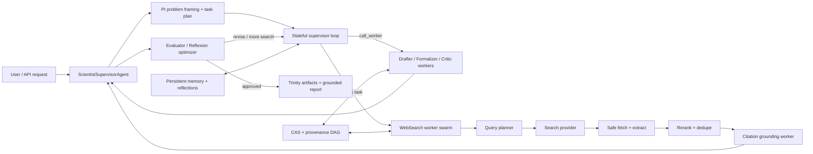

# Scientist Agent SOTA Roadmap

This document is a gap analysis and implementation roadmap for upgrading the
current PolisyOS LLM/agent layer toward a stronger agentic stack with robust
swarm orchestration, tool calling, loop control, and web search.

It is intentionally grounded in the existing codebase and in primary sources:
Anthropic engineering posts, OpenAI and Google deep-research/web-grounding docs,
LangChain multi-agent documentation, GonkaGate provider docs, and the original
ReAct / Reflexion / Self-Refine / Self-MoA / Toolformer / Self-RAG / STORM /
MindSearch / ManuSearch / ASearcher papers.

## Executive summary

The current Scientist agent layer already has a useful foundation:

- A domain-aware PI -> Drafter -> Formalizer -> Critic agent contour
- A gateway-first OpenAI-compatible LLM client
- A generic `ToolRegistry` + `run_tool_loop()` implementation
- Reflexion-style retry orchestration around `FailureCard`
- A mature async DAG executor with tiered parallelism, backpressure metrics,
  task-local state copies, fail-fast rollback, and provenance finalization
- Scholar enrichment and OpenAlex-backed acquisition paths for curated sources

However, the current agent runtime is still below SOTA in four places that
matter most for agentic reliability:

- Tool-loop transcript handling is not canonical after the first tool round,
  which can silently degrade model behavior and even break OpenAI-compatible
  tool-calling semantics.
- Swarm execution exists as a thin `asyncio.gather()` helper, while the stronger
  async DAG executor is not yet exposed as an agent-level supervisor-worker
  runtime with delegation, bounded parallelism, voting, and result synthesis.
- Reflexion is mostly a deterministic failure-router with retries, not a full
  evaluator-optimizer loop with rubric-based critique, trajectory memory,
  verifier tools, and measurable stopping criteria.
- Web search is not first-class in Scientist/Scholar: Scholar assumes manual seed
  sources, HTTP fetch is blocking and weakly guarded, and there is no explicit
  search -> fetch -> extract -> rerank -> cite agent subgraph.
- GonkaGate runtime semantics are only partially modeled: model IDs/base URLs are
  hardcoded instead of synced from `/v1/models`, provider-specific retry and
  request tracing are missing, and response-cost fields returned by GonkaGate are
  ignored by the Scientist gateway client.
- Endpoint failover and prompt caching already exist as primitives, but they are
  not wired into the main client factory path, so some env-driven resilience and
  cost/latency optimization knobs are effectively dead configuration.

There is also one cost-modeling bug that is strategically important because of
your GonkaGate price for `qwen/qwen3-235b-a22b-instruct-2507-fp8`
(`$0.0006 / 1M tokens`): the pricing fallback currently treats unknown models
as `$10 input + $30 output per 1M tokens`, so Qwen may be budget-throttled as if
it were roughly 16,000x-50,000x more expensive than it is.

Important provider-context correction: the public GonkaGate pricing page
currently shows a single rate of `$0.0009 / 1M tokens` plus a 10% usage fee,
updated on **March 12, 2026**, while your account-level Qwen price appears to be
`$0.0006 / 1M tokens`. This means local budget code must support provider-returned
usage costs and account-specific overrides instead of assuming one hardcoded
public tariff.

## External best practices distilled from primary sources

### 1) Keep the agent architecture simple, composable, and testable

Anthropic's "Building effective agents" recommends starting with simple,
composable patterns, avoiding framework over-abstraction, and adding agentic
complexity only when measurable evals show a benefit. They distinguish fixed
workflows from autonomous agents and call out five useful patterns: prompt
chaining, routing, parallelization, orchestrator-workers, and
evaluator-optimizer. They also emphasize ground-truth feedback from tools,
explicit stopping conditions, sandboxed testing, and transparent plans.

Implication for PolisyOS:

- Keep the current Scientist DAG engine and agent protocols, but add one narrow
  supervisor-worker runtime for open-ended research / drafting tasks instead of
  introducing a large opaque framework.
- Make every new agent behavior measurable through offline evals and trace
  inspection before promoting it to the default path.

Source:

- [Building effective agents](https://www.anthropic.com/engineering/building-effective-agents)

### 2) Use interleaved reasoning + action and keep tool results in the loop

ReAct shows that interleaving reasoning traces with actions helps models update
plans, handle exceptions, and ground answers in external observations. The paper
also shows this reduces hallucination and error propagation for QA/fact
verification when the model can interact with a search API.

Toolformer adds another important point: the model must learn not just that tools
exist, but when to call them, what arguments to pass, and how to incorporate
results into future tokens.

Implication for PolisyOS:

- The tool loop must preserve a valid full transcript with assistant tool-call
  messages followed by matching tool messages, then continue with the same
  system/user objective and accumulated observations.
- Add an explicit "think/plan" phase or internal scratchpad tool around
  long tool chains where legal/policy rules are dense and mistakes are costly.

Sources:

- [ReAct: Synergizing Reasoning and Acting in Language Models](https://arxiv.org/abs/2210.03629)
- [Toolformer: Language Models Can Teach Themselves to Use Tools](https://arxiv.org/abs/2302.04761)
- [The "think" tool](https://www.anthropic.com/engineering/claude-think-tool)

### 3) Treat tool design as agent-interface design, not just API wrapping

Anthropic's tool-design guidance is especially relevant to our current
`ToolDefinition` and `ToolRegistry` design:

- Build a small number of high-impact workflow tools instead of wrapping every
  low-level API endpoint.
- Namespace tools with clear boundaries.
- Return only high-signal context, not raw low-level identifiers by default.
- Provide response verbosity controls, pagination, filtering, and truncation.
- Return helpful validation errors with actionable fixes.
- Use strict input/output models and evaluate tool-call accuracy on held-out
  tasks.
- If the tool set becomes large, use tool search / progressive disclosure rather
  than stuffing all tool specs into every request.

Anthropic's "Advanced tool use" adds a practical threshold: tool specs above
~10K prompt tokens or 10+ tools are a sign that a Tool Search Tool may improve
both token cost and tool-selection accuracy.

Implication for PolisyOS:

- `ToolDefinition.parameters` should become an enforced JSON Schema contract,
  not just metadata sent to the model.
- Introduce `ToolError` envelopes with `code`, `message`, `retryable`,
  `hint`, and `truncated` fields.
- Add response size caps and summarization/truncation policies per tool.
- Add tool namespacing conventions and a dynamic tool discovery layer if tool
  count grows beyond the current narrow registry.

Sources:

- [Writing effective tools for agents](https://www.anthropic.com/engineering/writing-tools-for-agents)
- [Introducing advanced tool use on the Claude Developer Platform](https://www.anthropic.com/engineering/advanced-tool-use)
- [Effective context engineering for AI agents](https://www.anthropic.com/engineering/effective-context-engineering-for-ai-agents)

### 4) Use supervisor-worker swarms for context isolation and parallel search

Anthropic's multi-agent research system and context-engineering post show a
clear pattern:

- A lead agent saves a plan to memory, spawns focused subagents, lets them search
  independently in isolated context windows, and then synthesizes concise
  findings.
- Subagents may consume tens of thousands of tokens internally but return only a
  short distilled summary to the lead agent.
- A dedicated citation/fact-checking pass should map final claims to source
  spans.
- Prompting must teach the orchestrator how to delegate, define task boundaries,
  and scale effort to query complexity.

LangChain's subagent docs make an additional distinction that maps directly to
our current `AdaptiveRouter` gap:

- A router is a stateless classification/dispatch step.
- A supervisor is a stateful agent that maintains context across turns and can
  invoke subagents as tools, including multiple subagents in parallel.
- For async background subagents, a 3-tool job pattern (`start`, `status`,
  `result`) is preferable when the supervisor should remain responsive.

There is one extra swarm-specific lesson that matters because GonkaGate Qwen is
very cheap: Self-MoA shows that repeatedly sampling and aggregating one strong
model can outperform a heterogeneous MoA that mixes several weaker/different
models. For PolisyOS, that means the first swarm baseline should probably be
same-model Qwen fan-out + synthesis + self-consistency before paying engineering
complexity for heterogeneous multi-provider ensembles.

LangChain's multi-agent overview also highlights a cost-shape tradeoff: Subagents
and Routers are efficient for one-shot, large-context, multi-domain tasks with
parallel execution, while Handoffs/Skills can save 40-50% of model calls on
repeat requests because they preserve active state. For interactive policy chat,
this suggests using stateful handoff/skill loading for repeated follow-ups and
isolated subagents for broad one-shot research fan-out.

Implication for PolisyOS:

- Keep `AdaptiveRouter` only for cheap stateless dispatch.
- Add a dedicated stateful `ScientistSupervisorAgent` that treats specialized
  workers as tools and owns decomposition, parallel fan-out, synthesis, and
  stopping decisions.
- Reuse `AsyncWorkflowExecutor` semantics for bounded swarm parallelism instead
  of relying on unbounded `asyncio.gather()`.
- Add a citation/fact-grounding worker for web and Scholar outputs.

Sources:

- [How we built our multi-agent research system](https://www.anthropic.com/engineering/multi-agent-research-system)
- [Effective context engineering for AI agents](https://www.anthropic.com/engineering/effective-context-engineering-for-ai-agents)
- [Rethinking Mixture-of-Agents: Is Mixing Different Large Language Models Beneficial?](https://arxiv.org/abs/2502.00674)
- [LangChain Multi-agent overview](https://docs.langchain.com/oss/python/langchain/multi-agent/index)
- [LangChain Subagents](https://docs.langchain.com/oss/python/langchain/multi-agent/subagents)
- [LangChain Router](https://docs.langchain.com/oss/python/langchain/multi-agent/router)

### 5) Upgrade Reflexion into a measurable evaluator-optimizer loop

Reflexion shows that agents can improve across trials by writing verbal
reflections into episodic memory and reusing them on later attempts.
Self-Refine shows that one model can iteratively generate, critique, and revise
without additional training data, with ~20% absolute average gains across tasks.
Self-RAG shows that retrieval should be adaptive: retrieve only when needed,
critique retrieved passages and generated claims, and optimize for factuality and
citation accuracy.

Implication for PolisyOS:

- Keep `FailureCard` as a strong incident artifact, but add a rubric-based critic
  and verifier loop that can decide whether another search/refinement iteration is
  warranted.
- Store short structured reflections and failed trajectories in persistent
  memory, then retrieve them by problem signature before new attempts.
- Make stopping conditions depend on quality metrics and evidence coverage, not
  only on `max_iterations`, ping-pong count, or number of tool calls.

Sources:

- [Reflexion: Language Agents with Verbal Reinforcement Learning](https://arxiv.org/abs/2303.11366)
- [Self-Refine: Iterative Refinement with Self-Feedback](https://arxiv.org/abs/2303.17651)
- [Self-RAG: Learning to Retrieve, Generate, and Critique through Self-Reflection](https://arxiv.org/abs/2310.11511)

### 6) Deep-research web search should be a planner + query graph + page reader + citation ledger, not a single SERP call

OpenAI's web-search docs require visible/clickable inline citations, expose
source URL lists, support domain allow-lists, and expose the complete set of
consulted sources separately from the smaller inline-citation subset. OpenAI's
deep-research docs also recommend a clarification step, prompt rewriting with a
smaller model, background execution for long-running research, and an explicit
`max_tool_calls` budget. Google Deep Research similarly starts from a multi-step
research plan that can be revised before execution, then iteratively refines its
searches and produces a cited report. Gemini's Grounding and URL Context docs add
two implementation details worth copying into a first-party search stack:
persist the exact search queries and text-to-source support mappings, and use a
two-step fetch strategy that checks an index/cache first and falls back to live
URL retrieval when needed.

Anthropic's web-search tool adds three more practical lessons: enforce per-request
search limits (`max_uses`), support `allowed_domains` / `blocked_domains` and
approximate `user_location`, and filter fetched content before it enters the LLM
context. Their latest web-search variant can execute code to discard irrelevant
page content before loading it into the context window, which improves accuracy
and lowers token use. Their security docs also make one safety requirement very
clear: process untrusted web pages in an isolated context so prompt injection from
page text cannot directly override the main agent's instructions.

Open-source deep-research systems add the missing swarm/search patterns:

- STORM uses multi-perspective question asking and outline-first research to
  improve breadth and organization before drafting.
- MindSearch models search as a dynamically expanding graph of atomic
  sub-questions; WebPlanner updates the graph from WebSearcher results, and the
  system can process 300+ pages in parallel in a few minutes.
- ManuSearch cleanly separates solution planning, internet search, and structured
  webpage reading into three agents, which is a strong decomposition boundary for
  PolisyOS too.
- Open Deep Research uses a three-phase pipeline (Scope -> Research -> Write),
  role-specific model slots (summarization / research / compression / final
  report), and MCP-compatible search connectors.
- ASearcher shows that long-horizon search agents can exceed 100 tool turns and
  400k output tokens, so runtime design must support resumable async jobs,
  hard tool budgets, and search-state checkpoints.
- BrowseComp shows that browsing alone is not enough; success comes from
  strategic query reformulation, pivoting/backtracking, and synthesizing many
  sources. It also shows test-time scaling: 64 parallel samples plus
  best-of-N / weighted voting can improve accuracy by 15%-25%, which is exactly
  the kind of cheap Qwen fan-out PolisyOS can exploit.

GonkaGate's plugin docs currently mark Web Search as coming soon and recommend
tool calling as the production-ready mechanism today, so this whole stack should
be first-party rather than blocked on provider-native search.

Implication for PolisyOS:

- Do not wait for a provider-native web-search plugin. Build a first-party deep
  research subgraph with these stages:
  `scope clarification -> research brief -> perspective/query-graph expansion ->
  broad SERP fan-out -> safe fetch/open/find_in_page -> snippet extraction ->
  source-quality + recency scoring -> compression -> citation ledger ->
  synthesis/verifier`.
- Add `scholar_web_search`, `scholar_fetch_open`, and `scholar_find_in_page`
  style tools with strict schemas, per-request budgets, domain allow/block lists,
  locale/timezone hints, source-type filters, and safe URL guards.
- Store a first-class `WebEvidenceBundle` with:
  - query trace (`web_search_queries`),
  - normalized source list (`url`, `title`, `published_at/page_age`, fetch status,
    content hash, source type, domain authority tier),
  - extracted snippets with stable offsets and source chunk IDs,
  - and claim-to-source support links similar to OpenAI annotations or Gemini
    `groundingSupports`.
- Add dynamic filtering before LLM context:
  - local HTML/PDF extraction and boilerplate removal,
  - BM25/embedding prefiltering,
  - cheap Qwen map-side relevance scoring over chunks,
  - and compact snippet packs instead of raw full pages.
- Use cheap Qwen for massive search parallelism:
  - run many query variants and perspective workers concurrently,
  - run same-model N-sample answer synthesis with self-consistency / weighted
    confidence voting,
  - and reserve expensive models only for optional high-risk adjudication.
- Treat every external page as untrusted data:
  - fetch and parse in a sandboxed/isolated reader context,
  - extract only structured fields/snippets into validated schemas,
  - strip scripts/instructions/hidden text,
  - and never let retrieved page text act as system/developer instructions.
- Add a CAS-backed URL/content cache with freshness TTLs, ETag/Last-Modified
  validation when available, and a cache-first/live-fetch fallback path.

Sources:

- [OpenAI Web search](https://platform.openai.com/docs/guides/tools-web-search)
- [OpenAI Deep research](https://platform.openai.com/docs/guides/deep-research)
- [OpenAI Safety in building agents](https://platform.openai.com/docs/guides/agent-builder-safety)
- [Gemini Deep Research Agent](https://ai.google.dev/gemini-api/docs/deep-research)
- [Grounding with Google Search](https://ai.google.dev/gemini-api/docs/grounding)
- [URL Context](https://ai.google.dev/gemini-api/docs/url-context)
- [Try Deep Research and our new experimental model in Gemini](https://blog.google/products/gemini/google-gemini-deep-research/)
- [Anthropic Web search tool](https://docs.anthropic.com/en/docs/agents-and-tools/tool-use/web-search-tool)
- [Claude Code Security](https://docs.anthropic.com/en/docs/claude-code/security)
- [STORM: Assisting in Writing Wikipedia-like Articles From Scratch with Large Language Models](https://arxiv.org/abs/2402.14207)
- [MindSearch: Mimicking Human Minds Elicits Deep AI Searcher](https://arxiv.org/abs/2407.20183)
- [ManuSearch: Democratizing Deep Search in Large Language Models with a Transparent and Open Multi-Agent Framework](https://arxiv.org/abs/2505.18105)
- [Beyond Ten Turns: Unlocking Long-Horizon Agentic Search with Large-Scale Asynchronous RL](https://arxiv.org/abs/2508.07976)
- [BrowseComp: A Simple Yet Challenging Benchmark for Browsing Agents](https://cdn.openai.com/pdf/5e10f4ab-d6f7-442e-9508-59515c65e35d/browsecomp.pdf)
- [Open Deep Research](https://github.com/langchain-ai/open_deep_research)
- [Deep Research From Scratch](https://github.com/langchain-ai/deep_research_from_scratch)
- [GonkaGate plugins overview](https://gonkagate.com/ru/docs/guides/features/plugins/overview)
- [GonkaGate Web Search plugin](https://gonkagate.com/ru/docs/guides/features/plugins/web-search)
- [GonkaGate Tool Calling](https://gonkagate.com/ru/docs/guides/features/tool-calling)

### 7) Use provider presets for stable model policy, but keep request-level override

GonkaGate presets can store `systemPrompt`, `params`, `reasoning`, and an ordered
fallback model list. The request still wins over preset fields, and fallback over
the preset's `models` list is only used for `model: "@preset/<slug>"`.
Validation constraints matter operationally: `models` max 10, `params` supports a
small fixed field set, and `reasoning.effort` and `reasoning.max_tokens` are
mutually exclusive.

Implication for PolisyOS:

- Add preset support to `GatewayLLMClient.generate()` only as a passthrough field
  plus explicit profile-level config.
- Keep per-call overrides for temperature/max_tokens/seed.
- Encode preset selection in model profiles and dashboards, but keep a direct
  `model_id` escape hatch for experiments.

Source:

- [GonkaGate Presets](https://gonkagate.com/ru/docs/guides/features/presets)

### 8) Treat GonkaGate as an evolving provider contract, not a static OpenAI clone

The GonkaGate docs add several provider-specific constraints and opportunities
that the first roadmap pass underweighted:

- Keep `model` configurable and refresh model IDs from `GET /v1/models`; do not
  scrape `/models` or manually guess model IDs.
- The canonical documented base URL is `https://api.gonkagate.com/v1`.
- GonkaGate is a specialized gateway to Gonka Network, not a multi-provider
  aggregator. Cross-provider fallback/routing should therefore remain a
  PolisyOS-owned concern instead of being pushed into Gonka presets alone.
- `chat.completions`, streaming, and OpenAI SDK compatibility are supported, but
  tool calling, structured outputs, and vision are model-dependent and must be
  smoke-tested per model before rollout.
- If an application depends on Responses API, Assistants, Batch, Audio,
  Embeddings, or Fine-tuning, GonkaGate's migration guide says those flows should
  stay on another provider for now.
- GonkaGate responses can include `usage.base_cost_usd`,
  `usage.platform_fee_usd`, and `usage.total_cost_usd`; use those fields for
  post-call accounting and reconcile them against local estimates.
- Retry policy must branch on `error.code`, not just HTTP status:
  `insufficient_quota` should stop immediately, while `rate_limit_exceeded` and
  `transfer_agent_capacity_reached` can be retried with a small bounded budget.
- Honor `Retry-After` when present, log `x-request-id`, and use
  `x-idempotency-key` for safe non-stream retries.
- `response-healing` is only for `stream: false` structured outputs with
  `json_object` or `json_schema`, and it does **not** repair tool calls.
- `privacy-sanitization` is stateless on the public surface, secrets-oriented
  rather than broad generic PII redaction, does not provide client-visible raw
  restore across tool calls, and is currently incompatible with built-in web
  search.
- `file-parser/pdf-text` can be useful for ad hoc public PDF summarization, but
  it blocks private/local URLs, has no OCR, currently defaults to 5 PDFs/request
  and 1 MiB/file, and therefore should not replace the local CAS-first Scholar
  ingestion path for canonical policy corpora.
- GonkaGate's security page says prompt/response content is not stored, but usage
  metadata (`model`, tokens, latency, cost) has no automatic TTL. Agent-state and
  redaction state therefore must remain first-party application concerns.

Implication for PolisyOS:

- Build a typed GonkaGate extension layer around `GatewayLLMClient` rather than
  relying on unstructured `**kwargs` for `preset`, `plugins`, and request-level
  provider controls.
- Add a provider capability and smoke-test matrix keyed by live `model_id`.
- Prefer local deterministic Scholar parsing/search for production, and use
  provider plugins only as optional request-level hardening paths where their
  limitations are acceptable.

Sources:

- [GonkaGate docs overview](https://gonkagate.com/ru/docs)
- [GonkaGate principles](https://gonkagate.com/ru/docs/guides/overview/principles)
- [Gonka API overview](https://gonkagate.com/ru/gonka-api)
- [GonkaGate migration guide](https://gonkagate.com/ru/docs/guides/overview/migration)
- [GonkaGate model selection](https://gonkagate.com/ru/docs/guides/overview/models)
- [GonkaGate rate limits](https://gonkagate.com/ru/docs/api/reference/rate-limits)
- [GonkaGate Structured Outputs](https://gonkagate.com/ru/docs/guides/features/structured-outputs)
- [GonkaGate Response Healing](https://gonkagate.com/ru/docs/guides/features/plugins/response-healing)
- [GonkaGate Privacy Sanitization](https://gonkagate.com/ru/docs/guides/features/plugins/privacy-sanitization)
- [GonkaGate PDF Inputs](https://gonkagate.com/ru/docs/guides/features/plugins/pdf-inputs)
- [GonkaGate Security](https://gonkagate.com/ru/security)

## Current implementation map

| Area | Current code | What already works | Primary gap |
| --- | --- | --- | --- |
| Agent roles | [`agent/protocols.py`](../../../src/polisyos/scientist/agent/protocols.py) | Clear PI / Drafter / Formalizer / Critic contracts and typed artifacts | Role set is static and domain-shaped; no generic supervisor/subagent contract, no tool-using worker abstraction |
| PI orchestration | [`agent/pi.py`](../../../src/polisyos/scientist/agent/pi.py) | LLM-based problem framing and decomposition; deterministic fallback agent for tests | `delegate()` is sequential and role-hardcoded; no parallel delegation, no voting, no search worker, no explicit synthesis phase |
| Routing | [`agent/router.py`](../../../src/polisyos/scientist/agent/router.py) | Fixed and adaptive stateless routing; fallback chain | `AdaptiveRouter` is a heuristic router, not a stateful supervisor; `ParallelAgentRunner` is thin `asyncio.gather()` without budgets, quorum, timeouts, cancellation, or merge semantics |
| Tool schema | [`agent/tools/schema.py`](../../../src/polisyos/scientist/agent/tools/schema.py) | OpenAI-format tool export | JSON Schema is not validated/enforced at runtime; no output schema; no side-effect or safety annotations |
| Tool execution | [`agent/tools/registry.py`](../../../src/polisyos/scientist/agent/tools/registry.py) | Sync/async execution, per-tool timeout, circuit breaker | No argument validation, no structured error taxonomy, no output truncation policy, no rate limits/concurrency budgets, `run_in_executor()` uses default executor without per-tool isolation |
| Tool loop | [`agent/tools/tool_loop.py`](../../../src/polisyos/scientist/agent/tools/tool_loop.py) | Iterative LLM -> tools -> LLM loop, optional dependency ordering, simple backoff, memory injection, convergence detector | Canonical transcript is broken after first tool round; no assistant tool-call message persistence; `messages` can overwrite system/user context; convergence uses only tool-call count |
| Tool dependency ordering | [`agent/tools/dependency_graph.py`](../../../src/polisyos/scientist/agent/tools/dependency_graph.py) | Kahn ordering and prerequisite checks | Cycles/unresolvable dependencies are silently appended instead of reported as graph errors |
| Reflexion | [`agent/reflexion.py`](../../../src/polisyos/scientist/agent/reflexion.py) | FailureCard routing, retries, backoff, ping-pong detection, replay recording | Mostly deterministic routing; no rubric-based evaluator agent, no evidence-aware stop rule, no retrieval over reflection memory in the active loop |
| Budget and pricing | [`llm/budget_enforcer.py`](../../../src/polisyos/scientist/llm/budget_enforcer.py), [`core/observability/pricing.py`](../../../src/polisyos/core/observability/pricing.py), [`core/llm/response.py`](../../../src/polisyos/core/llm/response.py) | Pre-call budget checks, post-call accounting, OTel metrics, anomaly detection | Qwen GonkaGate profile has no explicit price and falls back to a very expensive default; prompt-token estimator ignores prior tool transcript when `messages` is passed through kwargs; provider `usage.total_cost_usd` is not consumed |
| Model profiles | [`llm/profiles/builtin_profiles.py`](../../../src/polisyos/scientist/llm/profiles/builtin_profiles.py), [`llm/profiles/models.py`](../../../src/polisyos/scientist/llm/profiles/models.py) | Central model/profile catalog | Qwen profile likely drifts from docs (`https://gonka-gateway.mingles.ai/v1` and mixed-case model ID vs documented `https://api.gonkagate.com/v1` and `/v1/models`); Qwen exposes only `json`, not `tool_calling`; no preset/plugins fields; no runtime refresh from `/v1/models` |
| Gateway client | [`llm/gateway_client.py`](../../../src/polisyos/scientist/llm/gateway_client.py) | OpenAI-compatible chat completions, retries, streaming, tool-call parsing | Extra kwargs can overwrite generated `messages`; no preset/plugins fields in signature; no transcript helper for tool-call rounds; no typed provider capability negotiation; no `error.code`-aware retry policy, `Retry-After` parsing, `x-request-id` capture, or `x-idempotency-key` support |
| Endpoint failover | [`llm/fallback_router.py`](../../../src/polisyos/scientist/llm/fallback_router.py), [`llm/factory.py`](../../../src/polisyos/scientist/llm/factory.py) | Priority-ordered endpoint failover with health states and tests; env config parses fallback URLs | `create_traced_gateway_client()` ignores `fallback_urls`, so `FallbackRouter` is not on the hot path; fallback health transitions are not aligned with provider `error.code` semantics |
| Prompt cache | [`llm/prompt_cache.py`](../../../src/polisyos/scientist/llm/prompt_cache.py), [`llm/factory.py`](../../../src/polisyos/scientist/llm/factory.py) | Thread-safe in-memory LRU/TTL cache and deterministic cache-key helper | Cache config is parsed but not wired into runtime calls; current cache key ignores explicit `messages`, `preset`, and `plugins`, so naive activation could miss or collide on multi-round tool transcripts |
| Scholar search/discovery | [`scholar/api.py`](../../../src/polisyos/scholar/api.py), [`scholar/discover/manual.py`](../../../src/polisyos/scholar/discover/manual.py) | Deterministic enrichment for supplied `ResearchIntent` + seed sources; URL canonicalization and dedupe | No native web search/query planning API; discovery assumes caller already has seed URLs/files/bytes |
| Scholar HTTP fetch | [`scholar/discover/http_fetch.py`](../../../src/polisyos/scholar/discover/http_fetch.py) | Byte limits, user-agent header, MIME extraction | Blocking `urllib.request.urlopen`, no SSRF guard, no content-type policy, no retries/backoff, no robots-aware throttling, no async bulk fetch |
| Search planner/evidence graph | none yet in `scholar/` or `scientist/agent/tools/` | Existing Scholar bundles can already persist source provenance once inputs are provided | No research-brief generator, no dynamic sub-question graph, no `open_page/find_in_page` reader tools, no snippet-level evidence ledger, no source-quality ranker, no cache-first/live-fetch path, no async deep-research job state |
| Workflow execution | [`scientist/engine/async_executor.py`](../../../src/polisyos/scientist/engine/async_executor.py) | Strong parallel DAG substrate with backpressure metrics, per-task state isolation, timeouts, rollback, provenance | Not yet surfaced as the execution backend for swarm/subagent orchestration |

## Highest-priority gaps with code evidence

### P0. Tool-loop transcript corruption

Evidence:

- `run_tool_loop()` builds an empty `messages` list, sends `system` + `user` only
  on iteration 0, then on later iterations sets `generate_kwargs["messages"] =
  messages` where `messages` contains only `role="tool"` entries
  ([`tool_loop.py`](../../../src/polisyos/scientist/agent/tools/tool_loop.py)).
- `GatewayLLMClient.generate()` first constructs `messages` from `system`/`user`,
  then blindly copies `kwargs` over payload fields, so a caller-supplied
  `messages` list overwrites the generated transcript
  ([`gateway_client.py`](../../../src/polisyos/scientist/llm/gateway_client.py)).
- GonkaGate's own tool-calling guide says the assistant message with
  `tool_calls` must be appended first, then one matching `tool` message per
  `tool_call_id`, then the full updated dialogue must be sent again.

Why this is dangerous:

- The model loses the original objective and system contract after the first tool
  round.
- Some providers reject tool-role messages that do not follow an assistant
  tool-call message.
- Even if the provider accepts the payload, the model can behave as if it is
  solving a detached post-tool fragment, which is the opposite of ReAct-style
  grounded iteration.

Required fix:

- Introduce a `ToolConversationState` helper with a canonical list of messages:
  initial `system`, initial `user`, assistant responses with `tool_calls`, and
  tool results.
- Update `run_tool_loop()` to append the assistant tool-call message before
  appending tool outputs.
- Add regression tests covering 2+ tool rounds and asserting exact message order.
- In `GatewayLLMClient.generate()`, prevent accidental overwrite of generated
  messages unless `system` and `user` are both `None`, or introduce an explicit
  `messages_override` field with clear semantics.

Acceptance criteria:

- A 2-round tool-call test passes against an OpenAI-compatible mock server.
- The captured request transcript contains
  `system -> user -> assistant(tool_calls) -> tool -> assistant(tool_calls) -> tool`.
- No request after iteration 0 drops the original problem statement or system
  contract.

### P0. Qwen GonkaGate model is mispriced and not marked as tool-capable

Evidence:

- `qwen3_235b_gonka` has `capabilities=["json"]` only and no explicit cost fields
  ([`builtin_profiles.py`](../../../src/polisyos/scientist/llm/profiles/builtin_profiles.py)).
- `estimate_llm_cost_usd()` falls back to `PRICING_DEFAULTS["default"]` for
  unknown models, currently `$10 input / $30 output per 1M tokens`
  ([`pricing.py`](../../../src/polisyos/core/observability/pricing.py)).
- `LLMBudgetEnforcer` uses this estimator both for pre-call checks and post-call
  spend recording
  ([`budget_enforcer.py`](../../../src/polisyos/scientist/llm/budget_enforcer.py)).
- Your GonkaGate price for this Qwen model is `$0.0006 / 1M tokens`, so 100M
  tokens should cost about `$0.06`, not `$1,000-$3,000`.
- The public GonkaGate pricing page currently shows a unified
  `$0.0009 / 1M tokens` rate plus a 10% usage fee, which differs from your
  account-specific Qwen quote. This discrepancy is itself a reason to avoid one
  static hardcoded tariff table.

Required fix:

- Add explicit Qwen pricing to either `ModelProfile` instances or the global
  pricing table.
- Prefer provider-returned `usage.total_cost_usd` for post-call accounting when
  present, and use local estimates only for pre-call admission control.
- Add a configurable account-level pricing override path plus a periodic sync
  from provider pricing/model metadata.
- Mark `qwen3_235b_gonka` as `tool_calling` capable if GonkaGate validates that
  model with function calls in your environment.
- Extend `estimate_request_tokens()` and the budget pre-check path to account
  for `messages` payloads, not only `system`, `user`, and `tools`.
- Add budget tests with Qwen pricing fixtures.

Acceptance criteria:

- Estimated and recorded Qwen costs are within a small tolerance of
  `$0.0006 / 1M tokens` for known synthetic token counts.
- A 100M-token multipass shadow run is no longer rejected by a budget configured
  for cheap Qwen usage.
- Dashboard/profile metadata can show that Qwen is allowed for tool-calling
  experiments.
- Actual per-call spend in logs can be reconciled against provider-returned
  `usage.total_cost_usd` and does not silently ignore platform fees.

### P0. GonkaGate retry, tracing, and model-source semantics are under-modeled

Evidence:

- `qwen3_235b_gonka` hardcodes
  `base_url="https://gonka-gateway.mingles.ai/v1"` and
  `model_id="Qwen/Qwen3-235B-A22B-Instruct-2507-FP8"`, while current GonkaGate
  docs use `https://api.gonkagate.com/v1` and recommend taking canonical model
  IDs from `GET /v1/models`
  ([`builtin_profiles.py`](../../../src/polisyos/scientist/llm/profiles/builtin_profiles.py)).
- `GatewayLLMClient._post_json()` retries every 429/5xx by status only, ignores
  provider `error.code`, does not parse `Retry-After`, does not expose
  `x-request-id` / `x-ratelimit-*`, and does not support `x-idempotency-key`
  ([`gateway_client.py`](../../../src/polisyos/scientist/llm/gateway_client.py)).
- `GatewayLLMClient._parse_completion_payload()` and
  `extract_llm_response_data()` read `cost_usd` / `cost`, but not GonkaGate's
  `usage.total_cost_usd`, `usage.base_cost_usd`, or `usage.platform_fee_usd`
  ([`gateway_client.py`](../../../src/polisyos/scientist/llm/gateway_client.py),
  [`response.py`](../../../src/polisyos/core/llm/response.py)).
- The repo already contains better provider resilience primitives elsewhere,
  e.g. `lex/batch/spo_client.py` computes backoff from `Retry-After` and uses a
  sliding-window limiter with adaptive 429 cooling.

Why this is dangerous:

- `429 insufficient_quota` can be retried as if it were temporary throttling,
  wasting latency and obscuring a billing-state failure.
- Missing `x-request-id` and rate-limit headers make debugging provider incidents
  and support escalation harder than necessary.
- Stale static model IDs/base URLs can fail as `404 model_not_found` after
  provider-side catalog changes.
- Ignoring provider-returned cost fields breaks exact accounting when platform
  fees are included.

Required fix:

- Add a provider-aware error envelope that parses `error.code`, `error.message`,
  `x-request-id`, `Retry-After`, and `x-ratelimit-*`.
- Stop retries immediately on `insufficient_quota`; retry
  `rate_limit_exceeded`, `transfer_agent_capacity_reached`, 503, and 504 with a
  small bounded budget and `Retry-After` + jitter.
- Add optional `x-idempotency-key` for safe non-stream retries.
- Move model ID/base URL selection behind config + a live `/v1/models` refresh
  job or startup smoke test, and keep an explicit rollback override.
- Reuse or factor out the existing retry/limiter logic already present in
  `lex/batch/spo_client.py` instead of growing a second bespoke implementation.

Acceptance criteria:

- A mocked `429 insufficient_quota` stops after one attempt, while
  `429 rate_limit_exceeded` honors `Retry-After` and stays within a bounded retry
  budget.
- Every failed provider call records a request ID when one is present.
- Qwen model/profile rollout can detect stale IDs before production traffic.

### P0. Tool arguments are not validated against declared schemas

Evidence:

- `ToolDefinition.parameters` is stored and exported, but `ToolRegistry.execute()`
  and `aexecute()` call handlers directly with `handler(**arguments)` and never
  validate against the JSON Schema
  ([`schema.py`](../../../src/polisyos/scientist/agent/tools/schema.py),
  [`registry.py`](../../../src/polisyos/scientist/agent/tools/registry.py)).
- Parse failures in `parse_tool_calls_from_response()` become `{}` silently, so
  malformed tool arguments can be converted into confusing handler errors or
  accidental default execution
  ([`tool_loop.py`](../../../src/polisyos/scientist/agent/tools/tool_loop.py)).
- GonkaGate's tool-calling guide explicitly recommends validating arguments,
  rejecting unknown tools, converting parse/handler errors to explicit tool
  errors, re-sending `tools` on follow-up turns, and stopping at your own loop
  limit.

Required fix:

- Compile `ToolDefinition.parameters` into a validator at registration time
  (`jsonschema` or generated Pydantic model).
- Return a structured `ToolCallResult.error` object, not just `str(exc)`.
- Distinguish parser errors, schema errors, unknown-tool errors, timeout errors,
  circuit-breaker errors, and handler exceptions.
- Preserve the original raw argument string in audit logs for malformed JSON.

Acceptance criteria:

- Invalid arguments never reach tool handlers.
- Tool-error responses contain a machine-readable code and a human-actionable
  hint.
- Evaluation traces show reduced repeated invalid tool calls.

### P1. Swarm orchestration is not yet a real supervisor-worker runtime

Evidence:

- `AgentRole` is a fixed enum of PI / DataNeedExtractor / Drafter / Formalizer /
  Critic, so the agent layer is domain-specific and static
  ([`protocols.py`](../../../src/polisyos/scientist/agent/protocols.py)).
- `LLMPIAgent.delegate()` dispatches to a hardcoded map of those three workers and
  executes one worker at a time
  ([`pi.py`](../../../src/polisyos/scientist/agent/pi.py)).
- `ParallelAgentRunner.run_parallel()` is a thin `asyncio.gather()` wrapper with
  no timeout policy, no backpressure, no cancellation semantics, no quorum, no
  synthesis, and no provenance envelope
  ([`router.py`](../../../src/polisyos/scientist/agent/router.py)).
- Meanwhile `AsyncWorkflowExecutor` already has most of the lower-level execution
  primitives we need for swarm tiers, bounded concurrency, and state isolation
  ([`async_executor.py`](../../../src/polisyos/scientist/engine/async_executor.py)).

Required fix:

- Add a `ScientistSupervisorAgent` that owns a mutable conversation state,
  planning state, and a registry of worker agents exposed as tools.
- Support two worker invocation modes:
  - `call_worker(agent_name, task, context_refs, budget_hint)` for synchronous
    blocking subtasks
  - `start_worker_job(...)`, `check_worker_job(job_id)`, `get_worker_result(job_id)`
    for long-running independent subtasks
- Add bounded parallel fan-out and quorum policies:
  - Sectioning for independent subproblems
  - Voting / self-consistency for high-risk draft or critique decisions
  - Early cancellation when enough independent workers converge
- Reuse `AsyncWorkflowExecutor` state-copy, semaphore, and provenance patterns in
  the worker runtime.

Acceptance criteria:

- A benchmark task can spawn N bounded subagents, synthesize concise summaries,
  and produce a single grounded result with traceable worker provenance.
- Simple tasks remain cheap by using one worker and a small call budget.
- Complex tasks scale effort according to explicit budget and uncertainty rules.

### P1. Reflexion lacks a rubric-based evaluator and evidence-aware stopping

Evidence:

- `ReflexionOrchestrator.evaluate_failure()` routes mostly from severity,
  retryability, remediation target, and ping-pong detection, with an optional
  autotune config hook
  ([`reflexion.py`](../../../src/polisyos/scientist/agent/reflexion.py)).
- `run_tool_loop()` convergence checks only the number of tool calls, so a loop
  can "converge" because activity decreases, not because quality or evidence
  coverage is sufficient
  ([`tool_loop.py`](../../../src/polisyos/scientist/agent/tools/tool_loop.py)).

Required fix:

- Add a dedicated evaluator worker that scores draft quality, schema validity,
  factual grounding, source freshness, and policy compliance against a rubric.
- Persist short structured reflections keyed by problem signature and failure
  type, then retrieve those reflections before future attempts.
- Add stop conditions that require:
  - no blocker findings,
  - enough citation coverage for factual claims,
  - stable quality score improvement below epsilon over recent rounds,
  - and budget remaining above a safety floor.

Acceptance criteria:

- Retry loops terminate because a quality/evidence criterion is met, not only
  because `max_iterations` is hit.
- Repeated failures on similar tasks reuse prior reflection memory and reduce
  iteration count.

### P1. Scholar lacks a first-class agentic web-search path

Evidence:

- `ScholarService.enrich()` and `scholar.enrich_topic()` consume a
  `ResearchIntent` and supplied sources, but do not expose a search-query
  planner or provider-backed web search step
  ([`scholar/api.py`](../../../src/polisyos/scholar/api.py)).
- `normalize_seed_sources()` canonicalizes and deduplicates manual seed sources,
  but only after the caller already knows the URLs/files/bytes
  ([`manual.py`](../../../src/polisyos/scholar/discover/manual.py)).
- There are no `web_search`, `serp`, `tavily`, `duckduckgo`, or browser-search
  abstractions under `policy-engine/src/polisyos/scientist` or
  `policy-engine/src/polisyos/scholar`.
- `fetch_url()` is blocking `urllib`, without SSRF protection, retry/backoff,
  content-type allow-lists, or robots-aware rate controls
  ([`http_fetch.py`](../../../src/polisyos/scholar/discover/http_fetch.py)).

Required fix:

- Add a `WebSearchProvider` interface and at least two concrete providers first
  (for example Brave Search API + SearXNG, or Bing + a private metasearch
  endpoint), so outages/ranking quirks in one provider do not collapse recall.
- Add a `ResearchBrief` + `QueryGraph` planner:
  - optional clarification/prompt-rewrite step with cheap Qwen,
  - perspective expansion for policy facets (legal, fiscal, causal, equity,
    implementation, comparative jurisdictions),
  - atomic sub-question DAG construction,
  - and adaptive query expansion/backtracking from retrieved evidence.
- Add `scholar_web_search`, `scholar_fetch_open`, and `scholar_find_in_page`
  tools with strict schemas, safe-domain filters, recency/source-type filters,
  approximate user-location hints, and hard per-request budgets
  (`max_search_queries`, `max_fetch_pages`, `max_parallel_fetches`,
  `max_depth`, `max_wall_time_s`).
- Build a deep-search subgraph:
  `scope -> query graph -> SERP fan-out -> URL dedupe -> cache-first safe fetch ->
  extraction -> chunking -> rerank -> snippet compression -> evidence bundle ->
  citation grounding -> synthesis verifier`.
- Add source-quality and anti-SEO scoring before synthesis:
  - prefer primary sources and official registries,
  - downrank content farms/SEO mirrors,
  - track publication date and last-modified freshness,
  - detect duplicate or syndicated copies,
  - and preserve explicit uncertainty when sources conflict.
- Add snippet-level citation span extraction so final claims map to source
  snippets, character offsets, and URLs, not just coarse document IDs.
- Keep the current CAS-first Scholar bundle format, but extend it with web-search
  provenance, query traces, SERP rank snapshots, fetch/read status, snippet IDs,
  and retrieval-compression traces.
- Run cheap-Qwen fan-out aggressively but with typed aggregation:
  - parallel query workers by topic/perspective,
  - map-side chunk scoring/compression,
  - multiple answer samples per claim,
  - and best-of-N / confidence-weighted voting with a citation verifier.
- Make research execution asynchronous and resumable:
  - start long research jobs in background,
  - emit progress events and partial evidence snapshots,
  - checkpoint query graph + fetched content refs in CAS,
  - and allow recovery after worker/tool failures without restarting from zero.
- Keep provider-native `web` / `:online` features out of the production critical
  path until GonkaGate explicitly moves Web Search out of `coming soon`.
- Add app-side redaction/tokenization for retrieved snippets before LLM calls,
  because GonkaGate `privacy-sanitization` is stateless and currently
  incompatible with provider-native web search.
- Add prompt-injection defenses for fetched pages:
  - process page text in an isolated reader/extractor context,
  - convert page content into validated `SourceSnippet` / `EvidenceClaim`
    records before the main supervisor sees it,
  - block private/local network targets and unsafe URL statuses,
  - and log the full fetch/extract trace for audit/debug.

Acceptance criteria:

- A policy question with no manual seed URLs can still produce a grounded
  knowledge bundle.
- Every generated factual claim in the final response maps to one or more source
  snippets and URLs.
- Untrusted URLs, private IPs, non-allowed domains, and oversized/binary payloads
  are rejected safely.
- Multi-perspective search improves recall on a held-out deep-research benchmark
  without losing citation precision.
- Repeated queries against stable sources benefit from cache hits without serving
  stale evidence outside the declared freshness TTL.

### P1. Endpoint failover and prompt cache primitives are not on the hot path

Evidence:

- `FallbackRouter` supports ordered endpoint failover and health-state tracking,
  but `create_traced_gateway_client()` still instantiates `GatewayLLMClient`
  directly and ignores `GatewayLLMConfig.fallback_urls`
  ([`fallback_router.py`](../../../src/polisyos/scientist/llm/fallback_router.py),
  [`factory.py`](../../../src/polisyos/scientist/llm/factory.py)).
- `InMemoryPromptCache` and `compute_cache_key()` are implemented and tested, but
  they are not referenced by the runtime client factory or gateway path, and the
  current key does not include explicit `messages`, `preset`, `plugins`, or other
  provider extensions used by multi-round agent loops
  ([`prompt_cache.py`](../../../src/polisyos/scientist/llm/prompt_cache.py),
  [`factory.py`](../../../src/polisyos/scientist/llm/factory.py)).
- GonkaGate's own docs say it is a specialized gateway rather than a
  multi-provider router, so cross-provider failover should remain in PolisyOS,
  not in Gonka presets alone.

Required fix:

- Wire `FallbackRouter` into the factory when `POLISYOS_LLM_FALLBACK_URLS` is
  set, and make provider health transitions aware of non-retryable
  `error.code` values such as `insufficient_quota` and `model_not_found`.
- Either wire `InMemoryPromptCache` into the traced client path for strictly
  cacheable calls or explicitly disable/remove the env knobs until cache semantics
  are safe.
- If caching is enabled, extend cache keys with canonical `messages`, `tools`,
  `response_format`, `preset`, `plugins`, and model/profile identifiers, and
  never cache side-effectful tool turns or web-search calls unless the tool output
  is separately versioned and freshness-bounded.

Acceptance criteria:

- Setting `POLISYOS_LLM_FALLBACK_URLS` changes runtime failover behavior in an
  integration test, not only config parsing.
- Cache hit/miss behavior is observable and correct for repeated deterministic
  non-tool calls.
- Multi-round tool transcripts and provider plugin/preset variants do not share
  an incorrect cache key.

### P2. Tool dependency cycles, serial tool execution, and tool-output bloat are not actively managed

Evidence:

- `ToolDependencyGraph.execution_order()` appends cycle leftovers silently in
  original order
  ([`dependency_graph.py`](../../../src/polisyos/scientist/agent/tools/dependency_graph.py)).
- `run_tool_loop()` executes parsed tool calls one by one with
  `await tool_registry.aexecute(...)` even when calls are independent, so same-
  round search/fetch fan-out pays avoidable serial latency
  ([`tool_loop.py`](../../../src/polisyos/scientist/agent/tools/tool_loop.py)).
- `_serialize_result()` recursively serializes arbitrary data but does not apply
  a response-size cap, pagination policy, or redaction/truncation envelope
  ([`registry.py`](../../../src/polisyos/scientist/agent/tools/registry.py)).

Required fix:

- Fail fast on cyclic tool dependencies with a diagnostic graph error.
- Execute independent same-round tool calls concurrently by dependency tier with
  bounded concurrency and cancellation semantics, while preserving deterministic
  transcript order when appending tool results back to the LLM conversation.
- Add per-tool response policies:
  - hard byte/token limits,
  - optional summary fields,
  - explicit `truncated=true` metadata,
  - and guidance for follow-up narrow queries.

Acceptance criteria:

- Cyclic dependency declarations are detected in tests.
- Independent same-round tool calls reduce wall-clock latency under a bounded
  concurrency cap without breaking transcript order.
- Large tool responses are bounded and steer the model toward narrow follow-up
  queries instead of flooding context.

## Proposed target architecture: Scientist Agent Fabric v2

The goal is not to replace the current Scientist stack, but to evolve it into a
two-layer agent runtime that keeps deterministic workflow guarantees while adding
stronger open-ended autonomy where it is useful.

### Core design principles

- Keep the current DAG executor as the deterministic substrate for bounded
  parallel execution and provenance.
- Add one stateful supervisor loop above domain workers for dynamic delegation,
  synthesis, and stop decisions.
- Treat workers as tools with isolated context windows and concise output
  summaries.
- Treat search as a first-class subgraph, not as an ad hoc URL list.
- Treat Reflexion as evaluator-optimizer with memory, not only retry routing.
- Make cost, quality, and citation coverage observable at every iteration.

### Suggested new modules

| Module | Responsibility |
| --- | --- |
| `polisyos.scientist.agent.supervisor` | Stateful supervisor loop, worker registry, decomposition, parallel fan-out, synthesis |
| `polisyos.scientist.agent.workers` | Tool-wrapped worker adapters for Drafter, Formalizer, Critic, Search, Citation, Verifier |
| `polisyos.scientist.agent.loop.transcript` | Canonical assistant/tool transcript builder with compaction and tool-result clearing |
| `polisyos.scientist.agent.loop.stop` | Stop conditions based on quality, evidence coverage, budget, and max rounds |
| `polisyos.scientist.agent.tools.quality.validation` | JSON Schema/Pydantic validation, structured error envelopes, output truncation policies |
| `polisyos.scholar.search` | Search-provider interfaces, research briefs, query-graph planning, result normalization, safe fetch/open/find_in_page, rerank, snippet compression, citation spans, source-quality scoring |
| `polisyos.scholar.search.cache` | URL/SERP cache with canonicalization, ETag/Last-Modified refresh, freshness TTL policy, and CAS-backed content refs |
| `polisyos.scholar.search.security` | SSRF checks, content-type allowlists, prompt-injection-safe extraction, unsafe URL classification, sandboxed page readers |
| `polisyos.scientist.agent.eval` | Offline trajectory evals, tool-call accuracy metrics, worker quality rubrics, regression suites |
| `polisyos.scientist.llm.gonka` | GonkaGate-specific request extensions, provider error parsing, `/v1/models` sync, `usage.total_cost_usd` reconciliation, plugin/preset capability gates |

## Implementation roadmap

### Phase 0: Fix correctness and budget bugs first

1. Repair `run_tool_loop()` transcript handling and add 2-round tool-loop tests.
2. Add runtime argument validation for `ToolRegistry`.
3. Align GonkaGate model config with docs: canonical base URL, live model IDs
   from `/v1/models`, and explicit rollback overrides for legacy endpoints.
4. Add explicit GonkaGate Qwen pricing, parse `usage.total_cost_usd`, and mark
   Qwen tool-calling capability only after a live provider smoke test.
5. Implement provider-aware retries: branch on `error.code`, honor `Retry-After`,
   log `x-request-id`, and support `x-idempotency-key` for non-stream retries.
6. Extend token estimation to count explicit `messages` transcripts.
7. Make `ToolDependencyGraph` fail on cycles.
8. Wire `FallbackRouter` into the runtime factory path or remove the dead
   `fallback_urls` env config until that integration lands.

Exit criteria:

- Tool loops are transcript-correct.
- Qwen budget math matches your GonkaGate contract.
- Invalid tool arguments produce structured tool errors instead of handler
  exceptions.

### Phase 1: Add first-class web search and citation grounding

1. Implement `WebSearchProvider` + two concrete providers and a provider failover
   policy.
2. Add `ResearchBrief` generation and a dynamic `QueryGraph` planner with
   perspective expansion and adaptive query reformulation.
3. Add `scholar_web_search`, `scholar_fetch_open`, and `scholar_find_in_page`
   tools with domain, recency, source-type, locale, and hard budget controls.
4. Build a Scholar deep-search subgraph that produces citation-ready
   `WebEvidenceBundle` artifacts with query traces, source metadata, snippets,
   and claim-support links.
5. Add cache-first/live-fetch URL acquisition, snippet compression, source-quality
   scoring, duplicate/syndication detection, and anti-SEO heuristics.
6. Add source span linking, citation verification, and explicit uncertainty when
   sources conflict.
7. Add SSRF, content-type, size, private-network, paywall, and prompt-injection
   guards to HTTP fetch + page extraction.
8. Add background/resumable research jobs with checkpoints, progress events, and
   partial evidence snapshots.

Exit criteria:

- Scientist can answer a fresh policy research request from web search without
  manual seed URLs.
- Final policy drafts and critiques can attach source URLs and evidence snippets
  to factual claims.
- Deep-research jobs can fan out across many Qwen search workers and many URLs,
  then resume after transient failures without losing query graph or citation
  state.

### Phase 2: Ship a supervisor-worker swarm runtime

1. Add `ScientistSupervisorAgent` with worker-as-tool delegation.
2. Support bounded parallel worker fan-out and result synthesis.
3. Add worker task envelopes with objective, constraints, expected output schema,
   source policy, and budget hints.
4. Add sectioning and voting modes:
   - sectioning for independent research facets,
   - voting/self-consistency for high-risk critique or ranking decisions,
   - Self-MoA style same-model fan-out as the first cheap Qwen baseline before
     heterogeneous multi-provider ensembles.
5. Reuse async executor semantics for bounded concurrency, cancellation, and
   provenance.

Exit criteria:

- Complex research tasks can run multiple isolated search/drafting workers in
  parallel and return a synthesized, cited result.
- Worker over-spawning is bounded by explicit scaling rules and budget caps.

### Phase 3: Upgrade Reflexion to evaluator-optimizer with memory

1. Add a rubric-based evaluator worker for quality, grounding, schema, and
   compliance.
2. Store compact reflections and failed trajectory summaries in persistent
   memory keyed by problem signature and tool error patterns.
3. Retrieve relevant reflections before new rounds.
4. Replace tool-call-count convergence with score/evidence-based stop policies.
5. Add trajectory replay evals on held-out failure suites.

Exit criteria:

- Retry loops improve quality on hard cases without unbounded extra calls.
- Similar failures show fewer repeated invalid actions after memory retrieval.

### Phase 4: Context engineering and provider-level optimization

1. Add transcript compaction and old tool-result clearing for long loops.
2. Add per-tool response verbosity controls (`concise` / `detailed`) and
   response caps.
3. Add GonkaGate preset support in model profiles for stable low-temperature,
   high-reasoning, or fallback-backed agent policies.
4. Add optional `response-healing` for non-stream `json_object/json_schema`
   calls in PI/Formalizer paths, but never rely on it to repair tool calls.
5. Add first-party prompt/result sanitization with stable cross-turn placeholders;
   use provider `privacy-sanitization` only as a stateless request-level safety
   belt, not as the primary memory mechanism.
6. Add dynamic tool discovery if the tool registry grows beyond a small curated
   set.
7. Wire prompt caching only for deterministic non-tool calls with complete cache
   keys, explicit observability, and freshness guards for any retrieval-derived
   outputs.

Exit criteria:

- Long agent traces stay within a predictable token budget without losing task
  state.
- Tool selection and argument accuracy improve on held-out evals after
  namespacing, truncation, and tool description revisions.

## Evaluation plan

The new agent stack should not be merged by intuition. Use offline and shadow
evals with trace inspection.

### Minimum metrics

- Task success rate
- Iterations per task
- Tool-call count per task
- Invalid tool-call rate
- Tool timeout / circuit-breaker rate
- Token usage and USD cost by model, role, and worker
- Search precision proxy: fraction of retrieved URLs/snippets that are cited or
  used in final claims
- Citation coverage: fraction of factual claims with source support
- Reflexion recovery rate after `FailureCard`
- Human escalation rate
- Provider reliability split by `error.code`, retry count, `Retry-After` delay,
  and stale-model incidents
- Cost reconciliation delta between local estimates and provider
  `usage.total_cost_usd`

### Suggested eval suites

- Tool-calling regression suite:
  - malformed JSON arguments,
  - unknown tools,
  - multi-round tool chains,
  - dependency cycles,
  - oversized tool outputs.
- Search/research suite:
  - current-events policy queries,
  - domain allow-list constraints,
  - stale-vs-fresh source disambiguation,
  - conflicting-source synthesis.
  - BrowseComp-style multi-hop web lookup,
  - ORION-style long-tail entity search,
  - FreshWiki/STORM-style outline breadth and source bias checks,
  - Deep Research Bench / GAIA / xBench pass@k comparisons for test-time fan-out,
  - prompt-injected web pages and SEO-spam distractors.
- Swarm suite:
  - tasks requiring 1 worker vs many workers,
  - deliberate over-delegation prompts,
  - voting vs single-pass comparisons.
- Reflexion suite:
  - schema failures,
  - factual hallucinations,
  - low-confidence drafts,
  - repeated tool validation failures.
- Provider contract suite:
  - stale model IDs from `/v1/models`,
  - `429 insufficient_quota` vs `429 rate_limit_exceeded`,
  - `Retry-After` handling,
  - `response-healing` success/failure on non-stream JSON,
  - plugin override blocked by saved account policy,
  - `privacy-sanitization` stateless placeholder behavior across multi-round
    loops.

### Release strategy

- Start with shadow mode for supervisor swarm and Reflexion evaluator changes.
- Promote P0 fixes immediately once tests pass.
- Gate each phase with held-out evals and manual trace review.
- Keep deterministic fallbacks available for production rollback.

## Provider-specific notes for GonkaGate + Qwen

- Treat `https://api.gonkagate.com/v1` + model IDs from `GET /v1/models` as the
  documented canonical path. The current `qwen3_235b_gonka` profile still points
  to `https://gonka-gateway.mingles.ai/v1` and a mixed-case model slug, so that
  should be explicitly revalidated and moved behind config/rollback toggles if
  it is a legacy-but-still-needed endpoint.
- Keep Gonka presets as a Gonka-only policy layer, not as your global
  multi-provider router. GonkaGate's own principles page says it is a specialized
  gateway to Gonka Network rather than a provider aggregator, so PolisyOS should
  continue owning cross-provider failover and health logic in its own LLM layer.
- For stable defaults, prefer explicit `model + preset` first, because request
  fields remain visible and override preset fields. Use `@preset/<slug>` only
  when preset-owned model fallback order is desired.
- Web Search plugin support is documented as "coming soon", and `/v1/models`
  docs also say `:online` is request-time shorthand rather than a canonical
  model ID. Implement provider-independent first-party search tools now and
  treat future native plugin support as an optional adapter after a production
  readiness announcement and smoke test.
- GonkaGate's tool-calling guide already matches the OpenAI chat completions
  transcript shape we should enforce in `run_tool_loop()`: assistant tool-call
  message, matching tool result message, resend updated dialogue, stop at a local
  max round limit.
- Tool calling, JSON mode, and vision are model-dependent on GonkaGate, so build
  a model capability smoke matrix instead of inferring capabilities from profile
  tags alone.
- Prefer `json_object` + app-side validation for most structured outputs; move to
  `json_schema` only when strict contracts matter and the chosen model/provider
  path supports it. `response-healing` can reduce broken non-stream JSON outputs,
  but it does not repair tool calls.
- `privacy-sanitization` is useful as an extra safety layer for secrets, but it
  is stateless, not a broad generic PII redactor, and does not preserve a
  client-visible restore map across requests/tool calls. For multi-round agents,
  keep a first-party deterministic redaction/tokenization layer in the app.
- `file-parser/pdf-text` is not a replacement for Scholar's canonical ingestion
  pipeline for regulated corpora: no OCR, private/local URLs blocked, and current
  practical limits are 5 PDFs per request and 1 MiB per file.
- GonkaGate's public security page says prompt/response content is not stored,
  but usage metadata is retained without an automatic TTL. Keep all agent memory,
  reflection buffers, and privacy placeholder maps in PolisyOS-owned storage.
- The public pricing page currently shows `$0.0009 / 1M tokens` with a 10%
  usage fee and a single rate across all models as of **March 12, 2026**, while
  your Qwen contract appears cheaper (`$0.0006 / 1M`). Use provider-returned
  cost fields plus account-level overrides so this mismatch never becomes a
  silent budget bug.

Sources:

- [GonkaGate docs overview](https://gonkagate.com/ru/docs)
- [GonkaGate principles](https://gonkagate.com/ru/docs/guides/overview/principles)
- [Gonka API overview](https://gonkagate.com/ru/gonka-api)
- [GonkaGate migration guide](https://gonkagate.com/ru/docs/guides/overview/migration)
- [GonkaGate model selection](https://gonkagate.com/ru/docs/guides/overview/models)
- [GonkaGate rate limits](https://gonkagate.com/ru/docs/api/reference/rate-limits)
- [GonkaGate Tool Calling](https://gonkagate.com/ru/docs/guides/features/tool-calling)
- [GonkaGate Presets](https://gonkagate.com/ru/docs/guides/features/presets)
- [GonkaGate Plugins overview](https://gonkagate.com/ru/docs/guides/features/plugins/overview)
- [GonkaGate Web Search](https://gonkagate.com/ru/docs/guides/features/plugins/web-search)
- [GonkaGate Structured Outputs](https://gonkagate.com/ru/docs/guides/features/structured-outputs)
- [GonkaGate Response Healing](https://gonkagate.com/ru/docs/guides/features/plugins/response-healing)
- [GonkaGate Privacy Sanitization](https://gonkagate.com/ru/docs/guides/features/plugins/privacy-sanitization)
- [GonkaGate PDF Inputs](https://gonkagate.com/ru/docs/guides/features/plugins/pdf-inputs)
- [GonkaGate pricing](https://gonkagate.com/ru/pricing)
- [GonkaGate Security](https://gonkagate.com/ru/security)

## Bottom line

The fastest path to a materially stronger PolisyOS agent runtime is:

1. Fix tool transcript correctness and tool argument validation.
2. Fix Qwen pricing/capability metadata so cheap long-horizon experiments are not
   artificially blocked.
3. Add a first-party web-search + fetch + citation subgraph.
4. Add a stateful supervisor-worker runtime on top of the existing async DAG
   substrate.
5. Upgrade Reflexion from retry routing to evaluator-optimizer with memory and
   evidence-aware stop criteria.

That sequence preserves the good deterministic core already present in
Scientist/Scholar while moving the open-ended agent surface toward a more modern
SOTA pattern set.
