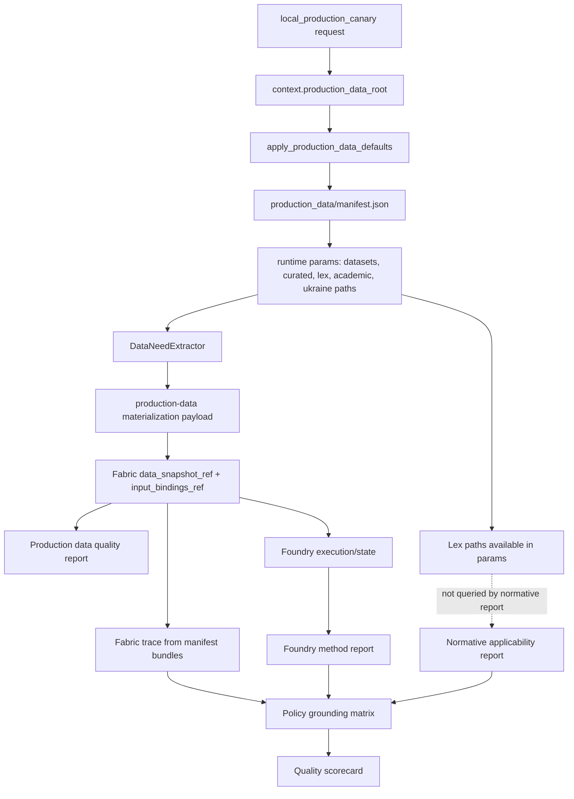

# Production Data End-To-End Diagnostic Backlog

This document records the first technical diagnosis after a live provider
end-to-end run against `production_data`.

The goal is intentionally diagnostic, not remediation. The run proved that the
quality gates fail closed, but it also exposed deeper semantic integration
problems in how runtime code currently turns `production_data` into legal,
Fabric, Foundry, and final-policy evidence.

## Source Run

- Command class: `tools/ops_runners/runtime/local_production_canary.py`
- Mode: `--mode=real`
- Execution profile: `research`
- Canary kind: `research`
- Scenario: `ukraine_msme_wartime_credit_support`
- Production data root: `production_data`
- Evidence bundle:
  `.polisyos/real_production_quality_run/20260513T192847Z_0394f5df61fe4004ad494bf63a863542`
- True `execution-profile=production` attempt: failed closed before execution
  with `RuntimeBootstrapError: Execution profile requires PostgreSQL-backed
  control-plane state store.`

Important distinction:

- Readiness/evidence completeness passed: the system produced the required
  bundle and runtime refs.
- Policy quality failed: `quality_status=fail`, `overall_score=0.6125`,
  approval ineligible, five blocking quality failures.

## How To Read This Backlog

This backlog now has three layers:

- The current execution view is the Pass 1A / Pass 1B / Pass 2 model below.
  It replaces the older Bucket A/B/C scheduling model for new work.
- The grouped diagnostic taxonomy below is the conceptual map. Similar problems
  are placed together, and each PDD task appears exactly once as a primary task.
- The detailed sections after the taxonomy remain the evidence log in discovery
  order. They preserve the investigation path, source observations, and
  code-level reasoning that produced the grouped tasks.

Use the Pass model to schedule work. Use the grouped taxonomy to understand
ownership and risk. Use the detailed evidence log to understand why a task
exists and which code paths or artifacts motivated it.

## Wave 41 - Generated Pass 2 Diagnostic Fragment Merge

Merge date: 2026-05-19

Source fragments:
`_build/diagnostics/pass2/backlog_fragments/`.

These generated Pass 2 fragments are merged here as the Wave 41 handoff index.
The canonical PDD task bodies below remain the scheduling surface; this section
adds the generated diagnostic result, artifact links, and next action without
claiming that open findings are fixed by documentation.

| PDD | Phase | Diagnostic result | Artifact links | Next action |
| --- | --- | --- | --- | --- |
| `PDD-034` | 34.6 | Failed: projection consistency matrix incomplete. | [fragment](repo://_build/diagnostics/pass2/backlog_fragments/pdd-034.md), [detail](repo://_build/diagnostics/pdd-034/dashboard_api_projection_consistency_audit.md), [machine](repo://_build/diagnostics/pdd-034/dashboard_api_projection_consistency_audit.json) | Add API/dashboard projection-state matrix and masking negative controls. |
| `PDD-037` | 34.1 | Failed: cross-domain serious bundles missing. | [fragment](repo://_build/diagnostics/pass2/backlog_fragments/pdd-037.md), [summary](repo://_build/diagnostics/pdd-037/summary.md), [machine](repo://_build/diagnostics/pdd-037/cross_domain_generality_diagnostic_matrix.json) | Generate required cross-domain research-profile runtime bundles and rerun Phase 34.1. |
| `PDD-038` | 34.2 | Failed: adversarial scenario coverage incomplete. | [fragment](repo://_build/diagnostics/pass2/backlog_fragments/pdd-038.md), [summary](repo://_build/diagnostics/pdd-038/summary.md), [machine](repo://_build/diagnostics/pdd-038/adversarial_fail_closed_diagnostics.json) | Add no-jurisdiction, legal-conflict, irrelevant-data, insufficient-ID, hidden-token, prompt-injection, and illegal-policy probes. |
| `PDD-044` | 34.3 | Blocked: section refs exist, but publishable compiler gate is blocked. | [fragment](repo://_build/diagnostics/pass2/backlog_fragments/pdd-044.md), [detail](repo://_build/diagnostics/pdd-044/final_artifact_section_grounding_audit.md), [machine](repo://_build/diagnostics/pdd-044/final_artifact_section_grounding_audit.json) | Bind final artifact sections through runtime claim registry and passing scorecard gates. |
| `PDD-046` | 34.5 | Failed: root-cause breadcrumbs are partial. | [fragment](repo://_build/diagnostics/pass2/backlog_fragments/pdd-046.md), [detail](repo://_build/diagnostics/pdd-046/operational_root_cause_completeness_audit.md), [machine](repo://_build/diagnostics/pdd-046/operational_root_cause_completeness_audit.json) | Normalize failure classes to first missing producer and complete operator command chains. |
| `PDD-048` | 34.3 | Failed: implementing competence binding missing. | [fragment](repo://_build/diagnostics/pass2/backlog_fragments/pdd-048.md), [detail](repo://_build/diagnostics/pdd-048/institutional_competence_authority_audit.md), [machine](repo://_build/diagnostics/pdd-048/institutional_competence_authority_audit.json) | Add competence refs, implementing authority chain, and jurisdiction-spine closure. |
| `PDD-050` | 34.3 | Failed: external validity is not bound to claim support. | [fragment](repo://_build/diagnostics/pass2/backlog_fragments/pdd-050.md), [detail](repo://_build/diagnostics/pdd-050/external_validity_transferability_audit.md), [machine](repo://_build/diagnostics/pdd-050/external_validity_transferability_audit.json) | Add method transportability limits and source-target context comparison refs. |
| `PDD-051` | 34.3 | Failed: uncertainty is local, not end-to-end. | [fragment](repo://_build/diagnostics/pass2/backlog_fragments/pdd-051.md), [detail](repo://_build/diagnostics/pdd-051/uncertainty_propagation_chain_audit.md), [machine](repo://_build/diagnostics/pdd-051/uncertainty_propagation_chain_audit.json) | Bind uncertainty refs from data, method, legal, provider, and implementation risks to claims. |
| `PDD-055` | 34.1 | Failed: metamorphic runtime variants missing. | [fragment](repo://_build/diagnostics/pass2/backlog_fragments/pdd-055.md), [summary](repo://_build/diagnostics/pdd-055/summary.md), [machine](repo://_build/diagnostics/pdd-055/metamorphic_policy_diagnostic_suite.json) | Add paired metamorphic canary lanes for paraphrase, language, jurisdiction, time, irrelevant-evidence, and data-removal perturbations. |
| `PDD-056` | 34.1 | Failed: multilingual/transliteration runtime pairs missing. | [fragment](repo://_build/diagnostics/pass2/backlog_fragments/pdd-056.md), [summary](repo://_build/diagnostics/pdd-056/summary.md), [machine](repo://_build/diagnostics/pdd-056/multilingual_transliteration_equivalence_audit.json) | Add paired English, Ukrainian, mixed-language, transliterated, and hardcoded-language-path lanes. |
| `PDD-057` | 34.3 | Failed: monitoring plan is not claim-bound. | [fragment](repo://_build/diagnostics/pass2/backlog_fragments/pdd-057.md), [detail](repo://_build/diagnostics/pdd-057/final_decision_monitoring_claim_binding_audit.md), [machine](repo://_build/diagnostics/pdd-057/final_decision_monitoring_claim_binding_audit.json) | Add claim-to-monitor map and lifecycle records naming invalidated claims and assumptions. |
| `PDD-064` | 34.2 | Failed: cache/index/snapshot poisoning controls missing. | [fragment](repo://_build/diagnostics/pass2/backlog_fragments/pdd-064.md), [summary](repo://_build/diagnostics/pdd-064/summary.md), [machine](repo://_build/diagnostics/pdd-064/cache_index_snapshot_poisoning_audit.json) | Emit fingerprint ledgers, compatibility proofs, and stale/poisoned/cross-context negative tests. |
| `PDD-065` | 34.2 | Failed: cross-component error taxonomy missing. | [fragment](repo://_build/diagnostics/pass2/backlog_fragments/pdd-065.md), [summary](repo://_build/diagnostics/pdd-065/summary.md), [machine](repo://_build/diagnostics/pdd-065/cross_component_error_semantics_audit.json) | Publish error taxonomy and keep root-cause codes in readiness summaries. |
| `PDD-069` | 34.6 | Failed: operator truthfulness coverage is one fixture, not a matrix. | [fragment](repo://_build/diagnostics/pass2/backlog_fragments/pdd-069.md), [detail](repo://_build/diagnostics/pdd-069/dashboard_operator_truthfulness_audit.md), [machine](repo://_build/diagnostics/pdd-069/dashboard_operator_truthfulness_audit.json) | Persist failure-class journey matrix and dashboard-to-readiness diff evidence. |
| `PDD-077` | 34.5 | Failed: restore drill evidence missing. | [fragment](repo://_build/diagnostics/pass2/backlog_fragments/pdd-077.md), [detail](repo://_build/diagnostics/pdd-077/backup_restore_drill_evidence_audit.md), [machine](repo://_build/diagnostics/pdd-077/backup_restore_drill_evidence_audit.json) | Add retained-copy, chain-of-custody, corruption-recovery, restored dashboard, lineage, scorecard, and final-artifact verification. |
| `PDD-078` | 34.5 | Failed: resource exhaustion negative scenarios missing. | [fragment](repo://_build/diagnostics/pass2/backlog_fragments/pdd-078.md), [detail](repo://_build/diagnostics/pdd-078/resource_exhaustion_semantics_audit.md), [machine](repo://_build/diagnostics/pdd-078/resource_exhaustion_semantics_audit.json) | Add resource exhaustion ledger, typed resource limits, claim-impact mapping, and degradation binding. |
| `PDD-083` | 34.6 | Failed: memory/reflexion authority ledger missing. | [fragment](repo://_build/diagnostics/pass2/backlog_fragments/pdd-083.md), [detail](repo://_build/diagnostics/pdd-083/reusable_agent_memory_reflexion_applicability_audit.md), [machine](repo://_build/diagnostics/pdd-083/reusable_agent_memory_reflexion_applicability_audit.json) | Emit memory-use ledger or no-memory attestation with tenant, freshness, confidence, and contamination decisions. |
| `PDD-087` | 34.3 | Failed: DDM/model readiness not bound to policy claims. | [fragment](repo://_build/diagnostics/pass2/backlog_fragments/pdd-087.md), [detail](repo://_build/diagnostics/pdd-087/model_registry_readiness_binding_audit.md), [machine](repo://_build/diagnostics/pdd-087/model_registry_readiness_binding_audit.json) | Add claim-to-model dependency, DDM readiness, calibration, stationarity, and method-result refs. |
| `PDD-088` | 34.3 | Not triggered: no BERL/explanation support usage detected. | [fragment](repo://_build/diagnostics/pass2/backlog_fragments/pdd-088.md), [detail](repo://_build/diagnostics/pdd-088/berl_explanation_reliability_binding_audit.md), [machine](repo://_build/diagnostics/pdd-088/berl_explanation_reliability_binding_audit.json) | Future runs should emit an explicit no-explanation-support boundary. |
| `PDD-090` | 34.5 | Failed: realtime cursor/replay/polling parity not proven. | [fragment](repo://_build/diagnostics/pass2/backlog_fragments/pdd-090.md), [detail](repo://_build/diagnostics/pdd-090/realtime_cursor_replay_polling_parity_audit.md), [machine](repo://_build/diagnostics/pdd-090/realtime_cursor_replay_polling_parity_audit.json) | Add live/polling parity ledger, cursor replay proof, reconnect scenarios, and degraded transport explanation. |
| `PDD-097` | 34.6 | Failed: implementation feasibility ledger missing. | [fragment](repo://_build/diagnostics/pass2/backlog_fragments/pdd-097.md), [detail](repo://_build/diagnostics/pdd-097/implementation_feasibility_beyond_final_text_audit.md), [machine](repo://_build/diagnostics/pdd-097/implementation_feasibility_beyond_final_text_audit.json) | Emit institutional feasibility ledger with implementation authority, risk, monitoring, and claim binding. |
| `PDD-098` | 34.2 | Failed: strategic behavior ledger missing. | [fragment](repo://_build/diagnostics/pass2/backlog_fragments/pdd-098.md), [summary](repo://_build/diagnostics/pdd-098/summary.md), [machine](repo://_build/diagnostics/pdd-098/strategic_behavior_binding_audit.json) | Add gaming, fraud, arbitrage, misreporting, threshold, enforcement, and mitigation bindings. |
| `PDD-099` | 34.6 | Failed: contestability/appeals ledger missing. | [fragment](repo://_build/diagnostics/pass2/backlog_fragments/pdd-099.md), [detail](repo://_build/diagnostics/pdd-099/public_contestability_appeals_legitimacy_audit.md), [machine](repo://_build/diagnostics/pdd-099/public_contestability_appeals_legitimacy_audit.json) | Emit outcome-bearing contestability ledger with standing, grounds, SLA, disposition, and publication-state effects. |
| `PDD-100` | 34.4 | Failed: claim-bound extraction-quality ledger missing. | [fragment](repo://_build/diagnostics/pass2/backlog_fragments/pdd-100.md), [detail](repo://_build/diagnostics/pdd-100/document_extraction_authority_audit.md), [machine](repo://_build/diagnostics/pdd-100/document_extraction_authority_audit.json) | Add extraction-quality ledger with retrieval locator, OCR/table/page/skipped-content refs, and claim selection. |
| `PDD-101` | 34.4 | Failed: survey-to-claim measurement ledger missing. | [fragment](repo://_build/diagnostics/pass2/backlog_fragments/pdd-101.md), [detail](repo://_build/diagnostics/pdd-101/survey_measurement_construct_validity_audit.md), [machine](repo://_build/diagnostics/pdd-101/survey_measurement_construct_validity_audit.json) | Add survey abstention/measurement contract, design semantics, and survey-specific blockers. |
| `PDD-103` | 34.6 | Failed: trust-framing ledger gap. | [fragment](repo://_build/diagnostics/pass2/backlog_fragments/pdd-103.md), [detail](repo://_build/diagnostics/pdd-103/human_overtrust_ui_persuasion_risk_audit.md), [machine](repo://_build/diagnostics/pdd-103/human_overtrust_ui_persuasion_risk_audit.json) | Map labels, icons, colors, copy, confidence, and signature cues to authority caveats with UI negative tests. |
| `PDD-104` | 34.5 | Failed: archive-grade reproducibility not proven for Wave 33. | [fragment](repo://_build/diagnostics/pass2/backlog_fragments/pdd-104.md), [detail](repo://_build/diagnostics/pdd-104/archive_grade_reproducibility_audit.md), [machine](repo://_build/diagnostics/pdd-104/archive_grade_reproducibility_audit.json) | Add archive-grade decision bundle, long-term snapshots, verifier/timestamp/signature lockfile, retention jurisdiction, and replay/drift drill evidence. |

## Grouped Diagnostic Taxonomy

### Cluster 1 - Policy Intent, Ontology, Measurement, And Generality

Core risk:

- the system may not preserve policy meaning from user intent into canonical
  concepts, metrics, source families, norms, methods, and final claims.

Keep these together because they define what the policy problem means before
Lex, Fabric, Foundry, or Scientist can do reliable work.

Primary diagnostic tasks:

- `PDD-003` - Data need origin and catalog constraints.
- `PDD-007` - Cross-graph ontology and join-key bridge.
- `PDD-010` - Policy intent envelope.
- `PDD-011` - Metric, dataset, legal, and method ontology reconciliation.
- `PDD-037` - Cross-domain generality diagnostic matrix.
- `PDD-047` - Policy ontology and concept normalization trace.
- `PDD-049` - Objective function and value tradeoff provenance.
- `PDD-055` - Metamorphic policy diagnostic suite.
- `PDD-056` - Multilingual and transliteration end-to-end equivalence.

Typical symptoms:

- policy intent becomes generic data needs.
- canonical metric ids are available, but broader policy concepts are not.
- equivalent prompts in another language or wording may bind different
  datasets, norms, or methods.
- the system cannot explain value tradeoffs or objective weights.

### Cluster 2 - Legal Norms, Jurisdiction, And Institutional Authority

Core risk:

- legal authority can be represented, but not actually retrieved, filtered,
  attached to recommendations, or used to block out-of-scope policy actions.

Keep these together because legal grounding is not one report. It spans legal KG
retrieval, jurisdiction/time filters, conflicts, final legal assertions, and
institutional competence.

Primary diagnostic tasks:

- `PDD-001` - Lex retrieval boundary.
- `PDD-043` - Legal norm retrieval authority.
- `PDD-048` - Institutional competence and implementing authority.

Typical symptoms:

- Lex DB paths are configured, but candidate norms remain empty.
- conflict checks pass because no applicable norms were retrieved.
- recommendations have legal compatibility language but no implementing actor
  mandate or delegated authority.

### Cluster 3 - Production Data, Fabric Retrieval, Bundle Contracts, And Lineage

Core risk:

- real production data can exist on disk while the runtime selects bundle roles,
  generic source families, or uninspectable nested artifacts instead of
  scenario-relevant evidence.

Keep these together because Fabric quality depends on the full chain: manifest,
semantic binding, source selection, inspectable files, dictionaries, lineage,
and claim-level data refs.

Primary diagnostic tasks:

- `PDD-002` - Scenario-relevant production data inventory.
- `PDD-008` - Production bundle adapter contract.
- `PDD-014` - Production bundle loader and dictionary boundaries.
- `PDD-042` - Dataset catalog and semantic binding.
- `PDD-052` - Derived data and feature lineage to claims.

Typical symptoms:

- manifest roles are treated as selected source families.
- domain-rich Ukraine parquet bundles are invisible to generic quality checks.
- row counts, dictionaries, units, and schema coverage vanish behind a root
  bundle ref.
- claim grounding stops at dataset-level refs instead of field/transform
  lineage.

### Cluster 4 - Foundry Method Selection, Causal Validity, And Uncertainty

Core risk:

- method infrastructure exists, but the runtime may choose generic execution or
  local method reports without proving that the method fits the policy claim,
  target context, causal assumptions, and uncertainty envelope.

Keep these together because a policy claim is only as strong as the method,
external validity, sensitivity, and uncertainty chain behind it.

Primary diagnostic tasks:

- `PDD-004` - Foundry method selection.
- `PDD-050` - External validity and transferability gate.
- `PDD-051` - Uncertainty propagation chain.

Typical symptoms:

- Foundry emits a method report, but not one selected from scenario method
  expectations.
- source-context evidence supports target-context claims without explicit
  transportability checks.
- final artifacts contain uncertainty language, but not propagated uncertainty
  from data, method, legal, provider, and implementation risks.

### Cluster 5 - Final Claims, Decision Compiler, Monitoring, And Public Artifacts

Core risk:

- final decision artifacts can look structurally complete while major claims,
  recommendations, monitoring plans, and public exports are not compiler-grade
  grounded.

Keep these together because final policy quality is the last point where data,
method, legal, risk, budget, tradeoff, monitoring, and public auditability must
converge.

Primary diagnostic tasks:

- `PDD-005` - Final claim evidence binding.
- `PDD-006` - Decision artifact quality false pass.
- `PDD-030` - Published decision lifecycle binding.
- `PDD-044` - Final artifact section grounding.
- `PDD-057` - Final decision monitoring claim binding.
- `PDD-067` - Public export semantic preservation.

Typical symptoms:

- final claims lack data, method, or norm refs.
- quality passes because the artifact has sections, not because every section
  has authoritative support or a typed blocker.
- monitoring plans exist but are not bound to specific claims, assumptions,
  risks, or stale/reissue triggers.
- redaction preserves privacy but may erase auditability or present
  provisional pass language.

### Cluster 6 - Runtime Orchestration, Evidence Authority, Contracts, And Source Of Truth

Core risk:

- the system has many evidence surfaces, but no single explicit authority chain
  for every closeout field, invariant, schema, prompt/tool contract, and
  runtime event.

Keep these together because they determine whether diagnostics themselves are
trustworthy.

Primary diagnostic tasks:

- `PDD-009` - Runtime-vs-bundle normalization divergence.
- `PDD-012` - Scientist workflow skip authority.
- `PDD-013` - Validator authority contradiction matrix.
- `PDD-015` - Architecture boundary and runtime-view map.
- `PDD-016` - Payload spelunking and schema synonyms.
- `PDD-020` - Universal policy-design architecture fitness functions.
- `PDD-021` - Architecture decisions and missing ADRs.
- `PDD-026` - Bundle-generated evidence provenance.
- `PDD-027` - Scorecard ref authenticity.
- `PDD-035` - Minimum Closeout Gate-to-code traceability matrix.
- `PDD-036` - Temporal execution and ref-causality trace.
- `PDD-053` - Schema evolution and reader/producer contract drift.
- `PDD-054` - Prompt and tool contract trace.
- `PDD-059` - Adapter and glue semantic loss.
- `PDD-060` - Source-of-truth conflict resolution.
- `PDD-066` - Orchestration contract versus runtime order.
- `PDD-070` - Boundary ownership map for production invariants.

Typical symptoms:

- CAS, progress, scorecard, bundle, dashboard, and readiness disagree.
- canary assembly can generate evidence after runtime execution.
- JSON adapters strip typed authority fields.
- prompt/tool outputs are not replayable at the same authority level as other
  runtime artifacts.
- several components partially enforce an invariant, but no component owns the
  final production decision.

### Cluster 7 - Mode Leakage, Routing, Fallbacks, And Test Theater

Core risk:

- serious runs can accidentally use dev, fixture, mock, simulated, generic, or
  fallback behavior while still producing plausible bundles.

Keep these together because they are the fastest way for a large system to look
production-grade while running a weaker path.

Primary diagnostic tasks:

- `PDD-017` - Dormant capability integration inventory.
- `PDD-019` - Serious-profile degradation and fallback boundaries.
- `PDD-038` - Negative and adversarial fail-closed policy diagnostics.
- `PDD-061` - Profile and mode leakage.
- `PDD-062` - Router and capability selection.
- `PDD-063` - Silent fallback and degradation semantics.
- `PDD-068` - Fixture overfitting and test theater.

Typical symptoms:

- production-like runs inherit CI smoke or simulated-provider assumptions.
- generic data needs or default execution plans replace domain-specific
  routing.
- fallback evidence is treated as normal evidence.
- tests validate fixture shape rather than runtime-owned producer behavior.

### Cluster 8 - Tenant, CAS, Approval, Privacy, Security, And Human Review Authority

Core risk:

- governance controls can exist as reports or metadata while access boundaries,
  artifact ownership, approval semantics, privacy/security authority, and human
  review override limits remain incomplete.

Keep these together because they decide whether serious evidence can be safely
used, shared, approved, exported, or overridden.

Primary diagnostic tasks:

- `PDD-022` - Control-plane tenant identity boundary.
- `PDD-023` - CAS ambient ownership strictness.
- `PDD-024` - Artifact tenant mapping depth.
- `PDD-025` - CAS manifest producer and governance metadata.
- `PDD-028` - Production approval read-model authority.
- `PDD-029` - Override signature semantics.
- `PDD-033` - Privacy/security evidence source authority.
- `PDD-039` - Trusted versus untrusted authority fields.
- `PDD-041` - Multi-tenant shared-CAS deep evidence graph.
- `PDD-058` - Human review override authority boundaries.

Typical symptoms:

- tenant identity is payload-scoped rather than enforced at the job/schema/CAS
  boundary.
- approval packets are stronger than the approval read model.
- override signatures exist but may not encode what can and cannot be
  overridden.
- security/privacy reports are present but may be driven by payload metadata
  rather than authoritative runtime checks.

### Cluster 9 - Replay, Resilience, Freshness, Cache, And Partial-State Consistency

Core risk:

- runs can be reproducible only as manifests, resilient only as modeled lanes,
  or fresh only by static metadata while partial states, stale indexes, and
  retry paths remain unproven.

Keep these together because production decisions depend on time, replayability,
stale-data rejection, and consistent recovery from crashes or retries.

Primary diagnostic tasks:

- `PDD-031` - Replay reproduction semantics.
- `PDD-032` - Resilience observed-vs-modeled evidence.
- `PDD-040` - Crash, retry, and partial-state evidence consistency.
- `PDD-045` - Evidence freshness and policy-time semantics.
- `PDD-064` - Cache, index, and snapshot poisoning.

Typical symptoms:

- replay proves manifest stability but not rerun equivalence.
- resilience evidence models lanes but does not exercise operational failure
  paths.
- legal norms, dataset catalogs, semantic indexes, prompt caches, or benchmark
  packs can be stale while still looking authoritative.

### Cluster 10 - Observability, Dashboard, And Operator Debuggability

Core risk:

- evidence may fail correctly while the operator cannot understand why quickly
  enough to trust or repair the system.

Keep these together because observability is part of the production safety
case, not a UI polish layer.

Primary diagnostic tasks:

- `PDD-018` - Observability and skip-causality loss.
- `PDD-034` - Dashboard/API semantic projection consistency.
- `PDD-046` - Observability root-cause completeness.
- `PDD-065` - Cross-component error semantics.
- `PDD-069` - Dashboard operator truthfulness.

Typical symptoms:

- node-level skip reasons collapse into missing evidence.
- dashboard/API projections show normalized or optimistic state instead of the
  authoritative failure cause.
- different upstream errors become generic `warn`, `unknown`, or `missing`
  statuses.
- an engineer cannot move from readiness failure to owner, phase, missing
  input, upstream cause, downstream impact, artifact refs, and next command.

### Cluster 11 - Configuration, Deployment, Release, And Generated Surfaces

Core risk:

- the same code can behave differently across local, CI, staging, production,
  generated clients, release artifacts, and deployment units without the run
  evidence proving which configuration and release surface was actually used.

Keep these together because a production-quality policy run is not only a
runtime artifact chain. It also depends on effective configuration, environment
parity, release provenance, migration compatibility, generated API/client
surfaces, and the amount of manual review hidden behind "contract-only" gates.

Primary diagnostic tasks:

- `PDD-071` - Effective runtime configuration and environment provenance.
- `PDD-072` - Deployment topology and environment parity.
- `PDD-075` - Release and supply-chain provenance bound to runtime evidence.
- `PDD-076` - Migration and backward-compatibility evidence for persisted state.
- `PDD-080` - Generated surface drift across OpenAPI, clients, dashboard, and
  CLI.
- `PDD-081` - Manual gate and runbook automation gap.

Typical symptoms:

- a run cannot explain which env vars, feature flags, `.env` overlays, default
  bootstrap values, or deployment profile shaped it.
- release and promotion gates exist, but serious evidence bundles do not point
  to the release/SBOM/attestation/migration evidence used for that run.
- generated API/dashboard/client surfaces drift from runtime behavior.
- important production gates are documented as manual review but are not
  represented as machine-checkable closeout evidence.

### Cluster 12 - External Acquisition, Numeric Semantics, Recovery, And Lifecycle Hygiene

Core risk:

- source acquisition, numeric/geographic interpretation, resource exhaustion,
  recovery drills, quarantine/deprecation, and retention/deletion policy can
  silently change whether evidence is trustworthy or reproducible.

Keep these together because they are cross-cutting data-plane and operations
risks. They sit below individual policy domains but can invalidate any policy
decision that depends on external data, transformed quantities, retained
artifacts, provider limits, or long-lived audit evidence.

Primary diagnostic tasks:

- `PDD-073` - External connector acquisition and source governance.
- `PDD-074` - Numerical, unit, currency, geography, and calendar semantics.
- `PDD-077` - Backup, restore, and disaster-recovery drill evidence.
- `PDD-078` - Resource quota, rate-limit, and cost-exhaustion semantics.
- `PDD-079` - Quarantine, deprecation, and compatibility-shim lifecycle.
- `PDD-082` - Retention, deletion, replay, and audit-evidence tension.

Typical symptoms:

- external sources are fetched safely but not tied to final policy authority or
  replay/refusal semantics.
- unit conversion, currency, inflation base, geography, administrative
  boundary, and calendar assumptions are local transform metadata rather than
  final-claim blockers.
- backup and restore runbooks exist but are not exercised as production-quality
  evidence.
- rate limits, quota exhaustion, cost exhaustion, or deprecation/quarantine
  states become warnings instead of policy-quality blockers.
- retention or deletion can break replay/audit evidence, or replay retention can
  violate minimization and deletion expectations.

### Cluster 13 - Agent Memory, Learning, Simulation, And Explanation Authority

Core risk:

- agent memory, reflexion lessons, tool loops, plugin discovery, model-readiness
  monitors, simulation worlds, counterfactual scenarios, and explanation layers
  can influence decisions without being treated as first-class policy evidence.

Keep these together because they are powerful accelerants. They can improve
policy-design quality, but they can also import stale lessons, hidden-eval
contamination, untrusted plugin behavior, generic simulations, ungrounded
counterfactuals, or explanation claims that sound stronger than their evidence.

Primary diagnostic tasks:

- `PDD-083` - Reusable agent memory and reflexion applicability authority.
- `PDD-084` - Tool-loop transcript, compaction, and tool-result authority.
- `PDD-085` - Component/plugin discovery, ABI, and capability isolation.
- `PDD-086` - Synthetic-world, simulation, and counterfactual evidence boundary.
- `PDD-087` - DDM/model-registry readiness binding to policy evidence.
- `PDD-088` - BERL explanation reliability binding to final policy claims.

Typical symptoms:

- previous-run lessons enter prompts without proving applicability,
  non-contamination, tenant scope, or domain scope.
- tool calls influence LLM output but do not become replayable CAS artifacts
  with authority, inputs, outputs, and degraded-event semantics.
- local dev-scan plugins override installed components without production-safe
  provenance.
- simulation, scenario, mobility, and counterfactual surfaces are treated like
  observed production evidence.
- model drift/readiness and explanation reliability exist as strong local
  contracts but are not bound to final policy claims or approval gates.

### Cluster 14 - Interactive Client, Realtime, Collaboration, And Official Document Surfaces

Core risk:

- the dashboard, assistant/clerk surface, offline queues, optimistic caches,
  live streams, collaborative review state, local drafts, and official-looking
  document exports can present or mutate policy state outside the authoritative
  runtime evidence chain.

Keep these together because they are where humans experience the system. A
production policy-design platform can fail even when backend artifacts are
correct if client-side state makes unapproved decisions look approved, live
streams hide lost events, collaboration locks imply review authority, or
bureaucratic exports look official without legal/template evidence.

Primary diagnostic tasks:

- `PDD-089` - Offline and optimistic client mutation authority.
- `PDD-090` - Realtime SSE/WebSocket cursor, replay, and polling parity.
- `PDD-091` - Collaborative review locks, presence, and attribution authority.
- `PDD-092` - Assistant/clerk conversation and composer draft provenance.
- `PDD-093` - Bureaucratic template, rendering, export, and official-form
  authority.
- `PDD-094` - Client-side persistence, privacy, and local evidence retention.

Typical symptoms:

- IndexedDB/offline queues or optimistic React Query state show promotion
  decisions before signed server evidence exists.
- SSE snapshots and polling fallbacks disagree about run status, terminality,
  governance waits, or evidence freshness.
- review locks and presence are in-memory collaboration aids but may be read as
  authoritative human-review state.
- local chat sessions and composer drafts contain policy intent or sensitive
  evidence but are not part of the run provenance/redaction model.
- generated HTML/PDF/DOCX exports preserve blocks and watermarks but do not
  prove legal-template approval, semantic completeness, or official-use limits.

### Cluster 15 - Privileged Trust, Signing, Contestability, Human Trust, And Archive Accountability

Core risk:

- privileged actors, signing keys, public trust surfaces, contestability paths,
  and long-term archives can create the appearance of authority without a
  complete tamper-evident, cryptographic, human-accountable evidence chain.

Keep these together because they govern who can legitimately approve, sign,
publish, contest, trust, and later verify a production policy decision.

Primary diagnostic tasks:

- `PDD-095` - Privileged operator and insider threat authority.
- `PDD-096` - Key, signing, and public decision trust lifecycle.
- `PDD-099` - Public contestability, appeals, and legitimacy contract.
- `PDD-103` - Human overtrust and UI persuasion risk.
- `PDD-104` - Archive-grade reproducibility and long-term verification.

Typical symptoms:

- operator, admin, CI, release, or reviewer privileges can alter approval or
  evidence state without per-run separation-of-duty and tamper evidence.
- CAS artifacts may have Ed25519 signatures while public decision packets use a
  separate deterministic UI hash called a signature.
- public viewers, verified badges, official-looking forms, and confidence
  colors can make weak or draft authority look stronger than it is.
- disputes and stakeholder lenses exist in the UI, but contestability is not a
  runtime-owned appeal/response/standing contract.
- archived evidence can be retained without proving it can still be opened,
  verified, and interpreted years later.

### Cluster 16 - Implementation Reality, Strategic Behavior, Extraction, Measurement, And Dependencies

Core risk:

- a policy can be legally and statistically plausible while still failing
  because implementation capacity, strategic behavior, extraction fidelity,
  survey measurement validity, or external dependency contracts were not
  treated as first-class blockers.

Keep these together because they are the bridge between an analytical policy
recommendation and the real institutions, documents, respondents, actors, and
providers that make the recommendation true or false in practice.

Primary diagnostic tasks:

- `PDD-097` - Implementation feasibility beyond final text.
- `PDD-098` - Strategic behavior, gaming, fraud, and arbitrage binding.
- `PDD-100` - Document, OCR, footnote, annex, and table extraction authority.
- `PDD-101` - Survey design, measurement error, and construct-validity
  semantics.
- `PDD-102` - External dependency contract and source/provider risk.

Typical symptoms:

- final artifacts mention feasibility, budget, stakeholders, or implementation
  risk, but no deliverability contract proves agency mandate, capacity,
  procurement, enforcement, appeals, or rollout readiness.
- strategic-response methods exist, but final recommendations do not bind
  predicted gaming, take-up distortion, fraud, or arbitrage to policy design.
- PDF, scanned, tabular, footnote, and annex evidence can be normalized into
  text without extraction-quality authority or table/locator preservation.
- survey outputs carry weights and diagnostics locally, but causal/final claims
  may not inherit design, nonresponse, imputation, proxy, and measurement-error
  blockers.
- connectors and source contracts prove technical replay but not API terms,
  license revocation, data-withdrawal, provider outage, or hosting/jurisdiction
  contract risk.

## PDD Diagnostic Pass Model

The current scheduling model replaces Bucket A/B/C with four states:

- Done - diagnosed and implemented through the Honest Diagnostics substrate.
- Pass 1A - domain diagnostics that can be completed now and directly shape
  A1-A6.
- Pass 1B - static architecture, governance, release, client, and hardening
  diagnostics that can run now in parallel with Pass 1A.
- Pass 2 - behavioral diagnostics that must wait until A1-A6 can produce real
  domain evidence.

Detailed execution matrix:

- `_build/diagnostics/pdd-pass-triage/summary.md`
- `_build/diagnostics/pdd-pass-triage/pdd_pass_execution_model.json`

Current counts:

| State | Count | PDDs |
|---|---:|---|
| Done - diagnosed and implemented | 20 | PDD-009, PDD-012, PDD-013, PDD-015, PDD-016, PDD-020, PDD-021, PDD-026, PDD-027, PDD-035, PDD-036, PDD-053, PDD-054, PDD-059, PDD-060, PDD-061, PDD-063, PDD-066, PDD-068, PDD-070 |
| Pass 1A - domain static diagnostics | 18 | PDD-001, PDD-002, PDD-003, PDD-004, PDD-005, PDD-006, PDD-007, PDD-008, PDD-010, PDD-011, PDD-014, PDD-042, PDD-043, PDD-047, PDD-049, PDD-052, PDD-062, PDD-074 |
| Pass 1B - static hardening diagnostics | 39 | PDD-017, PDD-018, PDD-019, PDD-022, PDD-023, PDD-024, PDD-025, PDD-028, PDD-029, PDD-030, PDD-031, PDD-032, PDD-033, PDD-039, PDD-040, PDD-041, PDD-045, PDD-058, PDD-067, PDD-071, PDD-072, PDD-073, PDD-075, PDD-076, PDD-079, PDD-080, PDD-081, PDD-082, PDD-084, PDD-085, PDD-086, PDD-089, PDD-091, PDD-092, PDD-093, PDD-094, PDD-095, PDD-096, PDD-102 |
| Pass 2 - behavioral deferred diagnostics | 27 | PDD-034, PDD-037, PDD-038, PDD-044, PDD-046, PDD-048, PDD-050, PDD-051, PDD-055, PDD-056, PDD-057, PDD-064, PDD-065, PDD-069, PDD-077, PDD-078, PDD-083, PDD-087, PDD-088, PDD-090, PDD-097, PDD-098, PDD-099, PDD-100, PDD-101, PDD-103, PDD-104 |

Pass 1A critical path:

1. Start `PDD-010` and `PDD-062` together.
2. Run the concept spine sequentially: `PDD-007` -> `PDD-011` -> `PDD-047`.
3. Then run Lex, production-data/Fabric, Foundry, and claim/artifact branches
   in parallel.

Pass 1B parallel work:

- Tenant/CAS/approval/governance: PDD-022, PDD-023, PDD-024, PDD-025,
  PDD-028, PDD-029, PDD-030, PDD-033, PDD-058, PDD-095, PDD-096.
- Substrate-residual verification: PDD-019, PDD-031, PDD-032, PDD-039,
  PDD-040, PDD-041, PDD-067, PDD-071, PDD-084, PDD-086.
- Observability/orchestration static audit: PDD-017, PDD-018, PDD-045.
- Config/release/deployment/migration: PDD-072, PDD-075, PDD-076, PDD-079,
  PDD-080, PDD-081, PDD-082.
- External/plugins/dependencies: PDD-073, PDD-085, PDD-102.
- Client surfaces static audit: PDD-089, PDD-091, PDD-092, PDD-093, PDD-094.

Pass 2 rule:

- Do not mark a Pass 2 PDD complete until A1-A6 produce real domain evidence.
- Before A1-A6, create only deferred diagnostic cards that name the missing
  evidence, the future command, and expected pass/fail condition.

Artifact rule:

- Every new PDD diagnostic writes details under `_build/diagnostics/<pdd-id>/`.
- This backlog records only the short result and links to those detailed
  artifacts.

## Superseded Bucket A/B/C View

The earlier Bucket A/B/C triage is superseded as a scheduling model. Use the `PDD Diagnostic Pass Model` above for all new work. Detailed pass ordering, per-PDD parallelism, and unlock notes now live in `_build/diagnostics/pdd-pass-triage/summary.md`; the machine-readable distribution lives in `_build/diagnostics/pdd-pass-triage/pdd_pass_execution_model.json`.

## Observed Blocking Failures

### B1 - Lex Norms Were Not Retrieved Into Runtime Normative Evidence

- Status: Open
- Severity: Critical
- Owning layer: Lex runtime retrieval, NL pipeline, normative applicability
- Evidence:
  - `quality_evidence/normative_evidence.json`
  - `candidate_norm_count=0`
  - `applied_norm_count=0`
  - all three major recommendations missing normative anchors
  - target context had `policy_domain=wartime_msme_support`, but
    `jurisdiction` and `as_of` were blank
- Production impact: The system can have a large Lex corpus on disk while final
  recommendations receive no actual legal grounding. Conflict checks passing is
  not sufficient when no applicable norms were retrieved.
- Technical finding:
  - `production_data/manifest.json` points Lex to
    `lex/lex-amendment-only-optimized-20260501-v3/finalize/lex_knowledge_graph.duckdb`.
  - The DuckDB exists and is large, with millions of provisions/facts.
  - `src/polisyos/runtime/http/services/control/production_data.py` wires
    `legal_db_path` and `legal_kg_db_path` from the manifest.
  - But `build_runtime_normative_applicability_report` in
    `src/polisyos/lex/normpack/applicability_report.py` does not query that
    DB. It walks the runtime payload looking for `candidate_norms`, norm packs,
    or rule lists already present in context.
  - In the live run, no upstream step placed candidate norms into context, so
    the report got zero candidate norms.
- Root-cause hypothesis:
  - The current runtime quality report layer validates candidate norms, but it
    is not itself a Lex retriever. The missing bridge is a runtime Lex retrieval
    step that queries `legal_kg_db_path` using jurisdiction, domain, effective
    date, recommendation text, and scenario expected normative fact classes.
  - A secondary issue is target context normalization: `country=Ukraine` was
    not converted into `jurisdiction=UA`/`UKR` for normative applicability.
- Diagnostic follow-up:
  - Trace where `legal_db_path` is passed after
    `apply_production_data_defaults`.
  - Inspect whether Scientist nodes already have a legal search step that could
    emit `candidate_norms`.
  - Query the Lex DB for wartime, MSME, credit, budget, eligibility, displaced,
    and business-support concepts to determine whether relevant norms exist but
    are not surfaced, or whether the Lex bundle itself lacks usable coverage.

### B2 - Fabric Production-Data Lane Selects Manifest Roles, Not Scenario-Relevant Source Families

- Status: Open
- Severity: Critical
- Owning layer: Fabric retrieval, production-data manifest contract, canary
  scenario contract
- Evidence:
  - `quality_evidence/fabric_retrieval_trace.json`
  - selected source families: `datasets`, `lex`, `curated`, `academic`,
    `ukraine_simulation`
  - expected source families from the scenario:
    `production_msme_panel`, `credit_program_registry`,
    `regional_displacement_indicators`
  - all selected families failed `selected_source_family_not_admissible`
- Production impact: The run can materialize real production-data refs while
  still not selecting data sources that match the policy question.
- Technical finding:
  - `build_production_data_fabric_trace` in
    `src/polisyos/runtime/http/services/control/production_data.py` builds
    candidate sources by iterating every bundle role in `production_data`
    manifest.
  - `_source_from_manifest_bundle` sets `source_family` to
    `bundle.source_family`, `bundle.data_source_family`, or the manifest role.
  - Current root manifest does not define `source_family` or
    `data_source_family` for the real production bundles, so the fallback role
    names become source families.
  - The same code sets every candidate's `relevance_score` to `1.0` and the
    selected set is all candidate sources.
  - This is effectively a manifest-pinned evidence lane, not a semantic Fabric
    retrieval/ranking lane.
- Root-cause hypothesis:
  - The root production-data manifest was built as a bundle discovery contract,
    not as a scenario-level source-family contract. The canary scenario expects
    semantic policy source families, but runtime emits infrastructure bundle
    roles.
  - There is no mapping layer from concrete production bundles to admissible
    policy source families, and no ranking/rejection logic for scenario fit.
- Diagnostic follow-up:
  - Decide whether `production_data/manifest.json` should expose semantic
    `source_family` values per bundle or whether Fabric should derive them from
    nested manifests.
  - Inspect dataset catalog and Ukraine simulation manifests for MSME,
    credit-program, displacement, survival, and region/firm-size coverage.
  - Add a diagnostic report that separates "available bundle" from
    "selected source for this policy question".

### B3 - Data Need Extraction Uses US-Oriented Canonical Metrics For A Ukraine MSME Scenario

- Status: Open
- Severity: Critical
- Owning layer: DataNeedExtractor, Fabric metric registry, curated data
  contracts
- Evidence:
  - `quality_evidence/production_data_quality.json`
  - data needs:
    - `us.macro.gdp_nominal` with `geography=UKR`
    - `us.macro.unemployment_rate` with `geography=UKR`
    - `agent.income.salary`
  - construct-validity failures for those metrics across production bundles
  - scenario asked for `msme_survival_rate` and `wartime_credit_support`
- Production impact: The data layer can appear to be using production data but
  actually binds a policy problem to the wrong measurement vocabulary.
- Technical finding:
  - `production_data/canonical/local_data_20260501/policy_engine_data/curated/data_contracts.json`
    defines only three contracts, and two are explicitly US macro metrics.
  - `source_bindings.json` binds those metrics to World Bank WDI / static CSV
    style sources, not Ukraine MSME survival or credit support data.
  - `MockDataNeedExtractorAgent` in
    `src/polisyos/scientist/agent/data_need_extractor.py` defaults to
    `us.macro.gdp_nominal` when no keyword matches.
  - The LLM prompt in `src/polisyos/scientist/agent/prompts.py` uses
    `us.macro.gdp_nominal` as the JSON example. The live run returned UKR
    geography but kept US/agent metric IDs.
- Root-cause hypothesis:
  - The available metric catalog is generic/demo-oriented and not aligned with
    the Ukraine MSME canary. The extractor chose from the only familiar
    canonical metric IDs it had.
  - The prompt example likely reinforces US macro metric IDs when the provided
    catalog is weak or too generic.
- Diagnostic follow-up:
  - Inventory every metric contract available to the runtime during the run.
  - Check whether the Ukraine simulation bundle exposes survival, distress,
    firm size, region, credit, procurement, budget, displacement, and
    frontline-access fields that should become canonical metric IDs.
  - Verify whether `quality_scenario.context.query_outcome=msme_survival_rate`
    is ignored, overwritten, or merely not represented in the metric registry.

### B4 - Ukraine Simulation Data Exists But Is Not Inspectable By Runtime Data-Quality Checks

- Status: Open
- Severity: High
- Owning layer: production-data manifest, runtime data-quality diagnostics,
  Ukraine data bundle
- Evidence:
  - `production_data/ukraine_agent_simulation_baseline_20260410` contains real
    parquet artifacts, including runtime, calibration, intervention, and method
    contract bundles.
  - `quality_evidence/production_data_quality.json` reports
    `row_count=0` for `ukraine_simulation`.
  - It also reports no inspectable tabular production data file and no usable
    data dictionary for that role.
- Production impact: The most domain-relevant data may be physically present
  but invisible to the generic runtime quality checker and, therefore, not
  usable as grounded evidence for approval.
- Technical finding:
  - The root manifest entry for `ukraine_simulation` points to high-level bundle
    directories and method/intervention manifests, but not to concrete
    inspectable data paths such as `agent_registry_runtime.parquet`,
    `observation_panel_monthly.parquet`, or data dictionary files.
  - `build_production_data_quality_report` expects bundle-level data paths,
    dictionaries, schemas, timestamps, and data-need-compatible columns.
- Root-cause hypothesis:
  - The Ukraine bundle is a rich domain artifact pack, while the generic
    production-data quality inspector expects a flat analytical-data bundle
    contract. The bridge manifest is missing.
- Diagnostic follow-up:
  - Create an inventory of Ukraine bundle parquet schemas and row counts.
  - Identify which files should back `production_msme_panel`,
    `credit_program_registry`, and `regional_displacement_indicators`.
  - Determine whether the runtime should understand nested bundle roles or
    whether root manifest should expose scenario-ready flattened views.

### B5 - Foundry Uses Generic `foundry.execute` Simulation Instead Of Scenario Method Contracts

- Status: Open
- Severity: Critical
- Owning layer: Foundry method selection, Scientist workflow state, Ukraine
  method-contract bundle
- Evidence:
  - `quality_evidence/foundry_method_report.json`
  - selected method: `method_id=foundry.execute`, `method_family=simulation`
  - missing assumptions, uncertainty, missingness diagnostics, and sensitivity
  - expected scenario methods: causal effect estimation, heterogeneity by
    region or firm size, uncertainty interval, sensitivity/transportability
- Production impact: The policy recommendation can be presented after a generic
  simulation result without the method evidence required for serious causal or
  statistical claims.
- Technical finding:
  - Ukraine production data includes method contract artifacts such as
    `network_causal_contract_bundle_v1.json` and
    `observation_to_contract_manifest.json`, including panel observational,
    dynamic treatment, survey microdata, and survival-data routes.
  - Runtime method report is built from final Scientist state. If the state has
    only `simulation_result_ref`, `method_quality.py` classifies it as
    `foundry.execute`/`simulation`.
  - The method contract bundle is present on disk but not reflected in
    `selected_methods` or method diagnostics for this run.
- Root-cause hypothesis:
  - The runtime materialization bridge creates refs for Foundry input bindings,
    but method selection does not yet route the Ukraine domain artifacts into a
    validated causal/survival method family with diagnostics.
  - Scenario expected method expectations are enforced only after execution, not
    used to select the execution method.
- Diagnostic follow-up:
  - Trace final Scientist state generation for `simulation_result_ref`.
  - Inspect whether `ukraine_method_contract_bundle_dir` is passed into the
    workflow and whether any node consumes it.
  - Build a minimal diagnostic run that logs candidate method families before
    execution.

### B6 - Final Policy Claims Do Not Carry Data, Method, Or Norm Refs

- Status: Open
- Severity: Critical
- Owning layer: LLM policy generation, Trinity bundle compiler, Scientist
  grounding, decision artifact compiler
- Evidence:
  - `quality_evidence/policy_grounding_matrix.json`
  - all three major claims have empty `data_refs`, `method_refs`, and
    `norm_refs`
  - claims came from `trinity_policy_spec`
  - selected source refs and method refs existed elsewhere in the bundle, but
    were not attached to the claims
- Production impact: The system can generate plausible recommendations while
  the final claims are not auditable back to legal norms, data, or methods.
- Technical finding:
  - The grounding validator receives selected data/method/norm refs and fails
    claims that do not cite them.
  - The final policy claims extracted from the Trinity policy spec contain
    recommendation text but no grounding refs.
  - Norm refs could not be attached because Lex produced no applicable norms.
  - Data/method refs existed but were not propagated into the claim objects.
- Root-cause hypothesis:
  - The final policy artifact contract allows claims without explicit evidence
    refs, and grounding happens after the fact as a validator rather than as a
    compiler requirement.
  - The LLM/Trinity compiler path lacks a required evidence-binding step that
    must attach or reject refs before final policy artifact creation.
- Diagnostic follow-up:
  - Inspect Trinity bundle schema and final claim extraction path for grounding
    fields.
  - Determine whether refs should be generated by the LLM, by a deterministic
    post-processor, or by a compiler that maps claims to selected evidence.
  - Investigate why `decision_artifact_quality.json` passed with
    `recommendation_count=0` while grounding found three major recommendations.

## Current Production Data Flow As Observed

Observed gaps:

- Lex DB path is discovered, but normative applicability uses only candidate
  norms already present in runtime payload.
- Fabric trace is built from root manifest bundle roles and selects all bundles.
- Data needs are not anchored to Ukraine MSME scenario metrics.
- Ukraine nested bundle files are not exposed as inspectable analytical sources.
- Foundry method contracts exist in production data but do not drive method
  selection.
- Final claims are generated before evidence refs are attached or enforced.

## Production Data Layout Notes

Root manifest roles currently discovered:

- `curated`: canonical contracts and source bindings under
  `canonical/local_data_20260501/policy_engine_data/curated`
- `datasets`: broad dataset catalog snapshot under
  `datasets_full_phase3full_20260327_183054`
- `lex`: legal knowledge graph under
  `lex/lex-amendment-only-optimized-20260501-v3`
- `academic`: scholar knowledge graph/runtime evidence under
  `policyos_academic_runtime_slim_20260411T112032Z`
- `ukraine_simulation`: Ukraine simulation artifact pack under
  `ukraine_agent_simulation_baseline_20260410`

These are infrastructure/data-bundle roles. They are not the same as the
scenario source families expected by the canary:

- `production_msme_panel`
- `credit_program_registry`
- `regional_displacement_indicators`

The root manifest therefore needs either:

- explicit semantic source-family mappings, or
- a lower-level resolver that inspects nested manifests and emits
  scenario-ready source families.

## Investigation Pass 2 - Execution Order And Boundary Failures

This pass traced the runtime execution order rather than only the final
scorecard outputs. The central finding is that the system already has many
subsystems and artifacts, but several important contracts are treated as
passive evidence after the run instead of active control inputs during the run.

### Actual Runtime Order

Observed order for the real research-profile run:

1. `local_production_canary.py` loaded the golden scenario and placed
   `expected_evidence_contract` into request `context`.
2. `/api/v1/control/runs/nl` entered `nl_pipeline.py`.
3. `pi_agent.create_problem_frame` created the problem frame.
4. `data_need_extractor.extract_data_needs` produced three data needs:
   `us.macro.gdp_nominal`, `us.macro.unemployment_rate`, and
   `agent.income.salary`, all with `geography=UKR`.
5. The NL pipeline built a default `ExecutionPlan` with `method_dag=[]`.
6. The live Foundry method catalog snapshot existed and contained hundreds of
   entries, but the execution plan still carried no selected method DAG.
7. Preflight returned `ready_to_run=true` with no diagnostics, despite the empty
   method DAG.
8. `RetrievalService.resolve` produced fetch plans.
9. The production-data materialization lane built data snapshot, input
   bindings, registry bundle, Fabric trace, and production-data quality report.
10. Scientist workflow ran through many nodes. Several causal/evaluation nodes
    skipped, while generic simulation produced `simulation_result_ref`.
11. Runtime quality reports were persisted: Fabric, production data quality,
    Foundry method quality, Lex normative applicability, policy grounding,
    conflict, privacy, and related reports.
12. Canary evidence assembly normalized bundle evidence again and applied the
    golden scenario contract to some reports before building the scorecard.

This creates two different semantic moments:

- runtime-local reports evaluate what the runtime happened to select;
- bundle/scorecard reports evaluate those selections against the golden
  scenario contract.

That distinction is useful for closeout, but dangerous for production behavior:
the runtime can proceed without internalizing the policy-question evidence
contract.

### Scenario Contract Is Mostly A Late Oracle, Not An Early Steering Contract

The scenario request contained:

- `normative_fact_classes`
- `admissible_data_source_families`
- `foundry_method_expectations`
- `conflict_checks`
- `unacceptable_recommendations`

Observed propagation:

- The contract is present in request context and persisted artifacts.
- The contract is used by simulated canary evidence generation.
- The contract is used by scorecard/evidence normalization to fail Fabric and
  Foundry evidence after the run.
- The contract is not a demonstrated steering input for data-need extraction,
  Fabric source-family selection, Lex candidate-norm retrieval, execution-plan
  method selection, or final claim generation.

Concrete evidence:

- Runtime Fabric trace had `status=pass` and set expected source families to
  the same infrastructure roles it selected:
  `datasets`, `lex`, `curated`, `academic`, `ukraine_simulation`.
- Bundle Fabric trace had `status=fail` after normalization applied scenario
  expected families:
  `production_msme_panel`, `credit_program_registry`,
  `regional_displacement_indicators`.
- Runtime Foundry method report had `expected_method_expectations=[]`.
- Bundle Foundry method report added scenario expectations and failed
  `foundry.execute` with `method_family_not_expected`.

Diagnostic conclusion: the golden scenario currently behaves more like a
post-run oracle than like a production policy-design contract.

### Production Data Manifest Is A Bundle Locator, Not A Semantic Evidence Map

`production_data/manifest.json` successfully locates infrastructure bundles:

- dataset catalog
- Lex legal knowledge graph
- curated local data
- academic knowledge graph
- Ukraine simulation pack

But the runtime evidence contract needs a different layer:

- Which bundle/file is a production MSME panel?
- Which bundle/file is a credit program registry?
- Which bundle/file carries regional displacement or frontline-access signals?
- Which columns satisfy `msme_survival_rate` and `wartime_credit_support`?
- Which methods are valid for causal effect, heterogeneity, uncertainty, and
  sensitivity for this scenario?

The root manifest does not currently expose that semantic map. As a result:

- Fabric selects all manifest roles with `relevance_score=1.0`.
- Source families fall back to infrastructure role names.
- Data-quality diagnostics inspect roles, not scenario-ready analytical
  source families.
- The scorecard fails only after comparing these role names with scenario
  families.

### Nested Ukraine Bundle Is Rich But Not Runtime-Addressable Enough

The Ukraine simulation pack contains substantial local artifacts:

- `runtime_bundle_v1/*.parquet`
- `calibration_bundle_v1/observation_panel_monthly.parquet`
- intervention maps and policy templates
- method-contract bundle JSON files
- governance and calibration reports

Runtime production-data quality nevertheless reports the
`ukraine_simulation` role as having no inspectable tabular data, no observed
rows, no usable dictionary, and no requested metrics.

Observed technical causes:

- The root manifest points to high-level bundle directories but does not expose
  concrete `data_path`, `parquet_path`, or `data_dictionary_path` values for
  scenario-ready views.
- Runtime data-quality inspection looks at explicit bundle paths and direct
  files under the bundle root. It does not interpret the nested Ukraine release
  manifest as a semantic data catalog.
- Nested release manifests still contain original `/srv/polisyos/...` source
  paths, while the local files are present under the checked-out
  `production_data` tree.
- `_data_paths` recognizes `*.parquet` as possible data paths, but row loading
  does not currently materialize parquet rows in `_load_rows`. Even if the
  correct nested parquet file is surfaced, parquet support has to be verified
  at the inspector boundary.

Diagnostic conclusion: this is not just "missing data." It is a missing
adapter between a rich domain production bundle and the generic runtime
quality/data-selection contract.

### Lex Has Available Source Status But No Applicable Norm Flow

Two different Lex-related paths were observed:

- Cross-graph evidence saw `legal_db_path` and marked the legal source as
  configured/available.
- Normative applicability report saw zero candidate norms and produced no
  applied norms.

The cross-graph profile also reported:

- `source_statuses.legal.status=available`
- `target_context=null`
- legal evidence status counts all `unknown`
- diagnostics such as `cross_graph.legal.context_missing`
- notes including `ontology_empty`

The runtime normative report separately had:

- blank `jurisdiction`
- blank `as_of`
- `policy_domain=wartime_msme_support`
- `candidate_norm_count=0`
- `applied_norm_count=0`

Diagnostic conclusion: source availability is being confused with legal
answerability. The Lex DB exists and can be wired into params, but no observed
runtime bridge turns the policy question plus jurisdiction/date/domain into
candidate norms for the normative applicability report.

### Foundry Catalog Exists, But Method Selection Is Not Scenario-Driven

The live run persisted a Foundry method catalog snapshot with hundreds of
entries, while the NL execution plan had `method_dag=[]`. Preflight still
reported ready. The final method-quality report selected only:

- `method_id=foundry.execute`
- `method_family=simulation`
- no assumptions
- no uncertainty diagnostics
- no missingness diagnostics
- no sensitivity diagnostics

The Ukraine bundle contains method-contract artifacts, but the run evidence
does not show them becoming selected methods or method-quality diagnostics.

Diagnostic conclusion: there is a gap between "catalog exists" and "policy
scenario selected an adequate method." The current run can execute a generic
simulation path while scenario method requirements remain external to
selection.

### Cross-Graph Evidence Identifies The Same Integration Problem

The cross-graph profile is valuable because it independently points to the
same systemic issue:

- `total_needs=16`
- `evidence_status_counts`: `insufficient=13`, `unsupported=3`
- `legal_status_counts`: `unknown=16`
- `observability_status_counts`: `unknown=16`
- `transport_status_counts`: `unsupported=16`
- `requires_expert_review_count=16`

Representative diagnostics:

- `cross_graph.ontology.unknown_concept`
- `cross_graph.legal.context_missing`
- `cross_graph.datasets.join_key_missing`

Diagnostic conclusion: the system is generating evidence needs, but lacks the
ontology and join-key bridges to bind policy concepts to legal, dataset, and
transport evidence.

### Final Decision Artifact Quality Has A False-Pass Edge

A serious last-step mismatch was observed:

- `policy_grounding_matrix.json` correctly found 3 major recommendations and
  failed all three for missing grounding refs.
- The final claims CAS artifact also contains 3 recommendations with empty
  `data_refs`, `method_refs`, and `norm_refs`.
- `decision_artifact_quality.json` reported `status=pass`,
  `recommendation_count=0`, and `issue_count=0`.

Technical finding:

- Canary evidence generation builds decision-artifact quality if no runtime
  report exists.
- `_final_claims_from_payloads` only searches for exact nested keys
  `final_policy_claims` or `final_claims`.
- The actual run stored final claims as a CAS ref and as nested
  `claim_extraction`/`policy_grounding_matrix.claims`, not under those exact
  keys.
- The generated decision artifact therefore had zero recommendations.
- The quality builder checks required sections only for recommendations that
  exist.
- It also receives a provisional passing scorecard, not the later failing
  scorecard.

Diagnostic conclusion: this is a validator-of-empty-output failure mode. The
grounding matrix is the more authoritative signal for this run; the public
decision-artifact quality report is not yet reliably tied to the selected final
claims and final scorecard.

### Systemic Failure Classes Now Confirmed

The run shows several large-system failure modes:

- Passive contracts: scenario expectations are stored and evaluated later, but
  not consistently used to steer subsystem behavior.
- Locator-vs-semantics mismatch: manifests locate bundles, but do not provide
  policy-question source semantics.
- Availability-vs-answerability mismatch: sources can be configured and
  available while still unable to answer the legal/data/method need.
- Rich artifact packs without runtime adapters: domain artifacts exist but are
  not visible through the generic runtime contracts.
- Empty-plan acceptance: preflight can pass an execution plan without a
  scenario-appropriate method DAG.
- Post-hoc validation without compiler enforcement: claims are generated
  without refs and only failed later by grounding.
- Derived-artifact false pass: decision quality can pass an empty derived
  public artifact while the selected policy claims fail grounding.
- Runtime-vs-bundle normalization drift: runtime reports can pass with
  runtime-local defaults, then fail when canary bundle normalization applies
  the scenario oracle.

## Investigation Pass 3 - Universal System Contract Fractures

This pass treats the failed Ukraine MSME run as a probe of the universal policy
design system, not as a one-off scenario failure. The evidence points to
architecture-level contract fractures between intent normalization, measurement
selection, production-data materialization, legal grounding, analytic method
selection, and final decision authority.

### F1 - No Canonical Policy Intent Envelope

Observed behavior:

- `request.sanitized.json` contains flat fields such as `country=Ukraine`,
  `policy_domain=wartime_msme_support`, `query_outcome=msme_survival_rate`,
  `query_treatment=wartime_credit_support`, and the scenario
  `expected_evidence_contract`.
- `_build_scientist_context_params` promotes only keys listed in
  `_PROMOTED_CONTEXT_PARAM_KEYS`. Flat `country`, `locale`, `policy_domain`,
  and `expected_evidence_contract` are not normalized into a canonical
  `target_context` or evidence contract object.
- Serious-run `cross_graph_evidence_config` is generated from `domain_hint` and
  `params.target_context`. Because this run had no `target_context`,
  Cross-Graph got a domain but no jurisdiction/country/year.
- Lex normative applicability similarly ignores flat `country`; it reads
  `jurisdiction`, `target_context`, or `cross_graph_evidence_config`. The
  resulting normative target context had blank `jurisdiction` and blank `as_of`.

Systemic risk:

- Every subsystem is allowed to interpret policy intent through its own input
  shape. A universal policy-design system needs one authoritative intent
  envelope that carries jurisdiction, time, domain, treatment, outcome,
  population, legal regime, evidence expectations, and public/private export
  constraints from ingress to final artifact.

### F2 - Measurement Selection Is Constrained By A Demo Registry

Observed behavior:

- The curated runtime data-contract registry contains only three effective
  metrics: `us.macro.gdp_nominal`, `us.macro.unemployment_rate`, and
  `agent.income.salary`.
- The mock extractor defaults to `us.macro.gdp_nominal`; the LLM prompt also
  shows `us.macro.gdp_nominal` as the example output.
- The LLM `DataNeedExtractorAgent` receives the curated registry, but the NL
  pipeline does not pass the available dataset catalog into it.
- The scenario outcome `msme_survival_rate` was transformed into the three demo
  metrics above. Fabric then resolved WorldBank/static fetch plans for those
  demo metrics, but the production-data manifest lane rejected those plans and
  selected manifest bundles instead.

Systemic risk:

- The system currently has no authoritative measurement registry that connects
  policy intent to canonical metrics, dataset variables, legal concepts,
  method requirements, and source families. That means domain-specific policy
  questions can silently collapse into generic macro proxies before Fabric or
  Foundry ever see them.

### F3 - Production Data Manifest Is A Locator, Not A Semantic Evidence Map

Observed behavior:

- `production_data_evidence_context` copies a fixed subset of manifest keys.
  The Ukraine root manifest includes rich nested directories such as
  `runtime_bundle_dir`, `intervention_bundle_dir`, `calibration_bundle_dir`,
  and `method_contract_bundle_dir`, but those keys are not preserved inside the
  generic evidence context.
- `apply_production_data_defaults` separately promotes the Ukraine nested paths
  into Scientist params. This makes the paths available to some workflow nodes,
  but not to the generic production-data evidence inspector.
- The Ukraine bundle contains parquet evidence files under runtime,
  calibration, and intervention bundles. `data_quality._data_paths` searches
  for `*.parquet`, but `_load_rows` currently supports CSV, JSONL, JSON, and
  DuckDB only. There is no parquet load branch in the inspected code path.
- The live quality report therefore marked `ukraine_simulation` with
  `row_count=0` and `production_data_quality_missing`, despite the domain pack
  containing rich parquet artifacts.

Systemic risk:

- Rich domain packs can be physically present and still semantically invisible.
  The universal system needs a production bundle adapter contract that says how
  nested artifacts expose rows, dictionaries, units, time, population,
  treatment/outcome variables, legal links, and method contracts.

### F4 - Fabric Source Selection Validates Presence, Not Relevance

Observed behavior:

- The production-data Fabric trace selected all manifest bundles:
  `academic`, `curated`, `datasets`, `lex`, and `ukraine_simulation`.
- For each selected source, `schema_compatibility.status=pass` was based on the
  number of declared data needs and the list of required metric IDs, not on
  actual columns, dictionaries, or construct validity.
- The same run's production data-quality report simultaneously failed
  construct validity for every bundle because none exposed the requested demo
  metrics.
- The runtime Fabric trace passed with expected families equal to manifest
  roles. The canary bundle later failed the same report when normalized against
  the golden scenario's admissible source families.

Systemic risk:

- Fabric can certify that data bundles were selected without certifying that
  they are relevant evidence for the policy question. Runtime and bundle
  normalization are also enforcing different source-family authorities.

### F5 - Lex Applicability Is Validation-Only In This Runtime Path

Observed behavior:

- `build_runtime_normative_applicability_report` walks the runtime payload for
  already-present `candidate_norms`, `norm_pack`, `normative_facts`, or similar
  objects.
- It does not query `legal_db_path` or `legal_kg_db_path`.
- The live context did not contain candidate norms, so the report had
  `candidate_norm_count=0` and `applied_norm_count=0`.
- Conflict check passed because it only saw two soft golden constraints and no
  applied Lex norms or hard legal prohibitions.

Systemic risk:

- A large Lex corpus can exist on disk while final recommendations receive no
  legal grounding. The current path validates supplied norms; it does not yet
  establish a retrieval boundary from legal KG to normative applicability.

### F6 - Scientist/Foundry Execution Is Structurally Complete But Analytically Thin

Observed behavior:

- Scientist workflow events show `NODE_SKIP` for causal readiness, parameter
  resolution, metric validation, causal evaluation, causal queries, causal
  ensemble, ABM consistency, distributional analysis, welfare propagation, and
  uncertainty propagation.
- Skip events in the runtime progress have no artifact refs and do not expose
  the node-level skip reason, even though node code often creates explanatory
  `NodeEvent` messages.
- The execution plan had an empty `method_dag`, yet preflight was
  `ready_to_run=true`.
- The method catalog is broad, but the live method-quality report reduced to a
  generic `foundry.execute` simulation family with missing assumptions,
  uncertainty, sensitivity, and missingness diagnostics.

Systemic risk:

- The workflow can look end-to-end while most of the causal/statistical design
  machinery is skipped. A universal policy system must distinguish "graph
  completed" from "policy-grade analytic chain executed."

### F7 - Final Decision Authority Is Split

Observed behavior:

- The policy grounding matrix contains three major recommendation claims, all
  with missing data/method/norm grounding.
- The decision artifact quality report passed with
  `recommendation_count=0`.
- The canary evidence builder extracts final claims only from
  `final_policy_claims` or `final_claims` payloads. It does not treat
  `policy_grounding_matrix.claims` as an authoritative fallback.
- The decision artifact quality builder was given a provisional pass scorecard,
  while the persisted quality scorecard for the run had `quality_status=fail`.

Systemic risk:

- Public artifact validation can pass a different object than the one used by
  grounding and approval. Until there is a single final-claim authority chain,
  the system can produce contradictory assurance reports.

### Scale Assessment

These failures are not isolated to Ukraine MSME support. They reveal four
separate semantic universes that are currently only loosely coupled:

- policy intent and legal context
- metric/data/source/method ontology
- production bundle discovery and materialization
- final claims, public artifact compilation, and validation authority

Adding one-off mappings for Ukraine would improve this scenario but would not
make PolicyOS universal. The next diagnostics should identify the contracts and
authority boundaries that must be shared across scenarios before remediation
begins.

## Immediate Diagnostic Work Items

### PDD-001 - Trace Lex Retrieval Boundary

- Status: Open
- Severity: Critical
- Question: Does any runtime step query `legal_kg_db_path` for candidate norms
  before `build_runtime_normative_applicability_report`?
- Evidence needed:
  - call graph from NL pipeline to Lex/search nodes
  - sample query against Lex DuckDB for wartime MSME/credit/business support
  - runtime payload keys before normative report persistence
- Acceptance gate:
  - A diagnostic artifact shows whether the Lex corpus lacks relevant norms or
    whether relevant norms exist but are not passed to the report.

### PDD-002 - Inventory Scenario-Relevant Production Data

- Status: Open
- Severity: Critical
- Question: Which files in `production_data` actually correspond to MSME
  survival, credit support, regional displacement/frontline access, firm size,
  and budget constraints?
- Evidence needed:
  - parquet schemas and row counts for Ukraine bundle files
  - dataset catalog search results for Ukraine/MSME/credit/displacement terms
  - curated contract inventory available to DataNeedExtractor
- Acceptance gate:
  - A table mapping scenario evidence requirements to concrete files, columns,
    source family labels, and readiness status.

### PDD-003 - Trace Data Need Origin And Catalog Constraints

- Status: Open
- Severity: Critical
- Question: Why did `query_outcome=msme_survival_rate` become
  `us.macro.gdp_nominal` in Fabric query intent?
- Evidence needed:
  - runtime prompt payload to DataNeedExtractor
  - metric IDs exposed to the extractor
  - model response or fallback path evidence
  - registry contents loaded from curated contracts
- Acceptance gate:
  - A reproducible diagnostic shows whether the root cause is prompt bias,
    missing metric taxonomy, fallback behavior, or registry misconfiguration.

### PDD-004 - Trace Foundry Method Selection

- Status: Open
- Severity: Critical
- Question: Why were Ukraine method contracts not selected for the scenario?
- Evidence needed:
  - final Scientist state before method report persistence
  - params containing `ukraine_method_contract_bundle_dir`
  - candidate method families considered by the workflow
  - mapping from scenario method expectations to Foundry method families
- Acceptance gate:
  - A diagnostic report identifies the exact component boundary where method
    contracts stop influencing execution.

### PDD-005 - Trace Final Claim Evidence Binding

- Status: Open
- Severity: Critical
- Question: Where should final claims receive `data_refs`, `method_refs`, and
  `norm_refs`?
- Evidence needed:
  - Trinity bundle payload for the failed run
  - final policy claims payload
  - claim extraction report
  - compiler or post-processing step that could attach refs
- Acceptance gate:
  - A documented claim lifecycle from LLM output to grounding matrix, with the
    missing binding point identified.

### PDD-006 - Trace Decision Artifact Quality False Pass

- Status: Open
- Severity: Critical
- Question: Why did decision artifact quality pass with zero recommendations
  while the selected final claims contained three unsupported major
  recommendations?
- Evidence needed:
  - generated public decision artifact payload, not only the quality report
  - `_final_claims_from_payloads` extraction result for the source payloads
  - final `quality_scorecard.json` vs provisional scorecard passed to the
    decision artifact quality builder
  - comparison between `policy_grounding_matrix.claims`,
    `claim_extraction.claims`, `final_policy_claims_ref`, and public artifact
    recommendations
- Acceptance gate:
  - A diagnostic report identifies the authoritative final-claim source and
    proves whether decision-artifact quality is validating that same source.

### PDD-007 - Trace Cross-Graph Ontology And Join-Key Bridge

- Status: Open
- Severity: Critical
- Question: Why did cross-graph evidence mark legal/dataset sources available
  while all legal statuses were unknown and all transport statuses unsupported?
- Evidence needed:
  - cross-graph evidence needs with source paths
  - ontology bridge lookup results for MSME, credit, displacement, firm size,
    budget, and eligibility concepts
  - dataset canonical-variable lookup results for each need
  - target context fields passed into cross-graph compilation
- Acceptance gate:
  - A diagnostic table maps each cross-graph need to resolved concept IDs,
    dataset variables, legal candidates, and transport status, or names the
    precise missing bridge.

### PDD-008 - Trace Production Bundle Adapter Contract

- Status: Open
- Severity: Critical
- Question: What adapter contract is required for a rich domain pack like the
  Ukraine bundle to become runtime-addressable production evidence?
- Evidence needed:
  - nested Ukraine manifest outputs normalized to local paths
  - parquet schemas and row counts for runtime/calibration/intervention files
  - dictionary/column metadata availability
  - mapping from nested files to scenario source families
  - verification that the generic data-quality inspector can load the exposed
    file formats
- Acceptance gate:
  - A concrete inventory states which nested artifacts are usable today,
    invisible today, or blocked by missing dictionary/path/loader semantics.

### PDD-009 - Trace Runtime-Vs-Bundle Normalization Divergence

- Status: Diagnosed - confirmed runtime-vs-bundle status drift
- Severity: Critical
- Question: Which quality reports change status or issue codes between runtime
  persistence and canary evidence bundle normalization?
- Diagnostic artifacts:
  - `_build/diagnostics/pdd-009/summary.md`
  - `_build/diagnostics/pdd-009/status_drift_matrix.md`
  - `_build/diagnostics/pdd-009/status_drift_matrix.json`
- Diagnostic verdict:
  - verdict: `confirmed`.
  - runtime `job.latest` contains `9` quality refs; the matrix covers `16`
    bundle quality reports.
  - `4` reports upgrade from runtime non-pass to bundle `pass`:
    `production_data_quality`, `normative_evidence`, `foundry_method_report`,
    and `policy_grounding_matrix`.
  - the same `4` reports have scorecard gates that pass while the corresponding
    runtime report was non-pass.
  - `9` bundle reports have no original runtime ref and are generated during
    bundle assembly.
  - `9` scorecard ref values differ from original runtime refs.
  - `4` reports drop runtime issue codes in the bundle file.
  - `11` reports change expected families, methods, selected evidence, or
    summary fields.
  - `fabric_retrieval_trace` stays `pass`, but expected source families change
    from manifest/infrastructure families to scenario families, showing semantic
    drift even without status drift.
  - `source_quality_report_ref` and `citation_faithfulness_report_ref` exist in
    runtime progress, but are not first-class bundle quality reports.
- Root-cause evidence:
  - `tools/ops_runners/runtime/local_production_canary.py` merges deterministic
    scenario quality evidence after runtime execution in simulated mode.
  - `tools/ops_runners/runtime/canary_evidence.py` merges runtime evidence,
    loaded CAS reports, and externally supplied quality evidence before
    normalizing and writing bundle files.
  - `src/polisyos/runtime/quality/scorecard.py` evaluates normalized bundle
    report status and points gate `evidence_ref` at `quality_evidence/*.json`,
    not at the original runtime CAS payload.
- Promoted Bucket A remediation:
  - A12 - preserve runtime report truth and represent bundle normalization as a
    typed overlay, not replacement scoring authority.
- Remaining diagnostic dependencies:
  - PDD-013 should show which reports now contradict each other about the same
    facts.
  - PDD-026 should classify every bundle file's provenance kind.
  - PDD-039 should test whether this overlay path can be spoofed.
  - PDD-066 confirmed that the drift sits inside a broader missing runtime
    phase-barrier contract.
- Evidence needed:
  - runtime `runtime_quality_evidence` payload for Fabric, Foundry, Lex,
    grounding, data quality, and decision artifact quality
  - bundle `quality_evidence/*.json` payloads for the same reports
  - diff of status, expected families/methods, issue codes, and refs
- Acceptance gate:
  - A documented status-drift matrix shows which reports are runtime-owned,
    which are bundle-normalized, and which contract each layer is enforcing.
- Acceptance result:
  - Concrete status-drift matrix emitted. Runtime and bundle layers enforce
    different evidence contracts, and serious closeout can currently score
    bundle-normalized evidence instead of original runtime CAS reports.

### PDD-010 - Define And Audit The Policy Intent Envelope

- Status: Open
- Severity: Critical
- Question: What is the canonical ingress object that every subsystem should
  consume for jurisdiction, time, domain, population, treatment, outcome,
  legal regime, evidence expectations, and export constraints?
- Evidence needed:
  - launch request payload
  - sanitized request payload
  - ProblemFrame payload
  - Scientist params
  - Cross-Graph config
  - Lex normative target context
  - Fabric query intent
  - final policy claims context
- Acceptance gate:
  - A field-level table shows where every policy-intent field originates,
    transforms, disappears, or diverges across the pipeline.

### PDD-011 - Reconcile Metric, Dataset, Legal, And Method Ontologies

- Status: Open
- Severity: Critical
- Question: Which registry is authoritative for translating a policy question
  into metrics, dataset variables, legal concepts, and method requirements?
- Evidence needed:
  - curated data contracts
  - source bindings
  - dataset catalog graph
  - metrics map
  - cross-graph ontology state
  - Foundry method expectation mapping
  - golden scenario evidence contract
- Acceptance gate:
  - A diagnostic map shows whether `msme_survival_rate`,
    `wartime_credit_support`, budget constraints, eligibility, displacement,
    firm size, and regional equity resolve to canonical metrics, variables,
    legal concepts, and methods.

### PDD-012 - Audit Scientist Workflow Skip Authority

- Status: Diagnosed - promoted to A17
- Severity: Critical
- Question: Which skipped Scientist/Foundry nodes are acceptable degradations
  and which should block a serious policy-design run?
- Diagnostic artifacts:
  - `_build/diagnostics/pdd-012/summary.md`
  - `_build/diagnostics/pdd-012/skip_matrix.md`
  - `_build/diagnostics/pdd-012/skip_matrix.json`
- Verdict:
  - Confirmed. The observed `scientist_causal_full` run skipped 12 core
    analytic nodes, but runtime-authoritative evidence does not preserve exact
    skip reasons, missing inputs, downstream consequences, or serious-closeout
    blocker semantics.
- Root-cause evidence:
  - Workflow report `sha256:88dae86c...` has status `ok` while 12 node records
    are `status=skip`, all with `skip_reason=null`, no artifacts, and no error.
  - `NODE_SKIP` trace events have empty `warnings` and `errors`.
  - `NodeOutcome` carries `events`, but no first-class `skip_reason`,
    `missing_input`, `downstream_impact`, or `blocks_serious_closeout` fields.
  - The executor logs `NodeEvent`s but emits `NODE_SKIP` run events without
    copying those event messages into persisted trace warnings/errors.
  - The executor blocks downstream nodes only when dependencies are failed or
    already blocked; skipped dependencies do not block downstream execution.
  - `run_transportability`, `run_normative_arbitration`, `run_governance`,
    `run_evaluator`, and `build_decision_packet` completed after skipped
    causal/statistical/distributional/welfare/uncertainty prerequisites.
  - The Scientist scorecard gate reports pass/completed and does not inspect a
    skip matrix.
- Promoted Bucket A remediation:
  - A17 - typed Scientist skip authority and serious-profile analytic-chain
    blocker contract.
- Remaining diagnostic dependencies:
  - PDD-018 should trace where node-level skip messages disappear across event
    projection surfaces.
  - PDD-039 should test whether fake skip/pass authority can be injected.
  - PDD-046 should verify operator breadcrumbs for skip-caused blockers.
  - PDD-053 should define schema drift behavior for typed skip envelopes.
  - PDD-060 now records the source-of-truth gap that A24 must close when
    workflow status and skip matrix disagree.
  - PDD-070 now records skip-authority ownership requirements in the master
    invariant ownership map.
- Evidence needed:
  - workflow event log
  - node-level `NodeEvent` messages before runtime progress projection
  - final ExperimentState artifacts index
  - node input requirements for skipped causal/statistical/welfare nodes
  - profile-specific required analytic chain
- Acceptance gate:
  - A skip matrix lists every skipped node, exact skip reason, missing input,
    downstream consequence, and whether a serious run may continue.
- Acceptance result:
  - Failed. The diagnostic reconstructs a skip matrix from code and persisted
    state, but the runtime evidence itself does not list exact skip reason,
    missing input, downstream consequence, or serious-run continuation policy.

### PDD-013 - Build A Validator Authority Contradiction Matrix

- Status: Diagnosed - confirmed validator authority contradictions
- Severity: Critical
- Question: Which quality reports can currently disagree about the same claim,
  source, method, or approval state?
- Diagnostic artifacts:
  - `_build/diagnostics/pdd-013/summary.md`
  - `_build/diagnostics/pdd-013/contradiction_matrix.md`
  - `_build/diagnostics/pdd-013/contradiction_matrix.json`
- Diagnostic verdict:
  - verdict: `confirmed`.
  - the contradiction matrix found `6` critical contradiction dimensions:
    final claim universe, source/data-need universe, method universe, legal
    norm/conflict universe, approval/scorecard state, and decision-artifact
    scorecard authority.
  - runtime validators evaluate `2` final claims:
    `rec_targeted_tax_relief` and `rec_adaptive_case_management`; bundle
    validators evaluate `1` replacement claim:
    `deterministic_recommendation_1`.
  - runtime grounding fails both major claims for missing refs, but bundle
    grounding passes a different deterministic claim with data/method/norm
    refs.
  - runtime production data quality fails and carries `us.macro.gdp_nominal`
    and `agent.income.salary` data needs; bundle production data quality passes
    with empty data needs and `deterministic_closeout` row counts.
  - runtime Foundry selects `foundry.execute`/`simulation` and fails method
    diagnostics; bundle Foundry selects four deterministic scenario methods and
    passes.
  - runtime Lex has `candidate_norm_count=0` and missing normative anchors;
    bundle Lex has four applied fixture norms for the replacement claim.
  - runtime terminal job remains `quality_status=fail` with no
    `quality_scorecard_ref`; bundle scorecard reports `quality_status=pass`
    and `approval_state=approval_ready`.
  - decision-artifact quality passes with `recommendation_count=0` while
    grounding/conflict validators evaluate one bundle claim and runtime
    validators evaluate two runtime claims.
- Root-cause evidence:
  - `tools/ops_runners/runtime/local_production_canary.py` creates
    deterministic simulated scenario evidence with replacement claim, source,
    method, norm, grounding, and conflict reports.
  - simulated mode overlays deterministic scenario evidence after runtime
    execution before bundle assembly.
  - `tools/ops_runners/runtime/canary_evidence.py` merges runtime evidence,
    loaded refs, supplied quality evidence, and generated reports, then builds
    scorecard gates over the normalized bundle payload.
  - decision artifact quality is built with a provisional in-memory
    `pass`/`approval_ready` scorecard before the final bundle scorecard exists.
  - scorecard evidence refs mix runtime CAS refs and bundle-local
    `quality_evidence/*.json` paths without a validator precedence contract.
- Promoted Bucket A remediation:
  - A14 - validator-authority precedence and contradiction fail-closed
    contract across final claims, source families, method families, legal
    norms, and approval state.
- Remaining diagnostic dependencies:
  - PDD-016 should classify the payload spelunking and missing typed contracts
    that allow contradictory validators to coexist.
  - PDD-039 should test whether fake or injected authority fields can exploit
    the same contradiction surface.
  - PDD-060 now records the cross-surface source-of-truth conflict model that
    A24 must turn into fail-closed semantics.
  - PDD-066 confirmed that runtime order does not enforce the now-observed
    authority precedence failure.
  - PDD-070 now records the resulting invariant owner gap in the master
    ownership map.
- Evidence needed:
  - runtime Fabric trace vs production data-quality report
  - runtime Fabric trace vs canary-normalized Fabric trace
  - grounding matrix vs decision artifact quality report
  - persisted scorecard vs provisional scorecard passed to the decision
    artifact compiler
  - conflict check vs normative applicability report
- Acceptance gate:
  - A contradiction matrix identifies the authoritative source for each final
    claim, source family, method family, legal norm, and approval state.
- Acceptance result:
  - Diagnostic acceptance passed and architectural acceptance failed: expected
    authorities are identified, but current serious closeout permits
    contradictory validators to pass because no enforced authority precedence
    or same-universe contract exists.

### PDD-014 - Trace Production Bundle Loader And Dictionary Boundaries

- Status: Open
- Severity: Critical
- Question: Why do rich production bundles become rowless or dictionaryless in
  generic quality diagnostics?
- Evidence needed:
  - Ukraine nested parquet paths and schemas
  - quality inspector `_data_paths` output for each bundle
  - `_load_rows` format support by suffix
  - dictionary/schema/timestamp availability for nested bundles
  - manifest key preservation from root manifest to evidence context
- Acceptance gate:
  - A loader-boundary report states which files are discoverable, loadable,
    semantically described, and claim-addressable.

## Investigation Pass 4 - Large-System Architecture Failure Modes

Date: 2026-05-13.

This pass applies a broader diagnostic lens from architecture evaluation,
ML-systems technical-debt literature, SRE observability, and architecture
documentation practice. The purpose is to identify failure modes typical of
large systems whose components exist but are only recently being assembled into
one end-to-end production logic.

External diagnostic lenses used:

- SEI ATAM / quality-attribute scenarios: evaluate whether architectural
  decisions actually protect quality attributes such as correctness,
  modifiability, performance, and security under concrete scenarios.
- Google ML technical-debt work: inspect glue code, undeclared data
  dependencies, configuration debt, correction cascades, and pipeline
  boundaries where production behavior diverges from component intent.
- ML Test Score readiness rubric: treat data tests, model/system tests,
  monitoring, dependency checks, and reproducibility as production-readiness
  gates, not optional reports.
- SRE SLI/SLO practice and OpenTelemetry tracing: diagnose from user-visible
  correctness and end-to-end request paths, preserving trace context and skip
  reasons across subsystems.
- C4 / arc42 / ADR practice: make system boundaries, runtime flows, quality
  scenarios, risks, and architectural decisions explicit and reviewable.

### A1 - Control Runtime Is Acting As A God Orchestrator

- Evidence:
  - `src/polisyos/runtime/http/services/control/nl_pipeline.py` is 5107 lines.
  - It owns or directly coordinates LLM model setup, mock fallback, data-need
    extraction, production-data defaults, Lex report persistence, Foundry
    evidence persistence, grounding, privacy/security/data-quality reports,
    scorecard refs, and progress projection.
  - Adjacent bundle assembly and scorecard code are also large:
    `tools/ops_runners/runtime/canary_evidence.py` is 1762 lines and
    `src/polisyos/runtime/quality/scorecard.py` is 1611 lines.
- Why this matters:
  - This is the classic "glue code owns semantics" failure mode. Subsystems can
    be powerful internally, but the orchestrator becomes the de facto policy
    brain by deciding which context fields, refs, fallbacks, and evidence
    reports matter.
  - Universal policy design requires stable contracts between intent, legal
    evidence, data evidence, methods, and claims. A god orchestrator makes those
    contracts implicit and hard to test independently.
- Diagnostic implication:
  - Build a boundary map before fixes: which component is authoritative for
    policy intent, data needs, legal applicability, method selection, claim
    grounding, and approval state?

### A2 - Payload Spelunking And Schema Synonyms Are Replacing Typed Contracts

- Evidence:
  - `canary_evidence.py`, `scorecard.py`, and `nl_pipeline.py` contain many
    nested searches and synonym paths for refs/status/claims. A targeted count
    found 74 relevant occurrences in `canary_evidence.py`, 32 in `scorecard.py`,
    and 258 in `nl_pipeline.py`.
  - `scorecard.py` uses recursive `_nested_get` / `_nested_find_all` style
    extraction. `canary_evidence.py` duplicates similar recursive extraction.
  - Final claims are extracted only from `final_policy_claims` or
    `final_claims`; the runtime grounding matrix can contain the real claims
    while decision artifact quality receives an empty claim set.
- Why this matters:
  - This is a schema-contract erosion smell. The system "works" by searching
    for plausible fields instead of enforcing one typed artifact boundary.
  - It explains why runtime evidence can exist, bundle evidence can exist, and
    validators can still disagree about the same decision.
- Diagnostic implication:
  - Need a payload-spelunking audit: every recursive extraction must be mapped
    to the typed artifact contract it is compensating for.

### A3 - Scenario Evidence Contracts Are Passive And Mostly Post-Hoc

- Evidence:
  - `local_production_canary.py` injects `expected_evidence_contract` into the
    request context.
  - The same file has `_inject_quality_scenario_runtime_evidence(...)`, which
    builds deterministic fixture evidence from expected source families,
    method expectations, norm classes, and conflict checks.
  - `scorecard.py` and `foundry/validation/method_quality.py` consume the
    golden scenario contract during validation.
  - The traced live path did not show that the same contract steers the earliest
    stages: DataNeedExtractor, legal retrieval, Fabric source selection, and
    Foundry method planning.
- Why this matters:
  - The contract currently behaves more like an answer key than a runtime
    execution contract. That can catch failures, but it does not yet shape the
    evidence search and method choice that should make a universal policy
    system intelligent.
- Diagnostic implication:
  - Trace each expected contract field from request ingress to subsystem
    planner, not only from bundle to scorecard.

### A4 - Serious Profiles Still Need A Full Degradation Boundary Audit

- Evidence:
  - `nl_pipeline.py` defaults `allow_mock_fallback=True` in the pipeline method
    signature.
  - `local_production_canary.py` sets `policy_flags.allow_mock_fallback=False`
    for the run payload.
  - `run_lifecycle.py` blocks mock-only NL runs outside dev unless explicit
    fallback is allowed.
  - The live run therefore appears to fail closed for this path, but the code
    still contains several fallback surfaces, including gateway fallback notes
    and mock agent construction.
- Why this matters:
  - In a system this large, fallback capability is not the problem; hidden or
    inconsistent fallback activation is. Serious policy runs need one
    authoritative degradation policy across runtime, canary, dashboard, and
    scorecard layers.
- Diagnostic implication:
  - Audit every fallback/degraded/simulated path by execution profile and prove
    which ones are allowed, blocked, quarantined, or evidence-labelled.

### A5 - Observability Loses Node-Level Diagnostic Meaning

- Evidence:
  - The live run contains `NODE_SKIP` events for core Scientist/Foundry steps.
  - Projected runtime events preserve `node_alias`, phase, timestamps, metrics,
    and artifact refs, but skip events do not include human-readable skip
    reason, missing input, or downstream impact.
  - The evidence bundle can show "many nodes skipped", but not enough causality
    to diagnose why serious analytic lanes did not execute.
- Why this matters:
  - OpenTelemetry-style tracing treats spans/events as the request path. Here,
    the event path exists, but diagnostic content is compressed exactly at the
    boundary where we need explanation.
  - This creates a false sense of transparency: the system is observable in
    shape, but not yet explainable in causality.
- Diagnostic implication:
  - Need a skip-causality audit: every `NODE_SKIP` must resolve to node alias,
    required input, missing/preventing condition, reason code, and downstream
    consequence.

### A6 - Runtime Evidence, Bundle Evidence, And Final Artifact Authority Diverge

- Evidence:
  - The live bundle has runtime refs for Lex/Fabric/Foundry/grounding/conflict,
    and scorecard correctly fails.
  - `decision_artifact_quality.json` passed even though the grounding matrix had
    three major claims with zero source/method/norm refs.
  - `canary_evidence.py` builds decision artifact quality with a provisional
    scorecard set to `quality_status=pass` before the final scorecard is built.
  - The same subsystem extracts final claims from narrow payload keys rather
    than from the grounding matrix when those are the authoritative claims.
- Why this matters:
  - This is an authority split: one validator sees the failed truth, another
    validates a different or empty artifact universe.
  - Production closeout cannot rely on "all reports present"; it must prove
    that all reports validate the same final decision object.
- Diagnostic implication:
  - Build a validator-authority contradiction matrix before remediation.

### A7 - Dormant Capability APIs Exist But Are Not Wired Into The Runtime Path

- Evidence:
  - Lex has high-level APIs for high-trust legal constraints and applicable
    norms filtered by domain, jurisdiction, and time.
  - Scientist workflows define legal-source pack assembly, source verification,
    cross-graph evidence compilation, method readiness, causal evaluation,
    distributional analysis, welfare, uncertainty, and governance nodes.
  - Production data includes rich dataset, academic, Lex, and Ukraine simulation
    packs.
  - The live run still produced zero applicable norms, inadmissible source
    families, generic simulation method evidence, and unsupported major claims.
- Why this matters:
  - This is the strongest sign that PolicyOS is not missing subsystems; it is
    missing binding contracts and runtime handoffs that let those subsystems
    influence each other.
- Diagnostic implication:
  - Build a dormant-capability inventory: for every mature subsystem API, record
    whether it is invoked in the serious runtime path, what input contract it
    receives, what output artifact it emits, and where that output is consumed.

### A8 - Architecture Fitness Functions Are Missing For Universal Policy Design

- Evidence:
  - The current closeout gates focus on evidence presence and quality reports,
    and they successfully caught semantic failures in the live run.
  - There is not yet a small set of architectural invariants that fail before a
    long run when universal-policy-design contracts are broken.
- Candidate invariant classes:
  - A serious run must produce a canonical policy intent envelope with
    jurisdiction, time, domain, population, treatment, outcome, constraints, and
    evidence expectations.
  - DataNeedExtractor must expose the production dataset catalog and must not
    select only demo metrics when the scenario declares canonical outcome and
    treatment concepts.
  - Lex applicability must be the result of retrieval or an explicit typed
    no-coverage reason, not only of payload inspection.
  - Foundry method planning must consume method expectations and data evidence
    before execution.
  - Final decision quality must validate the same final claims used by the
    grounding matrix and approval state.
- Diagnostic implication:
  - Before broad fixes, define fitness-function candidates and run them against
    the failed bundle to see which boundary breaks earliest.

### PDD-015 - Build Architecture Boundary And Runtime-View Map

- Status: Diagnosed - promoted to A20
- Severity: Critical
- Question: Which component owns each universal policy-design responsibility:
  intent normalization, legal retrieval, data selection, method selection,
  claim grounding, scorecard authority, approval, and public export?
- Evidence needed:
  - C4-style container/component map for runtime API, Scientist, Lex, Fabric,
    Foundry, CAS, canary evidence, scorecard, and dashboard.
  - runtime sequence view from request ingress to public decision artifact.
  - owner/authority table for every persisted quality artifact.
- Acceptance gate:
  - A boundary map identifies every cross-component handoff and whether it is
    typed, payload-spelunked, fixture-derived, or implicit.
- Diagnostic artifacts:
  - `_build/diagnostics/pdd-015/summary.md`
  - `_build/diagnostics/pdd-015/architecture_boundary_map.md`
  - `_build/diagnostics/pdd-015/architecture_boundary_map.json`
- Diagnostic verdict:
  - verdict: `confirmed_boundary_authority_split`.
  - the boundary map covers runtime API, control plane, NL pipeline,
    production data adapter, Lex, Fabric, Foundry, Scientist, CAS, runtime
    quality refs, scorecard, control-plane read model, canary evidence, canary
    matrix/runner, readiness aggregator, dashboard projection, approval, and
    public artifact compilation.
  - the runtime sequence view classifies the main request-to-public-artifact
    handoffs as `typed_shell`, `mixed`, `implicit`, `payload_spelunked`,
    `fixture_or_synthesized`, `projection`, or `mixed_static_bundle`.
  - the central finding is that `nl_pipeline.py` is both orchestrator and
    de-facto domain report owner for Lex/Fabric/Foundry/Scientist-adjacent
    evidence, while `canary_evidence.py` is both observer/bundle assembler and
    evidence producer/scorecard input mutator.
  - `scorecard.py`, `refs.py`, and `control_plane_store.py` recover authority
    by recursively finding refs across payload surfaces instead of consuming a
    single owner-typed evidence envelope with source precedence and phase
    causality.
  - `routes/runs.py` correctly requires a persisted scorecard for production
    approval, but this only proves scorecard persistence. It does not prove the
    scorecard's underlying report refs were produced by the right owners before
    the right phase barriers.
  - the dashboard is correctly treated as a projection surface; it sanitizes and
    renders job/scorecard fields, but must not become evidence authority.
- Promoted ready-to-fix action:
  - A20 - introduce an explicit architecture boundary contract for production
    evidence authority: the NL pipeline may orchestrate, domain components must
    own typed evidence envelopes, canary evidence may observe/package but not
    upgrade authority, scorecard must consume owner-typed refs, approval must
    verify scorecard identity, and dashboard/readiness must remain projections.

### PDD-016 - Audit Payload Spelunking And Schema Synonyms

- Status: Diagnosed - confirmed authority-critical payload spelunking
- Severity: Critical
- Question: Which recursive payload searches are compensating for missing
  typed contracts?
- Diagnostic artifacts:
  - `_build/diagnostics/pdd-016/summary.md`
  - `_build/diagnostics/pdd-016/extraction_site_classification.md`
  - `_build/diagnostics/pdd-016/extraction_site_classification.json`
- Diagnostic verdict:
  - verdict: `confirmed`.
  - `97` extraction/synonym call sites were classified across runtime,
    scorecard, and canary tooling.
  - classification counts: `61` `correctness_risk` and `36`
    `technical_debt`.
  - the most dangerous path is generated bundle refs ->
    injected `progress.details.runtime_quality_refs` -> recursive scorecard
    ref discovery -> passing serious scorecard.
  - final claims, materialization refs, runtime quality evidence, model
    variants, human review state, privacy config, replay config, override
    state, and generic quality-ref hints are all read by broad key search in
    closeout-adjacent paths.
  - `tools/ops_runners/runtime/canary_evidence.py` accounts for `68`
    classified call sites; `src/polisyos/runtime/quality/scorecard.py`
    accounts for `21`.
  - observed bundle evidence shows `8` bundle-local `quality_evidence/*.json`
    refs injected into `bundle.job.progress.details.runtime_quality_refs`,
    while `job.latest` had none of those bundle-local runtime refs.
  - `quality_ref_resolution` is marked `complete` after adding
    `canary_evidence` matches for generated bundle paths.
  - decision-artifact quality can pass with `recommendation_count=0` while
    runtime validators saw two claims and bundle validators saw a different
    deterministic claim.
- Root-cause evidence:
  - `tools/ops_runners/runtime/canary_evidence.py` defines generic recursive
    `_nested_get` / `_nested_find_all` readers and uses them during evidence
    assembly, scorecard payload construction, provider ledger construction,
    final-claim extraction, replay, privacy, human review, and performance
    evidence assembly.
  - `_scorecard_payloads_with_quality_refs` and
    `_merge_quality_refs_into_payload` mutate copied job/run payloads by
    inserting generated refs under `progress.details.runtime_quality_refs`.
  - `src/polisyos/runtime/quality/scorecard.py` uses `_nested_quality_ref` to
    accept any matching runtime ref key found anywhere in job/run payloads,
    and `_evidence_refs` also adds bundle-local `quality_evidence/*.json`
    aliases.
  - `src/polisyos/runtime/quality/refs.py` accepts generic ref synonyms such as
    `artifact_id`, `artifact_ref`, `ref`, `value`, `uri`, plus hint fields
    such as `name`, `key`, `role`, `type`, `kind`, and `label`.
  - `tools/ops_runners/runtime/local_production_canary.py` discovers
    `auto_data_source_refs` recursively and reuses them for deterministic
    scenario quality evidence overlay.
- Promoted Bucket A remediation:
  - A15 - typed evidence envelopes and explicit source precedence for
    authority-critical extraction surfaces.
- Remaining diagnostic dependencies:
  - PDD-039 should spoof the identified recursive/synonym surfaces.
  - PDD-053 should cover schema drift around the typed contracts that replace
    these searches.
  - PDD-060 now records the disagreement and precedence gap across surfaces;
    A24 is the promoted remediation theme.
  - PDD-066 confirmed that runtime order needs a typed phase-envelope
    lifecycle before serious closeout can trust these searches.
  - PDD-070 now records these invariants as requiring final ownership entries.
- Evidence needed:
  - all `_nested_get`, `_nested_find_all`, `from_payloads`, and synonym-based
    extraction sites in runtime, scorecard, and canary tooling.
  - typed artifact each extraction should consume.
  - examples where extraction returns a different source than the authoritative
    final decision object.
- Acceptance gate:
  - A schema-synonym table classifies every extraction as legitimate
    compatibility, technical debt, or correctness risk.
- Acceptance result:
  - Diagnostic acceptance passed and architectural acceptance failed:
    authority-critical extraction sites are classified, and the current system
    has no typed source-precedence contract preventing recursive payload fields
    from becoming closeout authority.

### PDD-017 - Build Dormant Capability Integration Inventory

- Status: Open
- Severity: Critical
- Question: Which strong subsystem capabilities exist but do not affect the
  serious runtime path?
- Evidence needed:
  - Lex legal KG APIs vs runtime normative report path.
  - dataset catalog graph APIs vs DataNeedExtractor runtime configuration.
  - Foundry method catalog/expectation APIs vs selected method report.
  - Scientist legal/source/method/causal/welfare nodes vs actual executed and
    skipped node events.
- Acceptance gate:
  - An inventory states for each capability: available, invoked, input contract,
    output artifact, consumer, and current break point.

### PDD-018 - Trace Observability And Skip-Causality Loss

- Status: Open
- Severity: Critical
- Question: Where do node skip reasons and missing-input diagnostics disappear
  between Scientist execution and runtime/canary evidence?
- Evidence needed:
  - raw Scientist node outcomes.
  - runtime `progress.scientist_workflow.events`.
  - NodeEvent messages and diagnostics before projection.
  - event projection code that drops or preserves reason fields.
- Acceptance gate:
  - Every skipped serious node can be explained by reason code, missing input,
    prerequisite status, downstream impact, and profile policy.

### PDD-019 - Audit Serious-Profile Degradation And Fallback Boundaries

- Status: Open
- Severity: Critical
- Question: Which degraded, fixture, simulated, mock, or fallback paths can run
  in research/governed/production profiles?
- Evidence needed:
  - all `allow_mock_fallback`, simulated provider, fixture injection, degraded
    cross-graph, and optional-ref code paths.
  - execution-profile policy for each path.
  - emitted evidence labels and scorecard treatment for each degradation.
- Acceptance gate:
  - A profile matrix proves serious runs fail closed or emit typed degraded
    evidence for every fallback surface.

### PDD-020 - Define Universal Policy-Design Architecture Fitness Functions

- Status: Diagnosed - promoted to A21
- Severity: Critical
- Question: Which cheap invariants should fail before an expensive e2e run when
  the universal policy-design chain is not actually wired?
- Evidence needed:
  - failed live bundle.
  - canary matrix gate definitions.
  - scorecard gates.
  - architecture contract candidates for intent envelope, legal retrieval, data
    catalog, method planning, claim grounding, and final artifact authority.
- Acceptance gate:
  - A candidate fitness-function suite identifies the earliest failing boundary
    for the failed live run.
- Diagnostic artifacts:
  - `_build/diagnostics/pdd-020/summary.md`
  - `_build/diagnostics/pdd-020/architecture_fitness_suite.md`
  - `_build/diagnostics/pdd-020/architecture_fitness_suite.json`
- Diagnostic verdict:
  - verdict: `confirmed_no_pre_e2e_architecture_fitness_suite`.
  - the candidate suite defines 15 cheap architecture fitness functions
    (`AFF-001` to `AFF-015`) covering policy-intent envelope canonicalization,
    scenario contract authority, Lex retrieval preconditions, Fabric source
    family binding, metric semantic binding, production-data inspectability,
    Foundry method-plan compatibility, Scientist skip blockers, final claim
    refs/blockers, scorecard ref authority, canary observer purity, phase
    barriers, domain report owner metadata, approval input identity, and
    dashboard/readiness projection-only boundaries.
  - the failed live bundle's earliest failing boundary is
    `AFF-001.policy_intent_envelope_canonicalized`: the request has
    `country=Ukraine`, `policy_domain=wartime_msme_support`,
    `query_outcome=msme_survival_rate`, `query_treatment=wartime_credit_support`,
    and an expected evidence contract, but no canonical `jurisdiction`/`as_of`
    envelope; the normative report later has blank `jurisdiction` and `as_of`.
  - downstream symptoms line up exactly with that early break: Lex has
    `candidate_norm_count=0`; Fabric preserves the expected admissible source
    families but selects `datasets`, `lex`, `curated`, `academic`, and
    `ukraine_simulation`; production-data diagnostics use US-oriented metrics;
    Foundry selects generic `foundry.execute`; and all three major final
    recommendations lack `data_refs`, `method_refs`, and `norm_refs`.
  - current `quality_scorecard.json`, `run_canary_matrix.py`, and
    `check_policyos_production_quality_best_in_class.py` catch important
    failures after bundle assembly, but they are not a cheap pre-e2e semantic
    fitness gate.
- Promoted ready-to-fix action:
  - A21 - implement a pre-e2e architecture fitness gate suite for universal
    policy-design wiring, before deterministic matrix lanes and final readiness
    aggregation.

### PDD-021 - Inventory Architecture Decisions And Missing ADRs

- Status: Diagnosed - promoted to A19
- Severity: High
- Question: Which core runtime contracts are architectural decisions but lack a
  recorded decision and consequence trail?
- Diagnostic artifacts:
  - `_build/diagnostics/pdd-021/summary.md`
  - `_build/diagnostics/pdd-021/adr_backlog.md`
  - `_build/diagnostics/pdd-021/adr_backlog.json`
- Diagnostic verdict:
  - verdict: `confirmed`.
  - the repository has accepted ADRs for older platform foundations: runtime
    lifecycle/DI, CAS abstraction, tenant isolation, claim ledger boundaries,
    readiness vocabulary, and production-data path classification.
  - exact ADR search found no hits for the authority-critical phrases
    `policy intent`, `intent envelope`, `quality_scorecard`,
    `runtime quality ref`, `serious-profile fallback`, `phase barrier`, and
    `legal_kg_db_path`.
  - production-quality closeout behavior is now defined directly in reference
    docs and code: scorecard sources of truth, serious runtime-ref gates,
    canary lane readiness, production approval, reissue/withdrawal, and
    canary-generated evidence refs.
  - the gap is architectural, not merely editorial: previous Cluster 6
    diagnostics show runtime failed jobs can become bundle-passing scorecards,
    bundle-generated refs can masquerade as runtime refs, decision packets can
    precede quality blockers, and provenance/identity rules are not recorded as
    architecture.
- ADR backlog:
  - policy intent envelope and semantic binding authority.
  - serious-profile fallback and degradation policy.
  - runtime quality refs versus bundle-local evidence boundary.
  - production scorecard closeout authority.
  - runtime phase barrier and temporal orchestration contract.
  - draft decision packet versus publishable final decision authority.
  - production data contract and dataset semantic binding.
  - Lex retrieval authority and legal KG lifecycle.
  - evidence provenance class and report-ref identity contract.
  - provider/model/prompt/tool/parser authority ledger.
  - continuous governance lifecycle evidence authority.
  - benchmark authority pack and contamination guard contract.
- Promoted Bucket A remediation:
  - A19 - create and accept a Cluster 6 ADR set before authority-changing code
    fixes. Treat it as an architecture prerequisite for A8-A18, not as
    standalone documentation cleanup.
- Remaining diagnostic dependencies:
  - PDD-015 should turn this ADR backlog into a boundary/runtime-view map with
    owning components.
  - PDD-020 should derive cheap fitness functions from the missing decisions.
  - PDD-053/PDD-059/PDD-060/PDD-070 now validate schema drift, adapter loss,
    source-of-truth precedence, and invariant ownership against the ADR set.
- Evidence needed:
  - current docs/plans for production quality, canary evidence, scorecard, CAS,
    execution profiles, production data roots, and public export.
  - code-level defaults and fallbacks that imply architectural policy.
  - places where behavior changed without an ADR or superseding decision.
- Acceptance gate:
  - ADR backlog identifies decisions required for policy intent envelope,
    serious-profile fallback policy, final decision authority, production data
    contract, Lex retrieval authority, and scorecard closeout authority.
- Acceptance result:
  - Acceptance gate satisfied diagnostically. The system should not enter
    fix-mode for Cluster 6 authority changes until A19 is resolved or explicitly
    split into accepted ADR work packages.

## Investigation Pass 5 - Control, Governance, And Evidence-Authority Boundaries

Date: 2026-05-14

Scope: this pass intentionally avoids remediation. It focuses on zones not
covered deeply enough in earlier passes: control-plane tenancy, CAS ownership
strictness, approval and continuous-governance authority, replay/resilience
semantics, security/privacy evidence provenance, dashboard/API read models, and
the boundary between runtime-owned facts and canary-bundle synthesized facts.

### B1 - Control-Plane Tenant Identity Is Payload-Scoped, Not Job-Schema-Scoped

- Evidence:
  - `ControlJobRecord` contains `job_id`, state, run refs, profile, policy
    flags, payload refs, submitter, lease, attempt, error, and progress, but no
    first-class `tenant_id` or `cell_id` fields.
  - Both SQLite and PostgreSQL `control_jobs` schemas also lack tenant/cell
    columns.
  - `ControlRunLifecycleService._attach_job_actor_scope()` writes tenant/cell
    into the job payload, and `_job_tenant_scope()` restores tenant context from
    that payload during execution.
- Diagnostic implication:
  - The worker can run with tenant context if the payload is intact, but the
    durable queue itself cannot naturally partition, query, lease, or audit by
    tenant/cell without loading and trusting payload contents.
  - For production/governed execution, this creates a read/write authority split:
    API authorization, CAS ownership, run index, and control-plane job rows can
    disagree about tenant identity.
- Risk for a universal policy-design system:
  - Cross-tenant safety and forensic explainability should not depend on
    optional payload hydration. Tenant identity is a control-plane invariant, not
    only a runtime parameter.

### B2 - CAS Ownership Enforcement Is Ambient And Permissive Without Scope

- Evidence:
  - `FileSystemCAS.with_ambient_ownership_enforcement()` enables ownership
    enforcement but sets `ownership_requires_scope=False`.
  - `_require_artifact_owner()` returns without checking ownership when no
    tenant can be resolved.
  - `_record_write_owner()` also returns without recording ownership when no
    tenant can be resolved.
- Diagnostic implication:
  - The CAS layer enforces ownership when tenant context exists, but unscoped
    writes and reads can still proceed through the ambient-enforced store.
  - This may be acceptable for dev or shared internal artifacts, but it must be
    proven impossible for governed/production quality artifacts and public export
    artifacts.
- Risk for a universal policy-design system:
  - Production evidence can look content-addressed and immutable while still
    lacking a durable owner record, which weakens tenant-scoped governance,
    retention, and export controls.

### B3 - API Artifact-To-Tenant Mapping Is Shallow

- Evidence:
  - `RunIndexService.get_artifact_tenant()` reads from an in-memory
    artifact-to-tenant map.
  - `_register_artifact_tenants()` registers only `root_artifacts`,
    `manifest_ref`, `trace_ref`, `capability_manifest_ref`,
    `workflow_report_ref`, `experiment_state_ref`, and `decision_packet_ref`.
  - It does not recursively register every lineage descendant, quality report,
    scorecard, approval packet, replay manifest, data-quality report, privacy
    report, or CAS input edge.
- Diagnostic implication:
  - Route-level artifact authorization and CAS-level ownership can disagree
    unless every serious artifact is either a registered root/direct ref or has a
    recorded CAS owner.
  - This is especially important for quality-evidence artifacts created late in
    the NL pipeline or during canary bundle assembly.
- Risk for a universal policy-design system:
  - Deep policy evidence chains are graph-shaped. Tenant access needs to follow
    the evidence graph, not only the initial root refs.

### B4 - CAS Manifest Governance Metadata Exists But Runtime Writes Are Uneven

- Evidence:
  - `ArtifactWriteOptions` supports `producer`, `env`, `inputs`, `canon`, and
    `governance`.
  - CAS manifests support producer, governance classification, retention,
    encryption, and input refs.
  - Several runtime quality writes use only `kind`, media type, schema, and some
    inputs. Examples include production data quality, privacy compliance,
    production approval packets, replay manifests, and drift explanations.
- Diagnostic implication:
  - The platform has the primitives for compiler-grade artifact ownership and
    governance, but serious runtime report writes need an inventory proving which
    artifacts actually receive producer/governance metadata.
- Risk for a universal policy-design system:
  - Closeout can say an artifact exists while still being unable to answer who
    produced it, under which governance classification, from which inputs, with
    what retention and encryption policy.

### B5 - Canary Bundle Assembly Can Synthesize Evidence After Runtime Execution

- Evidence:
  - `canary_evidence.py` builds `security_assurance_report` from sanitized
    payload surfaces during bundle assembly.
  - If no runtime production-data-quality report exists, the bundle helper can
    produce a `production_data_quality` report from materialization refs with
    `status: pass` and no issues.
  - Privacy compliance, causal/statistical validity, replay, drift explanation,
    resilience matrix, human review calibration, decision artifact quality, and
    provider ledger can also be built or completed during bundle assembly.
- Diagnostic implication:
  - Bundle-generated evidence is useful, but it must be explicitly labeled as
    bundle-time evidence versus runtime-owned evidence.
  - The current architecture risks treating post-run evidence synthesis as if it
    were emitted by the owning runtime subsystem.
- Risk for a universal policy-design system:
  - A universal policy engine needs strong provenance for every claim of quality.
    It is not enough that the bundle contains a report; the report must be owned
    by the component that had authority to observe the underlying fact.

### B6 - Scorecard Ref Collection Can Mix Runtime Refs And Bundle File Refs

- Evidence:
  - `build_quality_scorecard()` collects runtime refs from job/run payloads.
  - It also adds `quality_evidence/<file>.json` refs for every report present in
    the `quality_evidence` dictionary.
  - Security and privacy refs can be added from bundle evidence even when the
    original runtime payload did not contain those exact persisted refs.
- Diagnostic implication:
  - Serious-profile gates do check for missing required runtime refs, but the
    closeout path still needs a stricter distinction between persisted runtime
    refs, generated bundle refs, static fixture refs, and report-file defaults.
- Risk for a universal policy-design system:
  - The scorecard is the final evidence authority. If it cannot distinguish
    runtime-produced facts from bundle-packaged facts, it can become a
    normalization layer that hides source-of-truth gaps.

### B7 - Approval Packets Are Stronger Than The Approval Read Model

- Evidence:
  - `build_production_approval_packet()` derives approval from a scorecard
    digest and quality/performance/human-review eligibility.
  - `record_production_approval_packet()` then merges approval packet state into
    the latest job progress and sets `approval_ready` from the packet decision.
  - The progress projection is a mutable read model, while the approval packet is
    the immutable CAS artifact.
- Diagnostic implication:
  - The immutable approval packet is the correct authority, but dashboards and
    APIs often read projected job progress first.
  - Diagnostics must verify that projected `approval_ready` can never diverge
    from the persisted approval packet and scorecard digest.
- Risk for a universal policy-design system:
  - Policy release decisions are high-authority objects. A mutable progress
    projection should not become the effective approval source of truth.

### B8 - Override Signature Semantics Need A Formal Authority Check

- Evidence:
  - `_build_override_packet()` accepts `override.signature` when present.
  - If no signature is supplied, it generates a deterministic digest from
    reviewer identity, reason, scope, expiry, evidence refs, scorecard digest,
    and signed timestamp.
- Diagnostic implication:
  - The code produces an integrity digest, but it may not satisfy the intended
    meaning of a signed override if the gate requires an external reviewer
    signature or key-backed attestation.
- Risk for a universal policy-design system:
  - A signed override is a governance exception. The system must distinguish
    "packet digest exists" from "authorized reviewer signed this exception."

### B9 - Continuous Governance Is Decision-Packet-Centric

- Evidence:
  - Decision validity events are published through
    `/control/decision-validity/events` and evaluated by `DecisionValidityService`.
  - `/control/runs/{run_id}/decision-validity` fails with
    `decision_packet_missing` when the run index has no `decision_packet_ref`.
  - Earlier live NL evidence showed a final public decision artifact and a
    grounding matrix failure, but the decision-packet authority path still needs
    direct tracing.
- Diagnostic implication:
  - Continuous governance may be well implemented for formal decision packets
    while remaining weakly attached to NL-generated final policy artifacts.
- Risk for a universal policy-design system:
  - Published policy decisions must be staleable, reissuable, and withdrawable
    through the same object that users treat as the final decision. If the final
    artifact and decision packet diverge, governance lifecycle controls can miss
    the user-facing artifact.

### B10 - Replay Evidence Currently Proves Manifest Stability More Than Rerun Equivalence

- Evidence:
  - `build_replay_manifest()` fingerprints request, git SHA, dependencies,
    feature flags, providers, prompt templates, refs, seeds, params, execution
    summary, and quality summary.
  - When no drift report exists, canary bundle assembly calls
    `explain_replay_drift(baseline_manifest=manifest, replay_manifest=dict(manifest))`.
- Diagnostic implication:
  - This produces a useful deterministic manifest and a drift explanation, but it
    does not by itself prove that a fresh replayed execution reproduced the same
    serious run.
- Risk for a universal policy-design system:
  - Replay gates must distinguish reproducible execution, bounded accepted drift,
    and "manifest compared to itself." Otherwise deterministic replay evidence
    can be overstated.

### B11 - Resilience Evidence Is Mostly Modeled Deterministic Scenario Evidence

- Evidence:
  - `runtime_resilience_matrix.py` builds deterministic scenarios for load,
    soak, retry storm, provider brownout, CAS pressure, queue saturation, run
    index pressure, and dashboard degradation.
  - The deterministic runner metadata marks local scenarios as
    `deterministic_fixture`; live provider brownout is quarantined behind an
    explicit flag.
- Diagnostic implication:
  - The resilience matrix is valuable as a fail-closed specification, but it is
    not the same as observed load, soak, retry-storm, queue, or dashboard
    degradation evidence from a real run.
- Risk for a universal policy-design system:
  - Production readiness needs both scenario contracts and observed operational
    measurements. The closeout authority must state which kind of evidence each
    lane contains.

### B12 - Privacy And Security Reports Are Metadata/Payload Driven

- Evidence:
  - Runtime privacy source extraction defaults `public_export_allowed=True` and
    `redaction_status="redacted"` when bundle metadata omits explicit values.
  - The security assurance report scans sanitized payload surfaces for prompt,
    tool, data, provider, rendering, path traversal, SSRF, and secret patterns.
- Diagnostic implication:
  - These gates are useful abuse and compliance sentinels, but production
    diagnostics must verify whether their inputs came from canonical source
    metadata and runtime enforcement events or from permissive defaults and
    payload snapshots.
- Risk for a universal policy-design system:
  - Privacy, licensing, jurisdiction, minimization, retention, redaction, and
    public-export compliance cannot be inferred safely from defaults. They need
    explicit data-source and artifact-family authority.

### B13 - Dashboard And Runtime API Are Projection Layers, Not Final Authorities

- Evidence:
  - `ControlFailurePanel` displays projected `job.quality_status`,
    `blocking_quality_failures`, `quality_scorecard_ref`, bundle paths, and
    approval state.
  - It correctly sanitizes secret-bearing refs before rendering.
  - The runtime API contract checker verifies OpenAPI/client drift and hardening
    invariants, not semantic equivalence between dashboard status and persisted
    closeout authorities.
- Diagnostic implication:
  - Dashboard smoke is necessary, but it must not be treated as proof that
    runtime, scorecard, approval packet, and bundle authorities agree.
- Risk for a universal policy-design system:
  - Operators need transparent read models, but closeout should be decided by
    immutable evidence authorities, with dashboard projections checked for
    consistency against them.

### PDD-022 - Audit Control-Plane Tenant Identity Boundary

- Status: Open
- Severity: Critical
- Question: Is tenant/cell identity a durable control-plane invariant for every
  governed/production job, worker lease, outbox event, and status response?
- Evidence needed:
  - control job schema fields and migrations.
  - payload refs for governed/production jobs.
  - queue listing, lease, retry, dead-letter, and outbox paths.
  - tenant/cell propagation from authenticated principal to job row, payload,
    worker context, run manifest, and CAS ownership index.
- Acceptance gate:
  - A governed/production job can be traced by tenant/cell without relying only
    on decoded payload contents, and cross-tenant queue/status access fails
    closed.

### PDD-023 - Audit CAS Ambient Ownership Strictness

- Status: Open
- Severity: Critical
- Question: Can any governed/production quality artifact be written or read
  without an active tenant owner?
- Evidence needed:
  - all `FileSystemCAS` construction sites.
  - all `put_json` and `get_bytes` paths used by serious profiles.
  - ownership index evidence for quality reports, scorecards, approval packets,
    replay reports, public artifacts, and production data artifacts.
- Acceptance gate:
  - Every governed/production artifact write has an owner record, and every
    governed/production artifact read is denied when tenant scope is absent or
    mismatched.

### PDD-024 - Audit Artifact Tenant Mapping Depth

- Status: Open
- Severity: Critical
- Question: Does route-level artifact authorization cover the full evidence
  graph or only run root artifacts?
- Evidence needed:
  - run-index artifact-to-tenant map after a serious NL run.
  - all quality refs and CAS input refs in the evidence bundle.
  - lineage descendants reachable from final decision, scorecard, and approval
    packet refs.
- Acceptance gate:
  - Every artifact reachable from a production decision has either run-index
    tenant mapping or CAS ownership evidence, and API access decisions agree
    with CAS ownership.

### PDD-025 - Inventory CAS Manifest Producer And Governance Metadata

- Status: Open
- Severity: Critical
- Question: Which serious quality artifacts have complete producer, governance,
  retention, encryption, and input metadata in CAS manifests?
- Evidence needed:
  - manifests for Lex, Fabric, Foundry, Scientist, scorecard, data quality,
    privacy, security, replay, resilience, human review, approval, and final
    decision artifacts.
  - generated-at, producer component/version/git, governance classification,
    retention class, encryption metadata, and input refs.
- Acceptance gate:
  - The inventory shows no governed/production quality artifact without a
    producer and governance section, or records a typed blocker for each gap.

### PDD-026 - Audit Bundle-Generated Evidence Provenance

- Status: Diagnosed - confirmed missing declared evidence provenance
- Severity: Critical
- Question: Which evidence files in a canary bundle were emitted by runtime
  subsystems, loaded from persisted refs, synthesized by bundle assembly, or
  derived from static fixtures?
- Diagnostic artifacts:
  - `_build/diagnostics/pdd-026/summary.md`
  - `_build/diagnostics/pdd-026/evidence_file_provenance.md`
  - `_build/diagnostics/pdd-026/evidence_file_provenance.json`
- Diagnostic verdict:
  - verdict: `confirmed`.
  - the observed bundle contains `17` `quality_evidence` files.
  - `0` files declare `provenance_kind`; all `17` are missing declared
    provenance.
  - diagnosed provenance kinds: `9` `bundle_synthesized`, `6`
    `static_fixture_overlay_normalized`, `1` `static_fixture`, and `1`
    `persisted_ref_loaded`.
  - the simulated lane overlays six core reports after runtime execution:
    `normative_evidence`, `fabric_retrieval_trace`, `foundry_method_report`,
    `policy_grounding_matrix`, `conflict_check`, and
    `production_data_quality`.
  - `9` reports are synthesized during canary evidence assembly, including
    causal/statistical validity, replay, drift, resilience, human review,
    decision artifact quality, provider/model ledger, scorecard, and security.
  - only `privacy_compliance_report` exactly matches a runtime CAS payload, but
    even that file does not declare provenance and cannot be distinguished by
    contract from bundle-local evidence.
  - all `17` files are `not_serious_runtime_authority` under the diagnostic's
    closeout-authority classification because the bundle does not declare or
    enforce provenance kind.
- Root-cause evidence:
  - `tools/ops_runners/runtime/local_production_canary.py` injects deterministic
    simulated scenario evidence after runtime execution.
  - `tools/ops_runners/runtime/canary_evidence.py` merges runtime evidence,
    loaded refs, and supplied quality evidence, synthesizes missing reports,
    then writes `quality_evidence/*.json` without a per-file provenance
    manifest.
  - scorecard gates consume bundle `quality_evidence` paths without a
    provenance policy.
- Promoted Bucket A remediation:
  - A13 - first-class evidence provenance manifest and closeout policy for
    allowed scorecard authority roles.
- Remaining diagnostic dependencies:
  - PDD-013 should capture contradictions caused by mixed provenance.
  - PDD-025 should inspect whether CAS manifests carry producer/governance
    metadata for runtime-owned reports.
  - PDD-039 should test spoofing of provenance and authority fields.
  - PDD-066 confirmed that runtime order does not enforce provenance
    expectations before bundle scorecard authority.
- Evidence needed:
  - `artifacts.json` quality-ref resolution.
  - `runtime_quality_refs` from job/run payloads.
  - all bundle `quality_evidence/*.json` files.
  - canary assembly provenance for each generated report.
- Acceptance gate:
  - Every evidence file has a `provenance_kind` such as `runtime_emitted`,
    `persisted_ref_loaded`, `bundle_synthesized`, `static_fixture`, or
    `live_observation`, and serious closeout can require the right kind.
- Acceptance result:
  - Per-file provenance classification emitted by the diagnostic. The current
    bundle fails the production-quality provenance expectation because
    provenance is neither declared in the evidence files nor enforceable by
    closeout.

### PDD-027 - Audit Scorecard Ref Authenticity

- Status: Diagnosed - confirmed scorecard ref-authenticity defect
- Severity: Critical
- Question: Does the scorecard consume persisted runtime refs or merely bundle
  file refs for serious closeout evidence?
- Diagnostic artifacts:
  - `_build/diagnostics/pdd-027/summary.md`
  - `_build/diagnostics/pdd-027/scorecard_ref_authenticity.md`
  - `_build/diagnostics/pdd-027/ref_source_comparison.json`
- Diagnostic verdict:
  - verdict: `confirmed`.
  - observed serious bundle scorecard reports `quality_status=pass` and
    `approval_state=approval_ready`.
  - scorecard `evidence_refs` contains `34` refs; `15` are required
    runtime-looking `*_ref` keys.
  - `9` required `*_ref` keys point to `quality_evidence/*.json` bundle-local
    files with `source=canary_evidence`, not runtime CAS digests.
  - `6` required `*_ref` keys are CAS digests from `control_progress`, but all
    `6` corresponding CAS payloads differ from the bundle report files that
    scorecard gates evaluate.
  - runtime CAS payload statuses for the mismatched refs include failing
    `production_data_quality`, `normative_applicability_report`,
    `foundry_method_report`, and `policy_grounding_matrix`, while the bundle
    files scored by gates are `pass`.
  - `quality_ref_resolution` reports `complete`, but `9` matches are injected
    by canary evidence.
  - scorecard self-ref is `quality_evidence/quality_scorecard.json`, not an
    immutable CAS digest.
  - bundle CAS ownership manifest lists only `5` CAS inputs and omits the
    scorecard's `production_data_quality_report_ref` digest.
- Promoted Bucket A remediation:
  - A11 - typed scorecard ref-authenticity contract and serious-mode rejection
    of bundle-local runtime-ref aliases.
- Remaining diagnostic dependencies:
  - PDD-009/PDD-026 should validate this drift and provenance pattern across all
    bundle files, not only scorecard refs.
  - PDD-039 should test whether payload or bundle assembly can spoof these
    ref-authority fields.
- Evidence needed:
  - all refs in scorecard `evidence_refs`.
  - corresponding refs in job/run `runtime_quality_refs`.
  - corresponding CAS manifests and bundle files.
  - generated/default refs added during scorecard build.
- Acceptance gate:
  - Serious scorecards distinguish runtime-owned refs from bundle-local refs and
    fail closed when a required runtime-owned ref is missing.
- Acceptance result:
  - Concrete ref-authenticity defect emitted. The observed serious scorecard
    does not distinguish runtime-owned refs from bundle-local refs strongly
    enough to fail closed.

### PDD-028 - Audit Production Approval Read-Model Authority

- Status: Open
- Severity: Critical
- Question: Can projected job progress ever show approval readiness that is not
  backed by the persisted approval packet and scorecard digest?
- Evidence needed:
  - approval packet CAS payload.
  - scorecard CAS payload and digest.
  - latest control job progress projection.
  - dashboard approval panel payload.
- Acceptance gate:
  - Approval readiness in APIs and dashboard is a projection of the immutable
    approval packet, never an independent mutable authority.

### PDD-029 - Audit Override Signature Semantics

- Status: Open
- Severity: Critical
- Question: Does a production override require a real reviewer signature or only
  a deterministic packet digest?
- Evidence needed:
  - override request model.
  - reviewer identity and authorization source.
  - signature field semantics.
  - guardrail evaluation output.
  - persisted approval packet.
- Acceptance gate:
  - The system explicitly classifies override proof as external signature,
    internal reviewer attestation, or digest-only integrity proof, and production
    policy accepts only the intended class.

### PDD-030 - Trace Published Decision Lifecycle Binding

- Status: Open
- Severity: Critical
- Question: Is the user-facing final policy artifact the same governed object
  that continuous governance can stale, reissue, or withdraw?
- Evidence needed:
  - final policy artifact ref.
  - decision packet ref.
  - run-index `decision_packet_ref`.
  - `DecisionValidityService` summaries.
  - reissue/withdrawal event outputs.
- Acceptance gate:
  - Every published decision artifact has a decision packet and validity
    lifecycle, or the run is blocked with `decision_packet_missing`.

### PDD-031 - Audit Replay Reproduction Semantics

- Status: Open
- Severity: Critical
- Question: Does deterministic replay run the pipeline again, or only compare
  generated manifests?
- Evidence needed:
  - baseline replay manifest.
  - replay execution output.
  - replay manifest from the second execution.
  - drift explanation with accepted/unexplained differences.
- Acceptance gate:
  - Serious replay evidence is classified as `reproduced_execution`,
    `bounded_drift`, or `manifest_only`, and closeout accepts only the first two.

### PDD-032 - Audit Resilience Observed-Vs-Modeled Evidence

- Status: Open
- Severity: Critical
- Question: Which resilience lanes are observed operational tests versus
  deterministic scenario specifications?
- Evidence needed:
  - load, soak, retry-storm, provider-brownout, CAS-pressure,
    queue-saturation, run-index pressure, and dashboard degradation reports.
  - runner metadata for each lane.
  - observed metrics, timestamps, and environment details.
- Acceptance gate:
  - Every resilience lane declares `observed`, `simulated`, `deterministic_fixture`,
    or `quarantined_live`, and production readiness requires observed or
    explicitly accepted simulated evidence.

### PDD-033 - Audit Privacy/Security Evidence Source Authority

- Status: Open
- Severity: Critical
- Question: Are privacy/security reports based on canonical metadata and runtime
  enforcement events, or on permissive defaults and sanitized payload snapshots?
- Evidence needed:
  - production data source metadata.
  - public artifact family metadata.
  - privacy compliance report inputs.
  - security report input surfaces.
  - runtime enforcement logs for blocked prompt/tool/data/provider/rendering,
    path, and secret exfiltration cases.
- Acceptance gate:
  - Privacy/security reports identify authoritative inputs and fail closed when
    required metadata or enforcement evidence is absent.

### PDD-034 - Audit Dashboard/API Semantic Projection Consistency

- Status: Open
- Severity: High
- Question: Do dashboard and Runtime API projections faithfully reflect
  scorecard, approval packet, decision validity, and bundle authorities?
- Evidence needed:
  - API responses for failed, warn, pass, override, stale, reissued, and
    withdrawn runs.
  - dashboard smoke screenshots or traces.
  - persisted scorecard, approval packet, decision validity summary, and bundle
    files for the same run.
- Acceptance gate:
  - Projection consistency checks compare API/dashboard status against immutable
    authorities and fail when a projection masks missing, stale, or conflicting
    evidence.

## Investigation Pass 6 - Gate-To-Code And End-To-End Authority Matrix

Date: 2026-05-14

Scope: this pass strengthens the diagnosis around the most important remaining
meta-risk: a large system can contain the right subsystems and still fail as a
policy-design engine because the subsystems are connected through weak
authority, timing, and semantic-binding layers. The goal is to prove, before
remediation, whether each closeout gate is produced by the correct owner, in the
correct order, with the correct artifacts, and under the correct tenant,
freshness, and failure semantics.

This pass should produce a traceability matrix with these columns for every
Minimum Closeout Gate row:

- closeout gate text and stable gate id.
- expected producer component and owning runtime phase.
- runtime event or progress phase proving the producer ran.
- runtime ref key and persisted CAS artifact id.
- CAS manifest metadata: producer, governance, inputs, tenant/cell owner,
  retention, and public-export classification.
- scorecard gate or report id that reads the artifact.
- readiness aggregator finding id and failure code when absent or invalid.
- authority type: runtime-produced, bundle-assembled, static-inventory,
  fixture-only, simulated, quarantined-live, or operator override.
- applicable scenario coverage: happy path, cross-domain, negative/adversarial,
  tenant isolation, retry/partial-state, and stale/freshness cases.

### C1 - Gate-To-Code Traceability Exists At PQL Level But Not Yet As A Full Evidence Chain

- Evidence:
  - `tools/ci/check_policyos_production_quality_best_in_class.py` has
    `FindingSpec` entries with `finding_id`, `owning_layer`, `phase`,
    `expected_verification_command`, `report_ids`, and `component`.
  - `_REPORT_FINDING_ID` maps report ids back to PQL findings.
  - `_serious_bundle_ref_failures()` scans `bundle.json`, `job.json`, `run.json`,
    scorecard payloads, and `*.manifest.json` files for expected runtime refs
    and CAS manifest evidence.
- Diagnostic implication:
  - The readiness aggregator knows many required reports and failure ids, but
    the repo does not yet expose a single gate-to-code map that proves:
    producer -> runtime event -> ref -> CAS artifact -> scorecard gate ->
    readiness finding.
  - A report can currently satisfy a gate by presence even when the producer
    identity, runtime phase, or CAS manifest authority is not independently
    proven in the same row.
- Risk for a universal policy-design system:
  - The system can drift toward "evidence file exists" readiness instead of
    "correct subsystem produced the correct evidence from correct inputs"
    readiness.

### C2 - Temporal Execution Phases Are Visible, But Ref Causality Is Not Yet Proven

- Evidence:
  - `src/polisyos/runtime/http/services/control/nl_pipeline.py` emits progress
    phases through `_emit_job_progress(...)`.
  - The NL pipeline stores final policy claims before the later privacy,
    normative applicability, grounding, and conflict quality reports are
    persisted.
  - The Scientist workflow receives a state payload after some runtime refs have
    been collected, while additional policy-quality reports are persisted after
    workflow execution.
  - The Scientist async executor has node skip paths such as `upstream_failed`
    and `condition_false`.
- Diagnostic implication:
  - The system has phase telemetry, but we still need a chronological execution
    trace showing exactly when each ref appears, what input it depended on, and
    whether any final/public/approval artifact is created before downstream
    quality refs are known.
  - Node skip semantics must be traced through to missing evidence and scorecard
    blockers, not merely logged as workflow status.
- Risk for a universal policy-design system:
  - Subsystems can be present but ordered incorrectly. In that failure mode,
    final decisions look complete while grounding, legal, privacy, or conflict
    checks are actually post-hoc annotations rather than compilation blockers.

### C3 - Scenario Catalog Exists, But Cross-Domain Generality Is Not Yet Proven

- Evidence:
  - `tools/ops_runners/runtime/quality_scenarios.py` defines public,
    regression, adversarial, hidden, and rotating packs.
  - Current catalog includes scenarios for Ukraine MSME support, employment
    subsidy, small-business tax relief, digital training grants, agricultural
    recovery conflict, and hidden energy tariff targeting.
  - The observed live diagnostic run used only
    `ukraine_msme_wartime_credit_support`.
- Diagnostic implication:
  - One Ukraine/MSME run is enough to reveal major problems, but it does not
    prove that the architecture is universal.
  - A cross-domain diagnostic matrix must check whether Lex, Fabric, Foundry,
    Scientist, and final compiler behavior actually adapt to different domains,
    or merely reuse generic/demo metrics and fallback source families.
- Risk for a universal policy-design system:
  - A system optimized around one scenario can appear coherent while failing the
    central product promise: reusable policy design across legal domains,
    jurisdictions, evidence families, and causal questions.

### C4 - Negative And Adversarial Policy Tasks Are Fragmented Across Tests

- Evidence:
  - The scenario catalog includes an adversarial policy-stress pack.
  - Security and abuse-resistance tests exist for prompt/tool/data/provider
    injection classes.
  - The current end-to-end diagnostic run is a happy-path policy request that
    should produce a decision if evidence is good enough.
- Diagnostic implication:
  - We still need end-to-end policy tasks where the correct behavior is to block
    or produce a typed blocker:
    no applicable jurisdiction, explicit legal conflict, irrelevant data,
    insufficient causal evidence, hidden-answer leakage attempt,
    prompt-injected source, and user-requested illegal policy.
  - These must be evaluated through the same runtime pipeline, bundle, scorecard,
    and readiness machinery as normal runs.
- Risk for a universal policy-design system:
  - A policy engine that only demonstrates decision generation can be unsafe.
    Production readiness requires proving fail-closed behavior when a responsible
    policy designer should refuse, defer, or demand more evidence.

### C5 - Authority Spoofing Is Guarded In Approval Routes But Not Fully Mapped Across Payloads

- Evidence:
  - Runtime approval routes reject unpersisted inline scorecards and require a
    persisted scorecard ref for production approval.
  - Tests cover persisted control progress and rejection of unpersisted inline
    scorecard evidence.
  - `tools/ops_runners/runtime/canary_evidence.py` also contains bundle assembly
    paths that merge quality refs into payloads, inject scorecard-derived
    control progress, and add security assurance refs.
  - Runtime context can contain quality-relevant fields such as candidate norms,
    privacy metadata, report hints, and scenario expectations.
- Diagnostic implication:
  - Approval itself has a meaningful persisted-evidence guard, but the broader
    trust boundary is not fully inventoried.
  - We need a field-by-field authority audit separating user/payload/context
    inputs from runtime-owned facts: quality status, refs, producer metadata,
    approval readiness, grounding status, privacy/security metadata, and
    governance classification.
- Risk for a universal policy-design system:
  - Large orchestration systems commonly begin to trust their own payload
    envelopes as authority. That would allow fake pass status, fake refs, fake
    privacy metadata, or fake grounding to bypass the intended producer chain.

### C6 - Crash, Retry, And Partial-State Consistency Is Operationally Modeled But Untested At Evidence-Chain Level

- Evidence:
  - `control_plane_store.py` models job lifecycle, worker leases, progress
    updates, outbox events, retryability, dead-lettering, and worker heartbeat.
  - Unit tests cover leases, outbox basics, dead letters, and lease renewal.
  - Existing tests do not yet reconstruct evidence-chain consistency after a
    worker crash between CAS write and progress update, progress update before
    bundle assembly, stale lease takeover, duplicated outbox event, retry of the
    same job, or failed Lex/Fabric step with partial artifacts.
- Diagnostic implication:
  - The control plane is not the same as the quality evidence chain. We need to
    know whether CAS refs, progress details, bundle files, scorecards, approval
    packets, and readiness findings stay mutually consistent under partial
    failure.
- Risk for a universal policy-design system:
  - Production policy runs will be long and multi-step. Partial-state bugs can
    create contradictory evidence where one layer says "pass" because it sees a
    ref, while another layer cannot prove the ref belongs to the current run.

### C7 - Multi-Tenant Direct Access Is Tested, But The Deep Evidence Graph Is Not

- Evidence:
  - Runtime authz tests cover direct tenant-scoped run access, cross-tenant run
    denial, cross-tenant artifact denial, unscoped artifact denial, and compare
    capability checks.
  - CAS serialization tests cover tenant-scoped access with canonical content
    hashes.
  - Control-service dependency tests verify tenant scope is persisted into queued
    payloads and restored during worker processing.
- Diagnostic implication:
  - Direct run/artifact access is covered, but we still need a shared-CAS
    diagnostic with two tenants, identical or similar artifacts, deep lineage
    descendants, quality report refs, scorecard refs, approval packet refs, and
    public-export bundle files.
  - The test must check both read authorization and ownership metadata in CAS
    manifests and bundle evidence.
- Risk for a universal policy-design system:
  - Tenant isolation is graph-shaped. It is not enough to secure the first run
    record if downstream evidence artifacts or lineage descendants can be read,
    reused, or approved across tenants.

### C8 - Dataset Catalog And Semantic Binding Is The Core Remaining Runtime Gap

- Evidence:
  - `production_data_evidence_context()` builds evidence context from
    production-data manifest bundles, required columns, quality contracts, and
    timestamps.
  - `fabric_source_selection_trace_from_context()` builds candidate sources from
    manifest bundles and falls back to the first data-need metric when
    `query_outcome` is missing.
  - `_source_from_manifest_bundle()` marks schema compatibility as `pass`, sets
    `relevance_score` to `1.0`, and treats freshness as passed when a manifest
    hash exists.
  - The live run selected broad manifest roles such as `datasets`, `lex`,
    `curated`, `academic`, and `ukraine_simulation`, while the scenario expected
    specific families such as MSME panel, credit registry, and displacement
    indicators.
- Diagnostic implication:
  - The current pipeline can materialize production-data evidence without
    proving that the policy intent was semantically bound to the right dataset,
    columns, treatment, outcome, population, time window, and jurisdiction.
  - We need to trace where canonical concepts appear first, who ranks dataset
    relevance, how multiple candidate datasets are resolved, and what happens
    when a dataset exists but cannot support the claim.
- Risk for a universal policy-design system:
  - This is the central universal-policy-design problem. Without semantic
    binding, Fabric and Foundry may process real files while answering the wrong
    policy question.

### C9 - Legal Norm Retrieval Authority Is Separate From Lex Report Authority

- Evidence:
  - `apply_production_data_defaults()` wires `legal_kg_db_path` from the
    production-data manifest.
  - `build_runtime_normative_applicability_report()` builds candidate norms from
    runtime payload/context structures, not by querying the legal KG path.
  - `nl_pipeline.py` persists the normative applicability report from runtime
    context and selected variant.
- Diagnostic implication:
  - A Lex report can be runtime-produced while still not proving that legal
    retrieval happened.
  - We need a legal KG lifecycle trace: source DB/index, jurisdiction filter,
    effective-date filter, domain/concept filter, conflict hierarchy, retrieval
    error vs no-applicable-norm distinction, and how norm refs become final
    decision claim refs.
- Risk for a universal policy-design system:
  - Legal compliance cannot depend on manually preloaded `candidate_norms`.
    Universal policy design requires authoritative norm retrieval and explicit
    blockers when the system cannot establish applicable law.

### C10 - Final Artifact Compiler Checks Structure More Than Per-Section Groundedness

- Evidence:
  - `decision_compiler.py` requires major recommendation sections such as
    support summary, uncertainty, tradeoffs, distributional impact, feasibility,
    budget implications, stakeholder impact, implementation risks, monitoring,
    and withdrawal/reissue triggers.
  - `decision_artifact_quality.py` checks schema validity, required sections,
    uncertainty language, certainty overstatements, public-export safety,
    citation preservation, and quality/conflict/approval status context.
- Diagnostic implication:
  - The compiler-quality layer is valuable, but we still need to prove every
    major claim, recommendation, legal assertion, budget statement, feasibility
    statement, and distributional-impact statement has source, method, norm, or
    typed-blocker refs.
  - A fluent final artifact must fail if grounding/security/privacy/legal checks
    are absent, stale, or contradictory.
- Risk for a universal policy-design system:
  - Final policy artifacts are the user-facing authority surface. If compiler
    checks validate prose structure without claim-level provenance, the system
    can publish polished but unsupported policy recommendations.

### C11 - Freshness And Recency Primitives Exist But Policy-Time Semantics Are Not End-To-End

- Evidence:
  - Production-data context carries timestamps such as `updated_at` and
    `generated_at`.
  - Scholar/source layers contain freshness policies and staleness semantics.
  - Lex applicability accepts an `as_of` date, but the observed NL pipeline call
    does not pass a normalized policy-time value into the runtime normative
    applicability builder.
  - Some simulated canary evidence uses fixed dates, and production-data Fabric
    freshness can pass based on manifest hash presence.
- Diagnostic implication:
  - We need to verify where time semantics are applied across legal norm
    effective dates, dataset recency, source freshness, policy implementation
    horizon, benchmark pack staleness, stale published decisions, and continuous
    governance reissue/withdrawal.
- Risk for a universal policy-design system:
  - A policy recommendation can be logically grounded and still wrong if the
    law, data, benchmark pack, or published decision is stale relative to the
    policy horizon.

### C12 - Observability Exists, But Root-Cause Usability Is Not Yet Guaranteed

- Evidence:
  - Control-plane failure envelopes include retryability and operator next-action
    style fields.
  - Runtime progress includes phases, details, and runtime quality refs.
  - The readiness aggregator emits PQL findings with owners and expected
    verification commands.
- Diagnostic implication:
  - We still need to prove diagnosis usability: for every failed or blocked run,
    can an engineer identify owner, phase, missing input, upstream cause,
    downstream impact, and next diagnostic command within one pass through the
    bundle?
  - Missing evidence should point to the first missing authoritative producer,
    not merely the last scorecard gate that noticed absence.
- Risk for a universal policy-design system:
  - In large systems, many failures become expensive because they are opaque, not
    because the checks are absent. Production readiness needs explainable
    failures as much as passing evidence.

### PDD-035 - Build Minimum Closeout Gate-To-Code Traceability Matrix

- Status: Diagnosed - partial traceability
- Severity: Critical
- Question: For every Minimum Closeout Gate bullet, what exact code path,
  runtime event, CAS artifact, scorecard gate, and readiness finding proves it?
- Diagnostic artifacts:
  - `_build/diagnostics/pdd-035/summary.md`
  - `_build/diagnostics/pdd-035/traceability_matrix.json`
  - `_build/diagnostics/pdd-035/traceability_matrix.md`
  - `_build/diagnostics/pdd-035/bundle_probe.json`
  - `_build/diagnostics/pdd-035/readiness_payload.json`
- Diagnostic verdict:
  - readiness aggregator with the observed serious research evidence root returns
    `pass` with `24 pass`, `0 warn`, `0 fail`.
  - strict gate-to-code traceability is only partial: `4 covered`,
    `14 partial`, `1 gap` across the 19 Minimum Closeout Gate bullets.
  - covered rows: core runtime Lex/Fabric/Foundry/grounding/conflict refs,
    final grounding/major-claim chain, production-data quality/materialization,
    and runtime privacy compliance.
  - partial rows usually rely on canary-generated bundle refs, scorecard summary
    fields rather than named scorecard gates, hidden/static benchmark authority,
    aggregate readiness commands, or profile mismatch between research evidence
    and governed/production closeout semantics.
  - gap: continuous governance stale/reissue/withdraw currently has code/test
    readiness evidence but no serious-bundle CAS artifact, runtime ref,
    scorecard gate, or runtime event proving lifecycle execution.
- Key diagnostic concerns:
  - `canary_evidence` can generate several required refs as
    `quality_evidence/...` paths and inject them into progress details before
    scorecard construction. This is traceable, but weaker than runtime-owned
    persisted CAS refs.
  - the observed serious bundle keeps the final
    `scientist_workflow_completed` progress snapshot, not a complete temporal
    history of intermediate NL progress phases such as
    `normative_applicability_report_persisted` and
    `policy_quality_reports_persisted`.
  - governed/production CAS ownership is not proven by the passing research
    bundle; governed/production matrix lanes remain quarantined or deferred.
- Evidence needed:
  - one row per closeout gate.
  - producer component and function/module.
  - runtime progress phase or event.
  - runtime ref key and CAS artifact kind.
  - scorecard report id/gate id.
  - readiness aggregator finding id.
  - failure code when absent or invalid.
- Acceptance gate:
  - No closeout gate can be marked covered unless its producer, event, artifact,
    scorecard reader, and aggregator check are all identified and reproducible
    from a serious evidence bundle.
- Acceptance result:
  - Matrix produced and reproducible from the observed serious bundle.
  - Do not mark the full Minimum Closeout Gate covered yet; PDD-036 must prove
    temporal order, PDD-039 must audit trusted/untrusted authority fields, and
    PDD-041 must prove governed/production tenant-scoped shared-CAS behavior.

### PDD-036 - Reconstruct Temporal Execution And Ref-Causality Trace

- Status: Diagnosed - confirmed ordering and authority defects
- Severity: Critical
- Question: In what exact order are policy claims, legal checks, Fabric traces,
  Foundry method reports, privacy/security checks, grounding, conflict checks,
  scorecards, approval packets, and final artifacts produced?
- Diagnostic artifacts:
  - `_build/diagnostics/pdd-036/summary.md`
  - `_build/diagnostics/pdd-036/timeline.md`
  - `_build/diagnostics/pdd-036/temporal_ref_causality_trace.json`
  - `_build/diagnostics/pdd-036/scorecard_authority_diff.json`
- Diagnostic verdict:
  - verdict: `confirmed`.
  - the observed control event history contains `131` job events; Scientist
    trace contains `98` events and `12` `NODE_SKIP` events.
  - ordering checks: `1 pass`, `5 fail`.
  - runtime job latest is `state=completed`, `quality_status=fail`,
    `quality_scorecard_ref=null`, and `quality_evidence_bundle_path=null`.
  - canary bundle scorecard later reports `quality_status=pass`,
    `performance_status=pass`, and `approval_state=approval_ready`.
  - `scientist.decision_packet` is emitted before post-workflow Foundry,
    grounding, and conflict quality reports are persisted.
  - latest runtime/materialization `production_data_quality_report_ref` is
    `sha256:6176...`, but bundled `quality_evidence/production_data_quality.json`
    embeds earlier passing `sha256:cb611...`.
  - all observed Scientist `NODE_SKIP` events lack typed skip reasons, and the
    bundle does not link skips to downstream scorecard blockers.
- Promoted Bucket A remediation:
  - A8 - runtime control-plane scorecard/evidence authority.
  - A9 - report-ref identity validation.
  - A10 - draft-vs-publishable decision artifact ordering.
- Remaining diagnostic dependencies:
  - PDD-027 confirmed scorecard ref-authenticity drift; PDD-009/PDD-026 should
    validate report provenance and runtime vs bundle ref drift across more
    files.
  - PDD-039 should audit whether canary-injected refs can be spoofed as
    authority.
  - PDD-044/PDD-046 should validate final artifact gating and observability
    breadcrumbs against the phase-order failure confirmed by PDD-066.
- Evidence needed:
  - timeline from runtime progress events.
  - CAS artifact creation timestamps.
  - ref first-seen phase for every quality report.
  - node skip reasons and downstream missing-evidence effects.
  - whether public/final artifacts are compiled before all blockers are known.
- Acceptance gate:
  - The diagnostic timeline proves that final decision publication and
    production approval cannot become ready before required upstream quality refs
    are present and passing, or emits a concrete ordering defect.
- Acceptance result:
  - Concrete ordering defects emitted. The trace does not prove that final
    publication or production approval waits on all upstream passing runtime
    refs.

### PDD-037 - Run Cross-Domain Generality Diagnostic Matrix

- Status: Open
- Severity: Critical
- Question: Does the system adapt Lex/Fabric/Foundry/Scientist behavior across
  materially different policy domains?
- Evidence needed:
  - runs for social benefit or tax relief, healthcare or medicines access,
    infrastructure or energy, education or labor market, and explicit legal
    conflict.
  - selected legal concepts, source families, datasets, methods, metrics, and
    final claim refs per domain.
  - comparison against scenario expected evidence contracts.
- Acceptance gate:
  - Each domain either shows domain-specific legal/data/method binding or fails
    with typed blockers. Reuse of generic/demo metrics or manifest-role source
    families is recorded as a generality failure.

### PDD-038 - Run Negative And Adversarial Fail-Closed Policy Diagnostics

- Status: Open
- Severity: Critical
- Question: Does the system block unsafe or under-evidenced policy tasks through
  the same runtime and readiness evidence chain?
- Evidence needed:
  - no applicable jurisdiction scenario.
  - legal conflict scenario.
  - irrelevant-data scenario.
  - insufficient causal-identification scenario.
  - hidden-token leakage attempt.
  - prompt-injected source scenario.
  - illegal policy request scenario.
- Acceptance gate:
  - Each negative/adversarial scenario produces a typed blocker with owner,
    phase, source refs, and downstream impact. None produces a production-ready
    policy decision.

### PDD-039 - Audit Trusted Versus Untrusted Authority Fields

- Status: Open
- Severity: Critical
- Question: Which quality, approval, grounding, privacy, governance, and ref
  fields are accepted from payload/context, and which are exclusively
  runtime-produced authority?
- Evidence needed:
  - field inventory for job payload, run payload, progress details, runtime
    context, canary bundle assembly, scorecard input, and approval request.
  - spoofing attempts for quality status, refs, approval readiness, grounding
    status, privacy metadata, governance classification, and producer metadata.
  - rejection or quarantine evidence.
- Acceptance gate:
  - Serious readiness ignores or rejects spoofed authority fields unless they are
    backed by a persisted runtime artifact with matching CAS manifest producer,
    inputs, and owner.

### PDD-040 - Test Crash, Retry, And Partial-State Evidence Consistency

- Status: Open
- Severity: Critical
- Question: Does the evidence chain remain internally consistent across crashes,
  retries, lease takeovers, duplicated outbox events, and partial subsystem
  failures?
- Evidence needed:
  - crash after CAS write before progress update.
  - progress update before bundle assembly.
  - retry of the same job after partial artifacts.
  - stale lease takeover.
  - duplicated outbox event.
  - failed Lex/Fabric step with partial artifacts.
- Acceptance gate:
  - Every partial-state scenario either resumes into a consistent evidence chain
    or fails with a typed drift/partial-state explanation. No scorecard or
    approval packet may combine refs from incompatible attempts.

### PDD-041 - Test Multi-Tenant Shared-CAS Deep Evidence Graph

- Status: Open
- Severity: Critical
- Question: Are tenant isolation and ownership preserved across deep quality
  evidence graphs, not only direct run/artifact reads?
- Evidence needed:
  - two tenants with same or similar content hashes in shared CAS.
  - nested lineage descendants.
  - quality report refs.
  - scorecard refs.
  - approval packet refs.
  - public-export bundle refs.
  - attempted cross-tenant reads and descendant traversal.
- Acceptance gate:
  - Cross-tenant access is denied for every graph edge unless explicitly
    authorized, and every serious artifact manifest exposes matching owner,
    producer, governance, and input metadata.

### PDD-042 - Audit Dataset Catalog And Semantic Binding

- Status: Open
- Severity: Critical
- Question: How does a policy intent become a dataset query, column binding,
  method choice, and final claim support path?
- Evidence needed:
  - canonical concept extraction from policy intent.
  - treatment/outcome/population/time/jurisdiction bindings.
  - dataset relevance ranking and tie-breaks.
  - column-level compatibility evidence.
  - behavior when multiple datasets match.
  - behavior when a dataset exists but cannot support a claim.
- Acceptance gate:
  - Fabric/Foundry evidence proves semantic binding from policy question to
    datasets and columns, or produces typed blockers such as
    `dataset_semantic_binding_missing`, `insufficient_population_coverage`, or
    `claim_not_supported_by_available_data`.

### PDD-043 - Audit Legal Norm Retrieval Authority

- Status: Open
- Severity: Critical
- Question: Does Lex retrieve applicable norms from authoritative legal stores,
  or only validate norms already present in runtime payloads?
- Evidence needed:
  - legal KG/index path and version.
  - jurisdiction normalization.
  - effective-date and policy-horizon filtering.
  - domain/concept query terms.
  - retrieval results and zero-result/error distinction.
  - conflict hierarchy resolution.
  - final decision norm refs.
- Acceptance gate:
  - Normative applicability reports include retrieval provenance from the legal
    KG or fail with a typed legal retrieval blocker. Empty norm sets are never
    treated as successful conflict clearance without retrieval proof.

### PDD-044 - Audit Final Artifact Section Grounding

- Status: Open
- Severity: Critical
- Question: Does every major final decision section have source, method, norm,
  or typed-blocker refs?
- Evidence needed:
  - claim-level refs for recommendations.
  - legal assertion refs.
  - budget and feasibility refs.
  - distributional impact refs.
  - monitoring and residual uncertainty refs.
  - compiler output linked to grounding and conflict reports.
- Acceptance gate:
  - Final artifacts fail compiler-grade checks when any major claim or required
    section lacks appropriate refs or an explicit blocker.

### PDD-045 - Audit Evidence Freshness And Policy-Time Semantics

- Status: Open
- Severity: Critical
- Question: Where are effective dates, dataset recency, source freshness,
  implementation horizon, benchmark staleness, and published-decision age
  enforced?
- Evidence needed:
  - legal norm `as_of` propagation.
  - dataset `updated_at` and acceptable recency windows.
  - source freshness policy results.
  - benchmark pack generated/rotated dates.
  - continuous governance stale/reissue/withdrawal triggers.
  - final artifact date assumptions.
- Acceptance gate:
  - Serious runs fail closed when legal, data, benchmark, or decision evidence is
    stale or lacks policy-time metadata. Freshness cannot pass solely because a
    manifest hash exists.

### PDD-046 - Audit Observability Root-Cause Completeness

- Status: Open
- Severity: High
- Question: When a run fails, can an engineer identify the owner, phase,
  missing input, upstream cause, downstream impact, and next diagnostic command
  from the bundle?
- Evidence needed:
  - failed run bundles across Lex, Fabric, Foundry, Scientist, privacy,
    security, replay, tenant, and approval failures.
  - failure envelopes.
  - progress phases.
  - scorecard failures.
  - readiness findings.
  - suggested diagnostic commands.
- Acceptance gate:
  - Every failure class has a root-cause breadcrumb chain from readiness finding
    back to first missing or invalid authoritative producer.

## Investigation Pass 7 - Semantic, Institutional, And Lifecycle Blind Spots

This pass extends the gate-to-code investigation beyond artifact presence and
execution order. The core question is whether PolicyOS can preserve policy
meaning across the entire design chain: user intent, legal authority, dataset
selection, method choice, uncertainty, final recommendations, monitoring, and
human review. These are common failure zones in large systems that have many
capable subsystems, but only weak semantic handoffs between them.

### Finding D1 - Policy Concept Ontology Is Only Partly Traced

Observed evidence:

- `ProblemFrame` models domains, KPI specs, objectives, constraints,
  stakeholders, and feasibility boundaries.
- runtime metric canonicalization rewrites known metric aliases and fails
  unknown serious metrics before Trinity.
- Scientist response healing can map metric aliases such as
  `msme_credit_volume` to canonical metric ids.

Diagnostic concern:

- the proven canonicalization path is mostly metric-centric. It does not yet
  prove a universal ontology trace for populations, legal concepts,
  implementing institutions, eligibility rules, policy instruments, risk
  channels, mechanisms, geography, time, and target groups.
- a policy can therefore look structured while the same real-world concept is
  represented differently in Lex, Fabric, Foundry, and the final decision
  compiler.

Required diagnostic evidence:

- a concept ledger for each serious run containing raw user phrases,
  normalized concept ids, type, source authority, confidence, jurisdiction,
  time scope, and consumers.
- trace rows showing each major concept entering Lex retrieval, Fabric dataset
  binding, Foundry method selection, and final claims.
- blockers when a required concept cannot be normalized without ambiguity.

### Finding D2 - Institutional Competence Is Representable But Not Enforced

Observed evidence:

- Lex KG entity types include `institution`, and Lex facts carry jurisdiction,
  domain, source, effective dates, and trust metadata.
- Lex search supports jurisdiction, domain, and `as_of` filters.
- runtime privacy and production-data evidence can carry an `authority_basis`,
  but fallback text such as `runtime policy evaluation authority` can still
  appear.

Diagnostic concern:

- the system can represent institutions, but we have not proven that every
  final policy recommendation has an implementing authority with legal
  competence, delegated powers, and jurisdictional scope.
- this is distinct from general legal compatibility. A policy can be legally
  sensible but assigned to an actor that lacks mandate or enforcement power.

Required diagnostic evidence:

- per-recommendation implementing actor, statutory or regulatory authority ref,
  jurisdiction, delegated competence, and limits.
- typed blockers for absent, expired, conflicting, or out-of-scope competence.
- negative scenarios where the desired policy is valid in substance but invalid
  for the proposed institution.

### Finding D3 - Objective And Tradeoff Provenance Is Not Proven

Observed evidence:

- `ProblemFrame` supports objective weights, hard and soft constraints,
  stakeholder specs, KPI directions, and feasibility boundaries.
- Scientist workflow has normative arbitration after legal, uncertainty,
  distributional, and causal checks.
- runtime passes stop criteria, governance constraints, expected outputs, and
  metric taxonomy evidence into the Scientist state.

Diagnostic concern:

- the existence of objective and arbitration structures does not prove that the
  objective function was elicited, authorized, and preserved.
- final recommendations can trade budget, equity, speed, legality, and
  administrative burden without a clear record of who set the weights and which
  tradeoff was chosen over alternatives.

Required diagnostic evidence:

- objective provenance: user request, system default, policy template, legal
  requirement, or human reviewer.
- final artifact mapping from each recommendation to objectives, stakeholder
  impacts, constraints, and rejected alternatives.
- blockers when required value tradeoffs are implicit or unsupported.

### Finding D4 - External Validity Is A Primitive, Not Yet A Claim Gate

Observed evidence:

- serious runtime contexts can require transportability when a target context
  exists.
- cross-graph evidence needs include jurisdiction, policy domain, country code,
  time window, and target context.
- Foundry and Scientist modules contain transportability and validity checks.

Diagnostic concern:

- we have not proven that evidence from one population, country, period,
  economic regime, or implementation environment is rejected or downgraded
  before it supports target-context claims.
- a method report can exist without proving external validity for the final
  policy setting.

Required diagnostic evidence:

- source-context versus target-context comparison for every major empirical
  claim.
- transfer assumptions, violations, and sensitivity bounds.
- final-claim blockers or downgraded confidence when external validity is weak.

### Finding D5 - Uncertainty Propagation Is Local Rather Than End-To-End

Observed evidence:

- decision artifact checks require uncertainty and residual uncertainty
  language for major recommendations.
- claim support rules require uncertainty refs for forecast claims.
- Foundry reports contain uncertainty, sensitivity, and interval primitives.

Diagnostic concern:

- uncertainty is checked at several local points, but the diagnostic evidence
  does not yet prove propagation from source quality, missingness, retrieval
  ambiguity, method assumptions, provider/model drift, and legal ambiguity into
  final claim strength and approval readiness.

Required diagnostic evidence:

- an uncertainty ledger that combines data, method, legal, model, and
  implementation uncertainty.
- per-claim confidence bands or typed uncertainty blockers.
- approval readiness that cannot pass when residual uncertainty exceeds the
  policy-specific risk threshold.

### Finding D6 - Derived Data Lineage Is Not Required For Claims

Observed evidence:

- Fabric has lineage primitives for source datasets, source fields, evidence
  bundles, transforms, materialized columns, claim fields, world facts, query
  results, and OpenLineage-style exports.
- unit coverage demonstrates source-to-query tracing with transform stages and
  materialized columns.

Diagnostic concern:

- the production canary and final policy compiler are not yet proven to require
  column-level or transform-level lineage for derived features used in claims.
- joins, imputations, aggregations, normalizations, and unit conversions can
  disappear behind a dataset ref.

Required diagnostic evidence:

- every empirical claim has field-level lineage from final value to source file,
  source column, transform, validation activity, and bundle manifest.
- derived values without lineage become blockers, not weakly grounded claims.
- lineage must survive bundle assembly, scorecard evaluation, and public export
  redaction.

### Finding D7 - Schema Evolution Is Not A Closeout Contract

Observed evidence:

- bundle and scorecard artifacts declare schema versions.
- artifact writes often attach schema info, producer metadata, and governance
  metadata.
- IR migration, ABI diff, semantic catalog fingerprinting, and invalidation
  tooling exist.

Diagnostic concern:

- closeout evidence can still pass because a JSON file exists, even if producer
  and consumer versions drift or a stale field is silently ignored.
- a universal policy system needs reader-producer compatibility as a runtime
  evidence contract, not just a repository-quality check.

Required diagnostic evidence:

- producer schema version, reader schema version, migration path, and semantic
  compatibility result for every closeout evidence file.
- negative tests where stale, unknown-major, missing-required, or semantically
  renamed fields fail closed.
- readiness findings that name the incompatible producer and consumer.

### Finding D8 - Prompt And Tool Authority Trace Is Incomplete

Observed evidence:

- runtime step capture records agent, action, status, provider, model,
  latency, cost, tokens, and selected variant metadata.
- prompt cache keys include system/user/messages, model, tools, tool choice,
  temperature, seed, response format, metadata, and extra payload.
- canary evidence can include prompt template fingerprints.

Diagnostic concern:

- the bundle does not yet prove exact prompt template version, tool schema,
  allowed tools, executed calls, rejected calls, parsed output, and authority
  handoff for each model-assisted step.
- without this, a final decision may rely on an LLM/tool interaction that is not
  replayable or reviewable at the level needed for governed production.

Required diagnostic evidence:

- prompt/tool ledger with template hash, input refs, tool allowlist, tool call
  ids, outputs, parser contract, validation result, and sanitized redactions.
- replay proof that a serious run can reproduce or explain drift for each
  model-assisted step.
- blockers for unregistered tools, schema drift, parser fallback, or unsafe tool
  outputs.

### Finding D9 - Metamorphic Policy Diagnostics Are Missing

Observed evidence:

- the repository has invariance-style tests in several methodological areas,
  and citation faithfulness code recognizes that semantic paraphrase is not
  automatically proven.
- there is no visible policy-intent metamorphic suite for the full runtime.

Diagnostic concern:

- one scenario can pass while the system is brittle to paraphrase, language,
  jurisdiction perturbation, time perturbation, irrelevant datasets, or small
  policy-intent changes.
- this is a high-risk blind spot for a universal policy design system.

Required diagnostic evidence:

- paraphrase invariance: equivalent intents produce equivalent concept, norm,
  dataset, and method bindings.
- jurisdiction and date sensitivity: changed jurisdiction or effective date
  changes legal retrieval when it should.
- irrelevant-evidence invariance: adding unrelated data does not improve
  grounding or scorecard status.
- data-removal sensitivity: removing required evidence creates typed blockers.

### Finding D10 - Multilingual Equivalence Is Not Proven

Observed evidence:

- Lex entities can carry English and Ukrainian names and aliases.
- Fabric claim canonicalization performs Unicode normalization and optional
  transliteration.
- runtime and tests include Ukrainian prompts, and the simulated gateway has
  hardcoded Ukraine detection paths.

Diagnostic concern:

- multilingual support exists as primitives and fixtures, but we have not shown
  that English, Ukrainian, mixed-language, and transliterated requests produce
  equivalent legal, data, method, and final-claim bindings.
- hardcoded country detection can mask missing language-independent concept
  normalization.

Required diagnostic evidence:

- paired English/Ukrainian/transliterated runs for the same policy intent.
- diff report over concept ledger, Lex refs, Fabric dataset refs, Foundry method
  refs, grounding refs, and final claims.
- blockers for language-specific retrieval gaps instead of silent fallback to
  generic or demo metrics.

### Finding D11 - Monitoring Lifecycle Is Not Bound To Claims

Observed evidence:

- decision validity state can store monitoring contract, monitoring report,
  comparison report, reissue plan, lifecycle summary, and stale/reissue/
  withdrawal actions.
- decision compiler contracts require monitoring plan and withdrawal/reissue
  triggers.

Diagnostic concern:

- continuous governance can exist structurally without proving that each
  monitor corresponds to a specific claim, risk, legal constraint, assumption,
  or implementation milestone in the original decision.
- stale/reissue actions need to explain what became invalid, not only that a
  decision entered a stale state.

Required diagnostic evidence:

- claim-to-monitor map: claim id, assumption, risk, legal norm, data refresh,
  threshold, owner, review cadence, and reissue trigger.
- stale/reissue/withdraw events that identify the invalidated claim or
  assumption and downstream decision impact.
- negative scenarios where missing monitors block production approval.

### Finding D12 - Human Review Override Boundaries Need Negative Tests

Observed evidence:

- human-review calibration reports cover agreement, override correctness,
  burden, escalation, disagreement, reviewer attribution, and privacy redaction.
- governance models include reviewer roles, second-person review, release-owner
  controls, high-risk controls, unresolved fundamental-rights items, and
  override reasons.

Diagnostic concern:

- calibration evidence is strong, but we still need authority-boundary tests:
  which failures can be overridden, which cannot, which reviewer role can
  override which risk tier, and whether conflicts of interest or missing
  second review prevent release.
- an override must not become a universal bypass for missing runtime evidence.

Required diagnostic evidence:

- override taxonomy separating overridable policy judgment from non-overridable
  missing evidence, legal conflict, privacy/security failure, or tenant breach.
- reviewer role, attribution, conflict-of-interest, and second-review evidence.
- negative scenarios where signed override is present but production approval
  still fails because the blocker is non-overridable.

### PDD-047 - Audit Policy Ontology And Concept Normalization Trace

- Status: Open
- Severity: Critical
- Question: Does every serious run preserve canonical policy concepts from
  user intent through Lex, Fabric, Foundry, and final claims?
- Evidence needed:
  - raw-to-canonical concept ledger.
  - concept consumers across Lex/Fabric/Foundry/Scientist/compiler.
  - ambiguous concept blockers.
  - cross-language and paraphrase concept diffs.
- Acceptance gate:
  - Serious runs cannot pass with only metric-id canonicalization. Population,
    jurisdiction, institution, legal concept, policy instrument, mechanism, and
    time concepts must either bind to canonical ids or produce typed blockers.

### PDD-048 - Audit Institutional Competence And Implementing Authority

- Status: Open
- Severity: Critical
- Question: Does each recommendation identify a legally competent implementing
  authority, and does the system block policies assigned to actors outside
  their mandate?
- Evidence needed:
  - implementing actor per recommendation.
  - authority norm refs and delegation chain.
  - jurisdiction and effective date filters.
  - negative competence scenarios.
- Acceptance gate:
  - Final policy artifacts cannot pass production approval unless every action
    has an authority ref or a typed blocker explaining missing or conflicting
    competence.

### PDD-049 - Audit Objective Function And Value Tradeoff Provenance

- Status: Open
- Severity: High
- Question: Are objectives, weights, constraints, stakeholder priorities, and
  tradeoffs explicitly sourced and preserved into final decisions?
- Evidence needed:
  - objective provenance ledger.
  - stakeholder and constraint mapping.
  - rejected-alternative records.
  - final recommendation tradeoff refs.
- Acceptance gate:
  - Serious decisions fail when major tradeoffs are implicit, when weights have
    no source authority, or when final recommendations cannot explain which
    objective they optimize and which constraint they relax.

### PDD-050 - Audit External Validity And Transferability Gate

- Status: Open
- Severity: Critical
- Question: Does evidence from a source context pass an explicit
  transferability check before supporting target policy claims?
- Evidence needed:
  - source and target context comparison.
  - population, jurisdiction, time, institutional, and market-condition gaps.
  - transport assumptions and sensitivity results.
  - final claim downgrades or blockers.
- Acceptance gate:
  - Empirical claims cannot be promoted into final recommendations when source
    evidence lacks target-context validity or an explicit typed limitation.

### PDD-051 - Audit Uncertainty Propagation Chain

- Status: Open
- Severity: Critical
- Question: Is uncertainty carried from retrieval, data quality, method,
  provider/model drift, legal ambiguity, and implementation feasibility into
  final claims and approval readiness?
- Evidence needed:
  - per-claim uncertainty ledger.
  - uncertainty source taxonomy.
  - combined confidence or risk envelope.
  - approval threshold and residual uncertainty blocker.
- Acceptance gate:
  - Uncertainty cannot be satisfied by generic language in the decision
    artifact. Serious claims must show source-level uncertainty propagation or
    be blocked.

### PDD-052 - Audit Derived Data And Feature Lineage To Claims

- Status: Open
- Severity: Critical
- Question: Can every empirical claim be traced to source fields, transforms,
  validations, materialized features, and bundle manifests?
- Evidence needed:
  - field-level lineage for claim inputs.
  - transform and aggregation activities.
  - unit conversion and imputation records.
  - public export redaction preserving lineage fingerprints.
- Acceptance gate:
  - Dataset-level refs are insufficient for production claims. Derived values
    without field and transform lineage must fail grounding and scorecard
    checks.

### PDD-053 - Audit Schema Evolution And Reader/Producer Contract Drift

- Status: Diagnosed - promoted to A22
- Severity: High
- Question: Do evidence producers and consumers prove compatible schema
  versions and semantic contracts at runtime?
- Diagnostic artifacts:
  - `_build/diagnostics/pdd-053/summary.md`
  - `_build/diagnostics/pdd-053/schema_contract_drift_matrix.md`
  - `_build/diagnostics/pdd-053/schema_contract_drift_matrix.json`
- Verdict:
  - Confirmed. Producers often emit `schema_version`, but serious closeout
    readers do not prove producer-reader compatibility, authority role,
    migration decision, semantic freshness, or stale/unknown/renamed-field
    failure behavior before accepting reports, refs, scorecards, bundles, and
    readiness evidence.
- Root-cause evidence:
  - `src/polisyos/runtime/quality/scorecard.py::_quality_report_status`
    treats a dict with no `status` or `quality_status` as `present`, and
    `present` is pass-like. A schema-only unknown report returns `pass`.
  - The live serious bundle's `quality_evidence/replay_manifest.json` and
    `quality_evidence/resilience_matrix.json` have no top-level status, while
    the scorecard gates `replay_manifest_present` and
    `resilience_matrix_present` are `pass`.
  - The live `quality_evidence/golden_scenario_contract.json` has no
    `schema_version`, no `contract_id`, and no `status`, but the bundle still
    includes it as benchmark-authority evidence.
  - `src/polisyos/runtime/quality/refs.py::resolve_quality_refs` and related
    scorecard/control-plane readers use recursive lookup and generic
    hint/value aliases; the live `artifacts.json#quality_ref_resolution` mixes
    six runtime CAS refs with nine `source=canary_evidence` generated refs.
  - Domain normalizers tolerate synonym fields and rebuild reports without
    rejecting unknown/incompatible producer schemas first.
  - `tools/ci/check_policyos_production_quality_best_in_class.py` checks
    serious evidence roots by file existence or recursive key-fragment
    presence, not by schema compatibility or semantic freshness.
- Promoted Bucket A remediation:
  - A22 - add a producer-reader evidence schema compatibility contract and
    serious-profile gate for authority-bearing evidence. Closeout reports,
    runtime refs, scorecard inputs, approval packets, bundle manifests, and
    readiness evidence must declare producer schema, reader schema, supported
    version range, authority role, migration decision, semantic freshness, and
    source refs. Serious closeout must fail closed on unknown, stale, renamed,
    incompatible, or bundle-local authority fields.
- Next diagnostic dependencies:
  - PDD-059 should inspect whether adapters and glue code lose semantic fields
    before schema compatibility can protect them.
  - PDD-060 now records source-of-truth precedence gaps when old and new
    evidence schemas disagree.
  - PDD-068 now records that current test coverage does not yet prove
    producer-owned contracts beyond reader compatibility and fixture shims.
  - PDD-070 now records the schema-compatibility invariant owner gap.
- Evidence needed:
  - producer schema versions.
  - reader schema versions.
  - migration or compatibility decisions.
  - stale/unknown/renamed-field negative fixtures.
- Acceptance gate:
  - Closeout cannot rely on static file presence. Evidence must fail closed
    when producer and reader contracts are incompatible or semantically stale.

### PDD-054 - Audit Prompt And Tool Contract Trace

- Status: Diagnosed - promoted to A18
- Severity: Critical
- Question: Are model-assisted steps replayable and reviewable through exact
  prompt, tool, parser, and authority handoff records?
- Diagnostic artifacts:
  - `_build/diagnostics/pdd-054/summary.md`
  - `_build/diagnostics/pdd-054/prompt_tool_authority_audit.md`
  - `_build/diagnostics/pdd-054/prompt_tool_authority_audit.json`
- Verdict:
  - Confirmed. The observed serious bundle proves coarse model-variant
    presence, token usage, schema-healing count, and provider/model ledger
    status, but it does not prove the prompt, rendered input, tool allowlist,
    tool calls, parser contract, parsed output, validation result, or authority
    handoff behind model-mediated outputs.
- Root-cause evidence:
  - `quality_evidence/replay_manifest.json` has
    `prompt_template_fingerprints={}` and `provider_model_metadata={}`.
  - The serious bundle contains no `prompt_tool_ledger.json`,
    `prompt_template_ref`, `rendered_prompt_ref`, `prompt_input_refs`,
    `tool_allowlist_ref`, `tool_call_ledger_ref`, `parser_contract_ref`, or
    `parser_validation_ref`.
  - `quality_evidence/provider_model_quality_ledger.json` reports
    `tool_call_validity_rate=1.0`, `status=pass`, and default model action
    `approve` from one simulated observation, despite no persisted tool-call
    evidence.
  - The selected model variant is `status=completed`, `verdict=APPROVE`,
    `total_tokens=72091`, `schema_healing_count=0`, and
    `selection_evidence_refs=[]`.
  - LLM adjudication CAS artifact `sha256:1e6f9e815...` has inputs only for
    `variant_1_trinity_bundle_ref` and
    `variant_1_final_policy_claims_ref`; no prompt/tool/parser refs enter the
    adjudication lineage.
  - `TracedLLMClient` records spans and token/cost metrics, but does not
    persist prompt authority refs. Simulation-mode gateway clients are created
    with `capture_prompt=False`.
  - Runtime `_capture_step` records `agent`, `action`, status, tokens, latency,
    and details, but not prompt template, rendered prompt, parser contract,
    tool allowlist, tool call, or parsed-output validation refs.
  - Tool loop code has in-memory messages and `ToolCallResult` records, but the
    bundle and CAS trace do not persist them as serious closeout authority.
  - Canary evidence builds replay prompt fingerprints only from
    `command_metadata.prompt_template_fingerprints`, defaulting to `{}`.
  - Canary/provider ledgers set or default `tool_call_valid=True` from model
    variant summaries rather than from a tool-call ledger.
  - Scorecard LLM gates pass on `provider_preflight_recorded`,
    `llm_model_variants_present`, `llm_usage_accounting_present`,
    `llm_schema_validation_recorded`, and
    `provider_model_quality_ledger_passed`; none require prompt/tool/parser
    authority for serious closeout.
- Promoted Bucket A remediation:
  - A18 - runtime-owned prompt/tool/parser authority ledger and serious-profile
    scorecard gate.
- Remaining diagnostic dependencies:
  - PDD-039 should test spoofing paths for prompt/tool refs, model variants,
    parser validation status, and provider-quality claims.
  - PDD-053 should define schema/version compatibility for prompt templates,
    tool schemas, parser contracts, and ledger readers.
  - PDD-060 now records precedence gaps when spans, runtime progress, CAS
    lineage, provider ledger, and scorecard disagree.
  - PDD-070 now records the prompt/tool/parser authority invariant owner gap.
  - PDD-084 should expand this into a tool-call-output replayability ledger.
  - PDD-087 should bind model-readiness state to claim-level dependencies.
- Evidence needed:
  - prompt template fingerprints and rendered input refs.
  - tool allowlist, schemas, call ids, outputs, and rejected calls.
  - parser contract and validation result.
  - sanitized replay or typed drift explanation.
- Acceptance gate:
  - Serious bundles cannot pass when LLM/tool-mediated outputs lack prompt/tool
    authority trace or when parser fallback is used without a blocker.
- Acceptance result:
  - Confirmed gap. The serious bundle currently passes without the required
    prompt/tool/parser authority trace, so this PDD promotes A18 before any fix
    mode starts.

### PDD-055 - Build Metamorphic Policy Diagnostic Suite

- Status: Open
- Severity: Critical
- Question: Does the universal pipeline behave consistently under equivalent
  intents and sensitively under meaningful policy perturbations?
- Evidence needed:
  - paraphrase invariance runs.
  - language and transliteration equivalence runs.
  - jurisdiction and effective-date perturbation runs.
  - irrelevant-evidence and data-removal perturbation runs.
- Acceptance gate:
  - A serious closeout cannot be based on one happy-path scenario. The
    metamorphic suite must show stable bindings for equivalent intents and
    typed changes or blockers for meaningful perturbations.

### PDD-056 - Audit Multilingual And Transliteration End-To-End Equivalence

- Status: Open
- Severity: High
- Question: Do Ukrainian, English, mixed-language, and transliterated policy
  requests bind to equivalent concepts, norms, datasets, methods, and claims?
- Evidence needed:
  - paired multilingual run bundles.
  - binding diffs for concept, Lex, Fabric, Foundry, grounding, and final
    claims.
  - hardcoded-language-path detection.
  - language-specific retrieval gap blockers.
- Acceptance gate:
  - Multilingual production support cannot depend on hardcoded country or topic
    detection. Equivalent requests must either produce equivalent bindings or a
    typed translation/normalization gap.

### PDD-057 - Audit Final Decision Monitoring Claim Binding

- Status: Open
- Severity: High
- Question: Is every monitor, stale trigger, reissue trigger, and withdrawal
  path linked to original claims, assumptions, risks, norms, or implementation
  milestones?
- Evidence needed:
  - claim-to-monitor map.
  - assumption and risk thresholds.
  - owner and cadence.
  - stale/reissue/withdraw events naming invalidated claims.
- Acceptance gate:
  - Production approval cannot pass with a generic monitoring plan. Monitoring
    must be claim-bound and capable of explaining why a published decision
    becomes stale or invalid.

### PDD-058 - Audit Human Review Override Authority Boundaries

- Status: Open
- Severity: Critical
- Question: Can human review approve, reject, escalate, or override only within
  explicit role and risk boundaries?
- Evidence needed:
  - override taxonomy.
  - reviewer role and attribution evidence.
  - second-review and conflict-of-interest checks.
  - negative override scenarios for non-overridable blockers.
- Acceptance gate:
  - A signed override cannot bypass missing runtime evidence, unresolved legal
    conflict, privacy/security failure, tenant breach, or absent institutional
    competence. Such cases must remain production blockers.

## Investigation Pass 8 - Integration Glue, Source Of Truth, And Mode Leakage Audit

This pass targets a different class of failure: not absent subsystems, but weak
integration tissue between strong subsystems. In large systems that were built
as separate domains and later stitched into one product, production risk often
lives in adapters, defaults, profile switches, caches, fallback paths, and
operator-facing projections. PolicyOS is especially exposed to this class of
risk because the same run is represented simultaneously as CAS artifacts,
runtime progress, selected model variants, scorecards, evidence bundles,
dashboard views, and readiness findings.

### Finding E1 - Adapter And Glue Code Can Collapse Rich Evidence

Observed evidence:

- runtime and canary code frequently converts typed artifacts into generic
  dict/json payloads before passing them across component boundaries.
- canary evidence can merge quality refs into progress details with
  `setdefault`, and can synthesize a minimal progress payload when only refs
  are available.
- production-data evidence context selects a subset of manifest fields and then
  later uses those selected rows as Fabric source-selection inputs.

Diagnostic concern:

- a Lex norm graph, Fabric lineage trace, Foundry method report, or Scientist
  claim-support report can be reduced to `report exists` plus a string ref.
- adapter layers may silently fill missing fields, coerce unknown states into
  empty containers, or strip type/authority metadata that downstream gates need.

Required diagnostic evidence:

- adapter contract map showing every transformation from typed object to JSON,
  JSON to progress, progress to bundle, and bundle to scorecard.
- semantic-loss diff for each closeout artifact before and after adapter
  conversion.
- blockers when authority metadata, typed status, schema version, lineage,
  owner, or input refs disappear across an adapter boundary.

### Finding E2 - Source-Of-Truth Conflict Resolution Is Not Explicit Enough

Observed evidence:

- closeout state is distributed across CAS artifacts, runtime progress details,
  `selected_variant`, `runtime_quality_evidence`, job payload, run payload,
  scorecard payload, evidence bundle files, and dashboard API projections.
- canary evidence resolves refs from multiple surfaces and can add generated
  refs into job or run payloads for scorecard construction.
- runtime status can be reported as job `state`, run `status`, scorecard
  status, approval state, lane status, and readiness status.

Diagnostic concern:

- the system can produce internally inconsistent truth: CAS artifact missing
  while progress has a ref, scorecard pass while bundle has missing required
  evidence, dashboard ready while readiness aggregator fails, or approval-ready
  state derived from a different surface than the final scorecard.

Required diagnostic evidence:

- source-of-truth precedence table for every closeout field and artifact ref.
- conflict scenarios where progress, CAS, bundle, dashboard, and scorecard
  disagree.
- readiness findings that identify the losing and winning authority surface.

### Finding E3 - Profile And Mode Leakage Remains A Core Risk

Observed evidence:

- serious execution profiles are `research`, `governed`, and `production`, but
  separate switches also exist for deterministic, CI smoke, simulated provider,
  live provider, real mode, lane status, and production-data materialization.
- mock fallback is conditionally allowed, and CI smoke explicitly accepts warn
  scorecards while deterministic closeout requires pass.
- provider ledger lane kind can be inferred from lane id or command metadata,
  while production-data defaults may be applied automatically for serious
  profiles.

Diagnostic concern:

- production-like runs can accidentally inherit dev or fixture behavior through
  environment variables, command metadata, lane declarations, mock fallback,
  simulated provider paths, or default production-data discovery.
- the system must prove not only that a run says `production`, but that every
  component obeyed production-mode policy.

Required diagnostic evidence:

- effective-mode ledger: input profile, env vars, lane status, provider mode,
  data mode, gateway mode, scorecard strictness, and allowed fallback policy.
- negative scenarios where dev/fixture/simulated settings are injected into
  governed or production lanes.
- blockers when any production-critical component runs in dev, mock, fixture,
  or warn-accepted mode without an explicit signed exception.

### Finding E4 - Router And Capability Selection Can Default To Generic Paths

Observed evidence:

- when no data needs are extracted, runtime records `no_data_needs_extracted`
  and source resolution can use `generic.policy.context`.
- source resolution may run with explore fallback enabled.
- production-data Fabric trace currently builds candidate sources from manifest
  bundles and assigns selected ids broadly, with default relevance rationale
  tied to manifest availability.
- invalid execution-plan payloads fall back to a default execution plan.

Diagnostic concern:

- a universal policy design system must choose the right capabilities for the
  policy domain. If routing falls back to generic data needs, manifest-wide
  source selection, or default execution plans, the run may appear complete
  while not actually binding Lex/Fabric/Foundry to the policy intent.

Required diagnostic evidence:

- capability selection ledger for Lex retriever, Fabric source resolver,
  Foundry method family, Scientist validation gates, and final compiler checks.
- rejected-candidate records explaining why alternative datasets, norms, and
  methods were not selected.
- blockers when no domain-specific route is selected for a domain-specific
  policy intent.

### Finding E5 - Silent Fallbacks Need A Production Degradation Contract

Observed evidence:

- several runtime paths catch broad exceptions and continue with warnings,
  especially diagnostics, shadow runs, transition updates, and defensive
  pipeline hardening.
- mock fallback, JAX-missing fallback artifacts, default execution plans,
  source execution fallback, and shadow-run failure warnings all exist.
- some fallback results remain available to later bundle and scorecard stages.

Diagnostic concern:

- fallback behavior is useful for development and resilience, but dangerous
  when it changes the evidentiary meaning of a production run.
- a fallback should not be merely a note. It must have a typed degradation,
  scope, owner, downstream impact, and approval policy.

Required diagnostic evidence:

- fallback inventory with trigger, owner, allowed profiles, produced artifacts,
  downstream consumers, and production consequence.
- run-level degradation ledger distinguishing harmless telemetry fallback from
  evidence-producing fallback.
- negative scenarios where fallback evidence is rejected for governed and
  production approval.

### Finding E6 - Cache, Index, And Snapshot Poisoning Is Not Fully Audited

Observed evidence:

- production-data root discovery can use configured paths, environment
  variables, default local roots, and first existing candidates.
- Lex, Fabric, academic, benchmark, and Ukraine simulation paths can be filled
  from manifests or fallback paths when they exist.
- repository tooling has cache, fingerprint, stale filtering, semantic catalog,
  and schema-invalidation primitives.

Diagnostic concern:

- stale or mismatched indexes can look authoritative: old legal KG, old Fabric
  semantic index, old dataset catalog, old benchmark pack, or old prompt cache.
- CAS refs are immutable, but the interpretation of those refs can still depend
  on mutable catalog/index state unless the index fingerprint is bound into the
  evidence chain.

Required diagnostic evidence:

- cache/index ledger for legal KG, dataset catalog, semantic index, academic
  index, benchmark packs, prompt cache, provider ledger, and dashboard cache.
- proof that index fingerprints match the manifest and source data used in the
  run.
- poisoning scenarios where stale, cross-tenant, cross-jurisdiction, or
  cross-domain caches are rejected.

### Finding E7 - Cross-Component Error Semantics Can Collapse

Observed evidence:

- runtime has typed failure envelopes for some closeout paths, including
  production materialization failure.
- many downstream surfaces still use generic statuses such as `warn`,
  `unknown`, `failed`, `missing`, or a broad `production_data_quality_missing`.
- dashboard validators and runtime payloads accept several optional refs and
  generic status strings.

Diagnostic concern:

- very different upstream states can become indistinguishable downstream:
  no applicable norm, retrieval failed, legal conflict, stale norm, no data,
  irrelevant data, schema mismatch, low coverage, lineage missing, or provider
  parse failure.
- once collapsed, the operator and readiness aggregator cannot recommend the
  correct diagnostic action.

Required diagnostic evidence:

- error taxonomy preserving component, phase, semantic reason, retryability,
  missing input, and downstream impact.
- translation map from Lex/Fabric/Foundry/Scientist/runtime errors to bundle,
  scorecard, dashboard, and readiness findings.
- negative tests proving distinct upstream failures remain distinct through the
  final operator-facing surfaces.

### Finding E8 - Orchestration Contract And Actual Runtime Order Need Diffing

Observed evidence:

- runtime creates execution plans, data needs, source resolution, production
  materialization, fetch execution, preflight, drafting, formalization,
  validation, final claims, quality evidence, and scorecard materialization.
- some paths replan, retry, skip, run shadow flows, or continue after warnings.
- Pass 6 already found that order matters for final claims, grounding, legal
  checks, privacy, security, and approval readiness.

Diagnostic concern:

- the workflow contract may imply that a downstream step consumed a validated
  upstream artifact, while the actual runtime path consumed a default, stale,
  fallback, skipped, or pre-validation payload.
- scorecard and dashboard may infer order from refs without proving temporal
  causality.

Required diagnostic evidence:

- workflow-contract versus actual-runtime-order diff for serious runs.
- per-step input-ref and output-ref ledger with timestamps and parent refs.
- blockers when final claims or approval packets are produced before required
  legal, data, method, privacy, security, grounding, and conflict checks.

### Finding E9 - Public Export Can Preserve Privacy But Lose Audit Meaning

Observed evidence:

- canary bundles sanitize request, environment, runtime, tool, dashboard, and
  artifact payloads.
- public decision artifacts can be compiled from final claims, grounding,
  conflict check, scorecard, approval state, assurance refs, and performance
  warnings.
- public artifact compilation currently has a path that constructs a
  provisional pass/approval-ready scorecard when building the export payload.

Diagnostic concern:

- redaction and public export must remove secrets and hidden answers without
  removing the ability to audit claims, methods, legal refs, and blockers.
- a public artifact must not accidentally upgrade evidence by presenting a
  provisional or redacted summary as if it were the authoritative scorecard.

Required diagnostic evidence:

- pre-redaction versus post-redaction semantic diff for public bundles.
- public claim auditability check: every public major claim keeps a public-safe
  norm/method/source/ref fingerprint or a visible blocker.
- negative tests where redaction cannot turn fail, missing, or blocked evidence
  into pass, unknown, or approval-ready.

### Finding E10 - Fixture Overfitting And Test Theater Need A Runtime Gap Audit

Observed evidence:

- many integration tests intentionally use fixtures, synthetic snapshots, mock
  gateways, generated runtime quality refs, and canary-side report builders.
- canary evidence can materialize several quality reports from payloads when
  raw runtime-owned reports are missing.
- deterministic and CI smoke flows are useful, but can hide differences from
  true governed/production runtime behavior.

Diagnostic concern:

- tests may validate the evidence shape rather than the production path that
  must own that evidence.
- a test can pass because the canary assembler or fixture generated the report,
  not because Lex, Fabric, Foundry, Scientist, runtime API, or governance
  emitted it in the real order.

Required diagnostic evidence:

- test-to-runtime ownership matrix for every Minimum Closeout Gate.
- classification of tests as fixture-shape, simulated-runtime,
  runtime-owned, integration-stack, or production-profile.
- gap report where passing tests do not exercise the authoritative producer or
  production-mode route.

### Finding E11 - Dashboard Operator Truthfulness Is Not Yet Proved

Observed evidence:

- dashboard API schemas expose runs, errors, artifacts, lineage, evidence
  context, governance debug, quality status, replay status, and exports.
- client query caching has a nonzero stale time, and several schemas allow
  optional refs, unknown statuses, or normalized empty arrays.
- canary evidence can collect dashboard evidence into the bundle, but smoke
  success does not prove an operator can diagnose a bad run.

Diagnostic concern:

- dashboard smoke can pass while the operator view remains misleading:
  stale state, missing upstream cause, no path from failed gate to artifact,
  collapsed warning/failure states, hidden degradation mode, or optimistic
  defaults.

Required diagnostic evidence:

- operator journey for each major failure class: legal conflict, no norms,
  irrelevant data, stale data, method invalidity, grounding failure, privacy
  failure, tenant breach, provider drift, and fallback degradation.
- freshness indicator tying UI state to runtime state and bundle timestamp.
- dashboard-to-readiness diff showing the same owner, phase, missing input,
  artifact refs, and next diagnostic command.

### Finding E12 - Boundary Ownership For Production Invariants Is Incomplete

Observed evidence:

- the production-quality inventory records owner runtime layers, producers,
  expected refs, validators, and current emission status.
- readiness aggregator findings assign owning layers and components to many
  closeout gates.
- architecture gate metadata includes owners for repository-level contracts.

Diagnostic concern:

- ownership of artifacts is not the same as ownership of invariants. For
  example, `major claim must be grounded`, `legal conflict blocks approval`,
  `tenant cannot read artifact`, `provider drift blocks production`, and
  `public export cannot leak hidden answers` each need exactly one final
  enforcement authority.
- if several components partially enforce an invariant, no component may be
  accountable for final production behavior.

Required diagnostic evidence:

- invariant ownership map: invariant, owner, enforcement point, evidence ref,
  upstream dependencies, downstream consumers, override policy, and dashboard
  projection.
- conflict scenarios where two components disagree about the invariant result.
- readiness check that fails when a production invariant has no single final
  enforcement owner.

### PDD-059 - Audit Adapter And Glue Semantic Loss

- Status: Diagnosed - promoted to A23
- Severity: Critical
- Question: Where do typed policy, legal, data, method, and governance objects
  lose semantic fields while crossing runtime, CAS, progress, bundle,
  scorecard, and dashboard adapters?
- Diagnostic artifacts:
  - `_build/diagnostics/pdd-059/summary.md`
  - `_build/diagnostics/pdd-059/adapter_semantic_loss_audit.md`
  - `_build/diagnostics/pdd-059/adapter_semantic_loss_audit.json`
- Verdict:
  - Confirmed. Multiple adapters preserve generic refs, statuses, paths, roles,
    or summary counts while losing the policy semantics required to validate the
    universal policy-design chain.
- Root-cause evidence:
  - `NaturalLanguageRunRequest.context` contains `country=Ukraine`, but Lex
    receives `target_context.jurisdiction=""` and `as_of=""`.
  - The requested `query_outcome=msme_survival_rate` is transformed into
    `us.macro.gdp_nominal`; data needs also include
    `us.macro.unemployment_rate` and `agent.income.salary`.
  - Scenario source families are `production_msme_panel`,
    `credit_program_registry`, and `regional_displacement_indicators`, but
    Fabric selects manifest roles `datasets`, `lex`, `curated`, `academic`,
    and `ukraine_simulation`.
  - Job progress contains enriched production-data context with
    `fabric_retrieval_trace_ref`, `production_data_quality_report_ref`,
    `timeline`, and `lineage`; bundled `production_data_evidence.json` loses
    those fields.
  - Policy grounding has 3 major claims with missing data/method/norm refs, but
    `decision_artifact_quality.json` records `recommendation_count=0`,
    `major_recommendation_count=0`, and `status=pass`.
  - The root production-data manifest points at nested packs, while the runtime
    adapter does not bind nested `source_bindings.json`, `data_contracts.json`,
    or Ukraine method contracts into semantic source/method authority.
- Promoted Bucket A remediation:
  - A23 - add semantic-preserving adapter contracts and an adapter-loss gate
    across runtime, CAS, progress, bundle, scorecard, API, and dashboard
    boundaries. Each adapter must declare required semantic inputs, emitted
    fields, allowed projection/migration, and fail-closed behavior when
    authority, schema, status, lineage, owner, producer, input refs,
    jurisdiction/time, source family, method expectation, or claim sets are
    dropped.
- Next diagnostic dependencies:
  - PDD-060 now records precedence gaps when two surfaces preserve different
    fragments of the semantic object.
  - PDD-068 now records that current tests do not yet prove semantic
    preservation beyond happy-path report presence.
  - PDD-070 now records owner requirements for each adapter-preservation
    invariant.
- Evidence needed:
  - adapter transformation inventory.
  - before/after semantic-loss diffs.
  - required field preservation checks for authority, schema, status, lineage,
    owner, producer, and input refs.
  - negative fixtures where adapter loss must block closeout.
- Acceptance gate:
  - Serious closeout fails when a required evidence artifact becomes only a
    generic ref, generic status, or report-presence marker after adapter
    conversion.

### PDD-060 - Audit Source-Of-Truth Conflict Resolution

- Status: Diagnosed - promoted to A24
- Severity: Critical
- Question: Which surface is authoritative when CAS, progress, selected
  variant, job payload, run payload, scorecard, bundle, dashboard, and
  readiness aggregator disagree?
- Evidence needed:
  - precedence table by field and evidence type.
  - conflict injection scenarios.
  - winning/losing authority records.
  - operator-facing conflict explanations.
- Acceptance gate:
  - No closeout field can be accepted from an input or convenience surface when
    the authoritative runtime/CAS producer disagrees or is missing.
- Diagnostic artifacts:
  - `_build/diagnostics/pdd-060/source_of_truth_conflict_audit.md`
  - `_build/diagnostics/pdd-060/source_of_truth_conflict_audit.json`
  - `_build/diagnostics/pdd-060/summary.md`
- Verdict:
  - `confirmed_source_of_truth_conflict`.
- Root-cause evidence:
  - the live bundle contains conflicting
    `production_data_quality_report_ref` values: scorecard/materialization use
    `sha256:0b36...`, while the bundled production-data-quality report declares
    `sha256:e2fe...`;
  - top-level job/bundle/run projections say `completed`, while
    `job.progress.state` remains `running`, with no stale/superseded-state
    conflict record;
  - runtime quality ref resolution uses first-found local source precedence
    (`control_progress > run_params > artifacts > timeline > lineage`) without
    losing-value conflict evidence;
  - canary bundle assembly injects canary-generated refs into
    runtime-looking `runtime_quality_refs` before scorecard construction;
  - canary matrix accepts scorecard status over bundle status disagreement;
  - dashboard and readiness aggregator consume projections/presence checks, but
    no upstream authority-conflict artifact proves their inputs are clean.
- Promoted Bucket A remediation:
  - A24 - add a source-of-truth conflict contract and authority lattice for
    production closeout: every authority-bearing field must declare
    authoritative producer, allowed projection surfaces, precedence, conflict
    detection, conflict artifact, losing-authority records, and fail-closed
    behavior when runtime, CAS, progress, selected variant, bundle, scorecard,
    API, dashboard, or readiness surfaces disagree.
- Validation dependencies:
  - PDD-039 should spoof authority-bearing fields and verify they cannot
    override authoritative persisted runtime/CAS evidence.
  - PDD-068 now records the missing test-coverage gate for every
    source-of-truth invariant and every scorecard/readiness gate.
  - PDD-070 now records source-of-truth ownership in the master invariant map.
  - PDD-034 and PDD-069 should later validate projection consistency and
    operator-facing conflict explanations.

### PDD-061 - Audit Profile And Mode Leakage

- Status: Diagnosed - promoted to A27
- Severity: Critical
- Question: Can dev, fixture, simulated, mock, CI-smoke, or warn-accepted modes
  leak into research, governed, production, deterministic closeout, or approval
  paths?
- Evidence needed:
  - effective-mode ledger.
  - environment, command metadata, lane declaration, and runtime profile diff.
  - mock/fallback/simulated provider markers.
  - negative profile-injection runs.
- Acceptance gate:
  - Governed and production lanes fail when any production-critical producer
    runs with unapproved dev, fixture, mock, simulated-only, or warn-accepted
    behavior.
- Diagnostic artifacts:
  - `_build/diagnostics/pdd-061/effective_mode_leakage_audit.md`
  - `_build/diagnostics/pdd-061/effective_mode_leakage_audit.json`
  - `_build/diagnostics/pdd-061/summary.md`
- Verdict:
  - `confirmed_no_effective_mode_ledger_and_partial_mode_leakage_guards`.
- Root-cause evidence:
  - the runtime has useful local guards: profile downgrade is blocked,
    non-privileged `allow_mock_fallback` is blocked, governed/production
    bootstrap requires durable platform services, and the matrix quarantines
    local governed/production simulated lanes;
  - no single runtime-owned effective-mode ledger exists across requested and
    effective execution profile, canary kind, matrix lane status, provider
    mode, LLM simulation mode, fixture identity, mock fallback, data mode,
    state-store/backend, local-control waiver, scorecard warn policy, evidence
    overlay mode, and signed exception/quarantine status;
  - deterministic closeout selects only
    `profile-research__provider-simulated__data-canonical_production__scenario-public_golden__ui-api_only`,
    so the serious `research` closeout path runs with
    `POLISYOS_LLM_SIMULATION_MODE=1`;
  - `POLISYOS_LLM_SIMULATION_MODE` creates a simulated gateway client, but
    `nl_pipeline.py` records successful model variants as provider `gateway`,
    while scorecard mock-like markers do not include `simulated` or
    `simulated_gateway`;
  - `local_production_canary.py` accepts `--execution-profile` and
    `--canary-kind` independently, so scorecard strictness can diverge from
    runtime effective profile outside the matrix happy path;
  - local canary runs enable development fixture identity and deterministic
    quality overlays without a bundle-required mode policy declaring when this
    is allowed;
  - a direct `production + simulated` local canary invocation is blocked by
    `RuntimeBootstrapError` because PostgreSQL state store is missing, but it
    exits as an uncaught traceback rather than a typed canary/readiness
    mode-policy failure envelope.
- Promoted Bucket A remediation:
  - A27 - add an effective-mode ledger and fail-closed serious-profile mode
    policy: every governed, production, research closeout, approval, and
    deterministic lane must emit and consume a runtime-owned ledger for
    requested/effective execution profile, canary kind, matrix lane id/status,
    provider mode, LLM simulation mode, fixture identity, mock fallback
    allowed/used, data mode, state-store/backend, local-control waiver,
    scorecard warn policy, evidence overlay mode, and signed
    exception/quarantine status; scorecard, matrix, readiness, and approval
    must fail when these fields disagree or dev/mock/fixture/simulated/
    warn-accepted behavior is present outside an explicitly allowed lane.
- Validation dependencies:
  - PDD-019 should inventory every fallback path that can run in serious
    profiles.
  - PDD-026 should provide per-file provenance so deterministic overlays cannot
    masquerade as runtime authority.
  - PDD-039 should spoof mode-bearing fields and verify input payloads cannot
    override authoritative runtime/CAS mode evidence.
  - PDD-063 has promoted A28; the effective-mode ledger must consume its
    fallback/degradation authority classifications.
  - PDD-068 and PDD-070 provide the proof-harness and ownership-registry
    substrate that this mode ledger must plug into.
  - PDD-072 should verify local/CI/staging/production parity for the final mode
    policy.

### PDD-062 - Audit Router And Capability Selection

- Status: Open
- Severity: Critical
- Question: Does the system select domain-appropriate Lex retrieval, Fabric
  datasets, Foundry methods, Scientist checks, and compiler gates for each
  policy intent?
- Evidence needed:
  - capability selection ledger.
  - accepted and rejected candidates.
  - generic/default route markers.
  - multi-domain and negative-selection scenarios.
- Acceptance gate:
  - A serious run cannot pass through generic data needs, manifest-wide source
    selection, or default execution plans unless the run records a typed,
    justified, non-production-lowering exception.

### PDD-063 - Audit Silent Fallback And Degradation Semantics

- Status: Diagnosed - promoted to A28
- Severity: Critical
- Question: Which fallback paths can produce evidence, and how does each
  fallback affect downstream claims, scorecard status, dashboard status, and
  approval readiness?
- Diagnostic artifacts:
  - `_build/diagnostics/pdd-063/summary.md`
  - `_build/diagnostics/pdd-063/fallback_degradation_semantics_audit.md`
  - `_build/diagnostics/pdd-063/fallback_degradation_semantics_audit.json`
- Verdict:
  - Confirmed. Fallbacks in runtime production-data binding, NL orchestration,
    Fabric retrieval, Foundry materialization, local canary assembly, canary
    evidence bundling, scorecard, approval, and dashboard projection can
    produce or reshape evidence without one runtime-owned degradation ledger.
- Root-cause evidence:
  - `production_data_root` can default to ambient repo roots, and manifest keys
    can fall back to hardcoded dataset, Lex, academic, benchmark, and Ukraine
    bundle paths with path-existence checks rather than degradation records.
  - Invalid or missing execution plans fall back to default execution plans,
    empty data needs fall back to `generic.policy.context`, hybrid retrieval
    enables ExploreLane fallback, and fetch execution uses `allow_fallback=True`.
  - Missing JAX writes fallback Foundry state snapshots, input bindings, and
    input-binding reports, then returns materialization refs that can satisfy
    presence-oriented checks.
  - Local canary tooling can fill missing API run/timeline/lineage data from
    local files, synthesize agents evidence, synthesize passed simulated
    provider preflight, and inject deterministic pass-quality fixture reports.
  - Canary bundle assembly can merge generated refs into
    `runtime_quality_refs` and can generate decision-artifact quality against a
    provisional `quality_status=pass` and `approval_state=approval_ready`
    scorecard.
  - Scorecard treats reports with no status as `present` pass, lets a completed
    run pass Scientist workflow gate with no workflow report, and can downgrade
    missing runtime refs through `optional_runtime_quality_refs`.
  - Approval can turn serious warnings or blocking failures into
    `approval_ready` with an accepted override, and there is no
    non-overridable class for unauthorized fallback-produced evidence.
  - Dashboard approval readiness projection falls through scorecard,
    eligibility, boolean flags, job state, and refs without labeling which
    authority surface supplied the state.
- Promoted Bucket A remediation:
  - A28 - add a runtime-owned fallback and degradation authority ledger, plus
    fail-closed serious-profile policy for all fallback-produced evidence.
- Validation dependencies:
  - PDD-019 should inventory profile-specific fallback permissions.
  - PDD-026 and PDD-027 should prove fallback-produced bundle refs cannot
    impersonate runtime-owned refs.
  - PDD-039 should spoof fallback/degradation authority fields.
  - PDD-061 should align this ledger with the effective-mode ledger.
  - PDD-065 should preserve degradation/error meaning across components.
  - PDD-066 should enforce phase barriers before fallback-derived evidence can
    advance closeout authority.
  - PDD-068 should verify runtime-owned tests rather than fixture-only proof.
  - PDD-070 should assign final owners and enforcement points.
  - PDD-086 should separate observed from simulated evidence.

### PDD-064 - Audit Cache, Index, And Snapshot Poisoning

- Status: Open
- Severity: Critical
- Question: Can stale, cross-domain, cross-jurisdiction, cross-tenant, or
  mismatched caches and indexes be used as authoritative evidence?
- Evidence needed:
  - index/cache fingerprint ledger.
  - manifest-to-index compatibility proof.
  - legal KG, dataset catalog, semantic index, academic index, benchmark, prompt
    cache, provider ledger, and dashboard cache scenarios.
  - stale and poisoned cache negative tests.
- Acceptance gate:
  - Serious runs fail closed when an index/cache fingerprint is missing,
    stale, cross-context, or inconsistent with the source manifest used for the
    run.

### PDD-065 - Audit Cross-Component Error Semantics

- Status: Open
- Severity: High
- Question: Do upstream error meanings survive translation into progress,
  bundle, scorecard, dashboard, and readiness findings?
- Evidence needed:
  - error taxonomy by component and phase.
  - translation map for Lex/Fabric/Foundry/Scientist/runtime/dashboard errors.
  - distinct negative scenarios for no evidence, failed retrieval, conflict,
    staleness, irrelevance, schema mismatch, and lineage loss.
- Acceptance gate:
  - Distinct upstream causes cannot collapse into generic `warn`, `unknown`,
    `missing`, or `quality_missing` states without preserving root cause and
    next diagnostic action.

### PDD-066 - Audit Orchestration Contract Versus Runtime Order

- Status: Diagnosed - promoted to A16
- Severity: Critical
- Question: Does the actual runtime order match the policy-quality contract
  assumed by scorecard, dashboard, and readiness aggregator?
- Diagnostic artifacts:
  - `_build/diagnostics/pdd-066/summary.md`
  - `_build/diagnostics/pdd-066/orchestration_order_diff.md`
  - `_build/diagnostics/pdd-066/orchestration_order_diff.json`
- Verdict:
  - Confirmed. All 9 expected serious closeout phase barriers fail on the
    observed run. The system has validator components and evidence files, but
    not an explicit runtime phase-barrier contract that controls when
    authority may advance from draft claims to final/public artifacts,
    scorecards, approval readiness, dashboard/readiness projections, and
    canary bundle closeout.
- Root-cause evidence:
  - Runtime latest completed with `quality_status=fail`,
    `quality_scorecard_ref=null`, and `quality_evidence_bundle_path=null`.
  - Canary bundle later wrote `quality_status=pass` and
    `approval_state=approval_ready`.
  - `scientist.node.build_decision_packet.NODE_OK` occurred inside
    `run_experiment` before runtime persisted post-workflow Foundry,
    grounding, citation/source, and conflict reports.
  - `tools/ops_runners/runtime/canary_evidence.py` builds decision artifact
    quality with a provisional hard-coded `pass`/`approval_ready` scorecard
    before the final bundle scorecard exists.
  - Bundle-generated `quality_evidence/*.json` refs are injected into
    `runtime_quality_refs` and then consumed by scorecard construction.
  - Scientist trace includes 12 `NODE_SKIP` events with no typed reason,
    downstream impact, or serious-run blocker semantics.
- Promoted Bucket A remediation:
  - A16 - explicit runtime phase-barrier and orchestration contract for
    serious policy-quality closeout.
- Remaining diagnostic dependencies:
  - PDD-012 should map skipped nodes to serious-run blockers.
  - PDD-039 should test authority-field spoofing against the phase barriers.
  - PDD-044 should audit final artifact section grounding under the phase
    contract.
  - PDD-046 should verify operator breadcrumbs for failed phase barriers.
  - PDD-053 should define schema drift behavior for typed phase envelopes.
  - PDD-060 now records cross-surface precedence gaps when phase reports
    disagree.
  - PDD-070 now records ownership requirements for the phase-barrier invariant.
- Evidence needed:
  - expected workflow contract.
  - observed temporal event trace.
  - per-step input/output artifact refs.
  - skip, retry, replan, and shadow-flow markers.
- Acceptance gate:
  - Final claims, public artifacts, approval packets, and scorecards cannot be
    produced or accepted before their required legal, data, method, grounding,
    privacy, security, conflict, and tenant checks have run on the same inputs.
- Acceptance result:
  - Failed. The observed run can produce or accept decision/public artifacts,
    scorecard authority, approval readiness, and bundle/readiness projections
    before required same-input checks are runtime-authoritative or typed
    blockers.

### PDD-067 - Audit Public Export Semantic Preservation

- Status: Open
- Severity: Critical
- Question: Do public/redacted artifacts preserve auditability without leaking
  secrets, private tenant data, hidden answers, or provider credentials?
- Evidence needed:
  - pre-redaction and post-redaction semantic diffs.
  - public claim auditability checks.
  - hidden-answer and secret leak tests.
  - provisional-scorecard/public-export mismatch tests.
- Acceptance gate:
  - Redaction cannot erase blockers, hide missing refs, or convert non-passing
    evidence into public pass/approval-ready language. Public artifacts must
    remain auditable through public-safe refs or typed blockers.

### PDD-068 - Audit Fixture Overfitting And Test Theater

- Status: Diagnosed - promoted to A25
- Severity: Critical
- Question: Which passing tests validate only fixture shape or canary assembly,
  rather than the authoritative runtime producer and production execution path?
- Evidence needed:
  - test-to-gate matrix.
  - fixture, mock, simulated, runtime-owned, integration-stack, and production
    profile classification.
  - producer ownership coverage.
  - runtime gap report.
- Acceptance gate:
  - Minimum Closeout Gate items cannot be considered proven by tests that
    inject final refs, build reports in the canary assembler, or bypass the
    runtime component that must own the evidence.
- Diagnostic artifacts:
  - `_build/diagnostics/pdd-068/test_to_gate_producer_coverage_audit.md`
  - `_build/diagnostics/pdd-068/test_to_gate_producer_coverage_audit.json`
  - `_build/diagnostics/pdd-068/summary.md`
- Verdict:
  - `confirmed_fixture_overfitting_and_closeout_test_theater`.
- Root-cause evidence:
  - the readiness aggregator returns `status=pass`, `passes_required=true`,
    `passes_all=true`, and zero findings for the serious evidence root
    `.polisyos/real_production_quality_run/20260513T192847Z_0394f5df61fe4004ad494bf63a863542`,
    even though that bundle has `quality_status=fail`;
  - the same bundle's quality scorecard has `quality_status=fail`, 5 blocking
    failures, and failed gates for production data quality, normative evidence,
    Fabric retrieval trace, Foundry method evidence, and policy grounding;
  - `check_policyos_production_quality_best_in_class.py` component results are
    largely static/path-based, and serious bundle checks verify expected path,
    key, or recursive fragment presence rather than bundle scorecard status,
    producer identity, or report-ref identity;
  - the deterministic matrix test writes fake lane bundles and fills required
    evidence files with schema-only JSON, while monkeypatching the lane runner;
  - scorecard and canary-evidence tests use fixture helpers that inject ideal
    Ukraine MSME Lex/Fabric/Foundry/grounding/conflict evidence and complete
    sha-like runtime refs;
  - 33 readiness-referenced test paths include widespread `tmp_path`,
    `monkeypatch`, fixture, mock, simulated-provider, and canary-assembly
    markers, but no mandatory gate classifies whether each Minimum Closeout
    Gate item is proven by static, fixture, simulated runtime, integration, or
    production-profile evidence.
- Promoted Bucket A remediation:
  - A25 - add a production-invariant proof harness and test-coverage gate for
    Minimum Closeout Gate evidence: every gate/PQL item must map to
    authoritative producer, runtime event, CAS artifact, bundle file,
    scorecard reader, readiness check, negative test, and operator projection;
    serious closeout must fail when proof is only static/fixture/canary
    assembly, when present bundle evidence is non-pass, or when producer/ref
    identity is not verified from persisted runtime authority.
- Validation dependencies:
  - PDD-070 now records the missing single-owner/final-enforcement contract
    for production invariants.
  - PDD-039 should spoof authority-bearing fields and prove fixture/input
    payloads cannot masquerade as runtime-produced authority.
  - PDD-034 and PDD-069 should prove projection and dashboard surfaces cannot
    turn fixture/static pass signals into operator-facing truth.
  - PDD-061 and PDD-062 should confirm mode/profile/capability selection cannot
    downgrade a required production-profile proof into simulated or fixture
    coverage.

### PDD-069 - Audit Dashboard Operator Truthfulness

- Status: Open
- Severity: High
- Question: Can an operator diagnose every major production-quality failure
  from the dashboard without being misled by stale, optimistic, generic, or
  incomplete UI state?
- Evidence needed:
  - operator journeys for each failure class.
  - dashboard freshness and source-of-truth indicators.
  - dashboard-to-readiness diff.
  - artifact/ref navigation from failed gate to root cause.
- Acceptance gate:
  - Dashboard smoke is insufficient. Operator journeys must show owner, phase,
    missing input, upstream cause, downstream impact, artifact refs, and next
    diagnostic command for each serious failure class.

### PDD-070 - Build Boundary Ownership Map For Production Invariants

- Status: Diagnosed - promoted to A26
- Severity: Critical
- Question: Who is the final enforcement owner for each production invariant,
  and where is that invariant checked?
- Evidence needed:
  - invariant ownership map.
  - final enforcement point per invariant.
  - upstream dependency and downstream consumer list.
  - override and dashboard projection policy.
- Acceptance gate:
  - Production readiness fails when an invariant has no single final owner, no
    enforcement point, or conflicting results across components.
- Diagnostic artifacts:
  - `_build/diagnostics/pdd-070/invariant_ownership_map.md`
  - `_build/diagnostics/pdd-070/invariant_ownership_map.json`
  - `_build/diagnostics/pdd-070/summary.md`
- Verdict:
  - `confirmed_no_single_final_invariant_owner_contract`.
- Root-cause evidence:
  - no consumed master invariant ownership registry exists; only producer maps,
    PQL routing metadata, local scorecard gates, matrix checks, approval
    packet logic, dashboard projections, and readiness component results exist;
  - 20 of 24 PQL specs use multi-component `owning_layer` strings such as
    `lex/fabric/foundry/scientist`, `ops/runtime/dashboard`, and
    `security/runtime/scientist`, which are useful routing metadata but not
    single final enforcement owners;
  - PDD-035 still has `covered=4`, `partial=14`, and `gap=1` across the 19
    Minimum Closeout Gate rows, so the existing gate-to-code matrix cannot
    satisfy PDD-070 strict ownership acceptance;
  - the evidence inventory describes itself as a producer map while closeout
    authority lives in canary bundles/readiness, so inventory ownership is not
    the final invariant authority;
  - scorecard and approval are strong local enforcement points, but scorecard
    is downstream of canary-enriched payloads and generic override semantics;
  - dashboard readiness is projected from scorecard/job fallback fields rather
    than a declared projection policy tied to invariant ownership.
- Promoted Bucket A remediation:
  - A26 - add a production-invariant ownership registry and final enforcement
    contract. Every Minimum Closeout Gate/PQL invariant must declare a single
    final owner, producer owners, final enforcement function/tool, failure
    code, required refs/artifacts, dependencies, consumers, override policy,
    dashboard projection policy, conflict policy, and verification class.
    Readiness must fail when any invariant lacks these or when components
    disagree.
- Validation dependencies:
  - PDD-034 should prove projection surfaces obey each invariant's declared
    projection policy.
  - PDD-039 should prove input/payload spoofing cannot override the declared
    final invariant owner.
  - PDD-046 should prove failed-run bundles preserve invariant owner, upstream
    cause, downstream impact, and next diagnostic command.
  - PDD-061 and PDD-062 should prove profile/mode/capability selection cannot
    change invariant ownership or downgrade required enforcement class.
  - PDD-069 should prove dashboard operator journeys display invariant owner
    and final enforcement state without becoming authority.
  - PDD-072 and PDD-076 should prove environment parity and schema migration do
    not silently change invariant ownership.

## Investigation Pass 9 - Configuration, Release, External Acquisition, And Recovery Gaps

This pass covers production-system risks around the policy engine rather than
inside a single policy subsystem. The earlier passes focused on semantic
handoffs across Lex, Fabric, Foundry, Scientist, scorecard, and governance. This
pass asks whether the same run is reproducible, reviewable, and trustworthy
across effective configuration, deployment topology, release artifacts,
external source acquisition, numerical interpretation, migration, recovery,
resource exhaustion, and retention/deletion policy.

### Finding F1 - Effective Runtime Configuration Is Not A Per-Run Evidence Artifact

Observed evidence:

- `docs/reference/configuration-env-registry.md` defines an explicit bootstrap
  registry, source of truth, derived defaults, validation rules, and environment
  mutation behavior.
- `docs/reference/configuration-profiles.md` separates public config,
  sensitive runtime config, CI-only secrets, local developer toggles, and
  deprecated variables.
- many runtime and tool paths still read environment variables directly or
  depend on process-level defaults such as simulation mode, worker backend,
  state-store backend, bootstrap defaults, and gateway credentials.

Diagnostic concern:

- a serious run can be shaped by shell env, `.env` overlays, bootstrap defaults,
  command metadata, lane metadata, deployment profile, feature flags, and local
  defaults without a single signed effective-configuration record.
- without effective config evidence, mode leakage and production-vs-local
  differences are difficult to prove or reproduce.

Required diagnostic evidence:

- per-run effective configuration ledger with source, precedence, defaulted
  value, secret-redaction status, profile, and production-allowed status.
- diff between requested profile and effective profile for every serious lane.
- blockers for deprecated, local-only, missing, or unapproved variables in
  governed and production runs.

### Finding F2 - Deployment Topology Exists But Environment Parity Is Not Proved By Runs

Observed evidence:

- `ops/release/deployment-topology.toml` declares deployment units, owners,
  artifact roots, targets, rollback runbooks, required gates, and local ->
  staging -> production promotion order.
- `ops/release/promotion-gates.toml` declares fail-closed promotion gates for
  runtime API, data plane, DB migration, runtime-state migration, SLOs,
  observability, and runbooks.
- many gates are manual-review commands or contract-only metadata rather than
  concrete evidence emitted by the policy run.

Diagnostic concern:

- local closeout can pass while staging or production lacks the same state
  store, OPA/authz, identity/mTLS, resource quotas, generated clients, SLOs, or
  deployment artifacts.
- deployment topology is a release contract, but the policy evidence bundle
  does not yet prove which topology/unit/version the run exercised.

Required diagnostic evidence:

- environment parity ledger comparing local, CI, staging, and production
  required services and gates.
- per-run deployment unit refs for runtime API, data plane, control plane,
  frontend/client, and policy packages.
- typed blockers when a serious lane claims production readiness without the
  backing services required by its deployment profile.

### Finding F3 - External Connector Acquisition Governance Is Not Bound To Final Evidence

Observed evidence:

- Fabric connector metadata validation requires owner, schema, schema registry
  ref, quality tier, quality contract, data classification, and SLA metadata.
- connector resilience includes rate limiting, circuit breakers, retry-after
  handling, bounded HTTP bodies, freshness flags, and data-version strategies.
- Scholar fetch security blocks private-network URLs, blocked domains,
  disallowed content types, paywalls, and simple prompt-injection strings.

Diagnostic concern:

- acquisition safety and connector governance can protect fetches locally while
  final policy claims still lack source acquisition authority: who fetched,
  which connector contract, which SLA, which data classification, which
  freshness/version strategy, and whether the source is replayable.
- safe fetching is not the same as source authority for a policy decision.

Required diagnostic evidence:

- acquisition ledger for every external source: connector contract, owner,
  SLA, data classification, source terms, freshness/version strategy, fetch
  safety verdict, replay/refusal status, and final claim consumers.
- negative scenarios for blocked domains, private network targets, paywalls,
  stale source timestamps, exceeded byte limits, and connector governance
  missing fields.
- blockers when external source evidence cannot be replayed, licensed, or tied
  to an authorized connector contract.

### Finding F4 - Numerical, Unit, Currency, Geography, And Calendar Semantics Are Local

Observed evidence:

- IR has a unit registry with money, rate, count, duration, dimensionless, and
  generic units, including `usd`, `uah`, `year`, and `month`.
- Fabric transforms include unit conversion evidence, safe casting,
  harmonization mappings, unmapped-code warnings, and transform lineage.
- source contracts and tests include country codes, geography fields,
  time-period fields, fiscal-style data, nominal/real GDP, and unit metadata.

Diagnostic concern:

- local transform evidence does not yet prove final policy semantics for
  currency conversion, inflation/price base, fiscal year/calendar year,
  administrative boundary version, geography code harmonization, unit
  conversion, or rate/percentage interpretation.
- for policy decisions, these are not cosmetic. A budget, eligibility threshold,
  poverty rate, regional coverage claim, or legal threshold can be wrong if
  these semantics drift.

Required diagnostic evidence:

- per-claim numerical semantics ledger: unit, currency, price base, exchange
  rate source, fiscal/calendar period, geography boundary version,
  harmonization mapping, conversion factor, and lineage ref.
- blockers for unknown units, unmapped geographies, stale boundary versions,
  missing exchange/inflation basis, or incompatible time grains.
- cross-dataset scenarios where nominal/real, currency, unit, or boundary
  mismatches must block aggregation and final claims.

### Finding F5 - Release And Supply-Chain Provenance Are Not Bound To Runtime Evidence

Observed evidence:

- `architecture/control_plane_supply_chain.toml` defines active control-plane,
  CODEOWNERS, CI identity, dependency-update, and release supply-chain
  contracts.
- release topology and promotion gates require SBOM, signed artifacts,
  compatibility metadata, release evidence, and runbooks.
- repo-quality tests check supply-chain contracts and release gates.

Diagnostic concern:

- repository release posture can be strong while a specific production-quality
  run lacks evidence of code version, dependency lock, generated artifact,
  SBOM, attestation, signing state, and release gate status.
- a run should not be production-closeout evidence unless it is tied to the
  exact build/release provenance that would be deployed.

Required diagnostic evidence:

- per-run release provenance ledger: git commit, dirty state, lockfile
  fingerprints, build artifact ids, SBOM/attestation refs, generated client
  refs, release gate refs, and signing status.
- negative scenarios where untracked code, stale generated artifacts, missing
  SBOM, or unsigned release artifacts disqualify production closeout.
- readiness linkage from runtime evidence bundle to release/promotion evidence.

### Finding F6 - Migration And Backward Compatibility Are Release Contracts, Not Run Evidence

Observed evidence:

- `ops/migrations/migration-contracts.toml` defines DB, runtime-state, API
  schema, and IR migration classes with owners, target paths, compatibility
  policies, release gates, operator docs, and deprecation windows.
- helper bindings fail closed when migration helper artifacts are not backed by
  live ops contracts.
- promotion gates require migration review for DB, runtime state, API schemas,
  and IR changes.

Diagnostic concern:

- a serious policy run may depend on persisted state, CAS manifests, schema
  snapshots, dashboard clients, and IR artifacts whose compatibility has not
  been exercised from N-1/N to current versions.
- static migration contracts do not prove that old evidence bundles, published
  decisions, approval packets, and runtime state can still be read, reissued,
  withdrawn, or replayed after upgrade.

Required diagnostic evidence:

- migration exercise bundles for N-1 and current persisted run state, CAS
  artifacts, scorecards, final decisions, OpenAPI clients, and IR artifacts.
- typed drift explanations for incompatible historical evidence.
- blockers when published decisions or serious evidence bundles cannot survive
  a supported migration path.

### Finding F7 - Backup, Restore, And Disaster-Recovery Drills Are Not Closeout Evidence

Observed evidence:

- runbooks exist for replay/restore, artifact corruption recovery, retained
  artifact recovery, CAS/OPA outage, canary rollback, cache rebuild storms, and
  runtime graceful shutdown.
- restore runbooks require retained copy verification, archive hashes, replay
  refs, current head checks, and preservation of corrupted evidence.
- artifact corruption recovery distinguishes blob, manifest, schema snapshot,
  trust-store, quarantine, CDC, quality, and lineage corruption.

Diagnostic concern:

- runbooks are necessary, but production readiness needs recent drill evidence:
  can a responder restore the exact artifacts, state, lineage, scorecard,
  approval packet, and public artifact needed to explain or reissue a policy
  decision?
- restore procedures may be documented but not executable for the same artifact
  families used by serious canaries.

Required diagnostic evidence:

- restore drill bundle for serious canary artifact families: CAS blob,
  manifest, scorecard, final decision, lineage, replay manifest, and dashboard
  view.
- corruption injection and recovery result with retained-source verification.
- blockers when an artifact family lacks retained copies, restore command,
  chain-of-custody metadata, or drill recency.

### Finding F8 - Resource Quota, Rate-Limit, And Cost Exhaustion Need Quality Semantics

Observed evidence:

- connector resilience has token-bucket rate limiting, adaptive cooldown,
  Retry-After parsing, circuit breakers, bounded response bodies, and
  observability metrics.
- Scholar and runtime paths define budgets, timeout controls, byte limits,
  token/cost tracking, and wall-time constraints.
- Kubernetes resource quota manifests exist for cells.

Diagnostic concern:

- exhaustion behavior can be operationally safe while semantically unsafe:
  partial sources, truncated search, provider quota exhaustion, timeout, cost
  cap, memory cap, or circuit-open state may lead to weaker evidence rather
  than a clear policy blocker.
- a policy recommendation should know whether evidence is complete, degraded,
  truncated, or missing due to resource limits.

Required diagnostic evidence:

- resource-exhaustion ledger covering rate limit, circuit state, timeout,
  response-size cap, cost cap, token cap, memory cap, and queue saturation.
- downstream impact mapping from exhaustion to claims, scorecard gates, and
  approval readiness.
- negative scenarios where partial evidence from quota/cost/rate-limit failure
  cannot support final major claims.

### Finding F9 - Quarantine, Deprecation, And Compatibility-Shim Lifecycle Is Separate From Closeout

Observed evidence:

- Fabric data-plane quarantine stores CAS-backed records with reason, severity,
  source, raw payload refs, schema version, retry policy, downstream impacts,
  reports, and deterministic reprocess results.
- `tests/quarantine.toml` requires owner, expiry date, reason, and reentry
  criteria for temporarily de-gated tests.
- release and tool references include deprecated commands, compatibility
  shims, deprecation windows, migration docs, and sunset expectations.

Diagnostic concern:

- quarantined data, quarantined tests, deprecated connectors, compatibility
  shims, or expired exceptions can remain adjacent to production paths without
  being surfaced as evidence-chain blockers.
- a large system can accumulate "temporary" compatibility surfaces that are
  silently used by serious runs.

Required diagnostic evidence:

- quarantine/deprecation ledger for data records, datasets, connectors, tests,
  tools, env vars, compatibility shims, and exceptions.
- serious-run scan proving no expired quarantine/deprecation/shim path was used
  without explicit blocker or approved exception.
- reentry criteria and sunset enforcement evidence.

### Finding F10 - Generated Surfaces Can Drift From Runtime Behavior

Observed evidence:

- release topology treats runtime OpenAPI, generated clients, dashboard API
  types, CLI surface, and schema snapshots as promotion-relevant artifacts.
- migration contracts classify API schema and generated-client compatibility.
- dashboard validators and generated API types are separate runtime consumer
  surfaces.

Diagnostic concern:

- the runtime API can behave one way while OpenAPI, generated TypeScript
  clients, dashboard validators, CLI wrappers, and operator docs describe
  another.
- dashboard truthfulness and runtime API contract checks do not by themselves
  prove generated-surface synchronization for production evidence workflows.

Required diagnostic evidence:

- generated-surface synchronization ledger: OpenAPI schema, generated client,
  dashboard validators/types, CLI command surface, docs, and release snapshot.
- negative contract tests where runtime emits a new field/status/ref and
  generated consumers reject, ignore, or mislabel it.
- blockers when serious evidence requires fields not present in generated
  production-facing surfaces.

### Finding F11 - Manual Gates And Runbooks Can Hide Non-Machine-Checked Risk

Observed evidence:

- deployment and promotion gates include several manual-review commands for DB
  migration, runtime-state migration, SLO burn, observability coverage,
  runbook-alert mapping, and breaking migration docs.
- runbook coverage and component observability are represented as architecture
  contracts.
- production-quality closeout primarily consumes machine-readable evidence
  bundles and readiness payloads.

Diagnostic concern:

- manual gates may be necessary, but the backlog needs to distinguish
  machine-checked production evidence from manual release checklist evidence.
- otherwise closeout can appear stronger than it is, or manual gates can be
  forgotten because they are outside the evidence bundle.

Required diagnostic evidence:

- manual-gate inventory with owner, required reviewer role, evidence path,
  expiry/recency, automation candidate, and closeout impact.
- readiness payload section for manual-only gates: pass, fail, waived, stale,
  not-applicable, and signed exception.
- blockers when a mandatory manual gate lacks recent review evidence.

### Finding F12 - Retention, Deletion, Replay, And Audit Evidence Can Conflict

Observed evidence:

- privacy and retention evidence is part of production-quality closeout.
- replay and restore runbooks expect retained artifacts, archive hashes,
  manifests, and cold copies.
- public export, privacy redaction, secret sanitization, and tenant-scoped
  artifact ownership all constrain what can be retained or shared.

Diagnostic concern:

- policy systems need long-lived auditability, but privacy, minimization,
  retention, jurisdiction, deletion, public export, and replay requirements can
  pull in different directions.
- if this is not explicit, the system may either retain too much sensitive data
  for replay or delete evidence needed to explain, reissue, or withdraw a
  published decision.

Required diagnostic evidence:

- retention-vs-replay matrix by artifact family: raw data, derived data, CAS
  manifest, public export, hidden benchmark pack, provider logs, prompt/tool
  ledger, approval packet, and final decision.
- deletion/minimization scenarios proving public and private bundles remain
  auditable after redaction or deletion.
- blockers when an artifact cannot satisfy both compliance retention and
  deterministic replay/audit obligations.

### PDD-071 - Audit Effective Runtime Configuration And Environment Provenance

- Status: Open
- Severity: Critical
- Question: Can every serious run prove the exact effective configuration that
  shaped execution?
- Evidence needed:
  - effective configuration ledger.
  - env/source precedence and default markers.
  - feature flag and profile diff.
  - deprecated/local-only variable blockers.
- Acceptance gate:
  - Governed and production runs cannot pass without sanitized, signed
    effective-configuration evidence that distinguishes requested profile from
    actual execution behavior.

### PDD-072 - Audit Deployment Topology And Environment Parity

- Status: Open
- Severity: Critical
- Question: Do local, CI, staging, and production lanes exercise equivalent
  backing services and deployment-unit contracts for their claimed profile?
- Evidence needed:
  - deployment-unit refs.
  - required service matrix.
  - local/staging/production parity diff.
  - topology and promotion-gate evidence.
- Acceptance gate:
  - A lane cannot claim production readiness when required deployment services,
    authz/OPA, state store, generated clients, resource quotas, or release gates
    are absent or only contract-only.

### PDD-073 - Audit External Connector Acquisition And Source Governance

- Status: Open
- Severity: Critical
- Question: Is every externally acquired source governed, replayable, licensed,
  freshness-scoped, and tied to final policy claims?
- Evidence needed:
  - connector acquisition ledger.
  - fetch safety verdicts.
  - source version/freshness strategy.
  - connector owner, SLA, quality contract, and data classification.
- Acceptance gate:
  - External data cannot support major claims unless acquisition governance,
    safety, replay/refusal, source version, and licensing/compliance evidence
    are present.

### PDD-074 - Audit Numerical, Unit, Currency, Geography, And Calendar Semantics

- Status: Open
- Severity: Critical
- Question: Do numerical and geographic assumptions survive from data
  transforms into final policy claims?
- Evidence needed:
  - per-claim numerical semantics ledger.
  - unit/currency/price-base/exchange/inflation refs.
  - geography and boundary harmonization refs.
  - time grain, fiscal/calendar period, and conversion lineage.
- Acceptance gate:
  - Claims with incompatible units, currencies, price bases, geography
    boundaries, or time grains must be blocked rather than averaged,
    aggregated, or described generically.

### PDD-075 - Audit Release And Supply-Chain Provenance Bound To Runtime Evidence

- Status: Open
- Severity: Critical
- Question: Is each serious evidence bundle tied to the exact code, dependency,
  generated artifact, SBOM, attestation, and release gate state that produced
  it?
- Evidence needed:
  - release provenance ledger.
  - lockfile and generated artifact fingerprints.
  - SBOM, attestation, signing, and promotion-gate refs.
  - dirty-tree and untracked-artifact blockers.
- Acceptance gate:
  - Production closeout cannot pass on a run that is not bound to deployable
    release provenance or that has stale/unsigned/generated-artifact drift.

### PDD-076 - Audit Migration And Backward Compatibility For Persisted State

- Status: Open
- Severity: High
- Question: Can persisted runs, CAS artifacts, scorecards, final decisions,
  approval packets, API clients, and IR artifacts survive supported migrations?
- Evidence needed:
  - N-1/current migration exercise bundles.
  - persisted-state compatibility fixtures.
  - historical decision read/reissue/withdraw checks.
  - typed incompatibility drift explanations.
- Acceptance gate:
  - Serious evidence is not production-ready if supported historical artifacts
    cannot be read, replayed, migrated, reissued, withdrawn, or explained after
    an upgrade.

### PDD-077 - Audit Backup, Restore, And Disaster-Recovery Drill Evidence

- Status: Open
- Severity: Critical
- Question: Can the system restore the artifact families needed to explain and
  reissue a serious policy decision after corruption or loss?
- Evidence needed:
  - restore drill bundle.
  - retained copy and archive hash verification.
  - corruption injection and recovery result.
  - restored dashboard/lineage/scorecard/final-artifact verification.
- Acceptance gate:
  - Production readiness fails for artifact families that lack recent restore
    drill evidence, retained trusted copies, or chain-of-custody metadata.

### PDD-078 - Audit Resource Quota, Rate-Limit, And Cost-Exhaustion Semantics

- Status: Open
- Severity: High
- Question: Does resource exhaustion degrade policy evidence safely and visibly?
- Evidence needed:
  - resource-exhaustion ledger.
  - rate limit, circuit, timeout, byte, token, cost, memory, and queue markers.
  - downstream claim and scorecard impact mapping.
  - partial-evidence negative scenarios.
- Acceptance gate:
  - Partial evidence from quota, rate-limit, cost, timeout, memory, or circuit
    failures cannot support final major claims without a typed limitation or
    blocker.

### PDD-079 - Audit Quarantine, Deprecation, And Compatibility-Shim Lifecycle

- Status: Open
- Severity: High
- Question: Can quarantined, deprecated, expired, or compatibility-shim paths
  influence serious runs without being surfaced?
- Evidence needed:
  - quarantine/deprecation/shim ledger.
  - expiry and reentry criteria checks.
  - serious-run path usage scan.
  - approved-exception evidence.
- Acceptance gate:
  - Serious runs fail when they consume expired quarantines, deprecated
    connectors, compatibility shims, or stale exceptions without a signed
    production-safe exception.

### PDD-080 - Audit Generated Surface Drift Across API, Clients, Dashboard, And CLI

- Status: Open
- Severity: High
- Question: Do generated production-facing surfaces match the runtime evidence
  contract used by serious runs?
- Evidence needed:
  - OpenAPI, generated client, dashboard validator/type, CLI, docs, and release
    snapshot fingerprints.
  - runtime-to-generated field/status/ref diff.
  - negative consumer compatibility tests.
- Acceptance gate:
  - Closeout fails when serious evidence relies on fields or statuses that
    generated clients, dashboard validators, CLI commands, or docs cannot
    consume correctly.

### PDD-081 - Audit Manual Gate And Runbook Automation Gap

- Status: Open
- Severity: High
- Question: Which production gates still rely on manual review, and how is that
  review represented in closeout evidence?
- Evidence needed:
  - manual-gate inventory.
  - owner, reviewer role, recency, signed review, and evidence path.
  - automation candidate classification.
  - stale/manual-waiver blockers.
- Acceptance gate:
  - Mandatory manual gates cannot be invisible to production closeout. They
    must be represented as pass, fail, waived, stale, not-applicable, or signed
    exception in machine-readable readiness evidence.

### PDD-082 - Audit Retention, Deletion, Replay, And Audit-Evidence Tension

- Status: Open
- Severity: Critical
- Question: Can retention/minimization/deletion requirements coexist with
  deterministic replay and long-lived auditability for published decisions?
- Evidence needed:
  - artifact-family retention-vs-replay matrix.
  - deletion/minimization scenarios.
  - public/private bundle auditability after redaction.
  - jurisdiction-specific retention and deletion blockers.
- Acceptance gate:
  - Published-decision evidence cannot pass if privacy deletion breaks audit
  obligations or if replay retention keeps data that violates minimization,
  jurisdiction, or public-export constraints.

## Investigation Pass 10 - Agent Memory, Plugin, Simulation, Client, And Official Surface Gaps

This pass covers surfaces that can influence, display, or mutate policy
decisions without looking like the central Lex/Fabric/Foundry/Scientist
pipeline. The earlier passes covered runtime evidence authority, production
data, legal retrieval, method choice, closeout gates, release, and recovery.
This pass asks whether reusable learning, tool loops, plugins, simulation
worlds, model-readiness monitors, explanation layers, client state, live
streams, collaboration, drafts, and official-form rendering are safely bound to
the same evidence chain.

### Finding F1 - Reusable Agent Memory Can Shape Runs Without Applicability Authority

Observed evidence:

- `src/polisyos/scientist/agent/persistent_memory.py` provides CAS-backed
  episodic/semantic memory, content deduplication, TTL pruning, confidence,
  tags, optional vector search, and `format_for_prompt(...)`.
- `src/polisyos/scientist/orchestration/memory/contamination.py` detects hidden
  eval, private eval, sentinel, and canary tokens before reusable memory is
  used.
- Reflexion code can recall prior memories and inject them into retry context.

Diagnostic concern:

- reusable memory can influence a policy run as prompt context without a
  per-run memory-use ledger proving tenant scope, domain applicability,
  source-run authority, contamination verdict, freshness, confidence, and
  downstream impact.
- a memory artifact is not automatically policy evidence. It may be a useful
  lesson, a stale workaround, a hidden-eval leak, or a domain-specific
  assumption incorrectly transferred into a new policy problem.

Required diagnostic evidence:

- memory-use ledger for every serious run: query, selected memory refs,
  source run ids, tenant/cell scope, tags, applicability rationale,
  contamination policy, freshness/TTL state, and prompt span.
- negative scenarios where irrelevant, stale, cross-tenant, hidden-eval, or
  low-confidence memories are blocked.
- final-claim impact mapping when recalled memory affects tool selection,
  data needs, legal reasoning, method choice, or decision text.

### Finding F2 - Tool-Loop Transcript Compaction Can Hide Tool Authority

Observed evidence:

- `src/polisyos/scientist/agent/tools/tool_loop.py` parses OpenAI-style tool
  calls, executes registered tools, records degraded events, performs backoff,
  and includes transcript compaction controls.
- `src/polisyos/scientist/agent/tools/registry.py` validates tool arguments,
  records duration, timeout, handler errors, and circuit-breaker outcomes.
- tool definitions include timeout and response-size hints, but tool results
  can be rendered back into the LLM loop as text.

Diagnostic concern:

- tool outputs can influence the final policy draft without being persisted as
  authoritative CAS artifacts with input refs, output refs, degraded-event
  semantics, replay metadata, and claim consumers.
- transcript compaction may remove the raw evidence needed to understand why a
  tool result was trusted or why a degraded tool path still influenced a claim.

Required diagnostic evidence:

- per-tool-call authority ledger: tool definition version, arguments, input
  refs, output refs, result hash, redaction status, timeout/circuit state,
  degraded events, and prompt/claim consumers.
- compaction audit proving no authority-bearing evidence is lost when
  transcripts are summarized.
- blockers when unpersisted, degraded, invalid-argument, unknown-tool, or
  compacted-away tool results support major claims.

### Finding F3 - Component/Plugin Discovery Has Dev Override And Thin Plugin Contracts

Observed evidence:

- `src/polisyos/core/components/discovery.py` discovers components from entry
  points, built-in loaders, and local dev-scan roots.
- discovery precedence defaults to dev-scan declarations overriding entry
  points for duplicate component ids.
- Foundry method plugins derive typed metadata and ABI ranges, while Fabric,
  Lex, and runtime plugin protocols only require a `metadata` object and
  `create()`.

Diagnostic concern:

- a production run can be shaped by locally scanned components, duplicate
  precedence, or thin plugin contracts unless discovery provenance, ABI
  compatibility, allowlist, owner, and capability isolation are runtime
  evidence.
- component discovery is a source of authority, not only extension plumbing.

Required diagnostic evidence:

- per-run component index snapshot: discovered components, source type,
  entry-point/dev-scan path, duplicate decisions, ABI checks, owners,
  capabilities, deps, and production allowlist status.
- negative scenarios for duplicate ids, incompatible ABI ranges, dev-only
  plugins, missing owners, and unexpected capability escalation.
- blockers when serious runs use unapproved dev-scan components or plugin
  metadata that cannot prove production compatibility.

### Finding F4 - Synthetic World, Scenario, Mobility, And Counterfactual Surfaces Need Evidence-Mode Firewall

Observed evidence:

- `src/polisyos/synthetic_world/README.md` is a compatibility facade over
  Foundry agent simulation worlds, with deterministic seed-world coverage.
- `src/polisyos/runtime/http/services/scenarios.py` builds scenario manifests,
  lineage views, interventions, assumptions, and counterfactual metrics from
  run quantities.
- `src/polisyos/runtime/http/services/mobility.py` exposes mobility estimates
  and bounds from request-provided arrays and metadata.

Diagnostic concern:

- simulation, synthetic worlds, scenario assumptions, mobility estimates, and
  counterfactual metrics are valuable but can be mistaken for observed
  production evidence or causal/statistical support.
- the system needs an explicit evidence-mode firewall: observed, simulated,
  counterfactual, assumed, bounded, diagnostic, and illustrative evidence
  should not be interchangeable.

Required diagnostic evidence:

- evidence-mode ledger for every scenario, simulation, mobility, and
  counterfactual artifact.
- lineage proving baseline run, assumptions, interventions, model family,
  validity window, and observed-vs-simulated status.
- blockers when simulated or counterfactual evidence supports final claims
  without observed data, method validity, explicit assumption text, or typed
  limitation.

### Finding F5 - DDM/Model Registry Is Strong Locally But Not Bound To Policy Run Evidence

Observed evidence:

- `src/polisyos/ddm/integration/monitor.py` emits shift risks, degradation
  events, readiness events, root-cause bundles, incident payloads, and optional
  model-registry records.
- `src/polisyos/ddm/integration/model_registry.py` builds readiness records and
  promotion-gate decisions from calibration audits and metric budgets.
- `src/polisyos/ddm/readiness/readiness_mapper.py` maps performance, shift,
  data-quality, and critical-slice signals into readiness states.

Diagnostic concern:

- model readiness and drift/degradation monitoring can exist as production
  infrastructure while final policy runs do not prove which deployed models,
  stationarity regimes, calibration ids, readiness states, and incidents
  affected their claims.
- provider/model quality drift is already a closeout concern, but DDM/model
  registry state is a separate operational authority surface that must be tied
  to policy evidence.

Required diagnostic evidence:

- model-readiness ledger per run: model id/version, registry record ref,
  readiness state, calibration id, stationarity regime, active incidents,
  required actions, and promotion eligibility.
- final-claim mapping from model outputs to DDM readiness and drift signals.
- blockers when a claim depends on model output whose readiness state is
  expired, degraded, incident-active, uncalibrated, or absent.

### Finding F6 - BERL Explanation Reliability Is Not The Same As Policy-Claim Grounding

Observed evidence:

- `src/polisyos/berl/contracts/explanation_bundle.py` defines strict
  ExplanationBundle contracts with model context, prediction context,
  feature context, assumptions, redundancy, infidelity, stability,
  disagreement, validity, and audit refs.
- BERL validation gates require bounded faithfulness and held-out infidelity
  evidence before analyst-facing explanation display.
- dashboard artifact viewers can render simulation and explanation-like
  artifacts.

Diagnostic concern:

- a bounded local model explanation can explain prediction drivers, but it does
  not by itself ground legal claims, causal claims, budget claims,
  distributional-impact claims, or implementation recommendations.
- explanation artifacts need use restrictions and final-claim binding, or they
  may become persuasive but over-authoritative narratives.

Required diagnostic evidence:

- explanation-to-claim ledger: model/prediction refs, feature context,
  background data, infidelity bounds, support restrictions, display policy,
  and allowed claim families.
- blockers when explanation evidence is used to support causal/legal/policy
  recommendations outside its declared scope.
- UI checks proving unbounded or diagnostic-only explanations cannot be shown
  as analyst-grade support.

### Finding F7 - Offline And Optimistic Mutation Paths Can Produce Apparent Authority

Observed evidence:

- `apps/runtime-dashboard/src/app/offline/offlineQueueRepository.ts` persists
  promotion approve/reject queue items in IndexedDB.
- `apps/runtime-dashboard/src/app/providers/OfflineQueueProvider.tsx`
  replays queued promotion decisions, schedules retries, and emits telemetry.
- `apps/runtime-dashboard/src/api/hooks/usePromotionDecision.ts` and
  `apps/runtime-dashboard/src/api/optimistic.ts` update React Query caches
  optimistically before server confirmation.

Diagnostic concern:

- a production-facing dashboard can show promotion approvals, rejections, or
  index-stat changes before runtime-authoritative approval evidence exists.
- offline replay is a mutation pipeline. It needs idempotency, attribution,
  auth freshness, conflict semantics, and explicit UI distinction between
  queued, optimistic, server-accepted, server-rejected, and signed states.

Required diagnostic evidence:

- offline/optimistic mutation ledger with queue item id, user/principal,
  auth age, reason, attempt count, server response, rollback state,
  idempotency key, and linked approval packet ref.
- negative scenarios for stale auth, duplicate replay, conflicting decisions,
  expired promotion ids, server-side rejection after optimistic display, and
  permanent queue failure.
- blockers when production approval or evidence promotion can appear final
  from client state alone.

### Finding F8 - Live Stream And Polling Contracts Can Drift

Observed evidence:

- runtime run live endpoints emit SSE snapshots with timestamp cursors,
  adaptive polling intervals, keepalives, and timeout events.
- `apps/runtime-dashboard/src/app/providers/runsLiveMachine.ts` parses live
  events into run status, node progress, governance wait, snapshot, heartbeat,
  and degraded/polling states.
- `useRunLiveUpdates(...)` invalidates cached run queries when a live snapshot
  arrives, while polling remains the fallback truth source.

Diagnostic concern:

- live transport can make operators believe state is current even if events
  are dropped, reordered, not replayed from cursor, or semantically different
  from polling/read-model responses.
- the live endpoint currently behaves like periodic snapshots. That may be
  safe, but production diagnostics need to prove snapshot-vs-event semantics
  and cursor behavior explicitly.

Required diagnostic evidence:

- live/polling parity ledger: event id, cursor, server snapshot hash, read-model
  hash, cache invalidation, terminality, governance waits, and fallback reason.
- negative scenarios for stale cursor, dropped snapshot, stream timeout,
  reconnect after terminal state, and live stream quota rejection.
- blockers when live state can contradict authoritative run details, timeline,
  scorecard, or governance status without an operator-visible explanation.

### Finding F9 - Collaborative Review State Is Operational, Not Review Authority

Observed evidence:

- `src/polisyos/runtime/http/services/review_collaboration.py` keeps review
  presence, cursors, and locks in memory with TTL-based lock expiry.
- participants can be anonymous, and lock state is broadcast over websocket
  collaboration channels.
- human-review calibration and override authority are already production
  closeout concerns, but collaboration state is a separate realtime surface.

Diagnostic concern:

- presence, cursor, and edit locks help coordination, but they are not the same
  as reviewer identity, calibrated review, approval, disagreement resolution,
  or override attribution.
- if these states are displayed near decision review, operators may mistake
  collaboration affordances for governance evidence.

Required diagnostic evidence:

- collaboration authority ledger distinguishing presence, cursor, lock,
  comment, review decision, override, escalation, and final attribution.
- negative scenarios for anonymous reviewer, expired lock, stale websocket,
  failed dispatch, duplicate sessions, and lock holder mismatch.
- blockers when human-review evidence depends on ephemeral collaboration state
  instead of persisted review packets.

### Finding F10 - Assistant/Clerk And Composer Drafts Hold Policy Intent Outside Evidence Chain

Observed evidence:

- `apps/runtime-dashboard/src/features/clerk/hooks/useClerkNlRun.ts` turns a
  chat question plus defaults into a natural-language run request and subscribes
  to run live updates.
- `apps/runtime-dashboard/src/features/clerk/state/useChatStore.ts` persists up
  to 50 chat sessions in local browser storage.
- `apps/runtime-dashboard/src/features/composer/state/composerDraftRepository.ts`
  stores composer drafts in the offline IndexedDB repository.

Diagnostic concern:

- user intent, domain hints, model defaults, preflight flags, and drafts can
  materially shape a policy run but remain outside runtime provenance,
  privacy/redaction policy, retention policy, and evidence bundles.
- local chat and draft state may contain sensitive policy data or legal facts
  while server-side compliance evidence says nothing about local persistence.

Required diagnostic evidence:

- authoring provenance ledger: original user text, sanitized/redacted form,
  locale, defaults, feature flags, selected model/profile, draft origin,
  submitted request hash, and run id.
- local persistence inventory for chat sessions and composer drafts with
  retention, deletion, export, and redaction behavior.
- blockers when serious runs cannot prove the authoring input that shaped the
  run or when sensitive local drafts persist outside compliance controls.

### Finding F11 - Bureaucratic Rendering Can Look Official Without Template/Legal Evidence

Observed evidence:

- `src/polisyos/runtime/http/services/bureaucratic_rendering.py` renders CAS
  decision packets into bureaucratic document ASTs and exports HTML/PDF/DOCX
  packets with watermarks, template ids, and legal review status.
- template legal review status can be `pending_external_review` unless a local
  registry says the template/version is approved.
- dashboard export parity checks verify block ids and watermark presence in
  rendered HTML.

Diagnostic concern:

- official-looking policy documents can carry stronger institutional meaning
  than the underlying evidence supports.
- block-id and watermark parity do not prove legal-template approval,
  jurisdictional form correctness, numbering/signature validity, semantic
  completeness, redaction correctness, or non-official-use limitations.

Required diagnostic evidence:

- bureaucratic rendering ledger: source packet ref, template id/version,
  jurisdiction, locale, legal review status, official-use disclaimer,
  semantic section mapping, redaction status, export hash, and parity report.
- negative scenarios for pending template review, wrong jurisdiction,
  missing disclaimer, section loss, redaction loss, and export-format drift.
- blockers when public or production artifacts appear official without
  approved template/legal-form evidence and explicit draft limitations.

### Finding F12 - Client-Side Persistence And Public/Local Exports Need Privacy/Retention Contracts

Observed evidence:

- the dashboard uses IndexedDB for offline queues and composer drafts, local
  browser storage for chat sessions, service-worker caching, and export
  helpers for bureaucratic and public/social artifacts.
- server-side privacy, retention, public export, and secret-sanitization gates
  focus primarily on runtime artifacts and bundles.
- client components already include some secret sanitization tests for failure
  panels, but local persistence is broader than that one surface.

Diagnostic concern:

- local browser state can retain policy intent, draft reasoning, promotion
  decisions, artifact ids, potentially sensitive text, and public export
  payloads outside CAS ownership, retention, minimization, audit, and deletion
  controls.
- this can create a gap between server-side compliance evidence and what the
  user-facing product actually stores or exports.

Required diagnostic evidence:

- client persistence inventory by store: IndexedDB queues, drafts, local
  storage chat sessions, service-worker caches, generated exports, and public
  share payloads.
- privacy/retention/deletion tests proving sensitive values are redacted,
  deleted, or excluded according to policy.
- blockers when production or public-export closeout ignores client-side
  retained state that can contain sensitive policy evidence.

### PDD-083 - Audit Reusable Agent Memory And Reflexion Applicability Authority

- Status: Open
- Severity: Critical
- Question: Can reusable memory or reflexion lessons influence serious runs
  only when applicability, tenant scope, freshness, confidence, and
  contamination checks pass?
- Evidence needed:
  - memory-use ledger.
  - source-run and tenant/cell scope refs.
  - applicability and freshness verdicts.
  - hidden-eval/canary contamination verdicts.
- Acceptance gate:
  - Serious runs cannot use recalled memory in prompts, tool selection, data
    needs, method choice, or final claims without runtime evidence proving the
    memory is clean, applicable, scoped, fresh, and auditable.

### PDD-084 - Audit Tool-Loop Transcript, Compaction, And Tool-Result Authority

- Status: Open
- Severity: Critical
- Question: Are LLM tool calls and compacted transcripts preserved as
  replayable evidence rather than invisible prompt context?
- Evidence needed:
  - per-tool-call authority ledger.
  - tool definition/version and argument validation.
  - input/output refs and result hashes.
  - compaction audit with retained authority fields.
- Acceptance gate:
  - Major claims cannot depend on unpersisted, degraded, unknown, invalid, or
    compacted-away tool outputs.

### PDD-085 - Audit Component/Plugin Discovery, ABI, And Capability Isolation

- Status: Open
- Severity: Critical
- Question: Can every component loaded in a serious run prove production-safe
  provenance, ABI compatibility, ownership, and allowed capability scope?
- Evidence needed:
  - component index snapshot.
  - entry-point/dev-scan/source provenance.
  - ABI/dependency compatibility verdicts.
  - duplicate, allowlist, owner, and capability-isolation checks.
- Acceptance gate:
  - Governed and production runs fail when they use unapproved dev-scan
    plugins, incompatible ABI ranges, duplicate overrides, missing ownership,
    or unexpected capability escalation.

### PDD-086 - Audit Synthetic-World, Simulation, And Counterfactual Evidence Boundary

- Status: Open
- Severity: Critical
- Question: Does the system distinguish observed, simulated, counterfactual,
  assumed, bounded, diagnostic, and illustrative evidence in final claims?
- Evidence needed:
  - evidence-mode ledger.
  - scenario/simulation/counterfactual lineage.
  - assumption and intervention refs.
  - observed-vs-simulated claim impact mapping.
- Acceptance gate:
  - Simulated, synthetic, mobility, or counterfactual outputs cannot support
    final major claims as observed evidence without explicit mode labels,
    assumptions, validity limits, and method support.

### PDD-087 - Audit DDM/Model-Registry Readiness Binding To Policy Evidence

- Status: Open
- Severity: High
- Question: Are deployed model readiness, drift, calibration, incident, and
  registry-promotion states bound to the policy claims that use those models?
- Evidence needed:
  - model-readiness ledger.
  - DDM readiness/incident/root-cause refs.
  - calibration and stationarity regime refs.
  - claim-to-model-output dependency mapping.
- Acceptance gate:
  - Claims depending on model outputs are blocked when model readiness is
    absent, expired, incident-active, degraded, uncalibrated, or outside an
    approved stationarity regime.

### PDD-088 - Audit BERL Explanation Reliability Binding To Final Policy Claims

- Status: Open
- Severity: High
- Question: Are explanation bundles used only within their declared
  faithfulness, support, method, and display-policy limits?
- Evidence needed:
  - explanation-to-claim ledger.
  - BERL validation and infidelity refs.
  - use restrictions and display policy.
  - unsupported claim-family blockers.
- Acceptance gate:
  - Explanation artifacts cannot be used as causal, legal, budget,
    distributional, or implementation support unless their bundle explicitly
    authorizes that claim family and passes reliability gates.

### PDD-089 - Audit Offline And Optimistic Client Mutation Authority

- Status: Open
- Severity: Critical
- Question: Can client-side queued or optimistic promotion decisions ever look
  like authoritative approval evidence?
- Evidence needed:
  - offline/optimistic mutation ledger.
  - idempotency, auth freshness, attempt, and conflict refs.
  - server response and rollback evidence.
  - linked approval packet or explicit pending state.
- Acceptance gate:
  - UI and closeout evidence must distinguish queued/optimistic state from
    server-accepted, signed, persisted, and final approval authority.

### PDD-090 - Audit Realtime SSE/WebSocket Cursor, Replay, And Polling Parity

- Status: Open
- Severity: High
- Question: Do live streams, reconnects, cursors, and polling fallback preserve
  the same authoritative run state?
- Evidence needed:
  - live/polling parity ledger.
  - cursor and snapshot hash trail.
  - dropped/reordered/reconnect scenarios.
  - governance wait and terminal-state parity checks.
- Acceptance gate:
  - Live transport cannot present a run, scorecard, governance, or terminal
    state that conflicts with the authoritative read model without an
    operator-visible degraded/fallback explanation.

### PDD-091 - Audit Collaborative Review Locks, Presence, And Attribution Authority

- Status: Open
- Severity: High
- Question: Are realtime collaboration affordances clearly separated from
  persisted human-review authority?
- Evidence needed:
  - collaboration authority ledger.
  - participant identity and attribution checks.
  - lock TTL/staleness scenarios.
  - persisted review-packet linkage.
- Acceptance gate:
  - Human review, override, escalation, or disagreement evidence cannot depend
    on ephemeral presence/cursor/lock state instead of persisted, attributable
    review decisions.

### PDD-092 - Audit Assistant/Clerk Conversation And Composer Draft Provenance

- Status: Open
- Severity: High
- Question: Can serious runs prove the authoring input, defaults, locale,
  flags, model profile, and draft state that shaped their NL request?
- Evidence needed:
  - authoring provenance ledger.
  - sanitized original prompt and request hash.
  - locale/default/model/profile/flag refs.
  - local draft/session retention and deletion evidence.
- Acceptance gate:
  - Serious NL runs cannot pass closeout if the authoring inputs or defaults
    that shaped execution are unavailable, unredacted, or outside compliance
    retention controls.

### PDD-093 - Audit Bureaucratic Template, Rendering, Export, And Official-Form Authority

- Status: Open
- Severity: Critical
- Question: Do official-looking policy documents prove template legality,
  jurisdictional form correctness, semantic completeness, and draft limitations?
- Evidence needed:
  - bureaucratic rendering ledger.
  - template review/version refs.
  - export parity and semantic section mapping.
  - disclaimer, redaction, and official-use limitation checks.
- Acceptance gate:
  - Public or production document exports cannot appear as official forms when
    template legal review, jurisdiction, disclaimer, redaction, or semantic
    parity evidence is missing or stale.

### PDD-094 - Audit Client-Side Persistence, Privacy, And Local Evidence Retention

- Status: Open
- Severity: Critical
- Question: Are browser-local queues, drafts, chat sessions, service-worker
  caches, and generated exports covered by privacy, retention, deletion, and
  public-export controls?
- Evidence needed:
  - client persistence inventory.
  - sensitive-value redaction tests.
  - deletion/minimization behavior.
  - server-vs-client compliance gap report.
- Acceptance gate:
  - Production/public-export closeout fails if sensitive policy evidence can
    remain in browser-local state or generated client exports outside declared
    retention, minimization, deletion, and audit controls.

## Investigation Pass 11 - Privileged Trust, Implementation Reality, Extraction, Measurement, And Archive Gaps

This pass covers another class of integration risks that usually appears only
after a large system has started to behave like one product. Earlier passes
looked at runtime refs, production data binding, legal retrieval, method choice,
closeout evidence, release surfaces, client state, and official documents. This
pass asks whether the system can prove who had authority to approve and publish,
what exactly was signed, whether citizens can contest a decision, whether UI
trust signals overstate the evidence, whether implementation realities and
strategic behavior are first-class blockers, whether extracted documents and
survey measurements are trustworthy, whether external dependency contracts can
invalidate evidence, and whether published decisions remain verifiable in the
long term.

### Finding F1 - Privileged Operator And Insider Authority Is Not Yet A Per-Run Evidence Chain

Observed evidence:

- `docs/reference/merge-governance.md` documents CODEOWNERS, ruleset intent,
  workflow evidence, signed release tags, and the fact that GitHub UI remains
  operational evidence outside the repository.
- `docs/reference/security-compliance.md` and the supply-chain crosswalk cover
  least-privilege workflow permissions, OIDC-backed jobs, SBOM, SLSA
  provenance, and release signing controls.
- runtime approval and dead-letter surfaces exist, including
  `record_production_approval_packet(...)` in
  `src/polisyos/runtime/http/services/control/run_lifecycle.py` and
  operator acknowledgement paths in the control-plane store.

Diagnostic concern:

- production policy decisions have multiple privileged actors: repository
  admins, release owners, CI identities, runtime operators, reviewers,
  override signers, incident commanders, and state-store maintainers.
- current evidence proves many controls exist, but a serious run still needs a
  per-run privileged-action ledger showing which privileged actor could change
  code, config, source contracts, approval state, artifacts, scorecards,
  publication state, or override evidence.
- without that ledger, an insider or compromised automation identity can create
  a coherent-looking evidence bundle while the system cannot prove separation
  of duties, dual control, immutable audit, or downstream impact of privileged
  actions.

Required diagnostic evidence:

- privileged-action ledger for serious runs: actor, role, tenant/cell,
  authentication assurance, action kind, target ref, before/after hash,
  justification, reviewer, and downstream surfaces affected.
- separation-of-duty checks for code change, evidence production, approval,
  override, publication, withdrawal, and archive promotion.
- negative scenarios for admin evidence mutation, CI identity misuse, reviewer
  self-approval, incident break-glass, and state-store tampering.

### Finding F2 - Signing And Public Trust Use More Than One Authority Model

Observed evidence:

- `src/polisyos/core/artifacts/signing.py` implements detached Ed25519 CAS
  signatures with `key_id`, `signed_at`, optional signer identity, trusted and
  revoked key directories, and strict identity options.
- `docs/runbooks/key-rotation.md` documents planned rotation, emergency
  compromise, trust-store drift, active/retired/revoked key ids, and UTC
  rotation timelines.
- `docs/reference/merge-governance.md` says commit-signature enforcement on
  `main` is still recommended but not enforced until contributor key
  management and automation signing posture are standardized.
- the dashboard public packet code in
  `apps/runtime-dashboard/src/features/runs/domain/publicationPacket.ts`
  generates a public `signature` from a deterministic stable hash and salt,
  not from the CAS Ed25519 trust store.

Diagnostic concern:

- CAS artifact signing, release signing, commit signing, OIDC attestations,
  public decision packet signing, and official document signatures currently
  have different trust models.
- a public viewer can display a verified signed decision even when the
  "signature" is a frontend integrity token rather than a cryptographic
  signature backed by key rotation, revocation, timestamping, signer identity,
  and artifact lineage.
- this is especially risky for a policy system because public trust language
  can imply legal or institutional authority that the cryptographic chain has
  not actually proven.

Required diagnostic evidence:

- signing-authority matrix: CAS artifact signatures, release tags, CI
  attestations, public packet ids, bureaucratic document signatures, and
  external official signatures.
- key lifecycle evidence for each signature family: key id, signer identity,
  validity window, revocation status, timestamp authority, rotation drill, and
  compromised-key impact analysis.
- negative scenarios for revoked keys, stale trust stores, unsigned public
  packets, frontend-only signatures, and signature labels that overstate legal
  effect.

### Finding F3 - Implementation Feasibility Is Present But Too Narrow For Policy Delivery

Observed evidence:

- `src/polisyos/scientist/agent/feasibility.py` can evaluate selector coverage
  and estimate simple budget impact against state snapshots.
- the final decision-artifact quality gate checks for feasibility, budget,
  stakeholders, implementation risk, and residual uncertainty.
- Scholar search planning includes implementation-evidence perspectives, and
  operations docs cover rollout and incident readiness in separate surfaces.

Diagnostic concern:

- implementation feasibility for real policy is broader than matched
  population counts and budget impact. It includes legal mandate, implementing
  agency capacity, procurement path, service delivery channels, staff burden,
  eligibility operations, appeals, fraud controls, interagency dependencies,
  IT/data readiness, rollout windows, and monitoring ownership.
- a final artifact can mention implementation risk while not proving that any
  implementing institution can actually execute the policy.
- this gap is core to universal policy design: the system must not be tuned to
  one Ukraine/MSME scenario, but it must always turn a policy intent into a
  domain-appropriate delivery contract or a typed blocker.

Required diagnostic evidence:

- implementation feasibility ledger: implementing authority, service channel,
  operational steps, capacity assumptions, procurement dependencies, staffing,
  compliance/enforcement path, appeal route, rollout calendar, and monitoring
  owner.
- claim-to-implementation-risk binding for every major recommendation.
- negative scenarios where a policy is analytically attractive but blocked by
  missing agency authority, impossible eligibility verification, procurement
  infeasibility, or excessive administrative burden.

### Finding F4 - Strategic Behavior Is A Method Surface But Not Yet A Policy-Mechanism Contract

Observed evidence:

- `src/polisyos/scientist/governance/passes/strategic_response_pass.py`
  blocks missing required strategic-response evidence, handles blocked
  fallback modes, and escalates multiplicity or approximate strategic
  response paths.
- Foundry and Scientist references include strategic formation benchmarks,
  mechanism design, gaming/adversarial scenarios, and policy gaming failure
  modes.
- dashboard and public-sector readiness surfaces expose stakeholder and
  appellant lenses, but these are not the same as incentive-compatibility
  evidence.

Diagnostic concern:

- strategic response can be checked as a governance/method artifact without
  being bound to the actual policy mechanism: eligibility rule, subsidy
  formula, enforcement rule, reporting requirement, take-up channel, fraud
  vector, or arbitrage opportunity.
- a recommendation can pass with generic strategic-response evidence while the
  concrete design creates incentives for gaming, manipulation, adverse
  selection, hidden action, misreporting, displacement, or market response that
  invalidates the intended outcome.

Required diagnostic evidence:

- strategic-behavior ledger: actors, incentives, manipulable thresholds,
  enforcement constraints, predicted gaming modes, mitigation mechanisms,
  residual risk, and final-claim impact.
- mechanism-to-strategic-evidence binding for every major recommendation and
  eligibility rule.
- adversarial scenarios for fraud, arbitrage, strategic delay, misreporting,
  threshold bunching, provider capture, and displacement.

### Finding F5 - Public Contestability Exists As UI Surface But Not As Runtime-Owned Appeal Contract

Observed evidence:

- dashboard surface registry includes dispute registry and stakeholder-lens
  routes, including an appellant lens.
- `apps/runtime-dashboard/src/features/runs/domain/disputes.ts` stores dispute
  records in browser local storage and explicitly notes that local persistence
  is best-effort until the registry has a write API.
- public decision packets expose argument maps, coverage caveats, confidence
  ladders, contested status, public provenance, and governance issue signals.

Diagnostic concern:

- public legitimacy requires more than visible disputes. It needs standing,
  grounds, deadline, evidence submitted, owner, response SLA, disposition,
  effect on published decision state, and whether a reissue/withdrawal is
  required.
- local dispute persistence can help UX, but it is not authoritative
  contestability evidence. A citizen-facing decision could look contestable
  while no runtime-owned appeal or objection path exists.
- this matters because policy recommendations affect stakeholders who need an
  auditable way to challenge facts, legal interpretation, distributional
  impact, feasibility assumptions, or procedural defects.

Required diagnostic evidence:

- contestability ledger: public decision ref, appellant/stakeholder identity
  class, standing rule, appeal grounds, submitted evidence refs, owner, SLA,
  status, disposition, and publication-state impact.
- public packet contract proving which claims can be challenged and how an
  accepted challenge updates, withdraws, or reissues the decision.
- negative scenarios where local-only disputes, stale disputes, unresolved
  appeals, or accepted objections cannot be ignored by production closeout.

### Finding F6 - Document, OCR, Footnote, Annex, And Table Extraction Authority Is Under-Proven

Observed evidence:

- Fabric docs expose document normalization, structure, anchors, chunking,
  claim extraction, citations, conflict scoring, and extractor reliability.
- `src/polisyos/fabric/docs/backends/pdf.py` raises an unsupported-PDF error in
  the core MVP unless optional extraction dependencies are installed.
- Scholar web fetch can extract PDF text through `pypdf`, limits extraction to
  the first 25 pages, and falls back to raw byte decoding when PDF extraction
  fails.
- `docs/reference/dependency-platform.md` treats `table-extraction` as an
  optional heavyweight extra that may require host OCR/rendering tooling.

Diagnostic concern:

- real legal, budget, procurement, health, education, and regulatory evidence
  often lives in scanned PDFs, annexes, footnotes, tables, images, forms,
  appendices, handwritten signatures, and multilingual layout conventions.
- a text chunk and citation offset are not enough to prove that tables were
  read correctly, footnote scope was preserved, annexes were included, OCR
  confidence was adequate, or extraction skipped pages did not contain
  disqualifying constraints.
- extraction errors can silently corrupt legal obligations, units, budget
  totals, eligibility thresholds, effective dates, and implementation
  requirements.

Required diagnostic evidence:

- extraction-quality ledger: extractor id/version, input hash, page range,
  OCR engine, table extractor, layout/anchor map, skipped pages, confidence,
  warnings, and raw-to-claim locator preservation.
- negative fixtures for scanned text, multi-page tables, merged cells,
  footnotes, annex-only conditions, signature blocks, low-OCR confidence, and
  unsupported PDFs.
- blockers when final claims rely on extracted documents without adequate
  extraction quality, locator fidelity, or skipped-content disclosure.

### Finding F7 - Survey Design And Measurement Error Semantics Are Local But Not Always Claim-Bound

Observed evidence:

- `src/polisyos/ir/analytics/survey_quality.py` defines survey-quality
  certificates covering design, imputation, identification, positivity,
  variance, missingness, effective sample size, max weight, and weight CV.
- `src/polisyos/ir/analytics/survey_raking.py` defines raking diagnostics with
  convergence, structural-zero, sparse-category, design-effect, ESS, and
  fallback fields.
- Foundry survey methods include complex survey design, Horvitz-Thompson,
  raking, MICE imputation, and nonresponse adjustment.

Diagnostic concern:

- survey evidence can be technically sophisticated inside Foundry while final
  policy claims only see a point estimate, a confidence interval, or a generic
  data-quality report.
- policy decisions often depend on constructs, not raw columns: poverty,
  access, trust, unmet need, skill, disability, informal employment, medication
  availability, or perceived safety. These require measurement model,
  questionnaire wording, mode effects, proxy validity, nonresponse, weighting,
  imputation, and design-based variance semantics.
- without claim binding, a survey-derived recommendation can overclaim for
  groups, jurisdictions, or outcomes that the sample design and measurement
  instrument do not support.

Required diagnostic evidence:

- survey-to-claim ledger: survey design, strata, clusters, weights, mode,
  questionnaire item refs, construct mapping, nonresponse adjustment,
  imputation method, ESS, design effect, measurement error, and coverage
  limits.
- construct-validity diagnostics for proxy outcomes and latent constructs.
- blockers when causal, distributional, or eligibility claims use survey data
  without design, weighting, imputation, nonresponse, and measurement validity
  support.

### Finding F8 - External Dependency Contracts Can Invalidate Evidence After Technical Replay Passes

Observed evidence:

- `docs/reference/dependency-platform.md` separates base, optional,
  dev-only, and external-system prerequisites such as PostgreSQL, Docker,
  CUDA, and Playwright browser packages.
- Fabric connector docs require protocol compliance, owner/reviewer metadata,
  quality contracts, SLOs, replay fixtures, access classification, and
  retention metadata.
- `docs/reference/fabric/source-platform.md` shows SourceContract v2 coverage
  and deterministic replay fixtures for production-visible source families,
  while source scorecards still show many watch/unknown scores.

Diagnostic concern:

- replay fixtures prove technical reproducibility, but policy evidence can
  also be invalidated by API terms, data licenses, source withdrawal, provider
  outage, schema access changes, hosting jurisdiction, export restrictions,
  rate-limit contracts, data resale rules, or a public-source correction after
  publication.
- the current source-contract layer is strong technically, but serious
  closeout should distinguish "we can replay bytes" from "we are still allowed
  to use, publish, retain, and rely on these bytes for this decision."

Required diagnostic evidence:

- external dependency contract ledger: source/provider, terms version,
  license, permitted use, retention/export rights, jurisdiction, outage mode,
  correction/withdrawal policy, replay rights, and final-claim dependency.
- negative scenarios for revoked license, changed API terms, source
  withdrawal, provider brownout, non-replayable correction, and
  public-export restriction.
- blockers when final claims depend on external sources whose legal,
  contractual, or operational availability is unknown or stale.

### Finding F9 - UI Trust Signals Can Create Human Overtrust Even When Backend Evidence Is Honest

Observed evidence:

- dashboard trust components render verified, pending, disputed, stale, and
  untraced states with strong badges, colors, icons, and inspector details.
- public decision viewer tests assert rendering of verified signed public
  decisions without privileged API context.
- the dashboard includes confidence ladders, confidence dials, provenance
  strips, verified glyphs, official bureaucratic renderers, and stakeholder
  decks.

Diagnostic concern:

- humans do not consume evidence as JSON. They consume color, placement,
  wording, badges, official forms, and confident summaries.
- a "verified" badge, green/approved tone, confidence percentage, official
  template, or signed public URL can overstate what was actually proven,
  especially when the underlying evidence is low confidence, simulated,
  disputed, frontend-signed, draft-only, or pending human review.
- production quality should include anti-overtrust controls so the UI does not
  persuade operators or the public to rely on a decision beyond its evidence.

Required diagnostic evidence:

- trust-framing ledger: every high-trust UI label/icon/color tied to
  underlying authority level, evidence strength, uncertainty, dispute status,
  and publication limitations.
- UX negative tests for low-confidence, disputed, untraced, simulated,
  draft-only, frontend-signed, stale, and override-approved states.
- blockers when UI labels, colors, public text, decks, or official-looking
  documents imply stronger authority than runtime evidence supports.

### Finding F10 - Archive-Grade Reproducibility Is Strongly Documented But Not Yet A Decision-Level Contract

Observed evidence:

- ADR-0128 proposes hermetic reproducibility through pinned lockfiles, Docker
  digests, model/tokenizer hashes, producer versions, git SHA, and provider API
  versions in ArtifactRefs.
- `docs/reference/foundry/observability-reproducibility.md` defines
  determinism tiers, runtime fingerprints, tolerance budgets, dispatch traces,
  and acceptance loops.
- `docs/reference/operations/retention-and-recovery.md` defines retention
  classes, including `R4 Cold archive`, archive restore drills, checksums, and
  manifest/report requirements.
- `docs/archive/README.md` says archive reports should include owner, date,
  source command or inventory, retention expectation, and redaction notes.

Diagnostic concern:

- policy decisions may need to remain verifiable for years after code,
  dependencies, providers, legal norms, datasets, tokenizers, model weights,
  signatures, and schemas change.
- current retention and reproducibility evidence is strong at subsystem level,
  but a published decision still needs a decision-level archive contract:
  what exactly is retained, for how long, under which jurisdiction, how it is
  opened, which verifier is trusted, which legal/data snapshots are frozen,
  and what typed drift explanation is acceptable if exact replay is impossible.
- `R4` retention of 730 days may be insufficient for some public policy,
  procurement, legal, or audit obligations unless the decision contract says
  otherwise.

Required diagnostic evidence:

- archive-grade decision bundle: source refs, legal norm snapshots, dataset
  snapshots, model/provider versions, lockfile hashes, verifier versions,
  signatures, trust-store snapshot, timestamp evidence, redaction map, and
  restore instructions.
- long-horizon replay/opening drill for a serious decision using only archived
  materials and declared external prerequisites.
- blockers when a published decision cannot prove long-term verification
  semantics, retention jurisdiction, or acceptable drift impact.

### PDD-095 - Audit Privileged Operator And Insider Threat Authority

- Status: Open
- Severity: Critical
- Question: Can serious runs prove which privileged actors could alter code,
  config, state, artifacts, approval, override, publication, or archive
  evidence?
- Evidence needed:
  - privileged-action ledger.
  - separation-of-duty and dual-control checks.
  - immutable before/after hashes for privileged changes.
  - insider and compromised-automation negative scenarios.
- Acceptance gate:
  - Production closeout fails when approval, publication, evidence mutation,
    override, or archive promotion can be performed by a privileged actor
    without tamper-evident attribution and separation-of-duty evidence.

### PDD-096 - Audit Key, Signing, And Public Decision Trust Lifecycle

- Status: Open
- Severity: Critical
- Question: Do CAS signatures, release signatures, CI attestations, public
  packet signatures, and official document signatures share an explicit trust
  contract?
- Evidence needed:
  - signing-authority matrix.
  - key id, identity, validity, revocation, timestamp, and rotation evidence.
  - public packet and bureaucratic signature semantics.
  - revoked/stale/frontend-only signature negative tests.
- Acceptance gate:
  - Public or production decisions cannot be labeled verified, signed, or
    official when their signature chain is frontend-only, unsigned, revoked,
    stale, missing signer identity, or disconnected from CAS/release trust
    evidence.

### PDD-097 - Audit Implementation Feasibility Beyond Final Text

- Status: Open
- Severity: Critical
- Question: Does every major recommendation prove that it can be implemented
  by real institutions under real operational constraints?
- Evidence needed:
  - implementation feasibility ledger.
  - implementing authority and service-delivery refs.
  - capacity, procurement, staffing, enforcement, appeal, rollout, and
    monitoring evidence.
  - claim-to-implementation-risk binding.
- Acceptance gate:
  - Major recommendations are blocked when implementation authority, capacity,
    operational path, procurement, eligibility verification, appeal handling,
    or monitoring ownership is missing or infeasible.

### PDD-098 - Audit Strategic Behavior, Gaming, Fraud, And Arbitrage Binding

- Status: Open
- Severity: Critical
- Question: Are strategic actor responses bound to the concrete policy
  mechanism and final recommendation, not only to a generic method report?
- Evidence needed:
  - strategic-behavior ledger.
  - actor, incentive, manipulable-threshold, enforcement, and mitigation refs.
  - mechanism-to-strategic-evidence binding.
  - adversarial gaming/fraud/arbitrage scenarios.
- Acceptance gate:
  - Policies cannot pass production closeout when predictable gaming, fraud,
    arbitrage, misreporting, threshold manipulation, or displacement risks are
    untested, unmitigated, or disconnected from final claims.

### PDD-099 - Audit Public Contestability, Appeals, And Legitimacy Contract

- Status: Open
- Severity: Critical
- Question: Can affected stakeholders challenge a public decision through a
  runtime-owned, auditable, outcome-bearing process?
- Evidence needed:
  - contestability ledger.
  - standing, grounds, deadline, submitted evidence, owner, SLA, and
    disposition refs.
  - accepted-challenge effect on reissue, stale, withdrawal, or monitoring.
  - local-only dispute negative scenarios.
- Acceptance gate:
  - Public decisions cannot close when disputes, appeals, or objections are
    only local/client-side, unresolved beyond SLA, detached from publication
    state, or unable to force reissue/withdrawal when accepted.

### PDD-100 - Audit Document, OCR, Footnote, Annex, And Table Extraction Authority

- Status: Open
- Severity: Critical
- Question: Can document-derived claims prove extraction fidelity for PDFs,
  scans, tables, annexes, footnotes, signatures, and skipped content?
- Evidence needed:
  - extraction-quality ledger.
  - page, OCR, table, anchor, locator, and skipped-content refs.
  - extractor id/version and confidence diagnostics.
  - difficult-document negative fixtures.
- Acceptance gate:
  - Final claims cannot rely on document text, tables, legal provisions,
    budget totals, eligibility thresholds, or effective dates when extraction
    fidelity, locator preservation, skipped pages, or OCR/table confidence is
    missing or below threshold.

### PDD-101 - Audit Survey Design, Measurement Error, And Construct-Validity Semantics

- Status: Open
- Severity: Critical
- Question: Are survey-derived policy claims bound to design, weighting,
  nonresponse, imputation, measurement-error, and construct-validity evidence?
- Evidence needed:
  - survey-to-claim ledger.
  - questionnaire/item, construct, mode, strata, cluster, weight, ESS, design
    effect, nonresponse, and imputation refs.
  - proxy/latent construct-validity diagnostics.
  - unsupported subgroup and causal-claim negative scenarios.
- Acceptance gate:
  - Survey-derived causal, distributional, eligibility, or monitoring claims
    are blocked when design coverage, measurement validity, nonresponse,
    imputation, weighting, or construct semantics do not support the claim.

### PDD-102 - Audit External Dependency Contract And Source/Provider Risk

- Status: Open
- Severity: High
- Question: Can source/provider contracts invalidate evidence even when
  technical replay and connector tests pass?
- Evidence needed:
  - external dependency contract ledger.
  - terms, license, use rights, retention, export, jurisdiction, outage, and
    withdrawal refs.
  - source/provider correction and replay-rights evidence.
  - revoked-license/provider-brownout/source-withdrawal negative tests.
- Acceptance gate:
  - Serious runs fail when final claims rely on external data, tools,
    providers, or host prerequisites whose legal, contractual, operational, or
    replay rights are unknown, stale, revoked, or incompatible with publication.

### PDD-103 - Audit Human Overtrust And UI Persuasion Risk

- Status: Open
- Severity: High
- Question: Do UI trust signals make users rely on decisions beyond the
  authority actually proven by runtime evidence?
- Evidence needed:
  - trust-framing ledger.
  - label/icon/color/copy-to-authority mapping.
  - low-confidence, disputed, untraced, simulated, stale, draft, and
    override-approved UI negative tests.
  - public and operator comprehension checks.
- Acceptance gate:
  - Production/public UI cannot display verified, signed, approved, official,
    high-confidence, or similar trust cues when the underlying evidence is
    weak, disputed, draft-only, simulated, stale, frontend-signed, or
    override-dependent without equal visual and textual caveats.

### PDD-104 - Audit Archive-Grade Reproducibility And Long-Term Verification

- Status: Open
- Severity: Critical
- Question: Can a published decision be reopened, verified, interpreted, and
  replayed years later, or produce a typed bounded drift explanation?
- Evidence needed:
  - archive-grade decision bundle.
  - legal/data/model/provider/source/version/trust-store snapshots.
  - verifier, timestamp, signature, lockfile, schema, and redaction refs.
  - long-horizon restore/replay drill evidence.
- Acceptance gate:
  - Published decisions cannot pass closeout unless archived evidence proves
    long-term verification semantics, retention jurisdiction, restore
    procedure, and either deterministic replay or a typed drift explanation
    with bounded impact.

## Non-Diagnostic Remediation Themes To Defer

These are likely fixes, but they should wait until the diagnostics above are
complete:

- Add Ukraine MSME canonical metric contracts and source bindings.
- Add root-manifest semantic source-family mappings.
- Add a real Lex retrieval step that emits candidate norms from `legal_kg_db_path`.
- Expose Ukraine nested parquet files as inspectable production bundles with
  dictionaries, schemas, timestamps, and source-family labels.
- Use scenario method expectations before Foundry execution, not only after it.
- Require evidence refs during final decision artifact compilation.

## Notes

- The evidence bundle contains the required runtime refs and quality reports.
  The closeout machinery is therefore doing its job by surfacing semantic
  failures.
- The current problem is not primarily missing files. It is an integration
  mismatch between production-data bundle discovery and policy-question-specific
  evidence selection.
- Production profile execution still needs PostgreSQL-backed state store before
  this can be repeated as a true production-profile run.
