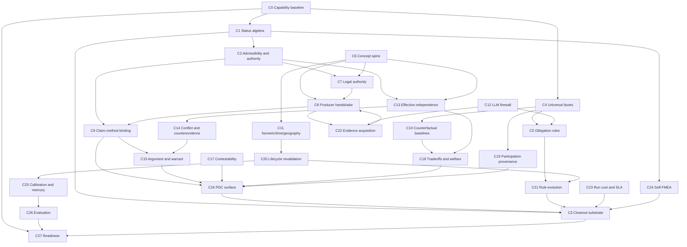

# Universal Policy Design Case Research Results Consolidation

This document is the normalized synthesis of the research results delivered for
the universal Policy Design Case conceptual workstream. The combined raw source
is `/Users/deniskopylov/Downloads/deep-research-reports-105-132-combined.md`.
That raw source preserves the independent reports. This document preserves the
same information, but turns it into a single working picture with common terms,
cross-cutting dependencies, shared decision boundaries, and a source-preserving
ledger underneath.

The document therefore has two layers:

- The normalized synthesis layer gives the canonical vocabulary, dependency
  graph, authority firewalls, stable kernels, bridge-new areas, and research
  questions that must be solved before implementation hardens the wrong shape.
- The source ledger layer keeps the C0-C27 report-by-report findings and
  supplemental agent findings traceable, so normalization does not erase
  source nuance.

## Scope And Non-Goals

**Included sources:**

- Local reports from `/Users/deniskopylov/Downloads/deep-research-report-105.md`
  through `/Users/deniskopylov/Downloads/deep-research-report-132.md`.
- Combined raw source
  `/Users/deniskopylov/Downloads/deep-research-reports-105-132-combined.md`.
- Existing agent findings from Faraday, Darwin, Tesla, and Hypatia, preserved
  as supplemental notes where they sharpen the same research tasks.

**Known missing primary reports:** none as of this pass.

**Non-goals for this document:**

- No final acceptance decision.
- No final implementation wave ordering.
- No new runtime contract proposed as final.
- No rewrite of the active research plan.
- No loss of source-level uncertainty. Where two reports use different terms
  for the same concern, this document normalizes the term but keeps the source
  task references visible.

## Source Inventory

The table uses normalized C-task order. The combined raw source may list the
reports in a different download/assembly order.

| Report | Consolidated task | Primary topic |
| --- | --- | --- |
| `deep-research-report-105.md` | C0 | Capability baseline, canonical paths, corpus frame |
| `deep-research-report-106.md` | C1 | Status algebra and soft-gate semantics |
| `deep-research-report-107.md` | C2 | Admissibility and authority-level calculus |
| `deep-research-report-108.md` | C3 | Unified closeout substrate semantics |
| `deep-research-report-109.md` | C4 | Universal facet grammar |
| `deep-research-report-110.md` | C5 | Obligation rule lifecycle and governance |
| `deep-research-report-111.md` | C6 | Concept identity and spine semantics |
| `deep-research-report-112.md` | C7 | Legal authority, jurisdiction, and competence |
| `deep-research-report-113.md` | C8 | Producer handshake protocol |
| `deep-research-report-114.md` | C9 | Claim taxonomy and method compatibility |
| `deep-research-report-115.md` | C10 | Counterfactual baselines and alternatives |
| `deep-research-report-116.md` | C11 | Numeric, time-role, and geography semantics |
| `deep-research-report-122.md` | C12 | LLM boundary and candidate-to-authority firewall |
| `deep-research-report-117.md` | C13 | Effective independence and evidence-line collapse |
| `deep-research-report-118.md` | C14 | Evidence conflict and counterevidence semantics |
| `deep-research-report-123.md` | C15 | Argument, warrant, and assurance profile semantics |
| `deep-research-report-121.md` | C16 | Multi-audience Policy Design Case surface semantics |
| `deep-research-report-119.md` | C17 | Contestability and disagreement formalism |
| `deep-research-report-120.md` | C18 | Tradeoff, welfare, and value-choice representation |
| `deep-research-report-130.md` | C19 | Participation provenance and attribution |
| `deep-research-report-129.md` | C20 | Lifecycle dependency and revalidation semantics |
| `deep-research-report-132.md` | C21 | Rule evolution, replay, and legacy retirement |
| `deep-research-report-124.md` | C22 | Evidence acquisition decision theory and VOI |
| `deep-research-report-125.md` | C23 | Run cost, budget, and degradation-SLA semantics |
| `deep-research-report-128.md` | C24 | Self-FMEA, soft gates, review effectiveness, complexity budget |
| `deep-research-report-131.md` | C25 | Longitudinal calibration and balanced memory |
| `deep-research-report-126.md` | C26 | Evaluation methodology and semantic completeness |
| `deep-research-report-127.md` | C27 | Research synthesis and implementation readiness |

## Synthesis Method Used In This Pass

This normalization pass is intentionally closer to evidence synthesis than to a
plain editing pass. It combines five external best-practice patterns:

- Scoping-review discipline from
  [PRISMA-ScR](https://www.prisma-statement.org/scoping): preserve the source
  inventory, state scope, and make the synthesis route transparent.
- Data-charting discipline from the
  [JBI Manual for Evidence Synthesis](https://jbi-global-wiki.refined.site/download/attachments/355599504/JBI%20Manual%20for%20Evidence%20Synthesis%202024.pdf?download=true):
  chart each source into comparable fields, then refine the chart iteratively
  as unexpected concepts appear.
- Thematic-synthesis discipline from
  [Thomas and Harden 2008](https://link.springer.com/article/10.1186/1471-2288-8-45):
  keep source-level observations, organize them into descriptive themes, then
  derive analytical themes only where the source evidence supports that move.
- Realist-synthesis discipline from
  [RAMESES II](https://link.springer.com/article/10.1186/s12916-016-0643-1):
  ask what works, for whom, in what context, through what mechanism, and with
  what outcome. This is especially useful because PolicyOS failures are often
  not isolated bugs; they are context-mechanism-outcome failures across
  producers, consumers, authority levels, and public surfaces.
- Transparent narrative-synthesis discipline from
  [SWiM](https://www.equator-network.org/wp-content/uploads/2020/01/Synthesis-without-Meta-analysis-SWiM-Checklist.pdf)
  and map-building discipline from
  [Campbell Evidence and Gap Map guidance](https://journals.sagepub.com/doi/10.1002/cl2.1125):
  group findings explicitly, say why the groups exist, avoid hidden
  vote-counting, use matrices for gaps, and keep a dictionary of terms.

The operational synthesis rules for this document are:

- Preserve traceability: every normalized term must point back to C-level tasks
  or agent findings.
- Prefer mechanism over count: repeated mentions are not automatically stronger
  unless they expose the same causal mechanism.
- Distinguish contract, implementation, orchestration, verification, and
  external surface. A schema without a producer, consumer, bridge, test, and
  surface is not a complete capability.
- Separate "known strong kernel", "bridge-new integration", and
  "conceptual decision still open." Mixing these is how good research becomes
  premature code.
- Treat disagreement as signal. If reports disagree, first classify whether the
  disagreement is about terminology, scope, authority level, implementation
  state, or actual conceptual substance.

## Normalized Executive Picture

The research no longer supports the simple claim that PolicyOS lacks a universal
Policy Design Case. The more precise picture is:

PolicyOS has many strong internal kernels, but the universal Policy Design Case
does not yet exist as a coherent runtime object because the bridges, status
algebra, authority firewalls, time/concept spine, claim-bound registry, closeout
substrate, and typed external surfaces are incomplete or uneven.

The dominant repair is therefore not "invent a new policy engine." It is:

1. Make existing kernels visible as a capability map with reality states.
2. Solve the few conceptual algebras that must be shared system-wide.
3. Build bridge contracts that carry producer evidence into claim-bound runtime
   records.
4. Compile the Policy Design Case from those claim-bound records, not from
   free text or profile status.
5. Expose the resulting case to public, reviewer, expert, machine, dashboard,
   and API audiences without laundering authority.
6. Keep the case alive through rule evolution, monitoring, revalidation,
   calibration, and balanced memory.

The normalized dependency shape is:

```text
capability baseline
  -> status and authority algebra
  -> facet grammar, concept spine, time/geography semantics
  -> obligation rules and legal competence
  -> producer handshake and evidence acquisition
  -> data/legal/scholar/method producer artifacts
  -> claim registry and method/uncertainty binding
  -> argument, warrant, conflict, independence, and portfolio synthesis
  -> unified closeout substrate and PDC record families
  -> multi-audience PolicyDesignCaseProjection
  -> lifecycle revalidation, calibration, memory, and evaluation
```

The main recurring pattern is component-rich, bridge-thin architecture. Many
modules are more mature than the original research plan assumed. The missing
work is often the spine between them.

## Canonical Vocabulary

The table below normalizes terms used inconsistently across the reports. These
terms should be used in future plans unless an ADR intentionally changes them.

| Term | Normalized meaning | Source tasks |
| --- | --- | --- |
| Capability reality | A capability is real only when it has typed artifact, producer, persistence, bridge, consumer, verification, external or explicit out-of-scope surface, and semantic/e2e test. | C0, C1, C3, C24, C26, C27 |
| Capability reality state | One of `implemented`, `contract_only`, `producer_missing`, `artifact_missing`, `bridge_missing`, `consumer_missing`, `verification_missing`, `implemented_but_not_orchestrated`, `surface_missing`, `surface_out_of_scope`, `semantic_test_missing`, `compatibility_shim`, or `projection_only`. | C0, C24, C27 |
| Authority-bearing artifact | A runtime artifact whose authority envelope permits use for a named purpose, authority level, phase, validation status, and consumer role. | C1, C2, C3, C16 |
| Projection-only artifact | A dashboard, public export, packaging summary, diagnostic view, or display object that may describe authority-bearing artifacts but cannot itself satisfy authority obligations. | C1, C3, C12, C16, Hypatia |
| Candidate evidence | Generated, retrieved, drafted, or proposed material that may become evidence only after producer validation, provenance, scope matching, and authority transition. | C2, C5, C12, C22 |
| Claim-bound evidence | Evidence refs attached to a specific claim, including data, norm, method, uncertainty, argument, warrant, counterevidence, limitation, accepted deficit, and authority refs. | C8, C9, C13, C14, C15, C20 |
| Concept spine | Runtime-owned reconciled identity layer across policy terms, metrics, columns, legal concepts, methods, population predicates, geography predicates, and time predicates. | C6, C7, C8, C11 |
| Semantic signature | Unit, currency, price base, calendar, valid time, transaction time, policy time, geography, population, aggregation, and transformation lineage attached to evidence or claims. | C11, C20, C21 |
| Status envelope | A composite wrapper that preserves local statuses while adding severity, authority effect, blocking effect, owner, escalation, and consumer semantics. | C1, C3, C24 |
| Soft gate | A warning or review-required condition with owner, expiry, escalation rule, and closeout effect. A soft gate without lifecycle is shelf-ware. | C1, C24 |
| Admissibility | Whether a source or evidence line can support a claim for a scope, method, authority level, recency, and consumer purpose. | C2, C7, C9, C13 |
| Effective independence | Evidence strength after collapsing shared source, lineage, method, author/institution, transformation, assumption, or retrieval dependence. | C13, C25, C26 |
| Producer handshake | Pre-emission and post-emission protocol by which Lex, Fabric, Scholar, Foundry, Scientist, Data Forge, and runtime quality exchange consumed requirements, emitted bindings, conflicts, and blockers. | C8, C22, Tesla |
| Closeout substrate | Unified decision function integrating formal invariants, event log, attestation, source truth, metamorphic controls, performance/cost constraints, compatibility, and record-family status. | C3, C23, C24 |
| Rule lineage | Versioned semantic identity of rules, taxonomies, predicates, thresholds, and logic hashes used to close a PDC. | C5, C20, C21 |
| Current-run evidence | Evidence produced or admitted for the active run under its current authority profile. Historical lessons and calibration can change priors but cannot close current evidence obligations. | C12, C20, C25 |
| Historical learning | Cross-run calibration, failure lessons, success patterns, and memory that influence defaults, budgets, review depth, and priors without becoming evidence for the current claim. | C20, C25 |
| Semantic false pass | A structurally complete case whose content is wrong, insufficient, stale, mismatched, inflated, or authority-laundered. | C24, C26 |

## Unified Layer Model

The normalized system is best read as twelve layers, not twenty-eight
independent topics.

| Layer | What it owns | Primary tasks | Maturity |
| --- | --- | --- | --- |
| L0 Capability baseline | Canonical paths, shims, capability reality labels, source corpus frame. | C0, C27 | Strong baseline, must remain live |
| L1 Status and authority algebra | Status envelope, soft-gate lifecycle, authority levels, admissibility states. | C1, C2, C24 | Conceptual decision needed, many code seeds |
| L2 Universal grammar | Facets, risk vocabulary, obligation rule lifecycle, counterfactual baseline grammar. | C4, C5, C10 | Mostly enumeration and governance, not blank slate |
| L3 Semantic spine | Concept identity, jurisdiction, competence, numeric/time/geography signatures. | C6, C7, C11 | Build-new bridge over existing primitives |
| L4 Producer coordination | Producer handshake, evidence acquisition, VOI, run cost, degradation SLA. | C8, C22, C23 | Bridge-new |
| L5 Producer artifacts | Data, legal, scholar, method, IR analytics, welfare, participation evidence. | C7, C9, C18, C19, C22 | Strong local kernels, uneven runtime binding |
| L6 Claim registry | Per-claim binding of producer outputs, uncertainty, method status, limitations, deficits. | C9, C13, C14, C15 | Major bridge-new area |
| L7 Assurance graph | Argument, warrant, rebuttal, counterevidence, conflict, independence, portfolio. | C13, C14, C15, C17, C18 | Strong seeds, needs normalization |
| L8 Closeout substrate | `can_i_closeout`, formal invariants, source truth, attestation, compatibility. | C3, C21, C24 | Strong pieces, no unified function yet |
| L9 PDC record families | Runtime-owned records, record-family statuses, PDC compiler. | C16, C20, C27 | Implementable once L1-L8 are wired |
| L10 External surfaces | Public, reviewer, expert, machine, dashboard, API, audit projections. | C16, C19, C23, Hypatia | Surface poverty is a core gap |
| L11 Lifecycle learning | Revalidation, rule evolution, drift, calibration, memory, evaluation. | C20, C21, C25, C26 | Conceptually clear, detectors and ledgers incomplete |

## Cross-Cutting Dependency Graph

The following graph is not an implementation order. It is the dependency logic
that prevents parallel research from producing incompatible answers.



## Dependency Matrix

| Normalized concern | Upstream requirements | Downstream consumers | Stable now | Main missing piece |
| --- | --- | --- | --- | --- |
| Capability reality | Canonical path map, shim map, C0 labels | Every implementation plan, C27 readiness | Yes | Automated ratchet and reporting |
| Status envelope | Local enum inventory, authority profiles | Closeout, scorecard, PDC projection | Partial | Composition algebra and soft-gate lifecycle |
| Admissibility calculus | Status envelope, evidence predicates, source truth | Claim registry, legal/data/method gates | Partial | Authority-bearing conditions and weak-evidence composition |
| Universal facet grammar | Existing enums, critic risks, challenge classes | Corpus, obligations, concept spine | Partial | Controlled vocabulary for open string fields |
| Obligation rules | Facets, temporal logic, rule governance | Producer requirements, closeout, replay | Partial | Governed rule registry and promotion workflow |
| Concept spine | Facets, legal jurisdiction, time/geography semantics | Producer handshake, semantic binding, PDC | Bridge-new | Runtime reconciler and conflict semantics |
| Legal competence | Concept spine, authority hierarchy, time roles | Legal anchors, claim registry, public PDC | Partial | Graded legal admissibility and hierarchical jurisdiction |
| Producer handshake | Scenario requirements, concept spine, acquisition strategy | Claim registry, evidence portfolio, closeout | Bridge-new | Pre-emission coordination and typed blocker packets |
| Claim-method binding | IR analytics certificates, method catalog, assumption checks | Claim registry, uncertainty, PDC | Bridge-new | Analytics output to ClaimRecord binding |
| Effective independence | Concept spine, lineage, source provenance, method identity | Portfolio, evidence strength, evaluation | Conceptual | Dependence function and aggregation rules |
| Argument/warrant graph | Claim registry, conflict, independence, deficits | Assurance case, PDC, public projection | Partial | Typed warrant semantics and exporter |
| Multi-audience surface | Claim graph, authority envelope, deficits, redactions | API, dashboard, public export, machine audit | Partial | Typed PolicyDesignCaseProjection contract |
| Closeout substrate | Status algebra, authority, source truth, invariants, compatibility | Readiness, publication, lifecycle | Partial | Unified `can_i_closeout` function |
| Rule evolution | Rule registry, replay, schema compatibility, lifecycle | Revalidation, closed case audit | Partial | Semantic rule lineage and stricter-rule detection |
| Calibration and memory | Lifecycle graph, evaluation, current-run firewall | Priors, review depth, VOI, model selection | Partial | Longitudinal ledger and success-pattern memory |
| Evaluation | Semantic benchmarks, adversarial probes, expert review | Capability ratchet, release readiness | Partial | Semantic false-pass benchmark suite |

## Canonical Flow For A Universal Policy Design Case

A serious Policy Design Case should be understood as a compiled runtime object,
not a document written after the run. The normalized flow is:

1. Capture intent, scenario, requested authority level, policy domain, affected
   populations, constraints, and publication audience.
2. Normalize the request through universal facets and a concept/time/geography
   spine.
3. Compile obligations: legal, data, method, participation, tradeoff,
   monitoring, lifecycle, and publication obligations.
4. Coordinate producers before emission so they share scenario requirement ids,
   concept ids, legal scope, time roles, and expected claim obligations.
5. Acquire or retrieve evidence using VOI and evidence-acquisition strategy,
   while recording cost and degradation-SLA implications.
6. Emit producer artifacts with authority envelopes, source truth, lineage,
   status envelopes, and candidate/selected/rejected/blocked bindings.
7. Bind producer outputs to claims in the runtime claim registry.
8. Compile argument, warrant, rebuttal, counterevidence, limitation, accepted
   deficit, independence, and conflict records.
9. Evaluate semantic closure and closeout through one substrate, not through
   independent local "pass" fields.
10. Compile PDC record families from runtime-owned records.
11. Project the case to public, reviewer, expert, machine, dashboard, and API
    surfaces with authority-preserving redactions and explicit omissions.
12. Keep lifecycle dependencies alive through monitoring, rule evolution,
    revalidation, calibration, balanced memory, and post-publication events.

## Authority Firewalls

The research repeatedly found that PolicyOS must prevent useful intermediate
objects from becoming authority by accident. The normalized firewalls are:

| Firewall | Forbidden shortcut | Correct path | Source tasks |
| --- | --- | --- | --- |
| LLM candidate firewall | LLM-generated risks, rules, claims, legal anchors, or participation summaries directly satisfy evidence obligations. | Mark as `candidate_unverified`, require deterministic or governed producer validation, then transition through authority envelope. | C5, C12, C22 |
| Projection firewall | Dashboard/public/API/export/package summary becomes closeout evidence. | Projection points to authority-bearing artifacts and carries `projection_only` or scoped `authoritative_for` metadata. | C1, C3, C16, Hypatia |
| Historical learning firewall | Calibration, failures, or success memory closes current-run claim obligations. | Historical learning can adjust priors, budgets, review depth, and defaults, but current-run evidence must still close. | C20, C25 |
| Count firewall | Many evidence lines increase strength without independence analysis. | Collapse shared lineage and compute effective independence before portfolio strength. | C13, C26 |
| Legal retrieval firewall | Jurisdiction/topic match becomes legal authority. | Require competence, hierarchy, temporal validity, instrument, beneficiary class, implementation agency, and claim-level anchor. | C7 |
| Participation firewall | LLM or analyst speculation becomes affected-person preference evidence. | Require consultation provenance, representativeness, attribution, source kind, and permitted claim use. | C19 |
| Schema firewall | Schema compatibility becomes semantic compatibility. | Track rule lineage, semantic tuple, logic hash, stricter-rule detection, and replay mode. | C21 |
| Cost firewall | Latency/cost warning silently changes evidence quality. | Route through budget state, degradation-SLA state, authority effect, and approval separation. | C23 |

## Stable Kernel, Bridge-New Work, And Research-Only Decisions

The normalized picture separates what can be implemented now from what still
needs conceptual closure.

### Stable Kernel

These surfaces are strong enough to treat as existing anchors:

- runtime assurance substrate and authority envelopes;
- policy design record-family registry;
- formal invariant module and phase barriers;
- source-truth, attestation, event-log, prompt/tool ledger, and projection
  guard concepts;
- claim lifecycle and append-only ledger roots;
- temporal logic as the default rule body language;
- critic and challenge-factory risk seeds;
- IR analytics proof-carrying certificates and uncertainty outputs;
- VOI ranker and human-review escalation primitives;
- DecisionGradeExport and audience tiers;
- schema compatibility checks;
- Data Forge snapshot and source contract primitives;
- public projection guardrails that prevent blocked claims from being silently
  omitted.

### Bridge-New Work

These are not blank-slate theoretical tasks, but they need explicit bridge
design and engineering ownership:

- capability ratchet that records reality labels per capability;
- status envelope and status composition layer over existing local enums;
- concept spine reconciler over existing entity resolution, legal, IR, and
  semantic binding primitives;
- producer handshake kernel that passes scenario requirements and consumed
  concept ids through Fabric, Lex, Scholar, Foundry, Data Forge, Scientist, and
  runtime quality;
- IR analytics output to ClaimRecord binding registry;
- method rejection and runtime assumption-validation reporting;
- claim-level uncertainty binding;
- effective independence ledger and portfolio aggregation;
- typed PolicyDesignCaseProjection and audience-specific API/dashboard/export
  surfaces;
- unified `can_i_closeout` function;
- rule lineage registry and stricter-rule revalidation;
- drift detector implementations and partial-scope reissue;
- longitudinal calibration and balanced success/failure memory ledgers.

### Research-Only Or Decision-Log First

These should not be hardened into runtime APIs until the conceptual decision is
closed:

- exact physical form of concept spine: global registry, per-run reconciled
  artifact, or hybrid;
- multi-jurisdiction norm conflict semantics and fallback hierarchy;
- weak-evidence composition rules across authority levels;
- full status algebra for mixed local statuses;
- effective independence function and dependence weights;
- acceptable deficits by authority profile;
- public contestability contract;
- social-weight provenance threshold for public legitimacy;
- participation legitimacy thresholds;
- calibration metrics that can block high-authority runs;
- semantic benchmark adjudication rubric and expert-review topology;
- complexity budget thresholds by authority level;
- ex-post observation windows and mandatory revalidation triggers.

## Normalized Decision Ordering

The research tasks can run in parallel, but their outputs cannot be merged in
an arbitrary order. The safest decision ordering is:

1. C0 fixes what is canonical, what is a shim, and what reality state each
   capability has.
2. C1-C2-C3 define how local facts become system decisions: status envelope,
   admissibility, authority levels, and closeout substrate.
3. C4-C5-C10 define the universal policy grammar: facets, obligations, risks,
   baselines, and alternatives.
4. C6-C7-C11 define shared meaning: concept identity, legal competence,
   jurisdiction, time roles, units, geography, and transformations.
5. C8-C22-C23 define producer coordination and acquisition economics.
6. C9-C13-C14-C15-C17-C18-C19 define claim-level evidence, argument,
   independence, conflict, contestability, tradeoffs, and participation.
7. C16 compiles the public and machine-visible PDC projection from the runtime
   graph.
8. C20-C21-C25 define long-lived policy objects under drift, rule evolution,
   replay, calibration, and memory.
9. C24-C26-C27 define machinery self-FMEA, semantic evaluation, and readiness
   gates.

This ordering lets theoretical tasks run independently, but forces a merge pass
around shared algebra before implementation creates incompatible local
decisions.

## Normalized Engineering Translation

The reports separate conceptual work from engineering work more clearly after
normalization.

Conceptual decisions still needed:

- status envelope composition and soft-gate escalation;
- authority-level portfolio shapes and admissibility degradation;
- concept-spine identity and conflict semantics;
- legal hierarchy, competence, and graded admissibility;
- time-role, unit, currency, geography, and transformation mismatch algebra;
- effective independence and evidence-line collapse;
- warrant semantics and assurance-profile completeness;
- contestability, tradeoff, participation legitimacy, and public explanation;
- rule evolution and old-case reproducibility policy;
- semantic evaluation rubric and complexity budget policy.

Engineering work already implied by stable decisions:

- implement capability reality labels and ratchet reports;
- wire producer outputs into claim-bound registry entries;
- thread scenario requirement ids and concept ids through producer handoffs;
- emit selected, rejected, blocked, and context-only bindings from producers;
- expose typed PDC projection surfaces for public, reviewer, expert, machine,
  dashboard, and API consumers;
- implement `can_i_closeout` over existing substrate modules;
- create rule lineage and replay metadata in closed PDCs;
- add drift detectors, partial reissue, and Data Forge provenance manifests;
- add semantic false-pass benchmarks and adversarial probes for laundering,
  false independence, authority spoofing, prompt injection, and participation
  speculation.

## Normalized Backlog Themes

The previous "Consolidated Backlog Themes" section is preserved near the end of
the source ledger. The normalized themes are sharper:

1. Capability reality is the first gate. No task should claim capability unless
   it passes the producer-persistence-bridge-consumer-verification-surface-test
   chain or names the missing reality state.
2. Authority preservation is the first safety property. LLM, projection,
   historical memory, count, legal retrieval, schema compatibility, and
   participation all need explicit firewalls.
3. Shared algebra comes before bridge code. Status, admissibility, time,
   concept identity, rule evolution, and soft gates are cross-system semantics.
4. Claim-bound evidence is the central bridge. Producer artifacts must become
   claim registry records with per-claim refs, not global pools beside claims.
5. External surface is not cosmetic. Public legitimacy depends on typed,
   audience-specific, authority-preserving projections.
6. Lifecycle is part of the case, not maintenance. Revalidation, rule
   evolution, calibration, memory, and drift are first-class PDC semantics.
7. Evaluation must target semantic false passes. Structural completeness is not
   enough for a governance system.
8. Complexity must be budgeted. More gates can reduce trust if they become
   ceremonial, economically impossible, or warning-only shelf-ware.

## Source Ledger

The sections below preserve the per-report consolidation. They are intentionally
more source-shaped than the normalized synthesis above.

## Repeated Findings To Preserve

The reports repeatedly converged on a few system-level observations. These are
not final conclusions yet, but they should remain visible because many tasks
derive their boundaries from them.

- PolicyOS is not a blank slate. Many load-bearing surfaces already exist:
  runtime assurance, authority envelopes, policy-design record registry,
  claim ledgers, challenge factories, VOI scheduler, projection guards,
  source contracts, formal invariants, and governance lifecycle records.
- The largest repeated weakness is not absence of sophisticated components.
  It is missing or thin orchestration between components, especially around
  producer output -> claim-bound evidence -> semantic closure -> PDC projection.
- Contracts often exist before producers, consumers, detectors, or public
  surfaces are complete. The consolidation should preserve the distinction
  between `contract_only`, `bridge_missing`, `surface_missing`,
  `semantic_test_missing`, and genuinely implemented capability.
- Internal authority defenses are stronger than the public/API/dashboard
  surfaces. Runtime often knows more than it can externally expose in a typed,
  auditable, audience-specific way.
- Projection, dashboard, public export, LLM drafting, diagnostic summaries, and
  bundle packaging must remain non-authoritative unless a runtime authority
  envelope explicitly permits their use for a defined purpose.
- Time, status, rule evolution, compatibility, and lifecycle semantics exist
  locally in several modules, but not yet as one cross-system algebra.
- Several research tasks that looked theoretical have an implementation seed
  already. Several tasks that looked like simple extension work are actually
  bridge-new or build-new because the orchestration layer is missing.

## C0 - Capability Baseline, Canonical Paths, And Corpus Frame

**Source:** `deep-research-report-105.md`

### Consolidated Result

C0 found that PolicyOS already has a mature verification and assurance substrate.
The right baseline is reuse-first, not blank-slate design. The existing system
contains runtime assurance, authority and semantic binding surfaces, claim
lifecycles, research DAGs, calibration and DDM roots, core audit primitives,
Fabric/Lex/Scholar/Foundry producers, API/dashboard/export surfaces, schema
compatibility, temporal scopes, and many compatibility shims.

The report described a capability map with 27 target capabilities:

- 18 should be treated as `wire_existing`.
- 7 should be treated as `extend_existing`.
- 1 should be treated as `consolidate_existing`.
- 1 appeared initially as `build_new`, though later reports refined this
  because `formal_invariants.py` is stronger than expected.

### Existing Anchors

Key existing anchors include:

- runtime quality modules for assurance cases, authority, semantic binding,
  prompt/tool ledgers, human review, phase barriers, invariants, scorecards,
  and replay;
- Scientist policy-design workflow, objectives, critic/adversary/search/output
  layers;
- Scientist evidence/claims lifecycle, audit, diff, and export;
- Research DAG replay/invalidation;
- claim support, citation faithfulness, reliability scorecards;
- VOI scheduler and governance calibration;
- DDM and BERL;
- core audit / PROV / SLSA / standalone verifier;
- Lex, Fabric, Scholar, Foundry, and Data Forge roots.

### Baseline Classification

The report emphasized that a capability should not be counted as complete just
because a schema exists. The useful capability states are:

- implemented;
- partially implemented;
- implemented but not orchestrated;
- typed only;
- projection only;
- compatibility shim;
- greenfield.

### Corpus Frame

The proposed corpus should be surface-driven around minimum record families and
reuse capabilities. It should not only collect domain examples. It should
include cases that test whether existing surfaces really produce, persist,
orchestrate, consume, verify, and expose the required evidence.

### Open Gaps

- Many existing paths are compatibility shims. Research anchors must point to
  canonical paths, not deprecated import roots.
- Several surfaces have mature local contracts but no live end-to-end proof
  that the runtime path closes.
- The corpus should explicitly exercise the recurring failure patterns, not
  only representative policy domains.

## C1 - Status Algebra And Soft-Gate Semantics

**Source:** `deep-research-report-106.md`

### Consolidated Result

C1 concluded that PolicyOS needs a status envelope and cross-domain status
algebra, not one giant enum. Many modules already define meaningful local
statuses, but the system lacks a canonical way to compose them across authority,
admissibility, closeout, publication, and review.

### Proposed Status Envelope Axes

The report proposed a `StatusEnvelope` with axes such as:

- local state;
- severity;
- blockingness;
- overridability;
- authority tier;
- evidence tier;
- publication scope;
- readiness cap;
- degradation/proxy state;
- review action;
- closeout effect;
- producer.

The local status should be preserved instead of flattened away. For example,
`TransportabilityStatus.PARTIALLY_IDENTIFIED`, `ClaimSupportStatus.CONTESTED`,
and `CitationFaithfulnessLabel.PARTIALLY_SUPPORTS` are not the same thing, even
if they all limit readiness.

### Proposed Normalized Status Lattice

The second pass over the source report recovered the exact lattice proposal:

| Axis | Normalized domain | Composition rule |
| --- | --- | --- |
| Severity | `ok < advise < warn < fail < invalidating` | take the most severe value |
| Blockingness | `none < soft_gate < hard_gate` | take the most restrictive value |
| Overridability | `not_needed < overridable < human_override_only < non_overridable` | `non_overridable` dominates |
| Authority tier | `authority_bearing > runtime_blocker > control_input > projection > diagnostic > not_authoritative` | take the least authoritative value |
| Evidence tier | `authority_bearing > supporting > derived/projected > debug/legacy` | take the least reliable value |
| Publication scope | `public > reviewer > internal > none` | take the narrowest scope |
| Readiness cap | `deployment_ready > recommendation_ready > simulation_ready > external_briefing > analyst_advisory > research_artifact > none` | take the lowest cap |
| Degradation/proxy | `none < warn_only < degraded < proxy < bounds_only_or_revalidate < unsupported` | take the most degraded mode |
| Review action | `none < operator_review < human_review < expert_review < reissue_review < withdrawal_review` | take the strongest review action |
| Closeout effect | `none < annotate < withhold_publication < block_approval < require_reissue < withdraw` | take the strongest closeout effect |

This table is important because it avoids both common mistakes: flattening all
local states into one generic severity, and letting local states compose
implicitly inside each consumer.

### Soft-Gate Lifecycle Requirements

Warning-like statuses need:

- an owner;
- an age / TTL;
- escalation path;
- publication effect;
- closeout effect;
- review action;
- authority ceiling.

Soft gates should not silently mean "weak pass." They should mean constrained
read mode until resolved, escalated, accepted as deficit, or upgraded to a hard
block.

### Soft-Gate Owner And Escalation Examples

The source report gave specific soft-gate classes:

| Soft-gate class | Owner | Age / escalation policy | Publication effect | Closeout effect |
| --- | --- | --- | --- | --- |
| Citation/publication warning | Scientist owner | triage on day of appearance; escalate after 7 days; hard escalation after 14 days | public prohibited, reviewer/internal allowed | block public export until citation/support repair |
| Transport/proof degradation | causal/scientist owner | immediate triage in governed/production; 7 days in research; escalate after 14 days | public only by explicit degraded policy; reviewer/internal by default | cap readiness; prohibit deployment closeout |
| Operational validity warning/staleness | runtime/governance owner | immediate review queue; stale cannot live forever | no new public publication; existing publication gets warning posture | review, reissue, or withdrawal review |
| Projection/source-truth mismatch | runtime/platform owner | immediate, no grace period | projection may display but cannot speak authoritative truth | block approval/state closeout |

### Important Mixed Decisions

The report gave examples of composition rules that need to be explicit:

- `SUPPORTED` plus `partially_supports` citation should usually block public
  promotion of a factual/legal claim until limitation or stronger support exists.
- degraded transport can cap readiness even when local proof object is valid.
- semantic binding failure plus dashboard projection must remain
  `projection_only`, not become an authority surface.
- multiple warnings cannot accumulate invisibly without an escalation owner.

### Additive Rollout Rule

C1 should start as an additive mapping layer. The first implementation step is
not to change runtime behavior, but to build mappings and golden tests proving
that existing approval behavior, citation blocking, claim publishability,
transport gating, skipped barriers, and proof replay are reproduced without
semantic loss. Stricter policies should come only after the mapping is
observable and test-covered.

### Supplemental Agent Note - Faraday

Faraday confirmed that local algebras are stronger than expected:

- scorecard composes runtime status and serious warning behavior;
- approval recomputes eligibility instead of trusting projections;
- authority envelopes distinguish role/provenance/closure;
- phase barriers and run states are fail-closed;
- semantic binding does real cross-producer checks;
- citation faithfulness and challenge factory are substantial.

The missing piece is still a unified cross-domain lattice for severity,
blockingness, overridability, authority role, evidence class, publication scope,
readiness cap, degradation/proxy status, and review action.

## C2 - Admissibility And Authority-Level Calculus

**Source:** `deep-research-report-107.md`

### Consolidated Result

C2 framed admissibility as a multi-gate calculus, not a single evidence-quality
score. Evidence is admissible for a claim only if it survives semantic support,
faithfulness/authentication, provenance authority, semantic applicability, and
portfolio aggregation.

### Admissibility Gates

The report separated five gates:

- semantic support: does the evidence actually support the claim?
- faithfulness/authentication: is the source real and represented honestly?
- provenance authority: is the artifact allowed to carry authority for this use?
- semantic applicability: does scope, method, jurisdiction, time, and unit match?
- portfolio aggregation: does the overall evidence set justify the requested
  claim and authority level?

### Normalized States

The proposed normalized admissibility states are:

- `admissible`;
- `context_only`;
- `proxy_with_limitation`;
- `contested`;
- `blocked`;
- `out_of_scope`.

These are not raw local statuses. They are crosswalk results that preserve local
status details underneath.

### Authority-Bearing Conditions

Evidence becomes authority-bearing only when additional conditions hold:

- freshness is valid for the claim;
- lineage is known;
- quality tier is sufficient;
- legal competence and jurisdiction match;
- scope and population match;
- numeric/time/geography semantics are compatible;
- same-input closure holds;
- source-truth and authority envelope checks pass;
- effective independence is not inflated.

### Composition Principles

The report emphasized:

- dependent evidence collapses and cannot be counted as independent;
- many weak dependent signals do not become strong authority;
- direct evidence plus proxy evidence may support limitation, not full pass;
- direct support plus admissible contradiction should often yield `contested`;
- runtime blockers can be authority for a blocked state, but not for positive
  truth of the policy claim.

### Legal Claims

Legal claims require selected applicable norms plus competence, temporal, and
jurisdictional support. Generic Ukrainian or jurisdictional matches should not
anchor a policy recommendation without proof of competence and applicability.

## C3 - Unified Closeout Substrate Semantics

**Source:** `deep-research-report-108.md`

### Consolidated Result

C3 concluded that PolicyOS needs a unified `can_i_closeout(run_id)` decision
surface. The required pieces mostly exist as separate modules, but no single
runtime-owned decision object integrates them into one closeout answer.

### Proposed Closeout Function

The conceptual function is:

```text
can_i_closeout :=
  formal_invariants.all_pass()
  AND event_log.reconciled()
  AND attestation.all_boundaries_verified()
  AND source_truth.no_conflicts()
  AND semantic_binding.closed()
  AND metamorphic_controls.all_pass()
  AND performance_budget.within_policy()
  AND closeout_compatibility.pass()
  AND phase_barriers.closed()
  AND approval_publication_rules.pass()
```

The substrate is a reader/enforcer, not a new source of domain authority.

### Existing Anchors

The report identified anchors in:

- `formal_invariants.py`;
- authority and authority reconciliation/event log;
- source truth;
- semantic binding;
- trust boundaries and attestation;
- metamorphic controls;
- performance and run cost;
- schema compatibility and closeout compatibility;
- approval, publication, and audit.

### Terminal Failure Codes

Closeout should preserve narrow terminal codes for:

- schema blocked;
- scorecard identity mismatch;
- replay drift;
- missing or spoofed authority;
- CAS/event reconciliation failure;
- source-truth conflicts;
- phase barrier violations;
- terminal readiness violations.

### Deficits

Typed deficits should be explicit allowlist entries, not an escape hatch. Claim,
assurance, proportionality, and cost deficits may be allowed only when the
authority profile permits them and publication semantics preserve them.

### Operator Answer

The closeout answer should tell an operator:

- root cause;
- first failing producer;
- first failing artifact;
- next action;
- relevant refs;
- whether the failure is domain, machinery, authority, or compatibility.

## C4 - Universal Facet Grammar

**Source:** `deep-research-report-109.md`

### Consolidated Result

C4 found that the universal facet grammar should assemble and reconcile
existing Trinity/Scientist facets rather than create domain packs. Domain
coverage is already broad enough for a universal design direction; the missing
work is mostly controlled vocabulary and cross-module alignment.

### Existing Facet Seeds

Existing seeds include:

- `ProblemDomain`;
- `NormativeOutcomeChannel`;
- `ConstraintType`;
- `PolicyLayerLevel`;
- temporal logic family and evaluation scope;
- identification mode;
- strategic response channel;
- mechanism game representation;
- fidelity level;
- policy search level;
- challenge class;
- deterministic critic risk classes.

### Controlled Vocabularies Still Needed

The report recommended controlled vocabularies for:

- `instrument_type`;
- `delivery_channel`;
- `funding_channel`;
- `authority_type`;
- `risk_type`.

These should not duplicate existing enums. For example, `ProblemDomain` is not
`instrument_type`, and mechanism kind is not delivery channel.

### Risk Type Reconciliation

Risk vocabulary should reconcile two strong existing seeds:

- critic risk classes such as budget overrun, harmed subgroup, fragile
  assumption, transport break, weak literature support, timeout estimator,
  legal blocker, and budget driver;
- challenge classes such as source contradiction, stale source, forged
  citation, missing transportability assumption, hidden confounding/proxy trap,
  fairness threshold reversal, legal exception, strategic gaming, budget
  infeasibility, and ambiguous human review instruction.

### Proposed Risk Types

The report suggested a canonical set including:

- budget/fiscal;
- equity/distribution;
- transport/external validity;
- identification overlap;
- evidence conflict;
- evidence staleness;
- citation integrity;
- legal authority;
- privacy/PII;
- strategic gaming;
- implementation complexity;
- ambiguous human review;
- hard constraint binding;
- monitoring/reversibility.

### Risk Crosswalk Details Preserved From Second Pass

The C4 report gave a more concrete crosswalk that should be preserved:

| Canonical `risk_type` | Existing signals | Challenge alignment | Consolidated note |
| --- | --- | --- | --- |
| `budget_fiscal` | `budget_overrun`, `budget_driver`, policy budget constraint | `BUDGET_INFEASIBILITY` | strong deterministic mapping candidate |
| `transport_external_validity` | `transport_break`, overlap not assessed, transport constraints | `MISSING_TRANSPORTABILITY_ASSUMPTION` | positivity/overlap and transport assumptions should be unified |
| `equity_distribution` | equity findings, harmed subgroup traces, equity constraints | `FAIRNESS_THRESHOLD_REVERSAL` | challenge class is narrower than full equity risk |
| `legal_authority` | legal pass findings, governance blockers | `LEGAL_EXCEPTION` | clean mapping |
| `strategic_gaming` | strategic-response semantics, mechanism-design constraints | `POLICY_GAMING_STRATEGIC_RESPONSE` | needs bridge from strategic channels and mechanism design |
| `evidence_conflict` / `evidence_staleness` / `citation_integrity` | challenge-facing evidence risk | source contradiction, stale source, forged citation | ready canonical evidence-risk subtypes |
| `privacy_pii` | privacy / PII validators | no dedicated challenge class | real gap in challenge taxonomy |
| `ambiguity_human_review` | review and compliance ambiguity | `AMBIGUOUS_HUMAN_REVIEW_INSTRUCTION` | governance-facing risk facet |
| `implementation_complexity` | simplicity, administrative feasibility, implementation penalty | no dedicated challenge class | real gap between objective space and challenge taxonomy |

The immediate implication is that C4 can proceed mostly as reconciliation work,
but C26/E22 should add missing challenge coverage for privacy/PII and
implementation complexity if those become load-bearing risk facets.

## C5 - Obligation Rule Lifecycle And Governance

**Source:** `deep-research-report-110.md`

### Consolidated Result

C5 concluded that PolicyOS already has a plausible formal language for
obligations through temporal logic. The research problem is not to design a new
rule language, but to define rule taxonomy, governance lifecycle, provenance,
and promotion criteria.

### Rule Body And Governance Envelope

The report proposed obligations as:

- `TemporalRuleBody`, expressed through LTL, CTL, or MTL patterns;
- `RuleGovernanceEnvelope`, carrying owner, status, provenance, version,
  scope, evidence basis, and authority level.

### Obligation Patterns

Core patterns include:

- do X;
- do not do X;
- X before Y;
- eventually Z;
- always P;
- P until Q;
- branching forecast condition;
- bounded-window monitoring.

### Rule Lifecycle

Recommended statuses:

- `draft`;
- `shadow`;
- `candidate`;
- `active_non_blocking`;
- `active_blocking`;
- `deprecated`;
- `retired`;
- `superseded`.

No rule should become closeout-blocking without status, provenance, version,
scope, owner, and evidence basis.

### Rule Provenance

Provenance modes:

- expert seeded;
- prior-art seeded;
- historical-failure mined;
- LLM proposed.

LLM-proposed rules must remain candidates until shadow/candidate evaluation
supports promotion.

### First Governed Families

The first rule families should cover:

- legal validity;
- legal exception;
- source contradiction;
- source freshness;
- citation integrity;
- transportability explicitness;
- confounding/proxy disclosure;
- equity stability;
- budget feasibility;
- human review unambiguity.

### First Governed Taxonomy In More Detail

The source report proposed these concrete initial families:

- Legal and authority rules, such as `OBL-LEGAL-VALIDITY` and
  `OBL-LEGAL-EXCEPTION-HANDLED`. Canonical shapes include
  `dont_publish_until_legal_basis` and `always(no_action_without_competence)`.
  These should be blocking by default for governed/production profiles.
- Evidence integrity rules, such as `OBL-SOURCE-CONTRADICTION-RESOLVED`,
  `OBL-SOURCE-FRESHNESS`, and `OBL-CITATION-INTEGRITY`. Canonical shapes
  include `G(not contradiction_unresolved)`, `G(source_is_fresh)`, and
  `G(not forged_citation)`.
- Transport and identification rules, such as `OBL-TRANSPORTABILITY-EXPLICIT`
  and `OBL-CONFOUNDING-PROXY-RISK-DISCLOSED`. These require transport
  assumptions and proxy/confounding risks to be explicit before promotion.
- Equity and harm rules, such as `OBL-EQUITY-THRESHOLD-STABLE` and
  `OBL-NO-UNREVIEWED-SUBGROUP-HARM`. These fit invariant or bounded recheck
  patterns when subgroup thresholds change.
- Feasibility and proportionality rules, such as `OBL-BUDGET-FEASIBLE` and
  `OBL-BUDGET-WITHIN-ENVELOPE`. These should distinguish hard overrun from
  near-binding budget regimes.
- Strategic-response rules, such as `OBL-STRATEGIC-RESPONSE-CONTAINED`.
  Canonical shape is universal safety across forecast branches or explicit
  surfaced gaming assumption with blocking effect in high-authority profiles.
- Human oversight rules, such as
  `OBL-HUMAN-REVIEW-INSTRUCTION-UNAMBIGUOUS` and
  `OBL-HUMAN-REVIEW-EFFECTIVE-BEFORE-HIDDEN_OR_PUBLIC_PROMOTION`. These use
  review-before-promotion and bounded feedback-window patterns.
- Lifecycle and reassessment rules, such as
  `OBL-PUBLISHED-CASE-HAS-APPEND-ONLY-LIFECYCLE`,
  `OBL-STALE-CASE-RESOLVED`, `OBL-EX-POST-REASSESSMENT-LINKED`, and
  `OBL-MEMORY-LEARNING-CLEAN`.

The important planning implication is that the first obligation kernel can be
mined from deterministic critics, challenge classes, and existing lifecycle
contracts before asking LLMs to propose new obligations.

## C6 - Concept Identity And Spine Semantics

**Source:** `deep-research-report-111.md`

### Consolidated Result

C6 treats the concept spine as a per-run, runtime-owned reconciled authority
artifact. It is not a global master ontology. Its purpose is to make meaning
stable across producers: policy terms, metrics, dataset columns, legal concepts,
method requirements, population predicates, geography predicates, and time
predicates.

### Relation Classes

Identity-like relation classes:

- `same_concept`;
- `related_concept`;
- `conflicting_concept`;
- `unresolved_concept`;
- `scope_shifted_concept`;
- `authority_shifted_concept`.

Non-identity support edges:

- `operationalizes`;
- `measures`;
- `governs`;
- `satisfies_method_obligation`;
- `supports_claim`;
- `conflicts_with_claim`.

### Authority Envelope Of Meaning

Each concept entry should preserve:

- namespace kind;
- owner;
- authority level;
- scheme;
- local id;
- version;
- jurisdiction;
- validity;
- language;
- definition ref;
- provenance.

### Important Distinctions

The report emphasized:

- dataset columns usually operationalize metrics, not `same_concept`;
- legal norms govern policy terms, not `same_concept`;
- method requirements satisfy obligations, not `same_concept`;
- concept identity is separate from evidence conflict.

### Relation Semantics Preserved From Source Report

The second pass recovered the more precise definitions:

- `same_concept` should be strict. Two producer artifacts are the same concept
  only if they share the referent and PolicyOS can prove interchangeability
  under the same scope tuple and authority namespace, or through an explicit
  authority bridge. This is closer to `owl:sameAs` than to a loose synonym.
- `related_concept` covers broader, narrower, proxy, operationalizes, governs,
  measures, or evidence-for relations. Related concepts can support discovery
  and rationale, but cannot close a same-concept requirement by themselves.
- `conflicting_concept` is a positive incompatibility, not merely low
  confidence. Examples include stock versus flow metrics, registered SMEs
  versus all firms, old versus new geography boundaries, or a legal term mapped
  to the wrong statistical entity.
- `unresolved_concept` is a first-class state when candidate mappings exist but
  selecting one would overclaim. It is not a temporary null.
- `scope_shifted_concept` captures the case where label/referent is similar
  but population, geography, time, unit, aggregation level, legal instrument,
  beneficiary class, or observational frame changed.
- `authority_shifted_concept` captures lexical or semantic similarity with a
  different issuer, scheme owner, normative level, version lineage,
  jurisdictional competence, or provenance authority.

### Concept Spine Closeout Rules

The concept spine should block closeout when:

- a required concept is unresolved;
- two required concepts are conflicting;
- a scope shift is present but not accepted as limitation, split claim, or
  explicit bridge;
- an authority shift exists without a recorded authority bridge;
- a non-identity relation is used as if it were `same_concept`.

The report's architectural recommendation is that concept spine should be a
runtime-owned reconciled artifact for the run, not a global canonical ontology.
Global vocabularies can feed it, but the run artifact is the authority surface
for that case.

### Closeout Blockers

Blockers include:

- unresolved concept;
- conflicting concept;
- unaccepted scope shift;
- unbridged authority shift.

### Supplemental Agent Note - Tesla

Tesla found a runtime producer-spine and semantic-binding bridge already exists,
especially in NL pipeline assembly and producer spine contexts, but this is
not yet the full conceptual spine. Existing producer coordination is meaningful
but centralized in the HTTP/NL pipeline rather than a clean reusable concept
and producer coordination kernel.

## C7 - Legal Authority, Jurisdiction, And Institutional Competence

**Source:** `deep-research-report-112.md`

### Consolidated Result

C7 found that generic jurisdiction membership is only a retrieval hint, not
legal authority. PolicyOS needs a legal authority chain that proves competence,
instrument authority, temporal validity, hierarchy, delegation, implementation,
funding, and review/contestability paths.

### Legal Authority Chain

The required chain is:

```text
source norm
  -> authority basis
  -> competent issuer / actor
  -> permitted instrument
  -> active temporal window
  -> non-preempted jurisdictional position
  -> funded execution path when needed
  -> review / contestability path when needed
```

### Authority Facets

Recommended facets:

- enabling;
- delegating;
- implementing;
- funding;
- oversight;
- appeals or contestability;
- preemption scope;
- authority level;
- instrument type;
- delegated-from ref;
- implemented-by ref;
- authority-window ref;
- review-path ref.

### Hierarchy Outcomes

The report proposed outcomes such as:

- exact authority match;
- supplemental lower-layer allowed;
- delegated downward authority;
- concurrent authority;
- blocked by higher-law preemption;
- blocked by missing delegation;
- blocked by missing implementing act;
- blocked by institution not competent on date.

### Time Fields

Legal time needs:

- published at;
- effective from/to;
- repealed at;
- superseded at;
- authority window from/to.

### Legal Conflict Types

Legal concept conflict should distinguish:

- definitional divergence;
- preemption conflict;
- delegation gap;
- instrument mismatch;
- temporal concept drift;
- institution identity mismatch;
- funding authority mismatch.

### Lex Blockers

Recommended Lex blockers:

- `missing_enabling_authority`;
- `missing_delegating_authority`;
- `missing_implementing_authority`;
- `preempted_lower_layer`;
- `institution_not_competent_as_of`;
- `missing_funding_authority_for_spend`;
- `missing_review_path_for_adjudication`.

## C8 - Producer Handshake Protocol

**Source:** `deep-research-report-113.md`

### Consolidated Result

C8 concluded that producer coordination should be a repo-wide, transport-neutral
protocol, not an NL pipeline local convention. Producers need explicit
pre-emission handshakes when they close requirements, select candidates, change
shared assumptions, or emit artifacts used by scorecard, readiness, approval,
publication, or semantic binding.

### Proposed Records

Record types:

- `ProducerHandshakeIntent`;
- `ProducerHandshakeDecision`;
- `ProducerHandshakeCommit`;
- `ProducerHandshakeLedger`.

### Intent Fields

The intent should include:

- handshake id;
- run, trace, and spine ids;
- producer component, role, schema, reader contract, authority profile, and
  code revision;
- scenario contract;
- consumed concept, requirement, and claim ids;
- emitted ref kinds;
- assumptions;
- selected, rejected, and blocked bindings;
- conflict checks;
- input and expected output refs;
- authority envelope;
- supersedes ref.

### Lifecycle

Recommended lifecycle:

```text
prepare -> offer -> coordinate -> commit -> closeout
```

### When Pre-Emission Coordination Is Mandatory

Mandatory when the producer:

- closes a requirement;
- closes or materially supports a major claim;
- closes an obligation;
- emits a blocker;
- selects or rejects candidates;
- changes shared assumptions;
- emits an artifact consumed by scorecard, readiness, approval, or publication.

Post-hoc reporting is enough only for diagnostic, replay, inspection, and
projection-only outputs.

### Consumption Targets

The handshake ledger should feed:

- semantic binding;
- claim registry;
- readiness and closeout;
- replay and inspection;
- public projection.

## C9 - Claim Taxonomy And Method Compatibility

**Source:** `deep-research-report-114.md`

### Consolidated Result

C9 found that PolicyOS already has much of the method-claim theory in IR
analytics and claim support surfaces. The main missing layer is typed binding
from IR/cross-graph analytics outputs into claim records and decision artifacts.

### Existing Proof-Bearing IR Outputs

Existing analytic outputs include:

- partial identification;
- recoverability;
- transportability;
- path-specific identification;
- negative certificates;
- proof composability;
- fairness decomposition;
- strategic analysis;
- causal ensembles;
- welfare artifacts.

### Normalized Method Statuses

Suggested status mapping:

- exact/certified/identified/recoverable/reusable/ok -> positive support;
- bounded/partially identified/recoverable under assumptions/revalidate/
  selector invariant/macro abstracted -> qualified claim;
- heuristic/assumption only/partial/degraded -> internal or review-limited;
- blocked/unsupported/not recoverable/blocked with witness/rederive/certified
  unstable/failed -> blocker, limitation, acquisition, or refusal only.

### Claim Family Matrix

The report mapped claim families to method/evidence needs:

- factual: data and provenance;
- legal: applicable norms and competence;
- normative: explicit warrants and value choices;
- causal: identification, partial identification, transport, recoverability,
  path-specific, strategic, or equivalent proof;
- forecast: forecast output, horizon, and calibration;
- distributional: subgroup, fairness, and transport support;
- welfare: welfare bundle and social weights;
- implementation: plan, feasibility, and simulation evidence;
- source quality: source contracts, lineage, and audit support.

### Runtime Rules

The report rejects bare method labels such as `foundry.execute` as sufficient.
Each selected method must have:

- explicit method family/ref;
- assumption validation;
- uncertainty profile ref;
- claim-specific output binding;
- limitations and rejection reasons for nonselected methods.

### Supplemental Agent Note - Tesla

Tesla found that `ClaimRecord` and `ClaimLedger` persist governance and
decision-packet claims, while cross-graph evidence is compiled separately. The
missing piece is direct IR analytics or cross-graph profile projection into
`ClaimRecord`. This confirms C9 is primarily a bridge/orchestration problem,
not a clean-room taxonomy problem.

## C10 - Counterfactual Baselines And Alternative Comparison

**Source:** `deep-research-report-115.md`

### Consolidated Result

C10 concluded that baselines and rejected alternatives must be first-class
claims. A policy cannot claim superiority merely by supporting the selected
option; it must also represent the comparator and the evidence for comparison.

### Baseline Stack

Recommended baseline types:

- status quo baseline;
- business-as-usual dynamic comparator;
- no-action baseline;
- named alternative;
- fragility baseline.

### Fragility Scenarios

Existing adversarial scenario types can become substantive counterfactuals only
when they correspond to plausible operational worlds. Otherwise they remain
robustness/fragility probes.

Examples:

- shift;
- noise;
- outlier;
- missing data;
- targeting fragility.

### Superiority Claims

A claim that option X is better than option Y requires:

- registered comparator;
- common comparison envelope;
- symmetrical evidence or pairwise model;
- critical-outcome comparison;
- hard constraint checks;
- rights checks;
- implementation checks.

### Outcome States

Suggested comparison outcomes:

- `superior`;
- `non_inferior`;
- `tradeoff_noncomparable`;
- `indeterminate_due_uncertainty`;
- `blocked_by_rights`;
- `blocked_by_implementation`;
- `contested_value_choice`.

### Rejected Alternatives

Rejected alternatives should carry reasons:

- inferior evidence;
- dominated frontier;
- legal blocker;
- implementation infeasibility;
- value choice;
- accepted deficit.

### Proposed Artifact

The report suggested a `baseline_and_option_comparison.v1` record and a
projection of comparative claims into the claim ledger.

## C11 - Numeric, Time-Role, And Geographic Semantics

**Source:** `deep-research-report-116.md`

### Consolidated Result

C11 found that PolicyOS needs a semantic signature for numeric, temporal, and
geographic compatibility. Simple timestamp, unit, currency, or geography fields
are insufficient unless their roles and transformations are explicit.

### Semantic Signature

Recommended fields include:

- unit;
- measurement kind;
- currency and minor unit;
- nominal year and price base;
- exchange-rate ref;
- inflation-adjustment ref;
- calendar id;
- timezone or offset;
- geography ref, level, and geometry semantics;
- coverage;
- temporal role and interval;
- freshness and retention;
- lineage and transformation;
- authority.

### Time Roles

Time roles should distinguish:

- legal as-of;
- legal effective;
- policy effective;
- data observation;
- data valid;
- transaction;
- ingestion;
- publication;
- forecast;
- model;
- detection;
- claim registry;
- replay;
- freshness deadline;
- retention deadline.

### Mismatch Outcomes

Recommended outcomes:

- `admissible`;
- `transform_required`;
- `projection_required`;
- `limitation_required`;
- `blocked`.

### Authority Thresholds

For research, deterministic transforms may be enough. For governed/reviewer
profiles, transforms require explicit spec and source. For production, transforms
require registry/ADR, same-input closure, CAS-derived artifact, authority
envelope, and no silent role substitution.

### Transformation Lineage

Any transform must create a new lineage and authority ref with:

- input and output refs;
- transform spec;
- generated time;
- source and target signatures;
- conversion sources;
- lossiness;
- reversibility;
- validation;
- authority class before/after.

### Supplemental Agent Note - Darwin

Darwin found strong local time semantics in runtime temporal scopes, Fabric
bitemporal query, legal effective envelopes, and IR policy/simulation time. The
gap is canonical `TimeRole` / temporal envelope unification across names such
as `valid_at`, `tx_at`, `effective_from`, `as_of`, `created_at`,
`published_at`, and `retrieved_at`.

## C12 - LLM Boundary And Candidate-To-Authority Firewall

**Source:** `deep-research-report-122.md`

### Consolidated Result

C12 concluded that LLMs should be candidate generators, critics, and drafters,
not authority producers. LLM output can guide work selection and drafting, but
cannot itself mint `data_ref`, `norm_ref`, `method_ref`, readiness, approval,
or runtime blocker authority.

### Source Classes

Recommended source classes:

- `deterministic_producer`;
- `llm_candidate`;
- `llm_critic`;
- `llm_drafter`.

### Required LLM Artifact Metadata

Every LLM artifact should carry:

- source class;
- model variant id;
- prompt fingerprint;
- response hash;
- parser contract ref;
- `may_mint_authority=false`.

### Authority Transition

An LLM candidate can become part of an authority path only after:

- producer validation ref;
- authority handoff ref;
- same-input closure;
- validator pass ref;
- claim-ledger binding.

### Forbidden LLM Outputs

LLM output must not write or satisfy:

- norm refs;
- data refs;
- method refs;
- source attribution;
- readiness contracts;
- phase gates;
- approval inputs;
- runtime blockers.

### Evaluation Metrics

Recommended metrics:

- omission rate;
- false-positive burden;
- hallucinated authority rate;
- authority-laundering pass-through, which should be zero;
- severity calibration;
- draft faithfulness;
- deterministic coverage preservation.

### Code-Facing Concern

The report flagged helper paths that assign broad authority scopes to model
summaries or labels such as `hybrid_seed_llm_assisted`. These need prompt,
run, output, and validation traces before they can influence authority.

## C13 - Effective Independence And Evidence-Line Collapse

**Source:** `deep-research-report-117.md`

### Consolidated Result

C13 found that evidence strength should be counted at the evidence-line level,
not raw document, artifact, citation, or run count. PolicyOS needs a dependence
model that collapses shared sources, methods, lineages, authors, prompts,
assumptions, and proofs before aggregating support.

### Evidence Line Identity

Recommended `LineIdentity` fields:

- claim ref;
- stance;
- scope ref;
- source family;
- primary root ref;
- lineage ref;
- transform ref;
- method family;
- identification strategy;
- preprocessing hash;
- dataset ref;
- author pool hash;
- institution pool hash;
- legal source ref;
- prompt/model path hash;
- assumption bundle hash;
- calibration source ref;
- simulation lineage ref;
- review status;
- proof replay anchor.

### Collapse Channels

Collapse causes include:

- shared primary source;
- shared transformation lineage;
- shared author pool;
- shared institution pool;
- shared identification strategy;
- shared method family;
- shared preprocessing;
- shared prompt/model path;
- shared legal source;
- shared assumptions;
- shared simulation lineage;
- citation-network dependence.

### Dependence Function

The report proposed:

```text
dependence(a, b) = 1 - product(1 - lambda_k * overlap_k(a, b))
effective_independence(a, b) = 1 - dependence(a, b)
```

### Aggregation

Portfolio aggregation should:

- build line identities;
- compute pairwise dependence matrix;
- collapse clusters;
- aggregate by stance;
- compute effective support, counterevidence, and limitation mass separately.

The report suggested effective count:

```text
N_eff = (sum w)^2 / (w^T R w)
```

### Strong Collapse Rules

Strong collapse should occur for:

- same primary root;
- same legal source;
- same lineage with transform;
- proof composability `REUSABLE`;
- same prompt/model path.

### Evidence-Family Specific Collapse Examples

The source report gave concrete examples that should remain visible:

- Scholar with shared dataset and shared authors: multiple papers can inflate
  raw count while carrying one effective empirical line.
- Fabric lineage chain: dataset extracts, transformed tables, and summaries
  from the same lineage root should not become independent lines.
- Proof replay inflation: reusing a proof with `REUSABLE` status is valuable
  for replay, but it is not independent evidence.
- Clustered ensemble: many model members are not independent if they share
  architecture, training data, assumptions, or calibration source.
- Agent simulation seed inflation: many simulation runs are not independent if
  they share world family, mechanism family, seed policy, or parameter
  calibration source.
- Legal-source echo: multiple summaries or commentaries of the same legal text
  should collapse to the same legal source unless they add independent
  interpretive authority.

### Portfolio Output Requirements

The portfolio should expose not only a final effective count, but also:

- pairwise dependence explanations;
- collapse clusters;
- support effective mass;
- counterevidence effective mass;
- limitation effective mass;
- which collapse causes dominated the result;
- which evidence lines were context-only after collapse.

This matters because C26 semantic-completeness benchmarks need to detect raw
count inflation even when every individual artifact is structurally valid.

## C14 - Evidence Conflict And Counterevidence Semantics

**Source:** `deep-research-report-118.md`

### Consolidated Result

C14 defined conflict as a typed relation among admissible claims, norms,
methods, evidence, or stakeholder records that cannot jointly support a claim
under the same scope, authority, and time. Conflict is not the same as citation
fabrication, irrelevant evidence, or lack of evidence.

### Conflict Record

Recommended fields:

- subject;
- claims;
- evidence lines;
- source refs;
- same scope/time/authority flags;
- admissibility state;
- independence effect;
- counterevidence effect;
- required rebuttal;
- resolution path;
- readiness cap;
- public projection status;
- owner.

### Conflict Types

Conflict types:

- empirical;
- legal;
- academic;
- methodological;
- jurisdictional;
- scope;
- time;
- authority;
- participation;
- implementation.

### Support Transitions

Suggested transitions:

- resolved conflict can remain `SUPPORTED`;
- weak unresolved conflict can become `WEAKLY_SUPPORTED`;
- admissible comparable lines in direct dispute become `CONTESTED`;
- counterevidence winning under same scope/authority becomes `REFUTED`;
- incompatible scope/time/jurisdiction/identity mismatch becomes
  `NOT_EVALUABLE`.

### Relation To Citation Faithfulness

Contradiction, partial support, and scope limitation are conflict facts.
Irrelevant, fabricated, or unverifiable references are faithfulness failures.
They should not be collapsed into the same status.

### Readiness And Public Projection

High-stakes claims with unresolved admissible conflict need rebuttal and
limitation. Conflict type should cap readiness and determine public projection
language.

### Supplemental Agent Note - Tesla

Tesla found that `ConflictDetector` exists but is not wired into production
compiler paths. This supports the C14 conclusion that conflict should become a
first-class compiler output bound to claim support, counterevidence, and
readiness effects.

## C15 - Argument, Warrant, And Assurance Profile Semantics

**Source:** `deep-research-report-123.md`

### Consolidated Result

C15 found that PolicyOS already has SACM/CAE/GSN mapping and claim-argument
validation seeds. The task is not to choose a formalism from scratch. The task
is to define a typed argument profile, warrant semantics, export completeness,
and assurance graph shape.

### Existing Baseline

Existing surfaces include:

- assurance-case mapping for claim, argument, warrant, rebuttal,
  counter-evidence, deficit, and context;
- claim argument surfaces;
- major claim validation;
- BERL reliability refs;
- required surfaces such as argument, warrant, rebuttal, counter-evidence,
  deficit, and requester-capture challenge.

### Warrant As Inference License

Warrant should be a typed inference license, not free text.

Recommended warrant blocks:

- warrant kind, such as causal, legal, measurement, portfolio synthesis,
  counterfactual transport, explanation reliability, implementation feasibility,
  or authority promotion;
- typed assumptions;
- applicability predicates;
- confidence and reliability refs;
- defeatability block;
- authority/readiness promotion block.

### Major Claim Graph

Recommended graph:

```text
claim
  -> argument
  -> warrant
  -> evidence surface
  -> authority surface
  -> readiness surface
  -> rebuttal / counter_evidence / deficit / blocker / requester_capture
```

### Gap Codes

Suggested gap codes:

- `missing_argument`;
- `missing_argument_strategy`;
- `missing_warrant`;
- `missing_typed_assumptions`;
- `missing_applicability_predicate`;
- `missing_confidence_refs`;
- `missing_berl_reliability`;
- `missing_counter_evidence_surface`;
- `hidden_counter_evidence`;
- `missing_requester_capture_challenge`;
- `missing_portfolio_design`;
- `missing_authority_link`;
- `missing_readiness_link`;
- `mapping_loss_on_export`.

### Export Direction

SACM should be treated as canonical interchange target, with GSN/CAE as
secondary projections. The exporter should preserve mapping losses explicitly.

## C16 - Multi-Audience Policy Design Case Surface Semantics

**Source:** `deep-research-report-121.md`

### Consolidated Result

C16 found that PolicyOS needs a canonical typed `PolicyDesignCaseProjection`
external surface. Current API, dashboard, and generated client surfaces rely
too much on generic dicts, null projections, and heuristic consumers.

### Projection Fields

Recommended fields:

- schema and projection id;
- audience;
- case/run/emitted refs;
- semantics with `authority_role=projection_only`;
- allowed and forbidden uses;
- authority summary;
- claim graph;
- warrants;
- readiness;
- approval;
- publication status;
- contested records;
- deficit register;
- invariants;
- audit verifier;
- omissions and redactions;
- machine commitments;
- failures.

### Audience Tiers

Recommended tiers:

- `PUBLIC`: summary, approved visible claims, blocked count, high-level
  readiness, publication state, redactions, audit summary, public refs;
- `REVIEWER`: blocked claims, gaps, source truth, readiness, evidence counts;
- `EXPERT`: methods, assumptions, uncertainty, warrants, disconfirming
  evidence, benchmarks;
- `MACHINE`: full canonical object with stable enums, refs, invariants,
  verifier results, and failure records.

### Failure Families

Suggested failure families:

- projection exception;
- projection missing;
- audit verifier ingestion missing;
- API/dashboard schema drift;
- public export bypass attempt.

### Supplemental Agent Note - Hypatia

Hypatia confirmed that runtime authority and projection-only defenses are
stronger than expected, but external surfaces remain shallow. The main gap is
that `policy_design_case_projection` is still generic in backend and generated
clients, projection errors may become `None`, and public/dashboard consumers do
not yet get a typed assurance graph.

## C17 - Contestability And Disagreement Formalism

**Source:** `deep-research-report-119.md`

### Consolidated Result

C17 concluded that contestability is an orthogonal governed layer, not merely
a support status. A claim can be supportable and still contested. Conversely,
contestability does not always mean blocked.

### Contestability Categories

Categories:

- empirical;
- methodological;
- normative;
- scope;
- authority;
- participation;
- implementation.

### Closeout States

Suggested states:

- `resolved`;
- `contested_publishable`;
- `contested_publishable_limited`;
- `contested_authority_choice`;
- `contested_scope_split`;
- `contested_monitor_only`;
- `contested_blocked`.

### Routing

Recommended routing:

- empirical -> research/source verification;
- methodological -> replay, sensitivity, method review;
- normative -> governance choice with residual dissent;
- scope -> claim split;
- authority -> legal hierarchy/competence;
- participation -> consultation/provenance/limitation;
- implementation -> pilot, phased rollout, monitoring.

### Claim Registry Fields

Potential fields:

- contestability status;
- category;
- contest ref;
- closeout state;
- revalidation triggers;
- resolver authority role;
- public limitation note;
- residual dissent ref.

### Public Projection

Public contested records should show:

- what is contested;
- positions;
- evidence per side;
- who may decide;
- what was decided and what was not;
- limitations;
- reopening triggers.

### Lifecycle Events

Suggested events:

- `CONTEST_OPENED`;
- `CONTEST_RESCOPED`;
- `AUTHORITY_CHOSEN`;
- `MONITOR_ONLY_ACCEPTED`.

## C18 - Tradeoff, Welfare, And Value-Choice Representation

**Source:** `deep-research-report-120.md`

### Consolidated Result

C18 concluded that PolicyOS should represent policy choice through three
layers: frontier facts, evaluative transforms, and governance decisions. Scalar
welfare alone is insufficient to justify a selected policy when value choices,
rights, subgroup reversals, and nondominated alternatives are present.

### Three Layers

Layer 1: frontier facts.

- candidate outcome vector;
- objective vector;
- constraint statuses;
- rights status;
- uncertainty summary;
- subgroup outcomes;
- dominance status;
- dominated-by refs;
- frontier views;
- source refs.

Layer 2: evaluative transforms.

- value-choice rule artifact;
- social-weight provenance;
- mandate ref;
- rule owner;
- effective time;
- review status;
- fallback rule;
- sensitivity suite;
- dissent refs.

Layer 3: governance decision.

- selected candidate;
- selection basis;
- frontier view;
- rule;
- decision maker and time;
- tradeoff statement;
- rejected nondominated candidates;
- overrides;
- dissent;
- public summary.

### Social Weight Provenance

Social weight provenance should include:

- manifest ref;
- chosen by;
- chooser role;
- mandate ref;
- decision body;
- selected/effective/review times;
- affected groups consulted;
- consultation refs;
- community feedback refs;
- dissent refs;
- supersedes ref;
- justification claim ids;
- approval status;
- policy scope.

### Welfare Audit Trail

The report proposed a welfare audit trail linking:

- welfare bundle;
- social-weight provenance;
- decomposition;
- bounds;
- Phase 3 gate;
- frontier;
- selection rule;
- claim links.

### Scalar Welfare Limits

Scalar welfare is insufficient where:

- frontier is nonconvex or discontinuous;
- rights/hard constraints bind;
- subgroup signs reverse;
- bounds/overlap uncertainty is material;
- welfare identification is incomplete;
- value choice is doing the decisive work.

## C19 - Participation Provenance And Attribution

**Source:** `deep-research-report-130.md`

### Consolidated Result

C19 concluded that participation provenance should answer not "was there
participation?" but "which affected-person claim is admissible from this
participation record, at what strength, for which audience?" It should be typed,
claim-linked, audience-aware, privacy-aware, and fail-closed.

### Source Kind And Consultation Mode

The report strongly separates source kind from consultation mode.

Source kinds:

- survey;
- deliberative panel;
- testimony;
- consultation summary;
- agency record;
- individual quote;
- focus group;
- interview;
- administrative feedback dataset;
- LLM speculation.

Consultation modes:

- inform;
- consult;
- involve;
- collaborate;
- empower.

### Representativeness

Recommended classes:

- statistical representative;
- quota or stratified representative;
- stakeholder coverage representative;
- open self-selected;
- unknown.

Open public consultation should not support population-prevalence claims unless
it has an appropriate survey basis.

### Claim Uses

Participation record should link to claim uses:

- preference;
- legitimacy;
- implementation feasibility;
- contestability;
- harms;
- other context only.

The source kind determines the maximum allowed generalization scope.

### Minimum Evidence By Claim Type

Preference claims require survey-quality or appropriate deliberative evidence,
depending on the type of claim. Legitimacy claims require process evidence:
affected group mapping, consultation mode, timing, invited and missing groups,
strategy, differentiated views, and explanation of how input was used.

Implementation feasibility claims require role-sensitive participation from
implementers, administrators, regulated entities, or credible representatives.

Contestability claims need objections pipeline and resolution status. Harms
claims must distinguish narrative evidence from prevalence evidence and must
carry privacy/release state.

### Proposed Participation Provenance Schema

Blocks:

- record identity;
- claim linkage;
- source kind and consultation mode;
- affected group mapping;
- participant set and representativeness;
- verification;
- aggregation and dissent;
- privacy and release;
- governance review;
- typed limitations and blockers.

Suggested blocker codes:

- `affected_group_unmapped`;
- `participation_gap_uncovered_group`;
- `nonrepresentative_for_claim_scope`;
- `source_unverified`;
- `privacy_release_blocked`;
- `summary_without_underlying_method`;
- `proxy_used_without_justification`;
- `llm_speculation_not_participation`;
- `dissent_not_recorded`.

### Public Projection

Public projection should show quality and limits of participation without raw
personal data. It should include source kind, consultation mode, affected-group
summary, representativeness class, dates, geography, safe participant band,
aggregation method, dissent presence, participation gaps, claim links,
limitations, and review summary.

It should not show raw transcripts, direct identifiers, linkage keys, hidden
refs, full sensitive quotes, or combinations that create re-identification risk.

## C20 - Lifecycle Dependency And Revalidation Semantics

**Source:** `deep-research-report-129.md`

### Consolidated Result

C20 concluded that Policy Design Case should become a living object through a
claim-centered dependency and revalidation graph. PolicyOS already has much of
the claim ledger, research DAG, invalidation, continuous governance, and public
export machinery needed. The missing pieces are a unified graph, explicit
back-pointers, first-class scoped reissue, and a `RevalidationRunRecord`.

### Existing Anchors

Existing anchors include:

- `ClaimRecord`, `ClaimLedger`, and append-only lifecycle events;
- transition validation that prevents silent removal or downgrade of
  publishable claims;
- claim diff and export layers;
- Research DAG nodes/edges with artifact refs and claim ids;
- source invalidation propagation;
- continuous governance statuses such as valid, monitoring, stale,
  review-required, superseded, reissued, withdrawn;
- monitor event types;
- runtime-owned governance evidence.

### Dependency Graph Node Types

Recommended graph nodes:

- source authority;
- research lineage;
- evidence line;
- claim;
- runtime monitor event;
- case record;
- governance record;
- public projection.

### Required Back-Pointers

Each claim should link to:

- evidence line refs;
- source refs and source snapshot refs;
- research node and edge ids;
- monitor event ids;
- case record refs;
- public projection refs.

### Revalidation Trigger Matrix

Trigger families:

- new evidence strengthening a claim;
- new counterevidence;
- legal change;
- source invalidation;
- calibration drift;
- fairness drift;
- participation drift;
- implementation incident;
- DDM root cause bundle;
- ex-post refutation.

DDM root cause bundles should scope and attribute failures, not directly change
claim status by themselves.

### Partial Reissue

`ReissuePacket` should be extended with:

- affected claim ids;
- unchanged claim ids;
- unchanged record refs;
- superseded record refs;
- public diff ref;
- publication state before/after.

### RevalidationRunRecord

The missing central event is a runtime-owned immutable `RevalidationRunRecord`
that links trigger, affected claims, affected records, old refs, new refs,
resolution, public diff, authority envelope, runtime event ref, and CAS ref.

## C21 - Rule Evolution, Replay, And Legacy Retirement

**Source:** `deep-research-report-132.md`

### Consolidated Result

C21 concluded that PolicyOS already has strong ABI/schema/replay/governance
substrate, but lacks a first-class semantic lineage layer for rules and
taxonomies. The main requirement is to preserve what a closed PDC meant under
the rules in force at closeout, while allowing current rules to produce a new
review, delta, revalidation, supersession, or withdrawal record.

The acceptance rule is crisp: rule changes must never silently reinterpret a
past PDC.

### Existing Baseline

The report found that PolicyOS already has:

- schema compatibility decision taxonomy, including compatible, compatible with
  migration, legacy quarantined, unknown schema blocked, incompatible blocked,
  and stale schema blocked;
- migration verification that checks hash identity, target current schema,
  semantic-loss declaration, and required semantic fields;
- Fabric schema evolution with compatible additions, breaking changes,
  metadata-only updates, owner/reviewer/approval metadata, migration notes,
  downstream impact summaries, and ADR refs;
- IR migrations that are deterministic, version-stamped, and fail-closed for
  legacy non-Trinity payloads;
- append-only claim lifecycle preventing silent deletion or downgrade of
  publishable claims;
- replay and closeout artifacts with `git_sha`, code revision, prompt/provider
  fingerprints, data/source/norm refs, and schema compatibility decisions;
- shim governance in `architecture/shims.toml`;
- legacy migration sandbox behavior that treats legacy payloads as
  quarantined/diagnostic-only.

### Schema Compatibility Versus Rule Semantics

The report's most important distinction:

- schema version answers: can the consumer read or migrate the artifact?
- rule version answers: will the same inputs produce the same policy meaning,
  severity outcome, authority truthfulness, and closeout result?

Schema compatibility must not be treated as semantic equivalence. A schema can
be migrated losslessly while an admissibility rule, taxonomy boundary, freshness
window, evidence-independence threshold, legal competence rule, or publication
gate has changed.

### Immutable Semantic Tuple For Closed PDCs

Every closed PDC should preserve an immutable semantic tuple:

- `rule_version_ref[]`;
- `taxonomy_version_ref[]`;
- `logic_hash[]`;
- `code_revision`;
- `authority_profile_version`;
- `replay_manifest_ref`;
- input and data refs;
- reader/gate surface versions used at closeout;
- closeout provenance refs.

These refs define the historical meaning of the closed case. They must not be
rewritten after closeout; new assessments become new revision artifacts.

### Rule Family, Rule Version, And Logic Hash

The report defines:

- `rule_family`: stable governance intention, such as legal admissibility,
  evidence independence, method-claim compatibility, or PDC publication gate;
- `rule_version`: human-readable, monotonically growing version inside the
  family;
- `logic_hash`: digest of canonicalized rule semantics, including AST or
  decision table, thresholds, comparator semantics, constants/defaults, and
  taxonomy bindings.

The logic hash matters because a refactor can change code revision without
changing rule semantics, while a threshold or admissibility change must change
the logic hash even if the schema is unchanged.

### Rule Governance Fields

Rule identity must include:

- owner;
- authority level where it can block or downgrade a case;
- migration policy;
- reviewer;
- downstream impact;
- ADR refs when relevant.

Recommended migration policies:

- `lossless_auto`;
- `replay_only`;
- `partial_revalidate`;
- `public_revalidation_required`.

### Taxonomy Version Semantics

`taxonomy_version_ref` should be a semantic object, not a decorative label.

Classes:

- `alias_only`: representation/name changed;
- `refinement`: category split/aggregation with preserved mapping;
- `boundary_change`: inclusion/exclusion boundary changed;
- `authority_change`: category now leads to different admissibility,
  obligation, or gate rules.

Only `alias_only` and carefully proven `refinement` should be migratable
without reinterpretation. `boundary_change` and `authority_change` are semantic
changes.

### Replay Modes

C21 requires multiple replay modes:

- `audit_old_logic`: explain what the case meant at original closeout using
  pinned inputs, old rule/taxonomy refs, old logic hash, and old code revision;
- `old_logic_with_lossless_schema_migration`: use migrated payloads only when
  schema migration is proven lossless;
- `current_logic_shadow`: ask what today's rules would say on the same inputs;
- `partial_revalidation`: rerun only the affected subgraph/claims;
- `public_revalidation`: update public status or publication posture.

Only old-logic replay can explain the past closeout as historical fact.
Current-logic replay is comparative and should create a delta, review packet,
supersession proposal, or revalidation record, not mutate the closed case.

### Stricter-Rule Detection

A new rule version is stricter when it makes a decision less permissive in any
allowed domain, for example by:

- raising authority floor;
- shrinking freshness windows;
- increasing required evidence independence;
- tightening thresholds;
- narrowing legal/time/geography match;
- removing defaults or aliases;
- adding blocker classes;
- changing outcome from `admissible` to `context_only`;
- changing outcome from `publishable` to `blocked`;
- changing outcome from `ready` to `review_required`.

Recommended detection steps:

1. Owner-declared diff class in the rule manifest.
2. Static diff on operators, thresholds, allowed sets, defaults, and taxonomy
   boundary mappings.
3. Frozen-corpus replay over closed cases and representative negative controls.

If any step shows tightening or ambiguity, the change should be marked
`potentially_stricter` and sent to review.

### Grandfathering And Mandatory Revalidation

Grandfathering should be narrow and historical. It preserves the right to say
that a case was closed under prior rules; it does not mean the case is current
under present rules.

Rules:

- loosening rules do not silently upgrade old PDCs; create amended/reissued
  cases if needed;
- stricter changes affecting active governed/production PDCs require
  revalidation;
- local drift should trigger partial revalidation rather than wholesale reissue
  when the affected graph can be scoped.

Mandatory public revalidation should trigger when:

- stricter-rule detection changes admissibility/support/readiness/publication;
- taxonomy boundary or authority meaning changes;
- schema migration for historical inputs is not proven lossless;
- source, DDM, or calibration invalidation touches published claims;
- the case remains active basis for governed or production decisions.

### Shims And Behavioral Legacy Retirement

Import-path shims are not semantic identity. Historical rule identity should
refer to family/version/hash/taxonomy refs, not to a re-export path.

For import-path shims:

- use the existing owner, sunset, migration target, test, release note, and
  caller-count governance;
- remove only when active caller count is zero or remaining callers are
  compatibility tests/examples;
- ensure no active closed case depends on shim path as semantic identity.

For behavioral legacy modes:

- legacy payloads should be diagnostic-only / legacy quarantined;
- serious gates cannot be satisfied by legacy behavior;
- retirement requires dual-write proof without semantic loss;
- old behavior should remain audit-restorable but not authority-bearing after
  retirement.

### Policy Summary

The C21 policy can be summarized:

- historical meaning of a closed PDC is immutable and defined by semantic refs;
- schema compatibility and rule semantics are separate axes;
- old-logic replay is mandatory for audit;
- current-logic replay is comparative only;
- potentially stricter semantic changes require review;
- grandfathering preserves historical archive status, not current validity;
- shims and behavioral legacy modes are operational compatibility tools, not
  canonical semantic identity.

### Supplemental Agent Note - Darwin

Darwin found strong local evolution mechanisms but no unified evolution story:

- runtime `schema_compat` has reader ranges, decision taxonomy, and migration
  verification;
- Fabric connectors have rich change taxonomy and migration/approval metadata;
- Data Forge has compatibility modes and migrations, but they are not one
  enforced semantic contract;
- IR migrations have another dialect;
- Research DAG artifacts and replay plans are pinned to simple schema versions
  and do not yet track extractor/rule/taxonomy evolution;
- shim governance exists through `architecture/shims.toml`, but behavioral
  legacy modes need retirement criteria too.

This suggests C21 should consolidate existing schema/evolution dialects and add
rule/taxonomy evolution, not build all migration infrastructure from scratch.

## C22 - Evidence Acquisition Decision Theory And VOI

**Source:** `deep-research-report-124.md`

### Consolidated Result

C22 concluded that VOI should rank safe next actions and persist an auditable
decision ledger. It should not become an acquisition orchestrator itself. Other
subsystems should execute public registry lookup, legal corpus expansion,
academic retrieval, Data Forge snapshot builds, surveys, consultation, agency
requests, or reruns.

### Existing Anchors

Existing anchors:

- `SimpleVOIScheduler`;
- `PredictiveVOIScheduler`;
- `VOIDecisionRecord`;
- `VOIRunReport`;
- calibration checks;
- mandatory gate constraints;
- Fabric `SourceContract`;
- degradation blockers with `next_action`;
- performance budget retryability;
- Lex zero-candidate trace;
- Scholar search constraints;
- Data Forge snapshot transactions;
- Foundry compile/execute and method catalog.

### Strategy Taxonomy

Strategies:

- public registry;
- agency request;
- survey;
- consultation;
- legal corpus expansion;
- academic search;
- production snapshot build;
- proxy with degraded authority;
- accepted deficit;
- rerun;
- closeout block.

### Decision Formula

The report proposed:

```text
net_voi(strategy) =
  decision_gain
  + falsification_value
  + governance_value
  + authority_gain
  - direct_cost
  - latency_penalty
  - privacy_legal_penalty
  - degradation_penalty
  - calibration_debt
```

### Safe Outcomes

If no positive and safe acquisition strategy remains, the system should return
one of:

- accepted deficit;
- rerun;
- publish with limitation;
- closeout block.

### Blocker Packet

A C22 blocker should include:

- code;
- message;
- severity;
- blocking;
- may satisfy gate;
- next action;
- recommended strategy;
- fallback strategies;
- deadline class;
- authority target;
- privacy/legal class.

### Calibration Feedback

Each acquisition attempt should log strategy, gap type, claim family,
jurisdiction/domain, deadline class, expected authority, actual authority delta,
success, time to usable evidence, cost, privacy/legal friction, claim-status
impact, and remaining publishability gap.

## C23 - Run Cost, Budget, And Degradation-SLA Semantics

**Source:** `deep-research-report-125.md`

### Consolidated Result

C23 concluded that run cost, performance observability, and degradation-SLA
must be governed separately. Latency warnings are not the same as provider
degradation, source unavailability, retry storms, or budget exhaustion.

### Existing Anchors

Existing anchors:

- `performance_budget.py`;
- `degradation.py`;
- `mode_and_fallback_policy.toml`;
- provider preflight;
- VOI models and scheduler;
- `run_cost_proportionality` ledger;
- resilience matrix;
- approval packet;
- projection/public export boundaries;
- dashboard panels.

### Budget Families

Recommended budget families:

- compute USD;
- provider API calls;
- token budget;
- embedding/search budget;
- wall-clock budget;
- retry budget;
- acquisition budget.

### Run-Cost States

Recommended state machine:

- `within_budget`;
- `cost_warning`;
- `cost_limited`;
- `cost_blocked`;
- `cost_disproportionate`;
- `budget_change_required`.

The report recommends preserving existing 80/90 alert bands and hard failure
on more than 10 percent overrun without accepted budget-change evidence.

### Degradation-SLA States

Recommended state machine:

- healthy;
- warning;
- limited;
- rerun required;
- blocked;
- quarantined.

### Classification Rules

Latency budget overshoot can remain a performance warning if evidence closes
and operator usability remains intact. Provider preflight failure, retry storm,
queue saturation, brownout, unauthorized authority-bearing fallback, stale
provider default evidence, or missing required source evidence should enter the
degradation-SLA plane.

### Approval Separation

Approval should separate:

- performance status;
- run-cost status;
- degradation-SLA status;
- quality status;
- conflict status.

Projection and public export may render redacted summaries but cannot become
authority evidence.

## C24 - Self-FMEA, Soft-Gate Policy, Review Effectiveness, And Complexity Budget

**Source:** `deep-research-report-128.md`

### Consolidated Result

C24 concluded that PolicyOS already has strong formal safety invariants, but
needs a machinery-level self-FMEA, liveness/soft-gate lifecycle, review
effectiveness telemetry, and complexity budget. Case-machinery failures should
not be hidden as domain-evidence failures.

### Existing Formal Baseline

The report identified five model-checked closeout-critical invariants:

- authority ordering;
- phase barriers;
- same-input closure;
- CAS/event reconciliation;
- terminal readiness.

C24 should not rebuild these. It should model failures around and between them.

### Gaps Beyond Finite Safety

Important gaps:

- liveness is weak: no deadline to leave blocked/repair loops;
- stale surfaces do not have a formal reissue/supersede/withdraw deadline;
- repair chains and human-review chains need TTL and escalation rules;
- transport/proof intermediate states need a unified soft-gate lifecycle.

### Machinery-FMEA Record

Recommended fields:

- failure mode id;
- machinery surface;
- authority level;
- artifact ref;
- runtime event ref;
- root cause class;
- authority failure code;
- domain failure code;
- first failing artifact ref;
- containment state;
- review owner;
- repair path;
- expiry;
- override policy;
- false-block candidate;
- ceremony cost estimate.

### Adversarial Machinery Failure Modes

Examples:

- prompt injection;
- requester capture;
- critic sandbagging;
- schema gaming;
- authority spoofing;
- scope inflation;
- proxy laundering;
- false convergence.

### Non-Adversarial Machinery Failure Modes

Examples:

- schema migration errors;
- partial case graphs;
- contradictory records;
- stale generated surfaces;
- operator workarounds;
- box-ticking failure;
- maturity inflation;
- missing handoffs;
- lifecycle drift.

### Soft-Gate Lifecycle

Recommended lifecycle:

```text
detected -> quarantined -> escalated -> repaired -> resolved
```

Soft gates should be constrained read modes, not weak passes.

### Review Effectiveness Metrics

Suggested metrics:

- override rate;
- median review time;
- dissent rate;
- change-request rate;
- separation-of-duty failure rate;
- reviewer-independence failure rate;
- calibrated agreement;
- override correctness rate;
- review burden minutes per case;
- unresolved disagreement backlog;
- reviewer bias index;
- sandbagging index.

### Complexity Budget

Suggested complexity ledger fields:

- required record count;
- required gate count;
- required attestation count;
- required reviewer minutes;
- estimated closeout reruns;
- marginal assurance value;
- false block rate;
- ceremonial compliance risk;
- authority-level optionality;
- recommended authority ceiling.

The principle is: each new control must pay rent by reducing risk, reducing
recovery cost, or increasing auditability/provenance fidelity.

## C25 - Longitudinal Calibration And Balanced Memory

**Source:** `deep-research-report-131.md`

### Consolidated Result

C25 concluded that PolicyOS needs a governed cross-run learning loop that keeps
historical learning useful while preventing history from becoming illicit
evidence for the current case. The strongest rule is strict channel separation:
current-run evidence, longitudinal calibration, and reflexive memory must be
linked but not merged.

Historical calibration may update future priors, evidence budgets, reviewer
escalation, authority-profile eligibility, or required uncertainty width. It
must not backfill missing evidence, close admissibility gaps, or upgrade support
for current claim lines.

### Existing Anchors

The report found substantial existing anchors:

- ADR framing that calibration is a track-record ledger, not a substitute for
  current-case evidence;
- shared calibration roots in `polisyos.calibration`;
- Foundry bounded-context calibration;
- DDM calibration as a special subsystem;
- governance calibration with global and family-scoped passes, adversarial
  challenge suites, active disambiguation, and lesson publishing;
- `LessonKind.SUCCESS` and `LessonKind.FAILURE`;
- DDM calibration reports with threshold calibration, false-positive budgets,
  Wilson intervals, average run length, synthetic delay tests, expiration, and
  invalidation triggers;
- Scientist search `FunnelCalibrationReport`;
- failure-lessons memory with scope, visibility, applicability reasons,
  expiry, retrieval/applied/rejected/revoked events, contamination policy,
  revocation, consolidation, and recovery-evaluation reports;
- explicit prompt-context marking that reflexive memory warnings are not claim
  evidence.

### Two-Ledger Model

The report recommends two linked ledgers:

- benchmark/backtest ledger: adversarial suites, historical replays, stratified
  backtests, and pre-deployment evaluation;
- longitudinal calibration ledger: realized outcomes after commitment,
  lifecycle updates, DDM events, supersession/refutation/retraction, or
  governance-grade replay.

The separation rule:

```text
backtesting measures anticipated behavior under controlled or replayed
conditions; longitudinal calibration measures realized reliability after
commitment or governance-significant verification.
```

Mixing them would let benchmark performance masquerade as ex-post reliability,
which is exactly the laundering risk C25 is meant to prevent.

### Longitudinal Calibration Ledger Schema

Recommended fields:

- `ledger_entry_id`;
- `source_case_id`;
- `run_id`;
- `claim_id`;
- `event_kind`;
- `domain`;
- `method_family`;
- `jurisdiction`;
- `data_class`;
- `evidence_mode`;
- `authority_level`;
- `group_keys`;
- `forecast_horizon`;
- `observation_window`;
- `predicted_object`;
- `realized_object`;
- `calibration_metrics`;
- `decision_metrics`;
- `evidence_portfolio_signature`;
- `exchangeability_signature`;
- `status`;
- `provenance_refs`;
- `expiry_at`;
- `review_after`.

Suggested `event_kind` values:

- `forecast_realized`;
- `claim_confirmed`;
- `claim_refuted`;
- `case_superseded`;
- `case_withdrawn`;
- `case_retracted`;
- `ddm_shift`;
- `post_release_incident`;
- `review_override_confirmed`;
- `review_override_reversed`.

The ledger should intentionally not contain current evidence lines as reusable
payload for new claim-support decisions.

### Canonical Metrics

Recommended metric families:

- interval coverage, including empirical coverage, width, miscoverage direction,
  and confidence bounds for sparse slices;
- bias, including signed bias, absolute error, and direction by slice;
- reversal rate and retraction rate, distinguished from each other through
  lifecycle transitions;
- blocker precision and recall;
- evidence-class reliability by portfolio signature, not just model or source;
- calibration by group across affected population, geography, institution type,
  jurisdictional layer, time, and intersectional slices when available.

The report emphasized that aggregate calibration can hide group undercoverage,
so group calibration should be canonical for high-authority surfaces.

### Conservative-Bias Metrics

C25 adds explicit metrics to prevent the system from learning only fear:

- risk overprediction;
- opportunity suppression;
- excessive blocker rate;
- under-selection of ambitious policies;
- domain imbalance.

These should not all become immediate hard blockers. Opportunity suppression
and under-selection of ambitious policies are policy-synthesis metrics and
should start as audited experimental metrics with review.

### Balanced Reflexive Memory Types

Balanced memory should include at least five record types:

- failure lessons;
- success patterns;
- opportunity patterns;
- lift-and-shift constraints;
- recovery evaluations.

Definitions:

- failure lesson: what failed, at which stage, under which scope assumptions,
  with which remediation hint and authority context;
- success pattern: which class of decision, evidence portfolio, and governance
  path worked reliably;
- opportunity pattern: which classes of alternatives were historically
  underexplored but later proved viable;
- lift-and-shift constraint: when past success or failure may not transfer to
  the new run;
- recovery evaluation: whether memory improved future runs or merely increased
  caution.

### How Memory May Influence Runs

No memory entry is current-run evidence. Memory may affect only meta-decisions:

- search ranking;
- VOI priority;
- evidence budget;
- reviewer escalation;
- required uncertainty width;
- candidate diversity pressure;
- scope warnings;
- de-risking requirements;
- default-enable status.

Memory may not:

- close an admissibility gap;
- prove claim support;
- replace a legal anchor;
- confirm factual assertion;
- satisfy source, data, norm, or method authority.

### Negative And Positive Memory Rules

Negative memory should usually create warnings or human gates, not automatic
blocks. Auto-blocking requires:

- sufficient sample size in the relevant slice;
- sustained bad track record;
- high exchangeability with the current run;
- governed/production-level authority stakes.

Positive memory is also not a shortcut. Success patterns may raise prior trust
in a process family, reduce search space, lower acquisition cost, or propose
candidate structures, but they cannot make a new policy admissible or supported
without current-run evidence.

### Scope, Decay, Revocation, And Contamination

Each memory entry should have:

- visibility;
- domain;
- tenant;
- workflow;
- method family;
- task family;
- applicability reasons;
- expiry/degrade semantics.

Decay should be two-stage:

- after `review_after`, demote to low-confidence prior;
- after `expiry_at`, disallow influence without explicit revalidation.

Revocation must be first-class when later lifecycle evidence shows the lesson
was contaminated, superseded, instrumented incorrectly, or causally misread.

Contamination policy should prohibit reusable memory from containing:

- hidden benchmark ids;
- hidden suite identifiers;
- canary tokens;
- benchmark question-answer pairs;
- private evaluation prompts;
- hidden ground-truth labels;
- retrieval traces that reveal held-out answers.

### Success Evaluation

Memory should be evaluated for actual usefulness. Existing recovery-evaluation
logic can be extended with:

- `recovery_delta`;
- `success_lift`;
- `opportunity_recall`;
- `false_warning_rate`;
- `false_blocker_due_to_memory_rate`.

If memory reduces incident count but suppresses opportunity or lowers success
lift, it should be considered maladaptive, not automatically beneficial.

### Authority Policy By Profile

Recommended policy:

- research: history creates notes only;
- governed: poor reliability in a matching slice raises review level or widens
  required uncertainty;
- production/high-authority: sustained poor reliability, high reversal or
  retraction rate, or poor blocker precision can disable default-enable paths,
  require human review, or demand stronger evidence classes.

Even in production, historical priors are not evidence against or for a current
claim. They only alter governance and evidence-budget requirements.

### Open Limits

The report notes that success/opportunity memory is less mature than failure
memory. Metrics such as opportunity suppression and under-selection of
ambitious policies are not mature external standards; they should begin as
audited experimental metrics with explicit review.

## C26 - Evaluation Methodology And Semantic Completeness

**Source:** `deep-research-report-126.md`

### Consolidated Result

C26 concluded that PolicyOS should evaluate whether it closes a Policy Design
Case at the requested authority level without semantic lies, hidden omissions,
or false status promotion. It should not evaluate whether the system writes
plausible memos.

### Existing Evaluation Infrastructure

Existing anchors include:

- benchmark authority split taxonomy;
- public/private/selection/hidden holdout/rotating challenge/sentinel/
  adversarial split types;
- hidden benchmark leakage safeguards;
- challenge factory;
- red-team registry;
- sentinel machinery;
- rotation/freshness logic;
- citation faithfulness;
- authority-spoofing tests;
- policy-design false-pass tests.

### Recommended Benchmark Architecture

Keep two layers:

- existing split/kind mechanisms;
- semantic overlays that specify which semantic failure is being tested.

Packs:

- public pack;
- hidden holdout pack;
- regression sentinel pack;
- adversarial pack;
- historical-backtest pack;
- semantic-completeness overlay.

### Gold Semantic Adjudication Sheet

Each case should have:

- authority profile;
- mandatory semantic elements;
- forbidden overclaims;
- minimum evidence closure;
- expected closeout status;
- public/export projection requirements;
- critical counterevidence;
- unresolved objections;
- expected downgrade path.

### Metrics

Recommended metrics:

- omission against gold obligations;
- overgeneration / unsupported authority;
- claim-level evidence closure;
- authority truthfulness;
- participation provenance;
- calibration;
- effective independence;
- acquisition quality;
- closeout truthfulness.

### Missing Probes To Add

Additional probes:

- prompt injection through retrieved legal text, public comments, consultation
  attachments, tool outputs, and audit artifacts;
- participation speculation;
- redaction completeness and semantic leakage;
- legacy warning publication;
- degraded transport becoming supported claim;
- public-export promotion of failed or conditional authority.

### Governance

The report recommends a semantic review board with benchmark owner, domain
reviewer, and governance/closeout reviewer. Versioning should distinguish
benchmark content revision from semantic rubric revision.

## C27 - Research Synthesis And Implementation Readiness

**Source:** `deep-research-report-127.md`

### Consolidated Result

C27 concluded that engineering can begin now, but only around stable kernels
and bridge-first implementation slices. The system should not start by
hard-coding unresolved universal rules for concept topology, effective
independence, contestability, participation legitimacy, calibration blocking
thresholds, or ex-post windows.

### Stable Kernel

Stable surfaces:

- runtime assurance substrate;
- minimum record-family registry;
- projection boundaries;
- formal invariants;
- SourceContract v2;
- challenge factory;
- VOI baseline;
- Scientist capability baseline.

### Live Blockers

The cloud Wave 11 diagnostics showed:

- physical bundle structure can be replayable and inspectable while semantic
  closure fails;
- broad production data bundles are not scenario-admissible source families;
- global evidence availability does not imply claim-bound refs;
- semantic ledger top-level pass can diverge from scorecard closure;
- PDC profile pass without runtime records or record families is not sufficient.

### ADR-Ready Or Stable Decisions

Stable enough for ADR or ADR amendment:

- profile pass without runtime records should fail producer-time;
- scenario evidence contract and binding result should be first-class runtime
  obligations across producers;
- provenance status and domain status must be separated;
- semantic ledger top-level status should use the same closure evaluator as
  scorecard/readiness;
- capability ratchet from P01-P15 should be mandatory in implementation plans.

### Do Not Hardcode Yet

Still research/decision-log level:

- physical form of concept spine;
- multi-jurisdiction conflict representation;
- full time-role algebra;
- certainty framework;
- evidence-independence collapse rules;
- saturation stopping rules;
- acceptable deficits by authority level;
- public contestability contract;
- structured expert judgement protocol;
- competence model for public-facing recommendations;
- ex-post observation windows;
- calibration metrics that block high-authority runs;
- BERL thresholds;
- mandatory post-publication DDM events.

### Record-Family Readiness

Implementable now:

- intent authoring and capture risk;
- capability mode and fallback selection;
- data source semantic lineage;
- scholar academic evidence;
- claim argument evidence case;
- integrity self-FMEA and maturity;
- formal substrate invariant spec.

Implementable now but authority/mode-gated:

- legal authority and competence;
- structured judgement and consultation;
- implementation monitoring and evaluation;
- human oversight independence and review;
- publication trust and external governance;
- best-in-class benchmarking.

Research-first or experimental:

- concept and jurisdiction spine;
- numeric/time/geography semantics;
- method selection and validity;
- evidence portfolio and synthesis;
- options/objectives/tradeoffs;
- lifecycle ex-post and calibration.

### First Implementation Slices Suggested By C27

The report suggests beginning with:

- capability ratchet and P01-P15 labeling;
- live PDC record-family compiler in runtime path;
- scenario evidence contract through Fabric/Lex/Foundry/Scientist;
- semantic closure and claim-graph compiler truth preservation;
- typed multi-audience PDC projection;
- provenance/domain failure split and first-failing-producer operator ledger.

## Supplemental Agent Findings

This section preserves direct agent findings that were not identical to a
single primary report but sharpen the same consolidation.

### Faraday - Status Algebra, Soft Gates, And Closeout

Faraday found that Pattern #4 is real but not simply "status strings
everywhere." PolicyOS has several strong local algebras:

- runtime scorecard;
- approval;
- authority envelopes;
- phase barriers;
- semantic binding;
- claim readiness;
- citation faithfulness;
- transport proof checks.

The missing layer is one typed cross-domain lattice for authority,
admissibility, publication, overridability, and closeout. Faraday also noted
that the current `check_can_i_closeout` / closeout compatibility tooling checks
producer-reader schema/git/revision compatibility, not the full closeout
decision over invariants, event log, attestation, source truth, semantic
binding, performance, approval, and publication.

### Darwin - Rule Evolution, Time Semantics, And Shims

Darwin found strong local mechanisms but no unified evolution story:

- runtime closeout has schema compatibility;
- Fabric connectors have rich evolution semantics;
- Data Forge has compatibility and migration mechanisms;
- IR has a separate migration dialect;
- research DAG replay is still too schema-version pinned;
- shim governance exists but behavioral legacy modes need retirement semantics.

For time semantics, Darwin found runtime temporal scopes, Fabric bitemporal
query, legal effective envelopes, IR policy/simulation time, and timestamp
policies, but no canonical `TimeRole`/temporal envelope that unifies them.

### Tesla - Producer Spine, Semantic Binding, And Claim Bridge

Tesla found meaningful existing producer-spine coordination:

- semantic binding has producer/consumer spine models;
- Lex, Fabric, Foundry, Scientist grounding, and final compiler have producer
  spine hooks;
- NL pipeline materializes spine context and builds the semantic binding ledger.

The missing bridge is direct projection of IR analytics and cross-graph evidence
profiles into `ClaimRecord`. Cross-graph conflict detection exists, but it is
not wired into the compiler path as a first-class claim/readiness output.

### Hypatia - Authority Dilution And External Surface Poverty

Hypatia found that authority dilution is mostly defended inside runtime quality,
control, and audit layers:

- projection-only labels exist;
- public export is redacted/projection-only;
- authority checks reject projection/packaging evidence as authority;
- audit export/verifier is comparatively strong;
- dashboard has partial fail-closed promotion checks.

The external surface gap remains: the public/API/dashboard contract is still
too shallow and generic. `policy_design_case_projection` should become a typed,
versioned PDC/public assurance graph, with projection failures emitted as typed
authority gaps rather than `None`.

## Final Completeness Addendum

This section records high-value details recovered during the final pass over all
reports and the consolidated document. It intentionally overlaps with earlier
sections when the detail is important enough to keep visible in more than one
place.

### C0 Capability Reality Labels

The repeated capability check should be treated as a durable vocabulary:

- `contract_only`: type/schema exists but no real producer/consumer path;
- `producer_missing`: consumer expects an artifact/event that no producer emits;
- `artifact_missing`: producer emits but artifact is not persisted/queryable;
- `bridge_missing`: producer and consumer exist, but orchestration does not link
  them;
- `consumer_missing`: artifact exists but no consumer acts on it;
- `verification_missing`: path exists but no automated end-to-end check proves
  it;
- `implemented_but_not_orchestrated`: component works locally but not in the
  policy-design workflow;
- `surface_missing`: internal capability exists but no API/dashboard/audit/public
  surface exists;
- `surface_out_of_scope`: external surface intentionally not needed and
  documented as such;
- `semantic_test_missing`: structural tests exist but semantic adequacy is not
  tested.

These labels should be used in future task plans, PR descriptions, and
implementation acceptance criteria.

### C2 Authority-Level Portfolio Shapes

The C2 report preserved an important portfolio matrix:

- Factual claims:
  - research: one direct data line plus attribution;
  - governed: direct data line plus freshness/lineage and corroboration or
    source-truth check;
  - production: runtime-emitted authority-bearing data line, same-input closure,
    and independent corroboration or official source-of-truth line.
- Legal claims:
  - research: selected norm or typed blocker plus jurisdiction/date;
  - governed: selected norms, rejected norms, competence/hierarchy, and explicit
    no-norm versus retrieval-failure split;
  - production: applicable authoritative norms only; commentary cannot replace
    the norm.
- Causal claims:
  - research: data ref, method ref, identification strategy;
  - governed: plus uncertainty/sensitivity or negative-control evidence;
  - production: plus disconfirming/robustness line, counterevidence handling,
    and portfolio independence.
- Numerical claims:
  - method ref, method output, numeric value, unit/denominator/time alignment,
    recomputable output, and no local-path substitution at production level.
- Forecast claims:
  - model, horizon, uncertainty, calibration/backtest or declared deficit,
    freshness, degradation/mode ledger, and scenario compatibility.
- Distributional/welfare claims:
  - method, subgroup/welfare metric, subgroup sensitivity, welfare assumption
    visibility, lineage, uncertainty, and normative assumption binding.
- Implementation claims:
  - plan, feasibility refs, capacity/budget/risk/monitoring bindings, and
    runtime-owned feasibility evidence for production.

C2 also preserves deficit policy by authority level:

- proxy or moderate indirectness: allowed with limitation in research, reviewable
  in governed, not direct support for production major claims;
- freshness just outside ideal window: can support historical/context claims,
  but not decisive current production claims;
- missing second independent line: acceptable in exploratory work, reviewable in
  governed factual/legal claims, usually blocked for production major empirical
  or causal claims;
- contesting evidence: can remain in record, but blocks unqualified support;
- missing authority envelope, non-CAS path, same-input mismatch, packaging-only,
  projection-only, fabricated/unverifiable citation, and disallowed fallback are
  non-overridable in serious contexts.

### C2 Fixture Decision Examples

Specific C2 examples worth retaining:

- legal scope mismatch -> `context_only`;
- jurisdiction/date mismatch for direct current use -> `out_of_scope`;
- population or exception mismatch -> `proxy_with_limitation`;
- admissible contradiction -> `contested`;
- fabricated or unverifiable source -> `blocked`;
- Lex `no_relevant_norm_found` with complete query trace -> blocker evidence can
  be admissible for the blocked state;
- Lex zero candidates without query-normalization trace -> `blocked`;
- stale Data Forge snapshot beyond TTL -> proxy with limitation in research,
  blocked for production direct use;
- secondary legal commentary without primary norm -> proxy with limitation;
- negative control invalidating causal design -> contested or blocked;
- numerical value without method output -> review required;
- unit/denominator mismatch -> contested;
- missing BERL refs for explanation-dependent warrant -> blocked warrant;
- packaging-only bundle summary -> context-only at most;
- two lines from one snapshot/method/sponsor/closure -> collapse to one weak
  line;
- two weak genuinely independent proxy lines -> proxy with limitation, not
  automatic strong support;
- simulated provider evidence in live-required lane -> blocked.

### C3 Closeout Ownership And Computation Order

C3 assigns subdecision ownership:

- attestation belongs to trust-boundary layer;
- source truth belongs to source-truth lattice and source-truth module;
- semantic binding belongs to semantic-binding ledger and must preserve
  selected/rejected/blocker refs;
- metamorphic controls own anti-false-pass scenarios such as generic metric
  collapse, manifest-role source selection, generic method selection,
  no-norm false pass, data-present-but-irrelevant pass, and unsupported final
  claim;
- budget should be split into runtime performance budget and policy-design
  run-cost/proportionality budget;
- schema compatibility and closeout compatibility are adjacent but different:
  schema compatibility reasons about reader/payload migration, closeout
  compatibility reasons about deployed producer/reader/gate/code matrix;
- approval/publication belongs to run state, phase barriers, approval, public
  export, projection semantics, external audit, and core audit verifier.

The core publication trust order should remain:

```text
runtime authority envelope
  -> scorecard/readiness/approval authority
  -> publication trust augmentation
  -> projection/public export labeling
```

Audit verifier can augment publication trust, but cannot create runtime
authority by itself.

### C7 Legal Authority Acceptance Formula

C7's acceptance formula should be kept explicit:

```text
generic jurisdiction membership never satisfies serious legal authority if any
of hierarchy, temporal competence, implementing authority, funding authority
for spending claims, or contestability for adjudicative/coercive claims remains
unresolved.
```

Legal authority should be stricter than topical/legal retrieval. The system may
retrieve norms by jurisdiction/topic, but serious claims require the chain:
source norm -> authority basis -> competent actor -> permitted instrument ->
active window -> non-preempted position -> funded path when needed -> review or
contestability path when needed.

### C8 Producer Handshake Boundary

C8 makes a useful distinction between:

- pre-emission coordination, required when a producer emits an artifact that can
  close or block requirements/claims/gates; and
- post-hoc diagnostic reporting, acceptable for replay, inspection, and
  projection-only artifacts.

The handshake should be transport-neutral. The NL pipeline may be the current
assembly path, but should not be the only semantic home of producer coordination.

### C9 Method Runtime Assumption Checks

C9's runtime assumption checks should be preserved as future test fixtures:

- partial identification/certified bounds: current data and variable encoding
  must match certified problem spec; support/positivity must still hold;
  certificate payload must match current artifacts;
- recoverability: missingness structure must match certified graph fingerprint
  and estimator family;
- transportability: target context must remain inside selection-diagram
  assumptions; required target data and legal constraints must be present;
- path-specific/proof composability: witness/projection hashes and graph
  composition must still permit reuse, otherwise rederive;
- fairness/distributional: subgroup definitions, protected attribute pipeline,
  mediator sets, support counts, and sample adequacy must hold;
- strategic/simulation: convergence, multiplicity, instability, calibration,
  feedback-loop diagnostics, and multiple fixed points must be checked;
- welfare: social-weight ref, partial/general equilibrium uncertainty, ambiguity
  surfaces, and fiscal-feedback links must be valid.

Claim uncertainty bundles should be claim-specific:

- forecast -> horizon-specific intervals/quantiles, calibration window, residual
  diagnostics, expiry, transport penalty;
- causal -> identifiability, point/bounds surface, sensitivity, positivity,
  ensemble, recoverability/transport qualifiers;
- distributional -> subgroup intervals, support/effective sample sizes,
  multiplicity, sparse-cell warnings, fairness decomposition refs;
- welfare -> PE/GE uncertainty, social weight ref, sample bundle, channel and
  ambiguity refs;
- implementation -> simulation result, calibration refs, uncertainty envelopes,
  observed-range refs, convergence/multiplicity refs, distributional/fairness
  sidecars.

### C10 Baseline Semantics

C10's baseline distinctions should remain visible:

- status quo baseline is the observed T0 state, useful as descriptive anchor but
  usually not enough as policy-superiority comparator;
- business-as-usual baseline is the expected dynamic reference scenario under
  continuing arrangements;
- no-action baseline is decision-specific omission of the proposed intervention
  and can differ from BAU;
- named alternative is an explicit option Y used for `X > Y` claims;
- fragility baseline becomes substantive only when it represents a plausible
  operational world, otherwise it is robustness evidence.

Recommendation-ready status should generally require BAU and at least one
meaningful named alternative or an explicit reason why no named alternative is
available.

### C11 Transformation And Role-Substitution Guard

C11 should preserve the rule that no transform is authority-neutral. Any unit,
currency, calendar, geography, time-role, or freshness transform creates a new
derived artifact with lineage, validation, lossiness, reversibility, and
authority-before/after. Production authority additionally requires registry or
ADR support, same-input closure, CAS-derived ref, and no silent substitution
between time roles such as legal effective time, data observation time, model
time, and claim registry time.

### C12 LLM Firewall Transitions

C12's key transition states should be preserved:

- `llm_candidate` may become candidate obligation, review prompt, limitation
  candidate, blocker candidate, or rejected speculation;
- `llm_critic` may create review tasks and candidate blockers, but severity and
  blocking status must be determined by deterministic logic or human
  adjudication;
- `llm_drafter` may rephrase only already authority-bearing artifacts and must
  not change claim set, readiness, harm profile, binding constraints, or source
  attribution.

The strongest evaluation requirement is zero authority-laundering pass-through.

### C14 Conflict Resolution Routes

C14's conflict resolution routes:

- new evidence can resolve empirical conflict;
- method arbitration should use methodological validity, not majority vote;
- legal conflict should resolve through hierarchy, speciality, competence, and
  systemic integration;
- scope conflict should often split claims rather than force one winner;
- normative, participation, and implementation conflicts may need governance
  decision and residual dissent rather than empirical closure.

Pre-emission producer handshake catches preventable conflicts; post-hoc
conflict detection catches emergent and hidden conflicts.

### C16 PolicyDesignCaseProjection Canonical Shape

C16's canonical object should include:

- projection identity, source run/case ids, audience, emitted time, schema;
- projection semantics, including projection-only role, allowed uses, forbidden
  uses, authority gaps, and redactions;
- claim graph and warrant structures;
- authority summary and source-truth conflicts;
- readiness gates and approval/publication state;
- contested records and deficit register;
- invariant and audit verifier results;
- omissions, redactions, machine commitments, and failure records.

Generic run and artifact endpoints should embed or link this typed projection,
not rely on consumers reconstructing meaning from arbitrary artifact JSON.

### C18 Welfare And Tradeoff Code Implications

C18 does not reject scalar welfare. It rejects scalar welfare as a hidden
decision authority. Future code should preserve:

- frontier facts before value choice;
- evaluative transforms with social-weight provenance;
- governance decision record for selection on the frontier;
- explicit rejected nondominated candidates;
- public summary of what was fact, what was value choice, and what dissent
  remains.

Scalar welfare can be displayed as a transform result only when the
social-weight provenance, sensitivity, and frontier context are present.

### C20 Revalidation Trigger Matrix

C20's trigger matrix should be preserved as a future test matrix:

- new supporting evidence -> updated support/reviewed, not automatic reissue;
- new counterevidence -> blocked or invalidated depending on strength;
- legal change -> legal claims marked stale or invalidated;
- stale/unavailable source -> marked stale and public stale posture;
- withdrawn/contradicted source -> invalidated and review/reissue/withdrawal;
- calibration drift -> review or reissue depending on severity;
- fairness drift -> distributional/welfare/implementation review or block;
- participation drift -> review/block for normative and distributional claims;
- implementation incident -> implementation claim block and possible withdrawal
  review;
- DDM root cause bundle -> scope and attribution, not direct status mutation;
- ex-post refutation -> invalidated, superseded, or reviewed with refuted
  outcome.

### C22 Acquisition Outcome Boundaries

C22's subtle distinction should remain explicit:

- accepted deficit is an internal stop/defer decision that additional evidence
  is not currently worth or possible;
- publish with limitation is an external posture after accepted deficit;
- closeout block is fail-closed when mandatory gates cannot be satisfied.

The system should not use "publish with limitation" as a bypass around a missing
mandatory gate.

### C23 Approval Reason Split

C23 requires approval packets to stop overloading `performance_budget_blocking`.
Future reason codes should separate:

- performance phase budget;
- run-cost budget;
- run-cost proportionality;
- degradation-SLA;
- provider preflight;
- source acquisition;
- quality completeness;
- conflict status.

Dashboard and public surfaces may summarize these, but the runtime-owned ledgers
remain the authority surfaces.

### C24 Liveness And Ceremony

C24's strongest non-obvious point is that the current formal substrate is strong
on finite-state safety but weak on liveness. Future FMEA should test:

- blocked/repair loops without deadline;
- stale generated surfaces without reissue/supersede/withdraw path;
- repair chains with too many schema-healing cycles;
- human-review queues without SLA;
- warning states with no owner or expiry;
- controls whose marginal assurance value is lower than their burden.

### C25 Historical Learning Firewall

C25 creates a memory analogue of the LLM firewall:

```text
current-run evidence graph != longitudinal calibration ledger != reflexive memory
```

Only the first can satisfy claim obligations. The latter two influence priors,
budgets, review, uncertainty width, and default enablement.

### C26 Semantic Benchmark Must Beat Structural False Passes

C26's benchmark should specifically include cases where:

- citations are faithful snippets but do not support the causal/legal
  interpretation;
- legal sources are authentic but institutionally incompetent or temporally
  wrong;
- participation sections exist but unresolved objections or representativeness
  limits are hidden;
- independence maps exist but semantically collapse incorrectly;
- audit packages verify cryptographically but do not let an external reviewer
  reconstruct a public-trustworthy case;
- multiverse/synthesis surfaces exist but hide direction-changing sensitivity.

### C27 Implementation Readiness Guard

C27 should be read as a permission to start bridge-first engineering, not as
permission to freeze unresolved theory. The first implementation plan should
start with stable kernels and live blockers:

- capability ratchet;
- live record-family compiler;
- scenario evidence contract propagation;
- semantic closure and claim-graph compiler;
- typed PDC projection;
- provenance/domain failure split.

It should not start by hardcoding concept topology, independence collapse,
contestability public contract, participation legitimacy thresholds, or
calibration blocking thresholds before their conceptual gates close.

## Consolidated Backlog Themes For The Next Pass

This section is not an implementation plan. It is a holding area for themes
that recur across reports and should be transformed into tasks later.

### Theme 1 - Capability Reality Must Be Proven End-To-End

Reports C0, C1, C3, C24, C26, and C27 all require that capability claims include
producer, persisted artifact/event, orchestration bridge, consumer,
verification, external/audit/API/dashboard surface or explicit out-of-scope
decision, and a semantic test.

### Theme 2 - Claim-Bound Evidence Is The Main Bridge

Reports C6, C8, C9, C13, C14, C15, C20, and C27 repeatedly point to the same
gap: sophisticated producer outputs do not reliably become claim-bound evidence
with per-claim data, norm, method, argument, warrant, counterevidence,
limitation, and authority refs.

### Theme 3 - External Surface Must Become Typed And Audience-Specific

Reports C16, C19, C23, C26, and Hypatia all require typed projection contracts
for public, reviewer, expert, and machine audiences. Public projection should
show limits, redactions, blockers, and auditability without becoming authority.

### Theme 4 - Status, Time, Rule Evolution, And Soft Gates Need Shared Algebra

Reports C1, C11, C20, C21, C24, Darwin, and Faraday all point to local
richness but global fragmentation. These should be handled before hardcoding
new universal rules.

### Theme 5 - Evaluation Must Catch Semantic False Passes

C26 and C24 require semantic tests that catch structurally complete but
semantically wrong or insufficient cases. Authority spoofing, projection
laundering, participation speculation, prompt injection, redaction leakage,
and false independence counts should become benchmark cells.

### Theme 6 - Complexity Is A First-Class Risk

C23 and C24 both warn that controls, costs, gates, reviews, and reruns must be
proportional to authority level. A complete PDC should not become ceremonial
or economically impossible to produce.

### Theme 7 - Historical Learning Must Not Become Current Evidence

C25 adds a cross-cutting rule that affects C13, C22, C23, C26, and C27:
calibration and memory may change priors, review levels, evidence budgets,
search ranking, uncertainty width, and default-enable posture, but must never
close current-run evidence obligations. This is the memory analogue of the
LLM candidate-to-authority firewall.

## Follow-Up After Primary Report Set Completion

All primary conceptual reports have now been represented in this consolidation.
The next pass should not add another placeholder layer. It should:

- normalize terminology across C1 status algebra, C2 admissibility, C3 closeout,
  C11 time-role semantics, C21 rule evolution, and C24 soft gates;
- convert the final completeness addendum into either richer per-task sections
  or a separate implementation-planning appendix;
- derive implementation slices only after marking which C-level decisions are
  stable, experimental, authority-gated, or still research-only;
- preserve the current document as the raw consolidation ledger so later
  synthesis does not lose information.
