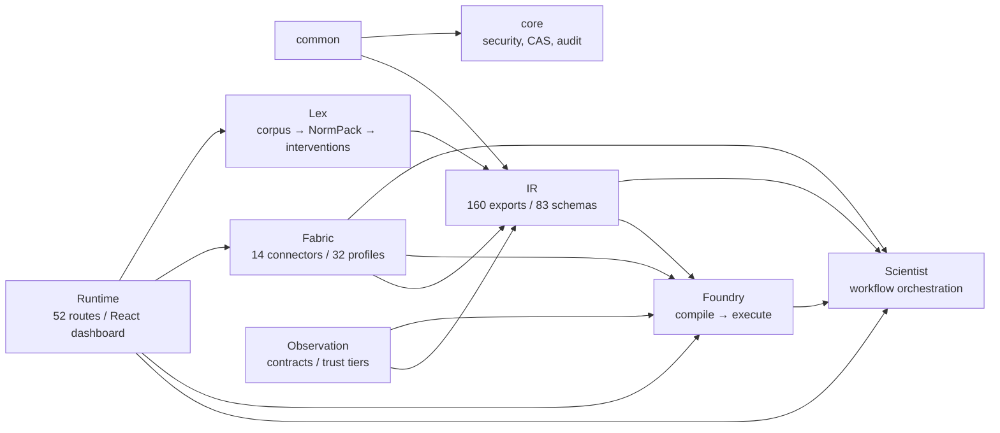
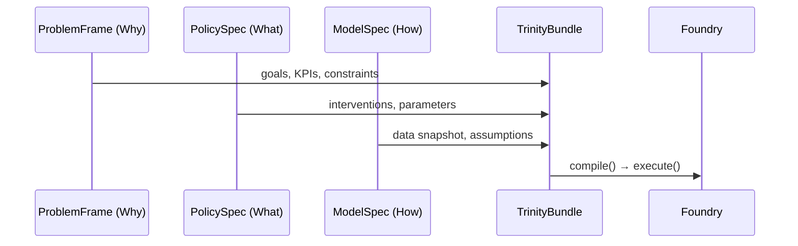
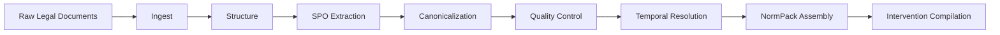
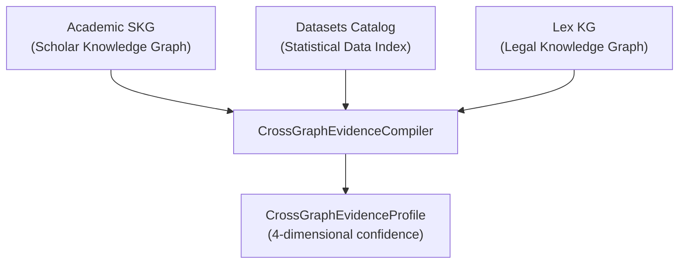
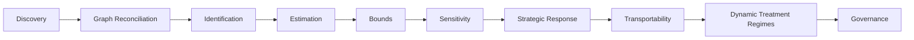
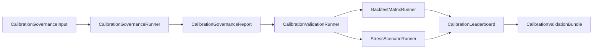

# PolicyOS — Architecture Overview

> Единый обзорный документ проекта PolicyOS: архитектура, подсистемы, потоки данных,
> каузальный движок, governance, security model и operational surface.
>
> Дата: 2026-04-04 | Статус: живой документ

---

## Содержание

1. [Executive Summary](#1-executive-summary)
2. [System Architecture](#2-system-architecture)
3. [IR — Contract Layer](#3-ir--contract-layer)
4. [Foundry — Computation Engine](#4-foundry--computation-engine)
5. [Scientist — Orchestration](#5-scientist--orchestration)
6. [Lex — Legal Pipeline](#6-lex--legal-pipeline)
7. [Fabric — Data Layer](#7-fabric--data-layer)
8. [Knowledge Layer — Three Knowledge Graphs](#8-knowledge-layer--three-knowledge-graphs)
9. [Causal Engine](#9-causal-engine)
10. [Governance Model](#10-governance-model)
11. [Observation Contracts](#11-observation-contracts)
12. [Runtime & API](#12-runtime--api)
13. [Frontend Dashboard](#13-frontend-dashboard)
14. [Security Model](#14-security-model)
15. [Architecture Discipline](#15-architecture-discipline)
16. [Agent-Based Simulation](#16-agent-based-simulation)
17. [Data Flow End-to-End](#17-data-flow-end-to-end)
18. [Technology Stack](#18-technology-stack)
19. [Glossary](#19-glossary)

---

## 1. Executive Summary

### Что такое PolicyOS

PolicyOS — система каузального анализа и симуляции государственных политик. Система
принимает policy question или формализованный Trinity bundle, собирает данные из
международных статистических порталов и правовых корпусов, строит каузальный граф,
идентифицирует и оценивает эффекты, проводит симуляцию через agent-based модели, проверяет
результаты через governance pipeline и формирует machine-readable decision packet с
uncertainty envelope и monitoring contract.

### Для кого предназначен проект

- **Правительственные аналитики** — оценка последствий законодательных изменений
- **Исследователи** — каузальный inference с формальной идентификацией и bounds
- **Policy designers** — автоматизированное формирование policy options из правового корпуса
- **Data engineers** — унифицированный data fabric для международных статистических источников

### Ключевые возможности

- **Каузальный inference pipeline**: discovery → identification → estimation → bounds →
  sensitivity → strategic response → transportability → governance
- **Три knowledge graph**: Academic SKG (научные публикации), Datasets Catalog
  (статистические данные), Lex KG (правовые нормы)
- **Agent-based simulation**: JAX-compatible ABM с reinforcement learning и bilevel
  optimization
- **Governance pipeline**: 20 автоматических governance passes + human gate protocol
- **Verified policy workflow**: от policy question до верифицированного decision packet с
  citation appendix
- **52 REST API endpoints** + React dashboard для мониторинга и управления

### Масштаб проекта

| Метрика | Значение |
|---------|----------|
| Python-модулей | ~1200 |
| Подсистем | 6 (IR, Foundry, Scientist, Lex, Fabric, Runtime) |
| Вспомогательных модулей | 5 (Core, Academic, Datasets, Scholar, Common) |
| IR public exports | 160 типов |
| JSON schema snapshots | 83 |
| Fabric connectors | 14 production families |
| Source profiles | 32 |
| Scientist builtin nodes | 42 |
| Scientist workflows | 5 |
| Governance passes | 20 |
| Каузальных методов | 99 модулей |
| REST API endpoints | 52 |
| ADR (Architecture Decision Records) | 96 |

---

## 2. System Architecture

### Шесть подсистем

PolicyOS построен как directed acyclic dependency graph из шести основных подсистем.
Каждая подсистема отвечает за свой concern и общается с остальными через typed contracts
в IR layer.



### Роли подсистем

| Подсистема | Роль | Зависит от |
|------------|------|------------|
| **IR** | Canonical contract layer — Trinity, analytics, observation, ABI | common |
| **Foundry** | Computation engine — compile Trinity → ExecPlan → execute simulation | IR, core |
| **Scientist** | Orchestration — DAG workflows, governance, experiment lifecycle | IR, Foundry, Fabric, Lex |
| **Lex** | Legal text processing — SPO extraction, NormPack, interventions | IR, core, Fabric |
| **Fabric** | Data fabric — connectors, profiles, world store, provenance | IR, core |
| **Runtime** | HTTP API + dashboard — FastAPI, control plane, React frontend | все вышеперечисленные |

### Вспомогательные модули

| Модуль | Роль |
|--------|------|
| **Core** | Security (JWT, OPA, SPIFFE), CAS, audit, observability, contracts |
| **Academic** | Batch pipeline для научных публикаций → Scholar Knowledge Graph |
| **Datasets** | Batch pipeline для каталога данных → Dataset Catalog Graph |
| **Scholar** | Deterministic knowledge bundle orchestrator (discover → enrich → bundle) |
| **Common** | Shared utilities, logging, configuration |

### Core Module

`polisyos.core` — infrastructure layer (20 submodules):

```
core/
├── security/           # Identity, authz, audit, TEE, SLSA, SBOM, quotas
│   ├── identity.py     # UserIdentityClaims, SPIFFEIdentityProvider
│   ├── authz.py        # OPAClient, AuthzDecision, AuthzInput
│   ├── access_scope.py # Request scope and tenant context
│   ├── cell.py         # CellResolution
│   ├── tenant_context.py # TenantContext, tenant_scope decorator
│   ├── audit_sink.py   # ChainedAuditSink
│   ├── audit_verifier.py # ChainVerifier, ChainVerificationResult
│   ├── tee.py          # TEE attestation (SEV-SNP, TDX, Nitro)
│   ├── tee_middleware.py # TEEGatekeeper
│   ├── sbom.py         # Software Bill of Materials
│   ├── quota_enforcer.py # Rate limiting
│   ├── delegation.py   # DelegationTokenManager
│   └── slsa/           # Fulcio, Rekor, attestation, config
├── artifacts/          # Content-Addressable Storage
│   ├── store.py        # FileSystemCAS
│   ├── ids.py          # ArtifactID generation/validation
│   ├── manifest.py     # ArtifactManifest with metadata
│   ├── signing.py      # Ed25519 signing and verification
│   ├── graph.py        # DependencyGraph for lineage
│   ├── registry.py     # Registry bundle management
│   ├── environment.py  # Environment capture (reproducibility)
│   └── backends/       # S3, GCS, caching store
├── contracts/          # Typed ABI for cross-domain communication
│   ├── trinity.py      # TrinityBundle, ProblemFrameRef, PolicySpecRef, ModelSpecRef
│   ├── runtime.py      # Runtime request/response DTOs
│   ├── control.py      # Control plane payloads
│   ├── scientist.py    # Scientist artifact refs
│   ├── foundry.py      # Foundry method/optimization refs
│   ├── fabric.py       # Data fabric artifact refs
│   ├── lex.py          # Legal/policy document refs + ComplianceIssue
│   ├── scholar.py      # Scholar bundle refs
│   ├── decision_validity.py # Decision validity envelope
│   └── [analytics refs] # causal, distributional, hte, uncertainty, backtest
├── audit/              # Portable audit archive system
│   ├── assembler.py    # AuditPackageAssembler
│   ├── verifier.py     # AuditPackageVerifier
│   └── report.py       # Markdown report rendering
├── governance/         # Validation profiles (mvp, strict, strategic_response)
├── llm/                # Traced, metered, retry-aware OpenAI client
├── observability/      # OpenTelemetry integration
├── compiler/           # Run compilation and optimization
├── resilience/         # Circuit breakers, retry policies
└── [lazy submodules]   # cache, canon, components, discovery, evaluation, pipeline, registry, run
```

#### Content-Addressable Storage (CAS)

All artifacts в PolicyOS immutable и content-addressed:

- `FileSystemCAS` — primary local store implementation
- `ArtifactID.from_sha256_hex()` — deterministic ID from content
- `ArtifactManifest` — metadata envelope: schema_info, producer_context, created_at,
  content_type, dependencies (provenance edges)
- **Cloud backends**: `S3Store`, `GCSStore`, `CachingStore` (wrapper)
- **Signing**: `sign_artifact()` → Ed25519 detached signature в `.sig` sidecar
- **Lineage**: `DependencyGraph` строит DAG из provenance edges

#### Audit Package System

Portable self-contained audit archives:

- `AuditPackageAssembler` — builds archives с checksums, signatures, provenance
- `AuditPackageVerifier` — validates integrity и chain continuity
- PROV-JSON serialization для W3C compliance
- SLSA material inclusion для supply-chain attestation
- Safe tar extraction (prevents traversal attacks)
- Standalone verifier template (runs without PolicyOS installed)

#### Decision Validity

Post-deployment monitoring contracts:

- `DecisionValidityEnvelope` — validity window для decision packets
- Invalidation events через `/api/v1/control/decision-validity/events`
- Per-run и per-packet validity queries
- Trigger-based re-evaluation при data drift или policy changes

### Принцип направленности зависимостей

Зависимости строго однонаправлены. Import gate (enforcement через `lint_imports.py` +
CI) гарантирует, что:

- `IR` **не** импортирует `Foundry`, `Scientist`, `Fabric`, `Lex`, `Runtime`
- `Foundry` **не** импортирует `Scientist`, `Runtime`, `Lex`, `Fabric`
- `Fabric` **не** импортирует `Scientist`, `Foundry`
- `Lex` **не** импортирует `Scientist`, `Foundry` (без approved exception)

Это позволяет менять implementation слои без перелома ABI и поддерживать независимый
deployment каждой подсистемы.

---

## 3. IR — Contract Layer

### Назначение

`polisyos.ir` — канонический контрактный слой системы. IR существует не для «красивой
типизации», а для стабильного boundary между слоями, которые меняются с разной
скоростью. IR валидирует, сериализует и линкует payload, но не исполняет policy логику.

### Пакетная структура

```
ir/
├── __init__.py          # 160-symbol lazy facade
├── types.py             # Core enums: EntityType, OptimizationDirection, TimeFrequency
├── model_spec.py        # ModelSpec — "how" artifact
├── norm_pack.py         # Normative rule packs
├── refs.py              # 50+ typed artifact reference classes
├── portfolio.py         # Policy portfolio interactions
├── kernel/              # 19 modules: base types, constraints, mechanisms, metrics, slots
├── governance/          # 6 modules: ProblemFrame, PolicySpec, gates, schedules
├── trinity/             # Trinity loaders
├── analytics/           # 54 modules: causal, HTE, backtest, distributional, strategic
├── observation/         # 8 modules: contracts, bundles, measurement, compilers
├── artifacts/           # Artifact I/O contracts
└── linker/              # Trinity linking
```

### Trinity — центральный контракт

Trinity разделяет policy payload на три независимых вопроса: **что исследуем** (Why),
**какое вмешательство применяем** (What) и **какую модель мира используем** (How).



#### ProblemFrame — «Почему»

Формализует границы исследования. Один ProblemFrame можно прогонять через несколько
PolicySpec, что позволяет сравнивать альтернативные вмешательства.

| Поле | Тип | Описание |
|------|-----|----------|
| `problem_id` | str | Уникальный идентификатор |
| `domain` | ProblemDomain | SOCIAL, ECONOMIC, ENVIRONMENTAL, HEALTH, etc. |
| `objectives` | list[ObjectiveSpec] | До 20 целей (metric_id, direction, weight) |
| `kpis` | list[KPISpec] | До 30 KPI с baseline и target |
| `success_criteria` | list[SuccessCriterion] | Формальные критерии успеха |
| `hard_constraints` | list[ConstraintSpec] | До 50 жёстких ограничений |
| `soft_constraints` | list[ConstraintSpec] | До 50 мягких ограничений |
| `stakeholders` | list[StakeholderSpec] | До 100 стейкхолдеров с impact_direction и priority |
| `normative_frame` | NormativeFrame | Arbitration policies, utility terms, rights catalog |

#### PolicySpec — «Что»

Описывает конкретные интервенции и их параметризацию.

| Поле | Тип | Описание |
|------|-----|----------|
| `policy_id` | str | Уникальный идентификатор |
| `interventions` | list[InterventionSpec] | До 100 интервенций (kind, target, schedule, params) |
| `mechanism_bindings` | list[MechanismBinding] | До 100 привязок к механизмам |
| `parameters` | list[ParameterSpec] | Тюнируемые параметры (min/max, sensitivity_priority) |

Каждый `InterventionSpec` включает `target` (SelectorExpr для таргетинга групп населения),
`schedule` (ScheduleSpec с start_step и duration), `lex_provision_ref` (ссылка на правовую
норму) и `measurement_expectations`.

#### ModelSpec — «Как»

Описывает мировую модель, которую компилирует Foundry.

| Поле | Тип | Описание |
|------|-----|----------|
| `model_id` | str | Уникальный идентификатор |
| `fidelity_level` | FidelityLevel | SURROGATE_FLUID, HYBRID, FULL_DISCRETE |
| `assumptions` | list[AssumptionSpec] | До 100 предположений (BEHAVIORAL, STRUCTURAL, etc.) |
| `agent_config` | AgentConfig | Типы агентов, популяция, network topology |
| `environment_config` | EnvironmentConfig | Random seed, stochastic, parallel worlds |
| `data_snapshot_ref` | str | Ссылка на data snapshot (sha256) |
| `time_semantics` | TimeSemanticsConfig | Временная гранулярность и шаг модели |

#### TrinityBundle

Объединяет три части в один immutable payload:

```python
class TrinityBundle(KernelModel):
    schema_version: str
    problem_frame: ProblemFrame
    policy_spec: PolicySpec
    model_spec: ModelSpec
```

### Analytics — типы результатов анализа

IR определяет canonical output types для всех видов анализа (54 модуля, ~80 классов):

| Домен | Ключевые типы |
|-------|---------------|
| **Causal** | `CausalEffectReport`, `CausalMethod` (18 enum values), `RefutationResult`, `ProofBundle` |
| **Uncertainty** | `UncertaintyEnvelope` (point_estimate, CI, distribution_family, gate_eligible) |
| **HTE** | `HTEResult`, `SubgroupEffect`, `FeatureImportance`, `TargetingRule`, `PolicyRecommendation` |
| **Distributional** | `DistributionalReport`, `CohortImpact`, `WinnersLosersTable` |
| **Backtest** | `BacktestReport`, `BacktestScenario`, `SystematicBias` |
| **Strategic** | `StrategicSCM`, `EquilibriumSetSummary`, `PerformativeShiftSummary`, `StrategicResponseBundle` |
| **Transport** | `TransportabilityResult` (source/target context, adjustment_formula) |
| **Discovery** | `CausalDiscoveryReport` (algorithm, validated_edges, v_structures) |
| **SCM** | `StructuralCausalModelSpec`, `NodeMechanism` (MechanismFamily, MechanismSource) |
| **Calibration** | `CalibrationConfig`, `CalibrationTarget` |

Все аналитические результаты конвертируются в `UncertaintyEnvelope` для единого governance
gating через `gate_eligible` flag.

### ABI и Schema Snapshots

IR design тесно связан с ABI discipline:

- **83 JSON schema snapshots** в `schemas/snapshots/ir/` фиксируют публичный контракт
- `tools/diagnostics/gen_schema.py` генерирует и проверяет schema drift
- CI workflow `abi.yml` блокирует breaking changes без явного versioning decision
- Все модели используют `ConfigDict(extra="forbid")` — лишние поля отбрасываются
- Artifact refs используют content-addressed IDs: `sha256:<hex64>`

### IR Kernel — Base Types

`ir/kernel/` (19 modules) определяет fundamental building blocks:

| Module | Ключевые типы |
|--------|---------------|
| `base.py` | `KernelModel` (frozen Pydantic base, extra="forbid") |
| `constraints.py` | ConstraintSpec, ConstraintType |
| `mechanisms.py` | Mechanism definitions |
| `metrics.py` | MetricSpec, KPI schemas |
| `numbers.py` | Numeric types, precision handling |
| `slots.py` | SlotSpec (name, type, scope, shape, dtype, unit), SlotScope (AGENT/FIRM/MARKET/GLOBAL/CELL) |
| `time_semantics.py` | TimeSemanticsConfig, temporal configuration |
| `units.py` | Physical/financial unit definitions |
| `values.py` | Typed value wrappers |
| `trust.py` | Trust scoring primitives |

### Typed Artifact References

`ir/refs.py` определяет 50+ typed reference classes:

```python
class ArtifactRef(KernelModel):
    artifact_id: ArtifactID  # sha256:<hex64>
    kind: str                # e.g., "foundry.exec_plan"
    media_type: str          # e.g., "application/json"
```

References — content-addressed handles для CAS artifacts. Каждый subsystem получает
свою семейство refs: `ExecPlanRef`, `SimulationResultRef`, `CausalEffectReportRef`,
`NormPackRef`, `DataSnapshotRef`, `GovernanceReportRef`, etc.

### Policy Portfolio

`ir/portfolio.py` — multi-policy interaction analysis:

- `PolicyPortfolio` — коллекция PolicySpec для сравнительного анализа
- `PolicyInteraction` — попарное взаимодействие между policies
- `InteractionMatrix` — матрица interactions для portfolio
- `InteractionType` — COMPLEMENTARY, SUBSTITUTIVE, NEUTRAL, CONFLICTING

### Lazy Facade

Корневой `ir/__init__.py` реализует lazy imports через `_LAZY_IMPORTS` dictionary.
Все 160 публичных имён разрешаются при первом обращении, что позволяет CLI и
documentation tooling загружаться без тяжёлых зависимостей.

Semantic grouping exports:

| Группа | Количество |
|--------|------------|
| Trinity Core | 3 (ProblemFrame, PolicySpec, ModelSpec) |
| Problem Definition | 10 |
| Governance | 6 |
| Policy/Mechanism | 5 |
| Analytics/Uncertainty | 10 |
| Causal Types | 24 |
| Distributional/HTE | 11 |
| Observation Contracts | 7 |
| Observation Measurement | 6 |
| Observation Bundles | 15+ |
| Causal Execution | 4 |
| Model Config | 5 |
| Other (NormPack, Connectors, Portfolio, etc.) | ~60 |

---

## 4. Foundry — Computation Engine

### Назначение

`polisyos.foundry` превращает Trinity bundle в исполняемый план (compile) и затем
выполняет его (execute). Foundry — вычислительное ядро системы: здесь живут JAX-aware
runtime, compile pipeline, каузальный движок, calibration, agent simulation и pluggable
method registry.

### Пакетная структура

```
foundry/
├── __init__.py          # Lazy facade: compile(), execute()
├── compile/             # Trinity → ProgramGraph → ExecPlan
│   ├── api.py           # Public compile() entry point
│   ├── trinity_compiler.py  # TrinityBundle → ExecPlan orchestrator
│   ├── _graph.py        # build_program_graph, build_exec_order
│   └── _lowering.py     # Mechanism lowering to IR
├── execute/             # ExecPlan + State → SimulationResult
│   ├── api.py           # Public execute() entry point
│   ├── _executor_graph.py   # execute_program_graph orchestrator
│   ├── _executor_ops.py     # Selector eval, constraint check, patch ops
│   └── _executor_patching.py # State delta application
├── methods/             # Method registry + 17 families
│   ├── base.py          # FoundryMethod protocol, MethodSignature ABI
│   ├── registry.py      # Thread-safe O(1) MethodRegistry singleton
│   ├── catalog/         # 17 method families (causal: 99 modules)
│   └── backends/        # numpy, jax, ray, bayesian, solver runners
├── calibration/         # JAX-backed parameter calibration
├── agent_sim/           # Agent-based simulation (44 modules)
├── contracts/           # GlobalState, AgentState, FirmState
├── data_plane/          # Fabric → Foundry state bindings
└── [support modules]    # executor, merge_engine, constraints_engine, trace
```

### Compile Pipeline

`compile(store, CompileRequest)` трансформирует Trinity в исполняемый план через
шесть фаз lowering:

```
TrinityBundle
  → link against registry (polisyos.ir.linker)
  → Phase 1: Coverage Audit (verify all Trinity fields mapped)
  → Phase 2: Mechanism Binding Resolution (InterventionSpec → MechanismBinding)
  → Phase 3: Effective Parameter Merging (registry defaults + binding overrides + intervention params)
  → Phase 4: Runtime Fidelity Resolution (policy fidelity → mechanism fidelity)
  → Phase 5: Constraint Lowering (hard/soft → LoweredConstraint with slot_id, operator, expected)
  → Phase 6: LoweredIR Assembly
  → build ProgramGraph (DAG of ProgramNode/ProgramEdge)
  → topological sort → execution order
  → conflict checking (slot write conflict validation)
  → cost estimation (time/memory against budget)
  → create ExecPlan + SlotLayout + TreasuryPlan
  → persist all artifacts to CAS with provenance
```

**Lowering Data Models:**

```python
LoweredMechanism(
    binding_id, mechanism_id, intervention_ids,
    effective_params_ref,   # CAS ref на merged params
    schedule,               # step range для activation
    fidelity,               # resolved runtime fidelity
    inputs, outputs,        # slot IDs для dependency inference
    target_selector,        # SelectorExpr
    priority                # merge priority
)

LoweredConstraint(
    constraint_id, severity,     # hard | soft
    slot_id, operator, expected, # evaluation rule
    unit_id, penalty, notes      # soft penalty + audit trail
)
```

**ProgramGraph Construction** происходит в три этапа:

1. **Node Creation** — для каждого lowered mechanism:
   - `make_mask` node — оценивает SelectorExpr → binary JAX mask
   - `apply_mechanism` node — инстанцирует mechanism, emits patches
   - Link: mask → mechanism с `depends_on` edge

2. **Slot Dependency Edge Inference** — для каждого writer node, находит reader nodes
   с matching inputs → создаёт `depends_on` edges для read-after-write порядка

3. **Operation Nodes** — `merge_state` (merge rules) + `check_constraints` (hard/soft eval)

**ProgramGraph** содержит узлы четырёх типов:
- `op.mask.*` — вычисление boolean mask для таргетинга (SelectorExpr → per-agent mask)
- `apply_mechanism` — применение механизма к state под mask
- `op.merge_state` — агрегация multi-valued slot writes (SUM, OVERRIDE, PRIORITY, ERROR)
- `op.check_constraints` — проверка constraint expressions

**Compile-time артефакты** (7 штук):
1. `foundry.exec_plan` — порядок выполнения, determinism tier, random seed, NaN-guard, JIT flags
2. `foundry.program_graph` — DAG узлов и рёбер с entrypoints
3. `foundry.lowered_ir` — lowered mechanisms и constraints
4. `foundry.slot_layout` — schema маппинг slot → byte offset/dtype
5. `foundry.treasury_plan` — финансовые потоки механизмов
6. `compile_report` — status, warnings, validation

### Execute Pipeline

`execute(store, ExecuteRequest)` исполняет скомпилированный план:

```
ExecPlan + InputBindings + BaseState
  → resolve Fabric → Foundry state snapshot (via data_plane)
  → load ProgramGraph + LoweredIR
  → JAX PRNG management (jax.random.split для stochastic mechanisms)
  → iterate nodes in topological order:
      make_mask → evaluate selector AST → boolean JAX mask
      apply_mechanism → instantiate + apply with mask → PatchMap
      merge_state → merge_patch_records() via MergeEngine
      check_constraints → evaluate_lowered_constraints()
  → capture state delta + metrics
  → persist SimulationResult to CAS
```

**Selector Evaluation** рекурсивно обрабатывает AST:
- `SelectorPredicate` — field comparator (EQ, NE, GT, LT, IN, BETWEEN, etc.)
- `SelectorNot` — логическое отрицание
- `SelectorAll` / `SelectorAny` — логические AND/OR
- Возвращает boolean JAX array и slot scope (SCALAR, PER_AGENT, PER_FIRM)

**Failure Handling** через `FailureCard`:
```python
FailureCard(
    node_id, method_fqn,
    severity,           # FATAL | RECOVERABLE | DEGRADED
    error_type, error_message, traceback_hash,
    retry_eligible, suggested_fallback
)
```

**ExecutionStrictness** определяет поведение при ошибках:
- `FAIL_CLOSED` — любая ошибка останавливает execution
- `DEGRADED` — skip failures, continue, собирать failure cards
- `RESEARCH` — record everything, не останавливать

**Execute-time артефакты** (4 штуки):
1. `foundry.simulation_result` — metrics_ref, state_snapshot_ref, environment_fingerprint
2. `foundry.state_delta` — per-step PatchRecords
3. `foundry.metrics` — step timings, NaN counts, gradient norms
4. `foundry.constraint_report` — violations с severity и penalty total

### State Model

Foundry оперирует typed state hierarchy. Все state классы используют `@chex.dataclass(frozen=True)`
для immutability и JAX-совместимости, с `jaxtyping` shape annotations.

```
GlobalState
├── step: Int[Array, ""]
├── agents: AgentState[n_agents]
│   ├── active, age, skill_level
│   ├── income, reported_income, savings, consumption
│   ├── risk_aversion, is_employed, employer_id
├── firms: FirmState[n_firms]
│   ├── sector_id, productivity, capital, labor_count
│   ├── cash, inventory, debt, wage_offer, price, active
├── market: MarketState (scalar aggregates)
│   ├── avg_price, total_supply, total_demand
│   ├── avg_wage, unemployment_rate, interest_rate
├── cells: CellState[n_cells] (optional regional/sectoral)
│   ├── region_code, sector_id, population
│   ├── employment, output, distress_score
├── household_cells: HouseholdCellState[n_household_cells] (optional)
│   ├── disposable_income, poverty_rate, transfer_intensity
├── government_balance, tax_rate, gdp
└── agent_sim_runtime: AgentSimRuntimeState
    ├── rng_key: chex.PRNGKey
    ├── procurement_graph: ProcurementGraphState
    └── household_distribution: DistributionState
```

State обновляется функционально через `state.replace(**kwargs)`. Slot registry маппит
slot IDs на поля state по scope: AGENT, FIRM, MARKET, GLOBAL, CELL. Slot paths используют
dotted notation (e.g. `"agents.income"` → retrieve income array).

**Три уровня fidelity** определяют поведение mechanisms:

| Level | Semantics | Differentiable |
|-------|-----------|---------------|
| `SURROGATE_FLUID` | Continuous flows (differential equations) | Yes |
| `RELAXED_DISCRETE` | Discrete events smoothed via Softmax/Sigmoid | Yes |
| `HARD_DISCRETE` | Honest discrete simulation | No |

### Merge Engine

Когда несколько mechanisms пишут в один slot, MergeEngine разрешает конфликты:

| Merge Rule | Описание |
|------------|----------|
| `SUM` | Accumulative: sum all writes (бюджетные величины) |
| `OVERRIDE` | Last-write-wins с timestamp tiebreak |
| `PRIORITY` | Winner-takes-all по приоритету mechanism |
| `ERROR` | Hard conflict: блокирует run при multiple writers |
| `MEAN` | Average all writes |
| `MAX` / `MIN` | Extremum selection |
| `BLEND` | Weighted combination |

Merge semantics вступает на уровне execution state и derived artifacts. Raw Trinity bundle
версионируется целиком, а не как field-level CRDT.

### Constraints Engine

`check_constraints()` evaluates constraint expressions после merge step:

**Constraint Evaluation Pipeline:**
1. **Slot Value Retrieval** — load state value из state path
2. **Aggregation** — reduction по vector slots:
   - Скалярные: SCALAR, MIN, MAX, MEAN, MEDIAN, SUM
   - Логические: ALL, ANY
   - Специальные: QUANTILE, WEIGHTED_MEAN, COUNT_VIOLATING
3. **Operator Application** — `_is_violated(operator, current, expected)`:
   - Operators: EQ, NE, GT, LT, GTE, LTE, IN, NOT_IN, BETWEEN
4. **Violation Recording:**
   - Hard constraint violated → `hard_fail = True`, execution stops
   - Soft constraint violated → accumulate `penalty`

**ConstraintReport:**
```python
ConstraintReport(
    ok: bool,                              # all constraints satisfied
    hard_fail: bool,                       # any hard constraint violated
    violations: list[ConstraintViolation], # per-violation details
    penalty_total: Decimal | None          # sum of soft constraint penalties
)

ConstraintViolation(
    constraint_id, slot_id,
    actual, expected,                      # observed vs. required
    severity,                              # hard | soft
    penalty                                # applicable for soft only
)
```

### Method Registry

Pluggable registry для всех computational methods:

- **Thread-safe singleton** с O(1) lookup по FQN (`namespace.name@version`)
- **Version resolution**: EXACT, LATEST_COMPATIBLE, LATEST, PINNED
- **Secondary indices**: by_name, by_tag, by_input_slots, by_output_slots
- **Lazy loading** с double-checked locking

**FoundryMethod protocol**:
```python
class FoundryMethod(Protocol):
    @staticmethod
    def pure_step(state: Any, params: Mapping[str, Any]) -> dict[str, Any]: ...
    determinism_tier: DeterminismTier  # DETERMINISTIC | NUMERICAL | STATISTICAL
```

### 17 семейств методов

| Семейство | Модулей | Описание |
|-----------|---------|----------|
| **causal** | 99 | Pearl-Bareinboim orchestrator (см. секцию 9) |
| **econometrics** | — | Panel regression, FE/RE, IV |
| **bayesian** | — | PyMC, posterior inference |
| **optimization** | — | Convex optimization, constrained search |
| **ml** | — | Tree-based, ensemble, neural adapters |
| **microsim** | — | Agent-based simulation mechanics |
| **network** | — | Graph analysis, centrality, diffusion, GNN |
| **spatial** | — | Spatial econometrics, geo-regression |
| **distributional** | — | Quantile regression, distributional effects |
| **forecasting** | — | ARIMA, exponential smoothing, Prophet |
| **sensitivity** | — | Sensitivity analysis, robust inference |
| **validation** | — | Cross-validation, held-out evaluation |
| **survey** | — | Survey-adjusted estimation |
| **simulation** | — | Monte Carlo, ABM harness |
| **policy** | — | Policy evaluation, counterfactual simulation |
| **mechanism** | — | Tax, subsidy, regulation evaluation |

### Execution Backends

Method registry route-ит методы к нужному backend:

| Backend | Назначение |
|---------|------------|
| `numpy_runner` | Default synchronous NumPy |
| `jax_runner` | JAX-compiled (vmap, grad, JIT) |
| `ray_runner` | Distributed Ray execution |
| `solver_runner` | cvxpy, scipy.optimize |
| `bayesian_runner` | PyMC sampling |
| `chain_executor` | Sequential method chaining |
| `circuit_breaker` | Fault tolerance / graceful degradation |

### Calibration System

JAX-backed differentiable calibration через Pure Executor:

```
CalibratorInputs (config, program_graph, exec_plan, base_state, registries)
  → compile_program() → StaticBundle (PreparedNode list + TrainableHandle list)
  → extract_trainable_values() → initial parameter vector
  → for iteration in range(n_iterations):
      run_pure_scan(static_bundle, base_state, n_steps, params)
        → jax.lax.scan() (differentiable, no CAS access)
        → final_state, trace_dict
      compute_base_loss() + measurement reweighting
      add auxiliary penalties
      jax.grad() → gradients
      optax update (Adam/SGD/L-BFGS)
      apply_trainable_values() → updated nodes
  → [optional] compute_hessian() → uncertainty quantification
  → CalibrationReport
```

**Pure Executor** — ключевой компонент: `StaticBundle` кэширует instantiated mechanisms,
compiled selectors и trainable handles. `run_pure_scan()` использует `jax.lax.scan()`
для differentiable replay без CAS access — чистая JAX-вычисляемая функция.

**Loss Functions:**
- `pointwise_base_loss(y_pred, y_real, cfg)` — squared (default) или Huber loss
- `reduce_weighted_loss()` — с optional per-element weights
- `loss_components()` — aggregates weighted losses across all targets, returns per-target diagnostics

**Measurement-Aware Loss:**
```python
MeasurementAwareTarget(
    target_id, value,
    trust: float = 1.0,      # confidence [0, 1]
    lag: int = 0,             # data lag in steps
    coverage: float = 1.0,    # data availability fraction
    regime: str | None        # conditional regime
)
```
`DefaultMeasurementAwareLossAdapter` применяет trust-based weighting, lag-based
exponential discounting, coverage masking и regime conditioning.

**Hessian и Identifiability:**
- `compute_hessian()` → eigendecomposition → parameter uncertainty
- High eigenvalue → well-identified parameter
- Low eigenvalue → unidentifiable parameter
- `diagnose_identifiability()` → per-parameter `IdentifiabilityStatus`:
  `IDENTIFIED | WEAKLY_IDENTIFIED | UNIDENTIFIED | UNOBSERVED`

**CalibrationReport:**
- `fit_metrics` — total_loss, per_target_loss, constraint_penalty, auxiliary_penalty
- `fit_quality` — quality_score [0,1], grade (A-F), notes
- `uncertainty` — parameter uncertainties, target residual std
- `series_comparisons` — observed vs. synthetic с R², RMSE
- `identifiability_report` — per-parameter identifiability assessment

---

## 5. Scientist — Orchestration

### Назначение

`polisyos.scientist` оркестрирует workflow DAG вокруг Foundry, Fabric и Lex. Scientist
управляет preflight, compile, simulate, governance, decision packet и checkpoint/replay
flows. Это самый большой модуль системы (~401 Python файл).

### Пакетная структура

```
scientist/
├── workflows/       # 5 DAG specifications
├── nodes/           # 42 builtin nodes + protocol
│   └── builtins/    # data, planning, compile, causal, simulate, governance, decision
├── engine/          # Executor, state, checkpoint, registry (52 files)
├── governance/      # Pass registry, pipeline, calibration (44 files)
├── causal/          # Bounds, readiness, transportability runners
├── cross_graph/     # Multi-context evidence compilation
├── search/          # Policy optimization, candidate funnel (64 files)
├── doe/             # Design-of-experiments, sensitivity, adversarial
├── backtesting/     # Historical simulation, backtest matrices
├── agent/           # Autonomous agent tools (45 files)
├── policy_design/   # Policy generation and verification
├── autotune/        # Parameter calibration and optimization
├── llm/             # Language model profiles and adapters
├── adapters/        # Fabric/Foundry/Lex bridge ports
├── provenance/      # Experiment provenance DAGs
└── replay/          # Workflow replay mechanisms
```

### ExperimentState — центральная модель

Каждый node читает и пишет в `ExperimentState`. Все артефакты immutable,
content-addressed (CAS).

```python
class ExperimentState(BaseModel):
    run_id: str
    inputs: dict[str, ArtifactRef]          # trinity_bundle_ref, data_snapshot_ref
    artifacts_index: dict[str, ArtifactRef]  # simulation_result_ref, causal_report_ref
    reports_index: dict[str, ArtifactRef]    # governance_report_ref, legal_report_ref
    params: dict[str, JsonValue]             # runtime parameters and flags
    budgets: dict[str, Decimal]              # compute, time, cost budgets
    execution_profile: str                   # "fast" | "research" | "governed" | "production"
```

### 5 Workflow-ов

#### scientist_default (20 nodes)

Стандартный анализ: compile → simulate → governance.

```
start
 ├── build_data_snapshot → bind_foundry_inputs → run_data_plane_gate ──┐
 ├── build_execution_plan → build_method_catalog_snapshot              │
 │    └── run_preflight → ready_to_run ────────────────────────────────┤
 └── link_trinity ─────────────────────────────────────────────────────┤
                                                                       │
                              compile_foundry ◄────────────────────────┘
                                   │
                    compile_cross_graph_evidence
                                   │
                          resolve_parameters
                                   │
                           run_simulation
                      ┌────────┬───┴────┬──────────┐
                 legal_check   │   run_distrib   propagate_unc
                      │        │        │              │
                      │   run_causal_eval              │
                      └────────┴───┬────┴──────────────┘
                                   │
                     run_normative_arbitration
                                   │
                          run_governance
                                   │
                          run_evaluator
                                   │
                      build_decision_packet
```

#### scientist_causal_full (26 nodes)

Полный каузальный анализ с literature priors, graph reconciliation, ensemble и transport.

```
start
 ├── build_data_snapshot → bind_foundry_inputs → run_data_plane_gate ──┐
 ├── build_execution_plan → build_method_catalog_snapshot              │
 │    └── run_preflight → ready_to_run ────────────────────────────────┤
 ├── link_trinity ─────────────────────────────────────────────────────┤
 └── build_literature_prior                                            │
      └── reconcile_causal_graph ──────────────────────────────────────┤
                                                                       │
                                    compile_foundry ◄──────────────────┘
                                         │
                          compile_cross_graph_evidence  (+ reconcile_causal_graph)
                                         │
                                resolve_parameters  (+ reconcile_causal_graph)
                                         │
                                  run_simulation
                            ┌──────┬─────┴─────┬───────────┐
                       legal_check  │   run_distrib   propagate_unc
                                    │
                           run_causal_eval
                                    │
                           run_causal_queries
                                    │
                          run_causal_ensemble
                                    │
                         run_abm_consistency
                                    │
                        run_transportability  (+ reconcile_causal_graph)
                                    │
                      run_normative_arbitration
                                    │
             run_governance  (+ reconcile, ensemble, abm, transport)
                                    │
                          run_evaluator → build_decision_packet
```

Дополнительные узлы по сравнению с default:

| Node | Назначение |
|------|-----------|
| `build_literature_prior` | Строит LiteratureCausalPrior из SKG: каузальный граф с evidence weights и confidence из научных публикаций |
| `reconcile_causal_graph` | Merge: data-discovered graph + literature prior + LLM structural hints → reconciled CausalGraphModel. Использует weighted voting по evidence channels |
| `run_causal_readiness` | Readiness assessments: proxy identification, bounds feasibility, interference checks |
| `run_causal_queries` | Structural causal query через GCM: interventional P(Y|do(X)) и counterfactual P(Y_x|X'=x') |
| `run_causal_ensemble` | ≤10 SCM member models → shared query → bootstrap stability → consensus weights → unified UncertaintyEnvelope |
| `run_abm_consistency` | Cross-check: SCM macro-level effects ↔ ABM agent-level aggregates. Detects phase transitions и regime-dependent disagreements |
| `run_transportability` | Three-graph closure (causal + datasets + legal): synthesize S-nodes, run TR algorithm → TransportabilityResult |

#### scientist_policy_verified (25 nodes)

Workflow для случаев, когда нет готового TrinityBundle, а есть policy question.
Система самостоятельно ищет юридические основания, верифицирует, составляет policy
options и формализует в TrinityBundle.

```
start
 ├── build_data_snapshot → bind_foundry_inputs → run_data_plane_gate ────────────────┐
 ├── build_execution_plan → build_method_catalog_snapshot → run_preflight ────────────┤
 │                                                                                    │
 └── plan_policy_request                                                              │
      ├── compile_cross_graph_evidence                                                │
      │    └── assemble_legal_candidate_pack                                          │
      │         └── expand_legal_source_pack                                          │
      │              └── run_source_verification                                      │
      │                   └── run_source_gap_review  (bounded: max 2 cycles)          │
      │                        └── draft_policy_options                               │
      │                             └── formalize_verified_policy ────────────────────┐│
      │                                                                              ││
      │                                       compile_foundry ◄──────────────────────┘┘
      │                                            │
      │                                   resolve_parameters → run_simulation
      │                               ┌──────┬─────┴─────┬───────────┐
      │                          legal_check  │   run_distrib   propagate_unc
      │                                       run_causal_eval
      │                                       │
      │                         run_normative_arbitration → run_governance
      │                                       │
      │              build_verified_policy_report
      │                                       │
      └────────────────────────── build_decision_packet
```

**Этапы policy_verified:**

1. **plan_policy_request** — создаёт `PolicyRequestFrame`: question, jurisdiction (default: UA), domain, goals
2. **assemble_legal_candidate_pack** — до 40 поисковых запросов (вкл. украинские): fact_hits + provision_hits
3. **expand_legal_source_pack** — разрешает кандидатов в source bundles: version chains, reference hops (max 2), до 120 документів
4. **run_source_verification** — baseline claims (deterministic) + LLM verification, merge → deduplicated claims, gap detection
5. **run_source_gap_review** — bounded recovery (max 2 cycles): gaps → recovery queries → re-assemble → re-verify
6. **draft_policy_options** — verified_options (с legal_basis_refs) + hypothesis_options
7. **formalize_verified_policy** — PolicyOptionSet → TrinityBundle через MockFormalizerAgent
8. **build_verified_policy_report** — VerifiedPolicyReport с executive_summary, verified_legal_basis, citation_appendix, missing_evidence

**Дефолтные бюджеты:**
- max_candidate_queries = 40
- max_source_docs = 120
- max_source_anchors = 400
- max_reference_hops = 2
- max_verifier_calls = 500
- max_gap_review_calls = 80
- verification_cycles = max 2

#### scientist_policy_design (29 nodes)

Полный policy design с hierarchical search и legal sourcing:
- Literature prior + graph reconciliation (как causal_full)
- Legal source pack + verification + gap review (как policy_verified)
- **Hierarchical policy search** — champion selection через funnel
- Counterfactual identification gate
- Policy blueprint runtime + translation + compliance

#### scientist_discovery

Hypothesis discovery из observational data. Активируется при наличии
`discovery_data` + `discovery_variable_names` в params.

### Автоматический выбор workflow

`selection.py` эскалирует workflow автоматически:

```
1. Явный workflow_id → использовать напрямую
2. policy_answer_mode == "verified_async" → POLICY_VERIFIED
3. policy_mode == true → POLICY_DESIGN
4. execution_profile in {research, governed, production} → CAUSAL_FULL
5. transport_required | source ≠ target context → CAUSAL_FULL
6. discovery_data + variables → DISCOVERY
7. Иначе → DEFAULT
```

### Node Protocol

Каждый node описывается `NodeSpec`:

```python
class NodeSpec:
    metadata: ComponentMetadata  # id, namespace, version, tags
    state_reads: list[str]       # state keys, которые node читает
    state_writes: list[str]      # state keys, которые node пишет
    produces: list[str]          # logical artifact outputs
```

Node возвращает `NodeOutcome`:
```python
class NodeOutcome:
    status: "ok" | "skip" | "fail"
    state: ExperimentState       # mutated state copy
    artifacts: list[ArtifactRef] # produced artifact refs
    events: list[NodeEvent]      # structured logs
    error: NodeError | None
```

### 42 Builtin Nodes

| Категория | Nodes | Примеры |
|-----------|-------|---------|
| **Data** (4) | build_data_snapshot, bind_foundry_inputs, enrich_knowledge | Fabric snapshot, input bindings |
| **Planning** (15) | build_execution_plan, run_preflight, ready_to_run, plan_policy_request, compile_cross_graph_evidence, run_hierarchical_policy_search | Preparation gates |
| **Compile** (4) | link_trinity, compile_foundry, formalize_verified_policy | Trinity → ExecPlan |
| **Causal** (11) | build_literature_prior, reconcile_causal_graph, run_causal_ensemble, run_transportability, counterfactual_identification_gate | Causal pipeline |
| **Simulate** (5) | run_simulation, propagate_uncertainty, run_distributional_analysis | Foundry execution |
| **Governance** (5) | data_plane_gate, legal_check, run_normative_arbitration, run_governance | Validation pipeline |
| **Decision** (10) | build_decision_packet, build_policy_output_bundle, build_verified_policy_report, run_policy_translation | Final assembly |

### Engine Architecture

**Два executor-а:**

1. **WorkflowExecutor** (synchronous) — single-threaded sequential execution:
   - Topological sort via `_topo_sort()` → deterministic order
   - Dependency validation, condition evaluation, retry, timeout
   - Checkpointing после каждого node

2. **AsyncWorkflowExecutor** — parallel DAG execution через `asyncio.TaskGroup`:
   - Группирует nodes в topological tiers
   - Каждый tier выполняется параллельно через `asyncio.to_thread` (nodes остаются sync)
   - Feature-flagged: `POLISYOS_ASYNC_EXECUTOR=1`

**Checkpoint & Resume:**
- Checkpoint policy: `off | strict | best_effort`
- `CheckpointArtifact` — full state snapshot в CAS
- `CheckpointHead` — latest checkpoint pointer
- `compute_workflow_fingerprint(spec)` — stability check при resume
- `acquire_run_lock()` — distributed locking для concurrent runs
- `resume_from_checkpoint(run_id)` → ExperimentState + continue from next node
- Ошибки: `CheckpointNotFoundError`, `CheckpointCorruptedError`, `WorkflowMismatchError`

**Idempotency:**
- `compute_idempotency_key(node_spec, state_slice)` — SHA256 hash от params + required state paths
- `NodeResultCache` — cache по idempotency key; cache hit → skip execution
- `extract_state_slice(state, required_paths)` — minimal state для key computation

**Circuit Breaker:**
- States: CLOSED → OPEN → HALF_OPEN → CLOSED
- `CircuitBreakerConfig`: failure_threshold, timeout_seconds, half_open_max_calls
- Предотвращает cascading failures между nodes

**Budget Management:**
- `BudgetLimit(resource, amount)` — constraint per resource type
- `BudgetState` tracks consumption; `BudgetExhaustedError` при превышении
- `BudgetMiddleware` wraps executor с budget checks

**Convergence Detection:**
- `ConvergenceStrategy`: NONE, MOVING_AVERAGE, PLATEAU, ENSEMBLE
- `ConvergenceDetector.observe()` → monitors metric improvement
- `has_converged()` → `ConvergenceState` с diagnostics

**Fan-Out & Sub-Workflow:**
- `FanOutNode` — creates N parallel branches от templated node
- `MergeConflictPolicy`: UNION, INTERSECTION, FIRST_WIN
- `SubWorkflowNode` — embeds workflow inside workflow с `StateMapping`

**Retry & Error Taxonomy:**
- `RetryPolicy`: max_attempts, backoff strategy, retriable errors
- Error hierarchy: `EngineError` → `WorkflowSpecError`, `UnknownNodeError`,
  `CycleDetectedError`, `NodeTimeoutError`, `CircuitBreakerOpenError`

**Telemetry:**
- OpenTelemetry spans per node via `start_node_span()`
- Trace attributes: NODE_ID, DURATION_MS, RETRY_COUNT, CACHE_HIT
- `EngineMetricsCollector` protocol с `NoopEngineMetrics` fallback
- Error policy: `fail_fast | continue` (upstream nodes block, other branches proceed)

### Port Abstraction

Nodes не зависят напрямую от подсистем. Вместо этого используются ports:
- `FoundryPort` — compile(), execute()
- `FabricPort` — snapshot(), fetch()
- `LexPort` — evaluate_legality(), assemble_norm_pack()
- `ScholarPort` — enrich(), query()

Это позволяет unit-тестировать nodes с mock ports без поднятия тяжёлых зависимостей.

### Search Module

`polisyos.scientist.search` реализует multi-fidelity policy search с ask/tell pattern.

**Архитектура Search:**

```
SearchService.ask(goal, search_space, context)
  → [CandidateProposal, ...]
  → Evaluator runs Stage A (cheap) / Stage B (expensive)
SearchService.tell(candidate_id, EvaluationBundle)
  → TellResult (best_candidate, registry_update, frontier_delta)
```

**Multi-Fidelity Funnel:**

`FunnelOrchestrator` маршрутизирует кандидатов через 7 уровней:

| Level | Название | Назначение |
|-------|----------|------------|
| 0 | Static checks | Быстрая формальная валидация |
| 1 | Heuristic evaluation | Лёгкая surrogate оценка |
| 2 | Causal analysis | Каузальный анализ |
| 3 | Medium-fidelity sim | Средневерная симуляция |
| 4 | Full-fidelity sim | Полная симуляция через Foundry |
| 5 | Refutation + governance | Robustness + governance review |
| 6 | Promotion evaluation | Финальная оценка для продвижения |

Каждый кандидат получает `FunnelTicket` — stateful handle, хранящий `FunnelTraceStep`
для аудита (fidelity_level, objective_value, routing_decision).

**Routing решения:** `RoutingAction` enum — advance, defer, reject, retry_cheaper,
complete, defer_to_human.

**VOI (Value of Information) Scheduling:**
- `ParetoSnapshot` — определяет позицию кандидата: dominated, frontier, near_frontier
- `ComputeEconomicsDecision` — предсказывает ROI: expected_improvement_per_usd,
  expected_falsification_value, timeout_risk, replay_cost_usd
- `SimpleVOIScheduler` / `PredictiveVOIScheduler` — маршрутизация на основе VOI

**Search Strategies:**
- `BayesianOptimizer` — Gaussian process + acquisition functions
- `MOBayesianOptimizer` — Multi-objective BO (NSGA-II style)
- `GridSearchStrategy` — exhaustive parameter sweep
- `RandomSearchStrategy` — uniform random sampling
- `NeuralSurrogate` — deep surrogate model
- `EnsembleSurrogate` — multiple surrogate voting
- Все стратегии реализуют `suggest()`, `update()`, `get_state()` / `set_state()`

**Judge Stack (6 судей):**

| Judge | Ответственность |
|-------|----------------|
| `STRUCTURAL` | Validates policy IR structure |
| `STATISTICAL` | Statistical significance + power |
| `ROBUSTNESS` | Adversarial sensitivity analysis |
| `GOVERNANCE` | Compliance с legal/equity constraints |
| `REPRODUCIBILITY` | Replay + audit verification |
| `COMPUTE` | Resource feasibility |

`JudgeVerdict` собирает composite judgment с thresholds, uncertainty envelopes.

**Pareto Registry:**
- `ParetoRegistryEntry` — persisted frontier entry с evaluation vector
- 5 views: GLOBAL_FEASIBLE, POLICY_FAMILY, EQUITY_AWARE, LOW_RISK, IMPLEMENTATION_SIMPLE
- `ParetoRegistrySnapshot` — atomic per-run snapshot
- `FrontierDelta` — change summary (added/removed from views)

**Decision Readiness:**
- `DecisionReadiness` — 6 levels от RESEARCH_ARTIFACT до DEPLOYMENT_READY
- `ReadinessRequirement` — required_judges_passed, uncertainty_bounds, mandatory_human_gate
- `DecisionReadinessEvaluator` — computes readiness from judge verdicts + evidence

**Lessons & Transfer Learning:**
- `LessonCard` — immutable lesson в CAS (kind: FAILURE/SUCCESS, failure_type, confidence)
- `TransferContext` — encodes applicability rules from source to target domain
- `TransferAuditHop` — breadcrumb для provenance chain
- `LessonTrustLevel`: LOCAL, TRANSFERRED, LOW_CONFIDENCE

### Policy Design Module

`polisyos.scientist.policy_design` — полный policy design lifecycle.

**Policy Candidate Schema:**
```python
PolicyCandidateSchema(
    intervention_specs,          # Intervention definitions
    rollout_plan,                # RolloutStep list (order, schedule, success_metrics)
    parameter_schedules,         # Per-parameter value schedules
    budget_allocations,          # Per-intervention/constraint budgets
    target_population,           # Target population + assumptions
    monitoring_signals,          # Operational KPI post-rollout
    transport_assumptions        # External validity assumptions
)
```

**Objective Stack:**
- `PolicyEvaluationVector` — multi-objective scores + constraint status
- `ObjectiveKind`: MAXIMIZE, MINIMIZE
- `ConstraintStatus`: SATISFIED, VIOLATED, UNKNOWN
- `ObjectiveStack` — aggregates multiple objectives + constraints

**Hierarchical Search (3 уровня):**

```
Level 1: STRUCTURE — Structure candidates via agent mutation
  ↓ max_structure_candidates filtered
Level 2: PARAMETER — Parameter optimization via MOBayesianOptimizer
  ↓ max_parameter_iterations converged
Level 3: NARRATIVE — Natural language description via LLM
  ↓ narrative_top_k selected
```

`HierarchicalSearchCoordinator` оркестрирует поиск, используя `PolicyParameterCodec`
для encoding/decoding parameter paths.

**Constraint Critic:**
- Выполняет governance passes (budget, equity, legal) на каждом кандидате
- `ConstraintFinding` — per-check result с severity, failure_type, uncertainty_type
- `ConstraintTrace` — trace с mutation hints для refinement

**Output Artifacts:**
- `ChampionPolicyDossier` — полный пакет чемпиона: policy brief, frontier report,
  constraint satisfaction, implementation plan, governance gate packet,
  uncertainty + transportability + subgroup impact reports
- `PolicyArtifactBundle` — full output collection
- `PolicyArtifactBuilder` — composable artifact construction

### Autotune Module

`polisyos.scientist.autotune` — автоматическая оптимизация execution plans и параметров.

**Benchmark Framework:**
- `BenchmarkSplit`: SELECTION, HOLDOUT, HIDDEN_HOLDOUT, ROTATING_CHALLENGE, ADVERSARIAL, SENTINEL
- `BenchmarkSplitManifest` — assignment item IDs across splits (no overlap enforced)
- `BenchmarkSuite` — collection of benchmarks с metadata

**Search Loop:**
- `SearchLoopSpec` — defines search problem (objective, constraints, parameter_bounds)
- `MutationArtifact` — base for searchable/evolvable artifacts
- `ChampionPointer` — reference к best candidate в registry
- `SearchLoopRunner` — executes ask/tell loop с termination

**Execution Plan Optimization:**
- `ExecutionPlanSearchMode`: PARAMS_ONLY, TOPOLOGY_STEP
- `TopologyMutationKind`: SWAP_METHOD, INSERT_ADAPTER, DROP_OPTIONAL_NODE
- `CapabilityAwareExecutionPlanCandidateGenerator` — generates topology mutations
  respecting method compatibility

**Reflexion & Self-Improvement:**
- `Reflexion` — self-improvement loop
- `Calibration` — threshold calibration на holdout split
- `ClaimAdjudication` — disputes between judges
- `HyperBand` — multi-fidelity resource allocation
- `ChampionRegistry` — persistent registry с seed_baseline, record_evaluation, promote, query

---

## 6. Lex — Legal Pipeline

### Назначение

`polisyos.lex` превращает сырые правовые тексты в структурированные policy artifacts.
Модуль выполняет ingestion, structural parsing, SPO extraction, canonicalization, quality
control, temporal resolution, NormPack assembly и intervention compilation. На текущий
момент `lex/batch/` содержит 50+ top-level модулей, что делает его одним из самых
плотных processing areas в репозитории.

### Пакетная структура

```
lex/
├── __init__.py              # Lazy facade (58 exports)
├── api.py                   # Public API: ingest, structure, assemble, evaluate
├── types.py                 # Core types: LegalDocSource, SPOCandidate, etc.
├── interventions.py         # LexInterventionCompiler, TemporalInterventionSequencer
├── intervention_artifacts.py # Registries and crosswalks
├── batch/                   # 50+ modules: extraction pipeline
│   ├── pipeline.py          # Orchestration engine
│   ├── spo_extractor.py     # LLM-assisted SPO extraction (2-pass)
│   ├── deterministic_spo.py # Deterministic extraction path
│   ├── amendment_detector.py # 3-pass amendment detection (UA-specific)
│   ├── hallucination_detector.py # Post-extraction semantic checks
│   ├── quality_filters.py   # UA-optimized lexical heuristics
│   ├── temporal_resolver.py # Document/fact temporal envelopes
│   ├── canonicalizers.py    # Norm type + action vocabulary normalization
│   ├── entity_resolver.py   # Alias-based entity resolution
│   ├── graph_builder.py     # Knowledge graph construction
│   └── [40+ more modules]
├── corpus/                  # Ingest, structure, versioning, index
├── normpack/                # Assembly, extract claims, apply policies
├── knowledge/               # Store (DuckDB), search (hybrid vector+text)
├── legal_evaluation/        # Evaluators, change proposals, constraints
└── simulator/               # Impact analysis, diff, mutations
```

### Pipeline Architecture



### Stage 1: Ingest and Structure

- `ingest_legal_doc_bytes()` — persist raw document, return `LexIngestResult` с artifact refs
- `build_legal_structure()` — extract provision fragments, return `LexStructureResult`
- `build_version_index()` — temporal version index for document families
- `resolve_active_version()` — select effective revision for given as_of date

### Stage 2: SPO Extraction

Hybrid design: deterministic + LLM-assisted extraction.

- **Deterministic path** (`deterministic_spo.py`) — regex-based extraction и subtype repair
- **LLM path** (`spo_extractor.py`) — async 2-pass через Gonka (OpenAI-compatible):
  - Pass 1: extract legal statements
  - Pass 2: verify + normalize against provision text
- **Entity resolution** (`entity_resolver.py`) — alias-based с fuzzy matching
- **Canonicalization** (`canonicalizers.py`) — norm types: obligation, prohibition,
  permission, definition, procedure, exception, sanction, delegation, amendment, repeal,
  entry_into_force

`SPOCandidate` — единица extraction:
- `subject_en/uk`, `predicate`, `object_en/uk`, `norm_type`
- `condition_text_uk`, `exception_text_uk`, `procedure_text_uk`
- `ThresholdAtom` (metric, operator, value, unit)
- Trust tier: `search_candidate` → `grounded_fact` → `normative_fact`
- Confidence decomposition: extract, verify, final, fused

### Stage 3: Quality Control

Quality control — отдельный design layer с jurisdiction-aware checks:

**Amendment Detection** (`amendment_detector.py`):
- 3-pass strategy для UA legislation
- Pass 1: high-confidence structural regexes (article replacement, provision rewrite)
- Pass 2: broad amendment signals без structural anchor
- Pass 3: registry-level core patterns
- Output: `AmendmentRecord` (type, target_anchor, old/new text, effective_from, confidence)

**Hallucination Detection** (`hallucination_detector.py`):
- Runs **after** extraction (needs extracted fact to compare)
- High-signal flags: `phantom_article_reference`, `ungrounded_subject`,
  `phantom_number`, `norm_type_mismatch`
- `has_blocking_hallucination()` hard-blocks phantom articles and numbers

**Quality Filters** (`quality_filters.py`):
- `is_synthetic_subject()` — catches placeholder actors («адресат норми»)
- `is_low_quality_entity_text()` — rejects amendment residue, headings, noise
- `has_explicit_modal_signal()` — checks obligation/prohibition markers

### Stage 4: Temporal Resolution

- `DocTemporalEnvelope` — published_at, effective_from/to, temporal_state, confidence
- `FactTemporalEnvelope` — per-fact temporal boundaries
- States: `current`, `future`, `historical`, `historical_partial`, `suspended`

### Stage 5: NormPack Assembly

Transforms extracted legal structure into executable policy-facing bundle:

- `assemble_norm_pack(NormPackBuildRequest)` — jurisdiction + as_of date → `NormPack`
- Active version selection через `ActiveVersionStrategy`
- Claim conflict resolution через configurable policies
- `NormPackMutator` + `MutationIntent` — legal changes as deltas
- `diff_norm_packs()` — structural comparison of two normpacks

### Stage 6: Intervention Compilation

Bridges law text to executable policy knobs:

- `LexInterventionCompiler` — provision directives → `InterventionSpec` + `ParameterSpec`
- `InterventionKnobSpec` — tunable parameter (default, min/max bounds, sensitivity priority)
- `TemporalInterventionSequencer` — legal effective dates → ordered multi-period sequence
- `TemporalInterventionSequenceCompiler` — sequences → DTR-ready execution entries
- `StrategicResponseSpecRegistry` — which interventions trigger strategic behavior
- `LexProvisionMappingRegistry` — provision → intervention lookup table

### Legal Evaluation

`lex/legal_evaluation/` — evaluates legality of policy proposals:

- `evaluate_legality(LegalEvaluationRequest)` — runs evaluation against NormPack
- `propose_changes()` — generates change proposals from legal reports
- `evaluate_transport_constraints()` — checks jurisdictional constraints для transportability

**Evaluation Flow:**
```
PolicySpec + NormPack
  → extract intervention targets
  → match against normative rules
  → evaluate compliance (per-rule: PASS | FAIL | WARNING)
  → aggregate → LegalReport с compliance_grade (A-F)
  → generate ChangeProposal если non-compliant
```

### Stage 7: Impact Analysis

Compares two normpacks and reasons about legal impact:

- `NormImpactAnalyzer` — `analyze(old_pack, new_pack)` → `NormImpactReport`
- `ComplianceTransition` — PASS_TO_FAIL, FAIL_TO_PASS, SEVERITY_CHANGE
- `ComplianceDelta` — per-pass compliance shifts
- `AffectedKPI` — KPIs impacted by norm changes

### Knowledge Layer (Lex KG)

DuckDB-backed legal knowledge graph с HNSW vector index:

- `LegalKnowledgeStore` — fact, provision, document version persistence
- `LegalKnowledgeGraph` — hybrid search (vector + text + graph)
  - `search_facts()`, `search_provisions()`, `search_entities()`
  - OpenAI embedding integration (text-embedding-3-large)

Таблицы: `lex_facts`, `lex_fact_grounded`, `lex_normative_facts`, `lex_provisions`

Trust filtering: `search_candidate` → `grounded_fact` → `normative_fact`

Constraints bridge: legal facts → DAG modifications (HARD blocks transport, SOFT penalizes)

---

## 7. Fabric — Data Layer

### Назначение

`polisyos.fabric` — ingestion и evidence substrate, который превращает разнородные
публичные данные в единую policy-analysis surface. Fabric скрывает protocol differences
за reusable profiles, нормализует provenance, persists artifacts в CAS и передаёт
stable inputs в Foundry и Scientist.

### Пакетная структура

```
fabric/
├── __init__.py              # Lazy facade: fabric_get_data, run_connectors_ingestion
├── connectors/
│   ├── sources/             # 14 production connector classes
│   │   ├── http_base.py     # HTTPConnectorBase[DataT] — shared runtime
│   │   ├── worldbank.py     # World Development Indicators
│   │   ├── wvs.py           # World Values Survey
│   │   ├── eurostat.py      # European statistics (sync + bulk)
│   │   ├── sdmx_source.py   # SDMX multi-provider
│   │   ├── who.py           # World Health Organization
│   │   ├── unpd.py          # UN Population Division
│   │   ├── unesco_uis.py    # UNESCO Institute for Statistics
│   │   ├── ukons.py         # UK Office for National Statistics
│   │   ├── ckan_catalog.py  # CKAN catalog discovery
│   │   ├── ckan_resource.py # CKAN resource download
│   │   ├── socrata.py       # Socrata platform
│   │   ├── opendatasoft.py  # Opendatasoft portal
│   │   ├── sparql.py        # SPARQL endpoint
│   │   └── rest_json.py     # Generic REST→JSON adapter
│   ├── profiles/            # Reusable endpoint configurations
│   │   ├── models.py        # SourceProfile (30+ fields), SourceExecutionPolicy
│   │   ├── builtin_profiles.py  # 32 pre-configured profiles
│   │   └── resolver.py      # resolve_connection_config, resolve_execution_policy
│   └── contracts/           # Schema contracts and validation
│       ├── models.py        # DataSchema, SchemaField, ConnectorSchemaContract
│       ├── registry.py      # DataContractRegistry
│       ├── evolution.py     # Schema versioning, breaking change detection
│       └── validation_middleware.py  # Pre-fetch validation
├── world/                   # Fact persistence and materialization
│   ├── store/               # emit, persist, validate, segments
│   ├── materialize/         # DuckDB and Kuzu materialization
│   └── world_query.py       # SQL queries against materialized world
├── data_plane/              # Ingestion orchestration
│   ├── orchestrator.py      # run_orchestrated_ingestion
│   ├── modes.py             # batch_incremental, record, replay, streaming_windowed
│   ├── cursor_store.py      # Watermark management for incremental fetch
│   ├── replay_store.py      # Captured response replay
│   └── semantic_diff.py     # Data comparison
├── provenance/              # PROV-O / PROV-JSON export
├── catalog/                 # Metric search and dataset catalog
├── quality.py               # Quality reports and constraint violations
├── trust.py                 # Source reliability scoring
└── evidence.py              # Evidence linking facts to sources
```

### Connector Protocol

`SourceConnector[DataT]` — runtime-checkable protocol:

```python
class SourceConnector(Protocol[DataT]):
    connector_id: ClassVar[str]
    capabilities: ClassVar[ConnectorCapability]

    async def connect(config) → ConnectionHandle
    async def disconnect(handle) → None
    async def health_check(handle) → HealthStatus
    async def fetch(handle, request) → FetchResult[DataT]
    async def list_datasets(handle) → AsyncIterator[DatasetDescriptor]
    async def fetch_stream(handle, request) → AsyncIterator[DataChunk[DataT]]
    async def check_freshness(handle, dataset_id, cached_version) → FreshnessResult
    async def get_dataset_schema(handle, dataset_id) → dict
    async def fetch_async(handle, request) → AsyncFetchLease
    async def poll_async_fetch(handle, lease) → AsyncFetchLease | FetchResult
    @classmethod
    def validate_config(config) → ValidationResult
```

`ConnectionConfig` (frozen dataclass) — transport knobs: url, headers, auth_method,
auth_credentials, timeout_seconds, max_retries, rate_limit_rps, verify_ssl, ca_bundle_path.

**Capability-Based Dispatch:** `connector.capabilities` declares supported features (bitflags).
Methods raise `CapabilityError` if called without capability. Planners check before invoking
optional methods (streaming, freshness, async).

**Registry:** `ConnectorRegistry` singleton с lazy instantiation, indexed по fqid, namespace,
short_id, trust_level, tag, capability. `query_capabilities()` для discovery.

### 14 Production Connectors

| Connector | Source | Transport |
|-----------|--------|-----------|
| `WorldBankConnector` | World Development Indicators (20K+ indicators) | REST v2 |
| `WVSConnector` | World Values Survey | Local bulk file |
| `EurostatConnector` | European statistics | API sync + bulk file |
| `UKONSConnector` | UK Office for National Statistics | REST |
| `SDMXSourceConnector` | ECB, OECD, IMF, BIS, ILO, FAO, UNSD | SDMX protocol |
| `CKANCatalogConnector` | CKAN portals (data.gov.uk, data.gov.us, etc.) | CKAN API |
| `CKANResourceConnector` | CKAN resource download | HTTP |
| `SocrataConnector` | NYC/Chicago OpenData, Socrata portals | Socrata API |
| `OpendatasoftConnector` | Opendatasoft portals | ODS API |
| `RestJsonConnector` | Generic REST endpoints | JSON/REST |
| `SPARQLConnector` | Wikidata, DBpedia | SPARQL |
| `WHOConnector` | WHO Global Health Observatory | REST |
| `UNPDConnector` | UN Population Division | REST |
| `UNESCOUISConnector` | UNESCO Institute for Statistics | REST |

### Profile System

`SourceProfile` (30+ полей) — reusable endpoint configuration:

| Группа | Поля |
|--------|------|
| **Identity** | profile_id, display_name, connector_family, base_url |
| **Auth** | auth_policy (none/api_key/bearer), headers |
| **Resilience** | timeout_seconds, max_retries, rate_limit_rps |
| **Transport** | preferred_core_transport, preferred_backfill_transport |
| **Async** | supports_async_fetch, max_sync_cells, max_async_cells |
| **Caching** | capability_cache_ttl_hours, negative_cache_ttl_hours |
| **Concurrency** | max_concurrency, core_group_limit, backfill_group_limit |
| **Bulk** | bulk_download_url, bulk_format |
| **Discovery** | dataset_discovery_hints, estimated_datasets |

### 32 Built-in Profiles

Сгруппированы по типу:

| Группа | Profiles |
|--------|----------|
| **Core production** | worldbank_wdi, wvs_wave7, eurostat_public, ukons_public, who_gho, unpd_dataportal, unesco_uis_public |
| **SDMX agencies** | ecb_sdmx, oecd_sdmx, imf_sdmx, bis_sdmx, ilo_sdmx, fao_sdmx, unsd_sdmx |
| **CKAN portals** | data_gov_uk, data_gov_us, data_gov_ua, data_gov_ro, data_gov_md, eu_open_data |
| **Socrata/ODS** | nyc_opendata, chicago_opendata, opendatasoft_public, paris_opendata |
| **SPARQL** | wikidata_sparql, dbpedia_sparql |
| **REST wave 3** | data_gov_pl, usgs_earthquake, openaq_v2, open_meteo, eia_api, nvd_cve |

### Data Contracts

Schema-driven data quality framework:

**DataSchema:**
- schema_id, version
- fields: list[SchemaField] — field_name, data_type (int/float/string/date/timestamp), nullable
- PII tier per field: PUBLIC | INTERNAL | CONFIDENTIAL | RESTRICTED

**ConnectorSchemaContract:**
- contract_id, connector_id, dataset_id (wildcard-matchable)
- schema: DataSchema reference
- field_mappings: JSON path → schema field
- Quality requirements: min_completeness, field_completeness (per-column)
- Freshness: max_staleness_hours
- Volume: expected_row_count_range

**DataContractRegistry:**
- `find_contract()` — lookup by connector + dataset
- `list_contracts()` — enumerate all contracts
- Cached loading from Parquet/JSON

**Schema Evolution** (`evolution.py`):
- Versioning with backward compatibility checks
- Breaking change detection (field removal, type change, constraint tightening)
- Non-breaking: field addition, constraint relaxation

**Validation Middleware:**
- Enforces contracts at fetch time (inline validation)
- Completeness checks, row count validation, staleness enforcement
- Contract registry lookup by (connector_id, dataset_id) с wildcard matching

### Binding & Transform Pipeline

**Binding Profiles** — mapping source payload fields to canonical schema:
- `BindingRuleSpec` — source_path (JSON-path) → target_slot_id с optional transforms
- `BindingProfile` — per-(connector, schema_family) binding rules
- Strategy: `auto`, `manual`, `hybrid`

**Transform Pipeline** (`connectors/transform/`):
- `pipeline.py` — composable transform chain
- `normalizer.py` — data normalization (units, scales)
- `harmonizer.py` — schema harmonization across sources
- `aggregator.py` — aggregation operators
- `imputer.py` — missing value imputation
- `filter.py` — row/column filtering

**Type Coercion** (`connectors/types/`):
- `coercion.py` — type coercion engine (string→float, date parsing, etc.)
- `units.py` — unit system (conversion factors, dimensional analysis)
- `temporal.py` — temporal types (frequencies, calendars, alignment)
- `dimensions.py` — dimensional types (country, indicator, time)

### World Store

Segment-based fact-log persistence с dual-database materialization.

**Fact Emission Layer:**
- `emit_attr_fact()` — single attribute fact для world node
- `emit_edge_fact()` — relationship fact linking two world objects
- `emit_world_node_facts()` — canonical envelope (kind, label, artifact_id, props_ref)
- `emit_claim_facts()` — Claim → CLAIM nodes с CLAIM_CITES и CLAIM_DERIVED_FROM edges
- `emit_world_event_facts()` — WORLD_EVENT, PROV_AGENT, PROV_ACTIVITY nodes с PROV_* edges
- `emit_doc_meta_facts()` / `emit_doc_fragment_facts()` — document hierarchy

**Fact ABI (validation rules):**
- Attribute facts: `world.*` predicate + `object_value` (no target_id)
- Edge facts: `world.rel.*` predicate + `target_id` (no object_value)
- Все facts несут immutable `FactProvenance`, `trust_policy_id`, `legal` metadata

**Segment Architecture:**
```
fact_log_root/
  world/
    _segments.jsonl         # Index (one FactSegmentManifest per line)
    seg_*.parquet           # Parquet files (deduplicated facts)
```
- `write_world_fact_segment()` → writes deduplicated Parquet
- `append_world_segment_index()` → updates JSONL index
- SHA256 content hashing обеспечивает idempotent re-application

**DuckDB Materialization:**
```
load segment manifests → for each unapplied segment:
  stage_world_segment() → separate attributes/edges, collect touched node IDs
  single-transaction apply:
    insert new facts (anti-join on fact_id)
    insert new edges (anti-join on edge_id)
    detect kind conflicts
    update projections (claims, doc_sources, events, etc.)
    record metadata in _meta_world_segments
```

**Merge Strategies (per predicate):**

| Predicate | Strategy | Behaviour |
|-----------|----------|-----------|
| `world.kind` | ERROR_ON_CONFLICT | Immutable, no overwrites |
| `world.label` | PREFER_NON_NULL_LAST_TX | Latest non-NULL wins |
| `world.artifact_id` | PREFER_NON_NULL_LAST_TX | Latest non-NULL wins |
| `world.props_ref` | PREFER_NON_NULL_LAST_TX | Latest non-NULL wins |

**DuckDB Tables:**
- `world.world_nodes` — node_id, kind, label, artifact_id
- `world.world_facts` — fact_id, subject_id, predicate_id, object_value, target_id, provenance/trust/legal JSON
- `world.world_edges` — edge_id, src_id, dst_id, kind, predicate_id
- Projection tables: `claims`, `claim_citations`, `doc_sources`, `doc_versions`,
  `doc_fragments`, `conflict_sets`, `trust_assessments`, `quality_reports`, `world_events`

**Kuzu Graph Materialization:**
- Rebuild-only mode (no incremental): export DuckDB → CSV → batch copy into Kuzu
- Kuzu schema: `WorldNode(id, kind, label, artifact_id)` + `WorldEdge(id, src_id, dst_id, kind, predicate_id)`
- Optional dependency: загружается через try/except

**Query Layer:**
- `execute_world_query(db, WorldQueryRequest)` → `pd.DataFrame`
- Table aliases: world_nodes, world_edges, claims, doc_sources, doc_versions, etc.
- Security: `normalize_allowed_columns()`, `apply_requested_column_guard()`,
  `mask_dataframe_columns()` — authorization allow-list enforcement

### Data Plane

Ingestion orchestration с four execution modes:

| Mode | Назначение |
|------|------------|
| `batch_incremental` | Cursor-based incremental fetch с watermarks |
| `record` | Capture HTTP responses to CAS via APISimulator (RECORD mode) |
| `replay` | Run from captured responses without network (REPLAY mode) |
| `streaming_windowed` | Per-chunk CAS persistence с watermark updates |

**Orchestrator** решает double-fetch problem:
```
run_orchestrated_ingestion()
  1. run_connectors_ingestion() → fetch to CAS → EvidenceBundleRef
  2. Read evidence bundle artifacts from CAS (no re-fetch)
  3. Build DataSnapshot from cached artifacts
  4. Return IngestionResult (evidence_bundle_ref, data_snapshot_ref, datasets_fetched)
```

**Cursor Management:**
- `CursorStore.find_latest_cursor(connector_id, dataset_id)` → `CursorState`
- `CursorState` tracks: watermark_type, watermark_value, evidence_bundle_ref
- `resolve_watermark_policy(connector_family)` → Policy с watermark type

### Connector Resilience

**Rate Limiter** — token bucket algorithm:
- Refill на основе monotonic time
- Support для HTTP `Retry-After` header
- Adaptive rate adjustment (AIMD) via `adapt_rate()`
- Thread-safe с mutex lock

**Circuit Breaker** — state machine:
- CLOSED → requests allowed, failures tracked в sliding window
- OPEN → circuit tripped (failure_threshold exceeded), reject with `CircuitOpenError`
- HALF_OPEN → timeout expired, limited test requests
  - Success → Close, reset counters
  - Failure → Reopen, extend timeout
- Config: `failure_threshold=5`, `success_threshold=2`, `timeout_seconds=60`,
  `window_size_seconds=60`, `min_throughput=10`

**Connection Pool:**
- `ConnectionPool[ConnectorT]` — per-(connector, config_fingerprint) pool
- Semaphore gates concurrent access (max_size)
- Health checks: evict stale/failed connections
- Lifecycle: acquire → validate → use → release → idle pool
- Config: `max_size=10`, `min_idle=1`, `max_connection_age_seconds=3600`,
  `max_idle_seconds=300`, `max_connection_uses=1000`

### Provenance

W3C PROV-O compatible provenance tracking:
- `ProvenanceCoreGraph` container: entities dict, activities dict, agents dict, edges list
- `ProvenanceEntity` (entity_id, entity_type: DATASET|DOCUMENT|CLAIM|ARTIFACT)
- `ProvenanceActivity` (activity_type: INGESTION|TRANSFORMATION|DERIVATION|VALIDATION)
- `ProvenanceAgent` (agent_type: PERSON|ORGANIZATION|SYSTEM|SERVICE)
- `ProvenanceEdge` — relationships: WAS_DERIVED_FROM, WAS_GENERATED_BY, USED,
  WAS_ATTRIBUTED_TO, WAS_ASSOCIATED_WITH, ACTED_ON_BEHALF_OF
- `export_to_provo_jsonld()` → W3C PROV-O JSON-LD с `prov:` namespace

---

## 8. Knowledge Layer — Three Knowledge Graphs

### Архитектура трёх графов

PolicyOS использует три специализированных knowledge graph, каждый со своим batch pipeline
и read-only query layer. Все три хранятся в DuckDB с HNSW vector indexes.



### 8.1 Academic SKG (Scholar Knowledge Graph)

**Batch pipeline** (`academic/batch/`, 25+ модулей):

```
OpenAlex Topic Selection
  → Paper Harvesting
  → Document Normalization
  → Fulltext Resolution
  → LLM Extraction (causal claims, parameters, mechanisms)
  → Numeric Parameter Extraction
  → Edge Synthesis
  → Claim Adjudication (LLM with design-tier scoring)
  → Deduplication + Conflict Resolution
  → Context Classification
  → Graph Builder (DuckDB tables)
  → Vector Embedding (HNSW index)
  → Transport Scoring
  → Quality Control + Publishing
```

**DuckDB таблицы:**

| Таблица | Содержание |
|---------|-----------|
| `ac_skg_articles` | Статьи из OpenAlex с метаданными |
| `ac_skg_variables` | Каноничные переменные с одобрением |
| `ac_skg_edges` | Каузальные рёбра (src → dst) с confidence |
| `ac_skg_edge_evidence` | Evidence per edge per article |
| `ac_skg_parameters` | Оценки параметров из литературы |
| `ac_skg_simulation_parameters` | Refined оценки для калибрации |
| `ac_skg_transport_scores` | Пре-вычисленные transportability penalties |

**Query Interface** (`academic/knowledge/`):
- `SKGQuery.query_prior(variable)` → агрегированное распределение (weighted mean/std)
- `SKGQuery.query_claims(cause, effect)` → каузальные связи с trust scoring
- `SKGQuery.query_parameters(param, target_context)` → кандидаты с context distance
- Confidence aggregation: evidence-weighted noisy-OR с 20-летним half-life decay

**Academic Batch Pipeline Details:**

| Stage | Module | Описание |
|-------|--------|----------|
| Topic Selection | `topic_select.py` | OpenAlex topic selection и filtering |
| Harvesting | `harvester.py` | Paper metadata collection от OpenAlex |
| Normalization | `doc_normalize.py` | Document normalization |
| Fulltext Resolution | `resolve_extract.py` | Lazy JSONL index с backpressure control |
| LLM Extraction | `llm_extractor.py` | Orchestration: causal claims, mechanisms, parameters |
| Numeric Extract | `numeric_extract.py` | Parameter values из text |
| Edge Synthesis | `edge_synthesize.py` | Causal edge construction из claims |
| Claim Adjudication | `claim_adjudicator.py` | LLM-based adjudication с design-tier scoring |
| Dedup | `dedup.py` | Deduplication of identical claims |
| Conflict Resolution | `conflict_resolve.py` | Resolve contradicting claims |
| Context Classification | `context_classifier.py` | Boundary conditions и context labeling |
| Graph Builder | `graph_builder.py` | DuckDB table construction |
| Embedding | `embed.py` | HNSW vector index construction |
| Transport Scoring | `transport_score.py` | Pre-compute transportability penalties |
| QC | `qc.py` | Quality gates |
| Publishing | `publish.py` | Consumer-readiness gating |

**LLM Prompts** (11 specialized prompt modules):
- `causal_claims.py` — extract cause→effect relationships
- `claim_adjudication.py` — judge claim quality и design tier
- `context_extraction.py` — extract study context (country, time, population)
- `empirical_parameters.py` — extract numerical parameter estimates
- `mechanisms.py` — extract causal mechanisms
- `moderator_extraction.py` — extract moderating variables
- `paper_classification.py` — classify paper by design type (RCT, quasi, observational)
- `screening.py` — relevance screening
- `boundary_conditions.py` — extract boundary conditions и scope limits

**Variable Canonization** (`variable_canonizer.py`):
- 4-step resolution: exact match → cache → fuzzy match → slug fallback
- `CanonicalVariableResolver` с seed definitions и runtime registry
- Hierarchical names (formal grammar per ADR-0084)

### 8.2 Datasets Catalog

**Batch pipeline** (`datasets/batch/`, 14 модулей):

```
Source Registry (YAML)
  → Harvesting (connector-based)
  → Normalization + Deduplication
  → Core Sources Ingest (alignment, observations)
  → Graph Builder (DuckDB tables)
  → Vector Embedding
  → Interpolation
  → Quality Control + Publishing
  → Checkpointing
```

**DuckDB таблицы:**

| Таблица | Содержание |
|---------|-----------|
| `ds_dataset_catalog` | DCAT-aligned метаданные датасетов |
| `ds_distributions` | Загружаемые ресурсы с коннекторами |
| `ds_variable_alignments` | raw_var → canonical_var маппинги |
| `ds_metric_bindings` | Детерминистичные metric → dataset привязки |
| `ds_observations` | Time-series значения (country, year, variable) |

**Query Interface** (`datasets/knowledge/`):
- Hybrid search: vector HNSW + full-text с бустами по свежести, метрикам, country hints
- `DatasetRegistry` — variable lookup с proxy chain fallback
- `DatasetCatalogGraph` — DuckDB interface для каталога
- Proxy resolver: вычисляет P*(Z) для transport — temporal penalties, interpolation,
  proxy penalties

**Observation Modes**: all | core | backfill (configurable через CLI)

### 8.3 Lex Knowledge Graph

Описан подробно в секции 6 (Lex Pipeline → Knowledge Layer).

Ключевое: таблицы `lex_facts`, `lex_fact_grounded`, `lex_normative_facts`, `lex_provisions`
с trust tier filtering и constraints bridge для каузального pipeline.

### Scholar — Knowledge Bundle Orchestrator

`polisyos.scholar` — CAS-first orchestrator для knowledge bundles:

**Pipeline:**
```
ScholarService.enrich()
  → discover (HTTP seeds, local files, manual input)
  → acquire (document retrieval)
  → docs (document ingestion via Lex)
  → claims (claim extraction via Academic)
  → reconcile (conflict resolution)
  → bundle (CAS persistence → KnowledgeBundlePayloadV1)
```

**Error hierarchy** — staged errors для fine-grained handling:
`ScholarValidationError` → `ScholarDiscoverError` → `ScholarAcquireError` →
`ScholarDocsError` → `ScholarClaimsError` → `ScholarReconcileError` → `ScholarBundleError`

**Freshness management:**
- `EnrichmentFreshnessV1` — metadata о freshness bundle
- Cooldown и drift tracking
- Distributed refresh locking

### Cross-Graph Evidence Compilation

`CrossGraphEvidenceCompiler` — центральный компонент, объединяющий evidence из всех
трёх knowledge graphs для формирования composite confidence assessment.

**Compiler Pipeline:**

```
CrossGraphEvidenceCompiler.compile(TrinityBundle, CrossGraphEvidenceConfig)
  → extract_evidence_needs()           # метрики, параметры, constraints, механизмы, рёбра
  → for each need:
      AcademicGatherer.assess(need)    # SUPPORTED | MIXED | INSUFFICIENT
      DatasetGatherer.assess(need)     # DIRECT | PROXY_ONLY | MISSING
      LegalGatherer.assess(need)       # ALLOWED | CONSTRAINED | PROHIBITED
      TransportGatherer.assess(need)   # IDENTIFIED | PARTIALLY | BOUNDED | UNSUPPORTED
  → concept bridges (policy params → causal constructs)
  → evidence coverage assessment
  → CrossGraphEvidenceProfile (4D confidence per need)
  → persist profile with artifact refs
```

**CrossGraphEvidenceConfig:**
- jurisdiction, domain, year, ontology — scoping parameters
- Determines which knowledge graph queries are relevant

**4 Evidence Gatherers:**

| Gatherer | Dimension | Status Values | Data Source |
|----------|-----------|---------------|-------------|
| Academic | Scholarly evidence | SUPPORTED, MIXED, INSUFFICIENT, NO_EVIDENCE | Academic SKG |
| Dataset | Data availability | DIRECT, PROXY_ONLY, MISSING, STALE | Datasets Catalog |
| Legal | Legal permissibility | ALLOWED, CONSTRAINED, PROHIBITED | Lex KG |
| Transport | External validity | IDENTIFIED, PARTIALLY, BOUNDED, UNSUPPORTED | Transport analysis |

Каждый gatherer возвращает `GathererResult(status, confidence, diagnostics, provenance_refs, metadata)`.

**Evidence Feedback Loop:**
- `AcademicBenchmarkSuite` — benchmark scenarios с edges, parameters, scholar queries
- `BenchmarkCredibilityPolicy` — min confidence, unique works, design tier requirements
- Areas needing evidence → `LessonRegistry` queries → lessons suggest mutations →
  Policy designer refines

**Budget & Cache:**
- `budget.py` — cost tracking для evidence gathering (LLM calls, API queries)
- `cache.py` — evidence cache для repeated queries (same need in same context)
- `conflict.py` — conflict detection across evidence sources (contradictory findings)

Результат: 4-мерная confidence оценка (legal × dataset × academic × transport) для каждой
evidence need. Это определяет, какие пути каузального pipeline доступны и какие require
additional evidence gathering.

---

## 9. Causal Engine

### Назначение

Каузальный движок PolicyOS — это полный pipeline от discovery через identification и
estimation до bounds, sensitivity, strategic response, transportability и governance.
В отличие от standalone estimator-ов, PolicyOS покрывает весь жизненный цикл каузального
inference в одном auditable стеке.

### Pipeline Architecture



### Stage 1: Causal Discovery

Dual discovery strategy:

- **Constraint-based** (`constraint_discovery.py`) — PC, FCI, GES. Хорош для
  conditional-independence structure и latent-confounding warnings.
- **Continuous optimization** (`dagma_discovery.py`) — DAGMA: smooth score-based search.
- **Time-series** (`pcmci_discovery.py`) — PCMCI/Tigramite для temporal causal discovery.
- **Unified pipeline** (`discovery_pipeline.py`) — `UnifiedCausalDiscovery`:
  характеризует данные, выбирает алгоритмы, строит consensus PAG/DAG через weighted
  edge-mark voting.

Discovery **не** доверяется самостоятельно. `ReconcileCausalGraphNode` мержит 4 evidence
channels:
1. Data-derived graph from discovery
2. Literature prior (`BuildLiteraturePriorNode` из Academic SKG)
3. User/LLM structural hints
4. SCM fragments и query-preservation hooks

`RunCausalEnsembleNode` — ensemble из ≤10 SCM members с bootstrap stability scoring,
rejection of unstable members и consensus graph.

### Stage 2: Identification

Identification отвечает на вопрос: можно ли целевую каузальную величину записать как
функцию наблюдаемых? Реализация в `id_engine.py` (~175K):

| Алгоритм | Назначение |
|----------|------------|
| `id_algorithm` | Shpitser-Pearl ID (Tian & Pearl 2002), recursive RULE1/2/3 |
| `idc_algorithm` | Conditional intervention distribution |
| `tr_algorithm` | Transportability (Bareinboim & Pearl 2012) |
| `id_with_oracle_fallback` | Fallback к dowhy/causalml при ORACLE_NEEDED |
| `z_id_algorithm` | Z-identification |
| `mz_id_algorithm` | Multi-domain Z-ID |
| `cyclic_id_algorithm` | Cyclic graph identification |
| `sid_algorithm` | Sequential identification |
| `multi_outcome_id` | Multi-outcome identification |

Результат: `IdentificationResult` (status: IDENTIFIED | HEDGE_FOUND | PAG_AMBIGUOUS |
ORACLE_NEEDED) с `estimand_ast` + `proof_steps`, или `NegativeCertificate` с
suggested experiments.

**Observation contracts influence routing:**
`IdentificationModeRouter` может downgrade family от point identification к proxy или
bounds mode когда coverage/censoring/measurement bias/shock делает stronger claim unsafe.

### Stage 3: Estimation

После identification `CausalEngine` компилирует symbolic estimands в execution plans:

**Estimand Compiler** (`estimand_compiler.py`, 58K):
- EstimandAST → ExecutorGraph (DAG typed nodes с method_fqn, params, dependencies)
- Nuisance nodes (propensity, outcome models) → Primary estimators → Diagnostics

**Treatment Effect Methods:**

| Метод | Модуль | Назначение |
|-------|--------|------------|
| AIPW/DML | `dml.py` | Double Machine Learning |
| TMLE | `tmle_core.py` | Targeted Maximum Likelihood |
| G-computation | `g_computation.py` | Standardization/G-formula |
| Meta-learners | `meta_learners.py` | X/S/T/R-learner для HTE |
| Causal Forest | `forest_dr.py` | Doubly robust causal forests |
| BCF | `causal_bcf.py` | Bayesian Causal Forest (EconML) |
| DiD | `did.py`, `modern_did.py` | Difference-in-differences (Callaway-Sant'Anna) |
| Synthetic Control | `synthetic_control.py` | SC-M estimator |
| RDD | `rdd.py` | Regression discontinuity |
| IV | через id_engine | Instrumental variables |
| G-estimation | `g_estimation.py` | Structural nested models |
| BSTS | `structural_time_series.py` | Bayesian structural time series |

**Diagnostics** (`diagnostics.py`):
- Overlap checks, covariate balance, positivity
- Refutation tests (`dowhy_refute.py`): random common cause, placebo treatment, data subset
- Invariance tests (`invariance_tests.py`): subgroup stability

### Stage 4: Partial Identification and Bounds

Если point identification невозможен — honest interval вместо falsely precise scalar:

| Метод | Модуль |
|-------|--------|
| Balke-Pearl bounds | `bounds.py` |
| Lee bounds | `bounds.py` |
| Manski bounds | `bounds.py` |
| Imbens-Manski bounds | `bounds.py` |
| Optimization-based bounds | `bounds.py` |
| Copula bounds | `bounds.py` |
| LP bounds | `lp_bounds.py` |
| Sensitivity/Tan bounds | `sensitivity_bounds.py` |

`BoundsEngineMethod` (`bounds_engine.py`) orchestrates selection; `BoundsEstimationRunner`
(Scientist-side) executes tasks into `BoundsEstimationEntry` results.

**Measurement Error Rescue** (`measurement_error.py`):
- `identify_with_proxy()` — proxy-based identification when direct observation unavailable
- `bounds_with_measurement_error()` — bounds under measurement error
- Proxy path sits between clean point identification and generic bounds fallback

### Stage 5: Sensitivity and Specification Curves

Robustness artifacts instead of single specification:

- `SpecificationCurveBundle` — packages many admissible specifications
- `SensitivityResult` — robustness diagnostics
- Specification-curve robustness → calibration leaderboard dimension

### Stage 6: Strategic Response

Models agent adaptation after intervention:

- `StrategicSCM` + `FiniteStrategicPayoffTable` — structured strategic game formulation
- **Solver** (`strategic.py`):
  - Exact Stackelberg и best-response fixed-point closures
  - Equilibrium multiplicity detection
  - Performative shift computation
  - Fallback к strategic bounds при expensive/unsupported equilibrium
- `StrategicResponseRunner` — builds and persists strategic closure artifacts
- `RunABMConsistencyCheckNode` — cross-checks strategic predictions against ABM
- `StrategicResponsePass` — governance: blocks missing evidence, escalates multiplicity

### Stage 7: Transportability

Cross-domain, cross-regime и shock-boundary transport:

- `TransportabilityChecker` — preflight checks от observation contracts
- `RunTransportabilityNode` — multi-round resolution loop:
  1. Synthesize legal + regime mismatch into S-nodes
  2. Run TR algorithm
  3. Emit certificate or degraded fallback
- `RegimeCalendar` + `SchemaRegimeRegistry` + `ShockCalendar` — temporal regime handling
- Three-graph closure: causal + datasets + legal → TransportabilityResult

### Stage 8: Dynamic Treatment Regimes

Sequential policy modeling:

- `TemporalInterventionSequencer` (Lex) → ordered multi-period sequences
- DTR methods (`dtr.py`):
  - **Q-learning** (Murphy 2005) — backward induction
  - **A-learning** (Murphy 2003) — advantage function
  - **Outcome-weighted learning** (Zhao 2012) — classification approach
  - **Doubly robust DTR** (Zhang 2013) — value estimator

### Stage 9: Policy Learning

Budget-constrained optimal targeting:

- `OptimalPolicyLearner` (`policy_learning.py`) — estimates CATE → fits policy tree →
  selects top-CATE units within budget
- Integrates с `PolicyRecommendation` и `TargetingRule` из IR analytics

### Quality and Audit Trail

Все causal outputs несут полный audit:

- `ProofBundle` — proof_status, theorem_family, estimand_ast, proof_trace
- `EvidenceBundle` — data_provenance, compilation_steps, estimation_steps, diagnostic_scores
- `NegativeCertificate` — blocking_type, fallback_results, suggested_experiments
- `CausalEffectReport` → `UncertaintyEnvelope` для unified governance gating

### Negative Certificate

Когда identification не удался, система генерирует `NegativeCertificate` вместо того
чтобы молча вернуть неидентифицированную оценку:

```python
class NegativeCertificate:
    blocking_type: HEDGE | S_NODE | POSITIVITY | SUPPORT_MISMATCH | MISSING_DISTRIBUTION
    fallback_results: list[FallbackBound]  # partial identification bounds
    suggested_experiments: list[SuggestedExperiment]  # RCT, natural experiment, IV, DiD, RDD
    epistemic_tier: EXACT_NONPARAMETRIC → PARTIAL → ASSUMPTION_DEPENDENT → DIAGNOSTIC
```

Это core design principle: честный interval или fallback certificate вместо falsely
precise scalar. NegativeCertificate несёт suggested experiments для recovery.

### Data Fusion и Parameter Transfer

- **Data Fusion** (`data_fusion.py`) — combines data from multiple sources с causal methods
  когда ни один source не содержит все нужные переменные
- **Parameter Transfer** (`parameter_transfer.py`) — transports parameters across domains
  с context-distance scoring из Academic SKG

### Interference и Network Effects

`interference.py` (84K) — один из самых больших модулей:
- Network/spillover effects, SUTVA violations
- Exposure mapping и interference-aware estimation
- GNN adapters для network causal inference
- `InterferenceLossSpecBundle` для calibration

### Additional Causal Methods

| Метод | Модуль | Описание |
|-------|--------|----------|
| Mediation | `mediation.py` | Direct/indirect effect decomposition |
| Continuous Treatment | `continuous_treatment.py` | Dose-response с GPS |
| Modern DiD | `modern_did.py` | Callaway-Sant'Anna, heterogeneous parallel trends |
| Constraint Discovery | `constraint_discovery.py` | IV, no-interaction, monotone effects, selection |
| Quality Aggregation | `quality_aggregator.py` | Multi-estimator weighting by fidelity |
| Recoverability | `recoverability_engine.py` | Checks if graph/data can recover target effects |
| Invariance Tests | `invariance_tests.py` | Cross-subgroup stability |

### Graph Operations

Core graph algorithms (`admg_ops.py`, 40K):
- Ancestor/descendant computation, c-components, m-separation
- Induced subgraph extraction, bidirected edge marking
- Topological ordering, S-node augmentation (transportability)
- Support для ADMG (Acyclic Directed Mixed Graph), PAG (Partial Ancestral Graph),
  DAG (Directed Acyclic Graph)

### Estimand AST

Типизированное дерево каузального запроса (IR layer):

- **Leaf**: `DistributionRef` — P(Y|X), P*(Y|do(X))
- **Operators**: Sum, Product, Ratio, Integral, Nuisance
- **Side conditions**: positivity, overlap, SUTVA, consistency

EstimandAST → `estimand_compiler.py` → ExecutorGraph (DAG typed nodes с method FQN,
params, dependencies) → topological execution через MethodRegistry.

---

## 10. Governance Model

### Назначение

Governance layer ловит recommendations, которые statistically weak, strategically
gameable, legally unsafe или просто not ready for publication. Governance — typed
validation pipeline с machine-readable issues, traces, gates и escalation paths.

### Pass Registry Architecture

Три ключевых компонента:

1. **`pass_registry.py`** — discovers pass providers из entry-point group
   `polisyos.scientist_governance_passes`, rejects duplicate pass_ids
2. **`pass_entrypoints.py`** — built-in fallback catalog
3. **`pipeline.py`** — orders passes по `estimated_cost_ms`, executes, records telemetry,
   short-circuits на blockers

### 20 Governance Passes

| Pass | Категория | Назначение |
|------|-----------|------------|
| `budget` | Resources | Budget consumption gates |
| `checkpoint` | Reliability | Checkpoint evidence verification |
| `confidence` | Data | Confidence thresholding |
| `cross_graph_evidence` | Causal | Multi-context evidence validation |
| `equity` | Fairness | Distributional equity checks |
| `freshness` | Data | Data freshness validation |
| `human_review_required` | Governance | Escalation to human review |
| `legal` | Legal | Lex-backed legal evaluation |
| `literature_gate` | Knowledge | Literature/benchmark gates |
| `normative_arbitration` | Governance | Stakeholder tradeoff arbitration |
| `pii_check` | Privacy | PII scan |
| `privacy` | Privacy | Privacy impact assessment |
| `quality` | Data | Quality metrics gates |
| `refutation` | Robustness | Refutation analysis validation |
| `safety` | Safety | Safety assessment |
| `schema` | Validation | Schema compliance |
| `strategic_response` | Policy | Strategic response analysis |
| `sutva_check` | Causal | SUTVA (no interference) check |
| `transportability_required` | Causal | Cross-context transportability gate |
| `citation_validator` | Audit | Citation validity (auxiliary) |

### Governance Pass Details

Каждый pass проверяет конкретный аспект recommendation quality:

**Data Quality Passes:**
- `confidence` — проверяет, что uncertainty envelope метрик ниже порога; blocker если CI слишком широк
- `freshness` — data staleness: blocker если данные старше threshold (configurable per family)
- `quality` — composite quality gate: completeness, coverage, regime alignment
- `pii_check` — PII scan через Presidio; blocker если detected PII в analysis output

**Causal Validity Passes:**
- `cross_graph_evidence` — проверяет CrossGraphEvidenceProfile; blocker если evidence INSUFFICIENT по critical dimensions
- `refutation` — validates refutation test results; blocker если placebo test failed или unobserved confounder sensitivity too high
- `sutva_check` — Stable Unit Treatment Value Assumption; blocker если interference detected и estimation не interference-aware
- `transportability_required` — проверяет transport certificate; blocker если TransportabilityResult.transportable == false
- `literature_gate` — validates literature prior support; warning если academic evidence MIXED

**Policy & Safety Passes:**
- `legal` — Lex-backed legal evaluation: NormPack → compliance grade; blocker при non-compliance
- `safety` — safety assessment: identifies high-risk intervention patterns
- `strategic_response` — blocks если strategic response evidence missing для interventions с expected strategic channel; escalates multiplicity
- `equity` — distributional equity: blocker если Gini delta exceeds threshold или winners_share too low
- `normative_arbitration` — stakeholder tradeoff: evaluates utility terms, rights, arbitration policies из ProblemFrame

**Resource & Process Passes:**
- `budget` — budget consumption; blocker если budget exceeded
- `checkpoint` — verifies checkpoint evidence exists для safe pause/resume
- `schema` — schema compliance: validates all artifacts match committed schemas
- `privacy` — privacy impact assessment beyond PII
- `human_review_required` — explicit escalation flag based on confidence thresholds

**Execution Order:**
Pipeline sorts passes by `estimated_cost_ms` (cheapest first) и short-circuits
on blocker when profile demands early exit. Типичный order: schema → pii → freshness →
confidence → refutation → ... → strategic_response → normative_arbitration.

### ComplianceIssue Protocol

Общая валюта governance:

```python
class ComplianceIssue:
    severity: "info" | "warning" | "blocker"
    pass_id: str
    path: str
    message: str
    code: str
    suggestion: str | None
```

Passes возвращают issue lists → pipeline агрегирует → traces записываются в
`ValidationTrace` → workflow nodes превращают blocker sets в rejection или human gate.

### Calibration Governance Pipeline

Двухшаговая система: governance verdict → validation bundle:



**BacktestMatrix** — 5 required observation families:
MACRO, CELL, STRATEGIC_AGENT, HOUSEHOLD, DISTRESS

**Stress Scenarios** — 6 stress families:
BUDGET_CONTRACTION, PROCUREMENT_SHOCK, WAGE_SUBSIDY, FX, TRADE_DISRUPTION,
REIMBURSEMENT_TARIFF

**Leaderboard Metrics** (7 scored dimensions):
calibration_fit_score, backtest_matrix_score, stress_robustness_score,
specification_curve_robustness, transportability_score, interference_fit,
strategic_response_plausibility → weighted composite score

### Human Gate Protocol

Human review — first-class gate:

- `CheckpointPass` — verifies checkpoint evidence для safe pause/resume
- `HumanReviewRequiredPass` — requests review items
- `RunGovernanceNode` — persists typed `gate_request` / `gate_decision` artifacts
- `HumanGateProtocol` — structured request → decision → continuation

Triggers: strategic multiplicity, blocker-level failures, strict-profile ambiguity.

Replay after human review — continuation from persisted typed artifacts, не restart.

---

## 11. Observation Contracts

### Назначение

Observation layer определяет contracts для того, что данные должны содержать прежде чем
попасть в causal, calibration или policy-analysis path. Принцип: contract-driven honesty —
если family не может support point identification, система route-ит к proxy или bounds.

### Type Hierarchy

```
ObservationFamily (13 families)
  → ObservationPanel (homogeneous time-indexed collection)
    → ObservationRecord (atomic observation unit, 23 fields)
```

### 13 Observation Families

| Family | Описание |
|--------|----------|
| `BUDGET_FLOWS` | Бюджетные потоки |
| `PROCUREMENT_FLOWS` | Закупки |
| `MACRO_STATE` | Макроэкономические индикаторы |
| `FIRM_FUNDAMENTALS` | Финансовые показатели фирм |
| `TRADE_EXPOSURE` | Торговые потоки |
| `LABOR_MARKET` | Рынок труда |
| `HOUSEHOLD_DISTRIBUTION` | Домохозяйства |
| `DISTRESS_ENFORCEMENT` | Enforcement и distress records |
| `SPATIAL_RASTER_EXOGENOUS` | Пространственные экзогенные данные |
| `PUBLIC_SERVICE_DOMAIN_FLOWS` | Публичные сервисы |
| `EDUCATION_HUMAN_CAPITAL_SUPPLY` | Образование и человеческий капитал |
| `CONSTRUCTION_CAPITAL_FORMATION` | Строительство и капитал |
| `LOGISTICS_FRICTION` | Логистика |

### ObservationRecord (23 поля)

Ключевые поля atomic observation:

| Поле | Тип | Описание |
|------|-----|----------|
| `observation_id` | str | Уникальный ID |
| `family` | ObservationFamily | Семейство |
| `time_grain` | M/Q/Y | Гранулярность |
| `entity_scope` | EntityScope | GLOBAL, AGENT, FIRM, HOUSEHOLD, etc. |
| `metric_id` | str | Метрика |
| `observed_value` | float | Наблюдённое значение |
| `coverage_estimate` | 0-1 | Покрытие данных |
| `trust_weight` | float | Вес доверия |
| `measurement_bias_flag` | bool | Флаг bias |
| `censoring_mask` | bool | Цензурирование |
| `source_confidence_tier` | CORE/VALIDATED/EXPLORATORY | Уровень надёжности источника |
| `identification_mode` | IdentificationMode | Режим идентификации |
| `schema_regime_id` | str | Режим схемы |
| `shock_mask` | bool | Маска шока |

### Measurement и Trust

**MeasurementTrustTier** — 5 уровней:
`authoritative_high_coverage` → `authoritative_partial_coverage` →
`administrative_noisy` → `derived_proxy` → `weak_anchor`

**MeasurementRegistry** — маппит trust tiers к trust caps, multipliers и coverage thresholds.

**IdentificationMode** — 6 режимов:
`point_identified`, `partially_identified`, `bounds_only`, `proxy_identified`,
`interference_aware`, `sequential`

**IdentificationModeRouter** — downgrade при:
- Coverage ниже threshold
- Censoring present
- Measurement bias flagged
- Shock mask active

### Temporal Regime Handling

- `RegimeCalendar` — regime windows и boundary buffers
- `SchemaRegimeRegistry` — schema changepoints по датам
- `ShockCalendar` — external shocks (discount/reroute observations)

### Bundle Types (42 класса)

Bundles делают method requirements explicit до начала execution:

| Категория | Bundles |
|-----------|---------|
| **Calibration** | CalibrationTargetBundleManifest, BacktestPlanBundle, LessonRegistrySeedBundle |
| **Causal** | BoundsEstimationBundle, ProxyIdentificationBundle, SpecificationCurveBundle, TransportabilityCheckBundle, CounterfactualCheckBundle, InterferenceLossSpecBundle, StrategicResponseSpecsBundle |
| **Panel** | CausalPanelBundleManifest, PanelEconometricBundleManifest, SurvivalDataBundleManifest, DTRTreatmentSequenceBundleManifest |
| **Network** | MicrosimSurveyContractBundle, NetworkContractBundle, NetworkCausalContractBundle |
| **Governance** | GovernancePassMappingBundle, ObservationToContractManifest |
| **IO** | LeontiefIOBundle |

### ObservationFamilyPolicy

Каждая observation family имеет governance policy (`ObservationFamilyPolicyRegistry`):

```python
class ObservationFamilyPolicy:
    family: ObservationFamily
    primary_identification_mode: IdentificationMode
    fallback_identification_mode: IdentificationMode
    mandatory_governance_passes: list[str]
    proxy_required: bool
    bounds_required: bool
    interference_check_required: bool
    strategic_check_required: bool
```

Пример: `BUDGET_FLOWS` может иметь primary=POINT_IDENTIFIED, fallback=BOUNDS_ONLY,
mandatory passes=["freshness", "pii_check", "refutation"], bounds_required=True.

Это связывает observation data contracts с governance pipeline: data определяет,
какие governance checks обязательны.

### Contract Compilers (46 классов)

`ObservationContractCompilerSuite` — takes abstract panels → method-specific contracts.
Каждый compiler knows, какие fields нужны конкретному методу:

| Compiler Family | Output Contract | Назначение |
|----------------|----------------|------------|
| Survey microdata | `MicrosimSurveyContractBundle` | Household-level microdata для microsimulation |
| Network | `NetworkContractBundle` | Graph structure (adjacency, edge types) |
| Network-causal | `NetworkCausalContractBundle` | Network + causal variables (interference-aware) |
| Panel observational | `CausalPanelBundleManifest` | Panel для causal estimation (DiD, SC, FE) |
| Dynamic treatment | `DTRTreatmentSequenceBundleManifest` | Sequential treatment data для DTR |
| Survival | `SurvivalDataBundleManifest` | Duration/survival data |
| Panel econometrics | `PanelEconometricBundleManifest` | Time-varying covariates для econometrics |
| Bounds estimation | `BoundsEstimationBundle` + `BoundsEstimationInput` | Partial ID data |
| Proxy measurement | `ProxyIdentificationBundle` + `ProxyMap` | Proxy variable channels |
| Historical validation | `BacktestPlanBundle` | Historical scenario definitions |
| Specification curves | `SpecificationCurveBundle` + `SpecificationCurveInput` | Robustness specifications |
| Leontief IO | `LeontiefIOBundle` + `LeontiefIOInput` | Input-output matrix data |
| Calibration | `CalibrationTargetBundleManifest` | Calibration targets с split plans |

**Compiler Context:**
```python
class ObservationCompilerContext:
    panels: list[ObservationPanel]
    family_policies: ObservationFamilyPolicyRegistry
    identification_router: IdentificationModeRouter
    measurement_registry: MeasurementRegistry
    target_context: dict  # jurisdiction, time range, etc.
```

**Sparse-Dense Bridge:**
`SparseDenseBridge` — converts between sparse observation records и dense matrices
для methods, которые требуют полные панели (DiD, synthetic control).

### Causal Execution Integration

- `BoundsEstimationTask` → `BoundsEstimationEntry` (executed result)
- `TemporalDTRTask` → `TemporalDTRExecutionEntry` (per-step outcome)
- `CausalExecutionBundle` — aggregated executed results
- `CausalReadinessBundle` — preflight: proxy, transport, strategic, counterfactual,
  interference entries

---

## 12. Runtime & API

### Назначение

`polisyos.runtime` открывает систему наружу через FastAPI и control-plane services.
52 route handlers обслуживают runs, artifacts, control plane, debug, auth и health.

### HTTP Architecture

```
FastAPI App (app.py)
├── Middleware Stack
│   ├── JWTAuthMiddleware      # Token validation
│   ├── AuthzMiddleware        # OPA authorization
│   └── CellRouterMiddleware   # Cell-based tenant isolation
├── Dependencies
│   └── RuntimeApiContext      # Injected context per request
└── Routes
    ├── health.py              # /health, /ready, /api/v1/health
    ├── auth.py                # /api/v1/auth/me
    ├── runs.py                # /api/v1/runs/* (10 endpoints)
    ├── control.py             # /api/v1/control/* (29 endpoints)
    ├── artifacts.py           # /api/v1/artifacts/* (4 endpoints)
    ├── debug.py               # /api/v1/debug/* (5 endpoints)
    └── review.py              # Review collaboration
```

### Endpoint Inventory

#### Health & Auth (4 endpoints)

| Method | Path | Описание |
|--------|------|----------|
| GET | `/health` | Liveness probe |
| GET | `/ready` | Readiness probe |
| GET | `/api/v1/health` | Versioned runtime health |
| GET | `/api/v1/auth/me` | Current identity and permissions |

#### Runs (10 endpoints)

| Method | Path | Описание |
|--------|------|----------|
| GET | `/api/v1/runs` | List runs (cursor pagination, filters) |
| GET | `/api/v1/runs/{run_id}` | Full run details |
| GET | `/api/v1/runs/{run_id}/timeline` | Timeline events |
| GET | `/api/v1/runs/{run_id}/nodes` | Node-level state records |
| GET | `/api/v1/runs/{run_id}/lineage` | Artifact lineage graph |
| GET | `/api/v1/runs/{run_id}/agents` | Agent pipeline attempts |
| GET | `/api/v1/runs/{run_id}/evidence-context` | Evidence context |
| GET | `/api/v1/runs/{run_id}/workflow` | Workflow view and DAG metadata |
| GET | `/api/v1/runs/live` | SSE stream for global run activity |
| GET | `/api/v1/runs/{run_id}/live` | SSE stream for single run |

#### Control Plane (29 endpoints)

| Method | Path | Описание |
|--------|------|----------|
| POST | `/api/v1/control/runs` | Launch workflow run |
| POST | `/api/v1/control/runs/nl` | Launch natural-language run |
| POST | `/api/v1/control/runs/{run_id}/feedback/evaluate` | Post-deployment feedback |
| POST | `/api/v1/control/runs/{run_id}/reissue` | Queue human-gated reissue |
| GET | `/api/v1/control/jobs/{job_id}` | Poll durable job status |
| GET | `/api/v1/control/capabilities` | Runtime capability manifest |
| POST | `/api/v1/control/data/discover` | ExploreLane discovery |
| POST | `/api/v1/control/data/resolve` | DataNeed → FetchPlan |
| POST | `/api/v1/control/data/preview` | Preview fetch with quality gates |
| POST | `/api/v1/control/data/ingest` | Execute connector ingestion |
| GET | `/api/v1/control/data/catalog/search` | Search metric catalog |
| GET | `/api/v1/control/data/index/stats` | Retrieval index stats |
| GET | `/api/v1/control/data/promotion/candidates` | Promotion candidates |
| POST | `/api/v1/control/data/promotion/{id}/approve` | Approve promotion |
| POST | `/api/v1/control/data/promotion/{id}/reject` | Reject promotion |
| GET | `/api/v1/control/data/connectors` | Connector inventory |
| GET | `/api/v1/control/data/cache` | Data cache entries |
| GET | `/api/v1/control/data/profiles` | Source profiles |
| GET | `/api/v1/control/data/binding-profiles` | Input binding profiles |
| GET | `/api/v1/control/llm/profiles` | LLM model profiles |
| POST | `/api/v1/control/lex/trigger` | Start Lex batch pipeline |
| GET | `/api/v1/control/lex/status/{id}` | Poll Lex pipeline state |
| GET | `/api/v1/control/lex/graph/stats` | Lex graph index stats |
| POST | `/api/v1/control/lex/search` | Search Lex graph facts |
| GET | `/api/v1/control/workers` | Active control workers |
| GET | `/api/v1/control/outbox` | Durable outbox events |
| POST | `/api/v1/control/decision-validity/events` | Decision invalidation event |
| GET | `/api/v1/control/runs/{id}/decision-validity` | Decision validity summary |
| GET | `/api/v1/control/decision-packets/{ref}/decision-validity` | Decision validity for packet |

#### Artifacts (4 endpoints)

| Method | Path | Описание |
|--------|------|----------|
| GET | `/api/v1/artifacts/{id}` | Artifact manifest metadata |
| GET | `/api/v1/artifacts/{id}/content` | Content preview / decoded payload |
| GET | `/api/v1/artifacts/{id}/lineage` | Lineage graph for artifact |
| GET | `/api/v1/artifacts/{id}/schema` | Schema metadata |

#### Debug (5 endpoints)

| Method | Path | Описание |
|--------|------|----------|
| GET | `/api/v1/debug/runs/{id}/nodes/{alias}` | Node-level debug payload |
| GET | `/api/v1/debug/runs/{id}/governance` | Governance debug view |
| GET | `/api/v1/debug/runs/{id}/errors` | Aggregated run errors |
| GET | `/api/v1/debug/runs/{id}/feedback` | Recorded feedback |
| GET | `/api/v1/debug/runs/{left}/compare/{right}` | Compare two runs |

### Response Envelope

```json
{
  "data": { ... },
  "meta": {
    "request_id": "req-4a6dcb1a",
    "generated_at": "2026-04-04T12:00:00Z",
    "source_kinds": ["simulation", "causal"]
  }
}
```

Errors: `application/problem+json` с `RuntimeApiProblem` schema.

### Services Layer

| Service | Назначение |
|---------|------------|
| `ControlPlaneService` | Bridges HTTP → Scientist/Fabric workflows |
| `TaskRunner` | Background task execution (ThreadPoolExecutor) |
| `ControlPlaneStore` | Control plane persistence |
| `ArtifactInspector` | Artifact inspection and content preview |
| `ReviewCollaborationHub` | Multi-user review sessions с cursors и locks |
| `RunIndex` | Run indexing and search |
| `FeedbackService` | Post-deployment feedback collection |
| `LineageService` | Artifact lineage DAG construction |
| `TimelineService` | Timeline event sequencing |

### Middleware Stack Details

Каждый HTTP request проходит через middleware chain:

```
Request → JWTAuthMiddleware → AuthzMiddleware → CellRouterMiddleware → Route Handler
```

**JWTAuthMiddleware:**
- Validates Bearer token against configured JWKS endpoint
- Normalizes claims into `UserIdentityClaims`
- Extracts tenant_id, cell_id, roles
- Checks MFA для high-privilege operations
- Attaches identity к `request.state`

**AuthzMiddleware:**
- Constructs `AuthzInput` from request metadata + identity
- Sends to OPA sidecar для policy evaluation
- Modes: off (pass-through), shadow (log-only), enforce (block on deny)
- Caches decisions с configurable TTL

**CellRouterMiddleware:**
- Routes request к correct cell based on tenant context
- Prevents cross-cell communication без explicit authorization
- Attaches `CellResolution` к request state

### Execution Policy

`RuntimeExecutionPolicyResolver` resolves execution profile per request:

```python
class ResolvedExecutionPolicy:
    profile: str                    # fast, research, governed, production
    workflow_id: str | None         # explicit workflow override
    max_wall_time_seconds: int
    checkpoint_policy: str          # off, strict, best_effort
    governance_profile: str         # mvp, strict, strategic_response
    llm_model: str | None           # model for LLM-backed nodes
```

### OpenAPI Contract

- Committed snapshot: `schemas/runtime_api_v1.openapi.json`
- `export_runtime_openapi_schema()` generates from live routes
- `check_runtime_api_contract.py` detects drift between committed и live
- Frontend types generated: `npx openapi-typescript` → `src/api/types.ts`

---

## 13. Frontend Dashboard

### Technology Stack

- **React 18** + **TypeScript** + **Vite**
- **TailwindCSS** для styling
- Generated API types из OpenAPI snapshot (drift guard between backend и frontend)

### Application Structure

```
frontend/runtime-dashboard/src/
├── main.tsx                 # Entry point
├── App.tsx                  # Root component
├── app/
│   ├── auth/                # AuthSessionProvider
│   ├── layout/              # AppShell, Header, Sidebar, GlobalRuntimeBanner
│   ├── providers/           # Runtime API, Feature Flags, Toast, LiveAnnouncer
│   ├── state/               # State management
│   ├── realtime/            # SSE live updates
│   ├── routes/              # Route definitions
│   └── offline/             # Offline capability
├── features/
│   ├── artifacts/           # Artifact viewing (Trinity, simulation components)
│   ├── evidence/            # Evidence display and search
│   ├── lex/                 # Legal document browser
│   └── auth/                # Authentication UI
├── api/                     # Generated types from OpenAPI
├── i18n/                    # Internationalization
├── lib/                     # Shared utilities
├── shared/                  # Shared components
└── sw.ts                    # Service worker
```

### Key Features

- **Run monitoring** — real-time SSE streams для live workflow tracking
- **Artifact inspection** — Trinity bundle viewer, simulation result explorer
- **Evidence browser** — cross-graph evidence search и visualization
- **Lex browser** — legal document structure и fact search
- **Review collaboration** — multi-user review sessions с cursor tracking
- **Offline support** — service worker для offline access

### Code Generation Pipeline

```
FastAPI routes
  → export_runtime_openapi_schema()
  → schemas/runtime_api_v1.openapi.json
  → npx openapi-typescript
  → src/api/types.ts
  → React hooks consume generated types
```

Это обеспечивает type safety от backend до frontend — изменение API endpoint автоматически
ломает frontend build если типы разошлись.

---

## 14. Security Model

### Threat Model

Policy recommendations влияют на людей, бюджеты и regulated decisions. Security model
построен вокруг zero-trust identity, deny-by-default authorization, tamper-evident
artifacts, chained audit и deployment postures, которые становятся строже в production.

Threat model шире, чем "protect the API": unauthorized data access, cross-tenant leakage,
artifact tampering, weak provenance, model/supply-chain compromise, audit gaps.

### Authentication: JWT

User authentication — validated OIDC/JWT claims; service identity — SPIFFE.

- `UserIdentityClaims` — нормализация claims: `sub`, `tenant_id`, `cell_id`, `roles`,
  `mfa_verified`, `iss`, `aud`, `exp`, `jti`
- `SPIFFEIdentityProvider` — validates JWT against issuer, JWKS endpoint, expected audience
- Role mapping через `map_roles_from_claims()`, MFA через `infer_mfa_verified()`
- Rejection: missing tenant_id, cell binding violation, MFA requirements for high-privilege

### Authorization: OPA

Policy-as-code, deny-by-default:

- `OPAClient` — sends `AuthzInput` to OPA, caches decisions с TTL
- **Fail-closed**: unreachable OPA → DENY
- `AuthzInput` включает: request metadata, normalized identity, peer SPIFFE identity,
  resource tenant, artifact IDs, PII tier, anonymization requirements

Три authorization modes (`POLISYOS_AUTHZ_MODE`):
- `off` — no enforcement
- `shadow` — log denials without blocking (development)
- `enforce` — production posture

### Identity: SPIFFE

Service-to-service identity отдельно от user JWT:

- `ServiceIdentityInfo` — trust domain, cell_id, service name, certificate lifetime
- `SPIFFEIdentityProvider` — parse SPIFFE IDs, verify peers, prevent cross-cell comms
- `AccessScope.for_service()` — binds SPIFFE identity в authorization context

### Artifact Integrity: CAS + Ed25519

Content-addressable storage + detached signatures:

- CAS persistence — tamper evidence через content hashes
- Ed25519 signing — detached signatures в `<artifact>.sig` sidecars
- Canonical signed statement: artifact_id, blob_sha256, manifest_sha256, key_id
- Verification statuses: `valid`, `unsigned`, `invalid`, `untrusted`, `revoked`, `error`
- Trust store: `.polisyos/keys/` с trusted/revoked directories

Key rotation:
- Ed25519 key pairs per rotation window
- Grace period для old keys → move to revoked
- `identities.json` binds key_id fingerprints к signer identities

### Multi-Tenancy

Cell-based isolation:

- `CellResolution` — cell routing based on tenant context
- `CellRouterMiddleware` — HTTP middleware для cell isolation
- `TenantContext` — isolation primitives, `tenant_scope` decorator
- Namespace isolation для concurrent tenant execution

### Trusted Execution

- TEE attestation models: `sev-snp`, `tdx`, `nitro`
- `TEEGatekeeper` — middleware с strict policy checks:
  measurement, host data, TCB version, report age, signature validation
- SBOM generation (`sbom.py`)
- Supply-chain: Fulcio/Rekor (sigstore) и SLSA material (`core/security/slsa/`)

### Audit Trail

Chained audit model с tamper verification:

- `ChainedAuditSink` — append-only local entries, replication to hot/cold tiers
- `ChainVerifier` — sequence continuity и hash chaining verification
- `AuditEventType` — governance decisions, access grants/denials, PII detection,
  signing events, checkpoints, tool events
- OpenTelemetry correlation — trace + span IDs attached

### Compliance: FedRAMP and NIST 800-53

17 NIST SP 800-53 Rev. 5 controls mapped:

**Implemented:** AC-2, AC-3, AC-4, AU-2, AU-10, CM-14, IA-2, RA-5, SC-8, SC-28, SI-7, SR-4

**Partial:** CA-8, CP-9, IR-4, PL-2, SC-12

6 open POAM milestones: HSM-backed root signing, pen testing, backup/restore evidence,
incident-response evidence, formal ISA agreements.

### Quotas and Rate Limiting

Multi-layer quota enforcement:

- `QuotaEnforcer` — rate limiting per tenant/user с sliding window
- `QuotaRegistry` — quota configuration по resource types
- `TenantQuota` — per-tenant tracking с configurable limits
- Enforcement points: API routes, Scientist workflow launch, Foundry compilation,
  Fabric connector calls

### Delegation

Token-based delegation для service-to-service operations:

- `DelegationTokenManager` — создаёт scoped delegation tokens
- `DelegationContextClaims` — claims delegation token с limited scope
- Используется когда один service запускает операции от имени другого
  (e.g., ControlPlane → Scientist workflow)

---

## 15. Architecture Discipline

### Import Gates

Авторитетное правило: `import_policy.toml` → enforced через `lint_imports.py` + CI.

| Module | May import | Must NOT import |
|--------|-----------|-----------------|
| `common` | common | другие polisyos.* |
| `ir` | ir, datasets, approved externals | foundry, scientist, fabric, lex, runtime |
| `core` | core, ir, common | продуктовые верхние слои |
| `fabric` | fabric, core, ir, common | scientist, foundry |
| `foundry` | foundry, academic, core, ir, common | scientist, runtime, lex, fabric |
| `scientist` | все перечисленные | private/deep без exception |
| `runtime` | все перечисленные | research/batch layers |
| `lex` | lex, batch_common, fabric, ir, core, common | scientist, foundry без exception |
| `academic` | academic, batch_common, ir, core, common | fabric, scientist, runtime |
| `datasets` | datasets, batch_common, fabric, ir, core, common | scientist, foundry, runtime |

Additional gates:
- Package cycles → blocked
- Deep imports in чужие internal/private modules → blocked
- Legacy import paths → blocked
- External dependencies in IR → whitelist only

### CI Enforcement

`ci.yml`:
- `lint_imports.py --policy import_policy.toml --exceptions import_exceptions.toml`
- Foundry purity check (`lint_foundry.py`)
- Scientist `state_reads` и node version bump validation
- Scholar imports и connector contracts
- Schema snapshots freshness (`gen_schema.py --check`)

`abi.yml`:
- Semantic diff между baseline/current ABI snapshots
- Breaking drift blocked без versioning decision
- Committed snapshots freshness check

`arch.yml`:
- Architecture guardrails enforcement
- Runtime contract validation

### Exceptions Policy

Temporary exceptions only с explicit ownership:
- `id`, `owner`, `reason`, `expires` (max 90 days)
- Source of truth: `import_exceptions.toml` (15 active)
- Expired entries block merge
- Deep-import exceptions — separate architectural debt tracking

### Lazy Import Pattern

Two primary patterns:

```python
# Type-checking-only
from typing import TYPE_CHECKING
if TYPE_CHECKING:
    from polisyos.scientist.engine.state import ExperimentState

# Runtime lazy import
def run_experiment(state=None):
    from polisyos.scientist.workflows.builder import run_selected_workflow
    return run_selected_workflow(state)
```

Package facades (`polisyos.fabric`, `polisyos.runtime`) дополнительно используют
`__getattr__` для deferred loading.

### Schema и ABI Versioning

- 83 JSON schema snapshots в `schemas/snapshots/ir/`
- `_manifest.json` — index всех schemas
- `tools/diagnostics/gen_schema.py` — generator + `--check` mode
- `schemas/abi_models.py` — ABI registry с `ABIModelEntry` class
- Metadata stripped (title, description, $comment, examples) для stable snapshots

### CI/CD Workflows

| Workflow | Назначение |
|----------|------------|
| `ci.yml` | Core: lint, imports, schemas, tests |
| `abi.yml` | ABI stability checks |
| `arch.yml` | Architecture freeze enforcement |
| `arch-freeze.yml` | Architecture freeze gates |
| `build-and-push.yml` | Container build + SBOM |
| `causal-phases.yml` | Causal capability phases |
| `perf.yml` | Performance regression (5% latency/throughput, 2% overhead) |
| `replay.yml` | Replay verification |
| `signatures.yml` | Signature verification |
| `docs.yml` | Documentation generation |

### Tools Ecosystem

| Категория | Инструменты |
|-----------|-------------|
| **Lint** | lint_imports, lint_foundry, lint_connectors, lint_connector_hardening, check_scholar_imports |
| **Architecture** | guardrails, scaffold, templates |
| **Diagnostics** | gen_schema, check_state_reads, check_scientist_node_version_bump, check_perf_regression |
| **Runtime** | check_runtime_api_contract, export_runtime_openapi, generate_runtime_client |
| **Release** | stage_release_snapshot, build_release_notes, run_release_canary, check_release_version |
| **Testing** | local_integration_stack, report_test_economics |
| **Workspace** | bootstrap, verify, doctor, ci_parity, acceptance_audit |
| **Migrations** | migrate, migrate_duckdb_to_pg |

---

## 16. Agent-Based Simulation

### Назначение

`polisyos.foundry.agent_sim` — JAX-compatible ABM subsystem (44 модуля) для
large-scale agent-based policy simulation с reinforcement learning и bilevel
optimization.

### State Hierarchy

```
GlobalState
├── agents: AgentState[n_agents]
│   (active, age, skill_level, income, reported_income, savings,
│    consumption, risk_aversion, is_employed, employer_id, household_cell_id)
├── firms: FirmState[n_firms]
│   (assets, debt, output, prices, employment_level, capital_stock,
│    productivity, market_share)
├── households: HouseholdCellState[n_cells]
├── markets: MarketState[n_markets]
│   (aggregate_prices, competition_intensity, entry_barriers)
├── distributions: DistributionState
│   (means, gini, quantiles, transition_matrix)
├── procurement_graph: ProcurementGraphState
│   (senders, receivers, weights, edge_types, active_mask)
└── time_step, seed
```

### Population Management

`PopulationManager` — slot-based allocation для fixed-capacity JAX arrays:

```python
PopulationManager(
    free_stack: Int[Array, "max_agents"],  # Stack of free indices
    free_top: Int[Array, ""],              # Top-of-stack pointer
    max_agents: int,                       # Capacity
    n_active: Int[Array, ""],              # Current active count
    total_births, total_deaths             # Cumulative counters
)
```

**Demographic Configuration:**
- `PopulationConfig` — initial demographics: max_initial_age, mean_life_expectancy,
  retirement_age, base_fertility_rate, initial_employment_rate
- `LifecycleConfig` — birth/death dynamics: base_mortality_rate, age_mortality_factor,
  wealth_mortality_factor, max_births_per_step
- `InheritanceConfig` — estate division: inheritance_to_children (0.7),
  inheritance_to_spouse (0.2), inheritance_tax_rate (0.1)

### Network & Graph

**EdgeList** — sparse directed graph (JAX arrays):
```python
EdgeList(senders, receivers, weights, edge_types, n_nodes, n_edges, is_directed)
```

**FixedSizeEdgeList** — mutable-capacity variant с `active` mask для dynamic topology.

**EdgeType Constants:**

| Type | ID | Назначение |
|------|----|------------|
| SOCIAL_FRIEND | 0 | Social connections |
| SOCIAL_FAMILY | 1 | Family links |
| ECONOMIC_EMPLOYER | 2 | Employment relations |
| ECONOMIC_LENDER | 3 | Credit/debt links |
| SPATIAL_NEIGHBOR | 4 | Geographic proximity |
| INFO_INFLUENCE | 5 | Information propagation |

`GraphState` кэширует degree distributions и CSR index (`node_to_edges_start`)
для fast neighbor lookup. `MultiEdgeList` — per-type views из single edge set.

Graph generators: `erdos_renyi`, `barabasi_albert`, `watts_strogatz`.

### Inequality Tracking

- `DistributionState` — quantile-based inequality (fast scalar reduction)
- Metrics: Gini, quantiles, top share, Palma ratio
- Transition matrix — intergenerational mobility
- Lazy/adaptive updates via schedule

### Reinforcement Learning

- `ActorCritic` — joint policy/value network
- PPO-like training: `train_actor_critic()`, `ppo_loss()`
- JAX-compiled version: `train_actor_critic_jit()`
- `CentralizedCritic` — single critic для all agents
- Credit assignment modes: centralized, local, hierarchical

### Learning Modes

| Mode | Описание |
|------|----------|
| **Mode A** | Agents learn, government fixed |
| **Mode B** | Government learns, agents fixed |
| **Mode C / Bilevel** | Bilevel optimization: inner agents, outer government |

`social_welfare_objective` — aggregate reward с Gini penalty, utilitarian weights.

### Executors

**PureExecutor** — основной JAX-compilable stepper:

```python
class PureExecutor:
    @partial(jax.jit, static_argnums=(0, 2, 3))
    def run(self, initial_state, n_steps, fidelity) -> (GlobalState, dict):
        # Uses jax.lax.scan() for differentiable rollout

    def step(self, state, fidelity) -> (GlobalState, dict):
        # Single step: apply mechanisms in topological order
```

- `MechanismOrder` — topological sort по reads/writes dependencies
- PRNG management: per-mechanism key via `get_mechanism_key(rng_key, step, salt)`
- Все randomness deterministic from global seed

Stackable executor wrappers:
- `DistributionAwareExecutor` — operates on DistributionState
- `GraphAwareExecutor` — network updates each step
- `PopulationAwareExecutor` — birth/death/migration
- `TemporalExecutor` — time-indexed state transitions

### Mechanism Protocol

```python
class Mechanism(eqx.Module):
    fidelity: FidelityLevel = SURROGATE_FLUID

    def init_state(self, state, key) -> (GlobalState, key): ...
    def emit_patches(self, state, key, *, target_mask=None) -> (PatchMap, key): ...
    def invariants(self, state) -> bool: ...  # Physical correctness check
```

`MechanismSpec` содержит: name, reads (frozenset), writes (frozenset),
parameters (dict[str, type]), stochastic (bool).

### Built-in Mechanisms

| Категория | Механизмы |
|-----------|-----------|
| **Distribution** | TargetedTransferMechanism, DistributionAwareTaxMechanism, RelativeConsumptionMechanism |
| **Population** | BirthMechanism, DeathMechanism, AgingMechanism, MigrationMechanism, InheritanceMechanism |
| **Graph** | SocialInfluenceMechanism, LaborNetworkMechanism, InformationDiffusionMechanism |

---

## 17. Data Flow End-to-End

### Пример 1: Стандартный анализ (scientist_default)

```
1. User/API → TrinityBundle (ProblemFrame + PolicySpec + ModelSpec)

2. Scientist → build_data_snapshot
   Fabric connectors fetch data → DataSnapshot → CAS

3. Scientist → compile_foundry
   TrinityBundle → Foundry compile() → ExecPlan + ProgramGraph

4. Scientist → compile_cross_graph_evidence
   CrossGraphEvidenceCompiler → query Academic SKG + Datasets + Lex KG
   → CrossGraphEvidenceProfile (4D confidence)

5. Scientist → resolve_parameters
   SKG query_parameters() → context-aware parameter candidates

6. Scientist → run_simulation
   Foundry execute() → SimulationResult + Metrics + StateSnapshot

7. Scientist → parallel analysis:
   - legal_check → NormPack → LegalReport
   - run_causal_evaluation → CausalEffectReport → UncertaintyEnvelope
   - run_distributional_analysis → DistributionalReport
   - propagate_uncertainty → UncertaintyEnvelope chain

8. Scientist → run_normative_arbitration
   Stakeholder utilities + outcomes + rights audit → TradeoffReport

9. Scientist → run_governance
   20 passes → ValidationTrace → verdict: APPROVED | NEEDS_REVISION | BLOCKED

10. Scientist → build_decision_packet
    DecisionPacket с validity envelope, triggers, dependencies, monitoring contract
```

### Пример 2: Verified Policy (scientist_policy_verified)

```
1. Policy Question: "Яка податкова ставка оптимальна для ФОП?"

2. plan_policy_request
   → PolicyRequestFrame {question, jurisdiction="UA", domain, goals}

3. compile_cross_graph_evidence
   → CrossGraphEvidenceProfile (legal + dataset + academic + transport)

4. assemble_legal_candidate_pack
   → 40 search queries (вкл. українські): "податкова ставка ФОП",
     "єдиний податок група", "tax rate sole proprietor UA"
   → LegalCandidatePack {fact_hits, provision_hits}

5. expand_legal_source_pack
   → До 120 документів, 2 hops reference resolution
   → LegalSourcePack {source_bundles с version chains}

6. run_source_verification
   → Baseline: цитати + факти → claims
   → LLM: verifier agent → validated claims
   → Merge → deduplicated verified claims

7. run_source_gap_review (max 2 cycles)
   → Cycle 1: gaps → recovery queries → re-assemble → re-verify → merge
   → Cycle 2: remaining gaps → repeat
   → After 2 cycles: STOP → unresolved_critical_gaps

8. draft_policy_options
   → verified_options (с legal_basis_refs)
   → hypothesis_options (якщо allow_hypotheses=True)

9. formalize_verified_policy
   → PolicyOptionSet → TrinityBundle (з interventions та constraints)

10. Standard pipeline: compile → simulate → analysis → governance

11. build_verified_policy_report
    → VerifiedPolicyReport {
         executive_summary, verified_legal_basis, policy_options,
         constraints_and_timing, simulation_implications,
         missing_evidence, citation_appendix
       }

12. build_decision_packet
    → DecisionPacket с monitoring contract
```

### Пример 3: Causal Full (scientist_causal_full)

```
1-6. [как в default, плюс:]

4a. build_literature_prior
    → Query Academic SKG → LiteratureCausalPrior (edge weights, confidence)

4b. reconcile_causal_graph
    → Merge: data-discovered graph + literature prior + LLM hints
    → CausalGraphModel (reconciled)

7a. run_causal_queries
    → Structural causal query через GCM (interventional/counterfactual)

7b. run_causal_ensemble
    → ≤10 SCM members → shared query → consensus weights → uncertainty envelope

7c. run_abm_consistency
    → SCM macro effects ↔ ABM micro aggregates
    → Phase transition detection

7d. run_transportability
    → Three-graph closure: causal + datasets + legal
    → S-node synthesis, TR algorithm
    → TransportabilityResult (certificate or degraded fallback)

8-10. [governance с enriched evidence from causal nodes]
```

### Пример 4: Policy Design (scientist_policy_design)

```
1-4. [как в causal_full: data snapshot, literature prior, graph reconciliation]

5. Legal sourcing (как в policy_verified):
   - plan_policy_request → build_source_pack → source_verify
   - source_gap_review (2 cycles max)
   - draft_policy_options → formalize_verified_policy

6. run_hierarchical_policy_search
   → HierarchicalSearchCoordinator orchestrates 3-level search:

   Level 1: STRUCTURE
     → Generate structure candidates via agent mutation
     → max_structure_candidates filtered через FunnelOrchestrator Level 0-1
     → ConstraintCritic evaluates each (budget, equity, legal passes)

   Level 2: PARAMETER
     → MOBayesianOptimizer для parameter optimization
     → PolicyParameterCodec encodes/decodes parameter paths
     → Each candidate routed через Funnel Levels 2-4
     → VOI scheduler decides advance/defer/reject

   Level 3: NARRATIVE
     → LLM generates natural language descriptions
     → narrative_top_k selected

7. Judge Stack evaluation:
   → STRUCTURAL → STATISTICAL → ROBUSTNESS → GOVERNANCE →
     REPRODUCIBILITY → COMPUTE
   → JudgeVerdict (composite) с thresholds и uncertainty envelopes

8. Promotion pipeline:
   → DecisionReadinessEvaluator checks readiness level
   → PromotionPolicy rules → PromotionDecision
   → ParetoRegistry records frontier entries
   → ChampionRegistry promotes if criteria met

9. build_policy_output_bundle
   → ChampionPolicyDossier {
        policy_brief (executive summary),
        frontier_report (Pareto analysis),
        constraint_satisfaction_report,
        implementation_plan (rollout steps),
        governance_gate_packet,
        uncertainty_report,
        transportability_report,
        subgroup_impact_report
      }

10. run_policy_translation
    → PolicyTranslatorWorker interprets policy in target format
    → TranslatorComplianceResult validates translation
    → RecommendedAction list + PolicyRiskNote list

11. Standard governance → build_decision_packet
```

### Пример 5: Data Ingestion (Fabric pipeline)

```
1. SourceProfile resolution
   → resolve_execution_policy(profile) → SourceExecutionPolicy
   → resolve_connection_config(profile) → ConnectionConfig

2. ConnectorRegistry.get(connector_id) → SourceConnector
   → ConnectionPool.acquire() → ConnectionHandle
   → RateLimiter + CircuitBreaker wrapping

3. run_orchestrated_ingestion(mode="batch_incremental")
   → CursorStore.find_latest_cursor() → watermark
   → connector.fetch(request, watermark_hint)
   → CAS.put(raw data) → EvidenceBundleRef
   → Read evidence from CAS (no re-fetch)
   → Build DataSnapshot from cached artifacts
   → CursorStore.save_cursor(new_watermark)

4. World Store materialization:
   → emit_claim_facts() + emit_world_event_facts()
   → write_world_fact_segment() → Parquet file
   → append_world_segment_index()
   → materialize_world_duckdb_from_fact_log()
     → stage → apply (single-transaction) → update projections
   → [optional] materialize_world_kuzu_from_duckdb()

5. Provenance tracking:
   → ProvenanceCoreGraph assembled
   → export_to_provo_jsonld() → W3C PROV-O audit trail
```

---

## 18. Technology Stack

### Core Python Stack

| Dependency | Роль |
|------------|------|
| **Python 3.14** | Runtime |
| **Pydantic v2** | All data models, validation, serialization |
| **JAX / jaxlib** | Differentiable computation, JIT, vmap |
| **Equinox** | JAX neural network modules |
| **Diffrax** | JAX differential equation solvers |
| **Optax** | JAX optimizers (calibration) |
| **DuckDB** | Knowledge graphs, world store, analytics |
| **hnswlib** | Vector indexes для hybrid search |
| **Pandas / PyArrow** | Tabular data processing |
| **OpenAI SDK** | LLM integration (extraction, verification) |
| **LangGraph / LangChain** | Async DAG execution engine |

### Causal/Statistical Libraries

| Dependency | Роль |
|------------|------|
| **EconML** | CATE, DML, causal forests |
| **DoWhy** | Causal model, refutation tests |
| **CvxPy** | Convex optimization (bounds, policy learning) |
| **LightGBM** | Gradient boosting (nuisance models) |
| **y0** | Causal identification algorithms |
| **PyMC** | Bayesian inference |
| **NumPyro** | Probabilistic programming (JAX backend) |

### Web Stack

| Dependency | Роль |
|------------|------|
| **FastAPI** | HTTP API framework |
| **Uvicorn** | ASGI server |
| **HTTPX** | Async HTTP client |
| **PyJWT** | JWT token handling |
| **React 18** | Frontend framework |
| **Vite** | Frontend build tool |
| **TailwindCSS** | Utility-first CSS |

### Observability & Security

| Dependency | Роль |
|------------|------|
| **OpenTelemetry** | Tracing, metrics, exporters |
| **Prometheus** | Metrics collection |
| **Cryptography** | Ed25519 signing |
| **Sigstore** | Fulcio/Rekor supply-chain attestation |
| **Presidio** | PII detection |
| **spaCy** | NLP для PII и entity recognition |

### CLI Entry Points

| Command | Назначение |
|---------|------------|
| `polisyos` | Main CLI |
| `polisy` | Short alias |
| `polisyos-foundry` | Foundry-specific operations |
| `polisyos-causal-capabilities` | Causal capability inspection |

### Dependency Groups

| Group | Описание |
|-------|----------|
| `runtime` | FastAPI, Uvicorn, HTTPX, PyJWT |
| `runtime-http` | HTTP-specific runtime |
| `multi-tenant` | PostgreSQL drivers (psycopg, asyncpg) |
| `causal-*` | EconML, DoWhy, CvxPy, LightGBM, y0 |
| `academic-skg` | PyPDF для academic batch pipeline |
| `research` | Full stack: analytics + bayesian + causal + ml + solvers |
| `security` | Sigstore, Presidio, spaCy |
| `rag` | FAISS, sentence-transformers |
| `all` | Everything: research + hotreload + RAG + runtime + security |

---

## 19. Glossary

| Термин | Определение |
|--------|------------|
| **ABM** | Agent-Based Model — модель с множеством автономных агентов |
| **ABI** | Application Binary Interface — стабильный контракт между слоями |
| **ADR** | Architecture Decision Record — зафиксированное архитектурное решение |
| **ATE** | Average Treatment Effect — средний каузальный эффект |
| **CAS** | Content-Addressable Storage — хранилище по content hash |
| **CATE** | Conditional Average Treatment Effect — условный средний эффект |
| **CI** | Confidence Interval / Continuous Integration (из контекста) |
| **CrossGraphEvidence** | Объединённая evidence из 3 knowledge graphs |
| **DAG** | Directed Acyclic Graph |
| **DML** | Double Machine Learning (Chernozhukov et al. 2018) |
| **DTR** | Dynamic Treatment Regime — последовательная policy |
| **ExecPlan** | Скомпилированный план выполнения (output Foundry compile) |
| **ExperimentState** | Центральная модель состояния Scientist workflow |
| **FCI** | Fast Causal Inference — алгоритм discovery с latent variables |
| **GCM** | Generalized Causal Model |
| **GES** | Greedy Equivalence Search — score-based discovery |
| **Governance Pass** | Единица governance validation pipeline |
| **HTE** | Heterogeneous Treatment Effect — неоднородный эффект |
| **ID Algorithm** | Shpitser-Pearl identification algorithm |
| **IR** | Intermediate Representation — контрактный слой |
| **Knowledge Bundle** | CAS-backed bundle из Scholar orchestrator |
| **Lex** | Legal текст processing module |
| **LoweredIR** | Mechanisms после lowering из Trinity |
| **ModelSpec** | "How" часть Trinity (world model assumptions) |
| **NormPack** | Пакет нормативных правил из Lex |
| **NodeOutcome** | Результат выполнения workflow node |
| **OPA** | Open Policy Agent — policy-as-code authorization |
| **PAG** | Partial Ancestral Graph — граф с latent variables |
| **PC** | Peter-Clark algorithm — constraint-based discovery |
| **PolicySpec** | "What" часть Trinity (interventions) |
| **ProblemFrame** | "Why" часть Trinity (goals, constraints) |
| **ProgramGraph** | DAG операций после compile (nodes + edges) |
| **PROV-O** | W3C Provenance Ontology |
| **SCM** | Structural Causal Model |
| **SKG** | Scholar Knowledge Graph — academic literature graph |
| **SLSA** | Supply-chain Levels for Software Artifacts |
| **SPIFFE** | Secure Production Identity Framework for Everyone |
| **SPO** | Subject-Predicate-Object (legal extraction) |
| **SSE** | Server-Sent Events — real-time streaming protocol |
| **SUTVA** | Stable Unit Treatment Value Assumption |
| **TEE** | Trusted Execution Environment |
| **TMLE** | Targeted Maximum Likelihood Estimation |
| **TR Algorithm** | Transportability algorithm (Bareinboim & Pearl) |
| **Trinity** | ProblemFrame + PolicySpec + ModelSpec bundle |
| **TrinityBundle** | Immutable policy specification payload |
| **UncertaintyEnvelope** | Unified uncertainty representation for governance |
| **World Store** | Fabric's fact persistence layer |

### Architecture Decision Records (96 ADRs)

Ключевые ADR-группы:

**Foundation (0001-0013):**
- ADR-0001: Remove legacy foundry engine
- ADR-0004: Architecture boundaries import gate
- ADR-0005: ABI schema gate versioning
- ADR-0006: SLO definitions
- ADR-0007: Human gate protocol
- ADR-0008: Scientist node idempotency contract
- ADR-0009: Decision packet replay protocol
- ADR-0010: CAS artifact signing Ed25519
- ADR-0011: Scientist checkpoint/resume
- ADR-0012: Uncertainty envelope IR contract
- ADR-0013: Uncertainty propagation pipeline

**Causal Engine (0018-0050):**
- ADR-0018: Causal estimator protocol
- ADR-0025: SCM vs Synthetic Control
- ADR-0026: NOTEARS excluded from default discovery
- ADR-0027: DoWhy primary for graph identify/estimate
- ADR-0028: Refutation mandatory for observational estimates
- ADR-0029: E-value ATE/RR conversion strategy
- ADR-0030: Causal graph model IR artifact
- ADR-0031: Block bootstrap for time-series stability
- ADR-0032: LLM as context interpreter, not structure source
- ADR-0034: Simplified TR backdoor only
- ADR-0035: Two-step screening Haiku/Sonnet
- ADR-0044: Literature-first single reconciliation strategy
- ADR-0046: Three-graph closure transportability
- ADR-0048: Transportability resolution loop max 3 rounds
- ADR-0049: Constraint severity hard blocks transport

**Confidence & Evidence (0039-0067):**
- ADR-0039: Context profile distance inference level
- ADR-0040: Max transport confidence evidence weight
- ADR-0041: Confidence aggregation quality score replication bonus
- ADR-0064: Compute combined confidence noisy-OR
- ADR-0067: Multiplicative confidence penalties
- ADR-0092: Harmonic mean confidence composition
- ADR-0094: Confidence ordinal quality score

**Technical Stack (0073-0096):**
- ADR-0073: Rustworkx instead of NetworkX
- ADR-0074: NumPyro Bayesian SCM
- ADR-0075: EconML CATE heterogeneous effects
- ADR-0076: KuzuDB causal graph queries
- ADR-0077: Rustworkx tight-loop algorithms
- ADR-0080: Tech consolidation stack
- ADR-0096: Canonical product root and workspace boundary

---

## Навигация по детальной документации

| Раздел | Путь |
|--------|------|
| **Tutorials** | `docs/tutorials/` — Getting Started, First Analysis, Connector, Governance Pass |
| **How-to Guides** | `docs/how-to/` — Install, Deploy, Run Causal, Add Data Source, etc. |
| **Reference** | `docs/reference/` — IR, Foundry, Scientist, Lex, Fabric, API, CLI, Schemas |
| **Explanation** | `docs/explanation/` — Trinity, Causal Engine, Data Fabric, Security, etc. |
| **ADRs** | `docs/adr/` — 96 architecture decision records |
| **Contracts** | `docs/contracts/` — Trinity, Merge Semantics, IR/Foundry/Scientist contracts |
| **Runbooks** | `docs/runbooks/` — Incident response, rollback, benchmark triage |
| **Operations** | `docs/reference/operations/` — SLOs, observability, retention, scorecard |
| **Onboarding** | `docs/how-to/onboarding/` — Role-based entry paths |
