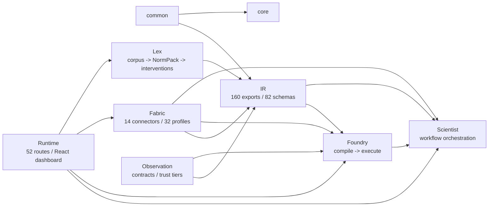

# Архитектура PolicyOS

## Обзор

PolicyOS строится как связка трёх основных уровней: данные и внешние источники собирает
`fabric`, вычислительную семантику даёт `foundry`, а запуск и governance-оркестрацию выполняет
`scientist`. Между ними лежит IR-слой: он фиксирует Trinity-контракты, ABI-совместимые модели и
ссылки на артефакты, чтобы один и тот же policy payload можно было валидировать, компилировать и
воспроизводить без неявных преобразований. Поверх этих слоёв `lex` добавляет legal pipeline, а
`runtime` открывает HTTP/control-plane и dashboard surfaces.

## Диаграмма зависимостей

## Слой IR

`polisyos.ir` — канонический контрактный слой системы. Сегодня он публикует 160 экспортов через
stable lazy facade и сопровождается 82 snapshot JSON Schema в `schemas/snapshots/ir/`. Здесь
живут Trinity (`ProblemFrame`, `PolicySpec`, `ModelSpec`, `TrinityBundle`), analytics contracts,
registry fragments и observation bundles, которые нужны и `foundry`, и `scientist`, и `fabric`.

IR intentionally тонкий: он валидирует, сериализует и линкует payload, но не исполняет policy
логику сам. Это позволяет менять execution/runtime surfaces без перелома ABI.

Reference: [IR](../reference/ir/index.md)

## Слой Foundry

`polisyos.foundry` превращает Trinity bundle в исполняемый план через `compile()` и затем выполняет
его через `execute()`. Foundry держит lowered IR, `ProgramGraph`, `ExecPlan`, patch/merge engine,
state snapshots и JAX-aware runtime helpers в одном вычислительном контуре.

Помимо compile/execute, здесь находятся measurement-aware calibration, uncertainty propagation,
methods catalog и agent simulation wiring. Этот слой остаётся вычислительным: I/O и orchestration
держатся выше или ниже по стеку.

Reference: [Foundry](../reference/foundry/index.md)

## Слой Scientist

`polisyos.scientist` оркестрирует workflow DAG вокруг Foundry и Fabric. В default и
causal-full сценариях он управляет preflight, compile, simulate, governance, decision packet и
replay/checkpoint flows.

Слой объединяет workflow launcher, node protocol, policy search, DOE/backtesting и governance
pipeline. В кодовой базе сейчас 19 built-in governance pass factories, а causal surface
расширяется узлами readiness, transportability, ensemble analysis и related runners.

Reference: [Scientist](../reference/scientist/index.md)

## Data Fabric

`polisyos.fabric` отвечает за внешний мир данных: коннекторы, ingestion, retrieval, world store,
evidence/provenance и DataSnapshot surfaces. В production surface сейчас 14 connector families, а
`builtin_profiles.py` определяет 32 source profiles с нормализацией в `SourceExecutionPolicy`.

Fabric связывает публичные APIs и файловые/табличные ingestion paths с каноническими контрактами.
Именно здесь данные превращаются в snapshot/evidence, которые потом попадают в Foundry и
Scientist.

Reference: [Fabric](../reference/fabric/index.md)

## Lex Pipeline

`polisyos.lex` обрабатывает юридический корпус: ingest, structure, versioning, NormPack assembly,
legal evaluation и what-if analysis. Для batch-пути добавлены amendment detection,
hallucination detection, entity/temporal resolution и quality filters.

Отдельная ветка `interventions.py` компилирует legal provisions в intervention payloads через
`LexInterventionCompiler` и `TemporalInterventionSequencer`, чтобы legal knowledge могло напрямую
питать policy design и simulation scenarios.

Reference: [Lex](../reference/lex/index.md)

## Runtime

`polisyos.runtime` открывает систему наружу через FastAPI и control-plane services. На текущем
срезе в `src/polisyos/runtime/http/routes` определено 52 route handlers, из них 29 относятся к
`/api/v1/control/*`, а остальное закрывает runs, artifacts, debug, auth и health.

Поверх API работает React/Vite runtime dashboard, который синхронизируется с runtime contracts и
использует generated API types как drift guard между backend и frontend.

Reference: [API](../reference/api/index.md)

## Cross-cutting concerns

- **Governance**: pass registry, preflight/postflight, human gate lifecycle и checkpoint/replay.
- **Security**: JWT, OPA, SPIFFE/SPIRE, audit chain, SBOM, TEE attestation.
  See [Security Model](security-model.md).
- **Observability**: OpenTelemetry tracing, metrics, determinism tracking and runtime telemetry.
