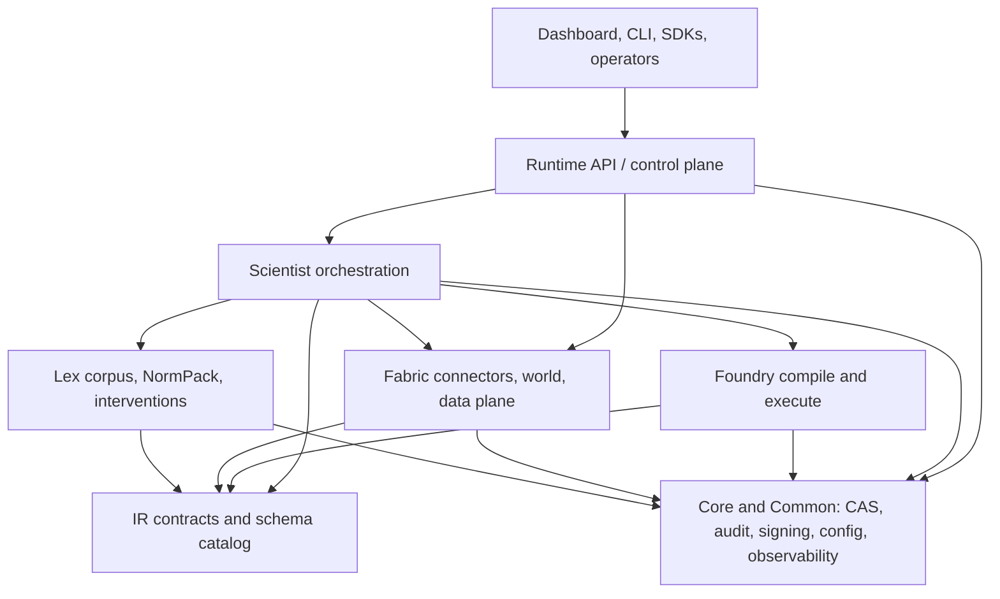

# Architecture Overview

Related reference: [Reference index](../reference/index.md), [operations diagrams](../reference/operations/platform-architecture-diagrams.md), [generated artifacts](../reference/generated-artifacts.md).
Related ADRs: [ADR-0096](../adr/0096-canonical-product-root-and-workspace-boundary.md), [ADR-0099](../adr/0099-runtime-lifecycle-and-di-container.md), [ADR-0101](../adr/0101-runtime-audit-trail-model.md).
Related contracts: [TRINITY](../contracts/TRINITY.md), [E1.4 core CAS and contracts](../contracts/E1_4_CORE_CAS_CANON_CONTRACTS_COMPONENTS.md), [E1.6 Scientist engine protocol](../contracts/E1_6_SCIENTIST_ENGINE_SKELETON_NODE_PROTOCOL.md).
Evidence: [Platform acceptance audit](../reference/operations/platform-acceptance-audit.md), [core runtime closeout](../reference/operations/core-runtime-closeout.md), [quality gates](../reference/quality-gates.md).

PolicyOS is organized around one rule: product layers can change at different
speeds, but they must exchange durable information through explicit contracts.
IR is the compatibility layer, CAS is the artifact boundary, and Runtime is the
delivery boundary.

## Container View

## Boundary Model

| Layer         | What it owns                                                              | What it does not own                                 |
| ------------- | ------------------------------------------------------------------------- | ---------------------------------------------------- |
| `IR`          | schemas, refs, compatibility rules, linking vocabulary                    | runtime delivery, connector IO, simulation execution |
| `Fabric`      | source profiles, ingestion, lineage, quality, world/data plane            | policy orchestration and method selection            |
| `Lex`         | legal ingest, versioning, NormPack assembly, intervention compilation     | runtime auth and simulation kernels                  |
| `Foundry`     | lowering Trinity into `ProgramGraph`, `ExecPlan`, and simulation evidence | workflow routing, publication gating                 |
| `Scientist`   | workflow selection, readiness, governance, decision artifacts             | connector protocols and runtime middleware           |
| `Runtime`     | HTTP surface, control-plane lifecycle, operator access                    | IR compatibility policy and method internals         |
| `Core/Common` | CAS, signing, audit, config, resilience, shared observability             | domain-specific policy logic                         |

## Generated Artifact Lifecycle

```mermaid
flowchart LR
    Input["ProblemFrame / PolicySpec / ModelSpec / data and legal refs"] --> Link["IR linking and validation"]
    Link --> Compile["Foundry compile -> ProgramGraph + ExecPlan"]
    Compile --> Bind["Fabric/Foundry input bindings and state snapshot"]
    Bind --> Execute["Foundry execute"]
    Execute --> Govern["Scientist governance and decision assembly"]
    Govern --> Publish["Decision packet / policy output bundle / governance accountability artifact"]
    Publish --> Audit["Audit package, signatures, retention, replay evidence"]
```

Every stage publishes refs into CAS instead of relying on in-memory handoffs.
That is what makes replay, audit assembly, and downstream verification possible.

## Why This Split Exists

- IR keeps compatibility, schema evolution, and transport policy out of product
  code paths that need to move faster.

- Fabric and Lex turn external evidence into typed artifacts before Scientist or
  Foundry can use it.

- Foundry can stay method-centric because Scientist owns routing, readiness, and
  publication-time governance.

- Runtime can fail closed on auth, tenant routing, and mutation control without
  having to understand domain-specific internals of every workflow.

## Default Versus Non-Default Capability

Published architecture pages describe the default contract. Experimental or
non-default capability families are linked from the relevant acceptance or
rollout docs rather than described here as current default behavior:

- [Foundry frontier methods](../reference/foundry/frontier-methods.md)
- [Scientist frontier runtime](../reference/scientist/frontier-runtime.md)
- [Scientist phase 4 acceptance](../reference/scientist/phase4-acceptance.md)

If a capability needs explicit rollout evidence, this page treats it as opt-in,
not as default platform posture.
