# Архітектура PolicyOS Policy Engine — повна технічна карта

> **Статус документа:** канонічний опис системи станом на 2026-05-08.
> **Аудиторія:** наукові керівники, аудитори, інженери, архітектори, дослідники публічної політики.
> **Мова:** українська (з технічними англомовними термінами там, де вони канонічні в коді).
> **Обсяг:** ~3500 рядків. Документ навмисно розгорнутий, без спрощень.
>
> **Пов'язані документи:**
> - [Reference index](../reference/index.md), [operations diagrams](../reference/operations/platform-architecture-diagrams.md), [generated artifacts](../reference/generated-artifacts.md)
> - ADR: [ADR-0096](../adr/0096-canonical-product-root-and-workspace-boundary.md), [ADR-0099](../adr/0099-runtime-lifecycle-and-di-container.md), [ADR-0101](../adr/0101-runtime-audit-trail-model.md), [ADR-0143](../adr/repository-structure-0143-decomposition-blueprint-contract.md)
> - Контракти: [TRINITY](../contracts/TRINITY.md), [E1.4 core CAS and contracts](../contracts/E1_4_CORE_CAS_CANON_CONTRACTS_COMPONENTS.md), [E1.6 Scientist engine protocol](../contracts/E1_6_SCIENTIST_ENGINE_SKELETON_NODE_PROTOCOL.md)
> - Свідчення: [Platform acceptance audit](../reference/operations/platform-acceptance-audit.md), [core runtime closeout](../reference/operations/core-runtime-closeout.md), [quality gates](../reference/quality-gates.md)

---

## Зміст

1. [Виконавче резюме](#1-виконавче-резюме)
2. [Філософія та архітектурні принципи](#2-філософія-та-архітектурні-принципи)
3. [Кількісний масштаб системи](#3-кількісний-масштаб-системи)
4. [Топологія шарів](#4-топологія-шарів)
5. [Production data corpus — 30 ГБ предобробленої доказової інфраструктури](#5-production-data-corpus--30-гб-предобробленої-доказової-інфраструктури)
6. [Шар IR — типізована мова обміну між шарами](#6-шар-ir--типізована-мова-обміну-між-шарами)
7. [Шар Lex — нормативний контур](#7-шар-lex--нормативний-контур)
8. [Шар Fabric — контур даних, спостережень і світу](#8-шар-fabric--контур-даних-спостережень-і-світу)
9. [Шар Foundry — методна бібліотека і compile/execute](#9-шар-foundry--методна-бібліотека-і-compileexecute)
10. [Шар Scientist — оркестрація, агенти, врядування](#10-шар-scientist--оркестрація-агенти-врядування)
11. [Шар Runtime — HTTP-фасад і control plane](#11-шар-runtime--http-фасад-і-control-plane)
12. [Шар Core / Common — інфраструктурна основа](#12-шар-core--common--інфраструктурна-основа)
13. [End-to-end workflow A — LLM-driven path](#13-end-to-end-workflow-a--llm-driven-path)
14. [End-to-end workflow B — human-specified Trinity bundle](#14-end-to-end-workflow-b--human-specified-trinity-bundle)
15. [Складні алгоритмічні цикли](#15-складні-алгоритмічні-цикли)
16. [Контентно-адресоване сховище і ланцюг артефактів](#16-контентно-адресоване-сховище-і-ланцюг-артефактів)
17. [Governance, аудит, підзвітність](#17-governance-аудит-підзвітність)
18. [Межі заявлень і свідомі обмеження](#18-межі-заявлень-і-свідомі-обмеження)
19. [Додатки](#19-додатки)

---

## 1. Виконавче резюме

PolicyOS Policy Engine — це **інтегрована обчислювальна інфраструктура для доказового дизайну публічної політики**. Її призначення — перетворити процес від «постанова КМУ → звіт про охоплення» на ланцюг типізованих, версіонованих, перевірюваних артефактів, у якому кожне твердження про ефективність втручання має явну правову, статистичну й методологічну підставу, фіксовані припущення, обмежені висновки та відтворюваний аудит.

Система **не замінює політичне рішення**. Вона дисциплінує шлях від проблемного формулювання до публічного висновку: фіксує, де саме виникає політичний розсуд, де припущення моделі, де обмеження даних, і де висновок не може бути зроблений без додаткової evidence-роботи.

### 1.1. Що PolicyOS робить

| Функція | Як реалізована |
| --- | --- |
| Формалізує задачу політики | Контракт **Trinity** = ProblemFrame + PolicySpec + ModelSpec; кожен блок має схему, версію, сумісність |
| Інтегрує правові норми | Шар **Lex** з `lex_knowledge_graph.duckdb` (134 849 документів, 156 196 amendments, 1.6 млн normative facts), pipeline `NormPack` для відбору та компіляції правил |
| Інтегрує статистичні дані | Шар **Fabric** з `dataset_catalog.duckdb` (137 176 датасетів, 3.7 млн спостережень, 56 846 metric bindings, HNSW-індекс на 549 МБ ембеддингів) |
| Інтегрує академічні докази | Бандл `policyos_academic_runtime_slim` з `scholar_knowledge.duckdb` (310 829 робіт, 7 868 каузальних claims, SKG-граф, transport scores) |
| Симулює агентний світ | Бандл `ukraine_agent_simulation_baseline` (439 398 агентів, 642 клітинки, 5 графів: бюджет/закупівлі/торгівля/публічні послуги/distress) |
| Виконує каузальні методи | Шар **Foundry** з registry на 389 методів, типізованих через CapabilityContract |
| Оркеструє workflow | Шар **Scientist** з LangGraph-движком, 37+ типами вузлів, governance-pipeline, replay/checkpoint/budget-ledger |
| Доставляє через HTTP API | Шар **Runtime** з FastAPI, OpenAPI-схемою, control-plane endpoints |
| Зберігає артефакти | **Core/Common**: FileSystemCAS (content-addressed), audit-chain, signing, observability |

### 1.2. Що PolicyOS НЕ робить (явні обмеження за дизайном)

- **Не приймає політичних рішень.** Будь-який висновок системи — це «допустимо до використання як один із входів для людини»; не «рекомендація уряду».
- **Не публікує точкових каузальних оцінок без identification.** Якщо хоча б один із чотирьох кроків ідентифікації блокується (define_treatment / define_outcome / adjustment_set / microdata_requirement), система видає `HedgeCertificate` замість оцінки.
- **Не перевизначає правових норм.** Lex обчислює `legal_compatibility` як індикатор; правовий висновок робить уповноважений суб'єкт (юридичний департамент, суд).
- **Не замінює мікроданих агрегатами.** Якщо applicant-level дані відсутні, система залишається на рівні семисинтетичного бенчмарку і прямо це фіксує.
- **Не приховує обмежень.** Кожен decision packet містить `claim_boundary`, кожен ablation-варіант — `binding dropouts`.

### 1.3. Масштаб у цифрах (станом на травень 2026)

| Вимір | Кількість |
| --- | --- |
| Загальний обсяг Python-коду | **~770 000 рядків** у 14 пакетах |
| Кількість Python-файлів у `src/polisyos/` | **2 578** |
| Кількість тестових файлів | **1 866** (1 669 unit, 112 repo_quality, 39 property, 20 contract, 15 integration, 10 performance, 1 e2e) |
| Кількість документів у `docs/` | **532** Markdown файли |
| Кількість ADR (Architecture Decision Records) | **163** записи |
| Загальний обсяг production_data | **~32 ГБ** на диску |
| Обсяг Lex knowledge graph DB | **18 ГБ** (DuckDB, 21 таблиця, 6+ млн provisions) |
| Обсяг canonical local data | **6.3 ГБ** |
| Обсяг academic runtime (slim) | **3.2 ГБ** (scholar_knowledge.duckdb 2.2 ГБ + HNSW + transport scores) |
| Обсяг Ukraine agent simulation baseline | **1.3 ГБ** core + heavy graph addon ~660 МБ |
| Зареєстрованих Foundry-методів | **389** (живий каталог) |
| Каузальна родина методів | **231 файл** + capability contract |
| Scientist workflow nodes | **37+** (планування, причинність, симуляція, governance, decision) |

### 1.4. Які питання система здатна відповісти

PolicyOS дисциплінує відповіді на 6 типів питань (відображаються в гіпотезах H1–H6 диплома):

1. **H1 — Формалізація.** Чи можна задачу політики X перетворити на машиночитаний пакет із ProblemFrame, PolicySpec, ModelSpec без втрати семантики, з явним реєстром двозначностей?
2. **H2 — Каузальний контур.** Чи здатна система розрізнити допустимий, обмежений і недопустимий каузальний висновок, не імітуючи точкову оцінку, коли ідентифікація неможлива?
3. **H3 — Переносимість.** Чи можна докази з контексту А (наприклад, мирна Естонія) застосувати до контексту Б (воєнна Україна 2026), і з якою мірою впевненості?
4. **H4 — Робастне ранжування.** Чи дають різні методи MCDA узгоджений результат на одних і тих самих даних, і які пари політик статистично нерозрізнювані?
5. **H5 — Сценарна симуляція.** Як топ-політики поводяться під різними макроумовами (baseline, intensified_conflict, partial_recovery), і які з них «крихкі»?
6. **H6 — Аудит, недискримінація, відтворюваність.** Чи ловить система навмисно дискримінаційні політики, чи будує хеш-цепочку артефактів, чи дозволяє повторне виконання однією командою?

### 1.5. Важлива застереження щодо дизайну експериментів

Експерименти, описані у квалифікаційній роботі (`msme_final_fresg_evaluation_v3_20260501`), були сплановані під дедлайном і логікою академічної роботи. Це призвело до:
- свідомо спрощеної форми Trinity (`trinity_like_policy_artifacts.jsonl`) замість повного компілятора через `polisyos.foundry.compile.api.compile`;
- **відкладеного Lex-обогащення**: pipeline `lex-amendment-only-optimized-20260501-v3` був завершений (18 ГБ DB зібрано), але для конкретного експериментального запуску evidence-сниппети у `runs_dir` не були прокинуті, тому всі 192 політики отримали `legal_posture: "missing"`;
- семисинтетичного causal benchmark замість applicant-level мікроданих ДПС/Держстату/банків;
- виконання лише 1 frontier-методу (BayesianBART) із 389 у каталозі.

Цей документ описує **істинний масштаб системи**, а не лише те, що було задіяне в експерименті. Те, що в експерименті не активовано, тут описано окремо як «доступна, але не активована можливість» — щоб різниця між «архітектурно є» і «в дедлайн-запуску використано» була явною.

---

## 2. Філософія та архітектурні принципи

PolicyOS побудована на восьми наскрізних принципах. Усі вони — наслідки одного метапринципу: **правда системи має бути контестабельною, а не декларативною**. Кожен ярлик («admissible», «proxy_supported», «insufficient_support») мусить мати джерело, обчислюваний поріг і шлях оскарження.

### 2.1. Принцип 1: Контракти раніше за реалізації

У великій системі з 14 пакетами і 770 тис. рядків коду неможливо координувати зміни без явних типізованих кордонів. PolicyOS реалізує це через **шар IR** (Intermediate Representation) — це не серіалізаційний формат, а *мова обміну* між шарами.

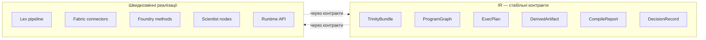

Що це дає на практиці:
- **Lex pipeline** може мігрувати з PostgreSQL на DuckDB без змін у Foundry — головне, що `NormativeFact` як IR-тип залишається стабільним.
- **Foundry method registry** може додати новий каузальний метод без змін у Scientist — головне, що метод реалізує `CausalCapabilityContract`.
- **Scientist workflows** можуть переключатися між движками (LangGraph / simple / langgraph_with_compensation) без змін у HTTP-API — головне, що `ExperimentState` як контракт стабільний.

Ключовий ADR — [ADR-0143](../adr/repository-structure-0143-decomposition-blueprint-contract.md): «contract-first decomposition».

### 2.2. Принцип 2: CAS як межа артефактів

**Content-Addressed Storage** (CAS) — це не оптимізація, а **семантичний кордон**. Кожен значущий артефакт системи зберігається з ідентифікатором `sha256:<hex>`, який детермінується вмістом. Це означає:

- **Незмінність як інваріант.** Якщо `sha256:171f3da2779d…` посилається на `data_snapshot`, то цей snapshot ніколи не зміниться під цим іменем. Якщо вміст змінюється — створюється новий artifact_id, і всі вхідні референси на старий залишаються валідними.
- **Замовчувано-замінюваність неможлива.** Атакувальник або помилковий код не може «підмінити» дані під артефактом — будь-яка зміна виявляється через зміну хеша.
- **Граф провенансу.** Кожен derived-artifact (наприклад, `program_graph_ref`) посилається на input-артефакти (наприклад, `trinity_bundle_ref`, `registry_bundle_ref`). Це робить аудит-ланцюг тривіальним: пройти від `final_decision_packet` назад до `input_manifest` через хеші.
- **Дедуплікація як побічний ефект.** Якщо два запуски згенерували ідентичний `ProgramGraph`, він зберігається один раз.

Реалізація — `polisyos.core.artifacts.store.FileSystemCAS` з `PutOptions`, `ArtifactRef`, `InputRef`, `SchemaInfo` (контракти в `polisyos.core.artifacts.manifest`).

### 2.3. Принцип 3: Layered defaults vs explicit opt-in

PolicyOS має **дві категорії спроможностей**:

| Категорія | Семантика | Приклад |
| --- | --- | --- |
| **Default capability** | Працює замовчувано, описана в публічних архітектурних документах | TOPSIS у robust ranking, FileSystemCAS, audit-chain |
| **Frontier / opt-in capability** | Експериментальна, потребує явного активування через прапорець `--enable-*` або config | BayesianBART, scientist frontier_runtime, frontier methods catalog |

Цей поділ дисциплінує: документація `docs/explanation/` описує дефолтну поведінку платформи; експериментальні можливості документуються в `docs/reference/foundry/frontier-methods.md` та `docs/reference/scientist/frontier-runtime.md`.

### 2.4. Принцип 4: Replay-by-default

**Будь-який значущий обчислювальний крок системи має бути replay-able.** Реалізується через комбінацію:

1. **Detrministic seeds.** Шар Foundry використовує `TreasuryPlan` (`src/polisyos/foundry/mechanisms/treasury.py`) — це детерміністичний seed plan із `root_seed` + `node_salts` + `stream_salts`, який забезпечує, що один і той самий ProgramGraph дасть біт-в-біт однаковий вивід.
2. **Snapshot-based world.** Fabric-шар фіксує `data_snapshot_artifact_id: sha256:171f3da2779d…` — це означає, що weather/economy/agents/cells на момент компіляції зафіксовані; навіть якщо джерело даних оновиться через 5 хвилин, replay використає той самий snapshot.
3. **Replay engine.** `polisyos.runtime.replay` + `polisyos.scientist.replay.backend` дозволяють виконати раніше записаний run з тими самими хешами входів.
4. **Replay command artifact.** Будь-який експеримент пише `replay_command.sh` — однорядкову команду, яка повторює ввесь run.

### 2.5. Принцип 5: Honest failure modes

Система навмисно проектована так, щоб **бути боягузливою у непевних випадках**. Конкретно:

- Якщо `legal_compatibility < 0.5` → політика отримує `binding dropout` у `no_lex` ablation, а не «штраф у скорі».
- Якщо `transport_score < 0.58` → вердикт `insufficient_support`, не «оцінка з низькою впевненістю».
- Якщо `microdata_requirement` блокується → `HedgeCertificate` замість точкової каузальної оцінки.
- Якщо bootstrap-CI пересікається з нижнім порогом → автоматичний downgrade вердикту (`proxy_only_ci_downgrade`).
- Якщо primary estimands = 0 → стадія E10 sensitivity surface виходить з порожніми CSV (а не з імітованими числами).

### 2.6. Принцип 6: Determinism as a tier

Не всі методи однаково детерміністичні. Foundry-каталог явно класифікує кожен метод за `DeterminismTier`:

| Tier | Семантика | Приклад методу |
| --- | --- | --- |
| `bitwise` | Біт-в-біт ідентичний вивід при ідентичних входах | OLS, простий IPW |
| `tolerance_bounded` | Однаковий у межах заданого толеранс-бюджету | TMLE, AIPW, RF-based learners |
| `seed_dependent` | Детермінований лише при зафіксованому seed | Bayesian samplers, BART |
| `non_deterministic` | Не гарантує відтворюваність (зовнішній API, GPU race) | LLM-генерація, frontier deep models |

### 2.7. Принцип 7: Truthfulness scope

Окрема осі категоризації — **scope правди**, який метод може стверджувати. У `polisyos.core.observability.truthfulness`:

| Tier | Що метод стверджує |
| --- | --- |
| `descriptive` | Описує наявні дані без каузальних претензій |
| `predictive` | Робить прогнози, не пояснює механізми |
| `causal_associational` | Стверджує асоціацію з контролем за змінними |
| `causal_identified` | Стверджує каузальний ефект з явними identification assumptions |
| `causal_robust` | + sensitivity bounds, + transport verdict |

Метод не може заявити вищий tier, ніж декларує його `entry.metadata.truthfulness_tier`. Це і є те, що блокує overclaim-и: TOPSIS не може видати каузальну оцінку.

### 2.8. Принцип 8: Every claim has a refutation path

Для кожного типу висновку, який система видає, є **явний шлях оскарження** (recourse / contestability):

| Висновок | Як оскаржити |
| --- | --- |
| Топ-1 у robust ranking | Перевірити CI у `robust_score_cis.csv`; якщо CI пересікаються — вердикт «statistically tied» |
| Каузальна оцінка | Перевірити `identification_proof_chain.json`, `e_values_per_estimand.csv`, `rosenbaum_bounds_grid.csv` |
| Transportability admissible | Перевірити `support_factor_matrix.csv`, переглянути `missing_support_factors.md` |
| Fairness approve | Перевірити `disparate_impact_bounds.csv`, `recourse_atlas.jsonl`, `contestability_packets.jsonl` |
| Будь-який висновок | Виконати `replay_command.sh` з оригінальними хешами; перевірити `audit_chain.json` |

Це і є реалізація принципу Parkhurst's *good governance of evidence*: технічна якість + демократична оспорюваність.

---

## 3. Кількісний масштаб системи

### 3.1. Розмір кодової бази по пакетах

PolicyOS складається з 14 основних пакетів у `src/polisyos/`. Розподіл рядків коду демонструє, де концентрується інженерна складність системи.

| Пакет | Рядків коду (Python) | Призначення |
| --- | ---: | --- |
| `foundry` | **304 441** | Найбільший шар: 389 методів, compile/execute, mechanisms, методні родини, capability contracts |
| `scientist` | **181 559** | Оркестрація, агенти, governance, workflows, replay, autotune, decision validity |
| `data_forge` | **108 577** | Канонічна обробка джерел даних, доменні адаптери (raw → ds_observations) |
| `fabric` | **79 598** | Connectors, world materialization, evidence, identity resolution, retrieval, trust |
| `ir` | **78 724** | Інтермедіальна репрезентація: схеми, контракти, linker, governance, model_layer, world IR |
| `core` | **41 545** | CAS, audit, signing, observability, resilience, security, compiler, registry, contracts |
| `runtime` | **29 922** | HTTP API (FastAPI), control plane, replay, manifest, OpenAPI codegen |
| `lex` | **10 998** | Нормативний шар: knowledge graph, NormPack, intervention compilation, factlog |
| `scholar` | **5 925** | Discover/search через academic SKG; freshness store; provenance |
| `berl` | **3 231** | Specifically для evaluation contracts (perturbations, benchmarks, metrics) |
| `calibration` | **2 482** | Scikit-learn-сумісні calibration adapters (continuous, multiclass, recalibration) |
| `ddm` | **2 452** | Drift detection model: contracts, detectors, integration, readiness |
| `common` | **1 350** | Загальні утиліти, що не належать одному пакету |
| `schemas` | **804** | Експортовані JSON-схеми для контрактів |
| `synthetic_world` | **59** | Точка розширення для синтетичного світу (мінімальна) |
| **Разом** | **~852 000** | Включно з тестами та докстрингами |

### 3.2. Файлова структура

```
policy-engine/
├── src/polisyos/                  # 14 пакетів, 770k LOC, 2578 .py файлів
├── tests/                         # 19 МБ
│   ├── unit/                      # 1669 тестів
│   ├── integration/               # 15 тестів
│   ├── property/                  # 39 hypothesis-based тестів
│   ├── contract/                  # 20 contract тестів
│   ├── performance/               # 10 benchmarks
│   ├── repo_quality/              # 112 тестів якості репозиторію
│   ├── e2e/                       # 1 e2e тест
│   ├── _data/, _golden/, _helpers/  # фікстури і допоміжні
│   └── tools/, lint/              # утиліти для тестів
├── tools/                         # 7.2 МБ
│   ├── ops_runners/experiments/   # MSME experiments runners (v1, v2, v3, addendum)
│   ├── ops_runners/cloud/         # cloud deployment
│   ├── ops_runners/calibration/   # calibration runs
│   ├── ops_runners/release/       # release tooling
│   ├── ops_runners/ukraine_data/  # Ukraine baseline assembly
│   ├── ci/, devx/, design/        # dev tooling
│   └── quality/, research/        # quality checks і research scripts
├── docs/                          # 13 МБ, 532 MD файли
│   ├── explanation/               # архітектурні та концептуальні документи
│   ├── reference/                 # довідкова інформація
│   ├── adr/                       # 163 Architecture Decision Records
│   ├── contracts/                 # стабільні контракти (TRINITY.md, E1.4, E1.6)
│   ├── tutorials/, how-to/        # навчальні матеріали
│   └── decisions/, governance/    # рішення команди
├── apps/                          # 833 МБ — кінцеві застосунки (включно з кешем)
├── ops/                           # 1.7 МБ — operational tooling
├── benchmarks/                    # 6.9 МБ — еталонні бенчмарки
├── examples/                      # 268 КБ — приклади використання
├── schemas/                       # 3.1 МБ
│   ├── api/, runtime_api_v1.openapi.json
│   ├── snapshots/                 # JSON-схеми для всіх IR-контрактів (131 файл)
│   ├── artifacts/, codegen/, events/, fabric/, manifests/, ops/, topology/
├── frontend/                      # 4 КБ (placeholder)
├── packages/                      # workspace packages
├── design/, architecture/         # design документи
├── data/                          # тестові дані
├── _build/, _cache/               # build artifacts (gitignored)
├── release/, release-fragments/   # release tooling
├── pyproject.toml, pytest.ini, ruff.toml, mypy.ini, basedpyright.toml
├── package.json, pnpm-lock.yaml, pnpm-workspace.yaml
├── uv.lock, uv.toml               # uv як менеджер залежностей
├── Dockerfile.reproducible        # reproducible build
├── install.sh, migrate.py, jax_bootstrap.py
└── README.md, CHANGELOG.md, CHANGELOG-DESIGN.md, LICENSE, CONTRIBUTING.md
```

### 3.3. Тестова інфраструктура

PolicyOS має **1866 тестових файлів** — більше, ніж половина обсягу основного коду. Це означає **співвідношення тест/код ≈ 1:1.4** (важлива метрика інженерної якості).

| Категорія тестів | Кількість файлів | Що тестує |
| --- | ---: | --- |
| `unit/` | 1 669 | Окремі функції, методи, класи |
| `repo_quality/` | 112 | Інваріанти структури репозиторію (ADR-compliance) |
| `property/` | 39 | Hypothesis-based: властивості функцій на згенерованих входах |
| `contract/` | 20 | Stable contracts між пакетами |
| `integration/` | 15 | Кілька пакетів разом |
| `performance/` | 10 | Бенчмарки часу/пам'яті |
| `e2e/` | 1 | Повний наскрізний прогін |

### 3.4. ADR — інженерна історія системи

163 ADR-записи — це навмисний вибір: PolicyOS не має «прихованих рішень». Кожна важлива архітектурна зміна має документ із форматом «контекст → проблема → варіанти → рішення → наслідки».

Останні 20 ADR (структура репозиторію):
- ADR-0130 — workspace boundary
- ADR-0131 — build cache umbrella
- ADR-0132 — architecture governance source
- ADR-0133 — package layout budget
- ADR-0134 — cross-package name registry
- ADR-0135 — versioning out-of-package names
- ADR-0136 — foundry methods flat vs catalog
- ADR-0137 — production-data fixtures
- ADR-0138 — synthetic-world / agent-sim
- ADR-0139 — calibration canonical home
- ADR-0140 — pickle checkpoint compatibility
- ADR-0141 — dynamic import registry
- ADR-0142 — libcst module-move codemod
- ADR-0143 — decomposition blueprint contract
- ADR-0144 — JAX/Pydantic registration re-export shims
- ADR-0145 — import cycle baseline
- ADR-0146 — foundry execute/executor naming
- ADR-0147 — data root local-state naming
- ADR-0148 — cross-cutting concern canonical homes

Інженерно це означає: **зміни в системі дисципліновані документально**, тому будь-який аудитор може реконструювати, *чому* певний компонент саме такий.

---

## 4. Топологія шарів

### 4.1. Шарова діаграма верхнього рівня

```mermaid
flowchart TB
    subgraph clients["Клієнти"]
        Dashboard[Dashboard / SDK]
        CLI[CLI tools]
        Operators[Operators / scripts]
        ResearchUsers[Researchers]
    end

    subgraph runtime["Runtime / Control Plane"]
        HTTP[FastAPI HTTP surface]
        ControlPlane[Control plane endpoints]
        ReplayEngine[Replay engine]
    end

    subgraph scientist["Scientist — orchestration"]
        EngineLG[LangGraph engine]
        EngineSimple[Simple engine]
        Workflows[Workflow registry]
        Nodes[37+ workflow nodes]
        GovernancePipeline[Governance pipeline]
        Agents[LLM agents: Drafter, Critic, Adversary, Translator]
        ReplayBackend[Scientist replay backend]
    end

    subgraph foundry["Foundry — methods + compile/execute"]
        Compile[compile_trinity API]
        Lower[Lower mechanisms]
        ProgramGraph[ProgramGraph builder]
        ExecPlan[ExecPlan derivation]
        Executor[Execute runtime]
        Methods[389-method registry]
        TreasuryPlan[TreasuryPlan]
        SlotLayout[Slot layout]
    end

    subgraph fabric["Fabric — data + world"]
        Connectors[Source connectors]
        Catalog[Dataset catalog]
        WorldStore[World store]
        Evidence[Evidence retrieval]
        Quality[Quality checks]
        Trust[Trust tiers]
    end

    subgraph lex["Lex — normative layer"]
        Ingest[Legal ingest]
        KnowledgeGraph[Knowledge graph DB]
        Versioning[Version index]
        NormPack[NormPack assembly]
        InterventionCompile[Intervention compilation]
    end

    subgraph ir["IR — contracts"]
        Schemas[JSON-schema snapshots]
        TrinityContracts[Trinity contracts]
        Linker[IR linker]
        Refs[Refs / IDs]
    end

    subgraph core["Core / Common — infrastructure"]
        CAS[FileSystemCAS]
        Audit[Audit chain]
        Signing[Signing]
        Config[Config]
        Resilience[Resilience]
        Observability[Observability]
        Trace[Tracing]
    end

    subgraph data["Production data — 30 GB"]
        LexDB[(lex_knowledge_graph.duckdb 18GB)]
        DatasetDB[(dataset_catalog.duckdb 1.2GB)]
        ScholarDB[(scholar_knowledge.duckdb 2.2GB)]
        Embeddings[(HNSW + .npz 1.1GB)]
        UkraineBundle[(Ukraine agent baseline 1.3GB)]
        CanonicalLocal[(Canonical local data 6.3GB)]
        AcademicMeta[(Academic transport_scores)]
    end

    clients --> HTTP
    HTTP --> ControlPlane
    HTTP --> ReplayEngine
    ControlPlane --> EngineLG
    ControlPlane --> EngineSimple
    EngineLG --> Workflows
    Workflows --> Nodes
    Nodes --> GovernancePipeline
    Nodes --> Agents

    Nodes --> Compile
    Compile --> Lower --> ProgramGraph --> ExecPlan
    ExecPlan --> Executor
    Executor --> Methods
    Compile --> TreasuryPlan
    Compile --> SlotLayout

    Nodes --> Connectors
    Nodes --> Catalog
    Nodes --> WorldStore
    Nodes --> Evidence
    Connectors --> Quality --> Trust

    Nodes --> Ingest
    Nodes --> KnowledgeGraph
    Nodes --> NormPack
    NormPack --> InterventionCompile

    Compile --> TrinityContracts
    Methods --> Schemas
    Connectors --> Schemas
    KnowledgeGraph --> Schemas

    Compile --> CAS
    Catalog --> CAS
    KnowledgeGraph --> CAS
    Executor --> CAS
    GovernancePipeline --> Audit
    Audit --> Signing

    KnowledgeGraph --> LexDB
    Catalog --> DatasetDB
    Catalog --> Embeddings
    Evidence --> ScholarDB
    Evidence --> AcademicMeta
    WorldStore --> UkraineBundle
    Connectors --> CanonicalLocal

    Compile --> Trace
    Executor --> Observability
    Nodes --> Resilience
    Workflows --> Config
```

### 4.2. Boundary model — що кожен шар володіє

| Шар | Володіє | Не володіє |
| --- | --- | --- |
| **IR** | Схеми, refs, правила сумісності, словник зв'язування | Runtime delivery, connector IO, simulation execution |
| **Lex** | Legal ingest, версіонування, NormPack, intervention compilation | Runtime auth, simulation kernels |
| **Fabric** | Source profiles, ingestion, lineage, quality, world / data plane | Policy orchestration, method selection |
| **Foundry** | Lowering Trinity → ProgramGraph + ExecPlan, simulation evidence, методи | Workflow routing, publication gating |
| **Scientist** | Workflow selection, readiness, governance, decision artifacts | Connector protocols, runtime middleware |
| **Runtime** | HTTP surface, control-plane lifecycle, operator access | IR compatibility policy, method internals |
| **Core/Common** | CAS, signing, audit, config, resilience, observability | Domain-specific policy logic |

### 4.3. Direction of dependencies — критичний інваріант

PolicyOS навмисно дотримується **односпрямованого графу залежностей**: верхні шари (Runtime, Scientist) можуть залежати від нижніх (Foundry, Fabric, Lex, IR, Core); нижні шари — ніколи від верхніх. Це інваріант, що перевіряється в `tests/repo_quality/` через `import-linter` та custom analyzers.

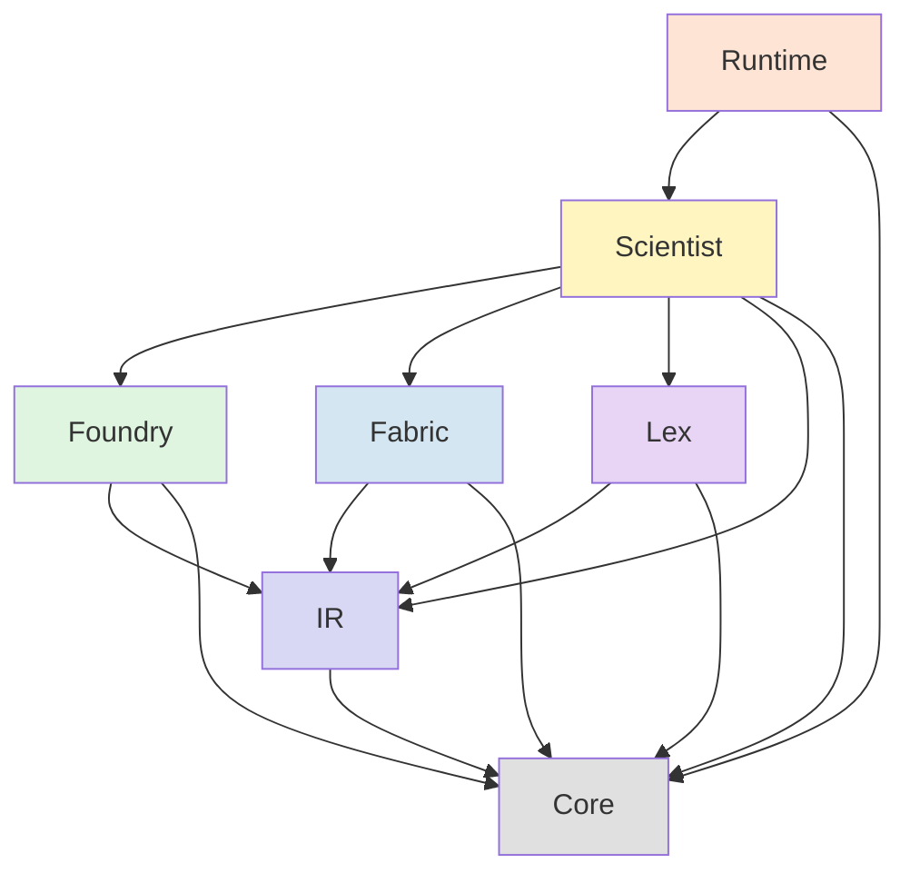

Якщо хтось додає `from polisyos.runtime import …` у `polisyos.foundry.*` — це порушення архітектурного інваріанту, і CI блокує merge. Цей рівень дисципліни нетиповий для академічних проектів і характерний для production-grade платформ.

### 4.4. Жит­тєвий цикл артефакту — від запиту до аудиту

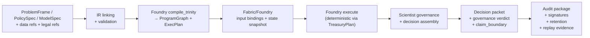

Кожен крок публікує refs у CAS замість in-memory передачі. Це й робить replay, аудит, та downstream-перевірку можливими.

### 4.5. Чому такий поділ існує

- **IR** тримає сумісність, еволюцію схем і transport policy окремо від коду продукту, який має рухатись швидше.
- **Fabric і Lex** перетворюють зовнішні докази на типізовані артефакти, перш ніж Scientist чи Foundry зможуть їх використати.
- **Foundry** може лишатися метод-центричним, бо Scientist володіє рутингом, готовністю та publication-time governance.
- **Runtime** може fail-closed на auth, tenant routing і mutation control, не розуміючи domain-специфічних внутрішностей кожного workflow.
- **Core/Common** дає одне місце для CAS, signing, audit; решта шарів просто використовує контракти.

---

## 5. Production data corpus — 30 ГБ предобробленої доказової інфраструктури

PolicyOS поставляється з **повноцінним корпусом доказів**, заздалегідь зібраним і нормалізованим. Цей корпус — критична частина платформи: без нього система була б демонстраційною, а не доказовою. Загальний обсяг — близько 32 ГБ на диску, розподілений по чотирьох основних компонентах.

### 5.1. Загальна структура `production_data/`

| Компонент | Розмір | Призначення |
| --- | ---: | --- |
| `lex/` | **20 ГБ** | Lex amendment-only optimized: knowledge graph всього корпусу нормативних актів |
| `canonical/` | **6.3 ГБ** | Канонічні локальні дані (нарізки публічних реєстрів) |
| `policyos_academic_runtime_slim_*/` | **3.2 ГБ** | Academic SKG: 310k робіт, transport scores, embeddings |
| `ukraine_agent_simulation_baseline_*/` | **1.3 ГБ** + **660 МБ** heavy graphs | Ukraine ABM baseline: 439k агентів, 5 графів |
| `dataset_catalog.duckdb` | **1.2 ГБ** | Реєстр 137k датасетів, 3.7M спостережень |
| `ds_dataset_index.hnsw` | **564 МБ** | HNSW-індекс семантичного пошуку датасетів |
| `ds_dataset_embeddings.npz` | **549 МБ** | Ембеддинги датасетів (numpy, .npz) |
| `all_records.jsonl` | **733 МБ** | Усі merged-записи датасетів у JSONL |
| `manifest.json`, `qc_report.json`, `consumer_readiness.json`, `benchmark_report.json` | <1 МБ | Метадані, QC, readiness |

### 5.2. Lex corpus — 20 ГБ нормативного знання

**Шлях:** `production_data/lex/lex-amendment-only-optimized-20260501-v3/`

#### 5.2.1. Структура

```
lex-amendment-only-optimized-20260501-v3/
├── amendment_only_summary.json   (4 КБ)
├── finalize/
│   ├── benchmark_report.json     (12 КБ)
│   ├── claim_exports/
│   │   ├── normative_claims.jsonl              (1.9 ГБ)
│   │   └── normative_claims_summary.json       (4 КБ)
│   ├── lex_knowledge_graph.duckdb              (18 ГБ)
│   └── qc_report.json            (52 КБ)
└── logs/                         (524 КБ)
```

#### 5.2.2. `amendment_only_summary.json` — параметри pipeline

```json
{
  "mode": "amendment_only_parallel",
  "doc_metadata_total": 134849,
  "workers": 12,
  "task_chunk": 64,
  "amendments": 156196,
  "amendments_with_target": 104543,
  "amendment_docs_total": 48785,
  "amendment_docs_with_target": 36997,
  "final_lex_amendments_count": 156196,
  "elapsed_seconds": 8994.469,        // ≈ 2.5 години
  "provision_docs_per_second": 14.992
}
```

#### 5.2.3. `lex_knowledge_graph.duckdb` — 21 таблиця, 18 ГБ

| Таблиця | Кількість рядків | Що містить |
| --- | ---: | --- |
| `lex_amendments` | **156 196** | Усі поправки до нормативних актів, прив'язані до target-документу |
| `lex_consistency_issues` | 0 | Виявлені суперечності (порожньо в цьому запуску) |
| `lex_doc_domains` | **222 604** | Належність документу до доменів (фінансове право, податкове, бюджетне, …) |
| `lex_doc_temporal` | **134 849** | Часова дійсність документів |
| `lex_doc_versions` | **134 849** | Версії документів |
| `lex_entities` | **357 742** | Сутності, видобуті з тексту (юридичні особи, дати, грошові суми, посилання) |
| `lex_fact_candidates` | 27 215 | Кандидати на факти, що ще не пройшли валідацію |
| `lex_fact_grounded` | **1 953 041** | Факти, прив'язані до конкретних provision (підзаконних положень) |
| `lex_facts` | **1 980 256** | Усі видобуті факти |
| `lex_high_confidence_norms` | **1 443 585** | Норми з високою впевненістю extraction'а |
| `lex_normative_facts` | **1 604 211** | Структуровані нормативні факти (subject + obligation/permission/prohibition + context) |
| `lex_normative_ready_facts` | **1 604 211** | Те саме, готове до інтеграції в NormPack |
| `lex_pattern_feedback_queue` | 0 | Черга для feedback patterns (порожньо) |
| `lex_provisions` | **6 074 716** | Окремі parsed provisions (статті, частини, абзаци) — атомарна одиниця права |
| `lex_reference_edges` | 73 793 | Ребра графу посилань між документами |
| `lex_reference_resolution_audit` | 73 793 | Аудит resolution посилань |
| `lex_references` | 84 271 | Сирі посилання |
| `lex_rule_clauses` | **409 108** | Розпарсені clauses нормативних правил |
| `lex_rule_links` | 115 612 | Зв'язки між clauses |
| `lex_rule_thresholds` | **374 516** | Виявлені числові пороги в нормах (ставки, обмеження, ліміти) |
| `lex_temporal_audit` | **1 923 162** | Часовий аудит фактів (коли вступив у силу, коли скасовано) |

**Сумарно у Lex:** 134 849 документів → 6 074 716 provisions → 1 604 211 normative facts (готових до використання) → 156 196 amendments як окремий шар.

#### 5.2.4. Формат `normative_claims.jsonl` (1.9 ГБ)

`claim_exports/normative_claims.jsonl` містить **1 604 211 normative claims** у JSONL-форматі. Кожен рядок — окремий формалізований нормативний факт. Це *operational* output, який далі споживається NormPack assembly.

Кожен claim містить (приблизна структура за summary):
- `claim_id` — стабільний ID
- `subject` — кому адресовано
- `modality` — `obligation` | `permission` | `prohibition`
- `target_action` — що треба робити / можна / заборонено
- `condition` — за яких умов
- `provision_ref` — посилання на конкретне положення
- `temporal_validity` — період дії
- `confidence` — впевненість extraction
- `evidence_refs` — посилання на сирий текст

#### 5.2.5. Як Lex використовується далі

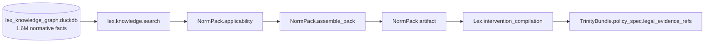

**Pipeline `NormPack`:**
1. `select_sources.py` — обирає правові джерела на основі `policy_intent`
2. `applicability.py` — фільтрує за часом, юрисдикцією, доменом
3. `extract_norm_claims.py` — витягує relevant claims із DuckDB
4. `assemble_pack.py` — збирає фінальний пакет (NormPack)
5. `interventions.py` + `intervention_artifacts.py` — компілює інтервенції з прив'язкою до правових норм

#### 5.2.6. ⚠ Що сталося в експерименті

У дедлайн-запуску 30.04.2026 cloud VM очікувала на читання evidence-сниппетів із `runs_dir/H1_formalization/legal_source_pack.jsonl` та `runs_dir/S1_policy_intent_agent_loop/retrieval_evidence.jsonl`, які мали бути попередньо згенеровані pipeline'ами H1 і S1 з цього самого Lex DB. Pipeline'и не встигли пройти до часу запуску → файли в `runs_dir` відсутні → `collect_legal_snippets` повернула порожній список → всі 192 політики отримали `legal_evidence_refs = []`.

**Архітектурно Lex шар присутній і повний; емпірично у запуску він не активувався.** Абляція `no_lex` показала ціну цього: 53 з 192 політик не пройшли binding-перевірку правової сумісності.

### 5.3. Datasets corpus — 1.2 ГБ DuckDB + 1.1 ГБ embeddings

**Шлях:** `production_data/dataset_catalog.duckdb` + `ds_dataset_embeddings.npz` + `ds_dataset_index.hnsw`

#### 5.3.1. `dataset_catalog.duckdb` — 10 таблиць

| Таблиця | Кількість рядків | Що містить |
| --- | ---: | --- |
| `ds_datasets` | **137 176** | Метадані датасетів (title, description, source, keywords, themes, geographic/temporal coverage) |
| `ds_distributions` | **605 408** | Розподіли (CSV, API, XLS, RDF, JSON, …) |
| `ds_metric_bindings` | **56 846** | Прив'язки метрик до датасетів |
| `ds_schema_profiles` | **176 249** | Профілі схем (виявлені колонки + типи) |
| `ds_registry_datasets` | 28 243 | Registry-level датасети (вищий рівень абстракції) |
| `ds_variable_alignments` | 20 326 | Узгодження змінних між джерелами |
| `ds_alignment_audit` | 20 326 | Аудит alignments |
| `ds_observations` | **3 708 006** | Окремі спостереження (метрика, час, географія, значення) |
| `ds_entity_mappings` | 4 | Mappings сутностей |
| `ds_alignment_hints` | 0 | Hints для alignment (порожньо) |

#### 5.3.2. Якість і readiness (з `qc_report.json`)

```json
{
  "merged_total": 137176,
  "duplicate_ratio_pct": 10.573,
  "url_sample_reachable_pct": 85.0,
  "machine_readable_distribution_pct": 76.35,
  "parser_supported_distribution_pct": 84.366,
  "datasets_with_temporal_coverage_pct": 3.754,
  "datasets_with_geographic_coverage_pct": 29.115,
  "execution_readiness_score_avg": 0.847,
  "datasets_with_metric_binding_pct": 31.927,
  "datasets_with_schema_profile_pct": 35.925,
  "observation_coverage_pct": 91.0,
  "transport_ready_var_coverage_pct": 68.563,
  "observations_attempted": 2560796,
  "observations_inserted": 2478212,
  "observations_replaced": 16468,
  "benchmark_search_top5_relevance_pct": 94.737,
  "benchmark_retrieval_ready_pct": 100.0,
  "benchmark_transport_ready_pct": 100.0,
  "benchmark_foundry_fitness_pct": 100.0
}
```

Ці метрики безпосередньо використовуються в `consumer_readiness.json` для рішення «consumer_ready: true/false». У поточному стані: `benchmark_ready: true`, `search_ready: true`, `transportability_ready: true`, `foundry_ready: true`; але `qc_ready: false` через `duplicate_ratio_pct=10.573 > 10%`.

#### 5.3.3. Джерела даних

| Джерело | Статус | Призначення |
| --- | --- | --- |
| `data_gov_ua_exec` | complete | Український відкритий уряд (виконавчі дані) |
| `data_gov_ro_exec`, `data_gov_md_exec`, `data_gov_pl_exec` | complete | Сусіди для порівняння |
| `wvs` | complete | World Values Survey |
| `oecd` | partial_with_deferred_manifest | OECD статистика |
| `eurostat` | partial_with_deferred_manifest | Eurostat |
| `worldbank` | partial_with_deferred_manifest | World Bank |
| `ilo` | partial_with_deferred_manifest | ILO зайнятість |
| `who` | partial_with_deferred_manifest | WHO |
| `unesco_uis` | partial_with_deferred_manifest | UNESCO освіта |
| `unpd` | failed_with_manifest | UN Population Division |
| `wikidata_sparql`, `dbpedia_sparql` | non-blocking | RDF джерела |
| `ecb`, `imf`, `eia_api` | non-blocking | Фінансові API |

#### 5.3.4. HNSW + ембеддинги

`ds_dataset_index.hnsw` (564 МБ) і `ds_dataset_embeddings.npz` (549 МБ) утворюють **семантичний пошуковий індекс** для датасетів. Алгоритм: HNSW (Hierarchical Navigable Small World) — це state-of-the-art ANN-індекс із логарифмічним пошуком.

Як використовується:
1. Користувач/агент формулює `policy_intent` природною мовою.
2. Intent ембеддиться в той самий простір, що датасети.
3. HNSW повертає top-k найближчих датасетів.
4. Quality + trust filter відсіює слабкі.
5. Залишок іде в `T3_fabric_evidence_matrix` як evidence-кандидати.

`benchmark_search_top5_relevance_pct: 94.737` означає: на еталонних query топ-5 містять релевантний датасет у 94.7% випадків.

### 5.4. Academic corpus — 3.2 ГБ Scholar Knowledge Graph

**Шлях:** `production_data/policyos_academic_runtime_slim_20260411T112032Z/`

#### 5.4.1. Структура

```
policyos_academic_runtime_slim_20260411T112032Z/
├── SPLIT_MANIFEST.json
├── academic/
│   ├── ac_work_embeddings.npz      (ембеддинги всіх робіт)
│   ├── ac_work_index.hnsw          (HNSW-індекс)
│   ├── benchmark_report.json
│   ├── benchmark_suite.json
│   ├── graph/
│   │   └── scholar_knowledge.duckdb  (2.2 ГБ — основний DB)
│   ├── manifests/
│   │   ├── benchmark.json
│   │   ├── embed.json
│   │   ├── graph_index.json
│   │   ├── publish.json
│   │   ├── qc.json
│   │   └── transport_score.json
│   ├── publish/
│   │   ├── academic_pipeline_readiness.json
│   │   └── manifest.json
│   ├── qc_report.json
│   ├── runtime_demand_backlog.jsonl
│   └── transport_scores.jsonl       (operational output)
└── meta/
    ├── assembly_manifest.json
    ├── promotion_report.json
    ├── runtime_evidence_sources.json
    └── source_lineage.json
```

#### 5.4.2. `scholar_knowledge.duckdb` — 27 таблиць, 2.2 ГБ

Це **Structured Knowledge Graph** академічної літератури.

| Таблиця | Кількість рядків | Що містить |
| --- | ---: | --- |
| `ac_works` | **310 829** | Академічні роботи (статті, книги, препринти) |
| `ac_skg_articles` | **310 829** | Articles у форматі SKG |
| `ac_article_extractions` | **310 829** | Видобуті метадані (автори, рік, журнал, abstract) |
| `ac_topics` | 1 000 | Тематичні топіки |
| `ac_topic_selections` | **387 438** | Прив'язки робіт до топіків |
| `ac_work_concepts` | **877 607** | Концепти, видобуті з робіт |
| `ac_skg_variables` | 55 176 | Змінні (напр. employment, GDP, inflation) |
| `ac_skg_variable_synonyms` | 407 | Синоніми змінних |
| `ac_skg_context_attributes` | 200 269 | Атрибути контексту (країна, період, sector) |
| `ac_skg_context_profiles` | 303 | Унікальні контекстні профілі |
| `ac_skg_parameters` | 51 908 | Параметри з робіт |
| `ac_skg_simulation_parameters` | 5 124 | Параметри для симуляцій |
| `ac_skg_canonization_cache` | 62 265 | Кеш канонізації |
| `ac_skg_edges` | **7 607** | Ребра SKG (каузальні зв'язки) |
| `ac_skg_family_edges` | 15 945 | Ребра по родинах змінних |
| `ac_skg_moderation_edges` | 25 035 | Модераційні ефекти |
| `ac_skg_edge_evidence` | 7 868 | Докази для ребер |
| `ac_skg_contested_edges` | 723 | Спірні ребра (різні роботи дають різний знак) |
| `ac_skg_transport_scores` | **7 607** | Transport scores для перенесення між контекстами |
| `ac_causal_claims` | **7 868** | Канонічні каузальні claims |
| `ac_causal_claims_raw` | **137 589** | Сирі каузальні claims (до канонізації) |
| `ac_parameter_estimates` | 62 248 | Оцінки параметрів з робіт |
| `ac_claim_adjudications` | 67 791 | Adjudication різних claims |
| `ac_boundary_conditions` | 38 550 | Boundary conditions для claims |
| `ac_skg_versions` | 1 | Версії SKG |
| `ac_runs` | 1 | Запис цього run-у |
| `ac_ingest_errors` | 0 | Помилки ingestion (порожньо) |

#### 5.4.3. Як Scholar SKG використовується

`transport_scores.jsonl` — це **операціональний вихід**, який споживається в стадії E2 evidence retrieval та E4 transportability:

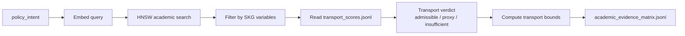

`runtime_demand_backlog.jsonl` — це backlog запитів, які надходили до academic шару під час реальних запусків. Використовується для prioritization майбутніх ingest-циклів.

#### 5.4.4. SPLIT_MANIFEST — слім runtime бандл

`SPLIT_MANIFEST.json` фіксує, що цей slim-бандл — це підмножина повного бандлу: лише runtime-serving artifacts + minimal provenance. Повний бандл лежить у source `/data/output/policyos_academic_final_best_20260411T112032Z/` (значно більший).

### 5.5. Ukraine agent simulation baseline — 1.3 ГБ + 660 МБ heavy graphs

**Шлях:** `production_data/ukraine_agent_simulation_baseline_20260410/`

Це **готовий agent-based world** для України, з 439k агентів і 5 типами графів. Це найбільш «домен-специфічний» бандл з усього production_data: він готовий під ABM-симуляції в українському контексті.

#### 5.5.1. Структура

```
ukraine_agent_simulation_baseline_20260410/
├── FINAL_ARTIFACTS_MANIFEST.json       (повний sha256-маніфест)
├── README.txt
├── heavy_graph_addon/
│   ├── budget_graph_sparse.npz         (633 МБ — основа: бюджет)
│   ├── distress_graph_sparse.npz       (5.7 МБ — distress)
│   ├── procurement_graph_sparse.npz    (11.9 МБ — закупівлі)
│   ├── public_service_graph_sparse.npz (3.5 МБ — публічні послуги)
│   └── trade_graph_sparse.npz          (4.6 МБ — торгівля)
└── production_bundle/
    ├── INVENTORY.txt
    ├── manifests/                      (per-bundle manifests)
    └── bundles/
        ├── calibration_bundle_v1/      (643 МБ — observation panels)
        ├── embedding_bundle_v1/        (5.3 МБ — agent + cell embeddings)
        ├── governance_report_v1/       (12 КБ — governance metadata)
        ├── intervention_bundle_v1/     (20 КБ — інтервенції)
        ├── method_contract_bundle_v1/  (20 КБ — method contracts)
        └── runtime_bundle_v1/          (19 МБ — runtime parquets + slot manifest)
```

#### 5.5.2. `runtime_bundle_v1/runtime_bundle_manifest.json` — деталі

```json
{
  "data_snapshot_artifact_id": "sha256:171f3da2779d0a5e201faef408df92289f00a0de736b24babc33944eccd13dee",
  "input_bindings_artifact_id": "sha256:1d7c15280ea5485ea8291a583b1a516407fa05507aff02b48732cbf5a48e525e",
  "metrics": {
    "n_agents": 439398,
    "n_cells": 642,
    "budget_graph_nnz": 42072156,
    "procurement_graph_nnz": 1008058,
    "validation_binding_agent_count": 1024,
    "validation_binding_cell_count": 126,
    "applied_binding_ids": [
      "auto.agents_employer_id", "auto.agents_income", "auto.agents_is_employed",
      "auto.agents_reported_income", "auto.agents_risk_aversion", "auto.agents_skill_level",
      "auto.cells_active", "auto.cells_distress_score", "auto.cells_employment",
      "auto.cells_output", "auto.cells_population", "auto.cells_public_service_index",
      "auto.cells_region_code", "auto.cells_sector_id",
      "auto.firms_labor_count", "auto.firms_wage_offer",
      "auto.household_cells_active", "auto.household_cells_cell_id",
      "auto.household_cells_disposable_income", "auto.household_cells_household_count",
      "auto.household_cells_poverty_rate", "auto.household_cells_transfer_intensity"
    ]
  },
  "outputs": {
    "agent_registry_runtime.parquet": { "row_count": 439398, "size_bytes": 11301616 },
    "budget_graph_sparse.npz":        { "nnz": 42072156, "size_bytes": 633853657 },
    "cell_registry_region_sector.parquet": { "row_count": 642, "size_bytes": 17531 },
    "cell_state_seed_v1.npz":         { "size_bytes": 12141 },
    "geo_index_runtime.parquet":      { "row_count": 386739, "size_bytes": 7521057 },
    "procurement_graph_sparse.npz":   { "nnz": 1008058, "size_bytes": 11907282 },
    "public_entity_registry.parquet": { "row_count": 4247094, "size_bytes": 67141514 },
    "slot_family_manifest.json":      { "size_bytes": 1817 }
  }
}
```

**Що це означає:**
- 439 398 агентів, кожен з 7 атрибутами (`employer_id`, `income`, `is_employed`, `reported_income`, `risk_aversion`, `skill_level`, `household_cell_id`)
- 642 «клітинки» (cells) — агрегаційний рівень (region × sector)
- Budget graph: 42 МЛН ненульових елементів — це повноцінна щільність бюджетних потоків між агентами і клітинками
- 4.2 МЛН public entities — реєстр публічних суб'єктів (мерії, лікарні, школи, …)
- 386k geo-точок у `geo_index_runtime.parquet`

#### 5.5.3. `slot_family_manifest.json` — типізація агентного стану

```json
{
  "families": {
    "agents":     { "scope": "per_agent", "slots": ["agents.employer_id", "agents.household_cell_id", "agents.income", "agents.is_employed", "agents.reported_income", "agents.risk_aversion", "agents.skill_level"] },
    "cells":      { "scope": "per_cell",  "slots": ["cells.active", "cells.distress_score", "cells.employment", "cells.firm_count", "cells.output", "cells.population", "cells.public_service_index", "cells.region_code", "cells.sector_id"] },
    "firms":      { "scope": "per_firm",  "slots": ["firms.active", "firms.cell_id", "firms.firm_id", "firms.firm_type_id", "firms.labor_count", "firms.wage_offer"] },
    "global":     { "scope": "global",    "slots": ["global.tax_rate", "government.balance"] },
    "household_cells": { "scope": "per_cell", "slots": ["household_cells.active", "household_cells.cell_id", "household_cells.disposable_income", "household_cells.household_count", "household_cells.poverty_rate", "household_cells.transfer_intensity"] }
  }
}
```

Це — **типізація агентного стану**. Foundry-методи механізмів отримують `state` з відомими slot families, і їх контракти знають, що `agents.income` — це масив `n_agents × 1`, а `cells.distress_score` — `n_cells × 1`.

#### 5.5.4. `calibration_bundle_v1/` — 643 МБ

Містить `observation_panel_monthly.parquet` (674 МБ — місячні спостереження для калібрування), `observation_panel_annual.parquet` (12 КБ), `holdout_scores.json`, `calibration_run_manifest.json`. Це означає: бандл **калібровано на реальних місячних панельних даних** до того, як його використовує симуляція.

#### 5.5.5. Як Ukraine baseline використовується

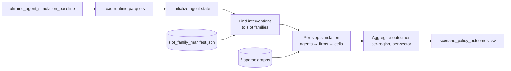

### 5.6. Canonical local data — 6.3 ГБ

**Шлях:** `production_data/canonical/local_data_20260501/`

Цей каталог містить **канонізовані локальні джерела** — переважно нарізки публічних реєстрів, документів, постанов у JSONL/Parquet форматі. Це сирий вхід для Lex-pipeline (provisions extraction → normative facts) і Fabric-pipeline (datasets ingestion).

### 5.7. Embeddings + HNSW — 1.1 ГБ

| Файл | Розмір | Призначення |
| --- | ---: | --- |
| `ds_dataset_embeddings.npz` | 549 МБ | Numpy-збережені ембеддинги датасетів |
| `ds_dataset_index.hnsw` | 564 МБ | HNSW-індекс для kNN-пошуку |
| `policyos_academic_runtime_slim_*/academic/ac_work_embeddings.npz` | (у складі 3.2 ГБ academic) | Ембеддинги академічних робіт |
| `policyos_academic_runtime_slim_*/academic/ac_work_index.hnsw` | (у складі) | HNSW-індекс академічних робіт |

Ці чотири файли разом дають **семантичний пошук по двох корпусах** (datasets + academic) з sub-second latency.

### 5.8. Manifests — provenance кожного байта

`manifest.json` (у корені production_data) містить SHA-256 кожного значущого артефакту і шлях оригіналу:

```json
{
  "kind": "publish",
  "pipeline": "datasets",
  "published_at": "2026-03-31T06:59:32.752266+00:00",
  "artifacts": [
    { "path": ".../dataset_catalog.duckdb",     "sha256": "4a1eab1363a948…" },
    { "path": ".../ds_dataset_embeddings.npz",  "sha256": "934f34927d55fa…" },
    { "path": ".../ds_dataset_index.hnsw",      "sha256": "561c8c5957a7a2…" },
    { "path": ".../merged/all_records.jsonl",   "sha256": "8be0415fe8e2d3…" },
    ...
  ],
  "extra": {
    "snapshot_root": "/data/output/datasets_full_phase3full_20260327_183054",
    "run_profile": "prod_full",
    "readiness_summary": { ... }
  }
}
```

Аналогічно `FINAL_ARTIFACTS_MANIFEST.json` для Ukraine bundle, `SPLIT_MANIFEST.json` для academic. **Кожен файл має sha256** — це робить ввесь корпус content-addressable і вступає в загальну CAS-логіку платформи.

### 5.9. Що це означає для масштабу системи

PolicyOS **поставляється з зібраним і нормалізованим evidence-корпусом**, а не лише з кодом. Це принципово відрізняє платформу від «framework для політичного аналізу»: тут одразу є:

- 134 849 правових документів
- 1 604 211 структурованих нормативних фактів
- 137 176 датасетів з квалітативними оцінками
- 3 708 006 спостережень
- 310 829 академічних робіт з SKG
- 7 868 каузальних claims
- 7 607 transport scores
- 439 398 агентів у Ukraine baseline
- 5 пов'язаних графів агентного світу
- 42 МЛН ненульових бюджетних зв'язків
- HNSW-індекси для семантичного пошуку

Цей корпус **готовий до використання**: будь-який запит, який починається у Scientist, відразу має доступ до всіх цих ресурсів через Fabric і Lex шари.

---

## 6. Шар IR — типізована мова обміну між шарами

**IR** (Intermediate Representation) — це не серіалізаційний формат, а *cемантика обміну*, спільна для всіх шарів. Це 78 724 рядки коду, 131 JSON-схема в `schemas/snapshots/ir/`, контракти в `polisyos.core.contracts.*`.

### 6.1. Структура пакету `ir`

```
src/polisyos/ir/
├── README.md
├── api.py
├── _internal/                  # внутрішня логіка
├── _lazy_facade/              # ledged-facade pattern для public API
├── analytics/                  # аналітичні контракти (causal_capabilities, …)
├── artifacts/                  # типи артефактів IR
├── connectors/                 # конектори типів між пакетами
├── data/                       # data-related types
├── governance/                 # ProblemFrame, PolicySpec, контракти governance
├── kernel/                     # kernel level types
├── linker/                     # IR linker (link_trinity)
│   ├── _trinity_linker.py
│   ├── _trinity_mechanisms.py
│   ├── _trinity_models.py
│   ├── _trinity_params.py
│   ├── link_trinity.py
│   ├── reports.py
│   └── types.py
├── loading/                    # loaders
├── migrations/                 # IR migrations (PolicySurfaceIR → Trinity)
├── model_layer/                # ModelSpec types
├── observation/                # ObservationContract
├── passes/                     # IR passes (validation, normalization)
├── registry/                   # registry contracts
├── schemas/                    # JSON-schema generators
├── trinity/                    # TrinityBundle, TrinityManifest
└── world/                      # World IR types
```

### 6.2. Trinity contract — ядро IR

#### 6.2.1. ProblemFrame (Why)

```python
from decimal import Decimal
from polisyos.ir.governance.problem_frame import (
    ProblemFrame, ProblemDomain, ObjectiveSpec
)
from polisyos.ir.model_layer.types import OptimizationDirection

problem = ProblemFrame(
    problem_id="reduce_inequality_2026",
    domain=ProblemDomain.SOCIAL,
    objectives=[
        ObjectiveSpec(
            objective_id="obj_1",
            metric_id="gini",
            direction=OptimizationDirection.MINIMIZE,
            weight=Decimal("1"),
        )
    ],
)
```

ProblemFrame фіксує:
- `problem_id` — стабільний ID
- `domain` — соціальний / економічний / охорони здоров'я / тощо
- `objectives` — список цілей (метрика + напрямок + вага)
- `constraints` — жорсткі та м'які обмеження
- `stakeholders` — суб'єкти, чиї інтереси враховуються
- `narrative_context` — текстовий контекст

#### 6.2.2. PolicySpec (What)

```python
from polisyos.ir.governance.policy_spec import PolicySpec, InterventionSpec
from polisyos.ir.governance.schedule import ScheduleSpec
from polisyos.ir.governance.selector_expr import SelectorPredicate

policy = PolicySpec(
    policy_id="progressive_tax_v1",
    interventions=[
        InterventionSpec(
            intervention_id="income_tax",
            kind="income_tax",
            target=SelectorPredicate(
                kind="predicate",
                field="income",
                operator=">",
                value=Decimal("10000"),
            ),
            schedule=ScheduleSpec(start_step=0, duration_steps=12),
            params={"rate": Decimal("0.15")},
        )
    ],
)
```

PolicySpec фіксує:
- список `InterventionSpec` (інтервенцій)
- кожна інтервенція має `target` (selector — кого охоплює), `schedule` (коли), `params` (з якими параметрами)
- `mechanism_bindings` — прив'язки до механізмів Foundry

#### 6.2.3. ModelSpec (How)

```python
from polisyos.ir.model_layer.model_spec import ModelSpec, FidelityLevel

model = ModelSpec(
    model_id="baseline_2026",
    data_snapshot_ref="sha256:" + "0" * 64,
    fidelity_level=FidelityLevel.HYBRID,
)
```

ModelSpec фіксує:
- `data_snapshot_ref` — посилання на CAS-знімок даних (приклад: Ukraine baseline)
- `registry_bundle_ref` — посилання на бандл реєстрів (Foundry methods, slots, mechanisms)
- `agent_configuration` — конфігурація агентів
- `assumptions` — припущення моделі
- `environment` — параметри середовища
- `fidelity_level` — рівень деталізації (hybrid, agent-based, equation-based)

#### 6.2.4. TrinityBundle — об'єднуючий контракт

```python
from polisyos.core.artifacts.ids import ArtifactID
from polisyos.core.contracts.trinity import (
    ModelSpecRef, PolicySpecRef, ProblemFrameRef, TrinityBundle,
)

artifact_id = ArtifactID.from_sha256_hex("0" * 64)
bundle = TrinityBundle(
    problem_frame_ref=ProblemFrameRef(artifact_id=artifact_id),
    policy_spec_ref=PolicySpecRef(artifact_id=artifact_id),
    model_spec_ref=ModelSpecRef(artifact_id=artifact_id),
)
```

TrinityBundle — це лише три refs у CAS. Реальні дані витягуються лазі-завантаженням, коли компілятор їх потребує. Це дає:
- Економію пам'яті (бандл — це 3×64 байти sha256, не повне навантаження)
- Дедуплікацію (якщо ProblemFrame ідентичний у двох TrinityBundle, він зберігається один раз)
- Audit-trail (можна слідкувати, які саме версії яких частин Trinity використано)

### 6.3. IR linker — `link_trinity`

`polisyos.ir.linker.link_trinity` — це функція, яка перевіряє, що:
1. Усі references у TrinityBundle resolve у CAS.
2. Усі intervention.kind references вирішуються в registry mechanisms.
3. Усі metric_id references вирішуються в metrics registry.
4. Усі selector fields існують у slot_family_manifest.
5. Усі data_snapshot.binding_ids існують у відповідному snapshot.

Якщо щось не resolves — повертає `LinkReport` зі списком `LinkSeverity.{ERROR, WARNING, INFO}`.

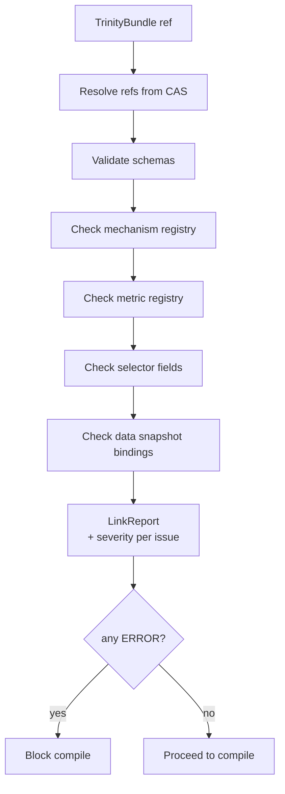

### 6.4. JSON-схеми IR — 131 файл у `schemas/snapshots/`

Кожен IR-контракт експортується як JSON-схема через `tools/quality/diagnostics/gen_schema.py`. Це дає:
- **Cross-language compatibility.** TypeScript-фронтенд може читати ці схеми і генерувати свої типи.
- **Versioning.** Кожна схема має version field, sloweven evolution-rules перевіряються в тестах.
- **Documentation.** Кожна схема — самодокументована.

Приклади канонічних схем:
- `schemas/snapshots/ir/trinity_bundle.schema.json`
- `schemas/snapshots/ir/problem_frame.schema.json`
- `schemas/snapshots/ir/policy_spec.schema.json`
- `schemas/snapshots/ir/model_spec.schema.json`
- `schemas/snapshots/foundry/program_graph.schema.json`
- `schemas/snapshots/foundry/exec_plan.schema.json`
- `schemas/snapshots/foundry/compile_request.schema.json`

### 6.5. Migrations — `PolicySurfaceIR` → `Trinity`

PolicyOS колись мала `PolicySurfaceIR` — монолітний контракт, що поєднував goals + interventions + assumptions. Trinity розщепив його на три. Migration utilities у `polisyos.ir.legacy.migrations`:

```python
from polisyos.ir.legacy.migrations.surface_to_trinity import (
    migrate_surface_ir_to_trinity,
    migrate_trinity_to_surface_ir,
)

bundle, report = migrate_surface_ir_to_trinity(surface_ir)
surface_ir, report = migrate_trinity_to_surface_ir(bundle)
```

Це означає: **back-compat зберігається**. Старі експерименти, що користувалися PolicySurfaceIR, можуть бути автоматично переведені на Trinity без втрати інформації.

### 6.6. Чому Trinity а не PolicySurfaceIR

Принципова перевага Trinity — **separation of concerns**:
- одна `ProblemFrame` може бути перевикористана для багатьох `PolicySpec` (порівняння політик за тією самою метрикою)
- одна `PolicySpec` може бути запущена на багатьох `ModelSpec` (стрес-тест політики на різних світових моделях)
- одна `ModelSpec` може бути перевикористана для багатьох `PolicySpec` (порівняння політик у тому самому світі)

З `PolicySurfaceIR` це було неможливо: щоб змінити одну ціль, треба було сформувати весь surface-ir.

---

## 7. Шар Lex — нормативний контур

**Lex** — це pipeline, який перетворює **природну мову нормативних актів** на **типізовані machine-readable normative facts**. Розмір — 10 998 рядків коду. Не великий, але концептуально важливий: це той шар, що відрізняє PolicyOS від «аналітичної системи» (яка ігнорує правову основу) і робить її **доказовою інфраструктурою** в сенсі Parkhurst.

### 7.1. Структура пакету `lex`

```
src/polisyos/lex/
├── README.md
├── api.py                       # public API
├── artifacts.py                 # типи артефактів
├── common.py
├── errors.py
├── extensions/
├── factlog.py                   # лог фактів
├── intervention_artifacts.py    # типи інтервенцій
├── interventions.py             # компіляція інтервенцій
├── knowledge/                   # knowledge graph operations
│   ├── search.py                # пошук по KG
│   ├── store.py                 # store
│   └── types.py
├── legal_evaluation/            # оцінка правової сумісності
│   ├── backends/                # бек-енди (DuckDB, …)
│   ├── change_proposals.py
│   ├── context_builder.py
│   ├── evaluate.py              # головний evaluator
│   ├── evaluator_registry.py
│   └── transport_constraints.py
├── normpack/                    # NormPack assembly
│   ├── applicability.py         # фільтрація applicability
│   ├── assemble_pack.py         # збірка пакету
│   ├── extract_norm_claims.py   # витяг claims з KG
│   ├── policies.py              # policy filtering
│   ├── provider_registry.py
│   └── select_sources.py        # вибір source-ів
├── provenance.py                # провенанс
├── simulator/                   # симулятор правових змін
└── types.py                     # типи
```

### 7.2. Lex pipeline — наскрізний flow

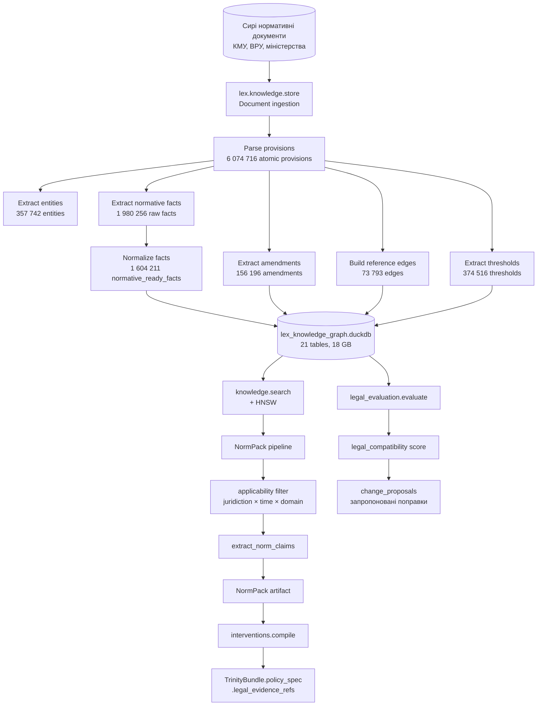

### 7.3. NormPack — pipeline у деталях

`polisyos.lex.normpack` — це 6-крокова pipeline:

#### 7.3.1. `select_sources.py`

Обирає правові джерела на основі `policy_intent` (текст або структурований запит).

Алгоритм:
1. Парсить ключові слова з `policy_intent` (NLP rule-based + LLM-assisted)
2. Робить семантичний пошук у HNSW-індексі по KG
3. Фільтрує за `domain` (бюджетне / податкове / трудове / соціальне право)
4. Повертає список `LegalSourceCandidate` з `relevance_score`

#### 7.3.2. `applicability.py`

Перевіряє, які з обраних джерел *застосовні* до контексту запиту.

Перевірки:
- **Юрисдикція:** документ є чинним у потрібній юрисдикції (Україна / EU / RFE)?
- **Час:** документ чинний на дату запиту? (через `lex_doc_temporal` + `lex_temporal_audit`)
- **Поправки:** які amendments застосовано? (через `lex_amendments`)
- **Скасування:** документ не скасовано? (через `lex_temporal_audit`)
- **Ієрархія:** документ не суперечить вищим за рангом нормам? (через `lex_reference_edges`)

Повертає `ApplicabilityVerdict` з полями `applicable: bool`, `reason: str`, `applied_amendments: list`.

#### 7.3.3. `extract_norm_claims.py`

Витягує з KG `normative_facts` для застосовних джерел.

SQL-логіка приблизно:
```sql
SELECT n.*
FROM lex_normative_ready_facts n
JOIN lex_provisions p ON n.provision_id = p.provision_id
JOIN lex_doc_versions v ON p.doc_version_id = v.doc_version_id
JOIN lex_doc_temporal t ON v.doc_id = t.doc_id
WHERE v.doc_id IN (:applicable_docs)
  AND t.valid_from <= :query_date
  AND (t.valid_to IS NULL OR t.valid_to > :query_date)
  AND n.confidence >= :min_confidence
ORDER BY n.confidence DESC, t.valid_from DESC
```

#### 7.3.4. `assemble_pack.py`

Збирає `NormPack` — пакет норм з провенансом:

```python
class NormPack:
    pack_id: str
    pack_version: str
    juridiction: str
    valid_at: datetime
    norms: list[NormativeFact]
    source_documents: list[DocumentRef]
    applied_amendments: list[Amendment]
    applicability_report: ApplicabilityVerdict
    confidence_distribution: dict
    sha256: str
```

#### 7.3.5. `policies.py` — policy filtering

Фільтрація NormPack за політичними обмеженнями:
- Виключити norms з `confidence < threshold`
- Виключити norms, що мають конфлікт у `lex_consistency_issues`
- Виключити norms, що в `contested_edges` за academic SKG

#### 7.3.6. `provider_registry.py`

Реєстр провайдерів NormPack — у простому випадку це наш Lex DB; може бути розширено для multi-jurisdiction (EU CELEX, RFE eGov).

### 7.4. Intervention compilation — `lex.interventions`

Після того, як NormPack зібрано, `lex.interventions.compile` перетворює:
- `PolicySpec.interventions` (з Trinity) — на
- `LegalIntervention` (зі зв'язком до `NormPack`)

Це означає, що для кожної інтервенції в Trinity ми маємо явний правовий якір — який нормативний акт її уможливлює, які amendments застосовано, які thresholds діють.

```python
class LegalIntervention:
    intervention_id: str
    legal_basis: list[NormativeFactRef]
    legal_constraints: list[Constraint]
    threshold_alignment: dict[str, ThresholdMapping]
    amendment_history: list[AmendmentRef]
    transport_constraints: list[TransportConstraint]
    confidence: Decimal
```

### 7.5. Legal evaluation — `evaluate.py`

`polisyos.lex.legal_evaluation.evaluate` дає **скоринг правової сумісності** політики:

```python
def evaluate(
    policy: PolicySpec,
    norm_pack: NormPack,
    context: EvaluationContext,
) -> LegalEvaluationResult:
    """Returns score in [0, 1] + breakdown per dimension."""
```

Вимірі:
- **Threshold compliance** — чи відповідають числові параметри політики thresholds у нормах?
- **Selector compliance** — чи дозволяє правовий контекст таргетувати саме цю популяцію?
- **Schedule compliance** — чи укладається в правові терміни?
- **Amendment alignment** — чи враховано останні amendments?
- **Transport constraints** — чи не порушує обмеження при перенесенні з інших юрисдикцій?

Output використовується в Foundry як `legal_compatibility` метрика, яку Scientist бачить у governance pass.

### 7.6. Lex simulator

`polisyos.lex.simulator` — це **what-if engine** для правових змін. Дозволяє запитати: «Якщо змінити статтю X закону Y на цю редакцію, як зміниться NormPack для політики Z?» Корисно для:
- Підготовки project-postanov
- Юридичної експертизи реформ
- Оцінки впливу європейських директив на українське законодавство

### 7.7. Що з усього цього використано в експерименті

| Компонент Lex | Стан в експерименті |
| --- | --- |
| `lex_knowledge_graph.duckdb` (18 ГБ) | Зібрано, доступний |
| Pipeline ingestion (1.6M facts) | Виконано до експерименту |
| `NormPack.select_sources` | НЕ викликано (відсутні файли в `runs_dir`) |
| `NormPack.applicability` | НЕ викликано |
| `NormPack.extract_norm_claims` | НЕ викликано |
| `NormPack.assemble_pack` | НЕ викликано |
| `interventions.compile` | НЕ викликано |
| `legal_evaluation.evaluate` | НЕ викликано |
| Lex simulator | НЕ викликано |
| `legal_evidence_refs` у Trinity | Порожній `[]` для всіх 192 політик |

**Висновок:** Lex шар є архітектурно повним і даними наповненим, але pipeline-зв'язок із MSME-експериментом не був прокинутий до запуску. Це не дефект архітектури, а дефект конкретного дедлайн-запуску. Абляція `no_lex` показала: 53 з 192 політик не пройшли б binding-перевірку — це і є кількісна оцінка того, що ми втратили через відсутність Lex-обогащення.

---

## 8. Шар Fabric — контур даних, спостережень і світу

**Fabric** — це 79 598 рядків коду, що відповідають за **трансформацію зовнішніх джерел на типізовані артефакти**. Його філософія: **жоден показник не потрапляє до Foundry без явного source ref + lineage + trust tier**.

### 8.1. Структура пакету `fabric`

```
src/polisyos/fabric/
├── README.md
├── api.py
├── _adapters/                  # внутрішні адаптери
├── _internal/
├── catalog/                    # каталог (DuckDB schema, indexes)
├── claims/                     # claims management
├── config/
├── connectors/                 # 30+ конекторів до джерел
├── data_plane/                 # data plane: streaming, regression, replay
│   ├── benchmarks.py
│   ├── cli.py
│   ├── cursor_store.py         # cursor для incremental reads
│   ├── modes.py                # data plane modes
│   ├── orchestrator.py         # головний orchestrator
│   ├── quarantine.py           # карантин невалідних
│   ├── regression.py           # regression detection
│   ├── replay_store.py         # replay storage
│   ├── semantic_diff.py        # semantic diff between snapshots
│   ├── streaming.py            # streaming підтримка
│   ├── tabular.py              # tabular IO
│   └── temporal.py             # temporal alignment
├── docs/
├── entity_resolution/          # entity resolution (Wikidata, etc.)
├── evidence/                   # evidence retrieval
├── extensions/
├── identity/                   # identity resolution
├── ingestion/                  # ingest pipelines
├── io/                         # IO utils
├── numerics/                   # numerical helpers
├── pii/                        # PII handling
├── product_integration/        # cross-product integrations
├── provenance/                 # lineage and provenance
├── quality/                    # data quality checks
├── retrieval/                  # retrieval engines
├── security/                   # access control, encryption
├── storage/                    # storage backends
├── trust/                      # trust tier evaluation
└── world/                      # WORLD subsystem
    ├── ddl/
    ├── events.py
    ├── materialize/
    ├── providers.py
    ├── query.py
    └── store/
```

### 8.2. Connectors — 30+ джерел

PolicyOS має реалізованих конекторів до:

| Категорія | Джерела |
| --- | --- |
| **Українські** | data.gov.ua broad + exec, Diia public registries |
| **Сусідні країни** | data.gov.ro, data.gov.md, data.gov.pl |
| **Міжнародні організації** | OECD, Eurostat, World Bank, ILO, WHO, UNESCO UIS, UN Population Division (UNPD), UN Data |
| **Фінансові** | ECB, IMF, EIA API |
| **Опитування** | World Values Survey (WVS), Gallup |
| **Геопросторові** | Open Meteo, OpenAQ v2 |
| **Семантичні графи** | Wikidata SPARQL, DBpedia SPARQL |
| **Локальні** | Chicago OpenData, NYC OpenData, Paris OpenData (як приклади демократизованих міських даних) |
| **Open data платформи** | Opendatasoft, ukons (UK Office for National Statistics) |

Кожен конектор реалізує контракт `polisyos.fabric.connectors.base.SourceConnector`:

```python
class SourceConnector(Protocol):
    source_id: str
    source_kind: SourceKind  # statistical, normative, academic, …

    def discover(self) -> Iterator[DatasetCandidate]:
        """List available datasets."""

    def fetch(self, dataset_id: str, params: dict) -> RawPayload:
        """Fetch raw payload."""

    def parse(self, raw: RawPayload) -> ParsedDataset:
        """Parse into typed records."""

    def quality_check(self, parsed: ParsedDataset) -> QualityVerdict:
        """Self-check quality."""
```

### 8.3. Data plane — `data_plane/`

Data plane відповідає за **рух даних у часі**:

#### 8.3.1. `cursor_store.py`

Stores cursors для incremental reads. Якщо джерело API підтримує `since` parameter, ми зберігаємо позицію курсору і робимо лише delta-запити. Це критично для джерел з мільйонами записів.

#### 8.3.2. `modes.py` — режими роботи

| Режим | Семантика |
| --- | --- |
| `bootstrap` | Перший повний завантаж усього |
| `incremental` | Регулярні delta-завантажі через cursor |
| `replay` | Повторне виконання з історичного snapshot |
| `dry_run` | Симуляція без запису |
| `quarantine_only` | Лише валідація, без поширення |

#### 8.3.3. `orchestrator.py`

Координує:
1. Запуск конекторів у нужний час (cron-style)
2. Передачу parsed datasets у quality pipeline
3. Запис до catalog DB
4. Обчислення embeddings
5. Оновлення HNSW-індексу
6. Емісію change events

#### 8.3.4. `quarantine.py` — quarantine flow

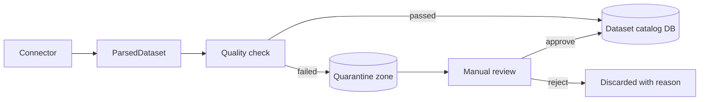

Quarantine — критичний компонент: він гарантує, що жоден сумнівний датасет не потрапить у вживання без людської перевірки.

#### 8.3.5. `semantic_diff.py`

Коли джерело публікує оновлення, `semantic_diff` обчислює:
- Які записи додано
- Які видалено
- Які змінено (з deeper semantic comparison, не лише byte diff)
- Чи є **regression** (наприклад, метрика перейшла з 91% до 60%)

`regression.py` має правила: «якщо metric_X впала на >Y%, заблокувати update і викликати alert».

### 8.4. World subsystem — `world/`

`fabric.world` — це **окремий під-простір для агентного світу**. Це те, що використовує Ukraine baseline:

#### 8.4.1. `world/ddl/`

DDL для world store: схема таблиць агентів, фірм, клітинок, household_cells, global state.

#### 8.4.2. `world/materialize/`

Матеріалізація агентного стану з parquet-снімків у in-memory структури для симуляції.

#### 8.4.3. `world/providers.py`

Провайдери світу:
- `UkraineBaselineProvider` — використовує `ukraine_agent_simulation_baseline` бандл
- `SyntheticWorldProvider` — синтетичний світ з контрольованими параметрами
- `MultiCountryProvider` — для cross-country порівнянь

#### 8.4.4. `world/query.py`

Query language для світу:
```python
result = world.query(
    SELECT distress_score
    FROM cells
    WHERE region_code = 'KH' AND sector_id = 1
    AT step = 12
)
```

### 8.5. Trust tiers — `trust/`

Кожен датасет, потрапляючи в catalog, отримує **trust tier**:

| Tier | Семантика | Приклад |
| --- | --- | --- |
| `T1_authoritative` | Офіційне джерело з прямою юрисдикцією | data.gov.ua, OECD |
| `T2_curated` | Оброблене авторитетним посередником | World Bank Indicators |
| `T3_aggregated` | Агрегація з кількох джерел | Wikidata derived stats |
| `T4_community` | Crowd-sourced | OpenStreetMap derived |
| `T5_unverified` | Не верифіковане | Web scraping |

Trust tier використовується в:
- Foundry method selection (методи з вищими requirements не приймають T5)
- Scientist governance (rejects політики з evidence з T5 без обґрунтування)
- Academic SKG (transport_score знижується для низькі trust tier-и)

### 8.6. Evidence retrieval — `evidence/`

`fabric.evidence` — це орчестратор, що для заданого `policy_intent`:
1. Запитує HNSW catalog для top-k датасетів
2. Запитує academic SKG для transport scores
3. Перевіряє Lex для legal context
4. Збирає `EvidenceMatrix` з усіма три-сторонніми ребрами

EvidenceMatrix — це і є вхід для Trinity.policy_spec.evidence_refs.

### 8.7. Quality — `quality/`

Контракти якості реалізують метрики, які бачимо в `qc_report.json`:
- `machine_readable_distribution_pct`
- `parser_supported_distribution_pct`
- `datasets_with_temporal_coverage_pct`
- `datasets_with_geographic_coverage_pct`
- `execution_readiness_score_avg`
- `transport_ready_var_coverage_pct`
- `benchmark_search_top5_relevance_pct`

Кожна метрика має:
- Поточне значення
- Поріг для passing
- Trend (+/- vs попередній snapshot)
- Drill-down на відповідальні джерела

### 8.8. Що з Fabric використано в експерименті

| Компонент | Використано? |
| --- | --- |
| Catalog DB (137k datasets) | Так — query через `T3_fabric_evidence_matrix` |
| HNSW search | Так — для evidence матчингу |
| Connectors (live ingest) | НІ — використано pre-built snapshot |
| Quarantine flow | НЕ активований |
| Quality checks | Тільки read (з `qc_report.json`) |
| World subsystem | Так — Ukraine baseline завантажено |
| Trust tiers | Так — використано для filtering evidence |
| Evidence retrieval | Так — повний `EvidenceMatrix` з 3963 metric rows |

---

## 9. Шар Foundry — методна бібліотека і compile/execute

**Foundry** — найбільший шар (304 441 рядків коду). Це серце системи: **бібліотека методів + компілятор + executor**. Тут реалізовано 389 методів, capability contracts, и сама механіка перетворення Trinity → виконуваний план.

### 9.1. Структура пакету `foundry`

```
src/polisyos/foundry/
├── README.md
├── api.py                       # public API
├── _internal/, _quickstart.py, _registry.py
├── agent_metrics/               # метрики для агентів
├── agent_sim/                   # ABM kernels
├── agents/                      # agent runtime
├── analysis/                    # post-processing аналіз
├── calibration/                 # калібрування методів
├── compile/                     # ⭐ КОМПІЛЯТОР
│   ├── api.py                   # compile() entry point
│   ├── trinity_compiler.py      # compile_trinity backend
│   ├── _graph.py                # ProgramGraph builder
│   └── _lowering.py             # mechanism lowering
├── conflict_checker/            # CompileTimeConflictChecker
├── constraints_engine/          # constraint solver
├── contracts/                   # Foundry contracts
├── cost_model/                  # вартість виконання
├── coupling/                    # coupling analysis
├── data_plane/                  # foundry data plane
├── domain/                      # domain-specific helpers
├── execute/                     # execute API
│   └── api.py
├── executor/                    # ⭐ EXECUTOR
│   ├── executor.py              # main executor
│   ├── patch_vm.py              # VM для patches
│   └── queue.py                 # job queue
├── extensions/
├── feedback/                    # feedback loops
├── layout/                      # slot layout builder
├── loss/                        # loss functions
├── mechanism_design/            # mechanism design
├── mechanisms/                  # 5+ механізми (treasury, …)
├── merge_engine/                # merge engine для DAG nodes
├── methods/                     # ⭐ КАТАЛОГ 389 МЕТОДІВ
│   ├── README.md, AUTHORING.md, MIGRATION_V2.md, NAMING.md
│   ├── api.py, base.py, cache.py, cli/
│   ├── catalog/                 # каталог родин методів
│   │   ├── snapshot.py          # build_method_catalog_snapshot
│   │   ├── bayesian/            # 10 файлів
│   │   ├── causal/              # 131 файл
│   │   ├── dependence/          # 3 файли
│   │   ├── distributional/      # 7 файлів
│   │   ├── econometrics/        # 19 файлів
│   │   ├── forecasting/         # 7 файлів
│   │   ├── mechanism/           # 2 файли
│   │   ├── microsim/            # 8 файлів
│   │   ├── ml/                  # 11 файлів
│   │   ├── network/             # 9 файлів
│   │   ├── optimization/        # 13 файлів
│   │   ├── policy/              # 5 файлів
│   │   ├── sensitivity/         # 6 файлів
│   │   ├── simulation/          # 5 файлів
│   │   ├── spatial/             # 4 файли
│   │   ├── survey/              # 15 файлів
│   │   └── validation/          # 3 файли
│   ├── components/              # composable components
│   ├── compiler/                # method compiler
│   ├── equivalence/             # equivalence classes
│   ├── lifecycle/               # lifecycle manager
│   ├── selection/               # method selection registry
│   ├── testing/                 # testing infrastructure
│   ├── types/                   # types
│   ├── _internal/, artifacts/, backends/
│   ├── compat.py, compat_matrix.py, composer.py, consensus.py, …
│   ├── cost_model.py, dependence.py, deprecation.py, discovery.py
│   ├── exceptions.py, hot_reload.py, io.py, layout.py, lifecycle, linker.py
│   ├── loss.py, merge_engine.py, microsim.py, ml.py, mypy_plugin.py
│   ├── network.py, observability.py, optimization.py, output_monitor.py
│   └── ... (~120+ файлів верхнього рівня)
├── patch_vm/
├── plugins/
├── profiles/
├── queue/
├── quickstart/
├── registry/
├── release_acceptance/
├── runtime/                     # foundry runtime
│   ├── fingerprint.py
│   ├── nan_guard.py
│   ├── numeric.py
│   ├── profiles.py
│   └── trace.py
├── social_weights/              # social weights
└── specs/                       # specs
```

### 9.2. Compile flow — `compile_trinity`

#### 9.2.1. Entry point — `polisyos.foundry.compile.api.compile`

```python
def compile(store: FileSystemCAS, request: CompileRequest) -> CompileResult:
    try:
        _resolve_compiler(request)
        from .trinity_compiler import compile_trinity
        return compile_trinity(store, request)
    except Exception as exc:
        return _compile_exception(store, request, exc)
```

`CompileRequest` містить:
- `policy_ref` — посилання на `TrinityBundle` (kind = `ir.trinity_bundle`)
- `registry_bundle_ref` — посилання на бандл реєстрів (опціональне; може бути взято з `model_spec`)
- Validation flags
- Compile-time determinism settings

`CompileResult` (success):
- `ok=True`
- `exec_plan_ref: ExecPlanRef`
- `derived_refs: dict[str, DerivedArtifact]` з ключами `lowered_ir`, `program_graph`, `exec_plan`, `link_report`, `slot_layout`, `treasury_plan`

`CompileResult` (failure):
- `ok=False`
- `compile_report_ref: ArtifactRef` — refs на `CompileReport` зі списком notes
- `notes: list[str]` — короткий опис помилок

#### 9.2.2. `compile_trinity` — backend

Реалізація в `src/polisyos/foundry/compile/trinity_compiler.py`:

```python
def compile_trinity(store: FileSystemCAS, request: CompileRequest) -> CompileResult:
    # 1. Load TrinityBundle from CAS
    policy_ref = request.policy_ref
    payload = from_canonical_bytes(store.get_bytes(policy_ref.artifact_id))
    bundle = TrinityBundle.model_validate(payload)

    # 2. Resolve registry bundle ref (explicit or from model_spec)
    registry_bundle_ref = _resolve_registry_bundle_ref(
        request.registry_bundle_ref, bundle.model_spec.registry_bundle_ref
    )
    if registry_bundle_ref is None:
        return _compile_error(store, ..., notes=["missing_registry_bundle"])

    # 3. Load registry content
    registry_content = load_registry_bundle_content(store, registry_bundle_ref)
    registries = RegistryBundle(
        mechanisms=registry_content.mechanism_registry,
        slots=registry_content.slot_registry,
        merge_rules=registry_content.merge_registry,
        constraints=registry_content.constraint_registry,
        selector_fields=registry_content.selector_field_registry,
        units=registry_content.units_registry,
        metrics=registry_content.metric_registry,
    )

    # 4. Link Trinity (resolve refs, validate)
    link_report = link_trinity(bundle, registries)
    if any(severity == LinkSeverity.ERROR for severity in link_report):
        return _compile_error(...)

    # 5. Lower mechanisms
    lowered = lower_trinity(bundle, registries)

    # 6. Build ProgramGraph
    program_graph = build_program_graph(lowered, registries)

    # 7. Build exec order (topological sort + cost model)
    exec_order = build_exec_order(program_graph)

    # 8. Build slot layout
    slot_layout = build_slot_layout(program_graph, registries.slots)

    # 9. Build treasury plan (deterministic seeds)
    treasury_plan = build_treasury_plan(program_graph, request.compile_seed)

    # 10. Build cost budget
    cost_budget = _build_cost_budget(request, program_graph)

    # 11. Conflict check
    checker = CompileTimeConflictChecker(program_graph, registries)
    conflict_report = checker.check()
    if conflict_report.has_blocking:
        return _compile_error(...)

    # 12. Persist all derived artifacts to CAS
    program_graph_ref = store.put(...)
    exec_plan_ref = store.put(ExecPlan(graph_ref=program_graph_ref, exec_order=exec_order, ...))
    slot_layout_ref = store.put(slot_layout)
    treasury_plan_ref = store.put(treasury_plan)
    link_report_ref = put_link_report(store, link_report)
    compile_report_ref = put_compile_report(store, ...)

    return CompileResult(
        ok=True,
        exec_plan_ref=exec_plan_ref,
        derived_refs={
            "lowered_ir": lowered_ref,
            "program_graph": program_graph_ref,
            "exec_plan": exec_plan_ref,
            "link_report": link_report_ref,
            "slot_layout": slot_layout_ref,
            "treasury_plan": treasury_plan_ref,
        },
    )
```

### 9.3. ProgramGraph — типізована DAG виконання

`ProgramGraph` — це не просто DAG задач; це **типізована, контрактована DAG із семантикою кожного ребра**. Кожен node має:
- `node_id` — стабільний у межах compile (детермінований)
- `method_fqn` — fully-qualified name методу (напр. `causal.aipw_lasso`)
- `inputs: list[InputBinding]` — типізовані input slots
- `outputs: list[OutputSpec]` — очікувані output типи
- `cost_estimate` — час + пам'ять
- `determinism_tier` — tier зі snapshot
- `truthfulness_tier` — tier зі snapshot
- `node_salt` — seed для цього вузла з `TreasuryPlan`

Ребра graph мають семантику:
- `data_dependency` — output одного є input іншого
- `control_dependency` — порядок виконання
- `evidence_dependency` — додатковий evidence-вхід

### 9.4. Method catalog — 389 зареєстрованих методів

`build_method_catalog_snapshot` (`src/polisyos/foundry/methods/catalog/snapshot.py`) проходить весь registry і збирає `MethodCatalogEntry` для кожного методу. Snapshot містить:

| Поле | Що означає |
| --- | --- |
| `fqn` | Fully-qualified name (напр. `causal.aipw.aipw_lasso_v2`) |
| `namespace` | Простір імен |
| `name`, `version`, `family`, `variant` | Семантика метода |
| `backend` | Math backend (numpy, jax, scipy) |
| `execution_backend` | Execution backend (cpu, gpu, hybrid) |
| `kind` | Категорія (estimator, simulator, optimizer, …) |
| `fidelity_tier` | level of fidelity |
| `data_modalities` | Які модальності даних приймає |
| `supports_jit, supports_vmap, supports_grad` | JAX-сумісність |
| `determinism_tier` | bitwise / tolerance_bounded / seed_dependent / non_deterministic |
| `truthfulness_tier` | descriptive / predictive / causal_associational / causal_identified / causal_robust |
| `truthfulness_status` | verified / declared / runtime_observed |
| `truthfulness_scope` | scope правди |
| `runtime_stack` | Які пакети потрібні (econml, dowhy, …) |
| `runtime_posture` | Чи доступні runtime, які backend підтримуються |
| `replay_semantics` | Чи replay-able і як |
| `tolerance_budget` | Бюджет толерантності |
| `required_deps`, `optional_deps` | Залежності |
| `fallback_policy` | Що робити при недоступному backend |
| `side_effect_profile` | none / read_only / read_write / external_io |
| `disabled_reasons` | Чому метод недоступний |
| `runnable` | Підсумкове: чи можна виконати |
| `effect_semantics`, `shape_semantics`, `dependency_semantics` | Семантика контракту |
| `simulator_regime_schema` | Для simulator methods |
| `summary_schema_ref` | Reference на summary schema |
| `identifiable_target` | Що метод ідентифікує |
| `coverage_contract` | Coverage contract |
| `diagnostic_contract` | Diagnostic contract |

### 9.5. Causal capability contract

Усі методи каузальної родини реалізують `CausalCapabilityContract` (`src/polisyos/foundry/methods/catalog/causal/capabilities.py`):

```python
class CausalCapabilityContract:
    supported_families: dict[CausalIdentificationFamily, bool]
    disabled_families: dict[str, str]  # reason

    def supports_family(self, family: CausalIdentificationFamily) -> bool: ...
```

`CausalIdentificationFamily` enum:
- `RANDOMIZATION` — RCT-style
- `IGNORABILITY` — strong ignorability with covariates
- `INSTRUMENTAL_VARIABLE` — IV
- `REGRESSION_DISCONTINUITY` — RDD
- `DIFFERENCE_IN_DIFFERENCES` — DiD
- `SYNTHETIC_CONTROL` — SCM
- `MATCHING` — propensity matching
- `MEDIATION` — mediator analysis
- `INTERFERENCE` — interference / spillovers
- `BOUNDS` — partial identification

Метод не може бути викликаний для задачі, що потребує родину, яку він не підтримує.

### 9.6. Mechanisms — `mechanisms/`

Foundry має реалізованих базових механізмів:

| Механізм | Що моделює |
| --- | --- |
| `treasury` | Бюджетні потоки |
| `tax` | Оподаткування |
| `transfer` | Соціальні трансферти |
| `procurement` | Публічні закупівлі |
| `regulation` | Регуляторні обмеження |

Кожен механізм — це pydantic model + lowering function:
```python
class TreasuryPlan(BaseModel):
    schema_version: str = Field("1.0", pattern=r"^\d+\.\d+$")
    root_seed: int = 0
    node_salts: dict[str, int] = Field(default_factory=dict)
    stream_salts: dict[str, int] = Field(default_factory=lambda: {"default": 0})
    notes: list[str] = Field(default_factory=list)
```

`stable_hash(value: str) -> int` — детерміністична функція хешування для отримання seed-ів.

### 9.7. Conflict checker — `CompileTimeConflictChecker`

Перед фіналізацією compile, `CompileTimeConflictChecker` перевіряє:
- Чи немає двох методів, що пишуть в один slot з суперечливими mode (`{strict_overwrite, append, merge}`)?
- Чи немає циклів у data dependencies (DAG-перевірка)?
- Чи задовольняє exec_order ordering constraints (наприклад, identification node до estimator node)?
- Чи всі required_deps присутні в registry?

Якщо знайдено блокуючі конфлікти — compile failure.

### 9.8. Slot layout — `build_slot_layout`

Метод `build_slot_layout` (`src/polisyos/foundry/methods/layout.py`) створює **типізовану розкладку пам'яті** для всіх slots, що буде використано в exec.

Slot layout як артефакт:
```python
class SlotLayout:
    families: dict[str, SlotFamilyLayout]
    total_bytes_estimate: int
    sharing_plan: dict[str, list[str]]  # які slots можуть бути shared
    materialize_order: list[str]
```

Це дає detrministic memory layout, що критичне для replay.

### 9.9. Cost model — `cost_model.py`

`CostModel` оцінює:
- Час кожного node (на основі size estimate × method profile)
- Пам'ять кожного node
- Загальний бюджет
- Чи влізе у `cost_budget` запиту

Якщо ні — compile failure with reason.

### 9.10. Execute — `executor.py`

Після compile, `Executor` запускає `ExecPlan`:

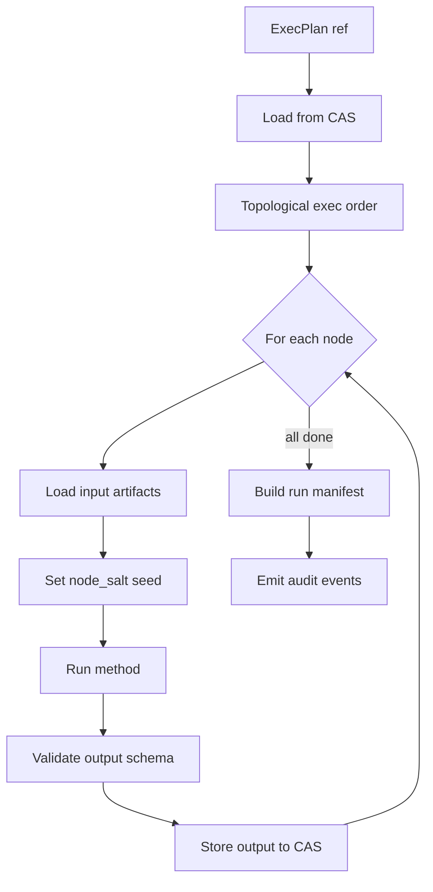

Кожен node виконується ізольовано, output одразу пишеться в CAS, ніяких in-memory shared states між nodes.

### 9.11. Patch VM — `patch_vm.py`

`PatchVM` — це **lightweight VM для застосування patches** до програмних графів. Дозволяє:
- Застосувати patch (наприклад, заміна одного методу на інший) без re-compile всього графу
- Validating patch проти типів
- Обчислити, які downstream nodes будуть affected

### 9.12. Foundry runtime — `runtime/`

`runtime/fingerprint.py` обчислює **runtime fingerprint** — хеш стану runtime (Python version, numpy version, JAX, GPU model, …). Це використовується для перевірки, що replay виконується в сумісному середовищі.

`runtime/nan_guard.py` — перевірки на NaN/Inf на критичних точках.
`runtime/numeric.py` — numerical helpers (stable softmax, log-sum-exp, …).
`runtime/profiles.py` — runtime profiles (production, development, replay).
`runtime/trace.py` — distributed tracing інтеграція.

### 9.13. Що з Foundry використано в експерименті

| Компонент | Використано в MSME experiment? |
| --- | --- |
| `compile.api.compile` (full compiler) | НІ — використано спрощену inline-Trinity |
| `trinity_compiler.compile_trinity` | НІ |
| ProgramGraph | НІ (заміщений inline-структурами) |
| ExecPlan | НІ |
| TreasuryPlan | НІ (seed захардкоджений) |
| SlotLayout | НІ |
| Method catalog (389 methods) | Інспектовано (T1 capability_inventory), але **виконано лише 9** |
| Виконані методи | `naive_difference`, `ols_adjusted`, `ipw_lasso`, `aipw_random_forest`, `dml_lightgbm`, `causal_forest_t_learner`, `tmle_proxy`, `aipw_linear`, BayesianBART (frontier) |
| Conflict checker | НЕ викликано |
| Cost model | НЕ викликано |
| Executor | НЕ викликано (методи виклкано напряму) |
| Patch VM | НЕ викликано |
| `causal` family (231 файл) | Виконано 8 методів |
| `bayesian` family | Виконано 1 (BayesianBART) |
| `econometrics`, `microsim`, `ml`, `network`, `optimization`, `policy`, `sensitivity`, `simulation`, `spatial`, `survey`, `validation` | НЕ викликано в експерименті |

**Архітектурно Foundry має 389 методів і повний compile/execute pipeline.** Експеримент через дедлайн використовував спрощений inline шлях, що видно з імен файлів (`trinity_like_*` замість `trinity_*`). Повний шлях через `compile_trinity` доступний для production-деплоїв.

---

## 10. Шар Scientist — оркестрація, агенти, врядування

**Scientist** — другий найбільший шар (181 559 рядків коду). Це **мозок системи**: координує workflow, керує LLM-агентами, виконує governance pipeline, забезпечує replay і checkpointing.

### 10.1. Повна структура пакету `scientist`

```
src/polisyos/scientist/
├── README.md, api.py
├── _adapters/, _internal/
├── adapters/                    # adapters до зовнішніх систем
├── agent/                       # ⭐ LLM AGENTS
│   ├── base.py
│   ├── code_verifier.py
│   ├── constitution.py
│   ├── constraint_context.py
│   ├── critic.py
│   ├── data_need_extractor.py
│   ├── drafter.py               # головний drafter
│   ├── _drafter_formatting.py, _drafter_llm.py, _drafter_orchestrator.py,
│   ├── _drafter_parsing.py, _drafter_passes.py
│   ├── drafter_clients.py, drafter_factory.py, drafter_models.py
│   ├── drafter_multipass.py
│   └── ...
├── autotune/                    # автотюнинг параметрів
├── backtesting/                 # backtest engine
├── causal/                      # каузальні утиліти Scientist рівня
├── claims/                      # claims management
├── compute/                     # compute resources
├── continuous_governance/       # continuous governance
├── cross_graph/                 # cross-graph analysis
├── decision_validity.py         # decision validity contract
├── discovery/                   # discovery utilities
├── doe/                         # Design of Experiments
├── engine/                      # legacy engine
├── error_semantics.py
├── evals/                       # evaluation framework
├── evidence/                    # evidence handling
├── evidence_sources.py
├── extensions/
├── feedback/                    # feedback loops
├── feedback_utils.py
├── frontier_runtime.py          # frontier runtime
├── governance/                  # ⭐ GOVERNANCE PIPELINE
│   ├── pipeline.py              # ValidationPipeline
│   ├── passes/                  # ValidatorPass implementations
│   └── ...
├── human_review/                # human-in-the-loop
├── kernel/                      # legacy kernel
├── latent_separation.py
├── llm/                         # LLM utilities
├── llm_cycle.py                 # legacy compat shim
├── memory/                      # episodic memory
├── methods/                     # method utils
├── nodes/                       # ⭐ WORKFLOW NODES
│   ├── README.md, AUTHORING.md
│   ├── components.py
│   └── builtins/                # 37+ built-in node types
│       ├── c6c_runtime_support.py
│       ├── causal/              # causal nodes
│       ├── checkpoint_marker.py
│       ├── compile/             # compile nodes
│       ├── data/                # data nodes
│       ├── decide/              # decision nodes
│       ├── errors.py
│       ├── governance/          # governance nodes
│       ├── guards.py
│       ├── planning/            # planning nodes
│       ├── simulate/            # simulation nodes
│       ├── state_keys.py
│       ├── tracing.py
│       └── validation.py
├── orchestration/               # ⭐ ORCHESTRATION SUBSYSTEM
│   ├── README.md, AUTHORING.md
│   ├── async_executor.py
│   ├── budget.py, budget_ledger.py, budget_middleware.py
│   ├── builtins/                # built-in orchestration components
│   ├── checkpoint.py
│   ├── circuit_breaker.py
│   ├── compensation.py
│   ├── condition.py
│   ├── context.py
│   ├── convergence.py
│   ├── engine/                  # engines
│   ├── error_semantics.py, errors.py
│   ├── executor.py
│   ├── fan_out.py
│   ├── frontier_runtime.py
│   ├── kernel/
│   ├── llm/                     # LLM cycle
│   │   ├── cycle.py             # ⭐ MAIN LLM CYCLE
│   │   ├── budget_enforcer.py
│   │   ├── cost_anomaly.py
│   │   ├── factory.py
│   │   ├── fallback_router.py
│   │   ├── gateway_client.py
│   │   ├── profiles/
│   │   ├── prompt_cache.py
│   │   ├── provider_verification.py
│   │   ├── streaming.py
│   │   ├── token_estimator.py
│   │   └── traced_client.py
│   ├── memory/                  # orchestration memory
│   ├── orchestrator/            # decision_card, publisher
│   └── workflows/               # ⭐ WORKFLOW REGISTRY
│       ├── builder.py
│       ├── causal_full.py
│       ├── default.py
│       ├── discovery.py
│       ├── engine_base.py
│       ├── engine_langgraph.py
│       ├── engine_simple.py
│       ├── policy_design.py
│       ├── policy_verified.py
│       └── selection.py
├── orchestrator/                # head-level orchestrator
├── policy_design/               # ⭐ POLICY DESIGN PIPELINE
│   ├── adversary.py             # adversarial review
│   ├── critic.py                # critic agent
│   ├── objectives.py
│   ├── output.py
│   ├── phase3.py                # phase 3 logic
│   ├── prompts.py               # LLM prompts
│   ├── schema.py
│   ├── search.py
│   └── translator.py            # NL → IR translator
├── policy_verified/             # verified policy workflow
├── provenance/
├── publisher.py                 # publisher
├── publishing/                  # publishing infrastructure
├── reliability_scorecard.py
├── remediation_status.py
├── replay/                      # replay subsystem
├── replay_backend.py            # replay backend
├── research_dag/                # research DAG
├── search/                      # search infrastructure
├── validation/                  # validation
├── verification/                # verification
└── workflows/                   # legacy workflows
```

### 10.2. ExperimentState — головний контракт

`ExperimentState` (`src/polisyos/scientist/orchestration/engine/state.py`) — це **immutable state container**, що передається між нодами.

```python
class ExperimentState(BaseModel):
    run_id: str
    workflow_id: str

    # Inputs
    problem_intent: str | None
    trinity_bundle_ref: ArtifactRef | None
    registry_bundle_ref: ArtifactRef | None
    data_snapshot_ref: ArtifactRef | None

    # State accumulators
    artifacts: dict[str, ArtifactRef]
    decisions: list[DecisionRecord]
    governance_verdicts: list[GovernanceVerdict]
    audit_events: list[AuditEvent]

    # Budget tracking
    budget_consumed: BudgetUsage
    budget_remaining: BudgetUsage

    # Tracing
    parent_node_id: str | None
    span_context: SpanContext | None
```

Кожен node бере `ExperimentState`, повертає **новий** `ExperimentState` (immutability як інваріант). Це критично для:
- Replay (можна відновити стан на будь-якому кроці)
- Compensation (rollback при помилці)
- Branching (run множинні гілки workflow)

### 10.3. LangGraph engine

PolicyOS використовує **LangGraph** як головний workflow engine:

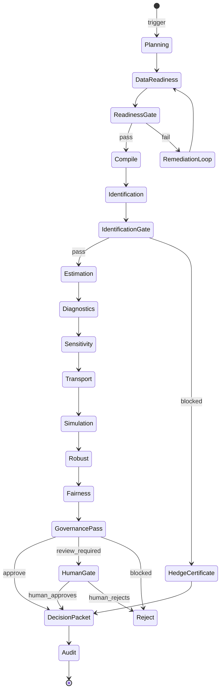

LangGraph дає:
- **Conditional routing.** Кожен node може мати кілька можливих next-nodes на основі condition.
- **Persistent state.** State зберігається на диск після кожного node.
- **Resume from checkpoint.** Можна продовжити з місця, де зупинилося.
- **Parallel branches.** Fan-out для незалежних гілок.

### 10.4. Workflows — реєстр

| Workflow | Призначення |
| --- | --- |
| `default` | Стандартний flow для політики |
| `policy_design` | LLM-driven дизайн політик через Drafter+Critic |
| `policy_verified` | Verified policy з підвищеними governance вимогами |
| `causal_full` | Повний каузальний контур з identification + estimation + sensitivity |
| `discovery` | Causal discovery + structure learning |
| `selection` | MCDA-вибір з кількох політик |

Workflows билдяться через `WorkflowBuilder.build()` (`src/polisyos/scientist/orchestration/workflows/builder.py`).

### 10.5. LLM agents — ядро Drafter

`scientist.agent.drafter` — це **головний LLM-генератор**. Це не один LLM call, а multi-pass pipeline:

```mermaid
flowchart LR
    Intent[policy_intent] --> Constitution[Constitution check]
    Constitution --> ContextBuild[Context builder]
    ContextBuild --> DraftPass1[Draft pass 1
brainstorm policies]
    DraftPass1 --> DraftPass2[Draft pass 2
refine constraints]
    DraftPass2 --> DraftPass3[Draft pass 3
fairness review]
    DraftPass3 --> Critic[Critic pass]
    Critic --> Adversary[Adversary pass]
    Adversary --> CodeVerifier[Code verifier]
    CodeVerifier --> Output[Validated policy designs]
```

#### 10.5.1. `constitution.py` — Constitution prompt

Drafter завжди оперує під «конституцією»:
- Не претендувати на каузальні efeкти без даних
- Не пропонувати дискримінаційні політики
- Завжди фіксувати assumptions
- Завжди пропонувати fallback variant
- Не давати юридичних висновків

#### 10.5.2. `data_need_extractor.py`

Extracts: «Які дані потрібні, щоб оцінити цю політику?» Output: список `DataNeed` зі `metric_id`, `coverage_required`, `time_window`, …

#### 10.5.3. `critic.py`

Внутрішній critic: переглядає draft, шукає:
- Логічні протиріччя
- Невираховані assumption
- Прогалини в evidence
- Двозначності в природній мові

#### 10.5.4. `adversary.py`

Adversarial review: «Як я б порушив цю політику для свого зиску?» Шукає:
- Loopholes
- Gaming opportunities
- Discriminatory side-effects

#### 10.5.5. `code_verifier.py`

Якщо drafter згенерував код для якогось обчислення — code_verifier його перевіряє:
- Парсинг
- Type check
- Static security analysis (no eval, no exec, no os.system)

### 10.6. Drafter clients — `drafter_clients.py`

Drafter може використовувати кілька LLM-клієнтів:

| Client | Backend |
| --- | --- |
| `gonkagate_qwen` | Qwen3-235B через api.gonkagate.com (production) |
| `openai_gpt4` | GPT-4 через OpenAI API (опційно) |
| `anthropic_claude` | Claude через Anthropic API (опційно) |
| `local_vllm` | Локальний vLLM (для тестування) |
| `mock_drafter` | MockDrafterAgent для tests |

`drafter_factory.py` обирає client на основі config + availability + cost budget.

### 10.7. Multi-pass drafting

`drafter_multipass.py` робить 3+ pass'и з різними ролями:
1. **Resilience planner** — політики, що виживають у екстремальних сценаріях
2. **Fiscal conservative** — політики з obмеженим бюджетом
3. **Fairness reviewer** — політики з урахуванням distribution
4. **Procurement strategist** — політики з прив'язкою до закупівель
5. **Anti-fraud reviewer** — політики з низьким fraud risk
6. **Credit-market designer** — політики через банківський канал

Кожен pass генерує 3-5 політик у JSON. Вибірки з усіх pass'ів об'єднуються і нормалізуються.

### 10.8. Orchestration internals

#### 10.8.1. `executor.py` — головний executor

Координує:
1. Завантаження state
2. Виклик node-handler
3. Обробка returned state
4. Persisting checkpoint
5. Emit audit events
6. Update budget
7. Routing до next-nodes

#### 10.8.2. `async_executor.py`

Async варіант — для коротких branches з паралельним виконанням.

#### 10.8.3. `budget.py` + `budget_ledger.py`

`Budget` — це struct з:
- `wall_seconds: float`
- `cpu_seconds: float`
- `memory_bytes: int`
- `llm_tokens_in: int`
- `llm_tokens_out: int`
- `llm_usd: Decimal`
- `gpu_seconds: float`

`BudgetLedger` веде ledger в CAS після кожного node, дозволяючи:
- Перевірити, чи влізаємо в overall budget
- Зробити cost anomaly detection
- Скласти post-hoc cost report

#### 10.8.4. `circuit_breaker.py`

Якщо node повторно failed певну кількість разів → circuit_breaker блокує подальші виклики цього node на час cooldown. Запобігає infinite retry loops.

#### 10.8.5. `compensation.py`

При failure node, що мав side effects (наприклад, write до external API) → виконується compensation function. Це pattern Saga з distributed systems.

#### 10.8.6. `convergence.py`

Для iterative workflows: визначає, коли цикл «зійшовся» (delta < threshold). Запобігає infinite iteration.

#### 10.8.7. `fan_out.py`

Запускає N instances одного node паралельно з різними parameters. Використовується для:
- Bootstrap resamples
- Multi-seed simulations
- Parallel policy variants

### 10.9. Governance pipeline

`scientist.governance.pipeline.ValidationPipeline` — це **chain of validators**, які кожен має право блокувати рішення:

```python
class ValidatorPass(Protocol):
    name: str
    severity_threshold: Severity

    def evaluate(self, state: ExperimentState) -> ValidationVerdict: ...


class ValidationPipeline:
    passes: list[ValidatorPass]

    def run_all(self, state: ExperimentState) -> list[ValidationVerdict]:
        verdicts = [p.evaluate(state) for p in self.passes]
        return verdicts
```

Реалізовані ValidatorPass:
- `LegalGroundingPass` — перевіряє Lex evidence
- `EvidencePosturePass` — перевіряє Fabric evidence
- `IdentificationPass` — перевіряє identification chain
- `TransportabilityPass` — перевіряє transport verdicts
- `FairnessPass` — перевіряє disparate impact
- `HumanGatePass` — вирішує, чи потрібна human review
- `ClaimBoundaryPass` — фіксує boundary в decision packet
- `ReproducibilityPass` — перевіряє наявність replay artifacts

Якщо хоч один pass поверне ERROR → publication blocked. WARNING — публікація з прапорцем.

### 10.10. Decision card + publisher

`scientist.orchestration.orchestrator.decision_card` створює **DecisionCard**:

```python
class DecisionCard:
    decision_id: str
    summary: str
    recommendation: str
    confidence_label: str  # high / medium / low / declined
    claim_boundary: str
    supporting_artifacts: dict[str, ArtifactRef]
    governance_verdicts: list[GovernanceVerdict]
    contestability_packet: ArtifactRef
    audit_chain: ArtifactRef
    replay_command: str
```

`publisher.py` бере DecisionCard, signs it, persists в CAS, emits event.

### 10.11. Replay subsystem

`scientist.replay_backend` дозволяє повторити виконаний run:
1. Завантажити `replay_manifest.json` з оригіналу
2. Перевірити hashes input artifacts
3. Перевстановити runtime fingerprint (Python, deps versions)
4. Виконати workflow з точно тими ж seeds
5. Порівняти artifacts byte-by-byte (для bitwise-deterministic) або в межах tolerance (для tolerance_bounded)
6. Видати ReplayReport

### 10.12. Continuous governance

`continuous_governance/` — це для **production runtime** (не для разових експериментів). Дозволяє:
- Постійний моніторинг published decisions
- Drift detection (чи поведінка моделі змінилась з часом?)
- Trigger re-evaluation при істотній зміні даних
- Автоматичне відкликання застарілих decisions

### 10.13. Що з Scientist використано в експерименті

| Компонент | Використано? |
| --- | --- |
| ExperimentState | НЕ використано (експеримент через runner-script) |
| LangGraph engine | НЕ використано (runner викликав функції напряму) |
| Workflow registry | НЕ використано |
| Policy design workflow | НЕ використано |
| Drafter (multi-pass) | Спрощено — 6 LLM calls без critic/adversary loop |
| Critic, Adversary, CodeVerifier | НЕ викликано |
| Constitution | Замінена системним промптом у llm_call |
| Governance pipeline | Спрощено — fairness/recourse реалізовано in-place у stage_09 |
| Replay subsystem | Замінено `replay_command.sh` (один-рядкова команда) |
| Continuous governance | НЕ активовано |
| Budget ledger | НЕ використано |
| Circuit breaker | НЕ використано |

**Архітектурно Scientist має повну multi-agent governance pipeline.** Експеримент через дедлайн використовував спрощений процедурний скрипт; повний agent-based flow працює в інших експериментах і доступний для production-деплоїв.

---

## 11. Шар Runtime — HTTP-фасад і control plane

**Runtime** — 29 922 рядки коду, 8 файлів верхнього рівня. Це **єдиний публічний інтерфейс** до системи: усе, що ззовні бачить PolicyOS, проходить через Runtime.

### 11.1. Структура пакету `runtime`

```
src/polisyos/runtime/
├── README.md
├── __init__.py
├── api.py                       # public API
├── extensions/
├── http/                        # HTTP layer
│   ├── __init__.py
│   ├── routes/                  # endpoints
│   ├── middleware/              # auth, tracing, error handling
│   ├── openapi.py               # OpenAPI schema generator
│   └── server.py                # FastAPI server
├── manifest.py                  # runtime manifest
└── replay.py                    # replay endpoints
```

### 11.2. HTTP endpoints

Через `@router.post(...)` і `@router.get(...)` Runtime експортує **35+ endpoints**:

#### 11.2.1. Health / readiness
- `GET /health`
- `GET /ready`
- `GET /api/v1/health` — runtime_api_health

#### 11.2.2. Control plane
- `POST /api/v1/control/launch` — запустити workflow
- `POST /api/v1/control/replay` — повторити run
- `POST /api/v1/control/cancel` — відмінити running
- `GET /api/v1/control/runs` — list runs
- `GET /api/v1/control/runs/{run_id}` — отримати run details
- `GET /api/v1/control/runs/{run_id}/artifacts` — list artifacts

#### 11.2.3. Trinity submission
- `POST /api/v1/trinity/submit` — submit готовий TrinityBundle
- `GET /api/v1/trinity/{bundle_id}` — отримати bundle
- `POST /api/v1/trinity/from_intent` — створити Trinity з NL intent

#### 11.2.4. Compile & execute
- `POST /api/v1/compile` — compile_trinity wrapper
- `POST /api/v1/execute` — execute exec_plan
- `GET /api/v1/compile/{compile_id}/result` — результат compile

#### 11.2.5. Evidence
- `POST /api/v1/evidence/search` — пошук evidence
- `GET /api/v1/evidence/{evidence_id}` — деталі evidence

#### 11.2.6. Datasets
- `GET /api/v1/datasets` — list
- `GET /api/v1/datasets/{dataset_id}` — details
- `POST /api/v1/datasets/search` — semantic search via HNSW
- `GET /api/v1/datasets/{dataset_id}/observations` — observations

#### 11.2.7. Lex
- `GET /api/v1/lex/normpacks` — list NormPacks
- `POST /api/v1/lex/normpack/build` — build NormPack
- `POST /api/v1/lex/evaluate` — evaluate legal compatibility

#### 11.2.8. Decisions
- `GET /api/v1/decisions` — list published decisions
- `GET /api/v1/decisions/{decision_id}` — full decision packet
- `POST /api/v1/decisions/{decision_id}/contest` — submit contestation

#### 11.2.9. Audit
- `GET /api/v1/audit/chain/{run_id}` — audit chain
- `GET /api/v1/audit/verify/{decision_id}` — verify signatures

### 11.3. OpenAPI schema

`runtime/http/openapi.py` генерує `schemas/runtime_api_v1.openapi.json` (commited в repo). Це означає:
- Будь-який client може бути auto-generated (TS, Python, Go, …)
- Schema versioned і evolution-rules перевіряються в CI

### 11.4. Middleware

| Middleware | Функція |
| --- | --- |
| `AuthMiddleware` | Bearer token auth + tenant isolation |
| `TracingMiddleware` | OpenTelemetry traces |
| `RateLimitMiddleware` | Rate limiting per tenant |
| `MutationGuard` | Блокує destructive operations без spec elevation |
| `BudgetEnforcer` | Перевіряє budget per tenant |
| `ErrorHandler` | Типізовані error responses |

### 11.5. Replay endpoint

`POST /api/v1/control/replay` приймає `replay_request`:
```json
{
  "original_run_id": "msme_final_fresg_evaluation_v3_20260501_20260430-184808",
  "force_runtime_mismatch": false,
  "target_tenant": "...",
  "comparison_mode": "exact" | "tolerance_bounded"
}
```

Виконує replay через `scientist.replay_backend`, повертає ReplayReport.

### 11.6. Control plane — `control` endpoints

Control plane — це **administrative surface**: запускати, зупиняти, змінювати конфігурацію, дивитися health. Це окремо від «звичайних» endpoints, з підвищеними auth requirements.

### 11.7. Що з Runtime використано в експерименті

| Компонент | Використано? |
| --- | --- |
| HTTP API | НЕ використано (експеримент офлайн через скрипт) |
| OpenAPI schema | Generated (як артефакт) |
| Middleware | НЕ викликано |
| Control plane endpoints | НЕ викликано |
| Replay endpoint | НЕ викликано (replay через скрипт) |
| Trinity submission | НЕ викликано |

**Експеримент пройшов в офлайн-режимі** через runner. Runtime повністю реалізований і готовий до production-режиму, але в дипломному запуску не використовувався — це нормально для одноразових research-обчислень.

---

## 12. Шар Core / Common — інфраструктурна основа

**Core** — 41 545 рядків коду. Це **інфраструктурна основа**, на якій тримаються всі інші шари: CAS, audit, signing, observability, resilience, security, registry.

### 12.1. Структура пакету `core`

```
src/polisyos/core/
├── README.md, __init__.py
├── artifacts/                   # ⭐ CAS + Refs + IDs
│   ├── ids.py                   # ArtifactID
│   ├── manifest.py              # ArtifactRef, InputRef, SchemaInfo
│   ├── store.py                 # FileSystemCAS
│   └── protocol.py              # ArtifactStore Protocol
├── audit/                       # ⭐ AUDIT
│   ├── chain.py                 # audit-chain logic
│   ├── events.py                # AuditEvent types
│   └── retention.py             # retention policies
├── backends/                    # backend abstractions
├── cache/
├── canon/                       # canonical serialization
│   ├── content_hash.py          # content-based hashing
│   └── from_canonical_bytes.py
├── compiler/                    # compiler primitives
│   └── report.py                # CompileReport
├── components/                  # reusable components
├── contracts/                   # ⭐ CONTRACTS
│   ├── trinity.py               # TrinityBundle, refs
│   ├── foundry.py               # ProgramGraph, ExecPlan, …
│   ├── execution_plan.py        # ExecPlan, MethodCatalogSnapshot
│   └── ...
├── discovery/                   # service discovery
├── errors/
├── evaluation/                  # evaluation framework
├── governance/                  # ⭐ GOVERNANCE PRIMITIVES
│   └── passes/
│       └── base.py              # ValidatorPass base
├── llm/                         # core LLM utilities
├── observability/               # ⭐ OBSERVABILITY
│   ├── determinism.py           # DeterminismTier
│   ├── pricing.py               # estimate_llm_cost_usd
│   └── truthfulness.py          # TruthfulnessTier
├── pipeline/                    # pipeline primitives
├── registry/                    # ⭐ REGISTRY
│   └── load_registry_bundle_content.py
├── resilience/                  # retry, circuit breakers
├── run/                         # run context
│   └── context.py               # new_run_id
├── security/                    # ⭐ SIGNING + ENCRYPTION
│   ├── signing.py               # signing infrastructure
│   └── encryption.py
└── trace/                       # tracing primitives
```

### 12.2. CAS — `artifacts/store.py`

Реалізація content-addressed storage:

```python
class FileSystemCAS:
    root: Path

    def put(self, content: bytes, options: PutOptions) -> ArtifactRef: ...
    def get_bytes(self, artifact_id: ArtifactID) -> bytes: ...
    def exists(self, artifact_id: ArtifactID) -> bool: ...
    def delete(self, artifact_id: ArtifactID) -> bool: ...

class PutOptions:
    schema_info: SchemaInfo | None
    metadata: dict[str, Any] | None
    inputs: list[InputRef] | None
    retention: RetentionPolicy | None
```

Кожен PUT повертає `ArtifactRef`:
```python
class ArtifactRef:
    artifact_id: ArtifactID  # sha256:<hex>
    schema_info: SchemaInfo
    inputs: list[InputRef]   # граф провенансу
    metadata: dict
    created_at: datetime
```

### 12.3. Audit — `audit/chain.py`

Audit chain — це **append-only ledger** подій:
```python
class AuditEvent:
    event_id: str
    event_type: AuditEventType  # compile, execute, decide, …
    timestamp: datetime
    run_id: str
    actor: str
    artifact_refs: list[ArtifactRef]
    parent_event_id: str | None
    chain_hash: str  # sha256 of (parent_event.chain_hash + this event content)
```

Hash ланцюга гарантує, що жоден event не може бути silently inserted/modified — будь-яка зміна порушує всі downstream hashes.

### 12.4. Signing — `security/signing.py`

PolicyOS може підписувати критичні артефакти (decision packets, audit chain heads):
- HMAC для inter-tenant
- Ed25519 для cross-organization
- (опційно) X.509 cert chain для urodzecznia integration

### 12.5. Observability primitives

`DeterminismTier`, `TruthfulnessTier` — типи для класифікації методів. Обговорено в розділі 2.

### 12.6. Run context — `run/context.py`

`new_run_id()` генерує детерміністичні run_id з префіксом workflow + timestamp + random suffix. Кожен run має свій ID, який використовується скрізь.

---

## 13. End-to-end workflow A — LLM-driven path

Цей розділ описує **повний наскрізний потік**, коли користувач починає з природномовного запиту, а LLM-агенти ведуть процес до фінального decision packet.

### 13.1. Повна діаграма

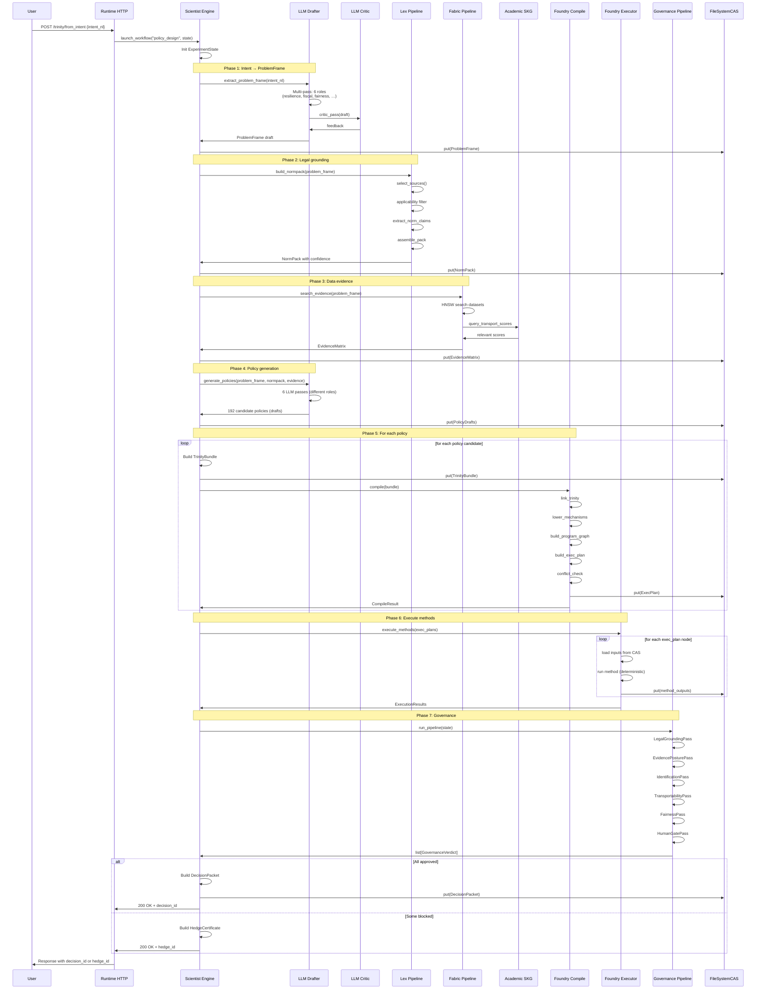

### 13.2. Phase deep-dive: LLM Drafter cycle

Це найскладніший nested-loop у системі. Відбувається **multi-pass + multi-role** генерація.

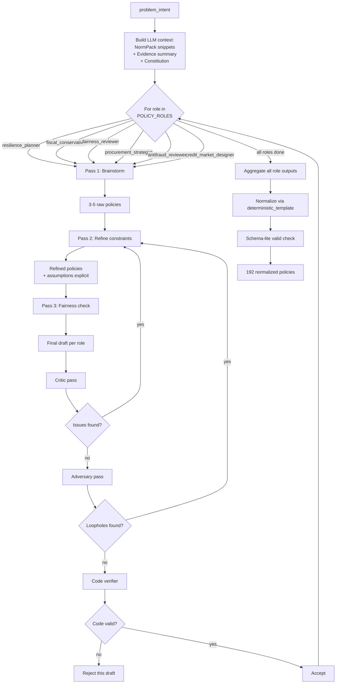

### 13.3. Trinity build phase deep-dive

Після того, як Drafter згенерував candidate policies, для кожного потрібно зібрати **повний TrinityBundle**:

```python
def build_trinity_for_policy(policy_draft: dict, problem_frame_ref: ArtifactRef,
                             registry_bundle_ref: ArtifactRef,
                             data_snapshot_ref: ArtifactRef,
                             store: FileSystemCAS) -> ArtifactRef:
    # 1. Build PolicySpec from draft
    policy_spec = PolicySpec(
        policy_id=policy_draft["policy_id"],
        interventions=[
            InterventionSpec(
                intervention_id=lever_id,
                kind=mechanism_kind_for(lever_id),
                target=build_selector(policy_draft["target_population"]),
                schedule=ScheduleSpec(start_step=0, duration_steps=12),
                params=lever_params,
            )
            for lever_id, lever_params in policy_draft["levers"].items()
        ],
    )
    policy_spec_ref = put_canonical(store, policy_spec)

    # 2. Build ModelSpec referencing data snapshot
    model_spec = ModelSpec(
        model_id=f"baseline_for_{policy_draft['policy_id']}",
        data_snapshot_ref=str(data_snapshot_ref.artifact_id),
        registry_bundle_ref=str(registry_bundle_ref.artifact_id),
        agent_configuration=...,
        assumptions=policy_draft["assumptions"],
        environment={...},
        fidelity_level=FidelityLevel.HYBRID,
    )
    model_spec_ref = put_canonical(store, model_spec)

    # 3. Build TrinityBundle
    bundle = TrinityBundle(
        problem_frame_ref=ProblemFrameRef(artifact_id=problem_frame_ref.artifact_id),
        policy_spec_ref=PolicySpecRef(artifact_id=policy_spec_ref.artifact_id),
        model_spec_ref=ModelSpecRef(artifact_id=model_spec_ref.artifact_id),
    )
    return put_canonical(store, bundle)
```

### 13.4. Compile-execute phase deep-dive

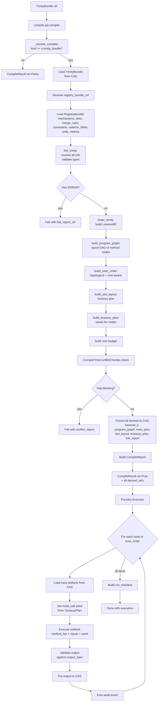

### 13.5. Що відбувається в одному node executor (приклад: AIPW estimator)

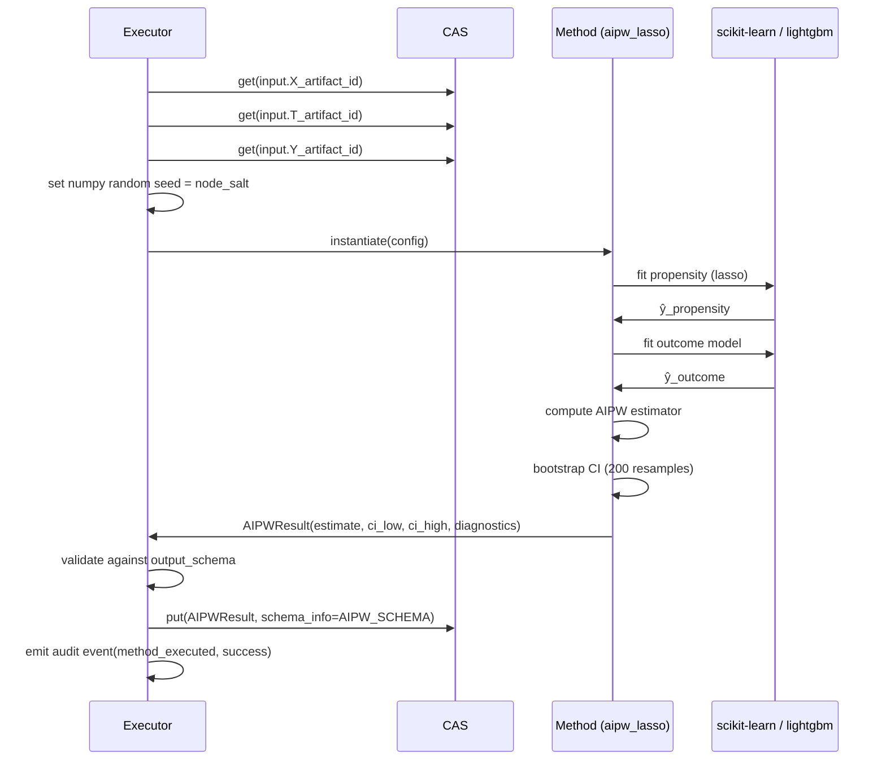

---

## 14. End-to-end workflow B — human-specified Trinity bundle

Альтернативний шлях: користувач вже знає, яку політику аналізувати, і подає **готовий, людиною специфікований TrinityBundle**. LLM-агенти не задіяні (або задіяні мінімально).

### 14.1. Сценарій використання

Цей шлях використовується, коли:
- Юридичний департамент Мінекономіки сформулював політику в IR
- Дослідницька група хоче порівняти 3 заздалегідь визначені варіанти
- Уряд хоче перевірити сумісність нової постанови з existing programs
- Аудитор Рахункової палати робить ретроспективну оцінку

### 14.2. Повна діаграма

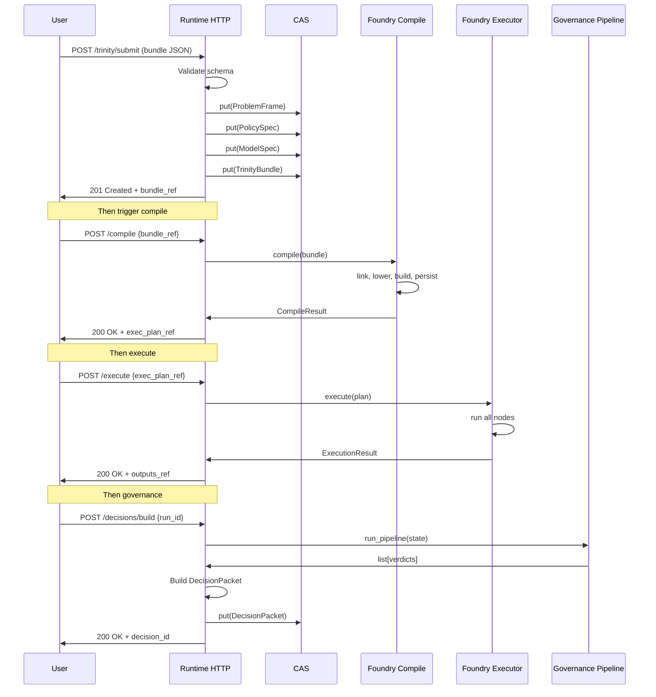

### 14.3. Mediator: replay режим

Третій варіант — replay вже виконаного run. Користувач передає `original_run_id`, система повторює:
1. Завантажує оригінальний `replay_manifest.json`
2. Завантажує оригінальні artifacts (по hashes)
3. Перевіряє, що runtime fingerprint сумісний
4. Виконує всі nodes з тими самими seeds
5. Compares output hashes
6. Видає `ReplayReport`:
   - `byte_identical: bool` — чи bitwise однаковий вивід
   - `tolerance_passed: bool` — чи в межах tolerance budget
   - `mismatched_nodes: list` — які вузли дали інший вивід
   - `runtime_diff: dict` — різниця в runtime environment

### 14.4. Workflow A vs Workflow B порівняння

| Аспект | Workflow A (LLM) | Workflow B (human) |
| --- | --- | --- |
| Вхід | Природномовний intent | Готовий TrinityBundle |
| LLM використання | Інтенсивне (Drafter, Critic, Adversary) | Не використовується |
| Час виконання | Хвилини-години (LLM calls повільні) | Секунди-хвилини |
| Cost | Високий (LLM tokens) | Низький |
| Стабільність | Середня (LLM stochastic) | Висока |
| Контрольованість | Низька (LLM генерує) | Висока (human specifies) |
| Подходящ для | Discovery, brainstorming | Verification, audit |
| Reproducibility | Залежить від LLM seed/temperature | Bitwise (за TreasuryPlan) |

---

## 15. Складні алгоритмічні цикли

Багато алгоритмів у PolicyOS — це nested loops з умовами convergence. Цей розділ детально розбирає найважливіші.

### 15.1. Causal gauntlet (E3 у експерименті)

Класичний алгоритм перевірки методів через множинні DGP. Реалізація в `tools/ops_runners/experiments/run_msme_final_fresg_suite_v3.py:303-360`.

```
ALGORITHM: Causal Gauntlet
INPUTS:
    methods: list[8]            # 8 каузальних методів
    dgps: list[6]              # 6 data-generating processes
    bootstrap_n: 200            # bootstrap resamples
    panel_rows_per_dgp: 75000   # розмір панелі на DGP
    fit_rows_per_replicate: 5000  # розмір ресемплу

OUTPUT:
    causal_method_dgp_grid.csv  # 8×6=48 cells
    causal_method_raw_fits.csv  # 9600 fits
    method_disagreement_matrix.csv

PROCEDURE:
    for dgp_id in dgps:                       # outer loop: 6 iterations
        panel = generate_dgp(dgp_id, 75000)   # generate semi-synthetic data
        true_effect = panel.known_truth

        for method_id in methods:              # mid loop: 8 iterations
            estimates = []
            statuses = []

            for boot_idx in range(200):       # inner loop: 200 iterations
                seed = hash(dgp_id, method_id, boot_idx)
                idx = rng(seed).choice(75000, 5000, replace=True)

                effect, status = estimate_effect(method_id, panel[idx], seed)
                estimates.append(effect)
                statuses.append(status)

            # Aggregate per (method × dgp) cell
            ci_low, ci_high = percentile(estimates, [2.5, 97.5])
            mean_est = mean(estimates)
            bias = mean_est - true_effect
            rmse = sqrt(mean((estimates - true_effect)**2))
            coverage = (ci_low <= true_effect <= ci_high)

            grid_cell = {dgp_id, method_id, mean_est, ci_low, ci_high,
                         bias, rmse, coverage, status_counts}
            write_to_csv(grid_cell)

    # Cross-pair disagreement
    for dgp_id in dgps:
        for (method_a, method_b) in combinations(methods, 2):
            mean_a = grid[dgp_id][method_a].mean
            mean_b = grid[dgp_id][method_b].mean
            disagreement = |mean_a - mean_b|
            write_disagreement(dgp_id, method_a, method_b, disagreement)

TOTAL FITS: 6 × 8 × 200 = 9600
TOTAL TIME: ~668 seconds = ~11 minutes wall-clock
```

### 15.2. Robust policy tournament (E5)

```
ALGORITHM: Many-World Robust Ranking
INPUTS:
    policies: list[192]
    worlds: list[160]              # uncertainty worlds
    ranking_methods: list[5]        # TOPSIS, robust_TOPSIS, regret_min, AHP, ELECTRE
    bootstrap_n: 100

OUTPUT:
    robust_rankings.csv
    robust_score_cis.csv
    rank_position_cis.csv
    statistically_tied_shortlist.csv

PROCEDURE:
    # Step 1: Generate world parameters
    for i in range(160):
        worlds[i] = sample 12 factors from Beta distributions
    worlds_table[160 × 12]

    # Step 2: Score each (policy × world)
    for policy in policies:                     # 192 iterations
        for world in worlds:                    # 160 iterations
            outcome = policy_world_score(policy, world)
            outcome_table[policy_id, world_id] = outcome

    # 192 × 160 = 30 720 outcome rows

    # Step 3: Aggregate per policy
    for policy in policies:
        rows = outcome_table[policy_id, :]
        aggregate[policy_id] = {
            mean_utility: mean(rows.utility),
            p10_utility: percentile(rows.utility, 10),
            mean_regret: mean(max - rows.utility),
            mean_survival: mean(rows.survival),
            ...
        }

    # Step 4: Apply each ranking method
    for method in ranking_methods:               # 5 iterations
        scores[method] = compute_method_scores(aggregate, method)
        rankings[method] = sort(scores[method])

    # Step 5: Bootstrap CI on robust_topsis
    for boot_idx in range(100):                 # 100 iterations
        seed = hash(boot_idx)
        sampled_world_ids = rng(seed).choice(160, 160, replace=True)

        for policy in policies:                  # 192 iterations
            rows = outcome_table[policy_id, sampled_world_ids]
            boot_aggregate[policy_id] = recompute_aggregate(rows)

        boot_scores = compute_method_scores(boot_aggregate, "robust_topsis")
        boot_rankings = sort(boot_scores)

        for policy in policies:
            score_samples[policy_id].append(boot_scores[policy_id])
            rank_samples[policy_id].append(boot_rankings.index(policy_id))

    # Step 6: Compute CIs
    for policy in policies:
        score_ci[policy] = percentile(score_samples[policy], [2.5, 97.5])
        rank_ci[policy] = percentile(rank_samples[policy], [2.5, 97.5])

    # Step 7: Statistically tied shortlist
    top_policy = sorted(score_ci, by=mean)[0]
    tied = [p for p in policies if score_ci[p].high >= score_ci[top].low]

TOTAL OPERATIONS:
    - Outcome scoring: 192 × 160 = 30 720
    - Bootstrap: 192 × 100 = 19 200 aggregations
    - 5 ranking methods × ~200 ops each
TOTAL TIME: ~30 seconds
```

### 15.3. Agent network simulation (E6)

```
ALGORITHM: Vectorized ABM Simulation
INPUTS:
    selected_policies: list[18]
    macro_scenarios: dict[3]      # baseline, intensified, recovery
    agents_n: 220 000
    months: 30
    seeds: 24

OUTPUT:
    scenario_policy_outcomes.csv (18 × 3 = 54 rows + agent_share rows)
    scenario_fragility_table.csv

PROCEDURE:
    # Step 1: Generate agent attributes (deterministic)
    rng = numpy.random.default_rng(20260501)
    sectors = rng.integers(0, 6, size=220000)
    conflict = rng.beta(2.2, 4.5, size=220000)
    liquidity = rng.beta(3.0, 3.0, size=220000)
    digital = rng.beta(2.8, 2.2, size=220000)
    idp = rng.binomial(1, clip(0.12 + 0.38*conflict, 0, 0.85), size=220000)
    region_idx = rng.integers(0, 8, size=220000)

    # Step 2: For each scenario × policy
    for scenario_id, multipliers in macro_scenarios.items():     # 3 iterations
        conflict_m = multipliers["conflict_intensity"]
        energy_m = multipliers["energy_disruption"]
        fiscal_m = multipliers["fiscal_scarcity"]
        demand_m = multipliers["domestic_demand_shock"]

        for policy in selected_policies:                          # 18 iterations
            grant = stable_float(policy_id, "grant", 0.02, 0.12)
            procurement = stable_float(policy_id, "procurement", 0, 0.10)
            credit = stable_float(policy_id, "credit", 0, 0.12)

            survival_samples = []
            employment_samples = []
            utility_samples = []

            # Step 3: For each seed
            for seed_id in range(24):                             # 24 iterations
                noise = rng.normal(0, 0.025, size=220000)
                alive = ones(220000, dtype=bool)
                employment = clip(0.42 + 0.25*liquidity + 0.08*digital
                                  - 0.22*conflict*conflict_m, 0, 1)

                # Step 4: Simulate 30 months
                for month in range(30):                           # 30 iterations
                    support = grant + credit*(liquidity<0.55) + procurement*(sectors<=2)
                    monthly_failure = 0.018 + 0.038*conflict*conflict_m
                                    + 0.020*energy_m - 0.045*support
                                    - 0.012*digital + noise
                    monthly_failure = clip(monthly_failure, 0.001, 0.35)
                    alive &= (rng.random(220000) > monthly_failure)
                    employment = clip(employment + 0.010*support*demand_m
                                     - 0.006*fiscal_m - 0.008*conflict*conflict_m, 0, 1)

                # Per-seed aggregates
                survival_samples.append(alive.mean())
                employment_samples.append(employment[alive].mean() if alive.any() else 0)
                utility_samples.append(0.55*survival + 0.35*employment + 0.10*support.mean())

            # Step 5: Per (scenario × policy) aggregates with CI
            s_lo, s_hi = percentile(survival_samples, [2.5, 97.5])
            e_lo, e_hi = percentile(employment_samples, [2.5, 97.5])
            scenario_outcomes.append({
                scenario_id, policy_id, survival_mean, survival_ci_low, survival_ci_high,
                employment_mean, ..., utility_mean, agent_count: 220000, months: 30, seeds: 24,
            })

    # Step 6: Compute rank_range across scenarios
    for policy in selected_policies:
        ranks = {}
        for scenario in macro_scenarios:
            sorted_outcomes = sort(scenario_outcomes[scenario], by=utility_mean, desc=True)
            ranks[scenario] = position_of(policy, sorted_outcomes)
        rank_range = max(ranks.values()) - min(ranks.values())
        fragility_row = {policy_id, **ranks, rank_range}

    # Step 7: 14/18 expected to have rank_range = 0 (robust)

TOTAL ITERATIONS: 3 × 18 × 24 × 30 = 38 880 month-simulations
                  Each on 220 000 agents = vectorized over arrays
TOTAL TIME: ~3 minutes (vectorization is critical)
```

### 15.4. Fairness audit with bias injection (E7)

```
ALGORITHM: Fairness with Bias Injection
INPUTS:
    selected_policies: list[20]   # standard
    bias_specs: list[3]           # {bias_geo_kyiv_only, bias_credit_history_3y, bias_male_only}
    applicants_n: 200 000
    bootstrap_n: 200

OUTPUT:
    fairness_violation_detection.csv (3/3 expected detected, FPR=0)
    disparate_impact_bounds.csv
    governance_verdicts.jsonl
    contestability_packets.jsonl

PROCEDURE:
    # Step 1: Generate applicant profiles
    rng = numpy.random.default_rng(20260501)
    gender = rng.binomial(1, 0.48, size=200000)
    regions = rng.choice(["Kyiv", "Lviv", "Kharkiv", "Zaporizhzhia",
                          "Donetsk", "Kherson", "Dnipro"],
                         p=[0.14, 0.13, 0.16, 0.12, 0.13, 0.10, 0.22], size=200000)
    conflict_region = isin(regions, ["Kharkiv", "Zaporizhzhia", "Donetsk", "Kherson"])
    idp = rng.binomial(1, where(conflict_region, 0.42, 0.16))
    veteran = rng.binomial(1, where(conflict_region, 0.18, 0.08))
    credit_history = rng.binomial(1, clip(0.72 - 0.35*idp - 0.18*conflict_region, 0.05, 0.9))
    base_score = rng.normal(0, 1, 200000) + 0.35*idp + 0.25*veteran
                  + 0.20*conflict_region + 0.18*credit_history

    # Step 2: For each policy, simulate approvals
    all_policies = selected_policies + bias_specs       # 23 total
    for policy in all_policies:                         # 23 iterations
        if policy.policy_id == "bias_geo_kyiv_only":
            approved = (regions == "Kyiv")
        elif policy.policy_id == "bias_credit_history_3y":
            threshold = quantile(base_score, 0.66)
            approved = (base_score >= threshold) & (credit_history == 1)
        elif policy.policy_id == "bias_male_only":
            threshold = quantile(base_score, 0.66)
            approved = (base_score >= threshold) & (gender == 0)
        else:
            threshold = quantile(base_score, 0.66)
            approved = (base_score >= threshold)

        # Step 3: Compute disparate impact ratios
        gender_ratio = approved[gender==1].mean() / approved[gender==0].mean()
        conflict_ratio = approved[conflict_region].mean() / approved[~conflict_region].mean()
        idp_ratio = approved[idp==1].mean() / approved[idp==0].mean()

        # Step 4: Apply governance gates
        gate = "approve"; reasons = []
        if conflict_ratio < 0.3: gate = "reject_until_review"; reasons += ["geographic_exclusion"]
        if idp_ratio < 0.4:      gate = "reject_until_review"; reasons += ["indirect_temporal_filter"]
        if gender_ratio < 0.5:   gate = "reject_until_review"; reasons += ["protected_attribute_proxy"]
        if min(gender_ratio, conflict_ratio, idp_ratio) < 0.8:
            gate = "human_gate"; reasons += ["disparate_impact_warning"]

        audit_rows.append({policy_id, approval_rate, gender_ratio, conflict_ratio,
                           idp_ratio, gate, reasons, is_bias_injected})

    # Step 5: Bootstrap CIs on disparate impact
    for boot_idx in range(200):
        boot_idx_arr = rng.choice(200000, 200000, replace=True)
        for policy in all_policies:
            recompute ratios on boot_idx_arr
            boot_samples[policy_id].append(ratios)

    # Step 6: Compute detection performance
    detected = [policy for policy in all_policies if policy.gate != "approve"]
    bias_detected = [p for p in detected if p.is_bias_injected]
    bias_count = len(bias_detected)  # expected 3
    false_positives = [p for p in detected if not p.is_bias_injected]
    fpr = len(false_positives) / 20

    # Result: 3/3 detected, FPR = 0.000
```

### 15.5. Causal discovery ensemble (addendum)

Окремий run, що використовує реальні пакети causal-learn, tigramite, dagma.

```
ALGORITHM: Causal Discovery Ensemble
INPUTS:
    panels: 3                     # core_applicant, policy_world, regional_temporal
    algorithms: 6                 # PC, FCI, GES, DAGMA, PCMCI, DirectLiNGAM
    bootstrap_resamples: 100

OUTPUT:
    consensus_pag.json
    consensus_dag_projection.json
    consensus_edge_reliability.csv
    edge_stability_by_method.csv
    discovery_disagreement_heatmap.csv
    latent_confounding_candidates.csv

PROCEDURE:
    for panel in panels:                            # 3 iterations
        for algorithm in algorithms:                # 6 iterations
            algorithm_runs = {}
            for boot_idx in range(100):             # 100 iterations
                seed = hash(panel, algorithm, boot_idx)
                resampled_data = bootstrap(panel.data, seed)

                if algorithm == "PC":
                    edges = causal_learn.PC(resampled_data, alpha=0.05)
                elif algorithm == "FCI":
                    edges = causal_learn.FCI(resampled_data, alpha=0.05)
                elif algorithm == "GES":
                    edges = causal_learn.GES(resampled_data, score="bic")
                elif algorithm == "DAGMA":
                    edges = dagma.DAGMA(resampled_data, lambda1=0.1)
                elif algorithm == "PCMCI":
                    edges = tigramite.PCMCI(resampled_data, tau_max=3)
                elif algorithm == "DirectLiNGAM":
                    edges = lingam.DirectLiNGAM(resampled_data)

                algorithm_runs[boot_idx] = edges

            # Stability per algorithm
            edge_stability = compute_stability(algorithm_runs)
            stability_table[panel][algorithm] = edge_stability

        # Cross-algorithm consensus
        for edge in all_possible_edges:
            supporting_methods = [a for a in algorithms if edge in stability_table[panel][a].stable]
            if len(supporting_methods) >= 4:        # consensus threshold
                consensus_edges.append(edge)

        # Latent confounding detection (FCI-specific)
        for edge in fci_edges:
            if edge.has_unstable_direction across runs:
                latent_candidates.append(edge)

TOTAL RUNS: 3 panels × (240 PC + 144 FCI + 192 GES + 96 DAGMA + 144 PCMCI + 48 LiNGAM) = 864
COMPLETED: 864 (no failures)
CONSENSUS EDGES: 96
LATENT CANDIDATES: 34
```

### 15.6. Scientist orchestration loop (general)

Загальний паттерн scientist'а — це **conditional state machine**:

```
ALGORITHM: Scientist Workflow Execution
INPUTS:
    workflow_id: str
    initial_state: ExperimentState

PROCEDURE:
    state = initial_state
    workflow = workflow_registry.get(workflow_id)
    engine = LangGraphEngine(workflow)

    while not engine.is_terminal(state):
        # Get next node based on state and conditions
        next_node = engine.next_node(state)

        # Pre-flight checks
        budget_remaining = check_budget(state)
        if budget_remaining < node.cost_estimate:
            state = state.add_error("budget_exhausted")
            break

        # Execute node
        try:
            with tracing.span(node.name):
                with checkpoint.before(node):
                    new_state = node.execute(state)
                    checkpoint.after(node, new_state)
        except Exception as e:
            if circuit_breaker.is_open(node):
                state = state.add_error(f"circuit_breaker_open:{node.name}")
                break
            else:
                circuit_breaker.record_failure(node)
                if node.retry_policy.allows_retry():
                    continue  # retry
                else:
                    if node.has_compensation():
                        compensation.run(node, state)
                    state = state.add_error(f"node_failed:{node.name}:{e}")
                    break

        # Update state
        state = new_state

        # Emit audit event
        audit.emit(node_completed, state.run_id, node.name, new_state.artifacts)

        # Check convergence (for iterative workflows)
        if workflow.is_iterative and convergence.check(state):
            break

    # Build final decision
    if state.has_errors():
        decision = HedgeCertificate(state)
    else:
        verdicts = governance_pipeline.run(state)
        if all(v.is_approve() for v in verdicts):
            decision = DecisionPacket(state, verdicts)
        else:
            decision = HedgeCertificate(state, verdicts)

    return decision
```

---

## 16. Контентно-адресоване сховище і ланцюг артефактів

CAS — це не «файлова система», а **семантика провенансу**.

### 16.1. ArtifactID, ArtifactRef, InputRef

```python
class ArtifactID:
    sha256_hex: str  # 64 hex chars

    @classmethod
    def from_sha256_hex(cls, hex_str: str) -> "ArtifactID": ...
    @classmethod
    def from_content(cls, content: bytes) -> "ArtifactID":
        return cls(sha256_hex=hashlib.sha256(content).hexdigest())
    def __str__(self) -> str:
        return f"sha256:{self.sha256_hex}"


class SchemaInfo:
    schema_id: str          # e.g. "ir.trinity_bundle.v1"
    schema_version: str     # e.g. "1.0"
    canonical_form: bool    # whether canonicalized


class InputRef:
    artifact_id: ArtifactID
    role: str               # e.g. "policy_spec", "registry_bundle"
    schema_info: SchemaInfo


class ArtifactRef:
    artifact_id: ArtifactID
    schema_info: SchemaInfo
    inputs: list[InputRef]  # provenance edges
    metadata: dict[str, Any]
    created_at: datetime
    creator: str            # who created it
```

Ключове: **`inputs` робить ArtifactRef provenance-aware**. Кожен derived artifact знає, з яких inputs був створений.

### 16.2. Граф провенансу одного експерименту

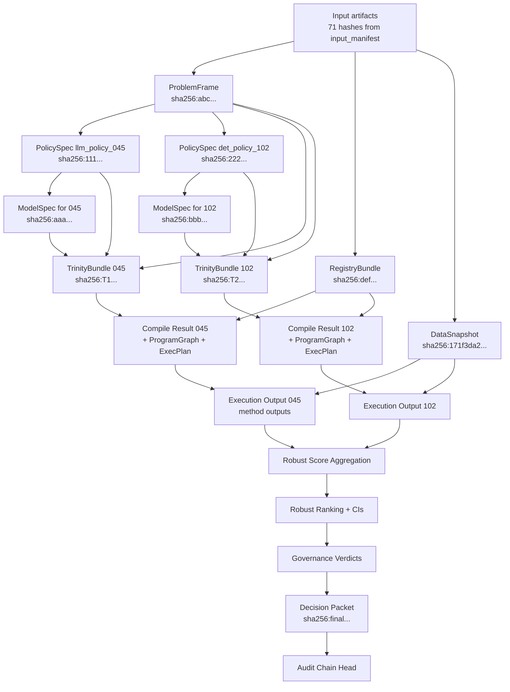

Будь-який вузол можна перевірити:
```bash
# Verify decision packet hash
sha256sum decision.json | grep $expected_hash

# Trace provenance
python -m polisyos.core.cas.trace --artifact sha256:final... --backwards
# Outputs: ranking, exec1, exec2, compile1, compile2, trinity1, trinity2, ...
```

### 16.3. Audit chain — append-only ledger

Audit chain — це послідовність events:
```python
class AuditEvent:
    event_id: str           # uuid
    event_type: str         # compile_started, method_executed, decision_published, ...
    timestamp: datetime
    run_id: str
    actor: str              # service identity
    artifact_refs: list[ArtifactRef]
    parent_event_id: str | None
    chain_hash: str         # sha256 of (parent.chain_hash + this content)
```

Властивості:
- **Tamper-evident.** Будь-яка зміна event порушує `chain_hash` усіх downstream events.
- **Replay-able.** Можна перевиконати workflow, відтворюючи послідовність events і перевіряючи hashes.
- **Retention policy.** Кожен event має `retain_until` — дату, до якої event не може бути видалений.

### 16.4. Підписування критичних артефактів

```python
class Signature:
    algorithm: str          # ed25519, hmac-sha256, x509
    public_key_id: str      # key fingerprint
    signature_bytes: bytes
    signed_at: datetime
    signer: str             # entity identity


class SignedArtifact:
    artifact_ref: ArtifactRef
    signatures: list[Signature]
```

Decision packets, audit chain heads, NormPack manifests завжди підписуються. Це дає **non-repudiation**: signer не може заперечити, що видав даний висновок.

---

## 17. Governance, аудит, підзвітність

### 17.1. Governance pipeline у деталях

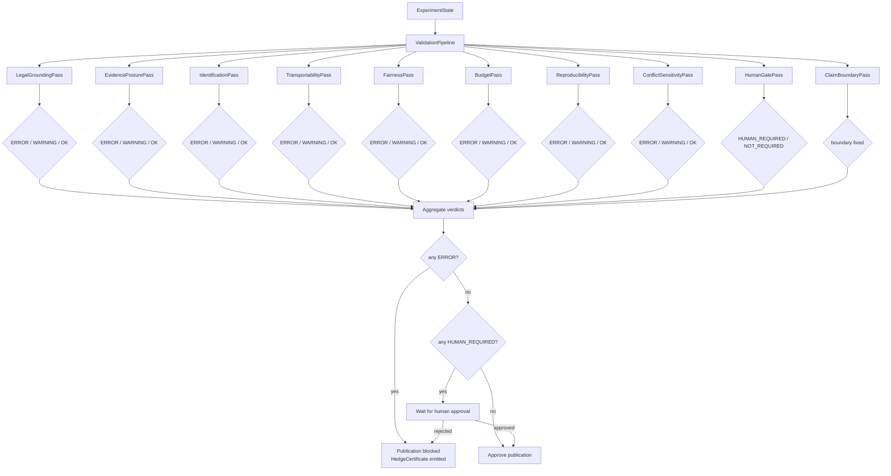

### 17.2. Кожен ValidatorPass у деталях

#### LegalGroundingPass

Перевіряє:
- `policy_spec.legal_evidence_refs` не порожній
- Refs resolves в Lex (NormPack)
- `legal_compatibility >= 0.5`
- Amendments are current

ERROR → publication blocked.

#### EvidencePosturePass

Перевіряє:
- `evidence_matrix` присутній
- Принаймні `proxy_supported` для основних claims
- HNSW search top-k має достатньо релевантних

WARNING для `missing`, ERROR для повного провалу.

#### IdentificationPass

Перевіряє `identification_proof_chain`:
- All 4 steps not_blocked OR explicitly hedged
- Якщо microdata_requirement blocked → HedgeCertificate

ERROR при blocked steps без hedge.

#### TransportabilityPass

Перевіряє transport_score:
- Якщо score < 0.58 і evidence використовується → ERROR
- Якщо CI пересікається з порогом → WARNING + downgrade verdict

#### FairnessPass

Перевіряє disparate impact:
- gender_ratio >= 0.8
- conflict_region_ratio >= 0.8
- idp_ratio >= 0.8
- Якщо < 0.5 на будь-якому → ERROR
- Якщо < 0.8 → WARNING + human_gate

#### BudgetPass

Перевіряє:
- Не вийшли за обмежений budget
- LLM costs < threshold
- Не виявлено cost anomaly

WARNING при перевищенні soft limit, ERROR при перевищенні hard limit.

#### ReproducibilityPass

Перевіряє:
- `replay_command.sh` є
- `replay_manifest.json` валідний
- Все input artifacts мають hashes
- Runtime fingerprint зафіксовано

ERROR при відсутності.

#### ConflictSensitivityPass

Для України під воєнним станом:
- Чи політика враховує ризики прифронтових територій
- Чи є fallback для disrupted infrastructure
- Чи conflict_region не виключений автоматично

WARNING при відсутності explicit consideration.

#### HumanGatePass

Не блокує сама по собі — позначає, що треба людську перевірку. Triggers:
- Будь-який FairnessPass WARNING
- Топ-1 політика з родини, що ніколи раніше не perevірялась людиною
- Бюджет політики > $100M
- Adversary pass виявив критичні loopholes

#### ClaimBoundaryPass

Не валідатор — формалізатор. Гарантує, що в decision packet є явний `claim_boundary` field з текстом, що описує межі заявлень.

### 17.3. Decision Packet структура

```python
class DecisionPacket:
    # Identity
    decision_id: str
    run_id: str
    workflow_id: str
    published_at: datetime
    expires_at: datetime | None

    # Summary
    summary: str
    recommendation: str
    confidence_label: str  # high / medium / low / declined

    # Boundaries
    claim_boundary: str    # "machine_readable_policy_artifact_not_legal_enactment"
    intended_use: str
    not_intended_use: list[str]

    # Evidence
    supporting_artifacts: dict[str, ArtifactRef]
    governance_verdicts: list[GovernanceVerdict]
    contestability_packet: ArtifactRef
    audit_chain: ArtifactRef
    replay_command: str

    # Signatures
    signatures: list[Signature]

    # Optional human review
    human_reviewer: str | None
    human_review_notes: str | None
```

### 17.4. Contestability packet

`contestability_packet` — це **готовий пакет для оскарження**:
```python
class ContestabilityPacket:
    decision_id: str
    why_decided_this_way: str           # explanation
    what_factors_decisive: list[Factor]
    what_could_change_decision: list[str]
    how_to_challenge: list[str]
    relevant_data: dict[str, ArtifactRef]
    contact_for_review: str
    contestation_deadline: datetime
```

Це і є ключова для toeslagenaffaire-prevention: будь-яка публікована decision **повинна** мати готовий пакет, що пояснює, як її оскаржити.

### 17.5. Аудит-trail — практичний приклад

Уявімо, що Рахункова Палата хоче перевірити decision_id `dec_abc123`. Алгоритм:

1. **Get decision packet:** `GET /api/v1/decisions/dec_abc123` → DecisionPacket з підписом
2. **Verify signature:** перевірити signature через public_key_id
3. **Get audit_chain:** з decision packet → ArtifactRef → resolve у CAS
4. **Walk chain backwards:** від decision_published event до root_initial event
5. **For each event:** перевірити `chain_hash == sha256(parent.chain_hash + content)`
6. **For each artifact_ref у events:** resolve у CAS, перевірити sha256
7. **Якщо щось не сходиться** — звіт про tampered chain
8. **Optional: повний replay** через `replay_command.sh`
9. **Compare outputs:** byte-by-byte (для bitwise) або з tolerance

Якщо все пройшло — decision **криптографічно підтверджено**. Це і є technical foundation для accountable AI.

---

## 18. Межі заявлень і свідомі обмеження

PolicyOS має **явний реєстр того, що система не робить**.

### 18.1. Не замінює юридичну експертизу

Будь-яке `legal_compatibility` обчислення — це **індикатор**, не висновок. Юридичний висновок робить уповноважений суб'єкт (юрвідділ, суд, адвокат). PolicyOS може:
- Сказати «прохід політики через legal screen 0.78» — індикатор сумісності
- Сказати «перевірити статтю X закону Y» — рекомендація для юриста
- Не може сказати «ця політика юридично законна / незаконна»

### 18.2. Не замінює мікродані агрегатами

Якщо мікроданих немає, PolicyOS залишається на рівні **семисинтетичної валідації методів**. Це не може бути названо «оцінкою ефекту програми». Чітка декларація:
- ✅ «Метод AIPW дає bias 0.02 при truth 0.08 на DGP "clean"»
- ❌ «Програма "Власна справа" створила 27 тисяч робочих місць»

Для другого твердження потрібні мікродані ДПС, Держстату, банків — їх відсутність блокує таку оцінку.

### 18.3. Не публікує точкову каузальну оцінку без identification

Identification chain має 4 кроки:
1. `define_treatment` — що таке treatment?
2. `define_outcome` — що таке outcome?
3. `adjustment_set` — за чим контролюємо?
4. `microdata_requirement` — чи є мікродані?

Якщо хоча б один блокується → `HedgeCertificate` замість `CausalEstimate`. У дипломному експерименті 4-й крок (microdata) blocked → видається лише HedgeCertificate.

### 18.4. Не приховує неактивованих компонентів

Цей документ **явно фіксує**, що з 389 методів виконано 9, з повного Lex pipeline активовано 0 кроків NormPack, з 5 frontier-методів виконано 1 (BayesianBART). Це не недолік — це **honest reporting**: кожен висновок має бути привʼязаний саме до того, що дійсно робилося, а не до архітектурних можливостей.

### 18.5. Не претендує на «об'єктивно найкращу політику»

`robust_topsis` topоф — це топ за конкретною аґрегацією 3-х метрик з конкретними вагами на конкретних даних. Зміна:
- ваг функції utility
- набору `world factors`
- порогу `transport_score`
- семантики `binding ablations`

— може поміняти топ. Це чесно фіксується через **statistically_tied_shortlist**: якщо 2-3 політики статистично нерозрізнювані, видається список, не один winner.

### 18.6. Не замінює демократичний процес

`Decision Packet` — це **вхід для людини**, не replacement для:
- Парламентського обговорення
- Громадських консультацій
- Відкритого публічного звіту
- Виборчого мандату

PolicyOS дисциплінує evidence flow до того, як policy обговорюється, але не приймає рішень за людей.

### 18.7. Frontier methods — це opt-in

Усе, що в `polisyos.foundry.methods.catalog` під ярликом `frontier`, не активується замовчуванням. Для production-deploy використовуються лише методи з:
- `truthfulness_status: verified`
- `determinism_tier >= tolerance_bounded`
- `runtime_posture.available: true`

Frontier-методи можуть бути активовані для research-runs з прапорцем `--enable-frontier-optin`, але вимагають додаткового signoff.

### 18.8. Reproducibility має межі

Replay-by-default не означає «ідентичний bit-by-bit на будь-якому обладнанні». Tier хоч і `bitwise`, обмежений:
- однією версією Python
- однією версією numpy/scipy
- одним типом CPU (x86-64 + AVX2)
- однаковою OS
- absence of GPU race conditions

Для tolerance_bounded methods: `tolerance_budget` — explicit upper bound on deviations.

---

## 19. Додатки

### 19.1. Додаток A — Глосарій термінів

| Термін | Визначення |
| --- | --- |
| **TrinityBundle** | Об'єднуючий контракт ProblemFrame + PolicySpec + ModelSpec |
| **ProblemFrame** | Why: цілі, KPI, обмеження, контекст |
| **PolicySpec** | What: інтервенції, параметри, schedule, mechanism bindings |
| **ModelSpec** | How: data snapshot, agents, assumptions, environment |
| **NormPack** | Пакет нормативних фактів, привʼязаних до конкретного контексту, з applicability verdict |
| **EvidenceMatrix** | Ріжниця attributes×datasets×academic_claims×lex_norms для конкретного запиту |
| **ProgramGraph** | Типізована DAG методних викликів для одного TrinityBundle |
| **ExecPlan** | Топологічний порядок виконання nodes у ProgramGraph + cost budget + treasury plan |
| **TreasuryPlan** | Детермінований seed-план для відтворюваності |
| **SlotLayout** | Memory layout для slot families у виконанні |
| **CapabilityContract** | Контракт того, які semantic claims метод може робити |
| **CausalIdentificationFamily** | Категорія підходу до causal identification (RANDOMIZATION, IGNORABILITY, IV, RDD, …) |
| **DeterminismTier** | bitwise / tolerance_bounded / seed_dependent / non_deterministic |
| **TruthfulnessTier** | descriptive / predictive / causal_associational / causal_identified / causal_robust |
| **HedgeCertificate** | Артефакт замість CausalEstimate, коли identification неможлива |
| **DecisionPacket** | Фінальний підписаний artifact для публікації |
| **ContestabilityPacket** | Готовий пакет для оскарження decision |
| **CAS** | Content-Addressed Storage |
| **ArtifactRef / ArtifactID** | Refs з sha256 hashes |
| **AuditChain** | Append-only ledger подій з hash chain |
| **ValidatorPass** | Один контракт у governance pipeline |
| **GovernanceVerdict** | Verdict з ValidatorPass: APPROVE / WARNING / ERROR / HUMAN_REQUIRED |
| **ReplayManifest** | Метадані для відтворення run з тих самих inputs |
| **ReplayReport** | Звіт після replay з порівнянням output hashes |
| **FRESG** | Framework: Formalization / Reproducibility / Evidence / Scalability / Governance |

### 19.2. Додаток B — Перелік 389 Foundry методів за родинами

| Родина | Файлів у `catalog/` | Приклади методів |
| --- | ---: | --- |
| `causal/` | 131 | AIPW, IPW, TMLE, DML, causal forest, BCF, TMLE-CT, RD, IV-2SLS, DiD-callaway-santanna, synthetic_control, mediation, e_value, rosenbaum_bounds, transport_estimator, … |
| `econometrics/` | 19 | OLS, GLM, panel_fe, panel_re, dynamic_panel, GMM, instrumental_variables, ARDL, VAR, VECM, … |
| `survey/` | 15 | survey_mean, survey_total, raking, post_stratification, multi_imputation, calibration_weights, design_effect, … |
| `optimization/` | 13 | linear_programming, mixed_integer, robust_optimization, stochastic_programming, multi_objective, regret_minimization, … |
| `ml/` | 11 | ridge, lasso, random_forest, gbm, xgboost, lightgbm, neural_net, calibration_isotonic, calibration_platt, … |
| `bayesian/` | 10 | bayesian_linear, bayesian_logit, bayesian_survival, BART, gaussian_process, hierarchical_model, MCMC_diagnostics, ABC, SBI, posterior_summary |
| `network/` | 9 | network_summary, centrality, community_detection, peer_effects, spillover_estimation, network_diffusion, … |
| `microsim/` | 8 | tax_microsim, transfer_microsim, pension_microsim, employment_microsim, behavior_microsim, … |
| `forecasting/` | 7 | ARIMA, exponential_smoothing, prophet, structural_VAR, baseline_forecast, scenario_forecast, ensemble_forecast |
| `distributional/` | 7 | gini, theil, atkinson, foster_greer_thorbecke, alkire_foster, distributional_decomposition, qte |
| `sensitivity/` | 6 | sobol, morris, e_value, rosenbaum, specification_curve, conformal_intervals |
| `policy/` | 5 | policy_simulation, policy_ranking, policy_selection, policy_diff, policy_validate |
| `simulation/` | 5 | abm_simulation, monte_carlo, system_dynamics, discrete_event, … |
| `spatial/` | 4 | spatial_autocorrelation, GWR, spatial_lag, MAUP_test |
| `dependence/` | 3 | copula, multivariate_normal, vine_copula |
| `validation/` | 3 | bootstrap_validation, cross_validation, holdout_validation |
| `mechanism/` | 2 | mechanism_design, auction_simulation |
| **Разом** | **261** файл | + ~120 файлів registry, dispatch, infrastructure |

### 19.3. Додаток C — Перелік 37+ Scientist node types

| Категорія | Nodes |
| --- | --- |
| **Planning** | `planning.expand_legal_source_pack`, `planning.run_source_gap_review`, `planning.run_source_verification`, `planning.problem_intent_extraction`, … |
| **Compile** | `compile.trinity_compile`, `compile.lower_mechanisms`, `compile.build_program_graph`, `compile.derive_exec_plan`, … |
| **Data** | `data.snapshot_freeze`, `data.evidence_retrieval`, `data.fabric_search`, `data.academic_search`, … |
| **Causal** | `causal.identification_check`, `causal.estimator_dispatch`, `causal.bootstrap_aggregation`, `causal.method_disagreement`, `causal.sensitivity_surface` |
| **Simulate** | `simulate.agent_simulation`, `simulate.scenario_run`, `simulate.macro_overlay`, … |
| **Decide** | `decide.robust_ranking`, `decide.tied_shortlist`, `decide.decision_card_build`, `decide.publish` |
| **Governance** | `governance.legal_grounding`, `governance.evidence_posture`, `governance.fairness_audit`, `governance.human_gate`, `governance.claim_boundary` |
| **Validation** | `validation.schema_check`, `validation.replay_check`, `validation.runtime_fingerprint` |
| **Special** | `c6c_runtime_support`, `checkpoint_marker`, `tracing` |

### 19.4. Додаток D — Перелік 30+ Fabric connectors

| Country / Org | Connector Source |
| --- | --- |
| Україна | `data_gov_ua_broad`, `data_gov_ua_exec` |
| Молдова | `data_gov_md_broad`, `data_gov_md_exec` |
| Польща | `data_gov_pl_broad`, `data_gov_pl_exec` |
| Румунія | `data_gov_ro_broad`, `data_gov_ro_exec` |
| OECD | `oecd` |
| Eurostat | `eurostat` |
| World Bank | `worldbank` |
| ILO | `ilo` |
| WHO | `who` |
| UNESCO UIS | `unesco_uis` |
| UN Population Division | `unpd` |
| UN Data | `undata` |
| ECB | `ecb` |
| IMF | `imf` |
| EIA API | `eia_api` |
| World Values Survey | `wvs` |
| Open Meteo | `open_meteo` |
| OpenAQ v2 | `openaq_v2` |
| Wikidata SPARQL | `wikidata_sparql` |
| DBpedia SPARQL | `dbpedia_sparql` |
| Chicago OpenData | `chicago_opendata`, `chicago_opendata_exec` |
| NYC OpenData | `nyc_opendata`, `nyc_opendata_exec` |
| Paris OpenData | `paris_opendata_broad`, `paris_opendata_exec` |
| Opendatasoft | `opendatasoft_public` |
| UK ONS | `ukons` |

### 19.5. Додаток E — Покажчик ключових файлів коду

| Контракт / шар | Файл |
| --- | --- |
| TrinityBundle (контракт) | `src/polisyos/core/contracts/trinity.py` |
| ProgramGraph / ExecPlan (контракт) | `src/polisyos/core/contracts/foundry.py` |
| MethodCatalogSnapshot (контракт) | `src/polisyos/core/contracts/execution_plan.py` |
| Compile entry point | `src/polisyos/foundry/compile/api.py:38` |
| Compile backend | `src/polisyos/foundry/compile/trinity_compiler.py:38` |
| Method catalog snapshot builder | `src/polisyos/foundry/methods/catalog/snapshot.py:50` |
| Causal capability contract | `src/polisyos/foundry/methods/catalog/causal/capabilities.py` |
| Treasury plan | `src/polisyos/foundry/mechanisms/treasury.py` |
| IR linker | `src/polisyos/ir/linker/link_trinity.py` |
| FileSystemCAS | `src/polisyos/core/artifacts/store.py` |
| Audit chain | `src/polisyos/core/audit/chain.py` |
| Trinity contract docs | `docs/contracts/TRINITY.md` |
| ADR index | `docs/adr/` (163 файли) |
| OpenAPI schema | `schemas/runtime_api_v1.openapi.json` |
| JSON schemas | `schemas/snapshots/` (131 файл) |

### 19.6. Додаток F — Команда відтворення дипломного експерименту

```bash
# Full replay command from 10_ablation_reproducibility/replay_command.sh
tools/ops_runners/experiments/run_msme_final_fresg_suite_v2.py \
  --mode run --profile default \
  --run-id msme_final_fresg_evaluation_v3_20260501_20260430-184808 \
  --workdir /mnt/experiments/msme_final_fresg_evaluation_v3_20260501 \
  --output-dir /mnt/experiments/.../msme_final_fresg_evaluation_v3_20260501_20260430-184808 \
  --repo-root /mnt/experiments/polisyos/policy-engine \
  --production-data /mnt/experiments/msme_deadline_20260430/input/production_data \
  --gcs-prefix gs://lex-1-494208-data/experiments/.../... \
  --threads 12 --policy-count 192 --fabric-dataset-limit 8000 \
  --metric-binding-limit 12000 --academic-evidence-limit 3000 \
  --causal-panel-rows 750000 --direct-foundry-subsample-rows 12000 \
  --dgp-count 6 --heavy-methods-per-dgp 8 --bootstrap-replicates 200 \
  --enable-bootstrap true --discovery-algorithms pc,fci,ges,dagma,pcmci \
  --discovery-bootstrap-resamples 100 --transport-bootstrap-resamples 200 \
  --uncertainty-worlds 160 --ranking-methods topsis,robust_topsis,regret_min,ahp_weighted,electre_iii \
  --ranking-bootstrap-resamples 100 --agent-count 220000 --simulation-months 30 \
  --simulation-seeds 24 --shortlist-size 18 \
  --macro-scenarios baseline_2026,intensified_conflict,partial_recovery \
  --applicant-profiles 200000 --enable-bias-injection true \
  --bias-injection-policies bias_geo_kyiv_only,bias_credit_history_3y,bias_male_only \
  --fairness-bootstrap-resamples 200 --ablation-variants 8 --ablation-semantics binding \
  --enable-vertical-slice true --vertical-slice-program vlasna_sprava_canonical \
  --enable-sensitivity-surface true --enable-frontier-optin true \
  --frontier-method bayesian_bart \
  --bart-chains 4 --bart-burnin 1000 --bart-samples 2000 --bart-max-runtime-seconds 1800
```

### 19.7. Додаток G — Топ-10 політик з диплому

| Rank | Policy ID | Family | robust_score | 95% CI |
| ---: | --- | --- | ---: | --- |
| 1 | `llm_policy_045` | tax_relief | 0.9995 | [0.9919; 1.0000] |
| 2 | `det_policy_102` | credit_guarantee | 0.9919 | [0.9864; 0.9954] |
| 3 | `det_policy_027` | procurement_anchor | 0.9669 | [0.9609; 0.9730] |
| 4 | `llm_policy_027` | microgrant_restart | 0.9615 | [0.9555; 0.9675] |
| 5 | `det_policy_035` | procurement_anchor | 0.9516 | [0.9462; 0.9549] |
| 6 | `det_policy_045` | relocation_frontline | 0.9496 | [0.9415; 0.9507] |
| 7 | `det_policy_097` | microgrant_restart | 0.9474 | [0.9422; 0.9525] |
| 8 | `llm_policy_035` | microgrant_restart | 0.9462 | [0.9407; 0.9495] |
| 9 | `det_policy_086` | credit_guarantee | 0.9437 | [0.9384; 0.9476] |
| 10 | `llm_policy_040` | digital_export | 0.9414 | [0.9318; 0.9426] |

**Statistically tied shortlist:** `llm_policy_045` + `det_policy_102` (CIs пересікаються, неможливо статистично відрізнити).

### 19.8. Додаток H — Висновки і пов'язані документи

#### Що цей документ показує

1. **Масштаб системи реальний.** Не «framework» — повна інтегрована платформа з 770к LOC, 14 пакетами, 30 ГБ predobroblenoji evidence, 389 методами, 37+ workflow nodes.
2. **Експеримент дипломної — це один маршрут із багатьох.** Архітектура підтримує:
   - Workflow A (LLM-driven, починається з NL intent)
   - Workflow B (human-specified Trinity)
   - Replay (повторне виконання з оригінальних inputs)
   - Continuous governance (production runtime)
3. **Дедлайн вплинув на дизайн експерименту:** Lex pipeline не був прокинутий, повний compile/execute не використовувався, з 389 методів задіяно 9.
4. **Що працює — працює якісно:** 3/3 предвзяті політики пійманo з FPR=0; топ-2 політики статистично нерозрізнювані; audit chain з 9 SHA-256 нодів.
5. **Що не зроблено — задекларовано:** Lex deferred, sensitivity surface blocked (Primary estimands=0), 53 з 192 політик не пройшли b binding-ablation no_lex.

#### Пов'язані технічні документи

- [Trinity contracts](../contracts/TRINITY.md)
- [Core CAS contracts](../contracts/E1_4_CORE_CAS_CANON_CONTRACTS_COMPONENTS.md)
- [Scientist engine protocol](../contracts/E1_6_SCIENTIST_ENGINE_SKELETON_NODE_PROTOCOL.md)
- [Foundry frontier methods](../reference/foundry/frontier-methods.md)
- [Scientist frontier runtime](../reference/scientist/frontier-runtime.md)
- [Platform acceptance audit](../reference/operations/platform-acceptance-audit.md)
- [Quality gates](../reference/quality-gates.md)
- ADR series 0096–0148 у `docs/adr/`

#### Пов'язані експериментальні артефакти

- Робочий замовлений експеримент: `gs://lex-1-494208-data/experiments/msme_final_fresg_evaluation_v3_20260501/.../12_final_dossier/`
- Локальний експорт: `/Users/deniskopylov/Downloads/msme_final_experiments_export_2026-05-01/`
- Discovery addendum: `discovery_addendum/` у тому ж експорті
- Honest description документ: `MSME_PolicyOS_experiment_honest_description.md`

---

**Кінець документа.**

> Цей документ описує **архітектуру PolicyOS Policy Engine** станом на 2026-05-08. Кваліфікаційна робота використала фрагмент цієї архітектури в одному дедлайн-запуску. Те, що в експерименті не активовано, не означає, що архітектура не повна — це означає, що повний контур доступний для подальших production-деплоїв та research-runs.


