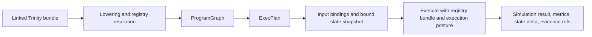

# Causal Engine

Related reference: [Foundry compile and execute](../reference/foundry/compile-execute.md), [Foundry calibration](../reference/foundry/calibration.md), [Scientist workflows](../reference/scientist/workflows.md), [Scientist causal](../reference/scientist/causal.md), [Scientist causal validity](../reference/scientist/causal-validity.md).
Related contracts: [E1.5 Foundry pure compute split compilers](../contracts/E1_5_FOUNDRY_PURE_COMPUTE_SPLIT_COMPILERS.md), [E1.6 Scientist engine protocol](../contracts/E1_6_SCIENTIST_ENGINE_SKELETON_NODE_PROTOCOL.md).
Related ADRs: [ADR-0018](../adr/0018-causal-estimator-protocol.md), [ADR-0027](../adr/0027-dowhy-primary-graph-identify-estimate.md), [ADR-0038](../adr/0038-law-t-transportability-required.md).
Evidence: `tests/foundry/test_quickstart.py`, `tests/foundry/test_compile_determinism.py`, `tests/foundry/test_execute_input_bindings.py`, `tests/scientist/nodes/builtins/causal/test_run_causal_ensemble.py`, [benchmark regression triage](../runbooks/benchmark-regression-triage.md).

The causal engine is a two-layer system:

- Foundry lowers contracts into executable causal and simulation artifacts.
- Scientist decides when that execution is admissible, what evidence must
  accompany it, and whether the result is promotable.

## Foundry Compile And Execute Flow

This flow is backed by the public `compile()` and `execute()` APIs described in
the Foundry reference.

## Why The Split Matters

Foundry can stay reusable and method-centric only if it does not also decide:

- which workflow path to run;
- whether proxy, transportability, or interference checks were sufficient;
- whether a result needs human review or cannot be published.

Scientist owns those decisions through workflow routing, readiness bundles,
governance passes, and decision artifacts.

## Pipeline Stages

| Stage | Primary owner | Evidence anchor |
|---|---|---|
| Discovery and graph shaping | Foundry methods + Scientist routing | Foundry method tests and Scientist workflow tests |
| Identification and estimation | Foundry method catalog | ADR-backed method tests |
| Bounds, proxy, and sensitivity handling | Foundry plus IR observation contracts | Foundry causal tests and IR observation tests |
| Readiness, governance, publication | Scientist | Scientist causal-validity and governance pages |

## Non-Default Capability Policy

Advanced capability families that require explicit rollout proof are documented
separately and are not described here as the default causal path:

- [Foundry frontier methods](../reference/foundry/frontier-methods.md)
- [Scientist frontier runtime](../reference/scientist/frontier-runtime.md)
- [Scientist phase 4 acceptance](../reference/scientist/phase4-acceptance.md)

This page describes the default compile/execute and governance-backed path.
