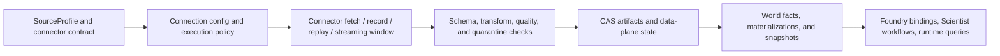
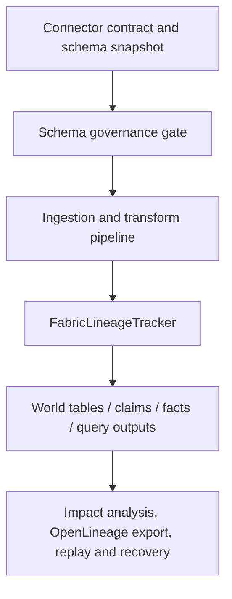

# Data Fabric

Related reference: [Fabric index](../reference/fabric/index.md), [data plane](../reference/fabric/data-plane.md), [schema compatibility](../reference/fabric/schema-compatibility.md), [lineage](../reference/fabric/lineage.md), [quality](../reference/fabric/quality.md), [time travel](../reference/fabric/time-travel.md).
Related contracts: [E2.2 world store and world event](../contracts/E2_2_FABRIC_WORLD_STORE_EMIT_FACTS_WORLD_EVENT.md), [E2.3 world DuckDB materialization](../contracts/E2_3_FABRIC_WORLD_DUCKDB_MATERIALIZATION_V1_0.md), [E2.5 docs pipeline](../contracts/E2_5_FABRIC_DOCS_PIPELINE_V1_0.md), [E2.6 claims pipeline](../contracts/E2_6_FABRIC_CLAIMS_PIPELINE_V1_0.md).
Related ADRs: [ADR-0021](../adr/0021-connector-schema-contracts-and-storage-port.md), [ADR-0056](../adr/0056-wgi-wdi-fabric-connector-wvs-new.md), [ADR-0107](../adr/0107-ir-analytics-normalization-and-schema-compatibility.md).
Evidence: `tests/unit/fabric/data_plane/test_orchestrator.py`, `tests/unit/fabric/data_plane/test_streaming_runtime.py`, `tests/unit/fabric/test_lineage.py`, `tests/tools/test_fabric_schema_governance.py`, [cache rebuild storm runbook](../runbooks/cache-rebuild-storm.md), [Fabric quarantine/DLQ runbook](../runbooks/fabric-quarantine-dlq-and-data-plane-recovery.md).

Fabric is the platform's evidence and world-state layer. It turns heterogeneous
external sources into governed artifacts, lineage graphs, world facts, and
queryable snapshots that other layers can trust.

## Connector Ingestion Flow

The contract boundary starts before a request is sent. Profiles, connector
contracts, and execution policy decide transport, concurrency, cache behavior,
and compatibility posture up front.

## Lineage And Schema Compatibility Flow

This is why schema drift and lineage are documented together: contract changes
are not local to connectors once downstream world tables and decision flows
depend on them.

## Fabric Subsystems

| Subsystem               | Job                                                                | Default consumer                      |
| ----------------------- | ------------------------------------------------------------------ | ------------------------------------- |
| Connectors and profiles | normalize source access and fetch semantics                        | Fabric ingestion/runtime              |
| Data plane              | record, replay, streaming, quarantine, cursor state, semantic diff | operators and workflow automation     |
| Lineage and quality     | trace source-to-world relationships and data fitness               | Scientist, audits, runbooks           |
| World and time travel   | materialize facts and query snapshots over time                    | runtime read paths and recovery flows |

## Why Fabric Is Separate

- Runtime needs a governed read surface, not direct connector-specific logic.
- Foundry needs stable input bindings and snapshot refs, not transport code.
- Scientist needs replayable evidence, lineage, and readiness inputs, not raw
  source responses.

The result is a data layer that treats ingestion, compatibility, lineage, and
recovery as first-class contracts instead of hidden implementation details.
