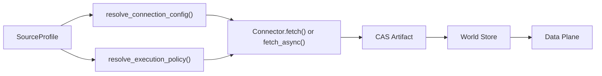

# Data Fabric Architecture

## Overview

The Data Fabric is the ingestion and evidence substrate that lets PolicyOS treat heterogeneous public data sources as one policy-analysis surface. Its job is not only to fetch tables, but to normalize connection policy, attach provenance, persist artifacts in CAS, materialize facts into the world store, and hand stable inputs to downstream Foundry and Scientist workflows.

At the connector boundary, the Fabric hides protocol differences behind reusable profiles and a common connector runtime. REST, SDMX, CKAN, Socrata, Opendatasoft, and SPARQL sources are all represented through `SourceProfile`, `ConnectionConfig`, connector metadata, and typed fetch results rather than through one-off client code.

## Connector Pipeline

The same profile can therefore influence both transport wiring and runtime execution policy. Connection config answers "how do I talk to this source?" Execution policy answers "how aggressively, how concurrently, and through which transport should I do it?"

## Connector Protocol

The shared runtime for HTTP-backed sources lives in ``HTTPConnectorBase`` (`../../src/polisyos/fabric/connectors/sources/http_base.py`).

- It standardizes `connect()`, `disconnect()`, session reuse, resilience wrapping, retry policy, rate limiting, and authenticated header construction.
- Connectors implement `fetch()` and can additionally expose `describe_dataset()`, `fetch_async()`, and `poll_async_fetch()` when the source supports capability inspection or large asynchronous extractions.
- Metadata is surfaced through `ConnectorMetadataSpec`, including trust level and quality tier. For example, authoritative public-statistics sources are modeled as `TrustLevel.AUTHORITATIVE` with `QualityTier.GOLD`.

The current source package exports 14 production connector classes:

- `WorldBankConnector`
- `WVSConnector`
- `EurostatConnector`
- `UKONSConnector`
- `SDMXSourceConnector`
- `CKANCatalogConnector`
- `CKANResourceConnector`
- `SocrataConnector`
- `OpendatasoftConnector`
- `RestJsonConnector`
- `SPARQLConnector`
- `WHOConnector`
- `UNPDConnector`
- `UNESCOUISConnector`

## Profile System

The profile layer is where recent expansion is most visible.

- ``SourceProfile`` (`../../src/polisyos/fabric/connectors/profiles/models.py`) currently exposes more than 30 fields, covering base URL, auth policy, retries, concurrency, transport preference, bulk-download hints, content and availability constraints, and discovery hints.
- ``SourceExecutionPolicy`` (`../../src/polisyos/fabric/connectors/profiles/models.py`) is the normalized runtime view derived from those fields.
- ``resolve_connection_config()`` (`../../src/polisyos/fabric/connectors/profiles/resolver.py`) turns a profile into connector-ready transport config.
- ``resolve_execution_policy()`` (`../../src/polisyos/fabric/connectors/profiles/resolver.py`) converts the same profile into runtime limits and transport policy.

The new execution-policy concepts are especially important.

- Dual transport: `preferred_core_transport` and `preferred_backfill_transport` let the same source favor one path for small interactive queries and another for bulk history loads.
- Async support: `supports_async_fetch`, `supports_async_large_responses`, `max_sync_cells`, and `max_async_cells` let planners decide when to switch away from synchronous fetches.
- Caching: `capability_cache_ttl_hours`, `negative_cache_ttl_hours`, and `soft_negative_cache_ttl_hours` normalize how capability checks are memoized.
- Concurrency: `max_concurrency`, `core_group_limit`, and `backfill_group_limit` prevent one source from overwhelming the runtime.

## Built-in Profiles

The current repository snapshot defines 32 built-in `SourceProfile` instances in ``builtin_profiles.py`` (`../../src/polisyos/fabric/connectors/profiles/builtin_profiles.py`). The broader documentation plan mentions a larger future catalog, but the code in this tree currently groups profiles like this:

- Core production sources: `worldbank_wdi`, `wvs_wave7`, `eurostat_public`, `ukons_public`, `who_gho`, `unpd_dataportal`, `unesco_uis_public`
- SDMX agencies: `ecb_sdmx`, `oecd_sdmx`, `imf_sdmx`, `bis_sdmx`, `ilo_sdmx`, `fao_sdmx`, `unsd_sdmx`
- CKAN and portal-style open data: `data_gov_uk`, `data_gov_us`, `data_gov_ua`, `data_gov_ro`, `data_gov_md`, `eu_open_data`
- Socrata and Opendatasoft portals: `nyc_opendata`, `chicago_opendata`, `opendatasoft_public`, `paris_opendata`
- SPARQL sources: `wikidata_sparql`, `dbpedia_sparql`
- REST wave 3 additions: `data_gov_pl`, `usgs_earthquake`, `openaq_v2`, `open_meteo`, `eia_api`, `nvd_cve`

## Async and Bulk Fetch

Large-source behavior is no longer uniform.

- The connector base defines `AsyncFetchLease`, so large responses can become resumable leases instead of long blocking calls.
- ``EurostatConnector`` (`../../src/polisyos/fabric/connectors/sources/eurostat.py`) uses `describe_dataset()` to emit a `DatasetCapabilitySnapshot`, chooses between sync and async paths, and can poll asynchronous extraction jobs.
- ``SDMXSourceConnector`` (`../../src/polisyos/fabric/connectors/sources/sdmx_source.py`) supports time filters, dimension filters, dataset description, and multi-provider routing through `X-SDMX-*` profile headers.

Architecturally, this means async execution is not a bolt-on optimization. It is encoded at the profile and connector-protocol level so planners can make the choice before a request starts.

## Data Quality

The Fabric does not treat all sources as equally trustworthy.

- `ConnectorMetadataSpec` carries source trust and quality signals at connector level.
- ``SourceConfidenceTier`` (`../../src/polisyos/ir/observation/contracts.py`) and ``MeasurementTrustTier`` (`../../src/polisyos/ir/observation/measurement.py`) are consumed downstream when observation records are weighted for calibration and causal routing.
- Contract validation lives under ``fabric/connectors/contracts/`` (`../../src/polisyos/fabric/connectors/contracts/`), so schemas and connector payloads can be checked before they become analysis inputs.

This is what lets the system distinguish between authoritative core signals, validated derived feeds, and exploratory anchors instead of collapsing them into one generic "dataset loaded" state.

## CAS, Provenance, and the World Store

Fabric persistence is built around content-addressable artifacts and provenance-aware fact materialization.

- CAS persistence is used broadly across Fabric evidence and world-store helpers.
- Provenance export lives in ``fabric/provenance/export_provo.py`` (`../../src/polisyos/fabric/provenance/export_provo.py`) and supports PROV-O / PROV-JSON style interchange.
- The world-store layer under ``fabric/world/store/`` (`../../src/polisyos/fabric/world/store/`) materializes normalized claims, facts, provenance edges, and events.
- The data-plane layer under ``fabric/data_plane/`` (`../../src/polisyos/fabric/data_plane/`) adds watermarks, replay stores, semantic diffs, and orchestration on top of those persisted artifacts.

In other words, the Fabric is not only a connector zoo. It is the ingestion-to-evidence bridge that makes downstream policy analysis reproducible, provenance-aware, and auditable.
