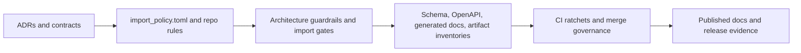
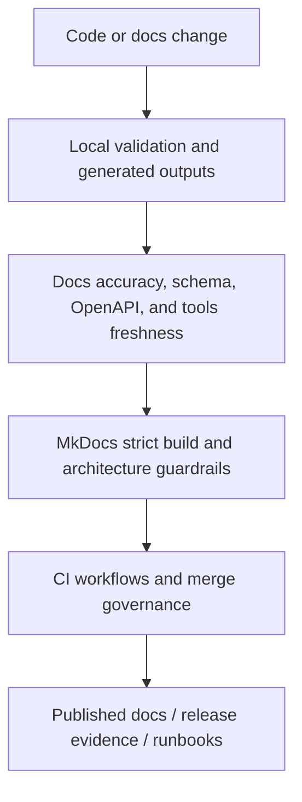

# Freeze Policy

Related reference: [Quality gates](../reference/quality-gates.md), [ratchet policy](../reference/ratchet-policy.md), [documentation inventory](../reference/documentation-inventory.md).
Related ADRs: [ADR-0004](../adr/0004-architecture-boundaries-import-gate.md), [ADR-0053](../adr/0053-architecture-freeze-contracts.md), [ADR-0061](../adr/0061-import-gate-ci-contract.md), [ADR-0096](../adr/0096-canonical-product-root-and-workspace-boundary.md).
Evidence: `import_policy.toml`, `uv run polisyos-tools architecture guardrails check`, `uv run --extra docs python -m mkdocs build --strict`, `uv run polisyos-tools validation check-docs-accuracy --repo-root .`.

Freeze policy is how PolicyOS keeps architectural promises enforceable after the
refactor: import boundaries, generated-contract freshness, docs accuracy, and
release-time ratchets are all part of the same control loop.

## Freeze And Ratchet Model

## CI And Docs Quality Gate Flow

## What The Freeze Actually Enforces

| Control | Purpose |
|---|---|
| import policy and exceptions | keep subsystem boundaries explicit |
| generated snapshot checks | stop schema/OpenAPI/docs drift from becoming normal |
| docs accuracy checks | ensure published names, workflows, and paths still exist |
| merge ratchets | keep new changes from lowering the acceptance bar |

## Why It Matters

Without a freeze policy, architecture becomes prose. With it, ADRs, contracts,
generated artifacts, and docs all point at the same enforceable boundary.
