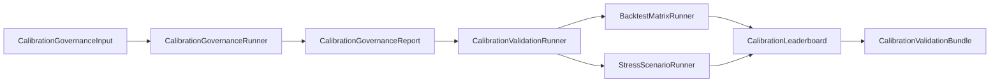

# Governance Model

## Why governance

Automated policy analysis can produce recommendations that are statistically weak, strategically gameable, legally unsafe, or simply not ready for publication. The governance layer exists to catch those failure modes before a recommendation is promoted, exported, or acted upon. In PolicyOS, governance is not a final comment box; it is a typed validation pipeline with machine-readable issues, traces, gates, and escalation paths.

## Pass Registry Architecture

The governance runtime is centered around three pieces.

- ``pass_registry.py`` (`../../src/polisyos/scientist/governance/pass_registry.py`) discovers pass providers from the entry-point group `polisyos.scientist_governance_passes`, instantiates them, rejects duplicate `pass_id`s, and builds the runtime pipeline.
- ``pass_entrypoints.py`` (`../../src/polisyos/scientist/governance/pass_entrypoints.py`) supplies the built-in fallback catalog when no external entry points are installed.
- ``pipeline.py`` (`../../src/polisyos/scientist/governance/pipeline.py`) orders passes by `estimated_cost_ms`, executes them, records telemetry, and short-circuits when blockers appear and the profile demands early exit.

The lifecycle is straightforward but important: register or discover a pass, instantiate it, validate a `PassContext`, accumulate `ComplianceIssue` objects, emit a trace, and then let the calling workflow decide whether to continue, reject, or open a human gate.

## Pass Types

### Automated passes

These are the fast, always-available checks that can run inside normal workflow latency budgets.

- Budget.
- Checkpoint.
- Confidence.
- Cross-graph evidence.
- Equity.
- Freshness.
- Human-review trigger.
- Legal.
- Literature gate.
- Normative arbitration.
- PII check.
- Privacy.
- Quality gate.
- Refutation.
- Safety.
- Schema.
- Strategic response.
- SUTVA check.
- Transportability required.

The built-in registry currently exposes 19 pass factories. Most are cheap structural or artifact checks and are intended to run in the low-millisecond to low-tens-of-milliseconds range.

### Statistical passes

These depend on already-computed analytical artifacts or run extra computation to score whether a result is publication-ready.

- Calibration governance and adversarial suites in ``calibration.py`` (`../../src/polisyos/scientist/governance/calibration.py`).
- Backtest matrices in ``backtest_matrix.py`` (`../../src/polisyos/scientist/governance/backtest_matrix.py`).
- Stress scenarios in ``stress_scenarios.py`` (`../../src/polisyos/scientist/governance/stress_scenarios.py`).
- Specification-curve robustness as part of calibration leaderboard construction.

The backtest matrix currently enforces five required kinds.

- `MACRO`
- `CELL`
- `STRATEGIC_AGENT`
- `HOUSEHOLD`
- `DISTRESS`

Stress testing currently enumerates six scenario families.

- `BUDGET_CONTRACTION`
- `PROCUREMENT_SHOCK`
- `WAGE_SUBSIDY`
- `FX`
- `TRADE_DISRUPTION`
- `REIMBURSEMENT_TARIFF`

### Human review

Human review is a first-class gate, not an out-of-band convention.

- ``CheckpointPass`` (`../../src/polisyos/scientist/governance/passes/checkpoint_pass.py`) verifies whether the workflow has produced checkpoint evidence that makes replay and manual continuation possible.
- ``HumanReviewRequiredPass`` (`../../src/polisyos/scientist/governance/passes/human_review_pass.py`) can request review items directly.
- ``RunGovernanceNode`` (`../../src/polisyos/scientist/nodes/builtins/governance/run_governance.py`) persists typed `gate_request` / `gate_decision` artifacts through the `HumanGateProtocol`.

Strategic multiplicity, blocker-level failures, and strict-profile ambiguity are typical conditions that trigger this path.

## Built-in Pass Catalog

There are two different counts worth knowing.

- The `scientist/governance/passes/` package currently contains 20 concrete Scientist-side pass classes, including auxiliary passes such as `CitationValidatorPass`, `EscalationPass`, and `RateLimiterPass`.
- The runtime registry publishes 19 built-in pass factories by default and additionally imports core governance implementations for `LegalPass` and `SafetyPass`.

In practice, the exposed built-in catalog is:

- `budget`
- `checkpoint`
- `confidence`
- `cross_graph_evidence`
- `equity`
- `freshness`
- `human_review_required`
- `legal`
- `literature_gate`
- `normative_arbitration`
- `pii_check`
- `privacy`
- `quality`
- `refutation`
- `safety`
- `schema`
- `strategic_response`
- `sutva_check`
- `transportability_required`

Auxiliary module-local passes that are present in the source tree but not part of the default factory registry include:

- `citation_validator`
- `escalation`
- `rate_limiter`

## Calibration Governance Pipeline

The large recent addition in this area is the calibration-governance stack. The implementation is actually two-step: first a governance verdict is produced, then a validation bundle adds backtests, stress scenarios, and ranking.

Key pieces:

- ``CalibrationGovernanceRunner`` (`../../src/polisyos/scientist/governance/calibration.py`) runs governance passes, adversarial suites, and lesson publication, then emits a `CalibrationGovernanceReport`.
- ``CalibrationValidationRunner`` (`../../src/polisyos/scientist/governance/calibration_validation.py`) consumes that report plus the candidate artifact and produces a validation bundle.
- ``BacktestMatrixRunner`` (`../../src/polisyos/scientist/governance/backtest_matrix.py`) ensures historical evidence exists across all required observation families.
- ``StressScenarioRunner`` (`../../src/polisyos/scientist/governance/stress_scenarios.py`) perturbs objectives and KPI surfaces under six stress presets.
- ``CalibrationLeaderboard`` (`../../src/polisyos/scientist/governance/calibration_leaderboard.py`) turns those outputs into a rankable decision surface.
- `LessonCardPublisher` persists local lessons from failed or promotable runs, so governance outcomes feed future search and evaluation loops.

### Leaderboard Metrics

`CalibrationLeaderboardMetrics` currently tracks seven scored float dimensions.

- `calibration_fit_score`
- `backtest_matrix_score`
- `stress_robustness_score`
- `specification_curve_robustness`
- `transportability_score`
- `interference_fit`
- `strategic_response_plausibility`

These are combined into a weighted composite score and supplemented by:

- `governance_verdict`
- `adversarial_passed`
- `eligible_for_promotion`
- `gap_flags`

## ComplianceIssue Protocol

The common currency of governance is ``ComplianceIssue`` (`../../src/polisyos/core/contracts/lex.py`).

- `severity` is one of `info`, `warning`, or `blocker`.
- Each issue carries `pass_id`, `path`, `message`, `code`, and optional `suggestion`.
- Passes return issue lists, the pipeline aggregates them, traces are recorded in `ValidationTrace`, and workflow nodes turn blocker sets into rejection or human-gate decisions.

This is important because it keeps governance composable. A pass does not need to know whether it runs in preflight, runtime governance, calibration governance, or replay; it only needs to return typed issues.

## Integration with Scientist Workflows

Governance is wired into both the general Scientist runtime and the observation-contract layer.

- ``GovernancePassAlias`` (`../../src/polisyos/ir/observation/governance.py`) and ``GovernancePassAliasRegistry`` (`../../src/polisyos/ir/observation/governance.py`) map canonical policy-facing pass names to runtime pass identifiers and allow deferred aliases for future phases.
- `ObservationFamilyPolicyRegistry` attaches mandatory governance passes to each observation family, so data contracts can require governance checks before analysis proceeds.
- ``RunGovernanceNode`` (`../../src/polisyos/scientist/nodes/builtins/governance/run_governance.py`) executes the runtime pipeline inside a workflow, stores the validation trace, and opens a human gate when needed.

## Checkpoint and Replay

Checkpointing exists so governance does not become a dead end.

- `CheckpointPass` verifies that the run has enough checkpoint evidence to be paused and resumed safely.
- `RunGovernanceNode` stores typed gate requests and decisions so a reviewer can approve, reject, or escalate without mutating opaque state.
- Replay after human review is therefore not a manual restart from scratch; it is a continuation from persisted typed artifacts and checkpoint-aware runtime state.

That design matters operationally: policy review almost never ends in a single synchronous pass, so the governance model is built for resumability, not just validation.
