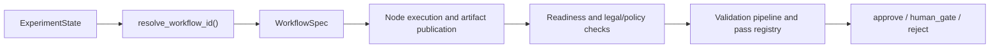
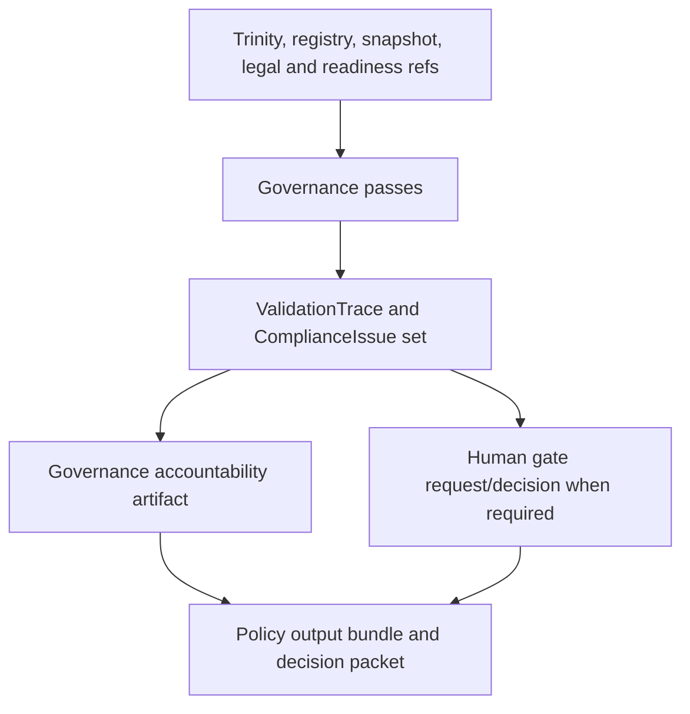

# Governance Model

Related reference: [Scientist workflows](../reference/scientist/workflows.md), [governance passes](../reference/scientist/governance-passes.md), [governance accountability](../reference/scientist/governance-accountability.md), [causal validity](../reference/scientist/causal-validity.md).
Related ADRs: [ADR-0007](../adr/0007-human-gate-protocol.md), [ADR-0011](../adr/0011-scientist-checkpoint-resume.md), [ADR-0087](../adr/0087-llm-prior-calibration-ceiling.md), [ADR-0110](../adr/0110-ir-frontier-governance-and-causal-contracts.md).
Evidence: `tests/scientist/governance/test_pass_registry.py`, `tests/scientist/governance/test_validation_pipeline.py`, `tests/scientist/governance/test_accountability.py`, `tests/scientist/nodes/test_build_policy_output_bundle.py`, [runtime graceful shutdown or stuck worker](../runbooks/runtime-graceful-shutdown-and-stuck-worker.md).

Governance is the layer that decides whether a workflow output is promotable,
blocked, or requires human review. It is not an afterthought on top of a result;
it is part of the workflow contract.

## Scientist Workflow Execution Flow

## Governance Artifact Flow

## Runtime Model

| Piece                   | Current responsibility                                                            |
| ----------------------- | --------------------------------------------------------------------------------- |
| Workflow routing        | choose the default, discovery, causal-full, policy-verified, or policy-design DAG |
| Pass registry           | load builtin and entry-point governance validators                                |
| Validation pipeline     | order, execute, trace, and short-circuit pass execution                           |
| Accountability artifact | package calibration, fairness, escalation, and missing-evidence disclosures       |
| Human gate              | pause and resume promotion when the machine path is insufficient                  |

## Why This Is A Separate Architecture Package

Scientist is the only layer that sees the full cross-domain picture:

- which data and legal evidence entered the run;
- which Foundry artifacts were compiled and executed;
- which readiness and causal-validity checks were satisfied;
- whether the result is allowed to become a decision-facing artifact.

That is why governance lives with Scientist orchestration instead of Foundry,
Fabric, or Runtime.

## Non-Default Capability Policy

Continuous or experimental governance loops remain explicitly non-default until
their rollout evidence is recorded on the relevant reference pages:

- [Scientist frontier runtime](../reference/scientist/frontier-runtime.md)
- [Scientist phase 3 acceptance](../reference/scientist/phase3-acceptance.md)
- [Scientist phase 4 acceptance](../reference/scientist/phase4-acceptance.md)
