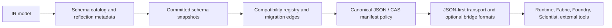

# IR Design

Related reference: [IR index](../reference/ir/index.md), [IR schema catalog](../reference/ir/schema-catalog.md), [IR interoperability](../reference/ir/interoperability.md).
Related contracts: [E1.3 norms/citations/linker](../contracts/E1_3_IR_NORMS_CITATIONS_LINKER.md), [E2.11 transport and streaming](../contracts/E2_11_IR_TRANSPORT_STREAMING_V1_0.md), [TRINITY](../contracts/TRINITY.md).
Related ADRs: [ADR-0104](../adr/0104-ir-canonical-cas-policy.md), [ADR-0105](../adr/0105-trinity-linking-validation-policy.md), [ADR-0106](../adr/0106-ir-shared-validation-and-id-policy.md), [ADR-0107](../adr/0107-ir-analytics-normalization-and-schema-compatibility.md), [ADR-0108](../adr/0108-ir-schema-catalog-and-reflection.md), [ADR-0109](../adr/0109-ir-transport-and-interoperability-bridges.md).
Evidence: `tests/unit/ir/test_schema_catalog.py`, `tests/contract/test_ir_migrations.py`, `tests/unit/ir/test_interoperability_bridges.py`, `tools/quality/diagnostics/generate_ir_reference_catalog.py --check`.

IR exists so the rest of the platform can exchange durable meaning without
sharing implementation details. It is the compatibility and reflection layer,
not the place where runtime delivery or simulation logic lives.

## Design Rule

If a payload can outlive one process, cross one subsystem boundary, or be stored
in CAS for replay, IR should define the contract vocabulary for it.

## Schema Evolution Flow

## What IR Owns

| Concern                    | Current IR role                                                     |
| -------------------------- | ------------------------------------------------------------------- |
| Contract vocabulary        | Trinity, analytics, governance, observation, world, refs, transport |
| Compatibility              | schema versions, migration registry, additive-vs-breaking decisions |
| Reflection                 | schema catalog, public-surface inventory, bridge metadata           |
| Canonical storage boundary | JSON-first canonical form and manifest linkage                      |
| Interoperability           | transport manifests, ecosystem bridges, PROV-O mapping              |

## What IR Does Not Own

- connector IO and world materialization details;
- simulation kernels and execution loops;
- runtime middleware and operator delivery surfaces;
- workflow routing and publication-time governance.

Those consumers depend on IR so they can evolve independently.

## Compatibility Posture

The current default posture is fail closed:

- unknown types or unsupported versions do not silently coerce;
- compatibility requires either direct support or a registered migration edge;
- binary or streaming transport must preserve JSON-manifest compatibility
  anchors instead of replacing them.

That policy comes from ADR-0104 through ADR-0109 and is surfaced operationally
through the [schema catalog](../reference/ir/schema-catalog.md) and
[interoperability](../reference/ir/interoperability.md) reference pages.

## Why This Matters To The Rest Of The Stack

- Fabric can publish connector and world artifacts without baking its own
  compatibility rules into downstream consumers.

- Foundry can compile Trinity and analytics contracts without inventing
  consumer-local schema policy.

- Scientist can publish governance and decision artifacts that stay readable
  across workflow and runtime revisions.
