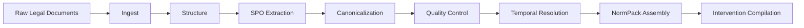

# Lex Pipeline: Legal Corpus Processing

## Overview

The Lex module turns raw legal texts into structured policy artifacts. In practical terms, it ingests source documents, builds legal structure, extracts SPO-style normative statements, assembles `NormPack` bundles, and now also compiles intervention timelines that can be consumed by causal and policy-search workflows.

This is no longer just an extraction pipeline. The current Lex stack includes deterministic quality filters, amendment handling, temporal resolution, normpack mutation and diffing, impact analysis, knowledge-graph search, and an intervention layer that bridges law text to executable policy knobs. The `lex/batch` package currently contains 50 top-level modules plus jurisdiction and pattern subpackages, which makes it one of the densest processing areas in the repo.

## Pipeline Architecture

## Stage 1: Ingest and Structure

The public Lex API exposes the first two stages directly.

- ``ingest_legal_doc_bytes()`` (`../../src/polisyos/lex/api.py`) returns `LexIngestResult` and persists raw/legal-document artifacts through the corpus ingest layer.
- ``build_legal_structure()`` (`../../src/polisyos/lex/api.py`) returns `LexStructureResult` and materializes legal units, spans, anchors, and structure metadata.
- Core types such as `LegalDocSource`, `LexIngestResult`, and `LexStructureResult` live in ``types.py`` (`../../src/polisyos/lex/types.py`).
- Identity and structural helpers are split into files such as ``doc_identity.py`` (`../../src/polisyos/lex/batch/doc_identity.py`) and ``legal_unit.py`` (`../../src/polisyos/lex/batch/legal_unit.py`).

This front-loads determinism. By the time the SPO stage runs, the system already knows the document family, anchors, version identity, and structural segmentation it should trust.

## Stage 2: SPO Extraction

The extraction layer is hybrid by design.

- ``spo_extractor.py`` (`../../src/polisyos/lex/batch/spo_extractor.py`) is the LLM-assisted extraction path.
- ``deterministic_spo.py`` (`../../src/polisyos/lex/batch/deterministic_spo.py`), ``deterministic_spo_core.py`` (`../../src/polisyos/lex/batch/deterministic_spo_core.py`), and ``deterministic_spo_subtypes.py`` (`../../src/polisyos/lex/batch/deterministic_spo_subtypes.py`) provide deterministic extraction and subtype repair.
- ``entity_resolver.py`` (`../../src/polisyos/lex/batch/entity_resolver.py`) resolves extracted actors and institutions against more stable normalized forms.
- ``canonicalizers.py`` (`../../src/polisyos/lex/batch/canonicalizers.py`) normalizes subject, predicate, and norm-type representations.

The important point is that LLM extraction is not the final truth source. It is one stage in a multi-pass pipeline that later re-checks grounding, quality, and temporal semantics before anything becomes policy-facing.

## Stage 3: Quality Control

Quality control has expanded significantly and is now a distinct design layer rather than a few ad hoc checks.

### Amendment Detection

``amendment_detector.py`` (`../../src/polisyos/lex/batch/amendment_detector.py`) implements a three-pass amendment strategy.

- Pass 1 uses high-confidence structural regexes with explicit anchors such as article replacement, provision rewrite, addition, removal, or repeal.
- Pass 2 captures broad amendment signals even when the structural anchor is missing.
- Pass 3 falls back to registry-level amendment core patterns for the remaining edge cases.

Each `AmendmentRecord` carries:

- `amendment_type`
- `target_anchor`
- `old_text_uk`
- `new_text_uk`
- `effective_from`
- `confidence`
- `source_text`

``amendment_metrics.py`` (`../../src/polisyos/lex/batch/amendment_metrics.py`) aggregates row-level and document-level resolution metrics such as extraction coverage, target resolution rate, and single-target amendment coverage.

### Hallucination Detection

``hallucination_detector.py`` (`../../src/polisyos/lex/batch/hallucination_detector.py`) runs after extraction, not before it. That ordering is intentional: a hallucination check needs an extracted fact to compare against the grounded provision text and source quote.

Current high-signal flags include:

- `phantom_article_reference`
- `ungrounded_subject`
- `phantom_number`
- `norm_type_mismatch`

`has_blocking_hallucination()` hard-blocks especially severe cases such as phantom article references and phantom numbers.

### Quality Filters

``quality_filters.py`` (`../../src/polisyos/lex/batch/quality_filters.py`) adds deterministic lexical heuristics, many of them explicitly tuned for Ukrainian legal drafting.

- `is_synthetic_subject()` catches placeholder actors such as "адресат норми".
- `is_low_quality_entity_text()` rejects fragments that look like amendment residue, headings, or sentence-level noise rather than grounded entities.
- `has_explicit_modal_signal()` checks for obligation and prohibition markers that should back the extracted norm type.

These filters are deliberately jurisdiction-aware. They are not generic NLP cleanliness checks; they encode common patterns and failure modes in UA legislation.

### Quality Reports

``quality_report.py`` (`../../src/polisyos/lex/batch/quality_report.py`) aggregates extraction metrics and gate outcomes so the pipeline can fail or warn at run level instead of burying defects in row-level debug output.

## Stage 4: Temporal Resolution

Temporal semantics are one of the major new capabilities in Lex.

- ``temporal_resolver.py`` (`../../src/polisyos/lex/batch/temporal_resolver.py`) derives deterministic document and fact envelopes from metadata plus textual temporal constraints.
- `DocTemporalEnvelope` tracks `published_at`, `effective_from`, `effective_to`, `temporal_state`, resolution status, confidence, and JSON provenance.
- `FactTemporalEnvelope` carries the same idea down to extracted facts.

Status semantics are explicit rather than implicit. The resolver distinguishes:

- `current`
- `future`
- `historical`
- `historical_partial`
- `suspended`

This matters because legal text often says more than "in force" or "not in force." Downstream policy design needs to know when a rule starts, when it ends, and whether an apparent current provision is actually suspended or only partially historical.

## Stage 5: NormPack Assembly

NormPack assembly is where extracted legal structure becomes an executable policy-facing bundle.

- ``assemble_norm_pack()`` (`../../src/polisyos/lex/normpack/assemble_pack.py`) selects relevant provisions and claims and builds a `NormPack`.
- The simulator layer provides `NormPackMutator`, `MutationIntent`, and `diff_norm_packs()` so legal changes can be represented as deltas instead of whole-document rewrites.
- `NormPack` selection also cooperates with `ActiveVersionStrategy`, which controls which version of a legal document is considered active for a given evaluation context.

This stage is what turns "we found many legal statements" into "here is the exact normative bundle that policy design should honor."

## Stage 6: Interventions

The intervention system is the largest recent extension on the Lex side.

- ``LexInterventionCompiler`` (`../../src/polisyos/lex/interventions.py`) converts provision directives into executable `InterventionSpec` and `ParameterSpec` artifacts.
- `InterventionKnobSpec` describes tunable policy parameters, including default values, bounds, and sensitivity priority.
- ``TemporalInterventionSequencer`` (`../../src/polisyos/lex/interventions.py`) transforms legal effective dates into ordered multi-period intervention sequences.
- `TemporalInterventionSequenceCompiler` turns those sequences into DTR-ready execution entries.
- `StrategicResponseSpecRegistry` records which intervention kinds are expected to trigger strategic behavior.
- `HierarchicalPolicySearchAdapter` bridges Lex outputs into policy-search coordination.

The companion file ``intervention_artifacts.py`` (`../../src/polisyos/lex/intervention_artifacts.py`) adds registries and crosswalks such as `LexProvisionMappingRegistry` and `LexPolicyBundleInput`, which bind compiled interventions, temporal sequences, and strategic-response bundles back into a Trinity-aligned payload.

## Stage 7: Impact Analysis

Once two normpacks exist, Lex can reason about legal impact instead of only textual difference.

- ``NormImpactAnalyzer`` (`../../src/polisyos/lex/simulator/engine.py`) produces `NormImpactReport`.
- `ComplianceTransition`, `ComplianceDelta`, and `AffectedKPI` model how the legal change shifts blocker/warning structure and downstream KPI exposure.

That makes Lex useful not only for legal extraction, but also for policy-compliance change analysis.

## Knowledge Layer

Lex also maintains a searchable legal knowledge layer.

- ``LegalKnowledgeGraph`` (`../../src/polisyos/lex/knowledge/search.py`) exposes search and graph-style access over extracted legal knowledge.
- ``LegalKnowledgeStore`` (`../../src/polisyos/lex/knowledge/store.py`) persists and serves the knowledge layer.
- Version handling is coordinated through `ActiveVersionStrategy`, so search results can be interpreted against an explicit active-legal-state policy.

## Integration Points

Lex now touches all major parts of the stack.

- IR: temporal intervention sequences and policy-facing artifacts live in shared IR contracts.
- Foundry: compiled intervention parameters and timelines can be routed into simulation and dynamic-regime methods.
- Scientist: `LexPolicyBundleInput` and related artifacts feed policy-design workflows.
- Observation: temporal and identification metadata influence which observation contracts and causal routes are admissible.

The practical takeaway is that Lex is no longer only a legal corpus tool. It has become the legal-to-policy bridge that turns normative text into analyzable, governable intervention structure.
