# Lex Pipeline

Related reference: [Lex index](../reference/lex/index.md), [Lex NormPack](../reference/lex/normpack.md), [Lex interventions](../reference/lex/interventions.md), [Lex batch pipeline](../reference/lex/batch-pipeline.md).
Related contracts: [E2.8 Lex corpus MVP](../contracts/E2_8_LEX_CORPUS_MVP_V1_0.md), [E2.9 NormPack assembly](../contracts/E2_9_LEX_NORMPACK_ASSEMBLY_V1_0.md), [E2.10 legal evaluation](../contracts/E2_10_LEX_LEGAL_EVALUATION_V1_0.md).
Related ADRs: [ADR-0019](../adr/0019-lex-norm-impact-analysis.md), [ADR-0057](../adr/0057-legal-bridge-via-lex-api.md).
Evidence: `tests/lex/**`, [configure Lex pipeline](../how-to/configure-lex-pipeline.md), [run causal analysis](../how-to/run-causal-analysis.md).

Lex turns legal sources into artifacts that policy workflows can reason about:
document structure, active versions, NormPack snapshots, intervention bundles,
and legal-evaluation outputs.

## Legal To Policy Flow

```mermaid
flowchart LR
    Source["Raw legal documents"] --> Ingest["Ingest and document identity"]
    Ingest --> Structure["Structure and anchor extraction"]
    Structure --> Version["Version index and active-version resolution"]
    Version --> Norms["Norm extraction, quality, temporal resolution"]
    Norms --> Pack["NormPack assembly and diff"]
    Pack --> Interventions["Intervention and temporal sequence compilation"]
    Interventions --> Scientist["Scientist policy workflows and governance"]
```

## Boundary Responsibilities

| Layer | Lex owns | Downstream consumer |
|---|---|---|
| Corpus ingest | document bytes, structure, anchors, active versioning | legal references and citation-grade inputs |
| NormPack assembly | normative snapshot selection and diffing | Scientist governance and policy design |
| Intervention compilation | executable intervention specs and temporal sequences | Foundry and Scientist |
| Legal evaluation | legality and compliance deltas against NormPack state | runtime/reporting and governance |

## Why Lex Is Separate

Legal text changes on a different cadence than runtime delivery or simulation
methods. Keeping Lex behind explicit contracts lets the platform:

- reuse legal artifacts across multiple workflows;
- audit which legal version and NormPack were used for a decision;
- evolve intervention compilation without coupling it to runtime auth or causal
  method internals.

For the current public API and artifact families, see
[Lex reference](../reference/lex/index.md).
