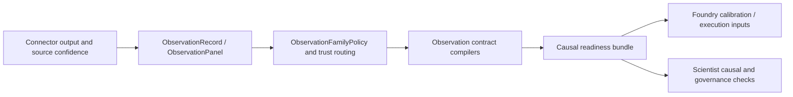

# Observation Contracts

Related reference: [IR observation](../reference/ir/observation.md), [Fabric quality](../reference/fabric/quality.md), [Scientist causal validity](../reference/scientist/causal-validity.md).
Related ADRs: [ADR-0107](../adr/0107-ir-analytics-normalization-and-schema-compatibility.md), [ADR-0110](../adr/0110-ir-frontier-governance-and-causal-contracts.md).
Evidence: `tests/ir/observation/test_contracts.py`, `tests/ir/observation/test_measurement.py`, `tests/ir/observation/test_causal_readiness.py`.

Observation contracts sit between raw evidence and causal or simulation methods.
They answer a stricter question than "did we load data?": what is this
measurement allowed to mean, and which inference modes remain admissible?

## Observation Flow

## What These Contracts Prevent

- silently treating proxy or low-coverage data as point-identified evidence;
- forgetting regime breaks, schema changes, or shock periods;
- letting downstream workflows guess trust or identification mode from raw
  source metadata.

## Current Boundary

| Contract family | Purpose |
|---|---|
| core observation records and panels | store measured values with scope, regime, and trust metadata |
| family policies and registries | define required governance and fallback identification modes |
| readiness bundles | record whether proxy, transportability, interference, and related checks passed |
| execution bundles | carry bounded or executed causal tasks into downstream artifacts |

This is the bridge that keeps Fabric quality signals, IR contracts, Foundry
calibration, and Scientist readiness/governance aligned.
