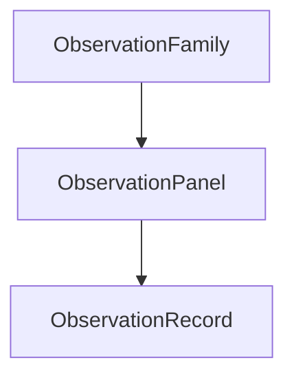

# Observation Contracts: Data-to-Model Bridge

## Why Observation Layer

PolicyOS needs to run the same analytical machinery over very different kinds of evidence: panel macro data, procurement flows, household distributions, distress enforcement records, spatial exogenous layers, and more. Without a formal bridge, every method would need custom assumptions about shape, trust, timing, and identification quality.

The observation layer solves that by defining contracts for what data must contain before it is allowed into a causal, calibration, or policy-analysis path. The key design principle is contract-driven honesty: if a family of observations cannot support point identification, the system should route to proxy or bounds mode rather than quietly pretending the data is stronger than it is.

This module is entirely new in the current repo slice. The package ``ir/observation/`` (`../../src/polisyos/ir/observation/`) contains 9 files and 133 classes in total, making it one of the largest recent additions to the IR surface.

## Type Hierarchy

### ObservationFamily

``ObservationFamily`` (`../../src/polisyos/ir/observation/contracts.py`) defines which policy-data family a record belongs to. Current examples include:

- `budget_flows`
- `procurement_flows`
- `macro_state`
- `labor_market`
- `household_distribution`
- `distress_enforcement`

Each family is paired with an ``ObservationFamilyPolicy`` (`../../src/polisyos/ir/observation/governance.py`), and those policies are stored in `ObservationFamilyPolicyRegistry`. Family policies specify:

- primary and fallback identification modes
- mandatory governance passes
- whether proxy, bounds, interference, or strategic checks are required

### ObservationPanel

``ObservationPanel`` (`../../src/polisyos/ir/observation/contracts.py`) is the time-indexed collection layer. It enforces one family and one time grain across its records and serves as the common envelope for panel-style compilation.

The corresponding schema is:

- ``observation_panel.schema.json`` (`../../schemas/snapshots/ir/observation_panel.schema.json`)

### ObservationRecord

``ObservationRecord`` (`../../src/polisyos/ir/observation/contracts.py`) is the atomic observation unit. It binds value, period, entity scope, trust, regime, and identification metadata in one contract.

Important fields include:

- `metric_id`
- `observed_value`
- `coverage_estimate`
- `trust_weight`
- `measurement_bias_flag`
- `censoring_mask`
- `source_confidence_tier`
- `schema_regime_id`
- `identification_mode`

The corresponding schema is:

- ``observation_record.schema.json`` (`../../schemas/snapshots/ir/observation_record.schema.json`)

### EntityScope

`EntityScope` is the boundary model for units of observation. It distinguishes global, agent, firm, household, cell, household-cell, region, and sector scope so compilers know what a record actually represents.

The corresponding schema is:

- ``entity_scope.schema.json`` (`../../schemas/snapshots/ir/entity_scope.schema.json`)

## Measurement and Trust

The measurement layer is the conceptual center of the observation module because it decides how raw data quality affects admissible inference.

### MeasurementTrustTier

``MeasurementTrustTier`` (`../../src/polisyos/ir/observation/measurement.py`) currently includes:

- `authoritative_high_coverage`
- `authoritative_partial_coverage`
- `administrative_noisy`
- `derived_proxy`
- `weak_anchor`

`MeasurementRegistry` maps those tiers to trust caps, multipliers, and family-specific coverage thresholds. The same concepts are then used on the Foundry side in ``foundry/calibration/measurement.py`` (`../../src/polisyos/foundry/calibration/measurement.py`), where trust, coverage, censoring, lag, shock exposure, and schema boundaries are turned into effective calibration weights.

### RegimeCalendar and SchemaRegimeRegistry

Temporal regime handling is explicit rather than implicit.

- `RegimeCalendar` tracks regime windows and boundary buffers.
- `SchemaRegimeRegistry` tracks schema regimes and `SchemaChangepoint` boundaries.
- `ShockCalendar` marks external shocks that should discount or reroute observations.

These structures matter because regime breaks, schema breaks, and shocks are all reasons to stop claiming the same identification conditions hold across time.

### IdentificationMode and IdentificationModeRouter

``IdentificationMode`` (`../../src/polisyos/ir/observation/contracts.py`) and ``IdentificationModeRouter`` (`../../src/polisyos/ir/observation/measurement.py`) are the observation-side routing mechanism for causal work.

Current modes are:

- `point_identified`
- `partially_identified`
- `bounds_only`
- `proxy_identified`
- `interference_aware`
- `sequential`

The router can downgrade a family from its primary mode to a fallback mode when coverage drops below threshold, censoring is present, measurement bias is flagged, or a shock mask is active.

## Contract Compilers

``contract_compilers.py`` (`../../src/polisyos/ir/observation/contract_compilers.py`) is large enough that it should be understood as a pattern, not as a list of unrelated classes. The file currently defines 46 classes and helper models, culminating in `ObservationContractCompilerSuite`.

The core idea is simple: take abstract observation panels and compile them into method-specific contracts that downstream runtimes can actually execute.

Important compiler-facing artifacts include:

- `BoundsEstimationInput`
- `SpecificationCurveInput`
- `LeontiefIOInput`
- `SparseDenseBridge`
- `ObservationCompilerContext`
- `ObservationContractCompilerSuite`

Compiler families then specialize that idea for different targets:

- survey microdata
- network and network-causal contracts
- panel observational data
- dynamic treatment data
- survival data
- panel econometrics
- bounds estimation
- proxy measurement
- historical validation plans
- specification curves
- Leontief input-output bundles

## Causal Execution Integration

The observation layer has dedicated bundle types for both preflight and execution-time causal stages.

### BoundsEstimationTask to BoundsEstimationEntry

``BoundsEstimationTask`` (`../../src/polisyos/ir/observation/causal_execution.py`) defines what should be bounded. ``BoundsEstimationEntry`` (`../../src/polisyos/ir/observation/causal_execution.py`) records the executed result, including status and artifact references.

### CausalExecutionBundle

`CausalExecutionBundle` aggregates executed bounds and temporal-DTR entries. Scientist-side execution is handled by ``BoundsEstimationRunner`` (`../../src/polisyos/scientist/causal/execution.py`) and `RunCausalContractExecutionNode`.

### CausalReadinessBundle

``CausalReadinessBundle`` (`../../src/polisyos/ir/observation/causal_readiness.py`) is the preflight side. It groups:

- proxy identification entries
- transportability checks
- strategic-response checks
- counterfactual checks
- interference readiness entries

This is how observation contracts become causal readiness evidence instead of raw data attachments.

## Bundle Types

``bundles.py`` (`../../src/polisyos/ir/observation/bundles.py`) currently defines 42 classes. The right way to read that file is by bundle families.

### Calibration and validation bundles

- `CalibrationTargetBundleManifest`
- `BacktestPlanBundle`
- `LessonRegistrySeedBundle`

### Causal and readiness bundles

- `BoundsEstimationBundle`
- `ProxyIdentificationBundle`
- `SpecificationCurveBundle`
- `StrategicResponseSpecsBundle`
- `TransportabilityCheckBundle`
- `CounterfactualCheckBundle`
- `InterferenceLossSpecBundle`

### Panel and econometric bundles

- `CausalPanelBundleManifest`
- `PanelEconometricBundleManifest`
- `SurvivalDataBundleManifest`
- `DTRTreatmentSequenceBundleManifest`

### Network and microsimulation bundles

- `MicrosimSurveyContractBundle`
- `NetworkContractBundle`
- `NetworkCausalContractBundle`

### Governance mapping bundles

- `GovernancePassMappingBundle`
- `ObservationToContractManifest`

The common role of these types is to make method requirements explicit before execution starts.

## Schema Catalog

The current repo tracks 10 observation-related JSON schemas in `schemas/snapshots/ir/`. The original documentation plan listed nine, but the current tree also includes a registry schema.

- ``entity_scope.schema.json`` (`../../schemas/snapshots/ir/entity_scope.schema.json`)
- ``observation_family.schema.json`` (`../../schemas/snapshots/ir/observation_family.schema.json`)
- ``observation_panel.schema.json`` (`../../schemas/snapshots/ir/observation_panel.schema.json`)
- ``observation_record.schema.json`` (`../../schemas/snapshots/ir/observation_record.schema.json`)
- ``source_confidence_tier.schema.json`` (`../../schemas/snapshots/ir/source_confidence_tier.schema.json`)
- ``multiplex_graph_layer_id.schema.json`` (`../../schemas/snapshots/ir/multiplex_graph_layer_id.schema.json`)
- ``identification_mode.schema.json`` (`../../schemas/snapshots/ir/identification_mode.schema.json`)
- ``observation_family_policy.schema.json`` (`../../schemas/snapshots/ir/observation_family_policy.schema.json`)
- ``observation_family_policy_registry.schema.json`` (`../../schemas/snapshots/ir/observation_family_policy_registry.schema.json`)
- ``observation_to_contract_manifest.schema.json`` (`../../schemas/snapshots/ir/observation_to_contract_manifest.schema.json`)

## Integration Map

Observation contracts sit exactly between data and methods.

- Foundry uses the same trust, regime, and shock concepts to compute measurement-aware calibration weights.
- Scientist causal runners consume readiness and execution bundles instead of ad hoc payload dictionaries.
- Fabric contributes source-confidence information that later influences observation trust tiering.
- The top-level IR package now re-exports these concepts through a 160-symbol `ir.__all__`, so observation contracts are part of the core public IR surface rather than an internal sidecar.

The end result is that PolicyOS can say, in typed form, what a dataset is allowed to mean before any causal or policy method is allowed to use it.
