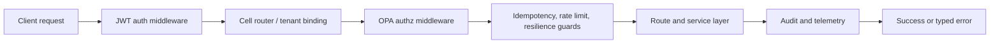
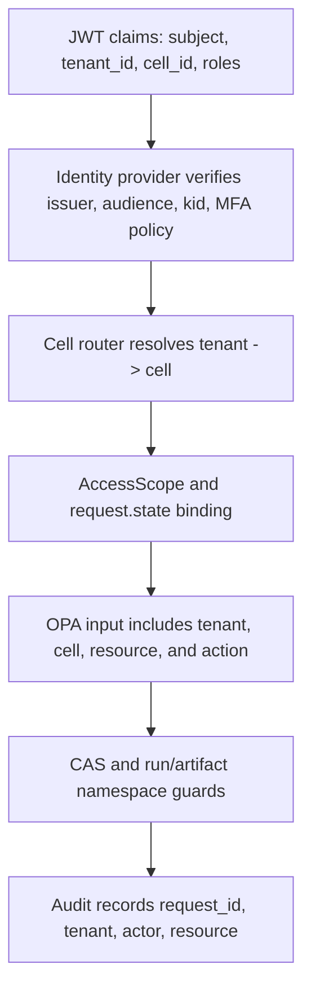

# Security Model

Related reference: [Auth and tenant model](../reference/api/auth-tenant-model.md), [error semantics](../reference/api/error-semantics.md), [security and compliance operations](../reference/security-compliance.md), [operations diagrams](../reference/operations/platform-architecture-diagrams.md).
Related ADRs: [ADR-0097](../adr/0097-runtime-rate-limiting-and-idempotency.md), [ADR-0100](../adr/0100-runtime-api-versioning-and-deprecation-policy.md), [ADR-0101](../adr/0101-runtime-audit-trail-model.md), [ADR-0102](../adr/0102-key-rotation-lifecycle-and-trust-store-policy.md).
Evidence: `tests/runtime/http/test_runtime_api_authz.py`, `tests/runtime/http/test_runtime_api_write_path_hardening.py`, `tests/core/security/test_auth_middlewares.py`, `tests/core/security/test_audit_chain.py`, [key rotation runbook](../runbooks/key-rotation.md), [CAS or OPA outage runbook](../runbooks/cas-opa-outage.md).

The default runtime posture is fail closed: missing identity, tenant mismatch,
OPA failure, or integrity failure should stop the request before policy work or
side effects happen.

## Auth And Request Flow

This matches the middleware order enforced by
`create_runtime_api_app(...)` and the runtime middleware assertions in
`src/polisyos/runtime/http/app.py`.

## Auth And Tenant Isolation

The same tenant and cell identity should agree across token claims, route
state, OPA input, namespaced IDs, and audit records. If they disagree, the
request is denied rather than reconciled heuristically.

## Security Layers

| Layer | Default role | Operational anchor |
|---|---|---|
| JWT and OIDC validation | verify user claims, MFA requirements, key rotation windows | [auth and tenant model](../reference/api/auth-tenant-model.md) |
| SPIFFE service identity | verify peer services separately from user auth | [security compliance](../reference/security-compliance.md) |
| Cell routing and namespacing | bind requests and artifact IDs to tenant/cell scope | [runtime API outage](../runbooks/runtime-api-outage.md) |
| OPA authorization | policy-as-code deny-by-default decisions | [CAS or OPA outage](../runbooks/cas-opa-outage.md) |
| Idempotency and mutation guards | reduce replay, duplicate side effects, and overload | [idempotency incident](../runbooks/idempotency-incident.md) |
| CAS signing and verification | prove integrity and signer identity for durable artifacts | [artifact signing or SBOM failure](../runbooks/artifact-signing-sbom-failure.md) |
| Chained audit | correlate reads, writes, and governance events | [mutation audit investigation](../runbooks/mutation-audit-investigation.md) |

## Compliance Posture

The repo already tracks compliance mappings and open operational gaps in:

- [security and compliance operations](../reference/security-compliance.md)
- `docs/fedramp/gap-analysis.md`
- `docs/fedramp/nist-800-53-mapping.json`
- `docs/fedramp/poam.json`

This page therefore describes the architecture primitives that exist today,
while compliance debt and evidence gaps stay on the compliance reference page
instead of being described here as fully closed.
