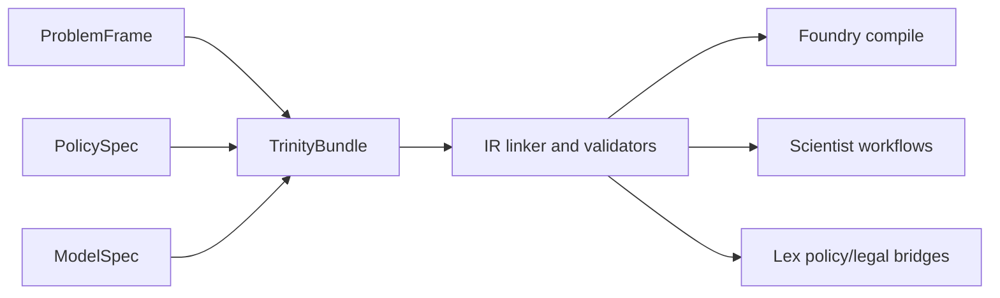

# Trinity

Related reference: [IR problem framing](../reference/ir/problem-framing.md), [Foundry compile and execute](../reference/foundry/compile-execute.md), [Scientist workflows](../reference/scientist/workflows.md).
Related contracts: [TRINITY](../contracts/TRINITY.md), [merge semantics](../contracts/MERGE_SEMANTICS.md).
Related ADRs: [ADR-0105](../adr/0105-trinity-linking-validation-policy.md), [ADR-0106](../adr/0106-ir-shared-validation-and-id-policy.md).
Evidence: `tests/contract/test_trinity_contracts.py`, `tests/contract/test_trinity_migration.py`, `tests/contract/test_trinity_linker_contract.py`, `tests/ir/test_trinity_loaders.py`.

Trinity separates one policy payload into three durable questions:

- `ProblemFrame`: what problem is being investigated and under which goals and
  constraints.

- `PolicySpec`: which interventions are being proposed.
- `ModelSpec`: which world model, data snapshot, and runtime assumptions are
  allowed to execute the policy.

## Contract Architecture

## Why Split It

The split prevents three kinds of accidental coupling:

- changing the policy question should not force a new model implementation;
- exploring multiple intervention sets should not require duplicating the same
  world model;

- simulation/runtime assumptions should not be hidden inside narrative problem
  text.

That is why Foundry compiles Trinity-backed payloads and why Scientist routes
workflows around Trinity refs rather than one monolithic document.

## Responsibilities

| Contract       | Current job                                                                             | Typical downstream consumer                 |
| -------------- | --------------------------------------------------------------------------------------- | ------------------------------------------- |
| `ProblemFrame` | goals, constraints, stakeholders, normative framing, KPI intent                         | Scientist planning and governance           |
| `PolicySpec`   | interventions, schedules, mechanism bindings, parameters                                | Scientist policy-design and Foundry compile |
| `ModelSpec`    | registry bundle, snapshot refs, time semantics, calibration refs, execution assumptions | Foundry compile/execute                     |

## Linking and Validation

The linker does not only join three objects together. It enforces that:

- IDs and refs are valid before compile-time lowering;
- required refs such as registry or snapshot inputs are present when the
  workflow needs them;

- legacy migration paths remain explicit instead of implicit compatibility
  shims.

See [TRINITY](../contracts/TRINITY.md) for the canonical contract and
[IR design](ir-design.md) for the schema-evolution side of the same boundary.

## Merge and Lifecycle Semantics

Trinity bundles are versioned artifacts, not mutable shared state. Fine-grained
merge behavior matters later in execution state and derived artifacts, where the
[merge semantics contract](../contracts/MERGE_SEMANTICS.md) defines conflict
resolution rules.

The practical lifecycle is:

1. author or derive the three contracts;
2. link and validate them;
3. compile them into execution artifacts;
4. bind runtime inputs;
5. execute and govern the result through Scientist.
