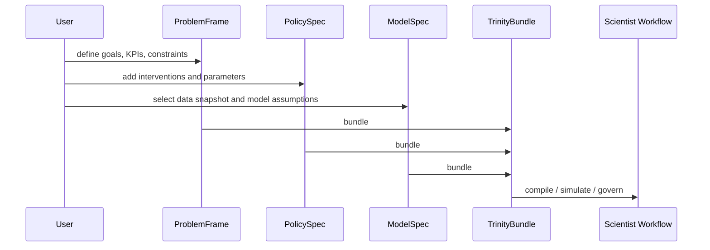

# Trinity: ProblemFrame / PolicySpec / ModelSpec

## Зачем три сущности

Trinity разделяет policy payload на три независимых вопроса: **что исследуем**, **какое
вмешательство применяем** и **какую модель мира используем**. Это убирает старую связку, где
problem framing, policy knobs и simulation assumptions были слиты в один объект и мешали
сравнивать альтернативы.

Практический эффект простой: один `ProblemFrame` можно прогонять через несколько `PolicySpec`,
а один `ModelSpec` переиспользовать для разных policy portfolios и sensitivity runs. Именно поэтому
Foundry компилирует не произвольный JSON, а `ir.trinity_bundle`, а Scientist строит workflow
вокруг ссылок на эти три сущности.

Исторически рядом существовал `PolicySurfaceIR`; он по-прежнему поддерживается в части migration
flows, но канонический контракт для compile/execute пути сегодня — именно Trinity.

## ProblemFrame

`ProblemFrame` отвечает за **why** и формализует границы исследования. Ключевые поля из
`ir.governance.problem_frame`:

- `problem_id`, `domain`
- `objectives`, `kpis`, `success_criteria`
- `hard_constraints`, `soft_constraints`
- `stakeholders`, `normative_frame`
- `narrative`, `labels`, `notes`

Типичный пример: _«Как изменение образовательных расходов влияет на GDP growth в Украине в
2020-2025 при ограничении бюджета и региональном неравенстве?»_ В Trinity это живёт именно в
`ProblemFrame`, а не в `PolicySpec`, потому что сам вопрос остаётся стабильным при переборе
альтернативных intervention sets.

Отдельно важно поле `normative_frame`: через него ProblemFrame может нести normative arbitration
policy, stakeholder bindings, utility terms и rights catalog, а не только KPI-список.

## PolicySpec

`PolicySpec` отвечает за **what**: какие интервенции будут применены и как они параметризуются.
Ключевые поля из `ir.governance.policy_spec`:

- `policy_id`, `problem_frame_ref`
- `interventions`
- `mechanism_bindings`
- `parameters`
- `global_schedule`
- `name`, `description`, `labels`, `version_tag`, `notes`

Governance в текущем коде не зашивается в `PolicySpec` отдельным списком pass-идентификаторов.
Вместо этого Scientist и observation/governance bundles привязывают policy execution к
каноническим governance alias через `GovernancePassAliasRegistry`. Это даёт важное свойство:
один и тот же `PolicySpec` можно прогонять под разными governance profiles без изменения payload.

## ModelSpec

`ModelSpec` отвечает за **how** и описывает, какую мировую модель компилирует Foundry. Ключевые
поля из `ir.model_spec`:

- `model_id`
- `data_snapshot_ref`, `registry_bundle_ref`
- `time_semantics`
- `agent_config`
- `assumptions`
- `environment_config`
- `fidelity_level`
- `calibrated`, `calibration_ref`
- `name`, `description`, `labels`, `version_tag`, `notes`

Foundry `compile()` не читает эти поля как метаданные для отчёта, а реально понижает их в
`LoweredIR`, `ProgramGraph` и `ExecPlan`. Иными словами, `ModelSpec` — это не просто annotation,
а вход для execution plan generation. Именно здесь живёт время модели через `time_semantics`, а не
в `ProblemFrame`.

## TrinityBundle

В `polisyos.ir.trinity` bundle намеренно тонкий:

- `schema_version`
- `problem_frame`
- `policy_spec`
- `model_spec`

Операционные metadata, ссылки на отдельные артефакты и compatibility notes живут рядом, но не
внутри canonical IR bundle. Для этого существуют typed refs и manifest-модели из
`polisyos.core.contracts.trinity`, где `TrinityBundle` уже связывает
`ProblemFrameRef` / `PolicySpecRef` / `ModelSpecRef`.

Scientist обычно работает либо с каноническим `ir.trinity.TrinityBundle`, либо с CAS-refs на его
части, а Foundry принимает bundle как единственный supported `policy_ref.kind`.

## Merge Semantics

`docs/contracts/MERGE_SEMANTICS.md` описывает CRDT-inspired правила с четырьмя принципами:
explicit over implicit, determinism, traceability и JAX-compatibility. На execution surface это
означает, что конфликтующие обновления не «теряются» молча, а обрабатываются через явный merge
rule конкретного slot.

Ключевые режимы:

- `SUM` — для накопительных величин.
- `OVERRIDE` — last-write-wins с timestamp/tiebreak.
- `PRIORITY` — winner-takes-all по приоритету.
- `ERROR` — hard conflict при нескольких writers.

Важно: raw Trinity bundle обычно версионируется и заменяется целиком, а не редактируется как
field-level CRDT. Merge semantics вступает в силу на уровне execution-state и derived artifacts.
Если два downstream механизма конфликтуют по KPI-related slot, outcome зависит от merge rule этого
slot: `ERROR` заблокирует run, `OVERRIDE` выберет один writer, `SUM` сложит дельты.

## Жизненный цикл

See also:

- [Architecture](architecture.md)
- [IR Reference](../reference/ir/index.md)
- [Foundry Reference](../reference/foundry/index.md)
- [Scientist Reference](../reference/scientist/index.md)
