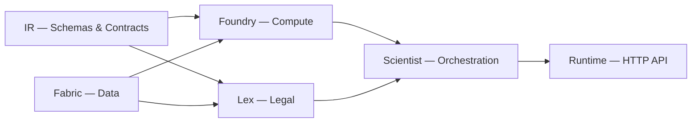

# PolicyOS Documentation

> AI-driven Policy Simulation System using JAX and Unified Data Fabric

---

## Overview

PolicyOS — система каузального анализа и симуляции государственных политик.
Объединяет данные из международных статистических порталов, правовые корпуса,
каузальный inference и механизмы governance в единый pipeline.

## Architecture



**Пять подсистем:**

| Module | Role |
|--------|------|
| **[IR](reference/ir/index.md)** | Canonical contract layer for policies, analytics, observations, and ABI snapshots |
| **[Foundry](reference/foundry/index.md)** | Computation engine — JAX-based compilation and execution of mechanism graphs |
| **[Scientist](reference/scientist/index.md)** | Orchestration — workflow DAGs, governance passes, and experiment lifecycle |
| **[Lex](reference/lex/index.md)** | Legal text processing — normative corpus, SPO extraction, knowledge graph |
| **[Fabric](reference/fabric/index.md)** | Data fabric — connector families, source profiles, and evidence ingestion paths |

## Quick Navigation

<div class="grid cards" markdown>

-   :material-school: **[Tutorials](tutorials/index.md)**

    Step-by-step guides for learning PolicyOS from scratch.

-   :material-tools: **[How-to Guides](how-to/index.md)**

    Practical recipes for specific tasks.

-   :material-book-open-variant: **[Reference](reference/index.md)**

    Complete API reference for all modules.

-   :material-head-question: **[Explanation](explanation/index.md)**

    Design rationale and architectural context.

-   :material-lifebuoy: **[Runbooks](runbooks/index.md)**

    Incident response, rollback, restore, and benchmark triage guidance.

</div>

## Getting Started

```bash
git clone https://github.com/DenisKopylov/polisyos.git
cd polisyos/policy-engine
python3 -m tools.cli workspace bootstrap
python3 -m tools.cli workspace doctor
```

See [Getting Started tutorial](tutorials/getting-started.md) and the [Installation guide](how-to/install.md) for the current verified install surface.

## Operational Readiness

Phase 6 operational docs now live in three places:

- [Runbooks](runbooks/index.md) for incidents and rollback;
- [Operations Reference](reference/operations/index.md) for SLOs, observability,
  retention, and scorecard policy;
- [Onboarding Tracks](how-to/onboarding/index.md) for role-based entry paths.

Phase 7 closeout adds two repo-wide anchors:

- [Platform Acceptance Audit](reference/operations/platform-acceptance-audit.md)
  for the end-to-end acceptance pass and rehearsal evidence;
- [Ratchet Policy](reference/ratchet-policy.md) for the merge-time minimum bar on
  any new subsystem or major surface.
