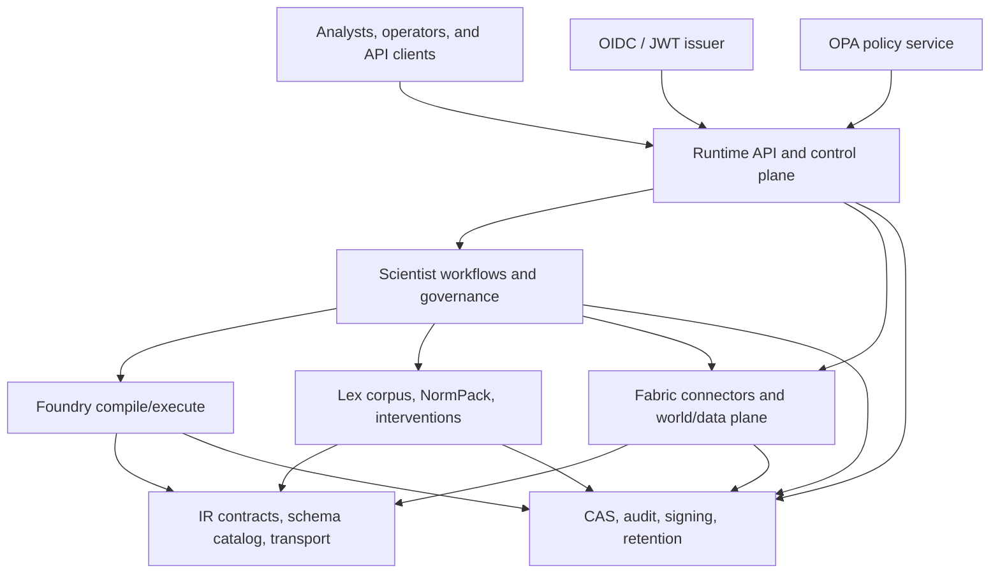

# PolicyOS Documentation

PolicyOS is a policy-analysis platform that keeps data ingestion, legal
reasoning, simulation, governance, and runtime delivery behind explicit
contracts.

## System Context

## Start Here

- [Tutorials](tutorials/index.md) for the first working flows.
- [How-to guides](how-to/index.md) for operational tasks.
- [Reference](reference/index.md) for API, schema, and subsystem contracts.
- [Explanation](explanation/index.md) for architecture, security, governance,
  and data-flow rationale.

- [Runbooks](runbooks/index.md) for incident response and rollback.

## Architecture Packages

| Package                 | Main page                                                                                          | Default evidence                                                                                                                                            |
| ----------------------- | -------------------------------------------------------------------------------------------------- | ----------------------------------------------------------------------------------------------------------------------------------------------------------- |
| System context          | [Architecture](explanation/architecture.md)                                                        | [Platform acceptance audit](reference/operations/platform-acceptance-audit.md), [platform diagrams](reference/operations/platform-architecture-diagrams.md) |
| Contract architecture   | [Trinity](explanation/trinity.md), [IR design](explanation/ir-design.md)                           | [TRINITY contract](contracts/TRINITY.md), [IR schema catalog](reference/ir/schema-catalog.md)                                                               |
| Runtime and security    | [Security model](explanation/security-model.md)                                                    | [Auth and tenant model](reference/api/auth-tenant-model.md), [security compliance](reference/security-compliance.md)                                        |
| Data architecture       | [Data fabric](explanation/data-fabric.md)                                                          | [Fabric reference](reference/fabric/index.md), [lineage](reference/fabric/lineage.md)                                                                       |
| Scientific architecture | [Causal engine](explanation/causal-engine.md), [Governance model](explanation/governance-model.md) | [Foundry reference](reference/foundry/index.md), [Scientist reference](reference/scientist/index.md)                                                        |
| Legal architecture      | [Lex pipeline](explanation/lex-pipeline.md)                                                        | [Lex reference](reference/lex/index.md), [NormPack contract](contracts/E2_9_LEX_NORMPACK_ASSEMBLY_V1_0.md)                                                  |
| Observation contracts   | [Observation contracts](explanation/observation-contracts.md)                                      | [IR observation reference](reference/ir/observation.md)                                                                                                     |
| Freeze and ratchets     | [Freeze policy](explanation/freeze-policy.md)                                                      | [Quality gates](reference/quality-gates.md), [ratchet policy](reference/ratchet-policy.md)                                                                  |

## Operational Anchors

- [Ownership](reference/ownership.md) routes reviews and escalations.
- [Generated artifacts](reference/generated-artifacts.md) describes the durable
  artifact families used by the runtime, Scientist, Foundry, and Fabric.

- [Repository topology](reference/repository-topology.md) is the public map for
  where product files, docs, tests, tools, ops material, data, and runtime state
  belong.

- [Operations reference](reference/operations/index.md) ties diagrams, SLOs,
  retention, and closeout evidence together.

- [Documentation inventory](reference/documentation-inventory.md) tracks the
  current docs QA ledger and D0-D5 status.
