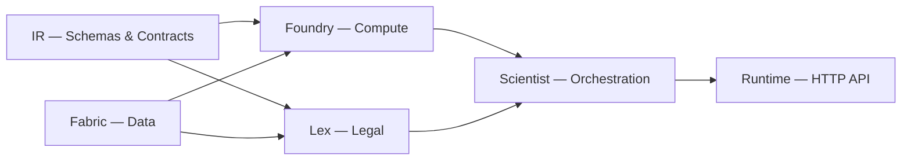

# PolicyOS Documentation

> AI-driven Policy Simulation System using JAX and Unified Data Fabric

---

## Overview

PolicyOS — система каузального анализа и симуляции государственных политик.
Объединяет данные из международных статистических порталов, правовые корпуса,
каузальный inference и механизмы governance в единый pipeline.

## Architecture



**Пять подсистем:**

| Module | Role |
|--------|------|
| **[IR](reference/ir/index.md)** | Canonical contract layer — 160+ Pydantic types for policies, analytics, observations |
| **[Foundry](reference/foundry/index.md)** | Computation engine — JAX-based compilation and execution of mechanism graphs |
| **[Scientist](reference/scientist/index.md)** | Orchestration — workflow DAGs, 18 governance passes, experiment lifecycle |
| **[Lex](reference/lex/index.md)** | Legal text processing — normative corpus, SPO extraction, knowledge graph |
| **[Fabric](reference/fabric/index.md)** | Data fabric — 9 connectors (World Bank, Eurostat, WHO, UNESCO...) |

## Quick Navigation

<div class="grid cards" markdown>

-   :material-school: **[Tutorials](tutorials/index.md)**

    Step-by-step guides for learning PolicyOS from scratch.

-   :material-tools: **[How-to Guides](how-to/index.md)**

    Practical recipes for specific tasks.

-   :material-book-open-variant: **[Reference](reference/index.md)**

    Complete API reference for all modules.

-   :material-head-question: **[Explanation](explanation/index.md)**

    Design rationale and architectural context.

</div>

## Getting Started

```bash
pip install -e ".[ml]"
polisyos --version
```

See [Getting Started tutorial](tutorials/getting-started.md) and the [Installation guide](how-to/install.md) for the current verified install surface.
