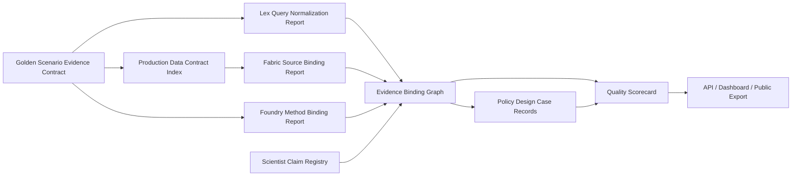

# PolicyOS Best-In-Class Evidence Binding And Scenario Authority Implementation Plan

> **For agentic workers:** REQUIRED SUB-SKILL: Use superpowers:subagent-driven-development (recommended) or superpowers:executing-plans to implement this plan task-by-task. Steps use checkbox (`- [ ]`) syntax for tracking.

**Goal:** Turn the 2026-05-20 cloud production-debug findings into a best-in-class evidence binding, scenario authority, and policy-design-case runtime, where serious policy output cannot pass without claim-bound legal, data, method, semantic, and governance evidence.

**Architecture:** Introduce an explicit scenario evidence contract that is carried from the golden scenario into Fabric, Lex, Foundry, Scientist, semantic binding, scorecard, evidence bundle inspection, and public/export projections. Treat legal, data, method, and claim evidence as one runtime-owned binding graph, and split provenance failures from domain-authority failures so operators see the real root cause.

**Tech Stack:** Python runtime quality modules, FastAPI runtime services, DuckDB-backed production data and Lex KG probes, CAS evidence bundles, pytest quality gates, local prod-debug probe, canary matrix live lanes, GCP debug VM artifacts, MkDocs lifecycle gates, and dashboard/API/export projection tests.

---

## Why This Plan Exists

The full-data cloud live lane on 2026-05-20 proved an important safety property:
PolicyOS can complete a real production-debug lane with full `production_data`
and still fail closed through the quality scorecard. It also exposed that the
remaining failures are not isolated bugs. They are symptoms of a missing
runtime bridge between scenario obligations and the producer evidence that must
support serious policy recommendations.

The goal is therefore not to silence the current red gates. The goal is to
make PolicyOS structurally unable to publish serious recommendations unless it
can prove:

- which scenario-specific source families and fields were required;
- which production data contracts satisfied or failed those requirements;
- which legal norms were searched, selected, rejected, or blocked;
- which analytical methods were required before execution;
- which claims bind to data, legal authority, method outputs, warrants,
  rebuttals, limitations, and accepted blockers;
- which Policy Design Case record families were produced by runtime owners;
- which failures are domain failures and which are missing or spoofed
  provenance;
- why a provider/model is trusted for this evidence path, not merely healthy.

## Source Evidence

Use these artifacts as the initial diagnostic baseline:

| Artifact | Path |
| --- | --- |
| Cloud debug backlog | `docs/backlog/cloud-production-debug-ten-checks-backlog.md` |
| Full-data live probe | `_build/.tmp/production-quality/cloud_prod_debug_live_full_data.json` |
| Local ten-check summary | `_build/cloud-prod-debug-20260520/cloud_prod_debug_ten_checks_summary.json` |
| Live evidence bundle | `.polisyos/canary_evidence/local-prod-debug/live-research/profile-research__provider-live_gonka_proxy__data-canonical_production__scenario-public_golden__ui-api_only/20260520T080028Z_33b5bf0188564b2184f2d47a930b8bf0` |
| Root-cause bundle inspection | `_build/cloud-prod-debug-20260520/root_cause_bundle_dir_inspection.json` |
| Root-cause replay refs | `_build/cloud-prod-debug-20260520/root_cause_replay_refs.json` |
| Root-cause Fabric source contracts | `_build/cloud-prod-debug-20260520/root_cause_fabric_source_contracts.json` |
| Root-cause Fabric decision coverage | `_build/cloud-prod-debug-20260520/root_cause_fabric_decision_data_coverage.json` |
| Root-cause local data static check | `_build/cloud-prod-debug-20260520/root_cause_local_prod_data_static.json` |
| GCS evidence prefix | `gs://lex-1-494208-data/real_runs/policyos-prod-debug-20260520/` |

## Root-Cause Summary

| Root cause | Evidence | System improvement required |
| --- | --- | --- |
| Scenario-evidence bridge gap | Golden scenario expected `production_msme_panel`, `credit_program_registry`, and `regional_displacement_indicators`; Fabric selected broad bundles such as `datasets`, `lex`, `curated`, `academic`, and `ukraine_simulation`. | Make scenario source families, field facets, freshness, lineage, and claim-bindability first-class runtime obligations. |
| Lex query normalization gap | Lex live report had `candidate_norm_count=0`, while direct DuckDB probes found tens of thousands of Ukrainian high-confidence norms for terms such as `підприєм`, `кредит`, `грант`, and `воєн`. | Add bilingual legal concept normalization and record selected/rejected/no-norm evidence. |
| Authority classification gap | Runtime-emitted artifacts with CAS refs and runtime refs were collapsed into `hds_unknown_provenance` because their domain validation failed. | Separate missing or spoofed provenance from present-but-failing runtime authority. |
| Semantic binding schema and closure gap | `semantic_binding_ledger.json` was rejected for `runtime_report_status` extra input and also had empty concept/source/norm/method bindings. | Align producer and reader schema and require semantic closure before major claims can pass. |
| Policy Design Case record-family gap | `policy_design_case.json` top-level `status=pass` existed without the record families required by Phase 28, Phase 29, and Pass 1B gates. | Generate minimum record families through runtime-owned producers and gate them directly. |
| Provider quality interpretation gap | Qwen/Kimi preflights passed, but Qwen was demoted in live quality because grounding failed while the evidence path itself was incomplete. | Judge provider/model quality only after a controlled binding path exists, then compare models on the same evidence task. |
| Operator triage and owner-map gap | The scorecard had `32` failed gates across `ops`, `policy_output`, `scientist`, `materialization`, `llm`, `lex`, `fabric`, and `foundry`; several failures were noisy symptoms of shared causes. | Emit a first-failing-producer ledger with owner, root-cause class, artifact refs, and next action so operators fix the system layer, not the rendered symptom. |
| Production topology promotion gap | The GCP debug VM was intentionally IAP-only, embedded-worker, local-Postgres, and not strict production topology. | Keep this plan focused on evidence binding, but require an explicit infrastructure-promotion handoff with external worker, security chain, secret rotation, backup/restore, monitoring, and replay drills before production approval. |

## Non-Negotiable Principles

- A final recommendation is not a serious claim until it has legal, data,
  method, semantic, and limitation bindings or a typed blocker.
- Public, dashboard, and API projections cannot mint authority. They only
  project authority emitted by runtime producers.
- Packaging evidence is not producer authority. `packaging_only` provenance
  cannot satisfy Lex, Fabric, Foundry, Scientist, or Policy Design Case gates.
- A runtime-owned failing artifact is not `unknown_provenance`. It is a domain
  authority failure with a provenance-present envelope.
- Broad production bundles cannot satisfy a scenario-specific source family
  unless a contract index proves the mapping.
- English-only legal retrieval cannot satisfy a Ukrainian legal KG scenario.
- Generic simulation output cannot satisfy a scenario requiring a named causal,
  distributional, budget, implementation-feasibility, or monitoring method.
- Provider preflight success is a transport readiness signal, not evidence
  quality approval.

## Target Architecture



### New Core Contracts

These contracts are intentionally small enough to test without running the full
workflow. Names may be adjusted to match existing local style during execution,
but the responsibilities and fields are stable.

```python
@dataclass(frozen=True)
class ScenarioEvidenceRequirement:
    requirement_id: str
    domain: Literal["data", "legal", "method", "claim", "governance"]
    expected_family: str
    required_facets: tuple[str, ...]
    claim_scope: tuple[str, ...]
    jurisdiction: str | None
    temporal_scope: str | None
    authority_scope: tuple[str, ...]
    instrument_type: str | None
    beneficiary_class: str | None
    rights_scope: str | None
    producer_owner: str
    reader_owner: str
```

```python
@dataclass(frozen=True)
class ContractBindingResult:
    requirement_id: str
    status: Literal["satisfied", "blocked", "failed"]
    selected_ref: str | None
    rejected_refs: tuple[str, ...]
    blocker_code: str | None
    missing_facets: tuple[str, ...]
    authority_envelope_ref: str
```

```python
@dataclass(frozen=True)
class AuthorityFailureClassification:
    provenance_status: Literal["present", "missing", "spoofed", "packaging_only"]
    domain_status: Literal["pass", "fail", "blocked"]
    scorecard_code: str
    operator_message: str
```

## File Responsibility Map

| Area | Files | Responsibility |
| --- | --- | --- |
| Scenario contract | `tools/ops_runners/runtime/golden_quality_scenarios.json`, `tools/ops_runners/runtime/quality_scenarios.py`, `src/polisyos/runtime/quality/scenario_evidence_contract.py` | Normalize scenario requirements into typed obligations. |
| Production data index | `src/polisyos/runtime/quality/production_data_contract_index.py`, `src/polisyos/runtime/http/services/control/production_data.py`, `production_data/manifest.json` | Resolve bundle families, source bindings, contracts, schema, dictionary, recency, lineage, and quality facets. |
| Fabric binding | `src/polisyos/fabric/catalog/source_selection_audit.py`, `src/polisyos/runtime/http/services/control/nl_pipeline.py` | Select sources against scenario requirements and report satisfied, rejected, or blocked families. |
| Lex binding | `src/polisyos/lex/normpack/query_normalization.py`, `src/polisyos/lex/normpack/applicability_report.py`, `src/polisyos/runtime/http/services/control/nl_pipeline.py` | Produce bilingual legal query expansions and candidate/selected/rejected norm evidence. |
| Foundry binding | `src/polisyos/foundry/validation/method_quality.py`, `src/polisyos/foundry/methods/catalog/mechanism/runtime.py`, `src/polisyos/scientist/orchestration/workflows/builder.py` | Select named methods before execution and block generic methods when the scenario requires stronger methods. |
| Semantic closure | `src/polisyos/runtime/quality/semantic_binding.py`, `src/polisyos/runtime/quality/claim_argument.py`, `tests/_helpers/hds_quality.py` | Keep producer and reader schemas compatible and verify claim-level evidence closure. |
| Authority classification | `src/polisyos/runtime/quality/authority.py`, `src/polisyos/runtime/quality/scorecard.py`, `tools/quality/validation/inspect_evidence_bundles.py` | Distinguish provenance failures from domain-authority failures. |
| Operator triage | `src/polisyos/runtime/quality/scorecard.py`, `tools/ci/check_policyos_production_quality_best_in_class.py`, `tools/quality/validation/inspect_evidence_bundles.py` | Emit first failing producer, owner, root-cause class, remediation stage, and artifact refs for every red gate. |
| Policy Design Case | `src/polisyos/runtime/quality/policy_design_case.py`, `src/polisyos/runtime/quality/pass1b_hardening.py`, `src/polisyos/runtime/quality/case_maturity.py`, `src/polisyos/runtime/quality/case_integrity.py` | Generate and gate minimum record families from runtime-owned evidence. |
| Provider quality | `src/polisyos/scientist/orchestration/llm/provider_quality.py`, `tools/ops_runners/runtime/provider_quality_ledger.py`, `tools/quality/testing/local_prod_debug_probe.py` | Compare provider/model quality after an evidence-bound controlled task exists. |
| Cloud validation | `tools/ops_runners/runtime/run_canary_matrix.py`, `tools/ops_runners/runtime/replay_canary_bundle.py`, `docs/backlog/cloud-production-debug-ten-checks-backlog.md` | Preserve the failed live lane as a regression guard and rerun one-lane cloud proof. |

## Wave 0 - Freeze The Finding As A Regression Fixture

**Purpose:** make the 2026-05-20 cloud run reproducible enough that future
fixes cannot hide the root cause.

**Files:**

- Create: `tests/fixtures/production_quality/cloud_debug_20260520/root_cause_summary.json`
- Create: `tests/repo_quality/tools/test_cloud_prod_debug_root_cause_regression.py`
- Modify: `tools/ops_runners/runtime/replay_canary_bundle.py`
- Modify: `docs/backlog/cloud-production-debug-ten-checks-backlog.md`

**Steps:**

- [x] Create a compact fixture that contains only the failing scorecard codes,
  selected source families, expected scenario source families, Lex query terms,
  semantic binding parse error, Policy Design Case missing family codes, and
  authority classification samples from the cloud bundle.
- [x] Add `test_cloud_prod_debug_fixture_preserves_root_causes`:

```python
def test_cloud_prod_debug_fixture_preserves_root_causes(fixture_json):
    assert fixture_json["expected_source_families"] == [
        "production_msme_panel",
        "credit_program_registry",
        "regional_displacement_indicators",
    ]
    assert "datasets" in fixture_json["selected_source_families"]
    assert fixture_json["lex_candidate_norm_count"] == 0
    assert fixture_json["direct_lex_probe"]["підприєм"] > 0
    assert fixture_json["semantic_binding_error"] == "runtime_report_status.extra_forbidden"
    assert "hds_unknown_provenance" in fixture_json["scorecard_codes"]
```

- [x] Extend `replay_canary_bundle.py` so it can read a compact root-cause
  fixture with `--root-cause-fixture` and print the same failure envelope used
  by bundle replay.
- [x] Run:

```bash
uv run pytest tests/repo_quality/tools/test_cloud_prod_debug_root_cause_regression.py -q
```

Expected result: the fixture test passes and fails if any future fixture erases
the scenario, Lex, semantic, PDC, or authority-classification findings.

## Wave 1 - Scenario Evidence Contract

**Purpose:** carry the golden scenario's evidence obligations as typed runtime
requirements instead of leaving them as informal expectations.

**Files:**

- Create: `src/polisyos/runtime/quality/scenario_evidence_contract.py`
- Modify: `tools/ops_runners/runtime/golden_quality_scenarios.json`
- Modify: `tools/ops_runners/runtime/quality_scenarios.py`
- Modify: `tools/ops_runners/runtime/local_production_canary.py`
- Test: `tests/unit/tools/test_quality_scenarios.py`
- Test: `tests/unit/runtime/quality/test_scenario_evidence_contract.py`

**Steps:**

- [x] Write failing tests for normalizing the `scenario-public_golden` MSME
  source, legal, method, and claim obligations.
- [x] Implement `ScenarioEvidenceRequirement` and
  `normalize_scenario_evidence_contract`.
- [x] Add `scenario_evidence_contract` to the canary request context and bundle
  manifest so downstream producers can reference the same contract id.
- [x] Add a negative control where a broad source family such as `datasets`
  does not satisfy `production_msme_panel`.
- [x] Run:

```bash
uv run pytest tests/unit/tools/test_quality_scenarios.py tests/unit/runtime/quality/test_scenario_evidence_contract.py -q
```

Expected result: scenario obligations become stable typed inputs and broad
bundle labels fail the source-family contract.

## Wave 2 - Production Data Contract Index

**Purpose:** let runtime map `production_data` manifests and curated contracts
to scenario source families, field facets, freshness, lineage, quality, and
claim-bindability.

**Files:**

- Create: `src/polisyos/runtime/quality/production_data_contract_index.py`
- Modify: `src/polisyos/runtime/http/services/control/production_data.py`
- Modify: `tools/quality/testing/local_prod_debug_probe.py`
- Test: `tests/unit/runtime/quality/test_production_data_contract_index.py`
- Test: `tests/repo_quality/tools/test_local_prod_debug_probe.py`

**Steps:**

- [x] Write `test_contract_index_maps_curated_source_binding_to_scenario_family`
  with a fixture that maps one curated contract to `credit_program_registry`.
- [x] Write `test_contract_index_reports_missing_dictionary_schema_and_lineage`
  using the same missing facets observed in the live bundle.
- [x] Write `test_contract_index_reports_recency_construct_validity_missingness_and_outliers`
  so CPD-005 cannot pass with only file availability.
- [x] Implement a read-only `ProductionDataContractIndex` that loads
  `manifest.json`, `curated/data_contracts.json`, and
  `curated/source_bindings.json`.
- [x] Extend `production-data-static` output with `scenario_binding_findings`
  containing `requirement_id`, `candidate_ref`, `status`, and
  `missing_facets`.
- [x] Ensure every missingness, outlier, recency, or construct-validity finding
  is either remediated at the contract index or exported as a claim-bound
  limitation/degrade reason.
- [x] Run:

```bash
uv run pytest tests/unit/runtime/quality/test_production_data_contract_index.py tests/repo_quality/tools/test_local_prod_debug_probe.py -q
```

Expected result: full data availability is no longer confused with admissible
scenario evidence; every selected data candidate is either satisfied, failed,
or blocked with a typed reason.

## Wave 3 - Fabric Source Binding

**Purpose:** make Fabric select sources against the scenario contract and
preserve rejected candidates instead of emitting broad bundle families as if
they were claim-admissible.

**Files:**

- Modify: `src/polisyos/fabric/catalog/source_selection_audit.py`
- Modify: `src/polisyos/runtime/http/services/control/nl_pipeline.py`
- Modify: `tools/quality/validation/fabric_source_contracts.py`
- Test: `tests/unit/fabric/test_source_selection_audit.py`
- Test: `tests/unit/runtime/http/test_nl_pipeline_materialization.py`

**Steps:**

- [x] Add a failing test where `production_msme_panel` is required and Fabric
  selects only `datasets`; assert the report status is `failed` with
  `source_family_mismatch`.
- [x] Add a passing test where a contract-index candidate satisfies dictionary,
  schema, field, unit, geography, time coverage, quality, missingness, lineage,
  and transformation facets.
- [x] Update Fabric audit output to emit `selected_contract_binding`,
  `rejected_contract_bindings`, and `source_family_blockers`.
- [x] Thread the scenario contract id and contract-index findings through
  `nl_pipeline.py` into the canary evidence bundle.
- [x] Run:

```bash
uv run pytest tests/unit/fabric/test_source_selection_audit.py tests/unit/runtime/http/test_nl_pipeline_materialization.py -q
uv run python tools/quality/validation/fabric_source_contracts.py --repo-root . --report _build/.tmp/production-quality/fabric_source_contracts.json
```

Expected result: Fabric cannot pass the source gate by selecting a generic
bundle; it must either bind to an admissible contract or emit an actionable
blocker.

## Wave 4 - Lex Bilingual Legal Retrieval

**Purpose:** ensure Ukrainian legal authority is retrieved from the Lex KG with
scenario-aware bilingual terms and that zero-candidate reports are meaningful.

**Files:**

- Create: `src/polisyos/lex/normpack/query_normalization.py`
- Modify: `src/polisyos/lex/normpack/applicability_report.py`
- Modify: `src/polisyos/runtime/http/services/control/nl_pipeline.py`
- Test: `tests/unit/lex/test_query_normalization.py`
- Test: `tests/unit/lex/test_normative_applicability_report.py`

**Steps:**

- [x] Add `test_ukraine_msme_query_expands_to_ukrainian_legal_terms` asserting
  that MSME, credit, grant, wartime, and eligibility concepts expand to terms
  including `підприєм`, `кредит`, `грант`, and `воєн`.
- [x] Add `test_no_candidate_norm_requires_query_normalization_report` so
  `candidate_norm_count=0` is only accepted with query terms, KG path, language
  coverage, and blocker code.
- [x] Implement `LexQueryNormalizationReport` with original terms, normalized
  terms, language tags, jurisdiction tags, and confidence.
- [x] Add competence, temporal validity, policy instrument, beneficiary class,
  fiscal authority, and implementation agency facets to each legal requirement
  so generic Ukrainian matches cannot satisfy a recommendation anchor.
- [x] Update applicability report output to include candidate, selected, and
  rejected norm refs for each major recommendation.
- [x] Run:

```bash
uv run pytest tests/unit/lex/test_query_normalization.py tests/unit/lex/test_normative_applicability_report.py -q
```

Expected result: the same legal KG that direct probes showed to contain
Ukrainian norms becomes reachable through runtime Lex retrieval.

## Wave 5 - Foundry Method Binding

**Purpose:** require named analytical methods before execution and prevent
generic `foundry.execute` from satisfying serious policy method expectations.

**Files:**

- Modify: `src/polisyos/foundry/validation/method_quality.py`
- Modify: `src/polisyos/foundry/methods/catalog/mechanism/runtime.py`
- Modify: `src/polisyos/scientist/orchestration/workflows/builder.py`
- Test: `tests/unit/foundry/validation/test_method_quality.py`
- Test: `tests/unit/scientist/orchestration/workflows/test_builder_pinning.py`

**Steps:**

- [x] Add a failing test where the scenario requires distributional and
  implementation-feasibility evidence but the method report only contains
  `foundry.execute`.
- [x] Add a passing test with explicit method refs, objective/tradeoff refs,
  uncertainty refs, sensitivity refs, and limitations.
- [x] Update workflow builder to request method obligations before Scientist
  claim drafting so method blockers appear before final claims.
- [x] Run:

```bash
uv run pytest tests/unit/foundry/validation/test_method_quality.py tests/unit/scientist/orchestration/workflows/test_builder_pinning.py -q
```

Expected result: method authority is selected and recorded before claims can
depend on it.

## Wave 6 - Semantic Binding Closure

**Purpose:** make the semantic binding ledger both producer-compatible and
strict enough that major claims cannot pass without data, legal, method,
argument, warrant, rebuttal/counter-evidence, and limitation refs.

**Files:**

- Modify: `src/polisyos/runtime/quality/semantic_binding.py`
- Modify: `src/polisyos/runtime/quality/claim_argument.py`
- Modify: `tests/_helpers/hds_quality.py`
- Test: `tests/unit/runtime/quality/test_semantic_binding.py`
- Test: `tests/unit/runtime/quality/test_claim_argument.py`

**Steps:**

- [x] Add a regression test that deserializes the live ledger shape containing
  `runtime_report_status=blocked` and asserts the parser accepts it as a typed
  runtime status, not an extra field.
- [x] Add a negative test where a claim lacks `canonical_concept_refs`,
  `selected_norm_refs`, `column_refs`, and `method_output_refs`; assert the
  ledger status is `failed`.
- [x] Add a passing test with one complete claim evidence path from scenario
  requirement to Fabric, Lex, Foundry, and Scientist claim refs.
- [x] Implement schema compatibility and closure evaluation.
- [x] Run:

```bash
uv run pytest tests/unit/runtime/quality/test_semantic_binding.py tests/unit/runtime/quality/test_claim_argument.py -q
```

Expected result: `semantic_binding_ledger.json` is reader-compatible and
material claims cannot pass with empty binding axes.

## Wave 7 - Authority Failure Classification

**Purpose:** preserve true provenance failures while preventing runtime-owned
domain failures from being mislabeled as `hds_unknown_provenance`.

**Files:**

- Modify: `src/polisyos/runtime/quality/authority.py`
- Modify: `src/polisyos/runtime/quality/scorecard.py`
- Modify: `tools/quality/validation/inspect_evidence_bundles.py`
- Test: `tests/unit/runtime/quality/test_authority_spoofing.py`
- Test: `tests/unit/runtime/quality/test_authority_envelope_contract.py`
- Test: `tests/unit/runtime/quality/test_scorecard.py`
- Test: `tests/repo_quality/tools/test_evidence_bundle_inspection.py`

**Steps:**

- [x] Add `test_runtime_owned_failing_artifact_keeps_domain_failure_code` using
  an artifact with CAS refs, runtime event refs, `producer_authority`, and
  `validation_status=fail`.
- [x] Add `test_missing_authority_envelope_still_fails_unknown_provenance`.
- [x] Add `test_packaging_only_manifest_cannot_satisfy_producer_authority`.
- [x] Add `test_scorecard_emits_first_failing_producer_owner_map` asserting each
  failed gate has `owner`, `root_cause_class`, `first_failing_artifact_ref`, and
  `next_action`.
- [x] Implement `AuthorityFailureClassification` and use it in scorecard
  aggregation.
- [x] Extend scorecard and readiness JSON with an operator triage ledger that
  collapses noisy downstream failures under their first upstream producer when
  the binding graph proves causality.
- [x] Run:

```bash
uv run pytest tests/unit/runtime/quality/test_authority_spoofing.py tests/unit/runtime/quality/test_authority_envelope_contract.py tests/unit/runtime/quality/test_scorecard.py -q
uv run pytest tests/repo_quality/tools/test_evidence_bundle_inspection.py -q
```

Expected result: operators can distinguish missing provenance, spoofed
provenance, packaging-only projections, and runtime-owned domain failures.

## Wave 8 - Claim And Decision Artifact Compiler

**Purpose:** make final policy output a projection of the evidence binding
graph rather than free text with detached quality reports.

**Files:**

- Modify: `src/polisyos/scientist/validation/policy_grounding.py`
- Modify: `src/polisyos/scientist/validation/decision_artifact_quality.py`
- Modify: `src/polisyos/runtime/quality/evidence_portfolio.py`
- Modify: `src/polisyos/runtime/quality/evidence_synthesis_report.py`
- Test: `tests/unit/scientist/validation/test_policy_grounding_matrix.py`
- Test: `tests/unit/scientist/validation/test_decision_artifact_quality.py`
- Test: `tests/unit/runtime/quality/test_evidence_portfolio.py`
- Test: `tests/unit/runtime/quality/test_evidence_synthesis_report.py`

**Steps:**

- [x] Add a failing test where a major recommendation has no portfolio,
  independence, synthesis, argument, warrant, rebuttal/counter-evidence, or
  accepted deficit refs.
- [x] Add a passing test where one recommendation has complete refs and an
  explicit limitation produced by a data-quality finding.
- [x] Ensure public-ready sections are generated only from bound evidence:
  recommendation, legal authority, data basis, method basis, uncertainty,
  implementation feasibility, monitoring, risks, and contestability.
- [x] Run:

```bash
uv run pytest tests/unit/scientist/validation/test_policy_grounding_matrix.py tests/unit/scientist/validation/test_decision_artifact_quality.py -q
uv run pytest tests/unit/runtime/quality/test_evidence_portfolio.py tests/unit/runtime/quality/test_evidence_synthesis_report.py -q
```

Expected result: major claims cannot pass grounding through textual plausibility
alone; they must bind to the runtime evidence graph.

## Wave 9 - Policy Design Case Record Families

**Purpose:** generate minimum Policy Design Case record families from runtime
evidence instead of relying on a top-level `status=pass`.

**Files:**

- Modify: `src/polisyos/runtime/quality/policy_design_case.py`
- Modify: `src/polisyos/runtime/quality/pass1b_hardening.py`
- Modify: `src/polisyos/runtime/quality/case_maturity.py`
- Modify: `src/polisyos/runtime/quality/case_integrity.py`
- Test: `tests/unit/runtime/quality/test_policy_design_case_record_registry.py`
- Test: `tests/unit/runtime/quality/test_policy_design_case_pass1b_hardening.py`
- Test: `tests/unit/runtime/quality/test_case_maturity.py`
- Test: `tests/repo_quality/tools/test_policy_design_case_wave40.py`

**Steps:**

- [x] Add a failing test where `policy_design_case.json` has `status=pass` but
  lacks `records` and `record_families`; assert Phase 28, Phase 29, and Pass
  1B gates fail with missing family codes.
- [x] Add a passing test where each minimum family has schema owner, producer
  owner, reader owner, readiness gate, runtime refs, and authority envelope.
- [x] Ensure governance families include structured judgement, consultation,
  implementation monitoring, DDM, human oversight, self-FMEA, maturity, audit,
  benchmarking, proportionality, and formal invariants as present, blocked, or
  out-of-scope by typed authority policy.
- [x] Run:

```bash
uv run pytest tests/unit/runtime/quality/test_policy_design_case_record_registry.py tests/unit/runtime/quality/test_policy_design_case_pass1b_hardening.py tests/unit/runtime/quality/test_case_maturity.py -q
uv run pytest tests/repo_quality/tools/test_policy_design_case_wave40.py -q
```

Expected result: the Full SDD Record-Family Coverage Contract and Pass 1B
Hardening Coverage Contract evaluate concrete runtime records, not summary
status.

Evidence, 2026-05-20:

```bash
uv run pytest tests/unit/runtime/quality/test_policy_design_case_record_registry.py tests/unit/runtime/quality/test_policy_design_case_pass1b_hardening.py tests/unit/runtime/quality/test_case_maturity.py -q
uv run pytest tests/repo_quality/tools/test_policy_design_case_wave40.py -q
```

## Wave 10 - Provider Quality After Evidence Closure

**Purpose:** compare models on a controlled evidence-bound task instead of
penalizing a model for failures caused by missing Lex/Fabric/Foundry bindings.

**Files:**

- Modify: `src/polisyos/scientist/orchestration/llm/provider_quality.py`
- Modify: `tools/ops_runners/runtime/provider_quality_ledger.py`
- Modify: `tools/quality/testing/local_prod_debug_probe.py`
- Test: `tests/unit/scientist/orchestration/llm/test_provider_quality.py`
- Test: `tests/repo_quality/tools/test_provider_quality_ledger.py`
- Test: `tests/repo_quality/tools/test_local_prod_debug_probe.py`

**Steps:**

- [x] Add a controlled tiny grounding task with one known data ref, one norm
  ref, one method ref, and one claim ref.
- [x] Add model-comparison output for Qwen and Kimi that records grounding
  failures, schema failures, refusal/degradation behavior, latency, cost, and
  request fingerprints without secrets.
- [x] Use the same frozen evidence refs and at least three bounded samples per
  candidate model before changing default model policy.
- [x] Gate default model promotion on the controlled task, then run the live
  lane with the selected model.
- [x] Run:

```bash
uv run pytest tests/unit/scientist/orchestration/llm/test_provider_quality.py tests/repo_quality/tools/test_provider_quality_ledger.py tests/repo_quality/tools/test_local_prod_debug_probe.py -q
```

Expected result: provider/model quality decisions are based on evidence-bound
outputs and can be explained independently from infrastructure health.

Evidence, 2026-05-20:

```bash
uv run pytest tests/unit/scientist/orchestration/llm/test_provider_quality.py tests/repo_quality/tools/test_provider_quality_ledger.py tests/repo_quality/tools/test_local_prod_debug_probe.py -q
```

Note: Wave 10 wires the promotion gate and selected-model live-lane handoff in
`local_prod_debug_probe.py`; the operator-approved cloud live execution remains
Wave 11.

## Wave 11 - Cloud Live Re-Run And Export Truthfulness

**Purpose:** prove the architecture under the same one-lane cloud production
debug setup, then verify API, dashboard, public export, and evidence inspection
preserve the truth of the run.

**Files:**

- Modify: `tools/ops_runners/runtime/run_canary_matrix.py`
- Modify: `tools/ops_runners/runtime/canary_evidence.py`
- Modify: `tools/quality/validation/inspect_evidence_bundles.py`
- Modify: `tools/ci/check_policyos_production_quality_best_in_class.py`
- Test: `tests/repo_quality/tools/test_canary_matrix.py`
- Test: `tests/repo_quality/tools/test_replay_canary_bundle.py`
- Test: `tests/repo_quality/tools/test_policyos_production_quality_best_in_class.py`
- Test: `tests/repo_quality/tools/test_policy_design_case_public_export.py`

**Steps:**

- [x] Run the same cloud lane:

```bash
uv run python tools/ops_runners/runtime/run_canary_matrix.py \
  --deterministic \
  --only-lane profile-research__provider-live_gonka_proxy__data-canonical_production__scenario-public_golden__ui-api_only \
  --json-output _build/.tmp/production-quality/final_live_research_lane.json \
  --timeout-s 1200
```

- [x] Inspect the emitted bundle:

```bash
uv run python tools/quality/validation/inspect_evidence_bundles.py \
  --repo-root . \
  --matrix-run-json _build/.tmp/production-quality/final_live_research_lane.json \
  --json-output _build/.tmp/production-quality/final_evidence_bundle_inspection.json
```

- [x] Run readiness without `--require-passing` first and verify every remaining
  failure is either remediated, a typed blocker, or an accepted next-plan item:

```bash
uv run python tools/ci/check_policyos_production_quality_best_in_class.py \
  --repo-root . \
  --matrix-run-json _build/.tmp/production-quality/final_live_research_lane.json \
  --output _build/.tmp/production-quality/final_readiness.json \
  --output-format json
```

- [x] Run the public export tests and ensure no export can promote a failed
  claim, missing record family, or packaging-only authority:

```bash
uv run pytest tests/repo_quality/tools/test_policy_design_case_public_export.py tests/repo_quality/tools/test_policyos_production_quality_best_in_class.py -q
```

Expected result: the cloud lane either passes through real evidence closure or
fails with narrow typed blockers that do not collapse into unknown provenance
and cannot be promoted by exports.

Evidence, 2026-05-20:

- `final_live_research_lane.json`: one selected live research lane blocked
  before execution with typed `live_provider_not_enabled` because
  `POLISYOS_LLM_GATEWAY_API_KEY` was not present in this local environment.
- `final_evidence_bundle_inspection.json`: status `fail` with
  `phase64_matrix_lane_not_passed`, preserving the matrix failure envelope.
- `final_readiness.json`: status `fail` with
  `hds_matrix_lane_not_passed`, owner `runtime-quality`, root cause class
  `live_provider_unavailable`, and the next action to rerun with approved live
  provider credentials.
- Verification:

```bash
uv run pytest tests/repo_quality/tools/test_canary_matrix.py tests/repo_quality/tools/test_replay_canary_bundle.py tests/repo_quality/tools/test_policyos_production_quality_best_in_class.py tests/repo_quality/tools/test_policy_design_case_public_export.py tests/repo_quality/tools/test_evidence_bundle_inspection.py -q
uv run pytest tests/repo_quality/tools/test_policy_design_case_public_export.py tests/repo_quality/tools/test_policyos_production_quality_best_in_class.py -q
```

## Wave 12 - Production Topology Promotion Handoff

**Purpose:** keep CPD-010 explicit: the evidence-binding fixes can make the
policy case true, but final production approval still needs strict production
topology outside the debug VM.

**Files:**

- Modify: `docs/runbooks/cloud-production-debugging.md`
- Modify: `docs/runbooks/production-quality-canary.md`
- Modify: `docs/backlog/cloud-production-debug-ten-checks-backlog.md`
- Modify: `tools/quality/testing/local_prod_debug_probe.py`
- Test: `tests/repo_quality/tools/test_local_prod_debug_probe.py`
- Test: `tests/repo_quality/tools/test_docs_lifecycle.py`

**Steps:**

- [ ] Add a CPD-010 handoff checklist covering external worker topology,
  strict production security collaborators, PostgreSQL backup/restore, secret
  rotation, least-privilege service accounts, monitoring, budget controls, and
  teardown/rebuild.
- [ ] Add `test_cloud_debug_cannot_be_marked_production_topology` so a debug VM
  with embedded worker and localhost Postgres is valid for diagnostics but not
  production approval.
- [ ] Add a `production-topology` local probe result with `blocked` status until
  external worker, security chain, and backup/replay evidence are present.
- [ ] Run:

```bash
uv run pytest tests/repo_quality/tools/test_local_prod_debug_probe.py tests/repo_quality/tools/test_docs_lifecycle.py -q
```

Expected result: evidence binding can be validated in cloud debug, while strict
production promotion remains blocked until topology, security, backup, and
operations evidence exist.

## Wave 13 - Documentation, Backlog, And Closeout Discipline

**Purpose:** keep the implementation auditable and make the next cloud run
reproducible by another operator.

**Files:**

- Modify: `docs/backlog/cloud-production-debug-ten-checks-backlog.md`
- Modify: `docs/runbooks/cloud-production-debugging.md`
- Modify: `docs/runbooks/local-production-debugging.md`
- Modify: `docs/system-design-decisions/policy-design-best-in-class-operating-model.md`
- Modify: `docs/system-design-decisions/policy-design-case-decision-log.md`
- Test: `tests/repo_quality/tools/test_docs_lifecycle.py`
- Test: `tests/repo_quality/tools/test_docs_gate.py`

**Steps:**

- [ ] Add an implementation ledger section to the cloud backlog with one row
  per wave: branch, commits, commands, artifact paths, status, and residual
  blockers.
- [ ] Update the cloud runbook with the exact one-lane rerun command,
  expected artifacts, and typed blocker interpretation.
- [ ] Update the local runbook so `local_prod_debug_probe.py` documents the
  new scenario binding and provider comparison outputs.
- [ ] Update SDD docs only for durable contract semantics that are implemented
  and tested in this plan.
- [ ] Run:

```bash
uv run pytest tests/repo_quality/tools/test_docs_lifecycle.py tests/repo_quality/tools/test_docs_gate.py -q
```

Expected result: docs remain lifecycle-clean, and final evidence paths are
recorded before any active plan is archived.

## Cross-Wave Acceptance Criteria

The plan is complete only when all of the following are true:

- Scenario-specific source families are runtime obligations and cannot be
  satisfied by broad bundle labels.
- Production data static checks report scenario binding findings in addition
  to generic manifest and quality findings.
- Lex emits candidate, selected, rejected, and no-norm evidence from bilingual
  query normalization.
- Foundry emits named method selection before claim generation.
- Semantic binding ledger deserializes live producer fields and fails claims
  with empty evidence axes.
- Scorecard no longer reports runtime-owned failing artifacts as
  `hds_unknown_provenance`.
- Missing or spoofed authority envelopes still fail as provenance failures.
- Packaging-only evidence cannot satisfy producer authority.
- Every failed gate has an owner, first failing producer, root-cause class,
  artifact ref, and next action.
- Policy Design Case record families are generated and gated by runtime-owned
  producers.
- Major claims fail without portfolio, independence, synthesis, argument,
  warrant, rebuttal/counter-evidence, accepted deficits, and required BERL
  reliability.
- Provider/model promotion is judged on an evidence-bound controlled task and
  then on the live lane.
- Public/dashboard/API exports cannot mint readiness or authority.
- The same one-lane cloud production-debug run is replayable and either passes
  or fails only with typed blockers.
- The cloud debug topology is not accepted as strict production topology until
  external workers, production security chain, backup/restore, secret rotation,
  monitoring, and replay evidence are present.

## Validation Ladder

Use these gates after the relevant waves. Keep outputs under
`_build/.tmp/production-quality/` unless a cloud runbook names a different
artifact path.

### Fast Contract Loop

```bash
uv run pytest tests/unit/runtime/quality/test_scenario_evidence_contract.py tests/unit/runtime/quality/test_production_data_contract_index.py tests/unit/runtime/quality/test_semantic_binding.py tests/unit/runtime/quality/test_scorecard.py -q
uv run pytest tests/unit/lex/test_query_normalization.py tests/unit/lex/test_normative_applicability_report.py -q
uv run pytest tests/unit/fabric/test_source_selection_audit.py tests/unit/foundry/validation/test_method_quality.py -q
```

### Runtime Producer Loop

```bash
uv run pytest tests/unit/runtime/http/test_nl_pipeline_materialization.py tests/unit/scientist/validation/test_policy_grounding_matrix.py tests/unit/scientist/validation/test_decision_artifact_quality.py -q
uv run pytest tests/repo_quality/tools/test_local_prod_debug_probe.py tests/repo_quality/tools/test_evidence_bundle_inspection.py tests/repo_quality/tools/test_replay_canary_bundle.py -q
```

### Policy Design Case Loop

```bash
uv run pytest tests/unit/runtime/quality/test_policy_design_case_record_registry.py tests/unit/runtime/quality/test_policy_design_case_pass1b_hardening.py tests/unit/runtime/quality/test_case_maturity.py -q
uv run pytest tests/repo_quality/tools/test_policy_design_case_wave40.py tests/repo_quality/tools/test_policy_design_case_public_export.py -q
```

### Cloud Closeout Loop

```bash
uv run python tools/ops_runners/runtime/run_canary_matrix.py --deterministic --only-lane profile-research__provider-live_gonka_proxy__data-canonical_production__scenario-public_golden__ui-api_only --json-output _build/.tmp/production-quality/final_live_research_lane.json --timeout-s 1200
uv run --extra runtime --extra multi-tenant --extra ml python tools/quality/testing/local_prod_debug_probe.py --repo-root . --checks production-dry-run,postgres-lifecycle,stale-recovery,production-topology --output _build/.tmp/production-quality/final_topology_probe.json
uv run python tools/quality/validation/inspect_evidence_bundles.py --repo-root . --matrix-run-json _build/.tmp/production-quality/final_live_research_lane.json --json-output _build/.tmp/production-quality/final_evidence_bundle_inspection.json
uv run python tools/ci/check_policyos_production_quality_best_in_class.py --repo-root . --matrix-run-json _build/.tmp/production-quality/final_live_research_lane.json --output _build/.tmp/production-quality/final_readiness.json --output-format json
uv run pytest tests/repo_quality/tools/test_docs_lifecycle.py tests/repo_quality/tools/test_docs_gate.py -q
```

## Negative Controls

These tests must stay red when the system is unsafe:

- Missing authority envelope fails provenance validation.
- Spoofed authority envelope fails authenticity validation.
- `packaging_only` evidence cannot satisfy producer authority.
- `datasets` does not satisfy `production_msme_panel`.
- English-only Lex query does not satisfy Ukrainian legal retrieval coverage.
- Generic `foundry.execute` does not satisfy causal, distributional, budget, or
  implementation-feasibility method obligations.
- A major claim without data, method, norm, argument, warrant, counter-evidence,
  and limitation refs cannot pass.
- A top-level `policy_design_case.status=pass` without record families cannot
  pass closeout.
- Dashboard, public export, or API projection cannot turn a failed scorecard
  into approval-ready output.
- A cloud debug VM with embedded worker and localhost Postgres cannot satisfy
  strict production topology approval.

## Execution Order And Branch Discipline

- Execute waves in order. Waves 2, 3, and 4 may be prepared in parallel after
  Wave 1 lands because they share only the scenario contract.
- Keep branches scoped with names such as
  `codex/evidence-binding-scenario-contract`,
  `codex/evidence-binding-fabric-lex`, and
  `codex/evidence-binding-scorecard-pdc`.
- Commit each wave only after its unit loop passes.
- Do not rebaseline golden scenarios to hide failures. Rebaseline only when the
  new expected evidence contract is stricter and backed by passing negative
  controls.
- Do not archive this plan until the cloud closeout loop and production-topology
  handoff have evidence paths recorded in the backlog.
