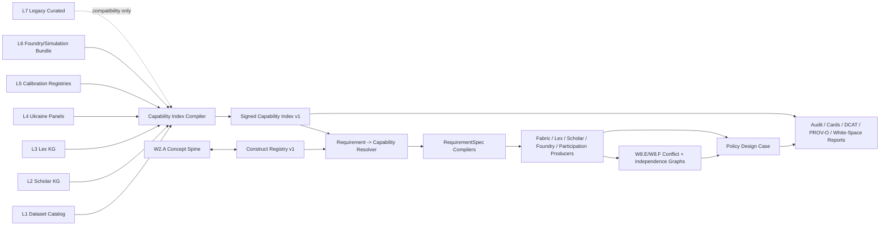

# PolicyOS Policy Evidence Capability Graph Implementation Plan

> **For agentic workers:** REQUIRED SUB-SKILL: Use
> superpowers:executing-plans to implement this plan task-by-task. Steps use
> checkbox (`- [ ]`) syntax for tracking.

**Goal:** Replace the authority semantics of scenario-family string lookup with
a release-time compiled, signed, replayable Policy Evidence Capability Graph
that promotes the existing `production_data` layers into runtime authority
without laundering raw files, LLM candidates, corpus stubs, or simulation
artifacts into production evidence.

**Architecture:** Use construct as the primary semantic axis, with constructs
modeled as policy-decision-bearing entries in the existing concept spine.
Compile evidence capabilities from the seven existing production-data layers,
then resolve runtime `RequirementSpec` objects across data, legal, method,
scholarly, participation, historical-prior, and hypothesis-ledger modalities
against construct requirements, identification mode, trust tier, construct
validity, legal authority, scholarly support, method contract routing, lineage,
rights, freshness, and rollout posture. Keep `source_family` as a deprecated
compatibility projection, never as the authority-bearing selector.

**Tech Stack:** Python runtime-quality modules, DuckDB catalogs, Parquet schema
profiling, JSON/YAML registries, Lex KG, Scholar KG, Foundry method contracts,
Data Forge production data, pytest repo-quality gates, DCAT/PROV-O compatible
exports, Wave 12 validation tools, and GCP production-data release artifacts.

---

## Executive Summary

Wave 12 exposed a persistent failure pattern around the three scenario families
`production_msme_panel`, `credit_program_registry`, and
`regional_displacement_indicators`. The failure is not that PolicyOS lacks
data. The opposite is true: `production_data` already contains seven mature
capability layers, including a DCAT-shaped dataset catalog, Scholar causal
knowledge graph, Lex legal knowledge graph, Ukraine administrative panels,
measurement and identification registries, Foundry method-contract routing, and
agent-simulation bundles.

The actual architectural defect is narrower and more severe:

```text
runtime authority currently sees L7 legacy curated contracts
while L1-L6 already contain the real evidence capability infrastructure
```

The current runtime path relies on:

- `curated/data_contracts.json`, with only three legacy contracts for US GDP,
  US unemployment, and agent salary;
- `scenario_evidence_contract.admissible_data_source_families`, with
  hardcoded scenario-family strings;
- `ProductionDataContractIndex`, which exact-matches those strings instead of
  resolving semantic evidence requirements.

It does not consume:

- `dataset_catalog.duckdb`, with 137K datasets, 605K distributions, 56K metric
  bindings, and schema/variable alignment tables;
- `scholar_knowledge.duckdb`, with causal claims, adjudications, transport
  scores, contested edges, parameters, and boundary conditions;
- `lex_knowledge_graph.duckdb`, with normative facts, thresholds, amendments,
  temporal audit, references, and legal entities;
- Ukraine normalized administrative panels;
- measurement, identification, trust-tier, schema-regime, and proxy registries;
- Foundry method-contract routing;
- cross-modal simulation intervention and observation contracts.

This plan fixes that by adding a **Capability Promotion Layer** over existing
artifacts. The work is not to build a new data lake. The work is to promote the
existing lake into a typed, replayable, authority-scoped runtime capability
graph.

## Relationship To Existing Implementation Waves

This plan is not a parallel replacement for the Universal Policy Design Case
implementation plan. It is the data/evidence-capability repair layer that makes
several existing wave commitments real at runtime.

| This plan phase | Existing wave or phase it extends or replaces | Coexistence semantics |
| --- | --- | --- |
| Phase 1 - Capability Index Compiler | New artifact consumed by W6.B obligation rules, W7.A-E RequirementSpec compilers, W8.E/W8.F graph inspection, W11.E truthfulness audit, and W12 validation. | Parallel release artifact. It does not replace the source catalogs; it promotes them into authority-aware runtime metadata. |
| Phase 2 - Construct Registry | Extends W2.A Concept Spine and cross-references W6.B Governed Obligation Rule Catalog. | `Construct` is a policy-decision-bearing subset of the concept spine. Vertical obligation rules emit obligations whose required evidence references constructs, not source-family strings. |
| Phase 3 - Authority Composition | Extends W8.F Effective Independence Graph and W8.E conflict materialization. | Authority composition reads W8.F independence factors and W8.E conflict markers before a capability can satisfy a claim. |
| Phase 4 - Data Resolver | Replaces the W7.A `_required_data_families` heuristic and closes the A1 feature-flag shim. | Data requirements resolve construct -> capability -> binding status; legacy family fallback remains only during deprecation. |
| Phase 5 - Multi-modal Consumers | Replaces or extends W7.B Legal, W7.C Method, W7.D Scholar, W7.E Participation, and W6.F HypothesisLedger/critic integration internals. | Each producer consumes capability refs through its own authority boundary. LLM and historical prior paths remain advisory/capping signals unless admitted by producer authority. |
| Phase 6 - Acquisition Planner | Extends W3.G and W7.G acquisition planning. | Acquisition strategies become construct-aware, owned, costed, and linked to first-class failure-mode nodes. |
| Phase 7 - Audit, Export, Replay, And Sunset | Extends I7-bis, W11.E truthfulness tools, W12.A-D validation, and W9.F replay. | Shims are sunset in `architecture/shims.toml`; replay uses frozen capability-index refs or a frozen legacy reader for old PDCs. |

Important integration rules:

- Concept Spine remains the vocabulary alignment substrate. Construct Registry
  is a governed subset, not a competing namespace.
- W6.B vertical rules answer "which obligations are required from these
  facets"; Construct Registry answers "which evidence constructs can satisfy
  those obligations at a given authority posture."
- W11.E must compare compiled obligations and evidence requirements in the
  construct vocabulary after this plan lands.
- W8.F effective-independence annotations must be computed before final
  authority composition when multiple capabilities support the same claim.
- W8.E construct-level conflicts must be materialized rather than hidden by
  resolver ranking.
- W3.G/W7.G acquisition planning remains the owner of real data acquisition;
  this plan supplies the missing construct-aware failure and strategy graph.

## Pattern Pass

Relevant failure patterns from
`docs/reference/policy-design-case-failure-patterns.md`:

| Pattern | Existing failure | Correct pattern in this plan |
| --- | --- | --- |
| `P01` contract-only capability | Data contracts exist in multiple places, but only the legacy curated file is consumed by runtime. | Compile a persisted `capability_index_v1` artifact and prove producer -> bridge -> consumer -> verification. |
| `P02` thin orchestration | L1-L6 artifacts coexist but do not exchange binding artifacts with RequirementSpec compilation. | Add `RequirementToCapabilityResolver` as the runtime bridge. |
| `P03` hidden internal richness | Lex, Scholar, dataset catalog, and simulation bundles contain rich evidence not visible to audit surfaces. | Export capability index inspection reports, DCAT projection, PROV-O lineage projection, and white-space reports. |
| `P04` status lattice gap | Missing data, proxy data, simulated evidence, and exact evidence collapse into generic `.blocked`. | Emit typed binding statuses: exact, derived, proxy-limited, simulation-only, context-only, acquisition-required, authority-blocked. |
| `P05` authority boundary leak | A broad bundle or simulation artifact can be mistaken for production evidence if only the family name matches. | Attach `authority_envelope` and `may_not_use_for` to every capability and enforce it in consumers. |
| `P06` shim drift | Scenario-family strings are compatibility shims acting as semantic truth. | Sunset scenario-family lookup in `architecture/shims.toml` after resolver adoption. |
| `P07` rule replay gap | Closed cases cannot replay against the exact data capability semantics that justified them. | Freeze `capability_index_ref`, construct registry version, and composition rule version on PDC closeout. |
| `P08` time-role conflation | Observation time, legal effective time, schema regime time, freshness, and replay time are not composed. | Model time roles in capability scope and binding decisions. |
| `P09` soft-gate ambiguity | Proxy limitations, acquisition gaps, and partial authority can become inert warnings. | Every warning-like binding state has owner, TTL, escalation rule, and rollout effect. |
| `P10` semantic adequacy gap | Structural source-family checks do not prove that the observed construct satisfies the policy claim. | Add construct-level semantic probes and negative controls. |
| `P12` producer handshake gap | Fabric, Lex, Scholar, and Foundry bind independently after scenario compilation. | Use construct and scope handshakes before producer emission. |
| `P14` evidence independence inflation | Multiple assets can share lineage but appear as independent support. | Track `lineage_refs` and effective-independence collapse reasons. |
| `P15` LLM speculation laundering | LLM/critic candidates may suggest constructs, but cannot authorize evidence. | LLM output may propose candidate requirements; only producer-backed capabilities can satisfy them. |

Capability labels before this plan:

- `production-data scenario family binding`: `implemented_but_not_orchestrated`
- `dataset catalog authority`: `bridge_missing`
- `Lex legal authority from KG`: `implemented_but_not_orchestrated`
- `Scholar causal evidence from KG`: `implemented_but_not_orchestrated`
- `Foundry method contract routing`: `bridge_missing`
- `Participation provenance capability`: `bridge_missing`
- `HypothesisLedger/critic candidate capability`: `surface_out_of_scope` for
  authority, `implemented_but_not_orchestrated` for advisory discovery
- `historical PDC prior capability`: `consumer_missing`
- `cross-modal evidence capability graph`: `contract_only`
- `construct-to-capability runtime resolver`: `producer_missing`
- `capability audit/export surface`: `surface_missing`
- `semantic data adequacy tests`: `semantic_test_missing`

Target labels after this plan:

- `policy evidence capability graph`: `implemented`
- `construct registry`: `implemented`
- `requirement-to-capability resolver`: `implemented`
- `legacy scenario-family compatibility`: `surface_out_of_scope` after sunset
- `production data acquisition planner`: `implemented`

## Seven Existing Capability Data Layers

### L1 - Dataset Catalog, DCAT-Shaped

Primary artifact:
`production_data/datasets_full_phase3full_20260327_183054/dataset_catalog.duckdb`

This is already a catalog graph, not a raw file dump:

| Table | Rows | Runtime significance |
| --- | ---: | --- |
| `ds_datasets` | 137,176 | Dataset-level metadata with source, agency, title, description, publisher, spatial/temporal coverage, licensing, quality scores, execution tier, parser readiness, and preferred distribution. |
| `ds_distributions` | 605,408 | Distribution-level access URLs, format, connector type, connector params, media type, machine-readability, parser support, checksums, and default filters. |
| `ds_metric_bindings` | 56,846 | `metric_id x dataset_id x distribution_id x connector_id x confidence x execution_tier` bindings. |
| `ds_observations` | 3,708,006 | Observations keyed by canonical variables, conditions, acquisition method, source watermark, and dataset version. |
| `ds_schema_profiles` | 176,249 | Inferred columns, time/geography/value columns, preview samples, quality, and schema profiles. |
| `ds_variable_alignments` | 20,326 | Raw-to-canonical variable alignments, proxy flags, confidence, and evidence. |
| `ds_registry_datasets` | 28,243 | Provider registry metadata and access/update information. |

Source breadth includes `data_gov_ua_broad` (39,848 datasets), `worldbank`
(29,452), `data_gov_ua_exec` (20,907), plus Eurostat, OECD, WHO, ILO, UNESCO,
UNPD, WVS, Chicago/NYC/Paris open data, EIA, ECB, IMF, and others.

Implementation implication: do not build a new DCAT catalog. Compile a
runtime-authority projection from this existing catalog.

### L2 - Academic Scholar Knowledge Graph

Primary artifact:
`production_data/policyos_academic_runtime_slim_20260411T112032Z/academic/graph/scholar_knowledge.duckdb`

Important tables:

| Table | Rows | Runtime significance |
| --- | ---: | --- |
| `ac_works` | 310,829 | Scholarly works with DOI, abstract, year, publication metadata, OA/fulltext status, citations, and concepts. |
| `ac_causal_claims` | 7,868 | Curated cause-effect claims with direction, strength, design quality tier, mechanism, domain, and trust score. |
| `ac_skg_edges` | 7,607 | Canonical source-target causal edges with evidence strength, confidence, scope conditions, and meta-effect size. |
| `ac_skg_transport_scores` | 7,607 | Context transport scores for target contexts: base confidence, generic penalty, match reward, transport confidence, and match mode. |
| `ac_skg_contested_edges` | 723 | Contested evidence with positive, negative, mixed weights, agreement, and strongest dissent. |
| `ac_parameter_estimates` | 62,248 | Point estimates, confidence intervals, standard errors, units, study design, sample size, country, period, and trust score. |
| `ac_skg_variables` | 55,176 | Canonicalized variables and parent concepts. |
| `ac_skg_context_attributes` | 200,269 | Context attributes with measurement method, country, time period, confidence, and evidence span count. |
| `ac_skg_family_edges` | 15,945 | Family-level causal evidence. |
| `ac_skg_moderation_edges` | 25,035 | Moderation evidence and interaction effects. |
| `ac_skg_simulation_parameters` | 5,124 | Simulation-usable parameters with uncertainty and quality flags. |
| `ac_boundary_conditions` | 38,550 | Scope and threshold conditions. |
| `ac_claim_adjudications` | 67,791 | Credibility, risk-of-bias, support status, source basis, publishable edge, and design quality. |

Implementation implication: Scholar requirement compilation should consume this
layer directly through construct-linked causal and parameter capability nodes.

### L3 - Lex Legal Knowledge Graph

Primary artifact:
`production_data/lex/lex-amendment-only-optimized-20260501-v3/finalize/lex_knowledge_graph.duckdb`

Important tables:

| Table | Rows | Runtime significance |
| --- | ---: | --- |
| `lex_provisions` | 6,074,716 | Provision text, document metadata, anchor path, depth, kind, and structural kind. |
| `lex_normative_facts` | 1,604,211 | Subject-predicate-object normative facts with norm type, action canon, condition, exception, procedure, temporal text, confidence, and quality signals. |
| `lex_high_confidence_norms` | 1,443,585 | High-confidence legal authority candidates. |
| `lex_facts` | 1,980,256 | Full fact set. |
| `lex_rule_clauses` | 409,108 | Clause type, expression JSON, and fact linkage. |
| `lex_rule_thresholds` | 374,516 | Legal thresholds with metric, operator, decimal value, unit, and applies-to scope. |
| `lex_amendments` | 156,196 | Amending-to-amended document lineage, amendment type, and effective time. |
| `lex_entities` | 357,742 | Legal entities, aliases, types, subtypes, and Wikidata links. |
| `lex_doc_domains` | 222,604 | Document-domain scores and ranks. |
| `lex_temporal_audit` | 1,923,162 | Temporal competence and audit records. |
| `lex_references` / `lex_reference_edges` | 84,271 / 73,793 | Reference graph and resolution audit. |

Implementation implication: legal admissibility and temporal competence already
exist in data form. Runtime must bind constructs to Lex facts, thresholds,
amendments, and effective-time checks.

### L4 - Ukraine Normalized Corpus

Primary directory:
`production_data/canonical/local_data_20260501/ukraine_server_support_20260410/normalized_corpus/normalized/`

Important families:

| Family | File | Rows | Key fields |
| --- | --- | ---: | --- |
| `edr_current` | `agent_registry_full.parquet` | 8,868,524 | `agent_id`, `registration_code`, `region_code`, `sector_id`, `name` |
| `dps_financials` | `firm_fundamentals_annual.parquet` | 48,554 | `agent_id`, `registration_code`, `period_id`, `revenue`, `assets`, `liabilities`, `employees` |
| `dps_tax_risk` | `compliance_distress_signals_monthly.parquet` | 373,197 | `agent_id`, `period_id`, `tax_debt`, `risk_score` |
| `distress_events` | `distress_events_panel_monthly.parquet` | 185,644 | `agent_id`, `period_id`, `event_count`, `event_flag`, `region_code` |
| `pfu_debt` | `arrears_panel_monthly.parquet` | 11,574 | `arrears_amount`, `debt_amount`, `agent_id`, `region_code` |
| `spending_full` | `budget_flows_monthly_sparse.parquet` | 54,777,722 | `source_agent_id`, `target_agent_id`, `amount`, `period_id` |
| `nszu_payments` | `public_service_observation_panel_monthly.parquet` | 1,248,102 | `source_agent_id`, `target_agent_id`, `payment_amount`, `period_id` |
| `labor_force_microdata` | `labor_force_micro_targets.parquet` | 1,095,224 | `household_id`, `participation_rate`, `employment_flag`, `informal_employment_flag` |
| `macro_nbu_derzhstat` | `macro_panel_monthly.parquet` | 639,134 | `metric_id`, `observed_value`, `region_code`, `period_id` |
| `customs_trade` | `trade_exposure_monthly.parquet` | 192,954 | `source_agent_id`, `target_agent_id`, `trade_value`, `period_id` |
| `logistics_mobility_displacement` | `transport_pressure_monthly.parquet` | 56 | `cell_id`, `region_code`, `mobility_pressure` |
| `spending_contracts_procurement_proxy` | `procurement_contracts_monthly.parquet` | 1,358,759 | procurement flow proxy fields |
| `prozorro_full` | `procurement_contracts_monthly.parquet` | 119 | direct procurement contract rows |

Most normalized files carry `period_id`, `record_hash`, `schema_version`, and
`source_snapshot_id`. This is already unified schema discipline across
families.

### L5 - Ukraine Calibration Internals

Primary directory:
`production_data/canonical/local_data_20260501/ukraine_server_support_20260410/runtime_calibration_internals/`

Critical registries under `calibration/d2/`:

- `measurement_registry.json`: coverage rules, proxy mappings, and trust tiers.
- `identification_mode_registry.json`: point, partial, proxy, and bounds-only
  identification per family with fallback mode chains.
- `schema_regime_registry.json`: prewar/wartime schema regimes, 2022-02
  changepoint, and boundary buffer periods.
- `governance_pass_mapping_v1.json`: family-to-governance-pass mapping.
- `shock_calendar.json`, `regime_calendar.json`, `changepoint_registry.json`:
  time-role and regime context.

Important trust-tier semantics:

| Trust tier | Meaning |
| --- | --- |
| `authoritative_high_coverage` | High-coverage official source, production-eligible when construct validity also passes. |
| `authoritative_partial_coverage` | Official but partial source, often production-eligible with limitation. |
| `administrative_noisy` | Administrative signal with known measurement noise. |
| `derived_proxy` | Proxy or derived signal with capped authority. |
| `weak_anchor` | Context anchor, not sufficient for serious claim evidence. |

Important derived products under `calibration/d3/`:

- `corrected_firm_panels.parquet`: `selection_term`,
  `corrected_exit_bias`, arrears/debt fields.
- `survival_hazard_estimates.parquet`: `duration`, `event`,
  `risk_signal`, `wage_arrears`.
- `calibrated_household_cells.parquet`
- `labor_market_corrected_panel.parquet`
- `labor_validation_panel.parquet`

Runtime/network artifacts under `runtime/d1/` include distress, multiplex,
public-service, and trade network data, including causal variants and proxy
identification bundles.

Implementation implication: identification mode, trust tier, proxy validity,
schema regime, and derived construct validity already exist and must become
first-class authority signals.

### L6 - Agent Simulation Production Bundle

Primary directory:
`production_data/ukraine_agent_simulation_baseline_20260410/`

Important artifacts:

- `intervention_knob_dictionary.json`: budget allocation multiplier,
  procurement shock intensity, tax relief rate, and bounds.
- `lex_intervention_map.json`: cross-modal Lex-to-intervention mapping, such
  as `budget_law -> budget_allocation_multiplier`.
- `policy_scenario_templates.json`: budget contraction and wage subsidy
  scenario templates.
- `observation_to_contract_manifest.json`: family-to-method-contract routing:
  `firm_fundamentals -> foundry.ml.survival_data.v1`,
  `budget_flows -> foundry.causal.panel_observational_data.v1`,
  `household_distribution -> foundry.microsim.survey_micro_data.v1`, plus
  compiled panel, microsim, dynamic-treatment, and survival contracts.
- Heavy graph addon: budget, distress, procurement, public-service, and trade
  sparse graphs.
- Runtime bundle: agent, cell, and geo registries.

Implementation implication: Foundry method routing should not infer from
scenario strings. It should consume `observation_to_contract_manifest` and the
capability graph.

### L7 - Legacy Curated Contracts

Primary files:

- `production_data/canonical/local_data_20260501/policy_engine_data/curated/data_contracts.json`
- `production_data/canonical/local_data_20260501/policy_engine_data/curated/source_bindings.json`

This layer is only about 44KB and contains three manual metric contracts:

- `us.macro.gdp_nominal`
- `us.macro.unemployment_rate`
- `agent.income.salary`

It is useful as a compatibility fixture and smoke layer, but it is not the
production data authority surface for policy design.

Related alignment files:

- `metrics_map.yaml`: canonical metrics to World Bank, Eurostat, WHO, SDMX, and
  other codes.
- `proxy_metric_alignments.yaml`: explicit proxy mapping, such as
  `health_spending -> health_outcomes`.
- `seed_variable_alignments.yaml`: canonical variable to dataset variable
  alignments with method and confidence.
- `wvs_indicator_registry.yaml`

Implementation implication: L7 becomes a legacy fallback, not the authority
source for Wave 12 or production-quality policy design.

## Architectural Diagnosis

The current failure is not "missing production data". It is a missing semantic
bridge:

```text
policy intent:
  "prove MSME survival / wartime credit / displacement constraints"

current runtime:
  exact-match "production_msme_panel" / "credit_program_registry" /
  "regional_displacement_indicators"

real data estate:
  firm_fundamentals, distress_events, tax_risk, corrected_firm_panels,
  survival_hazard_estimates, mobility pressure proxies, Lex thresholds,
  Scholar causal edges, Foundry survival/panel contracts

missing bridge:
  construct -> capability -> authority envelope -> requirement binding
```

The family `production_msme_panel` does not exist in L1-L6 because it should
not exist there. It is a policy-layer shorthand. The real data-side capability
is a composition:

- firm registry and firm fundamentals;
- distress and tax-risk signals;
- survival-hazard derivation;
- corrected-firm-panel bias correction;
- Lex thresholds for MSME/legal eligibility;
- Scholar causal support for credit access and firm survival;
- Foundry method routing to survival and panel-observational contracts.

The runtime must resolve this composition explicitly.

## Architectural Commitments

### C1 - Construct Is The Primary Semantic Axis

The primary selector is `construct`, not `source_family`, `metric_id`, folder
name, or producer bundle name.

Examples:

- `firm_survival`
- `credit_program_enrollment`
- `regional_displacement_pressure`
- `hospital_admission_rate`
- `rent_burden_index`
- `school_enrollment_gap`
- `regional_emissions_intensity`

`metric_id` remains a concrete binding identifier inside a capability.
`source_family` becomes a deprecated compatibility projection.

Constructs are governed through the Construct Registry. Adding a domain means
adding or extending constructs with concept-spine refs and authority
requirements, not adding new source-family strings.

### C2 - Capability Index Is Release-Time Compiled, Signed, And Replayable

Every production-data release emits exactly one capability index artifact:

```text
production_data/capability_index/capability_index_v1.duckdb
production_data/capability_index/capability_index_v1.manifest.json
production_data/capability_index/capability_index_v1.sha256
production_data/capability_index/capability_index_v1.summary.json
production_data/capability_index/capability_index_v1.dcat.jsonld
production_data/capability_index/capability_index_v1.prov.ttl
```

Closed PDCs store:

- `capability_index_ref`
- `construct_registry_ref`
- `authority_composition_rule_ref`
- `production_data_release_ref`

Replay uses those refs, not the current mutable filesystem.

### C3 - Authority Envelope Is Composed, Not Averaged

Authority is a minimum over load-bearing dimensions:

```text
authority(capability, claim) = min(
  trust_tier_factor,
  identification_mode_factor,
  construct_validity_factor,
  schema_regime_alignment_factor,
  time_scope_alignment_factor,
  legal_authority_factor,
  rights_access_factor,
  effective_independence_factor,
  historical_prior_factor
)
```

Production authority requires all required factors above threshold. A high
Scholar confidence cannot compensate for missing legal authority. A strong
administrative source cannot compensate for rights that forbid claim evidence
use. A simulation output cannot satisfy production claim evidence. Historical
PDC priors and HypothesisLedger candidates may cap or route review, but never
satisfy current claim evidence by themselves.

## Target Architecture



## Storage Architecture

The full capability index should not be a single runtime JSON file. At full
scale, it must be queryable by construct, scope, modality, authority posture,
lineage, and failure mode.

| Artifact | Purpose | Runtime use |
| --- | --- | --- |
| `capability_index_v1.duckdb` | Primary query store with tables for capabilities, source assets, construct links, authority envelopes, conflicts, failure modes, rejected alternatives, and acquisition strategies. | Loaded by runtime resolver and replay. |
| `capability_index_v1.summary.json` | Human-readable summary under about 10MB with counts, top capabilities, construct coverage, and white-space summary. | Audit and quick inspection. |
| `capability_index_v1.manifest.json` | Signed manifest with compiler version, input refs, input hashes where cheap, generated time, storage refs, and schema version. | Replay and supply-chain audit. |
| `capability_index_v1.dcat.jsonld` | DCAT-compatible projection. | External metadata/audit interoperability. |
| `capability_index_v1.prov.ttl` | PROV-O-compatible lineage projection. | Provenance audit and replay explanation. |
| Capability cards | Markdown cards for reviewer/operator inspection. | Human review and operator triage. |

Read patterns:

- Runtime resolver queries DuckDB by `construct`, `geography`, `time_window`,
  `entity_scope`, `authority_level`, and `modality`.
- Audit surfaces read the JSON summary and capability cards.
- Replay loads the frozen DuckDB referenced by the closed PDC.
- External catalog integrations consume DCAT/PROV-O projections.

## Performance Budgets

| Operation | Budget | Failure mode |
| --- | ---: | --- |
| Full capability index build over production data | 10 minutes wall clock | Nightly/staging rebuild fails with owned build blocker. |
| Incremental capability index build for changed assets | 2 minutes wall clock | Falls back to full rebuild outside request path. |
| Runtime capability index cold load | 2 seconds | Resolver returns typed environment blocker after 5 seconds. |
| Resolver per `RequirementSpec` | 100 ms p95 | At 500 ms, fail closed with `blocked_resolver_budget_exceeded`. |
| White-space report generation | 30 seconds | Uses cached release summary if full report exceeds budget. |
| Capability card generation | 60 seconds per release | Blocks audit export, not runtime resolver. |

These budgets force the primary storage to remain indexed/queryable. They also
prevent full raw-data scanning on request paths.

## Modality And Evidence Mode Taxonomy

Capabilities cover more than empirical datasets. Every modality has explicit
authority limits.

| Modality | Examples | Authority rule |
| --- | --- | --- |
| `fabric_data` | Dataset catalog, Ukraine panels, derived administrative products | Can satisfy data evidence when trust, identification, rights, and construct validity pass. |
| `lex_norm` | Normative facts, legal thresholds, amendments, temporal audit | Can satisfy legal authority and eligibility/competence constraints, not empirical outcome evidence. |
| `scholar_claim` | Causal edges, transport scores, parameter estimates, contested edges | Can satisfy scholarly/method support, not direct runtime outcome observation. |
| `foundry_method_contract` | Survival, panel, microsim, dynamic-treatment contracts | Can satisfy method adequacy and route analytical execution. |
| `participation_provenance` | Affected-person evidence, legitimacy records, consultation provenance | Can satisfy participation/legitimacy requirements when source and consent boundaries pass. |
| `llm_candidate` | Formulator-proposed constructs or capability ideas | Candidate only; never evidence authority. |
| `llm_critic_consensus` | Multi-critic agreement on candidate requirements | Review-required signal only; never production authority. |
| `normative_judgment` | Explicit value choices and reviewer-admitted normative assumptions | Can support contested-value transparency, not empirical evidence. |
| `historical_pdc_artifact` | Closed prior PDCs and previous adjudications | Historical prior or cap signal only under the C41 firewall; never current claim evidence. |
| `expert_panel_adjudication` | Corpus expert labels or reviewer adjudication | Evaluation/training authority or reviewer admission, not automatic production evidence. |
| `simulation_state` | Agent simulation state, graph snapshots, scenario templates | Modeling support only unless separately validated by producer evidence. |

Evidence mode values include `observed`, `derived`, `proxy_observational`,
`bounds_only`, `context_only`, `simulation_only`, `normative_authority`,
`legal_threshold`, `scholarly_causal_support`, `participation_attestation`,
`historical_prior`, `candidate_unverified`, and `reviewer_admitted`.

## Core Artifact Model

### EvidenceCapability

```yaml
capability_id: capability:firm_survival_signal__ua__wartime_2022
schema_version: policyos.evidence_capability.v1
construct: firm_survival
modality:
  - fabric_data
  - derived
evidence_mode: derived_administrative_with_proxy_validation
concept_spine_refs:
  - concept:firm_survival
  - concept:registered_firm
scope:
  geography: UA
  time_window:
    start: "2022-02-01"
    end: null
  schema_regime: ukraine_schema_v2
  population: registered_firms
  entity_scope: firm
identification_mode: point_identified
trust_tier: administrative_noisy
quality_score:
  composite: 0.78
  breakdown:
    machine_readable: 0.9
    freshness: 0.85
    schema_profile_present: 1.0
    variable_alignment_confidence: 0.72
    construct_validity: 0.6
source_assets:
  - ref: parquet:dps_financials/firm_fundamentals_annual
    fields: [revenue, assets, liabilities, employees]
  - ref: parquet:distress_events/distress_events_panel_monthly
    fields: [event_count, event_flag]
  - ref: parquet:dps_tax_risk/compliance_distress_signals_monthly
    fields: [tax_debt, risk_score]
  - ref: parquet:calibration/d3/corrected_firm_panels
    fields: [selection_term, corrected_exit_bias]
  - ref: parquet:calibration/d3/survival_hazard_estimates
    fields: [duration, event, risk_signal]
method_contract_targets:
  - foundry.ml.survival_data.v1
proxy_validation:
  construct_validity_status: proxy_validated
  validated_by:
    - corrected_firm_panels.selection_term
    - survival_hazard_estimates.event
limitations:
  - Excludes informal-sector firms not represented in the EDR registry.
  - Survival event is derived from distress signals, not direct firm-death registry.
authority_envelope:
  research: admissible
  governed_pilot: admissible_with_proxy_limitation
  production: blocked_construct_validity_below_floor
lineage_refs:
  - source_snapshot:ukraine_server_support_20260410
  - calibration_run:d2
  - calibration_run:d3
freshness_envelope:
  freshness_class: fresh_for_governed_pilot
rights_envelope:
  access_class: government_administrative
  public_export_allowed: aggregate_only
capability_lifecycle:
  state: active
  rule_version_ref: capability-v1.0
  superseded_by: null
  deprecation_reason: null
  retired_at: null
conflict_summary:
  conflict_class: none
  conflict_resolution_route: null
  conflicts_with: []
may_not_use_for:
  - production_closeout_without_construct_validity_review
  - public_row_level_export
```

### Construct Registry Entry

```yaml
construct_id: construct:firm_survival
schema_version: policyos.construct_registry.v1
concept_spine_ref: concept:firm_survival
domain:
  - msme_credit
  - employment_outcome
description: Whether a firm continues operating or exits within a defined horizon.
authority_requirements:
  research:
    identification_modes:
      - point_identified
      - partially_identified
      - proxy_identified
      - bounds_only
    trust_tier_min: weak_anchor
  governed_pilot:
    identification_modes:
      - point_identified
      - partially_identified
      - proxy_identified
    trust_tier_min: administrative_noisy
    requires_proxy_validation_when_proxy: true
  production:
    identification_modes:
      - point_identified
      - partially_identified
    trust_tier_min: authoritative_partial_coverage
    requires_construct_validity_evidence: true
allowed_method_contracts:
  - foundry.ml.survival_data.v1
  - foundry.causal.dynamic_treatment_data.v1
related_scholar_claim_patterns:
  - cause: credit_access
    effect: firm_survival
  - cause: tax_relief
    effect: firm_survival
legal_authority_patterns:
  - norm_type: eligibility
  - threshold_metric_any:
      - employee_count
      - annual_revenue
corpus_bindings:
  - case_id: ua-msme-affordable-loans-2022
    obligation_refs:
      - obligation:claim-level-credit-additionality
owner: team-policy-research
rule_version_ref: construct-registry-v1.0
```

### RequirementToCapabilityQuery

```yaml
schema_version: policyos.requirement_to_capability_query.v1
requirement_id: data-requirement:ua-msme-credit-survival
construct: firm_survival
entity_scope: firm
population_filter:
  type: msme
  legal_threshold_source: lex_rule_thresholds
geography: UA
time_window:
  start: "2022-02-01"
  end: null
authority_level: governed_pilot
claim_use: decision_support
required_evidence_modes:
  - observed
  - derived
  - proxy_observational
forbidden_evidence_modes:
  - simulation_only
  - llm_candidate
```

### CapabilityBindingResult

```yaml
schema_version: policyos.capability_binding_result.v1
requirement_id: data-requirement:ua-msme-credit-survival
status: selected_proxy_with_limitation
selected_capability_ref: capability:firm_survival_signal__ua__wartime_2022
authority_level: governed_pilot
authority_envelope_result: admissible_with_proxy_limitation
binding_reasons:
  - construct_match
  - geography_match
  - wartime_schema_regime_match
  - method_contract_available
  - proxy_validation_available
limitations:
  - Excludes informal-sector firms not represented in the EDR registry.
  - Survival event is derived from distress signals, not direct firm-death registry.
blocked_reasons: []
acquisition_strategies: []
conflict_markers: []
rejected_alternatives:
  - capability_ref: capability:firm_survival_signal__worldbank
    rejection_reason: schema_regime_mismatch
    rejection_severity: hard
  - capability_ref: capability:firm_survival_signal__ua__prewar
    rejection_reason: time_window_outside_claim
    rejection_severity: hard
lineage_refs:
  - capability_index:capability_index_v1
  - source_snapshot:ukraine_server_support_20260410
```

### FailureModeNode

Failure modes are first-class graph nodes, not only strings on binding results.
This makes white-space reports, acquisition planning, and rollout blockers
queryable.

```yaml
failure_id: failure:construct_not_observed:credit_program_enrollment:UA
schema_version: policyos.capability_failure_mode.v1
construct: credit_program_enrollment
geography: UA
cause_class: data_source_unavailable
severity: blocking_production
owner: team-data-acquisition
acquisition_strategy_refs:
  - acquisition:acquire_from_nbu_registry
  - acquisition:derive_proxy_from_tax_relief_records
affected_authority_postures:
  - governed_pilot
  - production
detected_at: "2026-05-25"
last_review_at: null
```

### AcquisitionStrategy

```yaml
strategy_id: acquisition:acquire_from_nbu_registry
target_construct: credit_program_enrollment
owner:
  - team-data-acquisition
  - team-legal-counsel
authority_class: government_official_request
estimated_cost: low_dollar_amount
estimated_time: 30_days
prerequisites:
  - NBU FOI request approval
  - Legal review of data-use scope
resulting_authority_envelope:
  research: admissible
  governed_pilot: admissible
  production: admissible_after_construct_validity_review
contact_path: ops://team-data-acquisition#acquisitions
```

### Capability Graph Evolution

Capability graph evolution follows the same replay discipline as rule and
schema evolution:

```yaml
capability_lifecycle:
  state: draft | governed | active | deprecated | withdrawn
  rule_version_ref: capability-v1.0
  superseded_by: capability:firm_survival_signal__ua__v2 | null
  deprecation_reason: source_retention_expired | construct_redefinition | data_quality_loss | null
  retired_at: null

capability_conflict_handling:
  conflict_class: empirical | methodological | scope | authority | none
  conflict_resolution_route: new_evidence | method_arbitration | legal_hierarchy | scope_split | contested_state
  conflicts_with: []
```

Evolution rules:

- Changing construct authority requirements is a semantic rule change and must
  flow through W2.B rule evolution and W9.F replay.
- Adding a new capability for an existing construct is additive unless it
  changes the selected default binding for an authority posture.
- Replacing a capability requires `superseded_by` and a deprecation reason.
- Retention expiry, freshness failure, or quality loss changes lifecycle state
  and emits a replay warning for affected PDCs.
- Same-construct disagreement emits W8.E conflict records; resolver selection
  must preserve the conflict marker instead of silently choosing a winner.

### Capability Card

Every active capability also gets a reviewer/operator-facing Markdown card.
Cards are generated from the typed index; they are not hand-authored authority.

```markdown
# capability:firm_survival_signal__ua__wartime_2022

## What This Proves

Firm-level survival or exit signal for Ukrainian registered firms in the
wartime schema regime, derived from administrative panels and bias-corrected
survival signals.

## What This Does Not Prove

- Direct legal firm closure; the event is derived from distress signals, not a
  direct death registry.
- Informal-sector firms outside the EDR registry.
- Causal attribution of any specific policy intervention.

## Known Limitations

- Sample is restricted to registered firms.
- Survival-event derivation uses distress-signal thresholds.
- Pre/post-war schema boundary has a one-period buffer.

## Authority Envelope

- research: admissible
- governed_pilot: admissible_with_limitation
- production: blocked_construct_validity_below_floor

## Owner

team-ukraine-data

## Acquisition Alternatives

- acquire direct firm-closure registry
- validate survival proxy against official closure records
```

## Old Scenario Families To Construct-Based Requirements

| Old scenario family | New construct-based requirement | Capability status | Rollout posture |
| --- | --- | --- | --- |
| `production_msme_panel` | `construct=firm_survival`, `population=msme`, `geography=UA`, `time=wartime_2022` | Derived and proxy-validated through firm fundamentals, corrected firm panels, survival hazard estimates, distress events, and tax-risk signals. | Research: admissible. Governed pilot: admissible with limitation. Production: blocked until construct-validity floor and rights/access review pass. |
| `regional_displacement_indicators` | `construct=regional_displacement_pressure`, `geography=UA`, `entity_scope=cell_or_region` | Proxy observational through `transport_pressure_monthly`, logistics friction, and trade graph signals. Sparse sample and indirect measurement. | Research/governed pilot: admissible with limitation. Production: blocked on sample size and direct-observation gap. |
| `credit_program_registry` | `construct=credit_program_enrollment`, `geography=UA`, `entity_scope=firm_or_program` | Unobserved in current release. Candidate proxies include sparse `provision_to_program_crosswalk`, procurement-adjacent flows, tax-relief proxies, or simulation-only dynamic-treatment route. | Research: context/proxy only. Governed pilot: acquisition-required unless explicitly scoped as simulation-only. Production: blocked until official registry or validated equivalent is acquired. |

## Implementation Phases

### Phase 0 - Evidence Baseline And ADR

**Purpose:** lock the architectural decision before code starts.

**Files:**

- Create:
  `docs/adr/0174-policy-evidence-capability-graph.md`
- Modify:
  `docs/adr/index.md`
- Modify:
  `docs/adr/index.toml`
- Reference:
  `docs/reference/policy-design-case-failure-patterns.md`

**Reuse classification:**

| File | Classification | Reason |
| --- | --- | --- |
| `docs/adr/0174-policy-evidence-capability-graph.md` | build_new | New architectural decision required before authority semantics change. |
| `docs/adr/index.md` | extend_existing | Existing ADR index must include the new decision. |
| `docs/adr/index.toml` | extend_existing | Existing machine-readable ADR index must include the new decision. |
| `architecture/shims.toml` | extend_existing | Existing shim register owns the scenario-family-authority sunset. |
| `architecture/policy_design_case/capability_reality_report.json` | extend_existing | Existing capability ratchet records the baseline and phase transitions. |

- [ ] Write the ADR with commitments C1-C3.
- [ ] Include the Relationship To Existing Implementation Waves table in the
  ADR or cite this plan section directly.
- [ ] Decide whether C1, C2, and C3 remain one ADR or split into three ADRs;
  if kept as one ADR, include one negative laundering test per commitment.
- [ ] Record that scenario-family strings are compatibility projections, not
  authority selectors.
- [ ] Record that L1-L6 are existing infrastructure and must be wired before
  building new catalogs.
- [ ] Record that simulation outputs are never production claim evidence unless
  separately validated by producer authority.
- [ ] Record that historical PDC priors can cap or route review but cannot
  satisfy current claim evidence under the C41 firewall.
- [ ] Add ADR index entries.
- [ ] Add an owner and review date.
- [ ] Record baseline labels in
  `architecture/policy_design_case/capability_reality_report.json` for
  `policy_evidence_capability_graph`, `construct_registry`, and
  `requirement_to_capability_resolver`, matching this plan's "before" labels.
- [ ] Record the scenario-family-authority shim in `architecture/shims.toml`
  with a sunset trigger linked to Phase 7 closure.
- [ ] Confirm `POLISYOS_DATA_REQ_FAMILY_FALLBACK_FROM_HARDCODED` default is
  still `true` and add a regression test proving the current runtime still uses
  the fallback before Phase 4 flips it.
- [ ] Run docs lifecycle checks:

```bash
cd policy-engine
uv run pytest tests/repo_quality/tools/test_docs_lifecycle.py -q
```

**Phase verification:**

```bash
cd policy-engine
uv run pytest tests/repo_quality/tools/test_docs_lifecycle.py -q
uv run pytest tests/repo_quality/tools/test_policy_design_case_capability_ratchet.py -q
rg -n "POLISYOS_DATA_REQ_FAMILY_FALLBACK_FROM_HARDCODED.*true|scenario-family-authority" \
  architecture/shims.toml src/polisyos/data_requirement/compiler.py tests -S
```

**Hard exit gate (AND):**

- [ ] ADR status is `accepted`, not `proposed`; any superseded ADRs cite this
  one.
- [ ] ADR contains negative laundering tests for C1, C2, and C3 with concrete
  test IDs that exist in the repo.
- [ ] `capability_reality_report.json` contains baseline labels for
  `policy_evidence_capability_graph`, `construct_registry`, and
  `requirement_to_capability_resolver`.
- [ ] `architecture/shims.toml` records the scenario-family-authority shim with
  status, owner, sunset trigger, and replacement.
- [ ] Fallback feature flag default remains `true`, and a regression test proves
  fallback still works before Phase 4.
- [ ] Relationship-to-existing-waves table is accepted by the integration spine
  owner.
- [ ] Docs lifecycle and capability-ratchet tests pass.

### Phase 1 - Capability Index Compiler

**Purpose:** compile existing L1-L7 artifacts into one signed release-time
capability index.

**Files:**

- Create:
  `src/polisyos/runtime/quality/capability_index.py`
- Create:
  `src/polisyos/runtime/quality/capability_index_compiler.py`
- Create:
  `tools/quality/validation/build_policy_evidence_capability_index.py`
- Create:
  `tests/unit/runtime/quality/test_capability_index_compiler.py`
- Create:
  `tests/repo_quality/tools/test_policy_evidence_capability_index.py`
- Modify:
  `src/polisyos/runtime/quality/__init__.py`
- Modify:
  `docs/reference/generated-artifacts.md`

**Compiler inputs:**

- L1 `dataset_catalog.duckdb`
- L2 `scholar_knowledge.duckdb`
- L3 `lex_knowledge_graph.duckdb`
- L4 Ukraine normalized Parquet panels
- L5 measurement, identification, schema-regime, and governance registries
- L6 Foundry/simulation method-contract manifests
- L7 curated contracts as compatibility-only inputs

**Reuse classification:**

| File | Classification | Reason |
| --- | --- | --- |
| `src/polisyos/runtime/quality/capability_index.py` | build_new | No existing cross-modal capability graph artifact exists. |
| `src/polisyos/runtime/quality/capability_index_compiler.py` | build_new | Existing catalogs are source systems; a release compiler is missing. |
| `tools/quality/validation/build_policy_evidence_capability_index.py` | build_new | New executable closeout artifact producer. |
| `docs/reference/generated-artifacts.md` | extend_existing | Existing generated-artifact registry must list capability index outputs. |
| `tests/unit/runtime/quality/test_capability_index_compiler.py` | build_new | New compiler needs unit and negative tests. |
| `tests/repo_quality/tools/test_policy_evidence_capability_index.py` | build_new | New repo-quality gate protects fixture/full-mode behavior. |

**Compiled outputs:**

- `capability_index_v1.duckdb`
- `capability_index_v1.manifest.json`
- `capability_index_v1.sha256`
- `capability_index_v1.summary.json`
- `capability_index_v1.dcat.jsonld`
- `capability_index_v1.prov.ttl`
- `capability_white_space_report_v1.json`
- `capability_conflict_report_v1.json`

- [ ] Define strict Pydantic DTOs for `EvidenceCapability`,
  `CapabilitySourceAsset`, `CapabilityScope`, `AuthorityEnvelope`,
  `RightsEnvelope`, `FreshnessEnvelope`, `QualityScore`,
  `CapabilityLifecycle`, `FailureModeNode`, `AcquisitionStrategy`, and
  `CapabilityIndex`.
- [ ] Implement dataset catalog loader for `ds_datasets`, `ds_distributions`,
  `ds_metric_bindings`, `ds_schema_profiles`, and `ds_variable_alignments`.
- [ ] Implement Scholar loader for causal edges, transport scores, contested
  edges, parameters, and boundary conditions.
- [ ] Implement Lex loader for normative facts, thresholds, amendments,
  temporal audit, references, and entities.
- [ ] Implement Ukraine normalized panel profiler using Parquet metadata and
  selected row counts only; do not scan full 59M-row panels in normal CI.
- [ ] Implement calibration registry loader for coverage, trust tier,
  identification mode, schema regime, proxy mappings, and governance passes.
- [ ] Implement Foundry method-contract loader from
  `observation_to_contract_manifest.json`.
- [ ] Mark L7 curated contracts as `compatibility_only`.
- [ ] Emit deterministic capability IDs.
- [ ] Compute `quality_score.composite` and breakdown from existing quality
  scores, parser readiness, schema profile presence, variable alignment
  confidence, freshness, and construct-validity signals.
- [ ] Detect same-construct conflicts and emit `capability_conflict_report_v1`
  plus W8.E-compatible conflict records.
- [ ] Emit a signed manifest with input file paths, input hashes where cheap,
  release refs, compiler version, and generated time.
- [ ] Add a fast fixture mode that uses tiny test assets.
- [ ] Add a full mode that targets local or cloud `production_data`.
- [ ] Add an incremental mode that rebuilds only changed assets by comparing
  input fingerprints in the previous manifest.
- [ ] Enforce performance budget checks for full, incremental, and fixture
  builds.

**Acceptance tests:**

- `firm_fundamentals` is promoted into at least one firm-outcome capability.
- `survival_hazard_estimates` is linked as a derived/proxy-validation asset.
- Lex thresholds are exposed as legal authority capability links.
- Scholar causal edges are exposed as academic capability links.
- Foundry `firm_fundamentals -> foundry.ml.survival_data.v1` route is exposed.
- L7 curated contracts do not become the only data authority.
- Capability conflict report is emitted even when no conflicts are detected.
- Primary runtime output is DuckDB; JSON is summary/export only.

**Phase verification:**

```bash
cd policy-engine
uv run pytest tests/unit/runtime/quality/test_capability_index_compiler.py -q
uv run pytest tests/repo_quality/tools/test_policy_evidence_capability_index.py -q
uv run python tools/quality/validation/build_policy_evidence_capability_index.py \
  --mode fixture \
  --output-dir _build/.tmp/production-quality/capability-index-fixture-a
uv run python tools/quality/validation/build_policy_evidence_capability_index.py \
  --mode fixture \
  --output-dir _build/.tmp/production-quality/capability-index-fixture-b
cmp \
  _build/.tmp/production-quality/capability-index-fixture-a/capability_index_v1.sha256 \
  _build/.tmp/production-quality/capability-index-fixture-b/capability_index_v1.sha256
uv run python tools/quality/validation/build_policy_evidence_capability_index.py \
  --production-data-root production_data \
  --mode full \
  --output-dir _build/.tmp/production-quality/capability-index
```

**Hard exit gate (AND):**

- [ ] Unit and repo-quality tests pass with every Phase 1 acceptance test as an
  asserted pytest case: firm fundamentals promoted, survival hazard linked, Lex
  thresholds exposed, Scholar edges exposed, Foundry route exposed, L7 marked
  `compatibility_only`, conflict report emitted even when empty.
- [ ] Determinism proof: two compiler runs over the same fixture produce
  identical `capability_index_v1.duckdb` hashes and identical manifests after
  excluding `generated_at`.
- [ ] Full mode over `production_data` produces capability floors by modality;
  the floors are stored in tests and the build report, not only in prose.
- [ ] White-space and conflict reports are present in fixture and full modes.
- [ ] Performance budget report proves full build is under 10 minutes and
  incremental build is under 2 minutes.
- [ ] Negative test
  `test_simulation_only_cannot_satisfy_production_authority` rejects a
  synthetic simulation-only capability claiming production authority during
  compiler validation.
- [ ] Artifact size profile and DuckDB table row counts are committed under
  `architecture/policy_design_case/`.
- [ ] `capability_reality_report.json` moves `capability_index_compiler` from
  `producer_missing` to `implemented_but_not_orchestrated`, not yet
  `implemented`.

### Phase 2 - Construct Registry

**Purpose:** define governed construct semantics and authority requirements.

**Files:**

- Create:
  `src/polisyos/runtime/quality/construct_registry.py`
- Create:
  `architecture/policy_design_case/construct_registry_v1.yaml`
- Create:
  `tests/unit/runtime/quality/test_construct_registry.py`
- Modify:
  `architecture/shims.toml`
- Modify:
  `docs/reference/policy-design-case-evidence-paths.md`

**Reuse classification:**

| File | Classification | Reason |
| --- | --- | --- |
| `src/polisyos/runtime/quality/construct_registry.py` | build_new | No governed construct registry exists as a runtime artifact. |
| `architecture/policy_design_case/construct_registry_v1.yaml` | build_new | New governed seed data and rule-versioned registry. |
| `src/polisyos/runtime/quality/concept_spine.py` | extend_existing | W2.A concept spine already owns vocabulary alignment; constructs link into it. |
| `src/polisyos/obligation_rules/catalog.py` | extend_existing | W6.B vertical rules must reference constructs rather than scenario families. |
| `architecture/shims.toml` | extend_existing | Scenario-family aliases need sunset metadata. |

**Initial construct seed:**

- `firm_survival`
- `credit_access`
- `credit_program_enrollment`
- `regional_displacement_pressure`
- `employment_count`
- `labor_force_participation`
- `household_income`
- `poverty_rate`
- `budget_flow`
- `procurement_flow`
- `public_service_payment`
- `tax_debt`
- `risk_score`
- `trade_exposure`
- `logistics_friction`
- `macro_state`
- `inflation`
- `gdp_per_capita`
- `health_outcomes`
- `education_outcomes`
- `social_trust`
- `institutional_quality`
- `housing_rent_burden`
- `hospital_admission_rate`
- `regional_emissions_intensity`
- `program_participation_rate`
- `program_targeting_accuracy`
- `intervention_take_up_rate`
- `treatment_effect_heterogeneity`
- `subsidy_pass_through_rate`
- `regulatory_compliance_rate`
- `provider_network_capacity`
- `service_quality_indicator`
- `informal_economy_indicator`
- `wartime_displacement_indicator`
- `participation_provenance`
- `value_choice_provenance`
- `normative_judgment`
- `civic_legitimacy_signal`
- `fiscal_burden_per_beneficiary`

- [ ] Create registry schema with construct ID, aliases, domain, entity scope,
  `concept_spine_ref`, required time roles, allowed evidence modes, authority
  requirements, method contracts, legal patterns, Scholar patterns, and corpus
  bindings.
- [ ] Seed constructs from `metrics_map.yaml`, `measurement_registry.json`,
  and the Wave 12 scenario-family failures.
- [ ] Seed at least forty constructs spanning MSME/credit, health/service
  delivery, housing/regulation, fiscal/program delivery, participation, and
  climate/environment examples.
- [ ] Link every construct to W2.A Concept Spine. Construct entries carry
  `concept_spine_ref`; concept spine entries that are policy-decision-bearing
  carry `bearing_policy_construct: construct:<id>`.
- [ ] Cross-reference W6.B vertical obligation rules so every
  `required_evidence` reference points to one or more constructs.
- [ ] Encode authority requirements per posture: `research`,
  `governed_pilot`, and `production`.
- [ ] Define construct-validity requirements and proxy-validation rules.
- [ ] Add compatibility aliases for old scenario families with deprecation
  metadata.
- [ ] Add universal-corpus coverage checks: every one of the 13 corpus cases
  must match at least three constructs; any unmatched case creates a
  `construct_registry_coverage_gap` blocker.
- [ ] Add tests proving old family labels map to constructs but do not satisfy
  authority by name alone.

**Phase verification:**

```bash
cd policy-engine
uv run pytest tests/unit/runtime/quality/test_construct_registry.py -q
uv run pytest tests/unit/runtime/quality/test_concept_spine.py -q
uv run pytest tests/unit/obligation_rules -q
uv run pytest tests/repo_quality/tools/test_universal_corpus_annotations.py -q
```

**Hard exit gate (AND):**

- [ ] `construct_registry_v1.yaml` contains at least 40 constructs spanning at
  least six domains: `msme_credit`, `health_service_delivery`,
  `housing_regulation`, `fiscal_program_delivery`, `participation`, and
  `climate_environment`.
- [ ] Every construct has at least one `corpus_binding` or explicit
  `corpus_binding_status=research_only`.
- [ ] Every one of the 13 universal-corpus cases resolves to at least three
  distinct constructs; failures emit `construct_registry_coverage_gap` and are
  asserted by tests.
- [ ] Every active construct has non-null `concept_spine_ref`, and concept spine
  entries mark policy-decision-bearing concepts with
  `bearing_policy_construct`.
- [ ] Every W6.B `required_evidence` reference points to a construct in the
  registry; no W6.B rule references a scenario-family string as authority.
- [ ] Negative test
  `test_scenario_family_name_alone_does_not_grant_authority` passes for
  `production_msme_panel`, `regional_displacement_indicators`, and
  `credit_program_registry`.
- [ ] Negative test rejects any construct missing posture-specific
  `authority_requirements`.
- [ ] At least three non-Ukraine constructs bind to at least one corpus case
  each, proving the registry is not MSME-only.
- [ ] `capability_reality_report.json` moves `construct_registry` to
  `implemented_but_not_orchestrated`.

### Phase 3 - Authority Composition And Binding Status Lattice

**Purpose:** make evidence adequacy explicit and non-launderable.

**Files:**

- Create:
  `src/polisyos/runtime/quality/capability_authority.py`
- Create:
  `tests/unit/runtime/quality/test_capability_authority.py`
- Modify:
  `src/polisyos/runtime/quality/authority.py`
- Modify:
  `src/polisyos/runtime/quality/projection_semantics.py`
- Modify:
  `src/polisyos/runtime/quality/evidence_independence.py`
- Modify:
  `src/polisyos/scientist/cross_graph/conflict_materializer.py`

**Reuse classification:**

| File | Classification | Reason |
| --- | --- | --- |
| `src/polisyos/runtime/quality/capability_authority.py` | build_new | Capability-specific authority composition is new. |
| `src/polisyos/runtime/quality/authority.py` | extend_existing | Existing authority boundaries remain canonical and receive capability factors. |
| `src/polisyos/runtime/quality/evidence_independence.py` | extend_existing | W8.F independence graph supplies one factor. |
| `src/polisyos/scientist/cross_graph/conflict_materializer.py` | extend_existing | W8.E conflict materializer supplies construct-level conflict markers. |
| `src/polisyos/runtime/quality/projection_semantics.py` | extend_existing | Consumer-side enforcement prevents projection laundering. |

**Binding statuses:**

- `selected_exact`
- `selected_derived`
- `selected_proxy_with_limitation`
- `selected_with_conflict_marker`
- `selected_context_only`
- `selected_simulation_only`
- `blocked_construct_not_observed`
- `blocked_acquisition_required`
- `blocked_authority_boundary`
- `blocked_rights_boundary`
- `blocked_freshness`
- `blocked_sample_size_below_floor`
- `blocked_schema_regime_mismatch`
- `blocked_construct_validity_below_floor`
- `blocked_resolver_budget_exceeded`

- [ ] Implement authority composition as a minimum across trust tier,
  identification mode, construct validity, schema-regime alignment, time scope,
  legal authority, rights/access, effective independence, and historical-prior
  factors.
- [ ] Read `effective_independence_factor` from the W8.F annotator before final
  binding. If a candidate capability collapses more than 0.7 against already
  selected claim-portfolio evidence, degrade it by at least one authority tier
  or return a typed limitation.
- [ ] Read W8.E conflict markers for same-construct disagreements and preserve
  them in the binding result.
- [ ] Apply the C41 historical-prior firewall: historical PDC artifacts can cap
  authority, seed reviewer attention, or suggest acquisition, but cannot
  satisfy current claim evidence.
- [ ] Add posture-specific thresholds for research, governed pilot, and
  production.
- [ ] Enforce `simulation_only` cannot satisfy production claim evidence.
- [ ] Enforce `context_only` cannot satisfy claim-evidence closeout.
- [ ] Enforce LLM-derived construct proposals cannot satisfy evidence unless a
  producer-backed capability is selected.
- [ ] Add mixed-outcome tests for exact + proxy, proxy + legal gap, Scholar-only
  support, simulation-only support, historical-prior-only support,
  independence-collapsed support, construct-conflicted support, and
  rights-blocked support.

**Phase verification:**

```bash
cd policy-engine
uv run pytest tests/unit/runtime/quality/test_capability_authority.py -q
uv run pytest tests/unit/runtime/quality/test_evidence_independence_map.py -q
uv run pytest tests/unit/scientist/cross_graph/test_conflict_materializer.py -q
uv run pytest tests/unit/runtime/quality/test_policy_design_case_projection_semantics.py -q
```

**Hard exit gate (AND):**

- [ ] All nine authority factors have dedicated unit tests: trust tier,
  identification mode, construct validity, schema regime, time scope, legal
  authority, rights/access, effective independence, and historical prior.
- [ ] Property test
  `test_simulation_only_cannot_satisfy_production_authority` proves any
  `evidence_mode=simulation_only` yields production blocked.
- [ ] Property test
  `test_capability_with_below_floor_factor_degrades` proves any below-floor
  factor prevents full `admissible` authority.
- [ ] Test
  `test_construct_conflict_marker_preserved_through_resolver` proves
  `selected_with_conflict_marker` cannot escalate to production without
  explicit human reviewer admission.
- [ ] W8.F test produces two capabilities with overlapping lineage, asserts
  `effective_independence_factor < 0.5`, and asserts the second capability is
  degraded by at least one authority tier.
- [ ] W8.E test produces a same-construct conflict, preserves `conflict_class`,
  and exposes it through binding output.
- [ ] C41 firewall test
  `test_historical_pdc_prior_cannot_satisfy_current_claim_evidence` passes.
- [ ] Mixed-outcome fixture
  `tests/fixtures/capability_authority/mixed_outcomes_v1.json` contains at
  least eight cases with expected status and reasoning: exact, exact+proxy,
  proxy+legal gap, Scholar-only, simulation-only, historical-prior-only,
  independence-collapsed, conflict-marked, and rights-blocked.
- [ ] `capability_reality_report.json` moves `authority_composition` to
  `implemented` and `cross_modal_capability_graph` from `contract_only` to
  `implemented_but_not_orchestrated`.

### Phase 4 - Requirement To Capability Resolver

**Purpose:** replace `_required_data_families()` with semantic resolution.

**Files:**

- Create:
  `src/polisyos/runtime/quality/capability_resolver.py`
- Create:
  `tests/unit/runtime/quality/test_capability_resolver.py`
- Modify:
  `src/polisyos/data_requirement/compiler.py`
- Modify:
  `tests/unit/data_requirement/`
- Modify:
  `tools/quality/validation/check_production_data_scenario_contracts.py`
- Modify:
  `tools/quality/validation/run_compilation_truthfulness_audit.py`
- Modify:
  `tools/quality/testing/local_prod_debug_probe.py`

**Reuse classification:**

| File | Classification | Reason |
| --- | --- | --- |
| `src/polisyos/runtime/quality/capability_resolver.py` | build_new | No construct-to-capability resolver exists. |
| `src/polisyos/data_requirement/compiler.py` | extend_existing | Existing W7.A compiler keeps ownership but swaps family heuristic for resolver output. |
| `tools/quality/validation/check_production_data_scenario_contracts.py` | extend_existing | Existing check must report construct-aware blockers. |
| `tools/quality/validation/run_compilation_truthfulness_audit.py` | extend_existing | W11.E must compare construct vocabulary as well as obligations. |
| `src/polisyos/runtime/quality/hypothesis_ledger.py` | extend_existing | Resolver consults candidate entries without granting authority. |

- [ ] Define `RequirementToCapabilityQuery`.
- [ ] Define `CapabilityBindingResult`.
- [ ] Resolve by construct, scope, geography, time window, entity scope,
  population filter, authority level, and claim use.
- [ ] Rank exact observed evidence ahead of derived evidence, proxy evidence,
  context-only evidence, and simulation-only evidence.
- [ ] Include `rejected_alternatives` with reason, severity, and capability ref
  for every capability that was considered but not selected.
- [ ] Check W8.E construct-level conflicts before selecting a binding. If a
  selected capability is contested, return `selected_with_conflict_marker` or a
  typed limitation rather than silently suppressing disagreement.
- [ ] Consult the HypothesisLedger for LLM-formulator-proposed
  `candidate_requirement` and `candidate_capability` entries. These entries
  remain `candidate_unverified` unless admitted by a human reviewer and backed
  by producer authority.
- [ ] Permit LLM candidates to influence acquisition planning and reviewer
  queues, but never `selected_exact` or `selected_derived` status.
- [ ] Return acquisition strategies when a construct is unobserved.
- [ ] Keep feature flag
  `POLISYOS_DATA_REQ_FAMILY_FALLBACK_FROM_HARDCODED` available during rollout.
- [ ] Flip the flag default to false once resolver tests and W12 quick path
  pass.
- [ ] Retire hardcoded family branch after the deprecation window recorded in
  `architecture/shims.toml`.
- [ ] Update W11.E compilation truthfulness tools to compare in the construct
  vocabulary when evidence requirements are construct-resolved.

**Required scenario-family mappings:**

- `production_msme_panel -> firm_survival`
- `regional_displacement_indicators -> regional_displacement_pressure`
- `credit_program_registry -> credit_program_enrollment`

**Phase verification:**

```bash
cd policy-engine
uv run pytest tests/unit/runtime/quality/test_capability_resolver.py -q
uv run pytest tests/unit/data_requirement -q
uv run pytest tests/repo_quality/tools/test_compilation_truthfulness.py -q
uv run python tools/quality/validation/run_policy_design_case_local_validation_ladder.py \
  --profile quick \
  --output _build/.tmp/production-quality/w12a-after-phase4.json
uv run python tools/quality/validation/run_compilation_truthfulness_audit.py \
  --output _build/.tmp/production-quality/w11e-after-phase4.json
```

**Hard exit gate (AND):**

- [ ] Property tests prove every `RequirementToCapabilityQuery` returns either
  `selected_*` or `blocked_*` with non-null reason, never a bare error or
  generic blocked.
- [ ] Every `CapabilityBindingResult` includes rejected alternatives with
  `rejection_reason` and `rejection_severity` whenever at least two candidates
  exist.
- [ ] Feature flag default is flipped to `false` in compiler code and asserted
  by pytest.
- [ ] `_required_data_families_from_heuristic` is removed from the primary
  path and remains only as a legacy fallback gated by the feature flag with
  sunset metadata in `architecture/shims.toml`.
- [ ] W12.A quick path has zero `production_data_scenario_contracts_missing`
  blockers; remaining blockers are typed construct/capability blockers.
- [ ] W11.E truthfulness audit reports construct-vocabulary obligations and
  does not regress below the pre-phase baseline.
- [ ] Test `test_llm_candidate_cannot_satisfy_selected_exact` proves
  LLM-formulator candidates surface as `candidate_unverified`, do not satisfy
  `selected_exact` or `selected_derived`, and appear in reviewer queues.
- [ ] Cross-modal traceability test proves data resolver and at least one other
  modality resolver return the same `construct_ref` and
  `capability_index_ref`.
- [ ] Required scenario-family mappings are committed and tested.
- [ ] `capability_reality_report.json` moves
  `requirement_to_capability_resolver` to `implemented_but_not_orchestrated`.

### Phase 5 - Multi-Modal Producer Consumers

**Purpose:** make Data/Fabric, Lex, Method/Foundry, Scholar, Participation, and
HypothesisLedger advisory paths consume the same capability graph rather than
independently guessing source meaning.

**Files:**

- Modify:
  `src/polisyos/fabric/catalog/data_requirement_adapter.py`
- Modify:
  `src/polisyos/lex/normpack/legal_authority.py`
- Modify:
  `src/polisyos/scholar_requirement/`
- Modify:
  `src/polisyos/foundry/methods/selection/requirements.py`
- Modify:
  `src/polisyos/runtime/quality/producer_pipeline.py`
- Modify:
  `src/polisyos/participation_requirement/`
- Modify:
  `src/polisyos/runtime/quality/hypothesis_ledger.py`
- Modify:
  `src/polisyos/scientist/policy_design/critic_obligation_bridge.py`
- Create or modify tests under:
  `tests/unit/fabric/catalog/`,
  `tests/unit/lex/`,
  `tests/unit/scholar_requirement/`,
  `tests/unit/foundry/methods/selection/`,
  `tests/unit/participation_requirement/`,
  `tests/unit/runtime/quality/test_hypothesis_ledger.py`,
  `tests/unit/runtime/quality/test_producer_pipeline.py`

**Reuse classification:**

| File | Classification | Reason |
| --- | --- | --- |
| `src/polisyos/fabric/catalog/data_requirement_adapter.py` | extend_existing | Existing Fabric adapter consumes DataRequirementSpec output. |
| `src/polisyos/lex/normpack/legal_authority.py` | extend_existing | Existing Lex authority adapter receives construct/legal links. |
| `src/polisyos/foundry/methods/selection/requirements.py` | extend_existing | Existing method selector consumes Foundry method contracts. |
| `src/polisyos/scholar_requirement/` | extend_existing | Existing Scholar requirements consume construct-linked SKG evidence. |
| `src/polisyos/participation_requirement/` | extend_existing | Existing participation requirements consume provenance capabilities. |
| `src/polisyos/runtime/quality/producer_pipeline.py` | consolidate_existing | Producer orchestration becomes the shared binding bridge across modalities. |
| `src/polisyos/runtime/quality/hypothesis_ledger.py` | extend_existing | Advisory candidates remain visible but authority-bounded. |

- [ ] Phase 5A Data/Fabric: Fabric adapter consumes selected data capabilities,
  source assets, field refs, rights, quality scores, and rejected alternatives.
- [ ] Phase 5B Legal/Lex: Lex adapter consumes legal authority links,
  thresholds, amendments, temporal audit refs, effective-time filters, and
  legal hierarchy constraints.
- [ ] Phase 5C Method/Foundry: Foundry adapter consumes method contract targets
  from `observation_to_contract_manifest.json`, including survival, panel,
  microsim, and dynamic-treatment contracts.
- [ ] Phase 5D Scholar: Scholar adapter consumes construct-linked causal edges,
  transport scores, contested edges, parameter estimates, and boundary
  conditions.
- [ ] Phase 5E Participation: Participation compiler consumes
  `participation_provenance`, `civic_legitimacy_signal`, and
  `value_choice_provenance` capabilities with consent/source limitations.
- [ ] Phase 5F Hypothesis/LLM advisory: HypothesisLedger and critic-consensus
  paths may propose constructs and capability candidates, but consumer-side
  authority enforcement keeps them advisory until producer-backed admission.
- [ ] Producer pipeline persists per-producer binding decisions with
  `capability_index_ref` and `construct_registry_ref`.
- [ ] Add tests proving producer outputs are mutually traceable through the
  same construct and capability refs.
- [ ] Add cross-modal consistency tests proving data, legal, method, Scholar,
  and participation bindings do not contradict each other for the same
  construct without W8.E conflict materialization.

**Phase verification:**

```bash
cd policy-engine
uv run pytest \
  tests/unit/fabric/catalog \
  tests/unit/lex \
  tests/unit/foundry/methods/selection \
  tests/unit/scholar_requirement \
  tests/unit/participation_requirement \
  tests/unit/runtime/quality/test_producer_pipeline.py \
  tests/unit/runtime/quality/test_hypothesis_ledger.py \
  -q
uv run python tools/quality/validation/run_universal_compilation_integration_realism_check.py \
  --output _build/.tmp/production-quality/i7bis-after-phase5.json
uv run python tools/quality/validation/run_universal_outcome_corpus.py \
  --mode corpus_stub \
  --capability-index _build/.tmp/production-quality/capability-index/capability_index_v1.duckdb \
  --output _build/.tmp/production-quality/w12d-after-phase5.json
```

**Hard exit gate (AND):**

- [ ] 5A Data/Fabric: Fabric consumes `CapabilityBindingResult` and emits
  selected/rejected/blocked source-contract bindings carrying `capability_ref`;
  ua-msme corpus case shows at least three distinct capabilities consumed.
- [ ] 5B Legal/Lex: Lex binds `lex_normative_facts` and
  `lex_rule_thresholds` with effective-time filtering; UA wartime test selects
  only wartime-compatible legal authority.
- [ ] 5C Method/Foundry: Foundry selects `foundry.ml.survival_data.v1` for the
  `firm_survival` construct through `observation_to_contract_manifest.json`.
- [ ] 5D Scholar: Scholar binds construct-linked `ac_skg_edges` and
  `ac_skg_transport_scores`; transport score below 0.5 degrades authority.
- [ ] 5E Participation: participation provenance binds with consent envelope;
  absent participation evidence emits a typed limitation, not silent pass.
- [ ] 5F Hypothesis advisory: critic consensus on a candidate construct remains
  `candidate_unverified` until reviewer and producer admission.
- [ ] Producer pipeline persists per-binding `capability_index_ref`,
  `construct_registry_ref`, and `authority_composition_rule_ref`.
- [ ] Cross-modal consistency test proves contradictions surface as W8.E
  conflict markers, not silent resolver choice.
- [ ] I7-bis synthetic intent proves capability index loaded, construct
  registry loaded, resolver executed, at least one producer binding emitted,
  HypothesisLedger populated, and candidate firewall enforced with non-mock
  audit trail.
- [ ] W12.D corpus-stub run over all 13 cases emits `capability_ref` and
  `construct_ref` on every claim binding.
- [ ] `capability_reality_report.json` moves `cross_modal_capability_graph` to
  `implemented` and relevant per-modality bridges from `bridge_missing` to
  `implemented`.

### Phase 6 - Acquisition Planner And White-Space Reporting

**Purpose:** make missing evidence actionable instead of repeatedly blocked.

**Files:**

- Modify:
  `src/polisyos/runtime/quality/acquisition_planner.py`
- Create:
  `src/polisyos/runtime/quality/capability_white_space.py`
- Create:
  `tests/unit/runtime/quality/test_capability_white_space.py`
- Modify:
  `tools/quality/validation/production_quality_evidence_inventory.py`
- Modify:
  `docs/runbooks/policy-design-case-operator-triage.md`

**Reuse classification:**

| File | Classification | Reason |
| --- | --- | --- |
| `src/polisyos/runtime/quality/acquisition_planner.py` | consolidate_existing | W3.G, W7.G, and capability graph acquisition semantics converge here. |
| `src/polisyos/runtime/quality/capability_white_space.py` | build_new | First-class failure-mode query/report layer is new. |
| `tools/quality/validation/production_quality_evidence_inventory.py` | extend_existing | Existing inventory learns construct/failure-node groupings. |
| `docs/runbooks/policy-design-case-operator-triage.md` | extend_existing | Operators need ownership and sunset workflow for acquisition strategies. |

- [ ] Emit `blocked_construct_not_observed` when no capability observes the
  construct.
- [ ] Emit `blocked_acquisition_required` with concrete acquisition strategies.
- [ ] For `credit_program_enrollment`, include strategies:
  `acquire_from_nbu_registry`, `derive_proxy_from_tax_relief_records`, and
  `simulation_only_dynamic_treatment`.
- [ ] Make acquisition strategies owned records with owner team, legal counsel
  owner when needed, estimated cost, estimated time, prerequisites, resulting
  authority envelope, and contact path.
- [ ] Emit first-class failure-mode nodes for construct gaps, source gaps,
  rights gaps, freshness gaps, sample-size gaps, and construct-validity gaps.
- [ ] Distinguish acquisition gap, construct-validity gap, sample-size gap,
  freshness gap, rights gap, and legal-authority gap.
- [ ] Emit white-space report grouped by construct, domain, authority posture,
  and producer owner.
- [ ] Add TTL, review cadence, and escalation owner for every soft-gate-like
  acquisition or proxy warning.

**Phase verification:**

```bash
cd policy-engine
uv run pytest tests/unit/runtime/quality/test_capability_white_space.py -q
uv run pytest tests/unit/runtime/quality/test_acquisition_planner.py -q
uv run python tools/quality/validation/production_quality_evidence_inventory.py \
  --capability-index _build/.tmp/production-quality/capability-index/capability_index_v1.duckdb \
  --output _build/.tmp/production-quality/capability-white-space-after-phase6.json
```

**Hard exit gate (AND):**

- [ ] Every `blocked_construct_not_observed` failure-mode node has at least one
  acquisition strategy with non-null owner, legal counsel owner when
  government data is involved, estimated cost, estimated time, prerequisites,
  contact path, TTL, and escalation cadence.
- [ ] Failure-mode nodes are queryable from the primary DuckDB capability
  index, not only present as status strings.
- [ ] White-space report groups by construct, domain, authority posture, and
  producer owner; missing groupings fail the gate.
- [ ] `credit_program_enrollment` has three strategies:
  `acquire_from_nbu_registry`, `derive_proxy_from_tax_relief_records`, and
  `simulation_only_dynamic_treatment`, each with distinct authority envelope.
- [ ] Negative test
  `test_acquisition_strategy_without_owner_fails_validation` passes.
- [ ] No acquisition strategy claims `production: admissible` without
  `requires_construct_validity_review`.
- [ ] Integration test proves every failure-mode node's
  `acquisition_strategy_refs` are reachable from resolver output; orphan
  strategies fail.
- [ ] Operator runbook explains how to add, own, review, escalate, and sunset
  acquisition strategies.
- [ ] `capability_reality_report.json` moves
  `production_data_acquisition_planner` to `implemented`.

### Phase 7 - Audit, Export, Replay, And Sunset

**Purpose:** make the capability graph inspectable and remove scenario-family
authority.

**Files:**

- Create:
  `tools/quality/validation/inspect_policy_evidence_capability_index.py`
- Create:
  `tools/quality/validation/export_policy_evidence_capability_dcat.py`
- Create:
  `tools/quality/validation/export_policy_evidence_capability_prov.py`
- Create:
  `tools/quality/validation/generate_policy_evidence_capability_cards.py`
- Create:
  `tests/repo_quality/tools/test_policy_evidence_capability_exports.py`
- Modify:
  `src/polisyos/runtime/quality/replay.py`
- Modify:
  `tools/quality/validation/run_policy_design_case_local_validation_ladder.py`
- Modify:
  `tools/quality/validation/run_universal_outcome_corpus.py`
- Modify:
  `tools/quality/validation/run_compilation_truthfulness_audit.py`
- Modify:
  `docs/reference/generated-artifacts.md`
- Modify:
  `architecture/shims.toml`

**Reuse classification:**

| File | Classification | Reason |
| --- | --- | --- |
| `tools/quality/validation/inspect_policy_evidence_capability_index.py` | build_new | New operator/audit inspection surface. |
| `tools/quality/validation/export_policy_evidence_capability_dcat.py` | build_new | New DCAT interoperability export. |
| `tools/quality/validation/export_policy_evidence_capability_prov.py` | build_new | New PROV-O lineage export. |
| `tools/quality/validation/generate_policy_evidence_capability_cards.py` | build_new | New human-review surface from typed capabilities. |
| `src/polisyos/runtime/quality/replay.py` | extend_existing | W9.F replay consumes frozen capability refs and legacy reader. |
| `tools/quality/validation/run_compilation_truthfulness_audit.py` | extend_existing | W11.E adds construct-level truthfulness. |
| `architecture/shims.toml` | extend_existing | Existing shim register records final scenario-family sunset. |

- [ ] Add DCAT-compatible export from capability index.
- [ ] Add PROV-O-compatible lineage export from capability index.
- [ ] Add human-readable inspection report with capability counts, construct
  coverage, authority-posture counts, and white-space counts.
- [ ] Generate human-readable capability cards for every active capability.
  Cards must state what the capability proves, what it does not prove, known
  limitations, authority envelope, owner, reviewer notes, and acquisition
  alternatives.
- [ ] Add replay support for frozen `capability_index_ref`.
- [ ] Add legacy replay policy:
  `pdcs_without_capability_index_ref` use
  `legacy_scenario_family_reader_frozen_v1` until 2027-12-31;
  `pdcs_with_partial_refs` replay best-effort with typed replay warnings;
  `pdcs_with_full_refs` replay deterministically against frozen capability
  index.
- [ ] Add Wave 12 validation hooks.
- [ ] Update I7-bis to require capability index load, construct registry load,
  resolver execution, at least one selected or typed-blocked capability
  binding, and audit-card generation.
- [ ] Update W11.E truthfulness audit to report construct-level true positives,
  misses, hallucinations, and authority drift alongside obligation-level
  truthfulness.
- [ ] Add shim sunset for scenario-family authority lookup.
- [ ] Keep compatibility projection for old dashboards and artifacts until
  consumer migration is complete.

**Phase verification:**

```bash
cd policy-engine
uv run pytest tests/repo_quality/tools/test_policy_evidence_capability_exports.py -q
uv run pytest tests/unit/runtime/quality/test_replay.py -q
uv run pytest tests/repo_quality/tools/test_compilation_truthfulness.py -q
uv run python tools/quality/validation/export_policy_evidence_capability_dcat.py \
  --capability-index _build/.tmp/production-quality/capability-index/capability_index_v1.duckdb \
  --output _build/.tmp/production-quality/capability-index/capability_index_v1.dcat.jsonld
uv run python tools/quality/validation/export_policy_evidence_capability_prov.py \
  --capability-index _build/.tmp/production-quality/capability-index/capability_index_v1.duckdb \
  --output _build/.tmp/production-quality/capability-index/capability_index_v1.prov.ttl
uv run python tools/quality/validation/generate_policy_evidence_capability_cards.py \
  --capability-index _build/.tmp/production-quality/capability-index/capability_index_v1.duckdb \
  --output-dir _build/.tmp/production-quality/capability-index/cards
uv run python tools/quality/validation/run_policy_design_case_local_validation_ladder.py \
  --profile quick \
  --output _build/.tmp/production-quality/w12a-after-capability-graph.json
uv run python tools/quality/validation/run_universal_outcome_corpus.py \
  --mode corpus_stub \
  --capability-index _build/.tmp/production-quality/capability-index/capability_index_v1.duckdb \
  --output _build/.tmp/production-quality/w12d-after-capability-graph.json
```

**Hard exit gate (AND):**

- [ ] Scenario-family lookup is removed from the authority decision path; only
  compatibility/audit projection emits scenario-family strings.
- [ ] `architecture/shims.toml` records
  `scenario_family_authority_lookup` with `status=sunset`, concrete
  `sunset_date`, owner, and `replacement=capability_index_v1`.
- [ ] Legacy replay test
  `test_legacy_pdc_replay_does_not_silently_use_current_filesystem` proves a
  pre-plan closed PDC without `capability_index_ref` replays through
  `legacy_scenario_family_reader_frozen_v1` with typed replay warning.
- [ ] Full replay test proves a post-plan closed PDC replays deterministically
  against frozen `capability_index_ref`, `construct_registry_ref`, and
  `authority_composition_rule_ref`.
- [ ] DCAT export validates against DCAT 3 JSON-LD expectations; PROV-O export
  validates as TTL with Entity/Activity/Agent triples.
- [ ] Capability cards directory contains one Markdown card per active
  capability with what it proves, what it does not prove, limitations,
  authority envelope, owner, and acquisition alternatives.
- [ ] I7-bis requires capability index load, construct registry load, resolver
  execution, at least one selected binding, at least one rejected alternative,
  HypothesisLedger populated, and at least one audit card generated.
- [ ] W11.E reports construct-level true positives, missed constructs,
  hallucinated constructs, and authority drift alongside obligation-level
  metrics.
- [ ] W12.A and W12.D capability-graph-aware run artifacts are committed or
  archived with documented diff against pre-plan baseline.
- [ ] W8.E/W8.F conflict and independence signals are visible in W12.D binding
  results.
- [ ] `capability_reality_report.json` marks target labels as `implemented`:
  capability graph, construct registry, resolver, acquisition planner; legacy
  scenario family authority is `surface_out_of_scope`.
- [ ] Release fragment records shim sunset.

## Mandatory Integration Slices

These slices are phase-exit safety nets. A phase may have green unit tests and
still fail its slice if runtime orchestration skips the component. No later
phase may start until the slice for the previous phase passes or is recorded as
accepted debt with owner, reason, and next-wave target.

| Slice | Earliest point | Size | Required proof |
| --- | --- | --- | --- |
| I-G0 ADR and capability baseline | Phase 0 exit | S | ADR accepted, capability baseline labels match this plan, scenario-family shim sunset recorded, fallback flag still true. |
| I-G1 Compiler determinism and L1-L6 coverage | Phase 1 exit | M | Two compiler runs produce identical hashes, L1-L6 modality floors pass, L7 is `compatibility_only`, white-space and conflict reports emitted. |
| I-G2 Construct-to-corpus binding | Phase 2 exit | M | All 13 corpus cases bind to at least three constructs, at least three non-Ukraine constructs prove universality, concept spine bidirectional pointers exist. |
| I-G3 Authority laundering negative tests | Phase 3 exit | M | Mixed-outcome fixture passes, simulation-only never satisfies production, historical prior never satisfies current claim evidence, conflict marker preserved. |
| I-G4 Feature flag flipped and W12.A blocker shift | Phase 4 exit | L | Default fallback flag is false, W12.A has no scenario-contract missing blocker, W11.E uses construct vocabulary. |
| I-G5 Cross-modal consistency on 13 corpus cases | Phase 5 exit | L | Data, legal, method, Scholar, participation, and HypothesisLedger paths consume capability refs; W8.E conflicts preserve contradictions; I7-bis passes. |
| I-G6 Acquisition ownership and failure-node queryability | Phase 6 exit | M | Every `blocked_construct_not_observed` has an owned strategy, failure nodes are queryable from DuckDB, orphan strategies fail tests. |
| I-G7 DCAT/PROV-O/cards, replay, and Wave 12 evidence | Phase 7 exit | L | DCAT validates, PROV-O validates, one card per active capability exists, legacy and frozen replay both work, W12.A/D capability graph artifacts are produced. |

## Cross-Phase Gate Rules

- Exit gates are AND-compositions. Passing one bullet never compensates for
  failing another.
- Acceptance tests listed inside a phase are part of that phase's hard exit
  gate; they are not optional checklist items.
- No phase may close with new `contract_only`, `bridge_missing`,
  `consumer_missing`, `verification_missing`, or `semantic_test_missing`
  entries in `capability_reality_report.json` unless the entry is explicitly
  listed as accepted debt with owner, next-wave target, and expiration date.
- Every phase must update capability labels in
  `capability_reality_report.json`; label transitions are part of the gate, not
  release-note commentary.
- Feature flags that guard authority behavior require lifecycle metadata in
  `architecture/shims.toml`, a default-value test, and a sunset trigger.
- Runtime proof is required for every producer/consumer bridge. Constructor
  tests do not satisfy phase gates.
- Full production-data scans are forbidden on request paths. Any gate requiring
  full production-data evidence must run through explicit build/validation
  tools.
- Every generated artifact crossing workflow boundaries carries schema version,
  rule/config version refs, authority purpose, and provenance refs.
- Compatibility projections may display legacy scenario-family strings, but
  authority decisions must consume constructs and capability refs.

## Required Negative Tests

These tests are load-bearing. They must exist by the phase indicated and remain
green after Phase 7.

| Test ID | Phase | Required assertion |
| --- | --- | --- |
| `test_simulation_only_cannot_satisfy_production_authority` | Phase 1/3 | Simulation-only capabilities cannot claim or compose to production authority. |
| `test_llm_candidate_cannot_satisfy_selected_exact` | Phase 4 | LLM candidate requirements/capabilities remain `candidate_unverified` and cannot become `selected_exact` or `selected_derived`. |
| `test_llm_critic_consensus_cannot_skip_human_admission` | Phase 5 | Critic consensus cannot bypass reviewer and producer admission. |
| `test_historical_pdc_prior_cannot_satisfy_current_claim_evidence` | Phase 3 | Historical PDC artifacts are priors/caps, not current claim evidence. |
| `test_context_only_cannot_satisfy_claim_evidence_closeout` | Phase 3 | Context-only capabilities cannot satisfy claim-evidence closeout. |
| `test_capability_with_below_floor_factor_degrades` | Phase 3 | Any below-floor factor degrades or blocks authority. |
| `test_construct_conflict_marker_preserved_through_resolver` | Phase 3/4 | Same-construct conflicts survive resolver selection. |
| `test_independence_collapse_degrades_authority` | Phase 3 | Overlapping lineage degrades authority through W8.F factor. |
| `test_scenario_family_name_alone_does_not_grant_authority` | Phase 2 | Legacy family aliases map to constructs but do not satisfy authority. |
| `test_proxy_capability_requires_construct_validity_for_governed_pilot` | Phase 3 | Proxy capabilities require construct-validity evidence for governed pilot. |
| `test_acquisition_strategy_without_owner_fails_validation` | Phase 6 | Acquisition strategies without ownership fail validation. |
| `test_legacy_pdc_replay_does_not_silently_use_current_filesystem` | Phase 7 | Legacy replay uses frozen legacy reader and emits typed warning. |

## Phase Label Transitions

| Phase | Required capability label transition |
| --- | --- |
| Phase 0 | Baseline labels recorded exactly as this plan's "before" labels; no `implemented` claim yet. |
| Phase 1 | `capability_index_compiler: producer_missing -> implemented_but_not_orchestrated`. |
| Phase 2 | `construct_registry: producer_missing -> implemented_but_not_orchestrated`. |
| Phase 3 | `authority_composition: producer_missing -> implemented`; `cross_modal_capability_graph: contract_only -> implemented_but_not_orchestrated`. |
| Phase 4 | `requirement_to_capability_resolver: producer_missing -> implemented_but_not_orchestrated`. |
| Phase 5 | `cross_modal_capability_graph: implemented_but_not_orchestrated -> implemented`; per-modality bridges move from `bridge_missing` to `implemented`. |
| Phase 6 | `production_data_acquisition_planner: bridge_missing -> implemented`. |
| Phase 7 | `policy_evidence_capability_graph`, `construct_registry`, `requirement_to_capability_resolver`, and `production_data_acquisition_planner` are `implemented`; `legacy_scenario_family_authority` is `surface_out_of_scope`. |

## Verification Plan

### Unit And Repo Quality

```bash
cd policy-engine
uv run pytest \
  tests/unit/runtime/quality/test_capability_index_compiler.py \
  tests/unit/runtime/quality/test_construct_registry.py \
  tests/unit/runtime/quality/test_capability_authority.py \
  tests/unit/runtime/quality/test_capability_resolver.py \
  tests/unit/runtime/quality/test_capability_white_space.py \
  tests/unit/data_requirement \
  tests/unit/fabric/catalog \
  tests/unit/lex \
  tests/unit/scholar_requirement \
  tests/unit/foundry/methods/selection \
  tests/unit/participation_requirement \
  tests/unit/runtime/quality/test_hypothesis_ledger.py \
  tests/unit/runtime/quality/test_producer_pipeline.py \
  -q
```

```bash
cd policy-engine
uv run pytest \
  tests/repo_quality/tools/test_policy_evidence_capability_index.py \
  tests/repo_quality/tools/test_policy_evidence_capability_exports.py \
  tests/repo_quality/tools/test_compilation_truthfulness.py \
  tests/repo_quality/tools/test_policy_design_case_local_validation_ladder.py \
  tests/repo_quality/tools/test_w12d_universal_outcome_corpus_run.py \
  -q
```

### Targeted Lint

```bash
cd policy-engine
uv run ruff check \
  src/polisyos/runtime/quality \
  src/polisyos/data_requirement \
  src/polisyos/fabric/catalog \
  src/polisyos/lex \
  src/polisyos/scholar_requirement \
  src/polisyos/participation_requirement \
  src/polisyos/foundry/methods/selection \
  tools/quality/validation \
  tests/unit/runtime/quality \
  tests/repo_quality/tools
```

### Full Production Data Build

```bash
cd policy-engine
uv run python tools/quality/validation/build_policy_evidence_capability_index.py \
  --production-data-root production_data \
  --output-dir _build/.tmp/production-quality/capability-index \
  --mode full
```

Expected:

- capability index status `pass`;
- L1-L6 all present;
- L7 marked `compatibility_only`;
- `firm_survival` capability present;
- `regional_displacement_pressure` capability present with proxy limitation;
- `credit_program_enrollment` present as unobserved/acquisition-required;
- no hardcoded scenario-family string is required for index construction.
- primary runtime artifact is `capability_index_v1.duckdb`;
- JSON output is summary/export only;
- performance budget report is emitted.

### Wave 12 Reruns

```bash
cd policy-engine
uv run python tools/quality/validation/run_policy_design_case_local_validation_ladder.py \
  --profile quick \
  --output _build/.tmp/production-quality/w12a-after-capability-graph.json
```

Expected:

- no `production_data_scenario_contracts_missing` blocker caused by missing
  old scenario-family strings;
- any remaining data blockers are typed construct/capability blockers.

```bash
cd policy-engine
uv run python tools/quality/validation/run_universal_outcome_corpus.py \
  --mode corpus_stub \
  --capability-index _build/.tmp/production-quality/capability-index/capability_index_v1.duckdb \
  --output _build/.tmp/production-quality/w12d-corpus-stub-after-capability-graph.json
```

Expected:

- corpus-stub authority boundary preserved;
- runtime useful design remains governed-pilot only;
- capability bindings carry construct and capability refs.

```bash
cd policy-engine
uv run python tools/quality/validation/run_universal_outcome_corpus.py \
  --mode real_producer \
  --capability-index _build/.tmp/production-quality/capability-index/capability_index_v1.duckdb \
  --output _build/.tmp/production-quality/w12d-real-producer-after-capability-graph.json
```

Expected:

- real producer mode may still block production;
- blockers are semantically actionable:
  `blocked_acquisition_required`, `blocked_construct_validity_below_floor`,
  `blocked_sample_size_below_floor`, or `blocked_rights_boundary`;
- no repeated generic `.blocked` caused solely by missing scenario-family
  strings.

## Rollout Posture Semantics

| Posture | Capability graph rule |
| --- | --- |
| Research | Can use weak anchors, proxy evidence, and simulation outputs when clearly labeled and not projected as production authority. |
| Governed pilot | Can use administrative noisy evidence and proxy-validated constructs with limitations, reviewer visibility, and no production closeout claim. |
| Production | Requires producer-backed evidence, sufficient trust tier, allowed identification mode, construct validity, legal authority, rights/access clearance, freshness, and replayable lineage. Simulation-only and LLM-only paths are rejected. |

## Specific Acceptance Signals

- `production_msme_panel` no longer appears as a required runtime authority
  selector.
- `firm_survival` resolves to a derived/proxy-validated governed-pilot
  capability using Ukraine firm, distress, tax-risk, corrected-firm, and
  survival-hazard assets.
- `regional_displacement_pressure` resolves to a proxy observational
  capability with sparse-sample limitations.
- `credit_program_enrollment` resolves to `blocked_acquisition_required` with
  explicit acquisition strategies.
- W12.A quick path does not fail on missing scenario-family strings.
- W12.D real-producer mode reports typed construct/capability blockers instead
  of generic source-family binding failures.
- W12.D corpus-stub mode remains governed-pilot only.
- Replay stores and uses `capability_index_ref`.
- Audit reports expose capability counts, construct coverage, white-space
  counts, and authority posture distribution.
- Human-readable capability cards exist for active capabilities.
- W11.E truthfulness reports construct-level metrics alongside obligation-level
  metrics.
- W8.E/W8.F conflict and independence signals are visible in binding results.
- Legacy PDCs without capability refs replay through the frozen legacy reader
  with typed replay warnings.

## Risks, Detection Triggers, And Controls

| Risk | Detection trigger | Control | Escalation owner |
| --- | --- | --- | --- |
| Capability graph becomes another contract-only layer. | Phase 4 exit still has W12.A `production_data_scenario_contracts_missing` or resolver output is not consumed by DataRequirementCompiler. | Block Phase 5 start until resolver is runtime-consumed. | integration-spine-owner |
| Proxy evidence quietly becomes production authority. | Property test fails, or W12.D real-producer admits proxy evidence at production posture without construct-validity review. | Revert Phase 3 closure and block projection/closeout promotion. | governance-ops |
| Simulation output launders into claim evidence. | `selected_simulation_only` appears in a production claim-evidence slot. | Candidate firewall and authority composition fail closed. | runtime-quality |
| LLM candidates create constructs without evidence. | Resolver returns `selected_exact` or `selected_derived` for an LLM candidate without reviewer/producer admission. | Keep LLM candidate in HypothesisLedger only; open reviewer queue item. | scientist-policy-design |
| Full production-data scanning is too slow for CI. | CI command scans full panels or exceeds fixture-mode budget. | Fixture mode required in CI; full mode only in local/cloud validation. | tooling-quality |
| Construct registry becomes a new scenario-template list. | New construct lacks concept-spine ref or authority requirements, or only maps a single scenario phrase. | Schema rejects construct; registry owner must define observable and authority posture. | policy-research |
| External audit cannot inspect the graph. | DCAT, PROV-O, inspection, or capability-card generation fails. | Block Phase 7 closure. | runtime-quality |
| Legacy PDC replay breaks after shim sunset. | Legacy replay uses current mutable filesystem or lacks typed warning. | Frozen legacy reader remains available through 2027-12-31. | replay-owner |
| Acquisition strategies become dead suggestions. | Strategy lacks owner, TTL, estimated time/cost, contact path, or resolver reachability. | Validation fails and white-space report marks orphan strategy. | data-acquisition |

## Estimated Timeline

Because L1-L6 already exist, the work is primarily promotion and wiring:

| Phase | Duration | Cumulative |
| --- | ---: | ---: |
| Phase 0 - ADR and evidence baseline | 2-3 days | 1 week |
| Phase 1 - Capability Index Compiler | 1-2 weeks | 2-3 weeks |
| Phase 2 - Construct Registry | 1 week | 3-4 weeks |
| Phase 3 - Authority composition | 1 week | 4-5 weeks |
| Phase 4 - Requirement resolver | 1-2 weeks | 5-7 weeks |
| Phase 5 - Multi-modal consumers | 1 week | 6-8 weeks |
| Phase 6 - Acquisition planner | 3-5 days | 7-8 weeks |
| Phase 7 - Audit/export/replay/sunset | 3-5 days | 8 weeks |

This estimate includes acquisition planning, not actual primary data
acquisition. If
`credit_program_enrollment` must be production-satisfied by official registry
data, acquisition proceeds as a separate producer/data-release track and does
not block governed-pilot closure.

## Non-Goals

- Do not build a second general-purpose data catalog.
- Do not replace `dataset_catalog.duckdb`, `scholar_knowledge.duckdb`, or
  `lex_knowledge_graph.duckdb`.
- Do not make simulation output production claim evidence.
- Do not make corpus-stub output production claim evidence.
- Do not add more scenario-family strings.
- Do not use LLM consensus as evidence authority.
- Do not require full production-data scans in normal unit-test CI.
- Do not perform actual official data acquisition inside this plan; this plan
  produces owned acquisition strategies and blockers.

## Execution Handoff

Recommended execution mode: subagent-driven development, one phase per branch
or per tightly scoped task group. Every phase should leave:

- typed artifacts;
- producer or compiler implementation;
- persisted artifact output;
- bridge into runtime consumers;
- verification tests;
- audit or inspection surface;
- negative semantic test for authority leakage.

The first implementation PR should include only Phase 0 and the DTO skeleton
for Phase 1 if the ADR is accepted. Full resolver wiring should wait until the
capability index fixture build is deterministic.
