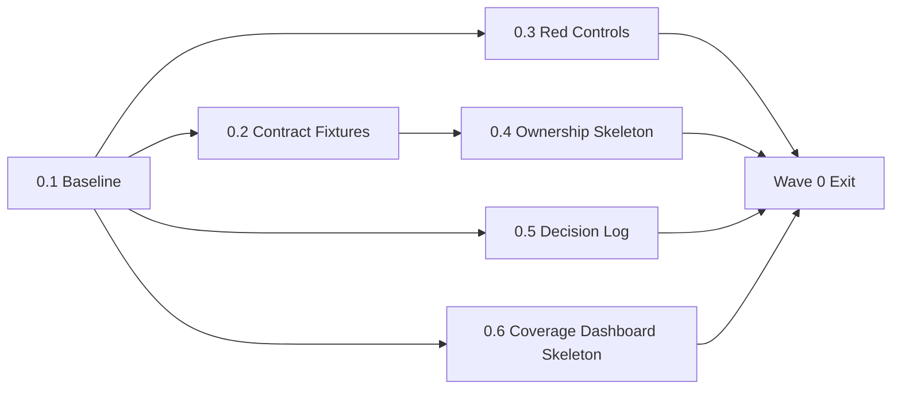
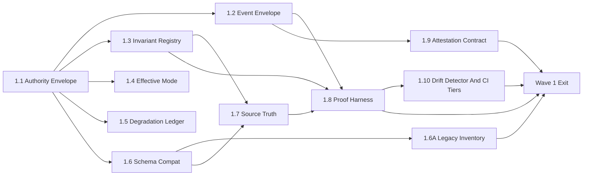
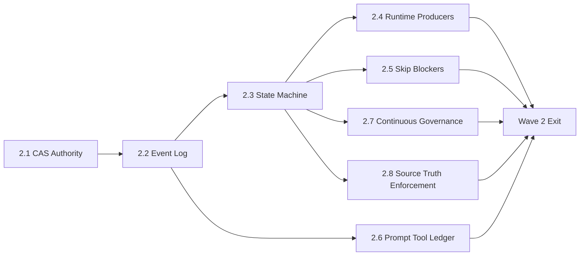
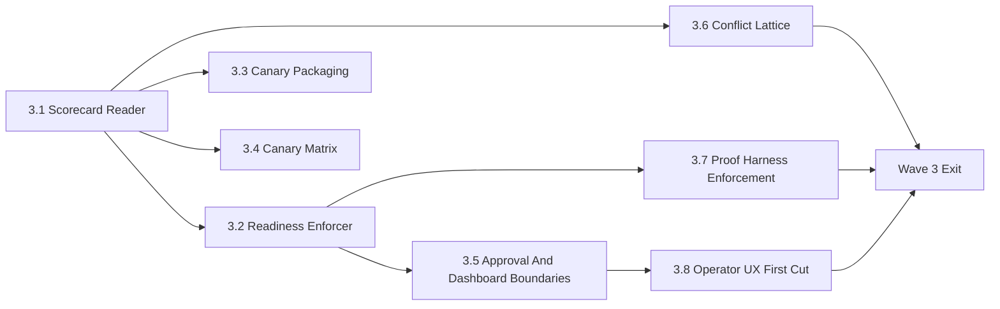
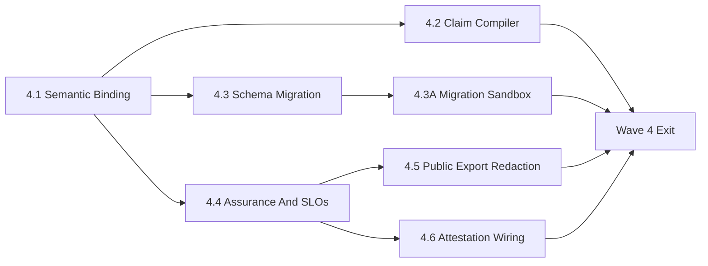
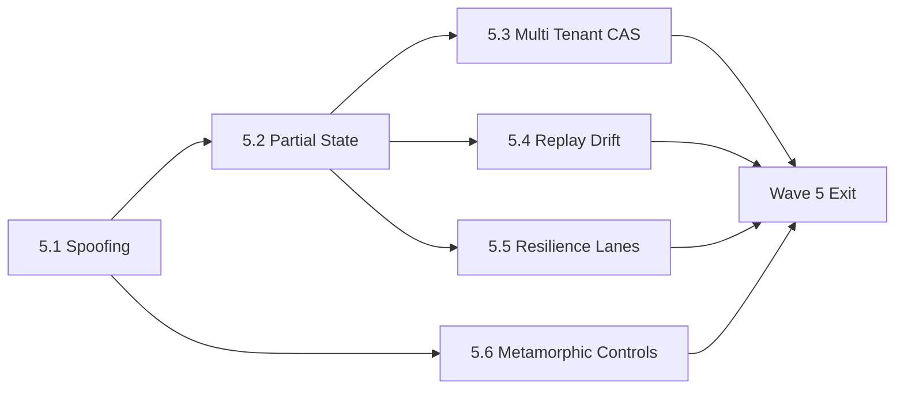
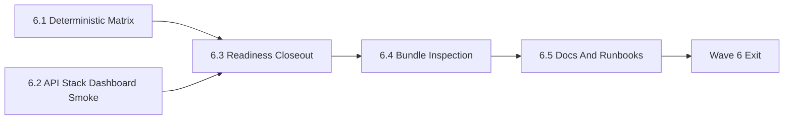

# PolicyOS Honest Diagnostics Substrate Implementation Plan

> **For agentic workers:** REQUIRED SUB-SKILL: Use `superpowers:subagent-driven-development` (recommended) or `superpowers:executing-plans` to implement this plan task-by-task. Steps use checkbox (`- [ ]`) syntax for tracking.

**Goal:** implement the best-in-class honest diagnostics substrate described by `docs/system-design-decisions/honest-diagnostics-substrate.md` and accepted ADRs 0147-0155, so a serious PolicyOS run can only close when runtime-owned evidence, provenance, schema compatibility, mode/fallback ledgers, phase barriers, and scorecard/readiness authority all agree.

**Architecture:** runtime producers emit authority-bearing evidence envelopes and diagnostic events into CAS; serious run state machine enforces phase barriers before final artifacts, scorecards, approvals, dashboards, and bundles can project closeout state; scorecard and readiness consume an invariant registry and verify ref identity, schema compatibility, same-input closure, provenance, effective mode, fallback/degradation, and owner contracts; canary bundles package runtime truth but cannot mint or upgrade it.

**Tech Stack:** Python 3, FastAPI runtime API and test client, Pydantic contracts, FileSystemCAS, control-plane state store, pytest, repo-quality gates, canary runner tooling, Playwright dashboard journeys, JSON Schema/TOML architecture registries.

---

## Status

- Status: active implementation plan.
- Owner: `team-runtime`.
- Created: 2026-05-14.
- Scope: honest diagnostics substrate for serious `research`, `governed`, and `production` closeout.
- Primary source decisions:
  - `docs/adr/0147-production-evidence-authority-ordering.md`
  - `docs/adr/0148-serious-run-state-machine-and-phase-barriers.md`
  - `docs/adr/0149-effective-mode-and-fallback-degradation-ledger.md`
  - `docs/adr/0150-scorecard-readiness-approval-projection-boundaries.md`
  - `docs/adr/0151-evidence-schema-compatibility-and-legacy-quarantine.md`
  - `docs/adr/0152-semantic-binding-lineage-and-claim-evidence.md`
  - `docs/adr/0153-diagnostic-slos-assurance-case-and-attestation.md`
  - `docs/adr/0154-diagnostic-event-envelope-and-runtime-log-contract.md`
  - `docs/adr/0155-production-invariant-registry-and-ownership-contract.md`
- Diagnostic source backlog:
  - `docs/backlog/production-data-e2e-diagnostic-backlog.md`
  - Bucket A items in scope: A7-A28.
  - Bucket A items intentionally out of this plan: A1-A6 domain remediation. These must be implemented only after the substrate can prove their runtime authority.

## Definition Of Done

- [ ] Every serious run emits runtime-owned evidence envelopes for all closeout authority-bearing evidence.
- [ ] Every authority-bearing evidence artifact has a runtime diagnostic event, CAS ref, producer identity, schema identity, input refs, same-input closure fields, tenant/cell context, effective mode, fallback/degradation context, and governance metadata.
- [ ] Every serious fallback, default, simulation, fixture overlay, projection, generated substitute, skipped node, parser repair, provider quarantine, and adapter downgrade is ledgered before any downstream consumer can use its output.
- [ ] Runtime phase barriers prevent final decision artifacts, public/exportable artifacts, scorecards, approval readiness, canary bundles, dashboard approval projections, and readiness closeout from appearing before required upstream evidence passes or emits typed blockers.
- [ ] Scorecard and readiness fail closed on missing owner, missing runtime event, missing CAS artifact, ref mismatch, bundle-local ref used as runtime ref, schema incompatibility, unknown provenance, disallowed mode, unallowed fallback, same-input closure mismatch, stale evidence, tenant mismatch, or projection used as authority.
- [ ] Canary bundles preserve runtime truth and may only add observer packaging, redacted public views, and typed overlays that are explicitly marked non-authoritative.
- [ ] Dashboard, API projections, approval packets, and readiness summaries are projection-only readers and cannot mint authority.
- [ ] Negative controls prove the substrate catches spoofed refs, fake pass statuses, bundle-generated runtime-looking refs, stale schemas, silent fallback, mode leakage, fixture overfitting, cross-tenant ref use, partial-state contradictions, and final artifacts compiled too early.
- [ ] The final closeout command passes:

```bash
uv run python tools/ci/check_policyos_production_quality_best_in_class.py --repo-root . --output-format json --require-passing
```

## ADR Conformance Rule

This plan is a code execution plan for ADRs 0147-0155. A phase is not complete
when it creates a file or passes a happy-path test. A phase is complete only
when the relevant ADR `Decision` bullets are enforced by runtime code,
scorecard/readiness readers, negative controls, and operator-visible failure
records.

| ADR | Required implementation proof |
|-----|-------------------------------|
| ADR-0147 | authority envelope fields, evidence classes, provenance policy, same-input closure, CAS/event reconciliation, scorecard/readiness authority checks |
| ADR-0148 | serious-run state machine, phase-barrier ledger, transition guards, draft-vs-publishable distinction, premature artifact negative tests |
| ADR-0149 | effective-mode ledger, fallback/degradation ledger, allowed-profile policy, warning-policy enforcement, simulated/fixture/mode leakage negative tests |
| ADR-0150 | scorecard identity verification, readiness authority graph, approval identity checks, dashboard/source projection labels, public artifact publishability checks |
| ADR-0151 | producer/reader schema compatibility registry, legacy classification, migration evidence, stale schema checks, lossy adapter negative tests |
| ADR-0152 | semantic binding ledger, candidate/selected/rejected legal/data/method evidence, claim refs or blockers, data-present-but-irrelevant negative tests |
| ADR-0153 | diagnostic SLOs, fitness function registry, assurance case, attestation records, privacy-safe diagnostic redaction |
| ADR-0154 | append-only diagnostic event log, event type registry, trace propagation, no serious-event sampling, event/CAS reconciliation |
| ADR-0155 | complete production invariant registry, single final owner, override/projection/public/conflict policies, next diagnostic command, readiness enforcement |

Implementation work must update this plan if a required ADR proof cannot be
implemented as written. Do not silently narrow an ADR requirement in code.

## Non-Goals

- Do not implement domain remediation A1-A6 inside this plan.
- Do not tune policy quality thresholds to make existing bundles pass.
- Do not weaken serious profile requirements to keep deterministic closeout green.
- Do not let canary bundle assembly become a second runtime.
- Do not create dashboard or approval shortcuts that bypass runtime evidence authority.
- Do not represent unknown, missing, stale, incompatible, fixture-only, simulated, or fallback-derived evidence as `pass`, `present`, `completed`, or `warn` in serious closeout.

## Severity Labels

- `HDS-CRITICAL`: a serious run can be marked production-quality or approval-ready without runtime-owned authority evidence.
- `HDS-HIGH`: an evidence artifact is produced, but provenance, schema, input closure, fallback, owner, or mode semantics are ambiguous.
- `HDS-MEDIUM`: operator diagnostics, public projection, or compatibility behavior is incomplete but does not directly upgrade serious evidence.
- `HDS-LOW`: documentation, naming, migration ergonomics, or test organization work.

## Execution Rule

Waves are sequential. Phases inside a wave may run in parallel only when their write sets are disjoint or when a single integration owner coordinates shared files.

- [ ] A later wave may start exploratory work, but it may not merge until the previous wave exit fence is green.
- [ ] Every phase must land with at least one negative test that fails before the change and passes after the change.
- [ ] Every phase that introduces a new contract must add both producer tests and reader/enforcer tests.
- [ ] Every phase touching serious closeout must update the invariant registry and at least one readiness or scorecard enforcement test.
- [ ] Every phase touching bundle assembly must prove packaging cannot upgrade runtime truth.
- [ ] Every phase touching dashboard/API projection must prove projection cannot become authority.

## Execution DAGs And Cross-Wave Dependencies

Exit fences remain quality gates. They do not replace explicit dependency
graphs. The DAGs below define merge order inside each wave while preserving
parallel execution where contracts are already available.

### Wave 0 DAG



### Wave 1 DAG



### Wave 2 DAG



### Wave 3 DAG



### Wave 4 DAG



### Wave 5 DAG



### Wave 6 DAG



### Cross-Wave Dependency Table

| Later work | Depends on | Contract dependency |
|------------|------------|---------------------|
| Wave 2 runtime writes | 1.1, 1.2, 1.3, 1.4, 1.5, 1.6 | envelope, event, registry, mode, fallback, schema contracts |
| Wave 3 scorecard/readiness | 2.1, 2.2, 2.3, 2.4 | CAS writes, event log, phase barriers, runtime producers |
| Wave 3 dashboard projection | 1.7, 2.8, 3.1, 3.2 | source-truth lattice, adapter preservation, scorecard/readiness identity |
| Wave 4 semantic binding | 1.3, 1.6, 2.2, 2.3, 2.8 | invariant registry, schema compatibility, events, barriers, source truth |
| Wave 4 assurance/SLOs | 1.8, 1.9, 3.2, 3.7 | proof harness, attestation contract, readiness identity, proof enforcement |
| Wave 5 adversarial controls | 3.1, 3.2, 3.6, 3.7, 4.1 | scorecard/readiness enforcement, source conflicts, proof harness, semantic binding |
| Wave 6 closeout | all Wave 5 exits | all negative, runtime, projection, and assurance controls |

## Persistent Workstream Ownership

Workstream ownership is cross-wave. A wave integration owner coordinates merges,
but the persistent workstream owner protects the ADR semantics across all waves.

| Workstream | ADR | Persistent owner role | Eve-of-wave review question |
|------------|-----|-----------------------|-----------------------------|
| Authority envelope and evidence classes | ADR-0147 | `team-runtime-quality` | Does this wave preserve authority ordering and same-input closure? |
| State machine and phase barriers | ADR-0148 | `team-runtime-control` | Does this wave prevent downstream authority before upstream barriers close? |
| Mode and fallback ledgers | ADR-0149 | `team-runtime-ops` | Does this wave expose every fallback/mode divergence before consumption? |
| Scorecard/readiness/projection | ADR-0150 | `team-quality-closeout` | Does this wave keep scorecard/readiness/approval/dashboard as readers only? |
| Schema compatibility and legacy quarantine | ADR-0151 | `team-architecture` | Does this wave reject unknown, stale, lossy, or legacy evidence correctly? |
| Semantic binding and lineage | ADR-0152 | `team-policy-semantics` | Does this wave preserve legal/data/method/claim meaning across adapters? |
| SLO, assurance, and attestation | ADR-0153 | `team-assurance` | Does this wave improve diagnostic reliability without hiding risk? |
| Diagnostic event envelope and log | ADR-0154 | `team-observability` | Does this wave preserve append-only trace-linked event authority? |
| Invariant registry and ownership | ADR-0155 | `team-architecture-governance` | Does this wave keep a single final owner and machine-checkable closeout map? |

Each persistent owner must sign off in the implementation PR description with:

- [ ] the wave did not narrow the ADR semantics;
- [ ] future phases in this workstream did not become harder through ad hoc shortcuts;
- [ ] any temporary exception is recorded in the decision log with a revisit wave;
- [ ] coverage dashboard and anti-drift results are understood.

## Parallel Safety Model

Use short-lived branches under `codex/honest-diagnostics-*`.

| Workstream | Primary owner files | Parallel rule |
|------------|---------------------|---------------|
| Runtime contracts | `src/polisyos/runtime/quality/*`, `schemas/runtime_quality/*` | Parallel with tooling after schema names are frozen |
| Runtime orchestration | `src/polisyos/runtime/http/services/control/*` | Single integration owner per wave |
| CAS contracts | `src/polisyos/core/artifacts/*` | Parallel only after envelope models are merged |
| Scorecard/readiness | `src/polisyos/runtime/quality/scorecard.py`, `tools/ci/check_policyos_production_quality_best_in_class.py` | Single integration owner per wave |
| Canary bundles/matrix | `tools/ops_runners/runtime/*` | Parallel with scorecard only behind agreed contract fixtures |
| Architecture registries | `architecture/production_quality/*`, `architecture/gates/*` | Single registry owner |
| Tests | `tests/unit/*`, `tests/repo_quality/*`, `tests/security/*`, `tests/performance/*`, `tests/integration/*` | Parallel by subsystem, shared fixtures through one owner |
| Dashboard/API | `apps/runtime-dashboard/*`, runtime routes under `src/polisyos/runtime/http/routes/*` | Parallel after projection contract is merged |
| Source-of-truth lattice | `src/polisyos/runtime/quality/source_truth.py`, adapter contracts, projection readers | Single lattice owner |
| Diagnostic event log | `src/polisyos/runtime/quality/diagnostic_events.py`, control-plane event persistence | Single log owner |
| Proof harness and fitness functions | `tools/quality/validation/check_honest_diagnostics_proof_harness.py`, `architecture/production_quality/*` | Single registry owner |
| Continuous governance | `src/polisyos/scientist/governance/continuous/*`, runtime quality refs | Parallel with runtime after envelope/event contracts merge |
| Attestation and trust boundary | `src/polisyos/runtime/quality/attestation.py`, CAS signing/trust hooks | Parallel after event and envelope contracts merge |

## Phase Fence Matrix

| Fence | Required before merge |
|-------|-----------------------|
| Contract fence | Pydantic/JSON schema contract, example fixture, producer test, reader test |
| Authority fence | runtime event + CAS ref + producer identity + ref identity verification |
| Serious-profile fence | `research`, `governed`, and `production` semantics explicit; dev/fixture/smoke semantics cannot leak |
| Fallback fence | every degradation path emits ledger record before output consumption |
| Schema fence | producer schema id/version and reader supported range verified |
| Projection fence | dashboard/API/readiness/approval output labels source and cannot be consumed as authority |
| Canary fence | bundle file has declared provenance and cannot replace runtime evidence |
| Operator fence | failure has owner, phase, cause, missing input, downstream impact, artifact refs, and next command |

## Wave Rebaseline Cadence

Every wave ends with a rebaseline, not only a test pass. The rebaseline compares
the current wave against the previous wave and answers four questions:

- [ ] Did honest blockers increase where the previous system had false passes?
- [ ] Did known false passes disappear?
- [ ] Did new false positives appear, and are they explained by stricter
      denominator changes or by a real regression?
- [ ] Did operator time-to-root-cause improve or stay within budget?

Required artifacts for every wave rebaseline:

- `_build/honest-diagnostics/rebaseline/wave-N/coverage.json`
- `_build/honest-diagnostics/rebaseline/wave-N/coverage.md`
- `_build/honest-diagnostics/rebaseline/wave-N/readiness.json`
- `_build/honest-diagnostics/rebaseline/wave-N/deterministic_matrix.json`
- `_build/honest-diagnostics/rebaseline/wave-N/diff_from_wave_N_minus_1.json`
- `_build/honest-diagnostics/rebaseline/wave-N/operator_root_cause_sample.md`

Required commands:

```bash
uv run python tools/quality/validation/build_honest_diagnostics_coverage.py --repo-root . --output-dir _build/honest-diagnostics/rebaseline/wave-N
uv run python tools/ops_runners/runtime/run_canary_matrix.py --deterministic --json-output _build/honest-diagnostics/rebaseline/wave-N/deterministic_matrix.json --timeout-s 1200
uv run python tools/ci/check_policyos_production_quality_best_in_class.py --repo-root . --output-format json > _build/honest-diagnostics/rebaseline/wave-N/readiness.json
uv run python tools/quality/validation/compare_honest_diagnostics_rebaseline.py --current _build/honest-diagnostics/rebaseline/wave-N --previous _build/honest-diagnostics/rebaseline/wave-N-minus-1
```

Real provider or `local_production_canary.py --mode=real` rebaseline is required
when credentials and backing services are present. When unavailable, the wave
must emit typed setup evidence rather than silently skipping the real lane:

```bash
uv run python tools/ops_runners/runtime/local_production_canary.py --mode=real --execution-profile research --json-output _build/honest-diagnostics/rebaseline/wave-N/real_research_canary.json
```

## Substrate Coverage Dashboard

The coverage dashboard is the primary burn-down artifact. It is generated, not
hand-edited. Generated coverage files live under `_build/` and are not source
tracked unless an acceptance report explicitly archives them.

Tool:

```bash
uv run python tools/quality/validation/build_honest_diagnostics_coverage.py --repo-root . --output-dir _build/honest-diagnostics/coverage
```

Required metrics in `coverage.json`:

| Metric | Wave 0 target | Wave 1 target | Wave 3 target | Final target |
|--------|---------------|---------------|---------------|--------------|
| `invariant_registry_complete_pct` | `>= 10` | `100` | `100` | `100` |
| `runtime_emitted_invariant_pct` | baseline only | baseline only | `>= 85` | `100` |
| `negative_control_coverage_pct` | `>= 25` | `>= 60` | `100` | `100` |
| `authority_envelope_complete_pct` | fixture baseline | `100` for contract tests | `>= 90` runtime bundles | `100` |
| `payload_identity_verified_gate_pct` | baseline only | baseline only | `100` | `100` |
| `fallback_ledger_coverage_pct` | baseline only | `>= 60` known paths | `>= 90` known paths | `100` |
| `authority_bearing_provenance_pct` | baseline only | `100` for fixtures | `100` | `100` |
| `source_truth_conflict_gate_pct` | baseline only | `>= 80` field families | `100` | `100` |
| `semantic_binding_gate_pct` | baseline only | baseline only | `>= 60` | `100` |
| `legacy_quarantine_classified_pct` | baseline only | `>= 90` known bundles | `100` | `100` |
| `false_pass_rate_negative_controls` | `0` | `0` | `0` | `0` |
| `operator_ttrc_p50_minutes` | measured | measured | `<= 10` | `<= 5` |
| `operator_ttrc_p90_minutes` | measured | measured | `<= 20` | `<= 10` |

Coverage may drop only when the denominator becomes more honest. Any drop must
be explained in the decision log and must not increase false-pass rate.

## Anti-Drift Audit And Softening Detector

Every wave exit and every PR that touches substrate-owned files must run the
anti-drift detector:

```bash
uv run python tools/quality/validation/check_substrate_drift.py --repo-root .
```

The detector must fail on:

- new `pytest.mark.xfail` without `strict=True`;
- any permanent `skip` or broad-module skip in substrate tests;
- increasing strict `xfail` count without a decision-log entry;
- new `allow_*_fallback=True` or equivalent policy bypass without decision-log
  entry and invariant registry permission;
- new fixture/mock/simulated path consumed by serious closeout;
- new scorecard/readiness acceptance of `warn`, `present`, `completed`,
  missing status, bundle-local refs, or projection-only data;
- any code or test change that narrows an ADR-0147 through ADR-0155 Decision
  bullet without a superseding ADR;
- violation of the Non-Goals section in this plan.

Required anti-drift fields in the wave rebaseline diff:

- `xfail_strict_count`
- `xfail_non_strict_count`
- `skip_count_substrate_tests`
- `allow_fallback_count`
- `fixture_serious_consumption_count`
- `warn_closeout_acceptance_count`
- `adr_softening_findings`
- `non_goal_violations`

## Decision Log And ADR Supersession Cadence

ADR 0147-0155 are the stable architecture layer. Small implementation decisions
belong in an append-only decision log, not in PR comments and not as constant
ADR rewrites.

Decision log path:

- `docs/system-design-decisions/honest-diagnostics-substrate-decision-log.md`

Each entry must include:

- date;
- context;
- decision;
- affected ADR;
- affected invariant id or phase id;
- owner;
- reversibility: `reversible`, `costly_to_reverse`, or `irreversible`;
- revisit trigger;
- revisit wave;
- whether it needs promotion to ADR.

Promotion rule:

- promote to ADR when a decision changes cross-component contract semantics,
  public evidence semantics, security/privacy posture, override policy, or
  compatibility guarantees;
- keep in decision log when a decision is local, reversible, and does not
  narrow an ADR;
- quarterly, review accumulated entries and either promote, retire, or mark as
  superseded.

The first decision-log entry must import open questions from
`docs/system-design-decisions/honest-diagnostics-substrate.md` and assign each
question a revisit wave.

## CI Tiers And Test Budget

The substrate must stay testable. Slow tests that are easy to skip eventually
become non-tests, so every new test must declare a tier.

| Tier | Command class | Budget | Required content |
|------|---------------|--------|------------------|
| `fast-pr` | unit, repo-quality, schema, drift, proof harness | `< 10 min` | required on every PR touching substrate |
| `integration-pr` | runtime API, canary evidence, local stack smoke subset | `< 25 min` | required before merging runtime wiring waves |
| `nightly` | integration, cross-domain, resilience, dashboard smoke | `< 90 min` | runs every night and blocks release promotion |
| `weekly-closeout` | full deterministic matrix, real canary when available, full dashboard journeys | `< 6 hr` | required before declaring closeout |

Test pyramid targets:

| ADR | Unit/property | Integration | E2E/scenario |
|-----|---------------|-------------|--------------|
| ADR-0147 | `70%` | `25%` | `5%` |
| ADR-0148 | `60%` | `30%` | `10%` |
| ADR-0149 | `70%` | `25%` | `5%` |
| ADR-0150 | `55%` | `35%` | `10%` |
| ADR-0151 | `70%` | `25%` | `5%` |
| ADR-0152 | `45%` | `35%` | `20%` |
| ADR-0153 | `50%` | `30%` | `20%` |
| ADR-0154 | `65%` | `30%` | `5%` |
| ADR-0155 | `60%` | `35%` | `5%` |

Fitness function debt budget:

- every negative control must name the invariant it protects;
- every new slow scenario control must retire, combine, or justify any
  redundant existing slow control;
- PRs may not increase nightly runtime by more than 10 minutes without adding a
  decision-log entry and owner approval;
- coverage regression blocks PR merge unless the denominator change is
  documented in the rebaseline diff.

## Target Contract Names

Implementers may adjust module names only if they preserve these concepts and update all references in this plan.

| Contract | Proposed path |
|----------|---------------|
| Evidence authority envelope | `src/polisyos/runtime/quality/authority.py` |
| Diagnostic event envelope | `src/polisyos/runtime/quality/diagnostic_events.py` |
| Serious run state machine | `src/polisyos/runtime/quality/run_state.py` |
| Production invariant registry loader | `src/polisyos/runtime/quality/invariants.py` |
| Effective mode ledger | `src/polisyos/runtime/quality/effective_mode.py` |
| Fallback/degradation ledger | `src/polisyos/runtime/quality/degradation.py` |
| Schema compatibility policy | `src/polisyos/runtime/quality/schema_compat.py` |
| Semantic binding ledger | `src/polisyos/runtime/quality/semantic_binding.py` |
| Assurance case model | `src/polisyos/runtime/quality/assurance_case.py` |
| Runtime prompt/tool/parser ledger | `src/polisyos/runtime/quality/prompt_tool_ledger.py` |
| Source-of-truth lattice | `src/polisyos/runtime/quality/source_truth.py` |
| Adapter preservation contracts | `src/polisyos/runtime/quality/adapter_contracts.py` |
| Phase barrier ledger | `src/polisyos/runtime/quality/phase_barriers.py` |
| Attestation records | `src/polisyos/runtime/quality/attestation.py` |
| Diagnostic SLO and fitness registry | `src/polisyos/runtime/quality/diagnostic_slos.py` |
| Proof harness checker | `tools/quality/validation/check_honest_diagnostics_proof_harness.py` |
| Coverage dashboard builder | `tools/quality/validation/build_honest_diagnostics_coverage.py` |
| Rebaseline comparator | `tools/quality/validation/compare_honest_diagnostics_rebaseline.py` |
| Anti-drift detector | `tools/quality/validation/check_substrate_drift.py` |
| Legacy evidence inventory | `tools/quality/validation/inventory_legacy_quality_evidence.py` |
| Architecture invariant registry | `architecture/production_quality/invariant_registry.toml` |
| Event type registry | `architecture/production_quality/diagnostic_event_types.toml` |
| Schema compatibility registry | `architecture/production_quality/schema_compatibility.toml` |
| Allowed mode/fallback policy registry | `architecture/production_quality/mode_and_fallback_policy.toml` |
| Source-truth lattice registry | `architecture/production_quality/source_truth_lattice.toml` |
| Diagnostic fitness registry | `architecture/production_quality/diagnostic_fitness_functions.toml` |
| Trust boundary registry | `architecture/production_quality/trust_boundaries.toml` |
| Legacy evidence classification registry | `architecture/production_quality/legacy_evidence_classification.toml` |
| CI tier registry | `architecture/production_quality/ci_tiers.toml` |
| Decision log | `docs/system-design-decisions/honest-diagnostics-substrate-decision-log.md` |
| Evidence schema snapshots | `schemas/runtime_quality/*.schema.json` |

The envelope fields must be stable enough for tests and downstream readers:

```python
class EvidenceAuthorityEnvelope(BaseModel):
    evidence_id: str
    artifact_ref: str
    artifact_kind: str
    evidence_class: Literal[
        "authority_bearing",
        "diagnostic_supporting",
        "debug_only",
        "public_exported",
        "redacted_derived",
        "legacy_quarantined",
    ]
    authority_role: Literal[
        "producer_authority",
        "runtime_blocker",
        "scorecard_input",
        "readiness_input",
        "approval_input",
        "projection_only",
        "packaging_only",
        "diagnostic_only",
        "not_authoritative",
    ]
    provenance_kind: Literal[
        "runtime_emitted",
        "runtime_blocker",
        "runtime_fallback",
        "runtime_projection",
        "bundle_packaged",
        "bundle_overlay",
        "fixture_input",
        "simulated_provider",
        "legacy_quarantined",
        "legacy_supported",
        "legacy_rejected",
    ]
    producer_component: str
    producer_version: str
    owner: str
    runtime_event_ref: str
    cas_ref: str | None
    payload_sha256: str
    schema_name: str
    schema_version: str
    reader_contract: str
    reader_contract_version: str
    tenant_id: str
    cell_id: str | None
    run_id: str
    job_id: str
    trace_id: str
    span_id: str
    parent_span_id: str | None
    requested_execution_profile: str
    effective_execution_profile: str
    phase: str
    state_before: str | None
    state_after: str | None
    generated_at: str
    as_of_time: str
    same_input_closure: SameInputClosure
    input_refs: list[str]
    output_refs: list[str]
    effective_mode_ref: str
    degradation_ledger_ref: str | None
    schema_compatibility_ref: str | None
    semantic_binding_ref: str | None
    attestation_ref: str | None
    redaction_policy_ref: str | None
    duplicate_of: str | None
    validation_status: Literal["pass", "fail", "blocked", "not_applicable"]
    blocking_status: Literal["non_blocking", "blocking", "non_overridable"]
    governance: GovernanceMetadata
```

The implementation may split nested models into smaller Pydantic classes, but
it must not drop these semantic fields. If a field is unavailable for an
artifact, the producer must emit a typed blocker, compatibility decision, or
profile-scoped exception instead of omitting it.

## Wave 0 - Baseline, Red Tests, And Contract Freezing

Purpose: freeze the current failure surface and create failing tests before changing runtime behavior.

Parallel phases in this wave:

### Phase 0.1 - Baseline Current Closeout Behavior

- [x] Create `_build/honest-diagnostics/baseline/README.md` during local runs, but do not commit generated baseline output unless explicitly requested.
- [x] Run the current deterministic closeout and save local output:

```bash
uv run python tools/ops_runners/runtime/run_canary_matrix.py --deterministic --json-output _build/honest-diagnostics/baseline/deterministic_matrix.json --timeout-s 1200
```

- [x] Run the current readiness aggregator and save local output:

```bash
uv run python tools/ci/check_policyos_production_quality_best_in_class.py --repo-root . --output-format json > _build/honest-diagnostics/baseline/readiness.json
```

- [x] Add a short non-generated note to `docs/backlog/production-data-e2e-diagnostic-backlog.md` only if the baseline reveals a new Bucket A substrate blocker.

### Phase 0.2 - Freeze Contract Fixtures

- [x] Add positive and negative examples under `tests/fixtures/runtime_quality/authority_envelopes/`.
- [x] Add positive and negative examples under `tests/fixtures/runtime_quality/diagnostic_events/`.
- [x] Add positive and negative examples under `tests/fixtures/runtime_quality/effective_mode/`.
- [x] Add positive and negative examples under `tests/fixtures/runtime_quality/degradation_ledgers/`.
- [x] Add positive and negative examples under `tests/fixtures/runtime_quality/invariant_registry/`.
- [x] Ensure fixture names encode expected status, for example `serious_runtime_emitted_pass.json`, `bundle_overlay_rejected.json`, and `legacy_unknown_schema_quarantined.json`.

### Phase 0.3 - Add Red Tests For Known Self-Deception Paths

- [x] Use this red-test workflow:
  - On a feature branch that contains both test and implementation, run each new test once before implementation and record the expected failure in the PR notes.
  - If a red test must merge before implementation, mark it `pytest.mark.xfail(strict=True, reason="HDS red control pending implementation")`.
  - Remove every `xfail` in the implementation phase that makes the test pass.
  - Do not merge permanently skipped, non-strict, or broad-module xfails for HDS controls.
- [x] Add tests proving bundle-generated `quality_evidence/*.json` paths cannot satisfy runtime `*_ref` scorecard gates.
- [x] Add tests proving a report file whose embedded ref differs from its runtime CAS ref fails closed.
- [x] Add tests proving `quality_status=pass` inside input payload, progress details, bundle files, or dashboard projections is ignored unless backed by runtime authority.
- [x] Add tests proving fixture-only evidence cannot satisfy serious `research`, `governed`, or `production` closeout.
- [x] Add tests proving `warn` scorecards fail serious deterministic closeout.
- [x] Add tests proving silent fallback paths become typed blockers until a degradation ledger exists.
- [x] Add tests proving a sampled-away or missing serious diagnostic event blocks closeout.
- [x] Add tests proving `no norms retrieved` does not mean `no applicable law` unless Lex emits a no-norm authority blocker.
- [x] Add tests proving `data exists` does not mean `data is relevant` unless the semantic binding ledger connects it to the claim.

Suggested files:

- `tests/unit/runtime/quality/test_authority_envelope_contract.py`
- `tests/unit/runtime/quality/test_diagnostic_event_contract.py`
- `tests/unit/tools/test_canary_evidence_authority.py`
- `tests/repo_quality/tools/test_honest_diagnostics_substrate_red_controls.py`

### Phase 0.4 - Establish Implementation Ownership

- [x] Create `architecture/production_quality/invariant_registry.toml` with a minimal valid skeleton.
- [x] Add a repo-quality test that every invariant row has:
  - `invariant_id`
  - `minimum_closeout_gate`
  - `pql_id`
  - `final_owner`
  - `producer_owners`
  - `runtime_event_names`
  - `required_artifact_kinds`
  - `required_ref_keys`
  - `evidence_classes`
  - `allowed_provenance_kinds`
  - `required_schema_contracts`
  - `scorecard_gate_names`
  - `readiness_check`
  - `approval_policy`
  - `override_policy`
  - `non_overridable_blockers`
  - `dashboard_projection_policy`
  - `public_artifact_policy`
  - `conflict_policy`
  - `failure_code`
  - `diagnostic_owner`
  - `dependencies`
  - `consumers`
  - `next_diagnostic_command`
  - `negative_tests`

Initial TOML shape:

```toml
[[invariants]]
invariant_id = "HDS-MCG-001"
minimum_closeout_gate = "serious_canary_runtime_refs"
pql_id = "PQL-001"
final_owner = "runtime.quality.closeout"
producer_owners = [
  "runtime.nl_pipeline",
  "lex.normative_applicability",
  "fabric.retrieval",
  "foundry.method_quality",
  "scientist.grounding",
]
runtime_event_names = [
  "polisyos.runtime.evidence.normative_applicability_report.v1",
  "polisyos.runtime.evidence.fabric_retrieval_trace.v1",
  "polisyos.runtime.evidence.foundry_method_report.v1",
  "polisyos.runtime.evidence.policy_grounding_matrix.v1",
  "polisyos.runtime.evidence.conflict_check.v1",
]
required_artifact_kinds = [
  "normative_applicability_report",
  "fabric_retrieval_trace",
  "foundry_method_report",
  "policy_grounding_matrix",
  "conflict_check_report",
]
required_ref_keys = [
  "normative_applicability_report_ref",
  "fabric_retrieval_trace_ref",
  "foundry_method_report_ref",
  "policy_grounding_matrix_ref",
  "conflict_check_ref",
]
evidence_classes = ["authority_bearing"]
allowed_provenance_kinds = ["runtime_emitted", "runtime_blocker"]
required_schema_contracts = [
  "runtime_quality.normative_applicability_report.v1",
  "runtime_quality.fabric_retrieval_trace.v1",
  "runtime_quality.foundry_method_report.v1",
  "runtime_quality.policy_grounding_matrix.v1",
  "runtime_quality.conflict_check_report.v1",
]
scorecard_gate_names = [
  "lex_normative_applicability",
  "fabric_retrieval",
  "foundry_method_quality",
  "policy_grounding",
  "lex_conflict_check",
]
readiness_check = "production_quality.runtime_required_refs"
approval_policy = "requires_verified_scorecard"
override_policy = "not_overridable"
non_overridable_blockers = [
  "authority_cas_missing",
  "authority_ref_not_cas",
  "authority_payload_mismatch",
  "authority_tenant_conflict",
]
dashboard_projection_policy = "projection_only"
public_artifact_policy = "not_public_exportable"
conflict_policy = "fail_closed"
failure_code = "hds_runtime_refs_missing"
diagnostic_owner = "team-runtime"
dependencies = []
consumers = [
  "runtime.scorecard",
  "tools.ci.check_policyos_production_quality_best_in_class",
  "runtime.approval",
  "runtime.dashboard_projection",
]
next_diagnostic_command = "uv run pytest tests/unit/runtime/http/test_nl_pipeline_materialization.py -q"
negative_tests = [
  "tests/repo_quality/tools/test_honest_diagnostics_substrate_red_controls.py::test_bundle_local_refs_do_not_satisfy_runtime_refs",
]
```

### Phase 0.5 - Decision Log Bootstrap

- [x] Create `docs/system-design-decisions/honest-diagnostics-substrate-decision-log.md`.
- [x] Add an append-only entry template with fields from the `Decision Log And ADR Supersession Cadence` section.
- [x] Add initial entries for open questions from `docs/system-design-decisions/honest-diagnostics-substrate.md`.
- [x] Assign each open question a revisit wave:
  - evidence authority envelope serialization details: revisit after Wave 1;
  - event-log persistence boundary: revisit after Wave 2;
  - legacy evidence migration cutoff: revisit after Wave 4;
  - diagnostic SLO thresholds: revisit after Wave 4;
  - attestation coverage expansion: revisit after Wave 5;
  - CI tier budgets: revisit after Wave 5.
- [x] Add a repo-quality test that verifies each decision-log entry has date, context, decision, affected ADR, owner, reversibility, revisit trigger, revisit wave, and promotion status.

### Phase 0.6 - Coverage Dashboard Skeleton And Rebaseline Comparator

- [x] Implement a stubbed but real `tools/quality/validation/build_honest_diagnostics_coverage.py` that reads the invariant registry skeleton and writes `coverage.json` plus `coverage.md`.
- [x] Implement `tools/quality/validation/compare_honest_diagnostics_rebaseline.py` that compares two generated coverage directories and emits missing, improved, regressed, and denominator-changed metrics.
- [x] Add coverage metrics from the `Substrate Coverage Dashboard` section.
- [x] Add repo-quality tests proving coverage output contains every required metric, includes numerator and denominator, and rejects missing metric definitions.
- [x] Add repo-quality tests proving a coverage drop without `denominator_changed=true` and decision-log entry fails.
- [x] Add the coverage dashboard command to the fast validation loop.

### Wave 0 Exit Fence

- [x] Red tests fail for the expected reasons before implementation.
- [x] Contract fixture examples are committed.
- [x] Invariant registry skeleton loads and rejects incomplete rows.
- [x] Decision log exists and imports open questions with revisit waves.
- [x] Coverage dashboard skeleton produces coverage JSON/Markdown with required metrics.
- [x] Rebaseline comparator can diff Wave 0 against an empty or missing prior baseline using typed `no_prior_baseline` output.
- [x] No runtime behavior has been weakened.
- [x] Anti-drift audit has no non-strict xfail, permanent substrate skip, fixture serious consumption, or Non-Goal violation.

Commands:

```bash
uv run pytest tests/unit/runtime/quality tests/unit/tools/test_canary_evidence_authority.py tests/repo_quality/tools/test_honest_diagnostics_substrate_red_controls.py -q
uv run pytest tests/repo_quality/tools/test_honest_diagnostics_decision_log.py tests/repo_quality/tools/test_honest_diagnostics_coverage.py -q
uv run python tools/quality/validation/build_honest_diagnostics_coverage.py --repo-root . --output-dir _build/honest-diagnostics/rebaseline/wave-0
```

## Wave 1 - Authority Contracts, Registries, And Compatibility Primitives

Purpose: implement the shared substrate contracts before wiring producers.

Parallel phases in this wave:

### Phase 1.1 - Evidence Authority Envelope

- [x] Implement `src/polisyos/runtime/quality/authority.py`.
- [x] Add Pydantic models for producer identity, governance metadata, same-input closure, and evidence authority envelope.
- [x] Add serializer/deserializer helpers that reject unknown authority roles, unknown provenance kinds, missing producer identity, missing run/job/tenant/trace ids, and missing schema identity.
- [x] Add helpers:
  - `assert_authority_bearing(envelope)`
  - `assert_runtime_emitted(envelope)`
  - `assert_same_input_closure(envelopes)`
  - `classify_authority_role(envelope)`
- [x] Add JSON schema generation under `schemas/runtime_quality/evidence_authority_envelope_v1.schema.json`.
- [x] Add tests for valid envelopes, missing required fields, unknown provenance, projection used as authority, fixture used in serious profile, and runtime ref mismatch.

### Phase 1.2 - Diagnostic Event Envelope And Event Type Registry

- [x] Implement `src/polisyos/runtime/quality/diagnostic_events.py`.
- [x] Create `architecture/production_quality/diagnostic_event_types.toml`.
- [x] Model event fields required by ADR-0154:
  - `event_id`
  - `event_source`
  - `event_type`
  - `event_time`
  - `event_subject`
  - `schema_name`
  - `schema_version`
  - `trace_id`
  - `span_id`
  - `parent_span_id`
  - `run_id`
  - `job_id`
  - `tenant_id`
  - `cell_id`
  - `producer_component`
  - `producer_version`
  - `execution_profile`
  - `phase`
  - `state_before`
  - `state_after`
  - `payload_ref`
  - `artifact_refs`
  - `input_refs`
  - `blocking_status`
  - `redaction_policy_ref`
  - `duplicate_of`
  - `dedupe_key`
- [x] Register event types for producer execution, CAS write, ref publication, phase transition, blocker, fallback/degradation, schema migration, scorecard gate read, readiness closeout, approval decision, dashboard projection, public artifact publication, replay result, and reconciliation result.
- [x] Add duplicate-event handling semantics:
  - same event id and same payload/artifact refs is idempotent;
  - same event id and different payload/artifact refs is `authority_event_collision`;
  - same dedupe key and different event id is a retry/replay candidate that must be reconciled.
- [x] Add a no-sampling invariant for serious-run authority events.
- [x] Add JSON schema under `schemas/runtime_quality/diagnostic_event_v1.schema.json`.
- [x] Add tests for duplicate events, missing phase, mismatched output refs, stale timestamps, event without producer, sampled-away serious event, and bundle event pretending to be runtime authority.

### Phase 1.3 - Production Invariant Registry

- [x] Implement `src/polisyos/runtime/quality/invariants.py`.
- [x] Load `architecture/production_quality/invariant_registry.toml`.
- [x] Validate each invariant row has exactly one `final_owner`.
- [x] Validate every `scorecard_gates`, `readiness_checks`, and `required_runtime_events` value maps to a known reader/enforcer.
- [x] Add registry diff tooling:

```bash
uv run python tools/quality/validation/check_production_invariant_registry.py --repo-root .
```

- [x] Add repo-quality tests rejecting missing owner, multi-owner final authority, missing override policy, missing projection policy, missing failure code, and unreferenced Minimum Closeout Gate rows.

### Phase 1.4 - Effective Mode Ledger

- [x] Implement `src/polisyos/runtime/quality/effective_mode.py`.
- [x] Ledger must capture requested and effective values for:
  - `execution_profile`
  - `canary_kind`
  - `matrix_lane_id`
  - `provider_mode`
  - `llm_simulation_mode`
  - `fixture_identity`
  - `mock_fallback_allowed`
  - `mock_fallback_used`
  - `data_mode`
  - `state_store_backend`
  - `local_control_waiver`
  - `scorecard_warn_policy`
  - `evidence_overlay_mode`
  - `signed_exception_ref`
  - `quarantine_status`
- [x] Add policy helpers:
  - `assert_serious_mode_allowed(ledger)`
  - `explain_mode_mismatch(ledger)`
  - `mode_policy_failure_code(ledger)`
- [x] Add tests proving dev, smoke, fixture, simulated provider, and warn-accepted behavior cannot satisfy serious closeout unless the lane is explicitly non-production and non-closeout.

### Phase 1.5 - Fallback And Degradation Ledger

- [x] Implement `src/polisyos/runtime/quality/degradation.py`.
- [x] Ledger records must include:
  - `component`
  - `phase`
  - `trigger`
  - `allowed_profiles`
  - `produced_artifacts`
  - `affected_claims`
  - `affected_gates`
  - `severity`
  - `override_policy`
  - `downstream_impact`
  - `provenance_refs`
  - `typed_blocker`
- [x] Add a fail-closed policy: any fallback-produced authority-bearing evidence is blocked in serious closeout unless an allowed-profile policy or signed non-production-lowering exception exists.
- [x] Add tests covering fallback defaults, optional report generation, generated substitutes, parser healing, provider quarantine, JAX-missing materialization refs, local canary fixture payloads, deterministic overlays, and dashboard projections.

### Phase 1.6 - Schema Compatibility And Legacy Quarantine

- [ ] Implement `src/polisyos/runtime/quality/schema_compat.py`.
- [ ] Add producer-reader compatibility decisions:
  - `compatible`
  - `compatible_with_migration`
  - `legacy_quarantined`
  - `unknown_schema_blocked`
  - `incompatible_blocked`
  - `stale_schema_blocked`
- [ ] Add reader range declarations for scorecard, readiness, bundle assembler, dashboard projection, and approval packet builder.
- [ ] Add tests proving unknown schema-only dicts cannot pass serious scorecard gates.
- [ ] Add tests proving legacy bundles are readable for diagnostics but quarantined from production-quality closeout.

### Phase 1.6A - Legacy Evidence Inventory

- [x] Implement `tools/quality/validation/inventory_legacy_quality_evidence.py`.
- [x] Inventory existing serious and deterministic bundle roots under `_build/`, `.polisyos/`, and documented production-quality evidence locations without reading secrets or hidden answers into source-tracked files.
- [x] Classify every discovered report or bundle file as:
  - `legacy_supported`;
  - `legacy_quarantined`;
  - `legacy_rejected`;
  - `unknown_schema_blocked`;
  - `non_authority_debug_only`.
- [x] Emit generated inventory to `_build/honest-diagnostics/legacy/legacy_inventory.json` and `_build/honest-diagnostics/legacy/legacy_inventory.md`.
- [x] Add source-tracked classification rules in `architecture/production_quality/legacy_evidence_classification.toml`.
- [x] Add tests proving unknown schema, missing provenance, bundle-local runtime-looking ref, payload mismatch, and redaction-loss files are classified as blocked or quarantined, not supported.

### Phase 1.7 - Source-Of-Truth Lattice And Adapter Preservation Contracts

- [ ] Implement `src/polisyos/runtime/quality/source_truth.py`.
- [ ] Implement `src/polisyos/runtime/quality/adapter_contracts.py`.
- [ ] Create `architecture/production_quality/source_truth_lattice.toml`.
- [ ] For each authority-bearing field family, declare:
  - authoritative producer;
  - allowed projection surfaces;
  - allowed package/summarize surfaces;
  - losing-authority record format;
  - conflict failure code;
  - adapter semantic preservation requirements.
- [ ] Cover these field families at minimum:
  - runtime refs;
  - final claim ids and claim refs;
  - source families, datasets, metrics, columns, units, geography, and time coverage;
  - legal norms, legal snapshots, conflict reports, and jurisdiction filters;
  - Foundry method families, assumptions, sample/power adequacy, sensitivity, and uncertainty;
  - scorecard identity and gate statuses;
  - approval/readiness/public artifact status;
  - effective mode and fallback/degradation records.
- [ ] Add adapter-loss checks for runtime -> CAS, runtime -> progress, progress -> API, runtime -> canary bundle, bundle -> scorecard, scorecard -> readiness, readiness -> approval, API -> dashboard, and public export paths.
- [ ] Add tests proving status, provenance, owner, schema, lineage, tenant, time context, jurisdiction, source family, method expectation, and claim sets cannot be dropped without a blocker.

### Phase 1.8 - Production Invariant Proof Harness And Fitness Registry

- [x] Implement `tools/quality/validation/check_honest_diagnostics_proof_harness.py`.
- [x] Create `architecture/production_quality/diagnostic_fitness_functions.toml`.
- [x] The proof harness must load:
  - `architecture/production_quality/invariant_registry.toml`;
  - `architecture/production_quality/diagnostic_event_types.toml`;
  - `architecture/production_quality/source_truth_lattice.toml`;
  - `architecture/production_quality/schema_compatibility.toml`;
  - `architecture/production_quality/mode_and_fallback_policy.toml`;
  - static inventory from `architecture/baselines/production_quality/evidence_inventory.json`;
  - test manifests discovered from `tests/**`.
- [x] For every Minimum Closeout Gate and PQL invariant, prove there is a mapped final owner, producer owner, runtime event, CAS artifact kind, ref key, bundle packaging file, scorecard gate, readiness check, approval/public policy, dashboard projection policy, negative test, and next diagnostic command.
- [x] Fail with `hds_invariant_proof_missing` when any proof exists only as prose, fixture-only test, static inventory, or canary-generated file.
- [x] Add repo-quality tests for missing negative test, missing runtime event, missing readiness check, static-only proof, and orphan scorecard gate.

### Phase 1.9 - Attestation Contract And Trust Boundary Classification

- [ ] Implement `src/polisyos/runtime/quality/attestation.py`.
- [ ] Create `architecture/production_quality/trust_boundaries.toml`.
- [ ] Classify trust boundaries for runtime worker, CAS writer, bundle assembler, scorecard builder, readiness aggregator, approval packet builder, dashboard projection, public export renderer, provider/model gateway, external data connector, legal KG connector, and prompt/tool/parser executor.
- [ ] Attestation records must capture expected materials, observed materials, expected products, observed products, functionary, producer identity, environment identity, isolation status, service-generated status, consumer verification, and tamper check status.
- [ ] Add tests proving a required trust-boundary step without attestation is diagnostic-readable but cannot satisfy production closeout.

### Phase 1.10 - Anti-Drift Detector And CI Tier Policy

- [x] Implement `tools/quality/validation/check_substrate_drift.py`.
- [x] Create `architecture/production_quality/ci_tiers.toml` with test tier declarations for HDS tests.
- [x] Add repo-quality tests proving substrate tests declare exactly one tier from `fast-pr`, `integration-pr`, `nightly`, or `weekly-closeout`.
- [x] Add anti-drift checks for non-strict xfail, permanent substrate skip, unregistered strict xfail increase, fallback allowlist growth, fixture/mock/simulated serious consumption, warning closeout acceptance, ADR softening, and Non-Goal violations.
- [x] Add decision-log integration: a strict xfail or fallback exception can be temporary only when the decision log names owner, revisit wave, and affected invariant.
- [x] Add tests proving the detector fails when a new `allow_*_fallback=True` appears without invariant permission and decision-log entry.
- [x] Add tests proving the detector fails when a new slow test lacks tier declaration.

### Wave 1 Exit Fence

- [ ] Contract modules are implemented with unit tests.
- [ ] JSON schemas are generated and checked into `schemas/runtime_quality/`.
- [ ] Invariant registry has strict validation.
- [ ] Event type registry, source-of-truth lattice, schema compatibility registry, mode/fallback policy registry, trust-boundary registry, and diagnostic fitness registry all load and reject incomplete rows.
- [ ] Legacy evidence inventory classifies known evidence and blocks unknown or unsafe legacy evidence from serious closeout.
- [ ] Proof harness fails on missing owner, event, artifact kind, ref key, scorecard gate, readiness check, negative test, projection policy, public policy, or next diagnostic command.
- [ ] Anti-drift detector is wired into fast PR checks.
- [ ] Coverage dashboard meets Wave 1 targets for invariant registry completeness, fixture envelope completeness, and negative-control coverage.
- [ ] Existing serious closeout paths still fail until runtime producers are wired.
- [ ] No bundle, scorecard, dashboard, or readiness reader accepts the new models as authority until runtime events and CAS refs exist.

Commands:

```bash
uv run pytest tests/unit/runtime/quality -q
uv run pytest tests/repo_quality/tools/test_production_invariant_registry.py -q
uv run pytest tests/repo_quality/tools/test_legacy_quality_evidence_inventory.py tests/repo_quality/tools/test_honest_diagnostics_substrate_drift.py -q
uv run python tools/quality/validation/check_production_invariant_registry.py --repo-root .
uv run python tools/quality/validation/check_honest_diagnostics_proof_harness.py --repo-root .
uv run python tools/quality/validation/check_substrate_drift.py --repo-root .
uv run python tools/quality/validation/build_honest_diagnostics_coverage.py --repo-root . --output-dir _build/honest-diagnostics/rebaseline/wave-1
```

## Wave 2 - Runtime Emission, CAS Authority, And Phase Barriers

Purpose: make runtime the source of diagnostic truth.

Parallel phases in this wave:

### Phase 2.1 - Runtime CAS Write Authority

- [x] Extend `src/polisyos/runtime/http/services/control/artifacts.py` with an authority-aware write helper.
- [x] The helper must accept `ArtifactWriteOptions` plus evidence envelope fields and return:
  - `cas_ref`
  - `payload_sha256`
  - `manifest_ref`
  - `authority_envelope_ref`
  - `diagnostic_event_ref`
- [x] Ensure FileSystemCAS manifests include producer, governance, inputs, same-input closure summary, tenant/cell context, schema identity, and payload hash.
- [x] Add tests in `tests/unit/core/artifacts/test_artifact_id_serialization_contract.py` proving manifests expose `producer`, `governance`, `inputs`, and authority envelope linkage for quality artifacts.

### Phase 2.2 - Runtime Event Log Integration

- [x] Add runtime diagnostic event persistence as durable append-only authority records.
- [x] Store event payloads inline only when small and non-sensitive; authority-bearing, redacted, and large payloads must go through CAS and be referenced by `payload_ref`.
- [x] Propagate `trace_id`, `span_id`, and `parent_span_id` through runtime, CAS writes, progress projections, canary assembly, scorecard gates, readiness closeout, approval packets, dashboard projections, and public artifact publication.
- [x] Enforce no sampling for serious-run authority events.
- [x] Wire event emission from:
  - `src/polisyos/runtime/http/services/control/nl_pipeline.py`
  - `src/polisyos/runtime/http/services/control/run_lifecycle.py`
  - `src/polisyos/runtime/http/services/control_worker.py`
- [x] Ensure progress details reference event ids but do not become authority.
- [x] Add reconciliation failure codes:
  - `authority_cas_missing`
  - `authority_orphan_cas`
  - `authority_payload_mismatch`
  - `authority_ref_not_cas`
  - `authority_event_collision`
  - `authority_replay_drift_unexplained`
  - `authority_tenant_conflict`
- [x] Add tests proving a CAS artifact without event and an event without CAS artifact both fail serious authority checks.
- [x] Add tests proving corrective actions emit supersede/withdraw/reconcile/quarantine events instead of mutating historical event meaning.

### Phase 2.3 - Serious Run State Machine

- [x] Implement `src/polisyos/runtime/quality/run_state.py`.
- [x] Add states:
  - `initialized`
  - `intent_bound`
  - `evidence_emitting`
  - `blocked`
  - `ready_for_scorecard`
  - `scored`
  - `readiness_closed`
  - `approved`
  - `rejected`
  - `published_blocked`
- [x] Add transition guards matching ADR-0148.
- [x] Do not add `approval_ready` or `published` as authority states. Represent those only as projections over verified readiness and publication policy.
- [x] Add serious profile phase barriers:
  - no scorecard before policy intent canonicalization binds tenant, requested profile, run id, time context, and same-input closure;
  - no legal compatibility claim before Lex retrieval, candidate norms, selected/rejected norms, legal snapshot, jurisdiction/time filters, and conflict checks pass or block;
  - no data-backed claim before Fabric source selection, candidate/selected/rejected datasets, data quality, lineage, freshness, and semantic binding pass or block;
  - no method-backed claim before Foundry method selection, rejected methods, assumptions, input coverage, power/sample adequacy, sensitivity, uncertainty, and method compatibility pass or block;
  - no Scientist workflow pass before skipped nodes, claim ledger, grounding, citation faithfulness, and claim refs pass or block;
  - no final decision artifact before legal, data, method, grounding, conflict, security, privacy, licensing, retention, export, ownership, replay, resilience, performance, and human-review evidence pass or block;
  - no scorecard before required runtime refs exist or block;
  - no approval readiness before scorecard identity is verified;
  - no public/exportable artifact before final compiler gates pass;
  - no canary bundle closeout authority if runtime state is `blocked` or failed.
- [x] Persist phase barrier records through `src/polisyos/runtime/quality/phase_barriers.py`.
- [x] Add tests for invalid transitions, skipped barrier, missing barrier record, and too-early final artifact compilation.

### Phase 2.4 - Wire Runtime Quality Producers

- [x] Replace fixture-style quality report injection in `src/polisyos/runtime/http/services/control/nl_pipeline.py` with authority-aware runtime writes for:
  - normative applicability report
  - Fabric retrieval trace
  - Foundry method report
  - policy grounding matrix
  - conflict check report
  - data quality report
  - privacy/compliance report
  - security/abuse report
  - deterministic replay report
  - resilience report
  - human review calibration report
  - final decision quality report
  - provider/model quality ledger
- [x] Store refs under job/run progress details and `runtime_quality_evidence`, but mark progress as projection.
- [x] Add tests in `tests/unit/runtime/http/test_nl_pipeline_materialization.py` proving serious `research`, `governed`, and `production` runs emit persisted runtime refs for Lex, Fabric, Foundry, grounding, and conflict.
- [x] Keep tests fail-closed when any required runtime ref is missing.

### Phase 2.5 - Skip And Blocker Semantics

- [x] Add a typed skip/blocker contract for Scientist and other optional analytic nodes.
- [x] Every skipped node must persist:
  - reason
  - missing input
  - owner
  - phase
  - downstream impact
  - allowed profile
  - closeout blocking policy
  - scorecard blocking policy
  - approval blocking policy
  - public export blocking policy
- [x] Add tests proving skipped causal, transportability, normative arbitration, governance, evaluator, or decision packet nodes cannot be summarized as completed without blocker semantics.

### Phase 2.6 - Prompt, Tool, And Parser Authority Ledger

- [x] Implement `src/polisyos/runtime/quality/prompt_tool_ledger.py`.
- [x] Persist prompt/template/version/fingerprint, rendered input refs, model/provider config, tool allowlist, tool schema, call refs, output refs, parser contract, validation refs, repair/healing decisions, and authority handoff refs.
- [x] Emit ledger refs for every model-assisted step that influences evidence, claims, scorecard, or approval.
- [x] Add tests proving provider ledger presence alone cannot satisfy prompt/tool/parser authority.

### Phase 2.7 - Continuous Governance Lifecycle Authority

- [x] Wire runtime-owned continuous governance lifecycle evidence for stale, reissue, supersede, and withdraw decisions.
- [x] Modify `src/polisyos/scientist/governance/continuous/monitors.py` and `src/polisyos/scientist/governance/continuous/reissue.py` so lifecycle decisions emit diagnostic events, CAS artifacts, authority envelopes, schema compatibility records, effective mode refs, and fallback/degradation refs.
- [x] Add runtime quality refs for:
  - `continuous_governance_stale_report_ref`
  - `continuous_governance_reissue_report_ref`
  - `continuous_governance_supersede_report_ref`
  - `continuous_governance_withdraw_report_ref`
- [x] Add scorecard/readiness invariant rows for continuous governance lifecycle evidence.
- [x] Add tests proving code/test presence alone cannot satisfy PQL-014 and that lifecycle evidence must be present in serious bundles when published decision lifecycle is in scope.

### Phase 2.8 - Runtime Source-Of-Truth And Adapter Preservation Enforcement

- [x] Enforce `src/polisyos/runtime/quality/source_truth.py` at runtime adapter boundaries.
- [x] Replace authority-critical recursive payload spelunking with typed envelope reads in runtime refs, final claims, materialization details, runtime quality evidence, scorecard inputs, approval state, and closeout reports.
- [x] Add adapter preservation checks before writing progress, bundle inputs, scorecard inputs, API response models, dashboard projections, and public exports.
- [x] Emit losing-authority conflict records when a lower-authority surface disagrees with runtime CAS/event authority.
- [x] Add tests proving runtime -> progress -> bundle -> scorecard -> readiness cannot change claim ids, source families, method family, norm refs, approval state, or scorecard identity without a typed conflict blocker.

### Wave 2 Exit Fence

- [x] Serious runtime tests prove runtime-owned refs exist and are persisted through CAS.
- [x] Phase barriers prevent too-early final artifacts, scorecards, approval readiness, public export, and authoritative bundles.
- [x] Runtime events and CAS artifacts cross-validate each other.
- [x] Skips and fallbacks become blockers when serious evidence would otherwise be upgraded.
- [x] Continuous governance lifecycle decisions emit runtime events, CAS refs, and scorecard/readiness evidence.
- [x] Source-of-truth lattice detects adapter loss and authority conflicts before scorecard.
- [x] Progress remains projection-only.
- [x] Coverage dashboard shows runtime envelope, event, fallback, and mode coverage moving toward Wave 3 targets without increasing false-pass rate.
- [x] Rebaseline diff explains any new blockers and any false positives.
- [x] Anti-drift audit passes with zero non-strict xfails and zero unregistered fallback allowances.

Commands:

```bash
uv run pytest tests/unit/runtime/http/test_nl_pipeline_materialization.py -q
uv run pytest tests/unit/runtime/quality tests/unit/core/artifacts/test_artifact_id_serialization_contract.py -q
uv run pytest tests/security/test_policyos_runtime_abuse_gates.py -q
uv run python tools/quality/validation/check_substrate_drift.py --repo-root .
uv run python tools/quality/validation/build_honest_diagnostics_coverage.py --repo-root . --output-dir _build/honest-diagnostics/rebaseline/wave-2
```

## Wave 3 - Scorecard, Readiness, Canary, Approval, And Projection Boundaries

Purpose: make every downstream reader enforce runtime authority rather than create it.

Parallel phases in this wave:

### Phase 3.1 - Scorecard Authority Reader

- [x] Update `src/polisyos/runtime/quality/scorecard.py` to consume authority envelopes and the invariant registry.
- [x] Reject bundle-local refs in required runtime `*_ref` keys.
- [x] Verify each report file payload hash matches the CAS ref being scored.
- [x] Verify runtime event identity and event-to-CAS reconciliation before scoring a gate.
- [x] Verify schema compatibility before status interpretation.
- [x] Verify same-input closure across all required evidence.
- [x] Verify effective mode and fallback/degradation ledgers before gate scoring.
- [x] Verify source-of-truth lattice and adapter-preservation records for every authority-bearing field the gate reads.
- [x] Verify semantic binding relevance for data, legal, method, and final-claim gates.
- [x] Add failure codes:
  - `hds_runtime_ref_missing`
  - `hds_ref_identity_mismatch`
  - `hds_bundle_ref_used_as_runtime_ref`
  - `hds_schema_incompatible`
  - `hds_same_input_closure_mismatch`
  - `hds_disallowed_mode`
  - `hds_unallowed_fallback`
  - `hds_projection_used_as_authority`
  - `hds_unknown_provenance`
  - `hds_event_reconciliation_failed`
  - `hds_adapter_semantic_loss`
  - `hds_source_truth_conflict`
  - `hds_semantic_binding_missing`
- [x] Add tests proving scorecard no longer accepts `present`, `completed`, unknown schema dicts, fixture overlays, or bundle-generated runtime-looking refs as serious pass evidence.

### Phase 3.2 - Readiness Aggregator As Final Closeout Enforcer

- [x] Update `tools/ci/check_policyos_production_quality_best_in_class.py`.
- [x] Validate the invariant registry rows against actual serious evidence bundles.
- [x] Require runtime event refs, CAS artifact refs, authority envelopes, schema compatibility, same-input closure, mode ledger, degradation ledger, scorecard gate results, and projection boundaries for every Minimum Closeout Gate row.
- [x] Require `status=pass` for serious closeout; `warn` may only pass explicit dev smoke.
- [x] Fail readiness when static inventory declares support but runtime evidence is missing.
- [x] Fail readiness when an active invariant lacks complete ADR-0155 registry fields.
- [x] Fail readiness when proof harness reports missing negative controls or fixture-only proof.
- [x] Add repo-quality tests covering all A7-A28 invariants.

### Phase 3.3 - Canary Evidence Packaging Purity

- [x] Update `tools/ops_runners/runtime/canary_evidence.py`.
- [x] Persist `quality_evidence/evidence_provenance_manifest.json` in every serious evidence bundle.
- [x] Every bundle file must declare:
  - `provenance_kind`
  - `evidence_class`
  - `authority_role`
  - `source_runtime_event_ref`
  - `source_cas_ref`
  - `source_payload_sha256`
  - `overlay_inputs`
  - `allowed_scorecard_authority_role`
  - `redaction_policy`
  - `public_export_policy`
- [x] Bundle assembly may package, redact, summarize, or overlay only when the resulting file is marked non-authoritative unless it is a byte-for-byte/runtime-ref-preserving package of runtime evidence.
- [x] Add tests in `tests/unit/tools/test_canary_evidence.py` proving bundle files cannot upgrade failed runtime reports and cannot inject runtime-looking refs.

### Phase 3.4 - Canary Matrix Closeout Semantics

- [x] Update `tools/ops_runners/runtime/run_canary_matrix.py`.
- [x] Deterministic mode must select all non-live `ready` closeout lanes.
- [x] Add explicit `--ci-smoke` mode for the current fast dev behavior.
- [x] Validate every lane's `required_evidence_files`.
- [x] Missing required evidence fails the lane with `canary_required_evidence_missing`.
- [x] Scorecard `warn` fails serious and deterministic closeout lanes.
- [x] Governed/production lanes cannot be declared `ready` unless backing services, including PostgreSQL state store where required, are available or the lane is explicitly non-ready with typed setup error.
- [x] Add tests for missing provider ledger, missing performance evidence, missing dashboard evidence, and warn-scorecard rejection.

### Phase 3.5 - Approval And Dashboard Projection Boundaries

- [x] Update `src/polisyos/runtime/quality/approval.py` so production approval requires verified scorecard identity and non-overridable blockers are not bypassable.
- [x] Update runtime API response models in `src/polisyos/runtime/http/services/control/response_shapes.py` to label projection source and unresolved authority gaps.
- [x] Update runtime routes under `src/polisyos/runtime/http/routes/` so dashboard consumers can see projection source, runtime state, authoritative scorecard ref, blockers, and next diagnostic commands.
- [x] Update dashboard smoke journeys to verify failed serious runs are visibly failed and cannot look approval-ready from projection-only data.

### Phase 3.6 - Source-Of-Truth Conflict Lattice Enforcement

- [x] Update scorecard, readiness, canary matrix, approval, API, dashboard, and public export readers to call `src/polisyos/runtime/quality/source_truth.py` before accepting authority-bearing values.
- [x] Conflict records must include authoritative source, conflicting source, field family, runtime event refs, CAS refs, losing-authority record, failure code, owner, downstream impact, and next diagnostic command.
- [x] Add tests for conflicts between:
  - runtime job state and progress state;
  - runtime CAS ref and bundled report embedded ref;
  - selected variant and scorecard refs;
  - bundle scorecard and runtime scorecard;
  - API projection and readiness result;
  - dashboard approval projection and persisted approval packet.
- [x] Ensure every conflict in a serious closeout lane fails before approval/public artifact publication.

### Phase 3.7 - Production Invariant Proof Harness Enforcement

- [x] Wire `tools/quality/validation/check_honest_diagnostics_proof_harness.py` into repo-quality tests.
- [x] Add `tests/repo_quality/tools/test_honest_diagnostics_proof_harness.py`.
- [x] Make the proof harness compare actual test files, scorecard gate names, readiness check names, runtime event type registry entries, and invariant registry rows.
- [x] Fail when a Minimum Closeout Gate has only:
  - static inventory evidence;
  - fixture-only tests;
  - canary-generated bundle evidence;
  - manual docs;
  - dashboard-only projection;
  - scorecard gate without runtime producer evidence.
- [x] Add mutation-style negative controls that remove one registry field, one event type, one scorecard gate, and one negative test reference, and verify the harness fails with a typed failure code.

### Phase 3.8 - Operator Diagnostic UX First Cut

- [x] Update runtime API responses so every serious failure exposes owner, phase, first blocking cause, upstream missing input, downstream impact, authority refs, projection source, and next diagnostic command.
- [x] Update `src/polisyos/runtime/http/services/control/response_shapes.py` with typed operator diagnostic fields rather than free-form strings.
- [x] Update dashboard projection surfaces to show:
  - authoritative runtime state;
  - projection source;
  - first blocker;
  - whether blocker is overridable;
  - responsible owner;
  - evidence refs;
  - next diagnostic command.
- [x] Add `apps/runtime-dashboard/e2e/journeys/honest-diagnostics-operator.spec.ts`.
- [x] Add tests proving a failed serious run can be understood from dashboard/API projection without reading bundle internals.
- [x] Add tests proving dashboard labels draft, projected, blocked, readiness-closed, approved, rejected, and published-blocked states without implying approval authority.
- [x] Add one operator root-cause sample to `_build/honest-diagnostics/rebaseline/wave-3/operator_root_cause_sample.md` during Wave 3 rebaseline.

### Wave 3 Exit Fence

- [x] Scorecard, readiness, canary bundles, matrix, approval, API, and dashboard are readers/projections only.
- [x] Canary bundle assembly cannot turn runtime failure into passing scorecard or approval-ready state.
- [x] Deterministic closeout rejects `warn`.
- [x] Readiness checks runtime evidence, not static declarations only.
- [x] Source-of-truth conflicts fail closed before approval/public artifacts.
- [x] Proof harness covers every Minimum Closeout Gate and PQL invariant with non-fixture proof.
- [x] Operator UX shows first blocker, owner, refs, and next command for at least one failed serious run.
- [x] Coverage dashboard meets Wave 3 targets for runtime-emitted invariants, payload identity, fallback coverage, source-truth conflicts, and negative controls.
- [x] Anti-drift audit passes with zero non-strict xfails and zero new unregistered fallback allowances.

Commands:

```bash
uv run pytest tests/unit/tools/test_canary_evidence.py -q
uv run pytest tests/repo_quality/tools/test_policyos_production_quality_best_in_class.py tests/repo_quality/tools/test_canary_matrix.py -q
uv run pytest tests/repo_quality/tools/test_honest_diagnostics_proof_harness.py -q
uv run python tools/quality/validation/check_honest_diagnostics_proof_harness.py --repo-root .
uv run python tools/quality/validation/check_substrate_drift.py --repo-root .
uv run python tools/quality/validation/build_honest_diagnostics_coverage.py --repo-root . --output-dir _build/honest-diagnostics/rebaseline/wave-3
PYTHONPATH=src:. uv run --extra runtime --extra ml polisyos-tools runtime check-runtime-api-contract
corepack pnpm --dir apps/runtime-dashboard run test:journeys:smoke
```

## Wave 4 - Semantic Binding, Lineage, Schema Migration, And Assurance Case

Purpose: make the substrate useful for universal policy design, not only runtime bookkeeping.

Parallel phases in this wave:

### Phase 4.1 - Semantic Binding Ledger

- [x] Implement `src/polisyos/runtime/quality/semantic_binding.py`.
- [x] Record how policy intent becomes jurisdiction, time context, population, intervention, treatment, outcome, legal domain, data source family, dataset, columns, method family, final claim, monitoring signal, and public artifact section.
- [x] Lex binding records must include legal query refs, candidate norm refs, selected norm refs, rejected norm refs, legal snapshot refs, jurisdiction filters, time/effective-date filters, hierarchy/conflict refs, no-norm blocker refs, and retrieval-error blocker refs.
- [x] Fabric binding records must include candidate dataset/source refs, selected dataset/source refs, rejected dataset/source refs, metric bindings, column bindings, unit bindings, geography bindings, calendar/time bindings, source freshness, data coverage, dictionary refs, lineage refs, and data-gap blocker refs.
- [x] Foundry binding records must include selected method refs, rejected method refs, scenario method expectation refs, assumptions, input coverage, sample/power adequacy, placebo/negative-control refs, sensitivity refs, uncertainty refs, and method-incompatibility blocker refs.
- [x] Scientist/final-compiler binding records must include major claim ids, recommendation ids, legal assertion ids, budget/feasibility ids, distributional-impact ids, implementation-risk ids, monitoring ids, residual-uncertainty ids, and their required data/method/norm/uncertainty/blocker refs.
- [x] Wire ledger refs into Lex, Fabric, Foundry, Scientist, and final compiler evidence envelopes.
- [x] Add tests proving a dataset can exist but not cover a claim, and that serious closeout blocks rather than silently using it.
- [x] Add tests proving multiple candidate datasets require explicit selection authority or typed ambiguity blocker.
- [x] Add tests proving a domain-specific intent cannot silently collapse into generic metrics, generic datasets, generic methods, or a no-law/no-data conclusion.
- [x] Add tests proving rejected candidate evidence is preserved and scorecard can distinguish "no relevant law/data/method exists" from retrieval or binding failure.

### Phase 4.2 - Claim Evidence And Final Artifact Compiler Contract

- [x] Update final decision artifact compilation to require every major claim, recommendation, legal assertion, budget statement, feasibility statement, distributional impact statement, implementation risk, monitoring statement, tradeoff, and residual uncertainty statement to have evidence refs or a typed blocker.
- [x] Separate draft decision packets from publishable/final decision artifacts.
- [x] Ensure draft artifacts carry `authority_role="projection"` or equivalent non-publishable status.
- [x] Add tests proving grounding/security/privacy/conflict failures block publishable artifact creation.

### Phase 4.3 - Schema Migration And Legacy Quarantine

- [x] Add migration/quarantine support for existing bundles and reports.
- [x] Legacy evidence may be read for diagnostics, but serious closeout must treat it as `legacy_quarantined` unless migrated with verified payload identity and no semantic loss.
- [x] Add tests for stale bundle, unknown schema, renamed field, missing status, and migration with semantic loss.
- [x] Add a compatibility report command:

```bash
uv run python tools/quality/validation/check_runtime_quality_schema_compatibility.py --repo-root .
```

### Phase 4.3A - Legacy Quarantine Migration Sandbox

- [x] Implement a dual-write migration sandbox for new serious runs: write legacy-compatible diagnostic files and authority-bearing envelope/event-backed files side by side.
- [x] Persist migration comparison output under `_build/honest-diagnostics/migration-sandbox/` during local validation.
- [x] Compare legacy and authority-bearing outputs for payload identity, semantic fields, status interpretation, refs, redaction, schema compatibility, and source-of-truth conflicts.
- [x] Block production closeout on authority-bearing files only. Legacy-compatible files remain diagnostic-supporting or public/export compatibility outputs.
- [x] Record the weekly-closeout baseline window as `not_applicable_by_instruction` for this Wave 4 closeout; do not remove dual-write support or declare a cutoff from this closeout alone.
- [x] Add tests proving dual-write does not allow legacy evidence to satisfy serious gates.
- [x] Add tests proving semantic loss in migration produces `legacy_migration_semantic_loss` and blocks serious closeout.

### Phase 4.4 - Assurance Case And Diagnostic SLOs

- [x] Implement `src/polisyos/runtime/quality/assurance_case.py`.
- [x] Implement `src/polisyos/runtime/quality/diagnostic_slos.py`.
- [x] Build an assurance-case output for every serious bundle:
  - claim
  - subclaims
  - argument
  - argument strategy
  - evidence
  - assumptions
  - contexts
  - defeaters
  - blockers
  - unresolved uncertainty
  - confidence limits
  - non-overridable blockers
  - reviewer attribution
  - owner
  - next diagnostic command
- [x] Add diagnostic SLO metrics:
  - complete authority graph rate
  - evidence completeness
  - required runtime-ref verification rate
  - trace continuity
  - provenance coverage
  - fallback ledger coverage
  - schema compatibility coverage
  - semantic binding coverage
  - blocker precision
  - blocker recall
  - detection time
  - stale-evidence rate
  - false-pass rate from negative controls
  - false-block rate from positive controls
  - redaction coverage
  - operator time-to-root-cause
- [x] Add readiness gates that quarantine or block closeout when diagnostic SLO evidence is missing, stale, or over error budget.
- [x] Add diagnostic error-budget policy: if diagnostic SLOs burn budget, production closeout is quarantined or downgraded before approval/publication.
- [x] Add fitness function registry integration so every observed self-deception failure remains a positive/negative/mutation/metamorphic control until retired by ADR.

### Phase 4.5 - Public Export And Redaction Semantics

- [x] Ensure redacted public bundles preserve semantic auditability without leaking hidden answers, secrets, provider credentials, tenant data, private prompts, or restricted source material.
- [x] Add public-export tests for redaction, semantic preservation, and official-use limits.
- [x] Add tests proving redacted-derived files cannot become authority for scorecard or approval.

### Phase 4.6 - Attestation Records And Trust Boundary Verification

- [x] Wire `src/polisyos/runtime/quality/attestation.py` into evidence-generating steps whose trust boundary requires proof.
- [x] Required attestation coverage:
  - runtime producer writes;
  - CAS writes;
  - scorecard build;
  - readiness closeout;
  - approval packet creation;
  - public export rendering;
  - provider/model gateway observations;
  - external data connector acquisition;
  - legal KG query/retrieval;
  - prompt/tool/parser execution.
- [x] Attestation verification must record expected materials, observed materials, expected products, observed products, functionary, producer key or identity, environment identity, isolation status, service-generated status, consumer verification, and tamper check status.
- [x] Add tests proving an unattested required producer step is readable for diagnostics but blocks serious closeout.
- [x] Add tests proving redaction preserves attestation identity, source, type, phase, blocker status, and authority role while removing secrets, hidden answers, provider credentials, and sensitive payloads.

### Wave 4 Exit Fence

- [x] Semantic binding ledger exists and is consumed by claim-level evidence.
- [x] Lex/Fabric/Foundry/Scientist preserve candidate, selected, rejected, and blocker evidence.
- [x] Final artifacts are compiler-grade and fail closed on ungrounded major claims.
- [x] Legacy evidence is quarantined unless compatibility is proven.
- [x] Migration sandbox proves legacy-compatible output cannot satisfy serious gates and records semantic-loss blockers.
- [x] Serious bundles include assurance case and diagnostic SLO evidence.
- [x] Trust-boundary steps that require attestation cannot satisfy production closeout without verified attestation.
- [x] Public exports are redacted projections, not authority sources.
- [x] Coverage dashboard meets Wave 4 targets for semantic binding, legacy quarantine, diagnostic SLO, and attestation coverage.
- [x] Anti-drift audit passes and any strict xfail reduction or carry-forward is recorded in the decision log.

Commands:

```bash
uv run pytest tests/unit/runtime/quality/test_semantic_binding.py tests/unit/runtime/quality/test_assurance_case.py -q
uv run pytest tests/unit/runtime/quality/test_attestation.py tests/unit/runtime/quality/test_diagnostic_slos.py -q
uv run pytest tests/unit/scientist/validation/test_policy_grounding_matrix.py tests/unit/lex/test_conflict_check_report.py -q
uv run pytest tests/repo_quality/tools/test_runtime_quality_schema_compatibility.py -q
uv run python tools/quality/validation/check_substrate_drift.py --repo-root .
uv run python tools/quality/validation/build_honest_diagnostics_coverage.py --repo-root . --output-dir _build/honest-diagnostics/rebaseline/wave-4
uv run python tools/quality/validation/check_wave4_operational_closeout.py --repo-root . --bundle-dir _build/honest-diagnostics/rebaseline/wave-4/fresh-serious-bundle --ignore-weekly-baseline-window
```

## Wave 5 - Adversarial, Partial-State, Tenant, Replay, And Resilience Proofs

Purpose: prove the substrate holds under the failure modes that usually fool large stitched systems.

Parallel phases in this wave:

### Phase 5.1 - Authority Spoofing Suite

- [x] Add tests that attempt to spoof:
  - input payload `quality_status=pass`
  - progress-injected runtime refs
  - bundle-generated CAS-looking refs
  - fake approval readiness
  - fake privacy/security metadata
  - dashboard projection promoted to authority
  - fake hidden benchmark pass
  - fake provider quality ledger
  - fake diagnostic event id
  - sampled-away serious event
  - fake attestation record
  - fake schema compatibility decision
  - fake semantic binding ledger
  - fake source-of-truth conflict winner
- [x] Ensure every spoof fails before scorecard or readiness closeout.
- [x] Ensure every spoof failure names failure code, owner, phase, source surface, attempted authority upgrade, downstream impact, and next diagnostic command.

### Phase 5.2 - Crash, Retry, And Partial-State Suite

- [x] Add tests for worker crash after CAS write but before progress update.
- [x] Add tests for progress update before CAS write.
- [x] Add tests for diagnostic event write before CAS payload write.
- [x] Add tests for CAS payload write before diagnostic event write.
- [x] Add tests for retrying the same job.
- [x] Add tests for stale lease takeover.
- [x] Add tests for duplicated outbox or diagnostic events.
- [x] Add tests for failed Lex/Fabric/Foundry step with partial artifacts.
- [x] Ensure contradictions produce typed drift, partial-state, or reconciliation blockers with bounded impact.
- [x] Ensure retries are idempotent only when event id, payload hash, artifact refs, and same-input closure are identical.

### Phase 5.3 - Multi-Tenant And Shared-CAS Suite

- [x] Add two-tenant diagnostic scenarios with similar or identical artifacts.
- [x] Attempt cross-tenant reads of runtime refs, lineage descendants, scorecard refs, approval packet refs, and public export refs.
- [x] Ensure governed/production artifacts require tenant/cell ownership verification.
- [x] Ensure public/redacted artifacts cannot leak tenant-private refs.

### Phase 5.4 - Replay And Drift Suite

- [x] Update deterministic replay checks so serious runs reproduce or emit typed drift explanation with bounded impact.
- [x] Include runtime event log, authority envelopes, schema compatibility decisions, effective mode ledger, degradation ledger, semantic binding ledger, prompt/tool/parser ledger, and assurance case in replay evidence.
- [x] Add tests proving replay cannot silently substitute newer legal norms, newer datasets, newer prompt templates, or newer provider/model variants without drift explanation.
- [x] Add tests proving replay cannot silently substitute invariant registry, schema compatibility registry, source-of-truth lattice, mode/fallback policy, or event type registry versions.
- [x] Add tests proving unexplained replay drift blocks approval and public export even when scorecard files exist.

### Phase 5.5 - Resilience And Operational Lanes

- [x] Expand readiness lanes for load, soak, retry storm, provider brownout, CAS pressure, queue saturation, and dashboard degradation.
- [x] Ensure each lane emits runtime-owned evidence and is not only modeled in a report.
- [x] Ensure each lane emits diagnostic SLO evidence for trace continuity, event loss, payload mismatch, latency, retry amplification, stale evidence, and operator root-cause fields.
- [x] Add setup-error typing for unavailable local backing services.
- [x] Ensure governed/production lanes with PostgreSQL requirements fail setup with typed non-ready state rather than being declared ready.

### Phase 5.6 - Metamorphic And Cross-Domain Diagnostic Controls

- [x] Add cross-domain diagnostic scenarios for social benefit/tax relief, healthcare/access to medicines, infrastructure/energy, education/labor market, and explicit legal conflict.
- [x] For each scenario, verify the substrate detects generic metric collapse, manifest-role source selection, generic method selection, no-norm false pass, data-present-but-irrelevant pass, and unsupported final claims.
- [x] Add metamorphic tests proving equivalent prompts across wording and language preserve canonical jurisdiction, time context, data/source family, legal query, method expectation, and final claim refs or emit typed ambiguity blockers.
- [x] Add negative tests where correct behavior is blocked output: no applicable jurisdiction, legal conflict, irrelevant data, insufficient causal evidence, hidden token leakage attempt, source prompt injection, and requested policy violating legal constraints.

### Wave 5 Exit Fence

- [x] Spoofing, partial-state, tenant, replay, drift, and resilience negative controls all fail closed.
- [x] Cross-domain and metamorphic controls prove the substrate detects semantic collapse instead of rewarding generic evidence.
- [x] Operator-facing failures include owner, phase, cause, missing input, downstream impact, refs, and next command.
- [x] No serious path can substitute fixture, simulated, stale, or cross-tenant evidence without blocker semantics.
- [x] Coverage dashboard has final or near-final coverage for negative controls, semantic binding, replay/drift, source-truth, and fallback ledgers.
- [x] Anti-drift audit passes and no serious substrate test was skipped, demoted, or moved to a slower tier without decision-log approval.

Commands:

```bash
uv run pytest tests/security/test_policyos_runtime_abuse_gates.py -q
uv run pytest tests/property/runtime/http/test_access_invariants_properties.py -q
uv run pytest tests/repo_quality/tools/test_honest_diagnostics_metamorphic_controls.py -q
uv run pytest tests/repo_quality/tools/test_runtime_resilience_matrix.py -q
uv run pytest tests/performance/test_runtime_hot_paths.py -q
uv run python tools/quality/validation/check_substrate_drift.py --repo-root .
uv run python tools/quality/validation/build_wave5_honest_diagnostics_evidence.py --repo-root . --output-dir _build/honest-diagnostics/rebaseline/wave-5/evidence
uv run python tools/quality/validation/build_honest_diagnostics_coverage.py --repo-root . --output-dir _build/honest-diagnostics/rebaseline/wave-5 --wave final --require-targets --wave5-metamorphic-report _build/honest-diagnostics/rebaseline/wave-5/evidence/wave5_metamorphic_report.json --wave5-resilience-report _build/honest-diagnostics/rebaseline/wave-5/evidence/wave5_resilience_report.json --wave5-replay-report _build/honest-diagnostics/rebaseline/wave-5/evidence/wave5_replay_report.json --substrate-drift-report _build/honest-diagnostics/rebaseline/wave-5/evidence/substrate_drift_report.json
```

## Wave 6 - End-To-End Closeout, Docs, And Release Readiness

Purpose: prove the honest diagnostics substrate is the production closeout authority.

Parallel phases in this wave:

### Phase 6.1 - Deterministic Canary Matrix Closeout

- [x] Run all non-live ready closeout lanes:

```bash
uv run python tools/ops_runners/runtime/run_canary_matrix.py --deterministic --json-output _build/.tmp/production-quality/final_deterministic_matrix.json --timeout-s 1200
```

- [x] Verify every selected lane passed, every serious scorecard is `pass`, and no required evidence is missing.
- [x] Verify dev smoke remains available only through explicit `--ci-smoke`.

### Phase 6.2 - Runtime API And Local Stack Smoke

- [x] Run runtime API contract check:

```bash
PYTHONPATH=src:. uv run --extra runtime --extra ml polisyos-tools runtime check-runtime-api-contract
```

- [x] Run local integration stack smoke:

```bash
uv run python tools/quality/testing/local_integration_stack.py smoke
```

- [x] Run dashboard smoke:

```bash
corepack pnpm --dir apps/runtime-dashboard run test:journeys:smoke
```

### Phase 6.3 - Readiness Aggregator Closeout

- [x] Run final readiness:

```bash
uv run python tools/ci/check_policyos_production_quality_best_in_class.py --repo-root . --output-format json --require-passing
```

- [x] Confirm readiness status is `pass` with zero failures.
- [x] Confirm every Minimum Closeout Gate row maps to an invariant registry row and runtime evidence.
- [x] Confirm static evidence inventory is only a producer map, not a substitute for runtime evidence.

### Phase 6.4 - Evidence Bundle Inspection

- [x] Inspect every selected serious research, governed, and production bundle. Governed/production lanes that are non-ready must have typed setup evidence and must not be counted as closeout-ready.
- [x] Confirm each bundle contains:
  - `quality_evidence/evidence_provenance_manifest.json`
  - authority envelopes
  - diagnostic events
  - diagnostic event type registry version
  - provider/model quality ledger
  - performance budget evidence
  - CAS producer/governance metadata
  - effective mode ledger
  - fallback/degradation ledger
  - semantic binding ledger
  - prompt/tool/parser ledger
  - source-of-truth conflict records
  - adapter-preservation records
  - schema compatibility decisions
  - invariant proof harness report
  - replay evidence
  - resilience evidence
  - privacy/security evidence
  - human review evidence
  - decision-quality evidence
  - assurance case
  - diagnostic SLO evidence
  - attestation records
  - continuous governance lifecycle evidence when published decision lifecycle is in scope
- [x] Confirm no secret, hidden answer, unsafe path, provider credential, or tenant-private source leaks into public bundle files.

### Phase 6.5 - Documentation And Runbooks

- [x] Review `docs/system-design-decisions/honest-diagnostics-substrate.md`; no implementation decision change was found, so the draft SSD was not rewritten.
- [x] Review ADR posture; no accepted supersession or new ADR was required, so historical ADRs were not rewritten.
- [x] Add an operator runbook for common failures in `docs/runbooks/honest-diagnostics.md`:
  - missing runtime ref
  - missing diagnostic event
  - ref identity mismatch
  - event/CAS reconciliation failure
  - schema incompatibility
  - source-of-truth conflict
  - adapter semantic loss
  - mode leakage
  - unallowed fallback
  - phase-barrier violation
  - projection used as authority
  - semantic binding missing
  - cross-tenant evidence mismatch
  - stale evidence
  - unattested producer step
  - partial-state contradiction
- [x] Archive this plan only after final closeout evidence is recorded and reviewed.

### Wave 6 Exit Fence

- [x] Deterministic matrix passes with serious scorecards `pass`.
- [x] Runtime API contract passes.
- [x] Local integration stack smoke passes.
- [x] Dashboard smoke passes.
- [x] Readiness aggregator passes with `--require-passing`.
- [x] Coverage dashboard meets every final target.
- [x] Anti-drift audit passes with zero Non-Goal violations.
- [x] Decision log has no unresolved exception whose revisit wave is at or before Wave 6.
- [x] Final documentation reflects implementation without hiding any remaining limitation.

### Wave 6 Final Evidence Record

Recorded on 2026-05-16 after sequential closeout validation.

- CI smoke matrix: `_build/.tmp/production-quality/final_ci_smoke_matrix.json`
- Deterministic matrix: `_build/.tmp/production-quality/final_deterministic_matrix.json`
- Selected deterministic serious bundle: `.polisyos/canary_evidence/profile-research__provider-simulated__data-canonical_production__scenario-public_golden__ui-api_only/20260516T083241Z_58dda88c9e2f4504b260cc52853103f5`
- Evidence bundle inspection: `_build/.tmp/production-quality/final_evidence_bundle_inspection.json`
- Final readiness: `_build/.tmp/production-quality/final_readiness.json`
- Coverage dashboard: `_build/honest-diagnostics/coverage/coverage.json`
- Anti-drift report: `_build/honest-diagnostics/coverage/substrate_drift_report.json`
- Runtime API contract: `PYTHONPATH=src:. uv run --extra runtime --extra ml polisyos-tools runtime check-runtime-api-contract`
- Local integration stack smoke: `uv run python tools/quality/testing/local_integration_stack.py smoke`
- Dashboard smoke: `corepack pnpm --dir apps/runtime-dashboard run test:journeys:smoke`

## Validation Ladder

Use this ladder after each wave.

### Fast Contract Loop

```bash
uv run pytest tests/unit/runtime/quality -q
uv run pytest tests/unit/tools/test_canary_evidence.py -q
uv run python tools/quality/validation/check_honest_diagnostics_proof_harness.py --repo-root .
uv run python tools/quality/validation/check_substrate_drift.py --repo-root .
uv run python tools/quality/validation/build_honest_diagnostics_coverage.py --repo-root . --output-dir _build/honest-diagnostics/coverage
```

### Runtime And Scorecard Loop

```bash
uv run pytest tests/unit/runtime/http/test_nl_pipeline_materialization.py tests/unit/runtime/quality tests/unit/tools/test_canary_evidence.py -q
uv run pytest tests/repo_quality/tools/test_policyos_production_quality_best_in_class.py tests/repo_quality/tools/test_canary_matrix.py -q
uv run pytest tests/repo_quality/tools/test_honest_diagnostics_proof_harness.py -q
uv run pytest tests/repo_quality/tools/test_honest_diagnostics_substrate_drift.py tests/repo_quality/tools/test_honest_diagnostics_coverage.py -q
```

### Security, Performance, And Resilience Loop

```bash
uv run pytest tests/security/test_policyos_runtime_abuse_gates.py tests/performance/test_runtime_hot_paths.py tests/repo_quality/tools/test_runtime_resilience_matrix.py -q
```

### Full Closeout Loop

```bash
uv run python tools/ops_runners/runtime/run_canary_matrix.py --deterministic --json-output _build/.tmp/production-quality/final_deterministic_matrix.json --timeout-s 1200
PYTHONPATH=src:. uv run --extra runtime --extra ml polisyos-tools runtime check-runtime-api-contract
uv run python tools/quality/testing/local_integration_stack.py smoke
corepack pnpm --dir apps/runtime-dashboard run test:journeys:smoke
uv run python tools/quality/validation/check_honest_diagnostics_proof_harness.py --repo-root .
uv run python tools/quality/validation/check_substrate_drift.py --repo-root . --require-passing
uv run python tools/quality/validation/build_honest_diagnostics_coverage.py --repo-root . --output-dir _build/honest-diagnostics/coverage --wave final --require-targets --wave5-metamorphic-report _build/honest-diagnostics/rebaseline/wave-5/evidence/wave5_metamorphic_report.json --wave5-resilience-report _build/honest-diagnostics/rebaseline/wave-5/evidence/wave5_resilience_report.json --wave5-replay-report _build/honest-diagnostics/rebaseline/wave-5/evidence/wave5_replay_report.json --substrate-drift-report _build/honest-diagnostics/coverage/substrate_drift_report.json
uv run python tools/quality/validation/inspect_evidence_bundles.py --repo-root . --matrix-run-json _build/.tmp/production-quality/final_deterministic_matrix.json --json-output _build/.tmp/production-quality/final_evidence_bundle_inspection.json --require-passing
uv run python tools/ci/check_policyos_production_quality_best_in_class.py --repo-root . --matrix-run-json _build/.tmp/production-quality/final_deterministic_matrix.json --output _build/.tmp/production-quality/final_readiness.json --output-format json --require-passing
```

## Acceptance Checklist By Backlog Item

| Backlog item | Covered by waves | Acceptance signal |
|--------------|------------------|-------------------|
| A7 continuous governance lifecycle evidence | Waves 2.7, 3.2, 6 | lifecycle refs are runtime-owned and scorecard/readiness-enforced |
| A8 runtime control-plane closeout authority | Waves 2, 3 | canary assembly cannot upgrade runtime-failed jobs |
| A9 report-ref identity | Waves 1, 3 | ref/payload mismatch fails scorecard |
| A10 draft vs final decision packets | Waves 2, 4 | final/public artifacts blocked until gates pass or block |
| A11 scorecard ref-authenticity | Waves 1, 3 | bundle-local refs rejected as runtime refs |
| A12 preserve runtime truth through bundle assembly | Waves 2, 3 | bundle overlays are typed and non-authoritative |
| A13 evidence provenance manifest | Wave 3 | every bundle file declares provenance, evidence class, and authority role |
| A14 validator authority precedence | Waves 1, 3 | conflict lattice fails contradictions closed |
| A15 typed evidence envelopes | Waves 1, 2 | recursive payload spelunking removed from authority paths |
| A16 phase-barrier contract | Wave 2 | invalid ordering blocked at runtime |
| A17 Scientist skip authority | Wave 2 | skipped nodes emit blockers and downstream impact |
| A18 prompt/tool/parser ledger | Wave 2 | model-assisted steps have durable authority traces |
| A19 Cluster 6 ADR set | Completed before this plan | ADRs 0147-0155 accepted and indexed |
| A20 architecture boundary contract | Waves 1, 2, 3 | producers, readers, projections, and packagers have enforced roles |
| A21 architecture fitness gates | Waves 1.8, 3.7, 5 | e2e canaries fail early on invariant violations |
| A22 schema compatibility | Waves 1, 4 | unknown/stale/incompatible schemas fail serious closeout |
| A23 semantic-preserving adapters | Waves 1.7, 2.8, 3.6, 4 | adapter loss is detected before scorecard/readiness |
| A24 source-of-truth lattice | Waves 1.7, 2.8, 3.6 | conflicting authority surfaces fail closed |
| A25 invariant proof harness | Waves 0, 1.8, 3.7, 5 | every Minimum Closeout Gate has owner, tests, and negative controls |
| A26 invariant ownership registry | Waves 0, 1, 3 | readiness fails on missing owner/enforcer/override/projection policy |
| A27 effective-mode ledger | Waves 1, 3 | dev/mock/fixture/simulated/warn leakage blocked |
| A28 fallback/degradation ledger | Waves 1, 2, 3 | fallback-produced serious evidence blocked unless explicitly allowed |

## Final Closeout Gate

This plan can close only when all of the following are true:

- [x] Runtime evidence authority envelopes exist for every serious closeout report and ledger.
- [x] Runtime diagnostic events exist for every authority-bearing artifact and blocker.
- [x] Serious runtime diagnostic events are durable, append-only, trace-linked, and never sampled away.
- [x] CAS manifests carry producer, governance, inputs, schema, tenant/cell, payload hash, and envelope linkage.
- [x] Effective mode and fallback/degradation ledgers are emitted and consumed by scorecard/readiness.
- [x] Production invariant registry entries satisfy the full ADR-0155 field set and are consumed by readiness.
- [x] Source-of-truth lattice and adapter-preservation checks detect lower-authority conflicts before scorecard/readiness.
- [x] Serious scorecard gates are built from persisted runtime refs, not bundle-local files.
- [x] Canary bundles preserve runtime truth and expose provenance for every evidence file.
- [x] Readiness aggregator uses the invariant registry and actual serious bundle evidence.
- [x] Dashboard, API, approval, and public exports are projection-only readers with explicit source labels.
- [x] Continuous governance can stale/reissue/supersede/withdraw published decisions through runtime-owned evidence.
- [x] Semantic binding preserves candidate, selected, rejected, and blocker evidence for legal, data, method, and final claims.
- [x] Trust-boundary producer steps that require attestation have verified attestation records.
- [x] Negative controls cover spoofing, fixture overfitting, silent fallback, mode leakage, partial state, cross-tenant access, stale schema, and phase-order violations.
- [x] Metamorphic and cross-domain controls catch semantic collapse into generic metrics, datasets, methods, or no-law/no-data false passes.
- [x] Deterministic replay can reproduce serious runs or emit typed drift explanation with bounded impact.
- [x] Coverage dashboard meets all final targets, with `false_pass_rate_negative_controls=0`.
- [x] Anti-drift detector reports zero non-strict xfails, zero unregistered fallback allowances, zero fixture serious consumption, zero ADR-softening findings, and zero Non-Goal violations.
- [x] Decision log has no unresolved exception whose revisit wave is complete.
- [x] Final decision artifacts are compiler-grade: every major claim has source/method/norm refs or typed blockers.
- [x] Public artifacts contain no secrets, hidden answers, provider credentials, unsafe paths, or tenant-private data.
- [x] All Wave 6 commands pass.
