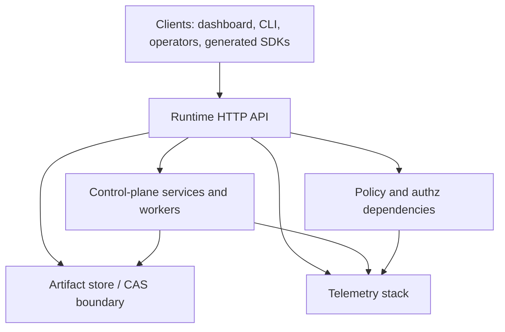
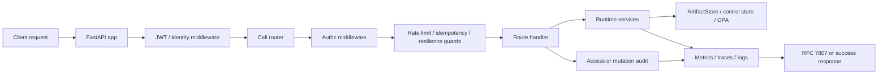
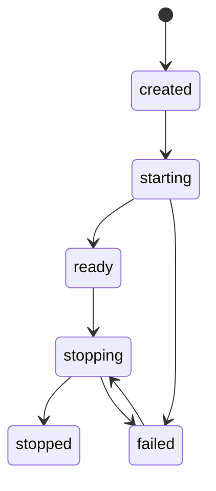
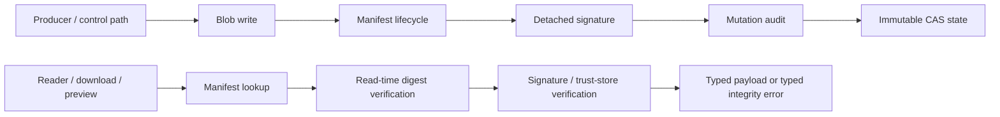
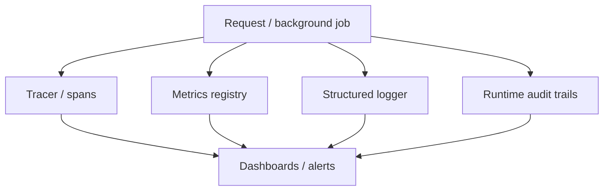

# Platform Architecture Diagrams

Related reference: [Operations Reference](index.md), [Runtime API Versioning and
Deprecation Policy](../api/versioning.md), [Logging and Trace Context](../logging.md).

> These diagrams are the operator-facing shorthand for the runtime platform
> contract after WS-0 through WS-2 hardening.

## C4 Container View

## Runtime Request Path

### Operator Notes

- Deny paths stop before downstream route logic can treat the request as
  authenticated.
- Mutation protection lives before side effects and records replay/throttle
  outcomes.
- Read paths attach data-access audit entries with `request_id`, actor, tenant,
  and resource metadata.

## Control-Plane Lifecycle

### Lifecycle Responsibilities

- `created`: dependency graph assembled but not started.
- `starting`: heavy services are being initialized and legacy aliases are bound.
- `ready`: routes, workers, audit, and metrics are expected to be usable.
- `stopping`: new work should drain and long-lived connections should close.
- `stopped`: owned resources are closed in dependency order.
- `failed`: startup/shutdown or dependency initialization failed and requires
  operator inspection.

## CAS, Signing, and Integrity Flow

### Operator Notes

- Manifest creation is create-once and backed by atomic file-write behavior.
- Integrity mismatch is a typed failure, not a silent best-effort warning.
- Trust-store state determines whether a signed artifact is `valid`,
  `untrusted`, or `revoked`.

## Observability Topology

### Signal Ownership

- traces explain why a request degraded;
- metrics show latency, saturation, circuit state, cache behavior, and
  rate-limit pressure;
- logs capture operator narrative plus dependency diagnostics;
- audit trails answer who read or changed which resource.
