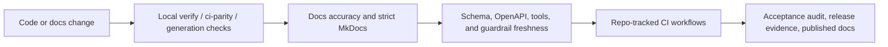

# Quality Gates and Change Taxonomy

Owner: `@platform-owners`  
Backup owner: `@tools-owners`  
Source of truth: `architecture/control_plane_supply_chain.toml`,
repository-root
`.github/{CODEOWNERS,repository-rulesets/main.yml,workflows/{abi.yml,ci.yml,core-runtime-long-soak.yml,core-runtime-release-gate.yml,docs-pages.yml,fabric-remediation.yml,frontend-nightly.yml,frontend-quality.yml,release.yml}}`,
reusable product workflow templates under
`ops/ci/templates/workflows/{abi.yml,arch.yml,arch-freeze.yml,build-and-push.yml,causal-phases.yml,design-wave1-evidence.yml,docs.yml,foundry-release-gate.yml,mutation.yml,perf.yml,replay.yml,repository-hygiene.yml,signatures.yml}`,
`.github/PULL_REQUEST_TEMPLATE.md`, `.github/labels.yml`,
`tools/devx/workspace/{verify.py,docs_style.py,format_check.py,lint_fast.py,lint_full.py,ci_parity.py,acceptance_audit.py,repository_sota_closeout.py}`,
`docs/reference/repository-hygiene.md`,
`tools/quality/validation/{check_docs_gate.py,control_plane_supply_chain_contracts.py}`,
`tools/ops_runners/runtime/check_runtime_api_contract.py`, and
`tools/devx/architecture/guardrails.py`

This page is the single repo-tracked map for local validation commands, current
CI workflows, and the PR taxonomy recorded in the repository itself.

Live GitHub branch-protection settings, reviewer assignment rules, and any
required-check configuration that exists only in the GitHub UI are
operational/manual truth and are therefore described as guidance, not as
versioned facts, on this page.

## CI And Docs Quality Gate Flow

Documentation claims should move through the same flow as code claims. When a
page introduces strong language about current behavior, it should point at at
least one test, benchmark, generated artifact, acceptance audit, ADR/contract,
or explicit non-default roadmap note.

## Repo-Tracked Local Gates

<!-- markdownlint-disable MD060 -->

| Local gate                       | Canonical command                                                                                                                                                                           | Source of truth                                                                                                      | Use when                                                                                                                                                                             |
| -------------------------------- | ------------------------------------------------------------------------------------------------------------------------------------------------------------------------------------------- | -------------------------------------------------------------------------------------------------------------------- | ------------------------------------------------------------------------------------------------------------------------------------------------------------------------------------ |
| Docs drift gate                  | `uv run polisyos-tools validation check-docs-gate --repo-root . --base-ref origin/main`                                                                                                     | `tools/quality/validation/check_docs_gate.py`                                                                        | Docs-sensitive paths changed and you want the single D6 gate that dispatches path-aware docs, OpenAPI, schema, public-surface, tools, README-freshness, and runbook-evidence checks. |
| Policy Design Case docs paths    | `uv run pytest tests/repo_quality/tools/test_policy_design_case_documentation_paths.py -q`                                                                                                  | `docs/reference/policy-design-case-evidence-paths.md`                                                               | Universal Policy Design Case docs, runbooks, ADR path references, validation-command conventions, or closeout-note paths change.                                                     |
| Workstation preflight            | `uv run polisyos-tools workspace doctor`                                                                                                                                                    | `tools/devx/workspace/doctor.py`                                                                                     | Bootstrap, toolchain, lockfile, contract, or environment drift is suspected.                                                                                                         |
| Docs style                       | `uv run polisyos-tools workspace docs-style`                                                                                                                                                | `tools/devx/workspace/docs_style.py`, `.markdownlint-cli2.jsonc`                                                     | You changed authored docs, plan files, or package README/CONTRIBUTING files and want the Markdown-only repo hygiene gate.                                                            |
| Formatter contract               | `uv run polisyos-tools workspace format-check`                                                                                                                                              | `tools/devx/workspace/format_check.py`, `.editorconfig`, `.taplo.toml`                                               | A repo hygiene pass should prove authored files are already formatted without running tests or broader CI parity.                                                                    |
| Fast authored lint sweep         | `uv run polisyos-tools workspace lint-fast`                                                                                                                                                 | `tools/devx/workspace/lint_fast.py`, `.pre-commit-config.yaml`, `.yamllint`                                          | You want the fast repo-wide lint contract for authored Python/docs/config/shell/workflow surfaces.                                                                                   |
| Phase 3 base-layer mypy          | `uv run polisyos-tools workspace python-base-mypy`                                                                                                                                          | `tools/devx/workspace/python_base_mypy.py`, `pyproject.toml`                                                         | The serial Python foundation layers (`common -> ir -> core`) changed and you want the canonical strict-typing pass.                                                                  |
| Phase 3 base-layer basedpyright  | `uv run polisyos-tools workspace python-base-basedpyright`                                                                                                                                  | `tools/devx/workspace/python_base_basedpyright.py`, `basedpyright.toml`, `architecture/baselines/basedpyright/baseline.json` | The serial Python foundation layers changed and you want the second-checker ratchet, including the baselined IR surface.                                                             |
| Full authored lint sweep         | `uv run polisyos-tools workspace lint-full`                                                                                                                                                 | `tools/devx/workspace/lint_full.py`, `pyproject.toml`, `ops/cloud/helm`, `ops/policy/policies`                                | CI/nightly-style repo hygiene evidence is needed without running the full behavior/test matrix from `verify` or `ci-parity`.                                                         |
| Fast local gate                  | `uv run polisyos-tools workspace verify`                                                                                                                                                    | `tools/devx/workspace/verify.py`                                                                                     | Default pre-PR gate for routine backend, runtime, schema, and dashboard changes.                                                                                                     |
| CI parity without browser suites | `uv run polisyos-tools workspace ci-parity --skip-browser`                                                                                                                                  | `tools/devx/workspace/ci_parity.py`                                                                                  | Broad platform, docs, workflow, or generated-artifact changes need CI-like evidence.                                                                                                 |
| Cross-surface acceptance audit   | `uv run polisyos-tools workspace acceptance-audit`                                                                                                                                          | `tools/devx/workspace/acceptance_audit.py`                                                                           | Repo policy, onboarding, release, governance, or multi-surface closeout changes land.                                                                                                |
| Repository SOTA closeout         | `uv run polisyos-tools workspace repository-sota-closeout`                                                                                                                                  | `architecture/gates/repository_sota.toml`, `tools/devx/workspace/repository_sota_closeout.py`                        | Repository topology, imports, generated artifacts, docs freshness, public-polish hygiene, shims, local data, security, release, or ops policy changes land.                         |
| Directory hygiene and assets     | `uv run polisyos-tools validation directory-hygiene-assets --fail-on-contract-errors`                                                                                                       | `architecture/asset_placement.toml`, `tools/quality/validation/directory_hygiene_assets.py`                          | Product assets, test fixtures, golden records, examples, local reports, generated benchmark reports, or cleanup/promotion rules change.                                             |
| Directory health ratchet         | `uv run polisyos-tools validation directory-health --fail-on-regression`                                                                                                                    | `architecture/policies/directory_health.toml`, `tools/quality/validation/directory_health.py`                                  | Test/benchmark role gates, directory closure rules, and directory-health dashboard metrics need Phase 6.2 no-regression evidence.                                                   |
| Stale local report cleanup       | `uv run polisyos-tools workspace clean-local-reports --stale-days 30 --dry-run`                                                                                                             | `architecture/asset_placement.toml`, `tools/devx/workspace/clean_local_reports.py`                                    | Local `.polisyos/reports`, `benchmarks/_reports`, source-adjacent `.DS_Store`/`__pycache__`, or egg-info residue needs a reviewed cleanup pass.                                    |
| Control-plane supply-chain contract | `uv run python tools/quality/validation/control_plane_supply_chain_contracts.py`                                                                                                          | `architecture/control_plane_supply_chain.toml`, `docs/archive/reports/supply-chain-control-crosswalk.json`, `.github/CODEOWNERS`, `.github/repository-rulesets/main.yml`         | CODEOWNERS/ruleset intent, workflow permissions, OIDC usage, Renovate placement, release SBOM/provenance/signing, or supply-chain control reporting changes land.                  |
| Public-polish topology gate      | `uv run pytest tests/repo_quality/architecture/test_repository_public_polish.py -q`                                                                                                                      | `docs/reference/repository-topology.md`, `tests/repo_quality/architecture/test_repository_public_polish.py`                       | Published docs navigation, excluded-plan links, Repository SOTA lifecycle placement, or human-readable topology reference pages change.                                              |
| Tools reference regeneration     | `uv run polisyos-tools docs --output docs/reference/tools.md`                                                                                                                               | `tools.registry`, `tools/cli.py`                                                                                     | `tools.registry`, command metadata, aliases, lifecycle status, or compatibility wrappers change.                                                                                     |
| Guardrail drift check            | `uv run polisyos-tools architecture guardrails check`                                                                                                                                       | `architecture/public_surface/contract.toml`, `architecture/generated_artifacts.toml`, `tools/devx/architecture/guardrails.py` | Public-surface or generated-artifact manifests/docs change.                                                                                                                          |
| Docs freshness baseline          | `uv run polisyos-tools workspace repository-sota-closeout --skip-generated-checks`                                                                                                         | `architecture/exceptions/docs_freshness.toml`, `tools/quality/validation/check_docs_accuracy.py`                      | Published-doc drift needs the fail-closed Phase 5 baseline check; raw `check-docs-accuracy` remains a diagnostic command while the legacy baseline is burned down.                  |
| Strict docs build                | `uv run --extra docs python -m mkdocs build --strict`                                                                                                                                       | `mkdocs.yml`, published docs tree                                                                                    | Navigation, reference docs, links, or docs-site config change.                                                                                                                       |
| Runtime contract drift           | `PYTHONPATH=src:. uv run --extra runtime --extra ml python tools/ops_runners/runtime/check_runtime_api_contract.py`                                                                                     | `tools/ops_runners/runtime/check_runtime_api_contract.py`, committed OpenAPI/client artifacts                                    | Runtime HTTP routes, DTOs, examples, or generated clients change.                                                                                                                    |
| Schema snapshot drift            | `uv run --extra ml polisyos-tools diagnostics gen-schema --check`                                                                                                         | `tools/quality/diagnostics/gen_schema.py`, ABI registry, schema catalog generator                                    | ABI-visible IR or Fabric schema contracts change.                                                                                                                                    |
| Semantic docstrings              | `uv run polisyos-tools validation check-docstring-quality --repo-root . --allowlist tools/quality/validation/docstring_quality_allowlist.txt --coverage-scope public-surface --minimum-coverage 85` | `tools/quality/validation/check_docstring_quality.py`, `tools/quality/validation/docstring_quality_allowlist.txt`            | Public-surface docstrings or package-entrypoint documentation changes.                                                                                                               |

<!-- markdownlint-enable MD060 -->

`workspace verify` currently covers the fast backend/runtime/dashboard path:
import policy, Foundry purity, state-read invariants, Scholar boundary checks,
connector contracts, ABI schema freshness, runtime API contract drift, fast
backend pytest, and dashboard type generation drift. Its fail-fast last-mile
slice also runs the shell-package gate, `repository_last_mile_inventory.py`
baseline drift, fast `check_extension_examples.py` contract coverage, and
schema purity for top-level `schemas/**`.

`workspace lint-fast` and `workspace lint-full` are the repo-hygiene entry
points introduced for the repository cleanup waves. The exact authored
include/exclude contract lives in
[`reference/repository-hygiene.md`](repository-hygiene.md).

`workspace ci-parity` layers on top of that fast gate with docs accuracy,
strict MkDocs, docstring quality, runtime HTTP coverage, and broader frontend
build/test surfaces unless the corresponding skip flags are used. Its
repository-policy slice adds `directory_health.py`,
`report_test_ratchets.py` helper topology and mirror/property ratchets,
`architecture_report_only_contracts.py` Phase 6.1 and module-size evidence,
full `check_extension_examples.py` installability/discovery/smoke coverage, and
`generate_adr_index.py --check` when docs checks are enabled.

## Last-Mile Gate Owners

Phase 6.8 assigns every last-mile validator one explicit CI or CLI owner. A
validator may be invoked directly by a workflow, or indirectly through a
documented workspace command that the workflow also invokes for the same
surface.

| Last-mile validator | Owner path | CI reachability |
| --- | --- | --- |
| `repository_last_mile_inventory.py` plus cross-cutting/name-collision baseline drift | `polisyos-tools workspace verify` | `.github/workflows/abi.yml` also invokes the inventory directly for PRs. |
| `check_package_import_gates.py` shell-package closure | `polisyos-tools workspace verify` | `.github/workflows/abi.yml` invokes `check-package-import-gates --fail-closed` directly. |
| `check_extension_examples.py` fast contract coverage | `polisyos-tools workspace verify` | `.github/workflows/abi.yml` invokes the full installability gate directly; `workspace ci-parity` also runs the full gate. |
| `generate_adr_index.py --check` | `polisyos-tools workspace ci-parity` | `.github/workflows/abi.yml` invokes the ADR freshness gate in docs quality. |
| `architecture_report_only_contracts.py --report phase6-1` | `polisyos-tools workspace ci-parity` | The command is part of the broad local CI parity path for package layout, name-collision, shim, and import-contract evidence. |
| `architecture_report_only_contracts.py --report module-size` | `polisyos-tools workspace ci-parity` | `.github/workflows/abi.yml` invokes module-size evidence directly for validator budget closure. |
| schema purity for `schemas/**` | `polisyos-tools workspace verify` | `.github/workflows/abi.yml` writes `schemas-python-residue.txt` and fails on any Python/cache residue. |
| `directory_health.py --fail-on-regression` | `polisyos-tools workspace ci-parity` | `.github/workflows/ci.yml` invokes the directory-health ratchet directly. |
| `report_test_ratchets.py --fail-on-regression` helper topology gate | `polisyos-tools workspace ci-parity` | `.github/workflows/ci.yml` invokes the ratchet report directly with fail-on-regression. |
| operability bundle release checks | `.github/workflows/release.yml` | The release workflow invokes `check-operability-release-gates --fail-closed` and uploads evidence. |
| compatibility release metadata checks | `.github/workflows/release.yml` | The release workflow invokes `check-compatibility-release-gates --fail-on-contract-errors` and uploads evidence. |
| final acceptance owner map | `polisyos-tools workspace repository-sota-closeout` | The closeout command records ownership for final-only gates such as repository structure, dead overrides, acceptance audit, schema purity, and release gates. |

## Repo-Tracked CI Workflow Inventory

<!-- markdownlint-disable MD060 -->

| Workflow                                          | Trigger shape                                                    | Current role                                                                                                                                                                                      |
| ------------------------------------------------- | ---------------------------------------------------------------- | ------------------------------------------------------------------------------------------------------------------------------------------------------------------------------------------------- |
| `.github/workflows/abi.yml`                       | PRs and pushes to `main`                                         | Repository-root Fast PR workflow. Runs the path-aware D6 docs drift gate, docs accuracy, strict MkDocs, ADR index freshness, global public-surface docstring quality, ABI snapshot checks, schema purity, last-mile inventory, extension examples, module-size evidence, and fast non-browser tests. |
| `.github/workflows/ci.yml`                        | PRs and pushes to `main`                                         | Standard PR workflow covering runtime HTTP, frontend contracts/smoke, performance, integration, directory-health, helper topology, test ratchets, and test-economics surfaces.                    |
| `.github/workflows/core-runtime-release-gate.yml` | Core/runtime/security/docs path changes, pushes, manual dispatch | Release-grade runtime/docs contract, link check, mutation subset, and evidence-summary path.                                                                                                      |
| `.github/workflows/docs-pages.yml`                | manual dispatch and successful `PR Fast` workflow runs on `main` | Published docs build/deploy path with strict MkDocs before Pages upload.                                                                                                                          |
| `.github/workflows/fabric-remediation.yml`        | Fabric remediation paths, pushes, manual dispatch                | Fabric connector/data-plane/schema-governance remediation gates.                                                                                                                                  |
| `.github/workflows/frontend-nightly.yml`          | schedule/manual/frontend path changes                            | Broader frontend quality and nightly coverage beyond the standard smoke path.                                                                                                                     |
| `.github/workflows/frontend-quality.yml`          | frontend path changes and manual dispatch                        | Frontend lint, unit, contracts, build, and targeted quality checks.                                                                                                                               |
| `.github/workflows/release.yml`                   | release tags/manual dispatch                                     | Release orchestration, package/build artifacts, operability bundle gates, compatibility release metadata, and publication evidence.                                                               |
| `ops/ci/templates/workflows/*.yml`                | reusable product workflow templates                              | Product-local workflow specs retained for template/reference use only; repository-root workflows above are the GitHub-executed source for current PR enforcement.                                  |

<!-- markdownlint-enable MD060 -->

Historical or removed workflow names are not part of the factual CI gate
inventory. The table above is the source of truth.

## Pull Request Taxonomy

The repository still tracks a pull-request taxonomy through
`.github/PULL_REQUEST_TEMPLATE.md` and `.github/labels.yml`.

When a PR uses that taxonomy, it should include:

- at least one `kind:*` label;
- exactly one `compat:*` label;
- exactly one `release:*` label;
- the supported-surface classification touched by the change
  (`public_stable`, `public_experimental`, or `internal`) when a documented
  package entrypoint is affected;

- the owned areas touched by the change;
- a migration owner when the change requires coordinated rollout across
  multiple surfaces.

## Change Categories

<!-- markdownlint-disable MD060 -->

| Category           | Typical scope                                                    | Review expectation                                                                         | Additional expectations beyond baseline                                                                                                         |
| ------------------ | ---------------------------------------------------------------- | ------------------------------------------------------------------------------------------ | ----------------------------------------------------------------------------------------------------------------------------------------------- |
| Architecture       | ownership, ADRs, import-policy boundaries, major package moves   | `@platform-owners` plus every touched subsystem owner                                      | explain boundary impact; link ADR or explicit rationale; call out rollout and compatibility risk                                                |
| Contract / schema  | IR schema snapshots, OpenAPI, ABI, generated clients             | owning subsystem plus `@platform-owners`                                                   | regenerate or verify affected artifacts; update reference docs; run ABI and runtime-contract checks when applicable                             |
| Runtime behavior   | HTTP behavior, control plane, operator-visible backend semantics | `@runtime-owners` plus touched subsystem owners                                            | describe behavior change; update failure-path tests; update runbook if rollout or incident handling changes                                     |
| Frontend           | dashboard UX, runtime-api-client, typed dashboard contracts      | `@frontend-owners`; add `@runtime-owners` when API contract changes                        | verify generated frontend contracts; run the dashboard suites relevant to touched paths; document meaningful operator UX changes                |
| Docs               | reference, tutorials, how-to, ownership or governance docs       | `@docs-owners`; add subsystem owner when docs change contract meaning                      | keep docs aligned with repo reality; update the relevant entry point, not only leaf pages                                                       |
| Ops / security     | workflows, secrets, deployment, signing, incident surfaces       | `@platform-owners`; add `@runtime-owners` or subsystem owners as needed                    | describe config/secret/rollback impact; update policy or runbook material; run the control-plane supply-chain contract when workflow trust, CODEOWNERS, ruleset, or release identity changes |
| Dependency upgrade | Python, Node, lockfiles, GitHub Actions, toolchain               | owner of affected surface; add `@platform-owners` for shared toolchain or workflow changes | cite upstream notes for breaking/security changes; validate every affected surface; call out rollout risk when upgrades are not purely internal |

<!-- markdownlint-enable MD060 -->

## Compatibility Classification Rules

Use exactly one compatibility label on every PR.

| Classification | Use when                                                                                                                                                 | Typical version impact                                                                   |
| -------------- | -------------------------------------------------------------------------------------------------------------------------------------------------------- | ---------------------------------------------------------------------------------------- |
| `breaking`     | supported consumers or operators must change behavior, update config, regenerate clients, adopt a new schema/API major, or handle removed/renamed fields | package release bump for a breaking line; schema major bump; runtime API major line bump |
| `additive`     | existing consumers keep working unchanged and the PR only adds optional fields, new endpoints, new features, or extra docs                               | package minor bump; schema minor bump; runtime API minor bump within the same major line |
| `internal`     | no supported surface changes; refactors, tests, maintenance, or internal-only docs/process work                                                          | package patch bump at most; no schema or runtime API version bump                        |

## Supported Surface Classification

Use the public-surface inventory in `architecture/public_surface/contract.toml` and
`docs/reference/public-surface.md` to record which kind of surface the PR
touches.

| Surface classification | Meaning                                                           | Release/doc expectation                                                                                                                    |
| ---------------------- | ----------------------------------------------------------------- | ------------------------------------------------------------------------------------------------------------------------------------------ |
| `public_stable`        | supported package entrypoint with normal compatibility guarantees | update docs, choose the correct `compat:*` label, and include `surface_classification` in the release fragment when a fragment is required |
| `public_experimental`  | documented but intentionally unstable entrypoint                  | keep docs and release notes explicit that the surface is experimental                                                                      |
| `internal`             | unlisted `polisyos.*` path or pure internal implementation detail | normally no public-surface doc change and no public release callout unless operators must act                                              |

## Label Taxonomy

### Kind Labels

- `kind:architecture`
- `kind:contract-schema`
- `kind:runtime-behavior`
- `kind:frontend`
- `kind:docs`
- `kind:ops-security`
- `kind:dependency-upgrade`

Apply more than one when a PR spans multiple surfaces.

### Compatibility Labels

- `compat:breaking`
- `compat:additive`
- `compat:internal`

Exactly one is required.

### Release Labels

- `release:breaking`
- `release:feature`
- `release:fix`
- `release:docs`
- `release:ops`
- `release:security`
- `release:none`

Exactly one is required. These labels determine how the PR is summarized in
human release notes and whether it needs migration callouts.

### Structured Compatibility Changes

Release fragments use `[[compatibility_change]]` entries when a change affects
Python public APIs, schemas/OpenAPI, extension contracts, runtime-state formats,
persisted artifacts, or generated JS clients. The Phase 5.10 report-only gate is
`uv run polisyos-tools release check-compatibility-release-gates --fail-on-contract-errors`.
Every structured entry names the change class, impact, owner, version owner,
deprecation window, release note, and migration/runbook or generated-client
evidence when that class requires it.

## Release-Note Mapping Rules

- `compat:breaking` should normally pair with `release:breaking`.
- Backward-compatible product or API additions should normally use
  `release:feature`.

- Backward-compatible bug fixes should normally use `release:fix`.
- Docs-only changes use `release:docs` when they materially change usage
  guidance; otherwise use `release:none`.

- Ops, workflow, release, or deployment changes use `release:ops` unless the
  primary impact is a security fix.

- Security-relevant fixes, credential-rotation events, or supply-chain
  remediations use `release:security`.

## Live GitHub Enforcement

Anything enforced only in the GitHub UI is outside the repo-tracked applied
state on this page. The repository does track intended CODEOWNERS and ruleset
state through `.github/CODEOWNERS`, `.github/repository-rulesets/main.yml`, and
`architecture/control_plane_supply_chain.toml`.

That includes:

- proof that the tracked ruleset is applied to `main`;
- required-check selections after live GitHub context names change;
- reviewer routing rules configured only in GitHub settings;
- merge queue configuration beyond the tracked disabled state.

Use [Merge Governance](merge-governance.md) and
[`docs/how-to/apply-github-governance.md`](../how-to/apply-github-governance.md)
for the current manual guidance around those operational settings.
