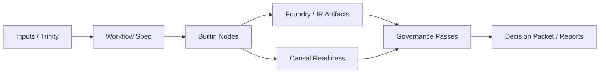

# Scientist
Related explanation: [Governance Model](../../explanation/governance-model.md).

> Orchestration layer for workflow DAGs, governance passes, causal readiness, and policy-design search.

`polisyos.scientist` coordinates the end-to-end runtime around Foundry and IR artifacts. It assembles workflow specs, executes builtin nodes, persists experiment state, and applies governance before a decision packet is emitted.

## Surface Map

| Area | What it covers | Reference |
|------|----------------|-----------|
| Root facade | `run_experiment`, `ExperimentState`, observability accessors | This page |
| Workflows | `causal_full` and `policy_design` DAG specs | [workflows.md](workflows.md) |
| Agent search and reasoning | Supervisor/worker orchestration, Tree-of-Thought, LATS/MCTS, and offline-gated search policies | [agent-search-reasoning.md](agent-search-reasoning.md) |
| Governance passes | 20+ builtin and shim validators, runtime filtering | [governance-passes.md](governance-passes.md) |
| Builtin nodes | Causal node protocol, state reads/writes, planning nodes | [nodes.md](nodes.md) |
| Causal runners | Bounds, proxy identification, transportability, strategic response | [causal.md](causal.md) |
| Causal validity | Default-path sensitivity, ICP, proximal, recoverability, and PAG refinement bundle | [causal-validity.md](causal-validity.md) |
| Calibration governance | Backtests, leaderboards, stress scenarios, validation bundles | [calibration-governance.md](calibration-governance.md) |
| Governance accountability | Unified calibration, fairness, threshold, escalation, and model-card artifact | [governance-accountability.md](governance-accountability.md) |
| Reliability scorecard | Required scenario, benchmark, and observability evidence for production readiness | [reliability-scorecard.md](reliability-scorecard.md) |
| Remediation status | Repo-tracked Gate 0 matrix for workstream closure under strict Definition of Done rules | [remediation-status.md](remediation-status.md) |
| Phase acceptance | Explicit Phase 0, Phase 1, and Phase 3 exit contracts used to sign off reliability and claim-closure work | [phase0-acceptance.md](phase0-acceptance.md) |
| Frontier runtime | Feature-flag contract and rollout statuses for Phase 4 frontier capabilities | [frontier-runtime.md](frontier-runtime.md) |
| WS-3A acceptance | Synthetic and semi-synthetic acceptance evidence for the claim-closed causal-validity default path | [causal-validity-acceptance.md](causal-validity-acceptance.md) |
| Phase 3 acceptance | Claim-closure matrix for causal validity, accountability, and offline-gated search rollout | [phase3-acceptance.md](phase3-acceptance.md) |

## Public API

| Export | Role |
|--------|------|
| `run_experiment` | Execute a workflow spec against an `ExperimentState` |
| `ExperimentState` | Immutable-ish workflow state passed across nodes |
| `get_metrics` | Fetch Scientist / platform metrics emitters |
| `get_tracer` | Fetch the OpenTelemetry tracer used during execution |

## Workflow Shape

## Key Subsystems

| Submodule | Responsibility |
|-----------|----------------|
| `polisyos.scientist.workflows` | Declarative DAG specs and required binds |
| `polisyos.scientist.governance` | Pass registry, validation pipeline, calibration review |
| `polisyos.scientist.causal` | Readiness and execution runners over observation-plane bundles |
| `polisyos.scientist.nodes.builtins` | Production node implementations used by workflow DAGs |
| `polisyos.scientist.compute.advanced_methods` | C7 advanced artifact suite for factor, survival, sensitivity, and bilevel bundles |

## Advanced Compute

| API | Output artifacts |
|-----|------------------|
| `run_c7_advanced_suite()` | Factor embeddings, cell prototypes, bilevel bundle, Heckman correction, survival hazards, Sobol diagnostics, specification-curve diagnostics |

## API Reference

::: polisyos.scientist

::: polisyos.scientist.api

::: polisyos.scientist.engine.state

::: polisyos.scientist.remediation_status

::: polisyos.scientist.frontier_runtime
