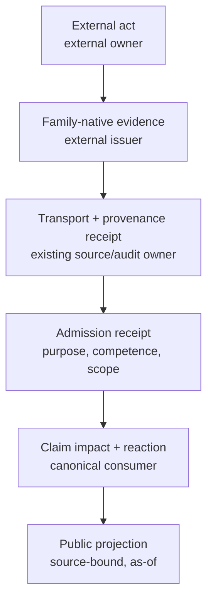

# PAO-R1 Evidence-Contract Audit

## Verdict

All 21 `EC-*` entries are **research taxonomies**, not existing contracts. None
has a complete repository capability chain under that ID. Several are valuable
family decompositions, but the claimed shared `InstitutionalEvidenceEnvelope`
must not be frozen. It duplicates existing owners and mixes four independently
owned objects:

1. externally asserted family-native fact;
2. transport/provenance receipt;
3. PolicyOS verification/admission decision;
4. consumer impact/reaction and public projection.

Historical and current verdicts are identical because both baselines are
`4813b49f6ce14e8debf3aaea096f0967d38d9768`.

## Existing common contracts

| Owner | Existing contract | What it actually owns | What it does not prove |
| --- | --- | --- | --- |
| PDC | [`AuthorityBoundary`](https://github.com/DenisKopylov/polisyos/blob/4813b49f6ce14e8debf3aaea096f0967d38d9768/policy-engine/src/polisyos/pdc/_impl/layer2_readiness.py#L62-L114) | Purpose-scoped permitted/prohibited use and weak composition inside its contract family | External competence, legal finality, payment settlement, service, or audit independence |
| Runtime quality | [`EvidenceAuthorityEnvelope`](https://github.com/DenisKopylov/polisyos/blob/4813b49f6ce14e8debf3aaea096f0967d38d9768/policy-engine/src/polisyos/runtime/quality/authority.py#L471-L605) | Producer/runtime/CAS/tenant/lineage/validation/governance envelope | A universal institutional evidence lifecycle; its model allows extra fields |
| Fabric | [`SourceContract`](https://github.com/DenisKopylov/polisyos/blob/4813b49f6ce14e8debf3aaea096f0967d38d9768/policy-engine/src/polisyos/fabric/connectors/contracts/source_contract.py#L382-L470) | Data-source schema, semantics, security, quality, SLA, replay, lineage, trust, retention | Adjudicative finality, remedy execution, proof of service, institutional competence |
| Core | [PROV-like graph](https://github.com/DenisKopylov/polisyos/blob/4813b49f6ce14e8debf3aaea096f0967d38d9768/policy-engine/src/polisyos/core/contracts/provenance.py#L63-L174) | Entities, activities, agents and edges | Legal responsibility or claim-specific admission |
| Decision validity | [Validity events/envelopes](https://github.com/DenisKopylov/polisyos/blob/4813b49f6ce14e8debf3aaea096f0967d38d9768/policy-engine/src/polisyos/core/contracts/decision_validity.py#L111-L208) | Dependency-triggered status and action recommendations | External act truth, generic impact graph or fleet orchestration |
| Continuous governance | [Lifecycle bridge](https://github.com/DenisKopylov/polisyos/blob/4813b49f6ce14e8debf3aaea096f0967d38d9768/policy-engine/src/polisyos/scientist/governance/continuous/lifecycle_bridge.py#L102-L399) | Scoped append-only claim/case lifecycle reaction | Generic external-event admission |
| Core audit | [`core.audit`](https://github.com/DenisKopylov/polisyos/tree/4813b49f6ce14e8debf3aaea096f0967d38d9768/policy-engine/src/polisyos/core/audit) | Portable package integrity, provenance and offline verification | Independent audit opinion |
| Lex/Data Forge | [Lex README owner boundary](https://github.com/DenisKopylov/polisyos/blob/4813b49f6ce14e8debf3aaea096f0967d38d9768/policy-engine/src/polisyos/lex/README.md) | Runtime legal evaluation vs offline corpus build | Court/legislature performance or universally binding applicability |

## Contract-by-contract audit

Abbreviations:

- `RO` — repository owner;
- `AO` — admission owner;
- `CO` — consumer/reaction owner;
- `CR` — correction/revocation owner;
- `AB` — `AuthorityBoundary` fit;
- `P27` — duplicate-owner risk.

| ID | Claimed family | Existing canonical contracts / overlap | Missing or misplaced semantics | Producer; AO; CO; CR | Clock owner | AB fit / P27 | Recommended disposition |
| --- | --- | --- | --- | --- | --- | --- | --- |
| EC-01 | Legal publication/amendment/repeal | Lex legal source/version/effective-time records; Data Forge snapshot production; Fabric provenance | Official-publication competence, finality, jurisdiction packs and continuous bridge are not one implemented chain | External publisher; Lex/RQ candidate; decision validity; source publisher + Lex version owner | Lex family clocks + OPS-R4 | AB useful at admission; high P27 if new family | **Compose existing**; keep candidate field map |
| EC-02 | Court/appeal/ombudsman outcome | ADR-0170 contestability and append-only outcome ingestion; lifecycle bridge | Standing, finality, appealability and real forum are jurisdiction facts; court/ombudsman should not share one untyped payload | Competent forum; contestability/RQ unresolved; decision validity; forum + lifecycle owner | Forum-native + OPS-R4 | AB insufficient for finality; high P27 | **Split by outcome family**, extend ADR-0170 only after owner review |
| EC-03 | Mandate/delegation/appointment/quorum/recusal/certification | PDC/human-review/delegation contracts and runtime authorization | Five legal acts are collapsed; subdelegation, quorum and recusal have different issuers and transitions | External competent body; INT-R5/RQ unresolved; authorization/PDC; issuer + authorization owner | INT-R5/OPS-R4 | AB references permitted use but cannot prove competence; high P27 | **Research taxonomy; split** and defer to INT-R5 |
| EC-04 | Administrative deadline/tolling/notice generation/intake/status | No generic administrative-procedure contract; temporal fragments exist | Mixes clocks, notice preparation, receipt and case status; PolicyOS does not own the procedure | External case system; adapter unresolved; claim consumer unresolved; case authority | OPS-R4 + jurisdiction | AB only at claim binding; high P27 | **Reject as one family**; pilot-specific adapters |
| EC-05 | Delivery/proof of service | No exact proof-of-service symbol; trust-service and notification planning only | Dispatch, delivery, qualified proof and legal effect are distinct; eIDAS is not universal | Delivery/trust service; adapter unresolved; affected claim owner; issuer/service authority | Jurisdiction + OPS-R4 | AB cannot confer legal service; high P27 | **Split**, pilot/jurisdiction dependent |
| EC-06 | Individual-decision handoff/return | Ratified individual-decision firewall; PDC export/use boundaries | “Aggregate/anonymized” does not itself prevent re-identification or individual use; return-evidence schema absent | External case system; PDC/RQ firewall; policy claim owner; source + privacy owner | Source-native + OPS-R4 | Strong prohibited-use fit; medium P27 | **Extend existing firewall**, no universal external envelope |
| EC-07 | Capacity/configuration/rollout/delivery | Existing evidence/capacity/readiness fragments, DDM and Fabric | Four functions, multiple denominators and operators; delivery truth and feasibility inference are distinct | Service/program owner; family adapter; PDC/Foundry/DDM; source + claim lifecycle | Metric/service period + OPS-R4 | AB fit at inference; high P27 | **Split family-native payloads**, compose admission |
| EC-08 | Budget proposal/appropriation/availability | Policy models and source contracts; no operational treasury chain | Proposal, appropriation, allotment, encumbrance and availability differ by jurisdiction | Legislature/finance body; adapter unresolved; feasibility consumer; fiscal authority | Fiscal calendar + OPS-R4 | AB useful for fiscal-only use; high P27 | **Research-only pilot contract** |
| EC-09 | Procurement/contract/vendor/performance/escrow | Fabric supplier/source, audit and license fragments | Procurement act, contract evidence, vendor self-report and independent audit are different authority lanes | Procurement/contract owner/supplier/auditor; multiple AOs; PDC/RQ; each issuer + contract owner | Contract/procurement clocks | One AB would hide independence; critical P27 | **Split at least four families** |
| EC-10 | Payment authorization/settlement/reconciliation/clawback | No payment runtime; internal authorization receipt is explicitly not execution | Financial finality, amount/currency, reversal and reconciliation need payment-system semantics | Treasury/payment network; adapter unresolved; remedy/public record consumer; payment operator | Payment-rail native + OPS-R4 | AB cannot prove settlement; high P27 | **Pilot-only family**, stages separate |
| EC-11 | KPI observation | DDM events, monitored metrics, Fabric source contract | Observation, metric definition, threshold and diagnosis have distinct owners; observation cannot auto-admit | External data owner/DDM; Fabric/RQ; OPS-R5/DDM; source + metric owner | Metric vintage/observation + OPS-R4 | Good purpose boundary; medium P27 | **Compose existing**, defer control semantics to OPS-R5 |
| EC-12 | Independent evaluation/attribution | Foundry/Scientist method and evidence contracts; core provenance | Independence is not a method field alone; audit/evaluation/causal attribution are distinct | Evaluator/research body; RQ/Foundry; claim owner; evaluator + claim lifecycle | Study-native clocks | AB fit for claim scope; high P27 if new envelope | **Family-native evaluation artifact + existing admission** |
| EC-13 | Incident/near miss/safety/harm report | DDM incident/readiness events and continuous governance | Report, detection, corroboration, official classification, causal finding and harm are collapsed | Reporter/operator/regulator; DDM/RQ; decision validity; reporter/investigator + lifecycle | Occurrence/detection/report + OPS-R4 | AB useful but cannot settle allegation; high P27 | **Split signal, report, finding**, extend DDM only where semantic fit proven |
| EC-14 | Remedy/remediation/compensation/apology | ADR-0170 outcomes and lifecycle; no financial-remedy owner | Orders, authorizations, execution, payment and publication are different acts and systems | Court/remedy/finance/accountable institution; multiple AOs; claim lifecycle; respective issuers | Family-native + OPS-R4 | One boundary loses stage semantics; critical P27 | **Reject as one contract; split** |
| EC-15 | Retention/disclosure/FOI/SAR/redaction/erasure/hold/archive | Core retention/recovery, audit, privacy/publication fragments | At least seven legal functions; current retention policy owns PolicyOS artifacts only; “absent hold=no deletion” unsound | Records/privacy/legal authorities; multiple adapters; audit/publication owners; authority/controller | Legal/event-specific + OPS-R4 | AB cannot replace legal basis/schedule; critical P27 | **Split; own-artifact rules separate from institutional decisions** |
| EC-16 | Responsible body/succession/reliance/handoff | Provenance/delegation fragments; PAO-R0 identity unresolved | Responsibility, competence, custody, acceptance and identity succession differ; cross-tenant federation absent | Competent authorities/agencies; INT-R5/RQ unresolved; claim/matter owner unresolved; issuer + consumer | Effective interval + OPS-R4 | AB partial; high P27 and PAO-R0 dependency | **Research-only, split, defer** |
| EC-17 | Institutional/citizen identity/representation/capacity | Runtime internal auth; external IdP integration fragments | Authentication, sovereign identity, representation and legal capacity are non-fungible; purpose binding essential | IdP/registry/court; security/RQ; affected gate; issuer/revocation authority | Issuance/validity/revocation | Strong purpose boundary but no federation proof; high P27 | **Split identity vs representation/capacity** |
| EC-18 | External audit/oversight finding | Core audit package, external-audit projection, ADR-0170 for ombudsman-like outcomes | Auditor opinion, regulator finding and ombudsman outcome have different mandates; package ≠ opinion | Auditor/SAI/regulator; adapter unresolved; claim lifecycle; external body | Engagement/report/finality | AB useful for opinion scope; high P27 | **Family-native external finding**, reuse audit package only as evidence input |
| EC-19 | Continuity/degraded/fallback/hosting/DR | Platform resilience, runtime degradation, retention/recovery | External status, PolicyOS custody mode, manual service fallback and DR proof are distinct | Service/hosting operator; platform/RQ; H2 future; operator + platform | Outage/mode/recovery + OPS-R4 | AB fit varies; high P27 | **Split external provider status from internal custody event** |
| EC-20 | Credentials/licenses/contracts/rights/expiry/exit | Source contract deprecation/retention, auth, license/contract planning | Credential, license, contract, audit right and supplier exit have different issuers and consequences | Issuer/rights/contract owner; canonical dependency owner; H2 future; issuer + consumer | Expiry/renewal/revocation + OPS-R4 | AB useful for permitted use; high P27 | **Common watched-dependency reference only**, family payloads local |
| EC-21 | Authoritative language/translation | Lex source versions and Atlas projection rules; INT-R6 research | Certified translator authority, legal authentic text, semantic parity and projection are separate | Official publisher/translator; Lex/RQ; publication owner; publisher/translation owner | Source/translation versions | AB fit for language-only use; medium P27 | **Extend Lex/projection after INT-R6**, no universal envelope |

## Capability-chain findings

| Family | Contract | Producer | Persisted artifact | Bridge | Consumer | Verification | Surface | Actual state |
| --- | --- | --- | --- | --- | --- | --- | --- | --- |
| Legal sources | Yes, fragmented | Data Forge/external source | Yes | Partial | Lex/PDC | Partial | Reviewer/runtime fragments | `implemented_but_not_orchestrated` |
| Appeal outcome | ADR-0170 shape | Real partner missing | Lifecycle records exist | Missing partner bridge | Decision validity | Structural tests | Partial | `producer_missing`, `bridge_missing` |
| Source data | Fabric `SourceContract` | Connector producers | Yes | Yes for data paths | Multiple | Strong contract tests | Partial | `implemented` for narrow data scope |
| Incident/monitoring | DDM/local contracts | Internal/local producers | Yes | Partial | Validity/governance | Unit tests | Partial | `partial_internal_owner` |
| Audit package | Core audit | Core assembler | Yes | Exporter | External reviewer | Offline verifier | Download/API fragments | `implemented` for package, not opinion |
| Internal authorization | Runtime HTTP event | Authorization middleware | Append-only audit | Handler gate | Runtime handler/auditor | Unit tests | Audit log | `implemented`; not execution proof |
| Payments/notices/service/procurement/records decisions | Research shapes only | External partner absent | No canonical family artifact | Missing | Consumers unresolved/partial | Missing | Missing | `external_institution_required`, `producer_missing` |
| Generic institutional evidence | Proposed only | None | None | None | Multiple candidates | None | None | `contract_only`, `duplicate_owner_risk` |

## Corrected architecture

### Common

Only stable references that already have canonical owners should be shared:

- evidence/artifact reference and content digest;
- provenance entity/activity/agent references;
- source/schema/rule version references;
- tenant/jurisdiction/subject scope references where meaningful;
- canonical authority-boundary reference;
- correction/revocation/supersession event references;
- temporal-role references supplied by OPS-R4.

“Common” does not mean a new cross-family base class. Composition can be by
reference.

### Family-native

The external assertion belongs to its semantic owner: legal source/outcome,
metric observation, incident report, payment settlement, proof of service,
audit opinion, delegation, records decision, supplier record, identity
assertion, or service status. Each family retains its own finality,
independence, assurance and correction semantics.

### Admission receipt

A separate PolicyOS-owned receipt records:

- received artifact/version;
- verifier identity and rule version;
- integrity/source-identity/competence/scope/freshness checks separately;
- admitted purpose and authority-boundary reference;
- rejected/limited reasons;
- decision time supplied by OPS-R4;
- immutable audit reference.

It must not claim the external act occurred beyond the admitted evidence.

### Consumer reaction

The canonical claim owner records:

- actual dependency key and affected claim scope;
- materiality assessment;
- resulting existing canonical status/transition;
- recompute/revalidation/correction task;
- historical replay and public-impact references.

`required_reaction` does not belong in the external evidence artifact.

### Public projection

The publication owner emits a typed projection. Atlas renders it. The projection
must disclose external operator/issuer, evidence/admission status, scope and
as-of time without synthesizing “executed,” “paid,” “served,” “resolved,” or
“independently audited” from weaker records.

## Final disposition

| Disposition | Contracts |
| --- | --- |
| Compose/extend existing after owner review | EC-01, EC-06, EC-11, EC-12, EC-18, EC-21 |
| Split into family-native contracts | EC-02, EC-03, EC-05, EC-07, EC-09, EC-13, EC-14, EC-15, EC-16, EC-17, EC-19, EC-20 |
| Pilot/jurisdiction-only research schema | EC-04, EC-08, EC-10 |
| Safe to freeze as final code contract | **None** |

All remain `research_only` and `candidate_for_consolidation`.
