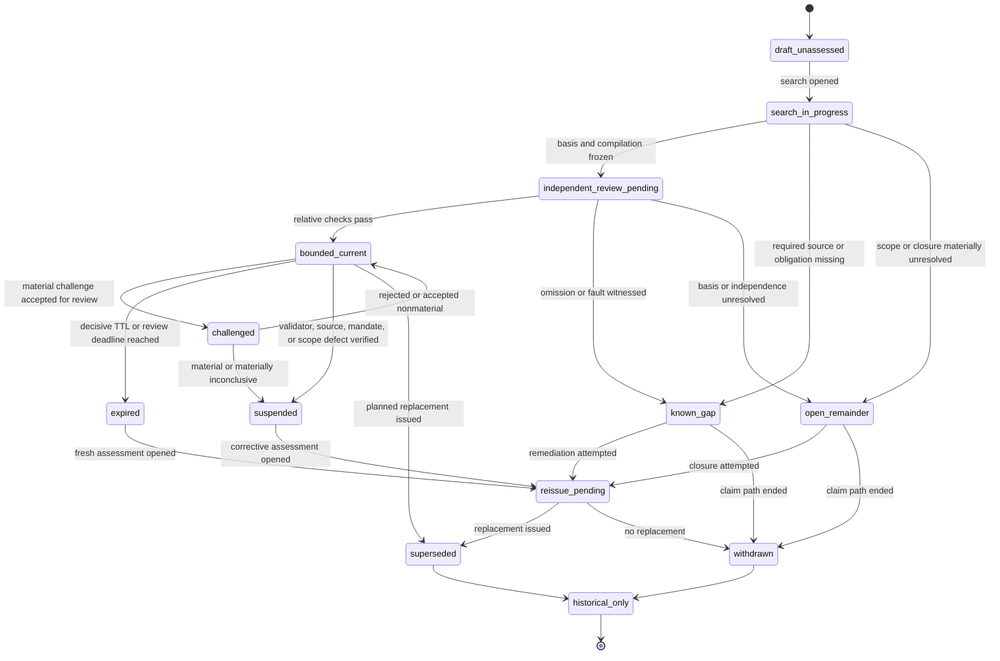

# INT-R1 — Bounded, Checkable, Honest Completeness in an Open World

## Executive Finding

**Result: `accepted_narrow_scope`.**

PolicyOS cannot, in the general open-world setting posed by this task, prove that the obligations
it checked are all obligations that actually applied. A finite inspection record is compatible
with two worlds that are identical on every source, query, receipt, and validator result observed
by PolicyOS, while one of the worlds contains an additional unobserved decisive obligation. A
procedure receiving the same record in both worlds cannot soundly certify global completeness in
one without falsely certifying it in the other. The only way to rule out that second world is to
add a closure premise: a competent exhaustive register, a deliberately closed domain, a valid
closure rule, or an oracle assumed complete for the exact scope. PolicyOS can verify, admit,
version, challenge, and publish such a premise; it cannot generally manufacture the premise from
its own search.

What **is** provable is narrower and still useful:

> For a declared protected action, scope, temporal cutoff, immutable closure basis, obligation
> language/compiler version, and validator-governance configuration, PolicyOS can prove that
> every obligation derivable from that basis and language was included and checked—provided the
> traversal is generic, the compiler and validators are sound relative to their declared
> languages, an appropriately independent checker reperforms the critical properties, no known
> material internal defeater remains, and the result is current.

That is a **relative coverage theorem**, not a theorem that the external legal, normative,
measurement, or implementation world is complete.

The requested `bounded_complete` assessment is therefore accepted only with a non-negotiable
meaning: **complete within the declared closure basis and language, for the declared scope and
cutoff, while the unknown world remainder remains explicit**. It removes only the
coverage-specific blocker. It does not set a substantive obligation to `satisfied`, does not
mint promotion, and must never appear publicly as the bare word “complete.” The public risk claim
must remain:

```text
P(false promotion with respect to the declared obligation set
  | maintained assumptions) <= delta
```

with a visible rider that the set was compiled from named sources/rules at a named cutoff, that
validator soundness remains a maintained assumption subject to governance and challenge, and
that obligations outside the declared basis may exist.

A concrete omitted obligation or validator fault yields `known_incomplete`. An absent or
materially unresolved closure basis, owner, source family, scope, or independent check yields
`open_world_unresolved`. Those are **inputs to the existing N9 status lattice**, not a parallel
lattice: they map consequence-sensitively to the existing `failed`, `unknown`, or
`scope_insufficient` outcomes. Under the ratified authority-band/candidate-band rule, the
affected protected action fails closed while candidate work may continue only with a typed,
carried-forward limitation
(`policy-engine/docs/system-design-decisions/stage0-custody-kernel-ratification.md:164-187`).

A later-discovered obligation does not cause silent editing of the old proof. It creates an
append-only challenge and perturbation record, suspends or withdraws current use through the
canonical claim owner, and requires a new epoch, closure basis, obligation set, checks, and
reissue. The old receipt may remain historically true relative to what it actually checked at
its cutoff while becoming unusable as current authority. PolicyOS owns correction and reissue of
what PolicyOS signed; it does not execute a court, payment, service-delivery, notification, or
other external rollback.

The supporting audit package is deliberately split so a later adversarial reviewer can inspect
claims without searching a monolith:

- [repository census and anchor ledger](int-r1/repository-census-and-anchor-ledger.md);
- [external primary-source transfer ledger](int-r1/external-primary-source-ledger.md);
- [open-world impossibility and relative-coverage note](int-r1/open-world-impossibility-and-relative-coverage.md);
- [artifact and state-machine sketch](int-r1/artifact-and-state-machine-sketch.md); and
- [mutation, metamorphic, and edge-case benchmark specification](int-r1/benchmark-and-edge-case-fixtures.md).

## 1. Task And Project Fit

### 1.1 Exact research question

The task asks what bounded, checkable, and honest form of completeness survives when unknown
legal, normative, measurement, implementation, and other obligations may exist. The concrete
load-bearing defect is not in the arithmetic of the confidence ledger. The repository already
states that its inequality is conditional on `obligation_completeness` and
`validator_soundness`, and carries those exact strings as typed maintained assumptions
(`policy-engine/src/polisyos/runtime/quality/confidence_ledger.py:37-50`). The defect is the
absence of a defensible interpretation and discharge protocol for those assumptions.

The relevant propositions must be separated:

1. the risk budget partitions the currently declared obligation-class denominator;
2. the promotion receipt contains every currently declared class;
3. every obligation derivable from declared sources and rules was compiled and checked;
4. the declared sources and rules are adequate for the real institutional scope; and
5. no other applicable obligation exists in the world.

The current implementation strongly checks propositions 1 and 2. INT-R1 establishes a path for
proposition 3. Propositions 4 and 5 require competent external closure premises or remain
institutional/open-world questions. Treating exact enum totality as proof of proposition 5 would
convert a correct conditional theorem into a false production claim.

### 1.2 Why research must precede implementation

The repository explicitly prohibits turning unresolved research into a code contract and
requires authority, time, status, rule version, provenance, and audience to remain semantic
fields rather than decoration (`AGENTS.md:20-37`, `:68-96`). A premature schema could hard-code
one of four incompatible positions:

- a closed-world assertion that the current enum is exhaustive;
- an always-unresolved design that paralyses even narrow closed scopes;
- a producer self-attestation that restates the assumption;
- or a second status/authority system that conflicts with N9/N11/N12 and Atlas.

The research result instead identifies which property is formal, which is empirical, which is
institutional, which is benchmarkable, and which remains impossible without an external premise.
Only that separation lets later implementation fail closed for the affected authority action
without treating all candidate exploration as forbidden.

### 1.3 False production claims prevented

The primary false claim is:

> “PolicyOS passed the δ gate; therefore every applicable obligation was considered and the
> policy is compliant.”

Several compressed variants are equally false:

- “risk of a missed obligation is at most δ”;
- “all applicable obligations are satisfied”;
- “the obligation denominator is universal”;
- “no obligation was found, therefore none applies”;
- “the coverage record has not expired, therefore the world is complete”; and
- “a passing mutation suite proves the obligation model exhaustive.”

The adopted target-spec decision already states that the external theorem formalizes rather than
closes the hard problem and that its force depends on empirical evidence
(`policy-engine/docs/system-design-decisions/policy-design-search-target-spec.md:151-165`).
INT-R1 prevents that honest qualification from being lost at the promotion gate, confidence
ledger, or public surface.

### 1.4 Four-way custody boundary verdict

The verdict applies one plane at a time, consistent with the ratified identity and custody test
(`policy-engine/docs/system-design-decisions/policyos-identity-and-custody-boundary.md:52-145`).

| Plane | Verdict | PolicyOS responsibility | Boundary retained |
| --- | --- | --- | --- |
| PolicyOS statement of what sources, rules, scopes, exclusions, obligation instances, validators, and checks it used | **OWN** | Make the statement reproducible, content-bound, time-bounded, audience-aware, challengeable, and correctable for as long as PolicyOS's signature stands. | Ownership is of the custody/coverage statement, not of the external obligation source. |
| External production of law, regulation, adjudication, institutional rule, measurement standard, implementation requirement, affected-person claim, or competent closure assertion | **INTEGRATE** | Receive, verify, purpose-admit, bind to scope and time, preserve provenance, and react when the evidence changes. | PolicyOS does not become legislature, court, regulator, measurement authority, delivery operator, or institutional norm owner. |
| Horizon signals, unadmitted interpretations, political or institutional context, source-owner succession signals, suspected omissions, and challenger allegations before verification | **OBSERVE** | Use as acquisition, triage, or review triggers; retain candidate/limitation posture. | Observation or transport does not mint obligation or authority. |
| Making or finally interpreting external law, resolving sovereign legal effect, administering cases, issuing legally effective notice, paying, delivering services, or reversing external acts | **OUT_OF_SCOPE** | Emit typed evidence or correction notice to the competent external owner where appropriate. | PolicyOS may correct its own claim; it may not execute the external function. |

This boundary is also the answer to the concern that honesty could create paralysis. PolicyOS
owns a bounded statement about its own work and current claim standing. It integrates the world's
signatures without claiming to own the world.

### 1.5 Result standing

The research is **not** a new authority contract. It is authoritative only for the independent
INT-R1 research conclusion and later consolidation inputs named in the frontmatter. It does not
change the 15-member denominator, the risk allocation, the current validators, the promotion
sequence, the one status lattice, or any canonical owner.

## 2. Current Repo Baseline

### 2.1 Pinned baseline and material delta

The required current baseline is
`d152565dcc11cea457dacd61fadc6e15dc3ecc86`; the historical Stage-0 baseline is
`4813b49f6ce14e8debf3aaea096f0967d38d9768`. Direct commit comparison shows the current commit
121 commits ahead and zero behind. Two additions in that interval materially constrain INT-R1:

- the ratified Stage-0 custody kernel now binds no-authority-by-observation/transport/projection,
  scope closure for the affected authority band, evidence-currentness, and bounded-passage rules
  (`policy-engine/docs/system-design-decisions/stage0-custody-kernel-ratification.md:43-116`,
  `:164-212`); and
- the adopted Custody Time Model now separates source occurrence/effect/publication, PolicyOS
  receipt, transaction visibility, verification, purpose-scoped admission, and PolicyOS
  publication/lifecycle action, and makes the canonical claim owner responsible for the actual
  late-event reaction
  (`policy-engine/docs/system-design-decisions/policy-design-custody-time-model.md:1-145`,
  `:146-220`).

Both paths were absent when fetched at the historical pinned ref. Their current presence matters:
a missed obligation cannot be treated as a mutable flag on the original proof; it must enter
through receipt, verification, admission, owner reaction, and append-only public history.

### 2.2 Correction: the denominator has 15 members, not 14

The task orientation says the obligation universe is a closed 14-member enum. Direct inspection
at **both** pinned commits shows 15 members: the listed 14 plus `VALUE = "value"`. The current
source calls the enum the “Universal N9 obligation-class denominator” and declares:

```text
syntax, type, slot, param, coupling, effect, identification, calibration,
measurement, data, implementation, equilibrium, normative, eval_safety, value
```

(`policy-engine/src/polisyos/pdc/_impl/gy_waist.py:218-235`). The same area declares fail-closed
reasons and the existing per-obligation status vocabulary `satisfied`, `failed`, `unknown`,
`scope_insufficient`, and `not_applicable_data_only`
(`policy-engine/src/polisyos/pdc/_impl/gy_waist.py:238-255`).

This correction is not cosmetic. It demonstrates why an auditor must derive the denominator from
the pinned source and why a prose claim about a fixed universe is not itself coverage evidence.
It does **not** show that `VALUE` was added in the 121-commit interval; it was already present at
the historical baseline.

### 2.3 What the confidence ledger actually proves

The ledger's internal honesty is strong:

- the conditionality clause explicitly names obligation completeness and validator soundness
  (`policy-engine/src/polisyos/runtime/quality/confidence_ledger.py:37-50`);
- obligation pools must exactly partition `PromotionObligationClass`, without duplicates, and
  weights must sum to one; otherwise the registry fails with
  `obligation_partition_not_total` or `obligation_pool_weights_do_not_sum_to_one`
  (`policy-engine/src/polisyos/runtime/quality/confidence_ledger.py:337-369`);
- immutable roots and receipts bind scope, deployment/registry/schedule identities, the
  obligation split hash, risk budget, event-chain head, conditionality clause, and maintained
  assumptions
  (`policy-engine/src/polisyos/runtime/quality/confidence_ledger.py:500-1010`);
- the live registry declares the 15-class split and its current proof profiles, instruments,
  owners, and verifiers
  (`policy-engine/architecture/production_quality/confidence_ledger.toml:1-89`, `:91-232`).

These mechanisms prove a **total and content-bound allocation relative to the declared enum and
registry**. They do not prove that the enum or compiled obligation instances exhaust the
external world.

The live registry also cannot supply an empirical base rate for missed obligations. Its five
profiles include two ineligible profiles, an unavailable-owner theorem profile, a deterministic
profile, and one closed-constant-unit e-process
(`policy-engine/architecture/production_quality/confidence_ledger.toml:53-89`). There is no
basis here for estimating the probability that an unknown obligation exists or for learning a
historical miss rate from positive governed promotions. Any current numeric “coverage
probability” would be authored, not calibrated.

### 2.4 The enum is currently capability-gating

The key Rule-12 question is not answered by calling the enum a vocabulary. The N9 sequence
compiles obligation records, binds eligible confidence-ledger checks, derives refusal reasons,
and sets the promotion result from those reasons
(`policy-engine/src/polisyos/runtime/quality/promotion_sequence.py:760-1320`). Its validator
then reconstructs the expected denominator as `tuple(PromotionObligationClass)`, rejects a
mismatch as `promotion_obligation_denominator_mismatch`, inserts that defect into refusal
reasons, and recomputes the expected promotion result
(`policy-engine/src/polisyos/runtime/quality/promotion_sequence.py:1320-1900`). A promoted
receipt also requires an authority derivation trace, and a production receipt with a
`scope_insufficient` obligation cannot mint authoritative promotion
(`policy-engine/src/polisyos/runtime/quality/promotion_sequence.py:280-340`).

Organizing Rule 12 permits governed vocabularies, schemas, statuses, ports, and rule versions but
rejects hand-maintained enumerations when capability follows the enumeration rather than an
open, typed discovery path
(`policy-engine/docs/system-design-decisions/universal-policy-design-system-vision-and-organizing-rules.md:200-222`).
The adjudication is therefore use-sensitive:

| Use of `PromotionObligationClass` | INT-R1 verdict |
| --- | --- |
| Coarse classification, stable routing key, budget stratum, or projection vocabulary for known obligation instances | A legitimate governed vocabulary, if versioned, amendable, and never represented as the universe. |
| Exact denominator for the declared compiler version and receipt | Legitimate proof of internal totality relative to that version. |
| Universal list of every obligation kind or instance that can matter | Unsupported and capability-gating; Rule 12 does not exempt it merely because it is typed. |
| Evidence that the maintained assumption `obligation_completeness` is discharged | Refuted. Exact equality to a self-declared denominator proves equality only to that denominator. |

INT-R1 does not recommend deleting or changing the enum. It recommends preserving it as a
coarse governed vocabulary while moving the completeness claim to obligation **instances**
derived from a declared closure basis. Later consolidation must define amendment ownership,
change notice, replay, and challenge without allowing the enum to remain a universal capability
boundary.

### 2.5 P29: the valid stopping point and its boundary

The repository's P29 rule says a verifier is complete-by-construction when it derives its checks
generically from the actual owned source of truth—runtime rejection reasons, schema fields, or
actual objects—walks them recursively, and permits only genuine type-constrained exemptions.
After that, future additions are governed by the generic rule plus review rather than an infinite
verifier-of-verifier tower
(`policy-engine/docs/reference/policy-design-case-failure-patterns.md:70-75`; `AGENTS.md:39-49`).

That stopping point transfers to:

- every field/object in an owned artifact schema;
- every class in the declared denominator;
- every source entry in a frozen closure-basis snapshot;
- every obligation derivable by the declared compiler from that basis; and
- every registered validator route and governed mutation test.

It does not transfer to the external obligation universe. The world's actual source of truth is
not one PolicyOS object graph. It spans competent public authorities, courts, regulators,
contracts, local institutions, affected persons, professional standards, measurement regimes,
implementation conditions, and future reinterpretations. A generic traversal of PolicyOS
objects can be perfectly complete while every object omits the same external obligation.

The defensible stopping point is therefore:

1. prove generic mechanical closure over the declared immutable basis;
2. independently govern and challenge the selection, competence, scope, and currentness of that
   basis; and
3. carry the remainder outside the basis as explicit unknown, failing closed only for the
   affected protected action.

### 2.6 Existing primitives and capability reality

The repository has substantial adjacent machinery but no completed INT-R1 capability.

| Primitive | Current contribution | INT-R1 gap | Anchor |
| --- | --- | --- | --- |
| PDC obligation classes/statuses | Coarse classification and existing fail-closed destinations | No source universe, obligation-instance coverage, exclusions, remainder, TTL, or challenge | `policy-engine/src/polisyos/pdc/_impl/gy_waist.py:218-255` |
| Confidence ledger | Strict risk partition, event chain, maintained assumptions, owner/verifier bindings | No evidence that completeness/soundness assumptions hold | `policy-engine/src/polisyos/runtime/quality/confidence_ledger.py:37-50`, `:500-1010` |
| N9 promotion sequence | Compiles/consumes obligations and recomputes promotion | No coverage envelope or independent source-to-obligation oracle input | `policy-engine/src/polisyos/runtime/quality/promotion_sequence.py:760-1900` |
| Formal invariants | Named properties, owners, accepted check types, evidence, revisit triggers, negative tests | No registered open-world coverage invariant or external oracle | `policy-engine/src/polisyos/runtime/quality/formal_invariants.py:23-105`, `:145-158` |
| Assurance case | Claim/evidence/assumption/defeater/blocker/confidence-limit structure and SACM/CAE projections | Structures a coverage argument; cannot discover missing world obligations | `policy-engine/src/polisyos/runtime/quality/assurance_case.py:1-60`, `:120-173` |
| Candidate firewall | Prevents candidate material from filling protected obligation/claim authority slots | Does not determine external applicability | `policy-engine/src/polisyos/runtime/quality/candidate_firewall.py:1-73` |
| Evidence spine and claim registry | Carry requirement IDs, owners, evidence, norms, methods, limitations, deficits, blockers, uncertainty | No bound coverage/governance reference currently supplies the missing premise | `policy-engine/src/polisyos/runtime/quality/evidence_spine.py:1-125`; `policy-engine/src/polisyos/runtime/quality/claim_registry.py:1-107` |
| Grounding bind | Revalidates live references and blocks open local obligations | Local grounding obligations are not world obligation discovery | `policy-engine/src/polisyos/runtime/quality/grounding_bind.py:1-121` |
| Acquisition planner | Routes typed evidence gaps before VOI and includes legal-corpus/competence families | No generic open-world obligation-discovery producer; INT-R2 overlap remains | `policy-engine/src/polisyos/runtime/quality/acquisition_planner.py:1-190` |
| Custody Time Model | Supplies receipt/verification/admission/publication separation and owner-controlled perturbation reaction | No INT-R1-specific challenger producer or coverage artifact implemented | `policy-engine/docs/system-design-decisions/policy-design-custody-time-model.md:1-220` |
| Atlas laws/plans | One lattice, immutable history, unknown/blocked/out-of-envelope surfaces, DS12/DS17/DS18 consumers | Producer contract and bridge still await INT-R1 | `policy-engine/docs/system-design-decisions/policyos-atlas-surface-constitution-and-frontend-vision.md:130-260`; `policy-engine/docs/plans/active/POLICYOS_ATLAS_SURFACE_IMPLEMENTATION_MASTER_PLAN.md:7` |

Capability labels at the pinned commit are:

- δ arithmetic/event chain: `implemented`;
- totality relative to the 15-class enum: `implemented_relative_to_enum`;
- world-level obligation discovery: `producer_missing`;
- `ObligationCoverageEnvelope`: `contract_missing`;
- `ValidatorGovernanceRecord`: `contract_missing`;
- independent coverage validator: `producer_missing`;
- obligation/validator mutation battery: `semantic_test_missing`;
- challenger-to-claim-reaction path: `bridge_missing`;
- perturbation/reissue pattern: `implemented_but_not_orchestrated` for this concern; and
- public conditional chip: `consumer_waiting`.

The aggregate INT-R1 capability remains **`contract_only` at research level**, despite mature
adjacent components. A strict ledger does not produce coverage; a planned chip is not a surface;
an assurance argument is not a source census; and a typed maintained assumption is not its
discharge.

### 2.7 Smallest reuse-first integration path visible today

No new standalone “obligation authority service” is justified. The narrow reuse-first path is:

1. retain coarse classes and existing statuses in the PDC waist;
2. extend the existing source/gap and claim-evidence owners to produce a content-bound closure
   basis and obligation-instance derivation, subject to consolidation;
3. let N9 remain the compiler/consumer of substantive obligation outcomes;
4. let N11 bind the coverage and validator-governance references to the existing maintained
   assumptions without creating a second risk ledger;
5. use formal-invariant and receipt-validation patterns for generic traversal and behavioral
   negatives;
6. use assurance case, evidence spine, and claim registry for assumptions, defeaters,
   limitations, blockers, and claim-local binding;
7. use N12/CTM for expiry, challenge, perturbation, suspension, and reissue; and
8. let Atlas DS12/DS17/DS18 render the owner-produced state without deciding it.

The source-closure basis producer and independent benchmark-oracle owner are not yet settled.
Research does not appoint them.

## 3. External Research Baseline

The external baseline was selected for transfer discipline, not breadth. Each field answers one
subproblem; none is imported as a universal solution. Full source notes and transfer limits are
in the [primary-source ledger](int-r1/external-primary-source-ledger.md).

### 3.1 Normative-system completeness

Alchourrón and Bulygin's *Normative Systems* (Springer, 1971;
[bibliographic record](https://lawcat.berkeley.edu/record/40108)) treats completeness relative
to a selected universe of cases and solutions and studies normative gaps, relevance, open and
closed systems, and closure rules. The transferable result is conceptual but decisive:
“complete” is undefined until the universe of cases, properties, actions/solutions, and closure
rule is declared. The non-transfer is equally important: selecting those universes does not prove
that every real legal fact, rule, exception, interpretation, or institutional norm was selected.

For INT-R1, this supports an explicit closure basis and rejects a bare universal denominator.
It also warns that a default closure rule such as “not found means permitted/not applicable” is a
normative choice, not a discovery result.

### 3.2 Relative completeness in formal methods

Cook's relative completeness theorem for program verification
([SIAM J. Comput. 7(1), 1978, doi:10.1137/0207005](https://doi.org/10.1137/0207005)) is the
right formal shape. A proof system can be complete relative to a semantic oracle/language. The
qualification identifies rather than hides the dependency.

The transferable form is:

```text
if the declared source/obligation oracle contains the relevant semantic truth,
and the compiler/validators are sound relative to it,
then every obligation expressible and derivable there can be covered.
```

The theorem does not prove that the oracle/language captures the external institutional world.
Calling the 15-member enum “the language” is useful only if the public claim remains relative to
it and if obligation instances can grow beneath or beyond coarse classes through governed
amendment.

### 3.3 Open-world and closed-world semantics

The W3C *RDF Semantics* recommendation
([RDF Semantics](https://www.w3.org/TR/rdf-mt/)) is monotonic and does not derive falsity from
absence. It also shows how an explicit, provenance-bearing closure assertion can make a
closed-world premise visible. The W3C *SHACL* recommendation
([SHACL](https://www.w3.org/TR/shacl/)) validates a specified data graph against a specified
shapes graph; even a closed shape closes declared properties, not every constraint the world may
contain. McCarthy's circumscription
([Circumscription—A Form of Non-Monotonic Reasoning](https://www-formal.stanford.edu/jmc/circumscription/circumscription.html))
formalizes the decision to minimize a predicate and treat known instances as the only instances.

The combined transfer is:

- absence from a search result is not `not_applicable`;
- closure must be explicit, scoped, attributable, versioned, and defeasible; and
- conformance is always to the supplied graph/rule set.

The non-transfer is that explicit closure, provenance, or a closed shape makes the closure premise
true. They make it inspectable.

### 3.4 Safety analysis and bounded diligence

The MIT *STPA Handbook*
([MIT PSASS handbooks](https://psas.scripts.mit.edu/home/books-and-handbooks/)) structures a
systematic search for losses, unsafe control actions, constraints, and causal scenarios across
technical and organizational systems. IEC 31010:2019
([IEC 31010](https://webstore.iec.ch/en/publication/59809)) governs selection, application,
verification, and validation of risk-assessment techniques rather than claiming one exhaustive
method. UK HSE guidance on relevant good practice and ALARP/SFAIRP
([pipeline standards](https://www.hse.gov.uk/pipelines/resources/pipelinestandards.htm)) treats
recognised practice as a minimum in its domain, requires gap analysis where alternative practice
is used, and requires additional consideration for high-risk or out-of-scope circumstances.

The transfer is a governed diligence and stopping protocol proportional to stakes, source gaps,
and change. Different obligation families require different methods; “we ran a checklist” is not
adequacy. The non-transfer is a theorem of exhaustiveness or a legal conclusion that ALARP/SFAIRP
governs PolicyOS. Cost-benefit stopping also cannot erase non-derogable rights or duties; a
competent owner must decide the applicable standard.

### 3.5 Assurance cases and defeaters

OMG SACM 2.3
([SACM 2.3](https://www.omg.org/spec/SACM/2.3/About-SACM)) and the GSN Community Standard v3
([GSN standard](https://scsc.uk/gsn-standard)) provide structures for claims, contexts,
arguments, evidence, assumptions, and undeveloped elements. Goodenough, Weinstock, and Klein's
SEI report on assurance-case confidence
([doi:10.1184/R1/6585362.v1](https://doi.org/10.1184/R1/6585362.v1)) uses defeaters and
eliminative induction: confidence grows by identifying reasons for doubt and eliminating those
that evidence can answer. PolicyOS already has claim/evidence/assumption/defeater/blocker and
SACM/CAE projection structures
(`policy-engine/src/polisyos/runtime/quality/assurance_case.py:120-173`).

The transfer is to make the completeness claim an assurance argument with visible assumptions,
source limits, defeaters, review, and reopening. The non-transfer is that a well-formed argument
or closure of every **identified** defeater proves no unidentified defeater exists.

NASA's evaluation of proposed numeric assurance-confidence techniques
([NASA/TM-2016-219195](https://ntrs.nasa.gov/citations/20160006526)) found insufficient practical
validation and implausible outputs in some methods. That supports INT-R1's refusal to invent a
scalar probability for the unknown obligation remainder. It does not invalidate the existing δ
bound within its declared statistical model.

### 3.6 Professional audit evidence

PCAOB AS 1105
([Audit Evidence](https://pcaobus.org/oversight/standards/auditing-standards/details/AS1105))
separates sufficiency from appropriateness, treats independent knowledgeable evidence and
reperformance as stronger than inquiry alone, requires resolution of contradictions and
reliability doubts, and warns that testing selected items does not support projection to an
entire population. PCAOB AS 1215
([Audit Documentation](https://pcaobus.org/oversight/standards/auditing-standards/details/AS1215))
requires procedures, evidence, conclusions, performers/reviewers, dates, contradictions, and
append-only documentation when later information suggests omitted work. The GAO 2024 Yellow Book
([GAO-24-106786](https://www.gao.gov/products/gao-24-106786)) emphasizes competence,
independence, evidence, engagement quality, monitoring, and reasonable rather than absolute
assurance.

The transfer is institutional: quantity and quality of search are distinct; a producer's inquiry
or attestation is insufficient; reviewer independence and reperformance matter; contradictions
must be retained; and later omissions require documented additional work, not rewritten history.
The non-transfer is a mathematical completeness proof or automatic applicability of audit law to
PolicyOS.

### 3.7 Test adequacy

DeMillo, Lipton, and Sayward's mutation-testing paper
([Computer 11(4), 1978, doi:10.1109/C-M.1978.218136](https://doi.org/10.1109/C-M.1978.218136))
operationalizes adequacy relative to a declared fault model. NASA's MC/DC tutorial
([NASA/TM-2001-210876](https://ntrs.nasa.gov/archive/nasa/casi.ntrs.nasa.gov/20010057789.pdf))
requires evidence that conditions independently affect a decision and warns about structural
coverage pitfalls.

The transfer is behavioral: deleting a decisive obligation or making a validator always pass
must change the actual protected decision, not merely a marker. The non-transfer is that killing
all declared mutants or covering every branch proves the specification or obligation universe
complete. Complete structural coverage of the wrong model remains wrong.

### 3.8 Anytime-valid inference

Ramdas, Grünwald, Vovk, and Shafer's account of e-processes and safe anytime-valid inference
([Statistical Science 38(4), 2023, doi:10.1214/23-STS894](https://doi.org/10.1214/23-STS894))
shows how evidence processes retain error control under continuous monitoring and optional
stopping within their statistical model.

The transfer is exactly the ledger's statistical subproblem: once an obligation, null,
validator, filtration, and allocation are correctly specified, optional stopping need not break
the bound. The non-transfer is obligation discovery, semantic validator soundness, source
competence, or closure-basis adequacy. An e-process cannot test an obligation that never entered
the model.

### 3.9 External-baseline conclusion

No field supplies a theorem that every obligation in an open institutional world has been found.
The convergent defensible pattern is:

1. declare scope, source basis, semantics, versions, and fault model;
2. prove or test mechanical coverage relative to them;
3. independently govern source selection and validators;
4. retain exclusions, assumptions, defeaters, and unknown remainder;
5. set review and expiry triggers proportional to stakes and change;
6. accept challenge and append-only correction/reissue; and
7. prohibit a relative result from being rendered as universal.

## 4. Result

### 4.1 Formal impossibility result

Let `T` be the finite inspection trace available to PolicyOS for protected action `a`, scope `s`,
and cutoff `t`. Let `O_T` be the obligation instances compiled and checked. Let
`U(W,a,s,t)` be the obligations actually applicable in possible world `W`.

Assume the admissible world class is open under an unobserved applicable-obligation extension:
there are worlds `W0` and `W1` producing the same trace `T`, with:

```text
U(W0,a,s,t) = O_T
U(W1,a,s,t) = O_T ∪ {o*}
```

where `o*` is an unobserved decisive obligation. Any procedure depending only on `T` receives the
same input in both worlds and returns the same result. If it certifies global completeness, it is
wrong in `W1`; if it refuses, it does not positively certify `W0`. Therefore no finite trace can
both soundly and positively certify global obligation completeness while such an indistinguishable
extension remains admissible.

This is an **impossibility theorem under the stated open-world premise**. It does not say that a
narrow domain can never be closed. It says closure must enter as an additional premise capable of
ruling out `W1`. A competent exhaustive register or valid closure rule may supply that premise for
a specific scope. PolicyOS's own search cannot assume the conclusion it is meant to prove.

Consequences:

- more search can reduce known gaps and shrink the plausible world class but does not become proof
  of absence by quantity alone;
- independent review can detect omissions but cannot see an obligation outside both reviewers'
  basis;
- exact equality to a finite enum proves denominator totality, not world completeness;
- a current TTL proves bounded freshness under a rule, not absence of unknown obligations; and
- randomization allocates inspection effort but cannot distinguish observationally identical
  worlds without an external distribution or closure assumption.

The complete formal note is in
[open-world-impossibility-and-relative-coverage.md](int-r1/open-world-impossibility-and-relative-coverage.md).

### 4.2 Relative-coverage theorem

Define a declared closure basis `B` for `a,s,t` to include:

- required source families and competent source owners;
- exact immutable source snapshots, query/index versions, and cutoffs;
- source applicability and competence assertions;
- exclusions, unavailable sources, and stopping rules;
- obligation language/compiler version; and
- provenance and review chain.

Let `C_v(B,a,s,t)` be the obligation instances derivable from `B` under obligation language and
compiler version `v`. Let `O_T` be the compiled/checked set.

If:

1. action, scope, audience, purpose, and temporal cutoffs are explicit;
2. every basis member is resolved and content-bound;
3. traversal is generic over the actual basis and nested objects, with only genuine typed
   exemptions;
4. the compiler is sound and complete **relative to the declared language and basis semantics**;
5. every obligation instance binds its source, scope, applicability, rule, version, and
   materiality;
6. each validator is sound relative to its declared predicate/domain;
7. an appropriately independent checker reperforms the source-to-obligation and validator
   bindings and runs the required mutation/metamorphic probes;
8. no known material source, scope, compiler, validator, conflict, independence, or provenance
   defeater remains; and
9. the envelope and governance records remain current and unsuspended;

then PolicyOS can prove:

```text
for every obligation o derivable from B under the declared language,
o is included in O_T and checked under the declared rules.
```

This is a **relative theorem**. It does not prove:

```text
C_v(B,a,s,t) = U(W,a,s,t).
```

That equality is an external closure-adequacy premise. A competent owner may assert it for a
narrow scope; PolicyOS may verify provenance and purpose-admit the assertion. If no such premise
exists, the unknown remainder stays explicit.

### 4.3 Rulebook for the three requested assessments

The three tokens are coverage evidence assessments, not authority outcomes and not a total order.

#### `bounded_complete`

Permitted only when the relative theorem's premises are discharged, the envelope is current, and
no known material internal defeater remains. It means:

> Complete coverage of obligations derivable from the declared closure basis and obligation
> language for the exact scope/cutoff.

It does **not** mean all world obligations are known. Its effect is `NO_COVERAGE_BLOCKER`; every
substantive obligation still resolves through the existing N9 status. A bare public
`bounded_complete` token is unsafe because readers can drop the qualifier. Public surfaces must
render the full relative phrase, basis, remainder, and expiry.

#### `known_incomplete`

Required when there is a concrete witness, including:

- a missed applicable obligation;
- a required source family not searched or an unavailable decisive source;
- an unauthorized material exclusion;
- a compiler/traversal omission;
- a validator shown unsound;
- a material conflict suppressed rather than represented; or
- an accepted challenge that invalidates the old coverage premise.

Its existing-lattice effect is consequence-sensitive:

- `failed` for a decisively violated obligation;
- `scope_insufficient` for missing required source, owner, mandate, or applicability scope; or
- `unknown` for unresolved applicability or conflict.

The affected protected action is blocked.

#### `open_world_unresolved`

Required when no concrete missed obligation need be known, but a bounded conclusion is not
supportable—for example because scope cannot be closed, competent source ownership is unresolved,
a material source family has no available owner, the closure assertion is absent, independent
checking is materially common-mode, or the remainder is too material for the protected action.

It maps to `unknown` or `scope_insufficient` for that action. Candidate work may continue only
under the declared limitation; no authority slot may be filled.

#### Non-ordering and scope rule

`known_incomplete` contains a witness that `open_world_unresolved` may not, but neither is a
universal rank. A narrow `bounded_complete` envelope does not dominate a broader unresolved one.
Scope expansion, source change, rule change, or new audience/purpose creates a new assessment; it
cannot be handled by arithmetic promotion between labels.

### 4.4 Honest δ statement

For coverage envelope `E`, let `O_E` be its obligation-instance set and `A_E` the maintained
assumptions bound by the ledger. The honest machine/reviewer statement is:

```text
P(false promotion with respect to O_E | A_E) <= delta,
where O_E was compiled and checked relative to closure basis B_E,
coverage assessment = bounded_complete as of cutoff t_E,
and obligations outside B_E may exist.
```

The public projection may compress the formula but not the semantics:

> **Risk ≤ δ relative to the declared obligation set and maintained assumptions.** The linked
> coverage record identifies the source scope, exclusions, unknown remainder, validator
> governance, challenge status, and expiry.

`δ` is not a bound on the probability that `O_E` omitted an obligation. The statistical process
and the coverage process answer different questions.

### 4.5 Regress stopping point

The anti-pattern is to add `complete: true`, ask a second verifier to confirm it, and recurse.
INT-R1 stops at the right boundary for each property:

| Property | Defensible stopping point | Classification |
| --- | --- | --- |
| Owned schema/object coverage | Generic recursive traversal over the actual owned source of truth plus genuine typed exemptions and review | complete-by-construction |
| Declared-basis source/obligation coverage | Immutable basis, generic compiler, source-to-obligation binding, independent recomputation, mutation/metamorphic falsifiers | relative theorem plus benchmark evidence |
| Validator behavior | Independent oracle/reperformance, content/version binding, fault injection, change governance | relative theorem plus empirical tests |
| Institutional adequacy of the selected basis | Competent owner assertion where available, independent review/challenge, stakes-based diligence and stopping, TTL | governance judgment |
| Absence of obligations outside the basis | No general finite stopping point under the open-world premise | explicit unknown remainder / impossibility result |

The regress is not solved by declaring the last row true. It is stopped honestly by proving what
PolicyOS owns, independently governing what it can evaluate, and publishing what remains open.

### 4.6 Validator governance result

`validator_soundness` cannot remain only a string in a receipt. A defensible governance record
must bind:

- obligation language/families and actual source-of-truth references;
- rule, compiler, primary validator, and independent checker identities, versions, and hashes;
- rule owner, compiler owner, validator owner, independent checker, change approver, and incident
  owner;
- organizational, implementation, source/data, oracle, economic, and temporal independence;
- genuine typed exemptions and prohibited string/default loopholes;
- change, review, emergency, rollback, migration/reissue, and public-notice rules;
- mutation, metamorphic, differential/reperformance, and negative-fixture receipts;
- known incidents, common-mode risks, challenges, validity interval, and supersession; and
- a current governance assessment such as `current`, `known_unsound`,
  `independence_unresolved`, `expired`, `suspended`, or `superseded`.

Independence does not mean a second function name. A checker that imports the same faulty parser
or validator is common-mode. Perfect independence may be unavailable; that becomes an explicit
unresolved input, not a self-approved exception.

### 4.7 What is theorem, protocol, pattern, benchmark, and convenience

| Result element | Classification | Honest claim |
| --- | --- | --- |
| Indistinguishable-world argument | impossibility theorem | No finite trace certifies global completeness while an unseen decisive extension remains admissible. |
| Declared-basis derivation result | relative theorem | Every obligation derivable from the exact basis/language was included and checked, under named assumptions. |
| Source selection, stopping, independence, review, materiality, and TTL | empirical/institutional protocol | Governed diligence and currentness; not world completeness. |
| Envelope, governance record, challenge, perturbation, append-only reissue | design pattern | Makes assumptions, evidence, time, challenge, and lifecycle checkable. |
| Decisive-obligation deletion and validator-fault battery | benchmark protocol | Falsifies declared omission and soundness faults; not an exhaustive-world proof. |
| Exact field names, IDs, serialization, persistence technology, and package path | engineering convenience / unresolved implementation | No canonical status until consolidation and implementation. |
| Probability of an unknown remainder | blocked at current evidence state | No calibrated number is available from repository history. |

## 5. Counterexamples And Failure Modes

Every proposed mechanism is defeasible. This section states the adversarial case, the unsafe
conclusion a weak implementation would draw, and the required reaction.

| Mechanism | Adversarial case | Unsafe implementation conclusion | Required honest reaction |
| --- | --- | --- | --- |
| Declared closure basis | National registry searched completely, but a competent municipal rule applies and was not in the required-family manifest. | “All declared sources were searched, so all obligations were found.” | If the local source family was required, `known_incomplete`; if its applicability/ownership was not bounded, `open_world_unresolved`; affected action blocked. |
| 15-class denominator | A decisive accessibility obligation and a nondecisive disclosure obligation share `normative`; the decisive instance is deleted while the class remains. | “Every class is present, so the denominator is complete.” | Compare source-derived obligation instances, not classes; proof red and promotion false. |
| `ObligationCoverageEnvelope` | Producer fills every diligence field and signs its own `bounded_complete` result. | “Typed and hashed means independently established.” | P29 failure: independent source-level reperformance, governance, and mutation receipt are mandatory; otherwise unresolved. |
| Independent reviewer | Reviewer uses the same parser, compiler, source index, and mutated validator as the producer. | “Two components returned green, so soundness is independently verified.” | Record common-mode dependency; `independence_unresolved`; run an oracle outside the fault path or fail closed. |
| Competent closure assertion | A once-competent registry owner loses mandate, while the bytes and signature remain valid. | “Cryptographic integrity and content equality preserve completeness.” | Source competence/currentness is decisive; suspend current use, preserve history, acquire current authority evidence. |
| TTL | Envelope is one day old but a retroactively effective obligation is published after the check. | “TTL not expired, so coverage remains current.” | Event trigger overrides calendar TTL; challenge/perturbation review and suspension for affected scope. |
| Unknown remainder | Remainder field says “unknown,” but the public chip shows only green `risk ≤ δ`. | “Backend disclosure is enough even if public users cannot see it.” | Projection fails; remove/suspend green chip until rider, scope, remainder, and expiry are rendered. |
| Closure-by-stopping rule | Search stops because budget is exhausted in a high-rights-impact scope. | “Reasonable effort implies complete enough to promote.” | Budget is a limitation, not closure. Competent authority/materiality rule required; otherwise unresolved/blocked. |
| Source sampling | Reviewer tests a sample of source records and extrapolates to all source families without a sampling model. | “No sampled omission means the population is complete.” | Record sample scope; no full-basis claim; expand or remain unresolved. |
| Validator governance | Validator passes the original test suite but treats unresolved evidence as satisfied. | “Tests passed, so validator soundness holds.” | Inject unknown/absence mutants; proof red if the protected decision stays green. |
| Assurance-case defeaters | Every listed defeater is closed, but producer and reviewer share an unlisted blind spot. | “No open defeater means no possible defeater.” | Claim only that identified material defeaters are closed; retain unknown remainder and challenger route. |
| Conflicting obligations | Two competent rules require mutually incompatible actions in the same interval. | “Discovery is complete, therefore obligations are satisfied.” | Preserve both, identify conflict owner/rule, map to `unknown`, `failed`, or `scope_insufficient`; no silent priority. |
| Unavailable owner | Required facility owner does not respond; candidate includes its own capacity estimate. | “No contradiction was received, so the obligation passes.” | Candidate firewall; `scope_insufficient` or unresolved; candidate estimate may inform acquisition only. |
| Scope narrowing | Two districts pass and one fails; UI silently changes the claim to “most districts.” | “Partial success is close enough to bounded complete.” | Whole-scope claim remains blocked. A legitimate narrower claim requires new scope identity, envelope, review, and public text. |
| Challenge process | Producer classifies a material challenge as spam because it threatens a release. | “Triage rejection closes the merits.” | Separate abuse/security handling from independent merits review; preserve evidence and conflict. |
| Challenge denial-of-service | Repeated unsupported submissions target the same record. | “Every challenge must suspend forever” or “rate limiting permits silent deletion.” | Deduplicate/link and rate-limit transport while preserving a route for materially new evidence; only accepted material challenge affects authority. |
| Late discovered obligation | Old δ arithmetic still validates relative to the old obligation set. | “The old public claim can remain green because the math did not change.” | Historical receipt remains; current maintained-assumption standing turns red; suspend/reissue. |
| Rollback | System overwrites old envelope to add the missed obligation and reruns it under the same ID. | “The record now looks complete, so history is repaired.” | Append-only perturbation and new envelope/epoch/identity; old record remains historically inspectable. |
| External rollback | Material omission affected a delivered public service. | “PolicyOS must reverse the service or payment.” | PolicyOS corrects its claim and notifies/integrates with competent owner; execution remains out of scope. |
| Numeric coverage score | Team assigns 0.99 to obligation completeness using expert intuition and multiplies it into δ. | “Combined probability now bounds open-world miss risk.” | Reject as uncalibrated; keep judgment categorical/evidence-linked unless a validated model and data are separately established. |
| Mutation adequacy | All named mutants are killed because the test oracle is generated by the same compiler. | “100% mutation score proves completeness.” | Benchmark invalid due to self-oracle; freeze independent corpus/expected mapping and common-mode probes. |
| Metamorphic testing | Tests cover only exact fixture names and the implementation special-cases them. | “Mandatory cases pass.” | Generate source, scope, synonym, nesting, ordering, unavailable-owner, and conflict variants; detect teaching-to-test. |
| Public compression | Machine record says “relative to B,” public copy says “complete.” | “A short label is harmless.” | INT-R8 compression-loss failure; bare token prohibited; surface must preserve the qualifier. |

The unifying unsafe inference is: **a complete check of a declared model is a complete model of the
world**. Every mechanism in INT-R1 exists to prevent that substitution.

## 6. Benchmark Or Fixture Proposal

The full implementation-neutral specification is
[benchmark-and-edge-case-fixtures.md](int-r1/benchmark-and-edge-case-fixtures.md). This section
records the minimum executable contract another agent must be able to build without further
interpretation.

### 6.1 Benchmark objective

The benchmark must exercise the authority property, not marker presence:

1. removing a decisive obligation while its source and coarse class remain must make the
   conditional proof unusable and the protected promotion false; and
2. injecting a validator fault that falsely satisfies a decisive obligation must have the same
   effect.

A red auxiliary report with a still-green promotion or public chip is a benchmark failure.

### 6.2 Frozen independent oracle

Before running the system under test, freeze and content-hash:

- a synthetic source corpus;
- action, scope, audience, purpose, and CTM cutoffs;
- an independently authored source-to-obligation oracle;
- expected validator results for positive and negative candidates;
- a mutation manifest and injection points;
- metamorphic laws;
- expected status/promotion/public/lifecycle propagation; and
- an independence declaration listing shared parser/index/compiler/validator dependencies.

The evaluator must derive expected obligations from the immutable source corpus, not from the
primary compiler's output. Expected results may not be generated by the implementation under
test. S0-GAP-02 remains the dependency for ratifying an independent benchmark scorer rather than
self-scoring
(`policy-engine/docs/system-design-decisions/stage0-custody-kernel-ratification.md:188-212`).

### 6.3 Canonical synthetic fixture

The fixture is a synthetic municipal heatwave cooling-center design in jurisdiction `J-ALPHA`.
The corpus contains independently addressable rules for:

- an accessible verified venue in every district;
- a current calibrated heat-index feed;
- current facility-owner capacity/operating-hour attestations;
- district-level disparity and accepted-deficit reporting;
- a content-bound population snapshot;
- well-formed intervention atoms; and
- a public coverage/validator/expiry/challenge rider.

The decisive obligation `O-ACCESS-EACH-DISTRICT` shares the coarse `normative` class with another
obligation. The bad candidate lacks verified accessibility in district 3 but retains generic
accessibility text. This defeats keyword tests and ensures the class denominator can remain total
when the decisive instance is deleted.

### 6.4 Mandatory mutations

#### `OM-01 — decisive obligation removal`

Delete `O-ACCESS-EACH-DISTRICT` after compilation and before validation while preserving:

- the source instrument in the source manifest;
- another `normative` obligation;
- all 15 coarse classes;
- nonsemantic markers and candidate behavior.

Required result:

```text
independent expected-obligation mismatch
-> known_incomplete
-> existing failed/scope_insufficient outcome
-> promotion false
-> obligation_completeness assumption red
-> current public δ claim false/unavailable
-> suspension/revalidation/reissue required
```

A class-level totality check may remain green; the benchmark must still fail.

#### `VM-01 — validator always true`

Mutate the accessibility validator to return `satisfied` unconditionally for the bad candidate.
The independent oracle must detect the known negative and produce:

```text
validator_soundness assumption red
-> known_incomplete
-> existing failed/unknown/scope_insufficient outcome
-> promotion false
-> current public δ claim unavailable
-> validator governance suspended
-> affected-envelope census and reissue required
```

The same requirement applies to marker-based, unknown-to-satisfied, stale-rule,
last-item-skipping, self-attestation, contradiction-ignoring, and same-path-independent-checker
mutants.

### 6.5 Meaning of “δ proof red”

“Red” does not erase or claim an arithmetic error in the historical e-process. It means a
maintained assumption required for authority has a witnessed breach or cannot be supported. A
red receipt must identify:

- affected coverage envelope, confidence receipt, and claim/action;
- breached assumption (`obligation_completeness`, `validator_soundness`, or both);
- fault class and witness;
- independent detection oracle;
- coverage assessment and existing-lattice effect;
- `protected_action_allowed = false`;
- `current_public_claim_allowed = false`;
- suspension/withdrawal and revalidation/reissue requirements; and
- historical replay reference preserving the old arithmetic/record.

### 6.6 Metamorphic laws

At minimum, implementation must enforce these relations:

- source reordering does not change semantic obligation set;
- duplicate evidence does not increase authority;
- adding an applicable unsatisfied decisive obligation cannot improve the result;
- removing an applicable decisive obligation while source remains turns coverage red;
- adding an irrelevant out-of-scope source does not change substantive outcome;
- scope expansion cannot reuse the old envelope;
- scope narrowing requires a new identity and review;
- passing the earliest decisive TTL can only preserve historical state or degrade current use;
- identical bytes from an unverified mirror do not preserve authority standing;
- later discovery leaves historical replay stable while suspending current use;
- conflicting obligations remain explicit;
- removal of a competent owner degrades authority;
- candidate self-description cannot replace admitted evidence; and
- deleting only the public conditional rider fails the projection benchmark.

### 6.7 Required edge fixtures

The mandatory suite includes:

1. happy path;
2. decisive obligation missing;
3. late-discovered obligation after publication;
4. validator later found unsound;
5. two obligations in conflict;
6. obligation owner unavailable;
7. purpose-scoped degraded mode;
8. partial success under a broader claim;
9. rollback/suspension/reissue; and
10. historical replay at the declared cutoff.

Additional adversarial cases cover silent pagination, same text/different effective time,
revoked authority with unchanged bytes, materially inconclusive challenge, expired checker
governance, audience compression hiding an exclusion, and absence of a canonical source owner.

### 6.8 Benchmark acceptance and current standing

Pass requires every mandatory fault to propagate through the complete property chain: source or
validator witness → maintained-assumption breach → existing status → promotion false → public
claim unavailable → lifecycle reaction → stable historical replay. Material surviving mutants
need independently accepted equivalence rationales. Same-code self-oracles, enum-only comparison,
post-outcome mutation of expected results, or public-green/backend-red divergence invalidate the
benchmark.

No benchmark was implemented or run in this research pass. The current capability remains
`semantic_test_missing`; this artifact is not evidence of passage.

## 7. Artifact Contract Sketch

The detailed typed sketches and lifecycle table are in
[artifact-and-state-machine-sketch.md](int-r1/artifact-and-state-machine-sketch.md). The shapes
below retain the semantic minimum while deliberately avoiding package and wire decisions.

### 7.1 `ObligationCoverageEnvelope`

```python
class ObligationCoverageEnvelope(TypedDict):
    schema_name: Literal["ObligationCoverageEnvelope"]
    schema_version: str
    envelope_id: str
    envelope_content_hash: str
    created_by_producer_ref: str
    publisher_or_signer_ref: str | None
    authority_purpose: str
    audience_classes: tuple[str, ...]

    scope: ScopeDescriptor
    closure_basis_kind: Literal[
        "competent_closed_register",
        "governed_stopping_rule",
        "partial_registry",
        "unknown",
    ]
    closure_basis_assertion_ref: str | None
    closure_basis_assertion_owner_ref: str | None
    closure_basis_content_hash: str
    searched_sources: tuple[SourceSearchEntry, ...]
    required_source_family_manifest_ref: str
    required_source_family_manifest_hash: str
    exclusions: tuple[DeclaredExclusion, ...]
    unknown_remainder: tuple[UnknownRemainder, ...]

    obligation_language_ref: str
    obligation_language_version: str
    compiler_ref: str
    compiler_version: str
    compiler_content_hash: str
    compiled_obligation_set_ref: str
    compiled_obligation_set_hash: str
    source_to_obligation_derivation_ref: str
    traversal_receipt_ref: str
    internal_totality_receipt_ref: str

    independent_review_ref: str
    validator_governance_record_refs: tuple[str, ...]
    mutation_receipt_ref: str
    metamorphic_receipt_ref: str
    coverage_assessment: Literal[
        "bounded_complete",
        "known_incomplete",
        "open_world_unresolved",
    ]
    assessment_reason_codes: tuple[str, ...]
    known_material_defeater_refs: tuple[str, ...]
    unresolved_conflict_refs: tuple[str, ...]

    source_effect_cutoff: str | None
    policyos_receipt_time: str
    transaction_visible_time: str
    verification_time: str
    purpose_scoped_admission_time: str | None
    policyos_publication_time: str | None
    review_due_time: str
    expires_at: str
    expiry_rule_ref: str
    epoch_or_decision_context_ref: str

    assurance_case_ref: str | None
    confidence_ledger_root_or_receipt_ref: str | None
    promotion_receipt_ref: str | None
    supersedes_envelope_ref: str | None
    active_challenge_refs: tuple[str, ...]
    perturbation_event_refs: tuple[str, ...]
    withdrawal_or_suspension_event_refs: tuple[str, ...]

    public_rider: str
    challenge_route_ref: str
    authoritative_for: tuple[str, ...]
    may_not_use_for: tuple[str, ...]
    research_only: bool
```

Load-bearing semantics:

- source entries bind owner/competence, query/filter hash, index/version, immutable snapshot/hash,
  source publication/effect time, PolicyOS receipt/visibility/verification/admission time,
  availability, result-set hash, recall/pagination limits, freshness rule, and limitations;
- exclusions bind rationale, competent authorizer where one exists, materiality, affected action,
  effective time, expiry, and challengeability;
- unknown remainder carries category, reason, search boundary, possible materiality, affected
  scope/action, acquisition/challenge route, public text, `cardinality = not_estimated`, and
  `probability = not_calibrated`;
- `bounded_complete` is impossible when a required source, content hash, competence assertion,
  traversal, compiler, validator governance record, independent review, or mandatory behavioral
  receipt is unresolved;
- `closure_basis_kind = governed_stopping_rule` always retains the open-world rider;
- an unexpired record can still be suspended by an event trigger; and
- the envelope never sets `promoted`.

A future governed envelope may be authoritative for what PolicyOS searched, received, compiled,
checked, excluded, could not resolve, and published about its own process. It may not be used as a
legal-compliance conclusion, proof of no external obligation, evidence that an external
institution acted, or an unconditional δ claim.

### 7.2 `ValidatorGovernanceRecord`

```python
class ValidatorGovernanceRecord(TypedDict):
    schema_name: Literal["ValidatorGovernanceRecord"]
    schema_version: str
    governance_record_id: str
    governance_record_content_hash: str
    authority_purpose: str
    audience_classes: tuple[str, ...]

    obligation_language_ref: str
    obligation_language_version: str
    governed_obligation_families: tuple[str, ...]
    actual_source_of_truth_refs: tuple[str, ...]
    actual_source_of_truth_hashes: tuple[str, ...]

    rule_owner_ref: str
    compiler_owner_ref: str
    validator_owner_ref: str
    independent_checker_owner_ref: str
    change_approver_ref: str
    incident_response_owner_ref: str
    independence_record: IndependenceDeclaration

    rule_ref: str
    rule_version: str
    rule_content_hash: str
    compiler_ref: str
    compiler_version: str
    compiler_content_hash: str
    validator_ref: str
    validator_version: str
    validator_content_hash: str
    independent_checker_ref: str
    independent_checker_version: str
    independent_checker_content_hash: str

    typed_exemptions: tuple[str, ...]
    change_process_ref: str
    rollback_and_reissue_rule_ref: str
    mutation_operator_manifest_ref: str
    mutation_receipt_ref: str
    metamorphic_law_manifest_ref: str
    metamorphic_receipt_ref: str
    independent_oracle_ref: str
    unresolved_common_mode_risks: tuple[str, ...]
    known_incident_or_defect_refs: tuple[str, ...]
    open_challenge_refs: tuple[str, ...]

    verification_time: str
    valid_from: str
    review_due_time: str
    valid_until: str
    supersedes_record_ref: str | None
    governance_assessment: Literal[
        "current",
        "known_unsound",
        "independence_unresolved",
        "expired",
        "suspended",
        "superseded",
    ]

    authoritative_for: tuple[str, ...]
    may_not_use_for: tuple[str, ...]
    research_only: bool
```

The record can establish identity, version, owner, review, change, independence disclosure,
incident standing, and benchmark evidence for a validator configuration. It cannot establish
world completeness, soundness outside the declared domain, exhaustive mutation coverage, or
promotion authority.

### 7.3 Challenge and perturbation records

The minimum append-only process needs:

- `ObligationChallengeRecord`: challenger/route, receipt time, affected envelopes/claims,
  alleged obligation/source/effect time/materiality, evidence hashes, triage owner, independent
  reviewer and independence record, disposition, coverage effect, recommended reaction, canonical
  owner decision, perturbation/reissue/public-notice refs; and
- `CoveragePerturbationEvent`: event kind (`missed_obligation_discovered`, `validator_unsound`,
  `source_competence_withdrawn`, `source_revision_or_repeal`, `scope_expanded`,
  `material_conflict_discovered`, `coverage_ttl_expired`), source records, affected envelopes and
  claims, CTM times, canonical claim owner, revalidation requirement, public-notice requirement,
  and supersession.

A challenge record is not proof the challenger is correct. A perturbation record may recommend
reaction but cannot mint the claim-owner decision or reverse an external act.

### 7.4 One-lattice mapping

```text
if envelope missing/unresolved/hash-invalid/expired/suspended:
    existing status = SCOPE_INSUFFICIENT or UNKNOWN

elif assessment == open_world_unresolved:
    existing status = SCOPE_INSUFFICIENT if required source/scope/owner missing
                      else UNKNOWN

elif assessment == known_incomplete:
    existing status = FAILED if accepted decisive obligation is violated
                      SCOPE_INSUFFICIENT if required evidence/scope/owner missing
                      UNKNOWN if applicability/conflict unresolved

elif assessment == bounded_complete and current:
    coverage effect = NO_COVERAGE_BLOCKER
    # never auto-SATISFIED; substantive obligations still decide separately
```

This mapping preserves Organizing Rule 8's one-status-lattice requirement
(`policy-engine/docs/system-design-decisions/universal-policy-design-system-vision-and-organizing-rules.md:184-186`).

### 7.5 State machine

The state machine is a lifecycle projection of immutable artifacts, not a new authority lattice.



Public meanings are fixed:

- `draft/search/review pending`: no coverage conclusion and no authority use;
- `bounded_current`: complete only relative to declared sources/rules, with unknown remainder and
  expiry visible;
- `known_gap`: material concrete gap; affected action unsupported;
- `open_remainder`: bounded basis not established; affected action unresolved;
- `challenged`: current coverage under material independent review; fail closed for affected
  authority use;
- `expired`: historical only until revalidated;
- `suspended`: cannot currently support the affected claim;
- `reissue_pending`: correction in progress, not a substitute for current authority;
- `superseded`: replacement linked, old record retained; and
- `withdrawn/historical_only`: no current support.

For one envelope, supersession or withdrawal is terminal. A later missed obligation creates new
events and a new envelope; it does not reopen or mutate the original.

### 7.6 TTL semantics

No universal duration is justified. A later implementation should derive expiry as the earliest
known decisive deadline among source freshness, source authority/mandate validity, compiler/rule
validity, validator governance, independent review, claim epoch, scope-specific change trigger,
and a maximum review interval. This is a design pattern, not a theorem. An unknown decisive
deadline cannot silently default long; it produces unresolved/scope-insufficient standing.

## 8. Later Integration Handoff

This section describes a capability chain, not implementation authorization. Every row remains
subject to consolidation, owner ratification, exact task planning, and red-first verification.

| Link | Existing owner/home to prefer | Required later output | Verification/negative | Consumer/surface | Current label |
| --- | --- | --- | --- | --- | --- |
| Scope and required source-family basis | Existing claim/design-problem owner plus source/gap owners; exact canonical producer unresolved | Content-bound scope, audience, purpose, protected action, required source-family manifest, closure assertion or stopping rule | Missing family, scope expansion, unavailable owner, unverified competence must fail | Coverage producer; N9/claim owner | `producer_missing` |
| Source search and receipt | Fabric/Lex/data/source adapters and acquisition planner, family-native rather than one universal source envelope | Immutable source/query snapshots, result hashes, recall/pagination limits, CTM receipt/verification/admission roles | Empty-vs-unavailable, partial pagination, stale/revoked source, identical bytes/unverified mirror | Closure-basis compiler | `implemented_but_not_orchestrated` across families |
| Obligation-instance compilation | N9/promotion sequence, retaining PDC coarse vocabulary | Source-bound obligation instances and derivation receipt | Delete/mis-scope/collapse/nested-skip mutants; exact instance oracle | Existing substantive validators and N9 | `extend_existing_required` |
| Coverage envelope persistence | Existing CAS/audit/artifact patterns; exact owner unresolved | Immutable `ObligationCoverageEnvelope`, supersession links, no mutable overwrite | Resolve/content-bind/recompute; corrupt hash and absent ref fail | N9, N11, claim registry, assurance case, Atlas | `contract_missing` |
| Validator governance | Existing validator owners plus independent checker/quality-governance owner to be ratified | Immutable `ValidatorGovernanceRecord` per configuration | Always-pass, unknown-to-pass, stale rule, common-mode checker, unreviewed hash change | Coverage assessment and N11 maintained-assumption standing | `contract_missing` / `producer_missing` |
| Independent benchmark oracle | S0-GAP-02 / INT-R9 consolidation, outside mutated implementation path | Frozen corpus, expected source→obligation map, mutation/metamorphic receipts, independent score | Self-oracle and shared-fault probes invalidate run | Governance admission and first-promotion gate | `producer_missing` |
| Risk-ledger binding | N11 confidence ledger | Reference/hash to current coverage and governance records; no new δ or parallel risk ledger | Coverage/governance suspension must make current conditional proof unusable | N9 and machine/reviewer projections | `bridge_missing` |
| Promotion/claim reaction | N9 and canonical claim/decision-validity owner | Existing status effect, promotion refusal, suspension/withdrawal/reissue decision | Red assumption must block same protected action | Claim registry, public record | `bridge_missing` |
| Defeaters, limitations, claim binding | Assurance case, evidence spine, claim registry | Coverage basis, assumptions, remainder, challenge, conflict, accepted-deficit refs bound to claim | Missing/unresolved refs cannot be warning-only | Reviewer/expert/machine | `extend_existing_required` |
| Gap acquisition | Acquisition planner plus INT-R2 consolidation | Costed route for legal corpus, competence, participation, measurement, implementation, and other non-data gaps | Absence of acquisition route cannot become satisfaction | Candidate band and claim owner | `partial` |
| Expiry, challenge, perturbation, reissue | N12/CTM lifecycle and claim owner | Append-only challenge, perturbation, current-use suspension, new epoch/envelope/receipt, history link | Late missed obligation, validator incident, owner revocation, expiry | N9/claim registry/public history | `implemented_but_not_orchestrated` for INT-R1 |
| Public/reviewer/expert/machine projection | Atlas DS12/DS17/DS18 | Relative δ rider, basis/remainder/TTL/challenge chip, correction and history views | Remove rider, hide exclusion, stale green cache, UI-minted status must fail | Public and oversight audiences | `consumer_waiting` |

### 8.1 Producer

The unresolved producer question must not be hidden. No single component currently has authority
to assert that the closure basis is institutionally adequate across law, norms, measurement, and
implementation. Later consolidation may define a composition of family-native source owners and a
claim-level coverage assessor. It must not create a universal external-authority owner merely to
fill a field.

### 8.2 Persisted artifacts/events

The minimum append-only family is:

- closure-basis/search receipts;
- compiled obligation-instance set and derivation receipt;
- `ObligationCoverageEnvelope`;
- one or more `ValidatorGovernanceRecord`s;
- independent review and benchmark receipts;
- challenge records;
- coverage perturbation events;
- canonical claim-owner suspension/withdrawal/reissue events; and
- superseding envelope/ledger/public records.

A future implementation may consolidate shapes, but it may not erase the semantic distinctions.

### 8.3 Bridge

The smallest bridge is not a new promotion algorithm. It is a validated reference from N9/N11 to
the current envelope/governance standing for the exact scope and decision context. Failure to
resolve, content-bind, or validate that reference produces an existing fail-closed outcome. A
coverage record cannot bypass substantive obligations, and a substantive green set cannot bypass
a red coverage assumption.

### 8.4 Consumer

The canonical consumer remains the existing promotion/claim owner. Coverage reviewers, source
owners, and challengers produce evidence and recommendations. They do not mint the final claim
reaction. This preserves the CTM rule that producer action fields do not become consumer
lifecycle authority
(`policy-engine/docs/system-design-decisions/policy-design-custody-time-model.md:146-220`).

### 8.5 Verification

Verification needs two independent levels:

1. generic owned-source recomputation for schema/basis/obligation/validator bindings; and
2. an independent source-level semantic oracle and behavioral fault battery.

The first can be complete-by-construction. The second is empirical and governance-bearing. Both
are required; neither proves the external world exhaustive.

### 8.6 Surface

Atlas must render, not derive:

- exact scope and audience;
- declared-set-relative δ statement;
- basis kind and owner;
- searched source families and material exclusions;
- unknown remainder;
- validator-governance/currentness;
- review due/expiry;
- challenge/suspension/reissue standing; and
- immutable historical links.

A green cached chip after suspension, a bare “complete” label, or a UI-generated status is an
authority defect, not a presentation issue.

## 9. Promotion And Kill Rules

### 9.1 Maturity/promotion rules

| Maturity | Required conditions | Permitted use |
| --- | --- | --- |
| `research_only` | Current state: theorem/protocol/artifact/fixture specifications only; no canonical producer, owner, bridge, independent oracle, or benchmark receipt | Research, audit, consolidation, planning inputs only |
| `prototype_allowed` | Synthetic fixture; noncanonical draft types; explicit `research_only`/`fixture_only`; no writes to authority slots; no public δ/compliance claim; historical and challenge semantics exercised | Shadow experimentation and evaluator development |
| `governed_allowed` | Consolidated owner map; one-lattice mapping ratified; family-native source owners and scope basis defined; immutable envelope/governance records produced; independent checker/oracle governed; mandatory mutations/metamorphic/edge fixtures passed; N9/N11/N12/claim bridges complete; challenge/reissue and audience projections verified | Governed internal/reviewer use for declared scopes; no production claim beyond certified envelope |
| `production_candidate` | All governed conditions plus INT-R9 first-promotion protocol, real source/owner competence evidence, production persistence/operations/security/privacy/redaction, incident and rollback playbooks, independent revalidation, public comprehension/compression checks, multi-epoch replay, and a complete capability chain | Candidate for production review; still no automatic authority or legal-compliance conclusion |
| `blocked` | Known decisive omission; materially unresolved source/owner/scope/closure; validator unsound or expired; independent review absent/common-mode; unresolved material conflict; envelope expired/suspended; public rider missing; benchmark oracle invalid | Affected protected action and public green δ claim prohibited; candidate acquisition may continue with limitation |
| `out_of_scope` | Request would make PolicyOS legislate/adjudicate, declare external legal effect, administer a case, execute notice/payment/service/remedy, or reverse an external act | Typed evidence/notification to competent owner only; no PolicyOS execution |

Current standing is **`research_only`**.

### 9.2 Promotion conditions for one `bounded_complete` envelope

A later governed system may emit `bounded_complete` only when all of the following are true:

1. exact action, scope, purpose, audience, stakes, and CTM cutoffs are resolved;
2. required source-family manifest is governed and current;
3. every required source is available and verified or has a competent, nonmaterial exclusion;
4. closure-basis kind and any external closure assertion are explicit;
5. all snapshots, queries, results, rules, compiler, obligation set, and derivations are
   content-bound;
6. generic traversal proves no internal omission relative to the basis;
7. every substantive obligation has a source/rule/scope/materiality binding;
8. every validator governance record is current and has no material unresolved common-mode risk;
9. independent review reperforms source-to-obligation coverage and validator behavior;
10. mandatory mutation/metamorphic tests pass under an independent oracle;
11. no known material defeater or conflict remains;
12. the envelope is unexpired and unsuspended in the current decision context;
13. the existing N9/claim owner admits the record for the exact purpose;
14. the public/machine projection preserves relativity, remainder, TTL, and challenge route; and
15. every artifact declares `authoritative_for` and `may_not_use_for`.

Failure of any item cannot be replaced by a producer attestation or a warning-only pass.

### 9.3 Immediate kill rules

Any proposed implementation is killed or returned to research if it:

- states or implies unconditional/world obligation completeness;
- equates the 15-class enum with the external universe;
- uses a producer-filled envelope as its own independent evidence;
- introduces a parallel coverage/promotion status lattice;
- maps absence or search failure to `not_applicable` without a competent closure rule;
- hides material exclusions or unknown remainder;
- assigns a calibrated probability to the unknown remainder without a separately validated model
  and data;
- treats TTL currentness as proof of completeness;
- allows `bounded_complete` to auto-set substantive `satisfied` or promotion;
- lets the coverage reviewer, payload, transport, or Atlas mint the canonical claim reaction;
- uses the same mutated path as the independent oracle without declaring and testing common-mode
  risk;
- compares only enum classes rather than obligation instances;
- lets a decisive-obligation or validator fault leave the same protected action/public claim
  green;
- edits old envelopes/receipts in place after a challenge;
- permits a bare public “complete” or unconditional `risk ≤ δ` chip;
- claims benchmark passage from this research specification;
- appoints a new canonical owner from a research document; or
- implements before INT-R1 consolidation resolves the source-basis owner, independent oracle,
  and first-promotion dependencies.

### 9.4 Reopening/falsifier rules

The impossibility result should be narrowed—not ignored—if a later domain proves all of the
following for an exact scope:

- a competent authority defines a finite exhaustive obligation register;
- the authority's mandate to close that domain is verified and current;
- source/version/effect/applicability semantics are content-bound;
- all exceptions and conflict rules are included;
- changes and corrections are reliably emitted and challengeable; and
- independent validation demonstrates that the PolicyOS basis is extensionally equal to that
  register for the scope.

That would justify a stronger **domain-relative closure premise**, not a universal PolicyOS
claim. A later empirical model may also estimate miss-related observables, but it does not defeat
the indistinguishable-world theorem unless its assumptions rule out the unseen extension.

## 10. Open Questions For Consolidation

### 10.1 Source-closure basis ownership

**Open:** Which existing owner composes the claim-level required source-family manifest and is
competent to say that it is adequate for a protected action? Fabric/Lex/source adapters own
family-native retrieval and evidence. N9 owns promotion. The claim/decision-validity owner owns
claim reaction. None alone obviously owns institutional closure across all families.

**Consolidation requirement:** choose a composition and approval path without creating a universal
external-authority owner. Record `producer_missing` if no competent owner exists.

**Falsifier:** a repository owner already emits a complete, governed, purpose-scoped source-family
manifest with competence, exclusion, challenge, and lifecycle semantics. No such complete chain
was found at the pinned baseline.

### 10.2 INT-R9 — first-promotion protocol

INT-R9 must decide how the first real governed promotion can rely on an INT-R1 result when there
is no historical miss-rate calibration. It should require preregistered scope, closure basis,
independent oracle, challenger window, rollback/reissue drill, public rider, and an explicit rule
that first passage does not calibrate world coverage.

**Overlap:** S0-GAP-02 benchmark oracle and the current lack of positive governed history.

### 10.3 INT-R5 — decision authority

INT-R1 can recommend suspension or reissue when coverage changes. INT-R5 must determine which
canonical decision/claim owner is authorized to admit a challenge, classify materiality, suspend
which claim, approve a narrower scope, or accept a deficit. Coverage reviewers must not acquire
that authority by producing the envelope.

**Open distinction:** “material to the obligation-coverage claim” versus “material to the policy
recommendation/publication/implementation decision.” The former is INT-R1 evidence; the latter
belongs to decision authority.

### 10.4 INT-R8 — compression loss

The bare token `bounded_complete` is intrinsically compressible into “complete.” INT-R8 must test
whether PUBLIC, REVIEWER, EXPERT, and MACHINE projections preserve:

- relativity to the declared basis;
- scope/audience/purpose;
- unknown remainder;
- exclusions and conflicts;
- validator governance/currentness;
- expiry/challenge/suspension; and
- the distinction between arithmetic receipt and maintained-assumption standing.

**Kill signal:** any audience receives an unconditional green statement after the backend record
has become challenged, expired, or suspended.

### 10.5 S0-GAP-02 — independent benchmark oracle

The benchmark specification is executable, but a governed owner and independence protocol for
source-to-obligation expected results remain unresolved. The scorer must be outside the mutated
implementation path and disclose common-mode ontologies, parsers, indexes, and code generation.

**Open:** Who signs the oracle, how conflicts among experts are represented, how fixture updates
are frozen, and how materially surviving/equivalent mutants are adjudicated without the product
owner grading itself?

### 10.6 INT-R2 — non-data gap acquisition

INT-R1 identifies legal/normative/measurement/implementation source and owner gaps. INT-R2 must
ensure they do not collapse into a data-row acquisition model. Some gaps require competent legal
interpretation, consultation, affected-person participation, measurement-standard review,
implementation attestation, or an explicit refusal because no owner exists.

**Duplicate risk:** a new `unknown_remainder` acquisition subsystem would duplicate the existing
acquisition planner rather than extend it
(`policy-engine/src/polisyos/runtime/quality/acquisition_planner.py:1-190`).

### 10.7 GY-N9/N11/N12 division of responsibility

Consolidation must keep the division crisp:

- N9 compiles and consumes substantive obligations and owns the promotion consequence;
- N11 owns the conditional risk ledger and must bind, not recreate, coverage/governance standing;
- N12/CTM owns epoch/currentness/perturbation mechanics and must not invent substantive claim
  reactions; and
- canonical claim/decision owner chooses suspension, withdrawal, narrower scope, or reissue.

**Duplicate risk:** parallel coverage ledger, parallel epoch manager, or coverage-specific
promotion state.

### 10.8 Rule-12 amendment governance for `PromotionObligationClass`

The enum can remain a coarse vocabulary only if later governance answers:

- who proposes and approves class additions, splits, merges, deprecations, and aliases;
- how existing receipts replay under old class versions;
- whether new obligation instances can enter without code change beneath existing classes;
- how a genuinely novel family is represented before class amendment;
- how class weights/risk allocation change without weakening existing guarantees; and
- how public/machine consumers learn that the old denominator was superseded.

**Critical rule:** an unclassified or novel obligation cannot disappear because the enum lacks a
member. It remains an obligation candidate/unknown blocker pending governed mapping or amendment.

### 10.9 Competent closure and rights-bearing obligations

A risk-proportional stopping rule may be appropriate for some safety or evidence searches. It may
be inappropriate for non-derogable rights, mandatory legal duties, or jurisdictional competence.
Consolidation needs family-specific rules for when:

- a competent closed register can support closure;
- a governed diligence process is the strongest available result;
- no cost/benefit stopping rule is admissible; and
- unresolved competence necessarily blocks the action.

INT-R1 supplies no legal answer across jurisdictions.

### 10.10 Obligation conflicts and priority

Discovery completeness and satisfiability are distinct. Later work must identify the owner and
rule for conflict, priority, derogation, exception, temporal succession, and jurisdictional
hierarchy. The coverage layer must preserve conflicts and their provenance; it must not resolve
them by order, class weight, or source popularity.

### 10.11 TTL derivation and event triggers

The earliest-decisive-deadline pattern needs consolidation with the Custody Time Model:

- which owner supplies each source/rule/validator review deadline;
- what happens when the deadline is unknown;
- how retroactive effect, delayed publication, source-owner succession, and stale competence
  shorten currentness;
- whether a challenge suspends immediately or after triage; and
- how public caches and machine exports receive the suspension.

No universal duration should be introduced merely for implementation convenience.

### 10.12 Independence threshold

Perfect independence is rarely available. Consolidation must specify a minimum effective
independence profile by stakes and fault class, including organizational, implementation,
source/data, oracle, incentive, and temporal dimensions. Shared components must be visible and
mutated. “Different reviewer” is not enough; “no shared code” may also be insufficient if both
use the same incomplete source basis.

### 10.13 Empirical acquisition path

Future operation should collect, without turning the measurements into false proof:

- challenger submissions, accepted material yield, and duplicate rate;
- source-family detection latency and outage/partial-query frequency;
- compiler/validator defects and affected-envelope census;
- mutation survival and common-mode failures;
- reviewer disagreement and conflict-resolution time;
- TTL/event-trigger breaches;
- post-publication suspension/reissue frequency; and
- audience comprehension of the relative rider.

These data can improve search allocation, governance, and priors. They cannot retroactively
supply a current empirical base rate or eliminate the open-world theorem.

### 10.14 Recommended consolidation owner and sequence

The recommended **consolidation owner** is the existing Wave-2/Stage-0 architecture
consolidation authority with required participation from:

- N9 promotion owner;
- N11 confidence-ledger owner;
- N12/CTM lifecycle owner;
- claim/decision-validity owner;
- Fabric/Lex/acquisition and other source-family owners;
- assurance/evidence/claim-registry owners;
- an independent benchmark-oracle/scoring owner; and
- Atlas as a constrained consumer, not an authority owner.

This recommendation coordinates existing owners; it does not appoint a new canonical owner.

Recommended sequence:

1. consolidate the impossibility and relative-theorem language with INT-R9 and S0-GAP-02;
2. ratify source-basis/closure assertion ownership and family-specific stopping rules;
3. ratify one-lattice mapping and claim-owner materiality/reaction with INT-R5;
4. ratify typed semantic minimum and reuse map without package placement;
5. freeze independent benchmark oracle and public compression tests with INT-R8;
6. only then write a prototype task plan and red-first fixtures; and
7. require the full capability chain before any governed or public δ claim.

### 10.15 Ratified-kernel consistency

No contradiction with S0-K05, S0-K06, S0-K12, or S0-K16 was found. The result depends on them:
observation/transport cannot close the basis, scope uncertainty blocks only the affected authority
band while remaining explicit in candidate work, stale/contradictory/revoked evidence cannot stay
a pass, and benchmark passage carries no authority by itself
(`policy-engine/docs/system-design-decisions/stage0-custody-kernel-ratification.md:43-116`,
`:164-212`). No kernel reopening is recommended.

A genuine falsifier would be a ratified design proving that a PolicyOS-owned generic object graph
is extensionally identical to the full external obligation universe for all protected scopes.
No such premise exists at the pinned baseline, and adopting one without an external closure
argument would recreate the error INT-R1 is meant to prevent.

## Final Research Verdict

The open-world completeness assumption cannot be discharged by a closed enum, a complete schema
walk, a producer declaration, a second same-path verifier, a fresh TTL, a safety checklist, an
assurance-case diagram, a mutation score, or an anytime-valid e-process. Each can establish a
valuable relative property; none proves that an unseen applicable obligation does not exist.

PolicyOS can nevertheless make a bounded, checkable, institutionally useful claim:

> At the declared cutoff, for the declared action and scope, every obligation derivable from the
> declared immutable closure basis under the declared obligation language was included and
> checked by the declared validators; the process and validators passed independent governed
> review; named exclusions, conflicts, and unknown remainder remain visible; the result expires
> and can be challenged; and any later material omission suspends current use and triggers
> append-only reissue.

That is the maximum honest completeness result supported by the current evidence. It is strong
enough to constrain N9/N11/N12 and Atlas, but narrow enough not to convert an unresolved world
into a false green contract.
