# INT-R1 — Artifact and State-Machine Sketch

## 1. Standing and design constraints

The types below are **research sketches**. They make the proposed semantics checkable enough for
an auditor and a later implementation planner, but they do not establish a new canonical owner,
package, API, serialization, or authority grant.

They are constrained by existing repository law:

- one status lattice; no parallel authority-status universe
  (`policy-engine/docs/system-design-decisions/universal-policy-design-system-vision-and-organizing-rules.md:184-186`);
- fail closed for the affected authority-band action while allowing candidate work under a
  declared limitation
  (`policy-engine/docs/system-design-decisions/stage0-custody-kernel-ratification.md:164-187`);
- no authority by observation, transport, or projection, and no authority from passage alone
  (`policy-engine/docs/system-design-decisions/stage0-custody-kernel-ratification.md:97-116`);
- receipt, verification, purpose-scoped admission, and PolicyOS publication/lifecycle action are
  distinct temporal roles
  (`policy-engine/docs/system-design-decisions/policy-design-custody-time-model.md:1-220`);
- the canonical claim owner decides the actual reaction to a late or corrective event; a payload
  may recommend but may not mint that reaction
  (`policy-engine/docs/system-design-decisions/policy-design-custody-time-model.md:146-220`);
- candidate content cannot fill protected obligation-authority slots without admitted evidence
  (`policy-engine/src/polisyos/runtime/quality/candidate_firewall.py:1-73`); and
- every capability requires producer, persisted artifact/event, bridge, consumer, verification,
  and surface, not a schema alone (`AGENTS.md:68-96`).

## 2. Shared semantic vocabulary

The following vocabulary is local to the sketch. It is not a proposal for a new runtime enum.

```python
CoverageAssessment = Literal[
    "bounded_complete",
    "known_incomplete",
    "open_world_unresolved",
]

ClosureBasisKind = Literal[
    "competent_closed_register",       # external competent owner asserts scoped closure
    "governed_stopping_rule",          # diligence basis, not world closure
    "partial_registry",                # known source-family or scope gaps remain
    "unknown",                         # closure basis cannot be characterized
]

ChallengeDisposition = Literal[
    "rejected_out_of_scope",
    "rejected_not_supported",
    "duplicate_linked",
    "accepted_nonmaterial",
    "accepted_material",
    "inconclusive_material",
    "withdrawn_by_challenger",
]
```

A later implementation may reuse existing lifecycle/status vocabularies rather than introduce
these exact literals. The semantic requirements, not the spelling, are load-bearing.

## 3. Typed sketch: `ObligationCoverageEnvelope`

```python
class ScopeDescriptor(TypedDict):
    scope_id: str
    jurisdiction_refs: tuple[str, ...]
    authority_context_refs: tuple[str, ...]
    policy_matter_ref: str | None
    policy_design_case_ref: str | None
    candidate_or_claim_ref: str
    protected_action: str
    purpose: str
    policy_domain: str
    population_or_target_scope: str
    geographic_scope: str | None
    materiality_or_stakes_class: str
    source_effect_cutoff: str | None
    observation_cutoff: str | None
    knowledge_transaction_cutoff: str
    admission_cutoff: str
    publication_cutoff: str | None
    declared_scope_limitations: tuple[str, ...]


class SourceSearchEntry(TypedDict):
    entry_id: str
    source_family: str
    source_ref: str
    source_owner_ref: str | None
    source_authority_kind: str
    competence_assertion_ref: str | None
    competence_verification_ref: str | None
    required_for_scope: bool
    search_or_query_method: str
    query_or_filter_hash: str
    index_or_registry_version: str | None
    immutable_snapshot_ref: str | None
    immutable_snapshot_hash: str | None
    source_publication_or_version_time: str | None
    source_effect_time_range: str | None
    policyos_receipt_time: str
    transaction_visible_time: str
    verification_time: str | None
    purpose_scoped_admission_time: str | None
    availability: Literal["available", "partial", "unavailable", "unknown"]
    result_count: int | None
    result_set_hash: str | None
    unresolved_pagination_or_recall_limit: str | None
    freshness_rule_ref: str
    valid_until_or_review_due: str | None
    limitations: tuple[str, ...]


class DeclaredExclusion(TypedDict):
    exclusion_id: str
    excluded_source_or_obligation_family: str
    exclusion_kind: str
    rationale: str
    competent_authorizer_ref: str | None
    supporting_rule_ref: str | None
    materiality: Literal["nonmaterial", "material", "unknown"]
    affected_protected_actions: tuple[str, ...]
    effective_time: str | None
    review_due_or_expiry: str | None
    challengeable: bool


class UnknownRemainder(TypedDict):
    remainder_id: str
    category: str
    reason_unknown: str
    known_search_boundary: str
    possible_materiality: Literal["nonmaterial", "material", "unknown"]
    affected_scope_refs: tuple[str, ...]
    affected_protected_actions: tuple[str, ...]
    acquisition_or_consultation_plan_ref: str | None
    challenger_route_ref: str
    public_disclosure_text: str
    cardinality_claim: Literal["not_estimated"]
    probability_claim: Literal["not_calibrated"]


class ObligationCompilationBinding(TypedDict):
    obligation_language_ref: str
    obligation_language_version: str
    compiler_ref: str
    compiler_version: str
    compiler_content_hash: str
    compiler_rule_set_hash: str
    declared_classification_vocabulary_ref: str
    declared_classification_vocabulary_version: str
    compiled_obligation_count: int
    compiled_obligation_set_ref: str
    compiled_obligation_set_hash: str
    source_to_obligation_derivation_ref: str
    traversal_receipt_ref: str
    internal_totality_receipt_ref: str


class IndependentCoverageReview(TypedDict):
    review_ref: str
    reviewer_or_validator_ref: str
    reviewer_independence_record_ref: str
    review_scope_hash: str
    source_reperformance_receipt_ref: str | None
    compiler_reperformance_receipt_ref: str | None
    validator_governance_record_refs: tuple[str, ...]
    mutation_suite_receipt_ref: str
    metamorphic_suite_receipt_ref: str
    unresolved_defeaters: tuple[str, ...]
    review_conclusion: CoverageAssessment
    verification_time: str


class ObligationCoverageEnvelope(TypedDict):
    schema_name: Literal["ObligationCoverageEnvelope"]
    schema_version: str
    envelope_id: str
    envelope_content_hash: str
    created_by_producer_ref: str
    publisher_or_signer_ref: str | None
    authority_purpose: str
    audience_classes: tuple[str, ...]

    scope: ScopeDescriptor
    closure_basis_kind: ClosureBasisKind
    closure_basis_assertion_ref: str | None
    closure_basis_assertion_owner_ref: str | None
    closure_basis_content_hash: str
    searched_sources: tuple[SourceSearchEntry, ...]
    required_source_family_manifest_ref: str
    required_source_family_manifest_hash: str
    exclusions: tuple[DeclaredExclusion, ...]
    unknown_remainder: tuple[UnknownRemainder, ...]

    compilation: ObligationCompilationBinding
    independent_review: IndependentCoverageReview
    coverage_assessment: CoverageAssessment
    assessment_reason_codes: tuple[str, ...]
    known_material_defeater_refs: tuple[str, ...]
    unresolved_conflict_refs: tuple[str, ...]

    source_occurrence_or_effect_times: tuple[str, ...]
    policyos_receipt_time: str
    transaction_visible_time: str
    verification_time: str
    purpose_scoped_admission_time: str | None
    policyos_publication_time: str | None
    review_due_time: str
    expires_at: str
    expiry_rule_ref: str
    epoch_or_decision_context_ref: str

    validator_governance_record_refs: tuple[str, ...]
    assurance_case_ref: str | None
    confidence_ledger_root_or_receipt_ref: str | None
    promotion_receipt_ref: str | None

    supersedes_envelope_ref: str | None
    superseded_by_envelope_ref: str | None
    active_challenge_refs: tuple[str, ...]
    perturbation_event_refs: tuple[str, ...]
    withdrawal_or_suspension_event_refs: tuple[str, ...]

    public_rider: str
    public_summary_ref: str | None
    machine_projection_ref: str | None
    challenge_route_ref: str

    authoritative_for: tuple[str, ...]
    may_not_use_for: tuple[str, ...]
    research_only: bool
```

### 3.1 Required semantics

An envelope is not valid merely because all fields are populated. A later governed contract
would need at least these semantic invariants:

1. `envelope_content_hash` binds every semantic field, nested record, and referenced immutable
   receipt needed to reproduce the result.
2. Every `required_for_scope` source family is either searched and verified or represented as a
   material exclusion/unavailable source. Absence may not default to “not applicable.”
3. `bounded_complete` is permitted only when relative traversal, compiler binding, validator
   governance, independent review, currentness, and internal-defeater checks all pass.
4. `closure_basis_kind = governed_stopping_rule` always retains an explicit open-world rider;
   it never becomes an assertion that the world is closed.
5. `closure_basis_kind = competent_closed_register` still records the external owner and exact
   scope of the closure assertion. PolicyOS verifies and admits it for a purpose; PolicyOS does
   not become the source authority.
6. `unknown_remainder.cardinality_claim` and `.probability_claim` prevent invented counts or
   calibrated probabilities at the current evidence state.
7. An unresolvable content hash, owner, rule, compiler, validator, or review receipt is a typed
   blocker, not a warning-only pass.
8. Expiry or a material accepted challenge invalidates current usability without modifying the
   historical envelope.
9. `public_rider` is mandatory even for `bounded_complete`.
10. The envelope itself never sets `promoted`; the canonical N9/claim owner consumes it as one
    input.

### 3.2 Artifact-level authority declaration

A future governed instance may be authoritative only for:

- what PolicyOS searched and received;
- what snapshots, rules, compiler, and validators it used;
- what obligation set was compiled;
- whether that declared basis was mechanically covered and independently checked;
- what exclusions and unknown remainder were declared;
- the envelope's current lifecycle standing; and
- PolicyOS's own publication and correction history.

It may not be used for:

- a legal-compliance conclusion;
- proof that no external obligation exists;
- proof that an external institution performed its function;
- authority to legislate, adjudicate, administer, notify, pay, deliver, or remediate;
- an unconditional δ claim;
- automatic promotion; or
- a statement that the coarse obligation-class vocabulary is universal.

## 4. Typed sketch: `ValidatorGovernanceRecord`

```python
class IndependenceDeclaration(TypedDict):
    organizational_independence: str
    implementation_independence: str
    source_or_data_independence: str
    economic_or_incentive_conflicts: tuple[str, ...]
    shared_components: tuple[str, ...]
    residual_common_mode_risks: tuple[str, ...]
    conflict_disposition_ref: str | None


class ValidatorChangeRule(TypedDict):
    change_process_ref: str
    proposal_owner_ref: str
    required_reviewers: tuple[str, ...]
    independent_approver_ref: str
    compatibility_rule_ref: str
    migration_or_reissue_trigger_ref: str
    emergency_change_rule_ref: str
    rollback_rule_ref: str
    public_change_notice_rule_ref: str


class ValidatorTestEvidence(TypedDict):
    test_plan_ref: str
    test_plan_hash: str
    independent_oracle_ref: str
    oracle_independence_record_ref: str
    mutation_operator_manifest_ref: str
    mutation_operator_manifest_hash: str
    mutation_receipt_ref: str
    metamorphic_law_manifest_ref: str
    metamorphic_law_manifest_hash: str
    metamorphic_receipt_ref: str
    negative_fixture_manifest_ref: str
    structural_coverage_receipt_ref: str | None
    differential_or_reperformance_receipt_ref: str | None
    unresolved_equivalent_mutant_refs: tuple[str, ...]
    surviving_material_mutant_refs: tuple[str, ...]
    benchmark_status: Literal["passed", "failed", "not_run", "invalid"]


class ValidatorGovernanceRecord(TypedDict):
    schema_name: Literal["ValidatorGovernanceRecord"]
    schema_version: str
    governance_record_id: str
    governance_record_content_hash: str
    authority_purpose: str
    audience_classes: tuple[str, ...]

    obligation_language_ref: str
    obligation_language_version: str
    governed_obligation_families: tuple[str, ...]
    actual_source_of_truth_refs: tuple[str, ...]
    actual_source_of_truth_hashes: tuple[str, ...]

    rule_owner_ref: str
    compiler_owner_ref: str
    validator_owner_ref: str
    independent_checker_owner_ref: str
    change_approver_ref: str
    incident_response_owner_ref: str
    independence: IndependenceDeclaration

    rule_ref: str
    rule_version: str
    rule_content_hash: str
    compiler_ref: str
    compiler_version: str
    compiler_content_hash: str
    validator_ref: str
    validator_version: str
    validator_content_hash: str
    independent_checker_ref: str
    independent_checker_version: str
    independent_checker_content_hash: str

    typed_exemptions: tuple[str, ...]
    exemption_justification_refs: tuple[str, ...]
    prohibited_string_or_default_loopholes: tuple[str, ...]
    change_rule: ValidatorChangeRule
    test_evidence: ValidatorTestEvidence

    known_incident_or_defect_refs: tuple[str, ...]
    unresolved_common_mode_risks: tuple[str, ...]
    open_challenge_refs: tuple[str, ...]

    policyos_receipt_time: str
    verification_time: str
    purpose_scoped_admission_time: str | None
    valid_from: str
    review_due_time: str
    valid_until: str
    supersedes_record_ref: str | None
    superseded_by_record_ref: str | None

    governance_assessment: Literal[
        "current",
        "known_unsound",
        "independence_unresolved",
        "expired",
        "suspended",
        "superseded",
    ]
    assessment_reason_codes: tuple[str, ...]

    authoritative_for: tuple[str, ...]
    may_not_use_for: tuple[str, ...]
    research_only: bool
```

### 4.1 Independence is multidimensional

“Independent validator check” is unsafe if it means only a second function name. The record must
make common-mode risk visible:

- **organizational independence:** reviewer is not subordinate to the result owner for the
  decision under review, or the residual conflict is disclosed and mitigated;
- **implementation independence:** independent checker does not execute the exact same mutated
  compiler/parser/validator path as the primary producer;
- **source independence:** where possible, source-to-obligation coverage is reperformed from the
  immutable basis rather than from the producer's already-compiled set;
- **oracle independence:** expected results are not generated by the implementation under test;
- **economic/incentive independence:** pressure to promote or close a release is declared; and
- **temporal independence:** a stale prior review does not bless a changed rule/validator.

Perfect independence may be unavailable. The honest outcome is then
`independence_unresolved`, feeding `open_world_unresolved` or `scope_insufficient`; it is not a
self-attested exception.

### 4.2 Validator-governance authority declaration

A governed record could be authoritative for the identity, version, ownership, review,
independence claims, change process, and benchmark receipts of the named validator configuration.
It may not establish that the obligation language is world-complete, that a validator is sound
outside its declared domain, that a benchmark fault model is exhaustive, or that a passing
validator grants promotion authority.

## 5. Typed challenger and perturbation records

An envelope and governance record do not provide a challenger process by themselves. The minimum
append-only process needs two additional typed records.

### 5.1 `ObligationChallengeRecord`

```python
class ObligationChallengeRecord(TypedDict):
    schema_name: Literal["ObligationChallengeRecord"]
    schema_version: str
    challenge_id: str
    challenge_content_hash: str

    challenger_ref: str | None
    challenger_audience_or_standing: str
    protected_identity_or_confidentiality_ref: str | None
    received_via_route_ref: str
    policyos_receipt_time: str
    transaction_visible_time: str

    affected_envelope_refs: tuple[str, ...]
    affected_claim_or_action_refs: tuple[str, ...]
    alleged_obligation_text_or_ref: str
    alleged_obligation_source_refs: tuple[str, ...]
    alleged_source_effect_time: str | None
    alleged_materiality: str
    supplied_evidence_refs: tuple[str, ...]
    supplied_evidence_hashes: tuple[str, ...]

    triage_owner_ref: str
    triage_time: str | None
    accepted_for_independent_review: bool | None
    triage_reason_codes: tuple[str, ...]
    independent_reviewer_ref: str | None
    reviewer_independence_record_ref: str | None
    verification_time: str | None

    disposition: ChallengeDisposition | None
    disposition_reason: str | None
    materiality_to_existing_claim: Literal["material", "nonmaterial", "unknown"] | None
    coverage_assessment_effect: CoverageAssessment | None
    recommended_claim_reaction: str | None
    canonical_claim_owner_decision_ref: str | None

    perturbation_event_ref: str | None
    reissue_or_supersession_ref: str | None
    public_notice_ref: str | None

    authoritative_for: tuple[str, ...]
    may_not_use_for: tuple[str, ...]
    research_only: bool
```

The challenge record is authoritative only for receipt, triage, evidence, review, disposition,
and PolicyOS reaction records. It is not proof that the challenger is legally correct, and its
`recommended_claim_reaction` cannot mint the actual lifecycle action.

### 5.2 `CoveragePerturbationEvent`

```python
class CoveragePerturbationEvent(TypedDict):
    schema_name: Literal["CoveragePerturbationEvent"]
    schema_version: str
    event_id: str
    event_content_hash: str
    event_kind: Literal[
        "missed_obligation_discovered",
        "validator_unsound",
        "source_competence_withdrawn",
        "source_revision_or_repeal",
        "scope_expanded",
        "material_conflict_discovered",
        "coverage_ttl_expired",
    ]
    source_record_refs: tuple[str, ...]
    affected_envelope_refs: tuple[str, ...]
    affected_claim_or_action_refs: tuple[str, ...]
    source_occurrence_or_effect_time: str | None
    policyos_receipt_time: str
    verification_time: str | None
    purpose_scoped_admission_time: str | None
    canonical_claim_owner_ref: str
    current_authority_effect_ref: str | None
    revalidation_or_reissue_required: bool
    public_notice_required: bool
    reason_codes: tuple[str, ...]
    superseding_event_ref: str | None
    authoritative_for: tuple[str, ...]
    may_not_use_for: tuple[str, ...]
    research_only: bool
```

The event carries evidence and a revalidation requirement. It does not itself reverse an
external legal, administrative, financial, or service-delivery act.

## 6. Coverage assessment into the one existing status lattice

The coverage labels are not outcomes of substantive obligations and may never be rendered as a
second promotion state. They contribute a coverage-specific input to the existing N9 result.

```text
coverage_effect(envelope, affected_action):

  if envelope is missing, unresolved, unverified, expired, suspended, or hash-invalid:
      return existing SCOPE_INSUFFICIENT or UNKNOWN for affected_action

  if coverage_assessment == open_world_unresolved:
      return existing SCOPE_INSUFFICIENT when required source/scope/owner is absent
      else existing UNKNOWN

  if coverage_assessment == known_incomplete:
      if accepted missed obligation is decisively violated:
          return existing FAILED
      if required evidence/owner/scope is missing:
          return existing SCOPE_INSUFFICIENT
      else:
          return existing UNKNOWN

  if coverage_assessment == bounded_complete and envelope is current:
      return NO_COVERAGE_BLOCKER
      # Not SATISFIED. Every substantive obligation still decides independently.
```

### 6.1 Composition rules

1. `bounded_complete` never upgrades a failed, unknown, scope-insufficient, stale, contradictory,
   or unverified substantive obligation.
2. `known_incomplete` is not automatically `failed`; the existing outcome depends on whether the
   witness is a violated obligation, missing scope/evidence, or unresolved applicability.
3. `open_world_unresolved` cannot be hidden behind a green aggregate. For the affected protected
   action it produces `unknown` or `scope_insufficient`.
4. Mixed scopes are decomposed. A bounded envelope for one jurisdiction or population cannot
   cover another.
5. Candidate-band exploration may proceed under either incomplete label only if the limitation is
   preserved and no protected authority slot is filled.
6. The final promotion and claim-lifecycle decision remains with the existing canonical owner.

## 7. Obligation-coverage lifecycle state machine

The state machine describes the current lifecycle projection of immutable envelopes and events.
It is **not** the one authority-status lattice and must not be used as a substitute for N9 or
claim status.

```mermaid
stateDiagram-v2
    [*] --> draft_unassessed
    draft_unassessed --> search_in_progress: search opened
    search_in_progress --> independent_review_pending: basis + compilation frozen
    search_in_progress --> known_gap: required source/obligation missing
    search_in_progress --> open_remainder: closure/scope materially unresolved

    independent_review_pending --> bounded_current: relative checks pass
    independent_review_pending --> known_gap: omission/fault witnessed
    independent_review_pending --> open_remainder: review cannot resolve basis/scope

    bounded_current --> challenged: material challenge accepted for review
    bounded_current --> expired: TTL/review deadline reached
    bounded_current --> suspended: validator/source/mandate defect verified

    challenged --> bounded_current: challenge rejected or accepted nonmaterial
    challenged --> suspended: material or materially inconclusive

    expired --> reissue_pending: owner opens fresh assessment
    suspended --> reissue_pending: owner opens corrective assessment
    known_gap --> reissue_pending: gap remediation attempted
    open_remainder --> reissue_pending: scope/source closure attempted

    reissue_pending --> superseded: replacement envelope issued
    reissue_pending --> withdrawn: no replacement; claim withdrawn

    bounded_current --> superseded: planned replacement issued
    known_gap --> withdrawn: owner ends claim path
    open_remainder --> withdrawn: owner ends claim path

    superseded --> historical_only
    withdrawn --> historical_only
    historical_only --> [*]
```



### 7.1 State semantics, owners, clocks, and public meaning

| State | Entry condition | Owner of transition | Clock/trigger | Effect on affected protected action | Public meaning |
| --- | --- | --- | --- | --- | --- |
| `draft_unassessed` | Envelope identity exists but no governed search has started | candidate/search owner | creation/transaction time | no authority use | “Coverage not assessed.” |
| `search_in_progress` | Scope and source work underway | search producer | receipt/query progress; source cutoffs | no authority use | “Coverage review in progress; no coverage conclusion.” |
| `independent_review_pending` | Basis/compilation frozen for review | independent review owner | verification deadline | no authority use | “Producer work complete; independent review pending.” |
| `bounded_current` | `bounded_complete`, governance current, unexpired, no material defeater | canonical consumer admits review result; publisher projects | verification/admission/publication times; expires-at | removes only the coverage-specific blocker | “Bounded complete relative to the declared sources/rules; unknown obligations outside them may exist.” |
| `known_gap` | Concrete omission, unavailable required source, or validator/traversal fault | coverage assessor records; claim owner reacts | verification/admission time | `failed`, `scope_insufficient`, or `unknown` in existing lattice | “A material coverage gap is known; affected action is not supported.” |
| `open_remainder` | Closure/scope/owner/independence materially unresolved without a concrete omission | coverage assessor records; claim owner reacts | verification/admission time | `scope_insufficient` or `unknown` | “Coverage could not be bounded for this scope; affected action is unresolved.” |
| `challenged` | A challenge passed provenance/standing/materiality triage and needs independent review | challenge triage owner, then independent reviewer | challenge receipt and review deadline | fail closed for challenged affected scope pending disposition | “Current coverage claim is under material challenge.” |
| `expired` | Earliest decisive source, governance, mandate, review, or envelope deadline reached | deterministic lifecycle owner; claim owner reacts | derived TTL or event trigger | `scope_insufficient`/stale; no current authority use | “Coverage record expired; historical only until revalidated.” |
| `suspended` | Verified validator/source/mandate fault, accepted material challenge, or material inconclusive challenge | canonical claim owner | admission of perturbation | current use stopped; revalidation required | “Coverage is suspended and cannot support the affected claim.” |
| `reissue_pending` | Corrective assessment opened | canonical claim/coverage owner | new epoch/cutoffs | old record remains unusable; candidate work may proceed | “Correction/reissue is in progress.” |
| `superseded` | Replacement envelope published/admitted | canonical claim owner | publication/lifecycle action time | old envelope cannot support current use | “Replaced by a newer coverage record; retained for history.” |
| `withdrawn` | Owner ends current claim without replacement | canonical claim owner | lifecycle action time | no current support | “Withdrawn; no replacement coverage claim currently stands.” |
| `historical_only` | Terminal projection after supersession/withdrawal | custody/publication owner | transaction/history query | replay only | “Historical record, not current authority.” |

### 7.2 Terminality and reopening

For one immutable envelope, `superseded`, `withdrawn`, and `historical_only` are terminal. A
missed obligation does not reopen or edit the envelope. It creates:

1. a new challenge/perturbation event linked to the old envelope;
2. a current suspension or withdrawal action by the canonical claim owner; and
3. a new envelope in a new decision context/epoch if reissue is attempted.

This preserves historical replay and prevents the post-publication record from being rewritten
to look as if the omitted obligation had always been checked.

## 8. TTL and event-trigger semantics

A single universal duration is not justified. TTL is derived from owner-supplied rules and may
be shortened by an event. A defensible design pattern is:

```text
envelope.expires_at = earliest known decisive deadline among:
  - source freshness/review deadline,
  - source authority or mandate validity,
  - compiler/rule-version validity,
  - validator-governance validity,
  - independent-review validity,
  - policy/claim epoch deadline,
  - scope-specific statutory or institutional change trigger,
  - envelope maximum review interval.
```

This is an engineering pattern, not a theorem. If a decisive deadline is unknown, the envelope
cannot silently choose a long default; it becomes `open_world_unresolved` or
`scope_insufficient` for the affected action. Event triggers—revocation, repeal, competent-owner
change, accepted challenge, validator incident, source outage, scope expansion—may suspend the
envelope before the calendar TTL.

## 9. Challenger protocol

### Step 1 — submission and receipt

Accept challenges from public, reviewer, expert, machine, internal incident, and competent-owner
routes. Record exact submitted evidence, source identity/provenance, PolicyOS receipt time, and
confidentiality constraints. Transport alone grants no authority.

### Step 2 — triage without merits laundering

Triage only duplicate status, affected envelope/scope, minimum evidence integrity, abuse/security,
and whether the allegation could be material. The producer whose work is challenged must not
unilaterally dispose of a material merits challenge.

### Step 3 — independent verification

Resolve and content-bind evidence; verify source competence and temporal applicability; reperform
the source-to-obligation derivation; reproduce the old envelope at its declared cutoff; and test
the current claim separately. Unresolvable evidence remains unknown rather than false.

### Step 4 — disposition

- `rejected_out_of_scope`: preserve reason and route to the competent owner where possible;
- `rejected_not_supported`: preserve contrary evidence and reviewer reasoning;
- `duplicate_linked`: link without hiding independent submissions;
- `accepted_nonmaterial`: retain challenge, explain why no protected action changes;
- `accepted_material`: emit perturbation and require canonical reaction;
- `inconclusive_material`: fail closed for affected authority use until resolved or reissued; or
- `withdrawn_by_challenger`: do not delete evidence already relevant to safety/authority review.

### Step 5 — claim-owner reaction

The canonical claim owner decides suspend, withdraw, refuse, revalidate, or reissue. A coverage
reviewer may recommend but may not mint the lifecycle action. Atlas only projects the owner's
result.

### Step 6 — append-only public notice

Publish the current standing, affected scope, reason class, and replacement link subject to
privacy/security/legal redaction. Never silently edit the original δ receipt or envelope.

## 10. Rollback and reissue semantics

“Rollback” is dangerously ambiguous. INT-R1 defines four separate operations:

| Operation | PolicyOS ownership | Required semantics |
| --- | --- | --- |
| Stop using the old envelope for a protected action | **OWN** | Immediate current-use suspension/withdrawal after admitted material perturbation. |
| Correct the PolicyOS public record | **OWN** | Append notice; retain original; link superseding/reissued record. |
| Recompute/reissue PolicyOS claim and δ receipt | **OWN**, subject to existing owners | New epoch/cutoffs, new source basis, new obligation set, new validators/receipts; no reuse-by-identity. |
| Reverse legal/administrative/payment/service/implementation action | **OUT_OF_SCOPE** | Emit typed evidence/notice to competent external owner; PolicyOS does not execute the reversal. |

A mathematically valid old receipt relative to `O0` is not erased. Its **current authority use**
is rolled back because the coverage assumption was breached. This distinction is required by
content-equality-not-authority-validity and append-only custody.

## 11. Public projections

### 11.1 Public minimum for `bounded_complete`

> **Coverage:** bounded complete relative to the declared source set, scope, obligation language,
> and validator versions as of [cutoff]. The statistical risk statement is conditional on that
> declared obligation set and maintained assumptions. Unknown obligations outside the declared
> basis may exist. Review expires [date/time]. [View sources, exclusions, remainder, challenge
> route, and history.]

### 11.2 Public minimum for `known_incomplete`

> **Coverage gap known:** at least one material obligation, required source, or validator property
> is missing or defective for the stated scope. The affected claim/action is not supported. A
> correction or reissue may be pending.

### 11.3 Public minimum for `open_world_unresolved`

> **Coverage unresolved:** PolicyOS could not establish a bounded source/obligation basis for the
> stated scope. This is not evidence that no obligation applies. The affected protected action is
> blocked or limited as shown.

### 11.4 Public challenge/suspension minimum

> **Under material challenge / suspended:** new evidence may change the declared obligation set or
> validator standing. The prior record remains available for history but cannot currently support
> the affected action.

Audience-specific projections may redact protected evidence, but every audience must preserve
scope, relativity, currentness, unknown remainder, and challenge standing. Compression may not
turn `bounded complete relative to B` into `complete`.

## 12. Reuse-first owner disposition

This sketch establishes no owner. The smallest visible later handoff is:

- PDC waist retains coarse obligation classification and existing statuses
  (`policy-engine/src/polisyos/pdc/_impl/gy_waist.py:218-255`);
- N9/promotion sequence compiles obligation instances and remains the promotion consumer
  (`policy-engine/src/polisyos/runtime/quality/promotion_sequence.py:760-1900`);
- N11/confidence ledger binds the envelope/governance references to its maintained assumptions
  if later ratified, without changing δ or creating another ledger
  (`policy-engine/src/polisyos/runtime/quality/confidence_ledger.py:37-50`, `:500-1010`);
- formal invariant and receipt-validation machinery carries generic traversal and negative-test
  rules (`policy-engine/src/polisyos/runtime/quality/formal_invariants.py:23-105`);
- evidence spine, claim registry, and assurance case bind provenance, limitations, blockers, and
  defeaters (`policy-engine/src/polisyos/runtime/quality/evidence_spine.py:1-125`;
  `policy-engine/src/polisyos/runtime/quality/claim_registry.py:1-107`;
  `policy-engine/src/polisyos/runtime/quality/assurance_case.py:120-173`);
- acquisition planner/INT-R2 handle typed source and non-data gap routes
  (`policy-engine/src/polisyos/runtime/quality/acquisition_planner.py:1-190`);
- N12/CTM owners manage expiry, perturbation, suspension, and reissue; and
- Atlas DS12/DS17/DS18 render but never decide the result
  (`policy-engine/docs/plans/active/POLICYOS_ATLAS_SURFACE_IMPLEMENTATION_MASTER_PLAN.md:7`).

If consolidation finds that no existing owner can produce the source-closure basis, it must
record that absence rather than allow this research sketch to appoint a new authority service.
