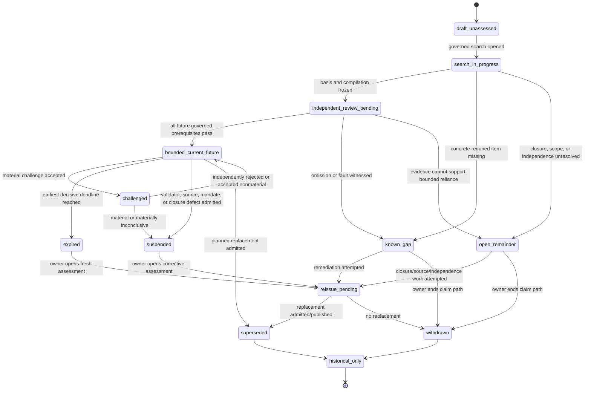

# INT-R1 — Artifact and State-Machine Sketch

## 1. Standing after independent audit

The types below are **research sketches**. They make semantics concrete enough to review and hand
off, but establish no canonical owner, package, API, persistence format, generated client, or
authority grant.

The audit adds one decisive current-capability rule:

```text
At 978e6b958, PolicyOS cannot issue bounded_complete.
```

No admitted independent source-to-obligation checker/scorer, validator-governance producer,
coverage-envelope producer, or complete N9/N11/N12/claim bridge exists. S0-GAP-02 remains an
independent-oracle dependency. A producer-populated field that says “independent” is not evidence
of independence. `open_world_unresolved` is therefore the honest current steady state for an
attempted protected use, as Atlas DS17 also records
(`policy-engine/docs/plans/active/POLICYOS_ATLAS_SURFACE_IMPLEMENTATION_MASTER_PLAN.md:7`).

A future `bounded_complete` branch remains in the sketch only to specify the evidence and
fail-closed behavior a later governed capability would need. It is not reachable merely by
serializing these fields.

The sketch is constrained by existing repository law:

- one status lattice, no parallel authority universe
  (`policy-engine/docs/system-design-decisions/universal-policy-design-system-vision-and-organizing-rules.md:184-186`);
- fail closed for the affected authority-band action while candidate work may continue only under
  a declared limitation
  (`policy-engine/docs/system-design-decisions/stage0-custody-kernel-ratification.md:164-187`);
- no authority by observation, transport, projection, or passage alone
  (`policy-engine/docs/system-design-decisions/stage0-custody-kernel-ratification.md:43-116`);
- distinct source-effect, receipt, transaction, verification, admission, publication, and owner-
  reaction temporal roles
  (`policy-engine/docs/system-design-decisions/policy-design-custody-time-model.md:1-220`);
- candidate content cannot fill protected obligation-authority slots
  (`policy-engine/src/polisyos/runtime/quality/candidate_firewall.py:1-73`); and
- capability requires producer, persisted artifact/event, bridge, consumer, verification, and
  surface, not a schema alone (`AGENTS.md:68-96`).

## 2. Local semantic vocabulary

These literals are local explanatory notation, not a proposal for new canonical runtime enums.

```python
CoverageAssessment = Literal[
    "bounded_complete",       # future governed assessment only; currently unissuable
    "known_incomplete",
    "open_world_unresolved",
]

ClosurePremiseDisposition = Literal[
    "closed_by_competent_basis",
    "open_under_unseen_extension",
    "closure_not_established",
]

ChallengeDisposition = Literal[
    "rejected_out_of_scope",
    "rejected_not_supported",
    "duplicate_linked",
    "accepted_nonmaterial",
    "accepted_material",
    "inconclusive_material",
    "withdrawn_by_challenger",
]
```

A later implementation may reuse different existing vocabularies. The semantic distinctions are
load-bearing; spelling and serialization are not.

## 3. Typed sketch: `ObligationCoverageEnvelope`

```python
class ScopeDescriptor(TypedDict):
    scope_id: str
    jurisdiction_refs: tuple[str, ...]
    authority_context_refs: tuple[str, ...]
    policy_matter_ref: str | None
    policy_design_case_ref: str | None
    candidate_or_claim_ref: str
    protected_action: str
    purpose: str
    audience_classes: tuple[str, ...]
    policy_domain: str
    population_or_target_scope: str
    geographic_scope: str | None
    materiality_or_stakes_class: str
    source_effect_cutoff: str | None
    source_publication_cutoff: str | None
    observation_cutoff: str | None
    knowledge_transaction_cutoff: str
    admission_cutoff: str
    publication_cutoff: str | None
    declared_scope_limitations: tuple[str, ...]


class ClosurePremiseEvidence(TypedDict):
    disposition: ClosurePremiseDisposition
    assertion_ref: str | None
    assertion_content_hash: str | None
    competent_owner_ref: str | None
    owner_mandate_ref: str | None
    competence_verification_ref: str | None
    exact_authority_scope: str | None
    exact_purpose_and_audience_scope: str | None
    effective_interval: str | None
    exhaustive_register_or_rule_ref: str | None
    source_hierarchy_or_closure_semantics_ref: str | None
    exception_and_conflict_rule_refs: tuple[str, ...]
    change_and_successor_rule_ref: str | None
    challenge_route_ref: str
    limitations: tuple[str, ...]


class SourceSearchEntry(TypedDict):
    entry_id: str
    source_family: str
    source_ref: str
    source_owner_ref: str | None
    source_authority_kind: str
    competence_assertion_ref: str | None
    competence_verification_ref: str | None
    required_for_scope: bool
    search_or_query_method: str
    query_or_filter_hash: str
    index_or_registry_version: str | None
    immutable_snapshot_ref: str | None
    immutable_snapshot_hash: str | None
    source_publication_or_version_time: str | None
    source_effect_time_range: str | None
    policyos_receipt_time: str
    transaction_visible_time: str
    verification_time: str | None
    purpose_scoped_admission_time: str | None
    availability: Literal["available", "partial", "unavailable", "unknown"]
    result_count: int | None
    result_set_hash: str | None
    unresolved_pagination_or_recall_limit: str | None
    freshness_rule_ref: str
    valid_until_or_review_due: str | None
    limitations: tuple[str, ...]


class DeclaredExclusion(TypedDict):
    exclusion_id: str
    excluded_source_or_obligation_family: str
    exclusion_kind: str
    rationale: str
    competent_authorizer_ref: str | None
    supporting_rule_ref: str | None
    materiality: Literal["nonmaterial", "material", "unknown"]
    affected_protected_actions: tuple[str, ...]
    effective_time: str | None
    review_due_or_expiry: str | None
    challengeable: bool


class UnknownRemainder(TypedDict):
    remainder_id: str
    category: str
    reason_unknown: str
    known_search_boundary: str
    possible_materiality: Literal["nonmaterial", "material", "unknown"]
    affected_scope_refs: tuple[str, ...]
    affected_protected_actions: tuple[str, ...]
    acquisition_or_consultation_plan_ref: str | None
    challenger_route_ref: str
    public_disclosure_text: str
    cardinality_claim: Literal["not_estimated"]
    probability_claim: Literal["not_calibrated"]


class ObligationCompilationBinding(TypedDict):
    obligation_language_ref: str
    obligation_language_version: str
    compiler_ref: str
    compiler_version: str
    compiler_content_hash: str
    compiler_rule_set_hash: str
    declared_classification_vocabulary_ref: str
    declared_classification_vocabulary_version: str
    compiled_obligation_count: int
    compiled_obligation_set_ref: str
    compiled_obligation_set_hash: str
    source_to_obligation_derivation_ref: str
    traversal_receipt_ref: str
    internal_denominator_totality_receipt_ref: str

    # Research requirement needed for OM-01, not a current field or frozen schema.
    pre_aggregation_instance_set_ref: str | None
    pre_aggregation_instance_set_hash: str | None
    instance_identity_rule_ref: str | None
    instance_to_class_aggregation_rule_ref: str | None


class IndependenceEvidence(TypedDict):
    organizational_evidence_ref: str | None
    implementation_evidence_ref: str | None
    source_or_data_evidence_ref: str | None
    oracle_evidence_ref: str | None
    economic_or_incentive_conflict_ref: str | None
    temporal_independence_evidence_ref: str | None
    shared_component_refs: tuple[str, ...]
    residual_common_mode_risks: tuple[str, ...]
    conflict_disposition_ref: str | None


class IndependentCoverageReview(TypedDict):
    review_ref: str
    reviewer_or_validator_ref: str
    independence_evidence: IndependenceEvidence
    review_scope_hash: str
    source_reperformance_receipt_ref: str | None
    compiler_reperformance_receipt_ref: str | None
    validator_reperformance_receipt_refs: tuple[str, ...]
    validator_governance_record_refs: tuple[str, ...]
    mutation_suite_receipt_ref: str | None
    metamorphic_suite_receipt_ref: str | None
    independent_scorer_receipt_ref: str | None
    unresolved_defeaters: tuple[str, ...]
    review_conclusion: CoverageAssessment
    verification_time: str


class ObligationCoverageEnvelope(TypedDict):
    schema_name: Literal["ObligationCoverageEnvelope"]
    schema_version: str
    envelope_id: str
    envelope_content_hash: str
    created_by_producer_ref: str
    publisher_or_signer_ref: str | None
    authority_purpose: str
    audience_classes: tuple[str, ...]

    scope: ScopeDescriptor
    closure_premise: ClosurePremiseEvidence
    closure_basis_content_hash: str
    searched_sources: tuple[SourceSearchEntry, ...]
    required_source_family_manifest_ref: str
    required_source_family_manifest_hash: str
    exclusions: tuple[DeclaredExclusion, ...]
    unknown_remainder: tuple[UnknownRemainder, ...]

    compilation: ObligationCompilationBinding
    independent_review: IndependentCoverageReview | None
    coverage_assessment: CoverageAssessment
    assessment_reason_codes: tuple[str, ...]
    known_material_defeater_refs: tuple[str, ...]
    unresolved_conflict_refs: tuple[str, ...]

    source_occurrence_or_effect_times: tuple[str, ...]
    policyos_receipt_time: str
    transaction_visible_time: str
    verification_time: str | None
    purpose_scoped_admission_time: str | None
    policyos_publication_time: str | None
    review_due_time: str
    expires_at: str
    expiry_rule_ref: str
    epoch_or_decision_context_ref: str

    validator_governance_record_refs: tuple[str, ...]
    assurance_case_ref: str | None
    confidence_ledger_root_or_receipt_ref: str | None
    promotion_receipt_ref: str | None

    supersedes_envelope_ref: str | None
    superseded_by_envelope_ref: str | None
    active_challenge_refs: tuple[str, ...]
    perturbation_event_refs: tuple[str, ...]
    withdrawal_or_suspension_event_refs: tuple[str, ...]

    public_rider: str
    public_summary_ref: str | None
    machine_projection_ref: str | None
    challenge_route_ref: str

    authoritative_for: tuple[str, ...]
    may_not_use_for: tuple[str, ...]
    research_only: bool
```

### 3.1 Required semantics

Populated fields do not establish validity. A later governed contract would need at least:

1. `envelope_content_hash` binds every semantic field and immutable receipt required to reproduce
   the result.
2. Every required source family is searched and verified or represented as a material
   unavailable/excluded item. Absence never defaults to not applicable.
3. One per-scope closure disposition is present and evidence-bound.
4. `closed_by_competent_basis` requires competent owner/mandate, exact scope/purpose/interval,
   closure semantics, exception/conflict/change rules, currentness, and challenge route.
5. `open_under_unseen_extension` and `closure_not_established` retain explicit remainder and block
   affected protected use.
6. A future `bounded_complete` requires the conditional theorem's mechanical conditions **and**
   separately admitted evidence for compiler/validator assumptions, actual independence,
   no-known-material-defeater, currentness, and projection integrity.
7. At the pinned repository that precondition set cannot be met; attempted positive issuance is
   invalid and must resolve to `open_world_unresolved`.
8. `governed_stopping_rule`-style diligence, if represented by a later schema, never becomes a
   world-closure assertion by itself.
9. `unknown_remainder.cardinality_claim` and `.probability_claim` prohibit invented counts or
   probabilities at the current evidence state.
10. Unresolvable hashes, owners, rules, compilers, validators, independence evidence, or review
    receipts are blockers, not warning-only passes.
11. Expiry or an admitted material perturbation invalidates current usability without modifying
    historical bytes.
12. `public_rider` is mandatory for any future positive relative assessment.
13. The envelope never sets `promoted`; N9/canonical claim owners consume it as one input.
14. `pre_aggregation_instance_*` fields are a research requirement only. Current absence is
    GY-GAP1; this sketch does not freeze their representation.

### 3.2 Authority declaration

A future admitted envelope may be authoritative only for what PolicyOS searched/received,
which snapshots/rules/compiler/validators it used, the declared closure-premise evidence, what it
compiled and checked, exclusions/remainder, independent-evidence standing, lifecycle standing,
and PolicyOS's own publication/correction history.

It may not establish legal compliance, prove no external obligation exists, prove an external
institution performed its function, authorize external administration, support an unconditional
δ claim, auto-promote, or establish that the coarse class vocabulary is universal.

## 4. Typed sketch: `ValidatorGovernanceRecord`

```python
class ValidatorChangeRule(TypedDict):
    change_process_ref: str
    proposal_owner_ref: str
    required_reviewers: tuple[str, ...]
    independent_approver_ref: str | None
    compatibility_rule_ref: str
    migration_or_reissue_trigger_ref: str
    emergency_change_rule_ref: str
    rollback_rule_ref: str
    public_change_notice_rule_ref: str


class ValidatorTestEvidence(TypedDict):
    test_plan_ref: str
    test_plan_hash: str
    independent_oracle_ref: str | None
    oracle_independence_evidence_ref: str | None
    mutation_operator_manifest_ref: str
    mutation_operator_manifest_hash: str
    mutation_receipt_ref: str | None
    metamorphic_law_manifest_ref: str
    metamorphic_law_manifest_hash: str
    metamorphic_receipt_ref: str | None
    negative_fixture_manifest_ref: str
    differential_or_reperformance_receipt_ref: str | None
    unresolved_equivalent_mutant_refs: tuple[str, ...]
    surviving_material_mutant_refs: tuple[str, ...]
    benchmark_status: Literal["passed", "failed", "not_run", "invalid"]


class ValidatorGovernanceRecord(TypedDict):
    schema_name: Literal["ValidatorGovernanceRecord"]
    schema_version: str
    governance_record_id: str
    governance_record_content_hash: str
    authority_purpose: str
    audience_classes: tuple[str, ...]

    obligation_language_ref: str
    obligation_language_version: str
    governed_obligation_families: tuple[str, ...]
    actual_source_of_truth_refs: tuple[str, ...]
    actual_source_of_truth_hashes: tuple[str, ...]

    rule_owner_ref: str
    compiler_owner_ref: str
    validator_owner_ref: str
    independent_checker_owner_ref: str | None
    change_approver_ref: str
    incident_response_owner_ref: str
    independence_evidence: IndependenceEvidence

    rule_ref: str
    rule_version: str
    rule_content_hash: str
    compiler_ref: str
    compiler_version: str
    compiler_content_hash: str
    validator_ref: str
    validator_version: str
    validator_content_hash: str
    independent_checker_ref: str | None
    independent_checker_version: str | None
    independent_checker_content_hash: str | None

    typed_exemptions: tuple[str, ...]
    exemption_justification_refs: tuple[str, ...]
    prohibited_string_or_default_loopholes: tuple[str, ...]
    change_rule: ValidatorChangeRule
    test_evidence: ValidatorTestEvidence

    known_incident_or_defect_refs: tuple[str, ...]
    unresolved_common_mode_risks: tuple[str, ...]
    open_challenge_refs: tuple[str, ...]

    policyos_receipt_time: str
    verification_time: str | None
    purpose_scoped_admission_time: str | None
    valid_from: str
    review_due_time: str
    valid_until: str
    supersedes_record_ref: str | None
    superseded_by_record_ref: str | None

    governance_assessment: Literal[
        "current",
        "known_unsound",
        "independence_unresolved",
        "expired",
        "suspended",
        "superseded",
    ]
    assessment_reason_codes: tuple[str, ...]

    authoritative_for: tuple[str, ...]
    may_not_use_for: tuple[str, ...]
    research_only: bool
```

### 4.1 Independence is evidence, not vocabulary

Independence is not achieved because fields are nonempty. A later admission mechanism must verify:

- the reviewer/checker is sufficiently separate from the result owner for the stakes;
- the independent path does not invoke the same mutated parser/compiler/validator;
- source-to-obligation coverage is reperformed from immutable sources, not producer output;
- expected outcomes are frozen outside the implementation under test;
- shared indexes, ontologies, rule libraries, code generators, and data are disclosed;
- incentive conflicts are disclosed and dispositioned; and
- a prior review is invalidated by relevant source/rule/code changes.

Perfect independence may be unavailable. The honest result is then
`independence_unresolved`, feeding `open_world_unresolved` or existing
`scope_insufficient`/`unknown`. No exception may be self-attested.

### 4.2 Current repository standing

At the pinned repository, `independent_checker_ref`, oracle evidence, scorer receipt, and the
complete governance producer are not available. S0-GAP-02 is a dependency, not a permissible
placeholder string. Consequently no current `ValidatorGovernanceRecord` can support
`bounded_complete`.

## 5. Challenger and perturbation records

### 5.1 `ObligationChallengeRecord`

```python
class ObligationChallengeRecord(TypedDict):
    schema_name: Literal["ObligationChallengeRecord"]
    schema_version: str
    challenge_id: str
    challenge_content_hash: str

    challenger_ref: str | None
    challenger_audience_or_standing: str
    protected_identity_or_confidentiality_ref: str | None
    received_via_route_ref: str
    policyos_receipt_time: str
    transaction_visible_time: str

    affected_envelope_refs: tuple[str, ...]
    affected_claim_or_action_refs: tuple[str, ...]
    alleged_obligation_text_or_ref: str
    alleged_obligation_source_refs: tuple[str, ...]
    alleged_source_effect_time: str | None
    alleged_materiality: str
    supplied_evidence_refs: tuple[str, ...]
    supplied_evidence_hashes: tuple[str, ...]

    triage_owner_ref: str
    triage_time: str | None
    accepted_for_independent_review: bool | None
    triage_reason_codes: tuple[str, ...]
    independent_reviewer_ref: str | None
    reviewer_independence_evidence_ref: str | None
    verification_time: str | None

    disposition: ChallengeDisposition | None
    disposition_reason: str | None
    materiality_to_existing_claim: Literal["material", "nonmaterial", "unknown"] | None
    coverage_assessment_effect: CoverageAssessment | None
    recommended_claim_reaction: str | None
    canonical_claim_owner_decision_ref: str | None

    perturbation_event_ref: str | None
    reissue_or_supersession_ref: str | None
    public_notice_ref: str | None

    authoritative_for: tuple[str, ...]
    may_not_use_for: tuple[str, ...]
    research_only: bool
```

The challenge record is authoritative only for receipt, triage, evidence, review, disposition,
and recorded PolicyOS reaction. It is not proof that the allegation is legally correct. A
recommendation cannot mint the lifecycle action.

### 5.2 `CoveragePerturbationEvent`

```python
class CoveragePerturbationEvent(TypedDict):
    schema_name: Literal["CoveragePerturbationEvent"]
    schema_version: str
    event_id: str
    event_content_hash: str
    event_kind: Literal[
        "missed_obligation_discovered",
        "validator_unsound",
        "source_competence_withdrawn",
        "source_revision_or_repeal",
        "scope_expanded",
        "material_conflict_discovered",
        "closure_premise_invalidated",
        "coverage_ttl_expired",
    ]
    source_record_refs: tuple[str, ...]
    affected_envelope_refs: tuple[str, ...]
    affected_claim_or_action_refs: tuple[str, ...]
    source_occurrence_or_effect_time: str | None
    policyos_receipt_time: str
    verification_time: str | None
    purpose_scoped_admission_time: str | None
    canonical_claim_owner_ref: str
    current_authority_effect_ref: str | None
    revalidation_or_reissue_required: bool
    public_notice_required: bool
    reason_codes: tuple[str, ...]
    superseding_event_ref: str | None
    authoritative_for: tuple[str, ...]
    may_not_use_for: tuple[str, ...]
    research_only: bool
```

Transporting the event does not itself withdraw a claim. The canonical claim owner makes the
current-use decision.

## 6. Coverage evidence into the one existing lattice

The three coverage labels are evidence assessments, not substantive obligation outcomes or a
parallel promotion state.

```text
coverage_effect(envelope, affected_action):

  if envelope is missing, unresolved, unverified, expired, suspended, or hash-invalid:
      return existing SCOPE_INSUFFICIENT or UNKNOWN

  if coverage_assessment == open_world_unresolved:
      return existing SCOPE_INSUFFICIENT when a required source/scope/owner is absent
      else existing UNKNOWN

  if coverage_assessment == known_incomplete:
      if an accepted missed obligation is decisively violated:
          return existing FAILED
      if required evidence/owner/scope is missing:
          return existing SCOPE_INSUFFICIENT
      else:
          return existing UNKNOWN

  if coverage_assessment == bounded_complete and all future governed prerequisites are admitted:
      return absence_of_additional_coverage_blocker
      # Not SATISFIED. Not a persisted status. Not promotion.
```

### 6.1 `NO_COVERAGE_BLOCKER` anti-laundering rule

Earlier pseudocode used `NO_COVERAGE_BLOCKER`. That token has **no canonical or persisted
standing**. It is only prose shorthand for “coverage introduced no additional blocker for this
exact scope after all other prerequisites were independently admitted.” It must never be:

- persisted as a status;
- exported in a wire/API schema;
- ordered in a lattice;
- rendered as a public state;
- counted as obligation satisfaction; or
- consumed as an automatic promotion signal.

A later implementation should express the same logic through the absence of a coverage-specific
refusal while the existing substantive lattice and canonical promotion owner remain decisive.

### 6.2 Composition rules

1. Future `bounded_complete` never upgrades a failed, unknown, scope-insufficient, stale,
   contradictory, revoked, unverified, or suspended substantive obligation.
2. `known_incomplete` maps according to the witness; it is not automatically one status.
3. `open_world_unresolved` cannot be hidden behind a green aggregate.
4. Mixed scopes are decomposed; a narrow envelope cannot cover a wider jurisdiction/population/
   purpose/audience/time.
5. Candidate-band work may proceed only while the limitation remains attached and protected slots
   remain unfilled.
6. Current repository attempts cannot enter the positive branch; independence/capability is
   missing.
7. Final promotion and lifecycle reaction remain with existing canonical owners.

## 7. Lifecycle state machine

The state machine is a projection over immutable artifacts/events, not the authority-status
lattice.



`bounded_current_future` is intentionally named as a future governed state. It is unreachable in
the current repository because independent producers/scoring and the complete bridge are missing.
Current attempted protected use enters `open_remainder`/`open_world_unresolved`.

### 7.1 State semantics

| State | Entry condition | Transition owner | Clock/trigger | Protected-use effect | Public meaning |
| --- | --- | --- | --- | --- | --- |
| `draft_unassessed` | identity exists, no governed search | candidate/search owner | creation/transaction | no authority use | “Coverage not assessed.” |
| `search_in_progress` | source work underway | search producer | receipt/query/cutoff progress | no authority use | “Coverage review in progress.” |
| `independent_review_pending` | basis/compilation frozen | independent review owner | verification deadline | no authority use | “Independent evidence pending.” |
| `bounded_current_future` | future conditional theorem and admitted protocol pass | canonical consumer admits; publisher projects | verification/admission/publication/expiry | removes only additional coverage refusal | “Bounded relative to declared basis/language; outside obligations may exist.” |
| `known_gap` | concrete omission, missing required source, or fault | assessor records; claim owner reacts | verification/admission | existing failed/scope-insufficient/unknown | “A material coverage gap is known.” |
| `open_remainder` | closure/source/owner/independence materially unresolved | assessor records; claim owner reacts | verification/admission | existing scope-insufficient/unknown | “Coverage could not be bounded.” |
| `challenged` | material challenge accepted for independent review | triage then reviewer | receipt/review deadline | fail closed for affected scope | “Current claim under material challenge.” |
| `expired` | earliest decisive deadline reached | lifecycle owner; claim owner reacts | TTL/event | no current authority use | “Expired; historical until revalidated.” |
| `suspended` | material fault/challenge/closure invalidation admitted | canonical claim owner | admission of perturbation | current use stopped | “Suspended; cannot support affected action.” |
| `reissue_pending` | corrective assessment opened | canonical claim/coverage owner | new epoch/cutoffs | old record remains unusable | “Correction/reissue in progress.” |
| `superseded` | replacement admitted/published | canonical claim owner | lifecycle publication | old record historical only | “Replaced by newer record.” |
| `withdrawn` | owner ends claim without replacement | canonical claim owner | lifecycle action | no current support | “Withdrawn.” |
| `historical_only` | terminal projection | custody/publication owner | history query | replay only | “Historical, not current authority.” |

### 7.2 Terminality and reopening

For one immutable envelope, `superseded`, `withdrawn`, and `historical_only` are terminal. A
missed obligation, invalidated closure premise, or validator fault creates:

1. a new challenge/perturbation event;
2. a suspension/withdrawal action by the canonical owner; and
3. a new envelope in a new epoch if reissue is attempted.

The old record is never edited to imply the obligation was always checked.

## 8. TTL and event triggers

No universal duration is justified. A design pattern is:

```text
expires_at = earliest known decisive deadline among:
  source freshness/review;
  source authority or mandate validity;
  closure premise validity;
  compiler/rule version validity;
  validator-governance validity;
  independent-review/scorer validity;
  claim epoch;
  scope-specific legal/institutional trigger;
  maximum governed review interval.
```

This is engineering guidance, not a theorem. Unknown decisive deadlines do not justify a long
default. The assessment becomes unresolved/scope-insufficient. Revocation, repeal, retroactivity,
accepted challenge, source outage, owner succession, scope expansion, rule/code change, or
validator incident may suspend before calendar expiry. Non-expiry is never world-completeness
evidence.

## 9. Challenger protocol

### Step 1 — receive and preserve

Accept public, reviewer, expert, machine, internal-incident, and competent-owner routes. Record
submitted evidence, provenance, receipt/transaction time, affected scope, and confidentiality.
Transport grants no authority.

### Step 2 — triage without deciding merits

Triage duplicates, affected envelope/scope, minimum evidence integrity, abuse/security, and
potential materiality. The challenged producer may not unilaterally close a material merits
challenge.

### Step 3 — independent verification

Resolve/content-bind evidence; verify source competence and temporal applicability; reproduce the
old envelope at its cutoff; reperform source-to-obligation and validator properties through an
independent path; distinguish current from historical truth. Unresolvable evidence is unknown,
not false.

### Step 4 — disposition

- `rejected_out_of_scope`: preserve reason and route where possible;
- `rejected_not_supported`: preserve evidence and reasoning;
- `duplicate_linked`: link without hiding independent submissions;
- `accepted_nonmaterial`: retain and explain no protected effect;
- `accepted_material`: emit perturbation and require canonical reaction;
- `inconclusive_material`: fail closed pending resolution/reissue; or
- `withdrawn_by_challenger`: do not delete evidence already relevant to authority/safety review.

### Step 5 — canonical reaction

The canonical claim owner decides suspend, withdraw, refuse, revalidate, or reissue. The coverage
reviewer may recommend but cannot mint the lifecycle action. Atlas renders the result only.

### Step 6 — append-only public notice

Publish current standing, affected scope, reason class, and replacement link subject to lawful
redaction. Never silently edit the original coverage or δ receipt.

## 10. Rollback and reissue semantics

| Operation | PolicyOS boundary | Required semantics |
| --- | --- | --- |
| Stop using old envelope for protected action | **OWN** | immediate current-use suspension/withdrawal after admitted material perturbation |
| Correct PolicyOS public record | **OWN** | append notice, retain original, link replacement |
| Recompute/reissue PolicyOS claim/receipt | **OWN**, through existing owners | new epoch/cutoffs/basis/obligation set/validators/receipts |
| Reverse external legal/administrative/payment/service act | **OUT_OF_SCOPE** | send typed evidence to competent owner; PolicyOS does not execute reversal |

Historical arithmetic may remain correct for old `O0`; current authority use is nevertheless
rolled back because a maintained assumption failed or lost support.

## 11. Public projections

### 11.1 Current minimum

Because current `bounded_complete` is unavailable:

> **Coverage unresolved:** PolicyOS does not currently have an admitted independent
> source-to-obligation checker/scorer and complete governance/bridge needed to issue bounded
> coverage. This is not evidence that no obligation applies. The affected protected action is
> blocked or limited as shown. The declared sources, gaps, remainder, challenge route, and history
> remain available.

This is a steady-state refusal, not a loading indicator.

### 11.2 Future positive minimum

Only after governed capability exists:

> **Coverage:** bounded relative to the declared source basis, exact scope, obligation language,
> compiler/validator versions, and cutoff. Compiler completeness and validator soundness remain
> maintained assumptions supported by the linked evidence. Unknown obligations outside the
> declared basis may exist. Review expires [time]. [View closure disposition, sources,
> exclusions, remainder, challenge route, and history.]

The bare phrase “bounded complete” is prohibited on public surfaces.

### 11.3 Known gap

> **Coverage gap known:** at least one material obligation, required source, compiler property, or
> validator property is missing or defective. The affected action is not supported. Correction or
> reissue may be pending.

### 11.4 Challenge/suspension

> **Under material challenge / suspended:** new evidence may change the declared obligation set,
> closure premise, or validator standing. The prior record remains available for history but
> cannot currently support the affected action.

Every audience must preserve scope, relativity, currentness, assumptions, remainder, and
challenge standing. Compression cannot transform relative coverage into compliance or competence.

## 12. Reuse-first owner disposition

This sketch appoints no owner. The smallest later path is:

- PDC waist retains the coarse governed vocabulary and existing statuses;
- N9 remains the substantive obligation/promotion consumer and would require a future
  pre-aggregation instance bridge after GY-GAP1;
- N11 may bind admitted envelope/governance references without changing δ or adding a risk ledger;
- formal invariants and receipt validators may carry generic traversal/negative rules, but same-
  path recomputation is not independent;
- assurance case, evidence spine, and claim registry carry assumptions, provenance, limitations,
  blockers, and defeaters;
- acquisition planner/INT-R2 carry typed source/non-data gaps;
- N12/CTM and canonical claim owners manage expiry, perturbation, suspension, and reissue;
- S0-GAP-02 remains the independent oracle/scoring dependency; and
- Atlas DS12/DS17/DS18 render but never decide.

If consolidation finds no existing owner can produce a competent closure basis or independent
review, it must record that absence rather than let this sketch appoint a new authority service.
