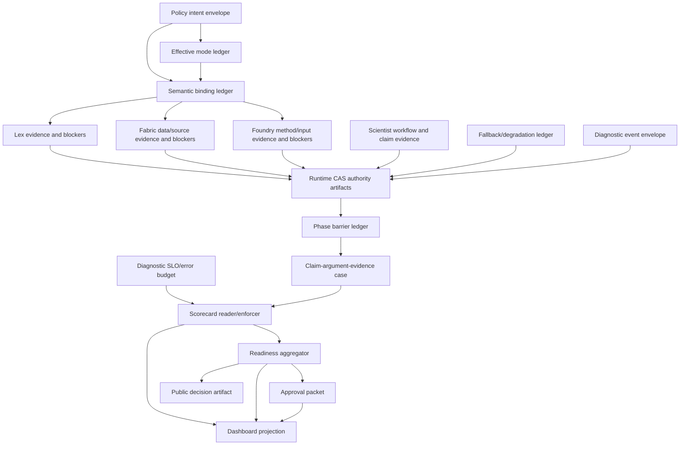

# PolicyOS Honest Diagnostics Substrate

## Status

Draft system design decision.

This document is not an implementation plan. It defines the system shape that
future remediation work must preserve. Concrete coding tasks should be derived
later in `docs/plans/`, and accepted irreversible choices should be promoted to
`docs/adr/`.

Accepted ADRs now carry the execution-grade decisions extracted from this
umbrella:

- [ADR-0147: Production Evidence Authority Ordering](../adr/0147-production-evidence-authority-ordering.md)
- [ADR-0148: Serious Run State Machine And Phase Barriers](../adr/0148-serious-run-state-machine-and-phase-barriers.md)
- [ADR-0149: Effective Mode And Fallback Degradation Ledger](../adr/0149-effective-mode-and-fallback-degradation-ledger.md)
- [ADR-0150: Scorecard, Readiness, Approval, And Projection Boundaries](../adr/0150-scorecard-readiness-approval-projection-boundaries.md)
- [ADR-0151: Evidence Schema Compatibility And Legacy Quarantine](../adr/0151-evidence-schema-compatibility-and-legacy-quarantine.md)
- [ADR-0152: Semantic Binding, Lineage, And Claim Evidence](../adr/0152-semantic-binding-lineage-and-claim-evidence.md)
- [ADR-0153: Diagnostic SLOs, Assurance Case, And Attestation](../adr/0153-diagnostic-slos-assurance-case-and-attestation.md)
- [ADR-0154: Diagnostic Event Envelope And Runtime Log Contract](../adr/0154-diagnostic-event-envelope-and-runtime-log-contract.md)
- [ADR-0155: Production Invariant Registry And Ownership Contract](../adr/0155-production-invariant-registry-and-ownership-contract.md)

## Problem

The production-quality diagnostics show a repeated structural failure: PolicyOS
has many capable subsystems, but the evidence chain does not yet have a single
honest substrate that can prove which component produced which authority, under
which mode, from which inputs, and with which fallback/degradation semantics.

As a result, downstream consumers can accidentally treat weak evidence as
strong evidence:

- canary bundle assembly can synthesize evidence after runtime failure;
- bundle-local refs can look like runtime-owned refs;
- fixture overlays can satisfy serious scorecard gates;
- scorecard readers can accept report presence/status without producer
  identity;
- dashboard and readiness surfaces can project approval-like states without
  clearly labeling authority;
- fallback paths can produce usable artifacts without a blocking degradation
  record;
- final policy artifacts can be compiled before all required legal, data,
  method, grounding, privacy, security, conflict, and ownership checks have
  passed or emitted typed blockers.

The defect is not that PolicyOS lacks validators. The deeper defect is that the
system lacks a shared authority substrate that makes diagnostic truth hard to
fake, hard to accidentally upgrade, and easy to explain.

## Non-Goals

This decision does not prescribe:

- the exact implementation sequence;
- concrete class/module names;
- migration scripts;
- UI layout;
- a specific storage engine;
- domain-specific Lex/Fabric/Foundry fixes;
- how to tune individual score thresholds.

Those are downstream design or implementation choices. This decision defines
the invariants they must satisfy.

## Core Decision

PolicyOS will treat diagnostics as an authority substrate, not as optional
observability.

Every serious policy run must produce a connected evidence authority graph that
answers five questions before scorecard, readiness, approval, dashboard, or
public decision artifacts can claim production-quality status:

1. Who owned this evidence?
2. What runtime event produced it?
3. What CAS artifact stores it?
4. What mode, fallback, inputs, schema, tenant, and time context shaped it?
5. Which downstream gate consumed it, and with what authority role?

If any answer is missing, ambiguous, projected, simulated, fixture-only,
fallback-derived, stale, schema-incompatible, or owner-conflicted, the system
must either record an explicit typed blocker or prove an allowed-profile policy
with a signed non-production-lowering exception.

## Core Non-Negotiable Invariants

Everything else in this document is subordinate to five invariants:

1. Authority-bearing evidence must have an evidence authority envelope.
2. Serious gates must enforce same-input closure across intent, run, tenant,
   time, production data, legal snapshot, method plan, model/provider mode, and
   fallback ledger.
3. Unknown, missing, disallowed, or contradictory provenance fails closed in
   serious profiles.
4. Mode divergence, fallback, degradation, simulation, fixture overlay, and
   projection must be ledgered before their outputs can be consumed.
5. Scorecards, readiness, approval, dashboards, and public artifacts may read
   and project authority, but they must not mint it.

If a future design conflicts with one of these invariants, the future design
must either be rejected or explicitly supersede this decision through an ADR.

## Design Principles

### Runtime Truth Before Bundle Truth

Runtime-owned CAS artifacts and runtime events are the primary authority.
Canary bundles may package, reference, summarize, and project runtime truth, but
they must not upgrade failed, missing, stale, fixture-only, simulated, or
fallback-derived runtime evidence into passing production evidence.

### Provenance Is A Gate, Not Decoration

Every evidence file and required ref must declare provenance. Unknown
provenance is not neutral. In serious profiles, unknown provenance is a
production blocker.

### Fallback Is Evidence

Fallbacks are not hidden implementation details. A fallback that affects
evidence, claims, scorecard, approval, readiness, or dashboard state is itself
evidence and must be represented as a typed degradation event.

### Projection Cannot Become Authority

Dashboards, readiness views, and convenience API projections may help operators
understand a run. They must label projection source and may not become the
source of truth for production approval.

### Absence Is Not Success

Report presence, unknown schema, missing status, `present`, `completed`, empty
warnings, or missing optional refs must not satisfy serious gates unless an
explicit authority contract says they can.

### Blockers Are First-Class

When a subsystem cannot produce valid evidence, the correct serious-run output
is a typed blocker, not a generic warning, skipped node, generic fallback, or
synthetic pass report.

### Diagnostics Have Their Own Reliability Target

The diagnostic substrate is itself a production system. It must have explicit
quality objectives: evidence completeness, trace continuity, provenance
coverage, blocker precision, blocker recall, detection time, stale-evidence
rate, and operator time-to-root-cause.

If diagnostic quality degrades, production-quality closeout must degrade too.

### Same-Input Closure

All evidence used for one serious decision must close over the same policy
intent envelope, run id, tenant, time context, production data manifest, legal
snapshot, method plan, model/provider mode, and fallback ledger.

Evidence from a different run, fixture, bundle overlay, stale manifest, or
dashboard projection can be useful context, but it cannot silently satisfy a
same-input production gate.

## External Design Anchors

This decision intentionally borrows from mature practices in adjacent fields:

| Practice | Lesson for PolicyOS |
|----------|---------------------|
| [W3C PROV-DM](https://www.w3.org/TR/prov-dm/) | Model evidence through entities, activities, agents, attribution, derivation, association, and delegation. PolicyOS evidence envelopes should be PROV-shaped even if stored as CAS JSON. |
| [W3C Trace Context](https://www.w3.org/TR/trace-context/) and [OpenTelemetry context propagation](https://opentelemetry.io/docs/concepts/signals/traces/) | Every runtime phase, artifact write, scorecard gate, and approval/readiness projection needs a propagated trace identity so logs, metrics, events, and CAS refs join into one causal flow. |
| [OpenTelemetry semantic conventions](https://opentelemetry.io/docs/specs/semconv/resource/) | Diagnostic records need stable producer/resource attributes: service, version, environment, SDK, deployment, runtime, and component identity. |
| [CloudEvents](https://github.com/cloudevents/spec/blob/main/cloudevents/spec.md) | Runtime evidence events need stable `source`, `id`, `type`, `time`, schema, subject, and extension semantics so retries and duplicates cannot create ambiguous authority. |
| [OpenLineage](https://github.com/OpenLineage/OpenLineage/blob/main/spec/OpenLineage.md) | Data and method pipelines should separate static job/dataset facets from run-changing input/output facets, and lineage should be additive over the run lifecycle. |
| [Great Expectations validation results](https://docs.greatexpectations.io/docs/0.18/reference/learn/terms/validation_result/) | Data-quality checks should produce reusable expectation suites, validation results, actions, and human-readable docs rather than ad hoc pass files. |
| [SLSA requirements](https://slsa.dev/spec/v0.1/requirements) and [in-toto](https://github.com/in-toto/specification/blob/master/in-toto-spec.md) | Evidence provenance should be service-generated, verifiable by consumers, tied to intended steps, and protected from tampering or unauthorized substitution. |
| [Google SRE monitoring](https://sre.google/sre-book/monitoring-distributed-systems/) and [SLO alerting](https://sre.google/workbook/alerting-on-slos/) | Alert on significant diagnostic failures with precision, recall, detection-time, and reset-time criteria; distinguish symptoms from causes across system layers. |
| [Google SRE postmortem culture](https://sre.google/sre-book/postmortem-culture/) | Significant diagnostic failures require root-cause records and preventive actions. A monitoring failure or manual discovery is itself an incident. |
| [NIST AI RMF 1.0](https://nvlpubs.nist.gov/nistpubs/ai/NIST.AI.100-1.pdf) | AI/policy systems need lifecycle risk management across govern, map, measure, and manage functions, with transparency, accountability, reliability, resilience, privacy, and fairness. |
| [NIST SP 800-160 Vol. 1 Rev. 1](https://csrc.nist.gov/pubs/sp/800/160/v1/r1/final) | Trustworthiness should be engineered across the system lifecycle, not added as end-stage inspection. |
| [CMU/SEI assurance case confidence](https://insights.sei.cmu.edu/documents/1222/2012_005_001_28161.pdf) | Production claims should be represented as structured claims, arguments, evidence, assumptions, and defeaters, not as flat report checklists. |
| [Open Policy Agent decision logs](https://www.openpolicyagent.org/docs/management-decision-logs) | Policy decisions need decision ids, trace ids, bundle revisions, metrics, timestamps, and redaction/masking controls. |
| [Lightweight technology governance](https://www.thoughtworks.com/insights/articles/lightweight-technology-governance) | Governance should become automated guardrails and runtime fitness functions, not committee-only review. |

## Authority Model

### Authority Surfaces

| Surface | Authority role | Serious-profile rule |
|---------|----------------|----------------------|
| Runtime event | Records that a producer executed or blocked | Required for authority-producing phases |
| Runtime CAS artifact | Stores authoritative evidence payload | Required for closeout evidence |
| Control progress | Runtime projection of current state | May reference authority; cannot replace missing CAS evidence |
| Canary bundle | Packaging and closeout evidence bundle | May package; cannot upgrade authority |
| Scorecard | Reader/enforcer over declared evidence | Must consume owner/provenance-typed refs |
| Readiness aggregator | Final closeout authority over evidence contract | Must fail closed on missing/invalid authority graph |
| Approval packet | Governed approval decision from persisted scorecard | Must verify scorecard identity and non-overridable blockers |
| Dashboard | Operator projection | Must label projection source and unresolved authority gaps |
| Public decision artifact | Published policy-facing artifact | Must only compile or publish after phase barriers pass or block |

### Authority Ordering

The authority order is:

1. Runtime producer event.
2. Runtime CAS artifact with producer, inputs, schema, tenant, mode, and
   governance metadata.
3. Runtime ref envelope in control progress.
4. Scorecard gate that verifies the ref and payload identity.
5. Readiness aggregator final closeout check.
6. Approval packet or public decision artifact.
7. Dashboard/readiness projection for operators.

Lower layers may reference higher-authority layers. Lower layers may not
override them.

## Evidence Classes

Not every file in a run has the same cost or authority. PolicyOS classifies
evidence before applying metadata, retention, redaction, and verification
rules.

| Class | Meaning | Serious-profile rule |
|-------|---------|----------------------|
| Authority-bearing | Evidence that can satisfy, block, approve, publish, or close a production gate | Requires envelope, provenance, CAS identity, owner, schema, same-input closure, and scorecard verification |
| Diagnostic-supporting | Evidence that explains why a gate passed, failed, degraded, or blocked | Requires trace/run binding and owner; cannot satisfy a gate by itself |
| Debug-only | Developer-local detail useful for investigation | Must not be consumed by scorecard/readiness/approval and must be clearly marked non-authoritative |
| Public-exported | Evidence or summaries intended for public/user-facing artifacts | Must derive from authority-bearing evidence and pass redaction/export controls |
| Redacted-derived | Evidence transformed for privacy/security/export | Must preserve enough structure to diagnose authority and must link to the pre-redaction authority ref |
| Legacy/quarantined | Historical, migrated, stale, or schema-incomplete evidence | Cannot satisfy serious gates unless a specific ADR/registry entry permits a bounded migration exception |

Design rule: "every evidence artifact must..." means every authority-bearing
artifact. Supporting and debug artifacts still need classification so they
cannot accidentally become authority.

## Serious Run State Machine

Serious runs advance through explicit authority states. A later state may not
be entered while an earlier required state is failed, missing, skipped without
a typed blocker, or satisfied only by disallowed fallback/projection evidence.

| State | Meaning | Exit condition |
|-------|---------|----------------|
| `initialized` | Run exists, but no authority-bearing inputs are bound | Policy intent, tenant, requested profile, run id, and time context are recorded |
| `intent_bound` | Canonical policy intent and same-input envelope exist | Legal, data, method, provider/mode, and production-data inputs are bound or blocked |
| `evidence_emitting` | Runtime producers are emitting authority-bearing events and CAS artifacts | Required producer phases emit pass evidence or typed blockers |
| `blocked` | A required invariant failed before scorecard readiness | Non-overridable blockers stop approval/publication; overridable blockers require signed exception policy |
| `ready_for_scorecard` | Required runtime authority graph is closed enough to score | Scorecard receives only permitted refs/classes/provenance from the same-input envelope |
| `scored` | Scorecard has verified ref identity and gate semantics | Readiness consumes persisted scorecard identity and authority graph |
| `readiness_closed` | Final closeout authority has accepted, rejected, or blocked the run | Approval/publication surfaces receive a closed readiness decision |
| `approved` | Governed approval is granted from persisted readiness/scorecard authority | Public/export/policy action may proceed within approved scope |
| `rejected` | Approval is denied or impossible | No publication or production action may claim approval |
| `published_blocked` | Public artifact was requested but blocked by phase, evidence, safety, or export constraints | Artifact remains draft or blocked with typed cause |

Design rule: draft decision packets may exist before `ready_for_scorecard`, but
publishable/final decision artifacts, production approval, and closeout pass
must not.

## Threat Model

The honest diagnostics substrate defends against accidental and adversarial
authority corruption.

| Actor or failure source | Risk | Required defense |
|-------------------------|------|------------------|
| Buggy runtime producer | Emits incomplete, stale, or schema-incompatible evidence | Envelope validation, producer-reader compatibility, typed blockers |
| Canary bundle assembler | Synthesizes or normalizes failed runtime evidence into pass evidence | Packaging-only authority, provenance class checks, ref identity verification |
| Test fixture or mock path | Satisfies serious gates without runtime ownership | Effective mode ledger, fixture provenance, negative controls |
| Stale cache or old bundle | Reuses evidence from a different run/time/input | Same-input closure, freshness, legal/data snapshot refs |
| Malicious or confused tenant | Attempts to read or satisfy gates with another tenant's artifact | Tenant/cell binding, CAS ownership checks, access controls |
| Operator override | Converts missing evidence into approved evidence | Override policy, non-overridable blockers, signed residual-risk acceptance |
| Compromised or misconfigured worker | Writes artifacts without intended producer identity | CAS/event reconciliation, signing/attestation where required |
| Dashboard/API projection | Presents projected readiness as authority | Projection labels, source-surface boundaries, packet identity checks |
| Schema migration or adapter drift | Drops authority fields while preserving pass-like shape | Schema compatibility, adapter-loss checks, legacy quarantine |
| Provider/model fallback | Produces simulated or degraded evidence as if live | Provider mode ledger, fallback/degradation ledger, allowed-profile policy |

Design rule: an authority design is incomplete until it states which of these
actors it trusts, rejects, quarantines, or records as residual risk.

## CAS/Event Reconciliation Semantics

Runtime event logs and CAS artifacts must agree before evidence can become
authority.

| Condition | Serious-profile interpretation |
|-----------|--------------------------------|
| Event exists, CAS artifact missing | Block with `authority_cas_missing`; event alone cannot satisfy evidence |
| CAS artifact exists, producer event missing | Quarantine as orphan artifact; cannot satisfy evidence until linked by recovery event |
| Envelope exists, payload hash mismatch | Block with `authority_payload_mismatch`; do not score the artifact |
| Ref points to bundle-local path when CAS ref is required | Block with `authority_ref_not_cas` |
| Duplicate event with same id and same payload hash | Treat as idempotent duplicate and record duplicate relation |
| Duplicate event with same id and different payload hash | Block with `authority_event_collision` |
| Replay reproduces same refs and payload hashes | Accept as deterministic replay evidence |
| Replay differs with typed drift explanation | Accept only if registry permits bounded drift for that gate |
| Replay differs without typed explanation | Block with `authority_replay_drift_unexplained` |
| CAS artifact tenant/cell conflicts with run tenant/cell | Block with `authority_tenant_conflict` |

Design rule: reconciliation failures must be visible before scorecard,
readiness, approval, or publication. They are not dashboard-only warnings.

## Coverage Review Against Current Backlog

The design covers the diagnosed substrate items A7-A28 directly, but a durable
architecture must also protect the domain-quality fixes A1-A6 from being
invisible after implementation.

Coverage by problem family:

| Backlog family | Covered by current substrate? | Additional design requirement |
|----------------|-------------------------------|-------------------------------|
| A1 Lex retrieval | Partial | Legal retrieval must emit candidate-norm events, legal snapshot refs, jurisdiction/time filters, no-norm-vs-error blockers, and final-claim norm binding. |
| A2/A3 Fabric semantic source and metric binding | Partial | Policy intent concepts must bind to dataset families, metrics, columns, units, geography, time, and rejected candidates through a semantic binding ledger. |
| A4 production bundle inspectability | Partial | Dataset bundles need OpenLineage-style facets, dictionaries, schema fingerprints, row groups, freshness, and inspectability blockers. |
| A5 Foundry method selection | Partial | Method choice must be tied to scenario method expectations, accepted/rejected methods, assumptions, power, sensitivity, and input coverage. |
| A6 final claim refs | Covered at high level | Each major claim still needs per-claim data, method, norm, uncertainty, feasibility, budget, stakeholder, implementation-risk, and residual-uncertainty refs or blockers. |
| A7-A18 runtime authority substrate | Strong | Needs concrete schemas, enforcement points, and negative tests before fix mode. |
| A19-A28 diagnostic honesty substrate | Strong | Needs externalized ADRs and machine-checkable fitness functions. |
| Open PDDs 037-041, 055-058, 064-065, 067, 069, 071-104 | Partial | Need recurring adversarial, cross-domain, partial-state, cache, human, UI, external dependency, archive, and strategic-behavior drills. |

Design rule: a domain fix is not real until its runtime-owned evidence crosses
the same substrate and fails the same spoofing, fallback, provenance,
phase-barrier, and scorecard identity checks as any other authority evidence.

## Adoption Tiers

The substrate is intentionally broad, but not every record enters the first
implementation slice.

| Tier | Scope | Records |
|------|-------|---------|
| Must-now substrate | Needed before domain fixes can be trusted | invariant registry, evidence authority envelope, effective mode ledger, fallback/degradation ledger, phase barrier ledger, diagnostic event envelope, CAS/event reconciliation |
| Next substrate | Needed to make Lex/Fabric/Foundry/final claims universally diagnosable | semantic binding ledger, data quality and lineage contract, operator diagnostic breadcrumb, scorecard/readiness/dashboard boundary checks |
| Assurance layer | Needed for long-horizon best-in-class governance | claim-argument-evidence case, diagnostic fitness registry, diagnostic SLO/error budget, diagnostic supply-chain attestation, redaction/privacy diagnostic safety |

Design rule: later-tier items are not optional in the architecture. They are
sequenced later so the first substrate slice can remain implementable.

## Required Substrate Records

### 1. Production Invariant Registry

Every Minimum Closeout Gate and PQL invariant must have one registry entry.

Conceptual fields:

- `invariant_id`
- `minimum_closeout_gate`
- `final_owner`
- `producer_owners`
- `runtime_event_names`
- `required_artifact_kinds`
- `required_ref_keys`
- `scorecard_gate_names`
- `readiness_check`
- `dashboard_projection_policy`
- `approval_policy`
- `override_policy`
- `conflict_policy`
- `failure_code`
- `diagnostic_owner`
- `next_diagnostic_command`

Design rule: no serious closeout gate may be enforced only by prose, path
presence, or test existence. It must be represented in the registry.

### 2. Evidence Authority Envelope

Every authority-bearing evidence artifact must be wrapped or accompanied by an
authority envelope.

Conceptual fields:

- `artifact_ref`
- `artifact_kind`
- `authority_role`
- `provenance_kind`
- `producer_component`
- `producer_version`
- `producer_owner`
- `run_id`
- `job_id`
- `tenant_id`
- `cell_id`
- `requested_execution_profile`
- `effective_execution_profile`
- `canary_kind`
- `input_refs`
- `schema_name`
- `schema_version`
- `generated_at`
- `as_of`
- `governance_classification`
- `fallback_event_refs`
- `degradation_event_refs`
- `validation_status`
- `blocking_status`

Suggested `provenance_kind` vocabulary:

- `runtime_emitted`
- `runtime_projection`
- `runtime_blocker`
- `bundle_packaged`
- `bundle_projection`
- `bundle_synthesized`
- `fixture_overlay`
- `simulated_provider`
- `operator_override`
- `manual_review`
- `external_import`
- `legacy_migration`

Design rule: serious scorecards may only treat `runtime_emitted` and
explicitly allowed `runtime_blocker` evidence as production authority unless a
registry entry declares a narrower exception.

### 3. Effective Mode Ledger

Every serious run and canary lane must emit a mode ledger.

Conceptual fields:

- requested and effective execution profile;
- canary kind and lane id;
- provider mode;
- model simulation mode;
- mock fallback allowed and used;
- fixture identity;
- data mode;
- production data root and manifest fingerprint;
- state-store backend;
- worker backend;
- local-control waiver;
- scorecard warn policy;
- evidence overlay mode;
- signed exception or quarantine status.

Design rule: governed, production, research closeout, approval, and
deterministic closeout must fail when requested mode, effective mode, provider
mode, canary kind, fixture identity, or overlay mode disagree without a typed
allowed-profile exception.

### 4. Fallback And Degradation Ledger

Every fallback/default/optional/simulation/projection that can affect evidence
must emit a ledger record.

Conceptual fields:

- `fallback_event_id`
- `component`
- `phase`
- `trigger`
- `primary_path`
- `fallback_path`
- `allowed_profiles`
- `actual_profile`
- `produced_artifacts`
- `affected_claims`
- `affected_gates`
- `severity`
- `degradation_kind`
- `downstream_impact`
- `override_policy`
- `blocking_status`
- `owner`
- `next_diagnostic_command`

Design rule: fallback-produced evidence cannot silently satisfy production
gates. It must either be explicitly allowed for the profile or produce a
blocking degradation record.

### 5. Phase Barrier Ledger

Every serious run must record phase readiness before authority advances.

Required barrier families:

- policy intent canonicalization;
- Lex legal/norm retrieval and conflict checks;
- Fabric source selection and data quality;
- Foundry method selection, input bindings, and method quality;
- Scientist workflow, skipped-node, and claim ledgers;
- grounding and citation faithfulness;
- privacy, security, licensing, retention, and export compliance;
- tenant ownership and CAS governance;
- replay/resilience/performance readiness;
- human review and approval readiness;
- final decision/public artifact compilation.

Design rule: a downstream authority surface cannot be produced or accepted when
an upstream required barrier is missing, failed, skipped without typed blocker,
or produced from disallowed fallback evidence.

### 6. Operator Diagnostic Breadcrumb

Every failed, blocked, degraded, stale, skipped, or disputed gate must provide
an operator breadcrumb.

Conceptual fields:

- owner;
- component;
- phase;
- upstream cause;
- missing input;
- produced blocker ref;
- affected downstream gates;
- affected public claims;
- next diagnostic command;
- whether retry can help;
- whether human review can override;
- whether production approval is categorically forbidden.

Design rule: an engineer should be able to locate the first meaningful cause of
a bad serious run from the evidence bundle without reading unrelated code.

### 7. Semantic Binding Ledger

Every serious run must show how the policy intent became legal, data, method,
and claim bindings.

Conceptual fields:

- `binding_ledger_ref`
- `policy_intent_ref`
- `canonical_concepts`
- `jurisdiction`
- `as_of`
- `policy_domain`
- `population`
- `intervention`
- `outcomes`
- `time_horizon`
- `legal_query_refs`
- `candidate_norm_refs`
- `selected_norm_refs`
- `rejected_norm_refs`
- `dataset_query_refs`
- `candidate_dataset_refs`
- `selected_dataset_refs`
- `rejected_dataset_refs`
- `metric_bindings`
- `column_bindings`
- `unit_bindings`
- `geography_bindings`
- `method_expectation_refs`
- `selected_method_refs`
- `rejected_method_refs`
- `claim_binding_refs`
- `binding_failures`

Design rule: a serious run cannot collapse a domain-specific intent into a
generic metric, generic dataset, generic method, or no-norm decision without a
typed blocker explaining exactly where semantic binding failed.

### 8. Claim-Argument-Evidence Case

Every production-quality decision should produce an assurance-case view over
the evidence graph.

Conceptual fields:

- `top_level_claim`
- `subclaims`
- `argument_strategy`
- `evidence_refs`
- `assumption_refs`
- `context_refs`
- `defeater_refs`
- `residual_uncertainty`
- `confidence_limits`
- `non_overridable_blockers`
- `reviewer_attribution`

Design rule: scorecard `pass` is not only a checklist result. It must be
explainable as a structured claim-argument-evidence case where each major
decision claim is supported, blocked, or explicitly out of scope.

### 9. Diagnostic Event Envelope

Runtime diagnostic events should use a stable event envelope.

Conceptual fields:

- `event_id`
- `event_source`
- `event_type`
- `event_time`
- `event_subject`
- `schema_name`
- `schema_version`
- `trace_id`
- `span_id`
- `parent_span_id`
- `run_id`
- `job_id`
- `tenant_id`
- `producer_component`
- `producer_version`
- `payload_ref`
- `redaction_policy_ref`
- `duplicate_of`

Design rule: event identity must make retries, duplicated outbox events,
lease-takeover events, and partial-state recovery unambiguous. Serious-run
diagnostic events must not be sampled away.

### 10. Data Quality And Lineage Contract

Every data-bearing path must produce both lineage and validation results.

Conceptual fields:

- `lineage_run_id`
- `job_namespace`
- `job_name`
- `input_dataset_facets`
- `output_dataset_facets`
- `input_partition_facets`
- `schema_facets`
- `quality_expectation_suite_ref`
- `validation_result_ref`
- `validation_action_refs`
- `freshness`
- `coverage`
- `missingness`
- `drift`
- `leakage`
- `unit`
- `recency`
- `label`
- `construct_validity`

Design rule: a data source can be present and still not be decision-authorized.
Lineage and validation must both pass, or produce a typed blocker.

### 11. Diagnostic Supply-Chain Attestation

Evidence-generating steps must be attestable.

Conceptual fields:

- `attestation_ref`
- `step_name`
- `expected_materials`
- `observed_materials`
- `expected_products`
- `observed_products`
- `functionary`
- `producer_key_ref`
- `signature_ref`
- `environment_identity`
- `isolation_status`
- `service_generated`
- `consumer_verified`
- `tamper_check_status`

Design rule: an evidence artifact is not production authority unless consumers
can verify that the intended producer generated it from the intended materials
inside an allowed environment.

### 12. Diagnostic Fitness Function Registry

The substrate itself must be guarded by continuously running architecture
fitness functions.

Conceptual fields:

- `fitness_function_id`
- `invariant_ids`
- `owner`
- `trigger`
- `input_scenario`
- `positive_controls`
- `negative_controls`
- `mutation_tests`
- `spoofing_tests`
- `metamorphic_tests`
- `expected_failure_code`
- `required_artifacts`
- `last_passed_at`
- `staleness_policy`

Design rule: every known self-deception failure mode must have at least one
negative control that proves the system fails before closeout.

### 13. Diagnostic SLO And Error Budget

The diagnostic substrate needs measurable reliability.

Candidate diagnostic SLIs:

- percentage of serious runs with complete authority graph;
- percentage of required runtime refs verified against CAS identity;
- percentage of serious gates with owner and next diagnostic command;
- trace continuity across runtime, CAS, bundle, scorecard, readiness, approval,
  and dashboard;
- provenance coverage by file and ref;
- fallback/degradation ledger coverage;
- operator time-to-root-cause on failed serious runs;
- stale evidence rate;
- false-pass rate from negative controls;
- false-block rate from positive controls;
- diagnostic-event redaction coverage.

Design rule: if diagnostic SLOs burn budget, production closeout must be
quarantined or downgraded until diagnostic trust is restored.

### 14. Redaction, Privacy, And Diagnostic Safety Contract

Diagnostics must be useful without leaking secrets, hidden benchmark answers,
provider credentials, sensitive legal/workflow payloads, or unsafe public data.

Conceptual fields:

- `redaction_policy_ref`
- `redaction_result_ref`
- `erased_paths`
- `upserted_redactions`
- `public_export_classification`
- `secret_scan_ref`
- `hidden_answer_scan_ref`
- `privacy_basis_ref`
- `retention_policy_ref`
- `jurisdiction_policy_ref`

Design rule: diagnostic completeness is not allowed to bypass privacy,
security, licensing, retention, jurisdiction, or public-export controls. A
redacted artifact must preserve enough semantic structure to diagnose authority
without exposing protected content.

## Anti-Self-Deception Failure Modes

The substrate must continuously test for these failure modes:

- authority laundering: weak evidence is repackaged as runtime authority;
- bundle upgrade: a failed runtime is converted into passing bundle evidence;
- fixture theater: fixture or simulated evidence satisfies serious gates;
- projection drift: dashboard/readiness state exceeds packet truth;
- schema optimism: unknown or partial schemas default to pass;
- fallback invisibility: default/fallback paths produce usable evidence without
  degradation records;
- semantic collapse: domain-specific policy intent becomes generic metrics,
  generic datasets, generic methods, or no legal norms;
- ref ambiguity: bundle paths and CAS refs share the same authority slot;
- cross-run contamination: evidence from one run satisfies another run;
- cross-tenant contamination: shared CAS artifacts leak or satisfy another
  tenant's gates;
- stale authority: old legal/data/model artifacts are accepted as current;
- manual gate invisibility: human approval, overrides, or review burden are not
  represented in runtime evidence;
- redaction overreach: public artifacts remove facts needed to diagnose claim
  support;
- redaction underreach: diagnostics expose secrets, hidden answers, or
  sensitive inputs;
- negative-control blindness: known-bad scenarios are not run or are allowed to
  pass;
- sampling blindness: serious-run trace spans or diagnostic events are sampled
  away;
- action-item decay: postmortem/diagnostic findings do not become executable
  gates or owned backlog items.

Design rule: any failure mode observed once becomes a permanent diagnostic
fitness function until the team explicitly retires it through an ADR.

## Scorecard Semantics

The scorecard is a reader and enforcer, not a producer of authority.

Scorecard gates must verify:

- required evidence exists;
- required refs point to CAS artifacts when authority requires CAS;
- ref payload identity matches the bundle report being scored;
- producer and owner match the invariant registry;
- provenance kind is allowed for the profile and gate;
- fallback/degradation ledger entries are either allowed or blocking;
- schema producer/reader compatibility is declared;
- phase barriers precede final/public/approval artifacts;
- serious warnings are not silently approval-ready;
- semantic bindings match the final claims being scored;
- diagnostic SLOs are within budget for serious closeout;
- redaction did not remove required diagnostic semantics;
- required negative controls still fail for the expected reason.

Forbidden serious-profile interpretations:

- missing `status` means pass;
- `present` means pass;
- completed run means missing workflow report passed;
- optional runtime ref means non-blocking unless registry permits it;
- bundle-local `quality_evidence/*.json` path means runtime ref;
- fixture overlay means runtime evidence;
- simulated provider preflight means live provider readiness;
- dashboard projection means approval packet truth;
- data presence means data relevance;
- model output means grounded claim;
- no-norm retrieval result means no applicable law;
- no data result means no data is required;
- redacted evidence means evidence was verified before redaction.

## Approval Semantics

Approval must consume a persisted scorecard identity, not an inline or projected
truth surface.

Approval may support signed overrides, but some blockers are non-overridable in
serious profiles:

- missing runtime authority for required evidence;
- disallowed fallback-produced evidence;
- fixture-only production evidence;
- simulated provider evidence in a live-required lane;
- cross-tenant artifact ownership conflicts;
- missing legal conflict blocker;
- public artifact compiled before required barriers;
- secret, hidden-answer, unsafe rendering, or path-traversal exposure;
- unverifiable scorecard ref identity.

Design rule: override can accept residual policy risk, but cannot turn missing
authority into authority.

## Dashboard And Readiness Semantics

Dashboard and readiness surfaces should be useful, but they must be honest
about projection.

Required projection labels:

- source surface: scorecard, control progress, approval packet, bundle,
  dashboard local state, or API fallback;
- authority level: authoritative, packaged, projected, simulated, fixture,
  stale, disputed, or blocked;
- first blocking cause;
- upstream owner;
- next diagnostic command.

Design rule: operator UI may summarize complex evidence, but it must not hide
the difference between "approved", "approval-ready by projected scorecard",
"blocked with override possible", and "non-overridable authority gap".

## Continuous Learning Loop

Every serious diagnostic failure should create or update one of:

- a typed blocker;
- a registry invariant;
- a fitness function;
- a negative fixture;
- a dashboard/readiness projection rule;
- an ADR candidate;
- a domain binding contract;
- a runbook entry.

The learning loop is closed only when the new artifact is machine-checkable.
Postmortem prose without a future failing check is not sufficient.

## Canonical Evidence Flow

## Relationship To Current Diagnostics

This design decision consolidates the substrate implications of:

- A7/PDD-035: continuous governance needs runtime-owned evidence.
- A8-A10/PDD-036: runtime failure cannot be upgraded by bundle assembly.
- A11/PDD-027: scorecard refs need an authenticity contract.
- A12/PDD-009: runtime report truth must survive bundle normalization.
- A13/PDD-026: per-file provenance is mandatory.
- A14/PDD-013: validator authority conflicts need a precedence contract.
- A15/PDD-016: recursive payload spelunking must be replaced with typed
  envelopes.
- A16/PDD-066: phase barriers must block premature authority.
- A17/PDD-012: skipped Scientist nodes need typed blocker semantics.
- A18/PDD-054: prompt/tool/parser authority must be durable.
- A19/PDD-021: authority decisions need ADR-level source-of-truth.
- A20/PDD-015: architecture boundaries need an explicit evidence authority
  contract.
- A21/PDD-020: architecture fitness gates should fail before expensive e2e
  canaries.
- A22/PDD-053: producer-reader schema compatibility is required.
- A23/PDD-059: adapters must preserve semantics across boundaries.
- A24/PDD-060: source-of-truth conflicts need an authority lattice.
- A25/PDD-068: proof harness must distinguish runtime-owned evidence from
  fixture/test theater.
- A26/PDD-070: invariants need final owners and enforcement points.
- A27/PDD-061: effective mode must be ledgered and fail-closed.
- A28/PDD-063: fallback/degradation must be ledgered and fail-closed.

Additional backlog coverage:

- A1/PDD-001/PDD-043: legal retrieval needs candidate norm events and legal
  snapshot authority.
- A2-A4/PDD-002/PDD-003/PDD-008/PDD-011/PDD-014/PDD-042: production data
  needs semantic binding, lineage, inspectability, and dataset-facet evidence.
- A5/PDD-004: Foundry method selection needs selected/rejected method evidence
  tied to scenario expectations.
- A6/PDD-005/PDD-044/PDD-052: final claims need per-claim evidence refs or
  typed blockers.
- PDD-037/PDD-038/PDD-055/PDD-058/PDD-064/PDD-065/PDD-067/PDD-069/PDD-071
  through PDD-104: the substrate must become a repeatable diagnostic harness
  for cross-domain, adversarial, cache, error-semantics, export, dashboard,
  environment, archival, human, and external-dependency risks.

## Consequences

Positive consequences:

- serious runs become harder to accidentally pass with synthetic evidence;
- canary bundles become trustworthy evidence packages instead of authority
  upgrades;
- scorecard failures become explainable;
- dashboard states become safer for operators;
- domain fixes become measurable because runtime-owned evidence must reach the
  same readers that close gates;
- production approval can distinguish residual policy risk from missing
  authority;
- domain fixes become visible because Lex/Fabric/Foundry improvements must
  produce semantic binding and claim-support evidence consumed by scorecard;
- diagnostic regressions become budgeted production risks instead of invisible
  technical debt.

Costs and tradeoffs:

- more metadata is required on every authority-bearing artifact;
- serious profiles will fail more often at first;
- some existing passing tests will become insufficient because fixture proof is
  no longer equivalent to runtime proof;
- bundle assembly must become stricter and less convenient;
- dashboard and readiness semantics must expose uncomfortable intermediate
  states rather than smoothing them away;
- serious-run traces and diagnostic events may need lower sampling or no
  sampling, increasing storage and retention pressure;
- redaction and public export become harder because diagnostic structure must be
  preserved while sensitive content is removed.

These costs are intended. The expected first outcome of this design is a
cleaner, more honest failure surface, not a higher pass rate.

## Open Questions

1. Which substrate record becomes the primary CAS object for each run: one
   composite authority graph, separate ledgers, or both?
2. Should provenance vocabulary be one global enum or a registry-scoped enum
   with subsystem extensions?
3. Which blockers are categorically non-overridable, and which can accept a
   signed production exception?
4. Should dashboard projection source labels be part of the runtime API
   contract or dashboard-only rendering metadata?
5. How much historical bundle evidence should be migrated versus treated as
   legacy non-authoritative evidence?
6. Which ADRs should this design split into after review?
7. Which diagnostic SLIs are strong enough to quarantine production closeout?
8. Which evidence events must be never-sampled for serious runs?
9. Which semantic binding failures are non-overridable?
10. How should claim-argument-evidence cases be represented in CAS without
    duplicating scorecard logic?

## ADR Extraction

Accepted ADRs:

- [ADR-0147](../adr/0147-production-evidence-authority-ordering.md):
  production evidence authority ordering, evidence classes, envelope, same-input
  closure, provenance fail-closed, and CAS/event reconciliation.
- [ADR-0148](../adr/0148-serious-run-state-machine-and-phase-barriers.md):
  serious-run state machine and phase barriers before scorecard, readiness,
  approval, publication, or final artifact authority.
- [ADR-0149](../adr/0149-effective-mode-and-fallback-degradation-ledger.md):
  effective mode, fallback, degradation, simulation, fixture, and overlay
  ledger semantics.
- [ADR-0150](../adr/0150-scorecard-readiness-approval-projection-boundaries.md):
  scorecard/readiness/approval/dashboard/public-artifact authority boundaries.
- [ADR-0151](../adr/0151-evidence-schema-compatibility-and-legacy-quarantine.md):
  producer-reader schema compatibility, migration semantics, stale evidence, and
  legacy quarantine.
- [ADR-0152](../adr/0152-semantic-binding-lineage-and-claim-evidence.md):
  semantic binding from policy intent to legal norms, data, methods, lineage,
  and final claims.
- [ADR-0153](../adr/0153-diagnostic-slos-assurance-case-and-attestation.md):
  diagnostic SLOs, self-deception fitness functions, assurance-case view, and
  attestable producer steps.
- [ADR-0154](../adr/0154-diagnostic-event-envelope-and-runtime-log-contract.md):
  diagnostic event envelope, runtime diagnostic log, trace context, event type
  registry, no-sampling policy, and redacted event projection.
- [ADR-0155](../adr/0155-production-invariant-registry-and-ownership-contract.md):
  production invariant registry, final ownership, enforcement mapping,
  override/projection/conflict policies, and operator diagnostic commands.

Deferred ADR candidates:

- ADR: diagnostic supply-chain signing policy beyond the attestation baseline.
