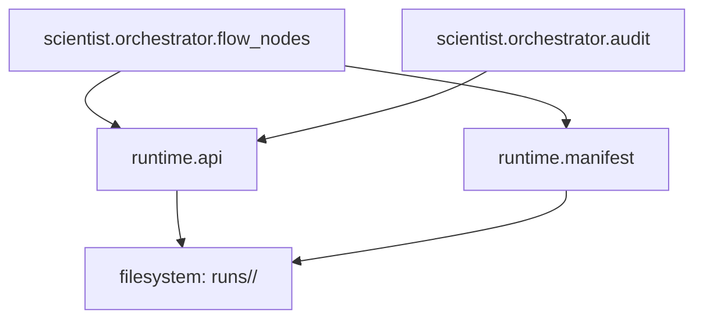

# Runtime Module (`polisyos.runtime`)

## Обзор

Модуль `polisyos.runtime` предоставляет **инфраструктуру управления жизненным циклом экспериментов и запусков** в системе симуляции политик. Это чистый слой инфраструктуры, который обеспечивает:

- **Воспроизводимость**: Каждый прогон имеет уникальный `run_id` и полную трассировку
- **Аудит**: Полный лог всех операций и решений в формате JSON Lines
- **Артефакты**: Структурированное хранение результатов, IR, метрик симуляции
- **Бюджеты**: Отслеживание использования ресурсов (compute, memory, time)

Согласно **Закону D архитектуры** ("Любой прогон — воспроизводим и аудируем"), runtime является единственной точкой входа для создания и управления запусками.

## Архитектурная роль

### В контексте компиляторной трубы

```
NL → Scientist (LLM + Workflow) → IR → Compilation → Runtime (Fabric + Foundry) → Artifacts
```

Runtime стоит в конце трубы, собирая все артефакты в **структурированные результаты** прогона в директории `runs/<run_id>/`.

### Границы ответственности

- ✅ **Владеет**: жизненный цикл запусков, артефакты, audit trail, бюджеты, сериализация
- ❌ **Не владеет**: бизнес-логика, JAX вычисления, БД, LLM, workflow orchestration

Runtime — это **чистая инфраструктура** без зависимостей от scientist/fabric/foundry.

### Текущая архитектура модуля

```
runtime/
├── __init__.py          # Публичный API модуля
├── api.py               # Основные функции управления жизненным циклом
├── manifest.py          # Модели данных (RunManifest, ArtifactRef)
└── README.md           # Эта документация
```

## Структура артефактов

### Стандартная директория запуска

```
runs/<run_id>/
├── manifest.json              # RunManifest (паспорт прогона)
├── artifacts/                 # Структурированные результаты
│   ├── policy_ir/            # IR политики (YAML/JSON)
│   ├── simulation_results/   # Метрики симуляции
│   ├── compiled_model/       # Скомпилированная модель
│   └── data_views/           # Результаты UDF запросов
├── audit.jsonl               # Аудит-лог всех операций
└── [decision_packet.json]    # Финальный артефакт (опционально)
```

### RunManifest (паспорт прогона)

```python
class RunManifest(BaseModel):
    schema_version: str = "1.0"
    run_id: str                    # Уникальный идентификатор
    parent_run_id: Optional[str]   # Для иерархических прогонов
    status: str = "running"        # "running" | "completed" | "failed" | "pruned"
    started_at: str               # ISO timestamp
    finished_at: Optional[str]    # ISO timestamp при завершении
    generator: Dict[str, str]     # Кто создал (scientist.workflow, etc.)
    budgets: Dict[str, float]     # Исходные лимиты ресурсов
    budget_usage: Dict[str, float] # Фактическое использование
    pruning_reason: Optional[Dict[str, Any]]  # Причина досрочного завершения
    artifacts: List[ArtifactRef]  # Ссылки на все артефакты
```

## API Reference

### Управление жизненным циклом

#### `start_run()`
Инициализирует новый запуск с автоматической генерацией `run_id`.

```python
from polisyos.runtime import start_run

# Минимальный запуск
manifest = start_run()

# Запуск с метаданными и бюджетами
manifest = start_run(
    run_id="policy_sim_001",                    # Опционально, генерируется автоматически
    parent_run_id="draft_123",                  # Для иерархических прогонов
    generator={"component": "scientist.workflow", "version": "1.0"},
    budgets={"compute": 1000.0, "memory": 2048.0, "time": 3600.0},
    base_dir=Path("runs")                       # Директория для хранения (по умолчанию "runs")
)
```

#### `finalize_run()`
Завершает запуск с финальным статусом.

```python
from polisyos.runtime import finalize_run

# Успешное завершение
finalize_run(run_id="policy_sim_001", status="completed")

# Завершение с причиной pruning
finalize_run(
    run_id="policy_sim_001",
    status="pruned",
    pruning_reason={
        "type": "budget_exceeded",
        "limit": 1000.0,
        "actual": 1200.0,
        "resource": "compute"
    },
    base_dir=Path("runs")
)
```

### Логирование артефактов

#### `log_artifact()`
Сохраняет артефакт прогона с автоматической категоризацией.

```python
from polisyos.runtime import log_artifact

# Логирование Policy IR
policy_ir = {"policies": [...], "objectives": [...]}
log_artifact(
    run_id="policy_sim_001",
    artifact_type="policy_ir",
    payload=policy_ir,
    step="draft",
    filename="policy_draft_v1.yaml",
    base_dir=Path("runs")
)

# Логирование результатов симуляции
simulation_results = {
    "metrics": {"efficiency": 0.85, "fairness": 0.72},
    "timesteps": 100,
    "convergence": True
}
log_artifact(
    run_id="policy_sim_001",
    artifact_type="simulation_results",
    payload=simulation_results,
    step="simulate",
    schema_version="1.0",
    base_dir=Path("runs")
)

# Логирование data view результатов
panel_data = pd.DataFrame(...)  # Результат UDF запроса
log_artifact(
    run_id="policy_sim_001",
    artifact_type="data_views",
    payload=panel_data.to_dict('records'),
    media_type="application/json",
    step="compile_data",
    filename="population_panel.json",
    base_dir=Path("runs")
)
```

### Аудит и бюджеты

#### `append_audit()`
Добавляет запись в audit trail прогона.

```python
from polisyos.runtime import append_audit

# Логирование этапа workflow
append_audit(run_id="policy_sim_001", record={
    "timestamp": "2024-01-01T10:00:00Z",
    "event": "workflow_step_started",
    "step": "validate_ir",
    "details": {"ir_size": 1500, "entities_count": 25}
}, base_dir=Path("runs"))

# Логирование решения governor
append_audit(run_id="policy_sim_001", record={
    "timestamp": "2024-01-01T10:05:00Z",
    "event": "governor_decision",
    "decision": "needs_revision",
    "issues": [
        {
            "issue_id": "INVALID_OBJECTIVE",
            "severity": "error",
            "loc": "objectives.0",
            "message": "Objective function not measurable"
        }
    ]
}, base_dir=Path("runs"))
```

#### `update_budget_usage()`
Обновляет текущее использование ресурсов.

```python
from polisyos.runtime import update_budget_usage

# Обновление после симуляции
update_budget_usage(run_id="policy_sim_001", budget_usage={
    "compute": 750.5,
    "memory": 1024.0,
    "time": 1800.0
}, base_dir=Path("runs"))
```

## Типы артефактов

### Стандартные категории

- **`policy_ir`**: Policy Request IR в YAML/JSON формате
- **`simulation_results`**: Метрики и результаты симуляции
- **`compiled_model`**: Скомпилированная JAX модель
- **`data_views`**: Результаты UDF запросов (панели, сети)
- **`validation_report`**: Отчеты валидации IR
- **`gradient_health`**: Метрики здоровья градиентов
- **`audit_trail`**: Автоматически создается из audit.jsonl

### ArtifactRef модель

```python
class ArtifactRef(BaseModel):
    artifact_type: str              # Категория артефакта
    path: str                      # Путь к файлу относительно runs/
    media_type: str = "application/json"
    schema_version: Optional[str]  # Версия схемы для структурированных данных
    step: Optional[str]           # Этап workflow, на котором создан
    created_at: str               # ISO timestamp создания
```

## Аудит-лог

### Формат JSON Lines

```jsonl
{"timestamp": "2024-01-01T10:00:00Z", "event": "run_started", "run_id": "policy_sim_001"}
{"timestamp": "2024-01-01T10:00:05Z", "event": "ir_drafted", "tokens_used": 1250}
{"timestamp": "2024-01-01T10:01:00Z", "event": "validation_passed", "checks": ["schema", "limits", "cycles"]}
{"timestamp": "2024-01-01T10:02:00Z", "event": "simulation_started", "backend": "jax_cpu"}
{"timestamp": "2024-01-01T10:15:00Z", "event": "simulation_completed", "timesteps": 100, "converged": true}
{"timestamp": "2024-01-01T10:15:05Z", "event": "governor_decision", "verdict": "approve"}
```

### Автоматические события

- `run_started`: Создание RunManifest
- `artifact_logged`: Логирование каждого артефакта
- `budget_updated`: Изменение использования ресурсов
- `run_finalized`: Завершение с финальным статусом

## Интеграция с компонентами

### Scientist/Orchestrator

Runtime интегрирован в workflow через `flow_nodes.py` и `audit.py`:

```python
# В flow_nodes.py - управление жизненным циклом экспериментов
from polisyos.runtime import finalize_run, log_artifact, start_run, update_budget_usage

def experiment_workflow(state: ExperimentState):
    # Инициализация эксперимента
    manifest = start_run(
        generator={"component": "scientist.orchestrator", "workflow": "policy_experiment"},
        budgets={"llm_calls": 3.0, "sim_runs": 1.0, "wall_time_s": 120.0},
        base_dir=_runtime_base_dir(state)
    )

    # Логирование артефактов на этапах workflow
    log_artifact(
        run_id=manifest.run_id,
        artifact_type="policy_ir",
        payload=policy_ir,
        step="draft",
        base_dir=_runtime_base_dir(state)
    )

    # Финализация эксперимента
    finalize_run(run_id=manifest.run_id, status="completed", base_dir=_runtime_base_dir(state))
```

```python
# В audit.py - интеграция с audit trail
from polisyos.runtime import append_audit as runtime_append_audit

def append_audit(state: Dict[str, Any], node: str, action: str, details: Dict[str, Any]):
    record = {
        "timestamp": datetime.utcnow().isoformat(),
        "node": node,
        "action": action,
        "details": details,
    }

    # Синхронная запись в runtime audit trail
    run_id = state.get("run_id")
    if run_id:
        runtime_append_audit(run_id=run_id, record=record, base_dir=Path(state.get("runtime_base_dir", "runs")))
```

### Fabric/UDF

UDF результаты логируются как артефакты для трассировки через orchestrator:

```python
# В flow_nodes.py - логирование результатов UDF запросов
def compile_data_node(state: ExperimentState):
    # ... компиляция и исполнение UDF ...
    log_artifact(
        run_id=state["run_id"],
        artifact_type="data_views",
        payload=udf_results,
        step="compile_data",
        base_dir=_runtime_base_dir(state)
    )
```

### Foundry

Результаты симуляции интегрируются через orchestrator workflow:

```python
# В flow_nodes.py - логирование результатов симуляции
def simulate_node(state: ExperimentState):
    # ... запуск симуляции в foundry ...

    # Логирование результатов
    log_artifact(
        run_id=state["run_id"],
        artifact_type="simulation_results",
        payload=simulation_metrics,
        step="simulate",
        base_dir=_runtime_base_dir(state)
    )

    # Обновление бюджета
    update_budget_usage(
        run_id=state["run_id"],
        budget_usage={"sim_runs": 1.0},
        base_dir=_runtime_base_dir(state)
    )
```

## Воспроизводимость и трассировка

### Детерминированные прогоны

Каждый RunManifest включает:
- `seed`: Для детерминированных вычислений
- `backend`: JAX backend (cpu, gpu, tpu)
- `generator`: Версия и компонент, создавший прогон
- `library_versions`: Все версии зависимостей

### Миграции

Артефакты версионированы через `schema_version`:
- `v1.0`: Базовая схема
- `v1.1`: Добавление gradient_health
- `v2.0`: Изменение структуры simulation_results

## Производительность и надежность

### Оптимизации

- **Ленивая загрузка**: Manifest читается только при обновлении
- **JSON Lines streaming**: Аудит-лог поддерживает потоковое чтение
- **Автоматическое создание директорий**: Нет ошибок на отсутствующие пути

### Обработка ошибок

```python
# Runtime операции идемпотентны и безопасны
try:
    log_artifact(run_id, "policy_ir", payload)
except FileNotFoundError:
    # Создание директорий автоматически
    pass
except ValidationError:
    # Pydantic валидация на всех моделях
    append_audit(run_id, {"event": "artifact_validation_failed", "error": str(e)})
```

## Миграция с legacy подхода

### As-is проблемы

До runtime API компоненты писали артефакты "куда попало":
- Scientist: `logs/run_records/` + `logs/decision_packets/`
- Foundry: Прямые print statements или локальные файлы
- Fabric: Результаты в `integration.duckdb` без трассировки

### To-be преимущества

- **Единая структура**: Все артефакты в `runs/<run_id>/`
- **Ссылка на всё**: RunManifest как "паспорт прогона"
- **Воспроизводимость**: Полная трассировка для повторения
- **Аудит**: JSON Lines лог всех операций

## Текущие паттерны использования

### Управление бюджетом в workflow

Runtime интегрирован с системой бюджетов в `flow_nodes.py`:

```python
DEFAULT_BUDGET = {
    "max_llm_calls": 3.0,
    "max_sim_runs": 1.0,
    "max_wall_time_s": 120.0,
}

def _ensure_budget(state: ExperimentState) -> ExperimentState:
    budget = dict(DEFAULT_BUDGET)
    budget.update(state.get("budget") or {})
    usage = state.get("budget_usage") or {"llm_calls": 0.0, "sim_runs": 0.0, "wall_time_s": 0.0}

    # Синхронизация с runtime
    run_id = state.get("run_id")
    if run_id:
        update_budget_usage(run_id=run_id, budget_usage=usage, base_dir=_runtime_base_dir(state))

    return {**state, "budget": budget, "budget_usage": usage}
```

### Структурированное хранение артефактов

Все артефакты организованы по типам в директории запуска:

```
runs/<run_id>/
├── manifest.json                    # RunManifest
├── artifacts/
│   ├── policy_ir/                  # IR политики
│   ├── data_views/                 # Результаты UDF
│   ├── simulation_results/         # Метрики симуляции
│   └── registry_bundle_ref/        # Ссылки на registry
├── audit.jsonl                     # Audit trail
└── ...
```

## Примеры использования

### Полный цикл эксперимента (реальный паттерн из flow_nodes.py)

```python
from polisyos.runtime import start_run, log_artifact, append_audit, finalize_run, update_budget_usage
from pathlib import Path

# 1. Инициализация эксперимента
manifest = start_run(
    generator={"component": "scientist.orchestrator", "workflow": "policy_experiment"},
    budgets={"llm_calls": 3.0, "sim_runs": 1.0, "wall_time_s": 120.0},
    base_dir=Path("runs")
)
run_id = manifest.run_id

# 2. Этап черновика IR
append_audit(run_id=run_id, record={
    "event": "workflow_step_started",
    "step": "draft_ir",
    "details": {"input_length": len(input_text)}
}, base_dir=Path("runs"))

policy_ir = generate_policy_draft()
log_artifact(
    run_id=run_id,
    artifact_type="policy_ir",
    payload=policy_ir,
    step="draft",
    base_dir=Path("runs")
)

# 3. Компиляция данных (UDF запросы)
data_views = compile_data_views(policy_ir)
log_artifact(
    run_id=run_id,
    artifact_type="data_views",
    payload=data_views,
    step="compile_data",
    base_dir=Path("runs")
)

# 4. Симуляция в Foundry
simulation_result = run_foundry_simulation(policy_ir, data_views)
log_artifact(
    run_id=run_id,
    artifact_type="simulation_results",
    payload=simulation_result,
    step="simulate",
    base_dir=Path("runs")
)

# Обновление бюджета после симуляции
update_budget_usage(
    run_id=run_id,
    budget_usage={"sim_runs": 1.0},
    base_dir=Path("runs")
)

# 5. Решение Governor
decision = governor_analyze(simulation_result)
append_audit(run_id=run_id, record={
    "event": "governor_decision",
    "verdict": decision,
    "details": {"confidence": 0.85}
}, base_dir=Path("runs"))

# 6. Финализация
finalize_run(run_id=run_id, status="completed", base_dir=Path("runs"))
```

### Прогоны с pruning

```python
# Превышение бюджета LLM вызовов
update_budget_usage(run_id=run_id, budget_usage={"llm_calls": 4.0}, base_dir=Path("runs"))
finalize_run(run_id=run_id, status="pruned", pruning_reason={
    "type": "budget_exceeded",
    "resource": "llm_calls",
    "limit": 3.0,
    "actual": 4.0
}, base_dir=Path("runs"))

# Превышение времени выполнения
finalize_run(run_id=run_id, status="pruned", pruning_reason={
    "type": "wall_time_exceeded",
    "limit": 120.0,
    "actual": 125.5
}, base_dir=Path("runs"))

# Валидация не пройдена
finalize_run(run_id=run_id, status="pruned", pruning_reason={
    "type": "validation_failed",
    "issues": ["INVALID_IR_SCHEMA", "OBJECTIVE_NOT_MEASURABLE"]
}, base_dir=Path("runs"))
```

## Тестирование

### Unit тесты

```bash
# Тестирование API
pytest tests/runtime/test_api.py

# Тестирование моделей
pytest tests/runtime/test_manifest.py
```

### Integration тесты

```bash
# Полный цикл с файловой системой
pytest tests/integration/test_runtime_workflow.py
```

### Контрактные тесты

```bash
# Валидация схем артефактов
pytest tests/contract/test_runtime_contracts.py
```

## Архитектурные гарантии

Runtime обеспечивает соблюдение **Закона D**:

- ✅ **Воспроизводимость**: Каждый прогон имеет run_id, seed, версии
- ✅ **Аудит**: Полный лог всех операций в JSON Lines
- ✅ **Артефакты**: Структурированное хранение всех результатов
- ✅ **Бюджеты**: Отслеживание и enforcement лимитов ресурсов

## Текущее состояние и связи

### Активные интеграции

- **Scientist/Orchestrator**: Основной потребитель runtime API через `flow_nodes.py` и `audit.py`
- **Fabric**: Косвенная интеграция через результаты UDF запросов
- **Foundry**: Косвенная интеграция через результаты симуляции

### Архитектурные связи



### Модели данных

Модуль предоставляет две ключевые Pydantic модели:

- **`RunManifest`**: Полный "паспорт" эксперимента с метаданными, статусом и ссылками на артефакты
- **`ArtifactRef`**: Ссылка на артефакт с типом, путем, медиа-типом и версией схемы

### Поток данных

```
Scientist Workflow → Runtime API → File System (runs/) → Artifacts + Audit Trail
```

Runtime — это **инфраструктурный фундамент** для надежной, трассируемой и воспроизводимой системы симуляции политик.
