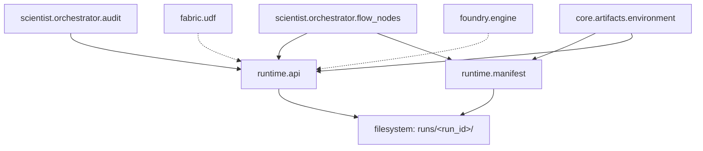

# Runtime Module (`polisyos.runtime`)

*Документация актуализирована на 2026-01-26 в соответствии с текущим состоянием кода и интеграциями.*

## Обзор

Модуль `polisyos.runtime` предоставляет **инфраструктуру управления жизненным циклом экспериментов и запусков** в системе симуляции политик. Это чистый слой инфраструктуры, который обеспечивает:

- **Воспроизводимость**: Каждый прогон имеет уникальный `run_id` и полную трассировку
- **Аудит**: Полный лог всех операций и решений в формате JSON Lines
- **Артефакты**: Структурированное хранение результатов, IR, метрик симуляции с переносимыми ссылками
- **Бюджеты**: Отслеживание использования ресурсов (compute, memory, time)
- **Переносимость**: Артефакты используют относительные пути и могут быть перемещены между директориями

Согласно **Закону D архитектуры** ("Любой прогон — воспроизводим и аудируем"), runtime является единственной точкой входа для создания и управления запусками.

## Архитектурная роль

Runtime представляет собой **современную инфраструктуру управления жизненным циклом экспериментов**, введенную для замены фрагментированных подходов хранения артефактов в отдельных компонентах системы.

### В контексте компиляторной трубы

```
NL → Scientist (LLM + Workflow) → IR → Compilation → Runtime (Fabric + Foundry) → Artifacts
```

Runtime стоит в конце трубы, собирая все артефакты в **структурированные результаты** прогона в директории `runs/<run_id>/`. Это обеспечивает единую точку входа для всех операций с артефактами экспериментов.

### Границы ответственности

- ✅ **Владеет**: жизненный цикл запусков, артефакты, audit trail, бюджеты, сериализация, разрешение путей
- ❌ **Не владеет**: бизнес-логика, JAX вычисления, БД, LLM, workflow orchestration

Runtime — это **чистая инфраструктура** без зависимостей от scientist/fabric/foundry, обеспечивающая соблюдение **Закона D** архитектуры Polisyos.

### Текущая архитектура модуля

```
runtime/
├── __init__.py          # Публичный API модуля с импортами всех функций
├── api.py               # Основные функции управления жизненным циклом экспериментов
├── manifest.py          # Pydantic модели данных (RunManifest, ArtifactRef)
└── README.md           # Эта документация
```

### Публичный API

```python
from polisyos.runtime import (
    RunManifest,                    # Модель паспорта эксперимента
    append_audit,                   # Добавление записи в audit trail
    finalize_run,                   # Завершение запуска с финальным статусом
    log_artifact,                   # Логирование артефакта прогона
    resolve_artifact_path,          # Разрешение пути к артефакту
    start_run,                      # Инициализация нового запуска
    update_budget_usage,            # Обновление использования бюджета
)
```

## Структура артефактов

### Стандартная директория запуска

```
runs/<run_id>/
├── manifest.json              # RunManifest (паспорт прогона)
├── artifacts/                 # Структурированные результаты
│   ├── policy_ir/            # IR политики (JSON)
│   ├── simulation_results/   # Метрики симуляции (JSON)
│   ├── compiled_model/       # Скомпилированная модель
│   ├── data_views/           # Результаты UDF запросов (JSON)
│   └── audit_trail/          # Автоматически создаваемая ссылка на audit
├── audit.jsonl               # Аудит-лог всех операций (JSON Lines)
└── [decision_packet.json]    # Финальный артефакт (опционально)
```

### RunManifest (паспорт прогона)

```python
class RunManifest(BaseModel):
    schema_version: str = Field("1.0", pattern=r"^\d+\.\d+$")
    run_id: str
    parent_run_id: Optional[str] = None
    status: str = "running"
    started_at: str = Field(default_factory=lambda: datetime.now(timezone.utc).isoformat())
    finished_at: Optional[str] = None
    generator: Dict[str, str] = Field(default_factory=dict)
    budgets: Dict[str, float] = Field(default_factory=dict)
    budget_usage: Dict[str, float] = Field(default_factory=dict)
    pruning_reason: Optional[Dict[str, Any]] = None
    artifacts: List[ArtifactRef] = Field(default_factory=list)
    run_root: Optional[str] = None  # Корневая директория для разрешения путей

    model_config = ConfigDict(extra="forbid")
```

**Ключевые поля:**
- `run_id`: Уникальный идентификатор прогона (обычно 8 символов UUID)
- `parent_run_id`: Ссылка на родительский прогон для иерархических экспериментов
- `status`: Текущий статус ("running", "completed", "pruned")
- `generator`: Метаданные о компоненте, создавшем прогон
- `budgets`: Лимиты ресурсов (compute, memory, time и т.д.)
- `budget_usage`: Фактическое использование ресурсов
- `pruning_reason`: Причина прерывания прогона (если применимо)
- `artifacts`: Список всех артефактов прогона
- `environment_ref`: Ссылка на манифест окружения для обеспечения воспроизводимости
- `environment_fingerprint`: Хэш-сумма критически важных факторов окружения
- `run_root`: Корневая директория для разрешения относительных путей

### ArtifactRef (ссылка на артефакт)

```python
class ArtifactRef(BaseModel):
    artifact_type: str
    path: Optional[str] = None                    # Абсолютный путь (устаревший)
    relative_path: Optional[str] = None          # Относительный путь (рекомендуемый)
    media_type: str
    schema_version: Optional[str] = None
    step: Optional[str] = None
    created_at: str = Field(default_factory=lambda: datetime.now(timezone.utc).isoformat())

    model_config = ConfigDict(extra="forbid")
```

## API Reference

### Управление жизненным циклом

#### `start_run()`
Инициализирует новый запуск с автоматической генерацией `run_id`.

```python
from polisyos.runtime import start_run

# Минимальный запуск
manifest = start_run()

# Запуск с метаданными и бюджетами
manifest = start_run(
    run_id="abc123def",                         # Опционально, генерируется автоматически (8 символов UUID)
    parent_run_id="draft_123",                  # Для иерархических прогонов
    generator={"component": "scientist.workflow", "version": "1.0"},
    budgets={"compute": 1000.0, "memory": 2048.0, "time": 3600.0},
    base_dir=Path("runs")                       # Директория для хранения (по умолчанию "runs")
)
```

#### `finalize_run()`
Завершает запуск с финальным статусом.

```python
from polisyos.runtime import finalize_run

# Успешное завершение
finalize_run(run_id="abc123def", status="completed")

# Завершение с причиной pruning
finalize_run(
    run_id="abc123def",
    status="pruned",
    pruning_reason={
        "type": "budget_exceeded",
        "limit": 1000.0,
        "actual": 1200.0,
        "resource": "compute"
    },
    base_dir=Path("runs")
)
```

#### `resolve_artifact_path()`
Разрешает абсолютный путь к артефакту из ArtifactRef.

```python
from polisyos.runtime import resolve_artifact_path

# Разрешение пути с учетом run_root
abs_path = resolve_artifact_path(
    artifact_ref,
    base_dir=Path("runs"),
    run_root=Path("/original/location")  # Опционально, если run_root отличается
)
```

### Логирование артефактов

#### `log_artifact()`
Сохраняет артефакт прогона с автоматической категоризацией и созданием переносимых ссылок.

```python
from polisyos.runtime import log_artifact

# Логирование Policy IR
policy_ir = {"semantic": {...}, "advisory": {...}}
ref = log_artifact(
    run_id="abc123def",
    artifact_type="policy_ir",
    payload=policy_ir,
    step="draft",
    base_dir=Path("runs")
)
# ref.relative_path будет содержать "abc123def/artifacts/policy_ir/20240101T100000_policy_ir.json"

# Логирование с кастомным именем файла
ref = log_artifact(
    run_id="abc123def",
    artifact_type="policy_ir",
    payload=policy_ir,
    filename="draft_v1_policy_ir.json",
    step="draft",
    base_dir=Path("runs")
)

# Логирование результатов симуляции
simulation_results = {
    "metrics": {"efficiency": 0.85, "fairness": 0.72},
    "timesteps": 100,
    "convergence": True
}
ref = log_artifact(
    run_id="abc123def",
    artifact_type="simulation_results",
    payload=simulation_results,
    step="simulate",
    schema_version="1.0",
    base_dir=Path("runs")
)

# Логирование registry bundle для воспроизводимости
registry_bundle = {"mechanisms": [...], "slots": [...], "merge_rules": [...]}
ref = log_artifact(
    run_id="abc123def",
    artifact_type="registry_bundle_ref",
    payload=registry_bundle,
    step="runtime",
    base_dir=Path("runs")
)

# Логирование environment manifest для обеспечения воспроизводимости
environment_manifest = {
    "environment_ref": {...},  # EnvironmentManifest данные
    "fingerprint": "abc123..." # Хэш-сумма окружения
}
ref = log_artifact(
    run_id="abc123def",
    artifact_type="environment_ref",
    payload=environment_manifest,
    step="runtime",
    base_dir=Path("runs")
)
# Автоматически обновляет environment_ref и environment_fingerprint в RunManifest

# Логирование data view результатов
panel_data = {"records": [...], "metadata": {...}}  # Результат UDF запроса через Fabric
ref = log_artifact(
    run_id="abc123def",
    artifact_type="data_views",
    payload=panel_data,
    step="compile_data",
    base_dir=Path("runs")
)
```

### Аудит и бюджеты

#### `append_audit()`
Добавляет запись в audit trail прогона.

```python
from polisyos.runtime import append_audit

# Логирование этапа workflow
append_audit(run_id="policy_sim_001", record={
    "timestamp": "2024-01-01T10:00:00Z",
    "event": "workflow_step_started",
    "step": "validate_ir",
    "details": {"ir_size": 1500, "entities_count": 25}
}, base_dir=Path("runs"))

# Логирование решения governor
append_audit(run_id="policy_sim_001", record={
    "timestamp": "2024-01-01T10:05:00Z",
    "event": "governor_decision",
    "decision": "needs_revision",
    "issues": [
        {
            "issue_id": "INVALID_OBJECTIVE",
            "severity": "error",
            "loc": "objectives.0",
            "message": "Objective function not measurable"
        }
    ]
}, base_dir=Path("runs"))
```

#### `update_budget_usage()`
Обновляет текущее использование ресурсов.

```python
from polisyos.runtime import update_budget_usage

# Обновление после симуляции
update_budget_usage(run_id="policy_sim_001", budget_usage={
    "compute": 750.5,
    "memory": 1024.0,
    "time": 1800.0
}, base_dir=Path("runs"))
```

## Типы артефактов

### Стандартные категории

- **`policy_ir`**: Policy Surface IR в JSON формате (semantic + advisory contracts)
- **`simulation_results`**: Метрики и результаты симуляции в Foundry
- **`compiled_model`**: Скомпилированная JAX модель (ProgramGraph + ExecPlan)
- **`data_views`**: Результаты UDF запросов через Fabric (панели, сети, факты)
- **`registry_bundle_ref`**: Ссылка на registry bundle для обеспечения воспроизводимости
- **`environment_ref`**: Манифест окружения для обеспечения воспроизводимости симуляций
- **`validation_report`**: Отчеты валидации IR и линковки
- **`gradient_health`**: Метрики здоровья градиентов и сходимости
- **`audit_trail`**: Автоматически создается из audit.jsonl (JSON Lines формат)

### ArtifactRef модель

```python
class ArtifactRef(BaseModel):
    artifact_type: str              # Категория артефакта
    path: Optional[str] = None      # Абсолютный путь (устаревший, для обратной совместимости)
    relative_path: Optional[str] = None  # Относительный путь (рекомендуемый)
    media_type: str                 # MIME тип ("application/json", "text/plain")
    schema_version: Optional[str] = None  # Версия схемы для структурированных данных
    step: Optional[str] = None      # Этап workflow, на котором создан
    created_at: str = Field(default_factory=lambda: datetime.utcnow().isoformat())

    model_config = ConfigDict(extra="forbid")
```

## Аудит-лог

### Формат JSON Lines

```jsonl
{"timestamp": "2024-01-01T10:00:00Z", "event": "run_started", "run_id": "policy_sim_001"}
{"timestamp": "2024-01-01T10:00:05Z", "event": "ir_drafted", "tokens_used": 1250}
{"timestamp": "2024-01-01T10:01:00Z", "event": "validation_passed", "checks": ["schema", "limits", "cycles"]}
{"timestamp": "2024-01-01T10:02:00Z", "event": "simulation_started", "backend": "jax_cpu"}
{"timestamp": "2024-01-01T10:15:00Z", "event": "simulation_completed", "timesteps": 100, "converged": true}
{"timestamp": "2024-01-01T10:15:05Z", "event": "governor_decision", "verdict": "approve"}
```

### Автоматические события

- `run_started`: Создание RunManifest
- `artifact_logged`: Логирование каждого артефакта
- `budget_updated`: Изменение использования ресурсов
- `run_finalized`: Завершение с финальным статусом

## Интеграция с компонентами

Runtime является **центральной инфраструктурой** для всей системы, заменяя фрагментированные подходы хранения артефактов в отдельных компонентах.

### Scientist/Orchestrator

Runtime является основной инфраструктурой для workflow в `scientist.orchestrator`. Интеграция происходит через:

#### `flow_nodes.py` - управление жизненным циклом экспериментов

Основные точки интеграции:

- **`start_run()`** - инициализация эксперимента в начале workflow
- **`log_artifact()`** - логирование результатов на каждом этапе (IR, data views, simulation results, registry bundles)
- **`finalize_run()`** - завершение эксперимента с финальным статусом
- **`update_budget_usage()`** - отслеживание использования ресурсов

```python
from polisyos.runtime import finalize_run, log_artifact, start_run, update_budget_usage

def experiment_workflow(state: ExperimentState):
    # Инициализация эксперимента
    manifest = start_run(
        generator={"component": "scientist.orchestrator", "workflow": "policy_experiment"},
        budgets={"llm_calls": 3.0, "sim_runs": 1.0, "wall_time_s": 120.0},
        base_dir=_runtime_base_dir(state)
    )
    state["run_id"] = manifest.run_id

    # Логирование registry bundle для обеспечения воспроизводимости
    log_artifact(
        run_id=state["run_id"],
        artifact_type="registry_bundle_ref",
        payload=bundle.bundle_ref.model_dump(),
        step="runtime",
        base_dir=_runtime_base_dir(state)
    )

    # Логирование артефактов на этапах workflow
    log_artifact(
        run_id=state["run_id"],
        artifact_type="policy_ir",
        payload=policy_ir,
        step="draft",
        base_dir=_runtime_base_dir(state)
    )

    # Финализация эксперимента
    finalize_run(run_id=state["run_id"], status="completed", base_dir=_runtime_base_dir(state))
```

#### `audit.py` - интеграция с audit trail

Двунаправленная синхронизация audit trail между локальным состоянием workflow и runtime:

```python
from polisyos.runtime import append_audit as runtime_append_audit

def append_audit(state: Dict[str, Any], node: str, action: str, details: Dict[str, Any]) -> Dict[str, Any]:
    audit = state.get("audit_trail") or []
    record = {
        "timestamp": datetime.now(timezone.utc).isoformat(),
        "node": node,
        "action": action,
        "details": details,
    }
    audit.append(record)

    # Синхронная запись в runtime audit trail
    run_id = state.get("run_id")
    runtime_base_dir = state.get("runtime_base_dir")
    if run_id:
        base_dir = Path(runtime_base_dir) if runtime_base_dir else Path("runs")
        runtime_append_audit(run_id=run_id, record=record, base_dir=base_dir)

    return {**state, "audit_trail": audit}
```

### Fabric/UDF

Результаты UDF запросов логируются как артефакты для обеспечения полной трассировки:

```python
# В compile_data_views_node (flow_nodes.py)
def compile_data_views_node(state: ExperimentState):
    # ... компиляция и исполнение UDF через fabric.udf ...
    log_artifact(
        run_id=state["run_id"],
        artifact_type="data_views",
        payload=udf_results,
        step="compile_data",
        base_dir=_runtime_base_dir(state)
    )
```

### Foundry

Результаты симуляции и метрики логируются через runtime для сохранения истории экспериментов:

```python
# В run_sim_node (flow_nodes.py)
def run_sim_node(state: ExperimentState):
    # ... запуск симуляции в foundry ...

    # Логирование результатов симуляции
    log_artifact(
        run_id=state["run_id"],
        artifact_type="simulation_results",
        payload=simulation_metrics,
        step="simulate",
        base_dir=_runtime_base_dir(state)
    )

    # Обновление бюджета после симуляции
    update_budget_usage(
        run_id=state["run_id"],
        budget_usage={"sim_runs": 1.0},
        base_dir=_runtime_base_dir(state)
    )
```

### Core/Artifacts/Environment

Runtime интегрирован с системой захвата окружения для обеспечения воспроизводимости симуляций:

```python
# Захват и логирование environment manifest
from polisyos.core.artifacts.environment import capture_environment_manifest

# Захват полного манифеста окружения
env_manifest = capture_environment_manifest()

# Логирование через runtime API
log_artifact(
    run_id=run_id,
    artifact_type="environment_ref",
    payload={
        "environment_ref": env_manifest.model_dump(),
        "fingerprint": env_manifest.fingerprint
    },
    step="environment_capture",
    base_dir=Path("runs")
)
```

Интеграция обеспечивает:
- **Автоматическое обновление** `environment_ref` и `environment_fingerprint` в `RunManifest`
- **Полную трассировку** факторов окружения, влияющих на воспроизводимость
- **Валидацию** совместимости окружений при повторных запусках

## Воспроизводимость и трассировка

### Детерминированные прогоны

Каждый RunManifest включает:
- `seed`: Для детерминированных вычислений
- `backend`: JAX backend (cpu, gpu, tpu)
- `generator`: Версия и компонент, создавший прогон
- `library_versions`: Все версии зависимостей

### Миграции

Артефакты версионированы через `schema_version`:
- `v1.0`: Базовая схема
- `v1.1`: Добавление gradient_health
- `v2.0`: Изменение структуры simulation_results

## Производительность и надежность

### Оптимизации

- **Ленивая загрузка**: Manifest читается только при обновлении
- **JSON Lines streaming**: Аудит-лог поддерживает потоковое чтение
- **Автоматическое создание директорий**: Нет ошибок на отсутствующие пути

### Обработка ошибок

```python
# Runtime операции идемпотентны и безопасны
try:
    log_artifact(run_id, "policy_ir", payload)
except FileNotFoundError:
    # Создание директорий автоматически
    pass
except ValidationError:
    # Pydantic валидация на всех моделях
    append_audit(run_id, {"event": "artifact_validation_failed", "error": str(e)})
```

## Миграция с legacy подхода

### As-is проблемы

До введения runtime API компоненты использовали фрагментированные подходы хранения артефактов:
- **Scientist**: `logs/run_records/` + `logs/decision_packets/` (deprecated в пользу `runtime.log_artifact`)
- **Foundry**: Прямые print statements или локальные файлы без структурированного хранения
- **Fabric**: Результаты UDF запросов в `integration.duckdb` без полной трассировки
- **Отсутствие единой точки**: Каждый компонент управлял своими артефактами независимо

### To-be преимущества

- **Единая структура**: Все артефакты в `runs/<run_id>/`
- **Ссылка на всё**: RunManifest как "паспорт прогона"
- **Воспроизводимость**: Полная трассировка для повторения
- **Аудит**: JSON Lines лог всех операций

## Текущие возможности и ограничения

### Поддерживаемые типы артефактов

Runtime поддерживает все основные типы артефактов системы Polisyos:
- **Policy IR**: Semantic и advisory contracts в JSON формате
- **Simulation Results**: Метрики и результаты симуляции из Foundry
- **Data Views**: Результаты UDF запросов через Fabric
- **Registry Bundles**: Ссылки на registry для обеспечения воспроизводимости
- **Audit Trail**: Автоматически генерируемый JSON Lines лог
- **Validation Reports**: Результаты валидации IR и линковки
- **Gradient Health**: Метрики здоровья градиентов и сходимости

### Ограничения

- Runtime не управляет бизнес-логикой — только инфраструктурой хранения
- Все артефакты хранятся в файловой системе (нет поддержки внешних хранилищ)
- JSON Lines audit trail не поддерживает произвольный поиск (только последовательное чтение)

## Текущие паттерны использования

### Управление бюджетом в workflow

Runtime интегрирован с системой бюджетов в `flow_nodes.py`:

```python
DEFAULT_BUDGET = {
    "max_llm_calls": 3.0,
    "max_sim_runs": 1.0,
    "max_wall_time_s": 120.0,
}

def _ensure_budget(state: ExperimentState) -> ExperimentState:
    budget = dict(DEFAULT_BUDGET)
    budget.update(state.get("budget") or {})
    usage = state.get("budget_usage") or {"llm_calls": 0.0, "sim_runs": 0.0, "wall_time_s": 0.0}

    # Синхронизация с runtime
    run_id = state.get("run_id")
    if run_id:
        update_budget_usage(run_id=run_id, budget_usage=usage, base_dir=_runtime_base_dir(state))

    return {**state, "budget": budget, "budget_usage": usage}
```

### Структурированное хранение артефактов

Все артефакты организованы по типам в директории запуска:

```
runs/<run_id>/
├── manifest.json                    # RunManifest
├── artifacts/
│   ├── policy_ir/                  # Policy Surface IR
│   ├── data_views/                 # Результаты UDF через Fabric
│   ├── simulation_results/         # Метрики симуляции в Foundry
│   └── registry_bundle_ref/        # Registry bundle для воспроизводимости
├── audit.jsonl                     # Audit trail
└── ...
```

## Примеры использования

### Полный цикл эксперимента

```python
from polisyos.runtime import start_run, log_artifact, append_audit, finalize_run, update_budget_usage
from pathlib import Path

# 1. Инициализация эксперимента
manifest = start_run(
    generator={"component": "scientist.orchestrator", "workflow": "policy_experiment"},
    budgets={"llm_calls": 3.0, "sim_runs": 1.0, "wall_time_s": 120.0},
    base_dir=Path("runs")
)
run_id = manifest.run_id

# 2. Захват и регистрация окружения для воспроизводимости
from polisyos.core.artifacts.environment import capture_environment_manifest

env_manifest = capture_environment_manifest()
log_artifact(
    run_id=run_id,
    artifact_type="environment_ref",
    payload={
        "environment_ref": env_manifest.model_dump(),
        "fingerprint": env_manifest.fingerprint
    },
    step="environment_capture",
    base_dir=Path("runs")
)

# 3. Регистрация registry bundle для воспроизводимости
registry_bundle = {"bundle_ref": {...}, "mechanisms": [...], "slots": [...]}
log_artifact(
    run_id=run_id,
    artifact_type="registry_bundle_ref",
    payload=registry_bundle,
    step="runtime",
    base_dir=Path("runs")
)

# 3. Этап черновика IR
append_audit(run_id=run_id, record={
    "timestamp": "2024-01-01T10:00:00Z",
    "event": "workflow_step_started",
    "step": "draft_ir",
    "details": {"input_length": 1500}
}, base_dir=Path("runs"))

policy_ir = {"semantic": {...}, "advisory": {...}}
log_artifact(
    run_id=run_id,
    artifact_type="policy_ir",
    payload=policy_ir,
    step="draft",
    base_dir=Path("runs")
)

# 3. Компиляция данных (UDF запросы)
data_views = {"panels": [...], "networks": [...]}
log_artifact(
    run_id=run_id,
    artifact_type="data_views",
    payload=data_views,
    step="compile_data",
    base_dir=Path("runs")
)

# 4. Симуляция в Foundry
simulation_result = {
    "metrics": {"gdp": 1250.5, "unemployment": 0.045},
    "timesteps": 100,
    "converged": True
}
log_artifact(
    run_id=run_id,
    artifact_type="simulation_results",
    payload=simulation_result,
    step="simulate",
    base_dir=Path("runs")
)

# Обновление бюджета после симуляции
update_budget_usage(
    run_id=run_id,
    budget_usage={"sim_runs": 1.0},
    base_dir=Path("runs")
)

# 5. Решение Governor
append_audit(run_id=run_id, record={
    "timestamp": "2024-01-01T10:15:00Z",
    "event": "governor_decision",
    "verdict": "approve",
    "details": {"confidence": 0.85}
}, base_dir=Path("runs"))

# 6. Финализация
finalize_run(run_id=run_id, status="completed", base_dir=Path("runs"))
```

### Прогоны с pruning

```python
# Превышение бюджета LLM вызовов
update_budget_usage(run_id=run_id, budget_usage={"llm_calls": 4.0}, base_dir=Path("runs"))
finalize_run(run_id=run_id, status="pruned", pruning_reason={
    "type": "budget_exceeded",
    "resource": "llm_calls",
    "limit": 3.0,
    "actual": 4.0
}, base_dir=Path("runs"))

# Превышение времени выполнения
finalize_run(run_id=run_id, status="pruned", pruning_reason={
    "type": "wall_time_exceeded",
    "limit": 120.0,
    "actual": 125.5
}, base_dir=Path("runs"))

# Валидация не пройдена
finalize_run(run_id=run_id, status="pruned", pruning_reason={
    "type": "validation_failed",
    "issues": ["INVALID_IR_SCHEMA", "OBJECTIVE_NOT_MEASURABLE"]
}, base_dir=Path("runs"))
```

## Тестирование

### Unit тесты

Основные unit тесты сосредоточены на корректности работы с путями и артефактами:

```bash
# Тестирование API и путей
pytest policy-engine/tests/runtime/test_runtime_manifest_paths.py -v

# Тестирование логирования артефактов и разрешения путей
pytest policy-engine/tests/runtime/test_runtime_manifest_paths.py::test_log_artifact_uses_relative_paths -v
pytest policy-engine/tests/runtime/test_runtime_manifest_paths.py::test_resolve_artifact_path_handles_relative_and_absolute -v
```

### Integration тесты

Runtime тестируется в составе полных workflow экспериментов:

```bash
# Полный workflow с runtime интеграцией
pytest policy-engine/tests/integration/test_workflow_smoke.py -k "workflow_with_runtime" -v
pytest policy-engine/tests/integration/test_workflow_llm.py -v

# Проверка отсутствия legacy артефактов
pytest policy-engine/tests/integration/test_workflow_smoke.py::test_no_legacy_logs -v
```

### Контрактные тесты

Runtime тестируется как часть end-to-end workflow, где проверяется:
- ✅ **Воспроизводимость**: Каждый прогон имеет уникальный run_id и полную трассировку
- ✅ **Переносимость**: Директории `runs/` можно перемещать без потери ссылок
- ✅ **Целостность audit trail**: Синхронизация между локальным и runtime audit
- ✅ **Корректность бюджетов**: Отслеживание и enforcement лимитов ресурсов
- ✅ **Отсутствие legacy артефактов**: Все компоненты используют runtime вместо старых подходов

## Архитектурные гарантии

Runtime обеспечивает соблюдение **Закона D**:

- ✅ **Воспроизводимость**: Каждый прогон имеет run_id, seed, версии
- ✅ **Аудит**: Полный лог всех операций в JSON Lines
- ✅ **Артефакты**: Структурированное хранение всех результатов
- ✅ **Бюджеты**: Отслеживание и enforcement лимитов ресурсов

## Текущее состояние и связи

### Активные интеграции

- **Scientist/Orchestrator**: Основной потребитель runtime API
  - `scientist.orchestrator.flow_nodes` - управление жизненным циклом экспериментов
  - `scientist.orchestrator.audit` - синхронизация audit trail
- **Fabric/UDF**: Косвенная интеграция через логирование результатов UDF запросов
- **Foundry**: Косвенная интеграция через логирование результатов симуляции
- **Core/Artifacts/Environment**: Интеграция с захватом окружения
  - `core.artifacts.environment.EnvironmentManifest` - полная спецификация окружения
  - `core.artifacts.environment.EnvironmentManifestRef` - типизированная ссылка на артефакт
  - Автоматическое обновление `environment_ref` и `environment_fingerprint` в RunManifest

### Архитектурные связи



### Модели данных

Модуль предоставляет две ключевые Pydantic модели с строгой валидацией:

- **`RunManifest`**: Полный "паспорт" эксперимента с метаданными, статусом, бюджетами и ссылками на артефакты
  - Новые поля: `environment_ref` (ссылка на EnvironmentManifest) и `environment_fingerprint` (хэш окружения)
- **`ArtifactRef`**: Переносимая ссылка на артефакт с поддержкой относительных путей

Дополнительные модели из зависимых модулей:
- **`EnvironmentManifestRef`**: Типизированная ссылка на артефакт манифеста окружения
- **`EnvironmentManifest`**: Полная спецификация окружения для воспроизводимости

### Поток данных

```
Scientist Workflow → Runtime API → File System (runs/<run_id>/) → Artifacts + Audit Trail
```

### Ключевые особенности реализации

- **Переносимость**: Использование `relative_path` в `ArtifactRef` позволяет перемещать директории `runs/` без потери ссылок
- **Строгая схема**: Все модели используют `extra="forbid"` для предотвращения незапланированных полей
- **Версионирование**: `schema_version` в `RunManifest` обеспечивает эволюцию формата
- **Идемпотентность**: Все операции безопасны для повторного выполнения
- **Автоматическое создание директорий**: Нет ошибок на отсутствующие пути

## Тестирование

### Unit тесты

```bash
# Тестирование API и путей
pytest policy-engine/tests/runtime/test_runtime_manifest_paths.py -v
```

### Integration тесты

```bash
# Полный workflow с runtime
pytest policy-engine/tests/integration/test_workflow_smoke.py::test_workflow_with_runtime -v

# Runtime в контексте scientist
pytest policy-engine/tests/integration/test_workflow_llm.py -k runtime -v
```

## Архитектурные гарантии

Runtime является ключевым компонентом, обеспечивающим соблюдение **Закона D** архитектуры Polisyos:

- ✅ **Воспроизводимость**: Каждый прогон имеет уникальный run_id, seed и полную трассировку всех операций
- ✅ **Аудит**: Полный JSON Lines лог всех операций с временными метками и контекстом
- ✅ **Артефакты**: Структурированное хранение всех результатов с переносимыми относительными ссылками
- ✅ **Бюджеты**: Отслеживание и enforcement лимитов ресурсов (compute, memory, time, LLM calls)
- ✅ **Переносимость**: Директории `runs/` можно перемещать между системами без потери ссылок
- ✅ **Строгая схема**: Все модели данных используют Pydantic с `extra="forbid"` для предотвращения ошибок
- ✅ **Идемпотентность**: Все операции безопасны для повторного выполнения

## Производительность и надежность

### Оптимизации

- **Ленивая загрузка**: Manifest читается только при обновлении
- **JSON Lines streaming**: Аудит-лог поддерживает потоковое чтение
- **Автоматическое создание директорий**: Нет ошибок на отсутствующие пути
- **Идемпотентность**: Все операции безопасны для повторного выполнения

### Обработка ошибок

```python
# Runtime операции устойчивы к ошибкам
try:
    log_artifact(run_id, "policy_ir", payload)
except FileNotFoundError:
    # Создание директорий автоматически
    pass
except ValidationError as e:
    # Pydantic валидация на всех моделях
    append_audit(run_id, {"event": "artifact_validation_failed", "error": str(e)})
```

## Миграция и совместимость

### Поддержка переносимости

Runtime обеспечивает полную переносимость директорий `runs/` благодаря комбинации `relative_path` и `run_root`:

```python
# Артефакты остаются доступными после перемещения
original_base = Path("/original/runs")
new_base = Path("/backup/runs")

# Перемещение директории
shutil.move(str(original_base / run_id), str(new_base / run_id))

# Пути разрешаются корректно благодаря сохраненному run_root
artifact_path = resolve_artifact_path(ref, base_dir=new_base)
```

**Механизм переносимости:**
1. `relative_path` в `ArtifactRef` хранит путь относительно `run_root`
2. `run_root` в `RunManifest` сохраняет оригинальную базовую директорию
3. `resolve_artifact_path()` может восстановить абсолютный путь даже после перемещения

### Обратная совместимость

- `path` поле в `ArtifactRef` поддерживается для существующих артефактов
- `relative_path` является рекомендуемым подходом для новых артефактов
- `run_root` в `RunManifest` обеспечивает корректное разрешение путей при перемещении
- Все операции идемпотентны — повторный вызов не ломает существующие артефакты

## Версии и развитие

### Текущая версия схемы: 1.0

- `RunManifest.schema_version`: "1.0" с поддержкой семантического версионирования (major.minor)
- `ArtifactRef.schema_version`: Опционально, для типизированных артефактов

### Roadmap

- **v1.1**: Добавление метрик производительности и health checks
- **v2.0**: Поддержка внешних хранилищ артефактов (S3, GCS)
- **v2.1**: Расширенная поддержка версионирования и отката артефактов

Runtime — это **инфраструктурный фундамент** для надежной, трассируемой и воспроизводимой системы симуляции политик, обеспечивающий единый стандарт хранения и управления артефактами экспериментов.
