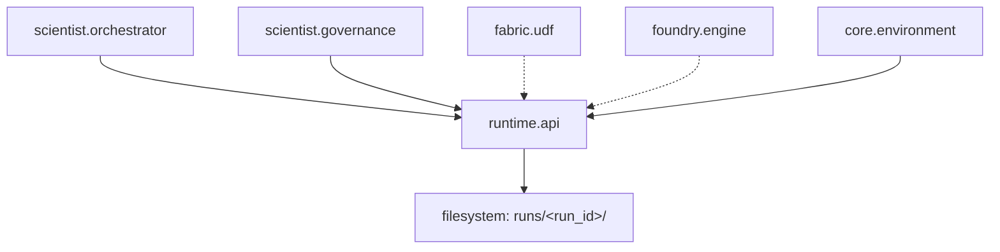

# Runtime Module (`polisyos.runtime`)

*Документация актуализирована на 2026-02-05 в соответствии с текущим состоянием кода и интеграциями.*

## Обзор

Модуль `polisyos.runtime` предоставляет **инфраструктуру управления жизненным циклом экспериментов** в системе симуляции политик. Чистый слой инфраструктуры обеспечивает воспроизводимость, аудит и структурированное хранение артефактов согласно **Закону D архитектуры**.

### Ключевые возможности
- **Воспроизводимость**: Уникальный `run_id` и полная трассировка каждого прогона
- **Аудит**: JSON Lines лог всех операций и решений
- **Артефакты**: Структурированное хранение результатов с переносимыми ссылками
- **Бюджеты**: Отслеживание использования ресурсов (compute, memory, time, LLM calls)
- **Переносимость**: Относительные пути позволяют перемещать директории `runs/`

## Текущее состояние

Runtime — **стабильный production-ready модуль** с активными интеграциями в основные компоненты системы:

### Структура модуля
```
runtime/
├── __init__.py          # Публичный API (7 экспортов: 1 модель + 6 функций)
├── api.py               # Основные функции управления жизненным циклом
├── manifest.py          # Pydantic модели данных (RunManifest, ArtifactRef)
└── README.md           # Эта документация
```

### Публичный API
```python
from polisyos.runtime import (
    RunManifest,                    # Модель паспорта эксперимента
    append_audit,                   # Добавление записи в audit trail
    finalize_run,                   # Завершение запуска с финальным статусом
    log_artifact,                   # Логирование артефакта прогона
    resolve_artifact_path,          # Разрешение пути к артефакту
    start_run,                      # Инициализация нового запуска
    update_budget_usage,            # Обновление использования бюджета
)
```

### Ключевые модели
- **`RunManifest`**: Полный "паспорт" эксперимента с метаданными, статусом, бюджетами и ссылками на артефакты
- **`ArtifactRef`**: Переносимая ссылка на артефакт с поддержкой относительных путей

## Архитектурная роль

Runtime представляет собой **современную инфраструктуру управления жизненным циклом экспериментов**, введенную для замены фрагментированных подходов хранения артефактов в отдельных компонентах системы.

### В контексте компиляторной трубы

```
NL → Scientist (LLM + Workflow) → IR → Compilation → Runtime (Fabric + Foundry) → Artifacts
```

Runtime стоит в конце трубы, собирая все артефакты в **структурированные результаты** прогона в директории `runs/<run_id>/`. Это обеспечивает единую точку входа для всех операций с артефактами экспериментов.

### Границы ответственности

- ✅ **Владеет**: жизненный цикл запусков, артефакты, audit trail, бюджеты, сериализация, разрешение путей
- ❌ **Не владеет**: бизнес-логика, JAX вычисления, БД, LLM, workflow orchestration

Runtime — это **чистая инфраструктура** без зависимостей от scientist/fabric/foundry, обеспечивающая соблюдение **Закона D** архитектуры Polisyos.

### Ключевые особенности
- **Строгая типизация**: Pydantic модели с `extra="forbid"`
- **Переносимость**: Относительные пути и `run_root` для перемещения директорий
- **Идемпотентность**: Все операции безопасны для повторного выполнения
- **Автоматическое создание директорий**: Нет ошибок на отсутствующие пути

## Структура артефактов

### Стандартная директория запуска

```
runs/<run_id>/
├── manifest.json              # RunManifest (паспорт прогона)
├── artifacts/                 # Структурированные результаты
│   ├── policy_ir/            # IR политики (JSON)
│   ├── simulation_results/   # Метрики симуляции (JSON)
│   ├── compiled_model/       # Скомпилированная модель
│   ├── data_views/           # Результаты UDF запросов (JSON)
│   └── audit_trail/          # Автоматически создаваемая ссылка на audit
├── audit.jsonl               # Аудит-лог всех операций (JSON Lines)
└── [decision_packet.json]    # Финальный артефакт (опционально)
```

### RunManifest (паспорт прогона)

```python
class RunManifest(BaseModel):
    schema_version: str = Field("1.0", pattern=r"^\d+\.\d+$")
    run_id: str
    parent_run_id: Optional[str] = None
    status: str = "running"
    started_at: str = Field(default_factory=lambda: datetime.now(timezone.utc).isoformat())
    finished_at: Optional[str] = None
    generator: Dict[str, str] = Field(default_factory=dict)
    budgets: Dict[str, float] = Field(default_factory=dict)
    budget_usage: Dict[str, float] = Field(default_factory=dict)
    pruning_reason: Optional[Dict[str, Any]] = None
    artifacts: List[ArtifactRef] = Field(default_factory=list)
    environment_ref: EnvironmentManifestRef | None = Field(default=None)
    environment_fingerprint: str | None = Field(default=None)
    run_root: Optional[str] = None

    model_config = ConfigDict(extra="forbid")
```

**Ключевые поля:**
- `run_id`: Уникальный идентификатор прогона (8 символов UUID)
- `status`: Текущий статус ("running", "completed", "pruned")
- `budgets`/`budget_usage`: Лимиты и использование ресурсов
- `artifacts`: Список всех артефактов прогона с ссылками
- `environment_ref`/`environment_fingerprint`: Захват окружения для воспроизводимости
- `run_root`: Корневая директория для разрешения относительных путей

### ArtifactRef (ссылка на артефакт)

```python
class ArtifactRef(BaseModel):
    artifact_type: str
    path: Optional[str] = None                    # Абсолютный путь (устаревший)
    relative_path: Optional[str] = None          # Относительный путь (рекомендуемый)
    media_type: str
    schema_version: Optional[str] = None
    step: Optional[str] = None
    created_at: str = Field(default_factory=lambda: datetime.now(timezone.utc).isoformat())

    model_config = ConfigDict(extra="forbid")
```

## API Reference

### Управление жизненным циклом

#### `start_run()`
Инициализирует новый запуск с автоматической генерацией `run_id`.

```python
from polisyos.runtime import start_run

# Минимальный запуск
manifest = start_run()

# Запуск с метаданными и бюджетами
manifest = start_run(
    run_id="abc123def",                         # Опционально, генерируется автоматически (8 символов UUID)
    parent_run_id="draft_123",                  # Для иерархических прогонов
    generator={"component": "scientist.workflow", "version": "1.0"},
    budgets={"compute": 1000.0, "memory": 2048.0, "time": 3600.0},
    base_dir=Path("runs")                       # Директория для хранения (по умолчанию "runs")
)
```

#### `finalize_run()`
Завершает запуск с финальным статусом.

```python
from polisyos.runtime import finalize_run

# Успешное завершение
finalize_run(run_id="abc123def", status="completed")

# Завершение с причиной pruning
finalize_run(
    run_id="abc123def",
    status="pruned",
    pruning_reason={
        "type": "budget_exceeded",
        "limit": 1000.0,
        "actual": 1200.0,
        "resource": "compute"
    },
    base_dir=Path("runs")
)
```

#### `resolve_artifact_path()`
Разрешает абсолютный путь к артефакту из ArtifactRef.

```python
from polisyos.runtime import resolve_artifact_path

# Разрешение пути с учетом run_root
abs_path = resolve_artifact_path(
    artifact_ref,
    base_dir=Path("runs"),
    run_root=Path("/original/location")  # Опционально, если run_root отличается
)
```

### Логирование артефактов

#### `log_artifact()`
Сохраняет артефакт прогона с автоматической категоризацией и созданием переносимых ссылок.

```python
from polisyos.runtime import log_artifact

# Логирование Policy IR
policy_ir = {"semantic": {...}, "advisory": {...}}
ref = log_artifact(
    run_id="abc123def",
    artifact_type="policy_ir",
    payload=policy_ir,
    step="draft",
    base_dir=Path("runs")
)
# ref.relative_path будет содержать "abc123def/artifacts/policy_ir/20240101T100000_policy_ir.json"

# Логирование с кастомным именем файла
ref = log_artifact(
    run_id="abc123def",
    artifact_type="policy_ir",
    payload=policy_ir,
    filename="draft_v1_policy_ir.json",
    step="draft",
    base_dir=Path("runs")
)

# Логирование результатов симуляции
simulation_results = {
    "metrics": {"efficiency": 0.85, "fairness": 0.72},
    "timesteps": 100,
    "convergence": True
}
ref = log_artifact(
    run_id="abc123def",
    artifact_type="simulation_results",
    payload=simulation_results,
    step="simulate",
    schema_version="1.0",
    base_dir=Path("runs")
)

# Логирование registry bundle для воспроизводимости
registry_bundle = {"mechanisms": [...], "slots": [...], "merge_rules": [...]}
ref = log_artifact(
    run_id="abc123def",
    artifact_type="registry_bundle_ref",
    payload=registry_bundle,
    step="runtime",
    base_dir=Path("runs")
)

# Логирование environment manifest для обеспечения воспроизводимости
environment_manifest = {
    "environment_ref": {...},  # EnvironmentManifest данные
    "fingerprint": "abc123..." # Хэш-сумма окружения
}
ref = log_artifact(
    run_id="abc123def",
    artifact_type="environment_ref",
    payload=environment_manifest,
    step="runtime",
    base_dir=Path("runs")
)
# Автоматически обновляет environment_ref и environment_fingerprint в RunManifest

# Логирование data view результатов
panel_data = {"records": [...], "metadata": {...}}  # Результат UDF запроса через Fabric
ref = log_artifact(
    run_id="abc123def",
    artifact_type="data_views",
    payload=panel_data,
    step="compile_data",
    base_dir=Path("runs")
)
```

### Аудит и бюджеты

#### `append_audit()`
Добавляет запись в audit trail прогона.

```python
from polisyos.runtime import append_audit

# Логирование этапа workflow
append_audit(run_id="policy_sim_001", record={
    "timestamp": "2024-01-01T10:00:00Z",
    "event": "workflow_step_started",
    "step": "validate_ir",
    "details": {"ir_size": 1500, "entities_count": 25}
}, base_dir=Path("runs"))

# Логирование решения governor
append_audit(run_id="policy_sim_001", record={
    "timestamp": "2024-01-01T10:05:00Z",
    "event": "governor_decision",
    "decision": "needs_revision",
    "issues": [
        {
            "issue_id": "INVALID_OBJECTIVE",
            "severity": "error",
            "loc": "objectives.0",
            "message": "Objective function not measurable"
        }
    ]
}, base_dir=Path("runs"))
```

#### `update_budget_usage()`
Обновляет текущее использование ресурсов.

```python
from polisyos.runtime import update_budget_usage

# Обновление после симуляции
update_budget_usage(run_id="policy_sim_001", budget_usage={
    "compute": 750.5,
    "memory": 1024.0,
    "time": 1800.0
}, base_dir=Path("runs"))
```

## Типы артефактов

### Стандартные категории

- **`policy_ir`**: Policy Surface IR в JSON формате (semantic + advisory contracts)
- **`simulation_results`**: Метрики и результаты симуляции в Foundry
- **`compiled_model`**: Скомпилированная JAX модель (ProgramGraph + ExecPlan)
- **`data_views`**: Результаты UDF запросов через Fabric (панели, сети, факты)
- **`registry_bundle_ref`**: Ссылка на registry bundle для обеспечения воспроизводимости
- **`environment_ref`**: Манифест окружения для обеспечения воспроизводимости симуляций
- **`validation_report`**: Отчеты валидации IR и линковки
- **`gradient_health`**: Метрики здоровья градиентов и сходимости
- **`audit_trail`**: Автоматически создается из audit.jsonl (JSON Lines формат)

### ArtifactRef модель

```python
class ArtifactRef(BaseModel):
    artifact_type: str              # Категория артефакта
    path: Optional[str] = None      # Абсолютный путь (устаревший, для обратной совместимости)
    relative_path: Optional[str] = None  # Относительный путь (рекомендуемый)
    media_type: str                 # MIME тип ("application/json", "text/plain")
    schema_version: Optional[str] = None  # Версия схемы для структурированных данных
    step: Optional[str] = None      # Этап workflow, на котором создан
    created_at: str = Field(default_factory=lambda: datetime.utcnow().isoformat())

    model_config = ConfigDict(extra="forbid")
```

## Аудит-лог

### Формат JSON Lines

```jsonl
{"timestamp": "2024-01-01T10:00:00Z", "event": "run_started", "run_id": "policy_sim_001"}
{"timestamp": "2024-01-01T10:00:05Z", "event": "ir_drafted", "tokens_used": 1250}
{"timestamp": "2024-01-01T10:01:00Z", "event": "validation_passed", "checks": ["schema", "limits", "cycles"]}
{"timestamp": "2024-01-01T10:02:00Z", "event": "simulation_started", "backend": "jax_cpu"}
{"timestamp": "2024-01-01T10:15:00Z", "event": "simulation_completed", "timesteps": 100, "converged": true}
{"timestamp": "2024-01-01T10:15:05Z", "event": "governor_decision", "verdict": "approve"}
```

### Автоматические события

- `run_started`: Создание RunManifest
- `artifact_logged`: Логирование каждого артефакта
- `budget_updated`: Изменение использования ресурсов
- `run_finalized`: Завершение с финальным статусом

## Интеграция с компонентами

Runtime — **центральная инфраструктура** для всех компонентов системы, обеспечивающая единую точку хранения артефактов.

### Ключевые интеграции

#### Scientist/Orchestrator (`scientist.orchestrator`)
- **flow_nodes.py**: Управление жизненным циклом через `start_run()`, `log_artifact()`, `finalize_run()`
- **audit.py**: Синхронизация audit trail между workflow и runtime
- **Логирование**: IR, data views, simulation results, registry bundles

#### Governance/Preflight (`scientist.governance.preflight`)
- Логирование результатов governance checks через `log_artifact()`
- Интеграция с validation pipeline и quality gates

#### Fabric/UDF (`fabric.*`)
- Логирование результатов UDF запросов как `data_views` артефакты
- Обеспечение трассировки всех data operations

#### Foundry (`foundry.*`)
- Логирование результатов симуляции и метрик
- Обновление бюджетов после симуляционных прогонов

#### Core/Environment (`core.artifacts.environment`)
- Захват и логирование environment manifest для воспроизводимости
- Автоматическое обновление `environment_ref` и `environment_fingerprint` в RunManifest
- Валидация совместимости окружений

## Воспроизводимость и трассировка

### Детерминированные прогоны

Каждый RunManifest включает:
- `seed`: Для детерминированных вычислений
- `backend`: JAX backend (cpu, gpu, tpu)
- `generator`: Версия и компонент, создавший прогон
- `library_versions`: Все версии зависимостей

### Миграции

Артефакты версионированы через `schema_version`:
- `v1.0`: Базовая схема
- `v1.1`: Добавление gradient_health
- `v2.0`: Изменение структуры simulation_results

## Производительность и надежность

### Оптимизации

- **Ленивая загрузка**: Manifest читается только при обновлении
- **JSON Lines streaming**: Аудит-лог поддерживает потоковое чтение
- **Автоматическое создание директорий**: Нет ошибок на отсутствующие пути

### Обработка ошибок

```python
# Runtime операции идемпотентны и безопасны
try:
    log_artifact(run_id, "policy_ir", payload)
except FileNotFoundError:
    # Создание директорий автоматически
    pass
except ValidationError:
    # Pydantic валидация на всех моделях
    append_audit(run_id, {"event": "artifact_validation_failed", "error": str(e)})
```

## Миграция с legacy подхода

### As-is проблемы

До введения runtime API компоненты использовали фрагментированные подходы хранения артефактов:
- **Scientist**: `logs/run_records/` + `logs/decision_packets/` (deprecated в пользу `runtime.log_artifact`)
- **Foundry**: Прямые print statements или локальные файлы без структурированного хранения
- **Fabric**: Результаты UDF запросов в `integration.duckdb` без полной трассировки
- **Отсутствие единой точки**: Каждый компонент управлял своими артефактами независимо

### To-be преимущества

- **Единая структура**: Все артефакты в `runs/<run_id>/`
- **Ссылка на всё**: RunManifest как "паспорт прогона"
- **Воспроизводимость**: Полная трассировка для повторения
- **Аудит**: JSON Lines лог всех операций

## Возможности и ограничения

### Поддерживаемые артефакты
- `policy_ir`: Policy Surface IR в JSON формате
- `simulation_results`: Метрики симуляции из Foundry
- `data_views`: Результаты UDF запросов через Fabric
- `registry_bundle_ref`: Registry bundles для воспроизводимости
- `environment_ref`: Манифесты окружения
- `audit_trail`: Автоматический JSON Lines лог
- `validation_report`: Результаты валидации
- `gradient_health`: Метрики здоровья градиентов

### Ограничения
- Только файловая система (нет поддержки внешних хранилищ)
- JSON Lines audit trail — последовательное чтение без индексов
- Инфраструктура хранения, без бизнес-логики

## Основные паттерны использования

### Управление бюджетом в workflow
```python
# Синхронизация бюджетов с runtime
update_budget_usage(run_id=run_id, budget_usage={"llm_calls": 3.0, "sim_runs": 1.0})
```

### Структурированное хранение
```
runs/<run_id>/
├── manifest.json              # RunManifest (паспорт прогона)
├── artifacts/                 # Структурированные результаты
│   ├── policy_ir/            # Policy Surface IR
│   ├── simulation_results/   # Метрики симуляции
│   └── data_views/           # Результаты UDF запросов
├── audit.jsonl               # Audit trail (JSON Lines)
└── ...
```

## Примеры использования

### Пример полного цикла эксперимента

```python
from polisyos.runtime import start_run, log_artifact, finalize_run

# Инициализация эксперимента
manifest = start_run(budgets={"llm_calls": 3.0, "sim_runs": 1.0})
run_id = manifest.run_id

# Логирование артефактов на этапах
log_artifact(run_id, "policy_ir", policy_ir, step="draft")
log_artifact(run_id, "simulation_results", sim_results, step="simulate")

# Финализация с pruning при необходимости
finalize_run(run_id, status="completed")  # или "pruned"
```

## Тестирование

### Unit тесты
```bash
pytest policy-engine/tests/runtime/test_runtime_manifest_paths.py -v
```

### Integration тесты
```bash
pytest policy-engine/tests/integration/test_workflow_smoke.py -k "workflow_with_runtime" -v
pytest policy-engine/tests/integration/test_workflow_llm.py -v
```

### Контрактные гарантии
- ✅ Воспроизводимость: уникальный run_id и полная трассировка
- ✅ Переносимость: директории `runs/` можно перемещать
- ✅ Целостность audit trail и бюджетов
- ✅ Отсутствие legacy артефактов

## Архитектурные гарантии

Runtime обеспечивает соблюдение **Закона D**:

- ✅ **Воспроизводимость**: Каждый прогон имеет run_id, seed, версии
- ✅ **Аудит**: Полный лог всех операций в JSON Lines
- ✅ **Артефакты**: Структурированное хранение всех результатов
- ✅ **Бюджеты**: Отслеживание и enforcement лимитов ресурсов

## Текущее состояние и связи

### Активные интеграции

- **Scientist/Orchestrator**: Основной потребитель runtime API
  - `scientist.orchestrator.flow_nodes` - управление жизненным циклом экспериментов
  - `scientist.orchestrator.audit` - синхронизация audit trail
- **Scientist/Governance**: Интеграция с preflight проверками
  - `scientist.governance.preflight` - логирование результатов governance checks
- **Fabric/UDF**: Косвенная интеграция через логирование результатов UDF запросов
- **Foundry**: Косвенная интеграция через логирование результатов симуляции
- **Core/Artifacts/Environment**: Интеграция с захватом окружения
  - `core.artifacts.environment.EnvironmentManifest` - полная спецификация окружения
  - `core.artifacts.environment.EnvironmentManifestRef` - типизированная ссылка на артефакт
  - Автоматическое обновление `environment_ref` и `environment_fingerprint` в RunManifest

### Архитектурные связи



### Поток данных
```
Scientist Workflow → Runtime API → File System → Artifacts + Audit Trail
```

### Ключевые особенности
- **Переносимость**: Относительные пути позволяют перемещать директории
- **Строгая схема**: Pydantic с `extra="forbid"`
- **Идемпотентность**: Все операции безопасны для повторного выполнения
- **Версионирование**: `schema_version` для эволюции формата

## Тестирование

### Unit тесты

```bash
# Тестирование API и путей
pytest policy-engine/tests/runtime/test_runtime_manifest_paths.py -v
```

### Integration тесты

```bash
# Полный workflow с runtime
pytest policy-engine/tests/integration/test_workflow_smoke.py::test_workflow_with_runtime -v

# Runtime в контексте scientist
pytest policy-engine/tests/integration/test_workflow_llm.py -k runtime -v
```

## Архитектурные гарантии

Runtime является ключевым компонентом, обеспечивающим соблюдение **Закона D** архитектуры Polisyos:

- ✅ **Воспроизводимость**: Каждый прогон имеет уникальный run_id, seed и полную трассировку всех операций
- ✅ **Аудит**: Полный JSON Lines лог всех операций с временными метками и контекстом
- ✅ **Артефакты**: Структурированное хранение всех результатов с переносимыми относительными ссылками
- ✅ **Бюджеты**: Отслеживание и enforcement лимитов ресурсов (compute, memory, time, LLM calls)
- ✅ **Переносимость**: Директории `runs/` можно перемещать между системами без потери ссылок
- ✅ **Строгая схема**: Все модели данных используют Pydantic с `extra="forbid"` для предотвращения ошибок
- ✅ **Идемпотентность**: Все операции безопасны для повторного выполнения

## Производительность и надежность

### Оптимизации

- **Ленивая загрузка**: Manifest читается только при обновлении
- **JSON Lines streaming**: Аудит-лог поддерживает потоковое чтение
- **Автоматическое создание директорий**: Нет ошибок на отсутствующие пути
- **Идемпотентность**: Все операции безопасны для повторного выполнения

### Обработка ошибок

```python
# Runtime операции устойчивы к ошибкам
try:
    log_artifact(run_id, "policy_ir", payload)
except FileNotFoundError:
    # Создание директорий автоматически
    pass
except ValidationError as e:
    # Pydantic валидация на всех моделях
    append_audit(run_id, {"event": "artifact_validation_failed", "error": str(e)})
```

Runtime — **инфраструктурный фундамент** системы Polisyos, обеспечивающий **Закон D** через воспроизводимость, аудит, артефакты и бюджеты. Схема версии 1.0 с поддержкой переносимости и обратной совместимости.
