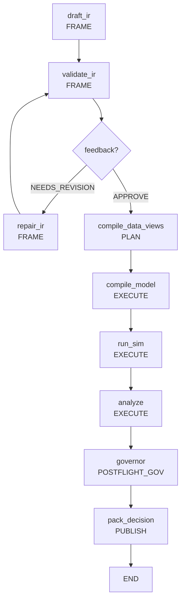

# Scientist: AI Policy Scientist

**AI-driven Policy Design and Orchestration System**

Scientist - это "мозг" Policy Engine, отвечающий за автоматическое проектирование, валидацию и оптимизацию экономических политик с использованием LLM и дифференцируемых симуляций. Модуль реализует полный цикл от естественного языка пользователя до оптимизированного пакета решений.

## Архитектура

Scientist построен как многоуровневая система оркестрации с четким разделением ответственности:

### 🤖 Agent Layer (Агенты и генерация)

Отвечает за генерацию и принятие решений о политиках:

- **base.py**: Абстрактный класс `BaseAgent` и `MockAgent` для эвристического принятия решений
- **drafter.py**: Узел генерации политики через LLM (`MockLLM` для тестирования)
- **prompts.py**: Системные промпты для LLM с каталогом доступных механизмов
- **prompt.py**: Альтернативные промпты для Policy Scientist

### 🎯 Kernel Layer (Ядро управления)

Обеспечивает контроль выполнения и безопасность:

- **budgets.py**: Модели бюджетов (`ComputeBudget`, `EvidenceBudget`, `LegitimacyBudget`, `ComplexityBudget`)
- **fsm.py**: Конечный автомат состояний (`Phase` enum, `KernelState`, `ALLOWED_TRANSITIONS`)
- **guards.py**: Проверки переходов между состояниями и валидация артефактов
- **human_gate.py**: Система человеческих ворот (`GateRequest`, `GateDecision`)

### 🔬 Compute Layer (Вычислительные спецификации)

Определяет интерфейсы для запуска симуляций:

- **job_spec.py**: Спецификации задач (`JobSpec`, `JobKey`, `JobResult`)
- **runner.py**: Заглушка для запуска вычислительных задач (будет интегрирован с Foundry)

### 📊 Design of Experiments (DoE)

Планирование экспериментов и сценариев:

- **designs.py**: Модели дизайнов экспериментов (`ScenarioSweep`, `AblationPlan`, `SensitivityPlan`)

### 🛡️ Governance Layer (Управление и безопасность)

Контроль качества и безопасности:

- **preflight.py**: Предварительные проверки перед запуском экспериментов
- **postflight.py**: Пост-запусковые проверки и валидация результатов

### 🎼 Orchestrator Layer (Основная оркестрация)

Управляет полным жизненным циклом экспериментов:

- **workflow.py**: Основной граф состояний LangGraph с 9 узлами
- **state.py**: `ExperimentState` (TypedDict с 70+ полями управления экспериментом)
- **flow_nodes.py**: Реализации всех узлов workflow (1000+ строк кода)
- **decision_packet.py**: Итоговый артефакт прогона (`DecisionPacket` с полной информацией)
- **run_record.py**: Записи для воспроизводимости (`RunRecord` с метаданными)
- **audit.py**: Система аудита и логирования
- **data_loader.py**: Загрузка начальных данных
- **nodes.py**: Дополнительные узлы workflow
- **optimizer.py**: Градиентная оптимизация параметров политик
- **registry.py**: Управление реестрами компонентов

### 📤 Publisher Layer (Публикация)

Финализация и экспорт результатов:

- **publisher.py**: Публикация решений и артефактов экспериментов

## Workflow Pipeline

Scientist реализует декларативный workflow на LangGraph с поддержкой FSM фаз:



### FSM Фазы (Kernel Layer)

Workflow управляется конечным автоматом состояний:

1. **INTAKE**: Начальная фаза, подготовка к эксперименту
2. **FRAME**: Генерация и валидация политики (draft_ir, validate_ir, repair_ir)
3. **PREFLIGHT_GOV**: Предварительные проверки безопасности
4. **PLAN**: Планирование данных и компиляции (compile_data_views)
5. **EXECUTE**: Запуск симуляции (compile_model, run_sim, analyze)
6. **POSTFLIGHT_GOV**: Финальные проверки (governor)
7. **DECIDE**: Принятие решения
8. **PUBLISH**: Публикация результатов (pack_decision)
9. **ARCHIVE**: Архивация эксперимента

### Узлы Workflow

1. **draft_ir** (FRAME): Генерация начальной политики из пользовательского запроса через LLM
2. **validate_ir** (FRAME): Валидация структуры и семантики политики
3. **repair_ir** (FRAME): Автоматическое исправление ошибок валидации через повторные LLM вызовы
4. **compile_data_views** (PLAN): Подготовка DataView запросов для Fabric (UDF)
5. **compile_model** (EXECUTE): Компиляция политики в дифференцируемые JAX механизмы
6. **run_sim** (EXECUTE): Запуск симуляции и сбор метрик через Foundry
7. **analyze** (EXECUTE): Анализ результатов симуляции и расчет метрик
8. **governor** (POSTFLIGHT_GOV): Финальное решение на основе бюджетов и политики безопасности
9. **pack_decision** (PUBLISH): Формирование `DecisionPacket` с полной информацией о эксперименте

## Ключевые возможности

### 🤖 LLM Integration
- Поддержка OpenAI/Anthropic через LangChain
- MockLLM для тестирования без API ключей
- Автоматическая генерация PolicyRequestIR из естественного языка
- Self-healing: исправление ошибок валидации через повторные вызовы

### 🔬 Дифференцируемые симуляции
- Компиляция политик в JAX механизмы (Equinox)
- Градиентная оптимизация параметров через Optax
- Многокритериальная оптимизация (PyMOO)
- Fidelity levels для контроля точности/скорости

### 📊 Data Integration
- Интеграция с Fabric (DuckDB + Kuzu)
- Декларативные DataViewRequest
- PII tiers и access control
- Entity resolution и reconciliation

### 🎯 Governance & Safety
- **Budget Controls**: `ComputeBudget`, `EvidenceBudget`, `LegitimacyBudget`, `ComplexityBudget`
- **FSM Guards**: Проверки переходов между состояниями и валидация артефактов
- **Human Gates**: Система `GateRequest`/`GateDecision` для человеческого одобрения
- **Preflight/Postflight Checks**: Автоматические проверки безопасности
- **Policy Safety**: Валидация запрещенных механизмов и селекторов
- **Audit Trail**: Полный лог всех операций для compliance

### 🔄 Reproducibility & Artifacts
- **RunRecord**: Детальные метаданные о прогоне (seed, backend, версии библиотек, флаги)
- **DecisionPacket**: Итоговый артефакт с IR, результатами, аудитом
- **Artifact Management**: Версионирование и provenance через CAS
- **Parent/Child Relationships**: Связи между экспериментами для воспроизводимости

### ⚙️ Compute & Experiment Design
- **Job Specifications**: `JobSpec`, `JobKey`, `JobResult` для структурированных задач
- **Design of Experiments**: `ScenarioSweep`, `AblationPlan`, `SensitivityPlan`
- **Distributed Execution**: Подготовка к кластерному запуску симуляций

## API и интерфейсы

### Основной вход
```python
from polisyos.scientist.orchestrator.workflow import build_workflow

# Создание workflow
workflow = build_workflow()

# Запуск с пользовательским запросом
result = workflow.invoke({
    "user_request": "Reduce poverty through targeted subsidies",
    "optimize": True,
    "budget": {"max_llm_calls": 3, "max_sim_runs": 2}
})
```

### ExperimentState

Центральная структура данных workflow (TypedDict с 70+ полями):

```python
class ExperimentState(TypedDict):
    # Входные данные
    user_request: str
    ir: Optional[PolicySurfaceIR]
    last_ir_json: Optional[str]
    last_error: Optional[str]

    # Управление workflow и FSM
    optimize: Optional[bool]
    run_id: Optional[str]
    parent_run_id: Optional[str]
    phase: Optional[str]  # Текущая фаза FSM
    budget: Optional[Dict[str, float]]
    budget_usage: Optional[Dict[str, float]]

    # Артефакты и ссылки
    policy_ir_ref: Optional[Dict[str, Any]]
    state_snapshot_ref: Optional[Dict[str, Any]]
    metrics_ref: Optional[Dict[str, Any]]
    registry_bundle_ref: Optional[Dict[str, Any]]

    # Результаты симуляции
    simulation_results: Optional[Dict[str, float]]
    analysis: Optional[Dict[str, Any]]

    # Управление качеством
    feedback: Optional[GovernorFeedback]
    revision_count: int
    max_repair_attempts: int
    repair_log: List[RepairAttempt]

    # Аудит и трассировка
    audit_trail: List[Dict[str, Any]]
    decision_packet: Optional[Dict[str, Any]]
```

### Новые модели данных

#### Budget Models
```python
from polisyos.scientist.kernel.budgets import ComputeBudget, EvidenceBudget

compute_budget = ComputeBudget(
    max_llm_calls=3.0,
    max_sim_runs=1.0,
    max_wall_time_s=120.0
)

evidence_budget = EvidenceBudget(max_queries=10)
```

#### FSM Models
```python
from polisyos.scientist.kernel.fsm import Phase, KernelState

# Текущая фаза эксперимента
current_phase = Phase.EXECUTE

# Состояние ядра
kernel_state = KernelState(phase=Phase.FRAME)
can_transition = kernel_state.can_transition(Phase.PLAN)
```

#### Decision Packet
```python
from polisyos.scientist.orchestrator.decision_packet import DecisionPacket

packet = DecisionPacket(
    run_id="exp_001",
    run_record=run_record,
    policy_ir=policy_ir,
    simulation_results={"gdp": 1000.0, "unemployment": 0.05},
    feedback=governor_feedback,
    audit_trail=audit_events
)
```

#### Job Specifications
```python
from polisyos.scientist.compute.job_spec import JobSpec, JobKey

job_spec = JobSpec(
    program_ref=artifact_ref,
    seed=42,
    required_metrics=["gdp", "unemployment"]
)

job_key = JobKey.from_spec(job_spec)
```

### Агенты

```python
from polisyos.scientist.agent.base import BaseAgent, MockAgent

class MyAgent(BaseAgent):
    def decide(self, step: int, context_df) -> PolicyRequestIR:
        # Ваша логика принятия решений
        pass
```

## Примеры использования

### Базовый запуск с MockAgent

```python
from polisyos.scientist.orchestrator.workflow import build_workflow

# Создание и запуск workflow
workflow = build_workflow()
result = workflow.invoke({
    "user_request": "Implement progressive taxation to reduce inequality"
})

print(f"Decision: {result.get('decision_packet', {}).get('verdict')}")
```

### Работа с расширенными бюджетами

```python
from polisyos.scientist.orchestrator.workflow import build_workflow
from polisyos.scientist.kernel.budgets import ComputeBudget, EvidenceBudget

# Создание детализированных бюджетов
compute_budget = ComputeBudget(
    max_llm_calls=5.0,
    max_sim_runs=3.0,
    max_wall_time_s=300.0
)

evidence_budget = EvidenceBudget(max_queries=20)

workflow = build_workflow()
result = workflow.invoke({
    "user_request": "Design a universal basic income policy",
    "budget": compute_budget.model_dump(),
    "evidence_budget": evidence_budget.model_dump()
})
```

### Работа с Design of Experiments

```python
from polisyos.scientist.doe.designs import ScenarioSweep

# Определение сценариев для сравнения
scenarios = ScenarioSweep(scenarios=[
    {"ubi_amount": 500, "funding_source": "income_tax"},
    {"ubi_amount": 750, "funding_source": "wealth_tax"},
    {"ubi_amount": 1000, "funding_source": "carbon_tax"}
])

workflow = build_workflow()
result = workflow.invoke({
    "user_request": "Compare different UBI funding mechanisms",
    "doe_design": scenarios.model_dump(),
    "optimize": True
})
```

### Анализ результатов с Decision Packet

```python
from polisyos.scientist.orchestrator.decision_packet import build_decision_packet

# Получение полного результата
decision_packet = result.get("decision_packet")

if decision_packet:
    print(f"Run ID: {decision_packet.run_id}")
    print(f"Policy Schema: {decision_packet.policy_ir.schema_version}")

    # Экономические метрики
    results = decision_packet.simulation_results
    if results:
        print(f"GDP Impact: {results.get('gdp_change', 'N/A')}%")
        print(f"Unemployment: {results.get('unemployment_rate', 'N/A')}%")
        print(f"Income Inequality (Gini): {results.get('gini_coefficient', 'N/A')}")

    # Решение губернатора
    feedback = decision_packet.feedback
    if feedback:
        verdict = feedback.get("verdict")
        print(f"Governor Verdict: {verdict}")

        if verdict == "APPROVE":
            print("✅ Policy approved for implementation")
        elif verdict == "REJECT":
            issues = feedback.get("issues", [])
            print(f"❌ Rejected due to: {[i.get('message') for i in issues]}")

    # Аудит траил
    audit_events = decision_packet.audit_trail
    print(f"Total audit events: {len(audit_events)}")
```

## Конфигурация и настройки

### Budget Controls

```python
budget_config = {
    "max_llm_calls": 3,      # Максимум вызовов LLM
    "max_sim_runs": 1,       # Максимум запусков симуляции
    "max_wall_time_s": 120,  # Максимум времени выполнения (сек)
}
```

### Оптимизатор настройки

```python
optimizer_config = {
    "steps": 100,
    "learning_rate": 0.05,
    "clip_grad_norm": 1.0,
    "min_balance": -1000.0
}
```

### Governor Rules

Governor принимает решение на основе:
- **Budget constraints**: Дефicit > min_balance
- **Policy safety**: Запрещенные механизмы/селекторы
- **Validation issues**: Критические ошибки структуры

## Разработка и расширение

### Добавление нового агента

```python
from polisyos.scientist.agent.base import BaseAgent
from polisyos.ir.contract import PolicyRequestIR

class LLMAgent(BaseAgent):
    def __init__(self, model_name: str = "gpt-4"):
        self.model_name = model_name

    def decide(self, step: int, context_df) -> PolicyRequestIR:
        # Реализация через LLM API
        pass
```

### Добавление узла workflow

```python
from polisyos.scientist.orchestrator.state import ExperimentState

def custom_analysis_node(state: ExperimentState) -> ExperimentState:
    """Кастомный узел анализа"""
    results = state.get("simulation_results", {})
    # Ваша логика анализа
    analysis = {"custom_metric": calculate_metric(results)}
    return {**state, "analysis": analysis}
```

### Интеграция нового LLM провайдера

```python
from polisyos.scientist.agent.drafter import MockLLM

class AnthropicLLM(MockLLM):
    def invoke(self, prompt: str) -> str:
        # Интеграция с Anthropic Claude
        pass
```

### Расширение механизмов оптимизации

```python
from polisyos.scientist.orchestrator.optimizer import optimize_mechanisms

# Кастомная функция потерь
def custom_loss_fn(state, mechanisms):
    # Многокритериальная оптимизация
    return combined_objective(state)
```

### Работа с Kernel FSM

```python
from polisyos.scientist.kernel.fsm import Phase, KernelState, advance_phase
from polisyos.scientist.kernel.guards import require_artifacts

# Создание состояния эксперимента
experiment_state = {
    "phase": Phase.INTAKE.value,
    "user_request": "Reduce inequality",
    "run_id": "exp_001"
}

# Переход между фазами с проверками
try:
    # Проверка наличия необходимых артефактов
    experiment_state = require_artifacts(experiment_state, ["user_request", "run_id"])

    # Переход к следующей фазе
    experiment_state = advance_phase(experiment_state, Phase.FRAME)
    print(f"✅ Transitioned to phase: {experiment_state['phase']}")

except ValueError as e:
    print(f"❌ Phase transition failed: {e}")
```

### Работа с Compute Jobs

```python
from polisyos.scientist.compute.job_spec import JobSpec, JobKey
from polisyos.scientist.compute.runner import run_job
from polisyos.core.artifacts.manifest import ArtifactRef

# Создание спецификации задачи
job_spec = JobSpec(
    program_ref=ArtifactRef(
        id="sha256:abcd1234...",
        media_type="application/octet-stream",
        size=1024
    ),
    seed=42,
    mode="production",
    required_metrics=["gdp", "unemployment", "poverty_rate"]
)

# Получение ключа задачи
job_key = JobKey.from_spec(job_spec)
print(f"Job Key: {job_key.value}")

# Запуск задачи (заглушка)
result = run_job(job_spec)
print(f"Job completed: {result.job_key.value}")
```

### Работа с Governance

```python
from polisyos.scientist.governance.preflight import preflight_checks
from polisyos.scientist.governance.postflight import postflight_checks
from polisyos.scientist.kernel.human_gate import GateRequest, GateDecision

# Предварительные проверки
experiment_state = {"policy_ir": valid_policy, "budget": {"max_llm_calls": 3}}
state, gate_request = preflight_checks(experiment_state)

if gate_request:
    print(f"🚨 Human gate required: {gate_request.reason}")

    # Имитация решения человека
    gate_decision = GateDecision(
        approved=True,
        actor="admin@policy.org",
        reason_codes=[],
        notes="Approved for testing"
    )

# Пост-запусковые проверки
final_state, final_decision = postflight_checks(experiment_state)
if final_decision and not final_decision.approved:
    print(f"❌ Post-flight rejection: {final_decision.reason_codes}")
```

### Работа с Run Records

```python
from polisyos.scientist.orchestrator.run_record import build_run_record, ReproMode
import json

# Создание записи для воспроизводимости
run_record = build_run_record(
    run_id="exp_042_baseline",
    seed=12345,
    repro_mode=ReproMode.STRICT,
    parent_run_id=None,
    generator={"name": "policy-engine", "version": "0.2.0"}
)

print(f"Python: {run_record.python_version}")
print(f"JAX Backend: {run_record.backend}")
print(f"JAX Version: {run_record.library_versions.get('jax')}")

# Сохранение для аудита
with open(f"logs/run_records/{run_record.run_id}.json", "w") as f:
    json.dump(run_record.model_dump(), f, indent=2)
```

## Детальные модели данных

### Kernel Models (Ядро управления)

#### FSM (Finite State Machine)
```python
from polisyos.scientist.kernel.fsm import Phase, KernelState, ALLOWED_TRANSITIONS

# Все фазы эксперимента
phases = [
    Phase.INTAKE,      # Начало
    Phase.FRAME,       # Генерация политики
    Phase.PREFLIGHT_GOV,  # Предварительные проверки
    Phase.PLAN,        # Планирование
    Phase.EXECUTE,     # Выполнение
    Phase.POSTFLIGHT_GOV,  # Финальные проверки
    Phase.DECIDE,      # Принятие решения
    Phase.PUBLISH,     # Публикация
    Phase.ARCHIVE      # Архивация
]

# Создание состояния ядра
kernel = KernelState(phase=Phase.FRAME)

# Проверка допустимого перехода
if kernel.can_transition(Phase.PLAN):
    kernel.phase = Phase.PLAN
```

#### Budget Models
```python
from polisyos.scientist.kernel.budgets import (
    ComputeBudget, EvidenceBudget, LegitimacyBudget, ComplexityBudget
)

# Вычислительный бюджет
compute_budget = ComputeBudget(
    max_llm_calls=5.0,
    max_sim_runs=2.0,
    max_wall_time_s=300.0
)

# Бюджет доказательств (запросов данных)
evidence_budget = EvidenceBudget(max_queries=20)

# Бюджет легитимности
legitimacy_budget = LegitimacyBudget(
    require_human_gate=True,
    notes=["Требуется одобрение для налоговых изменений"]
)

# Бюджет сложности
complexity_budget = ComplexityBudget(
    max_interventions=5,
    max_scenarios=3
)
```

#### Human Gate System
```python
from polisyos.scientist.kernel.human_gate import GateRequest, GateDecision

# Запрос на человеческое одобрение
gate_request = GateRequest(
    run_id="exp_001",
    reason="Политика превышает бюджетный дефицит",
    details={"deficit": -1500.0, "threshold": -1000.0}
)

# Решение человека
gate_decision = GateDecision(
    approved=False,
    actor="admin@example.com",
    reason_codes=["budget_exceeded"],
    notes="Уменьшите субсидии на 20%"
)
```

### Compute Models (Спецификации задач)

#### Job Specifications
```python
from polisyos.scientist.compute.job_spec import JobSpec, JobKey, JobResult

# Спецификация задачи симуляции
job_spec = JobSpec(
    program_ref=program_artifact,
    exec_plan_ref=execution_plan,
    state_snapshot_ref=initial_state,
    seed=42,
    mode="production",
    required_metrics=["gdp", "unemployment", "income_inequality"],
    notes=["Эксперимент с прогрессивным налогообложением"]
)

# Ключ задачи (хеш от спецификации)
job_key = JobKey.from_spec(job_spec)

# Результат выполнения
job_result = JobResult(
    job_key=job_key,
    state_delta_ref=final_state_artifact,
    metrics_ref=metrics_artifact,
    warnings=["Небольшая численная нестабильность в шаге 50"]
)
```

### Design of Experiments (DoE)

#### Experiment Designs
```python
from polisyos.scientist.doe.designs import ScenarioSweep, AblationPlan, SensitivityPlan

# Сканирование сценариев
scenario_sweep = ScenarioSweep(scenarios=[
    {"tax_rate": 0.1, "subsidy_rate": 0.05},
    {"tax_rate": 0.2, "subsidy_rate": 0.10},
    {"tax_rate": 0.3, "subsidy_rate": 0.15}
])

# План абляции (удаление компонентов)
ablation_plan = AblationPlan(targets=[
    "income_tax_mechanism",
    "unemployment_subsidy",
    "corporate_tax"
])

# Анализ чувствительности
sensitivity_plan = SensitivityPlan(parameters=[
    "tax_rate_sensitivity",
    "subsidy_elasticity",
    "labor_market_response"
])
```

### Governance Models (Управление)

#### Preflight Checks
```python
from polisyos.scientist.governance.preflight import preflight_checks

# Предварительные проверки безопасности
state, gate_request = preflight_checks(experiment_state)

if gate_request:
    print(f"Требуется человеческое одобрение: {gate_request.reason}")
```

#### Postflight Checks
```python
from polisyos.scientist.governance.postflight import postflight_checks

# Пост-запусковые проверки
state, gate_decision = postflight_checks(experiment_state)

if gate_decision and not gate_decision.approved:
    print(f"Отклонено: {gate_decision.reason_codes}")
```

### Orchestrator Models (Оркестрация)

#### Run Record (для воспроизводимости)
```python
from polisyos.scientist.orchestrator.run_record import RunRecord, ReproMode, build_run_record

run_record = build_run_record(
    run_id="exp_001",
    parent_run_id="baseline_042",
    seed=12345,
    repro_mode=ReproMode.STRICT,
    generator={"name": "policy-engine", "version": "0.2.0"}
)

# Сохранение для воспроизводимости
save_run_record_json(run_record, base_dir=Path("logs"))
```

#### Decision Packet (итоговый артефакт)
```python
from polisyos.scientist.orchestrator.decision_packet import DecisionPacket, build_decision_packet

decision_packet = build_decision_packet(experiment_state, run_record)

# Содержит всю информацию о эксперименте
print(f"Policy: {decision_packet.policy_ir}")
print(f"Results: {decision_packet.simulation_results}")
print(f"Verdict: {decision_packet.feedback.get('verdict')}")
print(f"Audit trail: {len(decision_packet.audit_trail)} events")
```

## Связанные модули

### 🔗 Core (Базовые компоненты)
- **Artifacts**: Управление артефактами (`ArtifactID`, `ArtifactRef`, `FileSystemCAS`)
- **Compiler**: Компиляция политик (`CompileReport`, `put_compile_report`)
- **Registry**: Управление реестрами компонентов (`build_default_registry_bundle`)
- **Run Context**: Контекст выполнения (`RunContext`, `start_run`, `finalize_run`)

### 🔗 IR (Contracts & Validation)
- **Surface IR**: `PolicySurfaceIR` - декларативное описание политик
- **Kernel Models**: Механизмы, значения, селекторы (`MechanismRegistry`, `MergeRuleKind`)
- **Validation**: Валидация структур (`build_validation_report`, `ValidationIssue`)
- **Linker**: Связывание политик (`link_policy`)
- **Migrations**: Миграции между версиями схем

### 🔗 Fabric (Data Layer)
- **IO**: Доступ к данным (`SimulationDB`, `GraphStore`)
- **UDF Engine**: Обработка данных (`UDFEngine`)
- **Schema**: Управление схемами данных
- **Data Views**: `DataViewRequest` и компиляция

### 🔗 Foundry (Simulation Engine)
- **Compiler**: Компиляция в JAX (`compile_surface_policy`)
- **Executor**: Запуск симуляций (`execute_program_graph`, `load_state_snapshot`)
- **Registry**: Механизмы политик (`create_mechanism_from_spec`)
- **Types**: Типы данных Foundry

### 🔗 Runtime (Artifact Management)
- **API**: Интерфейсы управления прогонами
- **Manifest**: Метаданные рантайма
- **Storage**: Хранение в структуре `runs/<run_id>/`

## Troubleshooting

### Budget превышения

```
Governor verdict: REJECT
Issue: Budget deficit too high: -1500.0 < -1000.0
```

**Решение**: Уменьшите параметры субсидий или увеличьте налоги

### LLM генерация невалидного IR

```
ValidationError: mechanism_type must be one of: tax_subsidy, income_tax
```

**Решение**: Обновите системный промпт или добавьте механизм в каталог

### Симуляция не сходится

```
Gradient health: NaN detected in parameter gradients
```

**Решение**: Проверьте fidelity level или уменьшите learning rate

## Архитектурные принципы

Scientist следует принципам из `architecture.md`:

- **Закон A**: Однонаправленные зависимости (scientist → ir/fabric/foundry)
- **Закон B**: Компиляторная труба (NL → LLM → IR → Compilation → Runtime)
- **Закон C**: Контракты как источник истины
- **Закон D**: Воспроизводимость всех прогонов

## Тестирование

### Структура тестов

```
tests/scientist/
├── test_*.py              # Unit tests для отдельных модулей
└── integration/
    ├── test_workflow_smoke.py    # Базовый workflow
    └── test_workflow_llm.py      # E2E с LLM
```

### Запуск тестов

```bash
# Unit tests для отдельных компонентов
pytest tests/scientist/test_compiler.py -v

# Kernel модули (FSM, budgets, guards)
pytest tests/scientist/test_kernel_*.py -v

# Compute layer
pytest tests/scientist/test_compute_*.py -v

# Governance
pytest tests/scientist/test_governance_*.py -v

# Integration tests для полного workflow
pytest tests/integration/test_workflow_smoke.py -v

# E2E tests с реальными данными
pytest tests/integration/test_workflow_llm.py -v --tb=short

# Все тесты scientist модуля
pytest tests/scientist/ -x --tb=short
```

### Test Coverage

- **Agent Layer**: Mock agents, prompt generation, LLM integration
- **Kernel Layer**: FSM transitions, budget enforcement, guards
- **Compute Layer**: Job specifications, execution (mock)
- **Governance**: Preflight/postflight checks, human gates
- **Orchestrator**: Workflow execution, state management, artifacts
- **DoE**: Experiment designs, scenario generation

### Mock Components

Для тестирования без зависимостей:
- `MockLLM`: Эмуляция LLM ответов
- `MockAgent`: Эвристический агент
- `StubRunner`: Заглушка для compute jobs
- `TestCAS`: In-memory artifact storage

## Производительность

### Метрики производительности

- **LLM calls**: 1-5 на эксперимент (с self-healing и revision loops)
- **Sim runs**: 1-3 на эксперимент (с оптимизацией параметров)
- **Wall time**: 30-300 сек на полный эксперимент
- **Memory**: ~2-8GB для комплексных экспериментов
- **Artifacts**: 100MB+ на эксперимент (IR, snapshots, metrics)

### Budget Controls

```python
# Типичные бюджеты для разных сценариев
development_budget = {
    "max_llm_calls": 3.0,
    "max_sim_runs": 1.0,
    "max_wall_time_s": 120.0
}

production_budget = {
    "max_llm_calls": 10.0,
    "max_sim_runs": 5.0,
    "max_wall_time_s": 600.0
}

research_budget = {
    "max_llm_calls": 25.0,
    "max_sim_runs": 15.0,
    "max_wall_time_s": 3600.0  # 1 час
}
```

### Оптимизации

- **FSM Guards**: Предотвращение недопустимых переходов
- **Artifact Caching**: Переиспользование результатов через CAS
- **Budget Enforcement**: Раннее прерывание при превышении лимитов
- **Parallel Execution**: Подготовка к распределенным симуляциям

## Будущие улучшения

### 🚀 Ближайшие приоритеты

- [ ] **Compute Layer**: Реализация distributed job execution
- [ ] **DoE Integration**: Полная поддержка экспериментальных дизайнов
- [ ] **Governance UI**: Веб-интерфейс для human gates
- [ ] **Real LLM Integration**: Замена MockLLM на production LLM APIs

### 🔬 Продвинутые возможности

- [ ] **Multi-objective Optimization**: NSGA-II и Pareto fronts
- [ ] **Reinforcement Learning**: RL для policy discovery
- [ ] **Distributed Simulation**: Кластерное выполнение
- [ ] **Interactive Refinement**: UI для итеративного улучшения политик
- [ ] **Multi-agent Negotiation**: Переговоры между заинтересованными сторонами

### 🏗️ Архитектурные улучшения

- [ ] **Event Sourcing**: Полная audit trail как event log
- [ ] **Policy Templates**: Реиспользуемые паттерны политик
- [ ] **A/B Testing**: Статистическое сравнение политик
- [ ] **Version Control**: Git-подобное управление версиями политик
- [ ] **Federated Learning**: Обучение на distributed данных
