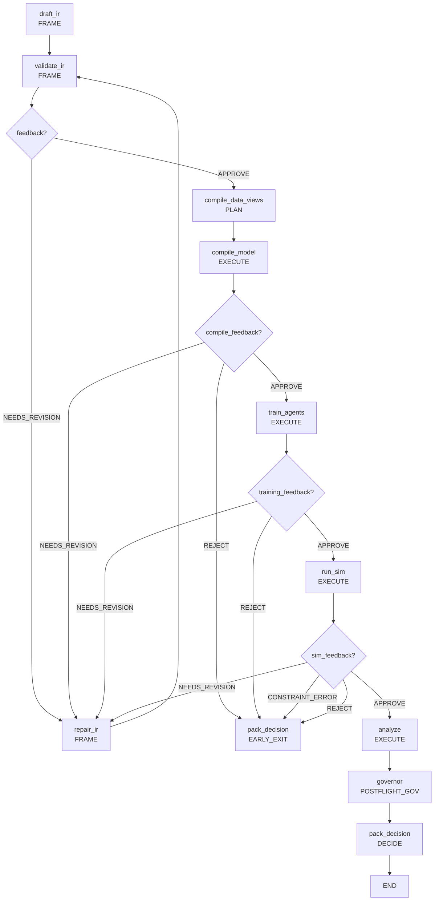

# Scientist: AI Policy Scientist

**Иерархическая система агентов для проектирования экономических политик**

Scientist - это "мозг" Policy Engine, реализующий иерархическую систему AI агентов для автоматического проектирования, валидации и оптимизации экономических политик. Модуль обеспечивает полный цикл от естественного языка пользователя до оптимизированного пакета решений.

## Обзор модуля

Модуль `scientist` реализует иерархическую систему AI агентов для управления полным жизненным циклом экспериментов с экономическими политиками. Он интегрирует:

- **Иерархическая система агентов** (PI → Drafter → Formalizer → Critic) для генерации и валидации политик
- **FSM управление** фазами эксперимента через kernel layer
- **Дифференцируемые симуляции** через compute layer и Foundry executor
- **Governance & safety** для контроля качества и compliance
- **Design of Experiments (DoE)** для систематического исследования сценариев
- **Search framework** для итеративной оптимизации политик
- **Workflow engines** для декларативного управления процессами
- **CAS artifacts** для reproducible результатов

## Архитектура

Scientist построен как многоуровневая система оркестрации с четким разделением ответственности по принципу однонаправленных зависимостей (Закон A). Архитектура следует паттерну "Clean Architecture" с явным разделением на слои:

### 🏗️ Архитектурные принципы

- **Закон A (Dependencies)**: Однонаправленные зависимости (scientist зависит от всех нижних модулей, но не наоборот)
- **Закон B (Compiler Pipeline)**: NL → LLM → IR → Compilation → Runtime
- **Закон C (Contracts)**: Контракты как источник истины (PolicySurfaceIR v2.0)
- **Закон D (Reproducibility)**: Полная воспроизводимость через RunRecord, deterministic seeds и CAS artifacts
- **Закон E (Evidence)**: Все результаты должны иметь криптографически verifiable доказательства
- **Закон F (Fidelity)**: Multi-fidelity simulation с adjustable precision
- **Закон G (Uncertainty)**: Оценки неопределенности через Hessian analysis
- **Закон H (Trust)**: Statistical verification и multi-tier evidence validation

### 📦 Структура модуля

```
scientist/
├── __init__.py           # Основной API: run_experiment(), ExperimentState
├── foundry.py            # Интеграция с Foundry для симуляций
├── publisher.py          # Финализация и публикация результатов
├── agent/                # Иерархическая система агентов + Self-Healing
│   ├── protocols.py      # AgentRole, ProblemFrame, SubTask, CritiqueReport
│   ├── pi.py             # PI Agent - декомпозиция задач
│   ├── drafter.py        # Drafter Agent - генерация политик
│   ├── formalizer.py     # Formalizer Agent - формализация в IR
│   ├── critic.py         # Critic Agent - валидация политик
│   ├── failure_card.py   # Self-healing артефакты
│   ├── memory.py         # Conversation memory
│   ├── reflexion.py      # Reflexion orchestrator
│   ├── prompts.py        # LLM промпты
│   └── base.py           # Legacy поддержка
├── kernel/               # FSM, бюджеты, guards
│   ├── budgets.py        # Compute/Evidence/Legitimacy/Complexity budgets
│   ├── fsm.py            # Phase transitions, KernelState
│   ├── guards.py         # State transition checks
│   └── human_gate.py     # Human approval gates
├── compute/              # Job specifications и execution
│   ├── job_spec.py       # JobSpec, JobKey, JobResult
│   └── runner.py         # LocalBackend, RayBackend skeleton
├── doe/                  # Design of Experiments
│   └── designs.py        # ScenarioSweep, AblationPlan, SensitivityPlan
├── engine/               # Workflow execution engine
│   ├── builtins/         # Встроенные узлы workflow
│   ├── context.py        # Execution context
│   ├── errors.py         # Engine-specific errors
│   ├── executor.py       # WorkflowExecutor
│   ├── protocol.py       # Node, NodeSpec protocols
│   ├── registry.py       # NodeRegistry, discover_nodes
│   ├── state.py          # ExperimentState (90+ полей)
│   ├── telemetry.py      # Engine telemetry
│   └── workflow_spec.py  # WorkflowSpec, NodeInvocation
├── governance/           # Validation pipeline
│   ├── preflight.py      # Preflight checks
│   ├── postflight.py     # Postflight checks
│   ├── pipeline.py       # Validation passes orchestrator
│   ├── profiles.py       # fast/mvp/strict profiles
│   ├── telemetry.py      # Validation telemetry
│   ├── report.py         # Compliance reports
│   ├── legal/            # Legal compliance
│   └── passes/           # Modular validators
├── llm/                  # LLM infrastructure
│   └── traced_client.py  # TracedLLMClient с OpenTelemetry
├── nodes/                # Workflow узлы
│   ├── builtins/         # Built-in node implementations
│   └── __init__.py       # Node exports
├── search/               # Optimization framework
│   ├── controller.py     # SearchController
│   ├── objective.py      # Optimization objectives
│   ├── stages.py         # Cheap/expensive evaluation stages
│   └── stopping.py       # Stopping criteria
├── workflow/             # Workflow engines
│   ├── engine_base.py    # WorkflowEngine abstractions
│   ├── engine_langgraph.py # LangGraph engine
│   └── engine_simple.py  # Simple loop engine
└── workflows/            # Workflow definitions
    ├── builder.py        # Workflow builders
    └── default.py        # Default workflow configuration
```

### 🤖 Agent Layer (агенты/agent)

Иерархическая система AI агентов (PI → Drafter → Formalizer → Critic) с self-healing через Reflexion pattern.

**Ключевые компоненты:**
- **`protocols.py`**: AgentRole, ProblemFrame, SubTask, CritiqueReport
- **`pi.py`**: Principal Investigator - декомпозиция задач
- **`drafter.py`**: Drafter Agent - генерация политик из NL
- **`formalizer.py`**: Formalizer Agent - преобразование в PolicySurfaceIR
- **`critic.py`**: Critic Agent - валидация и критика
- **`failure_card.py`**: Self-healing артефакты
- **`memory.py`**: Conversation tracking
- **`reflexion.py`**: Intelligent error recovery
- **`prompts.py`**: LLM промпты и системные инструкции

### 🎯 Kernel Layer (ядро/kernel)

FSM управление жизненным циклом экспериментов с бюджетами и safety controls.

**Ключевые компоненты:**
- **`budgets.py`**: Compute/Evidence/Legitimacy/Complexity бюджеты
- **`fsm.py`**: 9 фаз эксперимента с transition guards
- **`guards.py`**: State transition validation
- **`human_gate.py`**: Human approval gates (GateRequest/GateDecision)

### 🔬 Compute Layer (вычисления/compute)

Спецификации задач и execution backends для reproducible симуляций.

**Ключевые компоненты:**
- **`job_spec.py`**: JobSpec/JobKey/JobResult для структурированных задач
- **`runner.py`**: LocalBackend, RayBackend (skeleton) для выполнения

### 📊 Design of Experiments (DoE/doe)

Систематическое исследование сценариев политики.

**Ключевые компоненты:**
- **`designs.py`**: ScenarioSweep, AblationPlan, SensitivityPlan

### 🛡️ Governance Layer (управление/governance)

Validation pipeline с preflight/postflight checks и modular passes.

#### Core Components
- **`preflight.py`**: Предварительные проверки безопасности и валидации перед запуском экспериментов (возвращает `GateRequest` при необходимости)
- **`postflight.py`**: Пост-запусковые проверки результатов и финальное одобрение экспериментов
- **`pipeline.py`**: Оркестратор для запуска последовательности validation passes с short-circuit логикой
- **`profiles.py`**: Предопределенные профили валидации (`fast`, `mvp`, `strict`) с различными наборами проверок
- **`telemetry.py`**: Система трассировки валидации с `ValidationTrace` и `PassSpan` для мониторинга производительности

#### Validation Passes (`passes/`)
Модульная система проверок, каждая из которых фокусируется на конкретном аспекте:

- **`budget_pass.py`**: Контроль бюджетов (compute, evidence, legitimacy, complexity)
- **`safety_pass.py`**: Проверка безопасности механизмов и селекторов политики
- **`privacy_pass.py`**: Контроль приватности данных (PII tiers, access control)
- **`schema_pass.py`**: Валидация структуры IR и compliance с PolicySurfaceIR schema
- **`legal_pass.py`**: Проверка соответствия политик юридическим нормам (GDPR, конституционные ограничения)
- **`quality_gate_pass.py`**: Валидация качества данных перед симуляцией (интеграция с Fabric quality indicators)
- **`base.py`**: Базовые классы `ValidatorPass`, `PassContext`, `ComplianceIssue` для создания кастомных проверок

**Legal compliance:**
- **`legal/`**: AST-based backends для safe expression evaluation
- **`passes/`**: Modular validators (budget, safety, privacy, schema, legal, quality)

### 🎼 Engine Layer (движок/engine)

Workflow execution engine с pluggable nodes и state management.

**Ключевые компоненты:**
- **`protocol.py`**: Node, NodeSpec, NodeOutcome protocols
- **`registry.py`**: NodeRegistry, discover_nodes
- **`executor.py`**: WorkflowExecutor
- **`state.py`**: ExperimentState (90+ полей)
- **`builtins/`**: Built-in workflow nodes

### 🔍 Search Layer (поиск/search)

Управляет полным жизненным циклом экспериментов с использованием LangGraph для декларативного workflow:

- **`workflow.py`**: Основной граф состояний LangGraph с 9 узлами и системой маршрутизации на основе состояния и фидбэка. Включает conditional edges для self-healing циклов
- **`state.py`**: `ExperimentState` (TypedDict с 90+ полями) - центральная структура данных эксперимента с полями для всех этапов workflow
- **`flow_nodes.py`**: Полные реализации всех узлов workflow (1450+ строк кода) с интеграцией Foundry, Fabric, Core и всех компонентов системы
### 🔍 Search Layer (поиск/search)

Фреймворк итеративной оптимизации с двухстадийной оценкой.

**Ключевые компоненты:**
- **`controller.py`**: SearchController с iteration management
- **`objective.py`**: Composite objectives (GDP, inequality, employment, budget)
- **`stages.py`**: Cheap/expensive evaluation stages
- **`stopping.py`**: Intelligent stopping criteria

### ⚙️ Workflow Layer (рабочие процессы/workflow)

Workflow engines для декларативного управления.

**Ключевые компоненты:**
- **`engine_base.py`**: WorkflowEngine abstractions
- **`engine_langgraph.py`**: LangGraph engine для complex workflows
- **`engine_simple.py`**: Simple loop engine для basic scenarios

### 🤖 LLM Layer (трассировка LLM/llm)

Tracing и monitoring инфраструктура для LLM взаимодействий.

**Ключевые компоненты:**
- **`traced_client.py`**: TracedLLMClient с OpenTelemetry integration

### 📤 Publisher Layer (публикация)

Финализация и экспорт результатов экспериментов.

**Ключевые компоненты:**
- **`publisher.py`**: Build decision packet и финализация
- **Workflows builder**: `workflows/builder.py`, `workflows/default.py`


## Workflow Pipeline

Scientist реализует декларативный workflow на LangGraph с иерархической системой агентов и поддержкой FSM фаз. Workflow координирует работу специализированных агентов (PI → Drafter → Formalizer → Critic) и включает self-healing циклы с conditional routing на основе feedback от governor.



### FSM Фазы (Kernel Layer)

Workflow управляется конечным автоматом состояний с поддержкой self-healing циклов и early exit:

1. **INTAKE**: Начальная фаза, подготовка к эксперименту
2. **FRAME**: Генерация и валидация политики (draft_ir, validate_ir, repair_ir)
3. **PREFLIGHT_GOV**: Предварительные проверки безопасности (placeholder)
4. **PLAN**: Планирование данных и компиляции (compile_data_views)
5. **EXECUTE**: Запуск симуляции (compile_model, train_agents, run_sim, analyze)
6. **POSTFLIGHT_GOV**: Финальные проверки (governor)
7. **DECIDE**: Принятие решения (pack_decision)
8. **PUBLISH**: Публикация результатов
9. **ARCHIVE**: Архивация эксперимента

#### Self-healing циклы
- **FRAME → FRAME**: Повторная генерация при ошибках валидации
- **EXECUTE → FRAME**: Возврат к генерации при constraint/runtime ошибках
- **Early Exit**: Преждевременное завершение при budget exhaustion или policy rejection

### Узлы Workflow

1. **draft_ir** (FRAME): Координация иерархической системы агентов (PI → Drafter → Formalizer → Critic) для генерации и валидации политики из пользовательского запроса
2. **validate_ir** (FRAME): Комплексная валидация через Critic Agent с проверкой alignment, completeness, consistency и feasibility
3. **repair_ir** (FRAME): Self-healing через повторную работу Formalizer/Critic агентов с анализом различий и targeted исправлениями
4. **compile_data_views** (PLAN): Подготовка DataView запросов для Fabric layer и компиляция UDF функций
5. **compile_model** (EXECUTE): Компиляция политики в дифференцируемые JAX механизмы через Foundry compiler
6. **train_agents** (EXECUTE): Обучение адаптивных агентов с калибровкой параметров через Optax
7. **run_sim** (EXECUTE): Запуск симуляции через Foundry executor с patch-based execution и сбором метрик
8. **analyze** (EXECUTE): Анализ результатов симуляции, расчет экономических метрик и gradient health reports
9. **governor** (POSTFLIGHT_GOV): Финальное решение губернатора на основе бюджетов, безопасности и политик
10. **pack_decision** (DECIDE): Формирование итогового `DecisionPacket` с полной информацией об эксперименте

## Ключевые возможности

### 🤖 Hierarchical Agent System
- **PI Agent**: Декомпозиция высокоуровневых задач на специализированные подзадачи
- **Drafter Agent**: Генерация естественных черновиков политик из пользовательских запросов
- **Formalizer Agent**: Преобразование черновиков в формальный PolicySurfaceIR
- **Critic Agent**: Многоуровневая валидация с категориями (alignment, completeness, consistency, feasibility)
- **Mock Agents**: Полная система mock агентов для тестирования без LLM зависимостей
- **Self-healing**: Автоматическое исправление через Reflexion pattern с FailureCard routing

### 🔄 Self-Healing & Reflexion
- **FailureCard System**: Структурированные артефакты для фиксации ошибок и их классификации
- **Intelligent Routing**: Автоматическое определение remediation target (Formalizer/Drafter/Human)
- **Short-term Memory**: Conversation tracking и hints accumulation для iterative improvement
- **Backoff & Retry Logic**: Exponential backoff с configurable delays и attempt limits
- **Ping-pong Detection**: Предотвращение бесконечных циклов между агентами
- **Context Injection**: Автоматическое включение failure context в LLM prompts

### 🤖 LLM Tracing (мониторинг LLM)

- **TracedLLMClient**: Унифицированный интерфейс для разных LLM провайдеров с автоматической трассировкой
- **OpenTelemetry Integration**: Полная интеграция с observability stack для мониторинга LLM вызовов
- **Performance Monitoring**: Отслеживание latency, token usage, cost и error rates
- **Request/Response Logging**: Структурированное логирование всех LLM взаимодействий
- **Provider Agnostic**: Поддержка OpenAI, Anthropic и других провайдеров через единый интерфейс
- **Debug Capabilities**: Детальная трассировка для отладки LLM-related проблем

### 🔍 Search Framework (поисковая оптимизация)
- **Two-Stage Evaluation**: Быстрая предварительная оценка (cheap stage) с корреляционным трекингом для предсказания результатов дорогой симуляции (expensive stage)
- **Composite Objectives**: Многокритериальная оптимизация с весами и порогами для экономических метрик (GDP, inequality, employment, budget deficit)
- **Intelligent Stopping**: Комбинированные критерии остановки (plateau detection, max iterations, wall time, target achievement)
- **Search Controller**: Управление полным циклом оптимизации с историей итераций, статусами и результатами
- **Objective Presets**: Готовые конфигурации целей для типичных сценариев оптимизации политик

### ⚙️ Workflow Engines (движки процессов)
- **Engine Abstractions**: Унифицированный интерфейс для различных реализаций workflow через `WorkflowEngine` и `WorkflowEngineFactory`
- **Simple Loop Engine**: Легковесный движок на базе циклов для простых последовательных процессов
- **LangGraph Engine**: Продвинутый декларативный движок с графовым представлением, conditional routing и state management
- **Pluggable Architecture**: Возможность создания кастомных движков для специфических сценариев

### 🔬 Дифференцируемые симуляции
- Компиляция политик в JAX механизмы (Equinox)
- Градиентная оптимизация параметров через Optax
- Многокритериальная оптимизация (PyMOO)
- Fidelity levels для контроля точности/скорости
- **Agent Training**: Система обучения адаптивных агентов с continuous actions
- **Uncertainty Quantification**: Оценки неопределенности через Hessian analysis
- **Gradient Health Monitoring**: Диагностика проблем с градиентами в оптимизации

### 📊 Data Integration
- Интеграция с Fabric (DuckDB + Kuzu)
- Декларативные DataViewRequest
- PII tiers и access control
- Entity resolution и reconciliation

### 🎯 Governance & Safety
- **Budget Controls**: `ComputeBudget`, `EvidenceBudget`, `LegitimacyBudget`, `ComplexityBudget`
- **FSM Guards**: Проверки переходов между состояниями и валидация артефактов
- **Human Gates**: Система `GateRequest`/`GateDecision` для человеческого одобрения
- **Validation Pipeline**: Модульная система проверок с passes (budget, safety, privacy, schema, legal)
- **Validation Profiles**: Конфигурируемые профили валидации (fast/mvp/strict)
- **Preflight/Postflight Checks**: Автоматические проверки безопасности с telemetry
- **Policy Safety**: Валидация запрещенных механизмов и селекторов
- **Legal Compliance**: Проверка соответствия политик юридическим нормам (GDPR, конституционные ограничения)
- **Audit Trail**: Полный лог всех операций для compliance

### 🔄 Reproducibility & Artifacts
- **RunRecord**: Детальные метаданные о прогоне (seed, backend, версии библиотек, флаги, environment)
- **DecisionPacket**: Итоговый артефакт с IR, результатами, аудитом, evidence и uncertainty bounds
- **DecisionCard**: Human-readable summary результатов с key metrics, compliance status и deterministic formatting для презентации
- **RunTimeline**: Event-based timeline всех операций с phase tracking, node durations и error analysis для observability
- **Artifact Management**: Content-addressable storage (CAS) с SHA256-based addressing
- **Parent/Child Relationships**: Связи между экспериментами для воспроизводимости
- **Evidence Bundles**: Криптографически verifiable доказательства происхождения данных
- **Fabric Result**: Результаты Fabric layer с evidence references и uncertainty bounds
- **Audit Trail**: Полный JSON Lines лог всех операций с provenance tracking и timestamps
- **Deterministic Seeds**: Полная воспроизводимость через fixed seeds и canonical serialization

### 📊 Data Quality & Fitness Assessment
- **Quality Indicators**: Объективные метрики качества данных (`missingness`, `staleness_days`, `coverage`, `row_count`, `schema_drift`, `outlier_ratio`)
- **Quality Levels**: Классификация качества (EXCELLENT/GOOD/ACCEPTABLE/POOR/UNUSABLE) с configurable thresholds для разных профилей (FAST/MVP/STRICT)
- **Data Fitness Reports**: Структурированные отчеты о пригодности данных для симуляции с human-readable failure reasons и summary statistics
- **Quality Gate Pass**: Автоматическая валидация качества данных перед запуском симуляции с integration в governance pipeline
- **Profile-based Assessment**: Разные thresholds качества для различных сценариев использования (быстрая итерация vs production compliance)

### ⚙️ Compute & Experiment Design
- **Job Specifications**: `JobSpec`, `JobKey`, `JobResult` для структурированных задач
- **Design of Experiments**: `ScenarioSweep`, `AblationPlan`, `SensitivityPlan`
- **Distributed Execution**: Подготовка к кластерному запуску симуляций

## API и интерфейсы

### Основной вход
```python
from polisyos.scientist.orchestrator.workflow import build_workflow

# Создание workflow
workflow = build_workflow()

# Запуск с пользовательским запросом
result = workflow.invoke({
    "user_request": "Reduce poverty through targeted subsidies",
    "optimize": True,
    "budget": {"max_llm_calls": 3, "max_sim_runs": 2}
})
```

### ExperimentState

Центральная структура данных workflow (TypedDict с 80+ полями), управляющая состоянием эксперимента:

```python
class ExperimentState(TypedDict):
    # Входные данные
    user_request: str  # <--- НОВОЕ ПОЛЕ: "Reduce poverty"
    ir: Optional[PolicySurfaceIR]
    last_ir_json: Optional[str]
    last_error: Optional[str]

    # Управление workflow и FSM
    optimize: Optional[bool]
    run_id: Optional[str]
    parent_run_id: Optional[str]
    repro_mode: Optional[str]
    run_record: Optional[RunRecord]
    runtime_base_dir: Optional[str]
    db_path: Optional[str]
    graph_path: Optional[str]
    baseline_run_id: Optional[str]
    budget: Optional[Dict[str, float]]
    budget_usage: Optional[Dict[str, float]]
    budget_started_at: Optional[float]
    pruning_reason: Optional[Dict[str, Any]]
    pruned: Optional[bool]
    random_seed: Optional[int]
    last_prompt: Optional[str]
    last_llm_response: Optional[str]
    data_view_requests: Optional[List[Dict[str, Any]]]
    data_view_plans: Optional[List[Dict[str, Any]]]
    calibration_config: Optional[Dict[str, Any]]
    calibration_raw_targets: Optional[Dict[str, Any]]
    calibration_controls_seq: Optional[List[Any]]
    calibration_config_ref: Optional[Dict[str, Any]]
    calibration_report_ref: Optional[Dict[str, Any]]
    agent_training_config: Optional[Dict[str, Any]]
    agent_training_report_ref: Optional[Dict[str, Any]]
    agent_weights_ref: Optional[Dict[str, Any]]
    calibrated_params: Optional[Dict[str, float]]
    calibrated_params_ref: Optional[Dict[str, Dict[str, Any]]]
    compiled_model: Optional[Any]
    policy_ir_ref: Optional[Dict[str, Any]]
    program_graph_ref: Optional[Dict[str, Any]]
    exec_plan_ref: Optional[Dict[str, Any]]
    link_report_ref: Optional[Dict[str, Any]]
    compile_report_ref: Optional[Dict[str, Any]]
    state_delta_ref: Optional[Dict[str, Any]]
    metrics_ref: Optional[Dict[str, Any]]
    state_snapshot_ref: Optional[Dict[str, Any]]
    registry_bundle_ref: Optional[Dict[str, Any]]
    cas_root: Optional[str]
    analysis: Optional[Dict[str, Any]]
    decision_packet: Optional[Dict[str, Any]]
    gate_request: Optional[Dict[str, Any]]

    # Результаты симуляции
    simulation_results: Optional[Dict[str, float]]
    simulation_results_ref: Optional[Dict[str, Any]]
    fabric_result: Optional[Dict[str, Any]]  # Результаты Fabric layer с evidence и uncertainty
    uncertainty_ref: Optional[Dict[str, float]]  # Границы неопределенности

    # Обратная связь от Губернатора
    feedback: Optional[GovernorFeedback]

    # Human gate / safety controls
    require_human_gate: Optional[bool]
    gate_decision: Optional[Dict[str, Any]]
    pii_tier: Optional[str]
    uncertainty_bounds: Optional[Dict[str, float]]

    # Execution config
    runner_backend: Optional[str]

    # Счетчик попыток (чтобы избежать бесконечных циклов)
    revision_count: int
    max_repair_attempts: int
    repair_log: List[RepairAttempt]
    audit_trail: List[Dict[str, Any]]
    phase: Optional[str]
```

### Новые модели данных

#### Budget Models
```python
from polisyos.scientist.kernel.budgets import ComputeBudget, EvidenceBudget

compute_budget = ComputeBudget(
    max_llm_calls=3.0,
    max_sim_runs=1.0,
    max_wall_time_s=120.0
)

evidence_budget = EvidenceBudget(max_queries=10)
```

#### FSM Models
```python
from polisyos.scientist.kernel.fsm import Phase, KernelState

# Текущая фаза эксперимента
current_phase = Phase.EXECUTE

# Состояние ядра
kernel_state = KernelState(phase=Phase.FRAME)
can_transition = kernel_state.can_transition(Phase.PLAN)
```

#### Decision Packet
```python
from polisyos.scientist.orchestrator.decision_packet import DecisionPacket

packet = DecisionPacket(
    run_id="exp_001",
    run_record=run_record,
    policy_ir=policy_ir,
    simulation_results={"gdp": 1000.0, "unemployment": 0.05},
    fabric_result=fabric_result,  # Результаты Fabric layer с evidence
    evidence_ref=evidence_bundle,  # Криптографически verifiable доказательства
    uncertainty_ref=uncertainty_bounds,  # Оценки неопределенности через Hessian
    feedback=governor_feedback,
    audit_trail=audit_events
)
```

#### Job Specifications
```python
from polisyos.scientist.compute.job_spec import JobSpec, JobKey

job_spec = JobSpec(
    program_ref=artifact_ref,
    seed=42,
    required_metrics=["gdp", "unemployment"]
)

job_key = JobKey.from_spec(job_spec)
```

#### Decision Card (Human-Readable Summaries)
```python
from polisyos.scientist.orchestrator.decision_card import DecisionCard

# Создание DecisionCard из DecisionPacket
decision_card = DecisionCard.from_packet(decision_packet)

# Markdown представление для отчетов
markdown_report = decision_card.render_markdown()
print(markdown_report)

# Доступ к key metrics
for metric in decision_card.key_metrics:
    print(f"{metric.name}: {metric.formatted} {metric.unit or ''}")

# Compliance summary
print(f"Blockers: {decision_card.issues.blocker_count}")
print(f"Verdict: {decision_card.verdict}")
```

#### Run Timeline (Observability & Tracing)
```python
from polisyos.scientist.orchestrator.run_timeline import RunTimeline, TimelineEventType

# Создание timeline для эксперимента
timeline = RunTimeline(run_id="exp_001")
timeline.record_run_start()

# Запись phase transitions
timeline.transition_phase("FRAME")
timeline.record(TimelineEventType.NODE_ENTER, "FRAME", node_id="draft_ir")

# Запись completion
timeline.record(TimelineEventType.NODE_EXIT, "FRAME", node_id="draft_ir")
timeline.record_run_end(success=True)

# Анализ результатов
print(f"Total duration: {timeline.total_duration_ms}ms")
print(f"Phase durations: {timeline.get_phase_duration('FRAME')}ms")
print(f"Node durations: {timeline.get_node_durations()}")
print(f"Errors: {len(timeline.get_errors())}")

# Экспорт как artifact
timeline_artifact = timeline.to_artifact()
```

### Работа с иерархической системой агентов

```python
from polisyos.scientist.agent import (
    MockPIAgent, MockDrafterAgent, MockFormalizerAgent, MockCriticAgent,
    ProblemFrame, AgentRole, TaskPriority
)

# Создание агентов для тестирования
pi_agent = MockPIAgent()
drafter_agent = MockDrafterAgent()
formalizer_agent = MockFormalizerAgent()
critic_agent = MockCriticAgent()

# 1. PI Agent декомпозирует задачу
subtasks = await pi_agent.decompose_task(
    "Implement progressive taxation to reduce inequality",
    context={"domain": "fiscal_policy"}
)

# 2. Drafter Agent создает черновик
draft_result = await drafter_agent.draft(
    problem_frame=subtasks[0],  # Из PI декомпозиции
    context={"economic_context": "high_inequality"}
)

# 3. Formalizer Agent преобразует в IR
policy_ir = await formalizer_agent.formalize(
    draft=draft_result,
    schema_version="2.0"
)

# 4. Critic Agent валидирует результат
critique_report = await critic_agent.critique(
    ir=policy_ir,
    problem_frame=subtasks[0],
    depth="standard"
)

# Проверка результатов валидации
if critique_report.verdict == "APPROVE":
    print("✅ Policy approved by Critic Agent")
else:
        print(f"❌ Issues found: {len(critique_report.issues)}")
```

### Работа с Self-Healing компонентами

```python
from polisyos.scientist.agent.failure_card import FailureCard, from_critic_feedback
from polisyos.scientist.agent.memory import ShortTermMemory, TurnRole
from polisyos.scientist.agent.reflexion import ReflexionOrchestrator, ReflexionDecision

# Создание FailureCard из Critic feedback
critique = {
    "verdict": "NEEDS_REVISION",
    "issues": [{"message": "Invalid mechanism", "category": "schema"}],
    "summary": "Schema validation failed"
}

failure_card = from_critic_feedback(critique, run_id="exp_001", attempt_number=1)

# Работа с памятью для conversation tracking
memory = ShortTermMemory()
memory.add_turn(TurnRole.USER, "Implement progressive taxation")
memory.add_turn(TurnRole.CRITIC, "Policy needs revision: use 'income_tax' mechanism")
memory.add_attempt("Tax policy draft", "Progressive tax IR", "NEEDS_REVISION", "Use income_tax mechanism")

hints = memory.get_hints()  # Накопленные подсказки для улучшения

# Reflexion orchestrator для intelligent routing
orchestrator = ReflexionOrchestrator()

# Оценка failure и принятие решения
decision = orchestrator.evaluate_failure(failure_card, experiment_state)

if decision == ReflexionDecision.RETURN_TO_FORMALIZER:
    # Техническая проблема - исправить Formalizer
    retry_context = orchestrator.prepare_retry_context(failure_card, experiment_state)
    # Inject failure context в следующий LLM call
elif decision == ReflexionDecision.ESCALATE_TO_HUMAN:
    # Требуется человеческое вмешательство
    pass

# Применение backoff delay перед retry
await orchestrator.apply_backoff(attempt=2)
```

#### Создание кастомных агентов

```python
from polisyos.scientist.agent.protocols import PIAgent, DrafterAgent

class CustomPIAgent(PIAgent):
    async def decompose_task(self, request: str, *, context=None) -> list[SubTask]:
        # Кастомная логика декомпозиции задач
        return [
            SubTask(
                task_id=f"custom_{request[:10]}",
                description=f"Custom decomposition for: {request}",
                target_agent=AgentRole.DRAFTER,
                priority=TaskPriority.HIGH,
                status=TaskStatus.PENDING
            )
        ]

class CustomDrafterAgent(DrafterAgent):
    async def draft(self, problem_frame, *, context=None):
        # Кастомная логика генерации черновиков
        return DraftResult(
            draft_id=f"draft_{problem_frame.frame_id}",
            narrative="Custom policy draft...",
            metadata={"custom": True}
        )
```

## Примеры использования

### Базовый запуск с MockAgent

```python
from polisyos.scientist.orchestrator.workflow import build_workflow

# Создание и запуск workflow
workflow = build_workflow()
result = workflow.invoke({
    "user_request": "Implement progressive taxation to reduce inequality",
    "run_id": "tax_experiment_001",
    "optimize": True,
    "budget": {"max_llm_calls": 3, "max_sim_runs": 1, "max_wall_time_s": 120}
})

# Получение результатов
decision_packet = result.get("decision_packet")
if decision_packet:
    print(f"Decision: {decision_packet.feedback.verdict if decision_packet.feedback else 'N/A'}")
    print(f"Run ID: {decision_packet.run_id}")

    # Экономические метрики
    results = decision_packet.simulation_results or {}
    print(f"Gini coefficient: {results.get('gini_coefficient', 'N/A')}")
    print(f"Unemployment: {results.get('unemployment_rate', 'N/A')}")

    # Новые поля
    if decision_packet.fabric_result:
        print(f"Fabric data available: {len(decision_packet.fabric_result)} series")
    if decision_packet.evidence_ref:
        print(f"Evidence bundle: {decision_packet.evidence_ref.bundle_id}")
```

### Работа с расширенными бюджетами

```python
from polisyos.scientist.orchestrator.workflow import build_workflow
from polisyos.scientist.kernel.budgets import ComputeBudget, EvidenceBudget, LegitimacyBudget

# Создание детализированных бюджетов
compute_budget = ComputeBudget(
    max_llm_calls=5.0,
    max_sim_runs=3.0,
    max_wall_time_s=300.0
)

evidence_budget = EvidenceBudget(max_queries=20)

legitimacy_budget = LegitimacyBudget(
    require_human_gate=True,
    notes=["Требуется одобрение для социальных программ"]
)

workflow = build_workflow()
result = workflow.invoke({
    "user_request": "Design a universal basic income policy",
    "run_id": "ubi_experiment_002",
    "budget": compute_budget.model_dump(),
    "evidence_budget": evidence_budget.model_dump(),
    "legitimacy_budget": legitimacy_budget.model_dump(),
    "optimize": True
})
```

### Работа с Design of Experiments

```python
from polisyos.scientist.doe.designs import ScenarioSweep, AblationPlan

# Сравнение разных механизмов финансирования UBI
scenarios = ScenarioSweep(scenarios=[
    {"ubi_amount": 500, "funding_source": "income_tax"},
    {"ubi_amount": 750, "funding_source": "wealth_tax"},
    {"ubi_amount": 1000, "funding_source": "carbon_tax"}
])

# Или анализ абляции компонентов политики
ablation = AblationPlan(targets=[
    "ubi_mechanism",
    "progressive_tax_mechanism",
    "wealth_tax_mechanism"
])

workflow = build_workflow()
result = workflow.invoke({
    "user_request": "Compare different UBI funding mechanisms",
    "run_id": "ubi_comparison_003",
    "doe_design": scenarios.model_dump(),  # или ablation.model_dump()
    "optimize": True,
    "budget": {"max_llm_calls": 3, "max_sim_runs": 5}
})
```

### Анализ результатов с Decision Packet

```python
from polisyos.scientist.orchestrator.decision_packet import build_decision_packet

# Получение полного результата
decision_packet = result.get("decision_packet")

if decision_packet:
    print(f"Run ID: {decision_packet.run_id}")
    print(f"Policy Schema: {decision_packet.policy_ir.schema_version}")

        # Экономические метрики
        results = decision_packet.simulation_results
        if results:
            print(f"GDP Impact: {results.get('gdp_change', 'N/A')}%")
            print(f"Unemployment: {results.get('unemployment_rate', 'N/A')}%")
            print(f"Income Inequality (Gini): {results.get('gini_coefficient', 'N/A')}")

        # Новые поля результатов
        if decision_packet.fabric_result:
            print(f"Fabric data processed: {len(decision_packet.fabric_result)} datasets")
        if decision_packet.evidence_ref:
            print(f"Evidence available: {decision_packet.evidence_ref.bundle_id}")
        if decision_packet.uncertainty_ref:
            bounds = decision_packet.uncertainty_ref.bounds
            print(f"Uncertainty bounds: {bounds}")

        # Решение губернатора
        feedback = decision_packet.feedback
        if feedback:
            verdict = feedback.verdict
            print(f"Governor Verdict: {verdict}")

            if verdict == "APPROVE":
                print("✅ Policy approved for implementation")
            elif verdict == "REJECT":
                issues = feedback.issues
                print(f"❌ Rejected due to: {[i.get('message') for i in issues]}")

        # Аудит траил
        audit_events = decision_packet.audit_trail
        print(f"Total audit events: {len(audit_events)}")
```

## Конфигурация и настройки

### Budget Controls

```python
budget_config = {
    "max_llm_calls": 3,      # Максимум вызовов LLM
    "max_sim_runs": 1,       # Максимум запусков симуляции
    "max_wall_time_s": 120,  # Максимум времени выполнения (сек)
}
```

### Оптимизатор настройки

```python
optimizer_config = {
    "steps": 100,
    "learning_rate": 0.05,
    "clip_grad_norm": 1.0,
    "min_balance": -1000.0
}
```

### Governor Rules

Governor принимает решение на основе:
- **Budget constraints**: Дефicit > min_balance
- **Policy safety**: Запрещенные механизмы/селекторы
- **Validation issues**: Критические ошибки структуры

## Разработка и расширение

### Добавление нового агента

#### Создание кастомного Drafter Agent

```python
from polisyos.scientist.agent.protocols import DrafterAgent, ProblemFrame, DraftResult

class LLMDrafterAgent(DrafterAgent):
    def __init__(self, model_name: str = "gpt-4"):
        self.model_name = model_name

    async def draft(self, problem_frame: ProblemFrame, *, context=None) -> DraftResult:
        # Интеграция с LLM API для генерации черновиков
        llm_response = await self._call_llm_api(problem_frame.problem_statement)

        return DraftResult(
            draft_id=f"llm_draft_{problem_frame.frame_id}",
            narrative=llm_response,
            metadata={"model": self.model_name, "temperature": 0.7}
        )
```

#### Создание кастомного Critic Agent

```python
from polisyos.scientist.agent.protocols import CriticAgent, CritiqueReport, CritiqueIssue

class AdvancedCriticAgent(CriticAgent):
    def __init__(self, validation_rules: dict):
        self.validation_rules = validation_rules

    async def critique(self, ir, problem_frame, *, depth="standard"):
        issues = []

        # Кастомная логика валидации
        if self._check_alignment(ir, problem_frame):
            issues.append(CritiqueIssue(
                category=CritiqueCategory.ALIGNMENT,
                severity=CritiqueSeverity.WARNING,
                message="Policy may not fully address problem constraints"
            ))

        verdict = "REJECT" if any(i.severity == CritiqueSeverity.BLOCKER for i in issues) else "APPROVE"

        return CritiqueReport(
            report_id=f"critique_{ir.schema_version}",
            verdict=verdict,
            issues=issues,
            confidence=0.85
        )
```

### Добавление узла workflow

```python
from polisyos.scientist.orchestrator.state import ExperimentState

def custom_analysis_node(state: ExperimentState) -> ExperimentState:
    """Кастомный узел анализа"""
    results = state.get("simulation_results", {})
    # Ваша логика анализа
    analysis = {"custom_metric": calculate_metric(results)}
    return {**state, "analysis": analysis}
```

### Интеграция нового LLM провайдера

```python
from polisyos.scientist.agent.drafter import MockLLM

class AnthropicLLM(MockLLM):
    def invoke(self, prompt: str) -> str:
        # Интеграция с Anthropic Claude
        pass
```

### Расширение механизмов оптимизации

```python
from polisyos.scientist.orchestrator.optimizer import optimize_mechanisms

# Кастомная функция потерь
def custom_loss_fn(state, mechanisms):
    # Многокритериальная оптимизация
    return combined_objective(state)
```

### Работа с Kernel FSM

```python
from polisyos.scientist.kernel.fsm import Phase, KernelState, advance_phase
from polisyos.scientist.kernel.guards import require_artifacts

# Создание состояния эксперимента
experiment_state = {
    "phase": Phase.INTAKE.value,
    "user_request": "Reduce inequality",
    "run_id": "exp_001"
}

# Переход между фазами с проверками
try:
    # Проверка наличия необходимых артефактов
    experiment_state = require_artifacts(experiment_state, ["user_request", "run_id"])

    # Переход к следующей фазе
    experiment_state = advance_phase(experiment_state, Phase.FRAME)
    print(f"✅ Transitioned to phase: {experiment_state['phase']}")

except ValueError as e:
    print(f"❌ Phase transition failed: {e}")
```

### Работа с Compute Jobs

```python
from polisyos.scientist.compute.job_spec import JobSpec, JobKey
from polisyos.scientist.compute.runner import run_job
from polisyos.core.artifacts.manifest import ArtifactRef

# Создание спецификации задачи
job_spec = JobSpec(
    program_ref=ArtifactRef(
        id="sha256:abcd1234...",
        media_type="application/octet-stream",
        size=1024
    ),
    seed=42,
    mode="production",
    required_metrics=["gdp", "unemployment", "poverty_rate"]
)

# Получение ключа задачи
job_key = JobKey.from_spec(job_spec)
print(f"Job Key: {job_key.value}")

# Запуск задачи (заглушка)
result = run_job(job_spec)
print(f"Job completed: {result.job_key.value}")
```

### Работа с Governance

```python
from polisyos.scientist.governance.preflight import preflight_checks
from polisyos.scientist.governance.postflight import postflight_checks
from polisyos.scientist.kernel.human_gate import GateRequest, GateDecision

# Предварительные проверки
experiment_state = {"policy_ir": valid_policy, "budget": {"max_llm_calls": 3}}
state, gate_request = preflight_checks(experiment_state)

if gate_request:
    print(f"🚨 Human gate required: {gate_request.reason}")

    # Имитация решения человека
    gate_decision = GateDecision(
        approved=True,
        actor="admin@policy.org",
        reason_codes=[],
        notes="Approved for testing"
    )

# Пост-запусковые проверки
final_state, final_decision = postflight_checks(experiment_state)
if final_decision and not final_decision.approved:
    print(f"❌ Post-flight rejection: {final_decision.reason_codes}")
```

### Работа с Run Records

```python
from polisyos.scientist.orchestrator.run_record import build_run_record, ReproMode
import json

# Создание записи для воспроизводимости
run_record = build_run_record(
    run_id="exp_042_baseline",
    seed=12345,
    repro_mode=ReproMode.STRICT,
    parent_run_id=None,
    generator={"name": "policy-engine", "version": "0.2.0"}
)

print(f"Python: {run_record.python_version}")
print(f"JAX Backend: {run_record.backend}")
print(f"JAX Version: {run_record.library_versions.get('jax')}")

# Сохранение для аудита
with open(f"logs/run_records/{run_record.run_id}.json", "w") as f:
    json.dump(run_record.model_dump(), f, indent=2)
```

## Детальные модели данных

### Kernel Models (Ядро управления)

#### FSM (Finite State Machine)
```python
from polisyos.scientist.kernel.fsm import Phase, KernelState, ALLOWED_TRANSITIONS

# Все фазы эксперимента
phases = [
    Phase.INTAKE,      # Начало
    Phase.FRAME,       # Генерация политики
    Phase.PREFLIGHT_GOV,  # Предварительные проверки
    Phase.PLAN,        # Планирование
    Phase.EXECUTE,     # Выполнение
    Phase.POSTFLIGHT_GOV,  # Финальные проверки
    Phase.DECIDE,      # Принятие решения
    Phase.PUBLISH,     # Публикация
    Phase.ARCHIVE      # Архивация
]

# Создание состояния ядра
kernel = KernelState(phase=Phase.FRAME)

# Проверка допустимого перехода
if kernel.can_transition(Phase.PLAN):
    kernel.phase = Phase.PLAN
```

#### Budget Models
```python
from polisyos.scientist.kernel.budgets import (
    ComputeBudget, EvidenceBudget, LegitimacyBudget, ComplexityBudget
)

# Вычислительный бюджет
compute_budget = ComputeBudget(
    max_llm_calls=5.0,
    max_sim_runs=2.0,
    max_wall_time_s=300.0
)

# Бюджет доказательств (запросов данных)
evidence_budget = EvidenceBudget(max_queries=20)

# Бюджет легитимности
legitimacy_budget = LegitimacyBudget(
    require_human_gate=True,
    notes=["Требуется одобрение для налоговых изменений"]
)

# Бюджет сложности
complexity_budget = ComplexityBudget(
    max_interventions=5,
    max_scenarios=3
)
```

#### Human Gate System
```python
from polisyos.scientist.kernel.human_gate import GateRequest, GateDecision

# Запрос на человеческое одобрение
gate_request = GateRequest(
    run_id="exp_001",
    reason="Политика превышает бюджетный дефицит",
    details={"deficit": -1500.0, "threshold": -1000.0}
)

# Решение человека
gate_decision = GateDecision(
    approved=False,
    actor="admin@example.com",
    reason_codes=["budget_exceeded"],
    notes="Уменьшите субсидии на 20%"
)
```

### Compute Models (Спецификации задач)

#### Job Specifications
```python
from polisyos.scientist.compute.job_spec import JobSpec, JobKey, JobResult

# Спецификация задачи симуляции
job_spec = JobSpec(
    program_ref=program_artifact,
    exec_plan_ref=execution_plan,
    state_snapshot_ref=initial_state,
    seed=42,
    mode="production",
    required_metrics=["gdp", "unemployment", "income_inequality"],
    notes=["Эксперимент с прогрессивным налогообложением"]
)

# Ключ задачи (хеш от спецификации)
job_key = JobKey.from_spec(job_spec)

# Результат выполнения
job_result = JobResult(
    job_key=job_key,
    state_delta_ref=final_state_artifact,
    metrics_ref=metrics_artifact,
    warnings=["Небольшая численная нестабильность в шаге 50"]
)
```

### Design of Experiments (DoE)

#### Experiment Designs
```python
from polisyos.scientist.doe.designs import ScenarioSweep, AblationPlan, SensitivityPlan

# Сканирование сценариев
scenario_sweep = ScenarioSweep(scenarios=[
    {"tax_rate": 0.1, "subsidy_rate": 0.05},
    {"tax_rate": 0.2, "subsidy_rate": 0.10},
    {"tax_rate": 0.3, "subsidy_rate": 0.15}
])

# План абляции (удаление компонентов)
ablation_plan = AblationPlan(targets=[
    "income_tax_mechanism",
    "unemployment_subsidy",
    "corporate_tax"
])

# Анализ чувствительности
sensitivity_plan = SensitivityPlan(parameters=[
    "tax_rate_sensitivity",
    "subsidy_elasticity",
    "labor_market_response"
])
```

### Governance Models (Управление)

#### Preflight Checks
```python
from polisyos.scientist.governance.preflight import preflight_checks

# Предварительные проверки безопасности
state, gate_request = preflight_checks(experiment_state)

if gate_request:
    print(f"Требуется человеческое одобрение: {gate_request.reason}")
```

#### Postflight Checks
```python
from polisyos.scientist.governance.postflight import postflight_checks

# Пост-запусковые проверки
state, gate_decision = postflight_checks(experiment_state)

if gate_decision and not gate_decision.approved:
    print(f"Отклонено: {gate_decision.reason_codes}")
```

### Orchestrator Models (Оркестрация)

#### Run Record (для воспроизводимости)
```python
from polisyos.scientist.orchestrator.run_record import RunRecord, ReproMode, build_run_record

run_record = build_run_record(
    run_id="exp_001",
    parent_run_id="baseline_042",
    seed=12345,
    repro_mode=ReproMode.STRICT,
    generator={"name": "policy-engine", "version": "0.2.0"}
)

# Сохранение для воспроизводимости
save_run_record_json(run_record, base_dir=Path("logs"))
```

#### Decision Packet (итоговый артефакт)
```python
from polisyos.scientist.orchestrator.decision_packet import DecisionPacket, build_decision_packet

decision_packet = build_decision_packet(experiment_state, run_record)

# Содержит всю информацию о эксперименте
print(f"Policy: {decision_packet.policy_ir}")
print(f"Results: {decision_packet.simulation_results}")
print(f"Verdict: {decision_packet.feedback.get('verdict')}")
print(f"Audit trail: {len(decision_packet.audit_trail)} events")
```

## Связанные модули

Scientist зависит от всех нижних модулей архитектуры Policy Engine:

- **Core**: Artifacts, CAS, RunContext, Contracts
- **IR**: PolicySurfaceIR, validation, linker, calibration
- **Fabric**: Data access, UDF engine, calibration, quality assessment
- **Foundry**: JAX compilation, execution, mechanism registry
- **Runtime**: Lifecycle management, audit trail, manifests
- **Common**: Logging, configuration, observability

### 🔗 LLM Layer (Tracing Infrastructure)
- **TracedLLMClient**: Унифицированный интерфейс для LLM взаимодействий с OpenTelemetry tracing
- **Observability Integration**: Полная интеграция с observability stack для мониторинга LLM performance
- **Provider Abstractions**: Поддержка множественных LLM провайдеров через единый интерфейс

## Troubleshooting

### Budget превышения

```
Governor verdict: REJECT
Issue: Budget deficit too high: -1500.0 < -1000.0
```

**Решение**: Уменьшите параметры субсидий или увеличьте налоги

### LLM генерация невалидного IR

```
ValidationError: mechanism_type must be one of: tax_subsidy, income_tax
```

**Решение**: Обновите системный промпт или добавьте механизм в каталог

### Симуляция не сходится

```
Gradient health: NaN detected in parameter gradients
```

**Решение**: Проверьте fidelity level или уменьшите learning rate

### Ошибки калибровки данных

```
CalibrationError: No valid targets found in fabric series
```

**Решение**: Проверьте наличие данных в Fabric или настройте calibration config

### Ошибки валидации контекста

```
ValueError: Invalid context_snapshot_ref: invalid sha256 hash
```

**Решение**: Убедитесь, что context snapshot существует в CAS

### Превышение лимита попыток ремонта

```
MaxRepairAttemptsExceeded: revision_count=3 >= max_repair_attempts=3
```

**Решение**: Увеличьте `max_repair_attempts` или улучшите системные промпты

### Ошибки компиляции JAX

```
JaxCompilationError: Cannot compile mechanism: invalid parameter shape
```

**Решение**: Проверьте параметры механизма в IR и их совместимость с Foundry registry

## Архитектурные принципы

Scientist следует принципам из `architecture.md`:

- **Закон A**: Однонаправленные зависимости (scientist → ir/fabric/foundry)
- **Закон B**: Компиляторная труба (NL → LLM → IR → Compilation → Runtime)
- **Закон C**: Контракты как источник истины
- **Закон D**: Воспроизводимость всех прогонов

## Тестирование

### Структура тестов

```
tests/scientist/
├── test_agent_*.py         # Agent layer (protocols, pi, drafter, formalizer, critic)
├── test_kernel_*.py        # Kernel layer (FSM, budgets, guards, human_gate)
├── test_compute_*.py       # Compute layer (job_spec, runner)
├── test_governance_*.py    # Governance layer (preflight, postflight, passes, pipeline, legal)
├── test_doe_*.py          # Design of Experiments (designs)
├── test_llm_*.py          # LLM layer (traced_client, observability)
├── test_orchestrator_*.py  # Orchestrator layer (workflow, state, flow_nodes)
├── test_publisher.py       # Publisher layer
└── integration/
    ├── test_agent_hierarchy.py   # Тестирование иерархической системы агентов
    ├── test_workflow_smoke.py    # Базовый workflow с mock агентами
    └── test_workflow_llm.py      # E2E с LLM (требует API ключей)
```

### Запуск тестов

```bash
# Unit tests для отдельных компонентов
pytest tests/scientist/test_agent_*.py -v      # Agent layer
pytest tests/scientist/test_kernel_*.py -v     # Kernel (FSM, budgets, guards)
pytest tests/scientist/test_compute_*.py -v    # Compute layer
pytest tests/scientist/test_governance_*.py -v # Governance
pytest tests/scientist/test_llm_*.py -v        # LLM layer (tracing, observability)
pytest tests/scientist/test_orchestrator_*.py -v # Orchestrator

# Integration tests для полного workflow
pytest tests/scientist/integration/test_workflow_smoke.py -v

# E2E tests с реальными данными (требуют API ключей)
pytest tests/scientist/integration/test_workflow_llm.py -v --tb=short

# Все тесты scientist модуля
pytest tests/scientist/ -x --tb=short
```

### Test Coverage

- **Agent Layer**: Протоколы агентов, иерархическая система (PI→Drafter→Formalizer→Critic), mock реализации всех ролей
- **Kernel Layer**: FSM transitions, budget enforcement, guards, human gates
- **Compute Layer**: Job specifications, execution backends, reproducible hashing
- **Governance**: Preflight/postflight checks, validation passes (budget, safety, privacy, schema, legal), pipeline orchestration, profiles, telemetry
- **Orchestrator**: Workflow execution, state management, decision packets
- **DoE**: Experiment designs, scenario generation, statistical analysis
- **Integration**: Полный цикл агентов, end-to-end workflow testing

### Mock Components

Для тестирования без внешних зависимостей:
- **`MockPIAgent`**: Детерминированная декомпозиция задач
- **`MockDrafterAgent`**: Предопределенные черновики политик
- **`MockFormalizerAgent`**: Создание валидного IR из черновиков
- **`MockCriticAgent`**: Предсказуемые отчеты о валидации
- **`MockLLM`**: Эмуляция LLM ответов (legacy)
- **`MockAgent`**: Простой эвристический агент (legacy)
- **`StubRunner`**: Заглушка для compute jobs
- **`TestCAS`**: In-memory artifact storage

## Производительность

### Метрики производительности

- **LLM calls**: 1-5 на эксперимент (с self-healing и revision loops)
- **Sim runs**: 1-3 на эксперимент (с оптимизацией параметров)
- **Wall time**: 30-300 сек на полный эксперимент
- **Memory**: ~2-8GB для комплексных экспериментов
- **Artifacts**: 100MB+ на эксперимент (IR, snapshots, metrics)

### Budget Controls

```python
# Типичные бюджеты для разных сценариев
development_budget = {
    "max_llm_calls": 3.0,
    "max_sim_runs": 1.0,
    "max_wall_time_s": 120.0
}

production_budget = {
    "max_llm_calls": 10.0,
    "max_sim_runs": 5.0,
    "max_wall_time_s": 600.0
}

research_budget = {
    "max_llm_calls": 25.0,
    "max_sim_runs": 15.0,
    "max_wall_time_s": 3600.0  # 1 час
}
```

### Оптимизации

- **FSM Guards**: Предотвращение недопустимых переходов
- **Artifact Caching**: Переиспользование результатов через CAS
- **Budget Enforcement**: Раннее прерывание при превышении лимитов
- **Parallel Execution**: Подготовка к распределенным симуляциям

## Будущие улучшения

### 🚀 Ближайшие приоритеты

- [ ] **Compute Layer**: Завершение distributed job execution (RayBackend skeleton готов)
- [ ] **DoE Integration**: Полная интеграция ScenarioSweep, AblationPlan, SensitivityPlan в workflow
- [ ] **Governance UI**: Веб-интерфейс для human gates (preflight/postflight готовы)
- [ ] **Real LLM Integration**: Замена MockLLM на production LLM APIs (LangChain интеграция готова)
- [ ] **Multi-objective Optimization**: NSGA-II и Pareto fronts (PyMOO уже подключен)

### 🔬 Продвинутые возможности

- [ ] **Reinforcement Learning**: RL для policy discovery (agent training система готова)
- [ ] **Distributed Simulation**: Кластерное выполнение (RayBackend skeleton)
- [ ] **Interactive Refinement**: UI для итеративного улучшения политик
- [ ] **Multi-agent Negotiation**: Переговоры между заинтересованными сторонами
- [ ] **Advanced Calibration**: Расширение uncertainty quantification

### 🏗️ Архитектурные улучшения

- [ ] **Event Sourcing**: Переход audit trail на event log архитектуру
- [ ] **Policy Templates**: Реиспользуемые паттерны политик на базе PolicySurfaceIR
- [ ] **A/B Testing**: Статистическое сравнение политик (DoE основа готова)
- [ ] **Version Control**: Git-подобное управление версиями политик
- [ ] **Federated Learning**: Обучение на distributed данных с privacy preservation

## Текущее состояние реализации

### ✅ Полностью реализованные компоненты

- **Agent Layer**: Полная иерархическая система агентов (PI → Drafter → Formalizer → Critic) с протоколами, mock реализациями всех ролей, структурированными артефактами (ProblemFrame, SubTask, CritiqueReport) + Self-Healing система (FailureCard, ShortTermMemory, ReflexionOrchestrator)
- **Kernel Layer**: Полная реализация FSM с 9 фазами, все модели бюджетов (Compute, Evidence, Legitimacy, Complexity), guards, human_gate и advance_phase guards
- **Compute Layer**: JobSpec/JobKey/JobResult модели, LocalBackend и RayBackend (skeleton) для выполнения через Foundry executor, поддержка distributed execution
- **Orchestrator Layer**: Полный workflow на LangGraph (3200+ строк в flow_nodes.py), ExperimentState с 90+ полями, DecisionPacket с evidence и uncertainty, DecisionCard summaries, RunTimeline для observability, audit trail
- **Search Layer**: Полный фреймворк итеративной оптимизации с SearchController, двухстадийной оценкой (cheap/expensive stages), composite objectives и интеллектуальными критериями остановки
- **Workflow Layer**: Полные абстракции и реализации движков (SimpleLoopEngine, LangGraphEngine) с унифицированным интерфейсом для декларативного управления процессами
- **LLM Layer**: Полная инфраструктура tracing и monitoring для LLM взаимодействий через TracedLLMClient с OpenTelemetry интеграцией
- **Publisher Layer**: Полная публикация через build_decision_packet с интеграцией всех артефактов
- **Workflow Integration**: Полная интеграция со всеми модулями (Core, IR, Fabric, Foundry, Runtime)

### 🚧 Частично реализованные компоненты

- **Governance Layer**: Полная система validation passes (включая legal compliance и quality gate) с pipeline orchestration, профилями и telemetry. Preflight/postflight с GateRequest/GateDecision интеграцией (готовы для UI integration). Legal backends: StubBackend (готов), ExprASTBackend (готов), LLM Backend (планируется)
- **Data Quality Assessment**: Полная система оценки качества данных через QualityIndicators, QualityLevel, QualityThresholds с integration в Fabric layer и governance pipeline
- **DoE Layer**: Базовые модели ScenarioSweep, AblationPlan, SensitivityPlan без полной интеграции в workflow (готовы для расширения)
- **Optimization**: Градиентная оптимизация через Optax с gradient health monitoring и uncertainty quantification (нужна интеграция с multi-objective optimization)

### 🎯 Готовые к использованию возможности

- **End-to-End Workflow**: Полный цикл от естественного языка до DecisionPacket с иерархической системой агентов и evidence tracking
- **Budget Controls**: Полный контроль ресурсов (LLM calls, sim runs, wall time, evidence queries, complexity)
- **FSM Management**: Строгие переходы между фазами с guards, human gates и self-healing циклами
- **Artifact Management**: Полная поддержка CAS с SHA256 addressing, RunRecord для воспроизводимости, DecisionCard для human-readable summaries, RunTimeline для observability
- **Audit Trail**: Комплексное JSON Lines логирование всех операций с provenance tracking
- **Agent Training**: Система обучения адаптивных агентов с continuous actions и gradient monitoring
- **Uncertainty Quantification**: Оценки неопределенности через Hessian analysis и confidence bounds
- **Evidence Integration**: Криптографически verifiable доказательства с Fabric layer integration
- **Data Quality Validation**: Автоматическая оценка качества данных перед симуляцией с configurable thresholds и human-readable reports
- **Mock Testing**: Полная поддержка тестирования без внешних зависимостей

### 🔄 Архитектурные принципы соблюдены

- **Закон A**: Однонаправленные зависимости (scientist → ir/fabric/foundry/runtime/core)
- **Закон B**: Foundry как чистое математическое ядро (чистые JAX функции без side effects)
- **Закон C**: Контракты как источник истины (PolicySurfaceIR v2.0, DecisionPacket, evidence bundles)
- **Закон D**: Полная воспроизводимость через RunRecord, deterministic seeds и CAS artifacts
- **Закон E**: Evidence обязательны (evidence bundles, provenance tracking, uncertainty quantification)
- **Закон F**: Fidelity control (multi-fidelity simulation с adjustable precision)
- **Закон G**: Uncertainty quantification (Hessian analysis, confidence bounds)
- **Закон H**: Trust policies (statistical verification, multi-tier evidence validation)
