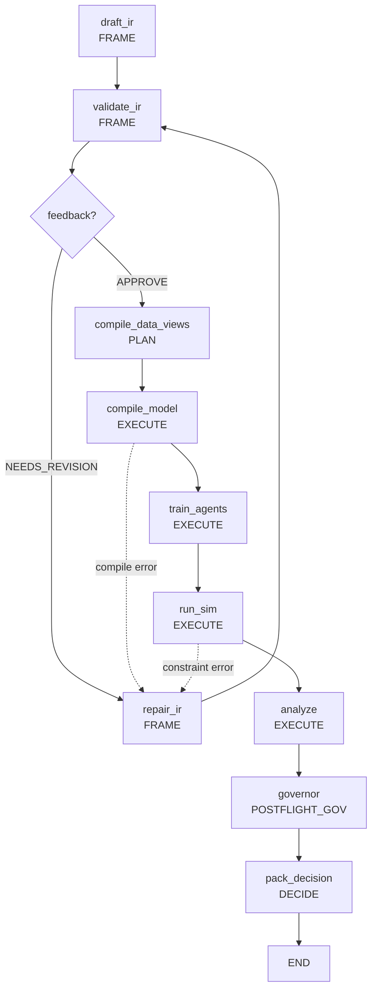

# Scientist: AI Policy Scientist

Scientist — оркестрационный модуль верхнего уровня Policy Engine. Реализует полный цикл проектирования экономических политик: от запроса на естественном языке через иерархическую систему AI-агентов, дифференцируемые симуляции и governance pipeline до итогового пакета решений (`DecisionCard`).

## Роль в системе

Scientist — потребитель всех нижних модулей архитектуры. Он координирует работу IR, Fabric, Foundry и Core, не экспортируя ничего обратно (Закон A — однонаправленные зависимости):

```
scientist  (оркестрация)
    ├── ir        (TrinityBundle, policy specs, norm packs)
    ├── fabric    (данные: DuckDB + Kuzu, quality indicators)
    ├── foundry   (JAX-компиляция и execution)
    ├── core      (artifacts/CAS, observability, contracts)
    └── runtime   (lifecycle, manifests)
```

Внешние модули (`lex`, `fabric`) используют отдельные компоненты scientist — в первую очередь governance passes — для собственных валидаций.

## Архитектура

### Архитектурные принципы

| Закон | Принцип | Реализация в scientist |
|-------|---------|------------------------|
| A | Однонаправленные зависимости | scientist -> ir/fabric/foundry/core, не наоборот |
| B | Компиляторная труба | NL -> LLM -> IR -> JAX Compilation -> Runtime |
| C | Контракты как источник истины | TrinityBundle v2.0, ExperimentState, DecisionPacket |
| D | Воспроизводимость | RunRecord, deterministic seeds, CAS artifacts |
| E | Evidence обязательны | Evidence bundles, provenance tracking |
| F | Fidelity control | Multi-fidelity simulation, adjustable precision |
| G | Uncertainty quantification | Hessian analysis, confidence bounds |
| H | Trust policies | Statistical verification, multi-tier evidence |

### Структура модуля

```
scientist/                          145 .py файлов
│
├── __init__.py                     # API: run_experiment(), ExperimentState
├── adapters/foundry_bridge.py      # DefaultFoundryPort — адаптер к Foundry
├── publisher.py                    # Финализация и публикация результатов
├── replay_backend.py               # Replay-поддержка для воспроизводимости
│
│   ── КРУПНЫЕ ПОДСИСТЕМЫ (собственные README) ──────────────────────
│
├── agent/          (12 файлов)     # Иерархия AI-агентов: PI → Drafter → Formalizer → Critic
├── backtesting/    ( 7 файлов)     # Историческая валидация предсказаний
├── engine/         (11 файлов)     # Workflow executor, node registry, ExperimentState
├── governance/     (17 файлов)     # Validation pipeline, passes, legal compliance
├── kernel/         ( 6 файлов)     # FSM жизненного цикла, бюджеты, human gates
├── nodes/          (11 файлов)     # Built-in workflow nodes (compile, simulate, govern, decide)
├── search/         (27 файлов)     # Optimization framework, strategies, objectives
├── doe/            ( 5 файлов)     # Design of Experiments, sensitivity analysis
│
│   ── ВСПОМОГАТЕЛЬНЫЕ СЛОИ (описаны ниже) ──────────────────────────
│
├── orchestrator/   ( 2 файла)      # DecisionCard — human-readable итоги
├── compute/        ( 3 файла)      # JobSpec, execution backends
├── llm/            ( 2 файла)      # TracedLLMClient, OpenTelemetry tracing
└── workflows/      ( 6 файлов)      # Workflow engines + default workflow builders
```

### Двухуровневая документация

| Уровень | Что документируем | Файлы |
|---------|-------------------|-------|
| 1 (этот файл) | Архитектура, зависимости, принципы, вспомогательные слои | `scientist/README.md` |
| 2 (подсистемы) | API, контракты, внутренняя структура | [agent](agent/README.md), [backtesting](backtesting/README.md), [engine](engine/README.md), [governance](governance/README.md), [kernel](kernel/README.md), [nodes](nodes/README.md), [search](search/README.md), [doe](doe/README.md) |

## Workflow Pipeline

Scientist реализует декларативный workflow с FSM-управлением и self-healing циклами:



### FSM-фазы (Kernel Layer)

9 фаз жизненного цикла эксперимента с transition guards и short-circuit маршрутами:

| Фаза | Назначение | Ключевые узлы |
|------|-----------|---------------|
| INTAKE | Инициализация эксперимента | — |
| FRAME | Генерация и валидация политики | draft_ir, validate_ir, repair_ir |
| PREFLIGHT_GOV | Предварительные проверки безопасности | preflight_checks |
| PLAN | Планирование данных и компиляции | compile_data_views |
| EXECUTE | Компиляция, симуляция, анализ | compile_model, run_sim, analyze |
| POSTFLIGHT_GOV | Финальные проверки | governor |
| DECIDE | Формирование пакета решений | pack_decision |
| PUBLISH | Публикация результатов | publish |
| ARCHIVE | Архивация эксперимента | archive |

Дополнительные фазы: `SEARCH_INIT`, `SEARCH_ITERATE`, `SEARCH_COMPLETE` (для optimization loops), `REFLEXION` (для self-healing).

## Подсистемы

### Крупные подсистемы (собственные README)

**[Agent Layer](agent/README.md)** — иерархическая система AI-агентов (PI → Drafter → Formalizer → Critic) с self-healing через Reflexion pattern. PI декомпозирует задачу, Drafter генерирует политику на NL, Formalizer преобразует в TrinityBundle, Critic валидирует. FailureCard + ReflexionOrchestrator обеспечивают автономное исправление ошибок.

**[Backtesting](backtesting/README.md)** — историческая валидация предсказаний. OutcomeMasker маскирует данные для симуляции real-time, PredictionEvaluator вычисляет RMSE/MAPE/coverage, TrustScorer агрегирует в trust score (0.0–1.0) и grade (A–F). BacktestOrchestrator координирует множественные сценарии.

**[Engine](engine/README.md)** — workflow execution с pluggable nodes. WorkflowExecutor исполняет WorkflowSpec, NodeRegistry обнаруживает узлы автоматически. ExperimentState — центральная структура состояния эксперимента. Поддержка checkpoint/resume и idempotent execution.

**[Governance](governance/README.md)** — multi-pass validation pipeline. 10 специализированных проверок (budget, safety, privacy, schema, legal, quality gate, confidence, equity). 3 профиля (fast/mvp/strict). Preflight и postflight checks с human gate интеграцией. Legal compliance через pluggable backends (Stub, ExprAST).

**[Kernel](kernel/README.md)** — FSM-управление жизненным циклом. 9 фаз с transition guards. 4 типа бюджетов: ComputeBudget, EvidenceBudget, LegitimacyBudget, ComplexityBudget. Human gates для критических решений.

**[Nodes](nodes/README.md)** — built-in реализации workflow-узлов: compile (compile_foundry, link_trinity), data (build_data_snapshot, enrich_knowledge), simulate (run_simulation, distributional_analysis, causal_evaluation, uncertainty propagation), governance (run_governance, legal_check), decide (build_decision_packet).

**[Search](search/README.md)** — optimization framework с 20+ стратегиями (Random, Grid, Bayesian, Multi-Objective, Multi-Fidelity). Two-stage evaluation (cheap preliminary + expensive accurate). SearchController, composite objectives, intelligent stopping criteria. AdversarialSearch для stress-тестирования.

**[DoE](doe/README.md)** — Design of Experiments. ScenarioSweep (сравнение конфигураций), AblationPlan (анализ вклада компонентов), SensitivityPlan (чувствительность параметров), AdversarialPlan (worst-case). SALib-based sampling и sensitivity index analysis.

### Вспомогательные слои

**Orchestrator** (`orchestrator/`) — DecisionCard с human-readable summary результатов: verdict (APPROVE/REJECT/REVIEW), key metrics с confidence intervals, distributional summary (Gini, winners/losers), issues summary. Рендеринг в Markdown.

**Compute** (`compute/`) — спецификации задач и execution backends. JobSpec определяет task с program_ref, seed, required_metrics. JobKey — content-addressed идентификатор (SHA256). Для исполнения поддерживается только LocalBackend через Foundry.

**LLM** (`llm/`) — TracedLLMClient оборачивает LLM-клиентов, автоматически создавая OpenTelemetry spans с метаданными (model, provider, token usage, latency). Поддержка OpenAI, Anthropic и custom providers.

**Workflows** (`workflows/`) — абстракции workflow engines и pre-built workflow definitions. WorkflowEngine — базовый интерфейс. SimpleLoopEngine — для последовательных workflow. LangGraphEngine — для сложных графов с conditional routing. `run_default_workflow()` — основная entry point.

## Точки входа

```python
# Основной API
from polisyos.scientist import run_experiment
result = run_experiment({"user_request": "Reduce poverty through subsidies", ...})

# Legacy CLI run_experiment.py removed.

# CLI subcommands (через core CLI)
scientist sensitivity run ...
scientist stress-test ...
scientist backtest ...
```

## Зависимости

### Входящие (кто зависит от scientist)

| Модуль | Что использует | Файл |
|--------|---------------|------|
| lex | PassContext, LegalPass, SafetyPass, ValidationProfile (via `core.governance`) | `lex/simulator/engine.py` |
| fabric (tests) | QualityGatePass | `tests/fabric/` |
| core CLI | Scientist subcommands | `core/components/cli.py` |

### Исходящие (от чего зависит scientist)

| Модуль | Что используется |
|--------|-----------------|
| ir | TrinityBundle, policy specs, NormPack, schema validation |
| fabric | DataView, calibration, quality indicators |
| foundry | JAX compilation (compile_foundry), execution (execute_foundry) |
| core | ArtifactRef, CAS, observability (metrics, tracer), ComponentMetadata |
| runtime | RunRecord, lifecycle, manifests |

## Тестирование

```
tests/scientist/                   48 тестовых файлов
├── test_agent_*.py                # Agent protocols, hierarchy, reflexion
├── test_kernel_*.py               # FSM, budgets, guards, human gates
├── test_engine_*.py               # Executor, registry, checkpoint, idempotency
├── test_governance_*.py           # Passes, pipeline, legal, profiles
├── test_search_*.py               # Controller, strategies (Bayesian, MO, grid)
├── test_doe_*.py                  # Sampling, sensitivity, designs
├── test_backtesting_*.py          # Orchestrator, plan, evaluator
├── test_compute_*.py              # Runner, job specs
├── test_llm_*.py                  # TracedLLMClient
└── integration/
    ├── test_workflow_smoke.py     # E2E с mock agents
    ├── test_human_gate_audit.py   # Human gate integration
    └── test_workflow_tracing.py   # Observability
```

Contract tests: `tests/contract/test_scientist_workflow_spec_contract.py`, `test_run_experiment_slo.py`.

```bash
# Все тесты scientist
pytest tests/scientist/ -x --tb=short

# По слоям
pytest tests/scientist/test_agent_*.py -v
pytest tests/scientist/test_governance_*.py -v
pytest tests/scientist/integration/ -v
```

Mock-компоненты для тестирования без внешних зависимостей: `MockPIAgent`, `MockDrafterAgent`, `MockFormalizerAgent`, `MockCriticAgent`, `MockLLM`, `StubBackend`, `TestCAS`.
