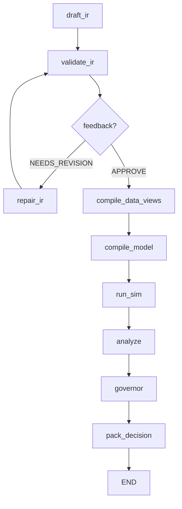

# Scientist: AI Policy Scientist

**AI-driven Policy Design and Orchestration System**

Scientist - это "мозг" Policy Engine, отвечающий за автоматическое проектирование, валидацию и оптимизацию экономических политик с использованием LLM и дифференцируемых симуляций. Модуль реализует полный цикл от естественного языка пользователя до оптимизированного пакета решений.

## Архитектура

Scientist построен как двухуровневая система оркестрации:

### Agent Layer (Агенты и генерация)

- **BaseAgent**: Абстрактный класс для агентов принятия решений
- **MockAgent**: Эвристический агент для тестирования (без LLM)
- **drafter.py**: Узел генерации политики через LLM (PolicyRequestIR)
- **prompts.py**: Системные промпты для LLM с каталогом механизмов
- **prompt.py**: Альтернативные промпты для Policy Scientist

### Orchestrator Layer (Управление workflow)

- **workflow.py**: Основной граф состояний LangGraph
- **state.py**: ExperimentState (TypedDict с 30+ полями управления)
- **flow_nodes.py**: Реализации всех узлов workflow
- **compiler.py**: Компиляция политик в JAX механизмы
- **optimizer.py**: Градиентная оптимизация параметров политик
- **audit.py**: Система аудита и логирования
- **run_record.py**: Записи для воспроизводимости экспериментов

## Workflow Pipeline

Scientist реализует декларативный workflow на LangGraph:



### Узлы Workflow

1. **draft_ir**: Генерация начальной политики из пользовательского запроса через LLM
2. **validate_ir**: Валидация структуры и семантики политики
3. **repair_ir**: Автоматическое исправление ошибок валидации
4. **compile_data_views**: Подготовка данных из Fabric (UDF)
5. **compile_model**: Компиляция в дифференцируемые JAX механизмы
6. **run_sim**: Запуск симуляции и сбор метрик
7. **analyze**: Анализ результатов симуляции
8. **governor**: Финальное решение (APPROVE/REJECT/NEEDS_REVISION)
9. **pack_decision**: Формирование DecisionPacket

## Ключевые возможности

### 🤖 LLM Integration
- Поддержка OpenAI/Anthropic через LangChain
- MockLLM для тестирования без API ключей
- Автоматическая генерация PolicyRequestIR из естественного языка
- Self-healing: исправление ошибок валидации через повторные вызовы

### 🔬 Дифференцируемые симуляции
- Компиляция политик в JAX механизмы (Equinox)
- Градиентная оптимизация параметров через Optax
- Многокритериальная оптимизация (PyMOO)
- Fidelity levels для контроля точности/скорости

### 📊 Data Integration
- Интеграция с Fabric (DuckDB + Kuzu)
- Декларативные DataViewRequest
- PII tiers и access control
- Entity resolution и reconciliation

### 🎯 Governance & Safety
- Budget controls (LLM calls, sim runs, wall time)
- Policy safety checks до симуляции
- Структурированные ValidationIssue
- Полный audit trail для compliance

### 🔄 Reproducibility
- RunRecord с seed, backend, версиями
- Детерминированные миграции IR
- Artifact versioning и provenance
- Parent/child run relationships

## API и интерфейсы

### Основной вход
```python
from polisyos.scientist.orchestrator.workflow import build_workflow

# Создание workflow
workflow = build_workflow()

# Запуск с пользовательским запросом
result = workflow.invoke({
    "user_request": "Reduce poverty through targeted subsidies",
    "optimize": True,
    "budget": {"max_llm_calls": 3, "max_sim_runs": 2}
})
```

### ExperimentState

Центральная структура данных workflow (TypedDict):

```python
class ExperimentState(TypedDict):
    # Входные данные
    user_request: str
    ir: Optional[PolicyRequestIR]

    # Управление workflow
    optimize: Optional[bool]
    run_id: Optional[str]
    budget: Optional[Dict[str, float]]

    # Результаты
    simulation_results: Optional[Dict[str, float]]
    feedback: Optional[GovernorFeedback]
    decision_packet: Optional[Dict[str, Any]]

    # Аудит
    audit_trail: List[Dict[str, Any]]
    repair_log: List[RepairAttempt]
```

### Агенты

```python
from polisyos.scientist.agent.base import BaseAgent, MockAgent

class MyAgent(BaseAgent):
    def decide(self, step: int, context_df) -> PolicyRequestIR:
        # Ваша логика принятия решений
        pass
```

## Примеры использования

### Базовый запуск с MockAgent

```python
from polisyos.scientist.orchestrator.workflow import build_workflow

# Создание и запуск workflow
workflow = build_workflow()
result = workflow.invoke({
    "user_request": "Implement progressive taxation to reduce inequality"
})

print(f"Decision: {result.get('decision_packet', {}).get('verdict')}")
```

### Работа с реальным LLM

```python
import os
from polisyos.scientist.orchestrator.workflow import build_workflow

# Настройка API ключей
os.environ["OPENAI_API_KEY"] = "your-key-here"

workflow = build_workflow()
result = workflow.invoke({
    "user_request": "Design a universal basic income policy",
    "budget": {
        "max_llm_calls": 5,
        "max_sim_runs": 3,
        "max_wall_time_s": 300
    }
})
```

### Анализ результатов симуляции

```python
# Результаты содержат экономические метрики
simulation_results = result.get("simulation_results", {})
print(f"Avg Income: {simulation_results.get('avg_income', 'N/A')}")
print(f"Government Balance: {simulation_results.get('gov_balance', 'N/A')}")

# Полный DecisionPacket
decision = result.get("decision_packet", {})
if decision.get("verdict") == "APPROVE":
    print("Policy approved for implementation")
```

## Конфигурация и настройки

### Budget Controls

```python
budget_config = {
    "max_llm_calls": 3,      # Максимум вызовов LLM
    "max_sim_runs": 1,       # Максимум запусков симуляции
    "max_wall_time_s": 120,  # Максимум времени выполнения (сек)
}
```

### Оптимизатор настройки

```python
optimizer_config = {
    "steps": 100,
    "learning_rate": 0.05,
    "clip_grad_norm": 1.0,
    "min_balance": -1000.0
}
```

### Governor Rules

Governor принимает решение на основе:
- **Budget constraints**: Дефicit > min_balance
- **Policy safety**: Запрещенные механизмы/селекторы
- **Validation issues**: Критические ошибки структуры

## Разработка и расширение

### Добавление нового агента

```python
from polisyos.scientist.agent.base import BaseAgent
from polisyos.ir.contract import PolicyRequestIR

class LLMAgent(BaseAgent):
    def __init__(self, model_name: str = "gpt-4"):
        self.model_name = model_name

    def decide(self, step: int, context_df) -> PolicyRequestIR:
        # Реализация через LLM API
        pass
```

### Добавление узла workflow

```python
from polisyos.scientist.orchestrator.state import ExperimentState

def custom_analysis_node(state: ExperimentState) -> ExperimentState:
    """Кастомный узел анализа"""
    results = state.get("simulation_results", {})
    # Ваша логика анализа
    analysis = {"custom_metric": calculate_metric(results)}
    return {**state, "analysis": analysis}
```

### Интеграция нового LLM провайдера

```python
from polisyos.scientist.agent.drafter import MockLLM

class AnthropicLLM(MockLLM):
    def invoke(self, prompt: str) -> str:
        # Интеграция с Anthropic Claude
        pass
```

### Расширение механизмов оптимизации

```python
from polisyos.scientist.orchestrator.optimizer import optimize_mechanisms

# Кастомная функция потерь
def custom_loss_fn(state, mechanisms):
    # Многокритериальная оптимизация
    return combined_objective(state)
```

## Связанные модули

### 🔗 IR (Contracts)
- Определяет PolicyRequestIR и DataViewRequest
- Валидация структур и семантики
- Миграции между версиями схем

### 🔗 Fabric (Data)
- Unified Data Fabric (DuckDB + Kuzu)
- DataView compilation и PII tiers
- Entity resolution и ingestion

### 🔗 Foundry (Simulation)
- JAX механизмы политик
- Дифференцируемые симуляции
- Gradient health и fidelity controls

### 🔗 Runtime (Artifacts)
- Run management и artifacts
- Audit trails и reproducibility
- Storage в runs/<run_id>/ структуре

## Troubleshooting

### Budget превышения

```
Governor verdict: REJECT
Issue: Budget deficit too high: -1500.0 < -1000.0
```

**Решение**: Уменьшите параметры субсидий или увеличьте налоги

### LLM генерация невалидного IR

```
ValidationError: mechanism_type must be one of: tax_subsidy, income_tax
```

**Решение**: Обновите системный промпт или добавьте механизм в каталог

### Симуляция не сходится

```
Gradient health: NaN detected in parameter gradients
```

**Решение**: Проверьте fidelity level или уменьшите learning rate

## Архитектурные принципы

Scientist следует принципам из `architecture.md`:

- **Закон A**: Однонаправленные зависимости (scientist → ir/fabric/foundry)
- **Закон B**: Компиляторная труба (NL → LLM → IR → Compilation → Runtime)
- **Закон C**: Контракты как источник истины
- **Закон D**: Воспроизводимость всех прогонов

## Тестирование

```bash
# Unit tests для отдельных компонентов
pytest tests/scientist/test_compiler.py

# Integration tests для полного workflow
pytest tests/integration/test_workflow_smoke.py

# E2E tests с реальными данными
pytest tests/integration/test_workflow_llm.py
```

## Производительность

- **LLM calls**: 1-5 на эксперимент (с self-healing)
- **Sim runs**: 1-3 на эксперимент (с оптимизацией)
- **Wall time**: 30-300 сек на полный эксперимент
- **Memory**: ~2-4GB для типичного эксперимента

## Будущие улучшения

- [ ] Многокритериальная оптимизация (NSGA-II)
- [ ] Reinforcement Learning для policy discovery
- [ ] Distributed simulation на кластере
- [ ] Interactive policy refinement UI
- [ ] Multi-agent policy negotiation
